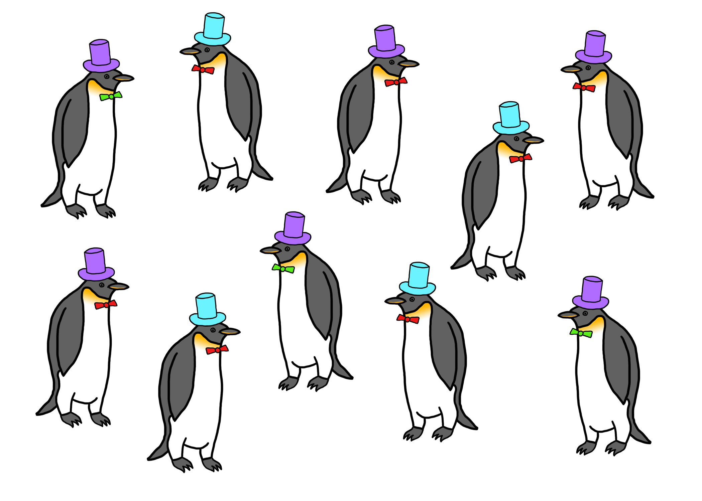
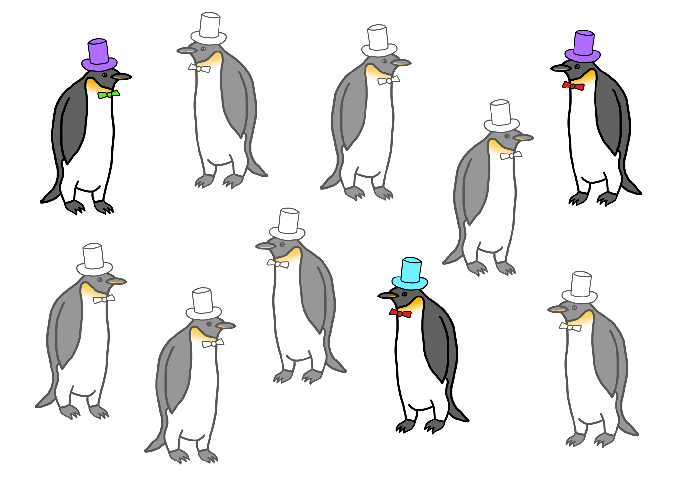
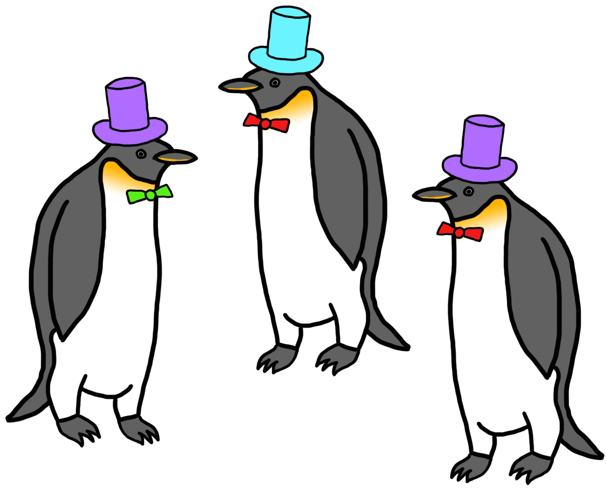

## 6\. 推理：入门

推理是数据分析中许多可能目标之一，因此值得讨论究竟是什么意思。回顾之前我们描述过的数据分析中六种问题之一是**推理性**问题。那么什么是推理呢？

通常，推理的目标是能够对*未观察到*的事物进行陈述，并且理想情况下能够表征您对该陈述的任何不确定性。推理是困难的，因为您能够观察到的事物与您最终想要了解的事物之间存在差异。

### 6.1 确定总体

推理的语言可能会根据应用而变化，但最常见的是，我们将那些我们无法观察到（但想了解的）事物称为**总体**或总体特征，而我们观察到的数据称为**样本**。目标是使用样本来对总体进行某种陈述。为了做到这一点，我们需要指定一些东西。

确定总体是最重要的任务。如果您无法连贯地识别或描述总体，那么您就无法进行推理。停止。一旦您弄清楚了总体是什么以及您想对总体的哪个特征进行陈述（例如，均值），那么您随后可以将其转化为更具体的陈述，使用正式的统计模型（本书后面介绍）。

### 6.2 描述抽样过程

数据是如何从总体传输到您的计算机的？能够描述这个过程对于确定数据是否有用于对总体特征进行推理是很重要的。举一个极端的例子，如果您对人口中女性的平均年龄感兴趣，但您的抽样过程以某种方式设计，使其只产生关于男性的数据，那么您就不能使用这些数据对女性的平均年龄进行推理。了解抽样过程对于确定您的样本是否*代表*您感兴趣的总体至关重要。请注意，如果您难以描述总体，您将难以描述从总体中抽取数据的过程。因此，描述抽样过程取决于您能否连贯地描述总体。

### 6.3 描述总体模型

我们需要对总体元素之间的关系进行抽象表示。通常，这以我们可以使用数学符号表示的统计模型的形式出现。然而，在更复杂的情况下，我们可能会诉诸于无法在纸上整洁书写的算法表示（许多机器学习方法必须以这种方式描述）。最简单的模型可能是*简单线性模型*，例如

在这里， 和  是人口的特征，而  和  描述了这些特征之间的关系（即它们是正相关还是负相关？）。最后一个元素  是一个包罗万象的东西，旨在捕捉导致  与我们 *期望*  之间差异的所有因素，即 。正是这最后一部分使得该模型成为一个统计模型，因为我们通常允许  是随机的。

另一个我们通常需要假设的特征是人口中不同单位之间的相互作用方式。通常情况下，如果没有任何额外信息，我们会假设人口中的单位是*独立*的，这意味着一个单位的测量结果不会提供关于另一个单位的测量结果的任何信息。最好情况下，这种假设是大致成立的，但它可能是一个有用的近似。在一些情况下，比如研究空间或时间上紧密相连的事物时，这个假设显然是错误的，我们必须采取特殊的建模方法来解释缺乏独立性。

统计学家乔治·巴克斯（George Box）[曾说过](https://en.wikipedia.org/wiki/All_models_are_wrong)“所有模型都是错误的，但有些是有用的”。无论你为描述人口特征设计了什么样的模型，它都是技术上错误的。但你不应该执着于开发一个*正确*的模型；相反，你应该确定一个对你有用并且能讲述关于数据以及你试图研究的基本过程的模型。

### 6.4 快速示例

考虑下面这群企鹅（因为企鹅太棒了），每只企鹅都戴着紫色或蓝绿色帽子。这个群体总共有 10 只企鹅。我们称它们为*人口*。

戴着蓝绿色和紫色帽子的企鹅人口

现在假设你想知道企鹅人口中穿蓝绿色帽子的比例。但有一个问题—你没有时间、金钱或能力照顾 10 只企鹅。谁有？你只能负担得起照顾三只企鹅，所以你随机抽样了这 10 只企鹅中的三只。

三只企鹅的样本

关键点在于你从未观察过企鹅的完整人口。现在你得到的是你的 *数据集*，其中只包含三只企鹅。

企鹅的数据集

此时，一个容易问的问题是“我的数据集中有多少企鹅戴着绿松石帽子？”从上面的图片可以看出，1/3 的企鹅戴着绿松石帽子。我们对这个比例*毫无疑问*，因为数据就在我们面前。

要问的难题是“根据我手头的数据，原始人口中戴着绿松石帽子的企鹅比例是多少？”此时，我们只有我们的三只企鹅样本，没有观察到整个人口。我们能做什么？我们需要利用手头的数据对人口进行*推断*。

我们需要做的三件事情是：

1.  **定义人口**。在这里，人口是我们抽样得到的三只企鹅的原始 10 只企鹅。

1.  **描述抽样过程**。我们还没有明确提到这一点，但暂时假设我们的“抽样过程”是选择走向我们的前三只企鹅。

1.  **描述人口模型**。我们将假设企鹅戴的帽子是*独立*的，因此一只企鹅戴紫色帽子不会影响另一只企鹅是否戴绿松石帽子。由于我们只想估计戴绿松石帽子的企鹅的简单比例，我们不需要对企鹅之间的关系做出更复杂的假设。

给定上述三个要素，我们可能估计戴着绿松石帽子的企鹅比例为 1/3。这个估计有多好？考虑到我们知道这里的真相——人口中有 2/5 的企鹅戴着绿松石帽子——我们可以问 1/3 是否是一个合理的估计。这个问题的答案取决于将在下一节讨论的各种因素。

### 6.5 影响推断质量的因素

影响你可能做出的推断质量的关键因素与我们对抽样过程和人口模型的思考违反有关。显然，如果我们无法明确定义人口，那么我们对人口所做的任何“推断”将同样模糊定义。

如果我们对抽样过程的理解出现违反，那么我们收集的数据将不会像我们想象的那样代表人口。这将影响我们的推断，因为我们所做的推断将不适用于整个人口，而是适用于人口的特定选择。这种现象有时被称为**选择偏差**，因为你估计的数量偏向于你*抽样到的*人口的选择。

我们为人口假设的模型违反可能导致我们估计人口特征之间的关系错误或低估我们估计的不确定性。例如，如果企鹅确实能影响其他企鹅穿什么颜色的帽子，那么这将违反企鹅之间独立的假设。这将导致我们从数据中进行的任何估计的不确定性增加。一般来说，人口中单位之间的依赖关系会减少数据集的“有效样本量”，因为你观察到的单位并不真正独立于彼此，也不代表独立的信息位。

我们从数据中得出的估计与人口真相之间的差异的最后一个原因是**抽样变异性**。因为我们从人口中随机抽取了企鹅，所以如果我们再次进行实验并抽取另外三只企鹅，很可能会得到一个不同的估计结果，这仅仅是由于抽样过程中的随机变异。即使我们对抽样过程的描述准确，对人口的模型也是完美的。

在大多数情况下，我们从数据中得出的估计与人口真相之间的差异可以通过这三个因素的组合来解释。每个因素在特定问题中扮演的角色有时可能很难确定，因为缺乏信息，但通常值得思考这三个因素中的每一个，并决定哪一个可能起主导作用。这样一来，人们可能能够纠正问题，例如，在未来的研究或实验中。

### 6.6 示例：苹果音乐使用情况

在 2015 年 8 月 18 日，消费者市场研究公司 MusicWatch [发布了一项关于苹果公司推出的新音乐服务](http://www.businesswire.com/news/home/20150818005755/en#.VddbR7Scy6F)的研究。该服务是一种新的流媒体音乐服务，旨在为用户提供每月 9.99 美元的大量音乐目录的流媒体访问。但是，有一个持续 3 个月的免费试用期。当时，人们对免费试用期结束后最终有多少用户会继续支付每月 9.99 美元存在很多猜测。

MusicWatch 的研究声称，除其他内容外，

> 在尝试过苹果音乐的人中，48％的人报告称他们目前没有使用该服务。

这表明几乎有一半的试用苹果音乐免费试用期的人并不想继续使用它，一旦试用结束，他们很可能不会为其付费。如果这是真的，那将是对这项新推出的服务的一次打击。

但是 MusicWatch 是如何得出这个数字的呢？它声称在研究中对 5000 人进行了调查。就在 MusicWatch 发布调查之前不久，苹果声称约有 1100 万人注册了他们的新 Apple Music 服务（因为服务刚刚推出，所有注册的人都在免费试用期）。显然，5000 人并不能代表整个人口，所以我们只有一个很小的用户样本。

MusicWatch 试图回答的目标是什么？看起来他们想知道仍在使用该服务的*所有注册 Apple Music 用户*的百分比。因为调查所有 1100 万人将会非常昂贵，所以他们不得不使用一个远远较小的样本人群 5000。他们能从这个 5000 人的样本中推断出整个人口的情况吗？

让我们考虑推断的三个要素：

1.  **人口**：我们对整个 Apple Music 用户群的行为感兴趣，据苹果称，该用户群约有 1100 万人。

1.  **抽样过程**：新闻稿中并没有说明研究是如何进行的以及数据是如何收集的。很可能这是一项电话调查，因此人们被随机选择接受电话并被问及他们对该服务的使用情况。你认为这个过程是否导致了一个代表整个 Apple Music 用户群的受访者样本？

1.  **人口模型**：鉴于样本相对于整个人口的规模相对较小，很可能可以认为调查中的个体彼此独立。换句话说，调查中的一个受访者不太可能影响到另一个受访者。

如果样本具有代表性且个体独立，我们可以使用 48% 这个数字作为不再使用该服务的人口中的百分比的估计值。MusicWatch 的新闻稿没有说明不确定性的度量，因此我们不知道这个数字的可靠性如何。

有趣的是，MusicWatch 调查发布后不久，苹果向《The Verge》发布了一份声明，称注册用户中有 79% 仍在使用该服务（即仅有 21% 停止使用，而不是 MusicWatch 报告的 48%）。现在，苹果和 MusicWatch 的区别在于苹果可以轻松获得整个 Apple Music 用户群的数据。如果他们想知道使用该服务的用户群的百分比，他们只需要统计该服务的活跃用户数量并除以注册用户的总数。关于这个特定数字，没有任何不确定性，因为不需要抽样来估计它（我假设苹果没有使用抽样来估计百分比）。

如果我们相信苹果和 MusicWatch 在其分析中测量的是同一件事（并不清楚他们是否是这样做的），那么它会暗示 MusicWatch 对人口百分比（48%）的估计相当偏离真实值（21%）。是什么导致了这么大的差异呢？

1.  **随机变动**。MusicWatch 的调查相对于整个人口是一个小样本，但样本仍然很大，有 5000 人。此外，分析相当简单（只需计算仍在使用服务的用户比例），因此与该估计相关的不确定性不太可能很大。

1.  **选择偏差**。回想一下，MusicWatch 如何抽样其调查对象并不清楚，但他们可能是以某种方式进行抽样，导致他们捕捉到一组更不倾向于使用 Apple Music 的调查对象。除此之外，我们没有了解调查过程的细节，所以无法进一步发表评论。

1.  **测量差异**。我们不知道 MusicWatch 或 Apple 如何定义“仍在使用该服务”。你可以想象有各种各样的方式来确定一个人是否仍在使用该服务。你可以问“你上周使用过吗？”或者“你昨天使用过吗？”对这些问题的回答会有很大不同，并且可能导致不同的整体使用百分比。

1.  **调查对象不独立**。可能调查对象彼此不独立。这主要会影响估计的不确定性，使其比我们预期的要大，如果调查对象全部是独立的话。然而，由于我们不知道 MusicWatch 对其估计的不确定性是多少，因此很难判断调查对象之间的依赖关系是否会起作用。

### 6.7 人口呈现多种形式

有各种各样的策略可以用来建立一个制定推断性陈述的正式框架。通常，确实存在一个单位的人口（例如人，企鹅等），你希望对其进行陈述。在这些情况下，不确定性的来源是清楚的（从人口中抽样），你要估计的确切是什么也是清楚的（人口的某些特征）。然而，在其他应用中，可能不太清楚人口究竟是什么，你要估计的确切是什么。在这种情况下，你将不得不更明确地定义人口，因为可能存在多种可能性。

#### 时间序列

一些过程是随时间测量的（每分钟，每天等）。例如，我们可能有兴趣分析包括苹果 2014 年日历年度收盘股价的数据。如果我们想从这个数据集中进行推断，人口会是什么呢？有几种可能性。

1.  我们可以认为，2014 年是从*所有可能的年份*数据中随机抽样得到的，因此我们所做的推断适用于股价的其他年份。

1.  我们可以说苹果公司的股票代表了*整个股票市场*的一个样本，因此我们可以从这个数据集中对*其他股票*进行推断。

无论你选择什么，都很重要在你尝试从数据中做推断之前明确你所指的总体是什么。

#### 自然过程

自然现象，如地震、火灾、飓风、与天气相关的现象以及其他自然事件，通常会随着时间和空间记录下来。对于纯粹的时间测量，我们可能会以与上述时间序列示例相同的方式定义总体。然而，我们可能只有空间上的数据。例如，我们可能有一个记录了某个区域发生的所有地震震中的地图。那么总体是什么？一种常见的方法是说存在一个*未被观察到的随机过程*，它会将地震随机地落在该区域上，并且我们的数据代表这一过程的随机样本。在这种情况下，我们使用数据试图更多地了解这个未被观察到的过程。

#### 数据作为总体

一种始终可行但不常用的技术是将数据集视为总体。在这种情况下，没有推断，因为没有抽样。因为你的数据集*就是*总体，所以对总体的任何特征都没有不确定性。这可能听起来不像是一种有用的策略，但在某些情况下，它可以用来回答重要问题。特别是在我们不关心数据集外的事情的情况下。

例如，在组织中分析薪资数据以确保女性不会因为相同的工作而薪资低于男性，或者不会存在不同族裔员工之间的重大不平衡，这是很常见的。在这种情况下，可以在数据集中计算不同群体之间的薪资差异，并查看这些差异是否足够大到需要关注。重点是数据直接回答了一个感兴趣的问题，即“是否存在需要解决的大的薪资差异？”在这种情况下，不需要对组织外的员工（按定义没有）或对您无法控制的其他组织的员工进行推断。数据集即是总体，对总体的任何问题的答案都在该数据集中。
