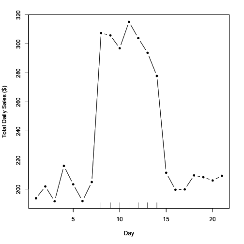
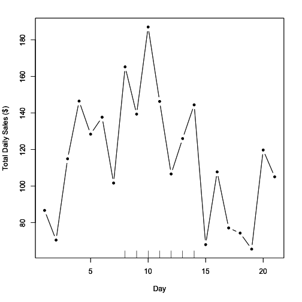
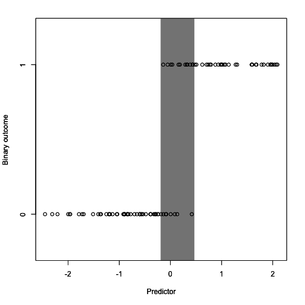
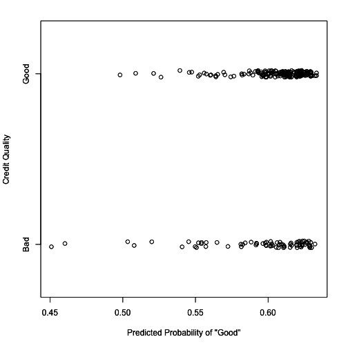

## 7.形式建模

> 形式模型对于深刻的思考非常有用，通常几乎是，如果不是绝对必需的。 ——D.R.科克斯

这一章通常是统计教科书或课程中人们往往遇到障碍的部分。 特别是，通常会有很多数学。 数学是好的，但是没有意义的数学不好。 我们不赞成这种做法。

重要的是要意识到，通常使用数学符号来表示模型是有用的，因为它是一种紧凑的表示，并且一旦您习惯了它，就很容易解释。 此外，使用数学符号写出统计模型，而不是只使用自然语言，迫使您对模型的描述和您试图实现的目标（例如估计参数）进行精确描述。

### 7.1 形式建模的目标是什么？

形式建模的一个关键目标是制定您的问题的精确规范以及您的数据如何用于回答该问题。 形式模型使您能够清楚地确定您试图从数据中推断出什么以及人口特征之间的关系采取何种形式。 仅仅使用文字很难达到这种精确度。

参数在许多形式统计模型（在统计语言中，这些称为*参数统计模型*）中起着重要作用。 这些是我们用来表示存在于人口中的特征或关联的数字。 因为它们代表人口特征，参数通常被认为是未知的，我们的目标是从我们收集的数据中估计它们。

例如，假设我们想评估一个人每天消耗的苏打水盎司数与该人的 BMI 之间的关系。 您可能绘制的表示这种关系的线的斜率是您要估计的参数，以回答您的问题：“每多消耗一盎司苏打水，BMI 预计会增加多少？” 更具体地说，您正在使用*线性回归模型*来阐述这个问题。

形式建模的另一个目标是制定一个严密的框架，用于挑战和测试您的主要结果。 在数据分析的这一阶段，您已经陈述并完善了您的问题，您已经通过视觉探索了数据，也许进行了一些探索性建模。 关键是您可能对您问题的答案有了相当好的感觉，但可能对您的发现是否经得起严密审查存在一些疑虑。 假设您仍然有兴趣继续进行您的结果，这就是形式建模可以发挥重要作用的地方。

### 7.2 通用框架

我们可以将分析的基本挽轮应用于数据分析的形式建模部分。 我们仍然希望设定期望，收集信息，并根据数据调整我们的期望。 在这种情况下，这三个阶段如下所示。

1.  **设定期望**。设定期望的形式是开发一个*主要模型*，该模型代表您对问题答案的最佳感知。此模型是根据您目前可用的任何信息选择的。

1.  **收集信息**。一旦确定了主要模型，我们将希望创建一组次要模型，以某种方式挑战主要模型。我们将在下面讨论这意味着什么的示例。

1.  **修订期望**。如果我们的次要模型成功挑战了我们的主要模型，并使主要模型的结论受到某些怀疑，那么我们可能需要调整或修改主要模型，以更好地反映我们从次要模型中学到的东西。

#### 主要模型

通常从一个*主要模型*开始是很有用的。这个模型可能源自您已经进行的任何探索性分析，并将作为简明地总结您的结果并与您的期望相匹配的主要候选人。重要的是要意识到，在数据分析的任何给定时刻，主要模型不一定是最终模型。它只是您将与其他次要模型进行比较的模型。将您的模型与其他次要模型进行比较的过程通常称为*敏感性分析*，因为您对您的模型对变化的敏感程度感兴趣，例如添加或删除预测变量或删除数据中的异常值。

通过正式建模的迭代过程，您可能会决定其他模型更适合作为主要模型。这是可以的，并且是根据数据设定期望、收集信息并根据数据调整期望的过程的一部分。

#### 次要模型

一旦您确定了主要模型，通常会制定一系列次要模型。这些模型的目的是测试您的主要模型的合法性和鲁棒性，并可能产生反对您主要模型的证据。如果次要模型成功生成了证据来反驳您主要模型的结论，那么您可能需要重新审视主要模型以及其结论是否仍然合理。

### 7.3 关联分析

关联分析是指我们在其他潜在混杂因素存在的情况下，查看两个或更多特征之间的关联。在关联分析中思考的三类变量是重要的。

1.  **结果**。结果是您数据集中认为会随着您**关键预测变量**而变化的特征。即使您没有提出因果或机械性问题，因此您并不一定认为结果*响应*于关键预测变量的变化，大多数正式建模方法仍需要定义结果。

1.  **关键预测因子**。通常对于关联分析，有一个关键的感兴趣的预测因子（可能有几个）。我们想知道结果如何随着这个关键预测因子的变化而变化。然而，我们对该关系的理解可能会受到潜在混杂因素的影响。

1.  **潜在混杂因素**。这是一大类与关键预测因子和结果都相关的预测因子。重要的是要充分了解这些因素以及它们是否在您的数据集中可用。如果数据集中缺少关键混杂因素，有时会有与该关键混杂因素相关的代理可供替代。

一旦您在数据集中识别了这三类变量，就可以开始思考关联设置中的形式建模。

关联分析中模型的基本形式将是


其中

+    是结果

+    是关键预测因子

+    是一个潜在混杂因素

+    是独立随机误差

+    是截距，即当  且  时的值 

+    表示  的变化与  的 1 单位增加相关联，调整为 。

+    表示  的变化与  的 1 单位增加相关联，调整为 

这是一个线性模型，我们的主要兴趣在于估计系数 ，该系数量化了关键预测因子  与结果  之间的关系。

即使我们必须在估计  的过程中估计  和 ，但我们并不真正关心这些  和  的值。在统计文献中，像  和  这样的系数有时被称为*干扰参数*，因为我们必须使用数据来估计它们以完成模型规范，但我们实际上并不关心它们的值。

上面显示的模型可以被认为是主要模型。该模型中有一个关键预测因子和一个混杂因素，在这个模型中，也许众所周知你应该调整这个混杂因素。该模型可能会产生合理的结果，并且遵循该领域通常已知的知识。

#### 示例：在线广告活动

假设我们在网络上销售一种新产品，并且我们想知道在 Facebook 上购买广告是否有助于增加该产品的销售量。首先，我们可能会在 Facebook 上启动为期一周的试点广告活动，并评估该活动的成功。如果成功，我们可能会继续购买该产品的广告。

一个简单的方法可能是在广告活动之前、期间和之后跟踪每日销售情况（请注意，使用跟踪 URL 和 Google Analytics 有更精确的方法，但现在让我们搁置这个问题）。简单来说，如果广告活动持续一周，我们可以查看之前的一周、期间的一周和之后的一周，看看每日销售是否有任何变化。

##### 期望

在理想的世界中，数据可能看起来像这样。



假设的广告活动

x 轴上的刻度标记表示广告活动进行的时间段。在这种情况下，很明显广告活动对销售额产生了什么影响。仅凭肉眼，就能看出广告活动每天大约增加了总销售额的$100。您的主要模型可能是这样的


其中  是每日总销售额， 是一个指示器，指示给定日期是否在广告活动期间。上图情节的假设数据可能如下所示。

```
 sales campaign day
`1`  `193.7355`        `0`   `1`
`2`  `201.8364`        `0`   `2`
`3`  `191.6437`        `0`   `3`
`4`  `215.9528`        `0`   `4`
`5`  `203.2951`        `0`   `5`
`6`  `191.7953`        `0`   `6`
`7`  `204.8743`        `0`   `7`
`8`  `307.3832`        `1`   `8`
`9`  `305.7578`        `1`   `9`
`10` `296.9461`        `1`  `10`
`11` `315.1178`        `1`  `11`
`12` `303.8984`        `1`  `12`
`13` `293.7876`        `1`  `13`
`14` `277.8530`        `1`  `14`
`15` `211.2493`        `0`  `15`
`16` `199.5507`        `0`  `16`
`17` `199.8381`        `0`  `17`
`18` `209.4384`        `0`  `18`
`19` `208.2122`        `0`  `19`
`20` `205.9390`        `0`  `20`
`21` `209.1898`        `0`  `21` 
```

`根据给定的数据和上述主要模型，我们估计  为 $96.78，这与我们最初猜测的 $100 相差不远。

**设定期望**。讨论这种理想情况很重要，不是因为它可能发生，而是因为它指导我们了解如果世界按照一个更简单的框架运行，我们会*期望*看到什么，并且我们将如何在这些期望下分析数据。

##### 更现实的数据

不幸的是，我们很少看到像上图那样的数据。实际上，效果大小往往较小，噪音往往较大，并且往往存在其他因素。通常，数据会看起来像这样。



更真实的每日销售数据

尽管在广告活动期间销售额似乎有所增加（再次用刻度标记表示），但很难说这种增加的销售额是由广告活动所引起的。事实上，在广告活动开始前的几天，销售额似乎有所增加。这是偶然发生的还是背景中还有其他趋势？可能有一个平滑的背景趋势，使得每日销售额在整个月份内上下波动。因此，即使没有广告活动，我们也可能会看到销售额的增加。现在的问题是广告活动是否在这种现有的背景趋势之上增加了每日销售额。

让我们使用我们的主要模型，该模型只包括结果和我们的广告活动指示器作为关键预测变量。使用该模型，我们估计每日销售额增加的  为$44.75。

但是，假设我们在模型中加入了一个背景趋势，所以我们不再使用我们的原始模型，而是拟合以下模型。


这里  现在表示天数（即 ）。我们所做的是在模型中添加了  的二次函数，以允许趋势中的一些曲率（而不是只允许严格递增或递减的线性函数）。使用这个模型，我们估计  为$39.86，略低于主要模型对  的估计。

我们可以拟合一个最终模型，该模型允许更灵活的背景趋势——我们使用一个四次多项式来表示该趋势。虽然我们可能认为我们的二次模型已经足够复杂，但是这个最后一个模型的目的只是为了稍微推动一下边界，看看在更极端的情况下事情会如何变化。这个模型给我们提供了一个估计值为$49.1，实际上比我们的主要模型的估计值要大。

在这一点上，我们有一个主要模型和两个次要模型，它们对我们的广告活动和每日总销售之间的关联提供了略有不同的估计。

| 模型 | 特征 |  估计值 |
| --- | --- | --- |
| 模型 1（主要） | 无混杂因素 | $44.75 |
| 模型 2（次要） | 二次时间趋势 | $39.86 |
| 模型 3（次要） | 4 阶时间趋势 | $49.1 |

##### 评估

确定接下来要做什么可能取决于数据集之外的因素。一些典型的考虑因素是

1.  **效应大小**。三个模型提供了从 $39.86 到 $49.1 的一系列估计值。这是一个很大的范围吗？对于您的组织来说，这种幅度的范围可能不够大，无法产生实质性的差异，因此所有模型都可能被视为等价。或者您可能认为这 3 个估计值彼此之间存在显著差异，这种情况下，您可能会更加重视某个模型。另一个因素可能是广告活动的成本，在这种情况下，您将对广告投资的回报感兴趣。如果每天的总广告费用为 $10，那么每天增加 $39.86 可能是值得的，但如果每天的费用为 $20，也许不值得。那么，您可能需要销售额的增长更高才能使广告活动值得。这里的关键是，您的正式模型显示，广告活动可能仅将您的总日销售额增加 $39.86，但其他证据表明可能更高。问题是，您是否认为冒更多广告风险是值得的，考虑到各种可能性，或者您是否认为即使在更高端，这可能也不值得。

1.  **可信度**。尽管您可能会为挑战主要模型而适应一系列模型，但某些模型可能比其他模型更可信，因为它们更接近人口的“真相”。在这里，具有二次趋势的模型似乎是可信的，因为它能够捕捉数据中可能存在的上升和下降模式。具有四阶多项式的模型同样能够捕捉到这种模式，但似乎过于复杂，无法描述这样一个简单的模式。模型是否被认为更可信将取决于您对主题知识的了解以及您将现实世界事件映射到模型数学表述的能力。您可能需要咨询该领域的其他专家以评估各种模型的可信度。

1.  **简约原则**。 在不同模型都讲述同样故事的情况下（即估计值  足够接近，可以被认为是“相同的”），通常更倾向于选择最简单的模型。这样做有两个原因。首先，使用简单模型更容易通过模型中的各种参数讲述数据背后的故事。例如，解释线性趋势比解释指数趋势更容易。其次，从统计学的角度来看，简单模型更“高效”，因此它们更好地利用了正在估计的每个参数的数据。统计模型的复杂性通常指的是模型中的参数数量 - 在这个例子中，主要模型有 2 个参数，而最复杂的模型有 6 个参数。如果没有模型比另一个模型产生更好的结果，我们可能更喜欢一个只包含 2 个参数的模型，因为它更容易描述并且更简洁。如果主要模型和次要模型产生显著差异，则可能会选择简约模型而不是更复杂的模型，但是如果更复杂的模型讲述了更引人入胜的故事，则不会选择简约模型。

### 7.4 预测分析

在前一节中，我们描述了关联分析，其目标是查看关键预测变量  和结果  是否相关。但有时，目标是利用您可用的所有信息来预测 。此外，如果变量在因果关系上与您想要预测的结果被认为不相关，也没有关系，因为目标是预测，而不是开发关于特征之间关系的理解。

在预测模型中，我们有结果变量 - 我们想要进行预测的特征 - 但我们通常不区分“关键预测变量”和其他预测变量。在大多数情况下，任何可能有助于预测结果的预测变量都将在分析中被考虑，并且可能会根据其在预测结果中的重要性被 *a priori* 地赋予相等的权重。预测分析通常将决定每个预测变量的重要性以及确定模型的功能形式留给预测算法。

对于许多预测分析，通常无法简单地写出用于预测的模型，因为它不能用标准数学符号表示。许多现代预测程序被构建为算法或过程，它们接受输入并将其转换为输出。输入经过转换为输出的路径可能是高度非线性的，并且在途中预测器可能与其他预测器相互作用。通常，我们没有感兴趣的参数需要估计——事实上，许多算法过程根本没有可估计的参数。

在进行预测分析时需要记住的关键是，我们通常不关心模型的具体细节。在大多数情况下，只要方法“有效”，可重复，并且以最小误差产生良好的预测，那么我们就达到了我们的目标。

在预测分析中，您进行的确切分析类型取决于结果的性质（就像所有分析一样）。预测问题通常以**分类问题**的形式出现，其中结果是二元的。在某些情况下，结果可以取多于两个水平，但二元情况远远最为常见。在本节中，我们将专注于二元分类问题。

##### 期望

在预测问题中，理想场景是什么？一般来说，我们希望预测器或一组预测器在结果中产生*良好的分离*。以下是一个单一预测器在二元结果中产生合理分离的示例。



理想分类场景

结果取值为 0 和 1，而预测器是连续的，取值大致在-2 到 2 之间。在绘图中显示的灰色区域突出显示了预测器的值可以取 0 或 1 的区域。在灰色区域的右侧，您会注意到结果值始终为 1，而在灰色区域的左侧，结果值始终为 0。在预测问题中，正是在这个灰色区域我们对结果的不确定性最大，给定了预测器的值。

大多数预测问题的目标是识别一组预测因子，使上图中的灰色区域尽可能小。令人费解的是，通常要确定（特别是分类的）预测因子，以便*完全分离*结果，以便灰色区域减少到零。然而，这种情况通常表明一个退化的问题，并不是很有趣，甚至是数据上的错误。例如，将一个已经二分的连续变量作为模型中的预测因子，将其连续的对应物作为结果，会完全分离。在现实世界的数据中，当测量已知通过机械性或某些确定性过程相互关联的特征或特性时，可能会看到几乎完全分离的情况。例如，如果结果是一个人患卵巢癌的指标，那么人的性别可能是一个非常好的预测因子，但这对我们来说可能不是一个非常感兴趣的因素。

##### 真实世界数据

对于这个示例，我们将使用有关个人信用价值的数据。该数据集来自[UCI 机器学习仓库](https://archive.ics.uci.edu/ml/datasets/Statlog+(German+Credit+Data))。数据集将个人分类为“良好”或“不良”信用风险，并包含可能预测信用价值的各种预测因子。数据集中共有 1000 个观察值和 62 个特征。出于本文目的，我们省略了此示例的代码，但代码文件可以从本书的网站上获取。

预测问题的第一件事是将数据分为训练数据集和测试数据集。训练数据集用于开发和拟合模型，测试数据集用于评估我们拟合的模型并估计其错误率。在本例中，我们使用随机选择的 75%观察值作为训练数据集。其余 25%将作为测试数据集。

在将模型拟合到训练数据集后，我们可以计算测试数据集中具有“良好”信用的预测概率。我们将这些预测概率绘制在 x 轴上，并在下面的 y 轴上显示每个人的真实信用状态。（y 轴坐标已经随机抖动以显示更多细节。）



预测与真相

在这里，我们可以看到与理想情况下所见的良好分离不太相同。在预测概率范围内，有些人的信用既“良好”又“不良”。这表明我们采用的预测算法可能很难找到一种良好的特征组合，可以区分信用良好和不良的人。

我们可以计算关于预测算法的一些摘要统计数据如下。

```
Confusion Matrix and Statistics

          Reference
Prediction Bad Good
      Bad    `2`    `1`
      Good  `73`  `174`

               Accuracy `:` `0.704`           
                 `95`% CI `:` `(``0.6432``,` `0.7599``)`
    No Information Rate `:` `0.7`             
    P`-`Value `[`Acc `>` NIR`]` `:` `0.4762`          

                  Kappa `:` `0.0289`          
 Mcnemar`'s Test P-Value : <2e-16` 

 `Sensitivity : 0.99429` 
 `Specificity : 0.02667` 
 `Pos Pred Value : 0.70445` 
 `Neg Pred Value : 0.66667` 
 `Prevalence : 0.70000` 
 `Detection Rate : 0.69600` 
 `Detection Prevalence : 0.98800` 
 `Balanced Accuracy : 0.51048` 

 `'`Positive`'` `Class : Good` 
```

`我们可以看到准确率约为 70%，对于大多数预测算法来说并不理想。特别是，算法的特异性非常差，这意味着如果你是一个“坏”信用风险，你被归类为这样的概率仅约为 2.6%。

##### 评估

对于预测问题，在初始模型拟合后决定下一步的步骤可能取决于一些因素。

1.  **预测质量**。模型的准确性是否足够满足你的目的？这取决于最终目标和随后行动的风险。对于医疗应用，其中结果可能是疾病的存在，我们可能希望具有很高的敏感性，以便如果你确实患有疾病，算法会检测到它。这样我们就能迅速让你接受治疗。然而，如果治疗非常痛苦，可能会有很多副作用，那么我们实际上可能更喜欢高特异性，这将确保我们不会错误地治疗*不*患有疾病的人。对于金融应用，比如这里使用的信用价值示例，可能存在将好信用误认为坏信用与将坏信用误认为好信用之间的非对称成本。

1.  **模型调整**。预测算法的一个特点是它们有许多调节参数。有时，如果这些参数被更改，它们可能对预测质量产生很大影响，因此重要的是要了解你使用的任何算法的调节参数的影响。没有一种预测算法适用于所有问题的单一调节参数集。最有可能的是，对于初始模型拟合，你将使用“默认”参数，但这些默认参数可能不足以满足你的目的。调整调节参数可能会大大改变你的预测质量。非常重要的是，你记录这些调节参数的值，以便将来能够重现分析。

1.  **其他数据的可用性**。许多预测算法非常擅长探索大型和复杂数据集的结构，并确定一个最能预测你的结果的结构。如果你发现你的模型即使在调整了调节参数后仍然表现不佳，那么很可能是你需要额外的数据来改进你的预测。

### 7.5 总结

正式建模通常是数据分析中最技术化的部分，其目的是准确阐明分析的目标，并为挑战你的发现和测试你的假设提供严格的框架。你采取的方法可能会有所不同，主要取决于你的问题是否基本上是关于估计关联或开发良好的预测。
