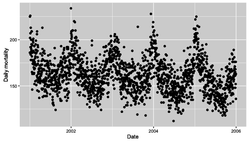
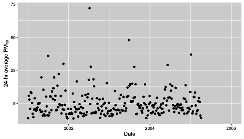
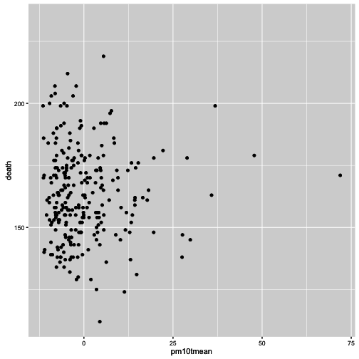
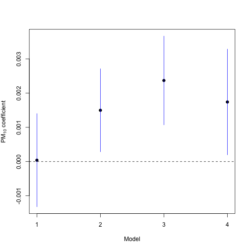
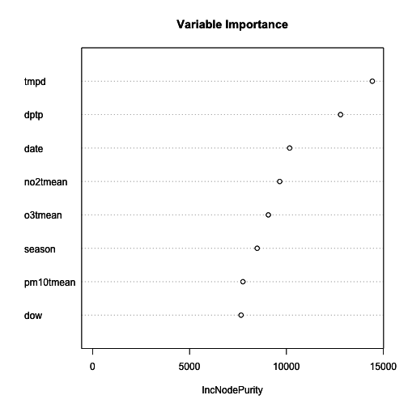

## 推断与预测：对建模策略的影响

弄清楚你是回答推断性问题还是预测性问题是一个重要的概念，因为你回答的问题类型可以极大地影响你采取的建模策略。如果你没有清楚地理解你正在问的是哪种类型的问题，你可能最终会使用错误的建模方法，并从数据中得出错误的结论。本章的目的是向您展示当您混淆一种问题为另一种问题时会发生什么。

需要记住的关键事项是：

1.  对于**推断性问题**，目标通常是估计感兴趣的预测变量与结果之间的关联。通常只有少数几个感兴趣的预测变量（甚至只有一个），但通常有许多潜在的混杂变量需要考虑。建模的关键目标是在确保适当调整任何潜在混杂变量的同时估计一个关联。通常，会进行敏感性分析，以查看感兴趣的关联是否对不同的混杂变量集合稳健。

1.  对于**预测问题**，目标是识别一个*最佳预测*结果的模型。通常，我们不会对预测变量给予*先验*重要性，只要它们能够很好地预测结果即可。我们不会考虑“混杂因素”或“感兴趣的预测变量”的概念，因为所有预测变量都可能有助于预测结果。此外，我们通常不关心“模型如何运作”或者讲述有关预测变量的详细故事。关键目标是开发一个具有良好预测能力的模型，并从数据中估计一个合理的错误率。

### 纽约市的空气污染和死亡率

下面的示例显示了不同类型的问题和相应的建模方法如何导致不同的结论。该示例使用了纽约市的空气污染和死亡数据。这些数据最初是作为 [国家发病率、死亡率和空气污染研究](http://www.ihapss.jhsph.edu)（NMMAPS）的一部分使用的。

以下是 2001 年至 2005 年所有原因的日均死亡率的绘图。



[纽约市 2001 年至 2005 年的日均死亡率](https://wiki.example.org/feynmans_learning_method)。

这里是小于或等于 10 微米的空气动力学直径的 24 小时平均颗粒物水平（PM10）的绘图。



纽约市 2001 年至 2005 年的日均 PM10 浓度

请注意，与死亡率数据的绘图相比，上面的绘图上的点要少得多。这是因为并非每天都测量 PM10。还要注意 PM10 绘图中有负值-这是因为 PM10 数据是经过均值减法处理的。通常情况下，PM10 的负值是不可能的。

### 推断一个关联

我们将采取的第一个方法是问：“每日 24 小时平均 PM10 水平和每日死亡率之间是否存在关联？”这是一个推理性的问题，我们试图估计一个关联。此外，对于这个问题，我们知道有一些潜在的混杂因素需要处理。

让我们来看看 PM10 和死亡率之间的双变量关系。这里是两个变量的散点图。



纽约市的 PM10 和死亡率

那里似乎没有太多事情发生，对日常死亡率和 PM10 的对数进行简单的线性回归模型似乎证实了这一点。

```
 Estimate   Std. Error      t value  Pr`(``>|``t``|``)`
`(`Intercept`)` `5.08884308354` `0.0069353779` `733.75138151` `0.0000000`
pm10tmean   `0.00004033446` `0.0006913941`   `0.05833786` `0.9535247` 
```

`在上面的系数表中，`pm10tmean`的系数非常小，其标准误相对较大。实际上，这个关联的估计值为零。

然而，我们对于 PM10 和日常死亡率都有相当多的了解，其中一件事情我们确实知道的是*季节*在这两个变量中起着重要作用。特别是，我们知道死亡率在冬天往往较高，在夏天较低。PM10 则显示出相反的模式，夏天较高，冬天较低。因为季节与*PM10*和死亡率都相关，所以它是一个很好的混杂因素的候选项，在模型中进行调整是有意义的。

这是第二个模型的结果，该模型包括 PM10 和季节。季节被包括为具有 4 个水平的指示变量。

```
 Estimate   Std. Error    t value     Pr`(``>|``t``|``)`
`(`Intercept`)`  `5.166484285` `0.0112629532` `458.714886` `0.000000e+00`
seasonQ2    `-0.109271301` `0.0166902948`  `-6.546996` `3.209291e-10`
seasonQ3    `-0.155503242` `0.0169729148`  `-9.161847` `1.736346e-17`
seasonQ4    `-0.060317619` `0.0167189714`  `-3.607735` `3.716291e-04`
pm10tmean    `0.001499111` `0.0006156902`   `2.434847` `1.558453e-02` 
```

`现在注意到，`pm10tmean`的系数比之前大得多，它的`t value`也很大，表明存在强烈的关联。这是怎么可能的呢？

结果我们在这里有一个经典的[Simpson 悖论](https://en.wikipedia.org/wiki/Simpson%27s_paradox)的例子。PM10 和死亡率之间的总体关系是零，但当我们考虑到死亡率和 PM10 的季节性变化时，关联是正的。令人惊讶的结果来自于季节与死亡率和 PM10 之间相反的方式。

到目前为止，我们已经考虑了季节，但还有其他潜在的混杂因素。特别是，气象变量，如温度和露点温度，也与 PM10 的形成和死亡率有关。

在下面的模型中，我们包括温度（`tmpd`）和露点温度（`dptp`）。我们还包括`date`变量，以防有任何需要考虑的长期趋势。

```
 Estimate    Std. Error    t value     Pr`(``>|``t``|``)`
`(`Intercept`)`  `5.62066568788` `0.16471183741` `34.1242365` `1.851690e-96`
date        `-0.00002984198` `0.00001315212` `-2.2689856` `2.411521e-02`
seasonQ2    `-0.05805970053` `0.02299356287` `-2.5250415` `1.218288e-02`
seasonQ3    `-0.07655519887` `0.02904104658` `-2.6361033` `8.906912e-03`
seasonQ4    `-0.03154694305` `0.01832712585` `-1.7213252` `8.641910e-02`
tmpd        `-0.00295931276` `0.00128835065` `-2.2969777` `2.244054e-02`
dptp         `0.00068342228` `0.00103489541`  `0.6603781` `5.096144e-01`
pm10tmean    `0.00237049992` `0.00065856022`  `3.5995189` `3.837886e-04` 
```

`注意，`pm10tmean`的系数甚至比之前的模型还要大。看起来 PM10 和死亡率之间仍然存在关联。效应大小很小，但我们稍后会讨论。

最后，另一类潜在混杂因素包括其他污染物。在我们归咎 PM10 为有害污染物之前，重要的是我们检查是否可能存在另一种污染物可以解释我们所观察到的情况。NO2 是一个很好的候选者，因为它与 PM10 具有部分相同的来源，并且已知与死亡率相关。让我们看看当我们将其纳入模型时会发生什么。

```
 Estimate    Std. Error    t value     Pr`(``>|``t``|``)`
`(`Intercept`)`  `5.61378604085` `0.16440280471` `34.1465345` `2.548704e-96`
date        `-0.00002973484` `0.00001312231` `-2.2659756` `2.430503e-02`
seasonQ2    `-0.05143935218` `0.02338034983` `-2.2001105` `2.871069e-02`
seasonQ3    `-0.06569205605` `0.02990520457` `-2.1966764` `2.895825e-02`
seasonQ4    `-0.02750381423` `0.01849165119` `-1.4873639` `1.381739e-01`
tmpd        `-0.00296833498` `0.00128542535` `-2.3092239` `2.174371e-02`
dptp         `0.00070306996` `0.00103262057`  `0.6808599` `4.965877e-01`
no2tmean     `0.00126556418` `0.00086229169`  `1.4676753` `1.434444e-01`
pm10tmean    `0.00174189857` `0.00078432327`  `2.2208937` `2.725117e-02` 
```

`请注意，在系数表中，`no2tmean`系数与`pm10tmean`系数的大小相似，尽管其`t 值`不如后者大。`pm10tmean`系数似乎具有统计学上的显着性，但现在在大小上略有减小。

下面是我们尝试的四个模型中所有模型的 PM10 系数的图。



PM10 与不同模型下死亡率之间的关联

除了没有考虑任何潜在混杂因素的模型 1 外，模型 2 至 4 之间似乎存在 PM10 与死亡率之间的正相关关系。这意味着什么以及我们应该采取什么行动取决于我们的最终目标，我们在这里不详细讨论。值得注意的是，效应大小通常很小，特别是与模型中的其他一些预测因子相比。然而，值得注意的是，据推测，纽约市的每个人都会呼吸，因此一个小小的效应可能会产生很大的影响。

### 8.3 预测结果

我们可以采取的另一种策略是询问：“什么最好地预测了纽约市的死亡率？”这显然是一个预测性的问题，我们可以利用手头的数据来构建一个模型。在这里，我们将使用[随机森林](https://en.wikipedia.org/wiki/Random_forest)建模策略，这是一种机器学习方法，当存在大量预测因子时表现良好。我们可以从随机森林过程中获得的一种类型的输出是*变量重要性*的度量。粗略地说，这个度量指示了给定变量对改善模型预测技巧的重要性。

下面是在拟合随机森林模型后获得的变量重要性图。x 轴上较大的值表示更大的重要性。



预测死亡率的随机森林变量重要性图

注意，变量`pm10tmean`在重要性列表中靠近底部。这是因为它对预测结果死亡率的贡献不大。在前一节中可以回顾到，效应大小似乎很小，这意味着它并没有真正解释死亡率的很大变异性。像温度和露点温度这样的预测因子对于每日死亡率的预测更有用。甚至连 NO2 也比 PM10 更好地预测。

然而，仅仅因为 PM10 不是死亡率的强预测因子，并不意味着它与死亡率没有相关联。考虑到开发预测模型时必须进行的权衡，PM10 并不是我们会包含在内的预测因子列表中的前几名--我们无法简单地包含每个预测因子。

### 8.4 总结

在任何数据分析中，你都要问自己：“我是在问一个推断性问题还是一个预测性问题？”在分析任何数据之前，这一点都应该被搞清楚，因为问题的答案可以指导整个建模策略。在这个例子中，如果我们决定采取预测方法，我们可能会错误地认为 PM10 与死亡率无关。然而，推断性方法却表明 PM10 与死亡率存在统计学上显著的关联。正确地构建问题，并应用适当的建模策略，可以在你从数据中得出的结论类型中起到重要作用。
