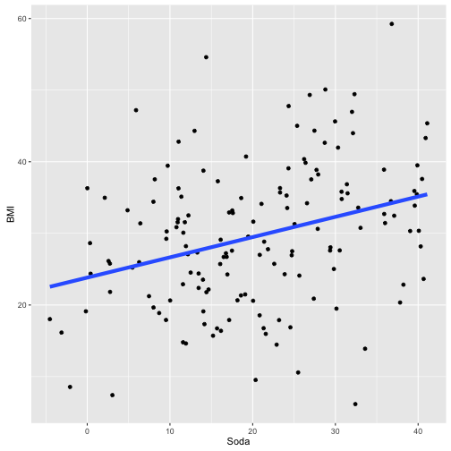

## 9\. 解释您的结果

虽然我们已经专门为数据分析结果的解释提供了一个完整的章节，但实际上解释是在整个分析过程中持续发生的。有经验的数据分析师可能甚至没有意识到他们多频繁地解释自己的发现，因为这已经成为他们的第二天性。

到目前为止，您对设置期望、收集信息（数据）然后将期望与数据匹配的三步环形过程应该非常熟悉，因此您会意识到第三步，将期望与数据匹配，本身就是解释。在某种程度上，我们已经在全书中讨论了解释结果的主题。然而，它值得拥有自己的章节，因为解释远不止于将期望与结果匹配，而且它本身就是数据分析的重要步骤。因为解释在完成主要和支持性分析之后（包括正式建模），但在沟通结果之前，我们将本章放在这些各自的章节之间。

### 9.1 解释原则

在本章中，我们将阐述几个解释结果的原则。这些原则是：

1.  重新审视您最初的问题

1.  从主要的统计模型开始，以了解您的方向并关注结果的性质，而不是对结果的二元评估（例如，统计显著与否）。结果的性质包括三个特征：其方向性、大小和不确定性。不确定性是评估结果是如何被偶然获得的。

1.  根据（a）您的分析总体和（b）已知主题的背景，制定整体解释。

1.  考虑其含义，这将指导您确定作为您问题答案的结果应采取的行动（如果有）。

需要注意的是，分析的本轮也适用于解释。在解释的每个步骤中，您应该在执行步骤之前有期望，并查看步骤的结果是否符合您的期望。您的期望是基于您在探索性数据分析和正式建模过程中学到的东西，当您的解释与期望不符时，您需要确定是否因为您的期望是不正确的还是您的解释是不正确的。即使在您正式解释结果时，您可能已经在数据分析的最后几个步骤之一上，您可能需要回到探索性数据分析或建模中，以使期望与数据匹配。

### 9.2 案例研究：非节食汽水消耗与体重指数

为了学习如何将解释原则应用于自己的数据分析，最好看到解释原则的实际应用，因此我们将使用一个案例研究来说明每个原则。

#### 重新审视问题

第一个原则是提醒自己最初的问题。这可能看起来像一个轻率的陈述，但是在进行探索性分析和形式化建模过程中，人们迷失方向并不罕见。当数据分析师在进行探索性数据分析或形式化建模过程中出现偶发性发现，并偏离了主题时，通常会发生这种情况。然后，最终的模型提供了对分析过程中出现的另一个问题的答案，而不是最初的问题。

回想你的问题也有助于提供你解释的框架。例如，你最初的问题可能是：“每天喝一听 12 盎司的汽水，美国成年人的平均 BMI 会增加多少？”问题的措辞告诉你，你最初的意图是确定在美国成年人中，每天平均喝两听 12 盎司的汽水的人的 BMI 比每天只喝一听 12 盎司的汽水的人的 BMI 要高多少。你对分析的解释应该得出这样的陈述：美国成年人每喝一罐额外的 12 盎司的汽水，BMI 平均增加 X kg/m²。但不应该得出这样的陈述：“每喝一盎司额外的汽水，美国成年人的 BMI 平均增加 X kg/m²。”

重新审视你的问题提供了解释结果的框架的另一种方式是，提醒自己你所问问题的类型为解释提供了明确的框架（参见陈述和细化问题以回顾问题的类型）。例如，如果你的问题是：“在美国成年人中，每天多喝一听非减肥汽水的人，平均 BMI 更高吗？”，这告诉你你的问题是一个*推断性*问题，并且你的目标是了解在美国成年人群中，每天多喝一听非减肥汽水对 BMI 的平均影响。为了回答这个问题，你可能已经使用了代表美国成年人群体的横断面数据进行了分析，在这种情况下，你对结果的解释是以每天多喝一听汽水对美国成年人群体的 BMI 的平均影响来表述的。

因为你的问题不是一个因果问题，因此你的分析也不是一个因果分析，结果不能用如果人群每天开始消耗一罐额外的汽水会发生什么来描述。一个*因果*问题可能是：“每天额外喝一份 12 盎司的非饮食汽水对 BMI 有什么影响？”，为了回答这个问题，你可以分析一个随机将一组人分配到多喝一罐汽水，另一组人分配到多喝一罐安慰剂饮料的临床试验的数据。这种类型的问题和分析的结果可以解释为每天额外喝一份 12 盎司的汽水对 BMI 的因果影响。因为分析是比较两组（汽水和安慰剂）在 BMI 上的平均效果，结果将被解释为在人群中的平均因果效应。

重新审视你最初的问题的第三个目的是暂停并考虑你回答问题的方法是否可能产生了一个**有偏见**的结果。虽然我们在陈述和精炼问题的章节中部分涉及了偏见，但有时在探索性数据分析和/或建模过程中获得新信息直接影响了你对结果可能存在偏见的评估。记住，偏见是指数据收集或分析中的系统问题，导致对问题的错误回答。

我们将使用汽水-BMI 的例子来说明偏见的一个更简单的例子。假设你关于汽水-BMI 关系的整体问题包括一个最初的问题，即“美国成年人每天平均饮用的非饮食汽水的数量是多少？”假设你的分析表明，在你正在分析的样本中，这个样本是美国所有成年人的样本，每天饮用 12 盎司非饮食汽水的平均数量是 0.5，因此你推断美国成年人每天饮用的 12 盎司汽水的平均数量也是 0.5。由于你应该始终质疑你的结果，所以考虑你的分析是否具有固有的偏见是很重要的。

那么你要如何做呢？你首先要想象你的结果是错误的，然后考虑数据收集或分析可能存在系统性问题，导致对美国成年人每天饮用的 12 盎司非饮食汽水的平均估计不正确。尽管这种想象结果错误的练习被讨论为评估偏见潜在的方法，但这是在分析的每个步骤中挑战你的结果的一个绝佳方式，无论你是在评估偏见风险，还是混杂，或者你的分析中存在技术问题。

这种思想实验大致如下：想象一下，美国成年人每天喝的真实平均 12 盎司份量的非无糖汽水数量是 2。现在想象一下，你对样本进行的分析结果是 0.5，可能与真实结果相差甚远：由于某种原因，构成数据集的人口样本不是人口的随机样本，而是有很多不喝任何非无糖汽水的人，这降低了每天消费的 12 盎司份量的非无糖汽水的估计平均数。你还可以想象，如果你的样本结果是 4，远高于美国成年人每天实际饮用的真实量，那么你的样本中可能有很多人高消费非无糖汽水，从而使你的分析生成的估计值高于真实值。那么你如何判断你的样本是否是非随机的呢？

要确定你的样本是否是目标人群的非随机样本，请考虑可能发生的事情，吸引更多不喝非无糖汽水的人（或更多喝大量非无糖汽水的人）参与样本。也许这项研究在健身杂志上刊登广告，而健身杂志读者不太可能喝非无糖汽水。或者数据是通过互联网调查收集的，而互联网调查受访者不太可能喝非无糖汽水。或者调查通过提供非无糖汽水清单并要求受访者指出他们喝过哪些来获取非无糖汽水消费信息，但调查遗漏了 Mountain Dew 和 Cherry Coke，因此那些主要喝这些非无糖汽水的人被归类为不喝非无糖汽水（或者比他们实际消费的更少）。等等。

虽然我们展示了最简单的偏倚情况，即在估计患病率或平均值时发生的情况，当然你也可能在估计两个变量之间的关系时得到偏倚的结果。例如，调查方法可能无意中过度采样既不喝非无糖汽水又有高 BMI（如 2 型糖尿病患者）的人，因此结果会表明（错误地）喝非无糖汽水与 BMI 较高无关。关键在于停下来进行一个关于偏倚来源的深思熟虑实验是至关重要的，因为这确实是评估偏倚结果潜在性的唯一方法。在提出和完善问题以及进行探索性分析和建模时，也应进行这种思想实验。

#### 从主要模型开始，评估结果的方向性、幅度和不确定性

第二个原则是从一个单一模型开始，关注结果的整体连续性，包括其方向性和大小，以及关于分析样本的结果是否反映了整体人口的真实结果的确定度（或不确定度）。 如果您将注意力集中在结果的单个特征上（例如 p 值），则会错过用于解释您的结果所需的大量信息，以至于您会忽略或忽略模型提供的其他重要信息。 尽管直到您考虑到所有结果之后，您的解释才算完整，但首先专注于解释您认为最能回答您的问题并反映（或“拟合”）您的数据的模型的结果通常最有帮助，这是您的主要模型（请参阅正式建模）。 不要花费太多时间担心从哪个单一模型开始，因为最终您将考虑所有结果，这次初始解释练习的目的是为您提供方向并为最终解释提供框架。

##### 方向性

基于苏打饮料 - BMI 的示例，看一下下面的样本数据集，其中包含一个叠加的拟合模型。

BMI-苏打示例的样本数据

我们将专注于模型告诉我们关于苏打饮料消费和 BMI 之间关系的**方向性**，关系的**大小**，以及关系的**不确定性**，或者模型描绘的非节食苏打饮料消费和 BMI 之间关系的真实性与来自更大人口的采样时期预期的随机变化的反映有多大可能性。

模型表明，关系的方向性是正的，这意味着随着非节食苏打饮料消费增加，BMI 也会增加。 其他可能的结果可能是负的方向性，或者没有方向性（约为 0）。 此结果的正方向性是否符合您从探索性数据分析中得出的期望？ 如果是这样，那么您就处于良好状态，可以继续进行下一个解释活动。 如果不是，则有几种可能的解释。 首先，您的期望可能是错误的，因为探索性分析要么被错误地执行了，要么您对探索性分析的解释是错误的。 第二，探索性分析和您对其的解释可能是正确的，但形式建模可能已经出现错误。 请注意，通过此过程，您再次应用了数据分析的周期。

##### 大小

一旦你确定并解决了你对关系方向性的期望和解释之间的任何差异，下一步就是考虑关系的**幅度**。因为模型是线性回归，你可以看到关系的斜率，由 beta 系数反映，为 0.28。解释斜率需要知道“soda”变量的单位。如果单位是每天的 12 盎司苏打罐，那么这个斜率的解释是 BMI 每增加 0.28 kg/m²，每天消费一罐额外的非饮食苏打。然而，单位是盎司的苏打水，所以你模型的解释是，BMI 每增加 0.28 kg/m²，每天额外消耗一盎司的非饮食苏打。

尽管你对正确理解你的 soda 变量的单位并且对模型的正确解释感到满意，但是你还没有完全回答你的问题，你的问题是以每增加一罐 12 盎司的苏打和 BMI 的关联来构建的，而不是每增加一盎司的非饮食苏打。因此，你需要将 0.28 的斜率转换为与 12 盎司增加的苏打相对应，而不是 1 盎司。因为模型是一个线性模型，你只需将斜率或 beta 系数乘以 12 即可得到 3.36，这告诉你每天额外消耗一罐 12 盎司的苏打水，与 BMI 相比，BMI 高出 3.36 kg/m²。

另一个选择当然是创建一个新的 soda 变量，其单位为 12 盎司而不是 1 盎司，但是乘以斜率是一个简单的数学操作，效率要高得多。在这里，你应该根据你进行的探索性数据分析，对非饮食苏打消费与 BMI 之间的关系的幅度有一些期望，因此你应该确定你对关系幅度的解释是否与你的期望相匹配。如果不是，你需要确定你的期望是否不正确，还是你的解释不正确，并相应地采取行动来匹配期望和你的解释结果。

关于关系幅度的另一个重要考虑因素是它是否有意义。例如，每天额外消耗 20 盎司，BMI 增加 0.01 可能不是特别有意义，因为大量的苏打与 BMI 的增加关系很小。另一方面，如果每增加 1 盎司的苏打水，BMI 增加 0.28 kg/m²，那么这实际上是相当有意义的。因为你知道 BMI 通常在高十几到 30 岁之间变化，0.01 kg/m²的变化很小，但 0.28 kg/m²的变化可能是有意义的。

当把人们可能消费的苏打水数量考虑在内时，每增加 20 盎司苏打水摄入量 0.01 kg/m² 是很小的，因为人们（希望）不会每天喝 10 份 20 盎司的份量，而这是需要喝的量才能观察到 0.1 kg/m² BMI 增加。另一方面，每增加一盎司苏打水摄入量 0.28 kg/m² 的 BMI 增加会对每天额外摄入 20 盎司非饮食苏打水的人迅速累积起来 - 这将等同于 BMI 增加 5.6 kg/m² 的预期增加量。因此，解释结果的大小的关键部分是了解结果的大小与您对您感兴趣的人群中此类信息的了解相比如何。

##### 不确定性

现在，您已经了解了模型对非饮食苏打水消费与 BMI 之间关系的方向性和大小的说法，下一步是考虑您的答案的**不确定性**程度。回想一下，您的模型是根据从整体人群中*抽样*收集的数据构建的，您正在使用此模型了解非饮食苏打水消费与美国成年人*整体*人群中 BMI 的关系。

让我们回到我们的苏打水 - BMI 的例子，这确实涉及使用在样本上获得的结果来推断美国成年人整体人群中真实的苏打水 - BMI 关系。假设您对样本数据进行的分析结果表明，在*您的样本*中，每天多喝一盎司非饮食苏打水的人的 BMI 比每天少喝一盎司的人大 0.28 kg/m²。然而，您如何知道这个结果是否仅仅是随机抽样的“噪音”，还是它是整体人群中真实关系的一个近似值？

要评估样本结果是否仅仅是随机的“噪音”，我们使用不确定性的度量。尽管有些人可能期望所有随机样本都能很好地代表整体人口，但事实并非如此。为了用一个简单的例子说明这个想法，想象一下，在整个美国成年人口中，女性的比例为 51%，你抽取了一个随机样本，有 100 名成年人。这个样本可能有 45%的女性。再想象一下，你抽取了另一个 100 名成年人的新样本，你的样本中有 53%的女性。你可以抽取很多类似的样本，甚至抽取到 35%或 70%的女性样本。从整体人口女性比例差异这么大的样本的概率是非常小的，而接近 51%女性比例的样本的概率要高得多。

正是这个概念——**你的样本反映整体人口答案的概率取决于你的样本结果与整体人口真实结果的接近程度（或距离）**——构成了不确定性概念的基础。因为我们不知道整体人口的答案是什么（这就是我们首先进行分析的原因！），所以无法用多大可能性来表达你的样本结果反映整体人口的可能性。因此，有其他依赖这一概念的不确定性测量方法，我们将在下面讨论两种常见方法。

一个提供更连续不确定性度量的工具是置信区间。置信区间是一个包含你的样本结果的数值范围，并且你有一定的信心，它也包含了整体人口的真实结果。大多数统计建模软件提供 95%的置信区间，因此，如果上述样本估计值为 0.28 kg/m²的 95%置信区间为 0.15–0.42 kg/m²，近似解释是你可以有 95%的信心，整体人口的真实结果在 0.15 和 0.42 kg/m²之间。

另一个衡量不确定性的工具当然是 p 值，它简单地是当整体人口中非饮食苏打饮料消费与 BMI 之间的真实关系为 0 时，获得 0.28 kg/m²样本结果（或更极端结果）的概率。虽然 p 值是连续的不确定性度量，但许多人认为 p 值<0.05，这表示当整体人口中不存在关系时观察到样本结果（或更极端结果）的概率小于 5%，为“统计显著”。这个分界点是任意的，并且几乎没有关于不确定性程度或整体人口真实答案所在位置的信息。过于关注 p 值是解释不确定性的一种冒险方法，因为它可能导致忽视需要用于深思熟虑和准确解释结果的更重要信息。

置信区间比 p 值更有帮助，因为它提供了一个范围，提供了一些关于实际整体人口结果可能性的定量估计，并且还提供了一种表达这个范围包含整体人口结果的确定程度的方法。

让我们通过 p 值与 95%置信区间的比较来解释对苏打饮料与 BMI 分析结果的不确定性。假设我们的结果是，平均而言，我们的样本中每天多喝一盎司非无糖苏打饮料的人的 BMI 高出 0.28 kg/m²，与此结果相关的 p 值为 0.03。使用 p 值作为衡量不确定性的工具，并将统计显著性阈值设定为 0.05，我们会这样解释不确定性：如果真实人口值为 0（换句话说，苏打饮料消费与 BMI 在整体人口中实际上没有关联），那么我们得到这个结果（0.28）或更极端结果的概率小于 5%。

现在让我们用 95%置信区间做同样的分析。该分析的 95%置信区间为 0.15–0.42。使用置信区间作为解释不确定性的工具，我们可以说我们有 95%的信心，成年美国人口中苏打饮料消费与 BMI 之间的真实关系在每多喝一盎司非无糖苏打饮料的情况下，BMI 平均增加 0.15 至 0.42 kg/m²之间。使用后一种方法告诉我们一些关于苏打饮料对 BMI 可能效应范围的信息，并告诉我们，在美国成年人口中，苏打饮料与 BMI 没有关联的可能性非常小。另一方面，使用 p 值作为不确定性的度量意味着我们在解释结果方面只有两种选择：要么对结果存在很大的不确定性，因此我们必须得出结论认为苏打饮料消费与 BMI 之间没有关系，要么对结果的不确定性很小，因此我们必须得出结论认为苏打饮料消费与 BMI 之间存在关系。使用 p 值会限制我们，这并不反映权衡支持（或反对）假设证据强度的过程。

关于不确定性的另一点是，我们已经讨论了通过更经典的统计方法来评估不确定性，这些方法基于频率主义范式，这是最常见的方法。贝叶斯框架是一种替代方法，您可以根据分析提供的证据更新您的先验信念。在实践中，我们上面讨论的频率主义方法更常用，并且在现实世界中很少会导致与使用贝叶斯方法得出的结论不同的结论。

一个重要的警告是，有时评估不确定性是不必要的，因为某些类型的分析不打算对更大范围的总体进行推断。例如，如果您想了解年龄与每月在您公司产品上花费的美元之间的关系，您可能拥有您感兴趣的整体总体，即您公司的客户的所有数据。在这种情况下，您不必依赖样本，因为您的公司收集了有关其所有客户的年龄和购买情况的数据。在这种情况下，您不需要考虑您的分析结果是否反映了整体总体的真相，因为您的分析结果**就是**您整体总体的真相。

#### 通过考虑您所有分析和外部信息的总体来制定整体解释

现在，您已经投入了大量精力来解释您主要模型的结果，下一步是通过同时考虑您所有分析和您分析之外的信息来制定您的结果的整体解释。主要模型结果的解释有助于设置您在考虑所有分析时的整体解释的期望。以苏打-BMI 示例为例，假设您对主要模型的解释是，在美国，每天平均额外饮用一盎司苏打的成年人的 BMI 平均高出 0.28 kg/m²。请记住，这个主要模型是在进行探索性分析并在解释其结果时评估模型结果的方向性、数量和不确定性时构建的。

如正式建模章节中所讨论的，没有单一的模型可以单独提供**答案**。相反，还有其他模型用来挑战主要模型得出的结果。一种常见的次要模型类型是构建用于确定主要模型中结果对数据变化的敏感度的模型。一个经典的例子是去除异常值以评估主要模型结果的变化程度。如果主要模型的结果主要由少数，例如，非常高的苏打饮用者所驱动，这一发现将表明苏打消耗与 BMI 之间可能没有线性关系，而是苏打消耗可能只在那些苏打消耗非常高的人群中影响 BMI。这一发现应该导致对主要模型的修订。

第二个例子是评估潜在混杂因素对主要模型结果的影响。虽然主要模型应该已经包含关键的混杂因素，但通常还有其他应该评估的潜在混杂因素。在饮料-BMI 的例子中，你可以构建一个包含收入的次要模型，因为你意识到你在主要模型中观察到的关系可能完全可以用社会经济地位来解释：高社会经济地位的人可能喝更少的非饮料饮料，也有更低的 BMI，但这并不是因为他们喝更少的饮料才这样。相反，是与社会经济地位相关的其他因素对 BMI 产生影响。因此，你可以运行一个次要模型，其中将收入添加到主要模型中，以确定是否是这种情况。虽然还有其他使用次要模型的例子，但这是两个常见的例子。

那么，你如何解释这些次要模型结果如何影响你的主要结果？你可以回归到这个范式：方向性、大小和不确定性。当你将收入加入到饮料-BMI 模型中时，收入是否改变了你在主要模型中估计的饮料和 BMI 之间关系的方向性 - 要么是负相关，要么是没有关联？如果是的话，那将是一个显著的变化，并且表明你的数据中有些地方出了问题（比如收入变量），或者饮料消费和 BMI 之间的关联完全由收入解释。

假设添加收入没有改变方向性，并假设它改变了大小，使得主要模型的估计值从 0.28 kg/m²减少到 0.12 kg/m²。饮料和 BMI 之间的关系大小减少了 57%，因此这将被解释为收入解释了一半多一点，但并非全部，饮料消费和 BMI 之间的关系。

现在你转向不确定性。包含收入的模型估计的 95%置信区间为 0.01–0.23，因此我们可以 95%确信，独立于收入，美国成年人口中饮料和 BMI 之间的真实关系位于这个范围内。如果估计的 95%置信区间为-0.02–0.26，但估计仍然是 0.12 kg/m²呢？即使置信区间现在包括 0，主要模型的结果 0.12 并没有改变，表明收入似乎并没有解释饮料消费和 BMI 之间的任何关联，但它增加了结果的不确定性。将收入添加到模型中可能增加不确定性的一个原因是样本中有些人缺少收入数据，因此样本量减少。检查你的 n 值将帮助你确定是否是这种情况。

在外部信息的背景下考虑你的整体结果也很重要。外部信息既是你或你的团队对该主题的一般知识，类似分析的结果，又包括有关目标人群的信息。如上所述的一个例子是，了解在美国成年人中典型和可信的苏打水摄入量有助于理解苏打水摄入对 BMI 的效应的大小是否有意义。了解在美国成年人口中喝非饮食苏打水的百分比以及肥胖的患病率也可能有助于理解你的结果可能相关的人口规模。

关于考虑可能受影响的人口规模的重要性的一个有趣例子是空气污染。对于室外空气污染与心血管事件（中风，心脏病发作）等关键健康结果之间的关联，效应的大小很小，但由于空气污染影响着美国数亿人口，因此由污染引起的心血管事件的数量相当可观。

另外，你可能不是第一个尝试回答这个问题或相关问题的人。其他人可能已经进行了分析，以回答另一个人群（例如青少年）的问题，或者回答了一个相关但不同的问题，例如：“非饮食苏打水摄入量与血糖水平之间的关系是什么？”了解你的结果如何融入关于该主题的知识体系的背景有助于你和其他人评估是否存在一个总体故事或模式，这个故事或模式在所有知识来源中都指向非饮食苏打水摄入与高血糖，胰岛素抵抗，BMI 和 2 型糖尿病之间的联系。另一方面，如果你的分析结果与外部知识库不同，这也很重要。虽然大多数情况下，当结果与外部知识有明显差异时，会有诸如错误或数据收集方法或研究人群的差异等解释，但有时一个明显不同的发现是一个真正新颖的见解。

#### 含义

现在，你已经解释了你的结果并得出了结论，你会想到你的结论的含义。毕竟，进行分析的目的通常是为了提供决策或采取行动。有时，影响很直接，但有时需要一些思考。一个明显的影响的例子是，如果你进行了分析以确定购买广告是否增加了销售额，如果是这样，广告投资是否带来了净利润。你可能会得知是否有净利润，如果有净利润，这一发现将支持继续投放广告。

一个更复杂的例子是本章节中我们一直在使用的苏打-身体质量指数（BMI）的例子。如果苏打饮用量与更高的 BMI 相关联，每天额外摄入 20 盎司与 BMI 增加 0.28 kg/m²，那么这一发现意味着如果你能减少苏打饮用量，就能降低整体人口的平均 BMI。但由于你的分析并不是因果关系分析，你只是展示了一种关联，你可能想进行一项研究，随机将人们分配到要么用含有代糖的苏打替换每天喝的一罐 20 盎司苏打，要么继续喝非代糖苏打。在公共卫生领域，你的团队可能决定这种关联已经足够成立，启动一项减少苏打饮用量的公共卫生活动，并且你不需要来自临床试验的额外数据。相反，你可能计划在公共卫生活动期间和之后跟踪人口的 BMI，作为估算减少非代糖苏打饮用对公共卫生的影响的一种方法。这里的要点是，由此带来的行动往往取决于请求分析的组织的任务。
