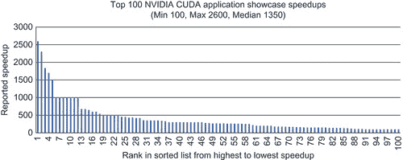

# 前言

时间在技术领域，以及我们的学术和职业生涯中都非常重要。我们是一代非常幸运的程序员，我们有机会利用价格低廉、普遍可用的、大规模并行计算硬件。GPGPU（通用图形处理单元）技术的影响涵盖了计算的所有方面，从小型手机到世界上最大的超级计算机。它们正在改变商业应用格局、科学计算、云计算、计算机可视化、游戏、机器人和计算机编程的教学方式。每秒万亿浮点运算（Teraflop）的计算现在对世界上大多数人都经济可行。青少年、学生、家长、教师、专业人士、小型研究机构和大型企业都可以轻松负担 GPGPU 硬件和软件开发工具包（SDK），而且 SDK 是免费的。NVIDIA 估计，他们已经售出了超过 3 亿台可编程的 GPGPU 设备。这些十亿分之一的 NVIDIA GPU 用 CUDA（计算统一设备架构）编程，为商业应用提供了巨大的市场机会，并为科学计算提供了重新定义可能性的硬件基础。最重要的是，CUDA 和大规模并行 GPGPU 硬件正在改变我们关于计算的看法。不再局限于一次执行一个或几个操作，CUDA 程序员编写的是同时执行数万次操作的程序！本书将教会你如何在 CUDA 中思考，并利用这些数万条执行线程来为你的应用程序实现数量级的性能提升，无论是商业的、学术的还是科学的。此外，本书将解释如何在一个应用程序中利用一个或多个 GPGPU，无论是在单台机器上还是在机器集群中。此外，本书还将向你展示如何使用 CUDA 开发可以在多核处理器上运行的应用程序，使 CUDA 成为所有应用开发的可行选择！无需 GPU！本书不仅关注语法和 API 调用，还涵盖了 CUDA 设计的思想以及 GPGPU 硬件能够如此出色地执行的原因。本书将涵盖各种指南和注意事项，以便你可以编写简洁、可读性和可维护的代码。重点是最新版本的 CUDA 4.x。提供了可编译和修改的示例代码，因为玩耍和适应代码是学习过程中的一个基本部分。这些示例演示了如何从 GPGPU 的 Fermi 架构（NVIDIA 20 系列）中获得高性能，因为目的不仅仅是让代码工作，还要向你展示如何编写高效的代码。那些拥有较老 GPGPU 的人也会从这本书中受益，因为示例可以在所有支持 CUDA 的 GPGPU 上编译和运行。在适当的情况下，本书将参考我的广泛的《Doctor Dobb's Journal》CUDA 教程系列中的文本，以突出 CUDA 先前版本中的改进，并提供如何在多代 GPGPU 架构之间实现良好性能的见解。教学材料、附加示例和读者评论可在[`gpucomputing.net`](http://gpucomputing.net)维基百科上找到。以下任何 URL 都可以访问维基百科：■ 我的名字：[`gpucomputing.net/RobFarber`](http://gpucomputing.net/RobFarber)。■ 本书标题作为一个单词：[`gpucomputing.net/CUDAapplicationdesignanddevelopment`](http://gpucomputing.net/CUDAapplicationdesignanddevelopment)。■ 我系列的名字：[`gpucomputing.net/supercomputingforthemasses`](http://gpucomputing.net/supercomputingforthemasses)。购买本书的读者可以在[`booksite.mkp.com/9780123884268`](http://booksite.mkp.com/9780123884268)下载示例代码。为了实现这些目标，本书的组织结构如下：第一章。介绍了基本的 CUDA 概念和构建和调试 CUDA 应用程序所需的工具。提供了简单的示例，演示了 thrust C++和 C 运行时 API。介绍了高性能 GPU 编程的三个简单规则。第二章。仅使用第一章中介绍的技术，本章提供了一个完整、通用的机器学习和优化框架，其速度比传统处理器的单核快 341 倍。还涵盖了机器学习和数值优化的核心概念，这对于那些希望获得领域知识以及编程 GPU 能力的人来说将是有趣的。第三章。本章的重点是性能分析，因为它是高性能编程的一个基本技能。介绍了 CUDA 性能分析工具，并将其应用于第二章中的真实世界示例。揭示了 Thrust API 中一些令人惊讶的瓶颈。讨论了数据挖掘技术入门，并提供了主成分分析和非线性主成分分析的数据挖掘算子，因此本章对用户和程序员都应感兴趣。第四章。本章的主题是 CUDA 执行模型。任何希望从 GPU 中获得最佳性能的人都必须了解本章中涵盖的概念。提供了示例和性能分析输出，以帮助理解 GPU 正在做什么以及如何使用现有工具查看正在发生的事情。第五章。CUDA 在 GPU 上提供了多种类型的内存。讨论了每种类型的内存，以及其优缺点。第六章。最快的 GPU 内存和最慢的 GPU 内存之间性能差异超过三个数量级，因此高效地使用 GPU 内存是获得高性能的唯一途径。本章讨论了技术和提供了性能分析输出，以帮助您了解和监控您的应用程序如何高效地使用内存。提供了一个基于泛函的通用示例，以教授如何编写自己的类似于 Thrust API 的通用方法。第七章。GPU 提供了多种并行形式，包括多个 GPU、异步内核执行和统一虚拟地址（UVA）空间。本章提供了示例和性能分析输出，以帮助理解和利用所有形式的 GPU 并行性。第八章。CUDA 已经成熟，成为 GPU 和多核处理器上所有应用开发的可行平台。讨论了通往多个 CUDA 后端的途径，并提供了示例和性能分析输出，以有效地在异构多 GPU 环境中运行。涵盖了 CUDA 库以及如何将 CUDA 和 GPU 计算与 Python、Java、R 和 FORTRAN 等高级语言接口。第九章。本章的重点是使用 CUDA 加速计算任务，很容易忘记 GPU 技术也是一个出色的可视化平台。本章讨论了原始重启及其如何显著加速可视化和游戏应用程序。提供了一个完整的可工作示例，允许读者创建并飞越一个 3D 世界。使用性能分析输出来演示为什么原始重启如此之快。本章的教学框架扩展到在第十二章中处理实时视频流。第十章。为了教授可扩展性和性能，第三章中的示例扩展到使用 MPI（消息传递接口）。这个示例代码的变体已经证明了接近线性的可扩展性，扩展到 500 个 GPGPU（峰值超过 500,000 个单精度千兆浮点运算），并使用 60,000 个 x86 处理核心提供了超过三分之一的 Petaflop（每秒 10 的 15 次方浮点运算）。第十一章。任何一本书都无法涵盖 CUDA 浪潮的所有方面。这是一章概述，指出了其他提供免费工作源代码的项目，包括支持向量机（SVM）、多维缩放（MDS）、互信息、力导向图布局、分子建模等。了解这些项目以及如何与其他高级语言接口（如第八章中讨论的）将有助于你成为一名成熟的 CUDA 开发者。第十二章。提供了一个基于第九章中可视化框架的实时视频流工作示例，用于基于视觉识别。所有你需要的是一台廉价的网络摄像头或视频文件，这样你也可以处理实时视觉识别。这个示例是为了教学而设计的，因此很容易修改。本章中工作示例和技术讨论的明显扩展包括机器人技术、增强现实游戏和抬头显示器的数据融合。学习如何在 CUDA（和 GPGPU）中思考和编程是一种很好的娱乐方式，也是开拓新机会的好方法。然而，性能是使用 GPGPU 技术的最终原因，正如我的大学教授经常说的，“甜点的证明在于品尝。”[图 1 展示了截至 2011 年 7 月 12 日 NVIDIA CUDA 展示区报告的前 100 个应用程序的性能。¹它们展示了 GPGPU 技术如何通过两到三个数量级（100 倍）的速度比多核处理器加速各种应用程序，如同行评审的科学文献和商业实体所报告。花时间查看这些展示的应用程序是值得的，因为其中许多提供了免费下载的源代码和库。¹[`developer.nvidia.com/cuda-action-research-apps`](http://developer.nvidia.com/cuda-action-research-apps)。

|  |
| --- |
| **图 1**NVIDIA 应用展示加速的前 100 名。 |

GPGPU 技术是一项颠覆性技术，它重新定义了计算的方式。正如 NVIDIA 所指出的，“从超级手机到超级计算机”。这项技术在一个完美的时机到来，因为传统的多核处理器已经无法通过提高时钟频率来实现显著的加速。传统处理器的制造商唯一能够吸引客户升级到新电脑的方法，就是通过双核和四核处理器的并行性提供两到四倍的加速。多核并行性是颠覆性的，因为它要求现有的软件被重写，以利用这些额外的核心。随着计算机和研究行业重新调整以利用并行硬件，快来加入软件应用开发和研究的前沿吧！学习 CUDA，抓住这个绝佳的机会。
