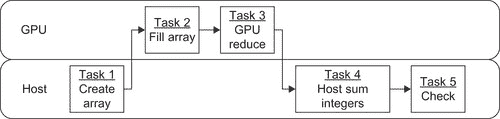
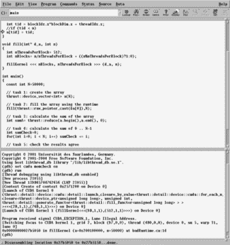

第一章. 第一个程序以及如何在 CUDA 中思考 本章的目的是向读者介绍 CUDA（由 NVIDIA 开发的并行计算架构），并将 CUDA 与编程传统的单核和多核处理器区分开来。示例程序和指令将向读者展示如何编译和运行程序，以及如何将其适应到自己的需求中。将使用并讨论 CUDA Thrust 和运行时 API（应用程序编程接口）。本章将介绍 GPGPU 编程的三条规则，以及阿姆达尔定律、Big-O 符号表示法，以及数据并行和任务并行编程的区别。还将介绍一些基本的 GPU 调试工具，但大多数情况下，NVIDIA 已经将调试 CUDA 代码与调试任何其他 C 或 C++应用程序保持一致。在适当的地方，将提供入门材料的参考，以帮助新手读者。章末，读者将能够编写和调试大规模并行程序，该程序可以在单个应用程序中并行利用 GPGPU 和主机处理器，并处理一百万个执行线程。**关键词**CUDA, C++, Thrust, 运行时, API, 调试, 阿姆达尔定律, Big-O 符号表示法, OpenMP, 异步, 内核, cuda-gdb, ddd 本章的目的是向读者介绍 CUDA（由 NVIDIA 开发的并行计算架构），并将 CUDA 与编程传统的单核和多核处理器区分开来。示例程序和指令将向读者展示如何编译和运行程序，以及如何将其适应到自己的需求中。将使用并讨论 CUDA Thrust 和运行时 API（应用程序编程接口）。本章将介绍 GPGPU 编程的三条规则，以及阿姆达尔定律、Big-O 符号表示法，以及数据并行和任务并行编程的区别。还将介绍一些基本的 GPU 调试工具，但大多数情况下，NVIDIA 已经将调试 CUDA 代码与调试任何其他 C 或 C++应用程序保持一致。在适当的地方，将提供入门材料的参考，以帮助新手读者。章末，读者将能够编写和调试大规模并行程序，该程序可以在单个应用程序中并行利用 GPGPU 和主机处理器，并处理一百万个执行线程。章末，读者将具备以下基本理解：■ 如何创建、构建和运行 CUDA 应用程序。■ 决定使用哪个 CUDA API 的标准。■ 阿姆达尔定律及其与 GPU 计算的关系。■ 高性能 GPU 计算的三条规则。■ Big-O 符号表示法及数据传输的影响。■ 任务并行与数据并行编程的区别。■ Linux、Mac 和 Windows CUDA 调试器的一些 GPU 特定功能。■ CUDA 内存检查器及其如何发现越界和内存对齐错误。

# 源代码与维基

本书中所有示例的源代码可以从[`booksite.mkp.com/9780123884268`](http://booksite.mkp.com/9780123884268)下载。一个 wiki（由用户社区共同开发的网站）可供分享信息、发表评论以及查找教学材料；可以通过以下任意别名访问它，地址均在 gpucomputing.net 上：■ 我的名字：[`gpucomputing.net/RobFarber`](http://gpucomputing.net/RobFarber)。■ 本书标题作为一个单词：[`gpucomputing.net/CUDAapplicationdesignanddevelopment`](http://gpucomputing.net/CUDAapplicationdesignanddevelopment)。■ 我的系列名称：[`gpucomputing.net/supercomputingforthemasses`](http://gpucomputing.net/supercomputingforthemasses)。

# 用一个简单的例子区分 CUDA 和传统编程

编写顺序处理器程序需要编写一个程序，指定计算某个结果所需的每个任务。参见示例 1.1，“seqSerial.cpp，一个顺序的 C++程序”:`//seqSerial.cpp``#include <iostream>``#include <vector>``using namespace std;``int main()``{``const int N=50000;``// 任务 1：创建数组``vector<int> a(N);``// 任务 2：填充数组``for(int i=0; i < N; i++) a[i]=i;``// 任务 3：计算数组之和``int sumA=0;``for(int i=0; i < N; i++) sumA += a[i];``// 任务 4：计算 0 .. N−1 的和``int sumCheck=0;``for(int i=0; i < N; i++) sumCheck += i;``// 任务 5：检查结果是否一致``if(sumA == sumCheck) cout << "测试成功！" << endl;``else {cerr << "测试失败！" << endl; return(1);}``return(0);``}`示例 1.1 执行了五个任务：1. 它创建了一个整数数组。2. 一个**for**循环将整数从 0 到**N**−1 填充到数组**a**中。3. 计算数组中整数的和。4. 一个独立的**for**循环通过另一种方法计算整数之和。5. 通过比较检查顺序结果和并行结果是否相同，并报告测试成功。请注意，处理器按顺序依次运行每个任务。在任务 2 到 4 中，处理器从第一个索引开始迭代循环。一旦所有任务完成，程序就退出。这是一个*单一执行线程*的示例，如图 1.1 所示，在任务 2 中，单一线程填充数组*a*的前三个元素。

|  |
| --- |
| **图 1.1**单一执行线程。 |

这个程序可以通过以下命令进行编译和执行：■ Linux 和 Cygwin 用户（示例 1.2，“使用 g++ 编译”）：`g++ seqSerial.cpp –o seqSerial``./seqSerial`■ 对于 Microsoft Visual Studio 用户，使用命令行接口（示例 1.3，“使用 Visual Studio 命令行接口编译”）：`cl.exe seqSerial.cpp –o seqSerial.exe``seqSerial.exe`■ 当然，所有 CUDA 用户（Linux、Windows、MacOS、Cygwin）都可以使用 NVIDIA **nvcc** 编译器，无论平台如何（示例 1.4，“使用 nvcc 编译”）：`nvcc seqSerial.cpp –o seqSerial``./seqSerial`在所有情况下，程序都会打印“测试成功！”为了进行比较，让我们创建并运行我们的第一个 CUDA 程序 seqCuda*.cu*，使用 C++ 编写。（注意：CUDA 支持 C 和 C++ 程序。为了简单起见，以下示例使用 C++ 并结合 Thrust 数据并行 API，如本章后续将深入讨论。）CUDA 程序使用 *文件扩展名* 后缀 “*.cu*” 来表示 CUDA 源代码。请参见 示例 1.5，“使用 Thrust API 的大规模并行 CUDA 代码”：`//seqCuda.cu``#include <iostream>``using namespace std;``#include <thrust/reduce.h>``#include <thrust/sequence.h>``#include <thrust/host_vector.h>``#include <thrust/device_vector.h>``int main()``{``const int N=50000;``// 任务 1：创建数组``thrust::device_vector<int> a(N);``// 任务 2：填充数组``**thrust::sequence(a.begin(), a.end(), 0);**``// 任务 3：计算数组之和``**int sumA= thrust::reduce(a.begin(),a.end(), 0);**``// 任务 4：计算 0 .. N−1 的和``int sumCheck=0;``for(int i=0; i < N; i++) sumCheck += i;``// 任务 5：检查结果是否一致``if(sumA == sumCheck) cout << "Test Succeeded!" << endl;``else { cerr << "Test FAILED!" << endl; return(1);}``return(0);``}`示例 1.5 是在 Windows、Linux 和 MacOS 下使用 NVIDIA **nvcc** 编译器编译的。如果系统中没有 **nvcc**，请从 NVIDIA CUDA Zone 下载并安装免费的 CUDA 工具、驱动程序和 SDK（软件开发工具包）（[`developer.nvidia.com`](http://developer.nvidia.com)）。请参见 示例 1.6，“编译并运行示例”：`nvcc seqCuda.cu –o seqCuda``./seqCuda`再次运行程序会打印“测试成功！”恭喜你：你刚刚创建了一个 CUDA 应用程序，使用了 50,000 个软件执行线程并在 GPU 上运行！（实际并发运行的线程数取决于你系统中 GPGPU 的能力。）除了几次对 CUDA Thrust API 的调用（在本示例中以 **thrust::** 开头），CUDA 代码几乎与顺序 C++ 代码完全相同。示例中突出显示的行执行了并行操作。与 图 1.1 中展示的单线程执行不同，示例 1.5 中的代码使用了多个线程来执行大量并发操作，如 图 1.2 中所示，任务 2 在填充数组 **a** 时的操作。

|  |
| --- |
| **图 1.2** 执行的并行线程。 |

# 选择一个 CUDA API

CUDA 提供了多个 API 供编程时使用，它们按从高到低的层次排列：1\. 数据并行 C++ Thrust API 2\. 运行时 API，可以在 C 或 C++ 中使用 3\. 驱动程序 API，可以在 C 或 C++ 中使用 无论在应用程序中使用哪种 API 或多种 API 的组合，CUDA 都可以从其他高级语言（如 Python、Java、FORTRAN 等）中调用。每种语言所需的调用约定和细节有所不同。选择使用哪个 API 取决于开发人员希望对 GPU 的控制程度。像 C++ Thrust API 这样的高级 API 非常方便，因为它们为程序员做了更多的工作，但它们也会为程序员做出一些决定。一般来说，Thrust 被证明能够提供高计算性能、通用性和便利性。它还可以加速代码开发，并生成更易于阅读的源代码，许多人认为它更易于维护。如果不进行修改，使用 Thrust 编写的程序在未来的版本中很可能会保持或提高性能。许多 Thrust 方法，如 reduction，执行了大量的工作，这使得 Thrust API 的开发者有更多的自由去结合最新硬件的特性，从而提升性能。Thrust 是一个设计良好的 API 示例，它简洁而通用，并具有适应技术进步以提高性能的能力。 像 Thrust 这样的高级 API 的一个缺点是，它可能会将开发者与硬件隔离，只暴露硬件能力的子集。在某些情况下，C++ 接口可能会变得过于繁琐或冗长。尤其是科学程序员可能会觉得简单的循环结构的清晰度在 C++ 语法中丢失了。首先使用高级接口，并在认为额外的编程工作可以带来更高的性能，或者需要使用某些低级功能来更好地支持应用程序时选择降级到低级 API。特别是 CUDA 运行时被设计为通过一些简单而优雅、强大的 C 语言语法扩展，给开发者提供对 GPGPU 所有可编程特性的访问。因此，CUDA 运行时代码有时是最简洁、最容易阅读的 API，此外，它也可以非常高效。最低级别的驱动接口的一个重要方面是，它可以提供对队列和数据传输的非常精确的控制。 当使用低级接口时，代码大小可能会增加，因为开发者需要进行更多的 API 调用和/或为每次调用指定更多的参数。此外，开发者还需要检查运行时错误和版本不兼容。在许多情况下，使用低级 API 时，应用程序代码的更多行将专注于 API 接口的细节，而不是任务的实际工作。 幸运的是，现代 CUDA 开发者不再仅限于在应用程序中使用单一的 API，这在 2010 年 CUDA 3.2 发布之前并不适用。现代版本的 CUDA 允许开发者在其应用程序中随时使用三种 API 之一。因此，可以先使用高级 API（如 Thrust）编写初始代码，然后重构为使用运行时或驱动程序 API 的某些特殊特性。 让我们利用这种混合使用不同级别 API 调用的能力，来突出并更明确地表达之前示例中顺序填充任务（任务 2）的并行特性。示例 1.7，“使用 CUDA 运行时填充数组以生成顺序整数”，也给我们提供了一个机会来介绍 CUDA 运行时 API：`//seqRuntime.cu` `#include <iostream>` `using namespace std;` `#include <thrust/reduce.h>` `#include <thrust/sequence.h>` `#include <thrust/host_vector.h>` `#include <thrust/device_vector.h>` `**__global__ void fillKernel(int *a, int n)**` `**{**` `**int tid = blockIdx.x*blockDim.x + threadIdx.x;**` `**if (tid < n) a[tid] = tid;**` `**}**` `**void fill(int* d_a, int n)**` `**{**` `**int nThreadsPerBlock= 512;**` `**int nBlocks= n/nThreadsPerBlock + ((n%nThreadsPerBlock)?1:0);**` `**fillKernel <<< nBlocks, nThreadsPerBlock >>> (d_a, n);**` `**}**` `**int main()**` `{` `const int N=50000;` `// 任务 1: 创建数组` `thrust::device_vector<int> a(N);` `// 任务 2: 使用运行时填充数组` `**fill(thrust::raw_pointer_cast(&a[0]),N);**` `// 任务 3: 计算数组的和` `int sumA= thrust::reduce(a.begin(),a.end(), 0);` `// 任务 4: 计算 0 .. N−1 的和` `int sumCheck=0;` `for(int i=0; i < N; i++) sumCheck += i;` `// 任务 5: 检查结果是否一致` `if(sumA == sumCheck) cout << "Test Succeeded!" << endl;` `else { cerr << "Test FAILED!" << endl; return(1);}` `return(0);` `}` 修改后的代码部分用粗体标出。为了最小化对**main()**结构的修改，**thrust::sequence()**的调用被替换为调用使用运行时 API 编写的**fill()**例程。因为数组 **a** 是使用 **thrust::device_vector<>()** 分配的，所以需要调用 **thrust::raw_pointer_cast()** 来获取数据在 GPU 上的实际位置。**fill()** 子例程使用 C 语言的调用约定（例如，传递 int* 和向量的长度），以强调 CUDA 可以通过 C 和 C++ 两种方式访问。细心的读者会注意到，较好的 C++ 编程实践是传递 Thrust 设备向量的引用，原因有很多，包括：更好的类型检查，因为 **fill()** 可能错误地传递了一个指向主机内存中数组的指针；可以安全地使用 **a.size()** 确定向量 **a** 的元素个数，以防止 **n** 参数被错误指定；以及其他一些原因。

# 一些基本的 CUDA 概念

在讨论**fill()**子程序的运行时版本之前，了解一些基本的 CUDA 概念是非常重要的：■ **CUDA 启用的 GPU 是安装在主机计算机中的独立设备**。在大多数情况下，GPGPU 通过高速接口（如 PCIe（外围组件互联快速通道）总线）连接到主机系统。大多数工作站或集群节点可以添加两到四个 GPGPU，具体数量取决于主机系统的能力，如 PCIe 插槽数量、机箱内的可用空间、电源和冷却。每个 GPGPU 都是一个独立的设备，异步运行于主机处理器，这意味着主机处理器和所有 GPGPU 可以同时进行繁重的计算。PCIe 总线用于在设备之间传输数据和命令。CUDA 提供了多种数据传输机制，包括：■ 使用**cudaMemcpy()**的显式数据传输（最常见的运行时数据传输方法）。使用 Thrust 的用户可以通过分配操作将数据从一个向量移动到另一个向量（请参见示例 1.8，“演示如何使用 Thrust 移动数据的代码片段”）：`//使用 thrust 将数据从主机移至设备``d_a = h_a;``//或从设备移至主机``h_a = d_a;`■ 使用映射、固定内存的隐式传输。此接口保持主机内存区域与 GPU 内存区域的同步，并且不需要程序员干预。例如，应用程序可以在主机上加载数据集，将内存映射到 GPU，然后像显式初始化数据一样使用 GPU 上的数据。使用映射、固定内存可以提高程序的效率，因为传输是异步的。一些低功耗的 GPGPU 利用主机内存来节省成本和功耗。在这些设备上，使用映射、固定内存会导致*零拷贝*操作，因为 GPU 将直接访问数据，而无需任何拷贝操作。在最低级别，主机和 GPGPU 硬件通过一个名为*设备驱动程序*的软件组件进行交互。设备驱动程序管理硬件接口，使 GPU 和主机系统能够进行通信、计算和显示信息。它还支持许多操作，包括映射内存、缓冲、排队和同步。CUDA 软件堆栈的组件在图 1.3 中进行了说明。

|  |
| --- |
| **图 1.3** 软件堆栈的组件。 |

■ **GPGPU 运行在与主处理器分离的内存空间中**。除了一些低端设备外，所有的 GPGPU 都有自己的物理内存（例如 RAM），设计用于提供比传统主机内存显著更高的内存带宽。许多当前的 GPGPU 内存系统提供大约 160–200 GB/s（每秒十亿字节或千兆字节）的传输速度，而传统的主机内存系统则提供 8–20 GB/s。尽管 CUDA 4.0 提供了统一虚拟地址（UVA），将主机和 GPGPU 内存合并为单一统一的地址空间，但不要忘记，访问另一设备上的内存将需要通过总线进行一些传输，即使在 GPGPU 之间也是如此。然而，UVA 很重要，因为它使任何设备上运行的软件能够仅通过指针访问另一设备上的数据。■ **CUDA 程序利用 *核函数*（kernels），这些核函数是可以从主机调用并在 CUDA 设备上执行的子程序**。需要注意的是，核函数不是函数，因为它们不能返回值。在 GPGPU 上表现良好的大多数应用程序在一个或少数几个计算例程中花费大部分时间。将这些例程转换为 CUDA 核函数是加速应用程序并利用 GPGPU 计算能力的绝佳方法。核函数使用 **__global__** 声明说明，告诉编译器该核函数可以被主处理器调用。■ **核函数调用是 *异步* 的，这意味着主机只是将一个核函数排队以在 GPGPU 上执行，并不等待它完成，而是继续执行其他工作**。稍后，核函数实际在 GPU 上运行。由于这种异步调用机制，CUDA 核函数无法返回函数值。为了效率，可以通过排队一些核函数来创建 *管道*，以尽可能使 GPGPU 保持忙碌。此外，需要某种形式的同步机制，以便主机确定核函数或管道何时完成。两种常用的同步机制包括：■ 显式调用 **cudaThreadSynchronize()**，它作为 *屏障*，导致主机停止并等待所有排队的核函数完成。■ 执行带有 **cudaThreadSynchronize()** 的阻塞数据传输，就像在 **cudaMemcpy()** 中调用 **cudaThreadSynchronize()** 一样。■ **GPU 上的基本工作单位是 *线程***。从软件角度来看，重要的是要理解每个线程都与其他线程分开。每个线程都像有自己的处理器一样，有单独的寄存器和标识（例如，在共享内存环境中的位置），硬件定义了能够同时运行的线程数。板载 GPU 硬件线程调度器决定何时可以运行一组线程，并且具有在软件角度看，线程切换和调度似乎是免费的能力。一些简单而优雅的 C 语言补充允许线程通过 CUDA 共享内存空间和原子内存操作进行通信。一个核函数应该利用许多线程执行核函数源代码中定义的工作。这种利用称为 *线程级并行性*，与 *指令级并行性* 不同，后者在处理器指令上进行并行化。图 1.2 说明了在并行填充中使用许多线程，与在 图 1.1 中示例的单线程填充操作不同。*执行配置* 定义了将运行核函数的线程数以及它们在 1D、2D 或 3D 计算网格中的排列。执行配置在名称后面的三角括号“<<<”和“>>>”之间的参数列表封闭配置信息。除了执行配置外，排队核函数看起来非常类似于子程序调用。示例 1.7 展示了使用 **fill()** 子程序中的 **fillKernel()** 调用的语法。■ **GPU 上最大的共享内存区域称为 *全局内存***。以 RAM 的千兆字节计量，大多数应用程序数据驻留在全局内存中。全局内存受到 *合并* 规则的影响，这些规则将多个内存事务合并为单个大型加载或存储操作，以实现与内存之间的最高传输速率。一般来说，当内存访问可以合并为 128 个连续字节块时，可以获得最佳性能。其他可通过程序员访问的板载 GPU 存储器包括 *常量*、*缓存*、*共享*、*本地*、*纹理* 和 *寄存器内存*，如 第五章 所述。访问全局内存的延迟可能很高，比访问寄存器变量慢高达 600 倍。CUDA 程序员应注意，尽管全局内存的带宽似乎很高，约为 160–200 GB/s，但与 GPU 可提供的 teraflop 性能能力相比，它的速度较慢。因此，在 GPU 内重复使用数据对于实现高性能至关重要。

# 理解我们的第一个运行时内核

你现在已经掌握了理解我们第一个内核所需的基本概念。从程序员的角度来看，执行从**main()**中的示例 1.7 开始。常量整数**N**被初始化，Thrust 方法**device_vector<int>**用于在 GPGPU 设备上分配**N**个整数。执行随后顺序地进入**fill()**子例程。通过一个简单的计算，定义了基于每块 512 个线程（由**nThreadsPerBlock**定义）来计算块的数量**nBlocks**。其思路是提供足够的线程，以**nThreadsPerBlock**为粒度，确保为整数数组**d_a**中的每个位置分配一个线程。根据约定，设备变量通常会在变量名前加上“**d_**”，而主机变量则会加上“**h_**”。接下来，CUDA 内核**fillKernel()**被排队执行，在 GPGPU 上使用**nBlocks**和**nThreadsPerBlock**的执行配置。**d_a**和**n**作为参数传递给内核。主机执行接着返回**fill()**子例程。注意，**fillKernel()**必须由**__global__**声明修饰符修饰，否则会发生编译错误。此时，两个事情正在发生：1. CUDA 驱动程序被告知设备有任务排队。几微秒（μ秒，百万分之一秒）内，驱动程序将可执行文件加载到 GPGPU 上，定义执行网格，传递参数，并且因为 GPGPU 没有其他工作要做，启动内核。2. 与此同时，主机处理器继续其顺序执行，调用**thrust::reduce()**来执行任务 3。主机执行由 Thrust 模板定义的工作，并排队 GPU 操作。因为**reduce()**是一个阻塞操作，主机必须等待 GPGPU 的结果才能继续执行。一旦**fillKernel()**开始在 GPU 上运行，每个线程首先根据程序员定义的网格计算其特定的线程 ID（在代码中称为**tid**）。此示例使用简单的 1D 网格，因此**tid**是使用三个常量变量计算的，这些常量变量对于每个内核是特定的，并且通过执行配置由程序员定义：■ **blockIdx.x**：这是线程所在的块在程序员定义的网格中的索引。由于这是 1D 网格，因此只使用*x*分量；*y*和*z*分量被忽略。■ **blockDim.x**：每个块的维度或线程数。■ **threadIdx.x**：该线程在块内的位置索引。然后检查**tid**的值，看看它是否小于**n**，因为可能有比**a**数组元素更多的线程。如果**tid**包含有效的**a**数组索引，则将索引为**tid**的元素值设置为**tid**。如果没有，线程将在内核的末尾等待，直到所有线程完成。选择此示例是为了方便观察网格位置如何转换为数组索引。所有线程完成后，**fillKernel()**完成并将控制权返回给设备驱动程序，以便它可以开始下一个排队任务。在此示例中，GPU 计算了归约（其代码相当复杂，如在第六章中讨论），并将结果返回给主机，以便应用程序能够顺序地完成任务 4 和 5。从上述讨论可以看出，一个 CUDA 内核可以简单地理解为示例 1.9 中代码片段的并行形式，“一个并行 CUDA 调用的顺序示例”：`// 根据执行``// 配置设置 blockIdx、blockDim 和 threadIdx``for(int i=0; i < (nBlocks * nThreadsPerBlock); i++)``fillKernel(d_a, n);`虽然 Thrust 依赖于运行时 API，但仔细使用 C++模板使得 C++ *函数对象*（或*函数对象*，这是一个可以像函数一样调用的 C++对象）能够被转化为运行时内核。它还定义了执行配置并为程序员创建内核调用。这也解释了为什么示例 1.5，完全使用 Thrust 编写，不需要指定执行配置或运行时 API 要求的其他细节。

# GPGPU 编程的三条规则

观察表明，创建高性能 GPGPU 程序有三个基本规则：1. 将数据放到 GPGPU 上并保持在那里；2. 给 GPGPU 足够的工作量；3. 专注于 GPGPU 内的数据重用，以避免内存带宽限制。考虑到 PCIe 总线和 GPGPU 内存系统的带宽与延迟限制，这些规则是有道理的，以下小节将进一步讨论这些限制。

## 规则 1：将数据放到 GPU 上并保持在那里

GPGPU 是独立的设备，插入主机计算机的 PCI Express 总线。与 GPGPU 内存系统相比，PCIe 总线非常慢，从表 1.1 中的 20 倍差距可以看出。

**表 1.1** PCIe 与 GPU 全局内存带宽对比

|  | 带宽 (GB/s) | 相较于 PCIe 总线的加速比 |
| --- | --- | --- |
| PCIe x16 v2.0 总线（单向） | 8 | 1 |
| GPU 全局内存 | 160 至 200 | 20 倍至 28 倍 |

## 规则 2：给 GPGPU 足够的工作量

俗话说“当心你所要求的，因为你可能会得到它”，这句话适用于 GPGPU 性能。由于支持 CUDA 的 GPU 可以提供 teraFLOP 性能，它们的计算速度足以比主机处理器启动内核的速度更快地完成小型问题。为了更好地理解这些数据，假设对于一款 1 teraFLOP 的 GPU，它需要 4 个周期来执行一次浮点操作，而启动这一过程的开销是 4 微秒。为了让 GPGPU 保持忙碌，每个内核必须执行大约 100 万次浮点操作，以避免因内核启动延迟浪费周期。如果内核仅需要 2 微秒来完成，那么 GPU 周期的 50% 将被浪费。需要注意的是，Fermi GPU 可以在单个 GPU 上同时运行多个小型内核。

## 规则 3：专注于 GPGPU 内的数据重用，以避免内存带宽限制

所有高性能 CUDA 应用程序都利用 GPU 上的内部资源（例如寄存器、共享内存等，这些内容在第五章中讨论）来绕过全局内存瓶颈。例如，在全局内存中将一个向量乘以一个尺度因子，并将结果分配给另一个同样在全局内存中的向量，将会很慢，如示例 1.10 中所示，“一个简单的向量示例”：`for(i=0; i < N; i++) c[i] = a * b[i];`假设向量每个元素存储一个单精度 32 位浮点值需要 4 字节，那么一个具备一万亿次浮点运算能力的计算机的内存子系统需要提供至少每秒 8 TB 的内存带宽才能在峰值性能下运行——假设常量尺度因子已加载到 GPGPU 缓存中。大致来说，这样的带宽是当前 GPU 内存子系统能力的 40 到 50 倍，是一台 20 GB/s 普通处理器带宽的 400 倍。需要 8 字节存储的双精度向量将使带宽需求翻倍。这个例子应该能清楚地表明，CUDA 程序员必须尽可能多地重用数据以实现高性能。请注意，数据重用对于在传统处理器上获得高性能也同样重要。

# Big-O 考虑和数据传输

大 O 表示法是一种便捷的方式，用来描述问题的规模如何影响算法对某些资源（如处理器时间或内存）的消耗，作为输入的函数。通过这种方式，计算机科学家可以描述最坏情况（或在指定时，平均情况的行为），作为一个函数来比较算法，而不管架构或时钟频率。常见的增长率包括：  

**表 1.2** 按 BLAS 级别的每个数据的工作量

| BLAS 级别 | 数据 | 工作量 | 每个数据的工作量 |
| --- | --- | --- | --- |
| 1 | O(*N*) | O(*N*) | O(1) |
| 2 | O(*N*²) | O(*N*²) | O(1) |
| 3 | O(*N*²) | O(*N*³) | O(*N*) |

表 1.2 告诉我们，三级 BLAS 操作应该能在图形处理器上高效运行，因为它们每传输一个浮点值到 GPU 时，会执行 O(*N*) 的工作量。相同的每个数据的工作量分析也适用于非 BLAS 相关的计算问题。为了说明一级 BLAS 操作的成本，考虑在 PCIe 总线上传输数据以计算 GPU 上的 **cublasScal()**，然后将向量返回给主机的开销。BLAS **Sscal()** 方法通过常数值缩放一个向量。CUBLAS 包括一个*Thunking* 接口，确保与 FORTRAN 兼容。它的工作方式是将数据从主机传输到 GPU，执行计算后再将数据从 GPU 传回主机。Thunking 是低效的，因为它需要将 4*N* 字节的数据（其中 *N* 是向量中的浮点数数量）通过 PCIe 总线来回传输两次，以执行 *N* 次乘法，如 示例 1.10 所示。最佳性能将是传输带宽除以 8（考虑到两次传输 4*N* 字节的数据），因为与数据传输相比，执行乘法所需的时间极短。假设主机和 GPU 之间的传输速率为 8GB/s，应用程序可能达到 1 Gflop（每秒 10 亿次浮点运算）的浮点性能。¹ 一些普通的笔记本处理器甚至某些手机的计算速率都能超过这一水平。¹异步数据传输可以提高性能，因为 PCIe 总线是全双工的，意味着数据可以同时传输到主机和从主机传回。最好情况下，全双工异步 PCIe 传输将性能提高到两倍，达到 2 Gflop。这个分析适用于所有程序，而不仅仅是一级和二级 BLAS 计算。要获得良好的性能，需要尽可能将数据保留在 GPU 上。之后，获得高性能需要像三级 BLAS 操作一样对每个数据执行尽可能多的计算。创建多个低算术密度计算的管道有助于提高性能，但只有当每个操作能保持 GPU 足够长的时间以克服内核启动延迟时，这种方法才能增加性能。另一种方法是通过将多个低密度操作（如 BLAS 二级和二级操作）合并为一个函数或内核来提高性能，有时这种提高是显著的。

# CUDA 和阿姆达尔定律

安达尔定律（Amdahl's law）得名于计算机架构师吉恩·安达尔（Gene Amdahl）。它实际上不是一个定律，而是一个近似模型，用于描述将串行程序修改为并行运行时可能实现的理想加速效果。为了使这个近似模型有效，问题规模在并行化时必须保持不变。换句话说，假设一个串行程序被修改为并行程序。此外，还假设在并行版本的代码中，程序所执行的工作量没有显著变化，但这并不总是成立的。显然，那些无法并行化的部分将不会变得更快，而并行部分可以根据硬件能力运行得更快。因此，使用*n*个处理器时，预计并行代码相对于串行代码的加速比由程序中可以并行化的部分*P*和不能并行化的部分（1 − *P*）的比例决定。这个关系在方程式 1.1 中展示，“安达尔定律”。(1.1)安达尔定律告诉我们，创新的 CUDA 开发者在并行化应用程序时有两个关注点：1. 将代码的并行部分表达得尽可能快。理想情况下，当使用*N*个处理器时，应该实现*N*倍的速度提升。2. 运用任何技术或创造力，最小化（1 − *P*）串行时间。CUDA 的一个重要优势就在于它以自然的方式将程序的并行性封装在计算内核中。那些在 GPGPU 硬件上运行良好的应用程序通常有一些计算密集型的代码部分（例如热点），这些部分占用了大部分的运行时间。根据安达尔定律，这些是具有能够提供良好并行加速的内核的程序（*P* >> 1 − *P*）。观察也表明，将应用程序重构为使用 CUDA 通常会在中等并行硬件（如多核处理器）上提高性能，因为 CUDA 让开发者能更好地识别并行性，从而可以重构代码，减少在串行部分（1 − *P*）上花费的时间。当然，这假设了将数据传输到 GPGPU 并从中传输的开销不会显著影响应用程序的运行时间。

# 数据与任务并行性

本章中的示例到目前为止展示了*数据并行性*或*循环级并行性*，它们通过在**for**循环内并行化数据操作。*任务并行性*是另一种并行化形式，它通过让多个任务同时执行来减少 (1 − *P*) 的串行时间。CUDA 自然支持任务并行性，通过在主机和 GPU 上并行运行任务。正如在第七章中将讨论的那样，CUDA 提供了其他方式来在单个 GPU 或多个 GPU 之间利用任务并行性。即使是像示例 1.5 和示例 1.7 这样的简单 GPU 示例，也可以修改为展示任务并行性。这些示例执行了以下任务：1\. 创建一个数组。2\. 填充数组。3\. 计算数组的总和。4\. 计算从 0 到 **N**−1 的总和。5\. 检查主机和设备的结果是否一致。图 1.4 中的代表性时间线显示，之前的示例并没有在任务 2 被排队到 GPU 上运行时利用异步内核执行。

|  |
| --- |
| **图 1.4** 顺序时间线。 |

然而，任务 4 完全可以在任务 2 将内核排队到 GPU 上运行后开始。换句话说，任务 4 并没有任何必须在其他任务之后执行的*依赖性*，唯一的要求是它必须在任务 5 中进行正确性检查之前运行。换句话说，任务 5 依赖于任务 4 的结果。同样，任务 2 必须在任务 1 之后执行，任务 1 在 GPU 上分配数组。交换任务 3 和任务 4 使得主机和 GPU 可以并行运行，如图 1.5 所示，这表明即便是这个简单的例子，也可以通过利用 CUDA 异步内核执行来实现任务和数据并行。这样做的好处是进一步减少了应用程序的运行时间。

|  |
| --- |
| **图 1.5** 异步时间线。 |

# 混合执行：同时使用 CPU 和 GPU 资源

以下示例展示了一个混合应用程序，该应用程序同时在 CPU 和 GPU 上运行。现代多核处理器也是支持数据并行和任务并行执行的并行硬件。OpenMP（开放多处理）是一种便捷的方式，能够在主机处理器上利用多线程执行。NVIDIA 的**nvcc**编译器支持 OpenMP。尽管本书并不是关于 OpenMP API 的内容，但 CUDA 程序员需要知道，他们可以利用主机处理器的并行性以及 GPGPU 的巨大并行性。毕竟，目标是提供最快的应用程序性能。在进行 CPU 和 GPU 的基准测试比较时，优化应用程序以在两个系统上实现最高性能，从而使比较尽可能公平，也是非常重要的。示例 1.11“异步 CPU/GPU 源代码”是切换任务 3 和任务 4 执行顺序的源代码。任务 4 中使用了 OpenMP 并行 for 循环指令，以便在主机处理器上利用数据并行：`//seqAsync.cu``#include <iostream>``using namespace std;``#include <thrust/reduce.h>``#include <thrust/sequence.h>``#include <thrust/host_vector.h>``#include <thrust/device_vector.h>``int main()``{``const int N=50000;``// 任务 1：创建数组``thrust::device_vector<int> a(N);``// 任务 2：填充数组``thrust::sequence(a.begin(), a.end(), 0);``// 任务 4：计算 0..N−1 的和``int sumCheck=0;``#pragma omp parallel for reduction(+ : sumCheck)``for(int i=0; i < N; i++) sumCheck += i;``// 任务 3：计算数组的和``int sumA= thrust::reduce(a.begin(),a.end(), 0);``// 任务 5：检查结果是否一致``if(sumA == sumCheck) cout << "Test Succeeded!" << endl;``else { cerr << "Test FAILED!" << endl; return(1);}``return(0);``}`为了使用 OpenMP 进行编译，请在**nvcc**命令行参数中添加“**-Xcompiler -fopenmp**”，如示例 1.12 所示，用于编译示例 1.11。由于我们需要计时结果，因此还使用了“**−O3**”优化标志。`nvcc –O3 –Xcompiler –fopenmp seqAsync.cu - seqAsync`从`**seqAsync**`的输出（示例 1.13，“显示成功测试的结果”）中可以看到，和被正确计算，且通过了黄金测试：`$ ./a.out``Test Succeeded!`

# 回归测试与准确性

和编程中的一贯做法一样，成功的最重要衡量标准是应用程序能够产生正确的输出。回归测试是这个评估过程中的关键部分，但不幸的是，大多数计算机科学书籍都没有涉及。回归测试充当了理智检查的作用，使程序员能够利用计算机检测代码中是否引入了某些错误。计算机是公正的，不会感到疲倦。因此，应该编写和测试少量代码，以确保一切处于已知的工作状态。然后可以添加更多的代码，并进行更多的回归测试。这大大简化了调试工作，因为错误通常发生在较少的新代码中。另一种方法是编写大量代码，并希望它能够正常工作。如果出现错误，追踪大量代码行以找到一个或多个问题将变得非常具有挑战性。有时，你可能会运气好，采用后一种方法。如果你尝试这种方法，可以记录下你的时间，看看是否真能节省时间，相比使用回归测试和增量开发。 本章中的示例使用了一种简单的回归测试形式，有时称为*金标准测试*或*冒烟测试*，它利用一种替代方法来双重检查整数总和的并行计算。这种简单的测试在进行精确计算时效果很好，但在使用浮点运算时，由于浮点数计算中引入的数值误差，解读会变得更加困难。由于 GPGPU 技术每秒可以执行数万亿次浮点运算，数值误差会迅速积累。不过，使用计算机进行双重检查结果总比盯着无休止的数字行要好。对于复杂的程序和算法，回归测试套件的规划时间、实现复杂度以及所需的代码行数可能与应用程序代码本身一样多！尽管很难向管理层、教授或你自己（尤其是在紧迫的截止日期前）证明，但考虑到交付一个***不正确***运行的应用程序的成本。例如，我共同创办的第二家公司交付了一个人工学习系统，通过使用本书稍后讨论的某些技术，促进了候选药物的筛选。我们创业团队需要回答的最难的问题是一个主要投资者的研究执行委员会提出的。这个问题是：“我们怎么知道你们在计算机上做的事情与实验试管中的实际情况相符？”隐含的问题是：“我们怎么知道你们没有拿我们的钱在玩一些昂贵的电脑游戏？”解决方案是进行一次双盲测试，证明我们的技术可以在现实世界的实验中，仅使用一小部分测量数据，并且没有正确结果的知识，预测相关化合物的化学活性。换句话说，我们的团队利用了一种理智检查的方法来证明我们的模型和软件的有效性。如果没有这样的现实检查，可能公司就无法获得资金。

# 悄然错误

回归测试的一个挑战是，某些错误可能依然会悄无声息地通过测试套件，最终影响到终端用户看到的应用程序。例如，ICHEC（爱尔兰高性能计算中心）的 Andy Regan 指出，增加本章示例中的**N**值可能会导致总和变得过大，超出整数范围。一些系统可能会捕获该错误，而有些系统则会漏掉该错误。鉴于 GPU 每秒可以执行万亿次算术运算，CUDA 程序员理解数值错误如何快速积累或计算值如何超出其容量变得尤为重要。有关这一主题的快速介绍，请参阅我的*科学计算*文章《数值精度：多少才够？》（Farber, 2009），该文章可以在互联网上免费获取。Thrust 提供了执行归约操作的能力，其中较小的数据类型会转换为较大的数据类型，*seqBig.cu*展示了如何使用 64 位无符号整数对向量中的所有 32 位整数进行求和。实际值将在测试结束时打印出来。请参见示例 1.14，“执行双精度归约的 Thrust 程序”：`//seqBig.cu``#include <iostream>``using namespace std;``#include <thrust/reduce.h>``#include <thrust/sequence.h>``#include <thrust/host_vector.h>``#include <thrust/device_vector.h>``int main()``{``const int N=1000000;``// 任务 1：创建数组``thrust::device_vector<int> a(N);``// 任务 2：填充数组``thrust::sequence(a.begin(), a.end(), 0);``// 任务 3：计算数组的和``unsigned long long sumA= thrust::reduce(a.begin(),a.end(),``(unsigned long long) 0, thrust::plus<unsigned long long>() );``// 任务 4：计算 0..N-1 的和``unsigned long long sumCheck=0;``for(int i=0; i < N; i++) sumCheck += i;``cerr << "host" << sumCheck << endl;``cerr << "device " << sumA << endl;``// 任务 5：检查结果是否一致``if(sumA == sumCheck) cout << "测试成功！" << endl;``else { cerr << "测试失败！" << endl; return(1);}``return(0);``}`**nvcc**编译器具有通过单个命令行调用编译并运行应用程序的能力。示例 1.15，“显示成功测试的结果”展示了**nvcc**命令行和*seqBig.cu*应用程序的成功运行：`$ nvcc seqBig.cu -run``host499999500000``device 499999500000``测试成功！`随着**N**的增大，你能发现其他可能发生的悄然错误吗？（提示：在运行时示例中，**tid**有什么限制？）

# 调试简介

调试程序是生活中的一部分——尤其是在学习一门新语言时。通过一些简单的补充，CUDA 实现了 GPGPU 计算，但表达的简洁性并不意味着没有编程错误。就像开发任何计算机应用程序时一样，找到 bug 可能会很复杂。遵循与 C 和 C++ 适配相同的变化经济性，NVIDIA 扩展了几种流行的调试工具来支持 GPU 计算。这些工具是大多数 Windows 和 UNIX 开发人员已经熟练并且使用自如的工具，如 **gdb**、**ddd** 和 Visual Studio。那些熟悉在 Windows、Mac 和 UNIX 上构建、调试和分析软件的开发人员应该会发现过渡到 CUDA 是直接的。在大多数情况下，NVIDIA 已经将调试 CUDA 代码与调试任何其他 C 或 C++ 应用程序保持一致。所有 CUDA 工具都可以在 NVIDIA 网站上免费获取，包括适用于 Microsoft Visual Studio 的 Parallel Nsight 专业版。

# UNIX 调试

## NVIDIA 的 cuda-gdb 调试器

要使用 CUDA 调试器 **cuda-gdb**，源代码必须使用 **-g -G** 标志进行编译。**-g** 标志指定主机端代码进行调试编译。**-G** 标志指定 GPU 端代码进行调试编译（参见 示例 1.16， “用于 cuda-gdb 编译的 nvcc 命令”）：`nvcc −g −G seqRuntime.cu −o seqRuntime` 以下是一些常见命令的列表，包括单字母缩写和简要描述：  

## CUDA 内存检查器

不幸的是，在指定动态分配的内存区域大小时很容易犯错误。在许多情况下，这类错误很难被发现。使用多个线程进行编程会加剧这个问题，因为线程使用错误可能会导致越界内存访问。例如，在填充例程中忽略检查**tid**是否小于向量的大小，会导致越界内存访问。这是一个微妙的错误，因为使用的线程数是在执行配置的不同位置指定的。请参见示例 1.23，“修改后的内核引起越界错误”：`__global__ void fillKernel(int *a, int n)``{``int tid = blockIdx.x*blockDim.x + threadIdx.x;``// if(tid < n) // 移除这个比较会引发越界错误``a[tid] = tid;``}`CUDA 工具套件提供了一个独立的内存检查工具，叫做**cuda-memcheck**。如示例 1.24 所示，“显示程序可以在发生越界错误时运行”的示例，程序似乎运行正常：`$ cuda-memcheck badRuntime``Test Succeeded!`然而，**cuda-memcheck**正确地标记了存在越界错误，如示例 1.25 所示，“cuda-memcheck 报告的越界错误”：`$ cuda-memcheck badRuntime``========= CUDA-MEMCHECK``Test Succeeded!``========= 无效的 __global__ 写入，大小为 4``========= 在 badRuntime.cu:14:fillKernel 的地址 0x000000e0 处``========= 由线程（336,0,0）在块（97,0,0）中引发``========= 地址 0x200130d40 越界``=========``========= 错误总结：1 个错误`请注意，使用**cuda-memcheck**不需要任何特殊的编译标志。

## 使用 cuda-gdb 与 UNIX ddd 接口

GNU **ddd**（数据展示调试器）为**cuda-gdb**（或**gdb**）提供了一个可视化界面。许多人更喜欢可视化调试器而不是纯文本界面。要使用**cuda-gdb**，必须通过“**-debugger**”命令行标志告诉**ddd**使用不同的调试器，如示例 1.26 所示，“使用 cuda-gdb 启动 ddd 的命令”：`ddd –debugger cuda-gdb badRuntime`。可以通过可视化界面设置断点，所有**cuda-gdb**命令也可以手动输入。以下截图展示了如何通过首先指定**set cuda memcheck on**来查找越界错误。如第三章所示，**ddd**还提供了一个有用的机器指令窗口，用于检查和逐步调试 GPU 使用的实际指令。请参见示例 1.27，“在 ddd 中使用 cuda-gdb 查找越界错误”：

|  |
| --- |

# 使用 Parallel Nsight 进行 Windows 调试

Parallel Nsight 还提供了一个调试体验，类似于 Microsoft Visual Studio 用户所熟悉的，但还包括了强大的 GPU 功能，如线程级调试和 CUDA 内存检查器。它作为一个插件安装在 Microsoft Visual Studio 中。Parallel Nsight 还提供了多项功能：■ 集成到 Visual Studio 2008 SP1 或 Visual Studio 2010。■ CUDA C/C++ 调试。■ DirectX 10/11 着色器调试。■ DirectX 10/11 帧调试。■ DirectX 10/11 帧剖析。■ CUDA 内核追踪/剖析。■ OpenCL 内核追踪/剖析。■ DirectX 10/11 API 和硬件追踪。■ CUDA C/C++ 代码的数据断点。■ 分析器/系统追踪。■ Tesla 计算集群 (TCC) 支持。Parallel Nsight 支持在本机和远程机器上进行调试和分析，远程机器可以位于客户站点。Parallel Nsight 的能力会根据硬件配置的不同而有所不同，如表 1.3 所示。

**表 1.3** 根据机器配置的 Parallel Nsight 能力

| 硬件配置 | 单 GPU 系统 | 双 GPU 系统 | 每个系统配备 GPU 的两台系统 | 双 GPU 系统 SLI 多操作系统 |
| --- | --- | --- | --- | --- |
| CUDA C/C++ 并行调试器 |  | ☑ | ☑ | ☑ |
| Direct3D 着色器调试器 |  |  | ☑ | ☑ |
| Direct3D 图形检查器 | ☑ | ☑ | ☑ | ☑ |
| 分析器 | ☑ | ☑ | ☑ | ☑ |

图 1.6 显示了 Parallel Nsight 在运行 **fillkernel()** 内核时停在 GPU 上的断点，文件为 *seqRuntime.cu*。*locals* 窗口显示了 GPU 上各种变量的值。

|  |
| --- |
| **图 1.6** Parallel Nsight 调试屏幕。 |

截图无法传达 Parallel Nsight 的交互性，因为屏幕上的许多字段是交互式的，点击后可以获得更多信息。Visual Studio 用户应该会觉得 Parallel Nsight 很熟悉，因为它采用并利用了 Visual Studio 其他方面的外观和感觉。Parallel Nsight 是一个庞大的软件包，正在快速发展和成熟。最新的信息，包括视频和用户论坛，可以通过 Parallel Nsight 网络门户在[`www.nvidia.com/ParallelNsight`](http://www.nvidia.com/ParallelNsight)找到，也可以通过 Visual Studio 的帮助部分获取。

# 摘要

本章涵盖了一些重要的应用主题，例如如何使用运行时和 Thrust API 在 GPGPU 上编写、编译和运行 CUDA 应用程序。通过本章讨论的工具和语法，您可以使用 Thrust 和运行时 API 的基础知识编写和实验 CUDA 程序。大胆的读者甚至可以尝试编写实际的应用程序，这是鼓励的，因为它们可以根据后续章节的内容和性能分析工具的反馈进行重构。请记住，目标是成为一名熟练的 CUDA 程序员，而编写代码是实现这一目标的最快途径。只需牢记 GPGPU 编程的三条基本规则：1\. 将数据传输到 GPGPU 并保持在那里。2\. 给 GPGPU 足够的工作量。3\. 聚焦于在 GPGPU 内的数据重用，以避免内存带宽限制。理解计算机科学的基本概念对于实现高性能并提升自己作为计算机科学家的能力也是至关重要的。牢记 Amdahl 定律，尽量减少串行瓶颈，并利用任务和数据并行性。始终尝试理解您所使用的算法的大-O 复杂度，并寻求具有更好扩展行为的替代算法。始终尝试将操作合并，以便在 GPU 上实现最高的计算密度，同时最小化缓慢的 PCIe 总线传输。
