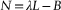

# 第二章 CUDA 在机器学习与优化中的应用  

# 建模与仿真

数学建模和数值模拟是应用数学中两个重要、独立但又紧密联系的方面。数学模型是现实的抽象，可用于分析和预测。数值模拟基于将数学模型映射到计算机应用中。结合起来，建模和模拟是推进人类对复杂现象理解的强大技术。本书不打算复制或为已经发表的大量建模和模拟工作提供新的洞见。根据你的特定兴趣领域，有许多优秀的文献提供精确和详细的介绍。我们的重点是提供利用 CUDA 进行大规模并行硬件的工具，以便读者在自己选择的领域做出贡献。创建模型有两种通用方法：1. 基于第一原理分析和其他技术的人类派生模型，当这些模型可用时，它们能够深入了解正在研究的现象，一位通晓 CUDA 编程的人可以通过将计算高效映射到并行硬件来提高性能，并能扩展到尽可能多的处理单元。文献显示，设计良好且编写良好的 CUDA 应用程序能够提供两个数量级的性能增加（Hwu, 2011; Stone et al., 2010）。这样的性能是颠覆性的，以前需要一年才能完成的模拟现在可以在几天内完成。通过使用更准确和详细的逼近可以实现更高的模拟精度，尤其是非线性问题可以从 NVIDIA 的特殊功能单元（SFU）中获益，这些单元计算几个超越函数（例如**log**()、**exp**()、**sin()**、**cos**()等）的速度约为传统处理器的 25 倍。2. 参数化模型通过拟合数据推导的参数化模型比人类派生模型构建起来要简单得多，有许多技术可以创建能够很好概括的准确模型，神经网络就是一个例子（Lapedes & Farber, 1987b）。总的来说，将模型拟合到数据的过程是一个计算成本昂贵的过程，其运行时间按 O(*N*²)及更高速度增长，其中*N*是数据项的数量。并行处理可以使许多这些方法变得可行，甚至通过将运行时间减少到接近处理单元数量的因子，使其具有交互性。包含数百个处理单元的单个 GPU 有可能将运行时间减少两个以上数量级。通过在多个 GPU 上巧妙地分割问题，可以按 GPU 数量扩展可用处理单元的数量。在建模表现非线性行为的系统时会遇到特定挑战。非线性系统不总是按照输入刺激成比例地响应，这意味着其行为不能仅基于某些输入或系统刺激的线性组合建模。尽管具有挑战性，非线性系统引发许多有趣的现象，包括自组织系统、混沌行为和生命现象。

## 拟合参数化模型

模型拟合可以被表述为一种函数优化形式，其中一组模型参数，*P*，会被调整以最小化误差并拟合某个数据集。误差由*目标函数*确定，有时也称为*代价函数*，它评估模型对于一组模型参数在数据集上的拟合程度。一种常见的技术是将曲线拟合到一组*N*数据点，以最小化预测点与已知点在曲线上的距离的平方和。参见公式 2.1，“差异平方和误差”。(2.1)由于差异的平方和始终是正数，因此完美拟合将导致零误差。不幸的是，这种情况很少发生，因为大多数数值技术都容易受到*局部最小值*的影响，这意味着数值方法可能会在代价函数的某个低点处停滞，无法逃脱。因此，无法保证找到*全局最小值*或最佳整体拟合。许多流行的库和工具可以用来寻找多变量函数的最小值。书籍《数值方法》是一个极好的信息来源（Press 等人, 2007），它还提供了可工作的源代码。¹有许多免费的和授权的数值工具包可用，包括 SLATEC、NAG（数值算法组）、MINPACK、GNU 科学库、MATLAB、Octave、scipy、gnuplot、SAS、Maple、Mathematica、STATLIB 等大量工具包。¹《数值方法》的源代码是受版权保护的，因此我们不会使用它，因为我们更倾向于提供完整的工作示例。

## Nelder-Mead 方法

Nelder-Mead 方法是一种常用的*直接搜索*非线性优化技术（Nelder & Mead, 1965）。该算法使用一个*单纯形*进行搜索，单纯形是*N*维空间中的一种广义三角形。该方法在每个顶点上评估用户提供的函数，然后在找到更好的点时逐步缩小单纯形。当达到所需的边界或其他终止条件时，方法终止。尽管存在一些限制（McKinnon & McKinnon, 1999；Kolda, Lewis, & Torczon, 2007），Nelder-Mead 方法随着时间的推移被证明是有效的，并且计算上非常紧凑。原始的 FORTRAN 实现通过 STATLIB 提供。John Burkhardt 创建了一个简洁的 C 语言实现，并将其免费提供在他的网站上。² 本章末尾的 C++ 模板改编允许轻松比较单精度和双精度主机与 GPU 的性能。²[`people.sc.fsu.edu/~jburkardt/cpp_src/asa047/asa047.html`](http://people.sc.fsu.edu/~jburkardt/cpp_src/asa047/asa047.html)。

## Levenberg-Marquardt 方法

Levenberg-Marquardt 算法（LMA）是一种流行的*信赖区域*算法，用于在参数空间中寻找一个函数（无论是线性还是非线性）的最小值。实质上，目标函数的信赖区域通过某种函数（例如二次函数）进行内建建模。当找到合适的拟合时，信赖区域会被扩展。与许多数值技术一样，Levenberg-Marquardt 方法可能对初始参数敏感。有关 Levenberg-Marquardt 的优秀技术概述以及参考资料可以在 levmar 网站上找到。³ 另一个优秀的资源是*Numerical Recipes*。³[`www.ics.forth.gr/~lourakis/levmar/index.html#download`](http://www.ics.forth.gr/~lourakis/levmar/index.html#download)。在传统的 Levenberg-Marquardt 实现中，*有限差分*被用来近似*雅可比矩阵*。雅可比矩阵是一个包含被优化函数所有一阶偏导数的矩阵。这个矩阵非常方便，因为用户只需提供一个函数给库即可。原始的 FORTRAN 公共领域 MINPACK 例程 lmdif 多年来证明是一个可靠的软件——甚至已经被多种编程语言实现。两个优秀的 C/C++ 实现是 levmar 和 lmfit。为了比较目的，示例中使用了 levmar 库，因为它提供了单精度和双精度例程。读者需要下载并安装 levmar 包才能运行这些示例。levmar 网站提供了适用于 Microsoft 和 UNIX 系统的安装说明。为了支持单精度和双精度性能测试，创建了利用 C++ *多态性* 的包装器，根据传递给包装器的参数类型，调用适当的库函数。这些包装器还提供了必要的接口，以将目标函数传递给 levmar 库，后者期望一个指向函数的指针。请参见示例 2.1，“使用包装器考虑变量类型。”`//包装器，用于 levmar 的单精度和双精度调用``inline int levmar_dif( void (*func)(float *, float *, int, int, void *),``float *p, float *x, int m, int n, int itmax,``float *opts, float *info, float *work, float *covar, void* data)``{``return slevmar_dif(func, p, x, m, n, itmax, opts, info, work, covar, data);``}``inline int levmar_dif( void (*func)(double *, double *, int, int, void *),``double *p, double *x, int m, int n, int itmax,``double *opts, double *info, double *work, double *covar, void* data)``{``return dlevmar_dif(func, p, x, m, n, itmax, opts, info, work, covar, data);``}``

## 算法加速

本书仅讨论目标函数的评估。读者应注意，数值近似梯度可能会带来求解时间的惩罚。许多优化技术，如共轭梯度法，通过使用计算目标函数导数的函数**dfunc()**，能够大大加速找到最小值的过程。Saunders、Simon 和 Yip 指出，共轭梯度法在有限步数后保证终止（在精确算术下），并且该方法每一步都会减少某种误差度量，而且每步的计算要求是恒定的（Saunders, Simon, & Yip, 1988）。在实践中，累积的浮点数舍入误差会导致精度逐渐丧失，从而影响收敛速度。尽管如此，共轭梯度法仍广泛应用于无法使用精确算法解决的问题。许多符号微分工具存在，帮助程序员编写或自动生成使用符号数学的导数。例如 GiNaC（GiNaC 代表 GiNaC is Not a CAS，其中 CAS 代表计算机代数系统）。GiNaC 是一个可以自由下载的 C++库，程序员可以将其用于将符号数学集成到他们的应用程序中。与其他符号数学包不同，GiNaC 将 C++作为输入。程序员可以利用该库的代数功能执行有用的任务，如符号微分。GiNaC 网站（[`www.gniac.de`](http://www.gniac.de)）声称它被设计为替代流行的 Maple CAS 背后的符号数学引擎。其他的包还包括 Maple 和 Mathematica。

# 机器学习与神经网络

人工神经网络（ANN）是一种机器学习技术，它基于观察到的数据推断一个函数（即一种带参数的模型）。当教师将反映期望或已知结果的已知值与每个训练示例相关联时，*监督学习*就发生了。当提供了一个优度或拟合度度量时，*无监督学习*就会发生。由神经网络推断出的函数具有预测能力，这意味着它们能够正确预测时间序列中的未来值，响应并适应复杂和不可预见的刺激，并执行分类任务。一个著名的早期示例是 nettalk，它训练了一个神经网络来朗读英语文本（Sejnowski & Rosenberg, 1987）。nettalk 数据仍然可以下载。⁴⁴[`archive.ics.uci.edu/ml/datasets/Connectionist+Bench+(Nettalk+Corpus)`](http://archive.ics.uci.edu/ml/datasets/Connectionist+Bench+(Nettalk+Corpus))。训练人工神经网络可以表达为一个函数优化问题，目标是确定最佳的网络参数（例如，内部网络的权重和偏置），以最小化初始数据集上的误差。拟合或训练过程是计算上昂贵的，因为它需要反复调用目标函数，并对训练数据中的每个示例评估参数集。每次目标函数评估的运行时间是 O(*N*[param] × *N*[data])。在大多数情况下，参数的数量相对于训练数据的大小较小，这意味着总体运行时间主要由数据集的大小决定。在训练过程中，神经网络试图将一个多维表面拟合到训练数据中（Lapedes & Farber, 1987a）。不幸的是，*维度灾难*告诉我们，随着数据维度的增加，必须搜索、采样和建模的空间体积呈指数增长。例如，在 0 到 1 的 1 维单位区间内以 0.01 的步长均匀采样需要 100 个样本，而对一个 10 维单位超立方体进行采样则需要(100)¹⁰或 10²⁰个样本。⁵ 即使是稀疏采样，平滑的高维表面也可能需要许多数据点。许多有趣的现象需要拟合复杂、崎岖的高维表面，这可能会显著增加所需的训练数据量，从而使得能够以可接受的精度逼近多维表面的模型的训练数据量大幅增加。⁵这个例子改编自[Wikipedia.org](http://Wikipedia.org)的“维度灾难”示例。[`en.wikipedia.org/wiki/Curse_of_dimensionality`](http://en.wikipedia.org/wiki/Curse_of_dimensionality))。当使用像 Nelder-Mead、Levenberg-Marquardt、Powell 方法、共轭梯度等流行的优化技术时，昂贵的目标函数往往主导运行时间。在这种情况下，最好集中精力减少目标函数的运行时间。将问题高效映射到具有数百个并行线程的 GPGPU 上，可能会将运行时间减少两个数量级，而在单线程系统中，正如方程 2.2 中所示，“基于 ANN 的目标函数的并行运行时间。”相反，一个四核处理器最多只能将运行时间减少 4 倍。（2.2）。本章中的示例表明，即使考虑到所有 GPU 通信开销，CUDA 仍然可以比传统多核处理器上的实现减少 50 到 100 倍的运行时间。尽管这是并行系统普遍已知的结果（Farber, 1992；Thearling, 1995），但令人惊讶的是，即使使用游戏 GPU 也能实现如此高水平的性能。

# XOR：一个重要的非线性机器学习问题

Andreas Weigend 在《*神经计算理论导论*》中提到：为了对比“无泛化的学习”和“有泛化的学习”，我们不妨考虑一下广泛而又热烈庆祝的事实，即神经网络可以学习实现异或（XOR）功能。但——这算是哪种学习呢？当四种情况全部明确时，并不存在泛化！学习真值表不过是死记硬背：学习 XOR 和记住电话簿一样无聊。更有趣——也更现实——的是现实世界中的问题，比如财务数据的预测。在预测中，没人关心模型与训练数据的拟合程度——只有未来预测的质量才重要，即在新数据上的表现或者泛化能力。学习意味着从训练示例中提取规律，这些规律能转移到新的示例上。(Hertz, Krogh, & Palmer, 1991, p. 5) 1969 年，一本名为《*感知机*》的著作 (Minsky & Papert, 1969) 证明了当时所谓的单层网络——感知机（图 2.1）——无法表示基本的 XOR 逻辑功能。这一发现具有毁灭性影响，因为神经网络这一新兴领域的资金和兴趣迅速蒸发。

|  |
| --- |
| **图 2.1** 感知机示例。 |

十多年过去，直到神经网络研究突然再次引起兴趣。上世纪 80 年代中期，一篇论文展示了神经模型可以解决旅行推销员问题（Hopfield & Tank, 1985）。不久之后，反向传播算法被创建出来（Rummelhardt, Hinton, & Williams, 1986; Rummelhart, McClelland, & the PDP Research Group, 1987）。一项关键的演示表明，可以训练多层 ANN 来复制 XOR 真值表。在接下来的几年里，神经网络研究领域和其他相关的机器学习领域迅速发展。学会学习和模拟 XOR 真值表的重要性在于理解*计算通用*设备的概念。图灵机是计算通用设备的一个例子（Hopcroft & Ullman, 2006），因为它们可以理论上用来模拟任何其他计算设备。区分 ANN 和感知机，安德烈亚斯·韦根德观察到：在输入和输出之间插入一个非线性单元的中间层时，计算能力显著增加。XOR 的例子很好地强调了这种隐藏单元的重要性：它们重新表现输入，使问题变得线性可分。没有隐藏单元的网络无法学习记忆 XOR，而具有隐藏单元的网络可以实现任何布尔函数（Hertz, Krogh, & Palmer, 1991，第 6 页）。换句话说，模拟 XOR 的能力对于证明多层 ANN 是通用计算设备，而没有任何隐藏神经元的感知器是有限的计算设备至关重要。正是额外的非线性隐藏层赋予了 ANN 模拟其他计算设备的能力。事实上，只需要两层来执行建模和预测任务以及符号学习（Lapedes & Farber, 1987a）。然而，巧妙的人类辅助设计可以创建利用更少参数的更小网络，尽管有超过两个隐藏层（Farber et al., 1993）。图 2.2 显示了一个带有一个隐藏神经元的 XOR 神经网络，实现了如图 2.3 所示的 S 形函数。

|  |
| --- |
| **图 2.2** 一个 XOR 网络。 |
|  |
| **图 2.3** 一个示例的 S 型 G 函数：tanh(x)。 |

## 一个示例目标函数

**thrust::transform_reduce** 模板使得目标函数的实现既直接又简单。例如，人工神经网络的最小二乘目标函数需要定义一个变换操作符，该操作符计算网络在训练数据集中的每个样本上的误差平方。接着，归约操作计算平方误差的总和。Thrust 使用 *函数对象* 来执行变换和归约操作以及其他通用方法。在 C++ 中，函数对象重载了函数调用运算符“()”，使得一个对象可以替代普通函数使用。这有几个重要的含义：1\. 函数对象可以像 C 语言程序员使用函数指针一样，传递给通用算法，如 **thrust::transform_reduce**。2\. 传递和使用函数对象非常高效，因为 C++ 可以将函数对象代码内联。这消除了函数调用开销，并使得编译器能够进行更多的优化。3\. C++ 函数对象可以保持持久的内部状态。正如你将看到的，这种方法在处理不同的设备、GPU 和线程内存空间时非常有用。函数对象的内联对性能至关重要，因为像 **thrust::plus** 这样的常见函数对象只执行非常小的计算。如果不能内联函数对象，像 **thrust::transform_reduce** 这样的通用方法将无法实现，因为函数调用开销将消耗几乎与函数对象本身一样多（甚至更多）的时间。Thrust 文档中提到了 *内核融合*，它将多个函数对象合并为一个内核。根据我们的 GPGPU 编程第二条规则，内核融合增加了每次内核调用的 GPGPU 利用率，这可以避免内核启动延迟。同样重要的是，许多通用方法，如 **thrust::transform_reduce** 模板，避免了将中间值存储到内存中，这样在执行函数对象计算时无需中间存储。这一点符合我们 GPGPU 编程的第三条规则：专注于 GPGPU 内的数据重用，以避免内存带宽限制。Thrust 快速入门指南中的 SAXPY 示例清晰明了地展示了内核融合带来的性能优势。

## 一个用于多个 GPU 设备和主机处理器的完整函子

以下示例，示例 2.2，“XOR 函数器 for CalcError.h”，是一个完整的 XOR 函数器。粗体部分展示了计算 XOR 神经网络的代码简洁性，该神经网络如 图 2.2 所示，并包含训练集中每个示例的误差。`// XOR 的 CalcError 函数器``static const int nInput = 2;``static const int nH1 = 1;``static const int nOutput = 1;``static const int nParam =``(nOutput+nH1) // 神经元偏移量``+ (nInput*nH1) // 从 I 到 H1 的连接``+ (nH1*nOutput) // 从 H1 到 O 的连接``+ (nInput*nOutput); // 从 I 到 O 的连接``static const int exLen = nInput + nOutput;``struct CalcError {``const Real* examples;``const Real* p;``const int nInput;``const int exLen;``CalcError( const Real* _examples, const Real* _p,``const int _nInput, const int _exLen)``: examples(_examples), p(_p), nInput(_nInput), exLen(_exLen) {};``**__device__ __host__**``**Real operator()(unsigned int tid)**``**{**``**const register Real* in = &examples[tid * exLen];**``**register int index=0;**``**register Real h1 = p[index++];**``**register Real o = p[index++];**``**h1 += in[0] * p[index++];**``**h1 += in[1] * p[index++];**``**h1 = G(h1);**``**o += in[0] * p[index++];**``**o += in[1] * p[index++];**``**o += h1 * p[index++];**``**// 计算差异的平方**``**o -= in[nInput];**``**return o * o;**``**}**``};`前面示例中的非线性传输函数 **G** 使用双曲正切 **tanh** 来定义一个 S 形曲线，如 图 2.3 所示。其他常见的 S 形函数包括逻辑函数、分段线性函数等。你可以轻松更改 **G** 的定义，来尝试这些其他函数。需要注意的是，前面代码片段中突出的两个 CUDA 函数限定符，**__device__** 和 **__host__**，指定了一个函数器可以同时在主机处理器和一个或多个 GPU 设备上运行。函数器的这种双重使用使得创建混合型的 CPU/GPU 应用程序变得更加方便，这些应用程序可以在系统中所有可用的计算资源上运行。它还使得对 GPU 和主机实现的性能比较更加容易。这个函数器还使用持久性来封装设备上的数据，这将数据与计算绑定，并允许工作在多个设备和设备类型之间分配。当然，函数器使用的指向向量的指针也应位于运行该函数器的设备上，否则将需要不必要的内存传输。CUDA 4.0 提供了一个统一的虚拟地址空间，允许运行时仅通过内存指针识别包含内存区域的设备。数据可以直接在设备之间传输。尽管这种直接传输效率较高，但它仍然受到 PCIe 带宽的限制。

## 完整的 Nelder-Mead 优化代码简要讨论

接下来的讨论将详细讲解一个完整的 Nelder-Mead 推力 API GPU 示例，该示例提供了单精度和双精度对象实例化、数据生成、Nelder-Mead 方法的运行时配置，以及一个测试函数，用于验证网络是否正确训练。如果需要，本节中的代码片段可以结合起来，创建一个完整的*xorNM.cu*源文件。或者，可以从本书的官方网站下载该示例的完整版本。⁶⁶[`booksite.mkp.com/9780123884268`](http://booksite.mkp.com/9780123884268)目标函数计算能量。在本示例中，能量是模型在给定参数集下产生的误差的平方和，如公式 2.3 所示。(2.3)使用优化方法来使参数与数据拟合，从而最小化误差。在本示例中使用了 Nelder-Mead 方法，但也可以使用许多其他数值技术，例如 Powell 方法。如果目标函数的导数可以编写，则可以使用更高效的数值算法，如共轭梯度法，以加速最小化过程。这些算法在理想情况下可以将运行时间缩短为参数数量的倍数。计算过程分为三步，如图 2.4 所示。为了通用性，展示了多个 GPU，尽管本章中的示例仅在一个 GPU 上运行：  

|  |
| --- |
| **图 2.4** 优化映射。 |

以下示例源代码使用预处理器条件语句来指定机器类型和运行精度，这些可以在编译时通过命令行进行指定。尽管条件编译确实会使源代码复杂化并影响代码的可读性，但在实际应用中这是不可避免的，因为它有助于代码重用和支持多种机器类型。因此，本书中使用了条件编译。以下条件在示例 2.3“xorNM.cu 的第一部分”中使用：  

# XOR 性能结果

表 2.1 提供了在不同精度、优化技术和操作系统配置下计算 XOR 目标函数的平均时间的排序列表。性能使用 2.53 GHz 四核 Xeon e5630 和 NVIDIA C2070（关闭了 ECC，ECC 指错误检查和校正内存，意味着内存子系统会检查内存错误，这可能会减慢性能。）进行测量。表中还显示了一款便宜的 GeForce GTX280 游戏 GPU 在执行单精度 Nelder-Mead 优化时的性能。

**表 2.1** 训练 XOR 神经网络时的观察时间

| 操作系统 | 机器 | 优化方法 | 精度 | 平均目标函数时间 | 函数时间百分比 | 相比四核加速比 | 相比单核加速比 |
| --- | --- | --- | --- | --- | --- | --- | --- |
| Linux | NVIDIA C2070 | Nelder-Mead | 32 | 0.00532 | 100.0 | 85 | 341 |
| Win7 | NVIDIA C2070 | Nelder-Mead | 32 | 0.00566 | 100.0 | 81 | 323 |
| Linux | NVIDIA GTX280 | Nelder-Mead | 32 | 0.01109 | 99.2 | 41 | 163 |
| Linux | NVIDIA C2070 | Nelder-Mead | 64 | 0.01364 | 100.0 | 40 | 158 |
| Win7 | NVIDIA C2070 | Nelder-Mead | 64 | 0.01612 | 100.0 | 22 | 87 |
| Linux | NVIDIA C2070 | Levenberg-Marquardt | 32 | 0.04313 | 2.7 | 10 | 38 |
| Linux | NVIDIA C2070 | Levenberg-Marquardt | 64 | 0.08480 | 4.4 | 6 | 23 |
| Linux | Intel e5630 | Levenberg-Marquardt | 32 | 0.41512 | 21.1 |  |  |
| Linux | Intel e5630 | Levenberg-Marquardt | 64 | 0.49745 | 20.8 |  |  |
| Linux | Intel e5630 | Nelder-Mead | 32 | 0.45312 | 100.0 |  |  |
| Linux | Intel e5630 | Nelder-Mead | 64 | 0.53872 | 100.0 |  |  |

# 性能讨论

计算 XOR 目标函数的平均时间如 表 2.1 所示，基于使用 OpenMP **omp_get_wtime()** 方法收集的 *墙钟时间*。墙钟时间是一种不可靠的性能测量工具，因为主机上运行的其他进程可能会影响计时的准确性。⁸第三章 讨论了更先进的 CUDA 性能分析工具，如 Linux 上的 NVIDIA 可视化分析器和 Windows 上的 Parallel Nsight。⁸值得注意的是，其他进程的微小延迟（例如，短暂的启动和停止）可能会导致在大规模运行的程序中出现显著的性能下降，正如论文《失踪的超级计算机性能》（Petrini, Kerbyson, & Pakin, 2003）中所讨论的那样。基于云的计算环境，尤其是那些使用虚拟机的环境，对抖动特别敏感。所有测试都在空闲系统上进行，以获得最准确的结果。报告的加速比基于目标函数计算过程中消耗的平均墙钟时间，包括目标函数所需的所有主机和 GPU 数据传输。OpenMP 被用于将主机仅测试进行多线程处理，以利用 Xeon 处理器的四个核心。正如 表 2.1 所示，在 Linux 上运行单精度测试时，NVIDIA C2070 GPGPU 实现了最佳性能。20 系列 Fermi 架构的改进将双精度性能提高到了单精度性能的两倍以内，这比之前的 NVIDIA GPGPU 代数性能要好得多。尽管如此，这些较旧的 GPU 仍然非常强大，正如 NVIDIA 10 系列 GeForce GTX280 游戏 GPU 在四核 Xeon 处理器上提供的单精度性能比值提高了 41 倍所示。这款中端游戏 GPU 也提供了约 C2070 单精度性能的一半。Levenberg-Marquardt 的结果很有趣，因为与 Nelder-Mead 结果相比，性能数量级的下降凸显了从 GPU 到主机传输测量向量的成本，以及 Levenberg-Marquardt 所需的主机计算性能。这个 Levenberg-Marquardt 优化问题的特定分区需要大量数据传输。传输的大小随着数据的增大而增加，因此引入了一个扩展障碍，使得在更大问题和多 GPU 数据集的情况下可能变得过于昂贵。然而，Levenberg-Marquardt 仍然是 GPU 计算中有效的技术，因为它可以在其他技术失败时找到良好的最小值。反直觉的是，它也可能运行得更快，因为它可能只需要几次函数调用就能找到最小值。相比之下，Nelder-Mead 不会强加可扩展性限制，因为它仅要求 GPU 返回一个浮动点值。其他优化方法，如 Powell 方法和共轭梯度法，也具有这一理想特性。使用如 Powell 方法和共轭梯度法等替代优化方法，经过改编的此示例代码已被证明能够扩展到 TACC Longhorn GPGPU 集群上的 500 多个 GPGPU，以及 TACC Ranger 和 Thinking Machines 超级计算机上的数万个处理器（Farber, 1992; Thearling, 1995）。图 2.5 显示了在 500 个 GPU 上运行时观察到的最小和最大加速比。据认为，连接 Longhorn GPU 集群上分布式节点的网络是导致这种变化的原因。基准测试是在空闲系统上运行的。更多关于多 GPU 应用程序的内容将在本书后面的 第七章 和应用 第九章、第十章、第十一章 以及 第十二章 中讨论。

|  |
| --- |
| **图 2.5** 扩展到 500 个 GPU 的结果。 |

许多数值库采用的通用方法的优点在于，通过简单地定义一个感兴趣的新函数，应用程序员可以利用该库解决许多问题。例如，本章中的源代码将在第三章中进行修改，以使用一个不同的函数对象，该对象将执行主成分分析（PCA，Principal Components Analysis）。PCA 以及其非线性变体 NLPCA（非线性主成分分析）在视觉研究和手写分析中有广泛的应用（Hinton & Salakhutdinov, 2006）⁹，以及在生物建模（Scholz, 2011）、金融建模、互联网搜索和许多其他商业与学术领域也有应用。⁹可在线访问：[`www.cs.toronto.edu/~hinton/science.pdf`](http://www.cs.toronto.edu/~hinton/science.pdf)。其他强大的机器学习技术，如隐马尔可夫模型（HMM）、遗传算法、贝叶斯网络等，也能在 GPGPU 硬件上很好地并行化。与神经网络一样，每种技术都有其优缺点。通过重新定义目标函数，相同的示例代码可以实现其他流行的技术，如：■ 优化■ 局部加权线性回归（LWLR）■ 朴素贝叶斯（NB）■ 高斯判别分析（GDA）■ K 均值■ 逻辑回归（LR）■ 独立成分分析（ICA）■ 期望最大化（EM）■ 支持向量机（SVM）■ 其他，如多维尺度（MDS）、有序 MDS 和其他变体

# 总结

目前的 GPGPU 拥有的峰值浮点运算能力，甚至超出了即使是最先进的高性能计算（HPC）中心所能提供的机器，直到 1996 年 12 月，桑迪亚国家实验室的一台超级计算机每秒执行了万亿次浮点运算。许多利用这种 TeraFlop 超级计算机进行前沿研究的提案，今天可以通过世界任何地方的学生，在工作站中使用几块 GPGPU 结合快速 RAID（冗余独立磁盘阵列）磁盘子系统来完成。本章讨论的技术和示例可以应用于多种数据拟合、数据分析、维度缩减、视觉和分类问题。方便的是，它们可以从笔记本电脑扩展到有效利用全球最大超级计算机。掌握 CUDA 的程序员可以将这股新的计算能力带入传统项目中。除了应用速度更快外，GPGPU 技术还可以通过利用更准确的近似和计算技术，推动技术的进步，并最终创建更精确的模型。无论在商业还是学术领域，竞争都非常激烈，这也是为什么 GPU 计算在商业产品和科学研究中产生如此巨大影响的原因。竞争是全球性的；这种硬件对任何有意参与竞争的人都可以访问，而不是像过去那样，仅限于那些能够使用大型并行计算机的相对较小群体。

# C++ Nelder-Mead 模板

`#ifndef NELMIN_H``#define NELMIN_H``// Nelder-Mead 最小化算法 ASA047``// 来自 STATLIB 中的应用统计算法``// 由 J. Burkhardt 改编自 C 版本``//`[`http://people.sc.fsu.edu/~jburkardt/c_src/asa047/asa047.html`](http://people.sc.fsu.edu/~jburkardt/c_src/asa047/asa047.html)`template <typename Real>``void nelmin ( Real (*fn)(Real*), int n, Real start[], Real xmin[],``Real *ynewlo, Real reqmin, Real step[], int konvge, int kcount, int *icount, int *numres, int *ifault )``{``const Real ccoeff = 0.5;``const Real ecoeff = 2.0;``const Real eps = 0.001;``const Real rcoeff = 1.0;``int ihi,ilo,jcount,l,nn;``Real del,dn,dnn;``Real rq,x,y2star,ylo,ystar,z;``//检查输入参数。``if ( reqmin <= 0.0 ) { *ifault = 1; return; }``if ( n < 1 ) { *ifault = 1; return; }``if ( konvge < 1 ) { *ifault = 1; return; }``vector<Real> p(n*(n+1));``vector<Real> pstar(n);``vector<Real> p2star(n);``vector<Real> pbar(n);``vector<Real> y(n+1);``*icount = 0;``*numres = 0;``jcount = konvge;``dn = ( Real ) ( n );``nn = n + 1;``dnn = ( Real ) ( nn );``del = 1.0;``rq = reqmin * dn;``//初始化或重启循环。``for ( ; ; ) {``for (int i = 0; i < n; i++ ) { p[i+n*n] = start[i]; }``y[n] = (*fn)( start );``*icount = *icount + 1;``for (int j = 0; j < n; j++ ) {``x = start[j];``start[j] = start[j] + step[j] * del;``for (int i = 0; i < n; i++ ) { p[i+j*n] = start[i]; }``y[j] = (*fn)( start );``*icount = *icount + 1;``start[j] = x;``}``//单纯形构造完成。``//``//查找最高和最低的 Y 值。YNEWLO = Y(IHI) 表示``//将被替换的单纯形顶点。``ylo = y[0];``ilo = 0;``for (int i = 1; i < nn; i++ ) {``if ( y[i] < ylo ) { ylo = y[i]; ilo = i; }``}``//内部循环。``for ( ; ; ) {``if ( kcount <= *icount ) {break; }``*ynewlo = y[0];``ihi = 0;``for (int i = 1; i < nn; i++ ) {``if ( *ynewlo < y[i] ) { *ynewlo = y[i]; ihi = i; }``}``//计算 PBAR，单纯形顶点的质心``//排除 Y 值为 YNEWLO 的顶点。``for (int i = 0; i < n; i++ ) {``z = 0.0;``for (int j = 0; j < nn; j++ ) { z = z + p[i+j*n]; }``z = z - p[i+ihi*n];``pbar[i] = z / dn;``}``//通过质心进行反射。``for (int i = 0; i < n; i++ ) {``pstar[i] = pbar[i] + rcoeff * ( pbar[i] - p[i+ihi*n] );``}``ystar = (*fn)( &pstar[0] );``*icount = *icount + 1;``//成功反射，因此进行扩展。``if ( ystar < ylo ) {``for (int i = 0; i < n; i++ ) {``p2star[i] = pbar[i] + ecoeff * ( pstar[i] - pbar[i] );``}``y2star = (*fn)( &p2star[0] );``*icount = *icount + 1;``//检查扩展。``if ( ystar < y2star ) {``for (int i = 0; i < n; i++ ) { p[i+ihi*n] = pstar[i]; }``y[ihi] = ystar;``} else { //保留扩展或收缩。``for (int i = 0; i < n; i++ ) { p[i+ihi*n] = p2star[i]; }``y[ihi] = y2star;``}``} else { //没有扩展。``l = 0;``for (int i = 0; i < nn; i++ ) {``if ( ystar < y[i] ) l += 1;``}``if ( 1 < l ) {``for (int i = 0; i < n; i++ ) { p[i+ihi*n] = pstar[i]; }``y[ihi] = ystar;``}``//在质心的 Y(IHI) 侧进行收缩。``else if ( l == 0 ) {``for (int i = 0; i < n; i++ ) {``p2star[i] = pbar[i] + ccoeff * ( p[i+ihi*n] - pbar[i] );``}``y2star = (*fn)( &p2star[0] );``*icount = *icount + 1;``//收缩整个单纯形。``if ( y[ihi] < y2star ) {``for (int j = 0; j < nn; j++ ) {``for (int i = 0; i < n; i++ ) {``p[i+j*n] = ( p[i+j*n] + p[i+ilo*n] ) * 0.5;``xmin[i] = p[i+j*n];``}``y[j] = (*fn)( xmin );``*icount = *icount + 1;``}``ylo = y[0];``ilo = 0;``for (int i = 1; i < nn; i++ ) {``if ( y[i] < ylo ) { ylo = y[i]; ilo = i; }``}``continue;``}``//保留收缩。``else {``for (int i = 0; i < n; i++ ) {``p[i+ihi*n] = p2star[i];``}``y[ihi] = y2star;``}``}``//在反射侧进行收缩。``else if ( l == 1 ) {``for (int i = 0; i < n; i++ ) {``p2star[i] = pbar[i] + ccoeff * ( pstar[i] - pbar[i] );``}``y2star = (*fn)( &p2star[0] );``*icount = *icount + 1;``//``//保留反射？``//``if ( y2star <= ystar ) {``for (int i = 0; i < n; i++ ) { p[i+ihi*n] = p2star[i]; }``y[ihi] = y2star;``}``else {``for (int i = 0; i < n; i++ ) { p[i+ihi*n] = pstar[i]; }``y[ihi] = ystar;``}``}``}``//检查 YLO 是否改进。``if ( y[ihi] < ylo ) { ylo = y[ihi]; ilo = ihi; }``jcount = jcount − 1;``if ( 0 < jcount ) { continue; }``//检查是否达到最小值。``if ( *icount <= kcount ) {``jcount = konvge;``z = 0.0;``for (int i = 0; i < nn; i++ ) { z = z + y[i]; }``x = z / dnn;``z = 0.0;``for (int i = 0; i < nn; i++ ) {``z = z + pow ( y[i] − x, 2 );``}``if ( z <= rq ) {break;}``}``}``//阶乘测试检查 YNEWLO 是否为局部最小值。``for (int i = 0; i < n; i++ ) { xmin[i] = p[i+ilo*n]; }``*ynewlo = y[ilo];``if ( kcount
