# 第三章. CUDA 工具套件

对 PCA/NLPCA 函数对象进行分析

CUDA 通过在 C 语言中添加几个简单的扩展，实现了高效的 GPGPU 计算。然而，表达的简洁性并不等同于程序执行的简洁性。就像为任何计算机开发应用程序一样，识别性能瓶颈可能会很复杂。遵循用于适应 C 和 C++的相同变更经济原则，NVIDIA 扩展了几个流行的分析工具以支持 GPU 计算。这些工具是大多数 Windows 和 UNIX 开发者已经熟练且舒适使用的，例如**gprof**和 Visual Studio。还增加了额外的工具，如硬件级别的 GPU 分析和可视化分析器。熟悉在 Windows 和 UNIX 下构建、调试和分析软件的开发者应该会发现过渡到 CUDA 非常直接。所有 CUDA 工具均可在 NVIDIA 网站上免费获取，包括 Microsoft Visual Studio 的专业版 Parallel Nsight。**关键词**分析、主成分分析、PCA、NLPCA、数据挖掘、可视化分析器、Parallel NsightCUDA 通过在 C 语言中添加几个简单的扩展，实现了高效的 GPGPU 计算。然而，表达的简洁性并不等同于程序执行的简洁性。就像为任何计算机开发应用程序一样，识别性能瓶颈可能会很复杂。遵循用于适应 C 和 C++的相同变更经济原则，NVIDIA 扩展了几个流行的分析工具以支持 GPU 计算。这些工具是大多数 Windows 和 UNIX 开发者已经熟练且舒适使用的，例如**gprof**和 Visual Studio。还增加了额外的工具，如硬件级别的 GPU 分析和可视化分析器。熟悉在 Windows 和 UNIX 下构建、调试和分析软件的开发者应该会发现过渡到 CUDA 非常直接。所有 CUDA 工具均可在 NVIDIA 网站上免费获取，包括 Microsoft Visual Studio 的专业版 Parallel Nsight。在本章中，将使用 Microsoft 和 UNIX 的 CUDA 分析工具来分析在优化 PCA 和 NLPCA 函数时 Nelder-Mead 优化技术的性能和扩展性。在本章结束时，读者将基本了解以下内容：■ PCA 和 NPLCA 分析，包括该技术应用于数据挖掘、降维、特征提取以及其他数据分析和模式识别问题的适用性。■ 如何使用 CUDA 分析工具来识别算法中的瓶颈和扩展性问题。■ 扩展性问题以及即使是简单的动态内存分配也可能对应用程序的性能产生重大影响。

# PCA 与 NLPCA

主成分分析（PCA）广泛应用于数据挖掘和数据分析中，主要用于（1）降低数据集的维度和（2）从数据集中提取特征。*特征提取*是指识别数据的显著方面或属性，以便在后续任务中使用，如回归或分类（Duda & Hart, 1973）。显然，提取数据集的主要特征有助于数据的解释、分析和理解。PCA 分析通过一组直线来解释数据集中的最大方差，其中每条线是由观察变量的加权线性组合定义的。第一条线，或主成分，解释了最大量的方差；每个后续的成分解释尽可能多的方差，同时保持与前一个成分正交（不相关）。例如，一个雪茄形状的分布需要一条直线（或主成分）来解释图 3.1 中数据集的大部分方差。

| 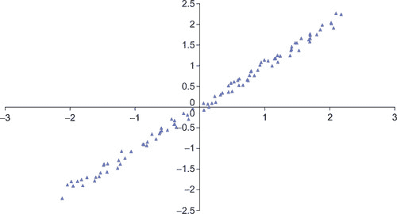 |
| --- |
| **图 3.1** 线性 PCA 数据集。 |

PCA 使用直线；NLPCA 则可以利用连续的开放或闭合曲线来解释数据中的方差（Hsieh, 2004）。圆形就是一种*闭合曲线*的例子，它将自身连接起来，因此没有终点。图 3.2 展示了一个开放曲线。因此，NLPCA 能够在较低维度的空间中表示非线性问题。图 3.2 展示了一个数据集，其中一条曲线就能够解释大部分的方差。

| 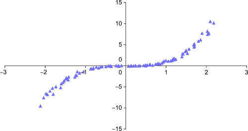 |
| --- |
| **图 3.2** NLPCA 数据集。 |

NLPCA 在许多具有挑战性的问题中具有广泛的应用，包括图像和手写分析（Hinton & Salakhutdinov, 2006; Schölkopf & Klaus-Robert Müller, 1998），以及生物建模（Scholz, 2007）、气候（Hsieh, 2001; Monahan, 2000）和化学（Kramer, 1991）。Geoffrey E. Hinton 在他位于多伦多大学的网站上提供了一系列优秀的教程（Hinton, 2011）。第十章扩展了 MPI（消息传递接口）的应用，使其能够在数百个 GPU 上运行。第十二章提供了一个用于实时视觉分析的工作框架，可以作为探索这些以及更高级技术的起点。

## 自编码器

1982 年，Erkki Oja 提出在神经网络中使用受限数量的线性隐藏神经元或瓶颈神经元来执行 PCA 分析（Oja, 1982）。图 3.3 展示了一个简单的线性网络，具有两个输入和一个隐藏神经元。

| 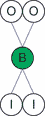 |
| --- |
| **图 3.3** 一个两输入 PCA 网络。 |

这种网络后来被推广用于执行 NLPCA。图 3.1 展示了 Kramer (1991)推荐的一种架构，使用多个隐藏层和一个 sigmoidal 非线性操作符。瓶颈神经元可以是线性的也可以是非线性的。Hsieh 通过在瓶颈处使用圆形节点将这种架构扩展到了闭合曲线（2001）。在训练过程中，人工神经网络（ANN）本质上是自我学习的，因为输入向量被用作已知的输出向量，这迫使网络的下半部分将每个输入向量从高维空间（图 3.4 中的二维）转换到低维空间（从二维到一维），以便网络的上半部分能够在输出神经元上正确地重建原始的高维输入向量。常常使用最小均方误差来确定所有向量的误差。这类网络有时被称为*自编码器*。完美的编码将导致训练集上的零误差，因为每个向量都会在输出神经元上被完全重建。在分析过程中，网络的下半部分被用来计算低维编码。自编码器在文献中已被广泛研究（Hinton & Salakhutdinov, 2006; Kramer, 1991），并且是包括 MATLAB 在内的几个常见工具包的一部分。一个例子是[nlpca.org](http://nlpca.org)上的 nlpca 工具包。

| 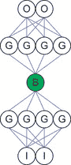 |
| --- |
| **图 3.4** 一个带有瓶颈神经元的 NPLCA 网络。 |

### PCA 分析的一个示例函子

示例 3.1，“实现图 3.3 中网络的 PCA 函数对象”展示了描述 PCA 网络的函数对象的简洁性，该网络如图 3.3 所示。这个函数对象设计为可以替换为来自第二章的 Nelder-Mead 优化源代码，其中包含**Real**的类型定义和本计算中使用的变量。`static const int nInput = 2;``static const int nH1 = 1;``static const int nOutput = nInput;``static const int nParam =``(nOutput+nH1) // 神经元偏移量``+ (nInput*nH1) // 从输入到 H1 的连接``+ (nH1*nOutput); // 从 H1 到输出的连接``static const int exLen = nInput;``struct CalcError {``const Real* examples;``const Real* p;``const int nInput;``const int exLen;``CalcError( const Real* _examples, constReal* _p,``const int _nInput, const int _exLen)``: examples(_examples), p(_p), nInput(_nInput), exLen(_exLen) {};``__device__ __host__``Real operator()(unsigned int tid)``{``const register Real* in = &examples[tid * exLen];``register int index=0;``register Real h0 = p[index++];``for(int i=0; i < nInput; i++) {``register Real input=in[i];``h0 += input * p[index++];``}``register Real sum = 0.;``for(int i=0; i < nInput; i++) {``register Real o = p[index++];``o += h0 * p[index++];``o −= in[i];``sum += o*o;``}``return sum;``}``};`示例 3.2，“线性数据生成器”，定义了子程序**genData()**，该子程序基于方程 3.1 中显示的两个变量*z*1 和*z*2 之间的线性关系创建一个二维数据集。噪声根据两个均匀分布的序列*e*1 和*e*2（均值为零）叠加到*t*上。使用 0.1 的方差来生成训练数据，并用于图 3.1。`template <typename Real>``void genData(thrust::host_vector<Real> &h_data, int nVec, Real xVar)``{``Real xMax = 1.1; Real xMin = −xMax;``Real xRange = (xMax − xMin);``for(int i=0; i < nVec; i++) {``Real t = xRange * f_rand();``Real z1 = t +xVar * f_rand();``Real z2 = t +xVar * f_rand();``h_data.push_back( z1 );``h_data.push_back( z2 );``}``}`(3.1)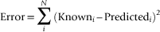图 3.5 显示了 PCA 网络如何使用**genData**（零方差，*xVar*为零）重建 100 个随机生成的数据点。

| 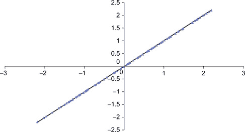 |
| --- |
| **图 3.5** 使用 Nelder-Mead 算法训练的 PCA 网络重建 100 个随机点。 |

该示例的完整源代码可以从本书的网站下载。希望适配*xorNM.cu*示例的读者可以参考第二章中的函数对象，以及示例 3.1 中的数据生成器和示例 3.2 中的内容。此外，正确性测试需要进行修改。为了达到高精度，本示例要求**kcount**设置为 50000。

### NLPCA 分析的示例函数对象

示例 3.3 中的 NLPCA 运算符实现了图 3.4 所示的网络。这个运算符设计用来替代第二章中的 Nelder-Mead 优化源代码，其中包含了**Real**的类型定义以及该计算中使用的变量。`static const int nInput = 2;``static const int nH1 = 4;``static const int nH2 = 1;``static const int nH3 = 4;``static const int nOutput = nInput;``static const int nParam =``(nOutput+nH1+nH2+nH3) // 神经元偏移量``+ (nInput*nH1)// 从 I 到 H1 的连接``+ (nH1*nH2)// 从 H1 到 H2 的连接``+ (nH2*nH3)// 从 H2 到 H3 的连接``+ (nH3*nOutput); // 从 H3 到 O 的连接``static const int exLen = nInput;``struct CalcError {``const Real* examples;``const Real* p;``const int nInput;``const int exLen;``CalcError( const Real* _examples, const Real* _p,``const int _nInput, const int _exLen)``: examples(_examples), p(_p), nInput(_nInput), exLen(_exLen) {};``__device__ __host__``Real operator()(unsigned int tid)``{``const register Real* in = &examples[tid * exLen];``register int index=0;``register Real h2_0 = p[index++]; // 瓶颈神经元``{``register Real h1_0 = p[index++];``register Real h1_1 = p[index++];``register Real h1_2 = p[index++];``register Real h1_3 = p[index++];``for(int i=0; i < nInput; i++) {``register Real input=in[i];``h1_0 += input * p[index++]; h1_1 += input * p[index++];``h1_2 += input * p[index++]; h1_3 += input * p[index++];``}``h1_0 = G(h1_0); h1_1 = G(h1_1);``h1_2 = G(h1_2); h1_3 = G(h1_3);``h2_0 += p[index++] * h1_0; h2_0 += p[index++] * h1_1;``h2_0 += p[index++] * h1_2; h2_0 += p[index++] * h1_3;``}``register Real h3_0 = p[index++];``register Real h3_1 = p[index++];``register Real h3_2 = p[index++];``register Real h3_3 = p[index++];``h3_0 += p[index++] * h2_0; h3_1 += p[index++] * h2_0;``h3_2 += p[index++] * h2_0; h3_3 += p[index++] * h2_0;``h3_0 = G(h3_0); h3_1 = G(h3_1);``h3_2 = G(h3_2); h3_3 = G(h3_3);``register Real sum = 0.;``for(int i=0; i < nOutput; i++) {``register Real o = p[index++];``o += h3_0 * p[index++]; o += h3_1 * p[index++];``o += h3_2 * p[index++]; o += h3_3 * p[index++];``o -= in[i];``sum += o*o;``}``return sum;``}``};`**genData**方法被修改，以定义一个非线性关系，*z*1 和*z*2 与*e*1 和*e*2 之间的关系，如前文中 PCA 数据生成器所述。示例 3.4 使用方程 3.2 实现了一个非线性数据生成器。(3.2)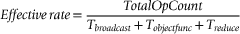`template <typename Real>``void genData(thrust::host_vector<Real> &h_data, int nVec, Real xVar)``{``Real xMax = 1.1; Real xMin = -xMax;``Real xRange = (xMax - xMin);``for(int i=0; i < nVec; i++) {``Real t = xRange * f_rand();``Real z1 = t +xVar * f_rand();``Real z2 = t*t*t +xVar * f_rand();``h_data.push_back( z1 );``h_data.push_back( z2 );``}``}`图 3.6 显示网络找到了一个合理的解，并且瓶颈处有一个神经元。散点图重建了曲线上 100 个随机选择点的高维数据。

| 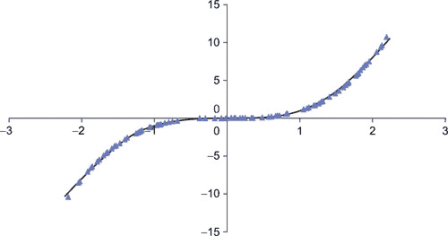 |
| --- |
| **图 3.6**NLPCA Nelder-Mead 训练曲线与 100 个随机测试点叠加。 |

完整的源代码可以从本书的网站下载。

# 获取基本的个人资料信息

通过使用环境变量**CUDA_PROFILE**，可以启用低级 GPU 分析信息的收集。将此变量设置为 1 会告诉 CUDA 从 GPU 的硬件计数器收集运行时分析信息。收集这些信息不需要特殊的编译器标志，也不会影响应用程序的性能。将**CUDA_PROFILE**设置为 0 则禁用分析信息的收集。默认情况下，CUDA 分析器会将信息写入当前目录下的文件*cuda_profile_0.log*。目标文件的名称可以通过环境变量**CUDA_PROFILE_LOG**进行更改。此外，用户还可以指定一个选项文件，通过环境变量**CUDA_PROFILE_CONFIG**选择要从硬件计数器收集的特定信息。可以收集的分析信息的类型和数量因 GPU 代际而异。请参考 NVIDIA 分析器文档，查看可从您的 GPGPU 收集的信息。在运行**nlpcaNM_GPU32**并将**CUDA_PROFILE**设置为 1 后，检查*cuda_profile_0.log*的内容，可以看到这确实是原始的分析器输出。仅查看前几行，可以看到应用程序启动后，从主机到设备发生了多个数据传输，我们可以推测这些是训练集、参数和其他信息移动到 GPGPU 的过程。在示例 3.5 中突出显示了一个报告的*occupancy*值，这是 GPU 线程级并行化（TLP）的度量。高的 occupancy 通常是好的，但高的应用程序性能也可以通过低 occupancy 的应用程序实现，这些应用程序通过高指令级并行性（ILP）来提高性能。要理解 occupancy，您需要了解下一章中讨论的 GPU 硬件和执行模型的一些基础知识。`# CUDA_PROFILE_LOG_VERSION 2.0``# CUDA_DEVICE 0 Tesla C2070``# TIMESTAMPFACTOR fffff6faa0f3f368``method,gputime,cputime,occupancy``method=[ memcpyHtoD ] gputime=[ 1752.224 ] cputime=[ 1873.000 ]``method=[ memcpyDtoD ] gputime=[ 179.296 ] cputime=[ 20.000 ]``method=[ _ZN6thrust6detail6device4cuda6detail23launch_closure_by_valueINS2_18for_each_n_closureINS_10device_ptrIyEEjNS0_16generate_functorINS0_12fill_functorIyEEEEEEEEvT_ ] gputime=[ 5.056 ] cputime=[ 7.000 ] **occupancy=[ 0.500 ]**``method=[ _ZN6thrust6detail6device4cuda6detail23launch_closure_by_valueINS2_18for_each_n_closureINS_10device_ptrIfEEjNS0_16generate_functorINS0_12fill_functorIfEEEEEEEEvT_ ] gputime=[ 2.144 ] cputime=[ 5.000 ] **occupancy=[ 0.500 ]**``method=[ memcpyDtoD ] gputime=[ 2.048 ] cputime=[ 5.000 ]``method=[ memcpyHtoD ] gputime=[ 1.120 ] cputime=[ 5.000 ]``method=[ memcpyHtoD ] gputime=[ 1.088 ] cputime=[ 3.000 ]``method=[ _ZN6thrust6detail6device4cuda6detail23launch_closure_by_valueINS3_21reduce_n_smem_closureINS_18transform_iteratorIN7ObjFuncIfE9CalcErrorENS_17counting_iteratorIjNS_11use_defaultESB_ SB_EEfSB_EElfNS_4plusIfEEEEEEvT_ ] gputime=[ 850.144 ] cputime= [ 5.000 ] occupancy=[ 0.625 ]``method=[ _ZN6thrust6detail6device4cuda6detail23launch_closure_by_valueINS3_21reduce_n_smem_closureINS0_15normal_iteratorINS_10device_ptrIfEEEElfNS_4plusIfEEEEEEvT_ ] gputime=[ 5.952 ] cputime=[ 4.000 ] occupancy=[ 0.500 ]``method=[ memcpyDtoH ] gputime=[ 1.952 ] cputime=[ 856.000 ]``method=[ memcpyHtoD ] gputime=[ 1.120 ] cputime=[ 4.000 ]``method=[ memcpyHtoD ] gputime=[ 1.088 ] cputime=[ 4.000 ]``...

# Gprof：一个常用的 UNIX 性能分析工具

为了深入了解主机端性能，可以使用**-****profile**命令行选项编译 CUDA 应用程序，如示例 3.6 中所示的**nvcc**命令：`nvcc --profile -arch=sm_20 -O3 -Xcompiler -fopenmp nlpcaNM.cu`。然后可以使用 Linux 的**gprof**分析器来检查主机端的行为。以下输出显示，Nelder-Mead 优化方法**nelmin**（在下一个示例中突出显示）仅消耗了 10.79%的运行时间。下一个占用主机端时间最多的操作是为**nelmin()**分配四个 STL（标准模板库）向量，除了两个支持 GPU 上 thrust 的主机端方法。Gprof 报告显示**nelmin()**只被调用一次，这使我们得出结论：Nelder-Mead 优化代码对主机处理器的需求并不大。参见示例 3.7，“gprof 输出示例”：`Flat profile:``每个样本计为 0.01 秒。``%cumulativeselfselftotal``timesecondssecondscallss/calls/callname``**10.790.220.2210.221.08void nelmin <float>(float (*)(float*), int, float*, float*, float*, float, float*, int, int, int*, int*, int*)**``9.800.420.20105088800.000.00unsigned long thrust::detail::util::divide_ri<unsigned long, unsigned long>(unsigned long, unsigned long)``8.330.590.1735029600.000.00thrust:: detail::device::cuda::arch::max_active_blocks_per_multiprocessor(cudaDeviceProp const&, cudaFuncAttributes const&, unsigned long, unsigned long)``4.410.680.09120011440.000.00void thrust::advance<thrust::detail::normal_iterator<float*>, unsigned long>(thrust::detail::normal_iterator<float*>&, unsigned long)``3.920.760.08697305620.000.00std:: vector<float, std::allocator<float> >::operator``...`CUDA 分析器和**gprof**的联合输出表明，优化函数占据了此应用程序的运行时间。虽然可以通过**gprof**和 CUDA 分析器收集大量有用的信息，但提取和分析这些信息仍然需要相当的工作量和一些猜测。更多信息可以参考**gprof**手册。NVIDIA 关于可视化分析器的文档是了解低级 CUDA 分析器的极好信息来源。

# NVIDIA 视觉分析器：Computeprof

NVIDIA 为 UNIX、Windows 和 Mac 提供了视觉分析器**computeprof**，用于收集和分析低级 GPU 分析器的输出。与低级分析器一样，应用程序无需使用任何特殊标志进行编译。默认情况下，视觉分析器会将应用程序运行 15 次，每次运行 30 秒，以收集一系列的测量结果。视觉分析器使用简单：■ 使用**computeprof**命令启动 CUDA 视觉分析器。■ 在弹出的对话框中，点击“Profile application”按钮，位于“Session”窗格中。■ 在下一个弹出的对话框中，在“Launch”文本框中输入已编译 CUDA 程序的完整路径。■ 在“Arguments”文本框中提供程序的任何参数。如果代码没有参数，可以保持空白。■ 确保勾选了“Enable profiling at application launch”和“CUDA API Trace”设置。■ 点击对话框底部的“Launch”按钮开始分析。表 3.1 展示了默认情况下，在对*nlpcaNM.cu*二进制文件进行分析后的视觉分析器摘要屏幕上呈现的信息。

**表 3.1** 来自视觉分析器的 nlpcaNM.cu 二进制文件输出摘要

| Method | #Calls | GPU Time (us) | CPU Time (us) | %GPU Time | Glob Mem Read Throughput | Glob Mem Write Throughput | IPC | l1 Gld Hit Rate % |
| --- | --- | --- | --- | --- | --- | --- | --- | --- |
| launch_closure_by_value-2 | 58 | 49919.4 | 50240.4 | 83.86 | 10.6109 | 0.10275 | 1.77138 | 94.4175 |
| launch_closure_by_value-3 | 57 | 325.248 | 572.552 | 0.54 | 33.4966 | 12.1854 | 0.658475 | 0 |
| launch_closure_by_value-0 | 1 | 5.312 | 8 | 0 | 27.3012 | 0.0783133 | 0.240059 | 0 |
| launch_closure_by_value-1 | 1 | 2.144 | 6 | 0 | 64.3582 | 0.134328 | 0.541946 | 0 |
| memcpyHtoD | 117 | 1897.09 | 2406 | 3.18 |  |  |  |  |
| memcpyDtoD | 2 | 181.792 | 208.744 | 0.3 |  |  |  |  |
| memcpyDtoH | 57 | 88.896 | 48717 | 0.14 |  |  |  |  |

Thrust 生成了一些模糊的名称，但我们可以推测**launch_closure_by_value-2**是**transform_reduce**，使用**CalcError**功能进行转换。**launch_closure_by_value-3**方法是后续的归约操作。转换和归约操作的次数应该是相同的。我们可以推测报告中调用次数的不同（58 与 57）是由于视觉分析器在应用程序运行 30 秒后终止所导致的。根据第一章中介绍的高效 GPGPU 编程三大规则，表 3.1 显示我们的应用程序非常高效：1\. 将数据加载到 GPGPU 并保持在那里。此应用程序不受 PCIe 总线速度的限制，因为在运行时，少于 4%的时间被数据传输操作（**memcpyHtoD()**，**memcpyDtoD()**，和**memcpyDtoH()**）消耗掉。2\. 给 GPGPU 足够的工作量。此应用程序不受内核启动遗留问题的影响，因为主方法消耗了 83.38%的运行时间，并且平均完成时间为 49,919 微秒—远超内核启动的标称时间四微秒。3\. 聚焦于 GPGPU 内的数据重用，以避免内存带宽限制。运行时间由一个方法主导，该方法的每时钟指令数（IPC）为 1.77，接近于 20 系列 Fermi GPGPU（如 C2070）的理论最大每时钟两条指令的极限。此外，该内核不受内存带宽的限制，因为全球内存带宽使用量为 10.63 GB/s，仅占 C2070 内存子系统 143 GB/s 最大带宽的不到 10%。另外，L1 全局加载（Global Load）命中率表明缓存被有效地利用，命中率为 94%。视觉分析器通过点击*方法*字段中的方法名称，自动执行上述分析。点击*launch_closure_by_value-2*后生成的报告如示例 3.8 中所示，“视觉分析器内核分析”：“内核 launch_closure_by_value-2 在 Tesla C2070 上的分析”：  

# Parallel Nsight for Microsoft Visual Studio

Parallel Nsight 是 NVIDIA 为微软开发者提供的调试和分析工具，它作为插件安装在 Microsoft Visual Studio 中。Parallel Nsight 不仅支持本地机器的调试和分析，也支持远程机器的调试，远程机器可以位于客户现场。需要注意的是，Parallel Nsight 的功能会根据硬件配置有所不同，具体可以参见表格 3.2。

**表格 3.2** Parallel Nsight 根据机器配置的功能

| 硬件配置 | 单 GPU 系统 | 双 GPU 系统 | 每个系统一个 GPU | 双 GPU 系统 SLI 多操作系统 |
| --- | --- | --- | --- | --- |
| CUDA C/C++并行调试器 |  | ☑ | ☑ | ☑ |
| Direct3D 着色器调试器 |  |  | ☑ | ☑ |
| Direct3D 图形检查器 | ☑ | ☑ | ☑ | ☑ |
| 分析器 | ☑ | ☑ | ☑ | ☑ |

以下讨论仅突出展示了 Parallel Nsight 的一些功能，这是我们分析*nlpcaNM.cu*的一部分。Parallel Nsight 是一个功能丰富的工具包，正在快速发展和成熟。最新的信息——包括视频和用户论坛——可以在 Parallel Nsight 的网络门户网站上找到([`www.nvidia.com/ParallelNsight`](http://www.nvidia.com/ParallelNsight))，也可以在 Visual Studio 的帮助部分找到。

## Nsight 时间线分析

如图 3.7 中的追踪时间轴所示，Parallel Nsight 提供了大量的信息，用户可以通过鼠标悬停、缩放操作以及各种过滤操作轻松访问。鉴于这些追踪中提供的信息量，了解如何通过点击屏幕上的某个时间起点来选择时间轴区域是非常重要的。此时，屏幕上会出现一条垂直线。接着，按住 Shift 键并按住鼠标左键移动鼠标到感兴趣区域的结束位置。这个操作将会显示一个灰色覆盖层，如图 3.7 所示。一个很实用的功能是，所选区域的时间间隔会被计算并显示出来。  

| 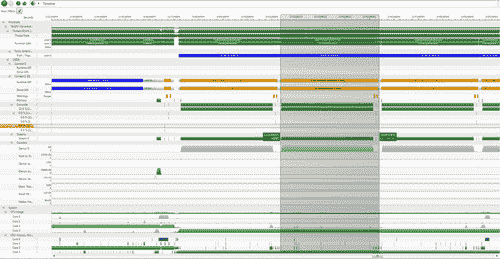 |
| --- |
| **图 3.7** 并行 Nsight 时间轴。 |

时间轴可以用来判断应用程序是**CPU 绑定**、**内存绑定**还是**内核绑定**：  

## NVTX 跟踪库

NVTX 库提供了一种强大的方式来标记计算的各个部分，从而提供一个易于跟随的链接，帮助理解实际代码的执行情况。注解并行 Nsight 跟踪可以大大帮助理解正在发生的事情，并提供其他 CUDA 跟踪工具无法获得的信息。最简单的两个 NVTX 方法是：■ **nvtxRangePushA**(char*)：此方法将一个字符串推送到 NVTX 栈中，该字符串将在时间轴上显示。支持嵌套标签来注解异步事件。■ **nvtxRangePop**()：从栈中弹出最上面的标签，使其不再显示在时间轴跟踪中。*nvToolsExt.h* 头文件包含在那些使用 NVTX 库的源文件中。此外，必须将 32 位或 64 位版本的 nvToolsExt 库与可执行文件链接。这些库调用的简洁性在 示例 3.10 中得到了展示，示例注解了 *nlpcaNM.cu* 中的 **thrust::transform_reduce** 调用：`nvtxRangePushA("Transform Reduce");``Real sum = thrust::transform_reduce(``thrust::counting_iterator<unsigned int>(0),``thrust::counting_iterator<unsigned int>(nExamples),``getError,``(Real) 0.,``thrust::plus<Real>());``nvtxRangePop();`图 3.7 是一张截图，展示了时间轴跟踪中可用的详细信息。该时间轴显示了三次 **transform_reduce** 操作。中间的操作已被灰色突出显示，以帮助区分三个注解的操作。顶部的跟踪显示 GPU 活动和 API 调用；底部的跟踪显示系统和所有多处理器核心上的应用相关活动。Parallel Nsight 极其有效地利用颜色帮助解释，但在这张灰度图像中没有显示。当使用 Parallel Nsight 时，建议使用大屏幕显示器，因为时间轴包含大量信息，包括标签和可滚动的交互区域。

## CUDA API 的扩展行为

查看 NLPCA 示例的时间轴（见图 3.8），我们可以看到，函数对象占用了 GPU 运行时的大部分时间。对于三次运行—使用完整数据集、10 倍和 100 倍缩小的数据集—时间轴显示，重复分配和释放用于归约的小内存区域消耗了越来越多的运行时百分比。这种消耗代表了当前 CUDA 4.0 实现中的一个扩展性挑战。NVTX 库被用来标注时间轴。

| 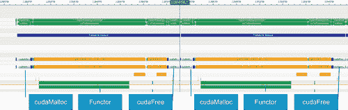 |
| --- |
| **图 3.8** nlpcaNM.cu 完整数据大小。 |

将数据减少 10 倍（见图 3.9）表明，**cudaMalloc**()占用了更多的**transform_reduce**运行时。

| 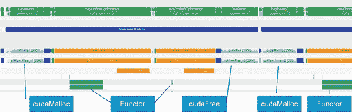 |
| --- |
| **图 3.9** nlpcaNM.cu 1/10 数据大小。 |

在数据缩小到 100 倍时，使用 10,000 个示例（见图 3.10），分配和释放**transform_reduce**临时空间消耗了大量的运行时。

| 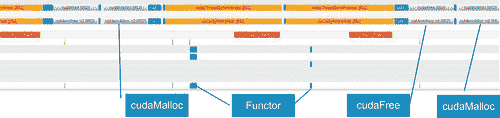 |
| --- |
| **图 3.10** nlpcaNM.cu 10k 示例。 |

即使存在分配效率低下的问题，Parallel Nsight 图形化显示了 NLPCA 函数对象的高效性，因为它在 C2050 的所有多处理器上几乎每时钟周期执行两个操作（见图 3.11）。

| 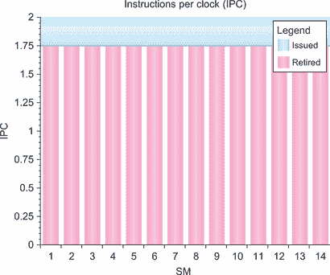 |
| --- |
| **图 3.11** nlpcaNM.cu 每时钟周期的 Parallel Nsight 指令数。 |

Parallel Nsight 还报告称，GPU 上的所有多处理器都已完全利用（见图 3.12），这进一步证明了**CalcError**函数对象充分利用了 GPU 能力。

| 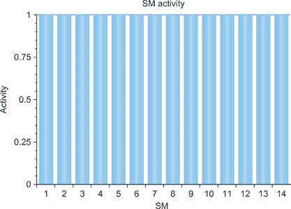 |
| --- |
| **图 3.12** GPU 上的多处理器活动，针对 nlpcaNM.cu。 |

# Tuning and Analysis Utilities (TAU)

NIVIDA 并不是唯一提供 CUDA 分析和调试工具的供应商。Tuning and Analysis Utilities (TAU) 是一个为能源部（DOE）科学办公室开发的程序和性能分析工具框架，能够通过对函数、方法、基本块和语句的插桩收集性能信息。所有 C++ 语言特性均受到支持，包括模板和命名空间。TAU 的性能可视化工具 **paraprof** 提供图形化显示所有性能分析结果，以聚合和单节点/上下文/线程的形式呈现。用户可以通过 GUI 快速识别应用中的性能瓶颈。此外，TAU 还能生成事件跟踪，并可以与 Vampir、Paraver 或 JumpShot 跟踪可视化工具一起展示。论文《利用 GPU 测量异构并行系统的并行性能》是关于 CUDA 实现的最新出版物（Malony 等, 2011; Malony, Biersdorff, Spear, & Mayanglamba, 2010）。该软件可以从性能研究实验室（PRL）免费下载。²²[`www.cs.uoregon.edu/research/tau`](http://www.cs.uoregon.edu/research/tau)。

# 摘要

借助这种易于访问的计算能力，许多过去的超级计算技术现在对每个人来说都可用——甚至可以在笔记本电脑上使用。在 2006 年的论文《使用神经网络降低数据维度》中，Hinton 和 Salakhutdinov 指出：自 20 世纪 80 年代以来，显然通过深度自编码器的反向传播对于非线性维度降低非常有效，前提是计算机足够快，数据集足够大，初始权重足够接近一个好的解决方案。现在这三个条件都已满足。(Hinton & Salakhutdinov, 2006, 第 506 页)本章讨论的技术，包括自编码器，可以应用于各种数据拟合、数据分析、维度降低、视觉和分类问题。方便的是，它们能够从笔记本电脑扩展到世界上最大的超级计算机。正如本章所示，在函子内部实现高性能并不能保证在所有问题规模上都有良好的性能。有时限制性能的瓶颈可能像在**thrust::transform_reduce**方法中确定的动态内存分配临时空间那样微妙。如果不能看到 GPU 在做什么，性能监控就变成了猜测。拥有正确的性能分析工具是找到性能限制的关键。因此，CUDA 工具套件包含了一系列针对 GPU 计算进行了适配的常用性能分析和调试工具。这些是 Windows、UNIX 和 Max 开发者已经熟悉的工具。尽管每个工具都有其优点和缺点，但它们都提供了对 GPU 性能的有用视角，同时只需要最小的学习投入。通过这种方式，CUDA 为大规模并行 GPU 编程提供了一个平滑的过渡。
