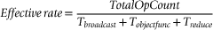

# 第四章\. CUDA 执行模型 

CUDA 性能和可扩展性的核心在于执行模型以及将计算简单划分为固定大小的线程块在执行配置中的方法。CUDA 的创建是为了自然地将应用程序内的并行性映射到 GPGPU 硬件的巨大并行性。从内核的高层语言表达式到最低级硬件单元的复制，GPU 上的可扩展性得到了保留，同时避免了许多常见的并行编程陷阱。结果是巨大的线程可扩展性和跨 GPGPU 硬件代际的高应用性能。CUDA 工具包为程序员提供了在处理核心的线程级和指令级上利用并行性的所需工具。甚至第一章中介绍的第一个 CUDA 程序也有可能在某些未来一代的 GPU 上运行一百万个并发硬件线程。同时，第二章中的函数对象在多个类型和代际的 GPU 上展示了高性能。**关键词**执行模型，峰值性能，ILP（指令级并行性），TLP（线程级并行性），SM（流多处理器），teraflop

# GPU 架构概述

CUDA 性能和可扩展性的核心在于将计算简单地划分为固定大小的线程块，这种划分方式是在执行配置中进行的。这些线程块提供了应用程序并行性与 GPGPU 硬件的大规模复制之间的映射。通过复制一种叫做*流式多处理器*（SM）的常见架构构建块，实现了大规模的 GPU 硬件并行性。通过调整 SM 的数量，GPU 设计师可以创建不同价格和性能点的产品。图 4.1 中的框图展示了 GF100（Fermi）系列 GPGPU 中多处理器的大规模复制。线程块的软件抽象转换为内核在 GPGPU 上映射到任意数量的 SM 的自然方式。线程块还充当线程协作的容器，因为只有线程块中的线程可以共享数据。¹因此，线程块既是应用程序中并行性的自然表达，也是将并行性划分为多个独立运行的容器的方式。¹对于某些问题，并且在合理的情况下，开发者可能选择使用原子操作在不同线程块的线程之间进行通信。这种方法打破了线程块之间独立性的假设，可能引入编程错误、可扩展性和性能问题。线程块抽象的转换是直接的；每个 SM 可以调度运行一个或多个线程块。仅受设备限制，这种映射：■ 可以透明地扩展到任意数量的 SM。■ 对 SM 的位置没有限制（可能允许 CUDA 应用程序将来透明地扩展到多个设备）。■ 使硬件能够将内核可执行文件和用户参数广播到硬件。并行广播是最具可扩展性并且通常是最快的数据传输机制，可以将数据传送到大量处理单元。由于线程块中的所有线程都在 SM 上执行，GPGPU 设计师能够为数据共享提供 SM 内部的高速内存，称为*共享内存*。这个优雅的解决方案还避免了在多核处理器中保持一致缓存时的已知扩展问题。一致缓存保证反映缓存中所有变量的最新状态，而不管有多少处理单元正在读取或更新一个变量。*总之*，线程块的抽象和 SM 硬件的复制协同工作，透明地提供了无限且高效的可扩展性。CUDA 程序员的挑战在于以某种方式表达他们的应用程序内核，从而利用这种并行性和可扩展性。

## 线程调度：通过执行配置协调性能和并行性

将工作分配给流处理器是 GigaThread 全局调度器的任务（如图 4.1 所示）。根据内核执行配置中定义的块数和每个块的线程数，该调度器将一个或多个块分配给每个 SM。每个 SM 分配多少块取决于该 SM 可以支持多少个常驻线程和线程块。

|  |
| --- |
| **图 4.1** GF100（Fermi）GPU 的框图。 |

NVIDIA 通过*计算能力*对其支持 CUDA 的设备进行分类。计算能力中的一个重要规格是*每个多处理器的最大驻留线程数*。例如，较旧的 G80 计算能力 1.0 设备可以管理每个多处理器 768 个驻留线程。对于这些设备，有效的块组合包括三个 256 线程的块、六个 128 线程的块以及其他不超过每个 SM 768 个线程的组合。更新的 GF100，或者计算能力 2.0 的 GPU，可以支持 1,536 个驻留线程，是计算 1.0 多处理器的两倍。GigaThread 全局调度器在计算 2.0 设备中得到了增强，以支持并发内核。因此，计算 2.0 设备在遇到小型内核或工作负载不平衡的内核时，可以更好地利用 GPU 硬件，这些内核会随着时间的推移停止使用 SM。换句话说，只要内核被分配到不同的流中，多个内核可以在同一个 GPU 上同时运行。内核按照它们发出的顺序执行，且仅当所有前一个内核的线程块调度完成后，如果还有可用的 SM 资源，才会执行。每个 SM 独立负责调度其内部资源、核心和其他执行单元，以执行其分配的线程块中的线程工作。这种解耦的交互方式具有很高的可扩展性，因为 GigaThread 调度器只需要知道一个 SM 是否忙碌。每个时钟周期，SM 的 warp 调度器决定接下来要执行哪个 warp，从那些未等待以下内容的 warp 中选择：■ 从设备内存获取数据。■ 完成之前的指令。如图 4.2 所示，每个 GF100 SM 有 32 个 SIMD（单指令多数据）核心。采用 SIMD 执行模型意味着 SM 上的调度器指示它控制的所有核心将执行相同的指令。然而，每个核心可能使用不同的数据。基于 SIMD 执行模型设计流处理器是处理器设计中“刚好足够而不过多”的美妙范例，因为 SIMD 核心比非 SIMD 设计需要更少的空间，并且消耗更少的功率。这些优势通过 GPU 内 SM 的大规模复制得到了放大。

|  |
| --- |
| **图 4.2** GF100 SM 的框图。 |

GPU 硬件架构师通过添加 ALU（算术与逻辑单元）、浮点单元和用于超越函数的特殊功能单元，能够利用 SIMD 的节省，投入更多的功率和空间。因此，与传统处理器相比，GPGPU 设备具有较高的每瓦浮点运算（flop）比率（Vuduc, 2010），如表 4.1 所示。

**表 4.1** 各种设备的每瓦浮点运算（Flops Per Watt）

| 架构 | Intel Nehalem x5550 | NVIDIA T10P C1060 | NVIDIA GT200 GTX 285 | NVIDIA Fermi C2050 |
| --- | --- | --- | --- | --- |
| GHz | 2.66 | 1.44 | 1.47 | 1.15 |
| 插槽数 | 2 | 1 | 1 | 1 |
| 每插槽核心数（SM/GPU） | 4 | (30) | (30) | (14) |
| 峰值 Gflop（单精度） | 170.6 | 933 | 1060 | 1030 |
| 峰值 Gflop（双精度） | 85.3 | 78 | 88 | 515 |
| 峰值 GB/s | 51.2 | 102 | 159 | 144 |
| 插槽功率（仅计算） | 200 | 200 | 204 | 247 |
| 64 位每瓦浮点运算 | 0.4265 | 0.39 | 0.431372549 | 2.08502 |
| 32 位每瓦浮点运算 | 0.853 | 4.665 | 5.196078431 | 4.17004 |

到目前为止，我们已经正确地从单个线程的角度讨论了 GPU 编程。从性能的角度来看，开始考虑每个 warp 或半个 warp 中的 SIMD 线程数量是必要的，特别是在具有双调度器的 GF100 SM 上。*warp* 是大多数 GPU 上由 32 个 SIMD 线程组成的一个块。就像 GigaThread 调度器的线程块一样，warp 是在 SM 内部调度工作的基本单元。因为每个 warp 本质上都是一个 SIMD 线程块，所以调度器不需要检查指令流中的依赖关系。图 4.2 显示了每个 GF100 SM 拥有两个 warp 调度器和两个指令分发单元，这使得两个 warp 可以并行发射和执行。通过这种双发射模型，GF100 流处理器可以通过选择两个 warp，并从每个 warp 向 16 核心、16 个加载/存储单元或 4 个 SFU 发出一条指令，从而实现每时钟周期两次操作。大多数指令都可以双发射：两个整数指令、两个浮点指令，或整数、浮点、加载、存储和 SFU 指令的混合。例如：■ 第一个单元可以执行 16 个 FMA FP32 操作，而第二个单元则并行处理 16 个 ADD INT32 操作，这对调度器而言，就像它们在一个周期内执行一样。■ 四重 SFU 单元是解耦的，因此调度器可以在它启用后将指令发送到两个 SIMD 单元，这意味着 SFU 和 SIMD 单元可以并行工作。这个设置可以为使用超越函数的应用程序提供显著的性能提升。GF100 GPU 不支持双发射双精度指令，但在运行双精度指令时，仍然可以实现高 IPC，因为在双精度操作等待数据时，整数和其他指令可以继续执行。利用基于线程块的解耦全局和本地调度机制有许多优点：■ 它不会限制板载可扩展性，因为全局调度器只需监控 SM 的活动状态。■ 每个 SM 调度一个线程块，限制了线程资源分配的复杂性以及 SM 内线程间的通信，这种方式可以按可扩展的方式划分每个 CUDA 内核，使得其他 SM 或全局调度器无需了解其他 SM 内部发生的情况。■ 随着技术和制造的进步，未来的 SM 可以更加智能，并执行更多操作。

## 与 Warp 相关的 computeprof 值

| 活跃 warp/活跃周期 | 每个周期内在多处理器上活跃的 warp 平均数量，计算公式为：(活跃 warp)/(活跃周期) |
| --- | --- |

## Warp 分歧

SIMD 执行确实存在缺点，但它只影响运行在 SM 内部的代码。GPGPU 不是真正的 SIMD 机器，因为它们由许多 SM 组成，每个 SM 可能正在运行一个或多个不同的指令。因此，GPGPU 设备被归类为 SIMT（单指令多线程）设备。程序员必须意识到，条件语句（*if* 语句）会大大降低 SM 内部的性能，因为每个条件的每个分支都必须被评估。条件中的长代码路径会导致每个 warp 内的每个条件减慢 2 倍，对于 *N* 层嵌套循环，则减慢 2^(*N*) 倍。当 warp 中的每个线程执行不同的条件时，可能会出现最大 32 倍的减慢。费米架构的 GPU 利用 *predication* 来高效地运行短的条件代码段，而不产生分支指令的开销。通过并行执行分支的 *if* 和 *else* 部分，predication 从代码中移除了分支，从而避免了预测错误分支和 warp 分歧的问题。“CUDA C 最佳实践指南”第 6.2 节指出：当使用分支预测时，不会跳过任何依赖于控制条件的指令。相反，每个这样的指令都与一个线程的条件代码或谓词相关联，该谓词根据控制条件设置为真或假。尽管每个这样的指令都安排了执行，但只有具有真谓词的指令才会实际执行。具有假谓词的指令不会写入结果，也不会评估地址或读取操作数。（NVIDIA，CUDA C 最佳实践指南，2011 年 5 月，第 56 页）示例 4.1，“包含条件的简短代码片段”中的条件会在所有计算逻辑谓词的线程上运行，并包含两个如示例 4.2 所示的谓词指令：`if (x<0.0) z = x−2.0;` `else z = sqrt(x);` 当 **x** < 0 时，**sqrt** 有一个假谓词，因此尝试对零取平方根不会发生错误。`p = (x<0.0);` // 逻辑谓词 `p: z = x−2.0;` // 真谓词指令 `!p: z = sqrt(x);` // 假谓词指令 根据“CUDA C 最佳实践指南”第 6.2 节，谓词指令的长度很重要：编译器只有在分支条件控制的指令数量小于或等于某个特定阈值时才会用谓词指令替换分支指令：如果编译器确定条件很可能产生许多分歧的 warp，则此阈值为 7；否则为 4。（NVIDIA，CUDA C 最佳实践指南，2011 年 5 月，第 56 页）如果分支中的代码太长，**nvcc** 编译器会插入代码以执行 *warp 投票* 来查看 warp 中的所有线程是否选择了相同的分支。如果 warp 中的所有线程都投票相同，则不会出现性能下降。在某些情况下，编译器可以在编译时确定 warp 中的所有线程都将走相同的路径。在示例 4.3，“无需投票的示例”中，即使 **case** 是一个非常量变量，也没有必要进行投票：`// 变量 case 在所有线程中具有相同的值` `if (case==1)` `z = x*x;` `else` `z = x+2.3;`

## 扭曲发散的指南

有时，warp 发散是不可避免的。常见的应用场景包括具有边界条件的偏微分方程（PDEs）、图形、树结构以及其他不规则数据结构。在最坏的情况下，可能会发生 32 倍的性能下降，具体情况如下：■ 一个线程需要执行一个昂贵的计算任务。■ 每个线程执行一个独立的任务。避免 warp 发散是一个挑战。尽管有许多可能的解决方案，但没有一种能够适用于所有情况。以下是一些指导原则：■ 尝试重新构造问题，使用不同的算法，使其不会导致 warp 发散，或者将问题表达为编译器能够减少或消除 warp 发散的形式。■ 考虑创建昂贵操作与便宜操作的独立列表，并在独立的内核中使用每个列表。希望大部分工作能够在便宜的内核中完成，也许一些昂贵的工作可以在 CPU 上执行。■ 对计算（或计算列表）进行排序，将计算分组为半 warp 的倍数的块。■ 如果可能，使用异步内核执行来利用 GPU 的 SIMT 执行模型。■ 利用主机处理器来执行一些本可能导致 GPU 负载不平衡的工作。《*GPU CUDA Gems*》一书（Hwu, 2011）是一本单一来源的参考书，展示了许多应用如何处理不规则数据结构和 warp 发散问题。每一章都详细描述了问题、解决方案和报告的加速效果。例子包括：■ 加速基于不规则树结构的数据结构在 GPGPU 上的传统方法和新方法。■ 避免在字符串相似性算法中限制并行性的条件操作。■ 使用 GPU 加速动态求积网格方法，并避免随着网格点在计算过程中移动而产生的 warp 发散。■ 针对涉及条件操作的不规则网格的方法，以及规整计算的方法。

## warp 发散相关的 computeprof 值

| 分支发散率 (%) | 该值表示在所有内核中的分支中，导致在一个 warp 内部发生发散的分支所占的百分比。warp 内部的发散会导致执行的序列化。其计算公式为： (100 * 发散分支数) / (发散分支数 + 分支数) |
| --- | --- |
| 控制流发散率 (%) | 控制流发散表示在 warp 中，并非所有线程都执行了相同的线程指令，从而导致了发散。该值应尽可能低。其计算公式为： 100 * ((32 * 执行的指令数) — 执行的线程指令数) / (32 * 执行的指令数) |

# warp 调度与线程级并行 (TLP)

每个 SM 运行多个 warp 是 GPU 隐藏 ALU 和内存延迟、保持执行单元忙碌的唯一方式。从软件角度来看，硬件 SM 调度器足够快，基本没有开销。在 SM 内部，硬件可以检测到那些下一条指令已准备好执行的 warp，因为所有资源和数据依赖关系都已经解决。从这池合格的 warp 中，SM 调度器根据内部优先级调度选择一个，并将该 warp 的指令发给 SIMD 核心。如果所有 warp 都被*停滞*，意味着它们都有未解决的依赖关系，那么就无法发出任何指令，导致硬件空闲，性能下降。TLP 的理念是给调度器尽可能多的线程可供选择，从而最小化性能损失的可能性。*占用率*是 TLP 的一个衡量标准，定义为在一个多处理器上同时运行的 warp 数量与 SM 上可以驻留的最大 warp 数量的比值。高占用率意味着 SM 上的调度器有许多 warp 可供选择，从而隐藏 ALU 和数据延迟。至少应该有一个 warp 准备好执行，因为所有依赖关系已解决。尽管概念上简单，实际操作中，占用率比较复杂，因为它可能受到片上 SM 内存资源（如寄存器和共享内存）的限制。NVIDIA 提供了 CUDA 占用率计算器，帮助选择执行配置。常见的执行配置（每个网格的块）启发式包括：■ 指定比 SM 数量更多的块，以确保所有多处理器至少有一个块可执行。■ 这是一个下限，因为指定比 SM 少的块显然无法利用 GPU 的所有资源。■ 为了利用小问题的异步内核执行，开发者可能故意低利用 GPU。GF100 及更高架构可以利用并发内核执行，通过在未使用的 SM 上运行来自不同内核的块，提升应用程序性能。这些 GPU 加速那些有多个内核、单个内核过小以至于无法在所有 SM 上运行，但又花费过多时间导出到主机处理器的应用程序。■ 为每个 SM 指定多个块，以便在 SM 内部并行运行。■ 选择块数应为 GPU 上 SM 数量的倍数，以充分利用所有 SM。该方法确保所有 SM 负载均衡。■ 未等待 **__syncthreads** 的块将保持硬件忙碌。■ 可运行的块数取决于 SM 上的资源可用性，包括寄存器和共享内存空间。■ 如有可能，为每个网格指定一个非常大的块数（例如，数千个）。■ 这样做将帮助应用程序跨多个 GPGPU 代进行优化。■ 它还将保持 SM 处于完全加载状态，拥有驻留线程块。

## 与占用率相关的 computeprof 值

| 实际内核占用率 | 该比率提供了基于每个周期在 SM 上执行的 warps 数量来计算的实际内核占用率。它是活动 warp 和活动周期的比率，除以 SM 上能执行的最大 warp 数。其计算公式为：（活动 warp 数/活动周期数）/4 |
| --- | --- |

# ILP：更高的性能，较低的占用率

高占用率并不一定意味着最快的应用程序性能。指令级并行性（ILP）通过保持 SIMD 核心在更少的线程下忙碌，隐藏算术延迟，这样这些线程消耗的资源较少且引入的开销更小，效果同样显著。ILP 的原理简单而有力：使用更少的线程意味着每个线程可以使用更多的寄存器。寄存器是一种珍贵资源，因为它们是唯一足够快速以达到 GPU 峰值性能的存储器。寄存器存储与其他内存之间的带宽差距越大，实现高性能所需的数据就越多必须来自寄存器。有时，每个线程多使用一些寄存器可以防止寄存器溢出，并保持高性能。尽管是必要的，寄存器溢出违背了程序员对寄存器内存高性能的期望，并且可能导致灾难性的性能下降。使用更少的线程还可以使使用共享内存的内核受益，因为这会减少共享内存的访问次数，并允许线程内的数据重用（Volkov, 2010）。一个小的好处是减少 GPU 在每个线程中必须执行的一些工作。例如，以下循环将消耗 2048 字节的寄存器存储空间，并要求循环计数器**i**在一个包含 512 个线程的块中递增 512 次。一个仅包含 64 个线程的线程块只需要 256 字节的寄存器存储空间，并将整数递增操作的次数减少 4 倍。参见 示例 4.4，“简单的 for 循环演示 ILP 的好处”：`for(int i=0; i < n; i++) ...`。横向读取各列，表 4.2 概述了随着占用率降低，每个线程的寄存器数如何增加，适用于各种计算代次。

**表 4.2** 随着占用率降低，每个线程的寄存器数增加

|  | 最大占用率 | 最大寄存器数 | 增加量 |
| --- | --- | --- | --- |
| GF100 | 在 100%占用率下 20 | 在 33%占用率下 63 | 每个线程的寄存器是原来的 3 倍 |
| GF200 | 在 100%占用率下 16 | 在 12.5%占用率下≈128 | 每个线程的寄存器是原来的 8 倍 |

## ILP 隐藏算术延迟

与 TLP 类似，多线程提供了所需的并行性。例如，图 4.3 中的阴影行突出了四个独立操作，这些操作在三个线程中并行发生。

|  |
| --- |
| **图 4.3** ILP1 与 ILP4 在 C2070 上的性能对比。 |

**表 4.3** 一组 TLP 算术操作

|  |
| --- |
| 线程 1 | 线程 2 | 线程 3 | 线程 4 |
| x = x + c | y = y + c | z = z + c | w = w + c |
| x = x + b | y = y + b | z = z + b | w = w + b |
| x = x + a | y = y + a | z = z + a | w = w + a |

由于 warp 调度，指令之间的并行性也可以在线程内部发生，只要有足够的线程在一个块内创建两个或更多的 warp。

**表 4.4** ILP 指令重排

|  |
| --- |
|  | 线程 |  |
| 指令 -> | w = w + b | 四个独立操作 |
| z = z + b |
| y = y + b |
| x = x + b |
| w = w + a | 四个独立操作 |
| z = z + a |
| y = y + a |
| x = x + a |

以下示例通过创建在单个 SM 上运行的两个或更多 warp 来演示 ILP。如示例 4.5“算术 ILP 基准”所示，执行配置仅指定一个块。随着块内线程数从 32 增加到 1024，SM 上的 warp 数量增加，并报告了性能。本示例将在支持每个块 1024 个线程的 Compute 2.0 设备上运行。较早的设备将在调用**cudaGetLastError**时检测到运行时错误，当每个块的最大线程数超过 GPU 支持的线程数时，测试将停止。由于内核启动是异步的，使用**cudaSynchronizeThread**来等待内核完成。`#include <omp.h>``#include <iostream>``using namespace std;``#include <cmath>``// 在设备的全局内存中创建存储``__device__ float d_a[32], d_d[32];``__device__ float d_e[32], d_f[32];``#define NUM_ITERATIONS ( 1024 * 1024)``#ifdef ILP4``// 测试指令级并行性``#define OP_COUNT 4*2*NUM_ITERATIONS``__global__ void kernel(float a, float b, float c)``{``register float d=a, e=a, f=a;``#pragma unroll 16``for(int i=0; i < NUM_ITERATIONS; i++) {``a = a * b + c;``d = d * b + c;``e = e * b + c;``f = f * b + c;``}``// 写入全局内存，以防工作被编译器优化掉``d_a[threadIdx.x] = a; d_d[threadIdx.x] = d;``d_e[threadIdx.x] = e; d_f[threadIdx.x] = f;``}``#else``// 测试线程级并行性``#define OP_COUNT 1*2*NUM_ITERATIONS``__global__ void kernel(float a, float b, float c)``{``#pragma unroll 16``for(int i=0; i < NUM_ITERATIONS; i++) {``a = a * b + c;``}``// 写入全局内存，以防工作被编译器优化掉``d_a[threadIdx.x] = a;``}``#endif``int main()``{``// 迭代块中线程数``for(int nThreads=32; nThreads <= 1024; nThreads += 32) {``double start=omp_get_wtime();``kernel<<<1, nThreads>>>(1., 2., 3.); // 异步内核启动``if(cudaGetLastError() != cudaSuccess) {``cerr << "启动错误" << endl;``return(1);``}``cudaThreadSynchronize(); // 需要等待内核完成``double end=omp_get_wtime();``cout << "warp 数" << ceil(nThreads/32) << " "``<< nThreads << " " << (nThreads*(OP_COUNT/1.e9)/(end - start))``<< " Gflops " << endl;``}``return(0);``}`如图 4.3 所示，通过增加每个线程的独立指令数量，ILP 提高了性能。在 Compute 2.0 设备上，最佳性能出现在 SM 上驻留 576 个线程时。如在“更低占用率下更好的性能”演示中所述，当前上限似乎是 ILP 为 4（Volkov, 2010）。有人猜测，SM 上跟踪内存使用的分数板是限制因素。专利“在多线程处理过程中通过分数板跟踪寄存器使用”（Coon, Mills, Oberman, & Siu, 2008）可能提供额外的见解。表 4.5 显示了实现 100%吞吐量所需的最小算术并行度（Volkov, 2010）。

**表 4.5** 实现 100% 利用率的最小并行度

| 计算代 | GPU 架构 | 延迟（周期） | 吞吐量（核心/SM） | 并行度（操作/SM） |
| --- | --- | --- | --- | --- |
| 计算 1.x | G80-GT200 | ≈24 | 8 | ≈192 |
| 计算 2.0 | GF100 | ≈18 | 32 | ≈576 |
| 计算 2.1 | GF104 | ≈18 | 48 | ≈864 |

## ILP 隐藏数据延迟

需要注意的是，线程在 SM 中的停顿并非由于内存访问，而是由于数据依赖性。从一个 warp 的角度来看，内存访问需要向 LD/ST 单元发出加载或存储指令。² 然后，warp 可以继续发出其他指令，直到它遇到依赖于内存事务完成的指令。此时，warp 会停顿。为了提高性能，编译器可以重新排序指令，以：²虽然执行存储或加载操作没有区别，但文献中讨论 ILP 写操作时是以多个输出为单位的——这意味着向内存执行多个写操作。■ 保持最大数量的内存事务“在飞行中”，从而最好地利用内存带宽和 LD/ST 单元。■ 提供线程需要的其他非依赖指令，以保持计算核心忙碌。■ 通过将数据依赖指令放置在队列中，使其在接近预期数据到达时间时到达队列顶部，从而最小化依赖指令在队列中等待的时间。由于这种复杂的协同工作，ILP 也可以隐藏内存延迟。Vasily Volkov 指出，ILP 在复制每个线程 14 个**float4**值时，可以达到峰值内存带宽的 84%，而仅需 4% 的占用率（Volkov, 2010）。*float4* 是由四个 32 位浮点变量组成的结构，完美地适应 128 位缓存行。这些结构利用了缓存行内存事务的位级并行性以及 ILP 并行性。

## ILP 的未来

当前的 GF100 架构鼓励使用更小的线程块，因为由于每个 SM 的额外资源，它可以调度更多的线程块。这种方法为解决问题提供了一种新的思路，旨在同时实现高利用率和高性能。值得注意的是，计算 2.0 设备甚至 1.x 的 GPU 有时能够从同一个 warp 并行发出第二条指令到特殊功能单元。CPU 开发者会将 ILP 视为一种*超标量*执行方式，通过在时钟周期内同时调度多个指令到处理器的冗余功能单元，从而在一个周期内执行多个指令。NVIDIA 已将超标量执行功能添加到计算 2.1 设备的调度器中。这些设备的 warp 调度器能够分析 warp 中的下一条指令，判断该指令是否安全执行 ILP，并且检查是否有可用的执行单元来处理它。其结果是，计算 2.1 设备能够以超标量方式执行任何 CUDA 代码，而无需程序员显式地操作来强制执行 ILP。ILP 已被纳入 CUBLAS 2.0 和 CUFFT 2.3 库。在两个大矩阵上执行单精度级别 3 的 BLAS 矩阵乘法（SGEMM）展示了以下性能提升（Volkov, 2010）：

**表 4.6.** CUBLAS ILP 加速在 SGEMM 中的表现

|  |
| --- |
|  | CUBLAS 1.1 | CUBLAS 2.0 |  |
| 每块线程数 | 512 | 64 | 线程块小了 8 倍 |
| 占用率（计算 1.0） | 67% | 33% | 占用率降低了 2 倍 |
| 性能（计算 1.0） | 128 Gflop/s | 204 Gflop/s | 性能提升 1.6 倍 |

同样，ILP 也有利于批处理 1024 点复数到复数的单精度快速傅里叶变换（FFT）：

**表 4.7.** CUFFT ILP 加速在批处理 FFT 中的表现

|  |
| --- |
|  | CUFFT 2.2 | CUFFT 2.3 |  |
| 每块线程数 | 256 | 64 | 线程块小了 4 倍 |
| 占用率（计算 1.0） | 33% | 17% | 占用率降低了 2 倍 |
| 性能（计算 1.0） | 45 Gflop/s | 93 Gflop/s | 性能提升 2 倍 |

**ILP 有益于算术问题：** 当前在 MAGMA BLAS 库上的工作显示，使用 33%占用率和每个 SM 2 个线程块时，能达到最高 838 Gflop/s 的性能（Volkov, 2010）。MAGMA 团队得出结论，密集线性代数方法现在比传统的多核架构更适合 GPU 架构（Nath, Stanimire, & Dongerra, 2010）。**ILP 有益于内存带宽问题：** 要在 Fermi C2050 上饱和总线，要求每个 SM 保持 30–50 个 128 字节的事务同时进行（Micikevicius, 2010）。Volkov 建议保持 100KB 的事务同时进行，以隐藏内存延迟——如果内核受计算限制，则需要更少的事务。

## 与指令速率相关的 computeprof 值

| 指令吞吐量 | 该值是实现的指令速率与峰值单发指令速率的比值。实现的指令速率通过分析器计数器“指令”计算得出。峰值指令速率是根据 GPU 时钟速度计算的。在指令双发模式下，这一比值会迅速超过 1。计算公式为： (指令数) / (gpu_time * clock_frequency) |
| --- | --- |
| 理想指令/字节比率 | 该值是 CUDA 设备的峰值指令吞吐量与峰值内存吞吐量的比率。该值是设备的特性，与内核无关。 |
| 指令/字节 | 该值是内核发出的总指令数与内核从全局内存访问的总字节数的比值。如果该比值大于理想的指令/字节比率，则说明内核受计算限制；如果小于该比率，则说明内核受内存限制。计算公式为： (32 * 发出指令数 * #SM) / {32 * (l2 读取请求 + l2 写入请求 + l2 读取纹理请求)} |
| IPC（每周期指令数） | 该值表示每个周期发出的指令数。这个值应与设备的最大可能 IPC 进行比较。提供的范围是单精度浮点指令的范围。计算公式为：（发出指令数/活跃周期数） |
| 重放指令（%） | 该值表示在内核执行过程中重放的指令百分比。重放指令是硬件实际发出的指令数与内核将要执行的指令数之间的差异。理想情况下，这个值应该为零。计算公式为：100 * （发出指令数 - 执行指令数）/发出指令数 |

# Little's Law

小法则 (Little, 1961) 源自一般信息理论，但对理解内存层次的性能具有重要应用。推广到多处理器系统，小法则在并发性方面 (Equation 4.1) 可以表示为：(4.1)其中 *并发性* 是系统的总并发性，*带宽* 是总内存带宽。几乎所有的 CUDA 应用都将受到内存带宽的限制。全局内存的性能尤其值得关注，正如在“更低占用率下的更好性能” (Volkov, 2010) 中报告的带宽所示：■ 寄存器内存 (≈8 TB/s)■ 共享内存 (≈1.6 TB/s)■ 全局内存 (177 GB/s)从 TLP 的角度来看，小法则告诉我们“在飞行中的”内存事务数量 *N*（见 Equation 4.2， “TLP 内存事务在飞行中”）是到达率 λ 和内存延迟 *L* 的乘积。(4.2)其中到达率 λ 是 IPC（期望指令率）和加载指令密度的乘积。换句话说，随着额外线程的增加并在相同硬件资源上进行多路复用，可以隐藏更大的延迟。正如我们观察到的，这是一种过于简单的观点，因为复杂的数据依赖性引入了停顿，加上硬件限制造成了瓶颈。从 ILP 的角度来看，可以对独立内存事务进行批处理 (Equation 4.3， “ILP 批处理内存事务在飞行中”)。(4.3)其中 *B* 是独立加载的批处理大小。在 Fermi C2050 上饱和总线需要每个 SM 保持 30–50 个 128 字节的事务在飞行中 (Micikevicius, 2010)。Volkov 建议 C2050 的峰值算术性能的最小并行度为每个块 576 个线程，并在内存绑定内核上保持 100 KB 的数据在飞行中以获得峰值内存性能。Table 4.8 总结了这些结果。

**表 4.8** C2050 峰值数据和算术性能的最小并行性

|  | 延迟 | 吞吐量 | 并行性 |
| --- | --- | --- | --- |
| 算术 | ≈18 | 32 | ≈576 |
| 内存 | <800 周期 | <177 GB.s | <100 KB |

为了增加应用程序中的并发性，可以考虑以下几点：■ 增加占用率。■ 使用 **nvcc** 命令行选项 **-maxrregcount** 最大化可用寄存器，或者通过 **__launch_bounds__** 在内核声明中为编译器提供额外的每个内核帮助。■ 调整线程块的维度以最好地利用 SM warp 调度器。■ 修改代码以使用 ILP 并处理每个线程的多个元素。■ 注意指令的“混合”：■ 例如，数学运算与内存操作的比率。■ 不要让一个功能单元成为瓶颈，导致其他单元停滞。■ 不要让内核代码“交通堵塞”：■ 尝试创建许多小的线程块，包含均匀分布的操作密度（例如：整型、浮点型、内存和 SFU）。■ 不要将相似类型的操作集中在内核的一个部分，这样做可能会导致 SM 中的负载不平衡。

# 用于识别限制因素的 CUDA 工具

CUDA 提供了几个工具来处理您的代码和内核的并发性。CUDA 占用率计算器是一个很好的工具，可以在规划阶段使用，以了解设备的占用率。如图 4.4 所示，“CUDA 占用率计算器的截图”，这是一个电子表格，程序员可以用它来根据寄存器和共享内存的使用情况提出“如果”问题。

|  |
| --- |
| **图 4.4** CUDA 占用率计算器的截图。 |

## nvcc 编译器

**nvcc** 编译器为 UNIX、Windows 和 Mac OS X 操作系统提供了一个通用的编译框架。

|  |
| --- |
| 图 4.5。 |
| UNIX 系统上的 nvcc。  |
|  |
| 图 4.6。 |
| Windows 系统上的 nvcc。  |

如示例 4.5 所示，**nvcc** 编译器提供了 **#pragma unroll** 指令，用户可以使用该指令控制任意给定循环的展开。它必须紧接在循环前面，并且只作用于该循环。默认情况下，编译器会展开具有已知迭代次数的小型循环。如果循环较大或无法确定迭代次数，用户可以指定循环展开的次数。示例 4.5 中使用的 **#pragma unroll 16** 告诉编译器将循环展开 16 次，以防止 **for** 循环的控制逻辑干扰 ILP 测试结果。循环展开的主要好处包括：  

## 启动边界

控制寄存器的使用是实现 CUDA 高性能的关键。为了最小化寄存器使用，编译器采用一组*启发式方法*。启发式方法是一种根据观察和反复试验得出的经验规则。开发者可以通过在**__global__**函数定义中使用**__launch_bounds__**限定符来帮助编译器，示例如示例 4.6，“示例启动边界使用”中所示：`__global__ void``__launch_bounds__ (maxThreadsPerBlock, minBlocksPerMultiprocessor)``kernel(float a, float b, float c)``{``...``}`■ **maxThreadsPerBlock**指定每个块中线程的最大数量，应用程序将使用此数量。■ **minBlocksPerMultiprocessor**是可选的，指定每个多处理器上希望的最小驻留块数。它编译为**.minnctapersm** PTX 指令。如果指定了启动边界，编译器将有机会增加寄存器使用，以更好地隐藏指令延迟。如果执行配置指定的每块线程数超过启动边界指令允许的数量，内核将无法启动。

## 反汇编器

**cuobjdump**反汇编器是一个有用的工具，用于检查编译器生成的指令。它可以用来检查 warp 中提供给 SM 的指令混合，以及查看编译器的行为。示例 4.7，“未展开循环的 cuobjdump”，是示例 4.5 的代码，未展开循环。粗体代码显示，只有一条融合的多加法（FFMA）指令被使用。`code for sm_20``Function : _Z6kernelfff``/*0000*//*0x00005de428004404*/MOV R1, c [0x1] [0x100];``/*0008*//*0x80001de428004000*/MOV R0, c [0x0] [0x20];``/*0010*//*0xfc009de428000000*/MOV R2, RZ;``/*0018*//*0x04209c034800c000*/IADD R2, R2, 0x1;``/*0020*//*0x9000dde428004000*/MOV R3, c [0x0] [0x24];``/*0028*//*0x0421dc231a8e4000*/ISETP.NE.AND P0, pt, R2, c [0x10] [0x0], pt;``/*0030*//*0xa0301c0030008000*/**FFMA R0, R3, R0, c [0x0] [0x28];**``/*0038*//*0x600001e74003ffff*/@P0 BRA 0x18;``/*0040*//*0x84009c042c000000*/S2R R2, SR_Tid_X;``/*0048*//*0x0000dde428007800*/MOV R3, c [0xe] [0x0];``/*0050*//*0x10211c032007c000*/IMAD.U32.U32 R4.CC, R2, 0x4, R3;``/*0058*//*0x10209c435000c000*/IMUL.U32.U32.HI R2, R2, 0x4;``/*0060*//*0x10215c4348007800*/IADD.X R5, R2, c [0xe] [0x4];``/*0068*//*0x00401c8594000000*/ST.E [R4], R0;``/*0070*//*0x00001de780000000*/EXIT;``..........................`循环展开的影响可以在示例 4.8，“显示循环展开的 cuobjdump”中看到，通过 FFMA 指令的复制：`code for sm_20``Function : _Z6kernelfff``/*0000*//*0x00005de428004404*/MOV R1, c [0x1] [0x100];``/*0008*//*0x80001de428004000*/MOV R0, c [0x0] [0x20];``/*0010*//*0xfc009de428000000*/MOV R2, RZ;``/*0018*//*0x9000dde428004000*/MOV R3, c [0x0] [0x24];``/*0020*//*0x40209c034800c000*/IADD R2, R2, 0x10;``/*0028*//*0xa0301c0030008000*/**FFMA R0, R3, R0, c [0x0] [0x28];**``/*0030*//*0x0421dc231a8e4000*/ISETP.NE.AND P0, pt, R2, c [0x10] [0x0], pt;``/*0038*//*0xa0301c0030008000*/**FFMA R0, R3, R0, c [0x0] [0x28];**``/*0040*//*0xa0301c0030008000*/**FFMA R0, R3, R0, c [0x0] [0x28];**``/*0048*//*0xa0301c0030008000*/**FFMA R0, R3, R0, c [0x0] [0x28];**``/*0050*//*0xa0301c0030008000*/**FFMA R0, R3, R0, c [0x0] [0x28];**``/*0058*//*0xa0301c0030008000*/**FFMA R0, R3, R0, c [0x0] [0x28];**``/*0060*//*0xa0301c0030008000*/**FFMA R0, R3, R0, c [0x0] [0x28];**``/*0068*//*0xa0301c0030008000*/**FFMA R0, R3, R0, c [0x0] [0x28];**``/*0070*//*0xa0301c0030008000*/**FFMA R0, R3, R0, c [0x0] [0x28];**``/*0078*//*0xa0301c0030008000*/**FFMA R0, R3, R0, c [0x0] [0x28];**``/*0080*//*0xa0301c0030008000*/**FFMA R0, R3, R0, c [0x0] [0x28];**``/*0088*//*0xa0301c0030008000*/**FFMA R0, R3, R0, c [0x0] [0x28];**``/*0090*//*0xa0301c0030008000*/**FFMA R0, R3, R0, c [0x0] [0x28];**``/*0098*//*0xa0301c0030008000*/**FFMA R0, R3, R0, c [0x0] [0x28];**``/*00a0*//*0xa0301c0030008000*/**FFMA R0, R3, R0, c [0x0] [0x28];**``/*00a8*//*0xa0301c0030008000*/**FFMA R0, R3, R0, c [0x0] [0x28];**``/*00b0*//*0x800001e74003fffd*/@P0 BRA 0x18;``/*00b8*//*0x84009c042c000000*/S2R R2, SR_Tid_X;``/*00c0*//*0x0000dde428007800*/MOV R3, c [0xe] [0x0];``/*00c8*//*0x10211c032007c000*/IMAD.U32.U32 R4.CC, R2, 0x4, R3;``/*00d0*//*0x10209c435000c000*/IMUL.U32.U32.HI R2, R2, 0x4;``/*00d8*//*0x10215c4348007800*/IADD.X R5, R2, c [0xe] [0x4];``/*00e0*//*0x00401c8594000000*/ST.E [R4], R0;``/*00e8*//*0x00001de780000000*/EXIT;``..........................`从 CUDA 4.0 开始，**nvcc**编译器可以包含内联 PTX 汇编语言。PTX 是低级并行线程执行虚拟机和指令集架构（ISA）。有关 PTX 的最新信息可以在随每次发布附带的文档《PTX：并行线程执行 ISA》中找到。

## PTX 内核

为开发者提供反汇编和创建汇编语言内核的能力，给冒险精神强的程序员提供了直接在 GPU 上编程 SM 所需的一切。示例 4.9 中的 PTX 内核取自 NVIDIA **ptxjit** 示例，该示例随 SDK 样例一起提供：`/*``* PTX 等效于以下内核：``*``* __global__ void myKernel(int *data)``* {``*int tid = blockIdx.x * blockDim.x + threadIdx.x;``*data[tid] = tid;``* }``*``*/``char myPtx[] = "\n\``.version 1.4\n\``.target sm_10, map_f64_to_f32\n\``.entry _Z8myKernelPi (\n\``.param .u64 __cudaparm__Z8myKernelPi_data)\n\``{\n\``.reg .u16 %rh<4>;\n\``.reg .u32 %r<5>;\n\``.reg .u64 %rd<6>;\n\``cvt.u32.u16%r1, %tid.x;\n\``mov.u16%rh1, %ctaid.x;\n\``mov.u16%rh2, %ntid.x;\n\``mul.wide.u16%r2, %rh1, %rh2;\n\``add.u32%r3, %r1, %r2;\n\``ld.param.u64%rd1, [__cudaparm__Z8myKernelPi_data];\n\``cvt.s64.s32%rd2, %r3;\n\``mul.wide.s32%rd3, %r3, 4;\n\``add.u64%rd4, %rd1, %rd3;\n\``st.global.s32[%rd4+0], %r3;\n\``exit;\n\``}\n\``";`

## GPU 仿真器

类似 ocelot 这样的 GPU 仿真器具有独特的能力，能够表征 CUDA 内核代码的运行时行为，而这些功能是 GPU 工具链中的其他工具无法提供的（Farooqui, Kerr, Diamos, Yalamanchili, & Schwan, 2011）。其功能包括：■ 工作负载表征 ■ 负载不平衡 ■ PTX 代码中的“热点” ocelot 工具可以免费下载。

# 概述

理解 SM 是理解 GPGPU 编程的关键。线程块和 SIMD 线程的 warp 这两个概念涵盖了 GPU 计算的可扩展性、性能和能效。了解指令如何在 SM 内并行执行，以及哪些因素会导致指令流水线停滞，是理解 GPGPU 应用性能的基础。Little 定律以及排队理论通常为非常详细的 GPU 和应用模型提供了理论基础。实证研究表明，充分利用 ILP（指令级并行性）和 TLP（线程级并行性）可以提供最高的应用性能。这些益处如此显著，以至于 ILP 和 TLP 现在已经被广泛应用于 CUBLAS 和 CUFFT 库中，这些库是许多应用的基石。精通 CUDA 的程序员能够在他们的应用中结合使用 ILP 和 TLP。NVIDIA 提供了必要的工具，供 UNIX、Windows 和 Mac OS X 的开发者检查、实验和调整内核中的指令组合，以最好地利用 ILP 并通过控制寄存器使用来捕捉 TLP。利用这些工具能够在良好和卓越的性能之间产生差异。同样，在使用不规则数据结构或具有不规则边界的应用程序时，理解并避免 warp 分歧也能带来显著的差异。
