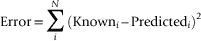

# 第五章 CUDA 内存 

高性能 GPGPU 应用程序需要在 SM 内部重用数据。原因是板载的*全局内存*速度根本不足以满足 GPU 上所有流式多处理器的需求。来自主机和其他 GPGPU 的数据传输进一步加剧了这个问题，因为所有的 DMA（直接内存访问）操作都必须经过全局内存，这会消耗额外的内存带宽。CUDA 显露了 SM 内部的内存空间，并提供了可配置的缓存，以便开发人员有更多机会进行数据重用。管理板载内存和片上内存之间显著的性能差异，以达到高性能需求，对于 CUDA 程序员来说至关重要。**关键词** 内存，全局内存，寄存器内存，共享内存，纹理内存，常量内存，L2 缓存 高性能 GPGPU 应用程序需要在 SM 内部重用数据。原因是板载的*全局内存*速度根本不足以满足 GPU 上所有流式多处理器的需求。来自主机和其他 GPGPU 的数据传输进一步加剧了这个问题，因为所有的 DMA（直接内存访问）操作都必须经过全局内存，这会消耗额外的内存带宽。CUDA 显露了 SM 内部的内存空间，并提供了可配置的缓存，以便开发人员有更多机会进行数据重用。管理板载内存和片上内存之间显著的性能差异，以达到高性能需求，对于 CUDA 程序员来说至关重要。 在本章结束时，读者将基本了解： ■ 为什么内存带宽是应用程序性能的关键瓶颈因素。 ■ 不同的 CUDA 内存类型以及 CUDA 如何暴露 SM 上的内存。 ■ L1 缓存及其在寄存器溢出、全局内存访问、递归和分治算法中的重要性。 ■ 重要的与内存相关的性能分析测量。 ■ 硬件内存设计的局限性。

# CUDA 内存层次结构

CUDA 编程模型假设所有线程在与运行应用程序的主机物理上分离的设备上执行。隐含的假设是主机和所有设备各自维持独立的内存空间，分别称为主机内存和设备内存，¹，并且某种形式的大规模传输是数据传输的机制¹。一些低端设备实际上与主机共享相同的内存，但这并不会改变编程模型。当主机内存映射到 GPU 的地址空间时，主机和设备内存之间的界限变得有些模糊。通过这种方式，设备或主机的修改将反映在映射该内存区域的所有设备的内存空间中。页面会在主机和 GPU 之间异步透明地传输。经验丰富的程序员会意识到，映射内存类似于 **mmap()** 系统调用。统一虚拟寻址（UVA）是 CUDA 4.0 的一个特性，它通过使运行时能够根据指针地址确定某个内存区域驻留在哪个设备上，从而简化了多 GPU 编程。从语义上讲，UVA 使 CUDA 开发者能够使用 **cudaMemcpy()** 执行直接的 GPU 到 GPU 数据传输。要使用它，只需使用 **cudaHostRegister()** 注册内存区域。然后，通过调用 **cudaMemcpy()**，设备之间可以发生大规模数据传输。运行时将确保在传输中使用适当的源设备和目标设备。方法 **cudaHostUnregister(ptr)** 终止该内存区域的 UVA 数据传输。参见 图 5.1。

|  |
| --- |
| **图 5.1** CUDA 内存层次结构。 |

# GPU 内存

启用了 CUDA 的 GPGPU 同时具有片上和板载内存。最快且最具可扩展性的是备受推崇的片上 SM 内存。这些是以千字节（KB）为单位的有限内存存储。板载全局内存是一个共享内存系统，所有 SM 都可以访问它。它的存储以千兆字节（GB）为单位，这是 GPU 上最大、最常用且最慢的内存存储。基准测试已经显示出片上内存和片外内存系统之间的带宽差异（见表 5.1）。只有 SM 内部的寄存器才具有保持 SM 完全加载（没有停顿）所需的带宽，以实现峰值性能。尽管共享内存的带宽可以大大加速应用程序，但它仍然太慢，无法达到峰值性能（Volkov, 2010）。

**表 5.1** 各种 GPU 内存的带宽

| 寄存器内存 | ≈8,000 GB/s |
| --- | --- |
| 共享内存 | ≈1,600 GB/s |
| 全局内存 | 177 GB/s |
| 映射内存 | ≈8 GB/s 单向 |

管理板载内存和片上内存之间的显著性能差异是 CUDA 程序员的主要关注点。为了更好地理解性能影响，考虑当内存带宽限制下的以下简单计算在全局内存中运行时的表现，在示例 5.1《一个简单的内存带宽限制计算》中：`for(i=0; i < N; i++) c[i] = a[i] * b[i];` 每次浮点乘法运算需要两个内存读取和一个写入。假设使用的是单精度（32 位或 4 字节）浮点值，一台每秒万亿次浮点运算（teraflop，TFLOP）的 GPU 在此计算运行时需要 12 TB/s 的内存带宽才能达到满速运行。换句话说，一台内存带宽为 177 GB/s 的 GPU 只能提供 14 Gflop 的性能，即大约只有万亿次 GPU 性能的 1.4%。当需要额外的 64 位（8 字节）浮点精度时，读者可以将有效计算速率减半。²²数据重用在传统处理器中同样重要。当应用程序变得受限于内存时，影响往往没有那么显著，因为传统系统的处理核心较少。显然，为了实现高性能，必须在 SM 中重用数据。只有通过利用数据*局部性*，程序员才能最大限度减少全局内存访问，并将数据保持在高速内存中。GPGPU 支持两种局部性，因为它们加速计算和渲染应用程序：■ 时间局部性：假设最近访问的数据项在不久的将来很可能会再次使用。许多计算应用程序表现出这种 LRU（最近最少使用）行为。■ 空间局部性：邻近数据被缓存，假设空间相邻的内存位置将在不久的将来被使用。渲染操作通常具有较高的二维空间局部性。如图 5.2 所示，SM 还包含常量内存（图中标为 Uniform 缓存）和纹理内存缓存。尽管这种缓存是理想的，但计算 2.0 设备中的 L1 和 L2 缓存已经涵盖了这些内存空间的大部分功能。在编程计算 1.x 设备时，当数据需要高效广播到所有线程时，必须使用常量内存。纹理内存可以作为一种缓存形式，避免全局内存带宽限制并处理一些小的、不规则的内存访问（Haixiang, Schmidt, Weiguo, & Müller-Wittig, 2010）。然而，纹理缓存相对较小——大约 8 KB。当然，纹理内存在所有计算设备代际中，最主要的用途和最大价值是可视化。

|  |
| --- |
| **图 5.2** 一个 GF100 流处理器。 |

计算 2.0 设备为每个 SM 增加了一个 L1 缓存，以及一个统一的 L2 缓存，位于所有 SM 和全局内存之间，如图 5.1 所示。

# L2 缓存

统一的 L2（二级）缓存是一种节省大量劳动力的设备，它作为一个快速数据存储，可供 GPU 上的所有 SM（流处理器）访问。由于 L2 缓存，许多应用程序在计算 2.0 设备上会突然运行得更快。原因有两个：■ 不需要 CUDA 程序员的任何干预，L2 缓存会以 LRU（最近最少使用）的方式缓存数据，这允许许多 CUDA 内核避免全局内存带宽瓶颈。■ L2 缓存极大地加速了不规则的内存访问模式，否则这些模式会表现出极差的 GPU 性能。对于许多算法来说，这一特性将决定应用程序是否可以在计算 1.x 硬件上使用。费米 GPU 提供了一个 768 KB 的统一 L2 缓存，它保证向所有 SM 提供一致视图。换句话说，任何线程都可以修改 L2 缓存中持有的值。在稍后的时间，GPU 上的任何其他线程都可以读取特定的内存地址并接收正确的、更新的值。当然，必须使用原子操作来确保在允许其他线程读取访问之前，存储（或写入）事务已经完成。之前的 GPGPU 架构在处理这种非常常见的读取/更新操作时存在挑战，因为使用了两个独立的数据路径——具体来说，是只读纹理加载路径和只写像素数据输出路径。为了确保数据正确性，较老的 GPU 架构要求在任意线程修改缓存内存位置的值后，沿读取路径的所有参与缓存都可能被无效化和刷新。费米架构通过统一的 L2 缓存消除了这个瓶颈，同时也消除了早期一代 GPU 中纹理和光栅输出（ROP）缓存的需求。所有数据加载和存储都通过 L2 缓存进行，包括 CPU/GPU 内存复制，强调主机数据传输可能会意外地影响缓存命中，从而影响应用程序性能。同样，异步内核执行也可能污染缓存。

## L2 缓存的相关 computeprof 值

**表 5.2** L2 缓存的 Visual Profiler 值

|  |
| --- |
| L2 缓存纹理内存读取吞吐量 (GB/s) | 该值表示在从 L2 缓存读取数据时，当 L1 发出对存储在纹理内存中的数据请求时所达到的吞吐量。计算公式为 (l2 读取纹理请求 * 32)/(gpu 时间 * 1000) |
| L2 缓存全局内存读取吞吐量 (GB/s) | 该值表示在从 L2 缓存读取数据时，当 L1 发出对存储在全局内存中的数据请求时所达到的吞吐量。计算公式为 (l2 读取请求 * 32)/(gpu 时间 * 1000) |
| L2 缓存全局内存写入吞吐量 (GB/s) | 该值表示在向 L2 缓存写入数据时，当 L1 发出将数据存储到全局内存的请求时所达到的吞吐量。计算公式为 (l2 写请求 * 32)/(gpu 时间 * 1000) |
| L2 缓存全局内存吞吐量 (GB/s) | 该值为 L2 缓存的读取和写入内存吞吐量的总和。计算公式为 (L2 缓存全局内存读取吞吐量 + L2 缓存全局内存写入吞吐量) |
| L2 缓存读取命中率 (%) | 在从全局内存读取数据时，L2 缓存中发生的命中的百分比。计算公式为 100 * (L2 缓存全局内存读取吞吐量 - 全局内存读取吞吐量) / (L2 缓存全局内存读取吞吐量) |
| L2 缓存写命中率 (%) | 在向全局内存写入数据时，L2 缓存中发生的命中的百分比。计算公式为 100 * (L2 缓存全局内存写入吞吐量 - 全局内存写入吞吐量) / (L2 缓存全局内存写入吞吐量) |

# L1 缓存

Compute 2.0 设备具有 64 KB 的 L1 内存，可以将其划分为共享内存或动态读/写操作。请注意，L1 缓存：■ 设计用于*空间而非时间重用*。大多数开发者期望处理器缓存表现得像一个 LRU 缓存。在 GPU 上，这种错误的假设可能导致意外的缓存未命中，因为频繁访问缓存的 L1 内存位置并不能保证该内存位置会留在缓存中。■ 不会受到写入全局内存的影响，因为写入操作绕过 L1 缓存。■ 不是一致的。声明可能被其他块中的线程修改的共享内存时，必须使用 volatile 关键字，以确保编译器不会将共享内存位置加载到寄存器中。私有数据（寄存器、栈等）可以放心使用。■ 延迟为 10–20 个周期。L1 缓存每个线程的局部数据结构，例如每个线程的栈。栈的加入使得 Compute 2.0 设备能够支持递归程序（调用自身的程序）。许多问题可以自然地用递归的形式表达。例如，*分治法*通过反复将大问题分解成更小的子问题来解决。在某些时候，问题变得足够简单，可以直接解决。子问题的解决方案被组合起来，给出初始问题的解答。栈可以占用最多 1 KB 的 L1 缓存。CUDA 还使用一种称为*局部内存*的抽象内存类型。局部内存本身并不是一个独立的内存系统，而是用于存放溢出的寄存器的内存位置。当线程块需要的寄存器存储超过 SM 上可用的寄存器时，就会发生寄存器溢出。在 Fermi 之前的 GPU 中，溢出的寄存器会写入全局内存，这会导致应用性能显著下降，因为每秒 GB 的全局内存访问取代了每秒 TB 的寄存器内存访问。Compute 2.0 及更高版本的设备将寄存器溢出到 L1 缓存，从而最小化了寄存器溢出对性能的影响。如果需要，可以使用 **-Xptxas -dlcm=cg** 命令行参数禁用 Fermi L1 缓存 **nvcc**。即使禁用，栈和局部内存仍然驻留在 L1 缓存内存中。这种可配置性的优点在于，应用程序可以根据数据重用、内存访问模式不对齐、不规则或不可预测的需求，将 L1 缓存配置为 48 KB 的动态缓存（留出 16 KB 用于共享内存），而需要在线程块内共享更多数据的应用程序可以将 48 KB 分配为共享内存（留出 16 KB 用于缓存）。通过这种方式，NVIDIA 设计人员使得应用开发者可以在 SM 内配置内存，以实现最佳性能。当编译器生成 LDU（LoaD Uniform）指令以缓存需要有效广播到 SM 内所有线程的数据时，会使用 L1 缓存。上一代 GPU 只能通过常量内存有效地在应用程序的所有线程之间广播信息。Compute 2.0 设备可以从全局内存广播数据，而无需显式的程序员干预，前提是满足以下条件：1. 指针前缀为 **const** 关键字。2. 内存访问在块内的所有线程中是统一的，如 示例 5.2 “统一内存访问示例”所示：`__global__ void kernel( float *g_dst, const float *g_src )``{``g_dst = g_src[0] + g_src[blockIdx.x];``}``

## L1 缓存的相关 computeprof 值

**表 5.3** L1 缓存的 Visual Profiler 值

|  |
| --- |
| L1 全局命中率（%） | 该值通过计算 100 * (L1 全局加载命中次数)/((L1 全局加载命中次数) + (L1 全局加载未命中次数)) 得出 |
| L1 缓存读取吞吐量（GB/s） | 该值表示从 L1 缓存访问数据时所达到的吞吐量。计算公式为 [(L1 全局加载命中 + L1 本地加载命中) * 128 * #SM + L2 读取请求 * 32] / (GPU 时间 * 1000) |
| L1 缓存全局命中比率（%） | 在访问全局内存时发生在 L1 缓存中的命中百分比。当 L1 缓存被禁用时，此统计数据为零。该值通过 (100 * L1 全局加载命中)/(L1 全局加载命中 + L1 全局加载未命中) 计算得出 |

# CUDA 内存类型

表 5.4 总结了针对 Compute 2.0 及更高版本设备的各种 CUDA 内存空间的特性。

**表 5.4** CUDA 内存类型及其特征

| 内存 | 位置 | 缓存 | 访问 | 范围 |
| --- | --- | --- | --- | --- |
| 寄存器 | 芯片内 | 否 | 读/写 | 单个线程 |
| 本地 | 芯片内 | 是 | 读/写 | 单个线程 |
| 共享 | 芯片内 | 不适用 | 读/写 | 块内所有线程 |
| 全局 | 跨芯片（除非已缓存） | 是 | 读/写 | 所有线程 + 主机 |
| 常量 | 跨芯片（除非已缓存） | 是 | 读 | 所有线程 + 主机 |
| 纹理 | 跨芯片（除非已缓存） | 是 | 读/写 | 所有线程 + 主机 |

## 寄存器

寄存器是 GPU 上最快的内存。它们是非常宝贵的资源，因为它们是 GPU 上唯一具有足够带宽和足够低延迟以实现峰值性能的内存。每个 GF100 SM 支持 32K 32 位寄存器。由于用于寄存器存储索引的位数有限，CUDA 内核可以使用的最大寄存器数量为 63。Fermi SM 上的可用寄存器数量如下：■ 如果 SM 正在运行 1,536 个线程，则只能使用 21 个寄存器。■ 随着工作负载（因此资源需求）随着线程数的增加，可用寄存器数量会逐渐从 63 降至 21。在 GF100 SM 上进行寄存器溢出会增加 L1 缓存的重要性，因为它可以保持高性能。请注意，来自寄存器溢出和堆栈的压力（堆栈可能会占用 1 KB 的 L1 存储）可能会通过强制数据驱逐，增加缓存未命中率。

## 本地内存

仅某些自动变量会发生本地内存访问。自动变量在设备代码中声明时不带有任何**__device__**、**__shared__**或**__constant__**修饰符。通常，自动变量会保存在寄存器中，以下情况除外：■ 编译器无法确定其索引为常量的数组。■ 会消耗过多寄存器空间的大型结构或数组。■ 内核使用的寄存器超过 SM 上可用的寄存器数量时，编译器决定将某些变量溢出到本地内存中。**nvcc**编译器在使用**--ptxas-options=-v**选项进行编译时，会报告每个内核的总本地内存使用量（lmem）。这些报告的值可能会受到某些访问本地内存的数学函数的影响。

## 本地内存缓存的相关 computeprof 值

**表 5.5\.** 本地内存的可视化分析器值

|  |
| --- |
| 本地内存总线流量 (%) | 由于访问本地内存导致的总线流量百分比。计算公式为 (2 * L1 本地加载未命中 * 128 * 100)/((L2 读请求 + L2 写请求) * 32/#SMs) |

## 共享内存

共享内存（也称为 smem）可以是每个 SM 16 KB 或 48 KB，按 32 个宽度为 32 位的银行排列。与早期的 NVIDIA 文档不同，共享内存并不像寄存器内存那样快速。共享内存可以通过三种不同方式进行分配：  

**表 5.6** 向反向内存层次结构的趋势

| 架构 | 银行与线程处理器的数量 | 银行与线程处理器的比例 | 每个线程的寄存器数 |
| --- | --- | --- | --- |
| G80-GT200 | 16 个银行 vs. 8 个线程处理器 | 2:1 | 128 |
| GF100 | 32 个银行 vs. 32 个线程处理器 | 1:1 | 21–64 |

出于可移植性、性能和可扩展性的考虑，强烈建议尽可能使用寄存器而不是共享内存。

## 共享内存的相关计算性能值

**表 5.7.** Visual Profiler 中的 smem 值

|  |
| --- |
| 每个共享内存指令的共享内存银行冲突（%） | 此值表示每个共享内存指令引起的银行冲突的数量。如果发生 *n* 路银行冲突或访问的数据是双精度，则该值可能超过 100%。此值通过 100 * (L1 共享内存银行冲突)/(共享加载 + 共享存储) 计算得出 |
| 共享内存银行冲突重放（%） | 由于共享内存银行冲突导致的重放指令的百分比。此值通过 100 * (L1 共享冲突)/发出的指令数 计算得到 |

## 常量内存

对于计算 1.x 设备，常量内存是存储和广播只读数据到 GPU 上所有线程的一个优秀方式。常量缓存的大小限制为 64 KB。它可以在每个多处理器的两个时钟周期内广播每个 warp 每次 32 位，且应在所有 warp 中的线程读取相同地址时使用。否则，在计算 1.x 设备上，访问将会串行化。计算 2.0 及更高版本的设备允许开发者在编译器能够识别并使用 LDU 指令时，以常量内存的效率访问全局内存。具体而言，数据必须：■ 存放在全局内存中。■ 在内核中为只读（程序员可以使用**const**关键字强制执行）。■ 不依赖于线程 ID。见 示例 5.10，“均匀与非均匀常量内存访问示例”：`__global__ void kernel( const float *g_a )``{``float x = g_a[15]; // 均匀``float y = g_a[blockIdx.x + 5] ; // 均匀``float z = g_a[threadIdx.x] ; // 非均匀！``}`常量内存不需要**__constant__**声明；而且，与常量内存的情况不同，没有数据量的固定限制。尽管如此，当缓存受到足够压力导致需要驱逐广播数据时，常量内存在计算 2.0 设备上依然有用。常量内存在文件中静态分配。只有主机可以写入常量内存，常量内存可以通过运行时库方法访问：**cudaGetSymbolAddress**()，**cudaGetSymbolSize**()，**cudaMemcpyToSymbol**()，和 **cudaMemcpyFromSymbol**()，还可以通过驱动程序 API 中的 **cuModuleGetGlobal**() 访问。

## 纹理内存

纹理绑定到全局内存，并且可以提供缓存和一些有限的 9 位处理能力。纹理绑定的全局内存是如何分配的，决定了纹理可以提供的某些能力。因此，区分三种可以绑定到纹理的内存类型非常重要（见 表 5.8）。

**表 5.8** 如何创建内存定义了纹理能力

| 内存类型 | 创建方式 | 纹理能力 | 纹理更新 |
| --- | --- | --- | --- |
| 线性内存 | cudaMalloc() | • 作为线性缓存 | 如果不一致性是安全的，允许从线程写入全局内存。 |
| CUDA 数组 | cudaMallocArray(),cudaMalloc3D() | • 为空间局部性优化的缓存 • 插值、包裹和夹取 | 不允许从内核写入数组。 |
| 2D 排布线性内存 | cudaMallocPitch() | • 为空间局部性优化的缓存 • 插值、包裹和夹取 | 如果不一致性是安全的，允许从线程写入全局内存。 |

对于 CUDA 程序员，使用纹理内存的最显著特点是：■ 纹理内存通常用于可视化。■ 缓存针对 2D 空间局部性进行了优化。■ 每个 SM 只有 8KB 的缓存。■ 纹理具有有限的处理能力，可以高效地解包并广播数据。因此，单次**float4**纹理读取比四次独立的 32 位读取要更快。■ 纹理具有独立的 9 位计算单元，执行越界索引处理、插值和从整数类型（如 char、short、int）到 float 的格式转换。■ 线程只有在某个纹理或表面内存位置被之前的内核调用或内存复制更新过时，才能安全地读取该内存位置，但如果该内存位置是由同一线程或来自同一内核调用的其他线程更新过，则不能读取。需要区分绑定到使用**cudaMalloc()**分配的内存上的纹理和绑定到使用**cudaMallocPitch()**分配的填充内存上的纹理。■ **仅将纹理用作缓存时：** 在这种情况下，程序员可以考虑绑定使用**cudaMalloc()**创建的纹理内存，因为纹理单元缓存较小，缓存**cudaMallocPitch()**添加的填充会浪费空间。■ **将纹理用于处理时：** 在这种情况下，重要的是将纹理绑定到使用**cudaMallocPitch()**创建的填充内存上，以确保纹理单元边界处理正确。换句话说，不要将使用**cudaMalloc()**创建的线性内存绑定到纹理并尝试手动设置纹理的步长，因为可能会发生不可预见的事情——尤其是在不同的设备代际间。根据与纹理绑定的全局内存的创建方式，可能有几种方式从纹理中提取数据，这些方式也可能调用一些纹理处理操作。提取纹理数据最简单的方法是使用**tex1Dfetch()**，原因如下：■ 仅支持整数寻址。■ 不提供额外的过滤或寻址模式。使用方法**tex1D()**、**tex2D()**和**tex3D()**更为复杂，因为纹理坐标的解释、在纹理提取过程中发生的处理和纹理提取返回的值都由设置纹理引用的可变（运行时）和不可变（编译时）属性控制：■ 不可变参数（编译时）。■ 类型：提取时返回的类型- 基本整数和浮点类型- CUDA 1、2、4 元素向量■ 维度：- 当前为 1D、2D 或 3D■ 读取模式：- cudaReadModeElementType- cudaReadModeNormalizedFloat（有效于 8 位或 16 位整数）。它返回[–1,1]（有符号）或[0,1]（无符号）■ 可变参数（运行时，仅适用于数组纹理和步长线性内存）。■ 归一化：- 非零值 = 寻址范围[0,1]■ 滤波模式：- cudaFilterModePoint- cudaFilterModeLinear■ 寻址模式：- cudaAddressModeClamp- cudaAddressModeWrap 默认情况下，纹理使用浮点坐标引用，坐标范围为 0,*N*)，其中*N*是对应坐标维度的纹理大小。指定使用归一化纹理坐标意味着所有引用将处于范围[0,1)。*包裹模式*指定了越界寻址时的处理方式：■ 包裹：越界坐标通过模算术进行包裹，如[图 5.3 所示。

|  |
| --- |
| **图 5.3** 纹理对超出范围的坐标进行包裹的示例。 |

■ Clamp：超出范围的坐标将被替换为最接近的边界，如图 5.4 所示。

|  |
| --- |
| **图 5.4** 纹理对超出范围的坐标进行钳制的示例。 |

线性纹理过滤仅适用于配置为返回浮点数据的纹理。*纹素*（texel）是“纹理元素”的缩写，表示纹理数组中的一个元素。因此，线性纹理过滤在相邻的纹素之间执行低精度（9 位定点数，8 位小数）插值。当启用时，纹理获取位置周围的纹素将被读取，纹理获取的返回值将由纹理硬件根据纹理坐标在纹素之间的位置进行插值。对于一维纹理，将执行简单的线性插值，如公式 5.1《纹理线性插值》中所示。(5.1)类似地，专用的纹理硬件将对更高维度的数据执行双线性和三线性过滤。只要可以容忍 9 位的精度，专用纹理单元就提供了一个创新的机会，使 GPU 计算能够获得更大的性能。例如，“GRASSY: 利用 GPU 纹理单元进行星震数据分析”(Townsend, Sankaralingam, & Sinclair, 2011)。

## 纹理内存的相关计算分析器值

**表 5.9** 纹理内存的视觉分析器值

|  |
| --- |
| 纹理命中率 (%) | 该值计算为 100 * (tex_cache_requests – tex_cache_misses) / (tex_cache_requests) |
| 纹理缓存内存吞吐量（GB/s） | 该值表示从纹理内存读取数据时达到的内存吞吐量。当未使用纹理内存时，该统计值为零。该值的计算公式为 (#SM * 纹理缓存扇区查询次数 * 32)/(gpu 时间 * 1000) |
| 纹理缓存命中率（%） | 在访问纹理内存中的数据时，发生在纹理缓存中的命中的百分比。当未使用纹理内存时，该统计值为零。该值的计算公式为 100 * (纹理缓存请求次数 - 纹理缓存未命中次数)/纹理缓存请求次数 |

使用纹理内存的完整工作示例可以在我的 *Doctor Dobb's Journal* 教程系列的第十三部分找到 ([`drdobbs.com/cpp/218100902`](http://drdobbs.com/cpp/218100902))。

# 全局内存

理解如何高效地使用全局内存是成为熟练 CUDA 程序员的基本要求。在 SM 和缓存中关注数据重用，可以避免内存带宽的限制。这是高性能 GPGPU 编程中的第三条最重要规则，如第一章中所介绍：1\. 将数据加载到 GPGPU 并保持在那里。2\. 给 GPGPU 足够的工作量。3\. 在 GPGPU 内关注数据重用，避免内存带宽限制。在某些情况下，不可能避免使用全局内存，因此，理解如何有效使用全局内存至关重要。特别是，Fermi 架构对 CUDA 程序员如何思考和使用全局内存做出了一些重要的变化。从开发者的角度来看，必须强调的是，所有全局内存访问需要完全合并。合并的内存访问意味着硬件可以将来自线程的内存请求合并成一个宽的内存事务。当以下情况发生时，性能最佳：  

## 常见的合并使用案例

一些常见的全局内存访问使用案例在缓存启用（表 5.10）和禁用（表 5.11）的情况下展示。

**表 5.10** 常见的缓存全局内存使用案例

| 缓存启用 | 情况 | Warp 所需字节数 | 从 Gmem 提取的字节数 | 效率 |
| --- | --- | --- | --- | --- |
| Y | 向 Warp 中的所有线程广播访问连续的 4 字节字 (*N* ≤ 32) | N*128 | 128 | 3200% |
| Y | Warp 访问 32 个对齐的连续 4 字节字 | 128 | 128 | 100% |
| Y | Warp 访问 32 个对齐的置换 4 字节字 | 128 | 128 | 100% |
| Y | Warp 访问 32 个未对齐的连续 4 字节字 | 128 | 256 | 50% |
| Y | Warp 访问 32 个未对齐的置换 4 字节字 | 128 | 256 | 50% |
| Y | Warp 访问 *N* 个分散的 4 字节字 (*N* ≤ 32) | 128 | *N**128 | 1/*N* 或 3.125% 最差情况 |

**表 5.11** 常见的非缓存全局内存使用案例

| 缓存启用 | 情况 | Warp 所需字节数 | 从 Gmem 提取的字节数 | 效率 |
| --- | --- | --- | --- | --- |
| N | Warp 访问 32 个对齐的连续 4 字节字 | 128 | 128 | 100% |
| N | Warp 访问 32 个对齐的置换 4 字节字 | 128 | 128 | 100% |
| N | Warp 访问 32 个未对齐的连续 4 字节字 | 128 | 128 或 256 | 80–100%，取决于模式 |
| N | Warp 访问 *N* 个分散的 4 字节字 (*N* ≤ 32) | 128 | *N**32 | 4/*N* 或 12.5% 最差情况 |

GPU 上的全局内存设计用于快速将数据块流式传输到 SM。不幸的是，执行间接索引、使用指针访问内存中不同区域的循环，或具有不规则或大步长的循环打破了这一假设。如 表 5.10 所示，分散读取会将全局内存吞吐量降低到硬件能力的 3.125%。关闭缓存可以提供 4 倍的速度提升，虽然这仍然会使 SM 数据短缺，因为它只能提供潜在全局内存带宽的 12.5%。

## 全局内存分配

内存可以通过声明在设备内存中静态分配：`__device__ int gmemArray[SIZE];`。使用运行时 API 时，全球内存的线性（或 1D）区域可以通过**cudaMalloc()**动态分配，并通过**cudaFree()**释放。Thrust API 内部使用**cudaMalloc()**。■ 内存对齐到 256 字节边界。■ 为了使 2D 访问完全合并，线程块的宽度和数组的宽度必须是 warp 大小的倍数（或者对于计算能力为 1.x 的设备，必须是 warp 大小的一半）。运行时 **cudaMallocPitch()** 和驱动 API **cuMemAllocPitch()** 方法会根据目标设备适当地填充数组分配。参考手册中描述的关联内存复制函数必须与步幅线性内存一起使用。内存可以在内核中使用标准 C 语言的 **malloc()** 和 **free()** 动态分配。它对齐到 16 字节边界。设备上的动态全局内存分配仅支持计算能力为 2.x 的设备。通过给定 CUDA 线程通过 **malloc()** 分配的内存会在 CUDA 上下文的生命周期内保留，或者直到通过调用 **free()** 明确释放。任何线程都可以使用由其他 CUDA 线程分配的内存——即使是在后续的内核启动中。请注意，任何 CUDA 线程都可以释放由其他线程分配的内存，这意味着必须小心确保相同的指针不会被释放多次。CUDA 内存检查工具 **cuda-memcheck** 是一个有用的工具，用于查找内存错误。必须在任何内核动态分配内存之前创建设备堆。默认情况下，CUDA 会创建一个 8MB 的堆。与常规处理器上的堆不同，GPU 上的堆不会动态调整大小。此外，一旦内核模块加载，堆的大小无法更改。为设备堆保留的内存与通过主机端 CUDA API 调用（如 **cudaMalloc()**）分配的内存一样占用空间。以下 API 函数获取和设置堆大小：■ 驱动 API：■ **cuCtxGetLimit**(size_t* size, CU_LIMIT_MALLOC_HEAP_SIZE)。■ **cuCtxSetLimit**(CU_LIMIT_MALLOC_HEAP_SIZE, size_t size)。■ 运行时 API：■ **cudaDeviceGetLimit**(size_t* size, cudaLimitMallocHeapSize)。■ **cudaDeviceSetLimit**(cudaLimitMallocHeapSize, size_t size)。分配的堆大小将至少为 **size** 字节。**cuCtxGetLimit** 和 **cudaDeviceGetLimit** 返回当前请求的堆大小。*CUDA C 编程指南 4.0 版* 提供了线程级、线程块级和内核调用之间分配持久性的简单工作示例。

## 全球内存设计中的限制因素

全局内存确实对 GPGPU 架构师构成了一个扩展挑战。尽管可以通过组合多个内存子系统来提供与组合内存系统总性能相匹配的数据块，但成本、功耗、热量、空间和可靠性等限制因素阻止了内存带宽像计算吞吐量那样快速扩展。费米内存子系统在 GF100 硬件上提供了六个 GDDR5 内存分区的组合内存带宽。通过这种设计，GPGPU 硬件架构师能够将内存带宽提高六倍于单个分区。地址和分区之间不再存在线性映射，因此典型的访问模式不太可能全部落在同一个分区中。这种设计避免了分区拥堵（在子集或单个控制器上形成瓶颈）。费米内存系统支持高端卡上的 ECC 内存，但此功能在消费卡上被禁用。ECC 也用于 SM 内部的内存。在数据中心和超级计算机安装中部署大量 GPU 时，使用带有 ECC 的错误纠正内存是“必须的”，以确保数据敏感的应用程序，如医学成像、金融期权定价和科学模拟等，免受内存错误的影响。可以通过在驱动程序级别关闭 ECC 来获得额外的 20%内存带宽和额外的内存容量，这可以惠及全局内存带宽受限的应用程序，并且可以是非关键应用的可接受优化。Linux 的**nvidia-smi**命令添加了**-e**选项来控制 ECC。在 Windows 中有一个控制面板选项来启用或禁用 ECC。有三种方法可以增加系统内存的硬件带宽：1. **提高内存时钟频率**。更快的内存更昂贵，消耗更多电力（这意味着会产生热量），而且更快的内存可能更容易出错。2. **增加总线宽度**。此选项要求 GPU 芯片具有大量用于内存接口的引脚。无论制造工艺的晶圆光刻技术有多小，在给定空间内都只能容纳有限数量的物理引脚连接器。更多的引脚意味着芯片的尺寸必须增加，这导致了一个恶性循环，因为制造更大的芯片意味着每块晶圆可以制造的芯片数量减少，从而推高了成本。在消费产品竞争激烈的市场中，更高的成本很快就会使产品失去吸引力，因此它们销售不佳。消费产品是真正推动 GPGPU 开发经济学的市场，这使得成本成为一个关键因素。光学连接器提供了打破这个恶性循环的潜力，但这项技术尚未成熟到可以在制造中普遍使用。3. **每时钟周期每引脚传输更多数据**。这是 GDDR5（图形双数据速率版本 5）内存背后的魔法，也是光学连接器背后的希望。基本上，信道容量可以从信道的物理特性中计算得出。例如，奈奎斯特采样定理使我们能够根据信道的频率确定在没有噪声情况下的最大可能数据速率。提高信道的频率意味着在单位时间内可以传输更多的数据。不幸的是，高频电信号容易受到噪声的影响。香农定理告诉我们存在噪声时的最大理论信息传输速率，但工程师和标准委员会需要使更高带宽数据传输的魔法发生。

## 相关的计算分析器值用于全局内存

**表 5.12\.** gmem 的视觉分析器值

|  |
| --- |
| 全局内存读取吞吐量 (GB/s) | 以每秒千兆字节计算的全局内存读取吞吐量。对于计算能力 < 2.0，计算公式为：(((gld_32*32) + (gld_64*64) + (gld_128*128)) * TPC) / (GPU 时间 * 1000)。对于计算能力 >= 2.0，计算公式为：((DRAM 读取) * 32) / (GPU 时间 * 1000)。 |
| 全局内存写入吞吐量 (GB/s) | 以每秒千兆字节计算的全局内存写入吞吐量。对于计算能力 < 2.0，计算公式为：(((gst_32*32) + (gst_64*64) + (gst_128*128)) * TPC) / (GPU 时间 * 1000)。对于计算能力 >= 2.0，计算公式为：((DRAM 写入) * 32) / (GPU 时间 * 1000)。这个派生统计量也在 Fermi 的内核分析窗口中显示为“已实现的全局内存写入吞吐量 (GB/s)”。 |
| 全局内存总体吞吐量 (GB/s) | 以每秒千兆字节计算的全局内存总体吞吐量。这是通过将全局内存读取吞吐量与全局内存写入吞吐量相加得出的。 |
| 内核请求的全局内存读取吞吐量 (GB/s) | 这是由内核从全局内存请求的字节数（以加载次数计算），除以内核执行时间。这些请求是通过全局加载指令进行的，指令的字长可以是 8、16、32、64 或 128 位。计算公式为： (gld 指令 8bit + 2 * gld 指令 16bit + 4 * gld 指令 32bit + 8 * gld 指令 64bit + 16 * gld 指令 128bit) / (GPU 时间 * 1000) |
| 内核请求的全局内存写入吞吐量 (GB/s) | 这是由内核从全局内存请求的字节数（以存储次数计算），除以内核执行时间。这些请求是通过全局存储指令进行的，指令的字长可以是 8、16、32、64 或 128 位。计算公式为： (gst 指令 8bit + 2 * gst 指令 16bit + 4 * gst 指令 32bit + 8 * gst 指令 64bit)。 |
| 内核请求的全局内存吞吐量（GB/s） | 这是内核请求的读取和写入内存吞吐量的总和。计算公式为（内核请求的全局内存读取吞吐量 + 内核请求的全局内存写入吞吐量） |
| 全局内存超额加载（%） | 该值表示在进行全局内存加载事务时访问的超额数据的百分比。理想情况下，当内核请求的全局内存读取吞吐量等于 L2 缓存读取吞吐量时，将实现 0%的超额加载，即内核请求的读取字节数等于硬件在内核执行期间实际提取的字节数，用以服务内核。如果此统计数据较高，意味着提取的访问模式没有合并，导致在执行内核线程时提取了许多额外的字节。这是通过 100 – (100 * 内核请求的全局内存读取吞吐量 / L2 读取吞吐量) 计算的 |
| 全局内存超额存储（%） | 该值表示在进行全局内存存储事务时访问的超额数据的百分比。理想情况下，当内核请求的全局内存写入吞吐量等于 L2 缓存写入吞吐量时，将实现 0%的超额存储，即内核请求的存储字节数等于硬件在内核执行期间实际访问的字节数，用以服务内核。如果此统计数据较高，意味着存储的访问模式没有合并，导致在执行内核线程时访问了许多额外的字节。这是通过 100 – (100 * 内核请求的全局内存写入吞吐量 / L2 写入吞吐量) 计算的 |
| 峰值全局内存吞吐量（GB/s） | 这是当前 CUDA 设备可以实现的峰值内存吞吐量或带宽。这是设备属性，内核实现的内存吞吐量应尽可能接近此峰值。 |
| 全局内存重放（%） | 由于全局内存访问而导致的指令重放百分比。计算公式为 100 *（L1 全局加载未命中）/发出的指令数。 |

# 总结

CUDA 为程序员提供了多种硬件空间。考虑到不同 CUDA 内存类型之间带宽差异（从 8 TB/s 的寄存器带宽到受 PCIe 限制的映射内存的 8 GB/s），CUDA 程序员必须充分利用可用的内存空间，才能发挥最大的性能。如果没有做到这一点，可能会导致性能不佳。CUDA 提供了许多优秀的度量和派生的分析信息，有助于追踪内存瓶颈。了解每种内存类型的特性是精通 CUDA 编程的前提。通过 CUDA 分析器的自动化分析，开发人员可以朝着正确的方向前进。能够解读分析器输出是创建高性能应用程序的核心技能。否则，找到应用程序瓶颈就成了猜测的过程。同样，CUDA 内存检查器可以帮助发现内存使用中的错误。
