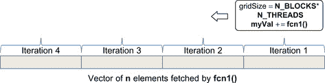
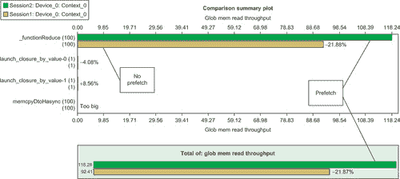
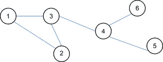

# 第六章 高效使用 GPU 内存  

# 降低

降低操作执行常见任务，如查找向量的最小值、最大值或求和。为 GPU 计算编写高性能的降低操作出乎意料地复杂，因为它需要对 CUDA 内存空间和执行模型有详细的理解。Thrust API 提供了一个简单的接口，隐藏了所有降低操作的复杂性，使其既灵活又易于使用。Thrust 使用了 NVIDIA 的 Mark Harris 设计的降低方法。展示各种降低优化的论文和示例代码已包含在 NVIDIA SDK 的*reduction*目录中。论文和代码都是推荐阅读的内容。本章提供了一个降低操作的示例，结合了前几章的讨论，并扩展了 Mark Harris 创建的降低方法：■ C++模板扩展了降低代码的通用性，可以使用用户定义的类型，如浮点数、双精度数、整数、长整型等。■ 使用计算 2.0 设备的新功能，如 PTX 预取指令和内联汇编代码，来提高全局内存读取性能。■ 临时存储被传递给降低方法，以便程序员可以消除冗余的**cudaMalloc()**和**cudaFree()**操作，这些操作会减慢 Thrust 实现，如在第三章中所指出的那样。■ 演示了传递和使用内联函数对象（functors），以创建一种通用的降低操作，这种操作不仅仅适用于查找向量的和。■ 在第四章中讨论的 ILP 被用于使代码更加易懂，并为复杂的降低操作（如在第三章和第四章中定义的目标函数）释放 SM 资源。

## 降低模板

以下是通用还原模板*functionReduce.h*的代码逐步解析，涵盖了每个代码段背后的关键概念和思路。代码片段可以组合在一起，构建完整的*functionReduce.h*源文件。预处理器变量**REDUCE_H**的**#ifndef**检查可以防止编译器错误，避免模板文件被多次包含；请参见示例 6.1，“*functionReduce.h*的第一部分”：`#ifndef REDUCE_H``#define REDUCE_H`。为了简便，模板的下一部分定义了 C2050 或 C2070 GPU 上使用的块数和线程数。这些定义可以从 NVIDIA SDK 代码**deviceQuery**确定的信息中手动设置。在这个模板的生产版本中，可能会查询设备属性并自动设置这些值，如示例 6.2，“*functionReduce.h*的第二部分”所示：`// 定义块数为 SM 数目的倍数``// 定义线程数为 SM 上最大可驻留的线程数``#define N_BLOCKS (1*14)``#define N_THREADS 1024``#define WARP_SIZE 32`。示例 6.3 开始定义**_functionReduce()**方法：`template <class T, typename UnaryFunction, typename BinaryFunction>``__global__ void``_functionReduce(T *g_odata, unsigned int n, T initVal, UnaryFunction fcn, BinaryFunction fcn1)``{`注意以下几点：  

|  |
| --- |
| **图 6.1** 反复从全局内存中获取 gridDim 区域数据。 |

`T myVal = initVal;``{ // 1) 首先使用最快的内存。``const int gridSize = blockDim.x*gridDim.x;``for(int i = n-1 -(blockIdx.x * blockDim.x + threadIdx.x);``i >= 0; i -= gridSize)``myVal = fcn1(fcn(i), myVal);``}`在这个循环完成后，寄存器变量**myVal**包含了**N_BLOCKS*N_THREADS**个部分值。在 CUDA 中，寄存器变量对其他线程不可访问。因此，有必要将存储在**myVal**中的部分值移动到较慢的共享内存中，以便其他线程能够访问。这一从寄存器到共享内存的转移发生在步骤 2 中，如示例 6.5 所示。这是一个并行转移，所有线程块中的线程将数据转移到每个 SM 内的共享内存变量**smem**中。共享内存是宝贵的资源，因此只分配最少量的共享内存。根据第四章中对 ILP 的讨论，只有一个 warp 的线程并行性被用来将每个 SM 上的**N_THREADS**个部分值减少到**WARP_SIZE**个部分值。寄存器变量**myVal**已经包含了第一个 warp 的正确值。因此，**smem**共享内存变量只需要包含**myVal**寄存器变量中**threadIdx.x**大于或等于**WARP_SIZE**的线程的内容。结果，**smem**可以分配给**WARP_SIZE**比**N_THREADS**少的元素。由于从寄存器到共享内存的转移是并行的，必须在赋值后调用 CUDA 的**__syncthreads()**方法，以确保所有**smem**的元素都已经写入。示例 6.5 中的几行代码完成了这一操作，“*functionReduce.h* 第五部分”：`// 2) 在 warp 中使用第二快的内存（共享内存）``// 按同步方式。``// 为每个块创建共享内存以进行归约。``// 重用第一个 warp 中的寄存器。``volatile __shared__ T smem[N_THREADS-WARP_SIZE];``// 将所有寄存器值放入共享内存``if(threadIdx.x >= WARP_SIZE) smem[threadIdx.x - WARP_SIZE] = myVal;``__syncthreads(); // 等待块中的所有线程完成.`此时，内核中没有理由使用超过一个 warp 线程数的线程，因为每个 SM 每次只能执行一个 warp 的指令。由于没有未解决的数据依赖性，单个 warp 足以保持 SM 忙于将共享内存中的内容从(**N_THREADS – WARP_SIZE)**个元素减少到每个 SM 上的**WARP_SIZE**个部分值。¹这就是为什么使用条件语句来保持**threadIdx.x**小于**WARP_SIZE**的线程处于活动状态。请参见示例 6.6，“*functionReduce.h* 第六部分”：¹根据计算代的不同，SM 可能能够在半 warp 上发出指令。`if(threadIdx.x < WARP_SIZE) {``// 现在只使用一个 warp。SM 每次只能运行一个 warp``#pragma unroll``for(int i=threadIdx.x; i < (N_THREADS − WARP_SIZE); i += WARP_SIZE)``myVal = fcn1(myVal,(T)smem[i]);``smem[threadIdx.x] = myVal; // 将 myVal 保存在此 warp 的 smem 开始位置``}`剩下的任务是将一个 warp 中的值归约成每个 SM 上的单一值。这等同于**N_BLOCKS**个部分值，因为**N_BLOCKS**定义为每个 SM 使用一个块。值得注意的是，此时 warp 内的并行性对性能的贡献不大，因为在示例 6.7 中只进行了五次**fcn1()**的调用。一种替代的实现方法是使用一个简单的循环，针对**WARP_SIZE**中的每个元素由单个线程（例如，当**threadIdx.x** == 0 时）执行，以创建每个 SM 上的单一部分值。如果**fcn1()**是**plus**()功能函数，这种串行版本将仅执行 27 次额外的加法，所消耗的时间几乎可以忽略不计，大约 100 纳秒。因此，有时并不需要充分利用系统中的所有并行性。然而，尽管如此，使用简单的并行代码，未来的计算代中可能会有所获益，因此我们使用了示例 6.7 中的实现，“*functionReduce.h* 第七部分”：`// 归约共享内存。``if (threadIdx.x < 16)``smem[threadIdx.x] = fcn1((T)smem[threadIdx.x],(T)smem[threadIdx.x + 16]);``if (threadIdx.x < 8)``smem[threadIdx.x] = fcn1((T)smem[threadIdx.x],(T)smem[threadIdx.x + 8]);``if (threadIdx.x < 4)``smem[threadIdx.x] = fcn1((T)smem[threadIdx.x],(T)smem[threadIdx.x + 4]);``if (threadIdx.x < 2)``smem[threadIdx.x] = fcn1((T)smem[threadIdx.x],(T)smem[threadIdx.x + 2]);``if (threadIdx.x < 1)``smem[threadIdx.x] = fcn1((T)smem[threadIdx.x],(T)smem[threadIdx.x + 1]);`最终任务是将剩余的**N_BLOCKS**个部分值归约成一个单一的值，完成归约。在这一点上，代码可以选择：■ 将**N_BLOCKS**（在此示例中为 14）个部分值转移到主机，由主机完成最终的归约。■ 使用如*NVIDIA CUDA C 编程指南* B.5 节所述的原子操作，确保所有部分值在完成归约前都已写入全局内存。因为这两种实现都需要为**N_BLOCKS**部分值分配临时空间，示例 6.8，“*functionReduce.h* 第八部分”，执行了数据转移到主机，因为它展示了如何在主机和设备上使用**fcn1()**功能函数：`// 3) 将全局内存作为最后手段，将结果传输到主机``// 将每个块的结果写入全局内存``if (threadIdx.x == 0) g_odata[blockIdx.x] = smem[0];``// 如果需要，可以在此进行 SM 间的最终归约。``}`主机方法**partialReduce()**在需要时分配部分和，并调用 CUDA 内核，如示例 6.9，“*functionReduce.h* 第八部分”所示：`template<typename T, typename UnaryFunction, typename BinaryFunction>``inline void partialReduce(const int n, T** d_partialVals, T initVal, UnaryFunction const& fcn, BinaryFunction const& fcn1)``{``if(*d_partialVals == NULL)``cudaMalloc(d_partialVals, (N_BLOCKS+1) * sizeof(T));``_functionReduce<T><<< N_BLOCKS, N_THREADS>>>(*d_partialVals, n, initVal, fcn, fcn1);``}`如示例 6.10，“*functionReduce.h* 第九部分”所示，**N_BLOCK**部分值从 GPU 转移到主机，在主机上使用**fcn1()**的主机版本完成归约。**#endif**完成了预处理器**#ifdef**语句，以防止头文件多次包含时发生编译错误。见示例 6.10，“*functionReduce.h* 第九部分”：`template<typename T, typename UnaryFunction, typename BinaryFunction>``inline T functionReduce(const int n, T** d_partialVals, T initVal, UnaryFunction const& fcn, BinaryFunction const& fcn1)``{``T h_partialVals[N_BLOCKS];``partialReduce(n, d_partialVals, initVal, fcn, fcn1);``if(cudaMemcpy(h_partialVals, *d_partialVals, sizeof(T)*N_BLOCKS, cudaMemcpyDeviceToHost) != cudaSuccess) {``cerr << "_functionReduce 复制失败!" << endl;``exit(1);``}``T val = h_partialVals[0];``for(int i=1; i < N_BLOCKS; i++) val = fcn1(h_partialVals[i],val);``return(val);``}``#endif`

## 一个用于 functionReduce.h 的测试程序

*functionReduce.h* 模板的测试程序在内存中创建了一个顺序整数的向量，类似于第一章中的示例。向量的大小可以通过命令行指定。用户还可以提供一个数值选项，以使用一个包含 CUDA PTX **prefetch.global** 汇编指令的函数对象、一个从内存读取（没有任何预取）的函数对象，以及一个 **thrust::reduce()** 调用来运行。**fcn1()** 方法可以在编译时指定。默认情况下，应用程序执行求和操作。其他函数对象如 **thrust::minimum()** 或 **thrust::maximum()** 可以通过修改代码中的 **FCN1** 定义，或者通过 **nvcc** 命令来使用。通过修改预处理器变量 **RUNTYPE** 可以更改运行类型。指定预处理器变量 **DO_CHECK** 会对 thrust 降维代码执行验证测试。示例 6.11，“*testPre.cu* 的第一部分”是对测试代码的逐步讲解。如有需要，可以将单独的代码片段组合起来，创建一个完整的工作测试。必要的预处理器和命名空间定义出现在文件的开头：`#include <iostream>``using namespace std;``#include <thrust/host_vector.h>``#include <thrust/device_vector.h>``#include <thrust/functional.h>``#include <thrust/random.h>``#include "functionReduce.h"``#ifndef RUNTYPE``#define RUNTYPE int``#endif``#ifndef FCN1``#define FCN1 plus``#endif``#include <iostream>``using namespace std;`**prefetch** 函数对象是一个持久化的函数对象，它保存了一个指向设备内存的指针。每次调用此函数对象时，都会返回由 **i** 索引的向量。在返回向量元素之前，首先检查索引是否可以从全局内存中预取下一个数据值网格（例如，**N_BLOCKS*N_THREADS** 个值）。可以通过测试预取索引的有效性，因为 **_functionReduce()** 会反向遍历向量。测试索引是否大于或等于零，以确保只预取有效的数组元素。如果索引有效，则使用 PTX **prefetch.global.L2** 汇编指令执行预取。此指令仅在计算能力 2.0 设备上有效。参见 示例 6.12，“*testPre.cu* 的第二部分”：`template<class T1, class T2>``struct prefetch : public thrust::unary_function<T1,T2> {``const T1* data;``prefetch(T1* _data) : data(_data) {};``__device__``// 此方法将前一个数据点网格预取到 L2 中。``T1 operator()(T2 i) {``if( (i-N_BLOCKS*N_THREADS) > 0) { //预取前一个网格``const T1 *pt = &data[i − (N_BLOCKS*N_THREADS)];``asm volatile ("prefetch.global.L2 [%0];"::"l"(pt) );``}``return data[i];``}``};`**memFetch()** 函数对象与 **prefetch()** 函数对象类似，只是不执行任何预取操作。此函数对象可以在所有计算设备上运行。参见 示例 6.13，“*testPre.cu* 的第三部分”：`template<class T1, class T2>``struct memFetch : public thrust::unary_function<T1,T2> {``const T1* data;``memFetch(T1* _data) : data(_data) {};``__host__ __device__``T1 operator()(T2 i) {``return data[i];``}``};`此测试利用基于随机数最低位的零和一的随机序列。这些数字由以下代码中的函数对象创建：`// 并行随机数生成器``// http://groups.google.com/group/thrust-users/browse_thread/thread/dca23bfa678689a5``struct parallel_random_generator``{``__host__ __device__``unsigned int operator()(const unsigned int n) const``{``thrust::default_random_engine rng;``// 丢弃 n 个数字以避免相关性``rng.discard(n);``// 返回一个随机数``return rng() & 0x01;``}``};`**doTest()** 例程是直接的 C++ 代码。指向临时空间的指针 **d_partialVals** 被设置为 NULL，这意味着第一次调用 **functionReduce()** 时将分配所需的空间。设备向量 **d_data** 通过 thrust API 根据传递给该方法的 **nData** 变量的大小进行分配。变量 **op** 选择要执行的测试。0 表示不使用预取；1 选择预取测试。任何其他值表示调用 thrust 降维方法。参见 示例 6.15，“*testPre.cu* 的第四部分”：`/****************************************************************/``/* 测试例程*/``/****************************************************************/``#define NTEST 100``template<typename T>``void doTest(const long nData, int op)``{``T* d_partialVals=NULL;``thrust::device_vector<T> d_data(nData);``// 用随机数填充 d_data（零或一）``thrust::counting_iterator<int> index_sequence_begin(0);``thrust::transform(index_sequence_begin, index_sequence_begin + nData, d_data.begin(), parallel_random_generator());``cudaThreadSynchronize(); // 等待所有队列中的任务完成``thrust::FCN1<T> fcn1;``double startTime, endTime;``T d_sum;``T initVal = 0;``switch(op) {``case 0: {``memFetch<T,int> fcn(thrust::raw_pointer_cast(&d_data[0]));``startTime=omp_get_wtime();``for(int loops=0; loops < NTEST; loops++)``d_sum = functionReduce<T>(nData, &d_partialVals, initVal, fcn, fcn1);``endTime=omp_get_wtime();``cout << "未使用预取 ";``} break;``case 1: {``prefetch<T,int> fcnPre(thrust::raw_pointer_cast(&d_data[0]));``startTime=omp_get_wtime();``for(int loops=0; loops < NTEST; loops++)``d_sum = functionReduce<T>(nData, &d_partialVals, initVal, fcnPre, fcn1);``endTime=omp_get_wtime();``cout << "使用预取 ";``} break;``default:``startTime=omp_get_wtime();``for(int loops=0; loops < NTEST; loops++)``d_sum = thrust::reduce(d_data.begin(), d_data.end(), initVal, fcn1);``endTime=omp_get_wtime();``cout << "Thrust ";``}``cout << "变换降维时间 " << (endTime-startTime)/NTEST << endl;``cout << (sizeof(T)*nData/1e9) << " GB " << endl;``cout << "d_sum" << d_sum << endl;``cudaFree(d_partialVals);``#ifdef DO_CHECK``T testVal = thrust::reduce(d_data.begin(), d_data.end(), initVal, fcn1);``cout << "testVal " << testVal << endl;``if(testVal != (d_sum)) {cout << "错误 " << endl;}``#endif``}`**main()** 例程仅解析命令行并运行测试。参见 示例 6.16，“*testPre.cu* 的第五部分”：`int main(int argc, char* argv[])``{``if(argc < 3) {``cerr << "用法：nData(K) op(0:不预取，1:预取，2:thrust)" << endl;``return(1);``}``int nData=(atof(argv[1])*1000000);``int op=atoi(argv[2]);``doTest<RUNTYPE>(nData, op);``return 0;``}``

## 结果

表 6.1 中的结果是在 NVIDIA C2070 上生成的。报告的是在 100 次运行中每次归约的平均时间。对于较小的向量大小，**functionReduce()** 显然优于 Thrust 实现，最高加速比为 8 倍。如第三章所述，部分加速可以归因于 **functionReduce()** 实现中分配临时空间的时间仅发生一次。在解释小规模运行的时间时需要小心，因为它们完成得非常快。正如在论文《消失的超级计算机性能》中所指出的，操作系统的守护进程即使短暂唤醒也会影响性能（Petrini, Kerbyson, & Pakin, 2003）。

**表 6.1** 针对多个问题大小的 Thrust::Reduce 加速比

| 元素数量 | 无预取（秒） | 预取（秒） | Thrust（秒） | 无预取相对于 Thrust 的加速比 | 预取相对于 Thrust 的加速比 |
| --- | --- | --- | --- | --- | --- |
| 1,000 M | 0.043434 | 0.033777 | 0.035986 | 0.8 | 1.1 |
| 100 M | 0.004314 | 0.003387 | 0.003758 | 0.9 | 1.1 |
| 10 M | 0.000447 | 0.000360 | 0.000536 | 1.2 | 1.5 |
| 1 M | 0.000063 | 0.000055 | 0.000197 | 3.1 | 3.6 |
| 100 K | 0.000021 | 0.000021 | 0.000160 | 7.8 | 7.7 |
| 10 K | 0.000018 | 0.000018 | 0.000156 | 8.4 | 8.5 |

使用 PTX 预取指令显然有助于解决更大的问题。原因在于它能更好地利用可用的全局内存带宽。图 6.2 是通过视觉分析工具生成的对比图，显示了预取全局内存读取吞吐量（顶部线条）比非预取版本的代码高出 21.8%。更高的全局内存读取性能有利于更大的向量问题，因为预取版本始终比非预取版本更快。预取方式也稍微比 Thrust 实现更快，如表 6.1 所示。

|  |
| --- |
| **图 6.2**可视化分析器比较，显示预取实现了更高的全局内存带宽。 |

计算预取地址的成本确实会对小向量长度的减少带来轻微的性能损失，相较于不使用预取版本。预取数据只有在增加的全局内存带宽足以让内核运行得足够快，克服与预取计算相关的额外成本时，才是有益的。保持计算预取索引的成本是示例中**prefetch()**函数使用如此简单计算的原因。

# 利用不规则数据结构

前面的例子使用了非常规律的访问模式，这些模式从全局内存流式传输信息。大量计算问题，如图算法和树算法，代表了在 GPU 上合并并行内存访问的最坏情况。这些算法大多表现出不规律甚至是随机的内存访问模式。图算法在社交媒体分析中很常见（Corley, Farber, & Reynolds, 2011）以及生物学（Jones 和 Pavel，2004）和许多其他领域。树算法通常用于快速数据存储和检索。同样，向量的*gather*和*scatter*操作常用于稀疏矩阵和数值计算。向量 gather 操作“聚集”来自任意向量元素的数据。参见示例 6.17，“向量 Gather 操作”：`for(int i = 0; i < n; i++) a[i] = b[index[i]];` 向量 scatter 操作是将数据“分散”到内存中的向量中的操作，参见示例 6.18，“向量 Scatter 操作”：`for(int i = 0; i < n; i++) a[index[i]] = b[i];` 不规则的内存访问对大规模并行计算机是一个挑战，因为增加内存带宽并不一定会提高性能。合并内存访问意味着内存访问可以组合成一个单一的内存事务，作用于一组连续的字节信息。表 5.10 和表 5.11 显示了在启用和禁用缓存的情况下，计算 2.0 GPU 上各种用例的合并内存效率。不规则的内存访问打破了内存事务可以合并为一个或几个大内存事务的假设。例如，示例 6.16 中的**index**向量可能包含随机的索引值，这将导致每个线程访问**b**[**index**[**i**]]时生成一个独立的全局内存事务。这对于 SM（以及 GPU 内存子系统）来说是最坏的情况，因为每个 warp 必须等所有 32 个内存访问完成后才能发出指令。在最坏的情况下，所有 warp 和 SM 将发出内存事务，且这些事务落在全局内存的单一内存分区上，这会将可用的内存带宽降低到单一内存子系统的水平。计算 2.0 及更高版本的设备中的 L2 缓存提供了加速执行不规则内存访问算法的最佳单一解决方案。虽然这不是一种通用解决方案，但 L2 缓存会透明地加速大多数应用程序，因为它提供了一个高速内存区域，SM 上的线程可以在此区域中请求小的、不规则的内存访问。局部化内存访问可以显著改善应用程序性能，因为它允许 L2 缓存更有效地为应用程序线程工作。对索引数组进行排序是处理随机数据的一个合理方法，前提是允许对索引进行某种重新排序。当然，当程序员努力利用算法中的引用局部性时，可以获得更好的性能。以下程序，*testGather.cu*，在 CUDA 测试代码中实现了示例 6.16。使用了 Thrust API，以方便地将数据从主机传输到设备，并填充和排序索引数组。程序的第一部分—示例 6.19，“*testGather.cu*的第一部分”—定义了一个 gather functor：`#include <omp.h>``#include <iostream>``using namespace std;``#include <thrust/host_vector.h>``#include <thrust/device_vector.h>``#include <thrust/sort.h>``#include <thrust/sequence.h>``#include <thrust/functional.h>``struct gather_functor {``const int* index;``const int* data;``gather_functor(int* _data, int* _index) : data(_data), index(_index) {};``__host__ __device__``int operator()(int i) {``return data[index[i]];``}``};`示例 6.20，“*testGather.cu*的第二部分”，解析命令行参数并执行测试：`int main(int argc, char *argv[])``{``if(argc < 3) {``cerr << "Use: size (k) nLoops sequential" << endl;``return(1);``}``int n = atof(argv[1])*1e3;``int nLoops = atof(argv[2]);``int op = atoi(argv[3]);``cout << "Using " << (n/1.e6) << "M elements and averaging over "``<< nLoops << " tests" << endl;``thrust::device_vector<int> d_a(n), d_b(n), d_index(n);``thrust::sequence(d_a.begin(), d_a.end());``thrust::fill(d_b.begin(), d_b.end(),-1);``thrust::host_vector<int> h_index(n);``switch(op) {``case 0:``// 最佳情况：顺序索引``thrust::sequence(d_index.begin(), d_index.end());``cout << "顺序数据 " << endl;``break;``case 1:``// 中等性能情况：随机索引``for(int i=0; i < n; i++) h_index[i]=rand()%(n-1);``d_index = h_index; // 传输到设备``thrust::sort(d_index.begin(), d_index.end());``cout << "已排序的随机数据 " << endl;``break;``default:``// 最坏情况：随机索引``for(int i=0; i < n; i++) h_index[i]=rand()%(n-1);``d_index = h_index; // 传输到设备``cout << "随机数据 " << endl;``break;``}``double startTime = omp_get_wtime();``for(int i=0; i < nLoops; i++)``thrust::transform(thrust::counting_iterator<unsigned int>(0),``thrust::counting_iterator<unsigned int>(n),``d_b.begin(),``gather_functor(thrust::raw_pointer_cast(&d_a[0]),``thrust::raw_pointer_cast(&d_index[0])));``cudaDeviceSynchronize();``double endTime = omp_get_wtime();``// 双重检查结果``thrust::host_vector<int> h_b = d_b;``thrust::host_vector<int> h_a = d_a;``h_index = d_index;``for(int i=0; i < n; i++) {``if(h_b[i] != h_a[h_index[i]]) {``cout << "错误!" << endl; return(1);``}``}``cout << "成功!" << endl;``cout << "平均时间 " << (endTime-startTime)/nLoops << endl;``}`此程序要求用户指定：■ 向量的大小（以百万个元素为单位）。■ 执行测试的次数，以计算平均运行时间。■ 一个整数值，指定*testGather.cu*应执行的测试类型。该程序理解以下值：■ 0 值将索引向量填充为顺序值。所有内存访问都是顺序的并且是合并的。■ 1 指定**index**包含一个已排序的随机索引值列表。此选项显示通过规范化索引值以利用局部性所能实现的性能。■ 默认情况下，将**index**填充为随机值。这是 GPU 内存系统的最坏情况。 在 NVIDIA C2070 GPU 上运行*testGather.cu*表明，当处理小问题时，L2 缓存表现得非常出色。当通过排序局部化随机访问时，它可以提供数量级的性能提升。当然，排序仅在平均情况下有效。最坏情况下的性能与随机情况没有任何不同。该测试假设索引会被重用，因此未将排序的时间包含在表 6.2 中报告的运行时间内。

**表 6.2** *testGather.cu* 在不同问题规模上的性能

| 大小 | 操作 | 测试次数 | 时间 | 相对于顺序性能的减慢倍率 |
| --- | --- | --- | --- | --- |
| 0.01 M | 顺序 | 1000 | 3.37E-06 |  |
| 0.01 M | 排序 | 1000 | 3.44E-06 | 1.0 |
| 0.01 M | 随机 | 1000 | 7.46E-06 | 2.2 |
| 0.1 M | 顺序 | 1000 | 1.39E-05 |  |
| 0.1 M | 排序 | 1000 | 1.42E-05 | 1.0 |
| 0.1 M | 随机 | 1000 | 6.94E-05 | 5.0 |
| 1 M | 顺序 | 1000 | 0.000107 |  |
| 1 M | 排序 | 1000 | 0.000106 | 1.0 |
| 1 M | 随机 | 1000 | 0.000972 | 9.1 |
| 10 M | 顺序 | 1000 | 0.001077 |  |
| 10 M | 排序 | 1000 | 0.00105 | 1.0 |
| 10 M | 随机 | 1000 | 0.011418 | 10.6 |
| 100 M | 顺序 | 1000 | 0.011553 |  |
| 100 M | 排序 | 1000 | 0.013233 | 1.1 |
| 100 M | 随机 | 1000 | 0.132465 | 11.5 |

# 稀疏矩阵与 CUPS 库

稀疏矩阵结构出现在许多计算领域中。对于许多应用，稀疏矩阵方法通常是限制应用性能的瓶颈方法。特别是，稀疏矩阵-向量乘法（SpMV）在许多求解大规模线性系统和特征值问题的迭代方法中占据主导成本，这些问题出现在各种科学和工程应用中。CUSP 库（用于稀疏矩阵和图计算的通用并行算法）是一个基于推力的项目，旨在通过 GPU 执行稀疏矩阵和图的计算。它提供了一个灵活的高级接口，用于操作稀疏矩阵和求解稀疏线性系统。该库的源代码可以从 Google Code 下载，该项目在此处托管（[`code.google.com/p/cusp-library/`](http://code.google.com/p/cusp-library/)）。该库使用多种常见的稀疏矩阵格式，每种格式具有不同的优势，如文档中所述。文献中的结果表明，1.x 版 GPU 相较于 Intel 四核 Clovertown 系统，可以提供一个数量级的性能提升（Bell & Garland, 2009）。这是一个活跃的研究领域，人们正在研究如何最优地利用硬件（El Zein & Rendell, 2011）以及稀疏矩阵表示法（Cao, Yao, Li, Wang, & Wang, 2010）。CUSP 提供了一个简单的接口来进行稀疏矩阵操作，如在示例 6.21 中所示，用于确定最大独立集，即一个不包含任何其他独立集的独立集。它是社交网络分析中用于识别群体或团体的重要度量。`#include <cusp/graph/maximal_independent_set.h>``#include <cusp/gallery/poisson.h>``#include <cusp/coo_matrix.h>``// 该示例计算最大独立集（MIS）``// 用于一个 10x10 网格。该 10x10 网格的图``// 由与 10x10 Poisson 问题相对应的稀疏矩阵的``// 稀疏模式描述。``//``// [1] http://en.wikipedia.org/wiki/Maximal_independent_set``int main(void)``{``size_t N = 10;``// 初始化表示 10x10 网格的矩阵``cusp::coo_matrix<int, float, cusp::device_memory> G;``cusp::gallery::poisson5pt(G, N, N);``// 为 MIS 分配存储空间``cusp::array1d<int, cusp::device_memory> stencil(G.num_rows);``// 计算 MIS``cusp::graph::maximal_independent_set(G, stencil);``// 将 MIS 打印为 2D 网格``std::cout << "最大独立集（标记为 X）\n";``for (size_t i = 0; i < N; i++)``{``std::cout << " ";``for (size_t j = 0; j < N; j++)``{``std::cout << ((stencil[N * i + j]) ? "X" : "0");``}``std::cout << "\n";``}``return 0;``}``

# 图算法

高效图算法实现的研究也是 GPU 和并行计算领域的一个活跃研究方向。与 CUSP 采用的稀疏矩阵方法不同，这些研究实现了一种由节点和边组成的图数据结构。图 6.3 展示了一个包含六个顶点和边的标记图示例。

|  |
| --- |
| **图 6.3** 一个图的示例。 |

图上的典型高级操作包括通过深度优先搜索或广度优先搜索找到两个节点之间的路径，以及找到两个节点之间的最短路径。图相似性是模式识别中的一个重要问题。例如，化学化合物可以表示为图。在搜索化学数据库时，常常需要比较两个图以查看它们是否相等。这导致了一些有趣的计算问题，比如如何为精确搜索规范化图的标签。通过规范化标签，可以通过字符串搜索找到图结构。或者，图同构是一种重要方法，用于找到具有相同或相似结构的图。图中的中心性是衡量一个顶点在图中相对重要性的度量。示例包括：一个人在社交网络中的重要性，以及一条道路在交通网络中的关键性。主要的中心性度量如下（Corley, Farber, & Reynolds, 2011）：  

# SoA、AoS 和其他结构

许多遗留应用将数据存储为结构数组（AoS），这可能会导致合并问题。从 GPU 性能的角度来看，最好将数据存储为数组的结构（SoA）。示例 6.22，“AoS 示例”，创建了一个 AoS：`struct S {``float x;``float y;``};``struct S myData[N];`以这种方式排列数据会导致合并问题，因为数据是交错存储的。执行一个只需要变量**x**的操作将导致 50% 的带宽损失，并浪费 L2 缓存内存。示例 6.23，“SoA 示例”，展示了如何分配一个 SoA：`struct S {``float x[N];``float y[N];``};``struct S myData;`将数据排列为 SoA 即使在仅使用结构体的个别元素时也能充分利用内存带宽。没有数据交错；该数据结构应提供合并内存访问，并实现高效的全局内存性能。CUDA 程序 *sorting_aos_vs_soa.cu* 包含在可供免费下载的 thrust 教学示例中。它演示了如何使用 thrust 对 SoA 和 AoS 结构进行排序。代码中的注释指出，通过使用 SoA 数据结构可以实现 5 倍的加速。

# 瓦片与模板

在内核执行配置中定义的计算网格可以用来将计算分解成并行执行的子问题。*瓦片*和*模板*是多维网格创建中使用的抽象概念。特别是，这些抽象帮助程序员将数据访问分组到常见的模式中，并在线程块内定义线程间通信的共享内存使用。矩阵乘法是 GPU 上使用 2D 区域，或*瓦片*的教科书式示例。书籍《大规模并行处理器编程：动手实践方法》（Kirk & Hwu, 2010）详细讨论了矩阵乘法和瓦片的使用。然而，除了矩阵乘法之外，瓦片是许多问题中常用的设计范式。CUDA N-body SDK 示例是使用瓦片在 GPU 上以高性能解决复杂问题的另一个优秀演示。模板是瓦片概念到*n*维度的推广。模板计算：■ 在离散*n*-维空间中的每个点上进行操作。■ 使用邻近点进行计算。■ 通常被时间循环所包围。■ 可以有不同的边界条件。瓦片和模板都帮助 CUDA 开发者将问题公式化，以最佳利用 SM 中的共享内存和寄存器，并利用所有 SM 的并行性。论文“使用 CUDA 在 GPU 上进行 3D 有限差分计算”（Micikevicius, 2010）详细讨论了可以从 NVIDIA 网站免费下载的模板。Volkov 在“在 GPU 上编程逆内存层次结构：模板案例”（Volkov, 2010）中展示了如何使用 ILP 加速模板问题。瓦片和模板在执行带有*四叉树*和*八叉树*的 GPU 计算中也同样重要。四叉树是一种基于树的结构的内部节点有四个子节点。它通过递归地将空间划分为象限来对二维空间进行分区。八叉树每个内部节点有八个子节点，用于递归地将三维空间划分为区域。这两种数据结构都可以表现出不规则的全球内存访问。书籍《GPU 计算宝石》（Hwu, 2011）包含了多个详细示例，说明了该领域的专家如何使用这些和其他不规则数据结构在 CUDA 中解决复杂的科学问题。

# 总结

本章介绍了高效使用 GPU 内存的技术和示例。最慢和最快的 GPU 内存系统之间性能差异达到三个数量级，这意味着 GPU 程序员有机会利用 GPU 硬件提供的极致性能。CUDA 之所以特别，是因为它暴露了底层硬件的特性，从而可以充分发挥硬件的潜力。正如本章中的归约示例所示，我们可以深入到底层硬件执行模型，以达到高性能。另一方面，Thrust 将这种复杂性封装成了一个简单的 API 调用，在本书的第一个程序中就已经使用了。正如本章所演示的，通用编程让 CUDA 程序员可以创建简单的通用方法，充分利用 GPU 的能力。CUDA 开发的未来很大一部分在于创建像 Thrust 和 CUSP 这样的通用库和 API。随着这些接口的成熟，CUDA 程序员将能够在更短的时间内完成更多工作。其概念很简单：  
