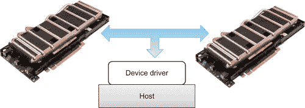
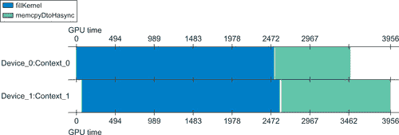

第七章 技术提升并行性  

# CUDA 上下文扩展并行性

一个 CUDA 应用程序通过设备驱动程序与 GPU 硬件进行交互，如图 7.1 所示。

|  |
| --- |
| **图 7.1**GPU 与主机通过设备驱动程序进行通信。 |

驱动程序通过为系统上运行的每个基于 GPU 的应用程序创建一个单独的*上下文*来支持多个并发应用程序。上下文包含应用程序所需的全部驱动程序状态信息，例如虚拟地址空间、流、事件、分配的内存块以及其他运行基于 GPU 应用程序所需的数据。通过在上下文之间切换，设备驱动程序表现得像一个可以多任务处理多个 GPU 应用程序的小型操作系统。例如，用户可以同时运行多个 OpenGL 渲染应用程序和多个 CUDA 计算应用程序。类似地，GPU 设备驱动程序允许单个 CUDA 应用程序通过在设备驱动程序中提供对多个上下文的访问来利用多个设备。一次只能有一个上下文处于活动状态，这就是为什么 CUDA 驱动程序包含一个计时器来检测在 GPU 上执行某些操作时挂起的 GPU 应用程序。错误地运行包含无限循环的 CUDA 内核是导致超时的应用程序的一个例子。好消息是，控制最终会回到用户手中，这样他或她就可以在不重新启动系统的情况下纠正问题。默认情况下，CUDA 在第一次调用改变驱动程序状态的函数时创建一个上下文。调用**cudaMalloc()**就是这样的调用，它会改变上下文状态。许多 CUDA 程序员依赖于这种默认行为来透明地利用单个 GPU。请注意，除非程序员在创建上下文之前使用**cudaSetDevice()**选择其他 GPU，否则上下文通常默认在 GPU 零上创建。上下文通过调用**cudaDeviceReset()**或当控制主机进程退出时被销毁。从 CUDA 2.2 版本开始，Linux 管理员可以通过 SMI（系统管理接口）工具选择*独占模式*。在独占模式下，上下文不再默认在 GPU 0 上创建，而是在没有活动上下文的 GPU 上创建。如果没有可用的 GPU，或者如果**cudaSetDevice()**指定了一个已经具有活动上下文的 GPU，则尝试更改设备状态的第一个 CUDA 调用将失败并返回错误。这种功能可以用来在系统中的未使用 GPU 上运行计算密集型或内存密集型应用程序。

# 流与上下文

CUDA 应用程序通过将操作排队到流中来管理工作和并发。CUDA 在创建上下文时隐式地创建一个流，这样命令就可以排队在设备上执行。例如，调用**cudaMemcpy()**会在当前流上排队一个阻塞的数据传输。同样，调用 CUDA 内核会将内核调用排队到与当前设备关联的流中。如果需要，程序员可以在执行配置中指定流，如示例 7.1 中所示，“包含流规范的执行配置”：`Kernel<<<nBlocks, nThreadsPerBlock, 0, stream[i]>>>(parameters)`。所有在流上排队的操作按*顺序*执行，这意味着每个操作都会按照它被放入队列的顺序从队列中取出。换句话说，队列充当一个 FIFO（先进先出）缓冲区，操作会按顺序被从队列中取出并在设备上执行。多个流是并发执行跨设备操作或在单个设备上并发运行多个内核所必需的。

## 多个 GPU

在单个应用程序中使用多个 GPU 的最简单方法是隐式地为每个设备的每个上下文创建一个流，如下面的示例所示。**cudaGetDeviceCount()** 方法用于确定系统中的设备数量。调用 **cudaSetDevice()** 来设置设备。在这个代码片段中，使用 **cudaMalloc()** 通过引起上下文状态变化来诱发上下文的创建。如果需要，可以通过传递给 **cudaGetDeviceProperties()** 的 **cudaDeviceProp** 变量枚举额外的设备属性。参见 示例 7.2，"在多个设备上创建上下文"：`cudaGetDeviceCount(&nGPU);``int *d_A[nGPU];``for(int i=0; i < nGPU; i++) {``cudaSetDevice(i);``cudaMalloc(&d_A[i],n*sizeof(int));``}``然后，可以将工作排队到与每个设备相关联的默认流上。同样，**cudaSetDevice()** 用于选择设备上下文。所有在 **cudaSetDevice()** 之后排队的 GPU 操作都会隐式地排队到与设备相关联的流上，除非在 API 调用或内核执行时显式指定了流。

## 显式同步

有多种方式可以显式地使流与流之间进行同步。*事件*是一种方法，程序员可以在流中创建占位符。然后可以监控该事件，以确定一组任务何时完成。请注意：■ CUDA 4.0 还允许跨上下文共享事件，这使得事件能够在系统中的多个设备之间协调任务。■ 流 0 中的事件在所有流中的所有任务完成后才会完成。■ 为了进行性能分析，可以通过**cudaEventElapsedTime()**来确定两个事件之间的经过时间。以下示例展示了如何在变量**stop**和**start**中创建两个事件。**start**事件被放置在队列中，之后会排队一个或多个任务。然后将**stop**事件推入队列。主机随后在调用**cudaEventSynchronize()**时停止。主机执行不会继续，直到**stop**事件被标记为完成。与此同时，驱动程序会按顺序异步处理队列。这意味着它会处理并标记**start**事件为完成。工作继续处理队列中的其余任务。最终，驱动程序处理**stop**事件并标记其为完成。这会唤醒主机线程，主机线程继续处理**cudaEventSynchronize()**调用后的代码。如本示例所示，时间是与事件相关联的属性。通过调用**cudaEventElapsedTime()**可以获取**start**事件和**stop**事件标记为完成时的时间差。因此，示例 7.3，“使用事件计时任务”，演示了如何计时一组任务：`// 创建两个事件``cudaEvent_t start, stop;``cudaEventCreate(&start); cudaEventCreate(&stop);``cudaEventRecord(start, 0)``// 排队一些任务``...``cudaEventRecord(stop, 0);``cudaEventSynchronize(stop);``// 获取经过的时间``float elapsedTime;``cudaEventElapsedTime(&elapsedTime, start, stop);``// 销毁事件``cudaEventDestroy(start);``cudaEventDestroy(stop)`以下是显式同步流和事件的运行时方法：■ **cudaDeviceSynchronize()** 会等待，直到所有主机线程中所有流中的前置命令都完成。■ **cudaStreamSynchronize()** 以流作为参数，并等待直到指定流中的所有前置命令完成。它可以用来将主机与特定流同步，允许其他流继续在设备上执行。■ **cudaStreamWaitEvent()** 以流和事件作为参数，确保在调用**cudaStreamWaitEvent()**后，添加到指定流中的所有命令的执行会延迟，直到给定事件完成。流可以为 0，在这种情况下，添加到任何流中的所有命令都会在调用**cudaStreamWaitEvent()**后等待该事件。■ **cudaStreamQuery()** 检查指定流中所有前置命令是否已完成。

## 隐式同步

排队在不同流上的任务通常会并行运行。一些基于主机的操作会强制所有流暂停，直到主机操作完成。在执行以下主机操作时需要小心，因为它们会停止所有并发操作，并对应用程序性能产生负面影响：■ 页面锁定的主机内存分配。■ 设备内存分配。■ 设备内存设置。■ 设备之间的内存复制。■ L1/共享内存配置之间的切换。

## 统一虚拟地址空间

UVA 空间为系统中的所有主机和 GPU 设备提供了一个单一的地址空间。UVA 适用于在 TCC 模式下运行的 Windows Vista/7 上的所有 64 位应用程序、Windows XP 和 Linux。UVA 在 32 位系统上无法使用。在受支持的系统上，通过**cudaHostAlloc()**或任何**cudaMalloc*()**方法（如**cudaMalloc()**、**cudaMallocPitch()**等）进行的任何内存分配所返回的指针，唯一地标识了内存区域及其所在的设备。如果需要，CUDA 程序员可以通过**cudaPointerGetAttributes()**来确定内存的具体位置。由于 UVA 的存在：■ **cudaMemcpy()**方法不再关注**cudaMemcpyKind**参数。为了兼容非 UVA 环境，仍然可以指定数据传输的方向（主机到设备或设备到主机）。如果不考虑移植性，**cudaMemcpyDefault**可以为方便起见使用。■ 现在，通过简单地指定指向两个设备内存的指针，可以实现高性能的 GPU 到 GPU 数据传输。■ 在 UVA 系统上，通过**cudaHostAlloc()**返回的主机内存指针可以直接被设备内核使用。无需通过**cudaHostGetDevicePointer()**获取设备指针。这包括通过将标志**cudaHostAllocMapped**传递给**cudaHostAlloc()**或将**cudaHostRegisterMapped**传递给**cudaHostRegister()**创建的映射内存。为了兼容计算能力为 1.x 的设备和 32 位应用程序，仍然可以使用**cudaHostGetDevicePointer()**。基于 Thrust 的应用程序需要使用**thrust::device_pointer_cast()**来转换指针。应用程序可以通过检查**unifiedAddressing**设备属性是否设置，来查询是否为特定设备使用了统一地址空间。

## 一个简单的示例

以下示例演示了如何同时运行一个或多个 GPU。它：1\. 为每个 GPU 分配**n**个整数的空间。在本示例中，**n**为一百万。2\. 同时填充每个 GPU 上的向量，以创建一个包含连续整数的大向量。3\. 异步地将 GPU 内存传输到主机内存。4\. 检查结果的正确性。以下讲解讨论了代码中的多 GPU 和并发执行的方面。所有代码段可以合并为一个源文件，进行编译和执行。CUDA 内核**fillKernel()**将连续的整数**offset**+0 到**offset**+**n**写入设备上的向量。每个整数会被写入 100 次，以增加**fillKernel()**的运行时间，来更好地说明该内核在两个 GPU 上的并发执行，如图 7.2 所示。参见示例 7.4，“*multiGPU.cu*的第一部分”：

## 性能分析结果

图 7.2 来自可视化分析器的宽度图清楚地显示了**fillKernel()**在设备 0 和设备 1 上并行运行。此外，异步内存传输也并行进行。由于每个队列上的操作开始时间不同，其中一个数据传输稍微比另一个晚完成。

|  |
| --- |
| **图 7.2** 可视化分析器宽度图，显示并行设备执行。 |

# 多流的乱序执行

CUDA 开发者也可以通过 **cudaStreamCreate()** 显式创建流。如 示例 7.11 “展示创建多个流的示例” 中所示，可以调用 **cudaSetDevice()** 来设置流将要创建的设备（及上下文）。`for(int i=0; i < nGPU; i++) {``cudaSetDevice(i)``if(cudaStreamCreate(&streams[i]) != 0) {``fprintf(stderr,"Stream create failed!\n"); exit(1);``}``}`若将命令提交到未与当前设备关联的流，则会导致内核启动或内存拷贝失败，如 示例 7.12 “展示必须使用正确上下文的示例” 中所示，该示例取自 *NVIDIA CUDA C 编程指南*：`cudaSetDevice(0);// 设置设备 0 为当前设备``cudaStream_t s0;``cudaStreamCreate(&s0);// 在设备 0 上创建流 s0``MyKernel<<<100, 64, 0, s0>>>(); // 在设备 0 上通过流 s0 启动内核``cudaSetDevice(1);// 设置设备 1 为当前设备``cudaStream_t s1;``cudaStreamCreate(&s1);// 在设备 1 上创建流 s1``MyKernel<<<100, 64, 0, s1>>>(); // 在设备 1 上通过流 s1 启动内核``// 该内核启动将失败：``MyKernel<<<100, 64, 0, s0>>>(); // 在设备 1 上通过流 s0 启动内核`如 *multGPU.cu* 中所示，可以在不同上下文中创建多个流，以执行 *无序执行* 支持在单个主机线程中使用多个 GPU。换句话说，不保证不同流上的命令相对彼此的执行顺序。类似地，可以在单个上下文内创建多个流，以支持在单个上下文内的无序执行。异步内核执行就是单一上下文内无序执行的一个示例，其中多个内核可以在同一设备上并行执行。以下源代码 (示例 7.13) 修改了 *multiGPU.cu* 以演示在单个 GPU 上的并发内核执行。源代码中的修改部分已标出：■ **fillKernel()** 中的循环次数增加，以更好地突出同步与并发内核运行时间的差异。■ **n** 的值减少到 1024，以便 **fillKernel()** 仅使用两个块来处理每个向量。■ 创建了五个流，运行并发的 **fillKernel()** 实例。■ 为了进行时间对比，当 C 处理器变量 **USE_SINGLE_STREAM** 被定义时，所有内核将按顺序运行在 **stream[0]** 上。`__global__ void fillKernel(int *a, int n, int offset)``{``int tid = blockIdx.x*blockDim.x + threadIdx.x;``if (tid < n) {``register int delay=1000000;``while(delay > 0) delay--;``a[tid] = delay + offset+tid;``}``}``int main(int argc, char* argv[])``{``int nStreams=5;``**int n = 1024;**``int size = n * sizeof(int);``**cudaStream_t streams[nStreams];**``int *d_A[nStreams];``**for(int i=0; i < nStreams; i++) {**``**cudaMalloc(&d_A[i],size);**``**if(cudaStreamCreate(&streams[i]) != 0) {**``**fprintf(stderr,"Stream create failed!\n"); exit(1);**``**}**``}``int *h_A;``cudaHostAlloc(&h_A, nStreams*size, cudaHostAllocPortable);``int nThreadsPerBlock= 512;``int nBlocks= n/nThreadsPerBlock + ((n%nThreadsPerBlock)?1:0);``double startTime = omp_get_wtime();``for(int i=0; i < nStreams; i++) {``**#ifdef USE_SINGLE_STREAM**``**fillKernel<<<nBlocks, nThreadsPerBlock>>>(d_A[i], n, i*n);**``**#else**``**fillKernel<<<nBlocks, nThreadsPerBlock, 0, streams[i]>>>(d_A[i], n, i*n);**``**#endif**``}``cudaDeviceSynchronize();``double endTime= omp_get_wtime();``printf("runtime %f\n",endTime-startTime);``for(int i=0; i < nStreams; i++) {``cudaMemcpyAsync(&h_A[i*n], d_A[i], size, cudaMemcpyDefault, streams[i]);``}``cudaDeviceSynchronize();``for(int i=0; i < nStreams*n; i++)``if(h_A[i] != i) {``printf("Error h_A[%d] = %d\n",i,h_A[i]); exit(1);``}``printf("Success!\n");``for(int i=0; i < nStreams; i++) {``cudaFree(d_A[i]);``}``return(0);``}`示例 7.13 可以保存为名为 *asyncGPU.cu* 的文件。以下命令演示如何构建并运行代码。顺序版本和并行版本的运行时间对比表明，异步内核执行的确能根据并发内核的数量加速该应用。见 示例 7.14，“*asyncGPU.cu* 结果”：`$ nvcc -D USE_SINGLE_STREAM -arch sm_20 -O3 -Xcompiler -fopenmp asyncGPU.cu -run``runtime 4.182832``Success!``$ nvcc -arch sm_20 -O3 -Xcompiler -fopenmp asyncGPU.cu -run``runtime 0.836606``Success!`在 CUDA 4.0 中，视觉分析器无法分析并发内核执行。因此，采用 **omp_get_wtime()** 报告的墙钟时间来检测加速效果。这个示例展示了几乎完美的加速效果，按并发流的数量，运行时间减少了五倍。

## 同一 GPU 上的并发内核执行技巧

根据*asyncGPU.cu*展示的线性加速与内核数量的关系，表明当运行小型计算密集型内核时，并发内核执行可以作为提高性能的重要工具。需要考虑多个内核如何与全局内存交互。例如，单个内核可能以缓存友好的高性能合并方式访问全局内存。运行多个内核可能会改变引用的局部性，增加 L2 缓存未命中，并减少或消除该缓存的有效性。并发运行不同的内核可能会加剧这个问题，并引入其他如银行冲突和内存分区竞争等问题，正如在第五章中讨论的那样。因此，性能会下降。尽管运行多个并发内核时的整体加速通常比顺序执行每个内核要好，但线性加速并不总是可能的。以下准则应能提升支持并发内核执行设备上的并发内核执行潜力：■ 所有独立操作应在依赖操作之前发出。■ 任何形式的同步应尽可能延迟。

## 隐式并发内核的原子操作

CUDA 旨在让每个 SM 相互独立运行。通过这种方式，CUDA 模型不会对设备数量的可扩展性施加任何限制。在内核中，影响内核可扩展性的因素是线程块的数量。通过并发内核执行，应用程序的可扩展性受限于所有独立任务的线程块数量，这些任务可以同时运行。来自第六章的**functionReduce()**示例演示了 CUDA 模型确实为归约类型的操作引入了一些复杂性。根据定义，归约操作必须提供一个单一的值，这个值是基于 GPU 上所有 SM 执行的计算，这要求计算单元之间进行某种形式的同步。这与 CUDA 编程模型是相悖的。**functionReduce()**示例中使用的简单解决方案是将数据移动到主机端，在主机端执行归约的最后一步。这个方法有效，但在使用多个设备或流进行编程时会带来挑战，因为主机端的操作不会排队在 CUDA 流上。有两种方法可以通过 CUDA 流完成归约到一个单一值的操作：  

# 将数据与计算绑定

在分布式多 GPU 环境中，将数据与计算绑定对于程序正确性和性能至关重要。CUDA 程序员有以下几种方法可以使数据在多个 GPU 上运行的内核之间可用：■ 将内存映射到所有 GPU 的内存空间中。在这种情况下，数据将在主机和 GPU 之间透明地传输。■ 手动分配空间并传输数据。■ 对于将在分布式 MPI（消息传递接口）环境中运行的应用程序，可以在每个设备上分配空间，并通过 MPI 的发送和接收调用直接传输到 GPU。有关更多内容，请参见第十章。

## 手动分区数据

将数据与计算绑定的最灵活、可扩展且高性能的方法是手动划分数据并在设备之间传输数据。使用这种技术，程序员可以控制和优化计算的各个方面。与映射内存不同，程序员需要承担确保所有数据在需要时都能存在于 GPU 上的责任。*multiGPU.cu* 示例（从示例 7.4 开始）提供了一个简单的演示，展示了手动划分数据。有效地在多个设备之间划分数据是一个难题。如何将数据分配到各个设备的决策过程确实能深入且详细地洞察正在解决的计算问题。从性能角度来看，最重要的是，这个设计过程突出了异步数据传输和重叠内核执行如何加速性能。好消息是，技术和科学文献中有很多优秀的并行化方案示例，它们是由非常聪明的人们创造的。在设计过程中，尽早参考这些资料，看看别人是如何解决类似问题中的并行性的。第六章中关于瓦片、模板以及四叉树和八叉树的讨论提供了一些很好的研究起点。像 Thrust 这样的数据并行 API 实现了常见的并行设计模式，可以用来简化和实现许多高性能应用程序。同样的好消息是，这些通用库正在快速扩展和改进。对于所有应用程序，本书中讨论的高性能 GPU 编程的三条规则应作为所有设计工作的基本起点：1\. 将数据加载到 GPGPU 并保持在那里。2\. 给 GPGPU 足够的工作量。3\. 专注于 GPGPU 内的数据重用，以避免内存带宽限制。

## 映射内存

简单性是系统中设备之间映射内存的优势：■ 无需分区数据。所有设备都能看到完整的内存映像。■ 无需在设备内存中分配空间或手动复制数据。所有数据传输都会在需要时由内核隐式执行。■ 无需使用流来与内核执行重叠数据传输。所有数据传输都源自内核，并且是异步的。应用性能是这种简单性的代价。使用映射内存确实意味着程序员放弃了对主机和设备之间数据移动的控制。从论坛和经验来看，使用映射内存时，内核性能下降并不罕见，因为没有关于何时以及多频繁需要通过 PCIe 总线传输数据的保证。使用映射内存时还需要考虑其他因素：■ 如果映射内存的内容被修改，应用程序必须使用流或事件同步内存访问，以避免潜在的读后写、写后读或写后写的危险。■ 主机内存需要按页对齐。强制执行此要求最简单且最具移植性的方法是使用**cudaAllocHost()**分配映射的主机内存。使用映射内存的简单性通过以下示例进行了说明（示例 7.16），该示例使用系统中的一个或多个 GPU 填充映射内存向量。高亮的命令**cudaHostAlloc()**在传入**cudaHostAllocMapped**标志时创建一个映射的内存区域。该区域在程序结束时通过**cudaFreeHost()**释放。为了使代码简洁易读，使用了 Thrust 库。**device_pointer_cast()**方法用于正确地将映射的主机内存转换为 Thrust 的**sequence()**方法所需的类型。高亮的**cudaDeviceSynchronize()**调用确保在检查主机上的结果之前，主机和设备之间的映射数据已同步。所有数据传输都是透明且异步的。最后，检查映射内存区域的内容是否正确，随后释放该区域。`#include <iostream>``using namespace std;``#include <thrust/device_vector.h>``#include <thrust/sequence.h>``int main(int argc, char* argv[])``{``int nGPU;``if(argc < 2) {``cerr << "Use: number of integers" << endl;``return(1);``}``cudaGetDeviceCount(&nGPU);``int n = atoi(argv[1]);``int size = nGPU * n * sizeof(int);``cout << "nGPU " << nGPU << " " << (n*nGPU*sizeof(int)/1e6) << "MB" << endl;``int *h_A;``**cudaHostAlloc(&h_A, size, cudaHostAllocMapped);**``for(int i=0; i < nGPU; i++) {``cudaSetDevice(i);``thrust::sequence(thrust::device_pointer_cast(h_A + i*n),``thrust::device_pointer_cast(h_A + (i+1)*n),``i*n);``}``**cudaDeviceSynchronize(); // synchronize the writes**``for(int i=0; i < nGPU*n; i++)``if(h_A[i] != i) { cout << "Error " << h_A[i] << endl; exit(1); }``cout << "Success!\n" << endl;``**cudaFreeHost(h_A);**``return(0);``}``在包含两个 GPU 的系统上编译并运行此示例时，结果显示向量**h_A**在非常小和非常大的问题中都能正确初始化（示例 7.17，“映射内存示例的示例输出”）：`$ ./mappedGPUsthrust 2``nGPU 2 1.6e-05MB``Success!``$ ./mappedGPUsthrust 200000000``nGPU 2 1600MB``Success!`使用每个 GPU 两个整数的结果说明了映射内存的一个非常重要的特性：它允许多个设备正确地更新内存中相邻的、不重叠的位置！这使得映射内存成为一个非常有价值的工具，因为程序员只需要确保他们的代码写入内存中不重叠的地址。当然，对同一内存位置的并发写入是未定义的。此外，写入数据将在同步后在设备之间可见。

## 映射内存是如何工作的

所有 CUDA 线程都在虚拟地址空间中运行。这意味着每个由 CUDA 内核生成的地址都会被内存管理单元（MMU）转换成硬件实际从物理内存中读取数据的物理地址。虚拟内存使得应用程序程序员的生活变得简单，因为他们可以使用单个虚拟内存地址来正确访问内核内部或跨设备的数据——即使相同的数据在每个单独的设备上位于不同的物理地址。当遇到虚拟地址时，MMU 会咨询一个内部缓存（称为 TLB 或转换后备缓冲区）以找到将虚拟地址转换为物理地址所需的正确值。MMU 以固定大小的内存块（称为页面）来查看内存。如果 MMU 没有找到给定虚拟地址的页面偏移量，它将从物理内存中称为页面表的数据结构中加载正确的偏移量到 TLB 中。对于页面表访问，MMU 不需要地址转换。一旦 MMU 在 TLB 中获得正确的偏移量，地址转换就完成了，这使得应用程序内存事务可以在物理内存的正确位置进行。微基准测试表明，GPU 中内存页的大小会根据硬件和 CUDA 驱动程序的不同而变化。通常，4 KB 是 GPU 页面的接受大小，但观察到也有 64 KB 的页面（Wong, Papadopoulou, Sadooghi-Alvandi, & Moshovos, 2010）。从中得到的教训是，页面大小甚至可以在设备驱动程序更新之间变化。除了将虚拟地址转换为物理内存之外，MMU 还跟踪页面表中的其他信息。例如，页面表中的每个页面都包含一个位，指定页面是否驻留在内存中。当 MMU 被要求转换非驻留页面的地址时，它会生成一个页面故障，通知设备驱动程序它需要代表 GPU 获取一些数据。只有当页面被加载到 GPU 内存中后，地址转换才会继续。当映射内存区域时，没有任何页面被标记为驻留。因此，映射内存的每个页面的第一次访问都会很慢，因为 GPU 必须等待 GPU 和设备驱动程序交互以传输所需的页面。后续访问将会非常快，因为页面已经驻留在 GPU 上。当然，GPU 可以随时决定为其他目的释放内存，在这种情况下，后续的页面访问将再次变慢。《示例 7.16》中的代码成功进行的双整数测试案例告诉我们，设备驱动程序已经实现了一个机制，可以正确修改映射内存中相邻的非重叠区域*即使多个设备修改位于同一页面的地址*。对于 CUDA 程序员来说，这意味着只要程序员：■ 注意不要在不同的设备上修改相同的内存位置。■ 根据需要同步，以确保更新对所有设备可见。

# 概述

本章介绍了多 GPU 编程，这是 GPU 计算中最激动人心的研究和应用开发领域之一。当前的技术允许最多 16 个 GPU 设备安装在单个工作站或计算节点中。这样的工作站的计算能力是 2006 年被替代的太平洋西北国家实验室价值 3000 万美元超级计算机的三倍。数据划分和可扩展性是多 GPU 应用开发的关键挑战。理想情况下，CUDA 程序员应该能够根据系统中设备的数量实现线性加速。这正是理解计算问题和创新思维能够真正提高应用性能的地方。关于分布式 GPU 集群的 MPI 编程还有待讨论。通过这项技术，CUDA 程序员可以扩展到成千上万的 GPU 设备，解决巨大的计算问题。这也为在世界上一些最大的超级计算机上执行“领先”级别的计算创造了机会。为了加速分布式应用的性能，NVIDIA 推出了 GPUdirect 技术，允许 GPU 在分布式网络中直接相互通信。第十章讨论了这项技术以及 GPU 在分布式计算和超级计算中的应用。
