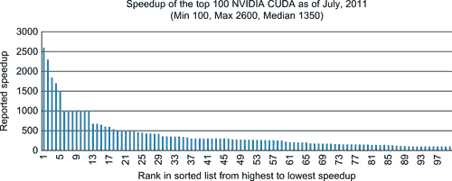
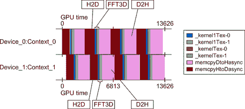

# 第八章 CUDA 用于所有 GPU 和 CPU 应用程序

软件开发需要时间并且耗费金钱。CUDA 已经从一个加速数值计算的稳固平台发展成一个适合*所有*应用程序开发的平台。这意味着，单一的 CUDA 代码源树可以支持仅在传统 x86 处理器上运行的应用程序，仅在 GPU 硬件上运行的应用程序，或者作为混合应用程序，能够同时使用系统中所有的 CPU 和 GPU 设备以实现最大性能。波特兰集团公司（PGI）本地的 CUDA-x86 编译器是这一成熟过程的体现之一，使得 CUDA C/C++成为一种可行的通用应用程序开发源平台，就像 C++和 Java 一样。与 Java 和其他流行的应用语言不同，CUDA 可以高效地支持成千上万的并发执行线程。CUDA 还支持传统的跨语言开发方法，使用语言绑定与现有语言进行接口。与其他语言一样，库简化了应用程序开发，并处理常用的数学方法，如线性代数、矩阵运算和快速傅里叶变换（FFT）。动态编译也模糊了 CUDA 与其他语言之间的区别，正如 Copperhead 项目所示（稍后讨论），该项目允许 Python 程序员完全用 Python 编写代码，然后 Copperhead 运行时将 Python 方法动态编译为在 CUDA 启用的硬件上运行。**关键词** 库，x86，ROI（投资回报率），Python，R，Java，PGI（波特兰集团）软件开发需要时间并且耗费金钱。CUDA 已经从一个加速数值计算的稳固平台发展成一个适合*所有*应用程序开发的平台。这意味着，单一的 CUDA 代码源树可以支持仅在传统 x86 处理器上运行的应用程序，仅在 GPU 硬件上运行的应用程序，或者作为混合应用程序，能够同时使用系统中所有的 CPU 和 GPU 设备以实现最大性能。波特兰集团公司（PGI）本地的 CUDA-x86 编译器是这一成熟过程的体现之一，使得 CUDA C/C++成为一种可行的通用应用程序开发源平台，就像 C++和 Java 一样。与 Java 和其他流行的应用语言不同，CUDA 可以高效地支持成千上万的并发执行线程。CUDA 还支持传统的跨语言开发方法，使用语言绑定与现有语言进行接口。与其他语言一样，库简化了应用程序开发，并处理常用的数学方法，如线性代数、矩阵运算和快速傅里叶变换（FFT）。动态编译也模糊了 CUDA 与其他语言之间的区别，正如 Copperhead 项目所示（稍后讨论），该项目允许 Python 程序员完全用 Python 编写代码，然后 Copperhead 运行时将 Python 方法动态编译为在 CUDA 启用的硬件上运行。¹[`www.pgroup.com/`](http://www.pgroup.com/)。在本章结束时，读者将对以下内容有基本的理解：■ 透明构建和运行 CUDA 应用程序的工具，无论是在非 GPU 系统上还是在任何厂商制造的 GPU 上。■ Copperhead 项目，动态编译 Python 以执行 CUDA。■ 如何将 CUDA 与大多数语言结合使用，包括 Python、FORTRAN、R、Java 等。■ 重要的数值库，如 CUBLAS、CUFFT 和 MAGMA。■ 如何在多个 GPU 上并发使用 CUFFT。■ CURAND 以及天真的随机数生成方法的问题。■ PCIe 硬件对多 GPU 应用程序的影响。

# 从 CUDA 到多个硬件后端的路径

示例 8.1 展示了当前可用于在 x86 和 GPU 硬件上运行 CUDA C/C++的路径。这些功能使得 CUDA 程序员能够通过一个源代码树创建应用程序，既可以面向已经购买了三亿多个 CUDA 支持 GPU 的客户，也可以面向已经拥有 x86 系统的大量客户。示例 8.1，“在 CPU、GPU 和其他供应商 GPU 上使用 CUDA 源代码的路径”。

|  |
| --- |

## PGI CUDA x86 编译器

本地 x86 编译的概念是为 CUDA 程序员提供一种能力——通过一个单一的源代码树——来创建可以覆盖大多数计算机用户的应用程序。一旦发布，PGI 统一二进制将大大简化产品支持和交付，因为单一的应用程序二进制可以直接交付给客户。在运行时，PGI 统一二进制将查询硬件，并根据需要选择性地在任何支持 CUDA 的 GPU 或主机多核处理器上运行。PGI 的努力与源代码翻译器，如 Swan² CUDA 到 OpenCL 翻译器；MCUDA³ CUDA 到 C 翻译器；Ocelot⁴开源模拟器和 PTX 翻译项目；以及 NVIDIA **nvcc**编译器能够生成 x86 和 GPU 代码之间的区别在于：²[`www.multiscalelab.org/swan`](http://www.multiscalelab.org/swan)。³[`impact.crhc.illinois.edu/mcuda.php`](http://impact.crhc.illinois.edu/mcuda.php)。⁴[`code.google.com/p/gpuocelot/`](http://code.google.com/p/gpuocelot/)。■ **速度：** PGI CUDA C/C++编译器是一个本地编译器，可以透明地将 CUDA 编译为在 x86 系统上运行，即使系统中没有 GPU。这使得编译器有机会执行 x86 特定的优化，最好地利用 x86 处理器的多个核心以及每个核心中的 AVX 或 SSE 指令中的 SIMD 并行性。（AVX 是 SSE 的 256 位操作扩展。）■ **透明性：** NVIDIA 和 PGI 都声明，即使是利用 GPU 纹理单元专有特性的 CUDA 应用程序，在 x86 和 GPU 硬件上也会表现出相同的行为。■ **便利性：** 到 2012 年，PGI 编译器将能够创建统一的二进制文件，这将大大简化软件分发过程。如前所述，将单一的二进制文件交付给客户的简便性反映了 PGI CUDA C/C++项目背后完整的思路。从规划角度来看，CUDA for x86 显著影响了软件开发决策过程。CUDA 不再仅仅作为一个为 GPU 加速产品提供小众开发平台的角色，而是成为了一个用于所有产品开发的平台——即使是那些并不打算通过 GPU 加速的应用程序！这一动机通过 NVIDIA 展示的各种项目以及这些项目相较于传统处理器取得的 100 倍或更高性能的实例得到了清晰的体现，如图 8.1 所总结。

|  |
| --- |
| **图 8.1**NVIDIA 相较于传统处理器的前 100 名最快加速报告。 |

简而言之，未能充分利用多核和 GPU 设备并行性能的应用程序，其性能将在当前水平或附近达到平台期，并且不会随着未来硬件代数的增加而提高。这样的应用程序面临停滞和失去竞争力的风险（Farber, 2010）。从软件开发的角度来看，谨慎的做法是选择当前表现良好的平台。远见卓识则需要选择一个软件框架，该框架能够在未来硬件平台上保持应用程序的竞争力，而无需进行大量重写或额外的软件投资。以下是使用 CUDA 进行所有应用程序开发的顶级原因：■ CUDA 基于标准的 C 和 C++语言。这两种语言都有数十年的应用开发历史。■ 使用 CUDA 编写的应用程序，通过更好的利用并行性和多核 SIMD 单元，在 x86 平台上可能比使用传统语言编写的代码运行得更快。■ 多核 CUDA 代码将包含更少的错误，因为 CUDA 执行模型排除了许多常见的并行编程错误，包括竞态条件和死锁。■ CUDA 将为应用程序提供未来保障，因为 CUDA 被设计为能够有效地扩展到数万个并发执行线程。这种好处可以节省未来的软件开发成本，并允许快速进入新市场。■ GPU 加速是免费的，这为全球已售出的数十亿个 CUDA 启用 GPU 上的应用加速打开了大门。■ CUDA 拥有庞大的受过教育的开发者基础；此外，这个开发者基础正在迅速扩大。CUDA 目前在全世界超过 450 所大学和学院中教授。教授 CUDA 的机构数量也在迅速增加。换句话说，对于受过 CUDA 教育的程序员来说，未来看起来光明！

## PGI CUDA x86 编译器

使用 PGI CUDA-x86 编译器非常简单。目前，PGI 提供了该编译器的免费评估期。只需根据 PGI 网站上的说明下载并安装即可。⁵⁵[`pgroup.com`](http://pgroup.com)。安装过程非常简单，并且在安装指南中有详细描述。示例 8.2，《为 PGI 编译器设置环境》包含了使用 bash 在 Linux 上设置环境的命令：`PGI=/opt/pgi; export PGI``MANPATH=$MANPATH:$PGI/linux86-64/11.5/man; export MANPATH``LM_LICENSE_FILE=$PGI/license.dat; export LM_LICENSE_FILE``PATH=$PGI/linux86-64/11.5/bin:$PATH; export PATH`使用软件非常简单。例如，将 PGI NVIDIA SDK 示例复制到方便的位置并进行构建，如示例 8.3，《构建 PGI SDK》所示：`cp –r /opt/pgi/linux86-64/2011/cuda/cudaX86SDK .``cd cudaX86SDK ;``make`示例 8.4，《在四核 CPU 上运行时 deviceQuery 的输出》显示了在 Intel Xeon e5560 上运行 **deviceQuery** 的输出：`CUDA 设备查询（运行时 API）版本（CUDART 静态链接）``有 1 个设备支持 CUDA``设备 0：“设备仿真模式”``CUDA 驱动版本：99.99``CUDA 运行时版本：99.99``CUDA 能力主修订号：9998``CUDA 能力次修订号：9998``全球内存总量：128000000 字节``多处理器数量：1``核心数量：0``常量内存总量：1021585952 字节``每个块的共享内存总量：1021586048 字节``每个块可用的寄存器总数：1021585904``Warp 大小：1``每个块的最大线程数：1021585920``每个维度的最大块大小：32767 × 2 × 0``每个维度的最大网格大小：1021586032 × 32767 × 1021586048``最大内存间距：4206313 字节``纹理对齐：1021585952 字节``时钟频率：0.00 GHz``并发复制与执行：是``内核运行时间限制：是``集成：否``支持主机页面锁定内存映射：是``计算模式：未知``并发内核执行：是``设备支持 ECC 启用：是``deviceQuery，CUDA 驱动 = CUDART，CUDA 驱动版本 = 99.99，CUDA 运行时版本 = 99.99，NumDevs = 1，设备 = 设备仿真模式``通过``按 <Enter> 键退出…``----------------------------------------------------------`类似地，**bandwidthTest** 的输出显示设备传输按预期工作（示例 8.5，《在四核 CPU 上运行时 bandwidthTest 的输出》）：`正在运行…``设备 0：设备仿真模式``快速模式``主机到设备带宽，1 个设备，分页内存``传输大小（字节）带宽（MB/s）``335544324152.5``设备到主机带宽，1 个设备，分页内存``传输大小（字节） 带宽（MB/s）``335544324257.0``设备到设备带宽，1 个设备``传输大小（字节）带宽（MB/s）``335544328459.2``[bandwidthTest] − 测试结果：``通过``按 <Enter> 键退出…``----------------------------------------------------------`与 NVIDIA 的 **nvcc** 编译器一样，使用 PGI **pgCC** 编译器从 CUDA 源文件构建可执行文件也非常容易。例如，我在《Doctor Dobb's》杂志系列文章第三部分中的 *arrayReversal_multiblock_fast.cu* 代码就可以直接编译并运行。⁶⁶[`drdobbs.com/high-performance-computing/207603131`](http://drdobbs.com/high-performance-computing/207603131)。在 Linux 上编译并运行它，请输入示例 8.6，《*arrayReversal_multiblock_fast.cu* 在四核 CPU 上运行时的输出》中的代码：`pgCC arrayReversal_multiblock_fast.cu``./a.out``正确！`

### x86 核心作为 SM

在 CUDA-x86 中，线程块被高效地映射到处理器核心。线程级并行性被映射到 SSE（流式 SIMD 扩展）或 AVX SIMD 单元，如图 8.2 所示。

|  |
| --- |
| **图 8.2** 将 GPU 计算映射到 CPU。 |

CUDA 程序员应注意：■ 一个 warp 的大小将与预期的每个 warp 32 个线程在 GPU 上不同。对于 x86 计算，warp 的大小可能与 x86 核心上的 SIMD 单元大小相同（四个或八个），或者在未使用 SIMD 执行时，每个 warp 只有一个线程。■ 在许多情况下，PGI CUDA C 编译器会在编译器确定安全拆分包含同步调用的循环时，移除线程处理器的显式同步。■ CUDA 程序员必须考虑数据传输时间，因为在 CUDA-x86 中，主机和设备内存之间的显式数据移动以及从全局内存到共享内存的传输仍然会发生。

## NVIDIA NVCC 编译器

NVIDIA **nvcc** 编译器可以生成主机和设备端的内核。第二章利用了这一功能进行测试和性能分析。尽管这一方法非常有用，但它要求 CUDA 程序员手动设置内存，并正确调用功能对象。Thrust 还可以通过传递一些额外的命令行选项给 nvcc，透明地为不同的后端（如 x86 处理器）生成代码。无需修改源代码。以下 **nvcc** 命令行演示了构建 NVIDIA SDK 蒙特卡罗示例以便在主机处理器上运行：`nvcc -O2 -o monte_carlo monte_carlo.cu -Xcompiler -fopenmp \``-DTHRUST_DEVICE_BACKEND=THRUST_DEVICE_BACKEND_OMP -lcudart -lgomp`。Thrust 网站上报告的时间表明，性能是可接受的（参见 表 8.1）。请注意，Thrust 并没有针对最佳的 x86 运行时进行优化。

**表 8.1** 使用 OpenMP 运行 Thrust 示例时报告的时间

| 设备 | 秒 |
| --- | --- |
| GPU | 0.222 |
| 4 OpenMP 线程 | 2.090 |
| 2 OpenMP 线程 | 4.168 |
| 1 OpenMP 线程 | 8.333 |

## Ocelot

Ocelot 是一个流行的、积极维护的包，拥有大量的用户群体。网站指出，Ocelot 可以在 NVIDIA GPU、AMD GPU 和 x86 处理器上以全速运行 CUDA 二进制文件，无需重新编译。它可以自由下载，并且采用新的 BSD 许可证。Gregory Diamos 的一篇论文《Ocelot 从 PTX 到多核 x86 的动态二进制翻译器的设计与实现》⁷ 推荐阅读 (Diamos, 2009)，以及他在 *GPU 计算宝石* 一书中的章节 (Hwu, 2011)。⁷[`code.google.com/p/gpuocelot/`](http://code.google.com/p/gpuocelot/)。Ocelot 的核心功能包括：■ CUDA 运行时 API 的实现。■ 完整的 PTX 内部表示，结合控制流和数据流分析过程进行分析。■ 一个功能性 PTX 模拟器。■ 一个将 PTX 转换为多核 x86 架构的翻译器，用于高效执行。■ 通过 CUDA 驱动程序 API 支持 NVIDIA GPU。■ 支持可扩展的追踪生成框架，可以在指令级粒度下观察应用行为。Ocelot 有三个后端执行目标：■ 一个 PTX 模拟器。■ 一个将 PTX 转换为多核指令的翻译器。■ 一个支持 CUDA 的 GPU。Ocelot 已通过来自 CUDA SDK、UIUC Parboil 基准、Virginia Rodinia 基准（Che et al., 2009 和 Che et al., 2010）、GPU-VSIPL 信号与图像处理库、⁸ thrust 库和多个领域特定应用的 130 多个应用程序进行了验证。它是一个示范性的工具，可以用于分析和剖析 CUDA 应用程序的行为，同时也可以作为 CUDA 应用程序可移植性的一个平台。⁸[`gpu-vsipl.gtri.gatech.edu/`](http://gpu-vsipl.gtri.gatech.edu/)。

## 天鹅

Swan 是一个自由提供的源到源翻译工具，用于将现有的 CUDA 代码转换为 OpenCL 模型。请注意，转换过程需要人工干预，不能自动完成。作者报告称，将 CUDA 应用程序移植到 OpenCL 后，性能大约慢 50%（Harvey & De Fabritiis, 2010）。作者将性能下降归因于 OpenCL 编译器的不成熟。他们总结认为，OpenCL 是开发可移植 GPU 应用程序的可行平台，但也指出，成熟的 CUDA 工具仍然提供最佳性能。目前不清楚 Swan 项目的开发工作有多活跃，因为最近的更新是在 2010 年 12 月。Swan 的当前版本不支持：■ 内核代码中的 CUDA C++模板。■ OpenCL 图像/采样器（类似于纹理）—纹理插值通过软件完成。■ 在单个进程中管理多个设备。■ 为 CPU 编译内核。■ CUDA 设备仿真模式。

## MCUDA

MCUDA 是伊利诺伊大学 IMPACT 研究小组的学术项目，免费提供下载。这个项目似乎没有得到积极维护。论文《MCUDA：一种高效的 CUDA 内核在多核 CPU 上的实现》非常值得阅读（Stratton, Stone, & Hwu, 2008）。相关论文《FCUDA：启用 CUDA 内核高效编译到 FPGA》讨论了将 CUDA 转换为 FPGA（现场可编程门阵列）（Papakonstantinou et al., 2009）。

# 访问其他语言中的 CUDA

CUDA 可以融入任何提供调用 C 或 C++ 机制的语言。为简化这一过程，已经创建了通用接口生成器，这些生成器可以自动创建大部分样板代码。最受欢迎的接口生成器之一是 SWIG。另一种方法是将 CUDA 无缝集成到语言中，这一方法正在由 Copperhead Python 项目进行研究。

## SWIG

SWIG（简化包装器和接口生成器）是一种软件开发工具，它连接用 C 和 C++ 编写的程序——包括 CUDA C/C++ 应用程序——与各种高级编程语言。SWIG 得到积极支持并被广泛使用。它可以从 SWIG 网站免费下载。⁹⁹[`swig.org`](http://swig.org)。截至当前 2.0.4 版本，SWIG 为以下语言生成接口：■ AllegroCL■ C# – Mono■ C# – MS.NET■ CFFI■ CHICKEN■ CLISP■ D■ Go 语言■ Guile■ Java■ Lua■ MzScheme/Racket■ Ocaml■ Octave■ Perl■ PHP■ Python■ R■ Ruby■ Tcl/Tk 我的 *《Doctor Dobb's Journal》*《大众超级计算》教程系列第九部分¹⁰ 提供了一个完整的工作示例，演示了如何使用 SWIG 将 CUDA 矩阵操作与 Python 接口。这个示例也可以与其他语言接口(Farber, 2008)。¹⁰[`drdobbs.com/high-performance-computing/211800683`](http://drdobbs.com/high-performance-computing/211800683)。

## Copperhead

Copperhead 是一个早期的研究项目，旨在将数据并行性引入 Python 语言。它定义了一个小型的数据并行子集，能够动态编译并在并行平台上运行。目前，NVIDIA GPGPU 是唯一支持的并行后端。示例 8.8，“示例 Copperhead Python 代码”，是来自 Copperhead 网站的一个简单示例：`from copperhead import *``import numpy as np``@cu``def axpy(a, x, y):``return [a * xi + yi for xi, yi in zip(x, y)]``x = np.arange(100, dtype=np.float64)``y = np.arange(100, dtype=np.float64)``with places.gpu0:``gpu = axpy(2.0, x, y)``with places.here:``cpu = axpy(2.0, x, y)`Copperhead 将计算组织在数据并行数组周围。在此示例中，Copperhead 运行时拦截了对 **axpy()** 的调用，并将该函数编译为 CUDA 代码。运行时将输入参数转换为并行数组类型，**CuArrays**，并由运行时管理。程序员使用前面示例中的 **with** 构造指定执行位置。数据会懒加载地在执行位置之间进行复制。Copperhead 当前支持 GPU 执行和 Python 解释器执行。Python 解释器的使用旨在用于算法原型开发。

## EXCEL

Microsoft Excel 是一款由微软开发并分发的广泛使用的商业电子表格应用程序，支持 Windows 和 Mac OS 平台。它具有计算、绘图工具和各种其他工具。功能可以通过 Visual Basic 编程。NVIDIA 在其网站上发布了“Excel 2010 CUDA 集成示例”¹¹，展示了如何在 Excel 中使用 CUDA。该 SDK 示例不包含在标准 SDK 示例中。¹¹[`developer.nvidia.com/cuda-cc-sdk-code-samples`](http://developer.nvidia.com/cuda-cc-sdk-code-samples)。

## MATLAB

MATLAB 是由 MathWorks 开发的商业应用程序。MATLAB 软件允许进行矩阵操作、函数和数据的绘图，以及其他丰富的功能。开发人员可以实现算法和用户界面，并将 MATLAB 集成到其他应用程序中。MATLAB GPU 支持可以在并行计算工具箱中找到，支持计算能力为 1.3 及以上的 NVIDIA CUDA 启用 GPU。像 Accelereyes 这样的第三方产品提供了 MATLAB 对 GPU 计算的访问权限，并且提供了 CUDA 的矩阵库。¹²¹²[`www.accelereyes.com/`](http://www.accelereyes.com/)。

# 库

使用优化的库通常是提高应用程序性能的简便方法。在移植大型遗留项目时，库可能是优化新平台的唯一实际方法，因为代码更改将需要大量的验证工作。本质上，库是方便的，可以大大加速代码开发和应用程序性能，但不能盲目使用。尤其是 GPU 基于的库，要求开发人员仔细考虑数据放置和库的使用方式，否则可能会导致性能不佳和过度的内存消耗。

## CUBLAS

基本线性代数子程序（BLAS）包是基本线性代数操作的事实标准编程接口，例如向量和矩阵乘法。NVIDIA 通过其专有的 GPU 库 CUBLAS 来支持该接口。应用程序使用 CUBLAS 库的基本模型是：在 GPU 内存空间中创建矩阵和向量对象，将数据填充到这些对象中，调用一系列 CUBLAS 函数，并将结果返回给主机。CUBLAS 提供了帮助函数，用于在 GPU 空间中创建和销毁对象，并利用这些对象中的数据。CUDA 程序员应该注意，CUBLAS 使用列主序存储和基于 1 的索引，以最大程度地兼容 FORTRAN。C 和 C++应用程序需要使用宏或内联函数来便捷地访问 CUBLAS 创建的对象。第一章讨论了 BLAS 运行时级别以及最小化或消除数据移动的重要性。可以从 NVIDIA 网站下载的 simpleBLAS 示例提供了如何使用 CUBLAS 的基本演示。¹³¹³[`www.nvidia.com/object/cuda_sample_linear_algebra.html`](http://www.nvidia.com/object/cuda_sample_linear_algebra.html)。

## CUFFT

CUFFT 是另一个由 NVIDIA 支持的库，提供了基于 GPU 的 FFT 实现，FFT 是在科学和信号处理应用中常用的方法。CUFFT 模仿了 FFTW，这是一个为通用处理器高度优化且广泛使用的 FFT 包。CUFFT 使用一个计划（plan），这是一个简单的配置机制，它指定了在给定特定问题大小、数据类型和目标硬件平台的情况下，执行特定算法的最佳“计划”。这种方法的优势在于，一旦创建了计划，它就可以在应用程序的整个生命周期中使用。这是执行运行时配置的常见编程模式，广泛应用于库和其他高性能便携代码中。NVIDIA CUFFT 库使用此配置模型，因为不同大小和类型的 FFT 需要不同的线程配置和 GPU 资源。可以从 NVIDIA 网站下载简单的 CUFFT 示例 ¹⁴，它涵盖了如何使用 CUFFT 库的基础知识。¹⁴[`www.nvidia.com/object/cuda_sample_basic_topics.html`](http://www.nvidia.com/object/cuda_sample_basic_topics.html)。CUFFT 还提供了 **cufftPlanMany()** 方法，它创建一个计划，可以同时运行多个 FFT 操作。这既可以提高性能，也可能占用大量内存。以下测试程序演示了如何在一个或多个 GPU 上使用 CUFFT。它执行 3D 复数到复数的前向和反向就地变换，并计算这些变换引入的误差。正确使用将导致较小的误差。用户可以通过命令行指定以下运行时特征：■ 要使用的 GPU 数量。该数字必须小于或等于系统中的 GPU 数量。■ 每个维度的大小。■ 要执行的 FFT 总数。■ 一个可选值，指定每次调用 CUFFT 时执行多少个 FFT。此外，此测试代码使用了 C++ 类型定义。要创建一个双精度可执行文件，只需在 **nvcc** 命令行中指定 -**D REAL**=**double**。常规的包含文件和常量在示例文件的开头定义。预处理器变量 **REAL** 在编译期间如果未定义，将默认为 **float**。示例 8.9，“*fft3Dtest.cu* 的第一部分”，包含了测试代码的逐步说明：`#include <iostream>``#include <cassert>``using namespace std;``#include <cuda.h>``#define CUFFT_FORWARD -1``#define CUFFT_INVERSE1``#include "thrust/host_vector.h"``#include "thrust/device_vector.h"``#include <cufft.h>``#ifndef REAL``#define REAL float``#endif`模板类 **DistFFT3D** 在 示例 8.10，“*fft3Dtest.cu* 的第二部分”中定义，并创建了一些变量：`template <typename Real>``class DistFFT3D {``protected:``int nGPU;``cudaStream_t *streams;``int nPerCall;``vector<cufftHandle> fftPlanMany;``int dim[3];``Real *h_data;``long h_data_elements;``long nfft, n2ft3d, h_memsize, nelements;``long totalFFT;``vector<Real *> d_data;``long bytesPerGPU;`公共构造函数接受一个主机数据的向量，并将其平均分配到用户定义的 GPU 数量上。这些向量保存在变量 **d_data** 中。为了通用性，构造函数中传递了一个流数组，允许用户在测试之前和之后排队工作。这个功能虽然没有使用，但提供了，以防读者希望在其他代码中使用这个示例。假设每个流与每个 GPU 相关联。在 **fftPlanMany()** 中创建了一个 CUFFT 句柄的向量，每个流都与一个计划相关联。这个设置意味着每个 GPU 会有一个计划，因为每个流与不同的 GPU 相关联。多个计划的 FFT 数量在调用 **NperCall()** 时定义。**initFFTs()** 方法创建句柄。同样，每个 GPU 都会创建一个设备向量的向量。设备内存的指针保存在 **d_data** 向量中。请参见 示例 8.11，“*fft3Dtest.cu* 的第三部分”：`public:``DistFFT3D(int _nGPU, Real* _h_data, long _h_data_elements, int *_dim, int _nPerCall, cudaStream_t *_streams) {``nGPU= _nGPU;``h_data = _h_data;``h_data_elements = _h_data_elements;``dim[0] = _dim[0]; dim[1] = _dim[1]; dim[2] = _dim[2];``nfft = dim[0]*dim[1]*dim[2];``n2ft3d = 2*dim[0]*dim[1]*dim[2];``totalFFT = h_data_elements/n2ft3d;``set_NperCall(_nPerCall);``bytesPerGPU = nPerCall*n2ft3d*sizeof(Real);``h_memsize = h_data_elements*sizeof(Real);``assert( (totalFFT/nPerCall*bytesPerGPU) == h_memsize);``streams = _streams;``fftPlanMany = vector<cufftHandle>(nGPU);``initFFTs();``for(int i=0; i<nGPU; i++) {``Real* tmp;``cudaSetDevice(i);``if(cudaMalloc(&tmp,bytesPerGPU)) {``cerr << "无法在设备上分配空间！" << endl;``exit(1);``}``d_data.push_back(tmp);``}``}``void set_NperCall(int n) {``cerr << "设置 nPerCall " << n << endl;``nPerCall = n;``if( (nGPU * nPerCall) > totalFFT) {``cerr << "指定的 nPerCall 太多！最大值为 " << (totalFFT/nGPU) << endl;``exit(1);``}``}`析构函数在 示例 8.12，“*fft3Dtest.cu* 的第四部分”中释放了在设备上分配的数据：`~DistFFT3D() {``for(int i=0; i < nGPU; i++){``cudaSetDevice(i);``cudaFree(d_data[i]);``}``}``示例 8.13，“*fft3Dtest.cu* 的第五部分”，初始化了多计划 FFT，并提供了模板包装器，以正确调用 CUFFT 方法处理 **float** 和 **double** 数据类型。请注意，流是通过 **cufftSetStream()** 设置的：`void inline initFFTs()``{``if((nPerCall*nGPU) > totalFFT) {``cerr << "nPerCall 必须是 totalFFT 的倍数" << endl;``exit(1);``}``// 创建批量 3D 计划``for(int sid=0; sid < nGPU; sid++) {``cudaSetDevice(sid);``if(sizeof(Real) == sizeof(float) ) {``cufftPlanMany(&fftPlanMany[sid], 3, dim, NULL, 1, 0, NULL, 1, 0, CUFFT_C2C,nPerCall);``} else {``cufftPlanMany(&fftPlanMany[sid], 3, dim, NULL, 1, 0, NULL, 1, 0, CUFFT_Z2Z,nPerCall);``}``if(cufftSetStream(fftPlanMany[sid],streams[sid])) {``cerr << "cufftSetStream 失败！" << endl;``}``}``cudaSetDevice(0);``}``inline void _FFTerror(int ret) {``switch(ret) {``case CUFFT_SETUP_FAILED: cerr << "SETUP_FAILED" << endl; break;``case CUFFT_INVALID_PLAN: cerr << "INVALID_PLAN" << endl; break;``case CUFFT_INVALID_VALUE: cerr << "INVALID_VALUE" << endl; break;``case CUFFT_EXEC_FAILED: cerr << "EXEC_FAILED" << endl; break;``default: cerr << "未知的返回代码 " << ret << endl;``}``}``//模板特化以处理不同的数据类型（float, double）``inline void cinverseFFT_(cufftHandle myFFTplan, float* A, float* B ) {``int ret=cufftExecC2C(myFFTplan, (cufftComplex*)A, (cufftComplex*) B, CUFFT_INVERSE);``if(ret != CUFFT_SUCCESS) {``cerr << "C2C FFT 失败！返回代码 " << ret << endl;``_FFTerror(ret); exit(1);``}``}``inline void cinverseFFT_(cufftHandle myFFTplan, double *A, double *B) {``int ret = cufftExecZ2Z(myFFTplan, (cufftDouble

|  |
| --- |
| **图 8.3** 单精度和双精度 32x32x32 FFT 性能。 |

一个**computeprof**宽度图显示，应用程序正在两块 GPU 上并行运行。以下的宽度图是在带有两块 NVIDIA C2050 GPU 的 Dell Precision 7500 上捕获的。¹⁵原始彩色截图已被转换为灰度图用于本书。图中标注了 H2D（主机到设备）和 D2H（设备到主机）的传输，以及实现 3D FFT 的计算内核。¹⁵此机器的访问由 ICHEC（爱尔兰高性能计算中心）NVIDIA CUDA 研究中心提供。

|  |
| --- |
| 图 8.4\. |
| 带有两块 NVIDIA C2050 GPU 的 Dell Precision 7500 宽度图。 |

来自同一次实验的 HP Z800 结果说明了 PCIe 硬件的重要性。在异步传输数据到其中一个 GPU 时，性能的下降可能会显著降低整体表现。

|  |
| --- |
| 图 8.5\. |
| 带有两块 GPU 的 HP Z800 宽度图。 |

这一观察通过 HP Z800 上每个 GPU 的**computeprof**高度图得到了确认，因为在两块 GPU 设备之间明显存在差异，并且设备上的传输也有所变化。

|  |
| --- |
| 图 8.6\. |
| HP Z800 上设备 0 的高度图。 |
|  |
| 图 8.7\. |
| HP Z800 上设备 1 的高度图。 |

## MAGMA

MAGMA 项目旨在开发一个类似于 LAPACK 的稠密线性代数库，但针对异构/混合架构。最初的重点是提供一个可以在多核处理器和单个 GPU 上同时运行的包，以发挥这种混合环境的综合性能。后续的工作将结合多个 GPU 与多个核心。MAGMA 团队得出结论，稠密线性代数（DLA）“已经更适合新的 GPU 架构，以至于 DLA 在 GPU 上的运行效率比当前的高端同构多核系统更高”(Nath, Stanimire, & Dongerra, 2010, p. 1)。根据 Volkov 的说法，目前的 MAGMA BLAS 库能够达到 838 GF/s 的性能(Volkov, 2010)。MAGMA 软件可以从田纳西大学创新计算实验室网站免费下载。¹⁶¹⁶[`icl.cs.utk.edu/`](http://icl.cs.utk.edu/)。

## phiGEMM 库

phiGEMM 库是一个免费提供的开源库，由 ICHEC 的 Ivan Girotto 和 Filippo Spiga 编写。¹⁷ 它在包含多个 GPU 和多核处理器的异构系统上执行矩阵乘法（例如，GEMM 操作）。¹⁷[`qe-forge.org/projects/phigemm/`](http://qe-forge.org/projects/phigemm/)。phiGEMM 库扩展了 Fatica 的映射（Fatica, 2009），支持单精度、双精度和复数矩阵。LINPACK TOP 500 基准 HPL 基准套件使用此映射进行异构矩阵乘法，作为评估全球最快超级计算机的核心方法之一。¹⁸ phiGEMM 库能够在单个 GPU 和多核处理器上提供与 LINPACK 基准相当的性能。如图 8.8 所示，使用两块或更多 GPU 可以实现更高的性能。¹⁸[`www.nvidia.com/content/GTC-2010/pdfs/2057_GTC2010.pdf`](http://www.nvidia.com/content/GTC-2010/pdfs/2057_GTC2010.pdf)。

|  |
| --- |
| **图 8.8** 使用一块和两块 GPU 的 phiGEMM 性能（数据在两台 Intel Xeon X5680 3.33 GHz 和两块 Tesla NVIDIA C2050 GPU 上获得）。 |

phiGEMM 库透明地管理系统中所有设备（即多个 GPU 和多核处理器）之间的内存和异步数据传输。它通过递归地乘以较小的子矩阵，可以处理远超单个 GPU 内存容量的矩阵。同样，库将这一过程对用户透明化。图 8.9 显示了使用最多四块 GPU 处理 15 GB 矩阵的性能。phiGEMM 库正在考虑加入之前讨论过的 MAGMA 库中。

|  |
| --- |
| **图 8.9** phiGEMM 在 15 GB 矩阵上表现的性能，M = K = N = 25000（双精度），数据采集自两台 Intel Xeon X5670 2.93 GHz 处理器和四个 Tesla NVIDIA C2050 GPU。 |

## CURAND

在并行计算机上生成随机数是一个挑战。传统方法是让每个线程为共同的随机数生成方法提供不同的种子。该方法并不能保证生成的随机数是独立的，可能无意间引入相关性到“随机”数据中（Coddington, 1997）。CURAND 库提供了一个简单高效的 API 来生成高质量的 *伪随机* 和 *准随机* 数字。伪随机数列满足大多数真正随机数列的统计特性，但其生成是通过一个确定性的算法。准随机数列是通过设计的确定性算法生成的 *n* 维点集，旨在均匀填充 *n* 维空间。应用领域包括：■ **仿真：** 随机数是使事物逼真的必要条件。在电影中，计算机生成的角色以略微不同的方式开始和移动。人们也会在随机的间隔时间到达机场。■ **采样：** 对于许多有趣的问题，逐一检查所有可能的情况是不现实的。然而，随机采样可以帮助深入了解“典型”行为是什么。■ **计算机编程：** 用随机数测试算法是一种有效的发现问题和程序员偏差的方式。

# 总结

商业和研究项目现在必须同时具备并行应用，以便争夺客户和研究资金。这一需求转化为对软件开发工作的一种压力，即在支持快速发展的并行硬件平台的同时控制成本。CUDA 正在快速发展以满足这一需求。与当前的编程语言不同，CUDA 的设计目的是创建能够在数百个并行处理单元上运行并管理成千上万个线程的应用程序。这一设计使得 CUDA 相比当前的开发语言如 C++和 Java 更具吸引力。它还创造了对 CUDA 开发者的需求。像 Copperhead 这样的项目正在扩展动态编译和 CUDA 的应用边界。完善的库支持使得 CUDA 在数值计算和信号处理应用中非常有吸引力。像 SWIG 这样的通用接口包为将大规模并行的 CUDA 支持添加到许多现有语言中提供了机会。
