第九章\. 混合 CUDA 和渲染

# OpenGL

OpenGL 是一种在从游戏到高性能计算（HPC）等可视化应用中广泛使用的编程接口。OpenGL 基于标准，使开发者能够创建图形和特效，这些效果在任何运行 OpenGL 兼容硬件的操作系统上几乎完全相同，这使得 3D 游戏和程序的开发者能够将他们的软件移植到多个平台。OpenGL 由一个架构评审委员会（ARB）控制，该委员会由来自多个机构的成员组成，包括 NVIDIA、SGI、Microsoft、AMD、HP 等。该委员会的目标是：  

## GLUT

OpenGL 工具包 (GLUT) 是一个编程接口，用于编写与窗口系统无关的 OpenGL 程序。利用 GLUT 的应用程序可以在多个平台上进行编译。NVIDIA 在 CUDA SDK 示例中使用 GLUT。GLUT 工具包提供了多种功能，但本章将只使用其中的一小部分：■ 用于 OpenGL 渲染的窗口。■ 回调驱动的事件处理。■ 鼠标和键盘输入设备。

## 使用 OpenGL 映射 GPU 内存

从 CUDA 程序员的角度来看，OpenGL 在 GPU 上创建并管理称为缓冲对象的通用缓冲区内存区域。CUDA/OpenGL 的互操作性发生在 CUDA 内核将缓冲区映射到 CUDA 内存空间时。当缓冲区被释放或取消映射时，控制权会返回给 OpenGL。映射是一个低开销的操作，发生得非常快，并且提供了与 CUDA 的高速互操作性，无需进行任何内存复制。与 OpenGL 的互操作性要求在任何其他运行时调用之前，通过**cudaGLSetGLDevice()**指定 CUDA 设备。请注意，**cudaSetDevice()**和**cudaGLSetGLDevice()**是互斥的。¹ 与 OpenGL 的互操作性要求在任何其他运行时调用之前，通过**cudaGLSetGLDevice()**指定 CUDA 设备。一旦资源注册到 CUDA，就可以使用**cudaGraphicsMapResources()**和**cudaGraphicsUnmapResources()**多次映射和取消映射资源。可以调用方法**cudaGraphicsResourceSetMapFlags()**来提供提示（例如，只读、只写），供 CUDA 驱动程序用来优化资源管理。（请参见 2011 年 5 月《NVIDIA C 编程指南》第 3.2.7.1 节，第 38 页）。CUDA 程序员将操作的两个主要 OpenGL 内存对象如下：1. **像素缓冲对象（PBOs）：** OpenGL 用于存储*像素*的内存区域。二维图像由多个像素或颜色点组成。CUDA 应用程序映射 PBO，以逐像素的方式创建或修改图像，并通过 OpenGL 显示它们。2. **顶点缓冲对象（VBOs）：** OpenGL 用于 3D 顶点的内存区域。CUDA 应用程序映射 VBO，以生成或修改 OpenGL 能够渲染的 3D 信息，渲染为彩色表面、线框图像或一组 3D 点。以下是与 VBO 使用相关的 OpenGL 调用的概要（摘自 OpenGL VBO 白皮书，[`spec.org`](http://spec.org)）：■ **glBindBuffer()：** 该函数允许客户端状态函数使用绑定缓冲区，而不是在客户端侧操作绝对内存。缓冲区对象名称是无符号整数。值零是保留的。将缓冲区名称设置为零，实际上会解绑之前绑定的任何缓冲区对象，并恢复该缓冲区对象目标的客户端内存使用情况。■ **glBufferData()、glBufferSubData()和 glGetBufferSubData()：** 这些函数控制缓冲区数据的大小，提供使用提示，并允许将数据复制到缓冲区中。■ **glMapBuffer()和 glUnmapBuffer()：** 这些函数锁定和解锁缓冲区，允许将数据加载到缓冲区中，或将控制权交还给服务器。返回一个临时指针，作为指向缓冲区开始位置的入口，同时将缓冲区映射到客户端内存中。OpenGL 负责如何将此映射到客户端的绝对内存中。由于这个责任，映射必须在短时间内进行，并且指针不是持久的，应该存储以便进一步使用。关于将 CUDA 与 OpenGL 混合使用时所使用的 CUDA API 和 OpenGL 调用的更详细信息，可以参见我的*Doctor Dobb*教程系列的第十五部分²和第十八部分³。另一个极好的信息来源是 Joe Stam 在 2009 年 NVIDIA GTC 大会上的演讲《每个 CUDA 程序员应该了解的 OpenGL》 （Stam，2009），该演讲有 PDF 和视频格式可用。⁴²[`drdobbs.com/cpp/222600097`](http://drdobbs.com/cpp/222600097)。³[`drdobbs.com/open-source/225200412`](http://drdobbs.com/open-source/225200412)。⁴[`www.nvidia.com/content/GTC/documents/1055_GTC09.pdf`](http://www.nvidia.com/content/GTC/documents/1055_GTC09.pdf)。

## 使用原始重启优化 3D 性能

如本章介绍所述，本文中的示例利用了一个名为*原始重启*的 OpenGL 扩展，旨在最小化通过 PCIe 总线的通信并加速渲染。原始重启使程序员能够指定一个数据值，OpenGL 状态机将其解释为一个令牌，表示当前的图形基元已经完成。接下来的数据项将被视为另一个相同类型的图形基元的开始。有效的图形基元包括**GL_TRIANGLE_STRIP**、**GL_TRIANGLE_FAN**、**GL_LINE_STRIP**等。图 9.1 展示了这个过程，包含不同数量顶点的两条线。图中显示，首先调用**glPrimitiveRestartIndexNV()**来指定**TAG**的值为原始重启令牌。接着调用例程**glEnableClientState()**，指示 OpenGL 状态机开始使用原始重启。然后使用**glDrawElements()**绘制这些线。

| 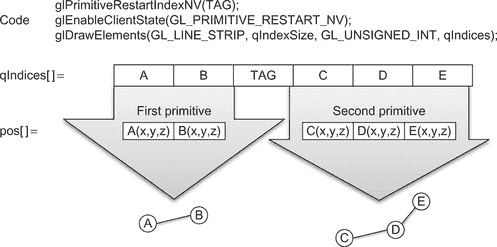 |
| --- |
| **图 9.1** 使用原始重启绘制两条线。 |

原始重启方法的优点包括：■ 所有的控制令牌和查看数据可以在 GPU 上生成并保持。■ 可以在原始重启令牌之间指定不同数量的项目。这允许绘制不规则的网格和表面，因为可以根据传递给**glDrawElements()**的绘制模式指定任意数量的线段、三角带、三角扇等。■ 通过调整索引排列以实现纹理单元中数据缓存的最高复用，可以优化渲染性能。■ 通过如原始重启规范中所述的交替镶嵌方向，并在图 9.2 和图 9.3 中展示，可以创建更高质量的图像。三角扇的中心在图 9.3 中用点标记。

| 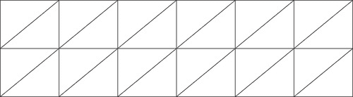 |
| --- |
| **图 9.2** 显示别名伪影的两个三角带。 |
| 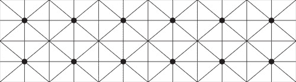 |
| **图 9.3** 三角扇（中心用实心圆标记）。 |

OpenGL 除了原始重启外，还提供其他优化的渲染方法，例如**multiDraw()**。然而，正如原始重启规范所指出的，“这些方法仍然比预期的更昂贵”(Craighead, 2002)。以下是原始重启与其他 OpenGL 渲染方法的性能比较。原始重启显然更快。这些测试是在使用 Intel 2.3 GHz Core 2 Duo 处理器运行 Linux，并配备 NVIDIA GTX 280 支持 CUDA 的游戏 GPU 进行的，运行本章的 Perlin 内核生成虚拟地形图。在解读这些数字时，重要的是要理解这些帧率包括了重新计算每个顶点和图像中色彩所需的 3D 位置和颜色的时间。这代表了一个最坏情况的帧率场景，展示了混合 CUDA/OpenGL 应用程序的强大功能和速度。实际应用无疑会通过仅重新计算渲染场景所需的最小数据来提供更高的性能。

**表 9.1\.** GTX 280 上的大致性能数据

|  |
| --- |
| 方法 | 观察到的 FPS | 粗略平均（FPS） |
| 简单逐一 | 470–500 | 500 |
| MultiDraw | 490–510 | 508 |
| 原始重启 | 550–590 | 560 |

更多细节可以在我的免费“超级计算为大众”CUDA 教程的第十八部分⁵和第二十部分⁶中找到，这些教程发布在*Doctor Dobb's Journal*网站上。[`drdobbs.com/open-source/225200412`](http://drdobbs.com/open-source/225200412)⁵。[`drdobbs.com/tools/227400145`](http://drdobbs.com/tools/227400145)⁶。从 Parallel Nsight 中的图 9.4 可以看到，Perlin 内核相比 OpenGL 缓冲区交换消耗的时间非常少。

| 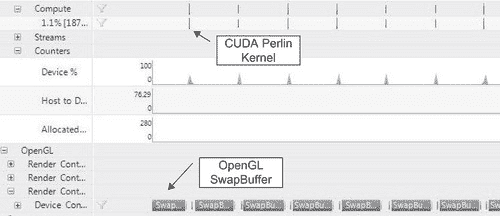 |
| --- |
| **图 9.4** Parallel Nsight 显示使用原始重启时的计算与渲染时间。 |

OpenGL API 调用汇总在 Parallel Nsight 报告中显示了每种渲染方法的以下时间。■ 原始重启：大约 60 微秒（μs）。■ 多重绘制：大约 3,900 微秒。■ 逐个绘制每个三角形扇：大约 1,100,000 微秒。

# 框架中文件的介绍

读者应注意，在软件框架的设计中，已经考虑到可以将其适应新应用的需求。例如，章十二中使用了相同的框架来显示和修改实时视频流。为了将操作进行模块化，框架被拆分成四个独立的文件。仅通过更改 CUDA 内核，这段示例代码就可以用来渲染一个动画正弦波表面或一个人工地形，用户可以在其中探索并飞行。已知这些示例可以在 Linux 和 Windows 上编译和运行。为了清晰和灵活性，示例代码中使用了独立的 3D 顶点和颜色数组。这有助于加速理解，并使数据可视化变得像编写新内核或从磁盘加载数据来修改 3D 顶点数组、颜色数组或两者一样简单。那些选择创建自己 CUDA 内核的读者，应当获得一个强烈的实践感，了解通过结合 CUDA/OpenGL 方法进行可视化是多么简单和灵活。本章中讨论的框架中使用的四个文件之间的关系如图 9.5 所示。每个文件将在下文中更详细地讨论。

| 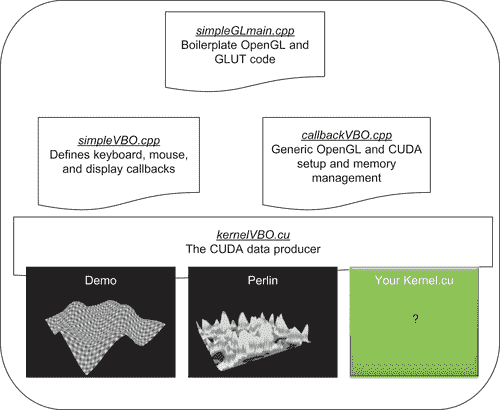 |
| --- |
| **图 9.5** 文件和活动的组织。 |

## 演示和 Perlin 示例内核

本章提供了两个示例内核：演示内核和 Perlin 内核。每个内核都会生成 3D 顶点和颜色。

### 演示内核

演示内核生成的动画正弦波曲面与 NVIDIA simpleGL SDK 示例非常相似。它是一个很好的测试用例，可以确认代码是否正常工作，并评估 GPU 的速度。图 9.6 显示了使用演示内核生成的色彩丰富的曲面的灰度截图。另外，请注意，颜色会随时间变化。键盘输入可以选择使用三角形（如图 9.6 所示）、线条（未显示）或点（如图 9.7 所示）来渲染曲面。

| 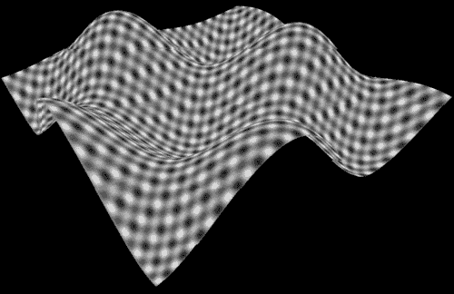 |
| --- |
| **图 9.6**使用正弦波曲面 VBO 创建的表面灰度示例。 |
| 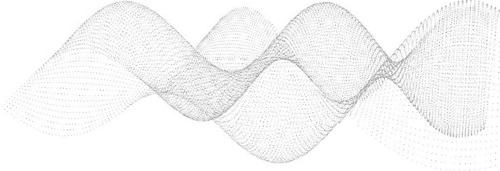 |
| **图 9.7**点的正弦波灰度图（为了提高可视性，图像颜色已反转）。 |

### 生成彩色正弦曲面演示内核

演示内核通过计算二维网格中每个位置的高度值，绘制一个随时间变化的正弦曲面。高度值随时间变化。请参见示例 9.1， “计算正弦曲面高度”：`// 计算简单的正弦波模式``float freq = 4.0f;``float w = sinf(u*freq + time) * cosf(v*freq + time) * 0.5f;`位置和高度信息存储在`float4 position`或**pos**数组中，如示例 9.2 所示：`// 写入输出顶点``pos[y*width+x] = make_float4(u, w, v, 1.0f);`类似地，颜色根据网格中的位置和动画时间计算，如示例 9.3， “计算正弦曲面颜色”所示：`// 写入颜色``colorPos[y*width+x].w = 0;``colorPos[y*width+x].x = 255.f *0.5*(1.f+sinf(w+x));``colorPos[y*width+x].y = 255.f *0.5*(1.f+sinf(x)*cosf(y));``colorPos[y*width+x].z = 255.f *0.5*(1.f+sinf(w+time/10.f));`**kernelVBO**的完整代码如示例 9.4 所示，“演示内核的完整源代码”：`// 正弦内核 (Rob Farber)``// 简单的内核修改顶点位置，呈正弦波模式``__global__ void kernel(float4* pos, uchar4 *colorPos,``unsigned int width, unsigned int height, float time)``{``unsigned int x = blockIdx.x*blockDim.x + threadIdx.x;``unsigned int y = blockIdx.y*blockDim.y + threadIdx.y;``// 计算 uv 坐标``float u = x / (float) width;``float v = y / (float) height;``u = u*2.0f - 1.0f;``v = v*2.0f - 1.0f;``// 计算简单的正弦波模式``float freq = 4.0f;``float w = sinf(u*freq + time) * cosf(v*freq + time) * 0.5f;``// 写入输出顶点``pos[y*width+x] = make_float4(u, w, v, 1.0f);``colorPos[y*width+x].w = 0;``colorPos[y*width+x].x = 255.f *0.5*(1.f+sinf(w+x));``colorPos[y*width+x].y = 255.f *0.5*(1.f+sinf(x)*cosf(y));``colorPos[y*width+x].z = 255.f *0.5*(1.f+sinf(w+time/10.f));``}`**launch_kernel()**方法计算执行配置，并使用适当的参数队列启动演示内核，如示例 9.5， “显示启动演示内核逻辑的源代码”所示：`// __global__ 调用的包装器，设置内核调用``extern "C" void launch_kernel(float4* pos, uchar4* colorPos,``unsigned int mesh_width, unsigned int mesh_height,``float time)``{``// 执行内核``dim3 block(8, 8, 1);``dim3 grid(mesh_width / block.x, mesh_height / block.y, 1);``kernel<<< grid, block>>>(pos, colorPos, mesh_width, mesh_height, time);``}`

### Perlin 噪声

许多人使用随机数生成器为他们的应用程序添加变化和不可预测性。景观展示了变化和看似不可预测性，但并非完全随机。相反，它们在不同的尺度上变化，这意味着它们有不同的细节层次。山脉就展示了这种尺度上的变化：■ **大尺度：** 山脉轮廓。■ **中尺度：** 各种山丘、山谷和其他地形特征。■ **小变化：** 巨石和岩石突出物是常见的例子。■ **微小变化：** 石块以及你在徒步旅行时看到的小凸起。Perlin 噪声是一种生成*连贯噪声*的函数，适用于空间中的任何位置。连贯噪声意味着，在空间中的任意两点之间，噪声函数的值随着你从一点移动到另一点时平滑变化；也就是说，没有不连续性。自然现象往往表现出相同的大的和小的变化模式。Perlin 噪声函数通过在多个不同尺度上简单地叠加噪声函数来重现这一自然效果。  

| 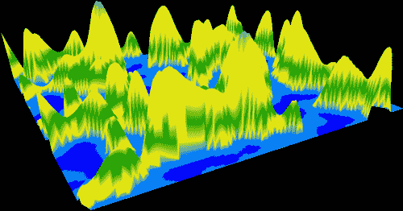 |
| --- |
| **图 9.8** 使用 Perlin 噪声内核创建的 3D 表面的灰度示例。 |
| 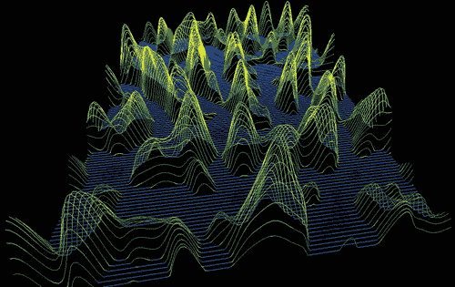 |
| **图 9.9** 地形线框的灰度图。 |
| 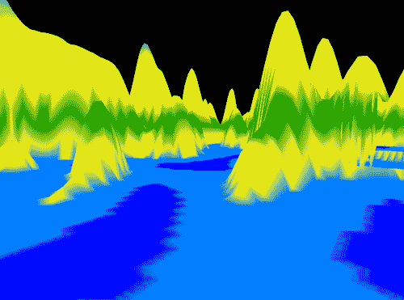 |
| **图 9.10** 飞行员视角的灰度版本。 |

### 使用 Perlin 噪声内核生成人工地形

以下示例使用了我在*Doctor Dobb's Journal*网站上的《面向大众的超级计算》教程系列第 15⁸和第 18⁹部分中的改进版 Perlin 噪声生成器。为了实现简单，选择了 fBm（分形布朗运动）来生成分形地形，这仅仅是多个尺度的任意基函数（如噪声）的加权和。正如《分形地形与纹理生成》在马克斯·普朗克研究所网站上所指出的，存在更好的方法来创建更逼真的景观（Max Planck Institute, 2004）。¹⁰⁸[`drdobbs.com/cpp/222600097`](http://drdobbs.com/cpp/222600097).⁹[`drdobbs.com/open-source/225200412`](http://drdobbs.com/open-source/225200412).¹⁰[`www.mpi-inf.mpg.de/departments/irg3/ws0405/cg/rcomp/29/x173.html`](http://www.mpi-inf.mpg.de/departments/irg3/ws0405/cg/rcomp/29/x173.html)。从示例 9.6 开始的内核比演示内核稍微复杂。内核的第一部分指定了 Perlin 噪声计算中使用的包含文件、变量和方法。关于该部分的讨论和参考论文的链接可以在 NYU 媒体研究实验室网站上找到。¹¹¹¹[`vlg.cs.nyu.edu/`](http://vlg.cs.nyu.edu/)。`//Perlin 内核（Rob Farber）``#include <cutil_math.h>``#include <cutil_inline.h>``#include <cutil_gl_inline.h>``#include <cuda_gl_interop.h>``extern float gain, xStart, yStart, zOffset, octaves, lacunarity;``#define Z_PLANE 50.f``__constant__ unsigned char c_perm[256];``__shared__ unsigned char s_perm[256]; // permuation 数组的共享内存副本``unsigned char* d_perm=NULL; // permuation 数组的全局内存副本``// permuation 数组的主机版本``const static unsigned char h_perm[] = {151,160,137,91,90,15,``131,13,201,95,96,53,194,233,7,225,140,36,103,30,69,142,8,99, 37,240,21,10,23,190, 6,148,247,120,234,75,0,26,197,62,94,252, 219,203,117,35,11,32,57,177,33,88,237,149,56,87,174,20,125, 136,171,168, 68,175,74,165,71,134,139,48,27,166,77,146,158, 231,83,111,229,122,60,211,133,230,220,105,92,41,55,46,245, 40,244,102,143,54, 65,25,63,161, 1,216,80,73,209,76,132,187, 208, 89,18,169,200,196,135,130,116,188,159,86,164,100,109,198, 173,186, 3,64,52,217,226,250,124,123,5,202,38,147,118,126,255, 82,85,212,207,206,59,227,47,16,58,17,182,189,28,42,223,183, 170,213,119,248,152,2,44,154,163, 70,221,153,101,155,167, 43, 172,9,129,22,39,253, 19,98,108,110,79,113,224,232,178,185, 112,104,218,246,97,228,251,34,242,193,238,210,144,12,191,179, 162,241, 81,51,145,235,249,14,239,107,49,192,214, 31,181,199, 106,157,184,84,204,176,115,121,50,45,127, 4,150,254,138,236, 205,93,222,114,67,29,24,72,243,141,128,195,78,66,215,61,156,180``};``__device__ inline int perm(int i) { return(s_perm[i&0xff]); }``__device__ inline float fade(float t) { return t * t * t * (t * (t * 6.f − 15.f) + 10.f); }``__device__ inline float lerpP(float t, float a, float b) { return a + t * (b − a); }``__device__ inline float grad(int hash, float x, float y, float z) {``int h = hash & 15;// 将哈希代码的低 4 位转换为 12 个梯度方向。``float u = h<8 ? x : y,// 其中 v = h<4 ? y : h==12||h==14 ? x : z;``return ((h&1) == 0 ? u : −u) + ((h&2) == 0 ? v : −v);``}``__device__ float inoise(float x, float y, float z) {``int X = ((int)floorf(x)) & 255,// 查找包含点的单元立方体。``Y = ((int)floorf(y)) & 255,// 查找包含点的单元立方体。``Z = ((int)floorf(z)) & 255;``x −= floorf(x);// 查找点在立方体中的相对坐标。``y −= floorf(y);// 查找点在立方体中的相对坐标。``z −= floorf(z);``float u = fade(x),// 计算每个坐标轴的淡化曲线``v = fade(y),// 计算每个坐标轴的淡化曲线``w = fade(z);``int A = perm(X)+Y, AA = perm(A)+Z, AB = perm(A+1)+Z, // 哈希坐标，``B = perm(X+1)+Y, BA = perm(B)+Z, BB = perm(B+1)+Z; // 8 个立方体角的坐标，``return lerpP(w, lerpP(v, lerpP(u, grad(perm(AA), x , y , z ), // 8 个角的混合结果``grad(perm(BA), x−1.f, y , z)), // 混合结果``lerpP(u, grad(perm(AB), x , y−1.f, z),``grad(perm(BB), x−1.f, y−1.f, z))), // 混合结果``lerpP(v, lerpP(u, grad(perm(AA+1), x , y , z−1.f ), // 立方体角的渐变结果``grad(perm(BA+1), x−1.f, y , z−1.f )), // 混合结果``lerpP(u, grad(perm(AB+1), x , y-1.f, z-1.f ),``grad(perm(BB+1), x−1.f, y−1.f, z−1.f ))));``}``__device__ float fBm(float x, float y, int octaves,``float lacunarity = 2.0f, float gain = 0.5f)``{``float freq = 1.0f, amp = 0.5f;``float sum = 0.f;``for(int i=0; i<octaves; i++) {``sum += inoise(x*freq, y*freq, Z_PLANE)*amp;``freq *= lacunarity;``amp *= gain;``}``return sum;``}`**colorElevation()**方法根据地形的海拔返回像素颜色。选择的颜色使用户有种查看地图的感觉。见示例 9.7，《改进版 Perlin 噪声内核第二部分》:`__device__ inline uchar4 colorElevation(float texHeight)``{``uchar4 pos;``// 颜色像素（r,g,b,a）``if (texHeight < -1.000f) pos = make_uchar4(000, 000, 128, 255); //深海``else if (texHeight < -.2500f) pos = make_uchar4(000, 000, 255, 255); //浅海``else if (texHeight < 0.0000f) pos = make_

## *simplGLmain.cpp* 文件

*simplGLmain.cpp* 文件在屏幕上打开一个窗口，并设置一些基本的视图变换。调用**gluPerspective()** 将相机置于一个三维位置，以便从中查看使用 CUDA 生成的数据。当程序员执行以下操作时，OpenGL 会进行三维渲染：■ 使用简单的三角形、顶点和线条在 3D 空间中指定对象。■ 定义虚拟相机的位置和视角。然后，OpenGL 可以识别并更新显示像素，随着数据和/或视角的变化。渲染需要以下三维变换：1\. 定位并将相机指向场景（视图变换）。2\. 安排场景构成（模型变换）。3\. 调整相机的缩放（投影变换）。4\. 选择最终大小（视口变换）。OpenGL 的视图、模型、投影和视口变换加上坐标系的定义需要非常详细的思考和解释。Song Ho Ann¹² 提供了一套优秀的教程，包括视觉辅助工具，帮助理解 OpenGL 变换的细节、OpenGL 渲染管线、像素与几何渲染的区别、OpenGL 投影矩阵等内容。还有许多其他优秀的资源可供参考，包括 OpenGL 红皮书的在线版本。¹²[`songho.ca/opengl`](http://songho.ca/opengl)。图 9.11 中的示意图总结了 VBO 示例代码与 GLUT 的交互。¹³¹³[`www.opengl.org/documentation/red_book/`](http://www.opengl.org/documentation/red_book/).

| 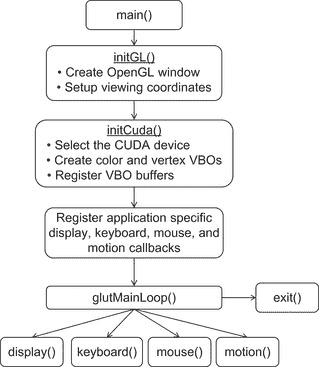 |
| --- |
| **图 9.11** GLUT VBO 代码交互示意图。 |

以下示例是 *simpleGLmain.cpp* 的 VBO 版本的完整源代码。这是一个相当通用的代码，应该不需要修改。文件的开头指定了所需的包含文件和外部方法的原型。**main()** 例程初始化了一个定时器来计算帧率，调用用户定义的方法来初始化 CUDA 核心，注册用户定义的回调函数，并调用 GLUT 主循环，如 示例 9.10 所示，“*simpleGLmain.cpp* 的第一部分”：`// simpleGLmain (Rob Farber)``#include <GL/glew.h>``#include <cutil_inline.h>``#include <cutil_gl_inline.h>``#include <cutil_gl_error.h>``#include <cuda_gl_interop.h>``#include <rendercheck_gl.h>``// GLUT 特定常量``const unsigned int window_width = 512;``const unsigned int window_height = 512;``// 用户必须创建以下例程:``void initCuda(int argc, char** argv);``CUTBoolean initGL(int argc, char** argv);``void fpsDisplay(), display();``void keyboard(unsigned char key, int x, int y);``void mouse(int button, int state, int x, int y);``void motion(int x, int y);``unsigned int timer = 0; // FPS 计算用定时器``int sleepTime=0, sleepInc=100;``// 主程序``int main(int argc, char** argv)``{``// 创建 CUTIL 定时器``cutilCheckError( cutCreateTimer( &timer));``if (CUTFalse == initGL(argc, argv)) { return CUTFalse; }``initCuda(argc, argv);``CUT_CHECK_ERROR_GL();``// 注册回调函数``glutDisplayFunc(fpsDisplay);``glutKeyboardFunc(keyboard);``glutMouseFunc(mouse);``glutMotionFunc(motion);``// 启动渲染主循环``glutMainLoop();``// 清理``cudaThreadExit();``cutilExit(argc, argv);``}`示例 9.11, “*simpleGLmain.cpp* 的第二部分”，计算帧率并将其显示在窗口标题中。`// 显示每秒帧数的简单方法``void computeFPS()``{``static int fpsCount=0;``static int fpsLimit=100;``fpsCount++;``if (fpsCount == fpsLimit) {``char fps[256];``float ifps = 1.f / (cutGetAverageTimerValue(timer) / 1000.f);``if(sleepTime)``sprintf(fps, "CUDA Interop (Rob Farber): %3.1f fps sleepTime %3.1f ms ",``ifps, sleepTime/1000.);``else``sprintf(fps, "CUDA Interop (Rob Farber): %3.1f fps ", ifps);``glutSetWindowTitle(fps);``fpsCount = 0;``cutilCheckError(cutResetTimer(timer));``}``}``void fpsDisplay()``{``cutilCheckError(cutStartTimer(timer));``display();``cutilCheckError(cutStopTimer(timer));``computeFPS();``}`GLUT 和 OpenGL 初始化会创建一个窗口，并指定 3D 空间中的视图位置，如 示例 9.12 所示，“*simpleGLmain.cpp* 的第三部分”：`float animTime = 0.0;// 动画运行的时间``// 初始化 OpenGL 窗口``CUTBoolean initGL(int argc, char **argv)``{``glutInit(&argc, argv);``glutInitDisplayMode(GLUT_RGBA | GLUT_DOUBLE);``glutInitWindowSize(window_width, window_height);``glutCreateWindow("CUDA GL Interop 演示（改编自 NVIDIA 的 simpleGL）");``glutDisplayFunc(fpsDisplay);``glutKeyboardFunc(keyboard);``glutMotionFunc(motion);``// 初始化必要的 OpenGL 扩展``glewInit();``if (! glewIsSupported("GL_VERSION_2_0 ")) {``fprintf(stderr, "错误：缺少必要的 OpenGL 扩展支持。");``return CUTFalse;``}``// 默认初始化``glClearColor(0.0, 0.0, 0.0, 1.0);``glDisable(GL_DEPTH_TEST);``// 视口``glViewport(0, 0, window_width, window_height);``// 设置视图矩阵``glMatrixMode(GL_MODELVIEW);``glLoadIdentity();``// 投影``glMatrixMode(GL_PROJECTION);``glLoadIdentity();``gluPerspective(60.0, (GLfloat)window_width/(GLfloat) window_ height,0.10, 10.0);``return CUTTrue;``}`

## simpleVBO.cpp 文件

*simpleVBO.cpp* 文件包含了创建和映射颜色 PBO 和顶点 VBO 的逻辑。文件开头指定了需要包含的文件和文件中使用的变量。变量 **mesh_width** 和 **mesh_height** 指定了在 GPU 上计算的网格大小。变量 **RestartIndex** 指定了 OpenGL 状态机用于重新启动用户定义的图形原语的整数值。请参见 示例 9.13，“*simpleVBO.cpp* 的第一部分”:`//simpleVBO (Rob Farber)``#include <GL/glew.h>``#include <GL/gl.h>``#include <GL/glext.h>``#include <cutil_inline.h>``#include <cutil_gl_inline.h>``#include <cuda_gl_interop.h>``#include <rendercheck_gl.h>``extern float animTime;``//////////////////////////////////////////////////////////////////``// VBO 特定代码``#include <cutil_inline.h>``// 常量``const unsigned int mesh_width = 256;``const unsigned int mesh_height = 256;``const unsigned int RestartIndex = 0xffffffff;``typedef struct {``GLuint vbo;``GLuint typeSize;``struct cudaGraphicsResource *cudaResource;``} mappedBuffer_t;``extern "C"``void launch_kernel(float4* pos, uchar4* posColor,``unsigned int mesh_width, unsigned int mesh_height, float time);``// vbo 变量``mappedBuffer_t vertexVBO = {NULL, sizeof(float4), NULL};``mappedBuffer_t colorVBO = {NULL, sizeof(uchar4), NULL};``GLuint* qIndices=NULL; // 用于原语重启的索引值``int qIndexSize=0;`**createVBO()** 方法通过调用 **glBufferData()** 实现了在 GPU 上实际分配图形缓冲区的操作。**GL_DYNAMIC_DRAW** 标志告诉 OpenGL 该数据存储区将被反复修改和使用。通过调用 **cudaGraphicsGLRegisterBuffer()**，缓冲区对象被注册以便 CUDA 访问。**deleteVBO()** 方法注销并释放 OpenGL 缓冲区对象所占的内存。请参见 示例 9.14，“*simpleVBO.cpp* 的第二部分”:`/////////////////////////////////////////////////////////////////``//! 创建 VBO``/////////////////////////////////////////////////////////////////``void createVBO(mappedBuffer_t* mbuf)``{``// 创建缓冲区对象``glGenBuffers(1, &(mbuf->vbo) );``glBindBuffer(GL_ARRAY_BUFFER, mbuf->vbo);``// 初始化缓冲区对象``unsigned int size = mesh_width * mesh_height * mbuf->typeSize;``glBufferData(GL_ARRAY_BUFFER, size, 0, GL_DYNAMIC_DRAW);``glBindBuffer(GL_ARRAY_BUFFER, 0);``cudaGraphicsGLRegisterBuffer( &(mbuf->cudaResource), mbuf->vbo,``cudaGraphicsMapFlagsNone );``}``//////////////////////////////////////////////////////////////////``//! 删除 VBO``//////////////////////////////////////////////////////////////////``void deleteVBO(mappedBuffer_t* mbuf)``{``glBindBuffer(1, mbuf->vbo );``glDeleteBuffers(1, &(mbuf->vbo) );``cudaGraphicsUnregisterResource( mbuf->cudaResource );``mbuf->cudaResource = NULL;``mbuf->vbo = NULL;``}``void cleanupCuda()``{``if(qIndices) free(qIndices);``deleteVBO(&vertexVBO);``deleteVBO(&colorVBO);``}`**runCUDA()** 方法执行了映射和检索颜色 PBO 和顶点 VBO 指针的所有工作。这些地址被传递给 **launch_kernel()** 方法供用户定义的内核使用。请注意，**launch_kernel()** 会在内核完成之前等待返回，因此在该方法返回后，返回 OpenGL 资源是安全的。请参见 示例 9.15，“*simpleVBO.cpp* 的第三部分”:`//////////////////////////////////////////////////////////////////``//! 执行 CUDA 计算部分``//////////////////////////////////////////////////////////////////``void runCuda()``{``// 将 OpenGL 缓冲区对象映射到 CUDA 进行写操作``float4 *dptr;``uchar4 *cptr;``uint *iptr;``size_t start;``cudaGraphicsMapResources( 1, &vertexVBO.cudaResource, NULL );``cudaGraphicsResourceGetMappedPointer( ( void ** )&dptr, &start,``vertexVBO.cudaResource );``cudaGraphicsMapResources( 1, &colorVBO.cudaResource, NULL );``cudaGraphicsResourceGetMappedPointer( ( void ** )&cptr, &start,``colorVBO.cudaResource );``// 执行内核``launch_kernel(dptr, cptr, mesh_width, mesh_height, animTime);``// 解除映射缓冲区对象``cudaGraphicsUnmapResources( 1, &vertexVBO.cudaResource, NULL );``cudaGraphicsUnmapResources( 1, &colorVBO.cudaResource, NULL );``}`**initCuda()** 方法根据 NVIDIA 文档选择最快的设备。它进行适当的调用以分配 OpenGL 缓冲区。为使用原语重启进行渲染所需的 **qIndices** 数组也被分配并初始化。请参见 示例 9.16，“*simpleVBO.cpp* 的第四部分”:`void initCuda(int argc, char** argv)``{``// 首先初始化 OpenGL 上下文，以便我们能够正确设置 GL``// 供 CUDA 使用。NVIDIA 提到这对于实现 OpenGL/CUDA 互操作的最佳性能是必要的。``// 使用命令行指定的 CUDA 设备；否则使用具有最高 Gflops/s 的设备``if( cutCheckCmdLineFlag(argc, (const char**)argv, "device") ) {``cutilGLDeviceInit(argc, argv);``} else {``cudaGLSetGLDevice( cutGetMaxGflopsDeviceId() );``}``createVBO(&vertexVBO);``createVBO(&colorVBO);``// 分配并赋值三角扇索引``qIndexSize = 5*(mesh_height-1)*(mesh_width-1);``qIndices = (GLuint *) malloc(qIndexSize*sizeof(GLint));``int index=0;``for(int i=1; i < mesh_height; i++) {``for(int j=1; j < mesh_width; j++) {``qIndices[index++] = (i)*mesh_width + j;``qIndices[index++] = (i)*mesh_width + j−1;``qIndices[index++] = (i−1)*mesh_width + j−1;``qIndices[index++] = (i−1)*mesh_width + j;``qIndices[index++] = RestartIndex;``}``}``// 确保程序退出时清理 VBO``atexit(cleanupCuda);``runCuda();``}`**renderCuda()** 方法绑定具有适当类型和大小信息的缓冲区以供渲染使用。渲染是根据 **drawMode** 定义的。请注意，在使用原语重启渲染三角形时调用的简单性。OpenGL 状态机通过 **glPrimitiveRestartIndexNV()** 方法获知重启索引的值，之后在 OpenGL 客户端状态机中启用原语重启。调用 **glDrawElements()** 后，数据会被渲染。渲染完成后，OpenGL 状态机中会禁用原语重启。请参见 示例 9.17，“*simpleVBO.cpp* 的第五部分”:`void renderCuda(int drawMode)``{``glBindBuffer(GL_ARRAY_BUFFER, vertexVBO.vbo);``glVertexPointer(4, GL_FLOAT, 0, 0);``glEnableClientState(GL_VERTEX_ARRAY);``glBindBuffer(GL_ARRAY_BUFFER, colorVBO.vbo);``glColorPointer(4, GL_UNSIGNED_BYTE, 0, 0);``glEnableClientState(GL_COLOR_ARRAY);``switch(drawMode) {``case GL_LINE_STRIP:``for(int i=0 ; i < mesh_width*mesh_height; i+= mesh_width)``glDrawArrays(GL_LINE_STRIP, i, mesh_width);``break;``case GL_TRIANGLE_FAN: {``glPrimitiveRestartIndexNV(RestartIndex);``glEnableClientState(GL_PRIMITIVE_RESTART_NV);``glDrawElements(GL_TRIANGLE_FAN, qIndexSize, GL_UNSIGNED_INT, qIndices);``glDisableClientState(GL_PRIMITIVE_RESTART_NV);``} break;``default:``glDrawArrays(GL_POINTS, 0, mesh_width * mesh_height);``break;``}``glDisableClientState(GL_VERTEX_ARRAY);``glDisableClientState(GL_COLOR_ARRAY);``}`

## The callbacksVBO.cpp 文件

键盘例程非常简单。基本上，它允许用户通过按下“d”或“D”键在显示模式（点、线、面）之间切换。鼠标和运动例程共同工作，根据用户的鼠标移动和鼠标按钮状态来修改 **rotate_x** 和 **rotate_y** 变量的值。大部分工作发生在显示例程中，该例程定义了视图变换，如 示例 9.18 所示，“代码片段展示了 callbacksVBO.cu 中大部分工作发生的位置”:`// 设置视图矩阵``glMatrixMode(GL_MODELVIEW);``glLoadIdentity();``glTranslatef(0.0, 0.0, translate_z);``glRotatef(rotate_x, 1.0, 0.0, 0.0);``glRotatef(rotate_y, 0.0, 1.0, 0.0);``// 运行 CUDA 内核生成顶点位置``runCuda();``// 渲染数据``renderCuda(drawMode);`然后调用 CUDA 内核通过 **runCuda()** 创建数据，并通过 **renderCuda()** 渲染它。交换缓冲区以使最新版本可见，并通知 GLUT 显示需要更新。动画时间也会递增。请参见 示例 9.19， “交换 OpenGL 缓冲区并向 OpenGL 提交重绘事件的逻辑”:`glutSwapBuffers();``glutPostRedisplay();``animTime += 0.01;`表 9.2 列出了键盘命令和适用的内核。

**表 9.2** 演示和 Perlin 示例的键盘命令

| Key | 适用的内核 | 动作 |
| --- | --- | --- |
| + | Perlin | 降低海洋水平 |
| – | Perlin | 提高海洋水平 |
| k | Perlin | Vi 类型的命令，用于将地形上移 |
| J | Perlin | Vi 类型的命令，用于将地形下移 |
| h | Perlin | Vi 类型的命令，用于将地形向左移动 |
| l | Perlin | Vi 类型的命令，用于将地形向右移动 |
| d | Perlin/Demo | 切换绘制模式 |
| D | Perlin/Demo | 切换绘制模式 |
| I | Perlin | 增加增益 0.25 |
| i | Perlin | 减少增益 0.25 |
| O | Perlin | 增加倍频（fBm 中的频率数量）1 个 |
| o | Perlin | 减少 octaves（fBm 中的频率数量）1 个 |
| P | Perlin | 通过 0.25 增加 lacunarity（连续频率之间的间隙） |
| p | Perlin | 通过 0.25 降低 lacunarity（连续频率之间的间隙） |
| S | Perlin/Demo | 每帧慢渲染 100 微秒 |
| s | Perlin/Demo | 每帧加速渲染 100 微秒 |

完整的源代码提供在示例 9.20，“*callbacksVBO.cpp* 的第一部分”。文件开始部分定义了包含的文件和所需的变量：`//callbacksVBO (Rob Farber)``#include <GL/glew.h>``#include <cutil_inline.h>``#include <cutil_gl_inline.h>``#include <cuda_gl_interop.h>``#include <rendercheck_gl.h>``// 用户必须创建以下例程：``void initCuda(int argc, char** argv);``void runCuda();``void renderCuda(int);``// 回调变量``extern float animTime;``extern int sleepTime, sleepInc;``int drawMode=GL_TRIANGLE_FAN; // 默认绘制模式``int mouse_old_x, mouse_old_y;``int mouse_buttons = 0;``float rotate_x = 0.0, rotate_y = 0.0;``float translate_z = −3.0;``// 打破文件模块化，使得 Perlin 和 demo 内核都能构建``// 一些 Perlin 的初始值``float gain=0.75f, xStart=2.f, yStart=1.f;``float zOffset = 0.0f, octaves = 2.f, lacunarity = 2.0f;` GLUT 显示回调会在每次需要绘制屏幕时被调用。OpenGL 调用定义了 3D 变换和旋转操作。**runCuda()** 方法被调用以生成数据，**renderCuda()** 被调用以渲染数据。然后，OpenGL 缓冲区交换以利用最新更新。使用双缓冲可以更新屏幕，从而引起视觉伪影，如屏幕闪烁。请参见示例 9.21，“*callbacksVBO.cpp* 的第二部分”：`// GLUT 回调显示，键盘，鼠标``void display()``{``glClear(GL_COLOR_BUFFER_BIT | GL_DEPTH_BUFFER_BIT);``// 设置视图矩阵``glMatrixMode(GL_MODELVIEW);``glLoadIdentity();``glTranslatef(0.0, 0.0, translate_z);``glRotatef(rotate_x, 1.0, 0.0, 0.0);``glRotatef(rotate_y, 0.0, 1.0, 0.0);``runCuda(); // 运行 CUDA 内核生成顶点位置``renderCuda(drawMode); // 渲染数据``glutSwapBuffers();``glutPostRedisplay();``animTime += 0.01;``}` 键盘回调是非常直接的代码，执行每个按键的逻辑，如示例 9.22，“*callbacksVBO.cpp* 的第三部分”所示：`void keyboard(unsigned char key, int x, int y)``{``switch(key) {``case('q') : case(27) : // 退出``exit(0);``break;``case 'd': case 'D': // 绘制模式``switch(drawMode) {``case GL_POINTS: drawMode = GL_LINE_STRIP; break;``case GL_LINE_STRIP: drawMode = GL_TRIANGLE_FAN; break;``default: drawMode=GL_POINTS;``} break;``case '+': // Perlin: 降低海洋水平``zOffset += 0.01;``zOffset = (zOffset > 1.0)? 1.0:zOffset; // 输入保护``break;``case '-': // Perlin: 提高海洋水平``zOffset -= 0.01;``zOffset = (zOffset < -1.0)? -1.0:zOffset; // 输入保护``break;``case 'k': // 在 Perlin 函数中移动``yStart −= 0.1;``break;``case 'j': // 在 Perlin 函数中移动``yStart += 0.1;``break;``case 'l': // 在 Perlin 函数中移动``xStart += 0.1;``break;``case 'h': // 在 Perlin 函数中移动``xStart −= 0.1;``break;``case 'I': // Perlin: 改变增益``gain += 0.25;``break;``case 'i': // Perlin: 改变增益``gain −= 0.25;``gain = (gain < 0.25)?0.25:gain; // 输入保护``break;``case 'O': // Perlin: 改变八度``octaves += 1.0f;``octaves = (octaves > 8)?8:octaves; // 输入保护``break;``case 'o': // Perlin: 改变八度``octaves −= 1.0f;``octaves = (octaves<2)?2:octaves; // 输入保护``break;``case 'P': // Perlin: 改变裂缝率``lacunarity += 0.25;``break;``case 'p': // Perlin: 改变裂缝率``lacunarity −= 0.25;``lacunarity = (lacunarity<0.2)?0.2:lacunarity; // 输入保护``break;``case 'S': // 放慢仿真速度``sleepTime += 100;``break;``case 's': // 加快仿真速度``sleepTime = (sleepTime > 0)?sleepTime −= sleepInc:0;``break;``}``glutPostRedisplay();``}` 鼠标和运动回调处理鼠标事件以启用旋转和缩放。窗口的运动回调会在鼠标在窗口内移动时，且一个或多个鼠标按钮被按下时被调用，如示例 9.23，“*callbacksVBO.cpp* 的第四部分”所示：`void mouse(int button, int state, int x, int y)``{``if (state == GLUT_DOWN) {``mouse_buttons |= 1<<button;``} else if (state == GLUT_UP) {``mouse_buttons = 0;``}``mouse_old_x = x;``mouse_old_y = y;``glutPostRedisplay();``}``void motion(int x, int y)``{``float dx, dy;``dx = x - mouse_old_x;``dy = y - mouse_old_y;``if (mouse_buttons & 1) {``rotate_x += dy * 0.2;``rotate_y += dx * 0.2;``} else if (mouse_buttons & 4) {``translate_z += dy * 0.01;``}``rotate_x = (rotate_x < -60.)?-60.:(rotate_x > 60.)?60:rotate_x;``rotate_y = (rotate_y < -60.)?-60.:(rotate_y > 60.)?60:rotate_y;``mouse_old_x = x;``mouse_old_y = y;``}` **testDemo** 示例可以通过示例 9.24 中提供的 Bash 脚本变体构建，“构建 testDemo 的示例脚本”。加粗的项目表明这是一个演示示例，将创建**testDemo** 可执行文件。此脚本假定回调和内核保存在*demo*目录中：`#/bin/bash``**DIR=demo**``SDK_PATH … /cuda/4.0``SDK_LIB0=$SDK_PATH/C/lib``SDK_LIB1= … /4.0/CUDALibraries/common/lib/linux``echo $SDK_PATH``nvcc -O3 -L $SDK_LIB0 -L $SDK_LIB1 -I $SDK_PATH/C/common/inc simpleGLmain.cpp simpleVBO.cpp $DIR/callbacksVBO.cpp $DIR/kernelVBO.cu -lglut -lGLEW_x86_64 -lGLU -lcutil_x86_64 -o **testDemo**` **testPerlin** 示例可以通过示例 9.25 中提供的 Bash 脚本变体构建，“构建 testPerlin 的示例脚本”。加粗的项目表明这是一个演示示例，将创建**testPerlin** 可执行文件。此脚本假定回调和内核保存在*perlin*目录中：`#/bin/bash``**DIR=perlin**``SDK_PATH=/ichec/packages/cuda/4.0``SDK_LIB0=$SDK_PATH/C/lib``SDK_LIB1=/ichec/packages/cuda/4.0/CUDALibraries/common/lib/linux``echo $SDK_PATH``nvcc -O3 -L $SDK_LIB0 -L $SDK_LIB1 -I $SDK_PATH/C/common/inc simpleGLmain.cpp simpleVBO.cpp $DIR/callbacksVBO.cpp $DIR/kernelVBO.cu -lglut -lGLEW_x86_64 -lGLU -lcutil_x86_64 -o **testPerlin**`

# 摘要

混合使用 CUDA 和可视化为商业游戏、视觉产品以及科学应用开辟了巨大的机会。本文中的示例展示了当前一代支持 CUDA 的图形处理器如何以每秒数百帧的速度渲染并生成非常复杂的数据。特别是，本文尝试指出一种极其简单且灵活的方法，供 CUDA 开发者使用符合 OpenGL 标准的*primitive restart*功能来生成和渲染 3D 图像，从而最小化主机处理器的交互需求。因此，PCIe 瓶颈和延迟问题可以避免，从而在图像需要不规则网格和/或计算密集型数据生成时，仍能提供高性能、高质量的图形。当然，这一问题在高端 GPU 上生成非常逼真的图像时尤其重要，但不要忘记，这种技术同样可以使产品进入中低性能市场。
