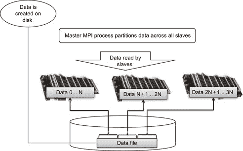

第十章. 云计算与集群环境中的 CUDA  

# 消息传递接口（MPI）

MPI 是基于 MPI 论坛（[`www.mpi-forum.org/`](http://www.mpi-forum.org/)）共识的标准库，论坛成员包括超过 40 个参与组织，涵盖了供应商、研究人员、软件库开发者和用户。论坛的目标是建立一个可移植、高效且灵活的标准，广泛应用于多种编程语言。尽管 MPI 不是 IEEE（电气和电子工程师协会）或 ISO（国际标准化组织）标准，但其广泛的采用使其成为“行业标准”。可以合理地假设，无论供应商或操作系统如何，大多数分布式计算平台上都将提供某个版本的 MPI。使用 MPI 的原因：  

## MPI 编程模型  

MPI 是一个最初设计用来支持 C 和 FORTRAN 应用程序分布式计算的 API。它于 1992 年首次实现，1994 年发布了第一个标准。从那时起，已经为大多数应用程序语言创建了语言绑定和封装器，包括 Perl、Python、Ruby 和 Java。C 语言绑定使用格式 *MPI_Xxxx*，其中 “*Xxxx*” 指定操作。**MPI_Send()** 和 **MPI_Recv()** 是两个使用此绑定的示例。就像 CUDA 执行配置一样，MPI 定义了一个并行计算拓扑，以连接 MPI 会话中的进程组。需要注意的是，MPI *会话大小在应用程序生命周期内是固定的*。这与 *MapReduce*（本章稍后讨论）不同，后者是为容错分布式计算设计的流行云计算框架。MPI 中的所有并行性都是显式的，这意味着程序员有责任正确识别并行性并使用 MPI 构造实现并行算法。

## MPI 通信器

MPI 的一个基本概念是 *通信器*，它是一个分布式对象，支持 *集体* 和 *点对点* 通信。顾名思义，集体通信是指涉及所有定义的通信器组中的处理器的 MPI 函数。点对点通信由各个 MPI 进程使用，用于相互发送消息。默认情况下，MPI 在调用 **MPI_Init()** 后立即创建 **MPI_COMM_WORLD** 通信器。**MPI_COMM_WORLD** 包含应用程序中的所有 MPI 进程。一个 MPI 应用程序可以创建多个独立的通信器，将与一组任务或进程组相关的消息与另一组任务或进程组相关的消息分开。本章只使用默认的通信器。有关通信器组使用的更多信息，可以参考互联网上的许多 MPI 书籍和教程。

## MPI 等级

在一个通信域内，每个进程都有一个由系统在进程初始化时分配的独特整数标识符。等级有时也叫做“任务 ID”。等级是连续的，从 0 开始。它们通常用于条件操作中，以控制 MPI 进程的执行。在 MPI 应用程序中，一个常见的模式是使用一个主进程，记作等级 0，来控制所有其他等级大于 0 的从进程。图 10.1 显示了 MPI 程序的一般结构。

|  |
| --- |
| **图 10.1** MPI 程序的一般结构。 |

示例 10.1，“一个基本的 MPI 程序”，通过让每个 MPI 进程打印出其 rank，展示了此框架的 C 语言实现：`#include "mpi.h"``#include <stdio.h>``int main(int argc, char *argv[])``{``int numtasks, rank, ret;``ret = MPI_Init(&argc,&argv);``if (ret != MPI_SUCCESS) {``printf ("MPI_Init() 出错！\n");``MPI_Abort(MPI_COMM_WORLD, ret);``}``MPI_Comm_size(MPI_COMM_WORLD,&numtasks);``MPI_Comm_rank(MPI_COMM_WORLD,&rank);``printf ("任务数= %d 我的 rank= %d\n", numtasks,rank);``/******* 做一些工作 *******/``MPI_Finalize();``}`MPI 通常由系统管理员安装和配置。请参阅集群文档，了解如何编译和运行此应用程序。例如，NVIDIA 在示例 10.2，“NVIDIA 在 *simpleMPI* SDK 示例中的注释”中，建议构建其 *simpleMPI* SDK 示例：`* simpleMPI.cpp：主程序，使用 mpicxx 在 Linux/Mac 平台上编译``* 在 Windows 上，请下载 Microsoft HPC Pack SDK 2008`要在同一文件中使用 CUDA 和 MPI 构建应用程序，**nvcc** 命令行在示例 10.3，“用于构建 *basicMPI .cu* 的 nvcc 命令行”中，适用于 Linux。此方法会链接到 MPI 库：`nvcc -I $MPI_INC_PATH basicMPI.cu -L $MPI_LIB_PATH –lmpich –o basicMPI`通常使用 **mpiexec** 启动 MPI 应用程序。一些遗留实现使用 **mpirun**。示例 10.4 显示了使用两个 MPI 进程运行示例时的命令和输出：`$ mpiexec -np 2 ./basicMPI``任务数= 2 我的 rank= 1``任务数= 2 我的 rank= 0`

## 主从模式

在 MPI 程序中，一个常见的设计模式是主从模式。通常，被指定为 rank 0 的进程被定义为主进程。该进程随后会指挥所有其他进程的活动。示例 10.5《主从 MPI 代码片段》中的代码片段展示了如何构建主从 MPI 代码：`MPI_Comm_size(MPI_COMM_WORLD,&numtasks);``MPI_Comm_rank(MPI_COMM_WORLD,&rank);``if( rank == 0){``// 在这里写主进程代码``} else {``// 在这里写从进程代码``}`本章使用了主从编程模式。MPI 支持许多其他设计模式。更多信息请参考互联网或多本 MPI 书籍。一个很好的参考书是 *使用 MPI* （Gropp, Lusk, & Skjellum, 1999）。

## 点对点基础

MPI 点对点通信在两个不同的 MPI 进程之间发送消息。一个进程执行发送操作，而另一个执行匹配的读取操作。MPI 保证每条消息都会完整无误地到达。使用 MPI 时需要小心，因为如果发送和接收操作不匹配，会发生*死锁*。死锁意味着发送进程和接收进程都无法继续，直到对方完成操作，而当发送和接收操作不匹配时，这种情况永远不会发生。CUDA 通过在线程块之间共享内存来避免死锁，这样程序员不必显式匹配读写操作，但仍需确保数据得到适当更新。**MPI_Send()** 和 **MPI_Recv()** 是常用的*阻塞*方法，用于在两个 MPI 进程之间发送消息。阻塞意味着发送进程将等待直到消息完全正确地发送，而接收进程将在等待正确接收完整消息时被阻塞。更复杂的通信方法可以基于这两种方法构建。消息的大小由 MPI 数据类型的**计数**和数据类型决定。为了便于移植，MPI 定义了基本数据类型。表 10.1 列出了标准要求的数据类型。

**表 10.1** MPI 标准要求的数据类型

| C 数据类型 | Fortran 数据类型 |
| --- | --- |
| MPI_CHAR | 有符号字符型 | MPI_CHARACTER | character(1) |
| MPI_SHORT | 有符号短整型 |  |  |
| MPI_INT | 有符号整型 | MPI_INTEGER | 整型 |
| MPI_LONG | 有符号长整型 |  |  |
| MPI_UNSIGNED_CHAR | 无符号字符型 |  |  |
| MPI_UNSIGNED_SHORT | 无符号短整型 |  |  |
| MPI_UNSIGNED | 无符号整型 |  |  |
| MPI_UNSIGNED_LONG | 无符号长整型 |  |  |
| MPI_FLOAT | 浮点型 | MPI_REAL | real |
| MPI_DOUBLE | 双精度浮点型 | MPI_DOUBLE_PRECISION | 双精度 |
| MPI_LONG_DOUBLE | 长双精度浮点型 |  |  |
|  |  | MPI_COMPLEX | 复数 |
|  |  | MPI_DOUBLE_COMPLEX | 双精度复数 |
|  |  | MPI_LOGICAL | 逻辑 |
| MPI_BYTE | 8 个二进制位 | MPI_BYTE | 8 个二进制位 |
| MPI_PACKED | 用于 MPI_Pack()/MPI_Unpack()的数据 | MPI_PACKED | 用于 MPI_Pack()/MPI_Unpack()的数据 |

# MPI 如何通信

MPI 可以根据网络通信硬件使用优化的数据路径来发送和接收消息。例如，在计算节点内运行的 MPI 应用程序可以通过快速共享内存进行通信，而不是通过物理网络接口卡（NIC）发送数据。最小化数据移动是 MPI 供应商和开发库人员的共同目标，因为数据移动只会浪费宝贵的时间，并且降低 MPI 性能。在与供应商和软件组织的合作下，NVIDIA 创建了 GPUDirect 来加速 GPU 计算的 MPI。其思路非常简单：获取传递给**MPI_Send()**的 GPU 数据指针，并将其移动到**MPI_Recv()**调用中使用的 GPU 内存指针所指向的内存位置。不要进行其他数据移动或依赖其他处理器。此过程如图 10.2 所示。虽然概念上很简单，但实现需要供应商、驱动程序、操作系统和硬件的合作。

|  |
| --- |
| **图 10.2**MPI GPUDirect 数据路径。 |

*InfiniBand* (IB) 是 HPC 中常用的高速、低延迟通信链路。它被设计成可扩展的，并被用于世界上许多最大的超级计算机中。大多数小型计算集群也出于价格和性能原因使用 InfiniBand。Mellanox 是知名的 InfiniBand 产品供应商。NVIDIA 列出了 Linux 内核、NVIDIA Linux CUDA 驱动程序和 Mellanox InfiniBand 驱动程序中的以下更改：■ Linux 内核修改：■ 支持不同驱动程序之间共享固定页面。■ Linux 内核内存管理器 (MM) 允许 NVIDIA 和 Mellanox 驱动程序共享主机内存，并为后者提供对由 NVIDIA CUDA 库分配的缓冲区的直接访问，从而提供零拷贝数据并提高性能。■ NVIDIA 驱动程序：■ 由 CUDA 库分配的缓冲区由 NVIDIA 驱动程序管理。■ 我们已添加修改以标记这些页面以供共享，这样内核 MM 就允许 Mellanox InfiniBand 驱动程序访问它们，并使用它们进行传输，而无需复制或重新固定它们。■ Mellanox OFED¹ 驱动程序：¹OpenFabrics 企业发行版。■ 我们已修改 Mellanox InfiniBand 驱动程序以查询内存，并能够使用新的 Linux 内核 MM API 与 NVIDIA Tesla 驱动程序共享内存。■ 此外，Mellanox 驱动程序注册了特殊的回调函数，以允许其他共享内存的驱动程序在运行时通知共享缓冲区状态中进行的任何更改，以便 Mellanox 驱动程序相应地使用内存并避免对任何共享固定缓冲区的无效访问。结果是发送和接收缓冲区之间的直接数据传输路径，这提供了 30% 的 MPI 性能提升。图 10.2 显示，内存的注册区域可以直接传输到设备驱动程序中的缓冲区。发送主机上的 NIC 和设备驱动程序都知道这个缓冲区，这使得 NIC 可以在网络互连上发送数据，而无需主机处理器的干预。同样，接收主机上的设备驱动程序和 NIC 都知道一个公共接收缓冲区。当 GPU 驱动程序被通知数据已完整到达时，它被传输到接收 GPU（图 10.2 中的 GPU[R]）。CUDA 开发者在这个模型中分配内存有两种方式：■ 使用 cudaHostRegister()。■ 使用 4.0 驱动程序，只需设置环境变量 CUDA_NIC_INTEROP=1。这将告诉驱动程序使用与 IB 驱动程序兼容的 cudaMallocHost() 的替代路径。无需使用 cudaHostRegister()。

# 带宽

网络带宽是分布式计算中的一个挑战。表 10.2 中列出的带宽数据显示，大多数网络互连的传输速度明显慢于 PCIe 总线。（QDR 代表四倍数据速率 InfiniBand，DDR 和 SDR 分别代表双倍和单倍数据速率。）

**表 10.2** 数据可访问性，包括 InfiniBand 消息

| 数据访问 | 内存类型 | 带宽 |
| --- | --- | --- |
| SM 内部 | 寄存器内存 | ≈8,000 GB/s |
| SM 内部 | 共享内存 | ≈1,600 GB/s |
| GPU | 全局内存 | 177 GB/s |
| PCIe | 映射内存 | ≈8 GB/s 单向 |
| MPI | 12x InfiniBand | QDR | 12 GB/s |
| DDR | 6 GB/s |
| SDR | 3 GB/s |
| MPI | 4x InfiniBand | QDR | 4 GB/s |
| DDR | 2 GB/s |
| SDR | 1 GB/s |
| MPI | 1x InfiniBand | QDR | 1 GB/s |
| DDR | 0.5 GB/s |
| SDR | 0.25 GB/s |

一个差的 InfiniBand 网络可能会引入比 PCIe 更大数量级的性能下降，这强调了第一章中介绍的高效 GPU 编程的三条规则中的第一条：“将数据加载到 GPGPU 上并保持在那里。”这也为那些希望部署分布式 MPI 应用程序的人带来了可移植性问题。不幸的是，用户往往会首先归咎于应用程序的性能问题，而不是硬件本身。

# 平衡比率

决定一个应用程序或算法是否能够在网络中有效运行是一个挑战。当然，最准确的方法是移植代码并进行基准测试。但由于缺乏资金和时间，这可能是不可行的。也可能导致大量不必要的工作。平衡比率是一种常识性的方法，可以提供关于应用程序或算法性能的合理估计，而无需首先移植应用程序。这些指标还用于作为采购过程的一部分来评估硬件系统（Farber, 2007）。平衡比率定义了一个系统的平衡，这个平衡是可量化的，并且在选择合适的基准测试的情况下，能够提供一些保证，确保现有的应用程序能够在新计算机上良好运行。挑战在于确定需要测量哪些特征，以确定一个应用程序是否能够在 GPU 或 GPU 网络上运行良好。大多数 GPU 应用程序都是数值密集型的，这意味着所有基于 GPU 的指标都应该与浮点性能挂钩。然后，可以在具有不同浮点能力的系统和显卡之间进行比较。带宽限制是与数值性能相关的重要指标，因为全局内存、PCIe 总线和网络连接已知会成为大多数应用程序的 GPU 性能瓶颈。如公式 10.1 所示，浮点性能与保持浮点处理器忙碌的带宽之间的比率可以通过供应商和硬件信息来计算。这个比率使我们容易看出，数据通过四倍 DDR InfiniBand 连接传输的硬件配置，可能会导致应用程序性能比在通过 PCIe 总线传输数据的硬件上运行同一应用程序时下降一个数量级。(10.1)这些观察在高性能计算（HPC）领域并不新鲜。2003 年 1 月的《国家科学基金会蓝带咨询小组关于网络基础设施的报告》²，即著名的 Atkins 报告，明确了与浮点性能相关的一些理想指标：²[`www.nsf.gov/cise/sci/reports/atkins.pdf`](http://www.nsf.gov/cise/sci/reports/atkins.pdf)。■ 每个浮点操作每秒至少需要 1 字节的内存。■ 内存带宽（字节/秒/浮点操作每秒）≥ 1。■ 内部网络总链路带宽（字节/秒/浮点操作每秒）≥ 0.2。■ 内部网络二分带宽（字节/秒/浮点操作每秒）≥ 0.1。■ 系统持续的生产性磁盘 I/O 带宽（字节/秒/浮点操作每秒）≥ 0.001。请记住，Atkins 报告中给出的数值是基于*他们*对“代表性”工作负载的定义所提出的理想比率。你的应用程序可能有完全不同的需求。因此，评估你的应用程序，看看当前哪些比率有效，哪些比率需要改进，还是很值得的。一个好的方法是使用基准测试来评估系统性能。这也是用于排名全球最快超级计算机的 Top 500 榜单背后的思想。HPC 挑战（HPCC）网站³提供了一个更为全面的测试套件。它还会生成一个 Kiviat 图（Kiviat 图类似于 Microsoft Excel 中的雷达图），以基于标准的 HPCC 基准测试来比较系统。一个良好平衡的系统在这些图中看起来是对称的，因为它在所有测试中表现良好。高性能的平衡系统在视觉上非常突出，因为它们占据了最外圈。失衡的系统则会扭曲，正如图 10.3 中所看到的那样。³[`icl.cs.utk.edu/hpcc`](http://icl.cs.utk.edu/hpcc)。

|  |
| --- |
| **图 10.3** 一个 Kiviat 图示例。 |

HPCC 网站是关于不同计算系统基准测试和比较数据的一个良好来源。请注意，像 HPCC 网站上的合成基准测试非常擅长强调机器性能的某些方面，但它们仅代表了机器性能的一个狭窄视角。为了提供更为真实的估算，大多数组织使用包含一些样本生产代码的基准评估套件来补充合成基准测试——仅仅是为了查看是否存在任何意外的性能变化，无论是好的还是坏的。这些基准测试还可以提供有价值的洞察，帮助了解处理器和系统组件在实际应用中的协同工作情况；此外，它们还能够发现一些可能会影响性能的问题，比如不成熟的编译器和/或软件驱动程序。平衡比率背后的关键点在于，它们可以帮助应用程序开发者或系统设计师判断新硬件系统的某个方面是否会成为应用程序的瓶颈。尽管浮点性能很重要，但其他指标如内存容量、存储带宽和存储容量也可能是决定性因素。例如，当前 GPU 的内存容量可能会限制某些应用程序或算法的使用。

# 大型 MPI 运行的考虑事项

在设计分布式应用程序时，考虑应用程序各个方面的可扩展性是非常重要的——不仅仅是计算部分！许多传统的 MPI 应用程序是在一个 MPI 运行使用 10 到 100 个处理核心被认为是“大型”运行的时期设计的。（这种应用可能是迁移到 CUDA 的好候选对象，从而可以在单个 GPU 上运行。）这些传统应用程序常用的一个快捷方式是让主进程从文件中读取数据，并根据某种分区方案将数据分发给客户端。这种数据加载方式无法扩展，因为主节点根本无法为可能达到数万个其他进程传输所有数据。即使是现代硬件，主进程也会成为瓶颈，这可能导致数据加载比实际计算所需的时间还要长。

## 初始数据加载的可扩展性

一种更好的方法是让每个进程从分布式文件系统中的文件中读取自己的数据。每个进程会获得一个数据文件的文件名，文件中包含了数据。然后，它们打开文件，执行任何必要的查找和其他 I/O 操作，以访问和加载数据。所有客户端随后关闭文件以释放系统资源。这种简单的技术能够非常快速地将数百吉字节的数据加载到大型超级计算机中。这个过程在图 10.4 中进行了说明。

|  |
| --- |
| **图 10.4** 可扩展的 MPI 数据加载，用于大规模数据集。 |

在这种 I/O 模型下，数据存储的文件系统带宽能力至关重要。现代并行分布式文件系统在多个进程并发访问时，能够提供每秒数百 GB 的存储带宽。免费提供的 Lustre 文件系统⁴利用这一技术可以提供每秒数百 GB 的文件系统带宽，并在图 10.5 中展示了在 60,000 个 MPI 进程下的扩展能力。IBM 的 GPFS（通用并行文件系统）和 Panasas 的 PanFS 等商业文件系统同样能够扩展到每秒数百 GB 的带宽，并支持数万个 MPI 进程。为了实现高性能，这些文件系统需要由多个并发分布式进程访问。不建议在旧版的 NFS 和 CIFS 文件系统上使用这种技术进行大量 MPI 客户端的访问。⁴[`lustre.org`](http://lustre.org)。

|  |
| --- |
| **图 10.5** 使用 60,000 个处理核心实现接近线性扩展到 386 TF/s 的示例。 |

## 使用 MPI 执行计算

在第二章中介绍的一般映射已在 TACC Longhorn 超级计算机的 MPI 分布式环境中用于扩展至 500 个 GPU。相同的映射也用于在 CM-200 连接机(Farber, 1992)和 TACC Ranger 超级计算机(Farber & Trease, 2008)上扩展至超过 60,000 个处理核心。在这些运行过程中，rank 0 进程被指定为传统的主从配置中的主进程。然后，主进程执行以下操作：■ 按照之前描述的方式启动数据加载。即使使用数百 GB 的数据，使用现代并行分布式文件系统进行数据加载也只需几秒钟。■ 执行其他初始化操作。■ 运行优化过程并指导从进程。■ 为了充分利用可用资源，主节点还与从进程一起评估目标函数。■ 大多数生产运行使用了 Powell 方法的变体，如*数值算法*(Press, Teukolsky, & Vetterling, 2007a)或*共轭梯度法*（也在*数值算法*中描述）。■ 在每次评估目标函数时：■ 使用**MPI_Bcast()**将参数广播到所有从进程。■ 每个从进程（包括主进程）计算目标函数的偏和。这不需要任何通信，并且可以优化为在设备上以全速运行，如第二章和第三章中讨论的那样。■ 对目标函数进行自己的局部计算。■ 调用**MPI_Reduce()**以检索所有部分结果的总量。■ 通常，**MPI_Reduce()**操作高度优化，并按 O(log2(**ntasks**))的比例扩展，其中**ntasks**是**MPI_Comm_size()**报告的数量。■ 将目标函数的结果提供给优化方法，这会导致：■ 对目标函数的另一次评估。■ 优化过程的完成。从进程（那些 rank 大于 0 的进程）：■ 按照之前描述的方式启动数据加载。■ 保持在一个无限循环中，直到主进程通知它退出应用程序。在循环内部，每个从进程：■ 从主节点读取参数。■ 计算目标函数的偏和。■ 当需要时，将部分结果发送到主节点。

## 检查可扩展性

分布式应用程序的扩展性行为是一个关键的性能指标。表现出**强扩展性**的应用程序随着处理器数量的增加，固定问题规模下运行速度会变得更快。**线性扩展性**是分布式应用程序的目标，因为应用程序的运行时间会随着可用计算资源的增加而线性缩放（例如，系统规模扩大两倍时，问题运行时间将减少一半，扩大四倍时，运行时间将减少四分之一，等等）。**令人惊讶的并行**问题可以表现出线性的运行时间行为，因为每个计算相互独立。需要通信以满足某些依赖关系的应用程序通常最多只能达到接近线性的扩展性。例如，O(log2) 的归约操作会导致扩展性行为随着处理器数量的增加而逐渐偏离线性加速。图 10.5 展示了使用 第三章中讨论的 PCA 目标函数，扩展到 60,000 个处理核心的近线性扩展性。AMD 巴塞罗那架构的 TACC Ranger 超级计算机在 图 10.5 中报告的 386 teraflop 每秒的*有效速率*包含了所有的通信开销。基于 500 个 GPU 的超级计算机运行可以提供接近 500 teraflops 的单精度性能。一位同事称其为“真实浮点运算”，因为它们反映了实际生产运行所能提供的性能。PCA 映射的有效速率定义如 方程 10.2 所示，“PCA 并行映射的有效速率定义”：  

# 云计算

云计算是一种将计算以基于 Web 的服务形式移至网络的基础设施范式。这个想法本身很简单：机构与互联网供应商签订合同以获取计算资源，而不是通过购买和维护计算集群和超级计算机硬件来提供这些资源。正如任何计算平台所预期的那样——特别是用于高性能和科学计算的——平台内的性能限制定义了哪些计算问题可以良好运行。与 MPI 框架不同，云计算要求应用程序能够容忍点对点通信中的故障和高延迟。尽管如此，MPI 是一个如此普遍的 API，大多数云计算服务都提供并支持它。请注意，带宽和延迟问题可能导致在云计算基础设施上运行 MPI 时性能不佳。MPI 使用固定数量的进程参与分布式应用程序。这个数字在应用程序启动时定义——通常使用**mpiexec**。在 MPI 中，通信器中任何进程的失败都会影响通信器中的所有进程，即使它们与失败的进程没有直接通信。这个因素导致了 MPI 应用程序中容错能力的缺乏。“*MapReduce*”是一个用于分布式计算的容错框架，它已经变得非常流行并且被广泛使用（Dean & Ghemawat, 2010）。换句话说，客户端的失败对服务器没有显著影响。相反，服务器可以继续为其他客户端提供服务。使 MapReduce 结构稳健的是，所有通信都发生在双方环境中，一方（例如，进程）可以轻松地识别另一方已失败，并决定停止与其通信。此外，每一方都可以轻松地跟踪另一方持有的状态，这有助于故障转移。云计算的一个挑战是，许多服务提供商使用运行在繁忙内部网络上的虚拟机。因此，通信时间可能会增加。特别是，时间 *T[reduce]* 非常依赖于延迟，如方程式 10.2 所示。对于紧密耦合的应用程序（例如，进程之间频繁通信的应用程序），强烈建议使用专用集群。特别是，减少操作将由组中最慢的进程速率限制。话虽如此，像“在 GPU 集群上运行的多 GPU MapReduce”(Stuart & Owens, 2011)这样的论文表明，MapReduce 是一个活跃的研究领域。

# 一个代码示例

来自*[nlpcaNM.cu]*示例的目标函数已经被修改，以使用 MPI 和这种数据加载技术，示例来源于第三章。

## 数据生成

创建了一个简单的数据生成器，使用来自 *nlpcaNM.cu* 的**genData()**方法。该程序仅仅是将若干个示例写入文件。文件名和示例数量可以在命令行中指定。完整的源代码请参见示例 10.6，“*genData.cu* 的源代码”：`#include <iostream>``#include <fstream>``#include <stdlib.h>``using namespace std;``// 获取一个在 -1 和 1 之间均匀分布的随机数``inline float f_rand() {``return 2*(rand()/((float)RAND_MAX)) -1.;``}``template <typename Real>``void genData(ofstream &outFile, int nVec, Real xVar)``{``Real xMax = 1.1; Real xMin = -xMax;``Real xRange = (xMax - xMin);``for(int i=0; i < nVec; i++) {``Real t = xRange * f_rand();``Real z1 = t + xVar * f_rand();``Real z2 = t*t*t + xVar * f_rand();``outFile.write((char*) &z1, sizeof(Real));``outFile.write((char*) &z2, sizeof(Real));``}``}``int main(int argc, char *argv[])``{``if(argc < 3) {``fprintf(stderr,"Use: filename nVec\n");``exit(1);``}``ofstream outFile (argv[1], ios::out | ios::binary);``int nVec = atoi(argv[2]);``#ifdef USE_DBL``genData<double>(outFile, nVec, 0.1);``#else``genData<float>(outFile, nVec, 0.1);``#endif``outFile.close();``return 0;``}`该程序可以保存为文件并按照示例 10.7 中的方式编译，“构建 *genData.cu*。” C 预处理器变量 **USE_DBL** 指定数据是否将作为 32 位或 64 位二进制浮点数写入：`nvcc -D USE_DBL genData.cu -o bin/genData64``nvcc genData.cu -o bin/genData32`数据集可以通过命令行写入。例如，示例 10.8，“使用 *genData.cu* 创建一个 32 位文件，”会将 10M 个 32 位浮点数写入文件 *nlpca32.dat*。`bin/genData32 nlpca32.dat 10000000`在运行时很容易指定错误的文件。这个简单的例子没有提供版本、大小或其他有助于检查的任何信息。对于生产质量的文件和流数据格式，推荐使用 Google 的 ProtoBuf 项目。⁵ Google 几乎在所有的内部 RPC 协议和文件格式中都使用了这个项目。⁵[`code.google.com/p/protobuf`](http://code.google.com/p/protobuf)。从第三章中修改的 *nlpcaNM.cu* 示例代码被修改以适应 MPI 环境。修改相当少，但分布在代码的各个部分。以下讨论只提供了代码片段。完整代码可以从本书网站下载。⁶⁶[`booksite.mkp.com/9780123884268`](http://booksite.mkp.com/9780123884268)。变量 **nGPUperNode** 在文件开始时定义。假设每个节点上的 MPI 进程数等于每个节点中的 GPU 数量（即每个 GPU 对应一个 MPI 进程）。**nGPUperNode** 的值允许每个 MPI 进程正确调用 **cudaSetDevice()** 以使用不同的设备。其他拓扑也是可能的，包括每个节点使用一个 MPI 进程来处理所有 GPU。请参见示例 10.9，“修改 *nlpcaNM.cu* 顶部以使用每个节点多个 GPU”：`#include "mpi.h"``const static int nGPUperNode=2;``}`*nlpcaNM.cu* 的 **main()** 方法已根据 MPI 框架进行了修改，如图 10.1 所示，使用示例 10.1 中的代码（见示例 10.10，“修改后的 *nlpcaNM.cu* 的 main() 方法”）：`#include <stdio.h>``int main(int argc, char *argv[])``{``int numtasks, rank, ret;``if(argc < 2) {``fprintf(stderr,"Use: filename\n");``exit(1);``}``ret = MPI_Init(&argc,&argv);``if (ret != MPI_SUCCESS) {``printf ("Error in MPI_Init()!\n");``MPI_Abort(MPI_COMM_WORLD, ret);``}``MPI_Comm_size(MPI_COMM_WORLD,&numtasks);``MPI_Comm_rank(MPI_COMM_WORLD,&rank);``printf ("Number of tasks= %d My rank= %d\n", numtasks,rank);``/******* 执行一些工作 *******/``#ifdef USE_DBL``trainTest<double> ( argv[1], rank, numtasks );``#else``trainTest<float> ( argv[1], rank, numtasks);``#endif``MPI_Finalize();``return 0;``}`**setExamples()** 方法已修改为在不同的 GPU 上分配内存。请参见示例 10.11，“修改后的 *nlpcaNM.cu* 中的 setExamples 方法”：`void setExamples(thrust::host_vector<Real>& _h_data) {``nExamples = _h_data.size()/exLen;``// 将数据复制到设备上``int rank;``MPI_Comm_rank(MPI_COMM_WORLD,&rank);``cudaSetDevice(rank%nGPUperNode);``d_data = thrust::device_vector<Real>(nExamples*exLen);``thrust::copy(_h_data.begin(), _h_data.end(), d_data.begin());``d_param = thrust::device_vector<Real>(nParam);``}`示例 10.12，“修改后的 *nlpcaNM.cu* 中的 trainTest 方法”，展示了如何从磁盘加载数据：`#include <fstream>``template <typename Real>``void trainTest(char* filename, int rank, int numtasks)``{``ObjFunc<Real> testObj;``const int nParam = testObj.nParam;``cout << "nParam " << nParam << endl;``// 读取测试数据``ifstream inFile (filename, ios::in | ios::binary);``// 将文件指针移到末尾``inFile.seekg(0, ios::end);``// 确定文件大小（以字节为单位）``ios::pos_type size = inFile.tellg();``// 为此任务分配 Real 类型的值的数量``//（假设数量是 numtasks 的倍数）``int nExamplesPerGPU = (size/(sizeof(Real)*testObj.exLen))/numtasks;``thrust::host_vector<Real> h_data(nExamplesPerGPU*testObj.exLen);``// 将文件指针移到正确的位置``inFile.seekg(rank*h_data.size()*sizeof(Real), ios::beg);// 为此任务分配 Real 类型的值的数量``inFile.seekg(rank*h_data.size()*sizeof(Real));``// 从文件中读取字节到 h_data``inFile.read((char*)&h_data[0], h_data.size()*sizeof(Real));``// 关闭文件``inFile.close();``testObj.setExamples(h_data);``int nExamples = testObj.get_nExamples();``if(rank > 0) {``testObj.objFunc( NULL );``return;``}``...Nelder-Mead 代码在这里``int op=0; // 关闭从属进程``MPI_Bcast(&op, 1, MPI_INT, 0, MPI_COMM_WORLD);``}`在这个例子中，二进制输入流 **infile** 被打开以读取文件 **filename** 中的数据。之后：■ 确定文件的大小。■ 每个 **numtasks** 进程根据文件大小和每个示例的数据数量被分配一个相等的任务量。通过假设示例数量是 **numtasks** 的倍数，简化了逻辑。■ 分配了主机向量 **h_data**。■ 通过寻址操作移动到文件中的正确位置。■ 读取数据到 **h_data** 中并传递给 **setExamples()** 以加载到设备上。■ 如图 10.6 所示，进程的 rank 会被测试：

|  |
| --- |
| **图 10.6**将主进程与从属进程分离的逻辑。 |

■ 如果等级大于零，那么该进程是从属进程。目标函数会使用 NULL 参数被调用，训练会在该方法退出时结束。■ 如果进程是主进程，则调用 Nelder-Mead 优化代码。目标函数实现了主从进程的逻辑，如图 10.7 所示。

|  |
| --- |
| **图 10.7**MPI 控制流程。 |

目标函数(示例 10.13)属于从属进程，当 MPI 排名大于 0 时。在这种情况下，从属状态机：1. 在固定内存中为参数分配空间。2. 等待从主进程广播操作码。a. 主进程告诉从属进程所有工作已完成，使用零操作码，并应返回。b. 否则，从属进程将进入下一步。3. 从属进程等待主机广播参数。4. 在主进程广播参数后，从属进程在其数据上运行目标函数，并阻塞等待主进程请求结果。5. 在主进程请求汇总结果后，从属进程返回等待步骤 2 中的操作码。这个过程会一直持续到主进程发送 0 操作码。目标函数(示例 10.13)属于主进程，当排名为 0 时。在这种情况下，主进程：1. 向所有从属进程广播非零操作码，让它们知道有工作要做。2. 向所有从属进程广播参数。3. 在其数据上运行目标函数。4. 执行汇总操作，将来自从属进程的局部值相加。5. 返回以继续运行优化方法。`Real objFunc(Real *p)` `{` `int rank,op;` `Real sum=0.;` `MPI_Comm_rank(MPI_COMM_WORLD,&rank);` `cudaSetDevice(rank%nGPUperNode);` `if(nExamples == 0) {` `cerr << "data not set " << endl; exit(1);` `}` `CalcError getError(thrust::raw_pointer_cast(&d_data[0]),` `thrust::raw_pointer_cast(&d_param[0]),` `nInput, exLen);` `if(rank > 0) { // 从属目标函数` `Real *param;` `cudaHostAlloc(&param, sizeof(Real)*nParam,cudaHostAllocPortable);` `for(;;) { // 循环直到主进程表示已完成。` `MPI_Bcast(&op, 1, MPI_INT, 0, MPI_COMM_WORLD);` `if(op==0) {` `cudaFreeHost(param);` `return(0);` `}` `if(sizeof(Real) == sizeof(float))` `MPI_Bcast(&param[0], nParam, MPI_FLOAT, 0, MPI_COMM_WORLD);` `else` `MPI_Bcast(&param[0], nParam, MPI_DOUBLE, 0, MPI_COMM_WORLD);` `thrust::copy(param, param+nParam, d_param.begin());` `Real mySum = thrust::transform_reduce(` `thrust::counting_iterator<unsigned int>(0),` `thrust::counting_iterator<unsigned int> (nExamples),` `getError,` `(Real) 0.,` `thrust::plus<Real>());` `if(sizeof(Real) == sizeof(float))` `MPI_Reduce(&mySum, &sum, 1, MPI_FLOAT, MPI_SUM, 0, MPI_COMM_WORLD);` `else` `MPI_Reduce(&mySum, &sum, 1, MPI_DOUBLE, MPI_SUM, 0, MPI_COMM_WORLD);` `}` `} else { // 主进程` `double startTime=omp_get_wtime();` `op=1;` `MPI_Bcast(&op, 1, MPI_INT, 0, MPI_COMM_WORLD);` `if(sizeof(Real) == sizeof(float))` `MPI_Bcast(&p[0], nParam, MPI_FLOAT, 0, MPI_COMM_WORLD);` `else` `MPI_Bcast(&p[0], nParam, MPI_DOUBLE, 0, MPI_COMM_WORLD);` `thrust::copy(p, p+nParam, d_param.begin());` `Real mySum = thrust::transform_reduce(` `thrust::counting_iterator<unsigned int>(0),` `thrust::counting_iterator<unsigned int>(nExamples),` `getError,` `(Real) 0.,` `thrust::plus<Real>());` `if(sizeof(Real) == sizeof(float))` `MPI_Reduce(&mySum, &sum, 1, MPI_FLOAT, MPI_SUM, 0, MPI_COMM_WORLD);` `else` `MPI_Reduce(&mySum, &sum, 1, MPI_DOUBLE, MPI_SUM, 0, MPI_COMM_WORLD);` `objFuncCallTime += (omp_get_wtime() - startTime);` `objFuncCallCount++;` `}` `return(sum);` `}` 应用程序在主进程返回优化方法后完成。在 **testTrain()** 的最后一条语句中，向所有从属进程广播零操作码，告诉它们退出。然后主进程返回到 **main()** 以正常关闭 MPI。表 10.3 显示，在两个 GPU 上运行 *nlpcaNM.cu* 的 MPI 版本提供了近两倍的性能提升。由于两个 GPU 都在同一个系统中，没有使用网络。本章的示例代码在德克萨斯高级计算中心（TACC）的 Longhorn 超级计算机集群上运行时，几乎实现了线性可扩展性，扩展到 500 个 GPU。感谢 TACC 提供访问这台机器的机会。⁸⁷在维基百科上报告了更当前和更广泛的结果。[`gpucomputing.net/CUDAapplicationdesignanddevelopment`](http://gpucomputing.net/CUDAapplicationdesignanddevelopment)。

**表 10.3** 结果表⁷

| GPU 数量 | 每个目标函数的时间 | 相比单个 GPU 的加速比 |
| --- | --- | --- |
| 1 | 0.0102073 |  |
| 2 | 0.00516948 | 1.98 |

# 摘要

MPI 和 GPUDirect 使 CUDA 程序员能够运行远超单个 GPU 或单个系统中 GPU 集合能力的高性能应用程序。节点内的可扩展性和性能是评估分布式应用程序的关键指标。那些表现出线性或接近线性可扩展性的应用程序具有在当前及未来最大的机器上运行的能力。例如，本章讨论的并行映射，加上第二章和第三章，已经有近 30 年历史。设计时，1 拓扑计算能力还远超即便是最大型的政府研究机构能达到的水平。如今，它能够在 GPU 设备、集群甚至最新的超级计算机上高效运行。未来 30 年后，我们将看到多少 YottaFlops（10²⁴ flops）可用。与此同时，这一映射为大规模数据挖掘和优化任务提供了可扩展的解决方案。
