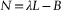
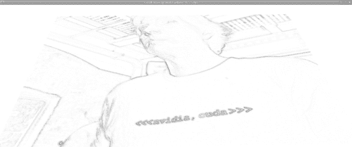
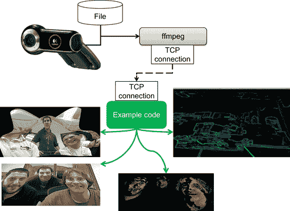
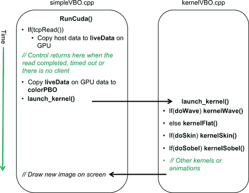

# 第十二章\. 应用聚焦于实时流视频 

CUDA 使开发者能够编写可以与用户实时交互的应用程序。本章修改了来自第九章的源代码，以处理和显示实时视频流。对于没有网络摄像头的用户，可以通过 TCP 连接从其他机器导入实时视频，或者使用磁盘上的电影文件。除了纯粹的乐趣之外，使用 CUDA 进行实时视频处理为增强现实、游戏、抬头显示、面部及其他通用视觉识别任务的新市场打开了大门。本章中的示例代码教授了从背景杂乱中隔离面部、使用 Sobel 滤波器进行边缘检测以及在三维中变形实时视频流的基础知识。CUDA 支持的 GPU 的 teraflop 计算能力现在使得每个能够购买网络摄像头和游戏 GPU 的人都能编写自己的应用程序与计算机进行视觉交互。这包括青少年、学生、教授以及全球的大型研究机构。**关键词**实时视频、Sobel 边缘检测、面部分割、OpenGL、原始重启、ffmpeg、TCP、mpegCUDA 使开发者能够编写可以与用户实时交互的应用程序。本章修改了来自第九章的源代码，以处理和显示实时视频流。对于没有网络摄像头的用户，可以通过 TCP 连接从其他机器导入实时视频，或者使用磁盘上的电影文件。除了纯粹的乐趣之外，使用 CUDA 进行实时视频处理为增强现实、游戏、抬头显示、面部及其他通用视觉识别任务的新市场打开了大门。本章中的示例代码教授了从背景杂乱中隔离面部、使用 Sobel 滤波器进行边缘检测以及在三维中变形实时视频流的基础知识。CUDA 支持的 GPU 的 teraflop 计算能力现在使得每个能够购买网络摄像头和游戏 GPU 的人都能编写自己的应用程序与计算机进行视觉交互。这包括青少年、学生、教授以及全球的大型研究机构。通过本书中讨论的机器学习技术，读者拥有了超越现有视觉算法的食谱实现所需的工具。可以大胆设想，因为本书中介绍的机器学习技术可以从单个 GPU 扩展到世界上最大的超级计算机。然而，机器学习的真正价值在于它如何将来自庞大（可能是 TB 级）数据集的信息封装到可以在最小的手机和平板电脑上运行的小型参数化方法中。在本章结束时，读者将对以下内容有基本的理解：■ 在 Windows 和 UNIX 计算机上使用 CUDA 管理实时数据■ 面部分割■ Sobel 边缘检测■ 使用 3D 效果变形实时视频图像数据■ 如何从实时流数据创建用于机器学习的数据集

# 机器视觉的主题

机器视觉是一个成熟的领域，已有大量的公开文献。新的发展是 GPU 所带来的计算能力，推动了交互式视觉计算的进步。回想一下，第一个达到千亿次浮点运算的超级计算机在 1996 年 12 月才向计算机科学界精英开放。现在，即使是便宜的 NVIDIA 游戏 GPU 也可以被编程以提供更强的性能。普通的网络摄像头和免费的软件彻底改变了人们基于实时视频流进行实验和开发产品的能力。学生们不再局限于研究实验室，他们可以利用网络摄像头的实时视频流或老师提供的电影文件来完成作业。当然，这一切也可以在激烈的游戏 sessions 中使用相同的硬件完成。考虑到 SoC（系统级芯片）技术的快速发展，如用于手机和平板的 Tegra 多核芯片，未来这些作业很可能会在手机上完成。例如，手机已经可以用来追踪人脸 (Tresadern, Ionita, & Cootes, 2011)。¹¹一个视频可以在[`personalpages.manchester.ac.uk/staff/philip.tresadern/proj_facerec.htm`](http://personalpages.manchester.ac.uk/staff/philip.tresadern/proj_facerec.htm)观看。本章提供了一个学习框架，并附带了多个示例内核，可作为通往视觉特效、视觉识别和增强现实的垫脚石，从而将视觉研究的世界带到您的个人计算机或笔记本电脑上。网络上有许多资源，包括一些免费提供的计算机视觉项目，其中一些包括：■ **OpenVIDIA：** OpenVIDIA 包提供了可免费下载的计算机视觉算法，这些算法是用 OpenGL、Cg 和 CUDA-C 编写的。² CUDA Vision 工作台是 OpenVIDIA 的一部分，它提供了一个基于 Windows 的应用程序，包含许多常见的图像处理程序，框架方便进行交互式实验。其他 OpenVIDIA 项目包括立体视觉、光流和特征跟踪算法。²[`openvidia.sourceforge.net`](http://openvidia.sourceforge.net)。■ **GPU4Vision：** 这是由格拉茨科技大学计算机图形与视觉研究所创建的项目。他们提供公开可用的基于 CUDA 的视觉算法。■ **OpenCV：** OpenCV（开源计算机视觉）是一个实时计算机视觉编程函数库。该软件可供学术和商业用途免费使用。OpenCV 支持 C++、C、Python 等接口，并可以运行在 Windows、Linux、Android 和 Mac OS X 上。该库拥有超过 2500 个优化的算法，广泛应用于从互动艺术到矿山检查、网页地图拼接以及先进机器人技术等领域。

## 3D 效果

来自第九章的正弦波演示内核可以轻松修改，以在实时数据上提供 3D 效果。该内核将颜色信息存储在**colorVBO**变量中。将网格定义为与图像大小和形状相同，可以将图像中每个像素的红色、绿色和蓝色信息分配给每个顶点。**vertexVBO**中指定的高度变化将使图像在 3D 空间中发生扭曲。图 12.1 展示了当一帧来自实时流的数据映射到正弦波表面时如何在灰度版本中发生扭曲。此示例代码生成的图像为全彩色。

|  |
| --- |
| **图 12.1** 一张扭曲到 3D 正弦波表面上的图像。 |

## 肤色区域的分割

实时从视频数据中隔离肤色区域在广泛的图像处理应用中扮演着重要角色，包括使用摄像头的游戏控制器、面部检测、面部跟踪、手势分析、情感分析以及许多其他人机交互领域。肤色已被证明是人机处理系统中作为第一步的有用且稳健的线索（Kakumanu, Makrogiannis, & Bourbakis, 2007; Vezhnevets, Sazonov, & Andreeva, 2003）。Marián Sedlácˇek 对通过首先隔离肤色像素来检测人脸的步骤和假设提供了出色的描述（Sedláček, 2004）。从网络摄像头或其他视频源获取的每个像素的红、绿、蓝（RGB）颜色并不是识别肤色的适当表示，因为在不同的光照条件和各种民族肤色下，RGB 值变化很大。相反，视觉研究人员发现，*色度颜色*、*归一化 RGB*或“纯”肤色往往紧密聚集在一起，无论肤色或亮度如何。归一化的纯色——其中 *r, g* 和 *b* 分别对应于每个像素的红、绿和蓝分量——被定义为“方程 12.1：像素的纯红色和方程 12.2：像素的纯绿色值”：（12.1）（12.2）归一化的蓝色是多余的，因为 *PureR* + *PureG* + *PureB* = 1。正如 Vezhnevets 等人所指出的，“这种表示的一个显著特性是，对于哑光表面，在忽略环境光的情况下，归一化 RGB 在某些假设下对表面相对于光源的方向变化是不变的”（Vezhnevets, Sazonov, & Andreeva, 2003, p. 1）。尽管 Sedlácˇek 指出，归一化颜色空间中人类皮肤所占据的区域是一个椭圆，但本章中的示例代码使用矩形区域以保持示例代码简洁。即便如此，图像处理管道中的第一步效果良好，如图 12.2 所示。请参考 Sedlácˇek 以了解如何进一步细化分割过程。³³[`www.cescg.org/CESCG-2004/papers/44_SedlacekMarian.pdf`](http://www.cescg.org/CESCG-2004/papers/44_SedlacekMarian.pdf)。

|  |
| --- |
| **图 12.2**三张由肤色像素隔离的面部图像。 |

## 边缘检测

边缘检测是图像处理中一个基本的问题，因为边缘定义了物体的边界，并且代表了图像中的重要结构特征。进行边缘检测有许多方法。Sobel 方法，或 Sobel 滤波器，是一种基于梯度的方法，它寻找图像一阶导数中强烈的变化。Sobel 边缘检测器使用一对 3 × 3 卷积掩模，一个估计 x 方向上的梯度，另一个估计 y 方向上的梯度。这个边缘检测器非常适合 CUDA，因为每个线程可以将 3 × 3 卷积掩模应用于其像素以及图像中相邻的像素。表 12.1 和表 12.2 包含了 Sobel 掩模在每个方向上的值。

**表 12.1** Sobel 卷积掩模（x 方向，*G[x]*）

| –1 | 0 | +1 |
| --- | --- | --- |
| –2 | 0 | +2 |
| –1 | 0 | +1 |

**表 12.2** Sobel 卷积掩模（y 方向，*G[y]*）

| +1 | +2 | +1 |
| --- | --- | --- |
| 0 | 0 | 0 |
| –1 | –2 | –1 |

近似的梯度大小，*G*，可以使用以下公式计算：图 12.3 是使用 Sobel 滤波器创建的颜色反转灰度图像。

|  |
| --- |
| **图 12.3**使用 Sobel 滤波器演示边缘检测的图像。 |

# FFmpeg

FFmpeg 是一个免费的开源程序，可以录制、转换并流式传输各种格式的数字音频和视频。它被形容为多媒体版的瑞士军刀，因为它可以在大多数常见格式之间进行转换。“FFmpeg”这个名字来源于 MPEG 视频标准小组，并结合了“FF”代表“快进”的含义。源代码可以从[`ffmpeg.org`](http://ffmpeg.org)自由下载，并可在大多数操作系统、计算平台和微处理器指令集下编译使用。本章使用的 FFmpeg 命令行驱动应用程序 **ffmpeg**，因为大多数读者都能下载并使用适合自己系统的可工作版本。如图 12.4 所示，**ffmpeg** 用于捕捉来自网络摄像头或其他视频设备的输出，并将其转换为 rgb24 格式，该格式表示视频中每一帧图像中的每个像素，采用单独的红色、绿色和蓝色 8 位值。**testLive** 示例程序从 TCP 套接字读取数据流，并将其写入 GPU 上的缓冲区，以便与 CUDA 一起使用。图 12.4 展示了 **testLive** 在 3D 中变换视频流、在 3D 坐标系统中显示的平面图像、从背景中分离面部以及实时边缘检测（使用 Sobel 滤波器）的代表性图像。

|  |
| --- |
| **图 12.4** 视频数据流。 |

使用**ffmpeg**应用程序的好处是无需编程即可将视频数据转换为可以发送到 GPU 的格式。缺点是，从压缩格式转换为 rgb24 会大幅增加通过 TCP 套接字传输的数据量。基于这个原因，建议在包含 GPU 的系统上进行 rgb24 格式的转换。一个更高效的实现方式是使用 FFmpeg 库直接读取压缩视频流，并在示例源代码中将其转换为 rgb24。这样可以避免通过套接字传输大量的 rgb24 数据。需要从远程摄像头流式传输数据的人应：■ 修改示例代码，在应用程序内部读取并执行视频转换。■ 使用 TCP 中继程序读取来自远程站点的压缩视频流，并将其传递给运行在包含 GPU 的系统上的**ffmpeg**实例。一个选项是 socat（SOcket CAT），这是一款可免费下载的通用中继应用程序，能够在大多数操作系统上运行。以下 bash 脚本演示了如何将 640 × 480 的 rgb24 图像流写入*localhost*的 32000 端口。Localhost 是用于同一计算机上需要相互通信的应用程序的环回设备名称。环回设备充当一个以太网接口，但不会通过 TCP 设备传输信息。请注意，**ffmpeg**命令行接口随着时间的发展在不断变化，因此这些脚本可能需要在未来修改。■ 从 Linux 摄像头流式传输（示例 12.1， “Linux 摄像头捕获”）：`FFMPEG=ffmpeg``DEVICE="-f video4linux2 -i /dev/video0"``PIX="-f rawvideo -pix_fmt rgb24"``SIZE="-s 640x480"``$FFMPEG -an -r 50 $SIZE $DEVICE $PIX tcp:localhost:32000`■ 从 Windows 摄像头流式传输（示例 12.2， “Windows 摄像头捕获”）：`../ffmpeg-git-39dbe9b-win32-static/bin/ffmpeg.exe -r 25 -f vfwcap -i 0 -f rawvideo -pix_fmt rgb24 -s 640x480 tcp:localhost:32000`■ 从文件流式传输（示例 12.3， “从文件流式传输”）：`FFMPEG=ffmpeg``s#可以是任何文件名或格式：myfile.avi, myfile.3gp, …``FILE="myfile.mpeg"``PIX="-f rawvideo -pix_fmt rgb24"``SIZE="-s 640x480"``$FFMPEG -i $FILE $SIZE $PIX tcp:localhost:32000`从文件流式传输将以**ffmpeg**能够转换帧的最快速率运行，这可能比实时速度要快得多。

# TCP 服务器

以下代码实现了一个简单的异步 TCP 服务器，该服务器：■ 在变量**port**指定的端口上监听■ 当客户端尝试连接时，接受该客户端■ 当客户端向该服务器发送数据时，读取**datasize**字节数据到数组中■ 当客户端断开连接或发生套接字错误时，关闭连接并等待另一个客户端连接任何程序都可以提供 rgb24 数据，但在此示例中假设由**ffmpeg**提供数据。该服务器是异步的，这意味着它使用**select()**调用来确定是否有客户端等待连接，或是否有数据需要读取。如果**select()**超时，则控制返回到调用例程，后者可以执行额外的工作，如在屏幕上动画、改变颜色或其他视觉效果。本过程将在本节的其余部分中详细讨论，并在图 12.5 中进行说明。

|  |
| --- |
| **图 12.5** 异步负载和内核管道的时间线。 |

变量**timeout**定义了**select()**在等待数据到达套接字时的时间。默认值为 100 微秒，这是为了平衡应用程序消耗的 CPU 时间与每帧实时数据图形管道的迭代次数。有关套接字编程的更多信息可以在互联网上找到，或参考一些优秀的书籍，如*UNIX 环境高级编程*（Stevens, 2005）。该文件的第一部分，*tcpserver.cpp*，指定了必要的包含文件和变量。**initTCPserver()**方法绑定了一个端口，用于监听客户端连接。它的设计是作为**initCuda()**方法的一个组成部分，位于*simpleVBO.cu*中。参见示例 12.4，“*tcpserver.cpp* 第一部分”：`#include <sys/socket.h>``#include <netinet/in.h>``#include <stdio.h>``#include <stdlib.h>``#include <string.h>``#include <unistd.h>``#include <fcntl.h>``#include <limits.h>``int listenfd, connfd=0;``struct sockaddr_in servaddr,cliaddr;``socklen_t clilen;``struct timeval timeout = {0,100};``void initTCPserver(int port)``{``listenfd=socket(AF_INET,SOCK_STREAM,0);``bzero(&servaddr,sizeof(servaddr));``servaddr.sin_family = AF_INET;``servaddr.sin_addr.s_addr=htonl(INADDR_ANY);``servaddr.sin_port=htons(32000);``bind(listenfd,(struct sockaddr *)&servaddr,sizeof(servaddr));``}`**tcpRead()**方法异步连接到一个客户端，或者在有数据时执行阻塞读取**datasize**字节的数据。如果在**select()**超时之前没有客户端或客户端数据出现，则控制权返回给调用方法。调试用的**fprintf()**语句被保留以帮助理解此代码。如果需要，可以取消注释**fprintf()**语句以查看该代码在实践中的工作方式。建议如果取消注释“读取超时”语句，应大大增加超时时间。参见示例 12.5，“*tcpserver.cpp* 第二部分”：`int tcpRead(char *data, int datasize)``{``int n;``fd_set dataReady;``if(!connfd) { // 没有客户端：直到超时或接受连接``FD_ZERO(&dataReady);``FD_SET(listenfd,&dataReady);``if(select(listenfd+1, &dataReady, NULL,NULL, &timeout) == -1) {``fprintf(stderr,"监听选择失败!\n"); exit(1);``}``listen(listenfd,1); // 一次监听一个连接``clilen=sizeof(cliaddr);``if(FD_ISSET(listenfd, &dataReady)) {``fprintf(stderr,"接受客户端连接!\n");``connfd = accept(listenfd,(struct sockaddr *)&cliaddr,&clilen);``} else {``//fprintf(stderr,"没有客户端!\n");``return(0); // 没有客户端，因此没有工作``}``}``if(!connfd) return(0);``// 读取数据``FD_ZERO(&dataReady);``FD_SET(connfd,&dataReady);``if(select(connfd+1, &dataReady, NULL,NULL, &timeout) == -1) {``fprintf(stderr,"数据选择失败!\n"); exit(1);``}``if(FD_ISSET(connfd, &dataReady)) {``FD_CLR(connfd, &dataReady);``for(n=0; n < datasize;) {``int size = ((datasize-n) > SSIZE_MAX)?SSIZE_MAX:(datasize-n);``int ret = read(connfd, data+n, size);``if(ret <= 0) break; // 错误``n += ret;``}``if(n < datasize) {``fprintf(stderr,"不完整的读取 %d 字节 %d\n", n, datasize);``perror("读取失败!");``close(connfd);``connfd=0;``return(0);``}``return(1);``} else {``//fprintf(stderr, "读取超时\n");``}``return(0);``}`

# 直播流应用程序

直播流应用程序将 CUDA 内核排队以执行图像分析和动画效果。哪些内核被排队取决于用户输入。如图 12.5 所示，只有当**tcpRead()**返回非零结果时，新数据才会通过 PCIe 总线传输到 GPU 上的**liveData**缓冲区，表示已读取到新的一帧数据。如前所述，**tcpRead()**由于超时可能返回零，在这种情况下无需传输新数据。因为内核流水线可以修改**colorVBO**的内容，所以原始视频数据会在流水线启动之前从**liveData**复制。**liveData**到**colorVBO**的复制非常快速，因为它仅在 GPU 内部移动数据。接下来调用**launch_kernel()**方法，根据用户在键盘回调中设置的标志排队各种内核。**tcpRead()**的超时意味着**launch_kernel()**流水线可以在从直播流读取新图像之间被多次调用。像**kernelWave()**这样的动画内核，通过产生动画波浪效果，依赖于这种异步行为来创建其视觉效果。虽然在此示例中未使用，**animTime**变量可以用来控制动画的速度和行为。

## kernelWave()：一个动画内核

**kernelWave()** 方法实现了在第九章中讨论的动态正弦波 3D 表面。在这个内核中（示例 12.6），图像中的每个像素都被视为 3D 网格中一个顶点的颜色。这些顶点颜色保存在当前帧的**colorVBO**中，用于实时图像渲染。使用三角形渲染可以生成平滑着色的表面，无论图像如何调整大小。为了演示的目的，表面也可以根据用户通过键盘输入的方式，用线条或点来渲染。`// 实时流内核（Rob Farber）``// 简单内核，修改顶点位置以形成正弦波模式``__global__ void kernelWave(float4* pos, uchar4 *colorPos,``unsigned int width, unsigned int height, float time)``{``unsigned int x = blockIdx.x*blockDim.x + threadIdx.x;``unsigned int y = blockIdx.y*blockDim.y + threadIdx.y;``// 计算 uv 坐标``float u = x / (float) width;``float v = y / (float) height;``u = u*2.0f - 1.0f;``v = v*2.0f - 1.0f;``// 计算简单的正弦波模式``float freq = 4.0f;``float w = sinf(u*freq + time) * cosf(v*freq + time) * 0.5f;``// 写入输出顶点``pos[y*width+x] = make_float4(u, w, v, 1.0f);``}`

## kernelFlat(): 在平面表面上渲染图像

**kernelFlat()** 简单地指定了一个平面表面用于渲染。这使得在不被动态正弦波表面分心的情况下，可以查看其他渲染效果。请参见示例 12.7，" *kernelVBO.cu* 的第二部分"：`__global__ void kernelFlat(float4* pos, uchar4 *colorPos,``unsigned int width, unsigned int height)``{``unsigned int x = blockIdx.x*blockDim.x + threadIdx.x;``unsigned int y = blockIdx.y*blockDim.y + threadIdx.y;``// 计算 uv 坐标``float u = x / (float) width;``float v = y / (float) height;``u = u*2.0f - 1.0f;``v = v*2.0f - 1.0f;``// 写入输出顶点``pos[y*width+x] = make_float4(u, 1.f, v, 1.0f);``}`

## kernelSkin(): 仅保留肉色区域

该内核简单地计算图像中每个像素的标准化红色（**PureR**）和绿色（**PureG**）值。如果这些值落在肤色的矩形范围内，原始的 RGB 颜色将被保留。否则，它们将被设置为黑色。参见示例 12.8， “*kernelVBO.cu* 的第三部分”`__global__ void kernelSkin(float4* pos, uchar4 *colorPos,``unsigned int width, unsigned int height,``int lowPureG, int highPureG,``int lowPureR, int highPureR)``{``unsigned int x = blockIdx.x*blockDim.x + threadIdx.x;``unsigned int y = blockIdx.y*blockDim.y + threadIdx.y;``int r = colorPos[y*width+x].x;``int g = colorPos[y*width+x].y;``int b = colorPos[y*width+x].z;``int pureR = 255*( ((float)r)/(r+g+b));``int pureG = 255*( ((float)g)/(r+g+b));``if( !( (pureG > lowPureG) && (pureG < highPureG)``&& (pureR > lowPureR) && (pureR < highPureR) ) )``colorPos[y*width+x] = make_uchar4(0,0,0,0);``}`

## kernelSobel()：一种简单的 Sobel 边缘检测滤波器

示例 12.9 中的内核，“*kernelVBO.cu* 第四部分”，简单地应用了一个 Sobel 边缘检测滤波器，如本章开头所讨论：`__device__ unsigned char gray(const uchar4 &pix)``{``// 转换为 8 位灰度``return( .3f * pix.x + 0.59f * pix.y + 0.11f * pix.z);``}``__global__ void kernelSobel(float4 *pos, uchar4 *colorPos, uchar4 *newPix,``unsigned int width, unsigned int height)``{``unsigned int x = blockIdx.x*blockDim.x + threadIdx.x;``unsigned int y = blockIdx.y*blockDim.y + threadIdx.y;``const int sobelv[3][3] = { {-1,-2,-1},{0,0,0},{1,2,1}};``const int sobelh[3][3] = { {-1,0,1},{-2,0,2},{-1,0,1}};``int sumh=0, sumv=0;``if( (x > 1) && x < (width-1) && (y > 1) && y < (height-1)) {``for(int l= -1; l < 2; l++) {``for(int k= -1; k < 2; k++) {``register int g = gray(colorPos[(y+k)*width+x+l]);``sumh += sobelh[k+1][l+1] * g;``sumv += sobelv[k+1][l+1] * g;``}``}``unsigned char p = abs(sumh/8)+ abs(sumv/8);``newPix[y*width+x] = make_uchar4(0,p,p,p);``} else {``newPix[y*width+x] = make_uchar4(0,0,0,0);``}``}`

## launch_kernel() 方法

如图 12.5 所示，**launch_kernel()**方法将内核调用排队，以执行用户请求的各种转换。这个方法是为了清晰性编写的，而非灵活性。例如，使用指向**newPix**的静态指针是正确的，但不一定是良好的编码实践。它在此示例代码中保留，目的是展示读者如何为自己的方法分配临时空间。一旦 Sobel 滤波器完成，临时数据将通过快速的设备间传输复制到**colorVBO**中。请参见示例 12.10，“*kernelVBO.cu*的第五部分”：`extern int PureR[2], PureG[2], doWave, doSkin, doSobel;` `// 用于 __global__ 调用的包装器，设置内核调用` `extern "C" void launch_kernel(float4* pos, uchar4* colorPos,` `unsigned int mesh_width, unsigned int mesh_height, float time)` `{` `// 执行内核` `dim3 block(8, 8, 1);` `dim3 grid(mesh_width / block.x, mesh_height / block.y, 1);` `if(doWave)` `kernelWave<<< grid, block>>>(pos, colorPos, mesh_width, mesh_height, time);` `else` `kernelFlat<<< grid, block>>>(pos, colorPos, mesh_width, mesh_height);` `if(doSkin)` `kernelSkin<<< grid, block>>>(pos, colorPos, mesh_width, mesh_height,` `PureG[0], PureG[1],` `PureR[0], PureR[1]);` `if(doSobel) {` `static uchar4 *newPix=NULL;` `if(!newPix)` `cudaMalloc(&newPix, sizeof(uchar4)*mesh_width*mesh_height);` `kernelSobel<<< grid, block>>>(pos, colorPos, newPix,` `mesh_width, mesh_height);` `cudaMemcpy(colorPos, newPix, sizeof(uchar4)*mesh_width *mesh_height,` `cudaMemcpyDeviceToDevice);` `}`

# simpleVBO.cpp 文件

对于来自第九章的 *simpleVBO.cpp* 文件，仅做了少量修改，但这些修改涉及到多个方法。为了避免混淆，本章末尾包含了整个文件并标出修改部分。这些修改包括：■ **MESH_WIDTH** 和 **MESH_HEIGHT** 预处理器变量的定义。这些变量应该在编译时使用，以便将网格的大小与来自 **ffmpeg** 的图像宽度和高度匹配。默认情况下，网格大小设置为 640 × 480 像素，这与本章开头 **ffmpeg** 命令行脚本中指定的大小相对应。■ 创建了一个 GPU 缓冲区 **liveData**，用于存储当前帧的视频数据。按照惯例，在从主机加载帧之间，GPU 不会修改该数据。■ 调用了 **tcpRead()** 方法。正如本章后面 **runCuda()** 方法中的代码所示，当返回非零值时，**tcpRead()** 中的新数据需要传输到 GPU。然后，**runCuda()** 方法通过将视频数据复制到 **colorVBO()** 来初始化图形管道。

# callbacksVBO.cpp 文件

对于来自第九章的 *callbacks.cpp* 文件，仅做了少量修改；需要定义一些新的变量。大部分修改发生在键盘回调方法 **keyboard()** 中。表 12.3 显示了有效的按键操作。

**表 12.3** testLive 的键盘命令

| Key | 操作 |
| --- | --- |
| Q | 退出应用程序 |
| Esc | 退出应用程序 |
| D | 切换绘制模式 |
| d | 切换绘制模式 |
| S | 每帧减慢渲染 100 微秒 |
| s | 每帧加速渲染 100 微秒 |
| z | 切换 3D 正弦波动画（开启）或使表面平坦（关闭） |
| c | 切换 Sobel 滤波 |
| x | 切换肉色区域的分割 |
| R | 增加 PureR 上限 |
| r | 减少 PureR 的上边界 |
| E | 增加 PureR 的下边界 |
| e | 减少 PureR 的下边界 |
| G | 增加 PureG 的上边界 |
| g | 减少 PureG 的上边界 |
| F | 增加 PureG 的下边界 |
| f | 减少 PureG 的下边界 |

如在关于分割的讨论中提到的，**kernelSkin()** 方法使用了一个矩形区域来识别人体皮肤颜色。实际占据的区域在纯色空间中是一个椭圆形。使用矩形区域是因为它使得 **kernelSkin()** 方法保持简洁，但也带来了忠实度的损失。使用矩形区域确实允许用户通过少量按键来改变矩形的大小，从而探索在颜色空间中过滤的效果，并观察不同环境和光照条件下的效果。示例 12.11，“*callbacksVBO.cpp*”是修改后的 第九章*callbacksVBO.cpp* 文件：`#include <GL/glew.h>``#include <cutil_inline.h>``#include <cutil_gl_inline.h>``#include <cuda_gl_interop.h>``#include <rendercheck_gl.h>``// 用户必须创建以下例程：``void initCuda(int argc, char** argv);``void runCuda();``void renderCuda(int);``// 回调变量``extern float animTime;``extern int sleepTime, sleepInc;``int drawMode=GL_TRIANGLE_FAN; // 默认绘制模式``int mouse_old_x, mouse_old_y;``int mouse_buttons = 0;``float rotate_x = 0.0, rotate_y = 0.0;``float translate_z = -3.0;``// 一些面部分割的初始值``int PureG[2]={62,89}, PureR[2]={112,145};``int doWave=1, doSkin=0, doSobel=0;``// GLUT 回调显示、键盘、鼠标``void display()``{``glClear(GL_COLOR_BUFFER_BIT | GL_DEPTH_BUFFER_BIT);``// 设置视图矩阵``glMatrixMode(GL_MODELVIEW);``glLoadIdentity();``glTranslatef(0.0, 0.0, translate_z);``glRotatef(rotate_x, 1.0, 0.0, 0.0);``glRotatef(rotate_y, 0.0, 1.0, 0.0);``runCuda(); // 运行 CUDA 内核以生成顶点位置``renderCuda(drawMode); // 渲染数据``glutSwapBuffers();``glutPostRedisplay();``// 当 GPU 过快时，减慢渲染速度``if(sleepTime) usleep(sleepTime);``animTime += 0.01;``}``void keyboard(unsigned char key, int x, int y)``{``switch(key) {``case('q') : case(27) : // 退出``exit(0);``break;``case 'd': case 'D': // 绘制模式``switch(drawMode) {``case GL_POINTS: drawMode = GL_LINE_STRIP; break;``case GL_LINE_STRIP: drawMode = GL_TRIANGLE_FAN; break;``default: drawMode=GL_POINTS;``} break;``case 'S': // 减慢模拟速度``sleepTime += sleepInc;``break;``case 's': // 加快模拟速度``sleepTime = (sleepTime > 0)?sleepTime -= sleepInc:0;``break;``case 'z': doWave = (doWave > 0)?0:1; break;``case 'x': doSkin = (doSkin > 0)?0:1; break;``case 'c': doSobel = (doSobel > 0)?0:1; break;``case 'R': PureR[1]++; if(PureR[1] > 255) PureR[1]=255; break;``case 'r': PureR[1]--; if(PureR[1] <= PureR[0]) PureR[1]++; break;``case 'E': PureR[0]++; if(PureR[0] >= PureR[1]) PureR[0]--; break;``case 'e': PureR[0]--; if(PureR[0] <= 0 ) PureR[0]=0; break;``case 'G': PureG[1]++; if(PureG[1] > 255) PureG[1]=255; break;``case 'g': PureG[1]--; if(PureG[1] <= PureG[0]) PureG[1]++; break;``case 'F': PureG[0]++; if(PureG[0] >= PureG[1]) PureG[0]--; break;``case 'f': PureG[0]--; if(PureG[0] <= 0 ) PureG[0]=0; break;``}``fprintf(stderr,"PureG[0] %d PureG[1] %d PureR[0] %d PureR[1] %d\n",``PureG[0],PureG[1],PureR[0],PureR[1]);``glutPostRedisplay();``}``void mouse(int button, int state, int x, int y)``{``if (state == GLUT_DOWN) {``mouse_buttons |= 1<<button;``} else if (state == GLUT_UP) {``mouse_buttons = 0;``}``mouse_old_x = x;``mouse_old_y = y;``glutPostRedisplay();``}``void motion(int x, int y)``{``float dx, dy;``dx = x - mouse_old_x;``dy = y - mouse_old_y;``if (mouse_buttons & 1) {``rotate_x += dy * 0.2;``rotate_y += dx * 0.2;``} else if (mouse_buttons & 4) {``translate_z += dy * 0.01;``}``rotate_x = (rotate_x < -60.)?-60.:(rotate_x > 60.)?60:rotate_x;``rotate_y = (rotate_y < -60.)?-60.:(rotate_y > 60.)?60:rotate_y;``mouse_old_x = x;``mouse_old_y = y;``}``

# 构建和运行代码

**testLive** 应用程序的构建方式与第九章中的示例相同。示例 12.12，“构建 *testLive* 的脚本”，是 Linux 下的 bash 构建脚本：`#/bin/bash``DIR=livestream``SDK_PATH … /cuda/4.0``SDK_LIB0=$SDK_PATH/C/lib``SDK_LIB1= … /4.0/CUDALibraries/common/lib/linux``echo $SDK_PATH``nvcc -arch=sm_20 -O3 -L $SDK_LIB0 -L $SDK_LIB1 -I $SDK_PATH/C/common/inc simpleGLmain.cpp simpleVBO.cpp $DIR/callbacksVBO.cpp $DIR/ kernelVBO.cu tcpserver.cpp -lglut -lGLEW_x86_64 -lGLU -lcutil_x86_64 -o testLive`运行**testLive**应用程序非常简单：1. 在一个窗口中启动*testLive*可执行文件，您将看到可视化窗口出现在屏幕上。2. 在第二个窗口中，运行脚本将视频数据发送到本地主机的 32000 端口。本章开头提供了示例脚本，用于 UNIX 和 Windows 系统，将视频文件转换并发送到**testLive**示例。

# 未来

本章中的三个示例演示了在 CUDA 上进行实时图像处理。然而，它们只是进一步实验和研究的起点。

## 机器学习

图像分割后仍然存在的一个挑战是识别。简单但有价值的识别形式可以编码为规则。例如，游戏开发者可以寻找两个靠近一个大块肉色图形（面部）的两个小肉色块（手）。手之间的高度差异可以用来改变模拟飞行器的角度，使其倾斜并转向。类似地，手之间的距离可以控制如缩放图像等动作。许多其他任务并不像在 CUDA 内核中编码规则或逻辑那样简单。例如，人们可以轻松识别图片中的面部。在这些情况下，第二章和第三章中介绍的机器学习技术可以通过 GPU“超级计算机”帮助开发者“学习”算法。文献中有许多使用机器学习技术在一般照明条件下通过皮肤色像素分割图像的例子（Kakumanu, Makrogiannis, & Bourbakis, 2007），面部识别（Mitchell, 1997）和其他物体识别。Hinton 指出，像变换自编码器这样的机器学习技术提供了比基于规则的系统更好的替代方案（Hinton, Krizhevesky, & Want, 2011）。通过网络摄像头，读者可以收集自己的图像，并将其编辑和排序成“是”和“否”数据集，以训练分类器。文献和互联网中都有许多关于如何使用这些数据集来解决视觉识别中许多问题的详细研究。

## 连接组图谱

哈佛连通体项目 ([`cbs.fas.harvard.edu`](http://cbs.fas.harvard.edu)) 是一个将 GPGPU 计算能力与先进机器人技术相结合的项目，旨在创建各种动物模型的大脑三维接线图，包括猫和实验室老鼠等。该项目体现了 GPU 技术潜力的早期认可。这个项目的数据可能会成为开创性和颠覆性科学研究的基础。视觉研究人员和神经学家将不再依赖猜测，他们最终将拥有一种伽利略式的首次机会能力，利用由连通体项目创造的极为详细的数据来观察、研究和建模皮层网络。在 2009 年的一篇论文《猫已经出袋：拥有 10⁹个神经元、10¹³个突触的皮层模拟》中，研究人员展示了他们能够以空前的规模有效地建模皮层网络。换句话说，这些科学家认为他们展示了足够的计算能力来模拟整个猫的大脑：这些模拟包括现象学性的脉冲神经元、个别学习突触、轴突延迟和动态突触通道，超出了猫皮层的规模，标志着皮层模拟规模新时代的到来。（Ananthanarayanan, Esser, Simon, & Modha, 2009, p. 1）显然，大规模并行计算技术将为详细的视觉模型开辟道路，使神经研究能够解开大脑如何处理视觉、音频，甚至可能的记忆和思维的奥秘。GPU 提供了足够的计算能力，即使是个人和小型研究机构，也能为这些努力做出贡献，至少可以培养出那些将做出发现的人。

# 摘要

CUDA 是一项赋能技术。和往常一样，技术的力量在于使用它解决问题的个人。CUDA 使得在本书有限的篇幅中提供可行的示例成为可能，从第一章开始的简单程序，演示了如何用并行方式填充一个包含顺序整数的向量，到大规模并行的机器学习映射，最后到本章中的示例，展示了如何进行实时视频处理。希望这些示例能教会你如何利用 CUDA 的简单性和强大功能，以简洁明了的方式表达你的思想，并使软件能够在大规模并行硬件上运行。再加上可扩展性和即使是预算有限的 GPU 也能提供的 teraflop 级浮点运算能力，精通 CUDA 的程序员可以利用他们的大脑和 GPU 技术的力量，在世界上做出精彩的事情。

# simpleVBO.cpp 的列表

`//simpleVBO (Rob Farber)``#include <GL/glew.h>``#include <GL/gl.h>``#include <GL/glext.h>``#include <cutil_inline.h>``#include <cutil_gl_inline.h>``#include <cuda_gl_interop.h>``#include <rendercheck_gl.h>``extern float animTime;``//////////////////////////////////////////////////////////////////``// VBO 特定代码``#include <cutil_inline.h>``**#ifndef MESH_WIDTH**``**#define MESH_WIDTH 640**``**#endif**``**#ifndef MESH_HEIGHT**``**#define MESH_HEIGHT 480**``**#endif**``**// 常量**``**const unsigned int mesh_width = MESH_WIDTH;**``**const unsigned int mesh_height = MESH_HEIGHT;**``const unsigned int RestartIndex = 0xffffffff;``typedef struct {``GLuint vbo;``GLuint typeSize;``struct cudaGraphicsResource *cudaResource;``} mappedBuffer_t;``extern "C"``void launch_kernel(float4* pos, uchar4* posColor,``unsigned int mesh_width, unsigned int mesh_height,``float time);``// vbo 变量``mappedBuffer_t vertexVBO = {NULL, sizeof(float4), NULL};``mappedBuffer_t colorVBO = {NULL, sizeof(uchar4), NULL};``GLuint* qIndices=NULL; // 索引值用于原语重启``int qIndexSize=0;``**uchar4 *liveData;**``//////////////////////////////////////////////////////////////////``//! 创建 VBO``//////////////////////////////////////////////////////////////////``void createVBO(mappedBuffer_t* mbuf)``{``// 创建缓冲区对象``glGenBuffers(1, &(mbuf->vbo) );``glBindBuffer(GL_ARRAY_BUFFER, mbuf->vbo);``// 初始化缓冲区对象``unsigned int size = mesh_width * mesh_height * mbuf->typeSize;``glBufferData(GL_ARRAY_BUFFER, size, 0, GL_DYNAMIC_DRAW);``glBindBuffer(GL_ARRAY_BUFFER, 0);``cudaGraphicsGLRegisterBuffer( &(mbuf->cudaResource), mbuf->vbo,``cudaGraphicsMapFlagsNone );``}``/////////////////////////////////////////////////////////////////``//! 删除 VBO``/////////////////////////////////////////////////////////////////``void deleteVBO(mappedBuffer_t* mbuf)``{``glBindBuffer(1, mbuf->vbo );``glDeleteBuffers(1, &(mbuf->vbo) );``cudaGraphicsUnregisterResource( mbuf->cudaResource );``mbuf->cudaResource = NULL;``mbuf->vbo = NULL;``}``void cleanupCuda()``{``if(qIndices) free(qIndices);``deleteVBO(&vertexVBO);``deleteVBO(&colorVBO);``**if(liveData) free(liveData);**``}``/////////////////////////``// 添加直播流所需的 TCP 信息``/////////////////////////////////////////////////////////////////``#define TCP_PORT 32000``typedef struct {``unsigned char r;``unsigned char g;``unsigned char b;``} rgb24_t;``uchar4* argbData;``int argbDataSize;``extern int tcpRead(char*, int);``void initTCPserver(int);``/////////////////////////////////////////////////////////////////``//! 运行 Cuda 部分的计算``/////////////////////////////////////////////////////////////////``void runCuda()``{``// 为 CUDA 写入映射 OpenGL 缓冲区对象``float4 *dptr;``uchar4 *cptr;``uint *iptr;``size_t start;``cudaGraphicsMapResources( 1, &vertexVBO.cudaResource, NULL );``cudaGraphicsResourceGetMappedPointer( ( void ** )&dptr, &start,``vertexVBO.cudaResource );``cudaGraphicsMapResources( 1, &colorVBO.cudaResource, NULL );``cudaGraphicsResourceGetMappedPointer( ( void ** )&cptr, &start,``colorVBO.cudaResource );``**rgb24_t data[mesh_width*mesh_height];**``**if(tcpRead((char*)data, mesh_width*mesh_height*sizeof(rgb24_t) )) {**``**// 有数据**``**#pragma omp parallel for**``**for(int i=0; i < mesh_width*mesh_height; i++) {**``**argbData[i].w=0;**``**argbData[i].x=data[i].r;**``**argbData[i].y=data[i].g;**``**argbData[i].z=data[i].b;**``**}**``**cudaMemcpy(liveData, argbData, argbDataSize, cudaMemcpyHostTo Device);**``**}**``**// 将 GPU 端的缓冲区复制到 colorVBO**``**cudaMemcpy(cptr, liveData, argbDataSize, cudaMemcpyDeviceTo Device);**``// 执行内核``launch_kernel(dptr, cptr, mesh_width, mesh_height, animTime);``// 解除缓冲区映射``cudaGraphicsUnmapResources( 1, &vertexVBO.cudaResource, NULL );``cudaGraphicsUnmapResources( 1, &colorVBO.cudaResource, NULL );``}``void initCuda(int argc, char** argv)``{``// 首先初始化 OpenGL 上下文，这样我们就可以正确设置 GL``// 为 CUDA。NVIDIA 提到，为了实现``// OpenGL/CUDA 互操作的最佳性能，这是必要的。使用命令行``// 指定的 CUDA 设备，否则使用具有最高 Gflops/s 的设备``if( cutCheckCmdLineFlag(argc, (const char**)argv, "device") ) {``cutilGLDeviceInit(argc, argv);``} else {``cudaGLSetGLDevice( cutGetMaxGflopsDeviceId() );``}``createVBO(&vertexVBO);``createVBO(&colorVBO);``// 分配并分配 trianglefan 索引``qIndexSize = 5*(mesh_height-1)*(mesh_width-1);``qIndices = (GLuint *) malloc(qIndexSize*sizeof(GLint));``int index=0;``for(int i=1; i < mesh_height; i++) {``for(int j=1; j < mesh_width; j++) {``qIndices[index++] = (i)*mesh_width + j;``qIndices[index++] = (i)*mesh_width + j-1;``qIndices[index++] = (i-1)*mesh_width + j-1;``qIndices[index++] = (i-1)*mesh_width + j;``qIndices[index++] = RestartIndex;``}``}``**cudaMalloc((void**)&liveData,sizeof(uchar4)*mesh_width*mesh_height);**``// 确保程序退出时清理 VBO``atexit(cleanupCuda);``**// 设置直播流的 TCP 上下文**``**argbDataSize = sizeof(uchar4)*mesh_width*mesh_height;**``**cudaHostAlloc((void**) &argbData, argbDataSize, cudaHostAllocPor table );**``**initTCPserver(TCP_PORT);**``runCuda();``}``void renderCuda(int drawMode)``{``glBindBuffer(GL_ARRAY_BUFFER, vertexVBO.vbo);``glVertexPointer(4, GL_FLOAT, 0, 0);``glEnableClientState(GL_VERTEX_ARRAY);``glBindBuffer(GL_ARRAY_BUFFER, colorVBO.vbo);``glColorPointer(4, GL_UNSIGNED_BYTE, 0, 0);``glEnableClientState(GL_COLOR_ARRAY);``switch(drawMode) {``case GL_LINE_STRIP:``for(int i=0 ; i < mesh_width*mesh_height; i+= mesh_width)``glDrawArrays(GL_LINE_STRIP, i, mesh_width);``break;``case GL_TRIANGLE_FAN: {``glPrimitiveRestartIndexNV(RestartIndex);``glEnableClientState(GL_PRIMITIVE_RESTART_NV);``glDrawElements(GL_TRIANGLE_FAN, qIndexSize, GL_UNSIGNED_INT, qIndices);``glDisableClientState(GL_PRIMITIVE_RESTART_NV);``} break;``default:``glDrawArrays(GL_POINTS, 0, mesh_width * mesh_height);``break;``}``glDisableClientState(GL_VERTEX_ARRAY);``glDisableClientState(GL_COLOR_ARRAY);``}``
