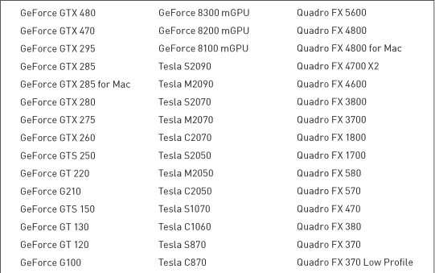
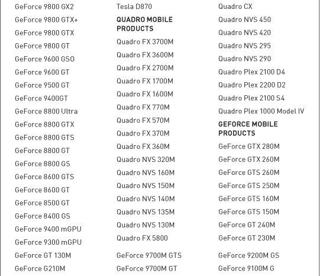
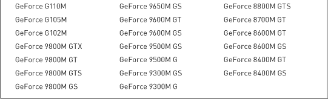
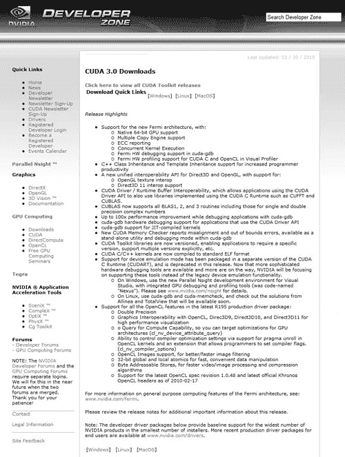

## 第二章：开始使用

我们希望第一章已经激发了你开始学习 CUDA C 的兴趣。由于本书旨在通过一系列代码示例教授你这门语言，你需要一个可以正常工作的开发环境。你当然可以站在旁边观看，但我们认为，如果你尽早动手并亲自实践编写 CUDA C 代码，你会玩得更开心，也能保持更长时间的兴趣。本章将向你介绍你开始使用所需的一些硬件和软件组件。好消息是，你可以免费获得所需的所有软件，这样你就可以把更多的钱花在你喜欢的事情上。

### 2.1 章节目标

在本章的过程中，你将完成以下任务：

• 你将通过本书下载所有必需的软件组件。

• 你将设置一个可以编写 CUDA C 代码的环境。

### 2.2 开发环境

在开始这段旅程之前，你需要设置一个可以使用 CUDA C 进行开发的环境。开发 CUDA C 代码的先决条件如下：

• 一个支持 CUDA 的图形处理器

• 一个 NVIDIA 设备驱动程序

• 一个 CUDA 开发工具包

• 一个标准的 C 编译器

为了使本章尽可能简单，我们将一步步讲解这些先决条件。

#### 2.2.1 支持 CUDA 的图形处理器

幸运的是，找到一个基于 CUDA 架构的图形处理器应该不难，因为自 2006 年 GeForce 8800 GTX 发布以来，每一款 NVIDIA GPU 都已支持 CUDA。由于 NVIDIA 定期发布基于 CUDA 架构的新 GPU，以下列出的显然只是支持 CUDA 的 GPU 的一部分。然而，这些 GPU 都是支持 CUDA 的。

若要查看完整列表，你应访问 NVIDIA 官网 [www.nvidia.com/cuda](http://www.nvidia.com/cuda)，尽管可以放心假设，所有 2007 年及之后发布的、具有超过 256MB 显存的 GPU 都能用于开发和运行使用 CUDA C 编写的代码。

***表 2.1*** 支持 CUDA 的 GPU

#### 2.2.2 NVIDIA 设备驱动程序

NVIDIA 提供的系统软件可以让你的程序与支持 CUDA 的硬件进行通信。如果你已经正确安装了 NVIDIA GPU，你的计算机上很可能已经安装了这些软件。确保你安装了最新的驱动程序总是无妨，因此我们建议你访问[www.nvidia.com/cuda](http://www.nvidia.com/cuda)并点击*下载驱动程序*链接。选择与显卡和操作系统匹配的选项。按照你选择的平台的安装说明进行操作后，你的系统将更新为最新的 NVIDIA 系统软件。

#### 2.2.3 CUDA 开发工具包

如果你有一块支持 CUDA 的 GPU 和 NVIDIA 的设备驱动程序，你就可以运行已编译的 CUDA C 代码。这意味着你可以下载基于 CUDA 的应用程序，它们能够成功地在你的图形处理器上执行代码。然而，我们假设你想做的不仅仅是运行代码，因为如果只是运行代码，这本书就没有必要存在了。如果你想使用 CUDA C 为 NVIDIA GPU *开发*代码，你将需要额外的软件。但如前所述，这些软件都不需要你花费一分钱。

在下一章中，你将学习这些细节，但由于你的 CUDA C 应用程序将同时在两个不同的处理器上进行计算，因此你需要两个编译器。一个编译器将为你的 GPU 编译代码，另一个将为你的 CPU 编译代码。NVIDIA 提供了针对 GPU 代码的编译器。与 NVIDIA 设备驱动程序一样，你可以在[`developer.nvidia.com/object/gpucomputing.html`](http://developer.nvidia.com/object/gpucomputing.html)下载*CUDA Toolkit*。点击 CUDA Toolkit 链接，进入如图 2.1 所示的下载页面。

***图 2.1*** CUDA 下载页面

你将再次被要求从 Windows XP、Windows Vista、Windows 7、Linux 和 Mac OS 的 32 位和 64 位版本中选择你的平台。在可用的下载中，你需要下载 CUDA Toolkit，以便构建本书中包含的代码示例。此外，尽管不是强制要求，你还可以下载 GPU 计算 SDK 代码示例包，其中包含大量有用的示例程序。GPU 计算 SDK 代码示例本书中不会涉及，但它们很好地补充了我们打算讲解的内容，正如学习任何编程风格一样，示例越多越好。你还需要注意，尽管本书中的几乎所有代码都能在 Linux、Windows 和 Mac OS 平台上运行，但我们将应用程序重点定位于 Linux 和 Windows。如果你使用的是 Mac OS X，你将面临一定风险，并使用不受支持的代码示例。

#### 2.2.4 标准 C 编译器

如我们所提到的，你将需要一个用于 GPU 代码的编译器和一个用于 CPU 代码的编译器。如果你按照前一节的建议下载并安装了 CUDA Toolkit，你已经拥有了 GPU 代码的编译器。现在唯一需要解决的就是 CPU 代码的编译器问题，这也是我们 CUDA 检查清单中剩下的最后一项，解决这个问题后我们就可以开始进入有趣的内容了。

##### Windows

在 Microsoft Windows 平台上，包括 Windows XP、Windows Vista、Windows Server 2008 和 Windows 7，我们推荐使用 Microsoft Visual Studio C 编译器。NVIDIA 目前支持 Visual Studio 2005 和 Visual Studio 2008 系列产品。随着 Microsoft 发布新版本，NVIDIA 可能会添加对新版 Visual Studio 的支持，同时停止对旧版本的支持。许多 C 和 C++开发人员已经在其机器上安装了 Visual Studio 2005 或 Visual Studio 2008，因此如果您也有这种情况，可以安全地跳过本小节。

如果您无法访问受支持版本的 Visual Studio，并且还没有准备好投资购买副本，Microsoft 在其网站上提供了免费的 Visual Studio 2008 Express 版下载。虽然通常不适合用于商业软件开发，但 Visual Studio Express 版是一个很好的开始开发 CUDA C 的方式，您无需在软件许可证上投入资金。因此，如果您需要 Visual Studio 2008，请访问[www.microsoft.com/visualstudio](http://www.microsoft.com/visualstudio)！

##### Linux

大多数 Linux 发行版通常会预装一个版本的 GNU C 编译器（`gcc`）。从 CUDA 3.0 开始，以下 Linux 发行版附带了支持的`gcc`版本：

• Red Hat Enterprise Linux 4.8

• Red Hat Enterprise Linux 5.3

• OpenSUSE 11.1

• SUSE Linux Enterprise Desktop 11

• Ubuntu 9.04

• Fedora 10

如果您是 Linux 的忠实用户，您可能已经意识到许多 Linux 软件包不仅仅在“受支持”的平台上运行。CUDA 工具包也不例外，因此即使您最喜欢的发行版没有列在这里，它也可能值得尝试。发行版的内核、`gcc`和`glibc`版本将在很大程度上决定该发行版是否兼容。

##### Macintosh OS X

如果您想在 Mac OS X 上进行开发，您需要确保您的机器至少安装了 Mac OS X 10.5.7 版本。这包括版本 10.6，Mac OS X “Snow Leopard”。此外，您需要通过下载并安装 Apple 的 Xcode 来安装`gcc`。此软件免费提供给 Apple Developer Connection (ADC)会员，并可以从[`developer.apple.com/tools/Xcode`](http://developer.apple.com/tools/Xcode)下载。本书中的代码是在 Linux 和 Windows 平台上开发的，但应该可以在 Mac OS X 系统上无需修改地运行。

### 2.3 章节回顾

如果您已经按照本章的步骤操作，您已经准备好开始在 CUDA C 中开发代码。也许您已经玩过从 NVIDIA 网站下载的一些 NVIDIA GPU 计算 SDK 代码示例。如果是这样，我们为您愿意进行尝试而鼓掌！如果没有，别担心，您需要的一切都在本书中。不管怎样，您可能已经准备好开始编写您的第一个 CUDA C 程序了，让我们开始吧。
