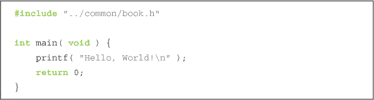
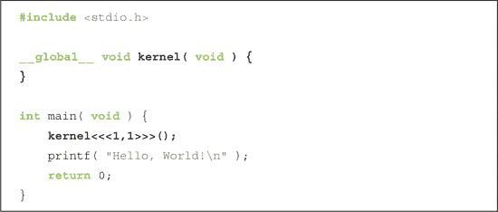
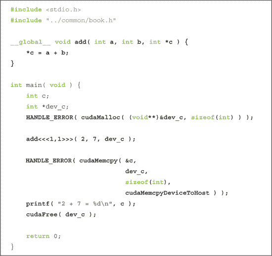
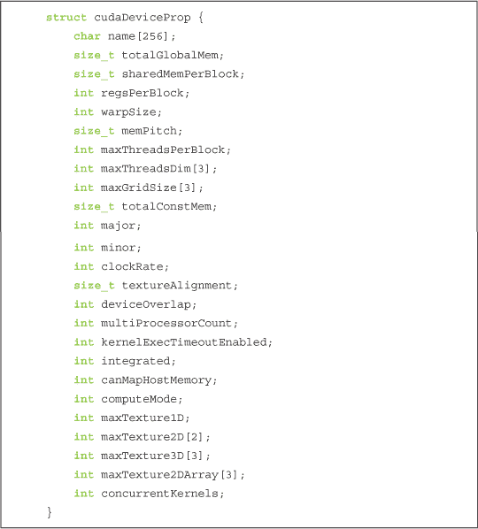
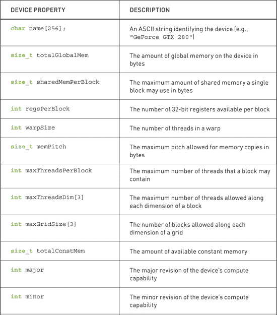
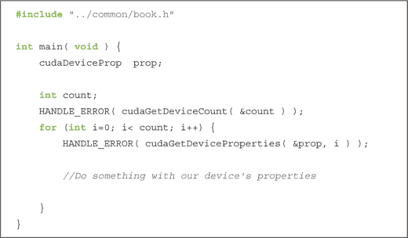
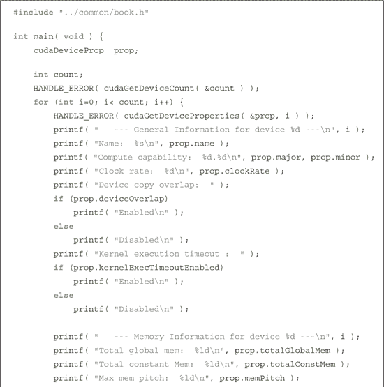
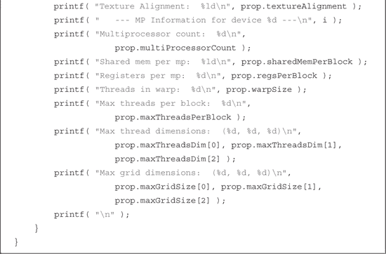
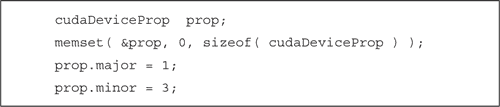
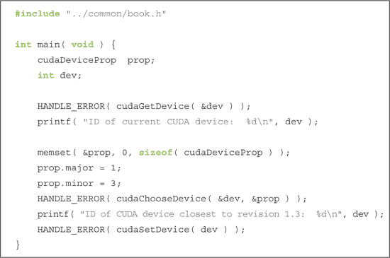

## 第三章：CUDA C 简介

如果你阅读了第一章，我们希望已经说服你，图形处理器的计算能力是巨大的，而且你正是那个可以利用它的程序员。如果你继续阅读了第二章，你应该已经设置好了一个功能完整的环境，能够编译和运行你将在 CUDA C 中编写的代码。如果你跳过了前几章，也许你只是在浏览代码示例，或者你随便翻到这一页时，刚好在书店里看到了，或者你迫不及待地想要开始了；没关系，我们不会告诉别人。不管怎样，你现在已经准备好开始编写第一个代码示例了，开始吧。

### 3.1 章节目标

在本章过程中，你将完成以下任务：

• 你将编写你的第一行 CUDA C 代码。

• 你将学习*主机*编写的代码和*设备*编写的代码之间的区别。

• 你将学习如何从主机运行设备代码。

• 你将学习如何在支持 CUDA 的设备上使用设备内存。

• 你将学习如何查询系统的

了解其 CUDA 支持设备的信息。

### 3.2 第一个程序

由于我们打算通过示例学习 CUDA C，让我们来看看第一个 CUDA C 示例。根据计算机编程的书面作品相关法律，我们从一个“Hello, World!”示例开始。

#### 3.2.1 Hello, World!

到此为止，你或许会想，这本书是否是个骗局。难道这只是 C 语言吗？CUDA C 到底存在吗？这些问题的答案都是肯定的；这本书并不是一个精心设计的骗局。这个简单的“Hello, World!”示例旨在说明，从最基本的角度看，CUDA C 与你已经习惯的标准 C 没有任何区别。

这个示例的简洁性源于它完全运行在*主机*上。书中将做出一个重要的区分：我们把 CPU 和系统内存称为*主机*，而把 GPU 和它的内存称为*设备*。这个示例几乎与你曾经编写的所有代码相似，因为它忽略了主机以外的任何计算设备。

为了避免你产生一种投资于一个昂贵而琐碎的集合的沮丧感，我们将逐步在这个简单的示例基础上进行扩展。让我们来看一个利用 GPU（*设备*）执行代码的例子。一个在设备上执行的函数通常称为*内核*。

#### 3.2.2 一个内核调用

现在，我们将在这个示例的基础上进行扩展，展示一些代码，这些代码看起来可能比我们平凡的“Hello, World!”程序更为陌生。

本程序对原始的“Hello, World!”示例做出了两个显著的扩展：

• 一个空函数，命名为`kernel()`，并用`__global__`修饰符标记

• 调用空函数，并用`<<<1,1>>>`装饰

正如我们在上一节中看到的，代码默认由系统的标准 C 编译器进行编译。例如，在 Linux 操作系统上，GNU `gcc`可能会编译你的主机代码，而在 Windows 系统上，Microsoft Visual C 则会编译它。NVIDIA 工具会将这些主机代码传递给编译器，其他一切行为与没有 CUDA 的世界中一样。

现在我们看到，CUDA C 在标准 C 中添加了`__global__`修饰符。这个机制会通知编译器某个函数应该被编译为在设备上运行，而不是在主机上运行。在这个简单的例子中，`nvcc`将函数`kernel()`交给处理设备代码的编译器，并将`main()`交给主机编译器，就像在前面的例子中一样。

那么，`kernel()`这个神秘的调用到底是什么，为什么我们必须用尖括号和数字元组来修改标准 C 代码？做好准备，因为魔法就在这里发生。

我们已经看到，CUDA C 需要一种语言方法来标记函数为设备代码。这没有什么特别的，它只是一种简写方式，将主机代码发送给一个编译器，将设备代码发送给另一个编译器。诀窍实际上是在从主机代码调用设备代码时。CUDA C 的一个好处是，它提供了这种语言集成，使得设备函数调用看起来非常像主机函数调用。稍后我们会讨论幕后发生的事情，但可以说，CUDA 编译器和运行时系统会处理从主机调用设备代码时的复杂工作。

这个看起来神秘的调用会激活设备代码，但为什么要用尖括号和数字呢？尖括号表示我们计划传递给运行时系统的参数。这些不是传递给设备代码的参数，而是会影响运行时如何启动设备代码的参数。我们将在下一章学习关于这些运行时参数的内容。传递给设备代码本身的参数会放在圆括号内，就像其他任何函数调用一样。

#### 3.2.3 参数传递

我们已经承诺可以向内核传递参数，现在是兑现这个承诺的时候了。请考虑以下我们“Hello, World!”应用的改进：

你会注意到这里有一些新行，但这些变化只引入了两个概念：

• 我们可以像调用任何 C 函数一样向内核传递参数。

• 我们需要分配内存才能在设备上执行任何有用的操作，例如将返回值传递给主机。

向内核传递参数并没有什么特别的。尽管有尖括号语法，内核调用的形式和行为完全与标准 C 中的任何函数调用相同。运行时系统会处理这些参数从主机到设备传递过程中的复杂性。

更有趣的新增功能是使用`cudaMalloc()`分配内存。这个调用与标准 C 语言的`malloc()`非常相似，但它告诉 CUDA 运行时在设备上分配内存。第一个参数是一个指向指针的指针，指向你希望保存新分配内存地址的变量，第二个参数是你希望分配的内存大小。除了分配的内存指针不是函数的返回值这一点外，这与`malloc()`的行为完全相同，甚至返回类型也是`void*`。环绕这些调用的`HANDLE_ERROR()`是我们作为本书支持代码的一部分提供的实用宏。它简单地检测调用是否返回错误，打印相关错误信息，并以`EXIT_FAILURE`代码退出应用程序。虽然你可以在自己的应用程序中使用这段代码，但在生产代码中，这种错误处理代码很可能是不足够的。

这引出了一个微妙但重要的点。CUDA C 的许多简洁性和强大功能源于能够模糊主机代码和设备代码之间的界限。然而，程序员有责任避免在主机代码中解引用`cudaMalloc()`返回的指针。主机代码可以传递这个指针，进行算术运算，甚至将其转换为其他类型。但你不能用它来读写内存。

不幸的是，编译器也无法保护你避免这个错误。它会很高兴地允许在主机代码中解引用设备指针，因为它看起来就像应用程序中的任何其他指针。我们可以总结出对设备指针使用的限制如下：

你*可以*将使用`cudaMalloc()`分配的指针传递给在设备上执行的函数。

你*可以*使用使用`cudaMalloc()`分配的指针在设备上执行的代码中读取或写入内存。

你*可以*将使用`cudaMalloc()`分配的指针传递给在主机上执行的函数。

你*不能*在主机上执行的代码中使用使用`cudaMalloc()`分配的指针来读取或写入内存。

如果你仔细阅读过，你可能已经预见到了下一个课程：我们不能使用标准 C 语言的`free()`函数来释放使用`cudaMalloc()`分配的内存。要释放使用`cudaMalloc()`分配的内存，我们需要调用`cudaFree()`，其行为与`free()`完全相同。

我们已经看到了如何使用主机来分配和释放设备上的内存，但我们也明确指出，无法从主机修改这块内存。示例程序中的剩余两行展示了两种访问设备内存的常见方法——通过在设备代码中使用设备指针和通过调用`cudaMemcpy()`。

我们在设备代码中使用指针的方式与在主机代码中运行的标准 C 语言中使用指针的方式完全相同。语句`*c = a + b`看起来就像它所表现的那样简单。它将参数`a`和`b`相加，并将结果存储在`c`指向的内存中。我们希望这几乎简单到连有趣都不算。

我们列出了可以在设备代码和主机代码中使用设备指针的方式以及不能使用的方式。当考虑主机指针时，这些警告与预期完全一致。虽然我们可以在设备代码中传递主机指针，但当我们试图使用主机指针在设备代码中访问内存时，就会遇到问题。总结来说，主机指针可以在主机代码中访问内存，设备指针可以在设备代码中访问内存。

正如承诺的那样，我们还可以通过从主机代码调用`cudaMemcpy()`来访问设备上的内存。这些调用的行为与标准 C 语言的`memcpy()`完全相同，只是多了一个额外的参数，用于指定源指针和目标指针中哪个指向设备内存。在此示例中，注意到`cudaMemcpy()`的最后一个参数是`cudaMemcpyDeviceToHost`，它指示运行时源指针是设备指针，目标指针是主机指针。

不出所料，`cudaMemcpyHostToDevice`表示相反的情况，即源数据在主机上，目标地址位于设备上。最后，我们甚至可以通过传递`cudaMemcpyDeviceToDevice`来指定*两个*指针都在设备上。如果源指针和目标指针都在主机上，我们只需使用标准 C 语言的`memcpy()`例程在它们之间复制。

### 3.3 查询设备

由于我们希望在设备上分配内存并执行代码，如果我们的程序能够知道设备具有多少内存以及哪些能力，将会非常有用。此外，对于每台计算机有多个支持 CUDA 的设备是相对常见的。在这种情况下，我们肯定需要一种方法来确定哪个处理器是哪一个。

例如，许多主板配备了集成的 NVIDIA 图形处理器。当制造商或用户为该计算机添加独立的图形处理器时，它就拥有了两个支持 CUDA 的处理器。一些 NVIDIA 产品，如 GeForce GTX 295，配备了两颗 GPU 在一张卡上。包含此类产品的计算机也会显示两个支持 CUDA 的处理器。

在我们深入编写设备代码之前，我们希望有一种机制来确定系统中存在哪些设备（如果有的话），以及每个设备支持哪些功能。幸运的是，有一个非常简单的接口可以用来获取这些信息。首先，我们想知道系统中有多少设备是基于 CUDA 架构构建的。这些设备能够执行用 CUDA C 编写的内核。为了获取 CUDA 设备的数量，我们调用`cudaGetDeviceCount()`。不用说，我们期待因此获得“最具创意函数名奖”。

在调用`cudaGetDeviceCount()`之后，我们可以遍历设备，并查询每个设备的相关信息。CUDA 运行时将这些属性返回给我们，以`cudaDeviceProp`类型的结构体表示。我们可以检索哪些类型的属性？截至 CUDA 3.0，`cudaDeviceProp`结构包含以下内容：

其中一些是显而易见的；其他则需要一些额外的描述（请参见表 3.1）。

***表 3.1*** CUDA 设备属性

我们希望避免过快地深入探讨这个话题，因此现在不会详细讲解这些属性。事实上，前面的列表遗漏了一些关于这些属性的重要细节，所以你需要查阅*NVIDIA CUDA 参考手册*以获取更多信息。当你开始编写自己的应用程序时，这些属性将非常有用。然而，目前我们只展示如何查询每个设备并报告其属性。到目前为止，我们的设备查询看起来是这样的：

现在我们知道了可用的各个字段，我们可以扩展模糊的“执行某些操作...”部分，实施一个略微不那么琐碎的操作：

### 3.4 使用设备属性

除了编写一个方便的应用程序，打印出每个 CUDA 兼容卡的每个细节外，我们为什么要关注系统中每个设备的属性呢？由于我们作为软件开发人员希望每个人都认为我们的软件非常快，我们可能会对选择拥有最多多处理器的 GPU 来运行我们的代码感兴趣。或者，如果内核需要与 CPU 紧密交互，我们可能会对在与 CPU 共享系统内存的集成 GPU 上运行代码感兴趣。这些都是我们可以通过`cudaGetDeviceProperties()`查询的属性。

假设我们正在编写一个依赖于双精度浮点支持的应用程序。通过快速查阅《*NVIDIA CUDA 编程指南*》的附录 A，我们知道计算能力为 1.3 或更高的卡支持双精度浮点运算。因此，为了成功运行我们编写的双精度应用程序，我们需要找到至少一块计算能力为 1.3 或更高的设备。

基于我们从`cudaGetDeviceCount()`和`cudaGetDeviceProperties()`中得到的信息，我们可以遍历每个设备，查找一个主版本大于 1 或者主版本为 1 且次版本大于等于 3 的设备。但由于这种相对常见的操作也相对麻烦，CUDA 运行时为我们提供了一种自动化的方法来完成这项任务。我们首先填写一个`cudaDeviceProp`结构体，指定我们需要设备具备的属性。

在填写完`cudaDeviceProp`结构体后，我们将其传递给`cudaChooseDevice()`，让 CUDA 运行时找到一个满足该约束的设备。调用`cudaChooseDevice()`会返回一个设备 ID，然后我们可以将其传递给`cudaSetDevice()`。从此以后，所有的设备操作将会在我们在`cudaChooseDevice()`中找到的设备上进行。

多 GPU 系统变得越来越常见。例如，许多 NVIDIA 的主板芯片组都包含集成的 CUDA 支持 GPU。当向这些系统中添加独立 GPU 时，你便拥有了一个多 GPU 平台。此外，NVIDIA 的 SLI 技术允许多个独立 GPU 并排安装。在这些情况下，你的应用程序可能会偏好某一个 GPU。如果你的应用程序依赖于 GPU 的某些功能，或者依赖于拥有系统中最快的 GPU，你应该了解这个 API，因为 CUDA 运行时无法保证为你的应用程序选择最合适或最快的 GPU。

### 3.5 章节回顾

我们终于开始动手编写 CUDA C 代码了，理想情况下，这应该比你想象的更加顺利。基本上，CUDA C 是标准 C 语言的扩展，通过一些装饰性修改，使得我们能够指定哪些代码应该在设备上运行，哪些代码应该在主机上运行。通过在函数前加上`__global__`关键字，我们告诉编译器该函数应该在 GPU 上运行。为了使用 GPU 的专用内存，我们还学习了一个类似于 C 语言中的`malloc()`、`memcpy()`和`free()`的 CUDA API。这些函数的 CUDA 版本，`cudaMalloc()`、`cudaMemcpy()`和`cudaFree()`，使我们能够分配设备内存、在设备和主机之间复制数据，并在完成后释放设备内存。

随着我们逐步深入本书，我们将看到更多有趣的例子，展示如何有效地将设备作为一个大规模并行协处理器。现在，您应该了解开始使用 CUDA C 是多么简单，在下一章中，我们将看到如何轻松地在 GPU 上执行并行代码。
