## 第四章：CUDA C 中的并行编程

在上一章中，我们看到如何简单地编写在 GPU 上执行的代码。我们甚至学习了如何将两个数字相加，尽管只是数字 2 和 7。老实说，这个例子并没有太多的震撼力，也不算特别有趣。但我们希望你已经确信，开始使用 CUDA C 是很容易的，并且你会激动于学习更多内容。GPU 计算的巨大潜力之一就是利用许多问题的海量并行结构。在这个背景下，我们打算在本章中探讨如何使用 CUDA C 在 GPU 上执行并行代码。

### 4.1 本章目标

在本章过程中，你将完成以下任务：

• 你将学习 CUDA 如何暴露其并行性的一种基本方式。

• 你将编写你的第一个 CUDA C 并行代码。

### 4.2 CUDA 并行编程

之前，我们已经看到，如何让标准 C 函数在设备上运行是多么容易。通过给函数添加`__global__`修饰符，并使用特殊的尖括号语法调用它，我们可以在 GPU 上执行该函数。尽管这非常简单，但也极为低效，因为 NVIDIA 的硬件工程师们已经优化了他们的图形处理器，使得其能够并行执行数百次计算。然而，到目前为止，我们所做的只是启动了一个在 GPU 上串行执行的内核。在本章中，我们将看到如何轻松启动一个在设备上并行执行计算的内核。

#### 4.2.1 向量求和

我们将设计一个简单的示例来说明线程以及我们如何使用它们在 CUDA C 中编程。假设有两个数字列表，我们希望对每个列表的对应元素求和，并将结果存储在第三个列表中。图 4.1 展示了这个过程。如果你有线性代数的背景，你会认识到这个操作就是求两个向量的和。

***图 4.1*** 两个向量的求和

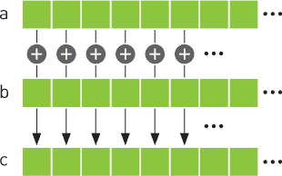

##### CPU 向量求和

首先，我们将通过传统的 C 代码来看一下如何完成这个加法操作：

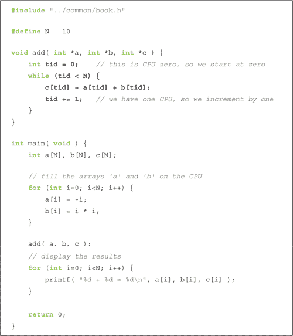

这个示例中的大部分内容几乎不需要解释，但我们将简要看一下`add()`函数，来说明为什么我们将其写得过于复杂。

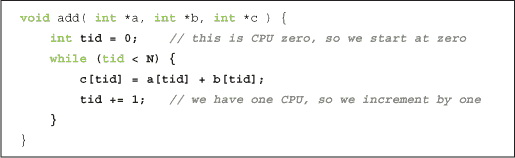

我们在一个`while`循环中计算和，其中索引`tid`的范围从`0`到`N-1`。我们将`a[]`和`b[]`的对应元素相加，并将结果放入`c[]`的相应元素中。通常情况下，代码写法会稍微简化一些，如下所示：

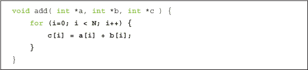

我们略显复杂的方法旨在建议一种可能的方式，用于在具有多个 CPU 或 CPU 核心的系统上并行化代码。例如，在一个双核处理器上，可以将增量改为 2，并让一个核心以`tid = 0`初始化循环，另一个核心以`tid = 1`初始化。第一个核心将加和偶数索引的元素，第二个核心将加和奇数索引的元素。这相当于在每个 CPU 核心上执行以下代码：

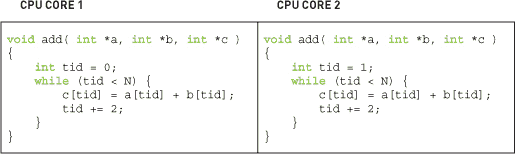

当然，在 CPU 上执行这项任务将需要比我们在这个示例中包含的更多的代码。你需要提供一定的基础设施来创建执行`add()`函数的工作线程，并假设每个线程都能并行执行，这个调度假设遗憾的是并不总是成立的。

##### GPU 向量求和

我们可以通过将`add()`编写为设备函数，在 GPU 上非常相似地完成相同的加法。这应该和你在上一章看到的代码类似。但在查看设备代码之前，我们先展示`main()`。尽管 GPU 版本的`main()`与相应的 CPU 版本不同，但这里的内容不应该显得陌生：

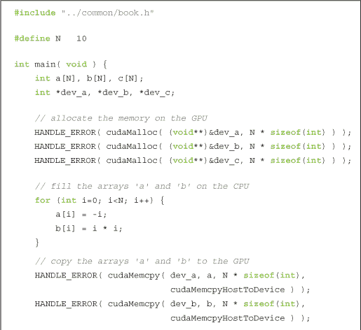

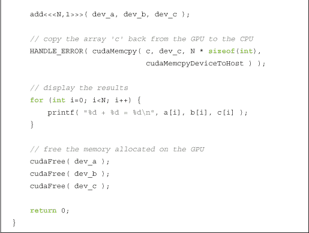

你会注意到我们再次采用了一些常见的模式：

• 我们使用`cudaMalloc()`调用在设备上分配了三个数组：两个数组`dev_a`和`dev_b`用于存放输入，一个数组`dev_c`用于存放结果。

• 因为我们是环保的程序员，我们用`cudaFree()`清理了自己使用过的资源。

• 使用`cudaMemcpy()`，我们将输入数据通过参数`cudaMemcpyHostToDevice`复制到设备，将结果数据通过`cudaMemcpyDeviceToHost`复制回主机。

• 我们使用三重尖括号语法，从主机代码`main()`中执行设备代码`add()`。

顺便提一下，你可能会想知道为什么我们在 CPU 上填充输入数组。其实并没有特别的理由必须这么做。实际上，如果我们在 GPU 上填充数组，这一步的性能会更快。但我们意在展示如何在图形处理器上实现一个特定的操作，即两个向量的加法。因此，我们要求你想象这只是一个更大应用中的一步，其中输入数组`a[]`和`b[]`已经由其他算法生成或由用户从硬盘加载。总之，可以假装这些数据是凭空出现的，现在我们需要对其进行处理。

接下来，我们的`add()`例程看起来与其对应的 CPU 实现相似：

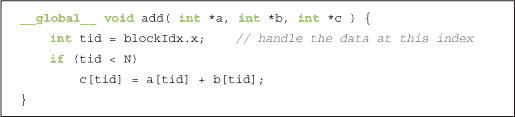

再次，我们看到函数`add()`中的常见模式：

• 我们编写了一个名为`add()`的函数，它在设备上执行。我们通过将`__global__`限定符添加到函数名中来实现这一点。

到目前为止，这个例子没有什么新奇的地方，除了它能做的不仅仅是加法 2 和 7。然而，这个例子中*有*两个值得注意的部分：三重角括号中的参数和内核代码本身引入了新的概念。

到目前为止，我们总是看到以以下形式启动的内核：

kernel<<<1,1>>>( param1, param2, . . . );

但在这个例子中，我们启动时使用了角括号中的一个数字，而不是 1：

add<<<N,1>>>( dev _ a, dev _ b, dev _ c );

怎么回事？

回想一下，我们将角括号中的两个数字留未解释；我们模糊地说它们是描述如何启动内核的运行时参数。那么，这些参数中的第一个数字表示我们希望设备在多少个并行块中执行我们的内核。在这种情况下，我们传递了`N`的值作为这个参数。

例如，如果我们使用`kernel<<<2,1>>>()`来启动，你可以想象运行时创建两个内核副本并将它们并行运行。我们将每一个并行调用称为*块*。使用`kernel<<<256,1>>>()`，你将得到 256 个*块*在 GPU 上运行。并行编程从未如此简单。

但这引出了一个很好的问题：GPU 运行`N`个内核代码副本，但我们如何从代码中判断当前是哪个块在运行呢？这个问题引出了例子中的第二个新特性——内核代码本身。具体来说，它引出了变量`blockIdx.x`：

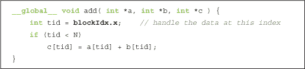

乍一看，这个变量似乎会在编译时引发语法错误，因为我们用它来赋值给`tid`，但我们从未定义过它。然而，不需要定义`blockIdx`变量；这是 CUDA 运行时为我们定义的内置变量之一。此外，我们用这个变量正是它字面意思的用途。它包含当前运行设备代码的块的索引值。

那么，你可能会问，为什么不是简单的`blockIdx`呢？为什么是`blockIdx.x`？事实上，CUDA C 允许你在二维中定义一组块。对于二维域的问题，例如矩阵运算或图像处理，使用二维索引通常更方便，避免了从一维到二维的繁琐转换。如果你不熟悉这些问题类型，也不用担心；只要知道，在某些情况下，使用二维索引比使用一维索引更为方便。但你*不必*使用它。我们不会介意的。

当我们启动内核时，我们指定了 `N` 作为并行块的数量。我们将并行块的集合称为 *网格*。这向运行时系统指定我们希望有一个由 `N` 个块组成的单维 *网格*（标量值被解释为一维）。这些线程将具有不同的 `blockIdx.x` 值，第一个为 0，最后一个为 `N-1`。所以，想象四个块，它们都在通过同一份设备代码运行，但 `blockIdx.x` 变量的值不同。这就是在运行时将适当的块索引替换为 `blockIdx.x` 后，每个并行块中实际执行的代码：

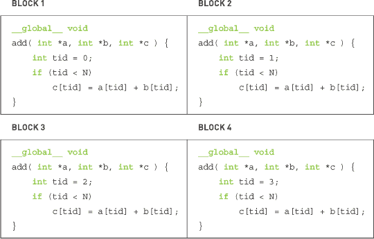

如果你还记得我们开始时提到的基于 CPU 的示例，你会记得我们需要遍历从 0 到 `N-1` 的索引来求和两个向量。由于运行时系统已经启动了一个内核，其中每个块都有一个这些索引之一，几乎所有的工作都已经为我们完成了。因为我们有点懒，这对我们来说是件好事。这让我们有更多时间去写博客，可能还会写关于我们有多懒的内容。

最后一个需要解答的问题是，为什么我们要检查 `tid` 是否小于 `N`？它 *应该* 始终小于 `N`，因为我们特意启动了内核，以确保这个假设成立。但我们懒惰的本性也让我们对别人破坏我们代码中的假设产生了疑虑。破坏代码假设意味着代码出错。这会导致 bug 报告、追踪坏行为的漫长夜晚，以及通常会阻碍我们继续写博客的各种活动。如果我们没有检查 `tid` 是否小于 `N`，并且随后访问了不属于我们的内存，那将是很糟糕的。实际上，这甚至可能会导致内核执行中止，因为 GPU 具有复杂的内存管理单元，它们会终止看似违反内存规则的进程。

如果你遇到刚才提到的问题，我们在代码中到处撒下的 `HANDLE_ERROR()` 宏将会检测并提醒你这种情况。和传统的 C 编程一样，教训在于函数返回错误码是有原因的。虽然我们总是很想忽略这些错误码，但我们希望通过敦促你 *检查每个可能失败操作的结果*，来帮你避免经历 *我们* 曾经遭受过的痛苦时光。像往常一样，这些错误的存在不会阻止你继续执行应用程序，但它们肯定会在后续造成各种不可预测和不愉快的副作用。

此时，你正在 GPU 上并行运行代码。或许你曾听说过这很棘手，或者你必须了解计算机图形学才能在图形处理器上进行通用编程。我们希望你已经开始看到 CUDA C 如何让你更容易开始编写 GPU 上的并行代码。我们使用的示例仅仅是对长度为 10 的向量求和。如果你想看看如何轻松生成一个大规模并行应用程序，可以尝试将`#define N 10`中的 10 改为 10000 或 50000，来启动成千上万的并行块。不过请注意：你启动的块的任何维度不得超过 65,535。这是硬件强加的限制，因此如果你尝试启动更多的块，你将看到失败。在下一章中，我们将看到如何在这个限制内工作。

#### 4.2.2 一个有趣的示例

我们并不是说加法向量不有趣，但以下示例将满足那些寻找并行 CUDA C 的炫酷示例的人。

以下示例将展示绘制朱利亚集合切片的代码。对于没有接触过的人来说，朱利亚集合是某些复数函数的边界。毫无疑问，这听起来比向量加法和矩阵乘法还要无趣。然而，对于几乎所有函数参数的值，这个边界都会形成一个分形，它是数学中最有趣和最美丽的奇观之一。

生成这样的集合所涉及的计算非常简单。朱利亚集合的核心是对复平面上的点进行简单的迭代方程求解。如果迭代过程对某个点发散，则该点*不*在集合中。也就是说，如果通过迭代方程产生的值序列趋向无穷大，则该点被认为*在集合外*。相反，如果方程的值保持有界，则该点*在集合内*。

从计算角度来看，所涉及的迭代方程非常简单，如方程 4.1 所示。

***方程 4.1***

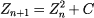

因此，计算方程 4.1 的迭代涉及将当前值平方并加上常数，从而得到方程的下一个值。

##### CPU 朱利亚集合

我们将现在查看一个源代码清单，它将计算并可视化朱利亚集合。由于这是一个比我们到目前为止所研究的程序更为复杂的程序，我们将在这里将它分成几部分。稍后在本章中，你将看到完整的源代码清单。

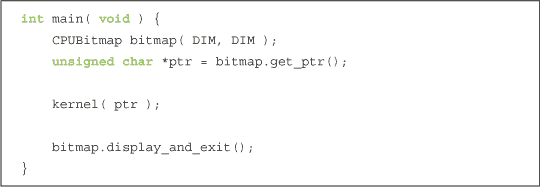

我们的主程序非常简单。它使用提供的实用库创建适当大小的位图图像。接下来，它将指向位图数据的指针传递给内核函数。

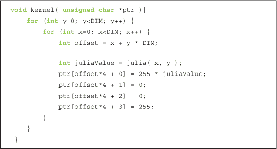

计算内核只不过是遍历我们关心的所有渲染点，对每个点调用`julia()`函数，以确定其是否属于朱利亚集。如果点在集合中，`julia()`函数返回 1，如果不在集合中，则返回 0。当`julia()`返回 1 时，我们将该点的颜色设置为红色，当返回 0 时设置为黑色。这些颜色是任意的，你可以自由选择符合个人审美的配色方案。

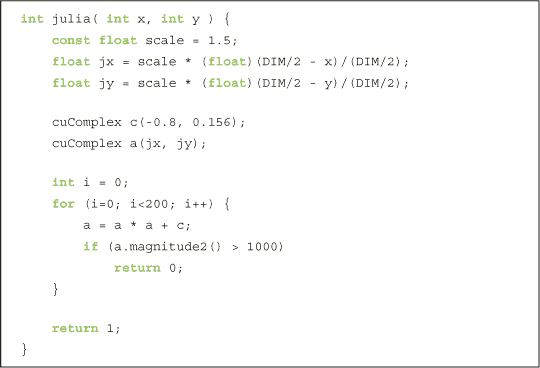

这个函数是示例的核心部分。我们首先将像素坐标转换为复数空间中的坐标。为了使复平面以图像中心为中心，我们将其平移`DIM/2`。然后，为了确保图像跨越-1.0 到 1.0 的范围，我们将图像坐标缩放为`DIM/2`。因此，给定一个图像点`(x, y)`，我们得到复数空间中的点`((DIM/2 - x) / (DIM/2), ((DIM/2 - y) / (DIM/2)))`。

然后，为了可能进行缩放，我们引入了一个`scale`因子。目前，缩放因子被硬编码为 1.5，但你应该调整这个参数来放大或缩小。如果你很有雄心壮志，还可以将其作为命令行参数进行调整。

在获得复数空间中的点之后，我们需要判断该点是否在朱利亚集内。如果你回顾上一节内容，我们通过计算迭代方程 Z[n+1] = z[n]² + C 的值来判断。由于 C 是一个任意的复数常数，我们选择了`-0.8 + 0.156i`，因为它恰好能产生有趣的图像。如果你想看到朱利亚集的其他版本，可以尝试修改这个常数。

在这个示例中，我们计算了该函数的 200 次迭代。每次迭代后，我们检查结果的幅度是否超过某个阈值（对于我们的目的，设定为 1,000）。如果超过，则方程发散，我们可以返回 0，表示该点*不*在集合内。另一方面，如果我们完成所有 200 次迭代且幅度仍然在 1,000 以内，我们认为该点在集合中，并返回 1 给调用者`kernel()`。

由于所有计算都在复数上执行，我们定义了一个通用结构来存储复数。

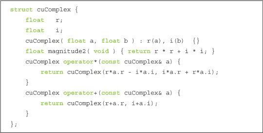

该结构表示复数，包含两个数据元素：单精度实部`r`和单精度虚部`i`。该结构定义了加法和乘法运算符，用于按预期合并复数。（如果你对复数完全不熟悉，可以在线查找快速入门资料。）最后，我们定义了一个方法，返回复数的幅度。

##### GPU 朱利亚集

设备实现与 CPU 版本非常相似，延续了你可能已经注意到的趋势。

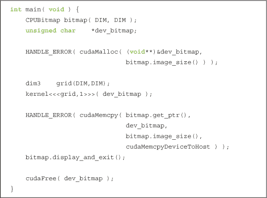

这个版本的`main()`看起来比 CPU 版本复杂得多，但流程实际上是相同的。和 CPU 版本一样，我们使用我们的工具库创建一个`DIM` x `DIM` 的位图图像。但因为我们将在 GPU 上进行计算，我们还声明了一个名为`dev_bitmap`的指针，用于保存设备上的数据副本。为了存储数据，我们需要使用`cudaMalloc()`来分配内存。

然后我们像在 CPU 版本中一样运行我们的`kernel()`函数，尽管现在它是一个`__global__`函数，意味着它将在 GPU 上运行。与 CPU 版本一样，我们将之前行中分配的指针传递给`kernel()`以存储结果。唯一的区别是，内存现在位于 GPU 上，而不是主机系统上。

最显著的区别是我们指定了多少个并行块来执行`kernel()`函数。由于每个点可以独立于其他点进行计算，我们只需为每个要计算的点指定一个函数副本。我们提到过，对于某些问题领域，使用二维索引是有帮助的。毫不奇怪，在诸如复数平面这样的二维领域上计算函数值正是这些问题之一。因此，我们在这一行中指定了一个二维的块网格：

dim3 grid(DIM,DIM);

类型`dim3`并不是标准的 C 类型，以防你担心自己错过了什么重要的信息。实际上，CUDA 运行时头文件定义了一些方便的类型来封装多维元组。类型`dim3`表示一个三维元组，将用于指定我们启动的大小。但为什么我们要使用三维值，而我们明明已经明确表示启动是一个*二维*网格呢？

坦率地说，我们这么做是因为三维的`dim3`值是 CUDA 运行时所期望的。虽然当前不支持三维启动网格，但 CUDA 运行时仍然期望一个`dim3`变量，其中最后一个分量等于 1。当我们仅用两个值来初始化它，如在`dim3 grid(DIM,DIM)`语句中所做的那样，CUDA 运行时会自动将第三维填充为 1，因此这里的一切都会按预期工作。尽管未来 NVIDIA 可能会支持三维网格，但目前我们只是顺应内核启动 API，因为当程序员与 API 对抗时，API 总是会胜利。

然后我们将我们的`dim3`变量`grid`传递给 CUDA 运行时，如下行所示：

kernel<<<grid,1>>>( dev _ bitmap );

最后，结果存在设备上的一个后果是，在执行`kernel()`之后，我们必须将结果复制回主机。如同我们在之前的章节中学到的，我们通过调用`cudaMemcpy()`来实现这一点，并将方向`cudaMemcpyDeviceToHost`作为最后一个参数。

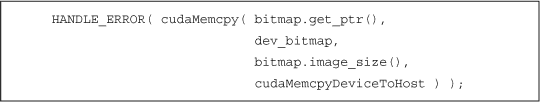

实现上的最后一个差异出现在`kernel()`的实现中。

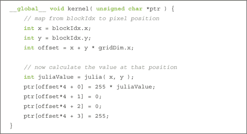

首先，我们需要将`kernel()`声明为`__global__`函数，这样它就能在设备上运行，但可以从主机调用。与 CPU 版本不同，我们不再需要嵌套的`for()`循环来生成传递给`julia()`的像素索引。与向量加法示例类似，CUDA 运行时为我们生成了这些索引，并存储在变量`blockIdx`中。这是可行的，因为我们声明了网格块的维度与我们的图像相同，所以我们为从`(0,0)`到`(DIM-1,DIM-1)`的每一对整数`(x,y)`获取一个块。

接下来，我们唯一需要的附加信息是指向输出缓冲区`ptr`的线性偏移量。这个偏移量通过另一个内置变量`gridDim`计算得出。该变量在所有块中都是常量，简单地保存了启动的网格的维度。在本例中，它的值将始终是`(DIM, DIM)`。因此，将行索引乘以网格宽度并加上列索引，就能为我们提供一个唯一的索引，指向`ptr`，该索引的范围从`0`到`(DIM*DIM-1)`。

最后，我们来看看确定一个点是否在朱利亚集内的实际代码。这段代码应该与 CPU 版本相同，继续了我们在许多示例中看到的趋势。

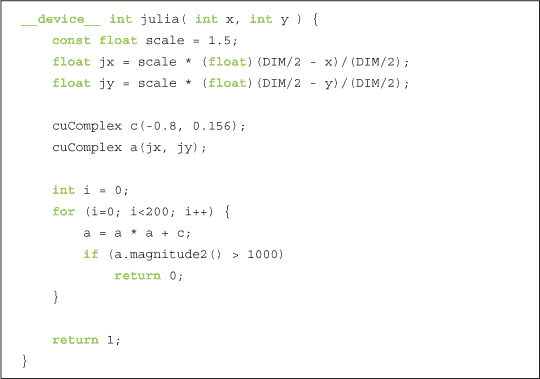

再次，我们定义了一个`cuComplex`结构体，它定义了存储具有单精度浮点分量的复数的方法。该结构体还定义了加法和乘法运算符，以及一个返回复数值幅度的函数。

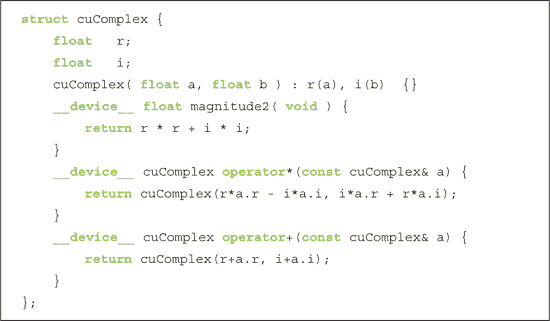

请注意，我们在 CUDA C 中使用了与 CPU 版本相同的语言结构。唯一的区别是限定符`__device__`，它表示这段代码将在 GPU 上运行，而不是在主机上运行。回想一下，由于这些函数被声明为`__device__`函数，它们只能从其他`__device__`函数或`__global__`函数中调用。

由于我们在代码中插入了大量注释，下面是从头到尾的完整源代码：

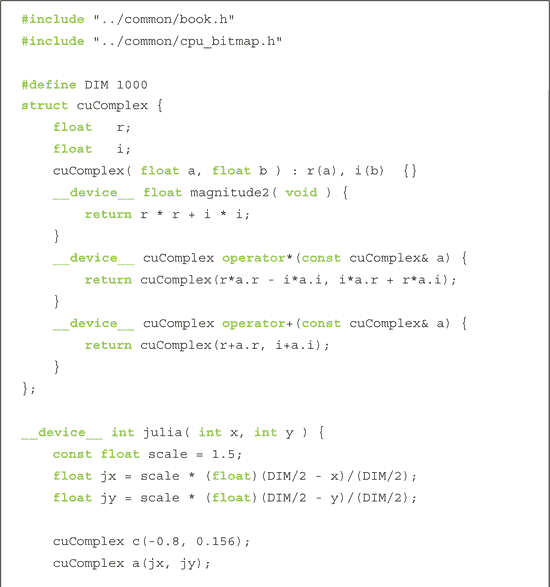

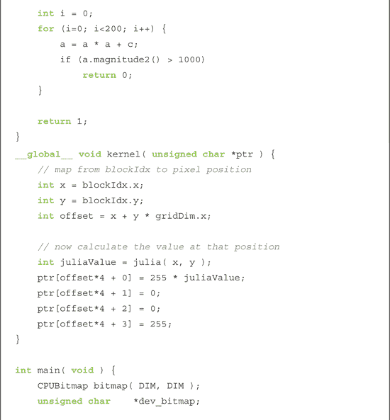

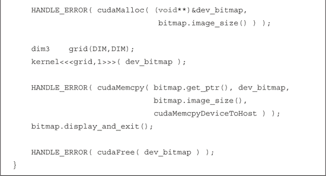

当你运行这个应用程序时，你应该会看到朱利亚集的可视化图像。为了让你相信它确实配得上“一个有趣的示例”这一称号， 图 4.2 展示了从这个应用程序中截取的屏幕截图。

***图 4.2*** GPU 朱利亚集应用程序的屏幕截图

### 4.3 章节回顾

恭喜你，现在你可以在图形处理器上编写、编译和运行大规模并行代码了！你应该去跟你的朋友炫耀一下。如果他们仍然误以为 GPU 计算是异域的，且难以掌握，那么他们会感到非常震惊。你完成这项任务的轻松程度将是我们的秘密。如果他们是你信任的人，建议他们也买一本这本书。

到目前为止，我们已经了解了如何指示 CUDA 运行时在我们所称为*块*的地方并行执行程序的多个副本。我们将启动在 GPU 上的块集合称为*网格*。正如名字所暗示的，网格可以是一个一维或二维的块集合。每个内核副本可以通过内置变量`blockIdx`确定它正在执行哪个块。同样，它可以使用内置变量`gridDim`来确定网格的大小。我们内核中的这两个内置变量在计算每个块负责的数据索引时都非常有用。
