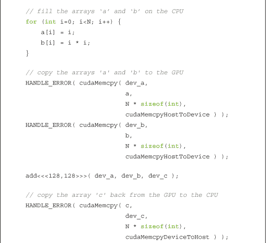
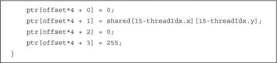

## **第五章 线程协作**

现在我们已经编写了第一个使用 CUDA C 的程序，并且已经了解了如何编写可以在 GPU 上并行执行的代码。这是一个非常好的开始！但可以说，并行编程中最重要的组件之一就是并行处理单元如何协作解决问题。很少有问题可以让每个处理器独立计算结果并终止执行，而不考虑其他处理器在做什么。对于即使是稍微复杂的算法，我们也需要并行代码的副本进行通信与协作。到目前为止，我们还没有看到任何机制可以完成在并行执行的 CUDA C 代码部分之间的通信。幸运的是，存在一个解决方案，我们将在本章开始探索它。

### **5.1 章节目标**

在本章中，您将完成以下内容：

• 您将学习 CUDA C 中所称的*线程*。

• 您将学习不同线程之间如何进行通信的机制。

• 您将学习同步不同线程并行执行的机制。

### **5.2 拆分并行块**

在上一章中，我们研究了如何在 GPU 上启动并行代码。我们通过指示 CUDA 运行时系统启动多少个并行副本来完成这项工作。我们称这些并行副本为*块*。

CUDA 运行时允许这些块被拆分为*线程*。回想一下，当我们启动多个并行块时，我们将尖括号中的第一个参数从 1 更改为我们希望启动的块数。例如，在学习向量加法时，我们为向量中每个元素启动一个块，代码如下：

add<<<N,1>>>( dev_a, dev_b, dev_c );

在尖括号内，第二个参数实际上表示 CUDA 运行时系统需要为我们创建的每个块的线程数。到目前为止，我们每个块只启动了一个线程。在之前的示例中，我们启动了如下代码：

N 块 x 1 线程/块 = N 个并行线程

所以实际上，我们本可以启动 `N/2` 块，每块两个线程，`N/4` 块，每块四个线程，依此类推。让我们利用关于 CUDA C 能力的新信息重新审视我们的向量加法示例。

#### **5.2.1 向量求和：Redux**

我们努力完成与上一章相同的任务。也就是说，我们想要将两个输入向量的和存储在第三个输出向量中。然而，这次我们将使用线程而不是块来完成这个任务。

你可能会想，为什么使用线程而不是块有什么优势呢？好吧，目前为止，并没有值得讨论的优势。但在一个块内的并行线程将能够做一些并行块无法做到的事情。所以暂时，请耐心等待，随着我们逐步讲解如何将上一章的并行块示例转换为并行线程版本。

##### **使用线程的 GPU 向量求和**

我们将首先处理从并行块转换为并行线程时需要注意的两个更改。我们的内核调用将从启动`N`个线程块（每个线程块只有一个线程）更改为：

add<<<N,1>>>( dev_a, dev_b, dev_c );

转换为启动`N`个线程（都在一个块内）的版本：

add<<<1,N>>>( dev_a, dev_b, dev_c );

唯一的其他变化出现在我们对数据进行索引的方法上。之前，在我们的内核中，我们是通过块索引来索引输入和输出数据。

这里的重点应该不会让你感到惊讶。现在我们只有一个块，我们必须通过线程索引来索引数据。

这两项更改是将并行块实现转换为并行线程实现所需的唯一更改。为完整起见，下面是包含更改行（加粗）的整个源代码清单：

这很简单，对吧？在接下来的部分，我们将看到这种仅使用线程的方法的一些局限性。当然，稍后我们会看到为什么我们要将块拆分为其他并行组件。

##### **GPU 长向量的求和**

在上一章中，我们提到硬件限制了单次启动中的块数量为 65,535。类似地，硬件限制了每个块内的线程数，这是我们可以启动内核的线程数。具体来说，这个数量不能超过我们在第三章中查看的设备属性结构的`maxThreadsPerBlock`字段指定的值。对于当前可用的许多图形处理器，这个限制是每块 512 个线程，那么我们如何使用基于线程的方法来加法计算两个大于 512 大小的向量呢？我们将不得不结合使用线程和块来完成此任务。

与以前一样，这将需要两项更改：我们将需要更改内核中的索引计算，并且还需要更改内核启动本身。

现在我们有了多个块和线程，索引将开始类似于从二维索引空间转换为线性空间的标准方法。

这个作业使用了一个新的内建变量`blockDim`。这个变量是所有块的常量，并存储每个维度上线程的数量。由于我们使用的是一维块，所以我们只关注`blockDim.x`。如果你还记得，`gridDim`存储了类似的值，但它存储的是整个网格在每个维度上的块数量。此外，`gridDim`是二维的，而`blockDim`实际上是三维的。也就是说，CUDA 运行时允许你启动一个二维网格的块，每个块是一个三维的线程数组。是的，这确实是很多维度，虽然你不太可能经常需要使用这五个索引自由度，但如果需要，它们是可以使用的。

使用之前的作业在一维数组中对数据进行索引实际上是非常直观的。如果你不同意，可以试着从空间的角度考虑你的线程块集合，类似于一个二维像素数组。我们在图 5.1 中展示了这种排列方式。

***图 5.1*** 一种二维排列的线程块和线程集合

如果线程代表列，块代表行，我们可以通过将块索引与每块中的线程数相乘，再加上块内线程的索引，得到一个唯一的索引。这与我们在朱利亚集合例子中线性化二维图像索引的方法相同。

在这里，`DIM`是块的维度（以线程为单位），`y`是块索引，`x`是块内线程的索引。因此，我们得到了索引：`tid = threadIdx.x + blockIdx.x * blockDim.x`。

另一个变化是内核启动本身。我们仍然需要启动`N`个并行线程，但我们希望它们能够跨多个块启动，以避免达到 512 线程的限制。一个解决方法是将块大小任意设置为某个固定数量的线程；在这个例子中，我们设定每个块 128 个线程。然后，我们可以启动`N/128`个块，以运行我们总共的`N`个线程。

这里的难点在于`N/128`是一个整数除法。这意味着如果`N`是 127，`N/128`将是零，而如果我们启动零个线程，实际上什么都不会计算。实际上，每当`N`不是 128 的精确倍数时，我们将启动过少的线程。这很糟糕。我们实际上希望这个除法能够向上取整。

有一个常见的技巧可以在整数除法中实现这一点，而不调用`ceil()`。我们实际上计算的是`(N+127)/128`，而不是`N/128`。你可以相信我们，这将计算出大于或等于`N`的最小 128 的倍数，或者你现在可以花点时间来验证这个事实。

我们选择了每个块 128 个线程，因此使用以下内核启动：

由于我们修改了除法操作以确保启动足够的线程，因此当 `N` 不是 128 的整数倍时，我们实际上会启动*过多*的线程。不过，这个问题有一个简单的解决办法，我们的内核已经处理好了这个问题。我们必须检查线程的偏移量是否在 0 和 `N` 之间，然后才能用它来访问输入和输出数组：

因此，当我们的索引超出数组末尾时（每当我们启动一个非 128 的倍数时都会发生这种情况），我们会自动避免执行计算。更重要的是，我们会避免在数组末尾以外的内存进行读写操作。

##### **GPU 任意长向量的求和**

在我们第一次讨论如何在 GPU 上启动并行块时，我们并没有完全透明。除了线程数量的限制外，硬件对块的数量也有限制（尽管这个限制比线程限制要大得多）。正如我们之前提到的，网格中块的任意一维的大小不能超过 65,535。

因此，这就引出了我们当前向量加法实现中的一个问题。如果我们启动 `N/128` 个块来加法运算向量，当向量超过 65,535 * 128 = 8,388,480 个元素时，我们会遇到启动失败。这看起来是一个很大的数字，但考虑到当前内存容量在 1GB 到 4GB 之间，高端显卡可以容纳比 800 万元素更多数量级的数据。

幸运的是，这个问题的解决方案非常简单。我们首先对内核进行修改。

这看起来与我们*最初*的向量加法版本非常相似！事实上，可以将其与前一章中的 CPU 实现进行对比：

在这里，我们也使用了 `while()` 循环来遍历数据。回想一下，我们曾提到过，与其将数组索引递增 1，不如使用多 CPU 或多核心版本按我们想要使用的处理器数量递增。我们现在将在 GPU 版本中使用相同的原则。

在 GPU 实现中，我们认为启动的并行线程数就是处理器的数量。尽管实际的 GPU 可能拥有比这更多（或更少）的处理单元，我们还是将每个线程视为逻辑上并行执行的，然后让硬件调度实际的执行。将并行化与硬件执行方式解耦是 CUDA C 为软件开发者减轻的负担之一。考虑到目前 NVIDIA 的硬件每个芯片上的算术单元数量在 8 到 480 之间，这无疑是一种解脱！

现在我们理解了这个实现的原理，我们只需要理解如何为每个并行线程确定初始索引值以及如何确定递增值。我们希望每个并行线程从不同的数据索引开始，所以我们只需要将线程和块的索引线性化，就像在“GPU 长向量求和”一节中看到的那样。每个线程将从以下给定的索引开始：

在每个线程完成当前索引的工作后，我们需要通过网格中运行的总线程数来递增每个线程的索引。这个值就是每个块的线程数乘以网格中块的数量，或`blockDim.x * gridDim.x`。因此，递增步骤如下：

tid += blockDim.x * gridDim.x;

我们快完成了！剩下的唯一问题就是修复启动本身。如果你记得，我们之所以绕道而行，是因为启动命令`add<<<(N+127)/128,128>>>( dev_a, dev_b, dev_c )`在`(N+127)/128`大于 65,535 时会失败。为了确保我们不会启动太多的块，我们将把块数固定为一个合理的小值。由于我们非常喜欢复制粘贴，我们将使用 128 个块，每个块有 128 个线程。

add<<<128,128>>>( dev_a, dev_b, dev_c );

你可以根据需要自由调整这些值，只要它们保持在我们讨论的限制范围内。稍后在书中，我们将讨论这些选择的潜在性能影响，但现在选择每个块 128 个线程和 128 个块就足够了。现在我们可以添加任意长度的向量，唯一的限制是我们 GPU 上的内存量。以下是整个源代码清单：

#### **5.2.2 使用线程的 GPU 波纹**

和上一章一样，我们将通过展示一个更有趣的例子来奖励你在向量加法上的耐心，这个例子演示了我们使用的一些技术。我们将再次利用我们的 GPU 计算能力生成图像。但为了让事情变得更有趣，这次我们还将它们进行动画处理。但不用担心，我们已经将所有不相关的动画代码打包成辅助函数，这样你就不需要掌握任何图形或动画知识了。

`main()`的大部分复杂性隐藏在辅助结构体`CPUAnimBitmap`中。你会注意到，我们再次采用了一个模式：执行`cudaMalloc()`，执行使用分配内存的设备代码，然后通过`cudaFree()`进行清理。现在这一切对你来说应该已经很熟悉了。

在这个例子中，我们稍微复杂化了执行中间步骤“执行使用分配内存的设备代码”的方式。我们将一个指向`generate_frame()`的函数指针传递给`anim_and_exit()`方法。每次结构体想要生成一个新的动画帧时，它都会调用这个函数。

虽然这个函数只有四行，但每一行都涉及重要的 CUDA C 概念。首先，我们声明了两个二维变量，`blocks` 和 `threads`。正如我们命名规范所明确表示的那样，`blocks` 变量代表我们将在网格中启动的并行块数。`threads` 变量代表我们将在每个块中启动的线程数。因为我们在生成图像，所以我们使用二维索引，以便每个线程都有一个唯一的 `(x, y)` 索引，可以很容易地与输出图像中的像素对应。我们选择使用由 16 x 16 个线程组成的块。如果图像有 `DIM` x `DIM` 像素，我们需要启动 `DIM/16` x `DIM/16` 个块，以便每个像素有一个线程。 图 5.2 显示了这种块和线程配置在一个（极其）小的 48 像素宽、32 像素高的图像中是如何表现的。

***图 5.2*** 一个二维的块和线程层次结构，可以用来处理一个 48 x 32 像素的图像，每个像素用一个线程处理

如果你有进行过多线程 CPU 编程，你可能会想知道为什么我们会启动这么多线程。例如，为了渲染一个 1920 x 1080 的完整高清动画，这种方法将创建超过 200 万个线程。尽管我们在 GPU 上经常创建并调度这么多线程，但在 CPU 上创建这么多线程简直是不敢想象的。因为 CPU 线程管理和调度必须通过软件来完成，它根本无法像 GPU 那样扩展到这么多线程。由于我们可以为每个要处理的数据元素创建一个线程，因此在 GPU 上进行并行编程比在 CPU 上要简单得多。

在声明了保存启动维度的变量后，我们简单地启动内核，计算我们的像素值。

kernel<<< blocks, threads>>>( d->dev_bitmap, ticks );

内核需要两个信息，我们将它们作为参数传递。首先，它需要一个指向设备内存的指针，这块内存保存着输出像素。这是一个全局变量，其内存在`main()`中分配。但这个变量在“全局”范围内仅对主机代码可见，因此我们需要将其作为参数传递，确保 CUDA 运行时会使其对设备代码可用。

第二，我们的内核需要知道当前的动画时间，以便生成正确的帧。当前时间`ticks`由基础架构代码中的`CPUAnimBitmap`传递给`generate_frame()`函数，因此我们可以直接将其传递给我们的内核。

现在，这里是内核代码本身：

前三行是内核中最重要的几行。

在这些代码行中，每个线程将其在块内的索引与块在网格中的索引结合起来，并将其转换为图像中的唯一`(x, y)`索引。因此，当块`(12, 8)`中索引为`(3, 5)`的线程开始执行时，它知道它左边有 12 个完整的块，顶部有 8 个完整的块。在块内，索引为`(3, 5)`的线程左边有 3 个线程，顶部有 5 个线程。由于每个块有 16 个线程，这意味着该线程左边有以下线程数量：

3 个线程 + 12 个块 * 16 个线程/块 = 195 个线程位于它的左侧

5 个线程 + 8 个块 * 16 个线程/块 = 128 个线程位于它的上方

这个计算与前两行中`x`和`y`的计算是相同的，它是将线程和块的索引映射到图像坐标的方式。然后，我们只需将这些`x`和`y`值线性化，以获得输出缓冲区的偏移量。再次强调，这与我们在“GPU 长向量求和”和“GPU 任意长向量求和”章节中所做的操作相同。

int offset = x + y * blockDim.x * gridDim.x;

由于我们知道线程需要计算图像中哪个`(x, y)`像素，并且知道它需要计算该值的时间，我们可以计算任何关于`(x, y, t)`的函数，并将该值存储在输出缓冲区中。在这种情况下，函数生成一个随时间变化的正弦波“涟漪”。

我们建议你不要过于纠结于`grey`的计算。它本质上只是一个关于时间的二维函数，当它被动画化时，会呈现出很好的涟漪效果。一个帧的屏幕截图应该类似于图 5.3。

***图 5.3*** 来自 GPU 涟漪示例的屏幕截图

### **5.3 共享内存与同步**

到目前为止，将块拆分为线程的动机仅仅是为了克服硬件限制，即我们可以同时执行的块数。这种动机相对较弱，因为 CUDA 运行时可以轻松地在后台完成这一操作。幸运的是，拆分块为线程还有其他的原因。

CUDA C 提供了一个我们称之为*共享内存*的内存区域。这个内存区域为 C 语言引入了一个扩展，类似于`__device__`和`__global__`。作为程序员，你可以使用 CUDA C 关键字`__shared__`修改变量声明，将该变量存储在共享内存中。但这么做的意义是什么呢？

很高兴你问了这个问题。CUDA C 编译器将共享内存中的变量与典型变量区分开来。它为每个在 GPU 上启动的块创建一个变量副本。该块中的每个线程共享内存，但线程不能看到或修改其他块中该变量的副本。这为块内线程提供了一个优秀的通信和协作计算的手段。此外，共享内存缓冲区物理上驻留在 GPU 上，而不是驻留在外部的 DRAM 中。因此，访问共享内存的延迟通常比典型缓冲区低得多，使得共享内存作为每块的软件管理缓存或临时存储非常有效。

线程间通信的前景应该让你感到兴奋。这也让我们感到兴奋。但是，生活中没有什么是免费的，线程间通信也不例外。如果我们期望在线程间进行通信，我们还需要一种同步线程的机制。例如，如果线程 A 将一个值写入共享内存，而我们希望线程 B 对这个值做某些操作，我们不能让线程 B 在不知道线程 A 完成写入之前就开始工作。没有同步，我们就创造了一个竞争条件，其中执行结果的正确性依赖于硬件的非确定性细节。

让我们来看一个使用这些特性的例子。

#### **5.3.1 点积**

恭喜你！我们已经从向量加法毕业，现在来看看向量的点积（有时称为*内积*）。我们将快速回顾一下什么是点积，以防你不熟悉向量数学（或者已经有几年没有接触了）。计算包括两个步骤。首先，我们将两个输入向量的对应元素相乘。这与向量加法非常相似，但采用乘法而不是加法。然而，我们并不会将这些值存储到第三个输出向量中，而是将它们加总，产生一个单一的标量输出。

例如，如果我们计算两个四元素向量的点积，我们会得到方程 5.1。

**方程 5.1**

也许我们倾向使用的算法已经变得显而易见。我们可以像做向量加法那样做第一步。每个线程将一对对应的元素相乘，然后每个线程继续处理下一对元素。由于结果需要是所有这些元素乘积的和，每个线程保持自己已加和的对的累计和。就像加法例子一样，线程通过线程总数增加其索引，以确保不漏掉任何元素，也不会重复乘同一对。以下是点积例程的第一步：

正如你所看到的，我们已经声明了一个名为`cache`的共享内存缓冲区。这个缓冲区将用来存储每个线程的运行总和。很快我们将看到*为什么*我们这么做，但现在我们将简单地检查实现这一操作的机制。声明一个变量驻留在共享内存中是微不足道的，它与在标准 C 中声明一个`static`或`volatile`变量的方式完全相同：

__shared__float cache[threadsPerBlock];

我们声明了一个大小为`threadsPerBlock`的数组，这样块中的每个线程都有地方存储它的临时结果。回想一下，当我们全局分配内存时，我们为每个运行内核的线程分配了足够的内存，或者说是`threadsPerBlock`乘以总块数。但由于编译器将为每个块创建共享变量的副本，我们只需要分配足够的内存，以便块中的每个线程都有一个条目。

在分配共享内存之后，我们计算数据索引的方式与过去非常相似：

变量`tid`的计算现在应该很熟悉了；我们只是将块和线程的索引结合起来，以获得输入数组的全局偏移量。我们进入共享内存缓存的偏移量只是我们的线程索引。同样，我们不需要将块索引并入这个偏移量，因为每个块都有自己独立的共享内存副本。

最后，我们清除共享内存缓冲区，以便稍后我们能够盲目地对整个数组进行求和，而无需担心某个特定条目是否存储了有效数据：

如果输入向量的大小不是每块线程数的倍数，那么并非每个条目都会被使用。在这种情况下，最后一个块将有一些线程不做任何事情，因此不会写入值。

每个线程计算`a`和`b`中对应条目的乘积的运行总和。到达数组末尾后，每个线程将其临时和存储到共享缓冲区中。

在算法的这个阶段，我们需要对已放置在缓存中的所有临时值进行求和。为此，我们将需要一些线程来读取已存储的值。然而，正如我们所提到的，这是一项潜在的危险操作。我们需要一种方法来保证所有写入共享数组`cache[]`的操作在任何线程尝试读取这个缓冲区之前完成。幸运的是，存在这样的一个方法：

这个调用保证了在`__syncthreads()`之前，块中的每个线程都已完成指令，然后硬件才会执行任何线程的下一条指令。这正是我们需要的！现在我们知道，当第一个线程在`__syncthreads()`之后执行第一条指令时，块中的其他线程也已完成执行直到`__syncthreads()`。

现在我们已经确保临时缓存已经填充完成，我们可以对其中的值进行求和。我们将处理输入数组并执行一些计算，以产生一个较小的结果数组的过程称为*归约*。归约在并行计算中经常出现，这也是我们给它起名字的原因。

实现这种归约的朴素方法是让一个线程遍历共享内存并计算一个累计和。这将花费与数组长度成正比的时间。然而，由于我们有数百个线程可以执行工作，因此我们可以并行地完成这种归约，所需时间与数组长度的对数成正比。刚开始时，以下代码可能看起来很复杂，我们稍后会详细解释。

一般的思路是，每个线程将`cache[]`中的两个值相加，并将结果存回`cache[]`。由于每个线程将两个条目合并为一个，因此我们在这一步完成后，条目的数量将减半。在下一步中，我们对剩下的一半条目执行相同的操作。我们会继续进行`log2(threadsPerBlock)`步，直到得到`cache[]`中所有条目的总和。在我们的例子中，每个块使用 256 个线程，所以这个过程需要 8 次迭代才能将`cache[]`中的 256 个条目归约成一个总和。

以下是相应的代码：

***图 5.4*** 求和归约的一步

对于第一步，我们从`i`开始，`i`是`threadsPerBlock`的一半。我们只希望索引小于`i`的线程执行工作，因此如果线程的索引小于`i`，我们会条件性地向`cache[]`添加两个条目。我们将这个添加操作保护在`if(cacheIndex < i)`代码块中。每个线程将取出它在`cache[]`中索引位置的条目，将其与位移`i`后的条目相加，并将这个和存回`cache[]`中。

假设`cache[]`中有八个条目，结果`i`的值为 4。一次归约步骤将如图 5.4 所示。

在我们完成一步后，我们与计算所有配对乘积后的限制条件相同。在我们读取刚刚存储在`cache[]`中的值之前，我们需要确保每个需要写入`cache[]`的线程都已经完成了写入操作。`__syncthreads()`在赋值后的调用确保了这个条件的满足。

在此`while()`循环终止后，每个块只剩下一个数字。这个数字位于`cache[]`的第一个条目中，是该块中所有线程计算出的每一对乘积的总和。然后，我们将这个单一的值存储到全局内存，并结束我们的核函数：

为什么我们只在 `cacheIndex == 0` 的线程进行全局存储操作呢？因为只有一个数字需要写入全局内存，所以只需要一个线程执行此操作。虽然理论上每个线程都可以执行这个写操作，程序依然可以正常工作，但那样会产生不必要的大量内存流量来写入单一的值。为了简化起见，我们选择了索引为 0 的线程，尽管你也可以选择任何 `cacheIndex` 来将 `cache[0]` 写入全局内存。最后，由于每个块将向全局数组 `c[]` 写入一个值，我们可以通过 `blockIdx` 来索引它。

我们得到了一个数组 `c[]`，每个条目包含一个并行块产生的和。点积的最后一步是将 `c[]` 中的条目相加。尽管点积并未完全计算完成，我们此时退出内核并将控制权交回主机。但为什么在计算未完成时我们就返回主机呢？

之前，我们把像点积这样的操作称为 *归约*。粗略地说，这是因为我们输出的数据元素比输入的少。以点积为例，无论输入的大小如何，我们始终只产生一个输出。事实证明，像 GPU 这样的高度并行机器在执行归约的最后步骤时会浪费资源，因为此时数据集的大小非常小；用 480 个算术单元去加 32 个数字是很难充分利用的！

因此，我们将控制权返回给主机，让 CPU 完成最后的加法步骤，求和数组 `c[]`。在更大的应用中，GPU 现在可以开始另一个点积运算或处理另一个大规模计算。然而，在这个例子中，我们已经完成了 GPU 的工作。

在解释这个例子时，我们打破了传统，直接进入了实际的内核计算。我们希望你在理解 `main()` 函数中内核调用之前的部分时不会有困难，因为它与我们之前展示的内容几乎完全相同。

为了防止你因无聊而昏迷，我们将快速总结这段代码：

1\. 为输入和输出数组分配主机和设备内存。

2\. 填充输入数组 `a[]` 和 `b[]`，然后使用 `cudaMemcpy()` 将其复制到设备上。

3\. 使用每个块的预定线程数和每个网格的块数调用我们的点积内核。

尽管大部分内容现在对你来说已经是常识，但值得审视我们启动的块数的计算方式。我们讨论了点积是一个归约操作，以及每个启动的块将计算一个部分和。这个部分和列表的长度应该对于 CPU 来说是一个可管理的小数目，但足够大，以便我们拥有足够的块在飞行中，能够让即使是最快的 GPU 也保持忙碌。我们选择了 32 个块，尽管这是一个可以根据 CPU 和 GPU 的相对速度做出更好或更差选择的情况。

那么如果我们有一个非常短的列表，而 32 个每个 256 线程的块太多怎么办？如果我们有`N`个数据元素，我们只需要`N`个线程来计算我们的点积。因此，在这种情况下，我们需要大于或等于`N`的`threadsPerBlock`的最小倍数。我们之前在加法向量时已经见过这种情况。在这种情况下，我们通过计算`(N+(threadsPerBlock-1)) / threadsPerBlock`来获得大于或等于`N`的`threadsPerBlock`的最小倍数。你可能会发现，这其实是在整数数学中相当常见的一个小技巧，因此即使你大部分时间在 CUDA C 之外工作，也值得消化它。

因此，我们启动的块数应该是 32 或`(N+(threadsPerBlock-1)) / threadsPerBlock`，取较小值。

现在应该很清楚我们是如何得出`main()`中的代码的。内核完成后，我们仍然需要对结果进行求和。但就像我们在启动内核之前将输入复制到 GPU 一样，我们需要在继续操作之前将输出复制回 CPU。所以在内核完成后，我们将部分和的列表复制回 CPU，并在 CPU 上完成总和的计算。

最后，我们检查结果并清理我们在 CPU 和 GPU 上分配的内存。检查结果变得更容易，因为我们已经用可预测的数据填充了输入。如果你还记得，`a[]`被填充为从 0 到`N-1`的整数，而`b[]`则是`2*a[]`。

我们的点积应该是从 0 到`N-1`的整数的平方和的两倍。对于喜欢离散数学的读者（谁不喜欢呢？！），推导这个求和的闭式解将是一个有趣的消遣。对于那些耐心或兴趣较少的读者，我们在此提供闭式解，以及`main()`函数的其余部分：

如果你觉得我们的解释性中断有些烦人，这里是完整的源代码列表，没有评论：

#### **5.3.2 点积优化（不正确）**

我们在点积示例中很快地略过了第二个`__syncthreads()`。现在我们将更详细地查看它，并尝试改进它。如果你记得，我们需要第二个`__syncthreads()`是因为我们更新了共享内存变量`cache[]`，并且需要确保这些更新在下一次循环迭代时对每个线程可见。

请注意，我们仅在`cacheIndex`小于`i`时才更新共享内存缓冲区`cache[]`。由于`cacheIndex`实际上就是`threadIdx.x`，这意味着只有*部分*线程在更新共享内存缓存中的条目。由于我们使用`__syncthreads`只是为了确保这些更新在继续之前已完成，因此可以推测，如果我们仅等待那些实际写入共享内存的线程，可能会看到性能提升。我们通过将同步调用移入`if()`块中来实现这一点：

尽管这是一种勇敢的优化尝试，但实际上它是行不通的。事实上，情况比这还糟糕。这对内核的修改实际上会导致 GPU 停止响应，迫使你终止程序。但是，像这样的看似微不足道的更改，究竟哪里出了严重问题呢？

为了回答这个问题，我们可以想象每个线程在代码中逐行执行。程序中的每个指令，每个线程都会执行相同的指令，但每个线程可能操作不同的数据。那么，当每个线程应该执行的指令位于类似`if()`的条件块中时，会发生什么呢？显然，并不是每个线程都应该执行那条指令，对吧？例如，考虑一个内核，它包含以下代码片段，目的是让奇数索引的线程更新某个变量的值：

在之前的示例中，当线程到达加粗的那行时，只有索引为奇数的线程会执行它，因为索引为偶数的线程不满足条件`if( threadIdx.x % 2 )`。偶数索引的线程什么也不做，而奇数索引的线程则执行这条指令。当有些线程需要执行指令而其他线程不需要时，这种情况称为*线程分歧*。在正常情况下，分歧分支会导致一些线程保持空闲，而其他线程则执行该分支中的指令。

但是在`__syncthreads()`的情况下，结果有些悲惨。CUDA 架构保证，*没有线程*会执行`__syncthreads()`之后的指令，直到*块中的每个线程*都执行了`__syncthreads()`。不幸的是，如果`__syncthreads()`处于一个分支中，某些线程*永远*不会到达`__syncthreads()`。因此，由于确保在每个线程执行了`__syncthreads()`之前，不会有任何指令被执行，硬件会一直等待这些线程。就这样等待。再等。永远等下去。

这是点积例子中的情况，当我们将`__syncthreads()`调用放入`if()`块内时。任何`cacheIndex`大于或等于`i`的线程将*永远*不会执行`__syncthreads()`。这实际上会导致处理器挂起，因为它会让 GPU 等待某个永远不会发生的事件。

这个故事的教训是，`__syncthreads()`是一个强大的机制，用来确保你的大规模并行应用仍然能够计算出正确的结果。但由于它可能带来意想不到的后果，我们在使用时仍然需要小心。

#### **5.3.3 共享内存位图**

我们已经看过一些使用共享内存并采用`__syncthreads()`来确保数据准备好再继续的例子。为了追求速度，你可能会想冒险跳过`__syncthreads()`。现在我们来看一个需要`__syncthreads()`以保证正确性的图形示例。我们将展示预期输出的截图以及在没有`__syncthreads()`的情况下运行时的输出。结果不会很漂亮。

`main()`的主体与 GPU 的 Julia 集示例完全相同，不过这次我们每个块启动多个线程：

与 Julia 集示例一样，每个线程都会为一个输出位置计算一个像素值。每个线程做的第一件事是计算它在输出图像中的`x`和`y`位置。这一计算与向量加法例子中的`tid`计算完全相同，只不过这次我们是在二维中进行计算：

由于我们将使用一个共享内存缓冲区来缓存我们的计算结果，因此我们声明了一个缓冲区，使得我们 16 x 16 的块中的每个线程都有一个条目。

__shared__ float shared[16][16];

然后，每个线程计算一个值并存储到这个缓冲区中。

最后，我们将这些值存回像素中，交换`x`和`y`的顺序：

诚然，这些计算是有些任意的。我们只是设计了一个绘制绿色球状物网格的东西。所以，在编译并运行这个内核之后，我们输出的图像就像图 5.5 中显示的那样。

这里发生了什么？正如你从我们设置这个示例的方式猜到的那样，我们缺少一个重要的同步点。当一个线程将计算的值存储到`shared[][]`的像素时，负责写入该值的线程可能还没有完成写入。唯一能保证这种情况不发生的方法就是使用`__syncthreads()`。因此，结果是一个破损的绿色斑点图片。

***图 5.5*** 渲染时没有适当同步的截图

虽然这可能不是世界末日，但你的应用程序可能正在计算更重要的值。

相反，我们需要在写入共享内存和随后从中读取之间添加一个同步点。

通过添加`__syncthreads()`，我们得到了一个更可预测（且更具美感）的结果，如图 5.6 所示。

***图 5.6*** 添加正确同步后的截图

### **5.4 本章回顾**

我们知道块如何被划分成更小的并行执行单元，称为*线程*。我们回顾了上一章的向量加法示例，看看如何执行任意长度向量的加法。我们还展示了一个*归约*的示例，以及如何使用共享内存和同步来实现这一点。事实上，这个示例展示了 GPU 和 CPU 如何协同计算结果。最后，我们展示了当忽视同步需求时，应用程序可能会面临的风险。

你已经学到了 CUDA C 的大部分基础知识，以及它与标准 C 语言相似的一些方式和与标准 C 语言相异的许多重要方面。现在正是考虑你遇到的一些问题，并且思考哪些问题可能适合用 CUDA C 进行并行实现的好时机。随着我们的深入，我们将看看其他一些可以在 GPU 上完成任务的特性，以及 CUDA 为我们提供的一些更高级的 API 特性。
