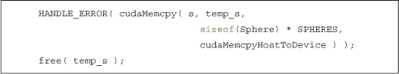

## **第六章 常量内存与事件**

我们希望你已经学到了很多关于在 GPU 上执行代码的知识。你应该知道如何生成并行的块来执行你的内核，并且应该知道如何将这些块进一步划分为并行线程。你还见过使这些线程之间进行通信和同步的方法。但是，由于本书还没有结束，你可能已经猜到 CUDA C 还有更多可能对你有用的特性。

本章将向你介绍一些更先进的特性。具体来说，你可以利用 GPU 上的特殊内存区域来加速你的应用程序。在本章中，我们将讨论这些内存区域之一：*常量内存*。此外，因为我们正在研究提升 CUDA C 应用程序性能的首个方法，你还将学习如何使用 CUDA *事件*来测量应用程序的性能。通过这些测量，你将能够量化你所做的任何优化所带来的增益（或损失！）。

### **6.1 章节目标**

在本章中，你将完成以下任务：

• 你将学习如何在 CUDA C 中使用常量内存。

• 你将学习常量内存的性能特征。

• 你将学习如何使用 CUDA 事件来测量应用程序性能。

### **6.2 常量内存**

之前我们讨论了现代 GPU 配备了大量的算术处理能力。事实上，图形处理器在计算上的优势帮助激发了最初将图形处理器用于通用计算的兴趣。由于 GPU 上有成百上千的算术单元，瓶颈往往不是芯片的算术吞吐量，而是芯片的内存带宽。图形处理器上有如此多的算术逻辑单元（ALU），有时我们根本无法足够快地提供输入以支撑如此高的计算速率。因此，研究如何减少特定问题所需的内存流量是值得的。

到目前为止，我们已经见过使用了全局内存和共享内存的 CUDA C 程序。然而，语言还提供了另一种内存，称为*常量内存*。顾名思义，我们使用常量内存来存储在内核执行过程中不会改变的数据。NVIDIA 硬件提供了 64KB 的常量内存，并以不同于标准全局内存的方式处理它。在某些情况下，使用常量内存而不是全局内存会减少所需的内存带宽。

#### **6.2.1 光线追踪简介**

我们将通过一个简单的*光线追踪*应用程序来探讨如何利用常量内存。首先，我们将为你介绍光线追踪的主要概念。如果你已经对光线追踪的概念非常熟悉，可以跳过“GPU 上的光线追踪”部分。

简单来说，光线追踪是一种生成包含三维物体的场景的二维图像的方法。但这不正是 GPU 最初设计的目的么？它与在你玩最喜欢的游戏时，OpenGL 或 DirectX 所做的有何不同呢？的确，GPU 解决的也是这个问题，但它们采用的是一种称为*光栅化*的技术。关于光栅化有许多优秀的书籍可供参考，因此我们在这里不会深入解释它们之间的区别。只需说，它们是解决相同问题的完全不同的方法。

那么，光线追踪是如何生成三维场景的图像的呢？这个思路很简单：我们选择场景中的一个位置放置一个虚拟相机。这个简化的数字相机包含一个光传感器，因此为了生成图像，我们需要确定哪些光线会击中这个传感器。最终图像的每个像素应该是击中该传感器的光线的相同颜色和强度。

由于任何光线照射到传感器上某一点的光线可能来自我们场景中的任何地方，实际上从后向推算会更为容易。也就是说，与其尝试去推测哪些光线会击中目标像素，不如我们设想从像素出发，射出一条光线进入场景？通过这种方式，每个像素的行为就像一个“眼睛”，它在“看”向场景。图 6.1 展示了这些光线从每个像素射出并进入场景的情况。

***图 6.1*** 一个简单的光线追踪方案

我们通过从目标像素出发，沿着光线穿过场景，直到光线碰到其中一个物体来确定每个像素看到的颜色。然后我们说，像素会“看到”这个物体，并根据它所看到物体的颜色来分配像素的颜色。光线追踪所需的多数计算是在计算光线与场景中物体交点的过程。

此外，在更复杂的光线追踪模型中，场景中的光亮物体可能会反射光线，而半透明物体可能会折射光线。这就产生了二次光线、三次光线，依此类推。事实上，这也是光线追踪的一个吸引人之处；要让一个基本的光线追踪器正常工作非常简单，但我们可以将更多复杂现象的模型嵌入到光线追踪器中，从而生成更逼真的图像。

#### **6.2.2 GPU 上的光线追踪**

由于像 OpenGL 和 DirectX 这样的 API 并不支持光线追踪渲染，我们将使用 CUDA C 来实现我们的基础光线追踪器。我们的光线追踪器将异常简单，以便我们专注于常量内存的使用，因此，如果你期待的是可以作为完整生产渲染器基础的代码，你可能会失望。我们的基础光线追踪器仅支持球体场景，且相机仅限于 z 轴，面向原点。此外，我们不会支持任何场景光照效果，以避免次级光线的复杂性。我们将不计算光照效果，而是简单地为每个球体分配一个颜色，并在它们可见时用一些预计算的函数进行着色。

那么，*光线追踪器*会做什么呢？它会从每个像素发射一条光线，并追踪哪些光线击中了哪些球体。它还会追踪每个光线击中的深度。如果一条光线穿过多个球体，只有距离相机最近的球体是可见的。实际上，我们的“光线追踪器”做的并不复杂，主要是隐藏那些相机看不见的表面。

我们将用一个数据结构来表示球体，存储球体的中心坐标`(x, y, z)`、`radius`以及颜色`(r, b, g)`。

你还会注意到，这个结构有一个方法叫`hit( float ox, float oy, float *n )`。给定从像素`(ox, oy)`发射的光线，这个方法计算光线是否与球体相交。如果光线*确实*与球体相交，该方法会计算光线与球体相交的距离，也就是光线击中球体的位置。我们需要这些信息，原因是：如果光线击中了多个球体，只有距离相机最近的球体才能被看到。

我们的`main()`函数大致遵循与之前图像生成示例相同的顺序。

我们为输入数据分配内存，这些数据是组成场景的球体数组。由于我们需要在 GPU 上处理这些数据，但又是由 CPU 生成的，所以我们必须分别进行`cudaMalloc()`*和*`malloc()`，以在 GPU 和 CPU 上分配内存。我们还分配了一个位图图像，用于在 GPU 上进行光线追踪时填充输出像素数据。

在为输入和输出分配内存后，我们随机生成球体的中心坐标、颜色和半径：

程序当前生成一个包含 20 个球体的随机数组，但这个数量是通过`#define`指定的，可以根据需要进行调整。

我们使用`cudaMemcpy()`将这个球体数组复制到 GPU，然后释放临时缓冲区。

现在我们的输入数据已经在 GPU 上，并且我们已为输出分配了空间，准备好启动我们的内核。

我们稍后将检查内核本身，但现在你应该相信它会进行光线追踪并为输入的球体场景生成像素数据。最后，我们从 GPU 中复制输出图像并显示出来。不言而喻，我们会释放所有尚未释放的已分配内存。

这一切现在应该对你来说是常识了。那么，我们如何进行实际的光线追踪呢？由于我们选择了一个非常简单的光线追踪模型，我们的内核将非常容易理解。每个线程生成一个像素用于输出图像，因此我们通常从计算线程的`x`和`y`坐标以及线性化的`offset`开始，计算输出缓冲区的位置。我们还将把我们的`(x,y)`图像坐标平移`DIM/2`，这样 z 轴就会穿过图像的中心。

由于每个光线需要检查每个球体是否相交，我们现在将遍历球体数组，检查每个球体是否被击中。

显然，大部分有趣的计算都在`for()`循环中。我们遍历每个输入球体，并调用它的`hit()`方法来判断从像素发出的光线是否“看见”该球体。如果光线击中了当前球体，我们还需要判断此次击中是否比之前的球体距离相机更近。如果更近，我们就将这个深度作为新的最近球体。除此之外，我们还会存储该球体的颜色，以便当循环结束时，线程知道哪个球体离相机最近。由于这是从像素发出的光线“看见”的颜色，我们就可以认为这是该像素的颜色，并将此值存储在输出图像缓冲区中。

在检查完所有球体的相交情况后，我们可以将当前颜色存储到输出图像中。

请注意，如果没有球体被击中，我们存储的颜色将是我们初始化变量`r`、`b`和`g`时设置的颜色。在这种情况下，我们将`r`、`b`和`g`设置为零，因此背景将是黑色的。你可以更改这些值来渲染不同颜色的背景。图 6.2 展示了渲染 20 个球体和黑色背景时输出的示例。

***图 6.2*** 来自光线追踪示例的截图

由于我们随机生成了球体的位置、颜色和大小，如果你的输出图像与此图像不完全相同，也请不要慌张。

#### **6.2.3 使用常量内存进行光线追踪**

你可能注意到，我们在光线追踪示例中从未提到常量内存。现在是时候利用常量内存的优势来改进这个示例了。由于我们不能修改常量内存，因此显然不能将其用于输出图像数据。这个示例只有一个输入，即球体数组，因此应该很明显我们将把什么数据存储到常量内存中。

声明常量内存的机制与我们声明共享内存缓冲区时使用的机制完全相同。我们不再像这样声明我们的数组：

Sphere *s;

我们在其前面添加修饰符`__constant__`：

请注意，在原始示例中，我们声明了一个指针，然后使用`cudaMalloc()`为其分配了 GPU 内存。当我们将其改为常量内存时，我们也修改了声明，将空间静态分配到常量内存中。我们不再需要担心为我们的球体数组调用`cudaMalloc()`或`cudaFree()`，但我们确实需要在编译时为该数组承诺一个大小。对于许多应用程序来说，这是一个可以接受的权衡，考虑到常量内存带来的性能优势。我们稍后会讨论这些优势，但首先我们来看看常量内存如何改变我们的`main()`例程：

在很大程度上，这与之前的`main()`实现相同。正如我们之前提到的，我们不再需要调用`cudaMalloc()`来为我们的球体数组分配空间。另一个变化已经在代码中突出显示。

当我们从主机内存复制到 GPU 上的常量内存时，我们使用这种特殊版本的`cudaMemcpy()`。`cudaMemcpyToSymbol()`和`cudaMemcpy()`之间唯一的功能差异是，`cudaMemcpyToSymbol()`可以复制到常量内存，而`cudaMemcpy()`只能复制到全局内存中的指针。

除了`__constant__`修饰符和`main()`中的两个变化外，使用和不使用常量内存的版本是相同的。

#### **6.2.4 使用常量内存的性能**

声明内存为`__constant__`将限制我们的使用为只读。在承担这一限制的同时，我们期望能获得一些回报。正如我们之前提到的，从常量内存中读取数据可以节省内存带宽，相较于从全局内存中读取相同的数据。阅读 64KB 常量内存比标准的全局内存读取节省带宽有两个原因：

• 从常量内存中的单次读取可以广播到其他“附近”的线程，有效地节省最多 15 次读取。

• 常量内存是缓存的，因此对相同地址的连续读取不会产生额外的内存流量。

我们说的*附近*是什么意思？为了回答这个问题，我们需要解释一下*warp*的概念。对于那些更熟悉*星际迷航*而非织布的读者来说，warp 在这里和宇宙旅行速度没有任何关系。在织布的世界里，warp 指的是一组正在编织成布的*经纱*。在 CUDA 架构中，*warp*指的是 32 个线程的集合，这些线程“并排执行”，并且以同步的方式执行。在程序的每一行中，warp 中的每个线程都在不同的数据上执行相同的指令。

在处理常量内存时，NVIDIA 硬件可以将单个内存读取广播到每个半 warp。半 warp——这个名字的创造性远不及 warp——是由 16 个线程组成的：32 线程 warp 的一半。如果半 warp 中的每个线程都从常量内存中的相同地址请求数据，那么 GPU 只会生成一个读取请求，并随后将数据广播到每个线程。如果你从常量内存中读取大量数据，所产生的内存流量仅为使用全局内存时的 1/16（大约 6%）。

但节省不仅仅体现在读取常量内存时带来 94%的带宽减少！因为我们承诺保持内存不变，硬件可以在 GPU 上积极缓存常量数据。所以，在第一次从常量内存地址读取数据后，其他半波段请求相同地址的线程，并因此命中常量缓存，将不会产生额外的内存流量。

在我们的光线追踪器的例子中，启动时每个线程读取与第一个球体对应的数据，以便线程可以测试其光线是否发生交集。在我们修改应用程序，将球体存储在常量内存后，硬件只需要发出一次对该数据的请求。在缓存了数据之后，其他线程避免了由于常量内存带来的两大好处之一，从而不会产生额外的内存流量：

• 它以半 warp 广播的方式接收数据。

• 它从常量内存缓存中检索数据。

不幸的是，使用常量内存时可能会对性能产生潜在的负面影响。半 warp 广播功能实际上是一把双刃剑。虽然当所有 16 个线程读取相同地址时，它能够显著加速性能，但当所有 16 个线程读取不同的地址时，它反而会使性能大幅下降。

允许将单个读取广播到 16 个线程的权衡是，这 16 个线程每次只能发出一个读取请求。例如，如果 16 个线程中的每一个都需要从常量内存中读取不同的数据，这 16 个不同的读取请求会被串行化，从而使得发出请求的时间变为 16 倍。如果它们是从常规全局内存中读取，所有请求可以同时发出。在这种情况下，从常量内存读取的速度可能比使用全局内存更慢。

### **6.3 使用事件测量性能**

完全意识到这可能带来正面或负面的影响，你已经将光线追踪器更改为使用常量内存。你如何确定这对程序的性能产生了怎样的影响？其中一个最简单的度量标准是回答这个简单的问题：哪个版本的执行时间更短？我们可以使用 CPU 或操作系统的计时器，但这将包括来自各种来源的延迟和变化（操作系统线程调度、高精度 CPU 计时器的可用性等）。此外，在 GPU 内核执行时，我们可能在主机上异步执行计算。唯一能够计时这些主机计算的方法是使用 CPU 或操作系统的计时机制。因此，为了测量 GPU 在任务上花费的时间，我们将使用 CUDA 事件 API。

在 CUDA 中，*事件*本质上是一个 GPU 时间戳，它在用户指定的时间点记录。由于 GPU 本身记录时间戳，因此避免了我们在尝试用 CPU 计时器计时 GPU 执行时可能遇到的许多问题。该 API 相对简单易用，因为获取时间戳只需要两个步骤：创建事件和随后记录事件。例如，在某些代码序列的开始时，我们指示 CUDA 运行时记录当前时间。我们通过创建并记录事件来做到这一点：

你会注意到，当我们指示运行时记录`start`事件时，我们还传递了第二个参数。在前面的例子中，这个参数是 0。这个参数的确切含义目前对我们来说并不重要，所以我们打算保持神秘，不去打开新的“潘多拉盒子”。如果你的好奇心让你迫不及待，我们打算在讨论*流*时进行说明。

要对一段代码进行计时，我们需要创建一个开始事件和一个结束事件。我们会让 CUDA 运行时记录开始的时间，然后指示它在 GPU 上做一些其他工作，再指示它记录结束时间：

不幸的是，以这种方式计时 GPU 代码仍然存在问题。解决方法只需要一行代码，但需要一些解释。使用事件的最棘手部分源于 CUDA C 中我们所做的一些调用实际上是*异步*的。例如，当我们在光线追踪器中启动内核时，GPU 开始执行我们的代码，但在 GPU 完成之前，CPU 会继续执行程序的下一行。从性能角度来看，这是非常棒的，因为这意味着我们可以同时在 GPU 和 CPU 上进行计算，但从概念上讲，这使得计时变得棘手。

你应该将调用`cudaEventRecord()`视为将当前时间记录到 GPU 的待处理工作队列中的指令。因此，我们的事件实际上不会被记录，直到 GPU 完成调用`cudaEventRecord()`之前的所有工作。就`stop`事件测量正确时间而言，这正是我们想要的。但在 GPU 完成之前的工作并记录`stop`事件之前，我们不能安全地*读取*`stop`事件的值。幸运的是，我们有一种方法可以指示 CPU 同步一个事件，事件 API 函数`cudaEventSynchronize()`：

现在，我们已经指示运行时在 GPU 到达`stop`事件之前阻止进一步的指令。当调用`cudaEventSynchronize()`返回时，我们知道所有在`stop`事件之前的 GPU 工作已经完成，因此可以安全地读取`stop`记录的时间戳。值得注意的是，由于 CUDA 事件是直接在 GPU 上实现的，它们不适用于计时设备和主机代码的混合。这就是说，如果你尝试使用 CUDA 事件来计时多个内核执行和涉及设备的内存复制操作，你会得到不可靠的结果。

#### **6.3.1 测量光线追踪器性能**

要计时我们的光线追踪器，我们需要创建一个开始事件和一个结束事件，正如我们在学习事件时所做的那样。以下是一个启用了计时功能的光线追踪器版本，它*不*使用常量内存：

注意，我们已经加入了两个额外的函数，分别是`cudaEventElapsedTime()`和`cudaEventDestroy()`的调用。函数`cudaEventElapsedTime()`是一个实用程序，用于计算两个先前记录的事件之间的经过时间。两个事件之间的毫秒数被返回到第一个参数，即一个浮动变量的地址。

当我们完成使用通过`cudaEventCreate()`创建的事件时，需要调用`cudaEventDestroy()`。这与调用`free()`释放之前通过`malloc()`分配的内存是一样的，所以我们不需要强调每个`cudaEventCreate()`都必须与`cudaEventDestroy()`匹配的重要性。

我们可以以相同的方式对使用常量内存的光线追踪器进行分析：

当我们运行两种版本的光线追踪器时，可以比较完成 GPU 工作所需的时间。这将高层次地告诉我们，引入常量内存是提高了应用程序的性能还是使其变差。幸运的是，在这种情况下，使用常量内存显著提升了性能。我们在 GeForce GTX 280 上的实验表明，使用常量内存的光线追踪器比使用全局内存的版本快了最多 50%。在不同的 GPU 上，可能会有所不同，尽管使用常量内存的光线追踪器应该始终至少和不使用常量内存的版本一样快。

### **6.4 章节回顾**

除了我们在前几章中探讨的全局内存和共享内存，NVIDIA 硬件还为我们提供了其他类型的内存。常量内存相比标准的全局内存有额外的约束，但在某些情况下，遵循这些约束可以带来额外的性能。具体来说，当 warp 中的线程需要访问相同的只读数据时，我们可以看到性能的提升。对于具有这种访问模式的数据，使用常量内存可以节省带宽，因为它能够在半个 warp 中广播读取，并且芯片上有常量内存缓存。内存带宽是限制广泛类算法的瓶颈，因此，拥有可以缓解这种情况的机制可能非常有用。

我们还学会了如何使用 CUDA 事件请求运行时在 GPU 执行的特定点记录时间戳。我们看到如何在这些事件之一上同步 CPU 和 GPU，然后如何计算两个事件之间经过的时间。通过这样做，我们建立了一种方法来比较两种不同的光线追踪球体的方法的运行时间，得出结论：对于当前的应用程序，使用常量内存使我们获得了显著的性能提升。
