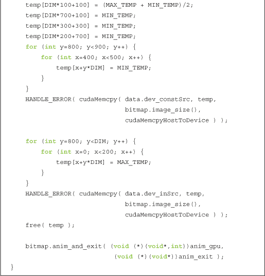
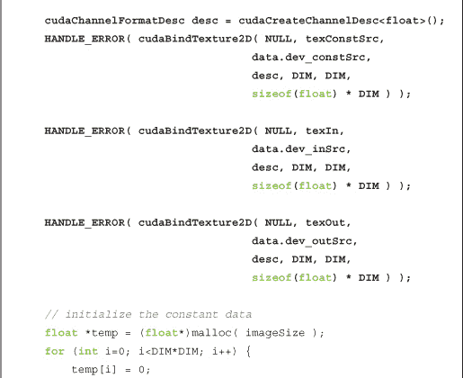

## **第七章 纹理内存**

当我们研究常量内存时，我们看到在合适的条件下利用特殊内存空间可以显著加速应用程序。我们还学习了如何衡量这些性能提升，以便做出关于性能选择的明智决策。在本章中，我们将了解如何分配和使用*纹理内存*。与常量内存类似，纹理内存是另一种只读内存，可以在读取有特定访问模式时提高性能并减少内存流量。尽管纹理内存最初是为传统图形应用设计的，但它在一些 GPU 计算应用中也可以非常有效地使用。

### **7.1 本章目标**

在本章中，你将完成以下内容：

• 你将了解纹理内存的性能特性。

• 你将学习如何使用 CUDA C 进行一维纹理内存操作。

• 你将学习如何使用 CUDA C 进行二维纹理内存操作。

### **7.2 纹理内存概述**

如果你阅读了本章的简介，秘密已经揭晓：还有一种可供在 CUDA C 程序中使用的只读内存类型。熟悉图形硬件工作原理的读者不会感到惊讶，但 GPU 的复杂*纹理内存*也可以用于通用计算。尽管 NVIDIA 为经典的 OpenGL 和 DirectX 渲染管线设计了纹理单元，纹理内存也具有一些特性，使其在计算中非常有用。

像常量内存一样，纹理内存是被缓存到芯片上的，因此在某些情况下，它通过减少对外部 DRAM 的内存请求，可以提供更高的有效带宽。具体而言，纹理缓存是为图形应用设计的，其中内存访问模式具有很强的*空间局部性*。在计算应用中，这大致意味着一个线程很可能会从“附近”线程读取的地址中读取数据，如图 7.1 所示。

***图 7.1*** 线程映射到内存二维区域

从算术上讲，所示的四个地址并非连续的，因此它们在典型的 CPU 缓存方案中不会被一起缓存。但由于 GPU 纹理缓存的设计是为了加速像这样的访问模式，当使用纹理内存而非全局内存时，你会看到性能的提升。事实上，这种访问模式在通用计算中并不算特别罕见，正如我们将看到的那样。

### **7.3 模拟热传导**

物理模拟可能是最具计算挑战性的问题之一。从根本上讲，精度和计算复杂度之间往往存在权衡。因此，计算机模拟近年来变得越来越重要，这在很大程度上要归功于并行计算革命带来的精度提升。由于许多物理模拟可以很容易地并行化，我们将在本示例中探讨一个非常简单的模拟模型。

#### **7.3.1 简单加热模型**

为了演示一种可以有效使用纹理内存的情况，我们将构建一个简单的二维热传导模拟。我们假设有一个矩形房间，将其划分为网格。在网格内部，我们将随机分布一些具有不同固定温度的“加热器”。图 7.2 展示了这个房间可能的样子。

***图 7.2*** 带有不同温度的“加热器”的房间

给定一个矩形网格和加热器的配置，我们希望模拟随着时间推移，每个网格单元格内温度的变化。为了简化起见，包含加热器的单元格始终保持在一个恒定的温度。在每个时间步骤中，我们假设热量在单元格与其邻居之间“流动”。如果一个单元格的邻居比它温暖，那么较暖的邻居会倾向于加热它。相反，如果一个单元格的邻居比它冷，它就会变冷。从定性上看，图 7.3 表示了这种热量流动。

***图 7.3*** 热量从温暖的单元格散发到寒冷的单元格

在我们的热传导模型中，我们将计算每个网格单元格的新温度，作为该单元格温度与其邻居温度差异的总和，或者本质上是如方程 7.1 所示的更新方程。

***方程 7.1***

在更新单元格温度的方程中，常数`k`仅表示热量在模拟中流动的速率。较大的`k`值会使系统迅速达到恒定温度，而较小的`k`值则会使解保持较大的温度梯度更长时间。由于我们只考虑四个邻居（上、下、左、右），且`k`和[`TOLD`]在方程中保持不变，因此这个更新类似于方程 7.2 所示的形式。

***方程 7.2***

和上一章中的光线追踪示例一样，这个模型并不打算接近行业中可能使用的模型（事实上，它甚至不是某个物理准确模型的近似）。我们极大地简化了这个模型，以便突出所使用的技术。考虑到这一点，让我们来看看如何在 GPU 上计算方程 7.2 给出的更新。

#### **7.3.2 计算温度更新**

我们稍后会详细讲解每个步骤的具体内容，但总体上，我们的更新过程如下：

1\. 给定某个输入温度网格，将带有加热器的单元的温度复制到这个网格中。这将覆盖这些单元中之前计算的任何温度，从而强制执行“加热单元”保持恒定温度的限制。这个复制操作在`copy_const_kernel()`中执行。

2\. 给定输入温度网格，根据方程 7.2 中的更新计算输出温度。此更新在`blend_kernel()`中执行。

3\. 交换输入和输出缓冲区，为下一时间步做准备。步骤 2 中计算得到的输出温度网格将在模拟下一时间步时，成为步骤 1 开始时的输入温度网格。

在开始仿真之前，我们假设已经生成了一个常量网格。这个网格中的大多数条目为零，但有一些条目包含表示加热器固定温度的非零值。这个常量缓冲区在整个仿真过程中不会变化，并将在每个时间步读取。

由于我们模拟热传导的方式，我们从上一时间步的输出网格开始。然后，根据步骤 1，我们将带有加热器的单元的温度复制到这个输出网格中，覆盖任何先前计算的温度。我们这样做是因为我们假设这些加热器单元的温度保持不变。我们通过以下内核将这个常量网格复制到输入网格：

前三行应该很熟悉。前两行将线程的`threadIdx`和`blockIdx`转换为`x`和`y`坐标。第三行计算出一个线性`offset`，用于访问我们的常量和输入缓冲区。突出显示的这一行将`cptr[]`中的加热器温度复制到`iptr[]`中的输入网格。注意，只有当常量网格中的单元非零时，才会进行复制。我们这样做是为了保留那些没有加热器的单元在上一时间步中计算出的值。带有加热器的单元在`cptr[]`中会有非零值，因此它们的温度将通过这个复制内核在步骤之间得以保留。

算法的第 2 步是最为计算密集的。为了执行更新，我们可以让每个线程负责模拟中的单个单元。每个线程会读取其单元的温度和邻居单元的温度，执行之前的更新计算，然后用新的值更新自己的温度。这个内核的许多部分与之前你使用过的技术相似。

请注意，我们的开始方式与产生图像输出的示例完全相同。然而，线程计算的不是像素的颜色，而是模拟网格单元的温度。尽管如此，它们仍然是通过将`threadIdx`和`blockIdx`转换为`x`、`y`和偏移量来启动的。现在你可能已经能在梦里背出这些代码（不过我们希望你不会真的在梦里背它们）。

接下来，我们确定左右上下邻居的偏移量，以便读取这些单元的温度。我们将需要这些值来计算当前单元的更新温度。这里唯一的复杂性是，我们需要调整边界上的索引，以确保边缘周围的单元不会环绕。最后，在高亮显示的行中，我们从方程式 7.2 执行更新，添加旧温度以及该温度与单元邻居温度之间的缩放差值。

#### **7.3.3 动画模拟**

代码的其余部分主要是设置网格，然后显示热图的动画输出。我们现在将逐步讲解这些代码：

我们为代码配备了基于事件的计时，就像在上一章的光线追踪示例中所做的那样。计时代码的作用与之前相同。由于我们将努力加速初始实现，因此我们已设置了一个机制，通过它可以测量性能，并确保自己成功达成目标。

函数`anim_gpu()`会在每一帧被动画框架调用。这个函数的参数是指向`DataBlock`的指针，以及已经经过的动画`ticks`数。与动画示例类似，我们使用 256 个线程的块，并将它们组织成 16 x 16 的二维网格。`anim_gpu()`中`for()`循环的每次迭代计算模拟的单个时间步长，正如 7.3.2 节开头的三步算法中所描述的：计算温度更新。由于`DataBlock`包含加热器的常量缓冲区以及上一时间步的输出，它封装了动画的整个状态，因此`anim_gpu()`实际上不需要在任何地方使用`ticks`的值。

你会注意到，我们选择每帧计算 90 个时间步。这个数字并不是神奇的，而是通过一定的实验确定的，是在每个时间步下载位图图像和每帧计算过多时间步之间的合理折中，避免出现卡顿的动画效果。如果你更关心每个仿真步骤的输出，而不是实时显示结果的动画效果，你可以将其修改为每帧仅计算一个时间步。

在计算完自上一个帧以来的 90 个时间步后，`anim_gpu()`准备将当前动画的位图帧复制回 CPU。由于`for()`循环将输入和输出交换，我们将输入缓冲区传递给下一个内核，该内核实际上包含了第 90 个时间步的输出。我们使用内核`float_to_color()`将温度转换为颜色，然后使用`cudaMemcpy()`将结果图像复制回 CPU，复制方向指定为`cudaMemcpyDeviceToHost`。最后，为了为下一个时间步的序列做准备，我们将输出缓冲区交换回输入缓冲区，因为它将作为下一个时间步的输入。

图 7.4 展示了输出可能的样子。你会注意到图像中有一些“加热器”，它们看起来像是像素大小的岛屿，打破了温度分布的连续性。

***图 7.4*** 来自动画热传导仿真的屏幕截图

#### **7.3.4 使用纹理内存**

在每个步骤中执行温度更新所需的内存访问模式中，存在相当多的*空间局部性*。正如我们之前解释的那样，这正是 GPU 纹理内存旨在加速的访问模式。鉴于我们希望使用纹理内存，我们需要了解如何进行操作。

首先，我们需要将输入声明为纹理引用。由于我们的温度数据是浮点型的，因此我们将使用浮点纹理引用。

下一个主要区别是，在为这三个缓冲区分配 GPU 内存后，我们需要使用`cudaBindTexture()`将引用绑定到内存缓冲区。这基本上告诉 CUDA 运行时两件事：

• 我们打算将指定的缓冲区用作纹理。

• 我们打算将指定的纹理引用用作纹理的“名称”。

在我们的热传导仿真中完成了三个分配后，我们将这三个分配绑定到先前声明的纹理引用（`texConstSrc`、`texIn` 和 `texOut`）。

到此为止，我们的纹理已经完全设置好，我们准备启动内核了。然而，当我们在内核中从纹理读取数据时，我们需要使用特殊的函数来指示 GPU 通过纹理单元而不是通过标准全局内存来路由我们的请求。因此，我们不再能简单地使用方括号从缓冲区中读取数据；我们需要修改 `blend_kernel()`，使其在从内存读取时使用 `tex1Dfetch()`。

此外，使用全局内存和纹理内存之间还有另一个区别，这要求我们进行另一个更改。虽然它看起来像一个函数，`tex1Dfetch()` 实际上是一个编译器内建函数。由于纹理引用必须在文件作用域内声明为全局变量，我们无法再像之前那样将输入和输出缓冲区作为参数传递给 `blend_kernel()`，因为编译器需要在编译时知道 `tex1Dfetch()` 应该采样哪些纹理。我们将不再像以前那样传递输入和输出缓冲区的指针，而是将一个布尔标志 `dstOut` 传递给 `blend_kernel()`，该标志指示使用哪个缓冲区作为输入，哪个作为输出。对 `blend_kernel()` 的更改如下所示：

由于 `copy_const_kernel()` 内核从我们的缓冲区读取加热器位置和温度数据，我们需要在这里进行类似的修改，以便通过纹理内存读取，而不是通过全局内存：

由于 `blend_kernel()` 的函数签名已经更改为接受一个标志来切换输入和输出缓冲区，我们需要对 `anim_gpu()` 例程进行相应的更改。我们不再交换缓冲区，而是每次调用系列后设置 `dstOut = !dstOut` 来切换标志：

对我们的热传递例程的最后一个更改是，在应用程序运行结束时进行清理。我们不仅需要释放全局缓冲区，还需要解绑纹理：

#### **7.3.5 使用二维纹理内存**

在本书的开头，我们提到过有些问题具有二维领域，因此有时使用二维块和网格会更方便。纹理内存也是如此。实际上，有许多情况下，拥有二维内存区域是非常有用的，对于熟悉标准 C 中多维数组的人来说，这并不令人感到惊讶。让我们来看一下如何修改我们的热传递应用程序，以便使用二维纹理。

首先，我们的纹理引用声明会发生变化。如果未指定，纹理引用默认为一维，因此我们添加了一个维度参数 2，以便声明二维纹理。

转换为二维纹理带来的简化出现在`blend_kernel()`方法中。尽管我们需要将`tex1Dfetch()`调用更改为`tex2D()`调用，但我们不再需要使用线性化的`offset`变量来计算偏移量集合`top`、`left`、`right`和`bottom`。当我们切换到二维纹理时，可以直接使用`x`和`y`来定位纹理。

此外，当我们切换到使用`tex2D()`时，我们不再需要担心越界溢出。如果`x`或`y`中的一个小于零，`tex2D()`将返回零位置的值。同样地，如果其中一个值大于宽度，`tex2D()`将返回宽度 1 位置的值。请注意，在我们的应用程序中，这种行为是理想的，但其他应用程序可能会希望实现不同的行为。

由于这些简化，我们的内核得到了很好的清理。

由于我们之前所有对`tex1Dfetch()`的调用都需要更改为`tex2D()`调用，因此我们在`copy_const_kernel()`中做出相应的更改。与内核`blend_kernel()`类似，我们不再需要使用`offset`来定位纹理；我们只需使用`x`和`y`来定位常量源：

我们的热传递仿真一维纹理版本的最终更改与之前的更改相似。具体来说，在`main()`中，我们需要更改纹理绑定调用，指示运行时我们计划使用的缓冲区将被作为二维纹理而非一维纹理处理：

与无纹理和一维纹理版本一样，我们首先为输入数组分配存储空间。与一维示例不同的是，CUDA 运行时要求我们在绑定二维纹理时提供`cudaChannelFormatDesc`。前面的代码列出了一个通道格式描述符的声明。在我们的案例中，我们可以接受默认参数，只需指定我们需要一个浮动点描述符。然后，我们使用`cudaBindTexture2D()`将三个输入缓冲区绑定为二维纹理，指定纹理的尺寸（`DIM` x `DIM`）以及通道格式描述符（`desc`）。其余的`main()`保持不变。

尽管我们需要不同的函数来指示运行时绑定一维或二维纹理，但我们使用相同的例程来解除纹理绑定，即`cudaUnbindTexture()`。因此，我们的清理例程可以保持不变。

使用二维纹理的热传导模拟版本，其性能特征与使用一维纹理的版本基本相同。所以从性能角度来看，一维和二维纹理之间的选择可能没有太大影响。对于我们的具体应用，使用二维纹理时代码稍微简单一些，因为我们正模拟的是一个二维领域。但通常情况下，由于并非总是如此，我们建议你根据具体情况来决定使用一维或二维纹理。

### **7.4 章节回顾**

正如我们在上一章中看到的常量内存一样，纹理内存的部分优势来自于片上缓存。这在像我们的热传导模拟这样的应用中尤为明显：这些应用的数据访问模式具有一定的空间一致性。我们看到一维或二维纹理都可以使用，它们具有相似的性能特征。与块状或网格形状一样，一维或二维纹理的选择主要取决于方便性。由于当我们切换到二维纹理时代码变得更加简洁，而且边界处理是自动的，我们可能会在热传导应用中提倡使用二维纹理。但正如你所看到的，无论选择哪种方式，它都能正常工作。

如果我们利用纹理采样器可以自动执行的一些转换，例如将打包数据解包为单独的变量，或将 8 位和 16 位整数转换为标准化的浮点数，纹理内存可以提供额外的加速。我们在热传导应用中没有探索这些功能，但它们可能对你有所帮助！
