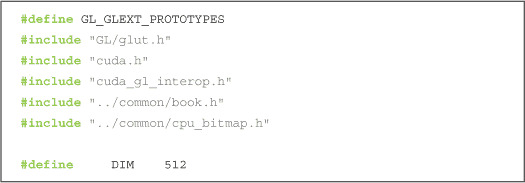

## **第八章 图形互操作性**

由于本书专注于通用计算，因此大部分时间我们忽略了 GPU 中也包含一些专用组件。GPU 的成功归功于其能够实时执行复杂的渲染任务，从而使系统的其余部分可以专注于其他工作。这引出了一个显而易见的问题：我们能否在同一个应用程序中同时使用 GPU 进行渲染*和*通用计算？如果我们要渲染的图像依赖于计算结果呢？或者如果我们希望对渲染的帧进行一些图像处理或统计计算呢？

幸运的是，通用计算与渲染模式之间的交互不仅是可能的，而且在你已经掌握的知识基础上相对容易实现。CUDA C 应用程序可以与两种最流行的实时渲染 API——OpenGL 和 DirectX 无缝互操作。本章将探讨如何启用此功能的机制。

本章中的示例与我们在前几章中设定的先例有所偏离。特别是，本章假设你对其他技术有一定了解。具体而言，我们在这些示例中包含了大量的 OpenGL 和 GLUT 代码，其中几乎没有会进行深入讲解的内容。网上和书店有许多优秀的资源可以学习图形 API，但这些话题超出了本书的预期范围。本章的目的是专注于 CUDA C 及其提供的功能，将其融入到你的图形应用程序中。如果你不熟悉 OpenGL 或 DirectX，那么你可能无法从本章中获得太多收益，可能需要跳到下一章。

### **8.1 章节目标**

在本章中，你将完成以下任务：

• 你将了解什么是*图形互操作性*以及为什么你可能会使用它。

• 你将了解如何设置 CUDA 设备以实现图形互操作性。

• 你将了解如何在 CUDA C 内核和 OpenGL 渲染之间共享数据。

### **8.2 图形互操作**

为了演示图形与 CUDA C 之间的互操作机制，我们将编写一个分为两个步骤的应用程序。第一步使用 CUDA C 内核生成图像数据。第二步，应用程序将这些数据传递给 OpenGL 驱动程序进行渲染。为此，我们将结合前几章中学到的大部分 CUDA C 代码，并使用一些 OpenGL 和 GLUT 调用。

为了启动我们的应用程序，我们包含相关的 GLUT 和 CUDA 头文件，以确保定义了正确的函数和枚举。我们还定义了应用程序计划渲染的窗口大小。由于窗口大小为 512 x 512 像素，我们将进行相对较小的绘图。

此外，我们声明了两个全局变量，用于存储我们打算在 OpenGL 和数据之间共享的句柄。我们将很快看到如何使用这两个变量，但它们将存储指向*同一*缓冲区的不同句柄。我们需要两个单独的变量，因为 OpenGL 和 CUDA 对缓冲区有不同的“名称”。变量`bufferObj`将是 OpenGL 对数据的名称，而变量`resource`将是 CUDA C 对它的名称。

现在让我们来看看实际应用。我们首先要做的是选择一个 CUDA 设备来运行我们的应用程序。在许多系统上，这个过程并不复杂，因为它们通常只包含一个 CUDA 支持的 GPU。然而，越来越多的系统包含多个 CUDA 支持的 GPU，因此我们需要一种选择其中一个的方法。幸运的是，CUDA 运行时为我们提供了这样的功能。

你可能还记得我们在第三章中看到过`cudaChooseDevice()`，但由于这只是一个附带的点，我们现在再回顾一下。基本上，这段代码告诉运行时选择任何具有*计算能力*版本 1.0 或更高的 GPU。它通过首先创建并清除一个`cudaDeviceProp`结构，然后将其`major`版本设置为 1，`minor`版本设置为 0 来实现。它将这些信息传递给`cudaChooseDevice()`，该函数指示运行时选择系统中满足`cudaDeviceProp`结构所指定约束的 GPU。在下一章中，我们将更详细地了解 GPU 的*计算能力*的含义，但现在可以简单地说，它大致指示了 GPU 支持的特性。所有 CUDA 支持的 GPU 至少具有计算能力 1.0，因此这次调用的净效果是运行时将选择任何 CUDA 支持的设备，并在变量`dev`中返回该设备的标识符。不能保证该设备是最佳或最快的 GPU，也不能保证该设备在 CUDA 运行时的不同版本中是相同的 GPU。

如果设备选择的结果看起来如此平淡无奇，为什么我们还要费尽心思填充`cudaDeviceProp`结构并调用`cudaChooseDevice()`以获取有效的设备 ID 呢？此外，我们之前从未为这些无聊的事情烦恼过，为什么现在要这样？这些都是好问题。事实证明，我们需要知道 CUDA 设备 ID，以便告诉 CUDA 运行时我们打算将该设备用于 CUDA *和* OpenGL。我们通过调用`cudaGLSetGLDevice()`来实现这一点，传递我们从`cudaChooseDevice()`获得的设备 ID `dev`：

在 CUDA 运行时初始化之后，我们可以通过调用我们的 GL 实用工具工具包（GLUT）设置函数来初始化 OpenGL 驱动程序。如果你之前使用过 GLUT，这一系列调用应该看起来相对熟悉：

在`main()`函数中，我们已经通过调用`cudaGLSetGLDevice()`将 CUDA 运行时准备好与 OpenGL 驱动程序协同工作。然后，我们初始化了 GLUT，并创建了一个名为“bitmap”的窗口来绘制我们的结果。现在，我们可以开始真正的 OpenGL 互操作了！

共享数据缓冲区是 CUDA C 内核与 OpenGL 渲染之间互操作的关键组件。为了在 OpenGL 和 CUDA 之间传递数据，我们首先需要创建一个可以同时与这两个 API 使用的缓冲区。我们通过在 OpenGL 中创建一个像素缓冲对象（PBO）并将句柄存储在全局变量`GLuint bufferObj`中开始这个过程：

如果你从未在 OpenGL 中使用过像素缓冲对象（PBO），你通常会通过以下三个步骤来创建一个：首先，我们通过`glGenBuffers()`生成一个缓冲区句柄。然后，我们通过`glBindBuffer()`将句柄绑定到一个像素缓冲区。最后，我们通过`glBufferData()`请求 OpenGL 驱动程序为我们分配一个缓冲区。在这个示例中，我们请求一个用于存储`DIM` x `DIM` 32 位值的缓冲区，并使用枚举常量`GL_DYNAMIC_DRAW_ARB`表示该缓冲区将会被应用程序反复修改。由于我们没有数据预加载到缓冲区，因此我们将`NULL`作为`glBufferData()`的倒数第二个参数传递。

在我们设置图形互操作性的过程中，剩下的任务就是通知 CUDA 运行时，我们打算将名为`bufferObj`的 OpenGL 缓冲区与 CUDA 共享。我们通过将`bufferObj`注册为图形资源，来完成这项任务。

我们通过调用`cudaGraphicsGLRegisterBuffer()`，向 CUDA 运行时指定我们打算将 OpenGL 的 PBO `bufferObj`与 OpenGL 和 CUDA 一起使用。CUDA 运行时会返回一个 CUDA 友好的缓冲区句柄，保存在变量`resource`中。这个句柄将用于后续对 CUDA 运行时的调用中引用`bufferObj`。

标志`cudaGraphicsMapFlagsNone`指定我们不想为此缓冲区指定任何特定行为，尽管我们可以选择使用`cudaGraphicsMapFlagsReadOnly`来指定该缓冲区为只读。我们也可以使用`cudaGraphicsMapFlagsWriteDiscard`来指定丢弃缓冲区的先前内容，使其基本上成为只写缓冲区。这些标志允许 CUDA 和 OpenGL 驱动程序针对具有限制访问模式的缓冲区优化硬件设置，尽管它们不是必须设置的。

实际上，对`glBufferData()`的调用请求 OpenGL 驱动分配足够大的缓冲区以容纳`DIM` x `DIM`个 32 位值。在随后的 OpenGL 调用中，我们将使用句柄`bufferObj`引用此缓冲区，而在 CUDA 运行时调用中，我们将使用指针`resource`来引用此缓冲区。由于我们希望从 CUDA C 内核中读取和写入这个缓冲区，我们不仅需要一个对象的句柄，还需要一个实际的设备内存地址，才能将其传递给我们的内核。我们通过指示 CUDA 运行时映射共享资源，然后请求指向映射资源的指针来实现这一点。

然后，我们可以像使用任何设备指针一样使用`devPtr`，只是数据也可以被 OpenGL 作为像素源使用。在完成所有这些设置之后，`main()`的其余部分如下：首先，我们启动内核，传递给它指向共享缓冲区的指针。这个内核，我们还没有看到其代码，生成要渲染的图像数据。接下来，我们取消映射共享资源。这个调用在执行渲染任务之前非常重要，因为它为 CUDA 和图形部分的应用程序之间提供了同步。具体来说，它意味着在调用`cudaGraphicsUnmapResources()`之前执行的所有 CUDA 操作都将在开始后续图形调用之前完成。

最后，我们将键盘和显示回调函数注册到 GLUT（`key_func`和`draw_func`），并通过`glutMainLoop()`将控制权交给 GLUT 渲染循环。

应用程序的其余部分由我们刚才提到的三个函数组成：`kernel()`、`key_func()`和`draw_func()`。接下来，我们来看看它们。

内核函数接收一个设备指针并生成图像数据。在以下示例中，我们使用的是受第五章波纹示例启发的内核：

这里涉及了许多熟悉的概念。线程和块索引转化为`x`和`y`坐标以及线性偏移的方法已经被多次讨论。然后，我们执行一些合理的任意计算来确定该`(x,y)`位置像素的颜色，并将这些值存储到内存中。我们再次使用 CUDA C 在 GPU 上程序化地生成图像。需要注意的是，这个图像将被*直接*交给 OpenGL 进行渲染，CPU 完全不参与。另一方面，在第五章的波纹示例中，我们也在 GPU 上生成了类似的图像数据，但我们的应用程序随后将缓冲区复制回 CPU 以进行显示。

那么，我们如何使用 OpenGL 绘制 CUDA 生成的缓冲区呢？嗯，如果你还记得我们在`main()`中所做的设置，你会记得以下内容：

glBindBuffer( GL_PIXEL_UNPACK_BUFFER_ARB, bufferObj );

这个调用将共享缓冲区绑定为 OpenGL 驱动程序在所有后续`glDrawPixels()`调用中使用的像素源。实际上，这意味着我们只需要调用`glDrawPixels()`，就能渲染 CUDA C 内核生成的图像数据。因此，以下是我们的`draw_func()`需要做的全部内容：

你可能已经见过`glDrawPixels()`函数，它的最后一个参数是一个缓冲区指针。如果没有将缓冲区绑定为`GL_PIXEL_UNPACK_BUFFER_ARB`源，OpenGL 驱动程序将从该缓冲区复制数据。然而，由于我们的数据已经在 GPU 上，并且我们*已经*将共享缓冲区绑定为`GL_PIXEL_UNPACK_BUFFER_ARB`源，因此这个最后的参数变成了绑定缓冲区中的偏移量。因为我们希望渲染整个缓冲区，因此对于我们的应用程序，这个偏移量为零。

这个示例的最后一个组件看起来有些平淡无奇，但我们决定为用户提供一种退出应用程序的方法。在这个方面，我们的`key_func()`回调函数只响应 Esc 键，并使用它作为清理和退出的信号：

***图 8.1*** 迷幻图形互操作示例的截图

运行时，这个示例会绘制一幅迷人的图像，颜色为“NVIDIA 绿色”和黑色，如图 8.1 所示。试着用它来催眠你的朋友（或敌人）。

### **8.3 GPU 波纹与图形互操作性**

在“第 8.2 节：图形互操作”中，我们几次提到了第五章的 GPU 波纹示例。如果你还记得，该应用程序创建了一个`CPUAnimBitmap`并传递了一个函数，在每次需要生成帧时调用它。

运用我们在上一节中学到的技术，我们打算创建一个`GPUAnimBitmap`结构体。这个结构体将与`CPUAnimBitmap`有相同的目的，但在这个改进版本中，CUDA 和 OpenGL 组件将无需 CPU 干预即可合作。当我们完成时，应用程序将使用`GPUAnimBitmap`，使得`main()`变得非常简单，像下面这样：

`GPUAnimBitmap`结构体使用我们刚刚在第 8.2 节：图形互操作中查看的相同调用。然而，现在这些调用将被抽象为一个`GPUAnimBitmap`结构体，这样未来的示例（以及可能是你自己的应用程序）将会更加简洁。

#### **8.3.1 GPUAnimBitmap 结构体**

我们的`GPUAnimBitmap`的几个数据成员你可能会在第 8.2 节中看到：图形互操作。

我们知道 OpenGL 和 CUDA 运行时会为我们的 GPU 缓冲区使用不同的名称，而且我们知道我们需要根据是调用 OpenGL 还是 CUDA C 来引用这两个名称。因此，我们的结构将同时存储 OpenGL 的`bufferObj`名称和 CUDA 运行时的`resource`名称。由于我们正在处理一个要显示的位图图像，我们知道该图像将具有宽度和高度。

为了允许我们的`GPUAnimBitmap`的用户注册某些回调事件，我们还将存储一个指向任意用户数据的`void*`指针在`dataBlock`中。我们的结构不会查看这些数据，而是简单地将其传递给任何已注册的回调函数。用户可以注册的回调函数存储在`fAnim`、`animExit`和`clickDrag`中。`fAnim()`函数会在每次调用`glutIdleFunc()`时被调用，负责生成将在动画中渲染的图像数据。`animExit()`函数会在动画退出时被调用一次，这是用户实现清理代码的地方，用于在动画结束时执行必要的清理工作。最后，`clickDrag()`是一个可选函数，用于实现用户对鼠标点击/拖动事件的响应。如果用户注册了这个函数，它会在每次鼠标按键、拖动和释放事件的序列后被调用。该序列中首次点击的位置会被存储在`(dragStartX, dragStartY)`中，这样当鼠标按钮被释放时，点击/拖动事件的起点和终点就能传递给用户。这可以用来实现互动动画，给你的朋友留下深刻印象。

初始化`GPUAnimBitmap`遵循与我们之前示例中相同的代码顺序。在将参数存储到适当的结构成员中后，我们首先查询 CUDA 运行时，以找到合适的 CUDA 设备：

在找到兼容的 CUDA 设备后，我们调用重要的`cudaGLSetGLDevice()`，通知 CUDA 运行时我们打算使用`dev`作为与 OpenGL 互操作的设备：

由于我们的框架使用 GLUT 来创建一个窗口化的渲染环境，我们需要初始化 GLUT。遗憾的是，这有点尴尬，因为`glutInit()`需要命令行参数来传递给窗口系统。由于我们没有要传递的参数，我们希望简单地指定零个命令行参数。可惜的是，某些版本的 GLUT 存在一个 bug，当传递零个参数时会导致应用崩溃。因此，我们通过欺骗 GLUT 让它以为我们传递了一个参数，这样一来，一切顺利。

我们继续按照之前的示例初始化 GLUT。我们创建一个渲染窗口，并指定标题为“bitmap”。如果你希望给你的窗口起个更有趣的名字，随你便。

接下来，我们请求 OpenGL 驱动程序分配一个缓冲区句柄，并立即将其绑定到 `GL_PIXEL_UNPACK_BUFFER_ARB` 目标，以确保未来对 `glDrawPixels()` 的调用将绘制到我们的互操作缓冲区：

最后但绝对不是最不重要的，我们请求 OpenGL 驱动程序为我们分配一个 GPU 内存区域。一旦完成，我们将通知 CUDA 运行时这个缓冲区，并通过 `cudaGraphicsGLRegisterBuffer()` 注册 `bufferObj` 来请求为该缓冲区分配一个 CUDA C 名称。

在 `GPUAnimBitmap` 设置好之后，唯一剩下的关注点是如何进行渲染。渲染的核心工作将由我们的 `glutIdleFunc()` 完成。这个函数基本上会做三件事。首先，它映射我们的共享缓冲区并检索该缓冲区的 GPU 指针。

其次，它调用用户指定的函数 `fAnim()`，该函数可能会启动一个 CUDA C 核心，以填充 `devPtr` 缓冲区中的图像数据。

最后，它取消映射 GPU 指针，从而释放缓冲区以供 OpenGL 驱动程序在渲染时使用。这个渲染将通过调用 `glutPostRedisplay()` 来触发。

`GPUAnimBitmap` 结构的其余部分包含了一些重要但稍微偏离主题的基础设施代码。如果你对它感兴趣，完全可以进行深入研究。但我们认为，即使你没有时间或兴趣去理解 `GPUAnimBitmap` 中的其余代码，你也能成功地继续进行下去。

#### **8.3.2 GPU 波纹重制**

现在我们拥有了 `GPUAnimBitmap` 的 GPU 版本，可以继续改造我们的 GPU 波纹应用程序，让它完全在 GPU 上执行动画。首先，我们将包含 `gpu_anim.h`，它是我们实现 `GPUAnimBitmap` 的地方。我们还包括了几乎与我们在第五章中检查的内核相同的内核。

我们做的唯一更改已被突出显示。做出这个更改的原因是因为 OpenGL 的互操作要求我们的共享表面是“图形友好的”。因为实时渲染通常使用四个分量（红色/绿色/蓝色/透明度）的数据元素数组，所以我们的目标缓冲区不再仅仅是之前的 `unsigned char` 数组。现在，它必须是 `uchar4` 类型的数组。实际上，我们在第五章中就将缓冲区当作四分量缓冲区处理，所以我们总是使用 `ptr[offset*4+k]` 来索引它，其中 `k` 表示从 0 到 3 的分量。但现在，通过切换到 `uchar4` 类型，数据的四分量特性被明确表示出来。

由于 `kernel()` 是一个生成图像数据的 CUDA C 函数，剩下的任务就是编写一个主机函数，该函数将作为回调函数用于 `GPUAnimBitmap` 的 `idle_func()` 成员。对于我们当前的应用程序，这个函数所做的唯一工作就是启动 CUDA C 核心：

这基本上就是我们所需的所有内容，因为所有的重活都在`GPUAnimBitmap`结构中完成了。为了开始这一过程，我们只需要创建一个`GPUAnimBitmap`并注册我们的动画回调函数`generate_frame()`。

### **8.4 使用图形互操作进行热传递**

那么，做这一切的意义何在呢？如果你查看`CPUAnimBitmap`的内部结构，这是我们在之前动画示例中使用的结构体，你会发现它几乎与第 8.2 节：图形互操作中的渲染代码完全相同。

*几乎是这样。*

`CPUAnimBitmap`和之前示例之间的主要区别隐藏在`glDrawPixels()`的调用中。

我们在本章的第一个示例中提到过，你可能之前见过以缓冲区指针作为最后一个参数的`glDrawPixels()`调用。好吧，如果你以前没有见过，现在你应该见过了。这个调用出现在`CPUAnimBitmap`的`Draw()`例程中，它会将`bitmap->pixels`中的 CPU 缓冲区复制到 GPU 进行渲染。为了做到这一点，CPU 需要停止当前操作，并为每一帧启动一个到 GPU 的复制过程。这需要 CPU 和 GPU 之间的同步，并且会增加延迟，因为必须在 PCI Express 总线上发起并完成数据传输。由于`glDrawPixels()`调用期望最后一个参数是主机指针，这也意味着在使用 CUDA C 内核生成一帧图像数据之后，我们的第五章涟漪应用程序需要使用`cudaMemcpy()`将这一帧从 GPU 复制到 CPU。

综合来看，这些事实意味着我们原始的 GPU 涟漪应用程序有些荒谬。我们使用 CUDA C 在每一帧中计算图像值用于渲染，但计算完成后，我们将缓冲区复制到 CPU，然后再将缓冲区*返回*到 GPU 进行显示。这意味着我们在主机和设备之间引入了不必要的数据传输，阻碍了我们实现最大性能的进程。让我们重新审视一个计算密集型的动画应用程序，看看将其迁移到使用图形互操作进行渲染后，性能是否有所提升。

如果你还记得上一章的热模拟应用程序，你会记得它也使用了`CPUAnimBitmap`来显示其模拟计算的输出。我们将修改这个应用程序，使用我们新实现的`GPUAnimBitmap`结构，并看看结果中的性能变化。与涟漪示例类似，我们的`GPUAnimBitmap`几乎是`CPUAnimBitmap`的完美替代，唯一的不同是`unsigned char`变为`uchar4`。因此，我们的动画例程的函数签名也随之变化，以适应这一数据类型的变化。

由于 `float_to_color()` 核心是唯一实际使用 `outputBitmap` 的函数，因此它是我们迁移到 `uchar4` 后唯一需要修改的函数。在上一章中，这个函数仅仅被认为是实用代码，我们依旧将其视为实用代码。不过，我们已经重载了这个函数，并在 `book.h` 中包含了 `unsigned char` 和 `uchar4` 版本。你会注意到，这些函数之间的差异与 GPU 涟漪动画的 CPU 动画版本和 GPU 动画版本中的 `kernel()` 函数差异相同。为了清晰起见，大部分 `float_to_color()` 核心的代码被省略了，但如果你迫切想了解细节，欢迎查阅 `book.h`。

除了这些更改，唯一的主要区别是在从 `CPUAnimBitmap` 更改为 `GPUAnimBitmap` 以执行动画的过程。

虽然看一下这个增强型热模拟应用程序的其余部分可能会有所启发，但它与上一章的版本并没有足够的不同，值得进一步描述。重要的部分是回答一个问题：既然我们已经完全将应用程序迁移到 GPU，性能变化如何？不再需要每帧都复制回主机进行显示，情况应该比以前更好。

那么，使用图形互操作性进行渲染到底能提高多少性能呢？之前，我们在基于 GeForce GTX 285 的测试机上，热传递示例每帧大约需要 25.3ms。将应用程序转换为使用图形互操作性后，渲染时间下降了 15%，每帧变为 21.6ms。最终结果是，我们的渲染循环比以前快了 15%，并且在每次我们想要显示一帧时，不再需要主机进行干预。一天的工作下来，效果不错！

### **8.5 DirectX 互操作性**

虽然我们只看了与 OpenGL 渲染系统互操作的示例，但 DirectX 的互操作几乎是一样的。你仍然会使用 `cudaGraphicsResource` 来引用在 DirectX 和 CUDA 之间共享的缓冲区，仍然会使用 `cudaGraphicsMapResources()` 和 `cudaGraphicsResourceGetMappedPointer()` 来获取这些共享资源的 CUDA 友好型指针。

大部分 OpenGL 和 DirectX 互操作之间的不同调用，翻译到 DirectX 时都非常简单。例如，我们不再调用 `cudaGLSetGLDevice()`，而是调用 `cudaD3D9SetDirect3DDevice()` 来指定应启用 CUDA 设备进行 Direct3D 9.0 的互操作。同样，`cudaD3D10SetDirect3DDevice()` 启用 Direct3D 10 的互操作，而 `cudaD3D11SetDirect3DDevice()` 用于 Direct3D 11。

如果你已经完成了本章节的 OpenGL 示例，DirectX 互操作性的细节可能不会让你感到惊讶。但如果你想使用 DirectX 互操作性并且需要一个小项目来开始，我们建议你将本章节的示例迁移到 DirectX。开始时，我们推荐查阅*NVIDIA CUDA 编程指南*，了解 API 参考，并查看 GPU 计算 SDK 中的 DirectX 互操作性代码示例。

### **8.6 章节回顾**

尽管本书的大部分内容都致力于将 GPU 用于并行通用计算，但我们不能忘记 GPU 作为渲染引擎的成功本职工作。许多应用程序需要或将受益于标准计算机图形渲染的使用。由于 GPU 是渲染领域的主宰，阻碍我们利用这些资源的唯一因素就是缺乏理解如何促使 CUDA 运行时和图形驱动程序合作。现在我们已经看到如何做到这一点，我们不再需要主机干预来显示计算结果的图形。这不仅加速了应用程序的渲染循环，还释放了主机以便在此期间执行其他计算。否则，如果没有其他计算需要执行，它还会让我们的系统对其他事件或应用程序更加响应。

我们还有许多其他使用图形互操作性的方法没有探索。我们主要研究了使用 CUDA C 内核写入像素缓冲区对象并在窗口中显示的方式。这些图像数据也可以作为纹理应用到场景中的任何表面。除了修改像素缓冲区对象外，你还可以在 CUDA 和图形引擎之间共享顶点缓冲区对象。除此之外，这使得你可以编写执行物体之间碰撞检测或计算顶点位移图的 CUDA C 内核，后者可以用来渲染与用户或其周围环境互动的物体或表面。如果你对计算机图形学感兴趣，CUDA C 的图形互操作性 API 为你的应用程序提供了大量新的可能性！
