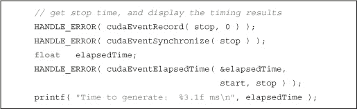
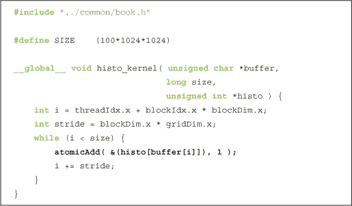

## 第九章：原子操作

在本书的前半部分，我们看到很多情况下，用单线程应用程序实现的复杂任务，在使用 CUDA C 实现时变得非常简单。例如，得益于 CUDA 运行时的后台工作，我们不再需要使用 `for()` 循环来进行动画或热模拟中的逐像素更新。同样，成千上万的并行块和线程被创建，并通过调用来自主机代码的 `__global__` 函数自动枚举线程和块索引。

另一方面，也有一些情况，在单线程应用程序中非常简单的操作，在我们尝试在大规模并行架构上实现同一算法时，实际上会变成一个严重的问题。在本章中，我们将看看一些需要使用特殊原语来安全地完成的情况，这些原语在传统的单线程应用程序中可以非常轻松地完成。

### 9.1 本章目标

在本章中，你将完成以下任务：

• 你将了解各种 NVIDIA GPU 的 *计算能力*。

• 你将了解什么是原子操作，以及为什么你可能需要它们。

• 你将学习如何在 CUDA C 核心中使用原子操作进行算术运算。

### 9.2 计算能力

目前为止我们讨论的所有主题涉及的是每个 CUDA 启用的 GPU 都具备的能力。例如，所有基于 CUDA 架构的 GPU 都可以启动内核，访问全局内存，并从常量和纹理内存中读取数据。但就像不同型号的 CPU 具有不同的能力和指令集（例如，MMX、SSE 或 SSE2），CUDA 启用的图形处理器也是如此。NVIDIA 将 GPU 支持的功能称为其 *计算能力*。

#### 9.2.1 NVIDIA GPU 的计算能力

截至目前，NVIDIA GPU 可能支持计算能力 1.0、1.1、1.2、1.3 或 2.0。更高的计算能力版本表示包含以下版本的超集，实现了一种“分层洋葱”或“俄罗斯套娃”层次结构（具体取决于你偏好的隐喻）。例如，计算能力为 1.2 的 GPU 支持计算能力 1.0 和 1.1 的所有特性。*NVIDIA CUDA 编程指南*包含了所有支持 CUDA 的 GPU 及其相应计算能力的最新列表。表 9.1 列出了截至目前的 NVIDIA GPU。每个 GPU 支持的计算能力会列在设备名称旁边。

***表 9.1*** 选定的 CUDA 启用 GPU 及其对应的计算能力

当然，由于 NVIDIA 不断发布新的图形处理器，这张表格在本书发布的瞬间可能就已经过时了。幸运的是，NVIDIA 有一个网站，在这个网站上你可以找到 CUDA 专区。在这个专区中，你可以找到最新的支持 CUDA 的设备列表。我们建议你在因找不到新 GPU 而考虑采取任何极端措施之前，先查阅这个列表。或者，你也可以直接运行第三章中的示例，打印出系统中每个 CUDA 设备的计算能力。

由于本章讨论的是原子操作，特别相关的是执行内存上原子操作的硬件能力。在我们了解什么是原子操作以及为何关心它们之前，你应该知道，只有计算能力为 1.1 及以上的 GPU 才支持在全局内存上的原子操作。此外，*共享*内存上的原子操作需要计算能力为 1.2 及以上的 GPU。由于计算能力版本是超集的关系，计算能力为 1.2 的 GPU 因此支持全局内存原子操作和共享内存原子操作。同样，计算能力为 1.3 的 GPU 也支持这两者。

如果结果显示你的 GPU 属于计算能力 1.0 且不支持全局内存上的原子操作，那么或许我们刚好给了你一个升级的完美理由！如果你决定暂时不准备为一块支持原子操作的新图形处理器大肆消费，你仍然可以继续阅读关于原子操作以及你可能想要使用它们的场景。但是，如果你发现不能运行示例让你感到太失望，随时可以跳到下一章。

#### 9.2.2 为最低计算能力编译

假设我们已经编写了需要某个最小计算能力的代码。例如，想象一下你已经完成了本章内容，并开始编写一个高度依赖全局内存原子操作的应用程序。经过本书的学习，你知道全局内存原子操作需要计算能力为 1.1。为了编译代码，你需要告知编译器该内核不能在计算能力低于 1.1 的硬件上运行。此外，告知编译器这些信息也让它可以进行其他优化，这些优化可能仅在计算能力为 1.1 或更高的 GPU 上可用。告知编译器这一点非常简单，只需在调用`nvcc`时添加一个命令行选项：

nvcc -arch=sm_11

类似地，要构建一个依赖于共享内存原子操作的内核，你需要告知编译器该代码需要计算能力 1.2 或更高：

nvcc -arch=sm_12

### 9.3 原子操作概述

程序员在编写传统的单线程应用程序时通常不需要使用原子操作。如果你正是这种情况，不必担心；我们计划解释原子操作是什么，以及为什么在多线程应用程序中可能需要它们。为了澄清原子操作，我们将回顾你在学习 C 或 C++ 时学到的其中一项内容——递增运算符：

x++;

这是标准 C 中的一个单一表达式，执行该表达式后，`x` 的值应该比递增操作之前多 1。但这意味着什么样的操作顺序呢？为了将 `x` 的值加 1，我们首先需要知道 `x` 当前的值。在读取 `x` 的值后，我们可以对其进行修改。最后，我们需要将这个值写回 `x`。

所以，这个操作的三个步骤如下：

1\. 读取 `x` 中的值。

2\. 将步骤 1 中读取的值加 1。

3\. 将结果写回 `x`。

有时，这个过程通常被称为 *读-修改-写* 操作，因为步骤 2 可以是任何更改从 `x` 读取的值的操作。

现在考虑一种情况，其中两个线程需要递增 `x` 中的值。我们称这两个线程为 `A` 和 `B`。为了让 `A` 和 `B` 都递增 `x` 的值，两个线程都需要执行我们已经描述的三个操作。假设 `x` 初始值为 7。理想情况下，我们希望线程 `A` 和线程 `B` 执行表 9.2 中显示的步骤。

***表 9.2*** 两个线程递增 `x` 的值

由于 `x` 初始值为 7，且由两个线程递增，我们期望在两个线程完成操作后 `x` 的值为 9。在前面的操作序列中，这确实是我们得到的结果。不幸的是，这些步骤有许多其他执行顺序，会产生错误的值。例如，考虑表 9.3 中所示的顺序，其中线程 A 和线程 B 的操作互相交替。

***表 9.3*** 两个线程交替操作，递增 `x` 的值

因此，如果我们的线程调度不利，最终会计算出错误的结果。这六个操作有许多不同的执行顺序，其中一些会产生正确的结果，而另一些则不会。当从单线程版本迁移到多线程版本时，如果多个线程需要读取或写入共享的值，我们突然就可能会得到不可预测的结果。

在前一个示例中，我们需要一种方式来执行 *读-修改-写* 操作，而不被其他线程打断。更具体地说，在我们完成操作之前，其他线程不能读取或写入 `x` 的值。由于这些操作的执行不能被其他线程分割成更小的部分，我们将满足这一约束的操作称为 *原子* 操作。CUDA C 支持多种原子操作，即使有成千上万的线程可能在争用访问内存时，也能安全地进行内存操作。

现在我们将通过一个示例来看看如何使用原子操作来计算正确的结果。

### 9.4 计算直方图

通常，算法需要计算某组数据的 *直方图*。如果你以前没有接触过直方图，也不用担心。基本上，给定一个由某组元素组成的数据集，直方图表示每个元素出现的频率。例如，如果我们为短语 *Programming with CUDA C* 创建一个字母直方图，我们最终会得到如 图 9.1 所示的结果。

***图 9.1*** 从字符串 *Programming with CUDA C* 构建的字母频率直方图

尽管描述和理解起来很简单，但在计算机科学中，计算数据的直方图却是一个相当常见的问题。它被广泛应用于图像处理、数据压缩、计算机视觉、机器学习、音频编码等算法中。我们将使用直方图计算作为以下代码示例的算法。

#### 9.4.1 CPU 直方图计算

由于直方图的计算可能对所有读者来说并不熟悉，我们将从一个如何在 CPU 上计算直方图的示例开始。这个示例也将帮助说明，在单线程的 CPU 应用中，计算直方图是相对简单的。该应用程序将接收一大段数据流。在实际应用中，数据可能代表从像素颜色到音频样本的任何内容，但在我们的示例应用中，它将是一个随机生成的字节流。我们可以使用我们提供的一个名为 `big_random_block()` 的工具函数来创建这个随机字节流。在我们的应用中，我们创建了 100MB 的随机数据。

由于每个随机的 8 位字节可以是 256 种不同的值（从 `0x00` 到 `0xFF`），我们的直方图需要包含 256 个 *桶*，以便跟踪每个值在数据中出现的次数。我们创建一个包含 256 个桶的数组，并将所有桶的计数初始化为零。

一旦我们的直方图创建完成，并且所有桶都初始化为零，我们需要统计每个值在`buffer[]`中的出现频率。这里的想法是，当我们在数组`buffer[]`中看到某个值`z`时，我们希望在直方图的桶`z`中递增值。这样，我们就能统计出值`z`出现的次数。

如果`buffer[i]`是我们正在查看的当前值，我们希望增加在编号为`buffer[i]`的桶中的计数。由于桶`buffer[i]`位于`histo[buffer[i]]`，因此我们可以通过一行代码增加相应的计数器。

histo[buffer[i]]++;

我们通过一个简单的`for()`循环为`buffer[]`中的每个元素执行此操作：

到此为止，我们已经完成了输入数据的直方图计算。在完整的应用程序中，这个直方图可能是下一步计算的输入。然而，在我们的简单示例中，这就是我们要计算的全部内容，所以我们通过验证所有桶的总和是否符合预期值来结束应用程序。

如果你仔细观察，你会发现这个总和总是相同的，无论输入数组是什么样的随机数据。每个桶都统计了我们看到相应数据元素的次数，因此这些桶的总和应该是我们检查过的所有数据元素的总数。在我们的例子中，这个总和就是`SIZE`的值。

不用多说（但我们还是要说），我们会在操作完成后清理干净，并返回。

在我们的基准机器上，一个 Core 2 Duo 处理器，这个 100MB 的数据数组的直方图可以在 0.416 秒内构建完成。这将为我们打算编写的 GPU 版本提供一个基准性能。

#### 9.4.2 GPU 直方图计算

我们希望将直方图计算示例适配到 GPU 上运行。如果我们的输入数组足够大，那么让不同的线程处理缓冲区的不同部分可能会节省大量时间。让不同的线程读取输入的不同部分应该足够简单。毕竟，这与我们迄今为止所看到的内容非常相似。问题在于，从输入数据计算直方图时，多个线程可能会同时想要递增输出直方图的同一个桶。在这种情况下，我们需要使用原子递增来避免出现第 9.3 节中描述的情况：原子操作概述。

我们的`main()`例程与 CPU 版本非常相似，尽管我们需要添加一些 CUDA C 的代码来将输入传递到 GPU，并从 GPU 获取结果。然而，我们的开始方式和在 CPU 上完全一样：

我们将关注如何测量代码的执行性能，因此我们像往常一样初始化事件来精确计时。

在设置好输入数据和事件后，我们开始查看 GPU 内存。我们需要为随机输入数据和输出直方图分配空间。在分配输入缓冲区后，我们将使用`big_random_block()`生成的数组复制到 GPU。同样，在分配完直方图后，我们像在 CPU 版本中一样将其初始化为零。

你可能注意到我们引入了一个新的 CUDA 运行时函数`cudaMemset()`。该函数的签名与标准 C 函数`memset()`类似，且这两个函数的行为几乎相同。这两个函数的签名区别在于，`cudaMemset()`会返回一个错误码，而 C 库函数`memset()`则不会。这个错误码会告知调用者在设置 GPU 内存时是否发生了错误。除了返回错误码外，唯一的区别是，`cudaMemset()`作用于 GPU 内存，而`memset()`作用于主机内存。

在初始化输入和输出缓冲区之后，我们准备开始计算直方图。稍后你将看到我们如何准备并启动直方图内核。目前，假设我们已经在 GPU 上计算好了直方图。完成后，我们需要将直方图复制回 CPU，因此我们分配了一个 256 项的数组，并执行从设备到主机的复制操作。

到此为止，我们完成了直方图的计算，因此可以停止计时器并显示经过的时间。就像之前的事件代码一样，这与我们在几个章节中使用的计时代码相同。

到此为止，我们可以将直方图作为输入传递给算法的另一个阶段，但由于我们不会将直方图用于其他目的，我们将简单地验证计算出来的 GPU 直方图是否与 CPU 得到的结果匹配。首先，我们验证直方图的总和是否符合预期。这与这里显示的 CPU 代码完全相同：

然而，为了完全验证 GPU 直方图，我们将使用 CPU 来计算相同的直方图。显而易见的方法是分配一个新的直方图数组，使用第 9.4.1 节中的代码：CPU 直方图计算，从输入数据计算直方图，然后确保 GPU 和 CPU 版本中的每个数据箱匹配。但我们不打算分配一个新的直方图数组，而是选择从 GPU 直方图开始，并“反向”计算 CPU 直方图。

通过“反向计算”直方图，我们的意思是，不是从零开始，在看到数据元素时递增桶的值，而是从 GPU 的直方图开始，当 CPU 看到数据元素时*递减*桶的值。因此，只有当我们完成时，每个桶的值都为零，CPU 计算出的直方图与 GPU 计算的直方图才是相同的。从某种意义上讲，我们正在计算这两个直方图之间的差异。代码看起来会非常像 CPU 的直方图计算，但我们使用的是递减操作符，而不是递增操作符。

和往常一样，最后一步是清理我们分配的 CUDA 事件、GPU 内存和主机内存。

之前，我们假设已经启动了一个计算直方图的内核，然后继续讨论后续的内容。由于性能考虑，我们的内核启动比平常稍微复杂一些。因为直方图包含 256 个桶，所以每个块使用 256 个线程既方便又能获得高性能。但在启动块的数量上，我们有很大的灵活性。例如，对于 100MB 的数据，我们有 104,857,600 字节的数据。我们可以启动一个块，让每个线程处理 409,600 个数据元素。同样，我们也可以启动 409,600 个块，让每个线程处理一个数据元素。

正如你可能猜到的，最佳解决方案位于这两种极端之间。通过进行一些性能实验，最佳性能出现在我们启动的块数恰好是 GPU 中多处理器数量的两倍时。例如，一块 GeForce GTX 280 拥有 30 个多处理器，因此，当启动 60 个并行块时，我们的直方图内核在 GeForce GTX 280 上的运行速度最快。

在第三章中，我们讨论了查询程序运行所在硬件各种属性的方法。如果我们打算根据当前的硬件平台动态调整启动参数，我们将需要使用其中一种设备属性。为了实现这一点，我们将使用以下代码段。虽然你还没有看到内核实现，但你应该仍然能够理解发生了什么。

由于我们对`main()`的讲解有些零散，下面是从头到尾的完整代码：

##### 使用全局内存原子操作的直方图内核

现在进入有趣的部分：计算直方图的 GPU 代码！计算直方图的内核需要传入输入数据数组的指针、输入数组的长度，以及输出直方图的指针。我们内核需要计算的第一件事是输入数据数组的线性化偏移量。每个线程将从 0 到线程数减 1 之间的一个偏移量开始。然后，它将按已启动的线程总数进行步进。希望你还记得这种技术；我们在第一次学习线程时使用相同的逻辑来加法运算任意长度的向量。

一旦每个线程知道了它的起始偏移量`i`和它应该使用的步幅，代码就会遍历输入数组，递增相应的直方图桶。

高亮的那一行表示我们在 CUDA C 中使用原子操作的方式。调用`atomicAdd( addr, y );`会生成一系列原子操作，这些操作先读取地址`addr`处的值，再将`y`加到该值上，并将结果写回地址`addr`。硬件保证，在我们执行这些操作时，没有其他线程可以读取或写入地址`addr`处的值，从而确保了结果的可预测性。在我们的例子中，相关地址是与当前字节对应的直方图桶的位置。如果当前字节是`buffer[i]`，就像我们在 CPU 版本中看到的那样，对应的直方图桶就是`histo[buffer[i]]`。原子操作需要这个桶的地址，因此第一个参数是`&(histo[buffer[i]])`。由于我们只需要将该桶中的值递增 1，所以第二个参数是 1。

所以，经过这一番折腾后，我们的 GPU 直方图计算与相应的 CPU 版本非常相似。

然而，我们需要等到以后再庆祝。在运行这个例子后，我们发现一块 GeForce GTX 285 显卡能在 1.752 秒内从 100MB 的输入数据构建一个直方图。如果你阅读关于基于 CPU 的直方图部分，你会意识到这个性能很糟糕。事实上，这比 CPU 版本慢了四倍多！但这就是我们为什么总是测量基准性能的原因。如果仅仅因为它在 GPU 上运行，就满足于这样的低性能实现，那将是一个遗憾。

由于我们在内核中进行的工作非常少，因此很可能是对全局内存的原子操作引发了问题。实际上，当成千上万的线程试图访问少量内存位置时，我们的 256 个直方图桶会出现大量争用。为了确保增量操作的原子性，硬件需要对访问同一内存位置的操作进行序列化。这可能导致大量待处理操作的队列，而我们可能获得的任何性能提升都会消失。我们将需要改进算法本身，以恢复这一性能。

##### 使用共享和全局内存原子操作的直方图内核

具有讽刺意味的是，尽管原子操作会导致性能下降，但缓解这种慢速实际上需要使用*更多*的原子操作，而不是更少。核心问题并非是使用原子操作，而是成千上万的线程在竞争访问相对较少的内存地址。为了解决这个问题，我们将把直方图计算分为两个阶段。

在第一个阶段，每个并行块将计算它所处理的数据的单独直方图。由于每个块都是独立执行这一操作的，因此我们可以在共享内存中计算这些直方图，从而节省将每个写入操作传输到 DRAM 的时间。不过，这并不能让我们摆脱使用原子操作的需求，因为块内的多个线程仍然可能会检查具有相同值的数据元素。然而，只有 256 个线程将竞争 256 个地址，这将减少来自全局版本中的成千上万线程的竞争。

第一个阶段涉及分配并归零一个共享内存缓冲区，用于存储每个块的中间直方图。回顾第五章，由于后续步骤将涉及读取和修改这个缓冲区，因此我们需要一个`__syncthreads()`调用，以确保每个线程的写操作完成后再进行下一步。

在将直方图归零后，下一步与我们最初的 GPU 直方图非常相似。唯一的区别是，我们使用共享内存缓冲区`temp[]`代替全局内存缓冲区`histo[]`，并且我们需要随后的`__syncthreads()`调用，以确保我们最后的写入操作已被提交。

我们修改后的直方图示例的最后一步要求我们将每个块的临时直方图合并到全局缓冲区`histo[]`中。假设我们将输入分为两半，两个线程分别查看不同的半部分并计算各自的直方图。如果线程 A 在输入中看到字节`0xFC` 20 次，线程 B 看到字节`0xFC` 5 次，那么字节`0xFC`在输入中应该出现了 25 次。同样，最终直方图的每个桶就是线程 A 和线程 B 直方图中相应桶的总和。这一逻辑适用于任意数量的线程，因此将每个块的直方图合并成一个最终的直方图需要将每个块直方图中的每个条目添加到最终直方图中相应的条目。出于我们已经看到的所有原因，这必须以原子方式进行：

由于我们决定使用 256 个线程，并且有 256 个直方图桶，每个线程原子地将一个桶添加到最终直方图的总和中。如果这些数字不匹配，这一阶段将会更加复杂。请注意，我们无法保证各个块将值添加到最终直方图的顺序，但是由于整数加法是交换律的，所以只要加法是原子性的，我们总会得到相同的结果。

至此，我们的两阶段直方图计算内核已经完成。以下是从头到尾的代码：

这个版本的直方图示例在性能上比之前的 GPU 版本有了显著提升。加入共享内存组件后，我们在 GeForce GTX 285 上的运行时间降到了 0.057 秒。这不仅比只使用全局内存原子操作的版本好得多，而且比我们最初的 CPU 实现快了一个数量级（从 0.416 秒降到 0.057 秒）。这个改进意味着我们比 CPU 版本快了七倍以上。因此，尽管在将直方图移植到 GPU 实现时遇到了一些初步的挫折，但我们使用共享内存和全局内存原子操作的版本应该被视为一个成功。

### 9.5 章节回顾

尽管我们曾多次详细讨论过使用 CUDA C 进行并行编程的简便性，但我们大多忽视了当 GPU 等大规模并行架构让我们的编程生活变得更加复杂的一些情况。试图应对成千上万的线程同时修改相同内存地址的情况，就是一个典型的例子，在这种情况下，大规模并行机器可能会显得负担沉重。幸运的是，我们有硬件支持的原子操作可以帮助缓解这种痛苦。

然而，正如你在直方图计算中所看到的，有时依赖原子操作会引入性能问题，这些问题只有通过重新思考算法的某些部分才能解决。在直方图示例中，我们采用了一个两阶段的算法，缓解了对全局内存地址的争用。通常，减少内存争用的策略往往效果不错，在你自己应用程序中使用原子操作时，应该牢记这一点。
