## **第十章 流**

在本书中，我们一次又一次地看到，GPU 上大规模数据并行执行引擎能够提供比可比的 CPU 代码更惊人的性能提升。然而，NVIDIA 图形处理器上还有另一种并行性等待我们去利用。这种并行性类似于多线程 CPU 应用中的*任务并行性*。与数据并行性通过在大量数据元素上同时计算相同的函数不同，任务并行性涉及同时执行两个或更多完全不同的任务。

在并行处理的背景下，*任务*可以是任何数量的事情。例如，一个应用程序可能同时执行两个任务：一个线程重绘其图形用户界面（GUI），而另一个线程通过网络下载更新。这些任务并行进行，尽管它们没有任何共同之处。虽然 GPU 上的任务并行性目前不如通用处理器那样灵活，但它仍然为我们作为程序员提供了更多从 GPU 实现中提取速度的机会。在本章中，我们将探讨 CUDA 流，以及如何通过谨慎使用它们在 GPU 上同时执行某些操作。

### **10.1 本章目标**

在本章的过程中，你将完成以下任务：

• 你将学习如何分配页面锁定的主机内存。

• 你将学习什么是 CUDA *流*。

• 你将学习如何使用 CUDA 流来加速你的应用程序。

### **10.2 页面锁定的主机内存**

在过去九章的每个示例中，你都看到了我们使用`cudaMalloc()`在 GPU 上分配内存。在主机上，我们一直使用标准的 C 库例程`malloc()`分配内存。然而，CUDA 运行时提供了自己的主机内存分配机制：`cudaHostAlloc()`。既然`malloc()`从你成为 C 程序员的第一天起就已经很好地为你服务了，那么为什么还要使用这个函数呢？

实际上，`malloc()`分配的内存和`cudaHostAlloc()`分配的内存有显著的不同。C 库函数`malloc()`分配的是标准的、可分页的主机内存，而`cudaHostAlloc()`分配的是*页面锁定*的主机内存。有时称为*固定*内存，页面锁定的缓冲区具有一个重要特性：操作系统保证它永远不会将这块内存分页到磁盘，从而确保它常驻物理内存。与此相关的是，操作系统可以安全地允许应用程序访问这块内存的物理地址，因为该缓冲区不会被逐出或重新定位。

知道缓冲区的物理地址后，GPU 可以使用直接内存访问（DMA）将数据复制到主机或从主机复制数据。由于 DMA 复制在没有 CPU 干预的情况下进行，这也意味着 CPU 可以同时将这些缓冲区换出到磁盘或通过更新操作系统的页表来重新定位它们的物理地址。CPU 移动可分页数据的可能性意味着使用固定内存进行 DMA 复制是至关重要的。事实上，即使你尝试使用可分页内存执行内存复制，CUDA 驱动程序仍然使用 DMA 将缓冲区传输到 GPU。因此，你的复制发生了两次，第一次是从可分页系统缓冲区到页面锁定的“暂存”缓冲区，然后是从页面锁定的系统缓冲区到 GPU。

因此，每当你从可分页内存执行内存复制时，你可以保证复制速度将受限于 PCIE 传输速度和系统前端总线速度中的*较低*者。在某些系统中，这些总线之间带宽的巨大差异确保了页面锁定的主机内存在用于在 GPU 和主机之间复制数据时，享有大约两倍的性能优势。但即使在 PCI Express 和前端总线速度相同的情况下，可分页缓冲区仍会产生额外的 CPU 管理复制的开销。

然而，你应该抵制简单地对*malloc*进行搜索和替换，以将你所有的调用转换为使用`cudaHostAlloc()`。使用固定内存是一把双刃剑。这样做，你实际上是放弃了虚拟内存的所有优良特性。具体来说，运行应用程序的计算机需要为每个页面锁定的缓冲区提供可用的物理内存，因为这些缓冲区永远无法被换出到磁盘。这意味着你的系统将比坚持使用标准`malloc()`调用时更快地耗尽内存。这不仅意味着你的应用程序可能会在物理内存较小的机器上开始失败，还意味着你的应用程序可能会影响系统上其他应用程序的性能。

这些警告并不是要吓跑你使用`cudaHostAlloc()`，但你应该意识到页面锁定缓冲区的影响。我们建议尽量将它们的使用限制在将作为`cudaMemcpy()`调用的源或目标的内存中，并在不再需要时释放它们，而不是等到应用程序关闭时再释放内存。使用`cudaHostAlloc()`应该和你到目前为止学习的其他内容一样简单，但让我们来看一个示例，既说明了如何分配固定内存，又展示了它相对于标准可分页内存的性能优势。

我们的应用程序将非常简单，主要用于基准测试`cudaMemcpy()`在页面内存和页锁定内存中的性能。我们要做的就是分配一个 GPU 缓冲区和一个主机缓冲区，它们的大小匹配，然后在这两个缓冲区之间执行一些复制操作。我们允许基准测试的用户指定复制的方向，可以是“向上”（从主机到设备）或“向下”（从设备到主机）。你还会注意到，为了获得准确的时间，我们设置了 CUDA 事件来标记复制序列的开始和结束。你可能记得之前的性能测试示例中是如何做的，但如果你忘了，接下来的内容会提醒你：

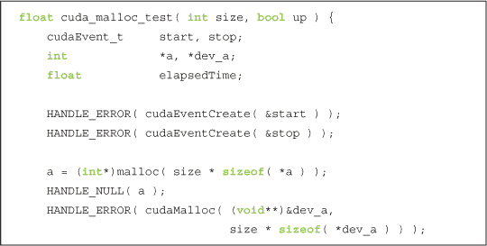

不论复制的方向如何，我们首先分配一个主机和 GPU 的缓冲区，大小为`size`个整数。之后，我们按照`up`参数指定的方向进行 100 次复制，完成复制后停止计时。

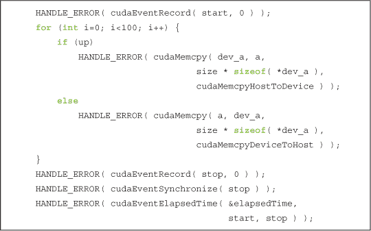

在完成 100 次复制后，清理工作包括释放主机和 GPU 缓冲区，并销毁我们的计时事件。

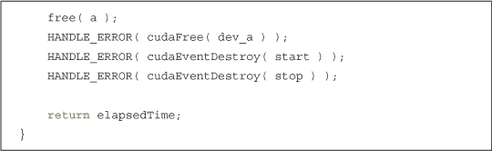

如果你没有注意到，`cuda_malloc_test()`函数使用标准的 C 语言`malloc()`例程分配了可分页的主机内存。页锁定内存版本则使用`cudaHostAlloc()`来分配页锁定缓冲区。

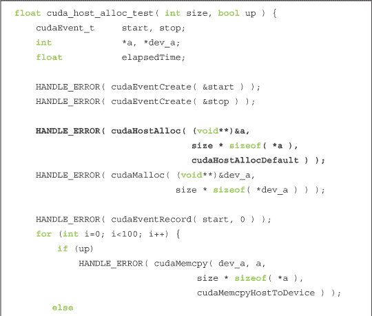

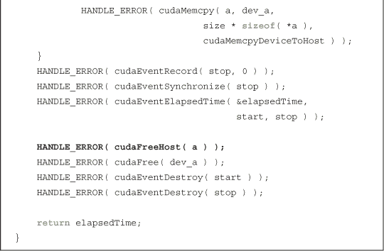

如你所见，`cudaHostAlloc()`分配的缓冲区与使用`malloc()`分配的缓冲区用法相同。与`malloc()`的另一个区别在于最后一个参数，即`cudaHostAllocDefault`。这个最后的参数存储了一组标志，我们可以使用这些标志来修改`cudaHostAlloc()`的行为，从而分配其他类型的页锁定主机内存。在下一章中，我们将看到如何使用这些标志的其他可能值，但目前我们只使用默认的页锁定内存，因此传递`cudaHostAllocDefault`来获取默认行为。要释放使用`cudaHostAlloc()`分配的缓冲区，我们必须使用`cudaFreeHost()`。也就是说，每个`malloc()`都需要一个`free()`，每个`cudaHostAlloc()`都需要一个`cudaFreeHost()`。

`main()`函数的主体执行方式与你预期的差不多。

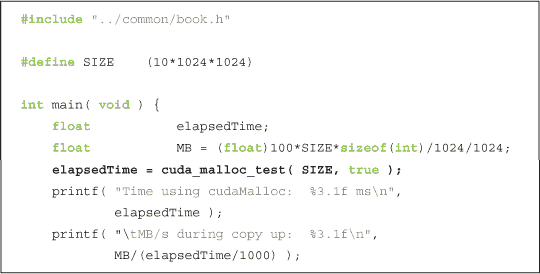

因为`cuda_malloc_test()`函数的`up`参数为`true`，所以之前的调用测试了从主机到设备的复制性能，也就是“向上”复制到设备。为了基准测试相反方向的调用，我们执行相同的调用，但第二个参数设为`false`。

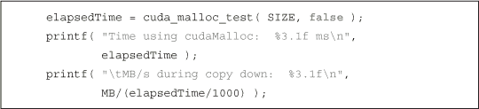

我们执行相同的一系列步骤来测试`cudaHostAlloc()`的性能。我们调用`cuda_host_alloc_test()`两次，一次`up`为`true`，一次为`false`。

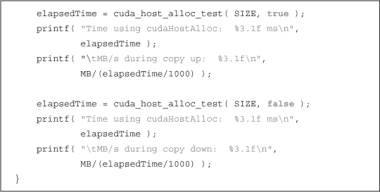

在 GeForce GTX 285 上，我们观察到从主机到设备的拷贝速度从 2.77GB/s 提高到 5.11GB/s，使用的是固定内存而不是可分页内存。从设备到主机的拷贝速度也有类似的提升，从 2.43GB/s 提高到 5.46GB/s。因此，对于大多数受限于 PCIE 带宽的应用程序，当使用固定内存而非标准的可分页内存时，你会注意到明显的性能提升。但页面锁定内存不仅仅是为了性能提升。正如我们将在接下来的章节中看到的那样，在某些情况下，我们*必须*使用页面锁定内存。

### **10.3 CUDA 流**

在第六章中，我们介绍了 CUDA 事件的概念。在这样做时，我们推迟了对`cudaEventRecord()`第二个参数的深入讨论，而只是提到它指定了我们将事件插入的*流*。

CUDA 流在加速你的应用程序中可以发挥重要作用。CUDA *流*表示 GPU 操作的队列，这些操作会按特定顺序执行。我们可以将内核启动、内存拷贝以及事件的启动和停止等操作添加到流中。添加到流中的操作顺序决定了它们将执行的顺序。你可以将每个流视为 GPU 上的一个*任务*，这些任务有机会并行执行。我们将首先看到流是如何使用的，然后再看看你如何利用流来加速你的应用程序。

### **10.4 使用单个 CUDA 流**

如我们稍后所见，流的真正威力只有在使用多个流时才会显现，但我们将首先通过一个只使用单个流的应用程序来说明其使用机制。假设我们有一个 CUDA C 内核，它将接受两个输入数据缓冲区`a`和`b`。该内核将基于这些缓冲区中的值的组合计算某些结果，并生成一个输出缓冲区`c`。我们的向量加法示例做了类似的事情，但在这个示例中，我们将计算`a`中的三个值和`b`中的三个值的平均值：

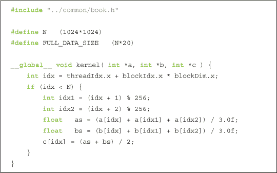

这个内核并不是非常重要，因此如果你不确定它究竟要计算什么，不必过于纠结。它算是一个占位符，因为这个示例中重要的、与流相关的部分在`main()`中。

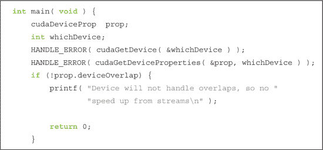

我们首先要做的是选择一个设备，并检查它是否支持一种叫做*设备重叠*的特性。支持设备重叠的 GPU 具有在执行 CUDA C 内核的同时，进行设备和主机内存拷贝的能力。正如我们之前承诺的那样，我们将使用多个流来实现计算和数据传输的重叠，但首先我们将看看如何创建和使用单个流。与我们所有旨在衡量性能提升（或回退）的示例一样，我们首先通过创建和启动事件计时器来开始：

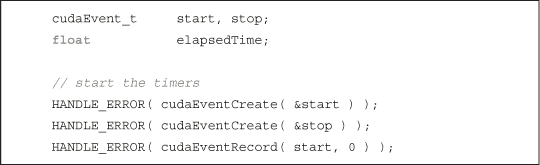

启动计时器后，我们创建了用于此应用程序的流：

是的，创建流几乎就这么简单。其实没有必要在这上面花太多时间，所以我们继续进行数据分配。

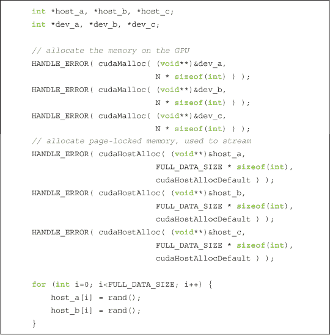

我们已经在 GPU 和主机上分配了输入和输出缓冲区。请注意，我们决定通过使用`cudaHostAlloc()`来使用固定内存进行主机内存的分配。使用固定内存有一个非常好的理由，而不仅仅是因为它使复制速度更快。我们稍后会详细说明，但我们将使用一种新的`cudaMemcpy()`函数，这个新函数*要求*主机内存是页面锁定的。在分配输入缓冲区后，我们使用 C 库调用`rand()`将随机整数填充到主机分配的内存中。

在创建了我们的流和计时事件，分配了设备和主机缓冲区之后，我们已经准备好进行一些计算！通常，我们通过将两个输入缓冲区复制到 GPU，启动内核，并将输出缓冲区复制回主机来快速完成这个阶段。我们将再次遵循这个模式，但这次会有一些小的变化。

首先，我们选择*不*将输入缓冲区完整地复制到 GPU。相反，我们将输入拆分成更小的块，并对每个块执行三步过程。也就是说，我们将取输入缓冲区的一部分，复制到 GPU，执行内核操作，再将输出缓冲区的相应部分复制回主机。可以想象，由于我们的 GPU 内存远小于主机内存，因此需要分块处理计算，因为整个缓冲区无法一次性加载到 GPU 上。执行这个“分块”计算过程的代码如下所示：

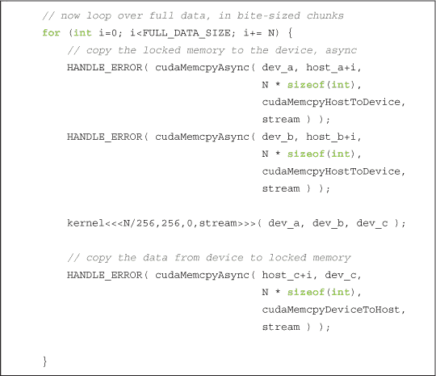

但你会注意到前面摘录中的两个其他意外变化。首先， вместо 使用熟悉的`cudaMemcpy()`，我们用一个新例程`cudaMemcpyAsync()`来进行数据的复制。两个函数的区别是微妙却显著的。原始的`cudaMemcpy()`行为像 C 库函数`memcpy()`。具体来说，这个函数是*同步*执行的，意味着当函数返回时，复制操作已经完成，输出缓冲区现在包含了应该复制到其中的内容。

*同步*函数的反义是*异步*函数，这也启发了`cudaMemcpyAsync()`这个名字。调用`cudaMemcpyAsync()`只会将一个*请求*放入由`stream`参数指定的流中，以执行内存拷贝。当调用返回时，无法保证拷贝是否已经开始，更不用说是否已经完成了。我们得到的保证是，在同一流中放入的下一个操作之前，拷贝一定会执行。要求传递给`cudaMemcpyAsync()`的任何主机内存指针必须通过`cudaHostAlloc()`分配。也就是说，你只能调度异步拷贝到或从页面锁定的内存中。

请注意，角括号中的内核启动也接受一个可选的流参数。这个内核启动是异步的，就像前面提到的两个内存拷贝到 GPU 以及从 GPU 回传的内存拷贝一样。从技术上讲，我们可以在没有实际启动任何内存拷贝或内核执行的情况下结束这个循环的一次迭代。正如我们之前提到的，我们唯一可以保证的是，流中放入的第一个拷贝会在第二个拷贝之前执行。而且，第二个拷贝会在内核启动之前完成，内核会在第三个拷贝开始之前完成。所以，正如我们在本章前面提到的，流就像是一个按顺序排列的任务队列，供 GPU 执行。

当`for()`循环终止时，GPU 可能仍然有相当多的工作需要完成。如果我们希望确保 GPU 完成其计算和内存拷贝，我们需要将其与主机同步。也就是说，我们基本上是要告诉主机在 GPU 完成之前等着，然后再继续。我们通过调用`cudaStreamSynchronize()`并指定要等待的流来实现这一点：

由于在与主机同步`stream`后，计算和拷贝已经完成，我们可以停止计时器，收集性能数据，并释放输入输出缓冲区。

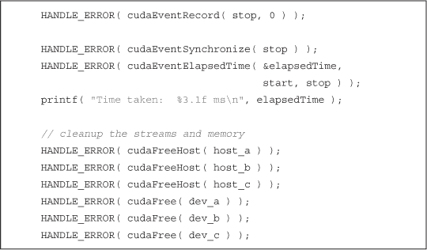

最后，在退出应用程序之前，我们销毁了用于排队 GPU 操作的流。

坦白说，这个例子对于展示流的强大功能几乎没有什么帮助。当然，即使只使用一个流，如果我们在 GPU 忙于处理我们放入流中的任务时，主机有一些工作需要完成，使用流也能帮助加速应用程序。但假设我们在主机上没有太多事情需要做，我们仍然可以通过使用流来加速应用程序，在接下来的章节中，我们将看看如何实现这一点。

### **10.5 使用多个 CUDA 流**

让我们改编第 10.4 节中的单流示例：使用单个 CUDA 流在两个不同的流中执行工作。在之前的示例开始时，我们检查了设备是否确实支持*重叠*，并将计算分解为多个块。该应用改进版本的基本思想很简单，依赖于两件事：分块计算和内存拷贝与内核执行的重叠。我们努力让流 1 在流 0 执行其内核时将输入缓冲区拷贝到 GPU 上。然后，流 1 将在流 0 将其结果拷贝到主机时执行其内核。接着，流 1 将把其结果拷贝到主机，而流 0 开始在下一个数据块上执行其内核。假设我们的内存拷贝和内核执行大致需要相同的时间，我们的应用执行时间线可能如下所示：图 10.1。图中假设 GPU 可以同时执行内存拷贝和内核执行，因此空白框表示一个流在等待执行它无法与另一个流的操作重叠的操作时的时间。还请注意，本章其余图中的`cudaMemcpyAsync()`调用被简化表示为“`memcpy`”。

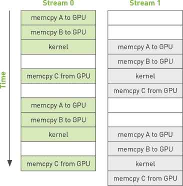

***图 10.1*** 使用两个独立流执行应用程序的预期时间线

事实上，执行时间线甚至可以比这更有利；一些较新的 NVIDIA GPU 支持同时执行内核并进行*两次*内存拷贝，一次是*到*设备，另一次是*从*设备。但在任何支持内存拷贝和内核执行重叠的设备上，当我们使用多个流时，整体应用应该会加速。

尽管我们有这些宏大的计划来加速我们的应用，计算内核将保持不变。

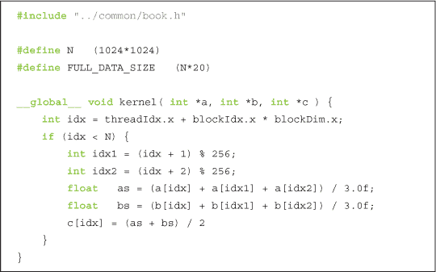

与单流版本一样，我们将检查设备是否支持计算与内存拷贝的重叠。如果设备*确实*支持重叠，我们将像之前一样通过创建 CUDA 事件来计时应用。

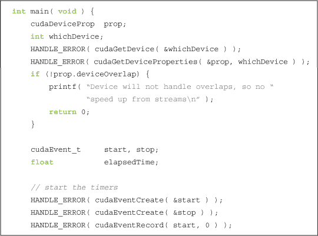

接下来，我们将像在上一节的单流版本代码中一样创建两个流。

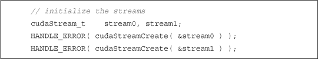

我们假设主机上仍然有两个输入缓冲区和一个输出缓冲区。这些输入缓冲区像单流版本应用中那样，已经填充了随机数据。然而，由于我们现在打算使用两个流来处理数据，我们为每个流分配了两组相同的 GPU 缓冲区，以便每个流可以独立地处理输入块。

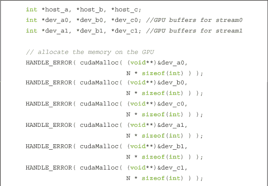

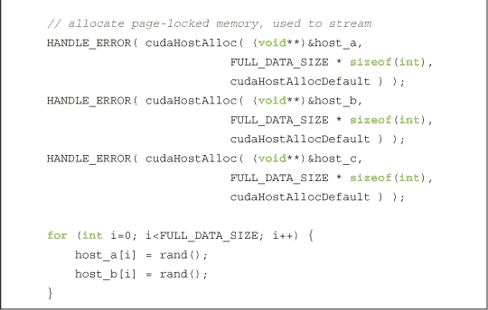

然后，我们像第一次尝试这个应用时一样，遍历输入数据块。但是现在我们使用了两个流，因此在`for()`循环的每次迭代中，我们处理的数据量是原来的两倍。在`stream0`中，我们排入异步复制操作，将`a`和`b`复制到 GPU，排入一个内核执行，并将结果复制回`c`：

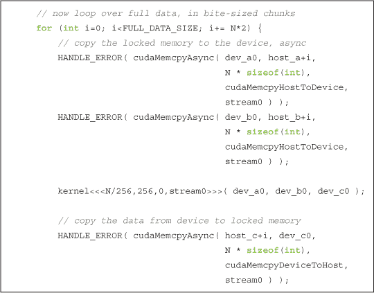

在将这些操作排入`stream0`队列后，我们将相同的操作排入下一个数据块，但这次是在`stream1`中。

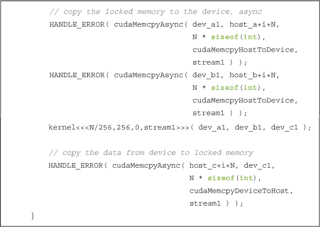

于是我们的`for()`循环继续进行，交替地将每个数据块排入不同的流，直到所有输入数据都排入处理队列。在结束`for()`循环后，我们先同步 GPU 与 CPU，然后再停止应用程序计时器。由于我们在使用两个流，所以需要同步这两个流。

我们像结束单流实现时一样结束了`main()`函数。我们停止计时器，显示经过的时间，并进行清理。当然，我们记得现在需要销毁两个流，并释放两倍数量的 GPU 缓冲区，除此之外，这段代码与我们之前看到的完全相同：

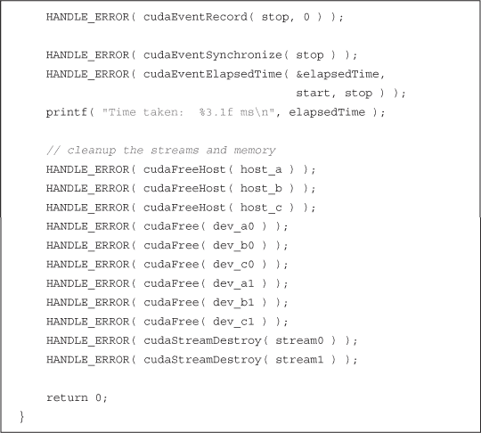

我们对第 10.4 节：使用单个 CUDA 流中的原始单流实现以及改进后的双流版本在 GeForce GTX 285 上进行了基准测试。原始版本运行完成需要 62 毫秒。修改为使用两个流后，耗时 61 毫秒。

哎呀。

好消息是，这就是我们为何要计时应用程序的原因。有时，我们最初意图优化性能的“增强”反而只是给代码带来了不必要的复杂性。

那么，为什么这个应用程序并没有变得更快呢？我们甚至说它会更快！不过别灰心，因为我们实际上*可以*通过第二个流加速单流版本，但我们需要更多了解 CUDA 驱动如何处理流，才能真正利用设备重叠带来的好处。为了理解流是如何在幕后工作的，我们需要了解 CUDA 驱动和 CUDA 硬件架构是如何工作的。

### **10.6 GPU 工作调度**

虽然流在逻辑上是独立的 GPU 操作队列，但事实证明，这种抽象并不完全符合 GPU 的排队机制。作为程序员，我们通常将流视为包含内存复制和内核调用混合的有序操作序列。然而，硬件并没有流的概念。相反，它有一个或多个用于执行内存复制的引擎，以及一个用于执行内核的引擎。这些引擎独立排队命令，导致类似图 10.2 所示的任务调度场景。图中的箭头展示了已经排入流中的操作如何调度到硬件引擎进行实际执行。

因此，用户和硬件在排队 GPU 工作的方式上有一些不同的看法，而保持用户和硬件两边都满足的责任落在 CUDA 驱动程序上。首先，操作被添加到流中的顺序指定了一些重要的依赖关系。例如，在图 10.2 中，流 0 对 A 的内存复制需要在对 B 的内存复制之前完成，而对 B 的内存复制又需要在内核 A 启动之前完成。但是，一旦这些操作被放入硬件的复制引擎和内核引擎队列中，这些依赖关系就丢失了，因此 CUDA 驱动程序需要确保硬件的执行单元保持流内依赖关系的满足，以让所有方面都能正常工作。

***图 10.2*** CUDA 流映射到 GPU 引擎

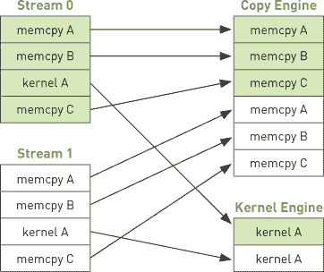

这对我们意味着什么呢？好吧，让我们看看在第 10.5 节：使用多个 CUDA 流中的示例实际发生了什么。如果我们回顾代码，会发现我们的应用程序基本上是对 `a` 的 `cudaMemcpyAsync()`、对 `b` 的 `cudaMemcpyAsync()`、我们的内核执行，然后是将 `c` 传回主机的 `cudaMemcpyAsync()`。应用程序将流 0 中的所有操作排队，然后是流 1 中的所有操作。CUDA 驱动程序按照我们指定的顺序将这些操作调度到硬件上，确保引擎之间的依赖关系得以正确处理。这些依赖关系在图 10.3 中进行了说明，箭头从复制到内核表示复制依赖于内核执行完成后才能开始。

***图 10.3*** 箭头表示 `cudaMemcpyAsync()` 调用依赖于示例中第 10.5 节：使用多个 CUDA 流中的内核执行

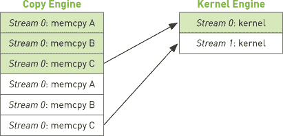

通过我们对 GPU 调度工作的新理解，我们可以查看在硬件上如何执行这些操作的时间线，见图 10.4。

***图 10.4*** 示例执行时间线，来自第 10.5 节：使用多个 CUDA 流

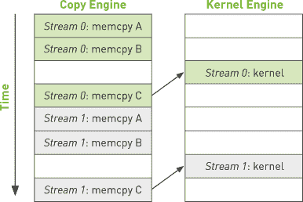

因为流 0 中的 `c` 的拷贝回主机取决于其内核执行的完成，流 1 中完全独立的 `a` 和 `b` 的拷贝到 GPU 会被阻塞，因为 GPU 的引擎按照给定的顺序执行工作。这种低效性解释了为什么我们应用程序的双流版本没有任何加速。没有改进的原因是我们假设硬件的工作方式与 CUDA 流编程模型所暗示的相同。

这个故事的寓意是，我们作为程序员，需要在确保独立流实际并行执行时提供帮助。考虑到硬件具有独立的引擎来处理内存拷贝和内核执行，我们需要意识到，操作在流中排队的顺序会影响 CUDA 驱动程序调度这些操作的方式。在下一节中，我们将看到如何帮助硬件实现内存拷贝和内核执行的重叠。

### **10.7 有效使用多个 CUDA 流**

正如我们在上一节中看到的，如果我们一次调度某个特定流的所有操作，就很容易不小心阻塞另一个流的拷贝或内核执行。为了解决这个问题，足够做的是广度优先地将操作排入队列，而不是深度优先。也就是说，我们不将 `a` 的拷贝、`b` 的拷贝、内核执行和 `c` 的拷贝都添加到流 0 中，然后再开始调度流 1，而是来回在流之间分配工作。我们将 `a` 的拷贝添加到流 0，然后将 `a` 的拷贝添加到流 1。接着，我们将 `b` 的拷贝添加到流 0，然后将 `b` 的拷贝添加到流 1。我们在流 0 中排队执行内核调用，然后在流 1 中也排队一个。最后，我们将 `c` 的拷贝返回到主机并排入流 0，然后将 `c` 的拷贝排入流 1。

为了使这一点更加具体，我们来看看代码。我们所做的唯一改变是分配操作到每个流的顺序，因此这将严格是一个复制粘贴优化。应用程序中的其他部分将保持不变，这意味着我们的改进仅限于 `for()` 循环。新的、广度优先的流分配如下所示：

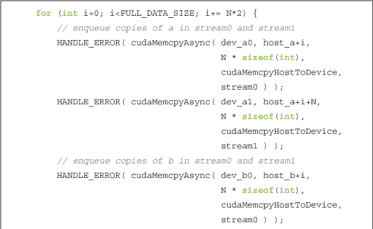

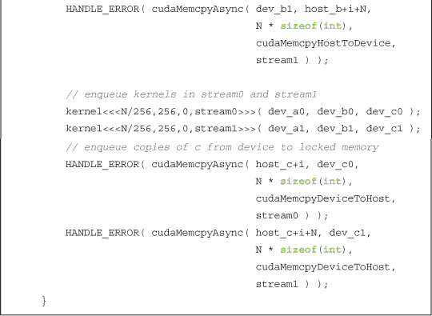

如果我们假设内存拷贝和内核执行的执行时间大致相当，那么我们的新执行时间线将如下所示 图 10.5。引擎间的依赖关系通过箭头突出显示，旨在说明它们仍然在这个新的调度顺序中得以满足。

***图 10.5*** 改进示例的执行时间线，箭头表示引擎间的依赖关系

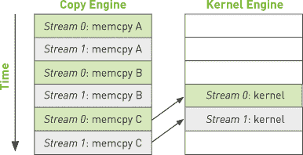

因为我们已经按照宽度优先的方式排队操作流，所以不再有流 0 的`c`副本阻塞流 1 最初的`a`和`b`的内存复制。这使得 GPU 可以并行执行复制和内核，从而显著提高了应用程序的运行速度。新代码的运行时间为 48 毫秒，比我们原始的、简单的双流实现提高了 21%。对于那些几乎可以重叠所有计算和内存复制的应用程序，你可以接近性能翻倍的提升，因为复制和内核引擎将持续工作。

### **10.8 章节回顾**

本章中，我们探讨了一种在 CUDA C 应用程序中实现任务级并行性的方法。通过使用两个（或更多）CUDA 流，我们可以让 GPU 在执行内核的同时执行主机与 GPU 之间的复制操作。然而，在进行这种操作时，我们需要小心两点。首先，涉及的主机内存需要通过`cudaHostAlloc()`进行分配，因为我们将使用`cudaMemcpyAsync()`来排队内存复制，而异步复制需要使用固定缓冲区进行。其次，我们需要注意的是，向流中添加操作的顺序会影响我们实现复制和内核执行重叠的能力。一般的指导原则是将工作按宽度优先或轮询方式分配给你打算使用的流。如果你不理解硬件队列是如何工作的，这可能会违反直觉，因此在编写自己应用程序时，记住这一点是很重要的。
