## 第十一章：多 GPU 上的 CUDA C

有一句古话是这样说的：“比在 GPU 上计算更好的事情，就是在两个 GPU 上计算。”近年来，包含多个图形处理器的系统变得越来越普遍。当然，从某些方面来看，多 GPU 系统与多 CPU 系统相似，因为它们仍然远未成为常见的系统配置，但如今在你的系统中拥有多个 GPU 变得相当容易。例如，GeForce GTX 295 这类产品就包含了两个 GPU 在一张卡上。NVIDIA 的 Tesla S1070 包含了四个支持 CUDA 的图形处理器。基于最近 NVIDIA 芯片组构建的系统会在主板上集成一个支持 CUDA 的 GPU。在 PCI Express 插槽中添加一块独立的 NVIDIA GPU 会使该系统成为多 GPU 系统。这些场景都并不牵强，所以我们最好学习如何利用拥有多个 GPU 的系统资源。

### 11.1 章节目标

在本章中，你将完成以下内容：

• 你将学习如何分配和使用*零拷贝*内存。

• 你将学习如何在同一个应用程序中使用多个 GPU。

• 你将学习如何分配和使用*可移植*的固定内存。

### 11.2 零拷贝主机内存

在第十章中，我们讨论了固定或页面锁定内存，这是一种新的主机内存类型，保证该缓冲区永远不会被换出物理内存。如果你还记得，我们通过调用`cudaHostAlloc()`并传递`cudaHostAllocDefault`来分配这类内存，从而获取默认的固定内存。我们承诺在下一章中，你将看到更多令人兴奋的分配固定内存的方法。如果这就是你继续阅读的唯一原因，那么你会很高兴地知道，等待终于结束了。可以传递`cudaHostAllocMapped`标志来代替`cudaHostAllocDefault`。使用`cudaHostAllocMapped`分配的主机内存与使用`cudaHostAllocDefault`分配的内存一样是*固定*的，具体来说，它不能被换出或在物理内存中重新定位。但除了从主机进行 GPU 之间的内存拷贝外，这种新的主机内存还允许我们违反我们在第三章中提出的关于主机内存的第一条规则：我们可以直接从 CUDA C 内核中访问这块主机内存。由于这块内存不需要进行拷贝，我们称其为*零拷贝*内存。

#### 11.2.1 零拷贝点积

通常，GPU 只访问 GPU 内存，而 CPU 只访问主机内存。但在某些情况下，打破这些规则会更好。为了看到让 GPU 操作主机内存的情况，我们将再次回顾我们最喜欢的归约操作：向量点积。如果你已经读完了这本书，你可能会记得我们第一次尝试点积时的做法。我们将两个输入向量复制到 GPU，执行计算，将中间结果复制回主机，并在 CPU 上完成计算。

在这个版本中，我们将跳过将输入显式复制到 GPU 的步骤，而是使用零拷贝内存直接从 GPU 访问数据。这个版本的点积将与我们之前的固定内存测试设置完全相同。具体来说，我们将编写两个函数；一个将使用标准主机内存进行测试，另一个将在 GPU 上使用零拷贝内存来完成归约操作，并保存输入和输出缓冲区。首先让我们来看看使用标准主机内存版本的点积。我们按照常规方式开始，通过创建计时事件，分配输入和输出缓冲区，并将数据填充到输入缓冲区中。

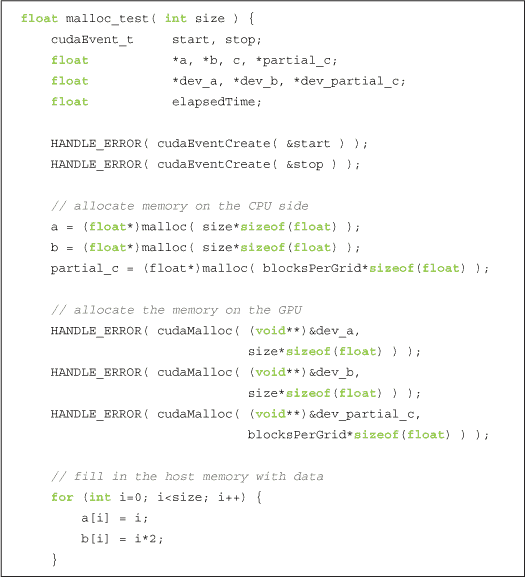

在完成分配和数据创建后，我们可以开始计算。我们启动计时器，将输入数据复制到 GPU，执行点积核函数，并将部分结果复制回主机。

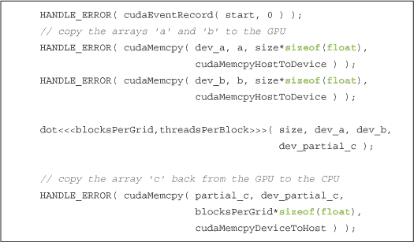

现在我们需要像在第五章中那样在 CPU 上完成计算。在执行此操作之前，我们会停止我们的事件计时器，因为它只测量 GPU 上执行的工作：

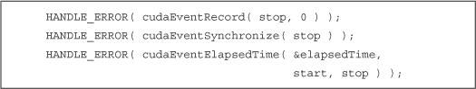

最后，我们将部分结果求和，并释放输入和输出缓冲区。

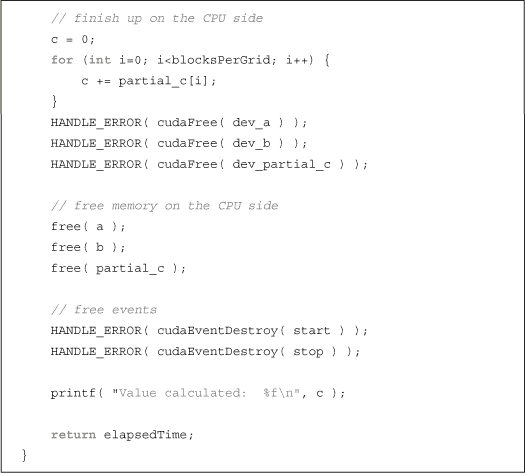

使用零拷贝内存的版本将与此版本非常相似，唯一不同的是内存分配。因此，我们首先分配输入和输出内存，并像以前一样填充输入内存数据：

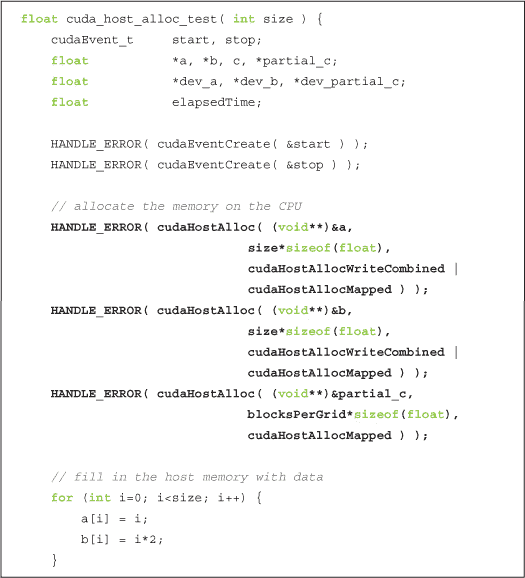

与第十章一样，我们再次看到 `cudaHostAlloc()` 的使用，尽管现在我们使用 `flags` 参数来指定不同于默认行为的设置。标志 `cudaHostAllocMapped` 告诉运行时我们打算从 GPU 访问此缓冲区。换句话说，正是这个标志使我们的缓冲区变成了 *零拷贝*。对于两个输入缓冲区，我们指定了标志 `cudaHostAllocWriteCombined`。该标志表示运行时应该将缓冲区分配为与 CPU 缓存写合并的方式。这个标志不会改变我们应用程序的功能，但对于只会被 GPU 读取的缓冲区，它代表了一个重要的性能提升。然而，在 CPU 也需要从缓冲区读取数据的场景中，写合并内存可能会非常低效，因此在做出这个决策时，你需要考虑应用程序可能的访问模式。

由于我们已经使用标志`cudaHostAllocMapped`分配了主机内存，这些缓冲区可以从 GPU 访问。然而，GPU 的虚拟内存空间与 CPU 不同，因此在 GPU 上访问时，这些缓冲区的地址会与在 CPU 上访问时不同。`cudaHostAlloc()`调用返回内存的 CPU 指针，因此我们需要调用`cudaHostGetDevicePointer()`来获取有效的 GPU 指针。然后，这些指针会传递给内核，供 GPU 读取和写入我们的主机分配：

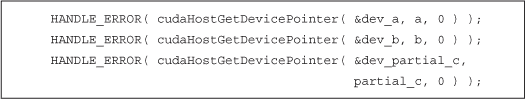

手中有了有效的设备指针后，我们就可以开始计时并启动我们的内核了。

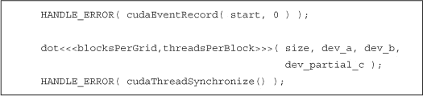

即使指针`dev_a`、`dev_b`和`dev_partial_c`都驻留在主机上，它们对于我们的内核来说看起来就像是 GPU 内存，这是因为我们调用了`cudaHostGetDevicePointer()`。由于我们的部分结果已经在主机上，因此我们不需要进行`cudaMemcpy()`从设备拷贝。然而，你会注意到，我们通过调用`cudaThreadSynchronize()`将 CPU 与 GPU 进行了同步。由于内核可能会更改其内容，零拷贝内存的内容在执行过程中是未定义的。同步之后，我们可以确保内核已经完成，并且我们的零拷贝缓冲区包含了结果，这样我们就可以停止计时器并像之前一样在 CPU 上完成计算。

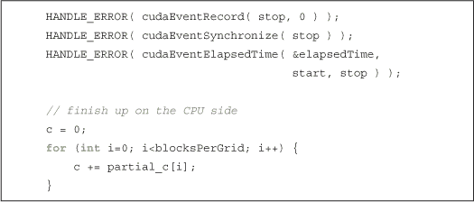

在`cudaHostAlloc()`版本的点积中，唯一剩下的就是清理工作。

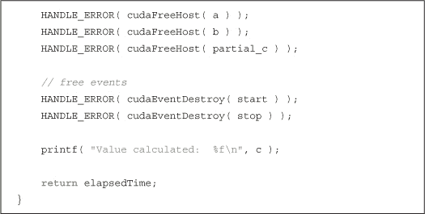

你会注意到，无论我们在`cudaHostAlloc()`中使用什么标志，内存总是以相同的方式被释放。具体来说，调用`cudaFreeHost()`就能完成这项操作。

就是这样！剩下的就是看看`main()`是如何将这一切结合在一起的。我们需要检查的第一件事是我们的设备是否支持映射主机内存。我们可以像在上一章中检查设备重叠那样，通过调用`cudaGetDeviceProperties()`来完成这项检查。

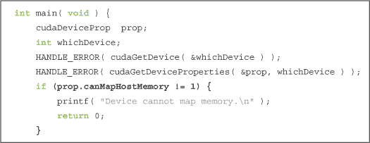

假设我们的设备支持零拷贝内存，我们将运行时环境置于一种能够为我们分配零拷贝缓冲区的状态。我们通过调用`cudaSetDeviceFlags()`并传递标志`cudaDeviceMapHost`来实现这一点，表示我们希望设备能够映射主机内存：

这就是`main()`的全部内容。我们运行两个测试，显示经过的时间，然后退出应用程序：

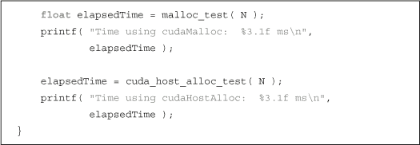

核心代码本身与第五章相同，但为了完整起见，这里将其完整展示：

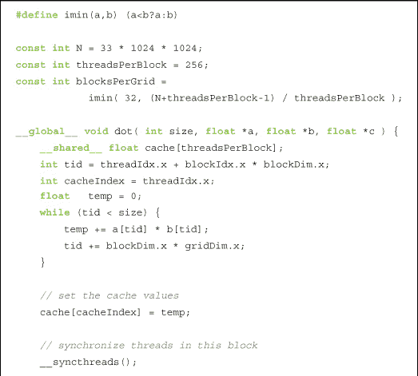

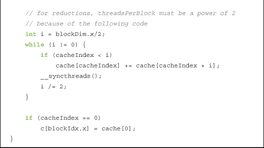

#### 11.2.2 零拷贝性能

使用零拷贝内存我们应该期望获得什么样的收益？这个问题的答案在离散 GPU 和集成 GPU 之间是不同的。*离散 GPU*是拥有自己专用 DRAM 的图形处理器，通常与 CPU 位于不同的电路板上。例如，如果你曾经在台式机中安装过显卡，这块 GPU 就是离散 GPU。*集成 GPU*是内置在系统芯片组中的图形处理器，通常与 CPU 共享常规系统内存。许多近期基于 NVIDIA nForce 媒体和通信处理器（MCPs）构建的系统都包含支持 CUDA 的集成 GPU。除了 nForce MCPs 外，所有基于 NVIDIA 新 ION 平台的上网本、笔记本和台式电脑都包含集成的、支持 CUDA 的 GPU。对于集成 GPU，使用零拷贝内存*总是*能带来性能提升，因为这些内存本就与主机共享。将缓冲区声明为零拷贝只会防止不必要的数据拷贝。但请记住，世上没有免费的午餐，零拷贝缓冲区仍然会像所有固定内存分配一样受到约束：每个固定的分配都会占用系统的物理内存，最终会降低系统性能。

在输入和输出仅使用一次的情况下，当使用零拷贝内存与离散 GPU 配合时，我们甚至能看到性能提升。由于 GPU 设计上擅长隐藏与内存访问相关的延迟，通过 PCI Express 总线进行读写时，这个机制能在一定程度上缓解延迟，从而带来明显的性能优势。但由于零拷贝内存并未在 GPU 上进行缓存，当内存被多次读取时，我们将面临较大的性能损失，这本可以通过先将数据拷贝到 GPU 来避免。

如何判断一个 GPU 是集成的还是离散的呢？嗯，你可以打开电脑看一看，但对于你的 CUDA C 应用程序来说，这种方法并不实用。你的代码可以通过检查`cudaGetDeviceProperties()`返回的结构来判断这一属性。这个结构中有一个名为`integrated`的字段，如果设备是集成 GPU，它的值为`true`，如果不是，则为`false`。

由于我们的点积应用满足“只读/写一次”的限制，因此在使用零拷贝内存时，可能会获得性能提升。事实上，它确实享受到了轻微的性能提升。在一台 GeForce GTX 285 上，执行时间提升超过 45%，从 98.1ms 下降到 52.1ms，迁移到零拷贝内存后。GeForce GTX 280 也享受到了类似的提升，执行时间从 143.9ms 提升到 94.7ms，提升了 34%。当然，由于计算与带宽的比例不同，以及各芯片组的有效 PCI Express 带宽的差异，不同的 GPU 会呈现出不同的性能特征。

### 11.3 使用多个 GPU

在前面的部分中，我们提到过设备有集成 GPU 和独立 GPU 两种类型，前者内置于系统芯片组中，后者通常是安装在 PCI Express 插槽中的扩展卡。越来越多的系统同时包含*集成*和独立 GPU，这意味着它们也有多个 CUDA 支持的处理器。NVIDIA 还销售如 GeForce GTX 295 这样的产品，内含多个 GPU。尽管 GeForce GTX 295 物理上只占用一个扩展插槽，但它会在 CUDA 应用程序中显示为两个独立的 GPU。此外，用户还可以将多个 GPU 添加到不同的 PCI Express 插槽，并使用 NVIDIA 的*可扩展链路接口*（SLI）技术将它们连接起来。由于这些趋势，CUDA 应用程序在多显卡系统中运行变得相对常见。由于我们的 CUDA 应用程序通常具有很强的并行性，因此如果能利用系统中的每一个 CUDA 设备以实现最大吞吐量，那将是非常棒的。那么，让我们来看看如何实现这一目标。

为了避免学习一个新的例子，让我们将点积操作转换为使用多个 GPU。为了让我们更加轻松，我们将所有计算点积所需的数据汇总到一个结构体中。你马上就会明白为什么这样做能让我们的工作变得更容易。

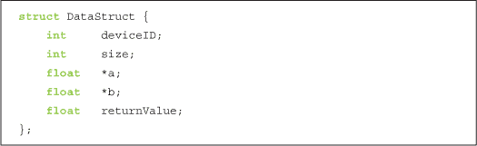

该结构体包含计算点积的设备的标识符；它包含输入缓冲区的大小，以及指向两个输入`a`和`b`的指针。最后，它有一个条目用于存储计算出的`a`和`b`的点积值。

要使用`N`个 GPU，我们首先需要知道我们正在处理的`N`的确切值。因此，我们通过调用`cudaGetDeviceCount()`来启动应用程序，以确定系统中安装了多少个 CUDA 支持的处理器。

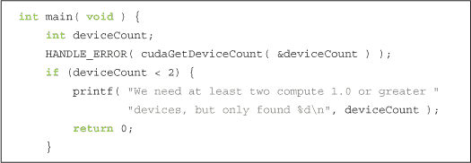

本例旨在展示多 GPU 的使用，因此您会注意到，如果系统只有一个 CUDA 设备，我们会直接退出（并不是说这样有问题）。显然，出于种种原因，这种做法并不推荐作为最佳实践。为了尽可能简单，我们将为输入分配标准主机内存，并按以往的方式填充数据。

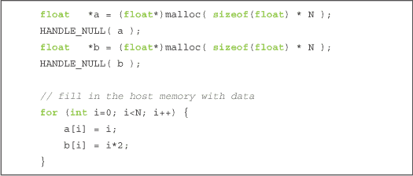

现在我们准备深入了解多 GPU 代码。使用 CUDA 运行时 API 来操作多个 GPU 的关键是认识到每个 GPU 需要由不同的 CPU 线程控制。由于之前我们只使用了一个 GPU，所以不需要考虑这一点。我们将多线程代码中的大部分麻烦都移到了辅助代码文件`book.h`中。通过将这些代码隐藏起来，我们只需填充一个结构体，提供执行计算所需的数据。尽管系统中可能有多个 GPU，但为了清晰起见，我们只使用其中的两个：

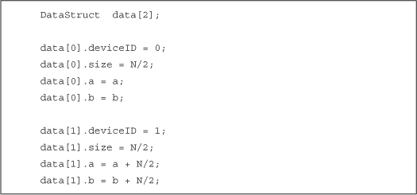

接下来，我们将一个`DataStruct`变量传递给一个名为`start_thread()`的工具函数。我们还将一个指向函数的指针传递给`start_thread()`，该函数将在新创建的线程中被调用；本例中的线程函数名为`routine()`。`start_thread()`函数将创建一个新线程，随后该线程调用指定的函数，并将`DataStruct`传递给该函数。另一个对`routine()`的调用将由默认的应用线程执行（因此我们只创建了一个*额外*线程）。

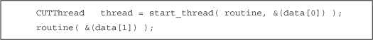

在继续之前，我们让主应用线程通过调用`end_thread()`等待其他线程完成。

由于此时`main()`中的两个线程都已完成，所以可以安全地进行清理并显示结果。

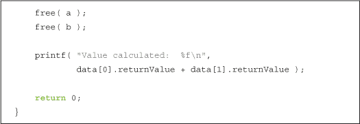

注意，我们将每个线程计算的结果相加。这是我们点积归约的最后一步。在另一种算法中，多个结果的组合可能涉及其他步骤。实际上，在某些应用中，两个 GPU 可能会在完全不同的数据集上执行完全不同的代码。为了简单起见，在我们的点积示例中并非如此。

由于点积例程与您之前看到的其他版本完全相同，我们将在本节中省略它。然而，`routine()`的内容可能会引起您的兴趣。我们声明`routine()`函数接受并返回一个`void*`，这样您就可以用任意线程函数的实现重用`start_thread()`代码。虽然我们很愿意为这个想法归功于自己，但这其实是 C 语言中回调函数的标准做法：

每个线程都会调用`cudaSetDevice()`，并为此函数传递不同的 ID。结果是，我们知道每个线程将操作不同的 GPU。这些 GPU 可能具有相同的性能，如双 GPU GeForce GTX 295，或者它们可能是不同的 GPU，例如在一个同时拥有集成 GPU 和离散 GPU 的系统中。然而，这些细节对于我们的应用程序并不重要，尽管它们可能对你有兴趣。特别地，如果你依赖于某个最低的计算能力来启动内核，或者你有强烈的愿望在系统的 GPU 之间负载平衡，这些细节就非常有用。如果 GPU 不同，你需要做一些工作来划分计算任务，以确保每个 GPU 大致占用相同的时间。然而，对于我们在这个示例中的目的来说，这些都是微不足道的细节，我们不必担心。

除了调用`cudaSetDevice()`来指定我们打算使用的 CUDA 设备之外，`routine()`的实现与第 11.2.1 节：零拷贝点积中的原始`malloc_test()`非常相似。我们为 GPU 上输入数据的副本分配缓冲区，并为部分结果分配一个缓冲区，然后通过`cudaMemcpy()`将每个输入数组复制到 GPU。

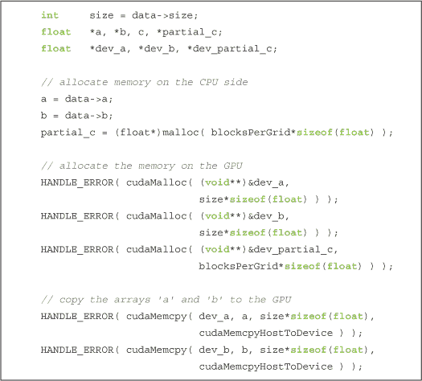

然后我们启动点积内核，将结果复制回去，并在 CPU 上完成计算。

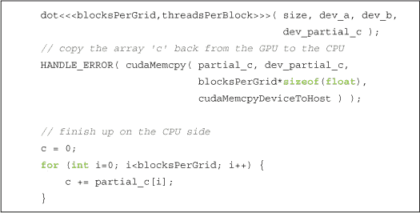

和往常一样，我们清理 GPU 缓冲区，并在`DataStruct`的`returnValue`字段中返回我们计算的点积结果。

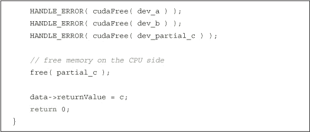

所以，归根结底，除了主机线程管理的问题，使用多个 GPU 并不会比使用单个 GPU 困难太多。利用我们的辅助代码创建一个线程并在该线程上执行函数后，这变得更加可管理。如果你有自己的线程库，可以在自己的应用程序中自由使用。你只需要记住，每个 GPU 都有自己的线程，其他的一切就像奶油芝士一样简单。

### 11.4 可移植的固定内存

使用多个 GPU 的最后一个重要部分涉及使用固定内存（pinned memory）。我们在第十章中了解到，固定内存实际上是主机内存，它的页面被锁定在物理内存中，以防止被换出或重新定位。然而，事实证明，页面只能被锁定在单个 CPU 线程上。也就是说，*任何*线程只要将它们分配为固定内存，这些页面就会保持页面锁定，但它们仅对分配它们的线程*看起来*是页面锁定的。如果该内存的指针被多个线程共享，其他线程会将该缓冲区视为标准的可分页数据。

由于这种行为的副作用，当一个没有分配固定缓冲区的线程尝试使用它执行 `cudaMemcpy()` 时，复制将以标准的可分页内存速度执行。正如我们在第十章中看到的那样，这个速度大约是最大传输速度的 50%。更糟糕的是，如果线程尝试将 `cudaMemcpyAsync()` 调用加入到 CUDA 流中，这个操作将失败，因为它需要一个固定缓冲区才能继续。由于该缓冲区在没有分配的线程看来是可分页的，这个调用就会死于非命。即使是未来，也无法正常工作！

但是有一种解决方法。我们可以将固定内存分配为 *便携式*，这意味着我们将允许它在主机线程之间迁移，并允许任何线程将其视为固定缓冲区。为此，我们使用我们可靠的 `cudaHostAlloc()` 来分配内存，但我们用一个新标志来调用它：`cudaHostAllocPortable`。这个标志可以与其他标志一起使用，比如 `cudaHostAllocWriteCombined` 和 `cudaHostAllocMapped`。这意味着你可以将主机缓冲区分配为便携式、零拷贝和写入合并的任何组合。

为了演示便携式固定内存，我们将增强我们的多 GPU 点积应用程序。我们将改编原始的零拷贝版本点积，因此这个版本在某种程度上是零拷贝版本和多 GPU 版本的混合体。正如我们在本章中所做的那样，我们需要验证是否至少有两块支持 CUDA 的 GPU，并且两块 GPU 都能处理零拷贝缓冲区。

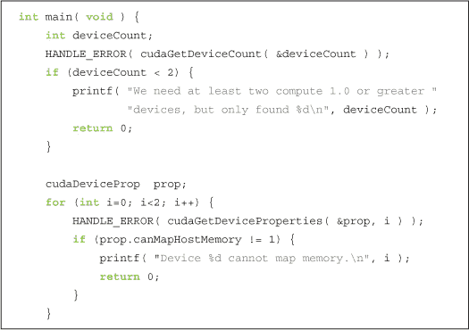

在之前的示例中，我们准备开始分配主机内存以存储输入向量。然而，为了分配便携式固定内存，首先必须设置我们打算运行的 CUDA 设备。由于我们还打算使用该设备进行零拷贝内存操作，因此在调用 `cudaSetDevice()` 后，我们会接着调用 `cudaSetDeviceFlags()`，就像我们在第 11.2.1 节《零拷贝点积》中所做的那样。

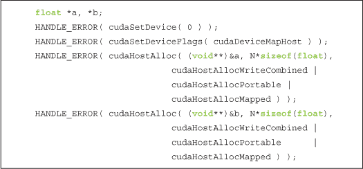

在本章早些时候，我们调用了 `cudaSetDevice()`，但直到我们已经分配了内存并创建了线程才执行。需要注意的是，使用 `cudaHostAlloc()` 分配便携式页锁定内存的一个要求是，必须先通过调用 `cudaSetDevice()` 初始化设备。不过，你也会注意到，我们将新学习的标志 `cudaHostAllocPortable` 传递给了两个内存分配函数。由于这些内存是在调用 `cudaSetDevice(0)` 后分配的，如果我们没有指定它们为便携式分配，那么只有 CUDA 设备零会将这些缓冲区视为固定内存。

我们像过去一样继续应用程序，为我们的输入向量生成数据，并准备我们的 `DataStruct` 结构，就像我们在第 11.3 节《使用多个 GPU》的多 GPU 示例中所做的那样。

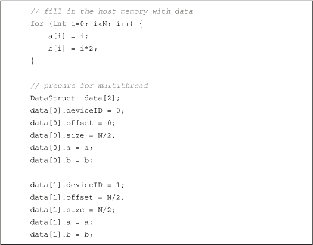

然后我们可以创建我们的辅助线程并调用`routine()`，以便在每个设备上开始计算。

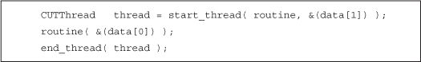

因为我们的主机内存是由 CUDA 运行时分配的，所以我们使用`cudaFreeHost()`来释放它。除此之外，我们不再调用`free()`，`main()`中的内容也就到此为止。

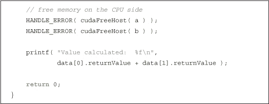

为了支持在我们的多 GPU 应用程序中使用可移植的固定内存和零拷贝内存，我们需要对`routine()`函数的代码进行两处显著的更改。第一个更改有点微妙，且不应该是显而易见的。

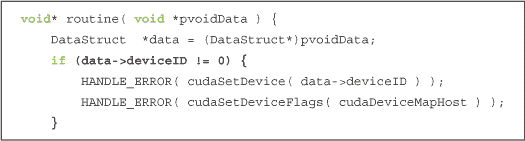

你可能记得在我们的多 GPU 版本代码中，我们需要在`routine()`中调用`cudaSetDevice()`，以确保每个参与的线程控制一个不同的 GPU。另一方面，在这个示例中，我们已经从主线程中调用了`cudaSetDevice()`，目的是在`main()`中分配固定内存。因此，我们只希望在尚未调用该函数的设备上调用`cudaSetDevice()`和`cudaSetDeviceFlags()`。也就是说，当`deviceID`不为零时，我们才调用这两个函数。虽然重复在设备零上调用这两个函数会使代码更简洁，但实际上这会导致错误。一旦你在某个线程上设置了设备，就不能再次调用`cudaSetDevice()`，即使传递的是相同的设备标识符。高亮显示的`if()`语句帮助我们避免了来自 CUDA 运行时的这个小错误，因此我们继续对`routine()`进行下一个重要的更改。

除了为主机端内存使用可移植的固定内存外，我们还使用零拷贝直接从 GPU 访问这些缓冲区。因此，我们不再像原来的多 GPU 应用程序中那样使用`cudaMemcpy()`，而是使用`cudaHostGetDevicePointer()`来获取主机内存的有效设备指针，就像在零拷贝示例中一样。然而，你会注意到我们使用了标准的 GPU 内存来存储部分结果。和往常一样，这块内存是通过`cudaMalloc()`分配的。

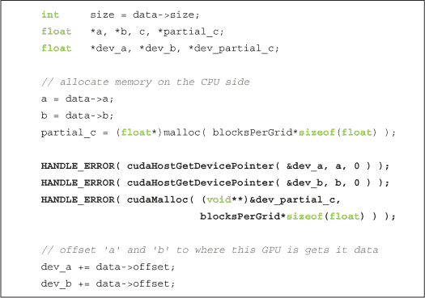

到这个时刻，我们基本上已经准备好开始，因此我们启动内核并将结果从 GPU 复制回来。

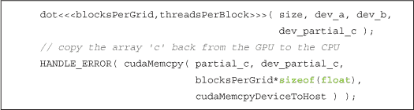

我们像在点积示例中一样，通过在 CPU 上汇总部分结果、释放临时存储并返回`main()`来结束。

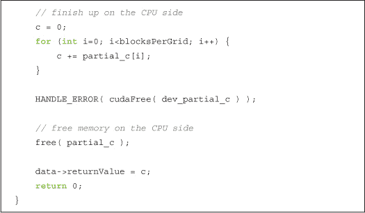

### 11.5 章节回顾

我们看到了一些新的主机内存分配方式，所有这些都通过一个单独的调用`cudaHostAlloc()`进行分配。通过组合这个入口点和一组参数标志，我们可以将内存分配为零拷贝、可移植和/或写合并的任意组合。我们使用了*零拷贝*缓冲区，以避免显式地将数据复制到 GPU 或从 GPU 复制数据，这一操作有可能加速广泛应用程序的执行。通过使用支持库进行线程管理，我们从同一个应用程序操作多个 GPU，使得我们的点积计算可以在多个设备之间进行。最后，我们看到了如何通过将内存分配为*可移植*固定内存，使多个 GPU 共享固定内存分配。我们的最后一个例子使用了可移植固定内存、多个 GPU 和零拷贝缓冲区，以展示我们在第五章开始探索的点积的加速版本。随着多设备系统的日益普及，这些技术应能帮助你充分利用目标平台的计算能力。
