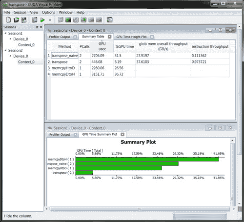

## 第十二章：最终倒计时

恭喜你！希望你在学习 CUDA C 并进行一些 GPU 计算实验的过程中感到愉快。这是一段漫长的旅程，所以让我们花点时间回顾一下我们从哪里开始，以及我们已经取得了多少进展。从具有 C 或 C++编程背景开始，我们学习了如何使用 CUDA 运行时的尖括号语法，轻松地在任意数量的多处理器上启动多个内核副本。我们将这些概念扩展到使用线程*和*块的集合，处理任意大的输入。这些更复杂的启动操作利用了 GPU 的特殊片上共享内存进行线程间通信，并使用了专用的同步原语，以确保在支持（并鼓励）成千上万并行线程的环境中正确操作。

在掌握了使用 CUDA C 在 NVIDIA CUDA 架构上进行并行编程的基本概念后，我们探索了一些 NVIDIA 提供的更高级的概念和 API。GPU 的专用图形硬件在 GPU 计算中证明了其价值，因此我们学习了如何利用纹理内存来加速一些常见的内存访问模式。由于许多用户将 GPU 计算添加到他们的互动图形应用程序中，我们探讨了 CUDA C 内核与行业标准图形 API（如 OpenGL 和 DirectX）的互操作性。对全局内存和共享内存进行的原子操作使得多线程安全地访问公共内存位置成为可能。随着我们稳步深入越来越高级的主题，流（streams）使我们能够保持整个系统尽可能繁忙，让内核能够在主机和 GPU 之间的内存拷贝同时执行。最后，我们探讨了如何分配和使用零拷贝内存，以加速集成 GPU 上的应用程序。此外，我们还学习了如何初始化多个设备并分配可移植的固定内存，以编写能够充分利用日益普及的多 GPU 环境的 CUDA C 代码。

### 12.1 章节目标

在本章节的学习过程中，你将完成以下任务：

• 你将了解一些可用于辅助 CUDA C 开发的工具。

• 你将学习到更多的书面和代码资源，以将你的 CUDA C 开发提升到更高的水平。

### 12.2 CUDA 工具

在本书的过程中，我们依赖了 CUDA C 软件系统的多个组件。我们编写的应用程序大量使用了 CUDA C 编译器，将我们的 CUDA C 核心转换成可以在 NVIDIA GPU 上执行的代码。我们还使用了 CUDA 运行时来执行大部分设置工作和启动内核以及与 GPU 通信的“脏活”。CUDA 运行时反过来使用 CUDA 驱动程序直接与系统硬件进行通信。除了这些我们已经详细使用过的组件，NVIDIA 还提供了其他一些软件，旨在简化 CUDA C 应用程序的开发。本节并不是这些产品的用户手册，而是专门向你介绍这些软件包的存在及其用途。

#### 12.2.1 CUDA 工具包

你几乎可以肯定已经在你的开发机器上安装了 CUDA 工具包。这一点我们敢这么肯定，因为 CUDA C 编译器工具集是这个包的核心组件之一。如果你的机器上没有安装 CUDA 工具包，那你几乎可以确定自己没有尝试编写或编译任何 CUDA C 代码。我们现在知道了，傻瓜！实际上，这不是什么大事（但我们还是忍不住想知道你为什么读完了整本书）。另一方面，如果你*确实*在跟随本书的示例进行学习，那么你应该已经具备了我们接下来要讨论的库。

#### 12.2.2 CUFFT

如果你打算在自己的应用程序中进行 GPU 计算，CUDA 工具包包含了两个非常重要的实用库。首先，NVIDIA 提供了一个经过调优的快速傅里叶变换库，称为 *CUFFT*。从 3.0 版本开始，CUFFT 库支持许多有用的功能，包括以下内容：

• 一维、二维和三维变换，支持实值和复值输入数据

• 批量执行，支持并行执行多个一维变换

• 支持二维和三维变换，尺寸范围从 2 到 16,384，任意维度

• 支持最大达到 800 万个元素的输入的一维变换

• 支持实值和复值数据的原地和非原地变换

NVIDIA 提供了免费的 CUFFT 库，并附带许可，允许在任何应用中使用，无论是个人、学术还是职业开发。

#### 12.2.3 CUBLAS

除了快速傅里叶变换库，NVIDIA 还提供了一个线性代数库，实现了著名的基础线性代数子程序包（BLAS）。这个库名为 *CUBLAS*，也是免费提供的，并支持 BLAS 包的一个大子集。这包括接受单精度和双精度输入以及实数和复数数据的每个例程的版本。由于 BLAS 最初是一个用 FORTRAN 实现的线性代数例程库，NVIDIA 尝试最大化与这些实现的要求和期望的兼容性。具体来说，CUBLAS 库使用列主存储布局来存储数组，而不是 C 和 C++ 本地使用的行主存储布局。实际上，这通常不会成为一个问题，但它确实使得现有的 BLAS 用户能够轻松地将他们的应用程序适配到 GPU 加速的 CUBLAS 上。NVIDIA 还分发了 CUBLAS 的 FORTRAN 绑定，以演示如何将现有的 FORTRAN 应用程序链接到 CUDA 库。

#### 12.2.4 NVIDIA GPU 计算 SDK

可单独从 NVIDIA 驱动程序和 CUDA 工具包中获取，可选的 *GPU 计算 SDK* 下载包含了数十个 GPU 计算应用程序示例包。我们在本书中早些时候提到过这个 SDK，因为它的示例作为我们在前 11 章中所覆盖的内容的极好补充。但如果你还没有查看过，NVIDIA 将这些示例针对不同级别的 CUDA C 能力进行了设计，并覆盖了广泛的主题内容。这些示例大致分为以下几个部分：

CUDA 基础主题

CUDA 高级主题

CUDA 系统集成

数据并行算法

图形互操作性

纹理

性能策略

线性代数

图像/视频处理

计算金融

数据压缩

基于物理的仿真

这些示例可以在任何支持 CUDA C 的平台上运行，并且可以作为你自己应用程序的优秀起点。对于那些在这些领域有丰富经验的读者，我们提醒你不要指望在 NVIDIA GPU 计算 SDK 中看到你最喜欢的算法的最前沿实现。这些代码示例不应被视为生产级的库代码，而应视为功能性 CUDA C 程序的教育性示例，类似于本书中的示例。

#### 12.2.5 NVIDIA 性能原语

除了在 CUFFT 和 CUBLAS 库中提供的例程外，NVIDIA 还维护了一组用于执行 CUDA 加速数据处理的函数库，称为 NVIDIA 性能原语（NPP）。目前，NPP 的初始功能集专注于图像和视频处理，并且在这些领域的开发者中得到广泛应用。NVIDIA 计划随着时间推移让 NPP 演进，以应对更多计算任务并涵盖更广泛的领域。如果你对高性能的图像或视频应用感兴趣，应该优先关注 NPP，它可以通过[www.nvidia.com/object/npp.html](http://www.nvidia.com/object/npp.html)免费下载（或通过你喜欢的搜索引擎访问）。

#### 12.2.6 调试 CUDA C

我们从各种来源听说过，在极少数情况下，计算机软件在首次执行时并没有完全按预期工作。有些代码计算出错误的值，有些代码未能终止执行，还有些代码甚至让计算机进入只能通过切换电源才能恢复的状态。尽管*从未*亲自编写过这样的代码，本书的作者认识到，某些软件工程师可能需要资源来调试他们的 CUDA C 内核。幸运的是，NVIDIA 提供了一些工具，使这个痛苦的过程变得不那么麻烦。

##### CUDA-GDB

一款名为*CUDA-GDB*的工具，是 CUDA C 程序员在基于 Linux 的系统上开发代码时最有用的 CUDA 下载之一。NVIDIA 扩展了开源的 GNU 调试器（`gdb`），使其透明地支持实时调试设备代码，同时保持`gdb`的熟悉界面。在 CUDA-GDB 之前，除了使用 CPU 模拟代码的预期执行方式外，并没有好的方法来调试设备代码。这种方法的调试非常缓慢，实际上，它经常只能近似 GPU 内核的真实执行。NVIDIA 的 CUDA-GDB 使程序员能够直接在 GPU 上调试内核，赋予他们与 CPU 调试器一样的控制能力。CUDA-GDB 的一些亮点包括：

• 查看 CUDA 状态，如已安装 GPU 及其功能信息

• 在 CUDA C 源代码中设置断点

• 检查 GPU 内存，包括所有全局内存和共享内存

• 检查当前驻留在 GPU 上的块和线程

• 单步执行一个线程束（warp）

• 进入当前正在运行的应用程序，包括卡死或死锁的应用程序

除了调试器，NVIDIA 还提供了 CUDA 内存检查器，其功能可以通过 CUDA-GDB 或独立工具`cuda-memcheck`访问。由于 CUDA 架构包括一个直接嵌入硬件的复杂内存管理单元，因此所有非法内存访问都将被硬件检测并防止。因此，由于内存违规，您的程序将无法按预期运行，因此您肯定希望能够查看此类错误。当启用时，CUDA 内存检查器将检测您的内核尝试进行的任何全局内存违规或未对齐的全局内存访问，并以比以前更有帮助和更详细的方式向您报告它们。

##### NVIDIA Parallel Nsight

虽然 CUDA-GDB 是一个成熟且出色的工具，可以实时调试硬件上的 CUDA C 内核，但 NVIDIA 意识到并非每个开发者都对 Linux 感到兴奋。因此，除非 Windows 用户正准备存钱开设自己的宠物商店，否则他们也需要一种调试应用程序的方法。2009 年末，NVIDIA 推出了 NVIDIA Parallel Nsight（最初代号为 Nexus），这是首个集成的 GPU/CPU 调试器，用于 Microsoft Visual Studio。与 CUDA-GDB 类似，Parallel Nsight 支持调试具有数千个线程的 CUDA 应用程序。用户可以在 CUDA C 源代码中的任何位置设置断点，包括触发写入任意内存位置的断点。他们可以直接从 Visual Studio 内存窗口检查 GPU 内存，并检查越界内存访问。该工具目前已在 Beta 程序中公开发布，最终版本应很快发布。

#### 12.2.7 CUDA Visual Profiler

我们常常将 CUDA 架构誉为高性能计算应用程序的绝佳基础。不幸的是，现实是，在排除应用程序中的所有错误后，即使是最有善意的“高性能计算”应用程序，也更准确地称为简单的“计算”应用程序。我们经常处于这样的境地，心想：“为什么我的代码表现这么差？”在这种情况下，能够在分析工具的注视下执行相关内核会很有帮助。NVIDIA 正提供这样一个工具，可以通过 CUDA Zone 网站单独下载。图 12.1 展示了使用 Visual Profiler 比较两个矩阵转置操作实现的情况。尽管没有查看一行代码，但很容易判断`transpose()`内核的内存和指令吞吐量超过了`transpose_naive()`内核。（不过，话又说回来，期望一个名字里带有*naive*的函数能做得更好也是不公平的。）

***图 12.1*** 使用 CUDA Visual Profiler 对矩阵转置应用程序进行分析

CUDA Visual Profiler 将执行你的应用程序，检查 GPU 中内置的特殊性能计数器。执行完成后，分析器可以根据这些计数器汇总数据，并为你提供基于其观察结果的报告。它可以验证你的应用程序在执行每个内核时所花费的时间，并确定启动的块数量、内核的内存访问是否合并、代码中的 warp 执行了多少条分支等。我们鼓励你使用 CUDA Visual Profiler，尤其是在你遇到一些微妙的性能问题需要解决时。

### 12.3 书面资源

如果你还没有因为这本书的冗长文字感到恶心，那么你可能真的有兴趣阅读更多内容。我们知道，一些人更倾向于通过代码练习来继续学习，但对于其他人来说，还有更多的书面资源来帮助你作为 CUDA C 程序员继续成长。

#### 12.3.1 大规模并行处理器编程：实践方法

如果你阅读了第一章，我们曾向你保证，这本书绝对不是一本关于并行架构的教材。虽然我们确实提到了一些术语，比如*多处理器*和*warp*，但这本书的目标是教授如何用 CUDA C 及其相关 API 进行编程的软技能。我们在*NVIDIA CUDA 编程指南*中学习了 CUDA C 语言的编程模型，基本忽略了 NVIDIA 硬件如何实际完成我们交给它的任务。

但要真正成为一名高级且全面的 CUDA C 程序员，你需要更深入地了解 CUDA 架构，以及 NVIDIA GPU 在幕后如何工作的一些细节。为了实现这一点，我们建议你阅读*大规模并行处理器编程：实践方法*。为编写这本书，前 NVIDIA 首席科学家 David Kirk 与伊利诺伊大学电气与计算机工程系的 W.J. Sanders III 讲座教授 Wen-mei W. Hwu 合作。你将遇到许多熟悉的术语和概念，但你也将学习到关于 NVIDIA CUDA 架构的深入细节，包括线程调度、延迟容忍、内存带宽使用与效率、浮点处理的具体细节等。这本书也比本书更广泛地讨论了并行编程，因此你将更全面地理解如何为大型复杂问题设计并行解决方案。

#### 12.3.2 CUDA U

我们当中有些人不幸在 GPU 计算的精彩世界出现之前就上了大学。对于那些现在或不久的将来有幸上大学的人来说，目前全球约有 300 所大学开设了涉及 CUDA 的课程。但在你开始进行疯狂的减肥，以便重新穿回大学时的衣服之前，还有一个替代方案！在 CUDA Zone 网站上，你会找到一个链接指向 *CUDA U*，它本质上是一个提供 CUDA 教育的在线大学。或者你可以直接通过网址 [www.nvidia.com/object/cuda_education](http://www.nvidia.com/object/cuda_education) 访问。尽管你如果参加了 CUDA U 的一些在线讲座，能够学到相当多的 GPU 计算知识，但截止本文发布时，仍然没有线上社团可以在下课后聚会。

##### 大学课程材料

在众多 CUDA 教育资源中，其中一个亮点是伊利诺伊大学提供的整个 CUDA C 编程课程。NVIDIA 和伊利诺伊大学免费提供这些内容，格式为 M4V 视频，适用于你的 iPod、iPhone 或兼容的视频播放器。我们知道你在想什么：“终于找到了一个可以在车管所排队时学习 CUDA 的方法！”你可能还在想，为什么我们要等到本书的最后才告诉你这个基本上是本书电影版的存在。我们很抱歉没有早点告诉你，但电影版总是比书籍差点，不是吗？除了伊利诺伊大学和加利福尼亚大学戴维斯分校的实际课程材料外，你还会找到来自 CUDA 培训播客的材料，以及第三方培训和咨询服务的链接。

##### *Dr. Dobb’s*

超过 30 年以来，*Dr. Dobb’s* 涵盖了几乎所有计算技术的重大进展，NVIDIA 的 CUDA 也不例外。作为持续系列的一部分，*Dr. Dobb’s* 发布了一系列广泛的文章，全面介绍了 CUDA 领域。名为 *CUDA, Supercomputing for the Masses* 的系列文章从 GPU 计算的介绍开始，并迅速从第一个内核进展到 CUDA 编程模型的其他部分。*Dr. Dobb’s* 中的文章涉及错误处理、全局内存性能、共享内存、CUDA 可视化分析器、纹理内存、CUDA-GDB 和 CUDPP 库等数据并行 CUDA 原语，以及许多其他主题。这些文章是了解我们在本书中尝试传达的部分内容的绝佳来源。此外，你还会找到关于我们在本书中仅有时间简要介绍的一些工具的实用信息，例如可供你使用的分析和调试选项。该系列文章可以通过 CUDA Zone 网页找到，并且可以通过搜索 *Dr Dobbs CUDA* 在网上轻松找到。

#### 12.3.3 NVIDIA 论坛

即使在深入研究 NVIDIA 的所有文档后，你可能仍然会遇到一些没有解答的，或者特别引人兴趣的问题。也许你在想，是否有其他人遇到了你正在经历的奇怪行为。或者你正在举办一场 CUDA 庆祝派对，想组织一群志同道合的人。如果你有任何问题，我们强烈推荐访问 NVIDIA 网站上的论坛。论坛地址是 [`forums.nvidia.com`](http://forums.nvidia.com)，这是一个向其他 CUDA 用户提问的好地方。事实上，阅读完本书后，你也有能力帮助其他人！NVIDIA 员工也会定期浏览论坛，因此最棘手的问题很可能会得到来自源头的权威建议。我们也非常欢迎大家提供新功能建议和对 NVIDIA 工作中好的、坏的和丑的部分的反馈。

### 12.4 代码资源

尽管 NVIDIA GPU 计算 SDK 是一个宝贵的操作示例宝库，但它的设计目的主要是用于教学。如果你在寻找适合生产级别的、CUDA 驱动的库或源代码，你需要再进一步寻找。幸运的是，CUDA 开发者社区非常庞大，已经开发出了许多顶级的解决方案。这里介绍了其中的一些工具和库，但你也可以自行在网络上搜索你所需要的解决方案。嘿，也许有一天你会为 CUDA C 社区贡献自己的成果！

#### 12.4.1 CUDA 数据并行原语库

在加利福尼亚大学戴维斯分校研究人员的帮助下，NVIDIA 发布了一个名为 CUDA 数据并行原语库（CUDPP）的库。顾名思义，CUDPP 是一个数据并行算法原语的库。这些原语包括并行前缀和（*扫描*）、并行排序和并行归约等。这些原语构成了各种数据并行算法的基础，包括排序、流压缩、构建数据结构等。如果你打算编写一个稍微复杂的算法，CUDPP 很可能已经提供了你所需要的功能，或者它能让你更接近你的目标。可以在 [`code.google.com/p/cudpp`](http://code.google.com/p/cudpp) 下载它。

#### 12.4.2 CULAtools

正如我们在第 12.2.3 节中提到的：CUBLAS，NVIDIA 提供了与 CUDA 工具包一起下载的 BLAS 实现。对于需要更广泛线性代数解决方案的读者，可以看看 EM Photonics 的 CUDA 实现，它是业界标准线性代数包（LAPACK）的实现。它的 LAPACK 实现被称为*CULAtools*，并提供了更多复杂的线性代数例程，这些例程建立在 NVIDIA 的 CUBLAS 技术之上。免费提供的 Basic 包包括 LU 分解、QR 分解、线性系统求解、奇异值分解以及最小二乘法和约束最小二乘法求解器。你可以在[www.culatools.com/versions/basic](http://www.culatools.com/versions/basic)下载 Basic 包。你还会注意到 EM Photonics 提供了 Premium 和 Commercial 许可证，其中包含更多的 LAPACK 例程，并且许可条款允许你分发基于 CULAtools 的商业应用程序。

#### 12.4.3 语言包装器

本书主要关注 C 和 C++，但显然也有成百上千个项目没有使用这些语言。幸运的是，第三方已经编写了包装器，允许从 NVIDIA 官方不支持的语言中访问 CUDA 技术。NVIDIA 本身提供了用于其 CUBLAS 库的 FORTRAN 绑定，但你也可以在[www.jcuda.org](http://www.jcuda.org)找到多个 CUDA 库的 Java 绑定。同样，可以从 PyCUDA 项目在[`mathema.tician.de/software/pycuda`](http://mathema.tician.de/software/pycuda)获得 Python 包装器，以便在 Python 应用中使用 CUDA C 内核。最后，CUDA.NET 项目提供了适用于 Microsoft .NET 环境的绑定，网址是[www.hoopoe-cloud.com/Solutions/CUDA.NET](http://www.hoopoe-cloud.com/Solutions/CUDA.NET)。

尽管这些项目没有得到 NVIDIA 的官方支持，但它们已经存在了好几个版本的 CUDA，都是免费的，并且每个项目都有许多成功的客户。这则故事的寓意是，如果你选择的编程语言（或你老板选择的语言）不是 C 或 C++，那么在你还没有确认是否有必要的绑定可用之前，不应该排除 GPU 计算。

### 12.5 本章回顾

就这样了。即使经过了 11 章的 CUDA C 学习，仍然有大量资源可以下载、阅读、观看和编译。在异构计算平台逐渐成熟的时代，学习 GPU 计算是一个异常有趣的时刻。我们希望你在学习这个最广泛应用的并行编程环境之一时感到愉快。此外，我们希望你能带着对开发新颖且激动人心的计算机交互方式和处理不断增加的信息量的可能性感到兴奋地离开这段学习经历。正是你的创意和你所开发的惊人技术将推动 GPU 计算迈向新的高度。
