## 附录：高级原子操作

第九章讨论了我们可以如何利用原子操作使数百个线程安全地对共享数据进行并发修改。在本附录中，我们将探讨一种使用原子操作实现锁数据结构的高级方法。从表面上看，这个话题似乎并不比我们研究过的其他内容更复杂。实际上，这也是准确的。通过本书，你已经学习了许多复杂的话题，而锁数据结构并不比这些更具挑战性。那么，为什么这些内容会藏在附录里呢？我们不想剧透，如果你感兴趣，可以继续阅读，我们将在附录中讨论这个问题。

### A.1 点积重访

在第五章中，我们讨论了使用 CUDA C 实现向量点积的算法。这个算法是众多*归约*算法之一。如果你还记得，该算法通过以下步骤计算两个输入向量的点积：

1. 每个块中的每个线程将输入向量中的两个对应元素相乘，并将乘积存储在共享内存中。

2. 尽管一个块中有多个乘积，但每个线程会将其中的两个乘积相加，并将结果存储回共享内存。每一步都会使值的数量减少一半（这就是*归约*一词的由来）。

3. 当每个块都有一个最终的和时，每个块将其值写入全局内存并退出。

4. 如果内核以`N`个并行块运行，CPU 会将这`N`个值相加，以生成最终的点积。

对点积算法的这一高层次回顾旨在帮助复习，因此，如果你已经有一段时间没有接触，或者你刚喝了几杯霞多丽，复习一下第五章可能会很有帮助。如果你对点积代码已经足够熟悉，可以继续，注意算法中的第 4 步。尽管这一步并不涉及大量数据复制到主机或在 CPU 上进行复杂计算，但将计算移回 CPU 完成确实像听起来那样尴尬。

但这不仅仅是算法中的一个尴尬步骤，或者解决方案的不优雅。设想一种情况，点积计算只是一个长长操作序列中的一步。如果你希望在 GPU 上执行*每一个*操作，因为你的 CPU 正忙于其他任务或计算，你就会陷入困境。照目前的情况，你将不得不停止在 GPU 上的计算，将中间结果复制回主机，利用 CPU 完成计算，然后将结果上传回 GPU，并继续使用下一个内核进行计算。

由于这是关于原子操作的附录，而且我们已经详细解释了原始点积算法的痛苦，你应该能看出我们要做什么。我们打算使用原子操作修复点积，这样整个计算就可以留在 GPU 上，释放 CPU 去执行其他任务。理想情况下，我们希望每个块将其最终结果加到全局内存中的总和中，而不是在步骤 3 退出内核，步骤 4 返回到 CPU。如果每个值都采用原子操作相加，我们就不必担心潜在的碰撞或不确定的结果。由于我们已经在直方图操作中使用了`atomicAdd()`操作，因此这似乎是一个显而易见的选择。

不幸的是，在计算能力 2.0 之前，`atomicAdd()`仅支持整数。如果你计划计算具有整数分量的向量的点积，这可能没问题，但更常见的是使用浮点分量。然而，大多数 NVIDIA 硬件并不支持浮点数的原子运算！不过，对于这个问题是有合理解释的，所以别急着把你的 GPU 丢掉。

对内存中值的原子操作仅保证每个线程的读-修改-写序列在操作过程中不会被其他线程读取或写入目标值。没有规定线程执行操作的顺序，因此在三个线程执行加法的情况下，有时硬件会执行`(A+B)+C`，有时会计算`A+(B+C)`。对于整数来说，这是可以接受的，因为整数运算是可结合的，所以`(A+B)+C = A+(B+C)`。浮点运算*不是*可结合的，因为中间结果的四舍五入，所以`(A+B)+C`通常不等于`A+(B+C)`。因此，浮点值的原子运算在高度多线程的环境中（如 GPU）可能会产生非确定性结果，因此其效用值得怀疑。有许多应用场景中，两个不同运行的结果是不被接受的，因此浮点原子运算的支持在早期硬件中并非优先考虑。

然而，如果我们愿意容忍结果中的一些非确定性，我们仍然可以完全在 GPU 上完成归约操作。但我们首先需要开发一种绕过浮点原子运算缺失的方法。这个解决方案仍然会使用原子操作，但不是针对算术本身。

#### A.1.1 原子锁

我们用于构建 GPU 直方图的`atomicAdd()`函数执行了一个读-修改-写操作，并且没有受到其他线程的干扰。在底层，你可以想象硬件在此操作进行时锁定目标内存位置，并且在锁定期间，其他线程无法读写该位置的值。如果我们能够在我们的 CUDA C 内核中模拟这种锁定，我们就能对相关的内存位置或数据结构执行任意操作。锁定机制本身将完全像一个典型的 CPU *mutex*。如果你不熟悉互斥量（*mutex*），不用担心，它并没有比你已经学过的东西更复杂。

基本的思路是，我们分配一小块内存用作*mutex*。这个 mutex 将像一个交通信号灯，控制对某些资源的访问。这个资源可以是数据结构、缓冲区，或者仅仅是我们希望原子地修改的内存位置。当线程从 mutex 读取到 0 时，它会将这个值解释为“绿灯”，表示没有其他线程在使用该内存。因此，线程可以自由地锁定内存并进行任何它想做的修改，不会受到其他线程的干扰。为了锁定相关的内存位置，线程会将 1 写入 mutex。这个 1 将作为“红灯”信号，阻止可能竞争的线程。竞争线程必须等待直到所有者将 0 写入 mutex，才能尝试修改已锁定的内存。

完成此锁定过程的一个简单代码序列可能如下所示：

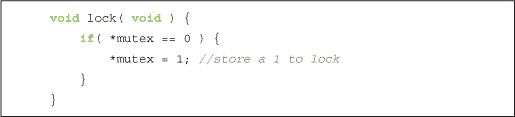

不幸的是，这段代码存在问题。幸运的是，这是一个熟悉的问题：如果在我们的线程读取到值为零之后，另一个线程向互斥量写入 1，会发生什么呢？也就是说，两个线程都检查`mutex`的值，并看到它是零。然后它们都将 1 写入该位置，以表示其他线程该结构已被锁定且无法修改。这样做后，两个线程都认为它们拥有与该内存或数据结构相关的所有权，并开始进行不安全的修改。结果导致灾难！

我们想要完成的操作其实很简单：我们需要将`mutex`的值与 0 进行比较，并且只有在`mutex`为 0 时才会在该位置存储 1。为了正确完成这一操作，整个过程需要以原子方式执行，这样我们就能确保在我们的线程检查并更新`mutex`的值时，不会有其他线程进行干扰。在 CUDA C 中，这个操作可以通过`atomicCAS()`函数来完成，它是一个原子比较与交换操作。`atomicCAS()`函数接受一个指向内存的指针，一个与该位置的值进行比较的值，以及一个如果比较成功时存储在该位置的值。使用此操作，我们可以实现一个 GPU 锁定功能，如下所示：

调用`atomicCAS()`返回它在地址`mutex`处找到的值。因此，`while()`循环将继续运行，直到`atomicCAS()`在`mutex`处看到 0。当它看到 0 时，比较成功，线程会将 1 写入`mutex`。本质上，线程将在`while()`循环中旋转，直到成功锁定数据结构。我们将使用这种锁定机制来实现我们的 GPU 哈希表。但首先，我们将代码包装成一个结构体，以便在点积应用中使用时更加清晰：

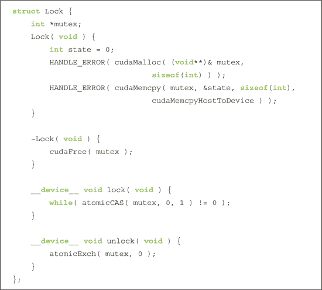

请注意，我们使用`atomicExch(mutex, 0)`恢复`mutex`的值。`atomicExch()`函数读取位于`mutex`处的值，将其与第二个参数（在这种情况下为 0）交换，并返回它读取的原始值。为什么我们要使用原子操作而不是更明显的方式来重置`mutex`的值呢？

*mutex = 0;

如果你期待这个方法失败的某种微妙、隐藏的原因，我们很遗憾地告诉你，实际上这个方法也可以正常工作。那么，为什么不使用这种更明显的方法呢？原子事务和常规全局内存操作在 GPU 中会走不同的路径。因此，同时使用原子操作和标准全局内存操作可能导致`unlock()`与后续尝试`lock()`互斥锁的操作不同步。尽管行为在功能上仍然是正确的，但为了确保应用程序的一致性和直观性，最好对所有互斥锁的访问使用相同的路径。由于我们需要使用原子操作来锁定资源，因此我们也选择使用原子操作来解锁资源。

#### A.1.2 点积重构：原子锁

我们努力改变的唯一部分是之前点积示例中的最终基于 CPU 的归约部分。在上一节中，我们描述了如何在 GPU 上实现互斥锁。实现该互斥锁的`Lock`结构体位于`lock.h`中，并在我们改进的点积示例开头包含：

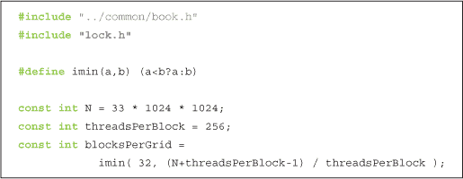

除了两个例外，我们的点积内核的开始部分与我们在第五章中使用的内核完全相同。这两个例外都涉及内核的签名：

在更新后的点积中，我们除了输入向量和输出缓冲区，还将一个`Lock`传递给内核。`Lock`将在最终累加步骤中控制对输出缓冲区的访问。另一个变化在函数签名上并不*明显*，但实际上与签名有关。之前，`float *c`参数是一个包含`N`个浮点数的缓冲区，每个`N`个线程块可以存储其部分结果。这个缓冲区被复制回 CPU 以计算最终和。现在，`c`参数不再指向临时缓冲区，而是指向一个单一的浮点值，该值将存储向量`a`和`b`的点积。即便有这些变化，内核仍然和第五章中的实现完全相同：

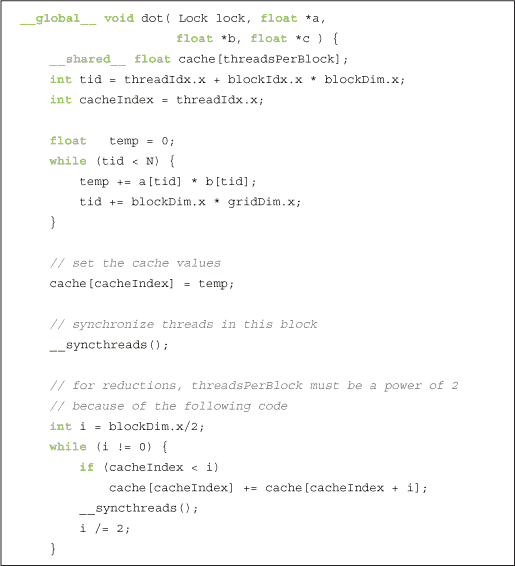

在执行的这个阶段，每个线程块中的 256 个线程已经求和它们的 256 个成对乘积，并计算出一个存储在`cache[0]`中的单一值。现在，每个线程块需要将它的最终值加到`c`上的值。为了安全地完成这个操作，我们将使用锁来控制对该内存位置的访问，因此每个线程在更新`c`值之前需要先获取锁。在将线程块的部分和添加到`c`上的值后，它会解锁互斥体，以便其他线程可以继续累加它们的值。在将自己的值添加到最终结果后，该线程块就没有剩余的计算，能够从内核返回。

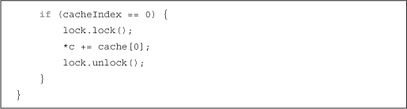

`main()`函数与我们原始实现非常相似，尽管有一些不同之处。首先，我们不再需要像在第五章中那样为部分结果分配缓冲区。现在我们只为一个单一的浮点结果分配空间：

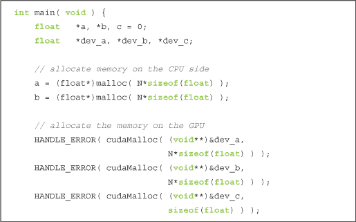

正如我们在第五章中所做的那样，我们初始化输入数组并将它们复制到 GPU。但你会注意到在这个例子中有一个额外的复制操作：我们还将零复制到`dev_c`，即我们打算用来累加最终点积的内存位置。由于每个线程块都需要读取这个值、添加它的部分和，并将结果存回，我们需要确保初始值为零，以便获得正确的结果。

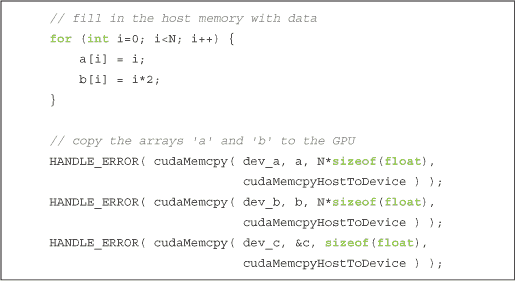

剩下的就是声明我们的`Lock`，调用内核，并将结果复制回 CPU。

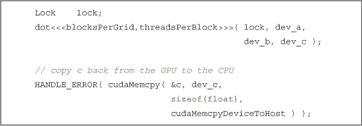

在第五章中，我们会进行最终的`for()`循环来添加部分和。由于这是在 GPU 上通过原子锁来实现的，因此我们可以直接跳到答案检查和清理代码：

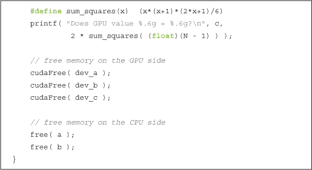

由于无法精确预测每个块将如何按顺序将其部分和添加到最终总和，因此最终结果很可能（几乎可以肯定）将以与 CPU 累加顺序不同的顺序被加总。由于浮点加法的不结合性，因此最终结果在 GPU 和 CPU 之间很可能会略有不同。除非添加一段非平凡的代码，以确保各个块按确定性顺序获取锁，这个顺序与 CPU 上的累加顺序匹配，否则对此几乎无法进行修正。如果你特别有动力，可以尝试一下这个方法。否则，我们将继续了解如何使用这些原子锁来实现多线程数据结构。

### A.2 实现哈希表

哈希表是计算机科学中最重要和最常用的数据结构之一，在各种应用中发挥着重要作用。对于那些还不熟悉哈希表的读者，我们将在这里提供一个简短的入门介绍。数据结构的研究比我们计划提供的更为深入，但为了推动进展，我们将简要介绍。如果你已经对哈希表背后的概念感到熟悉，可以跳到第 A.2.2 节：一个 CPU 哈希表的实现。

#### A.2.1 哈希表概述

哈希表本质上是一个用于存储*键*和*值*对的结构。例如，你可以将字典视为一个哈希表。字典中的每个单词都是一个*键*，每个单词都有一个相关的定义。这个定义是与单词相关联的*值*，因此字典中的每个单词和定义形成一个键/值对。为了使这个数据结构有用，重要的是要最小化在给定一个键的情况下查找特定值所需的时间。通常，这应该是一个常量时间。也就是说，给定一个键，查找一个值所需的时间应该是相同的，无论哈希表中有多少个键/值对。

从抽象层次来看，我们的哈希表会根据值对应的键将值放入“桶”中。我们将键映射到桶中的方法通常称为*哈希函数*。一个好的哈希函数会将可能的键集合均匀地分布到所有桶中，因为这将有助于满足我们的要求：无论我们向哈希表中添加了多少值，查找任何值都应该是常量时间。

举个例子，考虑我们的字典哈希表。一个明显的哈希函数是使用 26 个桶，每个字母对应一个桶。这个简单的哈希函数可能只会查看键的第一个字母，并根据该字母将值放入 26 个桶中的一个。图 A.1 展示了这个哈希函数如何分配一些示例单词。

***图 A.1*** 单词哈希到桶中的示意图

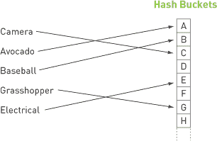

根据我们对英语中单词分布的了解，这个哈希函数有很大的改进空间，因为它无法在 26 个桶之间均匀地映射单词。一些桶将包含非常少的键/值对，而一些桶将包含大量的键/值对。因此，找到与以常见字母（例如 S）开头的单词相关的值将比找到与以字母 X 开头的单词相关的值花费更多的时间。由于我们正在寻找能实现常数时间检索任何值的哈希函数，这种结果是相当不可取的。关于哈希函数的研究已经进行了大量工作，但即使是对这些技术的简要概述也超出了本书的范围。

我们的哈希表数据结构的最后一个组成部分涉及到桶。如果我们有一个完美的哈希函数，每个键都会映射到一个不同的桶。在这种情况下，我们可以简单地将键/值对存储在一个数组中，数组中的每个条目就是我们所称之为的*桶*。然而，即使有一个优秀的哈希函数，在大多数情况下我们仍然需要处理*冲突*。当多个键映射到同一个桶时，就会发生冲突，例如当我们将单词 *avocado* 和 *aardvark* 都添加到字典哈希表中时。存储映射到某个桶的所有值的最简单方法是简单地在桶中维护一个值的列表。当我们遇到冲突时，例如将 *aardvark* 添加到已经包含 *avocado* 的字典中，我们将与 *aardvark* 相关的值放到我们在“A”桶中维护的列表的末尾，如图 A.2 所示。

在图 A.2 中添加单词 *avocado* 后，第一个桶的列表中有一个键/值对。稍后在这个假想的应用程序中，我们添加了单词 *aardvark*，这个单词与 *avocado* 发生冲突，因为它们都以字母 *A* 开头。你会注意到在图 A.3 中，它被简单地放置在第一个桶列表的末尾：

***图 A.2*** 将单词 *avocado* 插入哈希表

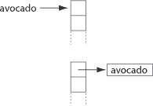

***图 A.3*** 解决添加单词 *aardvark* 时的冲突

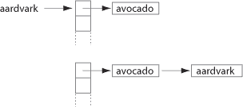

了解了*哈希函数*和*冲突解决*的概念后，我们已经准备好开始实现自己的哈希表。

#### A.2.2 一个 CPU 哈希表

如上一节所述，我们的哈希表将基本由两部分组成：哈希函数和一个桶的数据结构。我们的桶将完全按照之前的方式实现：我们将分配一个长度为`N`的数组，每个数组条目存储一个键/值对的列表。在关注哈希函数之前，我们先来看一下涉及的数据显示结构：

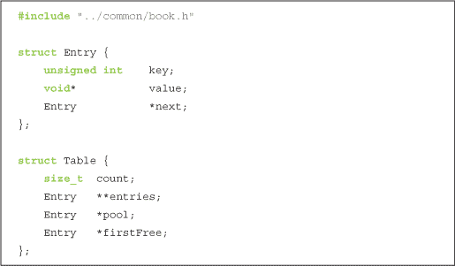

如介绍部分所述，`Entry` 结构体同时保存一个键和值。在我们的应用中，我们将使用无符号整数键来存储我们的键值对。与此键相关联的值可以是任何数据，因此我们将 `value` 声明为 `void*` 来表示这一点。我们的应用程序主要关注的是创建哈希表数据结构，因此我们实际上不会在 `value` 字段中存储任何内容。我们将其包含在结构体中是为了完整性，以防你在自己的应用中使用这段代码。我们哈希表 `Entry` 结构中的最后一项数据是指向下一个 `Entry` 的指针。在发生冲突后，我们会在同一个桶中有多个条目，我们决定将这些条目存储为一个列表。因此，每个条目将指向桶中下一个条目，从而形成一个条目列表，这些条目在表中哈希到了相同的位置。最后一个条目的 `next` 指针将为 `NULL`。

`Table` 结构的核心是一个“桶”的数组。这个桶数组只是一个长度为 `count` 的数组，其中 `entries` 中的每个桶只是指向一个 `Entry` 的指针。为了避免每次向表中添加 `Entry` 时都需要分配内存带来的复杂性和性能损失，表将保持一个大量的可用条目数组 `pool`。字段 `firstFree` 指向下一个可用的 `Entry`，因此当我们需要向表中添加条目时，我们可以直接使用 `firstFree` 指向的 `Entry` 并递增该指针。注意，这还将简化我们的清理代码，因为我们可以通过一次调用 `free()` 来释放所有这些条目。如果我们在每次添加条目时都进行内存分配，那么我们就必须遍历整个表，逐个释放每个条目。

了解了涉及的数据结构后，让我们来看一下其他一些支持代码：

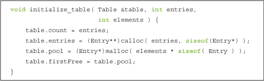

表的初始化主要包括为桶数组 `entries` 分配内存并清理内存。我们还为条目池分配存储空间，并将 `firstFree` 指针初始化为池数组中的第一个条目。

在应用程序结束时，我们需要释放我们分配的内存，因此我们的清理程序会释放桶数组和空闲条目的池：

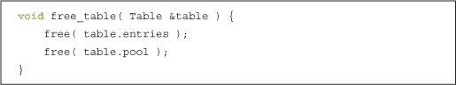

在我们的介绍中，我们谈了很多关于哈希函数的内容。具体来说，我们讨论了一个好的哈希函数如何在优秀的哈希表实现和糟糕的实现之间产生差异。在这个例子中，我们使用无符号整数作为我们的键，并需要将这些键映射到我们的桶数组的索引。最简单的方法是选择一个索引等于键的桶。也就是说，我们可以将条目`e`存储在`table.entries[e.key]`中。然而，我们无法保证每个键都小于桶数组的长度。幸运的是，这个问题可以相对轻松地解决：

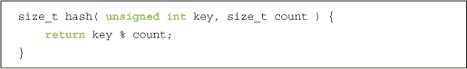

如果哈希函数如此重要，我们怎么能使用如此简单的函数呢？理想情况下，我们希望键在表中的所有桶之间均匀映射，而我们在这里所做的只是对键取数组长度的模。在现实中，哈希函数通常不会这么简单，但因为这只是一个示例程序，我们将随机生成我们的键。如果我们假设随机数生成器生成的值大致均匀，那么这个哈希函数应该能够将这些键均匀地映射到哈希表的所有桶中。在你自己的哈希表实现中，你可能需要一个更复杂的哈希函数。

在了解了哈希表结构和哈希函数后，我们准备查看将键/值对添加到表中的过程。该过程涉及三个基本步骤：

1\. 计算输入键的哈希函数以确定新条目的桶。

2\. 从池中获取一个预分配的`Entry`并初始化其`key`和`value`字段。

3\. 将条目插入到适当桶的列表前面。

我们将这些步骤以相当直接的方式转换为代码。

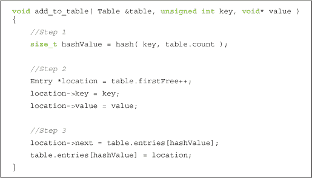

如果你从未见过链表（或者已经有一段时间没接触了），第三步可能一开始会比较难理解。现有的链表将第一个节点存储在`table.entries[hashValue]`处。考虑到这一点，我们可以通过两步将新节点插入到链表的头部：首先，我们将新条目的`next`指针指向现有链表中的第一个节点。然后，我们将新条目存储在桶数组中，这样*它*就成为新链表的第一个节点。

由于了解你编写的代码是否有效是个好主意，我们实现了一个例程来对哈希表进行合理性检查。该检查首先会遍历整个表并检查每个节点。我们计算节点键值的哈希函数，并确认该节点是否存储在正确的桶中。检查完所有节点后，我们验证表中*实际*存在的节点数量是否与我们*计划*添加到表中的元素数量相等。如果这两个数字不一致，那么可能是我们不小心将一个节点插入到了多个桶中，或者插入操作不正确。

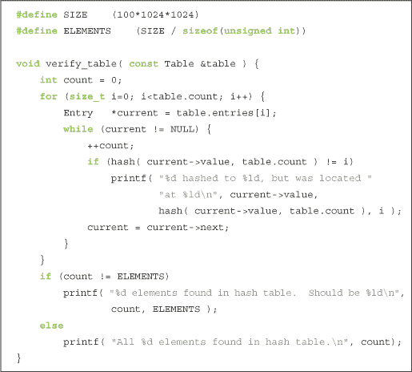

在完成了所有基础设施代码后，我们可以看看`main()`函数。和本书中的许多示例一样，大部分繁重的工作已经由辅助函数完成，所以我们希望`main()`函数相对容易理解：

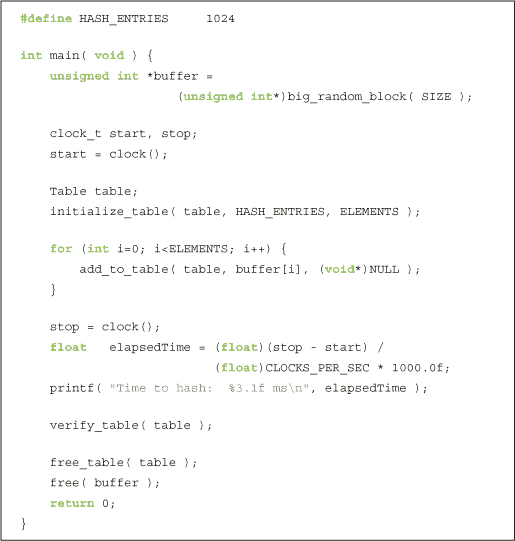

如你所见，我们首先分配了一大块随机数字。这些随机生成的无符号整数将作为我们插入哈希表的键。生成数字后，我们读取系统时间以便衡量实现的性能。我们初始化哈希表，然后使用`for()`循环将每个随机键插入表中。添加完所有键之后，我们再次读取系统时间来计算初始化和添加键所花费的时间。最后，我们使用合理性检查例程验证哈希表，并释放已分配的缓冲区。

你可能注意到，我们使用`NULL`作为每个键值对的值。在典型的应用中，你可能会将一些有用的数据与键一起存储，但由于我们主要关心哈希表的实现，因此每个键都存储一个无意义的值。

#### A.2.3 多线程哈希表

我们的 CPU 哈希表中内置了一些假设，当我们转移到 GPU 时，这些假设将不再成立。首先，我们假设每次只能添加一个节点到表中，以简化节点的添加过程。如果有多个线程同时尝试向表中添加节点，可能会遇到类似于第九章示例中多线程添加的问题。

例如，让我们重新审视“鳄梨和土豚”的例子，假设线程 A 和线程 B 正在尝试将这些条目添加到表中。线程 A 计算*鳄梨*的哈希值，线程 B 计算*土豚*的哈希值。它们都决定自己的键应该放在同一个桶里。为了将新条目添加到列表中，线程 A 和线程 B 首先将它们的新条目的`next`指针设置为现有列表的第一个节点，如图 A.4 所示。

然后，两个线程都尝试用它们的新条目替换桶数组中的条目。然而，第二个完成的线程是唯一一个其更新被保留的线程，因为它会覆盖第一个线程的工作。假设线程 A 用*鳄梨*替换了*海拔*的条目。线程 A 完成后，线程 B 认为它正在替换*海拔*的条目，实际上它替换的是*鳄梨*，结果就像图 A.5 所示。

***图 A.4*** 多个线程尝试将节点添加到同一个桶

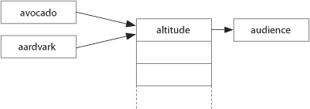

***图 A.5*** 两个线程进行并发修改失败后的哈希表

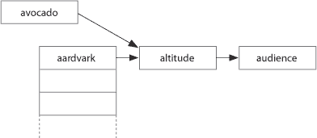

线程 A 的条目不幸地“漂浮”在哈希表之外。幸运的是，我们的完整性检查程序会捕捉到这一点，并警告我们存在问题，因为它会统计出比预期少的节点。但我们仍然需要回答这个问题：我们如何在 GPU 上构建哈希表？关键的观察是，只有一个线程可以安全地对一个桶进行修改。这类似于我们在点积示例中提到的，每次只有一个线程能够安全地将其值加到最终结果中。如果每个桶都有一个与之关联的原子锁，那么我们就可以确保一次只有一个线程对给定的桶进行修改。

#### A.2.4 一个 GPU 哈希表

通过确保安全的多线程访问哈希表的方法，我们可以继续实现我们在第 A.2.2 节中编写的哈希表应用：一个 CPU 哈希表。我们需要包含 `lock.h`，这是我们在第 A.1.1 节 原子锁部分中实现的 GPU `Lock` 结构，并且需要将哈希函数声明为 `__device_` 函数。除了这些变化外，基本的数据结构和哈希函数与 CPU 实现相同。

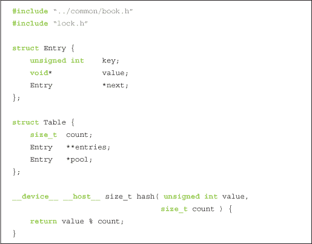

初始化和释放哈希表的步骤与我们在 CPU 上执行的相同，但和之前的示例一样，我们使用 CUDA 运行时函数来完成这些操作。我们使用 `cudaMalloc()` 来分配桶数组和条目池，并使用 `cudaMemset()` 将桶数组的条目初始化为零。为了在应用完成后释放内存，我们使用 `cudaFree()`。

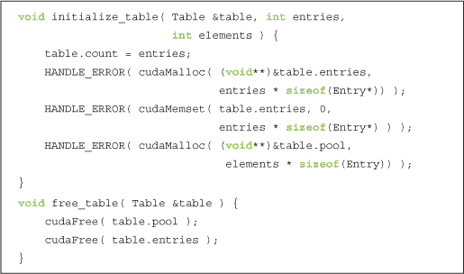

我们在 CPU 实现中使用了一个常规方法来检查我们的哈希表是否正确。我们需要为 GPU 版本提供类似的方法，因此我们有两个选择。我们可以编写一个基于 GPU 的 `verify_table()` 版本，或者我们可以使用在 CPU 版本中使用的相同代码，并添加一个将哈希表从 GPU 复制到 CPU 的函数。尽管这两种方法都能满足我们的需求，但第二种方法有两个优点：首先，它涉及重用我们 CPU 版本的 `verify_table()`。就像一般的代码重用一样，这样可以节省时间，并确保将来对代码的修改只需在一个地方进行，两个版本的哈希表都可以使用。其次，实现一个复制函数将揭示一个有趣的问题，解决这个问题可能在未来对你非常有帮助。

正如承诺的那样，`verify_table()` 与 CPU 实现完全相同，方便起见，在此重新打印如下：

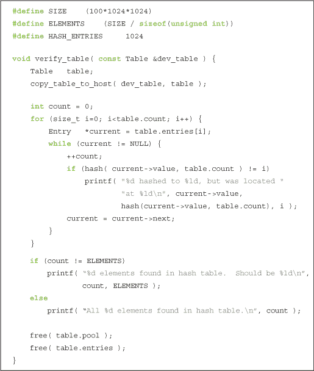

既然我们选择了重用 CPU 版本的 `verify_table()`，那么我们需要一个函数将表从 GPU 内存复制到主机内存。这个函数有三个步骤，其中两个步骤比较明显，第三个步骤则稍微复杂一些。前两个步骤包括为哈希表数据分配主机内存，并通过 `cudaMemcpy()` 将 GPU 数据结构复制到这块内存中。我们之前已经做过很多次，所以这应该不是什么新鲜事。

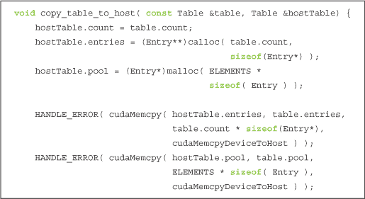

这个常规方法的难点在于我们复制的某些数据是指针。我们不能简单地将这些指针复制到主机上，因为它们是 GPU 上的地址；在主机上它们将不再是有效的指针。然而，指针的相对偏移量 *仍然* 是有效的。每个指向 `Entry` 的 GPU 指针都指向 `table.pool[]` 数组中的某个位置，但为了使哈希表能够在主机上使用，我们需要它们指向 `hostTable.pool[]` 数组中的相同 `Entry`。

给定一个 GPU 指针 X，因此我们需要将指针从`table.pool`的偏移量加到`hostTable.pool`中，才能得到一个有效的主机指针。也就是说，新指针应按如下方式计算：

(X - table.pool) + hostTable.pool

我们对每个从 GPU 复制过来的`Entry`指针执行此更新：`hostTable.entries`中的`Entry`指针和表中每个`Entry`的`next`指针。

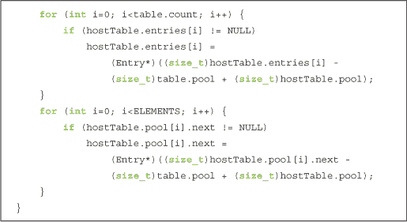

在查看了数据结构、哈希函数、初始化、清理和验证代码后，剩下最重要的部分就是实际涉及 CUDA C 原子操作的部分。作为参数，`add_to_table()`内核将接收一个键和值的数组，这些键值对将被添加到哈希表中。下一个参数是哈希表本身，最后一个参数是一个锁数组，将用于锁定每个表的桶。由于我们的输入是两个数组，线程需要索引它们，因此我们还需要常见的索引线性化：

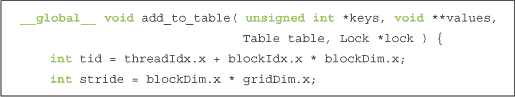

我们的线程遍历输入数组，就像在点积示例中那样。对于`keys[]`数组中的每个键，线程将计算哈希函数以确定该键/值对属于哪个桶。确定目标桶后，线程锁定该桶，添加键/值对，然后解锁桶。

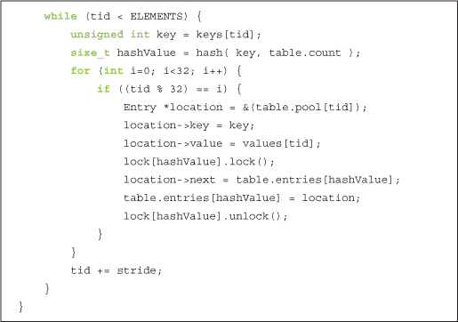

然而，这段代码有一个非常特别的地方。`for()`循环和随后的`if()`语句似乎完全不必要。在第六章中，我们介绍了*warp*的概念。如果你忘记了，warp 是由 32 个线程组成的集合，这些线程一起执行并保持同步。尽管在 GPU 中如何实现这一点的细节超出了本书的范围，但在 warp 中只有一个线程可以同时获取锁，如果我们让 warp 中的所有 32 个线程同时争抢锁，我们将遭遇不少麻烦。在这种情况下，我们发现最好在软件中完成一些工作，并简单地遍历 warp 中的每个线程，给每个线程一个机会来获取数据结构的锁，完成工作后再释放锁。

`main()`的流程应该与 CPU 实现相同。我们首先为哈希表的键分配一大块随机数据。接着，我们创建开始和停止的 CUDA 事件，并记录开始事件以进行性能测量。然后，我们为随机键数组分配 GPU 内存，将数组复制到设备上，并初始化哈希表：

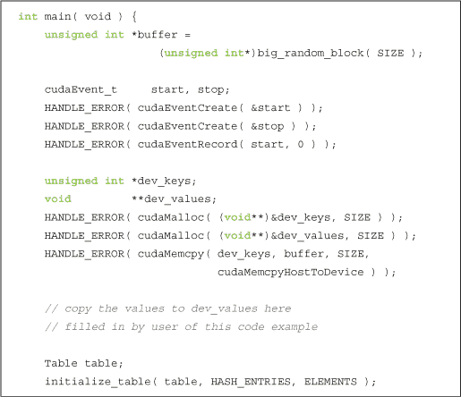

构建哈希表的最后一步准备工作涉及为哈希表的桶准备锁。我们为哈希表中的每个桶分配一个锁。理论上，如果我们只为整个表使用一个锁，可以节省大量内存。但这样做会彻底破坏性能，因为每个线程在一组线程同时尝试向表中添加条目时，都必须争抢表锁。因此，我们声明了一个锁数组，每个桶对应一个锁。然后，我们为锁分配一个 GPU 数组并将其复制到设备上：

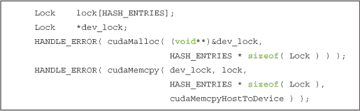

`main()` 的其余部分与 CPU 版本相似：我们将所有键添加到哈希表，停止性能计时器，验证哈希表的正确性，并进行清理：

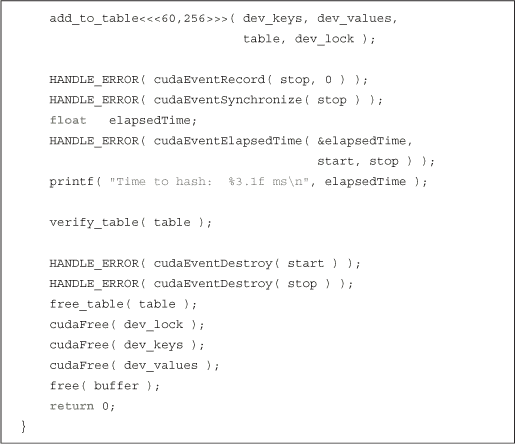

#### A.2.5 哈希表性能

使用 Intel Core 2 Duo 处理器，A.2.2 节中的 CPU 哈希表示例：从 100MB 数据构建哈希表需要 360 毫秒。该代码使用 `-O3` 选项进行编译，以确保最大程度优化 CPU 代码。多线程 GPU 哈希表示例在 A.2.4 节 中：GPU 哈希表完成相同任务需要 375 毫秒。两者差异不到 5%，这些执行时间大致相当，这引出了一个非常好的问题：为什么像 GPU 这样的大规模并行机器会被一个单线程的 CPU 版本击败呢？坦率地说，这是因为 GPU 并不是为处理复杂数据结构（如哈希表）的多线程访问而设计的。因此，几乎没有性能动机将哈希表这样的数据结构构建在 GPU 上。所以，如果*您的应用程序*只需要构建一个哈希表或类似的数据结构，您可能更适合在 CPU 上执行这项任务。

另一方面，您有时会遇到这样一种情况：一个长的计算管道涉及一些 GPU 在与 CPU 相比时没有性能优势的阶段。在这种情况下，您有三个（或许有些显而易见的）选择：

• 在 GPU 上执行管道的每个步骤

• 在 CPU 上执行管道的每个步骤

• 在 GPU 上执行一些管道步骤，在 CPU 上执行一些步骤

最后的选项听起来像是两全其美；然而，它意味着在应用程序中任何需要将计算从 GPU 转移到 CPU 或反向的地方，都需要同步 CPU 和 GPU。这个同步以及随后主机和 GPU 之间的数据传输，往往会消耗掉你通过采用混合方法所获得的任何性能优势。

在这种情况下，即使 GPU 并不完全适合算法中的某些步骤，花时间在 GPU 上执行每个计算阶段可能还是值得的。通过这种方式，GPU 哈希表可以潜在地避免 CPU/GPU 同步点，最小化主机和 GPU 之间的数据传输，并释放 CPU 以执行其他计算。在这种情况下，尽管 GPU 在某些步骤上可能不比 CPU 快（甚至在某些情况下可能被 CPU 击败），GPU 实现的整体性能仍有可能超越 CPU/GPU 混合方法。

### A.3 附录回顾

我们展示了如何使用原子比较与交换操作实现一个 GPU 互斥锁。通过使用这个互斥锁构建的锁，我们看到了如何改善我们最初的点积应用，使其完全在 GPU 上运行。我们进一步扩展了这个想法，实施了一个多线程哈希表，使用一个锁的数组来防止多个线程同时进行不安全的修改。事实上，我们开发的互斥锁可以用于任何类型的并行数据结构，我们希望你能在自己的实验和应用开发中找到它的价值。当然，使用 GPU 实现基于互斥锁的数据结构的应用性能需要仔细研究。我们的 GPU 哈希表被同样代码的单线程 CPU 版本击败，因此，只有在特定情况下，使用 GPU 处理此类应用才是有意义的。没有一条通用的规则可以用来判断 GPU-only、CPU-only 或混合方式哪种最有效，但了解如何使用原子操作将使你能够根据具体情况做出决策。
