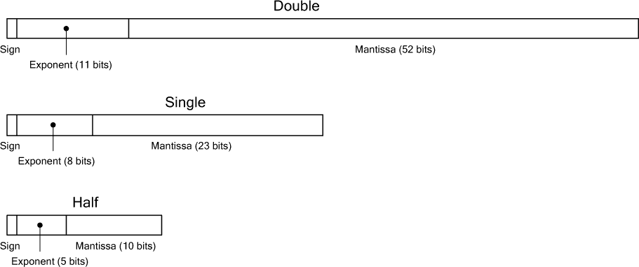
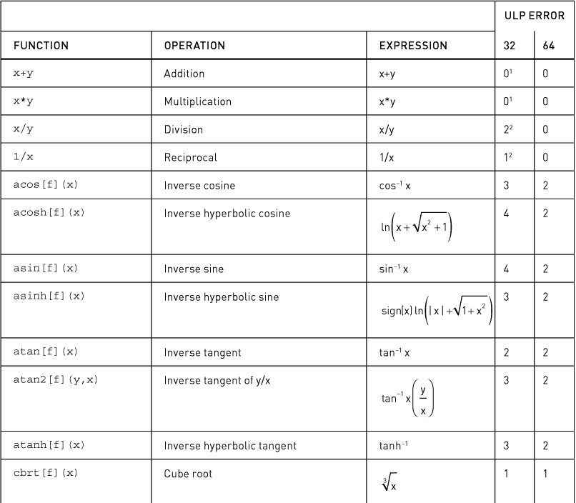
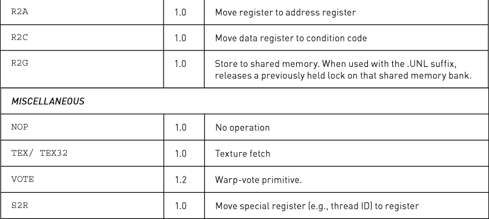
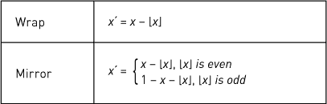

# 第二部分

## 第五章 内存

为了最大化性能，CUDA 根据预期的使用情况使用不同类型的内存。*主机内存*指的是系统中附加在 CPU 上的内存。CUDA 提供了 API，通过页面锁定和将其映射到 GPU(s) 上，从而实现更快的主机内存访问。*设备内存*附加在 GPU 上，并通过专用的内存控制器进行访问，正如每个初学者 CUDA 开发者所知道的，数据必须显式地在主机内存和设备内存之间复制，才能被 GPU 处理。

设备内存可以通过多种方式进行分配和访问。

• *全局内存*可以静态或动态分配，并通过 CUDA 内核中的指针进行访问，这些指针会转换为全局加载/存储指令。

• *常量内存*是只读内存，通过不同的指令进行访问，这些指令使得读取请求由优化用于广播到多个线程的缓存层次结构处理。

• *本地内存*包含堆栈：无法存放在寄存器中的局部变量、参数和子程序的返回地址。

• *纹理内存*（以 CUDA 数组的形式）通过纹理和表面加载/存储指令进行访问。与常量内存类似，纹理内存的读取请求由一个单独的缓存处理，该缓存经过优化以供只读访问。

*共享内存*是 CUDA 中一种重要的内存类型，它*不是*由设备内存支持。相反，它是一个抽象，代表了一个片上“临时存储区”内存，用于线程之间在块内进行快速数据交换。从物理上讲，共享内存以内置内存的形式存在于 SM 上：在 SM 1.x 硬件上，共享内存通过 16K RAM 实现；在 SM 2.x 及更新的硬件上，共享内存通过 64K 缓存实现，可以划分为 48K L1/16K 共享，或 48K 共享/16K L1。

### 5.1 主机内存

在 CUDA 中，*主机内存*是指系统中可以被 CPU 访问的内存。默认情况下，这些内存是*可分页*的，这意味着操作系统可能会将其移到其他位置或驱逐到磁盘。由于可分页内存的物理位置可能会在不通知的情况下发生变化，GPU 等外设无法访问它。为了使硬件能够进行“直接内存访问”（DMA），操作系统允许将主机内存“锁页”，为了性能优化，CUDA 提供了 API，允许应用程序开发者利用这些操作系统功能。所谓的*锁页内存*，即经过锁页处理并为 CUDA GPU(s)提供直接访问的内存，使得

• 更快的传输性能

• 异步内存复制（即内存复制在复制操作完成之前返回控制给调用者；GPU 与 CPU 并行执行复制操作）

• 可由 CUDA 内核直接访问的映射锁页内存

由于可分页内存的虚拟→物理映射可能会不可预测地变化，GPU 根本无法访问可分页内存。CUDA 通过一对*暂存缓冲区*来复制可分页内存，这些缓冲区是由驱动程序在分配 CUDA 上下文时分配的。第六章包括手工编写的可分页 memcpy 例程，利用 CUDA 事件来完成所需的同步操作，以管理这种双缓冲。

#### 5.1.1\. 分配锁页内存

锁页内存的分配和释放使用 CUDA 提供的特殊函数：对于 CUDA 运行时使用`cudaHostAlloc()/cudaFreeHost()`，对于驱动程序 API 使用`cuMemHostAlloc()/cuMemFreeHost()`。这些函数与主机操作系统协作，分配锁页内存并为 GPU(s)的 DMA 映射该内存。

CUDA 跟踪它已分配的内存，并透明地加速涉及使用`cuMemHostAlloc()/cudaHostAlloc()`分配的主机指针的内存复制。此外，一些函数（特别是异步 memcpy 函数）需要锁页内存。

`bandwidthTest` SDK 示例使开发者能够轻松比较固定内存与普通可分页内存的性能。`--memory=pinned` 选项会使测试使用固定内存而非可分页内存。表 5.1 列出了在 Amazon EC2 上运行 Windows 7-x64 的 `cg1.4xlarge` 实例的 `bandwidthTest` 数值（单位为 MB/s）。由于涉及大量主机工作，包括内核切换，分配固定内存的成本较高。

*表 5.1* 固定内存与可分页内存带宽

CUDA 2.2 增加了几个固定内存的特性。*可移植固定内存*可以被任何 GPU 访问；*映射固定内存*被映射到 CUDA 地址空间，以便 CUDA 内核直接访问；而 *写合并固定内存* 在某些系统上可以实现更快的总线传输。CUDA 4.0 添加了与主机内存相关的两个重要特性：现有的主机内存区域可以使用 *主机内存注册* 进行页面锁定，统一虚拟地址（UVA）使得所有指针在整个进程中都是唯一的，包括主机和设备指针。当 UVA 生效时，系统可以根据地址范围推断出内存是设备内存还是主机内存。

#### 5.1.2\. 可移植固定内存

默认情况下，固定内存分配仅对在 `cudaHostAlloc()` 或 `cuMemHostAlloc()` 调用时的当前 GPU 可访问。通过在 `cudaHostAlloc()` 中指定 `cudaHostAllocPortable` 标志，或者在 `cuHostMemAlloc()` 中指定 `CU_MEMHOSTALLOC_PORTABLE` 标志，应用程序可以请求将固定分配映射到 *所有* GPU。可移植的固定分配受益于前面提到的 memcpy 透明加速，并且可以参与任何 GPU 的异步 memcpys。对于计划使用多个 GPU 的应用程序，最好将所有固定分配指定为可移植的。

* * *

注意

当 UVA 生效时，所有固定内存分配都是可移植的。

* * *

#### 5.1.3\. 映射固定内存

默认情况下，固定内存分配会映射到 CUDA 地址空间外的 GPU 上。它们可以被 GPU 直接访问，但只能通过 memcpy 函数进行访问。CUDA 内核不能直接读取或写入主机内存。然而，在 SM 1.2 及更高版本的 GPU 上，CUDA 内核可以直接读取和写入主机内存；它们只需要将分配映射到设备内存地址空间中。

要启用映射的固定内存分配，使用 CUDA 运行时的应用程序必须在任何初始化操作之前调用`cudaSetDeviceFlags()`并设置`cudaDeviceMapHost`标志。驱动程序 API 应用程序需要在`cuCtxCreate()`中指定`CU_CTX_MAP_HOST`标志。

一旦启用了映射的固定内存，可以通过调用`cudaHostAlloc()`并设置`cudaHostAllocMapped`标志，或通过`cuMemHostAlloc()`并设置`CU_MEMALLOCHOST_DEVICEMAP`标志来进行分配。除非 UVA 生效，否则应用程序必须通过`cudaHostGetDevicePointer()`或`cuMemHostGetDevicePointer()`查询与分配对应的设备指针。然后，可以将该设备指针传递给 CUDA 内核。关于映射固定内存的最佳实践，请参阅章节“映射固定内存使用”。

* * *

注意

当 UVA 生效时，所有固定内存分配都会被映射。^(1)

1. 除非标记为写合并。

* * *

#### 5.1.4\. 写合并固定内存

写合并内存，也称为写合并或不可缓存写合并（USWC）内存，旨在使 CPU 能够快速写入 GPU 帧缓冲区而不会污染 CPU 缓存。^(2) 为此，英特尔新增了一种新的页表类型，将写操作引导到专用的写合并缓冲区，而不是主处理器缓存层次结构。后来，英特尔还增加了“非时间性”存储指令（例如`MOVNTPS`和`MOVNTI`），使得应用程序可以按指令级别将写操作引导到写合并缓冲区。通常，需要使用内存屏障指令（例如`MFENCE`）来维持与 WC 内存的一致性。对于 CUDA 应用程序，这些操作不需要手动执行，因为它们在 CUDA 驱动程序提交工作到硬件时会自动完成。

2。WC 内存最初由英特尔在 1997 年宣布，同时发布的还有加速图形端口（AGP）。AGP 曾用于图形卡，后来被 PCI Express 取代。

对于 CUDA，可以通过调用`cudaHostAlloc()`并使用`cudaHostWriteCombined`标志，或者使用`cuMemHostAlloc()`并带上`CU_MEMHOSTALLOC_WRITECOMBINED`标志来请求写合并内存。除了将页表条目设置为绕过 CPU 缓存之外，这些内存在 PCI Express 总线传输过程中也不会被窥探。在前端总线系统（如 Opteron 和 Nehalem 之前的系统）中，避免窥探可以提高 PCI Express 传输性能。在 NUMA 系统中，WC 内存几乎没有性能优势。

用 CPU 读取 WC 内存非常慢（大约慢 6 倍），除非使用`MOVNTDQA`指令（SSE4 新增加的指令）进行读取。在 NVIDIA 的集成 GPU 上，写合并内存与系统内存保留区一样快——系统内存是启动时为 GPU 预留的内存，CPU 无法访问。

尽管有声称的好处，但截至本文撰写时，CUDA 开发人员几乎没有理由使用写合并内存。因为主机内存指针很容易“泄漏”到应用程序的某个部分，从而试图读取该内存。缺乏相反的实验证据时，应该避免使用它。

* * *

注意

当 UVA 生效时，写合并固定分配的内存*不会*映射到统一地址空间中。

* * *

#### 5.1.5. 注册固定内存

CUDA 开发人员并不总是能直接分配主机内存供 GPU(s)访问。例如，一个大型的、可扩展的应用程序可能有一个接口，将指针传递给 CUDA 感知插件，或者该应用程序可能正在使用某个其他外围设备（特别是高速网络）的 API，该设备也有自己的分配函数，原因与 CUDA 类似。为了适应这些使用场景，CUDA 4.0 引入了*注册*固定内存的功能。

固定内存注册将内存分配与主机内存的页面锁定和映射解耦。它采用一个*已经分配*的虚拟地址范围，进行页面锁定，并为 GPU 映射。与 `cudaHostAlloc()` 一样，这块内存可以选择性地映射到 CUDA 地址空间中，或使其可移植（可以被所有 GPU 访问）。

`cuMemHostRegister()/cudaHostRegister()` 和 `cuMemHostUnregister()/cudaHostUnregister()` 函数分别用于注册和注销主机内存，以便 GPU 访问。需要注册的内存范围必须是按页面对齐的：换句话说，基地址和大小必须能被操作系统的页面大小整除。应用程序可以通过两种方式分配按页面对齐的地址范围。

• 使用操作系统的功能分配内存，这些功能处理整个页面，比如 Windows 上的 `VirtualAlloc()` 或其他平台上的 `valloc()` 或 `mmap()`^(3)。

3。或者使用`posix_memalign()`结合`getpagesize()`。

• 给定一个任意的地址范围（例如，使用`malloc()`或`operator new[]`分配的内存），将地址范围限制为下一个较低的页面边界，并填充到下一个页面大小。

* * *

注意

即使在启用 UVA 的情况下，已注册并映射到 CUDA 地址空间的固定内存，其设备指针与主机指针不同。应用程序必须调用`cudaHostGetDevicePointer()/cuMemHostGetDevicePointer()`来获取设备指针。

* * *

#### 5.1.6. 固定内存和 UVA

当 UVA（统一虚拟地址）生效时，所有固定内存分配都是既映射又可移植的。此规则的例外是写合并内存和注册内存。对于这些内存，设备指针可能与主机指针不同，应用程序仍然需要通过`cudaHostGetDevicePointer()/cuMemHostGetDevicePointer()`来查询设备指针。

UVA 在除 Windows Vista 和 Windows 7 外的所有 64 位平台上均受支持。在 Windows Vista 和 Windows 7 上，只有 TCC 驱动程序（可以通过`nvidia-smi`启用或禁用）支持 UVA。应用程序可以通过调用`cudaGetDeviceProperties()`并检查`cudaDeviceProp::unifiedAddressing`结构成员，或者通过调用`cuDeviceGetAttribute()`并传入`CU_DEVICE_ATTRIBUTE_UNIFIED_ADDRESSING`来查询 UVA 是否生效。

#### 5.1.7. 映射固定内存的使用

对于依赖 PCI Express 传输性能的应用程序，映射的固定内存可以带来好处。由于 GPU 可以直接从内核读取或写入主机内存，因此不需要进行一些内存复制，从而减少了开销。以下是使用映射的固定内存的一些常见用法。

• 向主机内存写入数据：多 GPU 应用程序通常必须将结果写回系统内存，以便与其他 GPU 交换；通过映射的固定内存写入这些结果，可以避免不必要的设备→主机内存复制。对于主机内存的只写访问模式很有吸引力，因为不需要处理延迟。

• 流式传输：这些工作负载通常会使用 CUDA 流来协调设备内存之间的并行内存复制操作，同时内核在设备内存上进行处理。

• “有风度的复制”：某些工作负载通过在数据传输穿越 PCI Express 时执行计算从而受益。例如，GPU 可以在传输 Scan 数据时进行子数组归约计算。

##### 警告

映射的固定内存不是万能的。在使用它时，需考虑以下一些警告。

• 从映射的固定内存进行纹理映射是可能的，但速度非常慢。

• 映射的固定内存必须通过合并内存事务来访问（参见第 5.2.9 节）。未合并的内存事务的性能损失范围为 6 倍到 2 倍。但即使在 SM 2.x 及以后的 GPU 上，缓存本应使合并操作成为过时的考虑因素，性能损失依然显著。

• 使用内核轮询主机内存（例如，进行 CPU/GPU 同步）是不推荐的。

• 不要尝试在映射的固定主机内存上使用原子操作，无论是在主机（锁定比较-交换）还是在设备端（`atomicAdd()`）。在 CPU 端，用于强制互斥的设施对于 PCI Express 总线上的外设是不可见的。相反，在 GPU 端，原子操作仅在本地设备内存位置上有效，因为它们是通过 GPU 的本地内存控制器实现的。

#### 5.1.8. NUMA、线程亲和性和固定内存

从 AMD Opteron 和 Intel Nehalem 开始，CPU 内存控制器直接集成到 CPU 中。此前，内存是连接到芯片组“北桥”的所谓“前端总线”（FSB）。在多 CPU 系统中，北桥可以为任何 CPU 提供内存请求服务，并且内存访问性能在不同 CPU 之间是比较均匀的。随着集成内存控制器的引入，每个 CPU 都有自己专用的“本地”物理内存池，直接连接到该 CPU。虽然任何 CPU 都可以访问其他 CPU 的内存，但“非本地”访问——一个 CPU 访问连接到另一个 CPU 的内存——是通过 AMD HyperTransport（HT）或 Intel QuickPath Interconnect（QPI）执行的，这会带来延迟惩罚和带宽限制。为了与 FSB 系统所表现出的统一内存访问时间对比，这些系统架构被称为 NUMA，即*非统一内存访问*。

如你所想，多线程应用程序的性能可能在很大程度上依赖于内存引用是否位于正在运行当前线程的 CPU 本地。然而，对于大多数应用程序来说，非本地访问的较高成本会被 CPU 的板载缓存所抵消。一旦非本地内存被提取到 CPU 中，它将在缓存中保持，直到被驱逐或被另一个 CPU 通过对同一页面的内存访问所需。在 NUMA 系统中，通常会包括一个系统 BIOS 选项，用于在物理上将内存在 CPU 之间“交错”分布。当启用此 BIOS 选项时，内存会按照每个缓存行（通常是 64 字节）在 CPU 之间均匀分配，因此例如，在一个 2 个 CPU 的系统中，大约 50%的内存访问将是非本地的。

对于 CUDA 应用程序，PCI Express 传输性能可能取决于内存引用是否是本地的。如果系统中有多个 I/O 集线器（IOH），连接到给定 IOH 的 GPU 性能更好，并且当固定内存是本地时，减少了对 QPI 带宽的需求。因为一些高端 NUMA 系统是分层的，但并不严格将内存带宽池与 CPU 关联，所以 NUMA API 指代的*节点*可能不严格对应系统中的 CPU。

如果系统启用了 NUMA，最佳实践是将主机内存分配到与给定 GPU 相同的节点。不幸的是，目前没有官方的 CUDA API 来将 GPU 与特定的 CPU 关联。开发人员如果对系统设计有先验知识，可能会知道应将哪个节点与哪个 GPU 关联。然后，可以使用平台特定的 NUMA 感知 API 来执行这些内存分配，并且可以使用主机内存注册（参见第 5.1.5 节）来固定这些虚拟分配，并为 GPU 进行映射。

示例 5.1 提供了一个代码片段，用于在 Linux 上执行 NUMA 感知分配，^(4)，而示例 5.2 提供了一个代码片段，用于在 Windows 上执行 NUMA 感知分配。^(5)

4. [`bit.ly/USy4e7`](http://bit.ly/USy4e7)

5. [`bit.ly/XY1g8m`](http://bit.ly/XY1g8m)

*示例 5.1.* NUMA 感知分配（Linux）。

点击这里查看代码图像

* * *

bool

numNodes( int *p )

{

if ( numa_available() >= 0 ) {

*p = numa_max_node() + 1;

return true;

}

return false;

}

void *

pageAlignedNumaAlloc( size_t bytes, int node )

{

void *ret;

printf( "在节点 %d 上分配内存\n", node ); fflush(stdout);

ret = numa_alloc_onnode( bytes, node );

return ret;

}

void

pageAlignedNumaFree( void *p, size_t bytes )

{

numa_free( p, bytes );

}

* * *

*示例 5.2.* NUMA 感知分配（Windows）。

点击这里查看代码图片

* * *

bool

numNodes( int *p )

{

ULONG maxNode;

if ( GetNumaHighestNodeNumber( &maxNode ) ) {

*p = (int) maxNode+1;

return true;

}

return false;

}

void *

pageAlignedNumaAlloc( size_t bytes, int node )

{

void *ret;

printf( "Allocating on node %d\n", node ); fflush(stdout);

ret = VirtualAllocExNuma( GetCurrentProcess(),

NULL，

bytes，

MEM_COMMIT | MEM_RESERVE，

PAGE_READWRITE，

node );

return ret;

}

void

pageAlignedNumaFree( void *p )

{

VirtualFreeEx( GetCurrentProcess(), p, 0, MEM_RELEASE );

}

* * *

### 5.2\. 全局内存

全局内存是 CUDA 内核读写设备内存的主要抽象方式。^(6) 由于设备内存直接连接到 GPU，并通过集成到 GPU 中的内存控制器进行读写，因此其峰值带宽极高：高端 CUDA 卡的带宽通常超过 100G/s。

6。为了最大限度地增加开发者的困惑，CUDA 使用*设备指针*一词来指代驻留在*全局内存*中的指针（由 CUDA 内核可寻址的设备内存）。

设备内存可以通过 CUDA 内核使用*设备指针*进行访问。以下是一个简单的 memset 内核示例。

点击这里查看代码图片

template<class T>

__global__ void

GPUmemset( int *base, int value, size_t N )

{

for ( size_t i = blockIdx.x*blockDim.x + threadIdx.x;

i < N;

i += gridDim.x*blockDim.x )

{

base[i] = value;

}

}

设备指针`base`驻留在*设备地址空间*中，与 CUDA 程序中主机代码使用的 CPU 地址空间分开。因此，CUDA 程序中的主机代码可以对设备指针进行指针运算，但不能解引用它们。^(7)

7. 映射的固定指针是此规则的例外。它们位于系统内存中，但可以被 GPU 访问。在非 UVA 系统中，指向此内存的主机指针和设备指针是不同的：应用程序必须调用`cuMemHostGetDevicePointer()`或`cudaHostGetDevicePointer()`将主机指针映射到相应的设备指针。但当启用 UVA 时，指针是相同的。

这个内核将整数`value`写入由`base`和`N`给定的地址范围。对`blockIdx`、`blockDim`和`gridDim`的引用使得内核能够正确运行，使用启动内核时指定的块和网格参数。

#### 5.2.1\. 指针

在使用 CUDA 运行时，设备指针和主机指针都被定义为`void *`类型。驱动程序 API 使用一个称为`CUdeviceptr`的整数类型定义，它与主机指针的宽度相同（即在 32 位操作系统上为 32 位，在 64 位操作系统上为 64 位），如下所示。

点击这里查看代码图片

#if defined(__x86_64) || defined(AMD64) || defined(_M_AMD64)

typedef unsigned long long CUdeviceptr;

#else

typedef unsigned int CUdeviceptr;

#endif

`uintptr_t`类型，定义在`<stdint.h>`中，并在 C++0x 中引入，可用于在主机指针（`void *`）和设备指针（`CUdeviceptr`）之间便捷地转换，如下所示。

点击这里查看代码图片

CUdeviceptr devicePtr;

void *p;

p = (void *) (uintptr_t) devicePtr;

devicePtr = (CUdeviceptr) (uintptr_t) p;

主机可以对设备指针进行指针运算，以传递给内核或 memcpy 调用，但主机无法通过这些指针读取或写入设备内存。

##### 驱动程序 API 中的 32 位和 64 位指针

由于原始驱动程序 API 中对指针的定义是 32 位的，因此将 CUDA 支持 64 位时，需要对 `CUdeviceptr` 的定义进行修改，并且所有以 `CUdeviceptr` 为参数的驱动程序 API 函数都需要进行更改。^(8) 例如，`cuMemAlloc()` 从

8. 出于兼容性原因，旧的函数必须保留。

CUresult CUDAAPI cuMemAlloc(CUdeviceptr *dptr, unsigned int bytesize);

到

CUresult CUDAAPI cuMemAlloc(CUdeviceptr *dptr, size_t bytesize);

为了兼容旧版应用程序（这些应用程序使用的是链接到 `cuMemAlloc()` 的 32 位 `CUdeviceptr` 和大小）和新版应用程序，`cuda.h` 包含了两段代码，使用预处理器在开发人员更新到新 API 时无需更改函数名称即可改变绑定。

首先，一段代码悄悄地将函数名称修改为映射到语义不同的更新函数。

点击此处查看代码图像

#if defined(__CUDA_API_VERSION_INTERNAL) || __CUDA_API_VERSION >= 3020

#define cuDeviceTotalMem cuDeviceTotalMem_v2

...

#define cuTexRefGetAddress cuTexRefGetAddress_v2

#endif /* __CUDA_API_VERSION_INTERNAL || __CUDA_API_VERSION >= 3020 */

这样，客户端代码使用相同的旧函数名称，但编译后的代码会生成带有 `_v2` 后缀的新函数名称的引用。

在头文件的后面，旧的函数仍然按原样定义。因此，为最新版本的 CUDA 编译的开发人员将获得最新的函数定义和语义。`cuda.h` 对于那些语义发生变化的函数（例如 `cuStreamDestroy()`）也使用类似的策略。

#### 5.2.2\. 动态分配

在 CUDA 中，大部分全局内存通过动态分配获得。使用 CUDA 运行时，相关函数

点击此处查看代码图像

cudaError_t cudaMalloc( void **, size_t );

cudaError_t cudaFree( void );

分别分配和释放全局内存。相应的驱动程序 API 函数是

点击此处查看代码图像

CUresult CUDAAPI cuMemAlloc(CUdeviceptr *dptr, size_t bytesize);

CUresult CUDAAPI cuMemFree(CUdeviceptr dptr);

分配全局内存是昂贵的。CUDA 驱动程序实现了一个子分配器来满足小规模的分配请求，但如果子分配器必须创建一个新的内存块，这将需要一次昂贵的操作系统调用到内核模式驱动程序。如果发生这种情况，CUDA 驱动程序还必须与 GPU 同步，这可能会破坏 CPU/GPU 的并发性。因此，在性能敏感的代码中，避免分配或释放全局内存是一个好的实践。

##### 斜向分配

合并约束和纹理以及 2D 内存复制的对齐限制促使了*斜向*内存分配的创建。其理念是，在创建二维数组时，指向数组的指针在更新指向不同的行时应该具有相同的对齐特性。数组的*步幅*是每行数组的字节数。^(9) 步幅分配接受一个宽度（以字节为单位）和高度，将宽度填充到适合硬件的步幅，然后返回分配的基指针和步幅。通过使用这些分配函数将步幅的选择委托给驱动程序，开发人员可以使他们的代码对未来需要更宽对齐要求的架构具有兼容性。^(10)

9。二维内存分配的填充概念早于 CUDA。图形 API，如 Apple QuickDraw 和 Microsoft DirectX，分别暴露了“rowBytes”和“pitch”。曾几何时，填充通过将乘法替换为位移操作，甚至将乘法替换为两次位移加一次加法的方式简化了寻址计算，这种方式使用了“两个 2 的幂”，例如 640（512 + 128）。但如今，整数乘法已经非常快速，以至于 pitch 分配有了其他动机，例如避免与缓存的负面性能交互。

10。这一趋势并不令人意外。Fermi 相比 Tesla 扩大了几个对齐要求。

CUDA 程序通常必须遵循硬件强制执行的对齐约束，不仅是基础地址，还包括内存复制和绑定到纹理的线性内存的宽度（以字节为单位）。由于对齐约束是硬件特定的，CUDA 提供了 API，允许开发者将选择适当对齐的任务委托给驱动程序。使用这些 API 使得 CUDA 应用能够实现硬件独立的代码，并且对尚未发布的 CUDA 架构具有“未来兼容性”。

图 5.1 展示了在一个宽度为 352 字节的数组上执行 pitch 分配的过程。在分配内存之前，pitch 被填充到下一个 64 字节的倍数。给定数组的 pitch 以及行和列，可以按如下方式计算数组元素的地址。

点击此处查看代码图像

inline T *

getElement( T *base, size_t Pitch, int row, int col )

{

return (T *) ((char *) base + row*Pitch) + col;

}

*图 5.1* Pitch 与宽度的关系。

执行 pitch 分配的 CUDA 运行时函数如下。

点击此处查看代码图像

template<class T>

__inline__ __host__ cudaError_t cudaMallocPitch(

T **devPtr,

size_t *pitch,

size_t widthInBytes,

size_t height

);

CUDA 运行时还包括 `cudaMalloc3D()` 函数，该函数使用 `cudaPitchedPtr` 和 `cudaExtent` 结构分配 3D 内存区域。

点击此处查看代码图片

extern __host__ cudaError_t CUDARTAPI cudaMalloc3D(struct

cudaPitchedPtr* pitchedDevPtr, struct cudaExtent extent);

`cudaPitchedPtr`，它接收分配的内存，定义如下。

struct cudaPitchedPtr

{

void *ptr;

size_t pitch;

size_t xsize;

size_t ysize;

};

`cudaPitchedPtr::ptr` 指定指针；`cudaPitchedPtr::pitch` 指定分配的步幅（字节宽度）；`cudaPitchedPtr::xsize` 和 `cudaPitchedPtr::ysize` 分别指定分配的逻辑宽度和高度。`cudaExtent` 定义如下。

struct cudaExtent

{

size_t width;

size_t height;

size_t depth;

};

`cudaExtent::width` 对于数组和线性设备内存的处理有所不同。对于数组，它指定数组元素的宽度；对于线性设备内存，它指定步幅（字节宽度）。

用于分配具有步幅内存的驱动 API 函数如下所示。

点击此处查看代码图片

CUresult CUDAAPI cuMemAllocPitch(CUdeviceptr *dptr, size_t *pPitch,

size_t WidthInBytes, size_t Height, unsigned int ElementSizeBytes);

`ElementSizeBytes` 参数可能是 4、8 或 16 字节，并且它会使分配的步幅（pitch）对齐到 64、128 或 256 字节的边界。这些是用于在 SM 1.0 和 SM 1.1 硬件上合并 4 字节、8 字节和 16 字节内存事务的对齐要求。那些不关心在该硬件上运行良好的应用程序可以指定为 4。

`cudaMallocPitch()/cuMemAllocPitch()` 返回的步幅是调用方传入的以字节为单位的宽度，填充至满足全局加载/存储操作合并以及纹理绑定 API 对齐约束的对齐方式。分配的内存量为 `height*pitch`。

对于三维数组，开发人员可以在进行分配之前，将高度乘以深度。这个考虑只适用于通过全局加载和存储访问的数组，因为三维纹理不能绑定到全局内存。

##### 内核中的内存分配

Fermi 架构的硬件可以使用`malloc()`动态分配全局内存。由于这可能需要 GPU 中断 CPU，因此可能会比较慢。示例程序`mallocSpeed.cu`测量了内核中`malloc()`和`free()`的性能。

清单 5.3 展示了`mallocSpeed.cu`中的关键内核和计时例程。一个重要的说明是，必须在内核中调用`malloc()`之前，先调用`cudaSetDeviceLimit()`函数并使用`cudaLimitMallocHeapSize`。`mallocSpeed.cu`中的调用请求了一个完整的千兆字节（2³⁰字节）。

CUDART_CHECK( cudaDeviceSetLimit(cudaLimitMallocHeapSize, 1<<30) );

当调用`cudaDeviceSetLimit()`时，请求的内存量将被分配，并且可能不能用于其他任何用途。

*清单 5.3.* `MallocSpeed` 函数和内核。

点击此处查看代码图片

* * *

__global__ void

AllocateBuffers( void **out, size_t N )

{

size_t i = blockIdx.x*blockDim.x + threadIdx.x;

out[i] = malloc( N );

}

__global__ void

FreeBuffers( void **in )

{

size_t i = blockIdx.x*blockDim.x + threadIdx.x;

free( in[i] );

}

cudaError_t

MallocSpeed( double *msPerAlloc, double *msPerFree,

void **devicePointers, size_t N,

cudaEvent_t evStart, cudaEvent_t evStop,

int cBlocks, int cThreads )

{

float etAlloc, etFree;

cudaError_t status;

CUDART_CHECK( cudaEventRecord( evStart ) );

AllocateBuffers<<<cBlocks,cThreads>>>( devicePointers, N );

CUDART_CHECK( cudaEventRecord( evStop ) );

CUDART_CHECK( cudaThreadSynchronize() );

CUDART_CHECK( cudaGetLastError() );

CUDART_CHECK( cudaEventElapsedTime( &etAlloc, evStart, evStop ) );

CUDART_CHECK( cudaEventRecord( evStart ) );

FreeBuffers<<<cBlocks,cThreads>>>( devicePointers );

CUDART_CHECK( cudaEventRecord( evStop ) );

CUDART_CHECK( cudaThreadSynchronize() );

CUDART_CHECK( cudaGetLastError() );

CUDART_CHECK( cudaEventElapsedTime( &etFree, evStart, evStop ) );

*msPerAlloc = etAlloc / (double) (cBlocks*cThreads);

*msPerFree = etFree / (double) (cBlocks*cThreads);

错误：

返回状态；

}

* * *

清单 5.4 显示了在 Amazon 的`cg1.4xlarge`实例类型上运行`mallocSpeed.cu`示例的输出。很明显，分配器已经针对小型分配进行了优化：64 字节的分配平均需要 0.39 微秒，而 12K 的分配至少需要 3 到 5 微秒。第一个结果（每次分配 155 微秒）是指每个 500 个块中的 1 个线程分配一个 1MB 的缓冲区。

*清单 5.4.* 示例`mallocSpeed.cu`输出。

点击这里查看代码图片

* * *

每次分配/释放的微秒数（每块 1 个线程）：

alloc       free

154.93      4.57

每次分配/释放的微秒数（每块 32-512 线程，12K

分配次数：

32            64            128           256           512

alloc  free   alloc  free   alloc  free   alloc  free   alloc  free

3.53   1.18   4.27   1.17   4.89   1.14   5.48   1.14   10.38  1.11

每次分配/释放的微秒数（每块 32-512 线程，64 字节

分配次数：

32            64            128           256           512

alloc  free   alloc  free   alloc  free   alloc  free   alloc  free

0.35   0.27   0.37   0.29   0.34   0.27   0.37   0.22   0.53   0.27

* * *

* * *

重要说明

通过调用`malloc()`在内核中分配的内存必须通过*内核*调用`free()`来释放。在主机上调用`cudaFree()`是无效的。

* * *

#### 5.2.3\. 查询全局内存的数量

系统中的全局内存数量甚至在 CUDA 初始化之前就可以查询。

##### CUDA 运行时

调用`cudaGetDeviceProperties()`并检查`cudaDeviceProp.totalGlobalMem:` 

size_t totalGlobalMem; /**< 设备上的全局内存，单位字节 */.

##### 驱动程序 API

调用此驱动程序 API 函数。

CUresult CUDAAPI cuDeviceTotalMem(size_t *bytes, CUdevice dev);

* * *

WDDM 和可用内存

Windows 显示驱动模型（WDDM）随着 Windows Vista 引入，改变了显示驱动程序的内存管理模型，使得视频内存的部分可以根据需要交换进出主机内存以进行渲染。因此，通过 `cuDeviceTotalMem() / cudaDeviceProp::totalGlobalMem` 获取的内存量不会准确反映显卡上的物理内存大小。

* * *

#### 5.2.4\. 静态分配

应用程序可以通过在内存声明中添加 `__device__` 关键字来静态分配全局内存。当模块加载时，CUDA 驱动程序会分配该内存。

##### CUDA 运行时

对静态分配的内存进行的内存拷贝可以通过 `cudaMemcpyToSymbol()` 和 `cudaMemcpyFromSymbol()` 来完成。

点击这里查看代码图片

cudaError_t cudaMemcpyToSymbol(

char *symbol，

const void *src，

size_t count，

size_t offset = 0，

enum cudaMemcpyKind kind = cudaMemcpyHostToDevice

)；

cudaError_t cudaMemcpyFromSymbol(

void *dst，

char *symbol，

size_t count，

size_t offset = 0，

enum cudaMemcpyKind kind = cudaMemcpyDeviceToHost

)；

调用 `cudaMemcpyToSymbol()` 或 `cudaMemcpyFromSymbol()` 时，不要将符号名称用引号括起来。换句话说，使用

cudaMemcpyToSymbol(g_xOffset, poffsetx, Width*Height*sizeof(int));

不

cudaMemcpyToSymbol("g_xOffset", poffsetx, ... );

两种形式都有效，但后者的形式可以为任何符号名称（即使是未定义的符号）编译。如果希望编译器报告无效符号的错误，避免使用引号。

CUDA 运行时应用程序可以通过调用 `cudaGetSymbolAddress()` 查询与静态分配对应的指针。

cudaError_t cudaGetSymbolAddress( void **devPtr, char *symbol );

*注意：* 将静态声明的设备内存分配符号传递给 CUDA 内核是很容易的，但这样是行不通的。你必须调用`cudaGetSymbolAddress()`并使用返回的指针。

##### 驱动程序 API

使用驱动程序 API 的开发者可以通过调用`cuModuleGetGlobal()`来获取指向静态分配内存的指针。

点击此处查看代码图片

CUresult CUDAAPI cuModuleGetGlobal(CUdeviceptr *dptr, size_t *bytes,

CUmodule hmod, const char *name);

请注意，`cuModuleGetGlobal()`返回的既有基础指针，又有对象的大小。如果不需要大小，开发者可以为`bytes`参数传递`NULL`。一旦获取了该指针，内存就可以通过传递`CUdeviceptr`给内存复制调用或 CUDA 内核调用来访问。

#### 5.2.5\. Memset API

为了方便开发人员，CUDA 提供了 1D 和 2D memset 函数。由于它们是使用内核实现的，即使没有指定流参数，它们也是异步的。然而，对于那些必须在流内序列化执行 memset 的应用程序，有`*Async()`版本，它们需要流参数。

##### CUDA 运行时

CUDA 运行时仅支持字节大小的 memset：

点击此处查看代码图片

cudaError_t cudaMemset(void *devPtr, int value, size_t count);

cudaError_t cudaMemset2D(void *devPtr, size_t pitch, int value,

size_t 宽度，size_t 高度);

pitch 参数指定 memset 操作的每行字节数。

##### 驱动程序 API

驱动程序 API 支持各种大小的 1D 和 2D memset，如表 5.2 所示。这些 memset 函数接受目标指针、要设置的值和从基础地址开始写入的值的数量。pitch 参数是每行字节数（不是每行元素数！）。

点击此处查看代码图片

CUresult CUDAAPI cuMemsetD8(CUdeviceptr dstDevice, unsigned char uc,

size_t N);

CUresult CUDAAPI cuMemsetD16(CUdeviceptr dstDevice, 无符号短整数

us, 大小 _t N);

CUresult CUDAAPI cuMemsetD32(CUdeviceptr dstDevice, 无符号整数 ui,

大小 _t N);

CUresult CUDAAPI cuMemsetD2D8(CUdeviceptr dstDevice, 大小 _t dstPitch,

无符号字符 uc, 大小 _t 宽度, 大小 _t 高度);

CUresult CUDAAPI cuMemsetD2D16(CUdeviceptr dstDevice, 大小 _t

dstPitch, 无符号短整数 us, 大小 _t 宽度, 大小 _t 高度);

CUresult CUDAAPI cuMemsetD2D32(CUdeviceptr dstDevice, 大小 _t

dstPitch, 无符号整数 ui, 大小 _t 宽度, 大小 _t 高度);

*表 5.2* Memset 变种

现在 CUDA 运行时和驱动程序 API 函数可以在同一应用程序中和平共存，CUDA 运行时开发人员可以根据需要使用这些函数。`无符号字符`、`无符号短整数` 和 `无符号整数` 参数仅指定位模式；要用其他类型（例如 `float`）填充全局内存范围，可以使用 `volatile union` 强制将 `float` 转换为 `无符号整数`。

#### 5.2.6\. 指针查询

CUDA 跟踪其所有内存分配，并提供 API，使应用程序能够查询从其他方传入的指针。库或插件可能希望根据这些信息采取不同的策略。

##### CUDA 运行时

`cudaPointerGetAttributes()` 函数接受一个指针作为输入，并返回一个包含指针信息的 `cudaPointerAttributes` 结构体。

结构体 cudaPointerAttributes {

枚举 cudaMemoryType 内存类型;

int 设备;

void *设备指针;

void *主机指针;

}

当 UVA 生效时，指针在进程范围内是唯一的，因此输入指针的地址空间没有歧义。当 UVA 不生效时，假定输入指针位于当前设备的地址空间中（表 5.3）。

*表 5.3* `cudaPointerAttributes` 成员

##### 驱动程序 API

开发人员可以使用 `cuMemGetAddressRange()` 函数查询给定设备指针所在的地址范围。

点击这里查看代码图像

CUresult CUDAAPI cuMemGetAddressRange(CUdeviceptr *pbase, size_t

*psize, CUdeviceptr dptr);

该函数以设备指针作为输入，并返回包含该设备指针的分配的基地址和大小。

随着 CUDA 4.0 中 UVA 的加入，开发者可以使用 `cuPointerGetAttribute()` 查询 CUDA，以获取有关地址的更多信息。

点击这里查看代码图像

CUresult CUDAAPI cuPointerGetAttribute(void *data, CUpointer_

属性属性，CUdeviceptr ptr);

该函数以设备指针作为输入，并返回与属性参数对应的信息，如表 5.4 所示。注意，对于统一地址，使用 `CU_POINTER_ATTRIBUTE_DEVICE_POINTER` 或 `CU_POINTER_ATTRIBUTE_HOST_POINTER` 会返回与传入值相同的指针值。

*表 5.4* `cuPointerAttribute` 使用

##### 内核查询

在 SM 2.x（Fermi）及更高版本的硬件上，开发者可以查询给定指针是否指向全局空间。`__isGlobal()` 内建函数

unsigned int __isGlobal( const void *p );

如果输入指针指向全局内存，则返回 1，否则返回 0。

#### 5.2.7\. 点对点访问

在某些情况下，SM 2.0 类及更高版本的硬件可以映射属于其他相似能力 GPU 的内存。以下条件适用。

• 必须启用 UVA。

• 两个 GPU 必须是 Fermi 类并且基于相同的芯片。

• 两个 GPU 必须位于同一 I/O 集线器上。

由于点对点映射本质上是一个多 GPU 特性，因此在多 GPU 章节中有详细描述（见第 9.2 节）。

#### 5.2.8\. 读写全局内存

CUDA 内核可以使用标准 C 语义，如指针间接寻址（`operator*`, `operator->`）或数组下标（`operator[]`），来读写全局内存。以下是一个简单的模板化内核，用于将常量写入内存范围。

点击此处查看代码图片

template<class T>

__global__ void

GlobalWrites( T *out, T value, size_t N )

{

for ( size_t i = blockIdx.x*blockDim.x+threadIdx.x;

i < N;

i += blockDim.x*gridDim.x ) {

out[i] = value;

}

}

这个内核对于任何输入都能正常工作：任何组件大小、任何块大小、任何网格大小。其代码更多是为了说明用途，而非追求最大性能。使用更多寄存器并在内部循环中处理多个值的 CUDA 内核运行更快，但对于某些块和网格配置，其性能完全可以接受。特别是，前提是基地址和块大小正确指定，它会执行合并内存事务，最大化内存带宽。

#### 5.2.9\. 合并约束

为了在读写数据时获得最佳性能，CUDA 内核必须执行 *合并* 内存事务。任何不满足合并所需全部条件的内存事务被视为“非合并”。非合并内存事务的性能惩罚因芯片实现的不同而有所不同，通常为 2x 到 8x。合并内存事务在较新的硬件上对性能的影响较小，如 表 5.5 所示。

*表 5.5* 非合并内存访问的带宽惩罚

事务是在每个 warp 的基础上合并的。为了使 warp 执行的内存读写操作合并，必须满足一组简化的条件。

• 字长必须至少为 32 位。读取或写入字节或 16 位字始终是非合并的。

• 由 warp 线程访问的地址必须是连续且递增的（即，由线程 ID 偏移）。

• warp 的基地址（warp 中第一个线程访问的地址）必须按照表 5.6 所示对齐。

*表 5.6* 合并对齐标准

`cuMemAllocPitch()`中的`ElementSizeBytes`参数用于适应大小限制。它指定应用程序所需内存访问的字节大小，因此 pitch 可以保证给定分配行的合并内存事务会与其他行进行合并。

本书中的大多数内核执行合并内存事务，前提是输入地址已正确对齐。NVIDIA 提供了更多关于全局内存事务如何处理的详细架构特定信息，具体如下所示。

##### SM 1.x（Tesla）

SM 1.0 和 SM 1.1 硬件要求 warp 中的每个线程按顺序访问相邻的内存位置，如上所述。SM 1.2 和 1.3 硬件稍微放宽了合并约束。要发出合并内存请求，将每个 32 线程的 warp 分成两个“半 warp”，即通道 0–15 和通道 16–31。为了服务来自每个半 warp 的内存请求，硬件执行以下算法。

**1.** 找到具有最低线程 ID 的活动线程，并定位包含该线程请求地址的内存段。段大小取决于字大小：1 字节请求产生 32 字节段；2 字节请求产生 64 字节段；所有其他请求产生 128 字节段。

**2.** 查找所有其他活动线程，这些线程的请求地址位于相同的内存段中。

**3.** 如果可能，将段事务大小减少到 64 或 32 字节。

**4.** 执行事务并将服务过的线程标记为非活动。

**5.** 重复步骤 1–4，直到半 warp 中的所有线程都得到服务。

尽管这些要求相比于 SM 1.0–1.1 的约束有所放宽，但为了有效地合并，仍然需要大量的局部性。实际上，放宽的合并意味着，如果需要，warp 中的线程可以在内存的小段中重新排列输入。

##### SM 2.x（Fermi）

SM 2.x 及以后的硬件包括 L1 和 L2 缓存。L2 缓存服务整个芯片；L1 缓存是每个 SM 独立的，可以配置为 16K 或 48K 大小。缓存行大小为 128 字节，并映射到设备内存中对齐的 128 字节段。那些同时在 L1 和 L2 中缓存的内存访问将以 128 字节的内存事务进行处理，而那些仅在 L2 中缓存的内存访问则以 32 字节的内存事务进行处理。因此，仅在 L2 中缓存可以减少过度取值，例如，在散乱内存访问的情况下。

硬件可以为每条指令指定全局内存访问的缓存可用性。默认情况下，编译器生成的指令会在 L1 和 L2 中缓存内存访问（`-Xptxas -dlcm=ca`）。通过指定`-Xptxas -dlcm=cg`，可以将缓存设置为仅在 L2 中缓存。那些未出现在 L1 但仅在 L2 中缓存的内存访问将以 32 字节的内存事务进行处理，这可能会提高执行散乱内存访问的应用程序的缓存利用率。

通过声明为`volatile`的指针进行读取会导致任何缓存的结果被丢弃，并重新获取数据。这种惯用法主要用于轮询主机内存位置。表 5.7 总结了 warp 如何将内存请求分解为 128 字节的缓存行请求。

*表 5.7* SM 2.x 缓存行请求

* * *

注意

在 SM 2.x 及更高架构中，warp 中的线程可以以任意顺序访问任何字，包括相同的字。

* * *

##### SM 3.x（Kepler）

L2 缓存架构与 SM 2.x 相同。SM 3.x 不在 L1 中缓存全局内存访问。在 SM 3.5 中，可以通过纹理缓存（每个 SM 大小为 48K）访问全局内存，方法是通过`const restricted`指针或使用`__ldg()`内在函数（在`sm_35_intrinsics.h`中）来访问内存。就像直接从设备内存进行纹理采样一样，必须避免访问可能被其他方式并发访问的内存，因为这个缓存不会与 L2 保持一致性。

#### 5.2.10\. 微基准测试：峰值内存带宽

本书附带的源代码包括微基准测试，用于确定哪种操作数大小、循环展开因子和块大小的组合能最大化给定 GPU 的带宽。将早期的`GlobalWrites`代码重写为一个模板，增加一个额外的参数`n`（表示内循环中执行的写入次数），可以得到列表 5.5 中的内核代码。

*列表 5.5.* `GlobalWrites`内核。

点击这里查看代码图像

* * *

template<class T, const int n>

__global__ void

GlobalWrites( T *out, T value, size_t N )

{

size_t i;

for ( i = n*blockIdx.x*blockDim.x+threadIdx.x;

i < N-n*blockDim.x*gridDim.x;

i += n*blockDim.x*gridDim.x ) {

for ( int j = 0; j < n; j++ ) {

size_t index = i+j*blockDim.x;

out[index] = value;

}

}

// 为了避免内循环中的(index<N)条件判断，

// 我们在最后留下了一些工作

for ( int j = 0; j < n; j++ ) {

size_t index = i+j*blockDim.x;

if ( index<N ) out[index] = value;

}

}

* * *

`ReportRow()`，如列表 5.6 所示的函数，通过调用模板函数`BandwidthWrites`（未显示）来写入一行输出，并报告给定类型、网格和块大小的带宽。

*列表 5.6.* `ReportRow`函数。

点击这里查看代码图像

* * *

template<class T, const int n, bool bOffset>

double

ReportRow( size_t N,

size_t threadStart,

size_t threadStop,

size_t cBlocks )

{

int maxThreads = 0;

double maxBW = 0.0;

printf( "%d\t", n );

for ( int cThreads = threadStart;

cThreads <= threadStop;

cThreads *= 2 ) {

double bw;

bw = BandwidthWrites<T,n,bOffset>( N, cBlocks, cThreads );

if ( bw > maxBW ) {

maxBW = bw;

maxThreads = cThreads;

}

printf( "%.2f\t", bw );

}

printf( "%.2f\t%d\n", maxBW, maxThreads );

return maxBW;

}

* * *

`threadStart` 和 `threadStop` 参数通常为 32 和 512，其中 32 是波束大小，是每个块能占用的最小线程数。`bOffset` 模板参数指定是否 `BandwidthWrites` 应该偏移基指针，从而导致所有内存事务变得不合并。如果程序通过 `--uncoalesced` 命令行选项被调用，它将使用偏移指针进行带宽测量。

请注意，根据 `sizeof(T)` 的不同，若 `n` 超过某一特定值，内核性能将急剧下降，因为内层循环中的临时变量数量增长过快，无法保存在寄存器中。

在 表 5.8 中总结的五个应用实现了这一策略。它们测量了不同操作数大小（8 位、16 位、32 位、64 位和 128 位）、线程块大小（32、64、128、256 和 512）以及循环展开因子（1–16）下的内存带宽。CUDA 硬件并不一定对所有这些参数都敏感。例如，许多参数设置可以让 GK104 通过纹理处理提供 140GB/s 的带宽，但前提是操作数大小至少为 32 位。然而，对于特定的工作负载和硬件，微基准测试可以突出哪些参数是重要的。另外，对于小操作数大小，它们突出了如何通过循环展开来提高性能（并非所有应用都可以重构为读取更大的操作数）。

*表 5.8* 内存带宽微基准测试

列表 5.7 给出了从 `globalRead.cu` 输出的示例结果，该程序在 GeForce GTX 680 GPU 上运行。输出按操作数大小分组，从字节到 16 字节四元组；每组的最左列给出了循环展开因子。每列给出了 32 到 512 大小块的带宽，并且 `maxBW` 和 `maxThreads` 列分别给出了最高带宽和提供最高带宽的块大小。

GeForce GTX 680 的带宽可达到 140GB/s，因此 列表 5.7 清楚地表明，在 SM 3.0 上读取 8 位和 16 位字时，全球加载并不是最佳选择。字节的最大带宽为 60GB/s，16 位字的最大带宽为 101GB/s。^(11) 对于 32 位操作数，需要 2 倍循环展开并且每个块至少有 256 个线程才能获得最大带宽。

11。纹理化效果更好。读者可以运行 `globalReadTex.cu` 进行验证。

这些微基准测试可以帮助开发者优化带宽受限的应用程序。选择一个内存访问模式最接近你应用程序的基准测试，或者，如果可能的话，修改微基准测试使其更接近实际工作负载，然后运行它以确定最佳参数。

*列表 5.7.* 示例输出，`globalRead.cu`。

点击这里查看代码图像

* * *

在 GeForce GTX 680 上运行 `globalRead.cu` 微基准测试

使用合并内存事务

操作数大小：1 字节

输入大小：16M 操作数

块大小

展开  32     64     128    256    512    maxBW   maxThreads

1       9.12    17.39   30.78   30.78   28.78   30.78   128

2       18.37   34.54   56.36   53.53   49.33   56.36   128

3       23.55   42.32   61.56   60.15   52.91   61.56   128

4       21.25   38.26   58.99   58.09   51.26   58.99   128

5       25.29   42.17   60.13   58.49   52.57   60.13   128

6       25.68   42.15   59.93   55.42   47.46   59.93   128

7       28.84   47.03   56.20   51.41   41.41   56.20   128

8       29.88   48.55   55.75   50.68   39.96   55.75   128

9       28.65   47.75   56.84   51.17   37.56   56.84   128

10      27.35   45.16   52.99   46.30   32.94   52.99   128

11      22.27   38.51   48.17   42.74   32.81   48.17   128

12      23.39   40.51   49.78   42.42   31.89   49.78   128

13      21.62   37.49   40.89   34.98   21.43   40.89   128

14      18.55   32.12   36.04   31.41   19.96   36.04   128

15      21.47   36.87   39.94   33.36   19.98   39.94   128

16      21.59   36.79   39.49   32.71   19.42   39.49   128

操作数大小：2 字节

输入大小：16M 操作数

块大小

展开  32      64      128     256     512     最大带宽   最大线程数

1       18.29   35.07   60.30   59.16   56.06   60.30   128

2       34.94   64.39   94.28   92.65   85.99   94.28   128

3       45.02   72.90   101.38  99.02   90.07   101.38  128

4       38.54   68.35   100.30  98.29   90.28   100.30  128

5       45.49   75.73   98.68   98.11   90.05   98.68   128

6       47.58   77.50   100.35  97.15   86.17   100.35  128

7       53.64   81.04   92.89   87.39   74.14   92.89   128

8       44.79   74.02   89.19   83.96   69.65   89.19   128

9       47.63   76.63   91.60   83.52   68.06   91.60   128

10      51.02   79.82   93.85   84.69   66.62   93.85   128

11      42.00   72.11   88.23   79.24   62.27   88.23   128

12      40.53   69.27   85.75   76.32   59.73   85.75   128

13      44.90   73.44   78.08   66.96   41.27   78.08   128

14      39.18   68.43   74.46   63.27   39.27   74.46   128

15      37.60   64.11   69.93   60.22   37.09   69.93   128

16      40.36   67.90   73.07   60.79   36.66   73.07   128

操作数大小：4 字节

输入大小：16M 操作数

块大小

展开  32      64      128     256     512     最大带宽   最大线程数

1       36.37   67.89   108.04  105.99  104.09  108.04  128

2       73.85   120.90  139.91  139.93  136.04  139.93  256

3       62.62   109.24  140.07  139.66  138.38  140.07  128

4       56.02   101.73  138.70  137.42  135.10  138.70  128

5       87.34   133.65  140.64  140.33  139.00  140.64  128

6       100.64  137.47  140.61  139.53  127.18  140.61  128

7       89.08   133.99  139.60  138.23  124.28  139.60  128

8       58.46   103.09  129.24  122.28  110.58  129.24  128

9       68.99   116.59  134.17  128.64  114.80  134.17  128

10      54.64   97.90   123.91  118.84  106.96  123.91  128

11      64.35   110.30  131.43  123.90  109.31  131.43  128

12      68.03   113.89  130.95  125.40  108.02  130.95  128

13      71.34   117.88  123.85  113.08  76.98   123.85  128

14      54.72   97.31   109.41  101.28  71.13   109.41  128

15      67.28   111.24  118.88  108.35  72.30   118.88  128

16      63.32   108.56  117.77  103.24  69.76   117.77  128

操作数大小: 8 字节

输入大小: 16M 操作数

块大小

展开  32      64      128     256     512     最大带宽   最大线程数

1       74.64   127.73  140.91  142.08  142.16  142.16  512

2       123.70  140.35  141.31  141.99  142.42  142.42  512

3       137.28  141.15  140.86  141.94  142.63  142.63  512

4       128.38  141.39  141.85  142.56  142.00  142.56  256

5       117.57  140.95  141.17  142.08  141.78  142.08  256

6       112.10  140.62  141.48  141.86  141.95  141.95  512

7       85.02   134.82  141.59  141.50  141.09  141.59  128

8       94.44   138.71  140.86  140.25  128.91  140.86  128

9       100.69  139.83  141.09  141.45  127.82  141.45  256

10      92.51   137.76  140.74  140.93  126.50  140.93  256

11      104.87  140.38  140.67  136.70  128.48  140.67  128

12      97.71   138.62  140.12  135.74  125.37  140.12  128

13      95.87   138.28  139.90  134.18  123.41  139.90  128

14      85.69   134.18  133.84  131.16  120.95  134.18  64

15      94.43   135.43  135.30  133.47  120.52  135.43  64

16      91.62   136.69  133.59  129.95  117.99  136.69  64

操作数大小: 16 字节

输入大小: 16M 操作数

块大小

展开  32      64      128     256     512     最大带宽   最大线程数

1       125.37  140.67  141.15  142.06  142.59  142.59  512

2       131.26  141.95  141.72  142.32  142.49  142.49  512

3       141.03  141.65  141.63  142.43  138.44  142.43  256

4       139.90  142.70  142.62  142.20  142.84  142.84  512

5       138.24  142.08  142.18  142.79  140.94  142.79  256

6       131.41  142.45  142.32  142.51  142.08  142.51  256

7       131.98  142.26  142.27  142.11  142.26  142.27  128

8       132.70  142.47  142.10  142.67  142.19  142.67  256

9       136.58  142.28  141.89  142.42  142.09  142.42  256

10      135.61  142.67  141.85  142.86  142.36  142.86  256

11      136.27  142.48  142.45  142.14  142.41  142.48  64

12      130.62  141.79  142.06  142.39  142.16  142.39  256

13      107.98  103.07  105.54  106.51  107.35  107.98  32

14      103.53  95.38   96.38   98.34   102.92  103.53  32

15      89.47   84.86   85.31   87.01   90.26   90.26   512

16      81.53   75.49   75.82   74.36   76.91   81.53   32

* * *

#### 5.2.11\. 原子操作

原子操作的支持在 SM 1.x 中被引入，但它们非常慢；在 SM 2.x（Fermi 架构）硬件上，全局内存上的原子操作有所改善，而在 SM 3.x（Kepler 架构）硬件上则得到了极大的提升。

大多数原子操作，例如`atomicAdd()`，通过将需要共享内存和同步的归约操作替换为“触发即忘”语义，简化了代码。然而，在 SM 3.x 硬件出现之前，这种编程模式会导致巨大的性能下降，因为 Kepler 之前的硬件在处理“争用”内存位置（即多个 GPU 线程对同一内存位置进行原子操作时）时效率低下。

* * *

注意

由于原子操作是通过 GPU 内存控制器实现的，因此它们仅作用于本地设备内存位置。截至目前，尝试在远程 GPU（通过对等地址）或主机内存（通过映射的固定内存）上执行原子操作将无法实现。

* * *

##### 原子操作与同步

除了“火并忘记”（fire and forget）语义外，原子操作还可以用于块之间的同步。CUDA 硬件支持用于同步的主力基础抽象——“比较并交换”（或 CAS）。在 CUDA 中，比较并交换（也称为比较并交换—例如 x86 中的`CMPXCHG`指令）定义如下。

int atomicCAS( int *address, int expected, int value);^(12)

12. `atomicCAS()`的无符号和 64 位变体也可以使用。

该函数读取`address`处的字`old`，计算`(old == expected ? value : old)`，将结果存回`address`，并返回`old`。换句话说，内存位置保持不变，*除非它等于调用者指定的期望值*，在这种情况下，它将更新为新值。

一个简单的临界区，称为“自旋锁”，可以通过 CAS 构建，如下所示。

void enter_spinlock( int *address )

{

当`atomicCAS( address, 0, 1 );`时；

}

假设自旋锁的值初始化为 0，则`while`循环会迭代，直到执行`atomicCAS()`时自旋锁的值变为 0。发生这种情况时，`*address`会原子地变为 1（即`atomicCAS()`的第三个参数），任何其他尝试获取临界区的线程会自旋等待，直到临界区的值再次变为 0。

拥有自旋锁的线程可以通过原子交换 0 回来来释放锁。

void leave_spinlock( int *address )

{

atomicExch( m_p, 0 );

}

在 CPU 上，比较并交换指令用于实现各种同步机制。操作系统使用它们（有时与内核级线程上下文切换代码结合使用）来实现更高级别的同步原语。CAS 还可以直接用于实现“无锁”队列和其他数据结构。

然而，CUDA 执行模型对使用全局内存原子操作进行同步施加了限制。与 CPU 线程不同，某些 CUDA 线程在内核启动时可能在其他线程退出之前无法开始执行。在 CUDA 硬件上，每个 SM 可以上下文切换有限数量的线程块，因此任何线程块数量超过 *MaxThreadBlocksPerSM***NumSMs* 的内核启动需要等待第一个线程块退出后，才能开始执行更多的线程块。因此，开发者不应假设给定内核启动中的所有线程都是活动的。

此外，上面的 `enter_spinlock()` 例程如果用于块内同步，容易发生死锁，^(13)，在任何情况下它都不适用，因为硬件支持许多更好的线程通信和同步方式（分别是共享内存和 `__syncthreads()`）。

13。预期的使用方式是每个块中的一个线程尝试获取自旋锁。否则，分歧的代码执行往往会导致死锁。

清单 5.8 展示了 `cudaSpinlock` 类的实现，该类使用上面列出的算法，并且受到刚才描述的限制。

*清单 5.8.* `cudaSpinlock` 类。

点击这里查看代码图像

* * *

class cudaSpinlock {

public:

cudaSpinlock( int *p );

void acquire();

void release();

private:

int *m_p;

};

inline __device__

cudaSpinlock::cudaSpinlock( int *p )

{

m_p = p;

}

inline __device__ void

cudaSpinlock::acquire( )

{

while ( atomicCAS( m_p, 0, 1 ) );

}

inline __device__ void

cudaSpinlock::release( )

{

atomicExch( m_p, 0 );

}

* * *

使用`cudaSpinlock`的示例可以在`spinlockReduction.cu`样本中看到，该样本通过让每个块在共享内存中执行归约操作，然后使用自旋锁进行同步来计算一个`double`类型数组的总和。清单 5.9 提供了该示例中的`SumDoubles`函数。注意，部分总和的添加仅由每个块的线程 0 执行。

*清单 5.9*。`SumDoubles`函数。

点击这里查看代码图片

* * *

__global__ void

SumDoubles(

double *pSum,

int *spinlock,

const double *in,

size_t N,

int *acquireCount )

{

SharedMemory<double> shared;

cudaSpinlock globalSpinlock( spinlock );

for ( size_t i = blockIdx.x*blockDim.x+threadIdx.x;

i < N;

i += blockDim.x*gridDim.x ) {

shared[threadIdx.x] = in[i];

__syncthreads();

double blockSum = Reduce_block<double,double>( );

__syncthreads();

if ( threadIdx.x == 0 ) {

globalSpinlock.acquire( );

*pSum += blockSum;

__threadfence();

globalSpinlock.release( );

}

}

}

* * *

#### 5.2.12\. 来自全局内存的纹理映射

对于那些不能方便地遵守合并约束的应用程序，纹理映射硬件提供了一个令人满意的替代方案。该硬件支持从全局内存进行纹理映射（通过`cudaBindTexture()/cuTexRefSetAddress()`，其峰值性能低于合并的全局读取，但对于不规则访问性能更高。纹理缓存资源也与芯片上的其他缓存资源分开。驱动程序通过在包含`TEX`指令的内核调用之前使纹理缓存失效，来强制执行软件一致性方案。^(14) 详情请参见第十章。

14。`TEX`是执行纹理获取的微代码指令的 SASS 助记符。

SM 3.x 硬件增加了通过纹理缓存层次结构读取全局内存的能力，无需设置和绑定纹理引用。可以使用标准的 C++语言构造来访问此功能：`const restrict`关键字。或者，您可以使用在`sm_35_intrinsics.h`中定义的`__ldg()`内建函数。

#### 5.2.13\. ECC（错误更正码）

特斯拉（即服务器 GPU）产品线中的 SM 2.x 及更高版本的 GPU 具备错误更正能力。通过使用较少的内存（因为一些内存用于记录冗余信息）和较低的带宽，启用 ECC 的 GPU 可以默默地修正单比特错误，并报告双比特错误。

ECC 具有以下特点：

• 它会将可用内存减少 12.5%。例如，在 Amazon EC2 的`cg1.4xlarge`实例上，它将内存从 3071MB 减少到 2687MB。

• 它增加了上下文同步的开销。

• 启用 ECC 时，非合并内存事务的开销比未启用时更高。

可以使用`nvidia-smi`命令行工具（详见第 4.4 节）或通过使用 NVML（NVIDIA 管理库）来启用或禁用 ECC。

当检测到无法更正的 ECC 错误时，同步错误报告机制将返回`cudaErrorECCUncorrectable`（针对 CUDA 运行时）和`CUDA_ERROR_ECC_UNCORRECTABLE`（针对驱动程序 API）。

### 5.3\. 常量内存

常量内存优化为只读广播到多个线程。如其名所示，编译器使用常量内存来存储无法轻易计算或无法直接编译成机器代码的常量。常量内存位于设备内存中，但通过不同的指令进行访问，这使得 GPU 通过特殊的“常量缓存”来访问它。

常量的编译器有 64K 内存可以自由使用。开发者还有 64K 内存可用，可以通过 `__constant__` 关键字声明。这些限制是按模块（对于驱动 API 应用程序）或按文件（对于 CUDA 运行时应用程序）计算的。

从表面上看，人们可能会认为 `__constant__` 内存类似于 C/C++ 中的 `const` 关键字，初始化后不能更改。但 `__constant__` 内存是可以改变的，改变的方式包括内存复制或通过查询指针并使用内核向其写入。CUDA 内核不应写入它们可能访问的 `__constant__` 内存区域，因为常量缓存不会在内核执行期间与其他内存层次结构保持一致。

#### 5.3.1\. 主机和设备 `__constant__` 内存

Mark Harris 描述了以下惯用法，使用预定义宏 `__CUDA_ARCH__` 来维护主机和设备上的 `__constant__` 内存副本，这些副本可以方便地被 CPU 和 GPU 访问。^(15)

15. [`bit.ly/OpMdN5`](http://bit.ly/OpMdN5)

点击这里查看代码图片

__constant__ double dc_vals[2] = { 0.0, 1000.0 };

const double hc_vals[2] = { 0.0, 1000.0 };

__device__ __host__ double f(size_t i)

{

#ifdef __CUDA_ARCH__

return dc_vals[i];

#else

return hc_vals[i];

#endif

}

#### 5.3.2\. 访问 `__constant__` 内存

除了 C/C++ 运算符隐式引起的常量内存访问外，开发者还可以将数据复制到常量内存中并从中复制，甚至查询指向常量内存分配的指针。

##### CUDA 运行时

CUDA 运行时应用程序可以分别使用 `cudaMemcpyToSymbol()` 和 `cudaMemcpyFromSymbol()` 将数据复制到 `__constant__` 内存中并从中复制。可以通过 `cudaGetSymbolAddress()` 查询 `__constant__` 内存的指针。

cudaError_t cudaGetSymbolAddress( void **devPtr, char *symbol );

这个指针可用于在内核中写入常量内存，但开发者必须小心，避免在另一个内核读取常量内存时进行写操作。

##### 驱动程序 API

驱动程序 API 应用程序可以使用`cuModuleGetGlobal()`查询常量内存的设备指针。由于驱动程序 API 没有像`cudaMemcpyToSymbol()`这样的特殊内存复制功能（因为它没有 CUDA 运行时的语言集成），应用程序必须通过`cuModuleGetGlobal()`查询地址，然后调用`cuMemcpyHtoD()`或`cuMemcpyDtoH()`。可以使用`cuFuncGetAttribute(CU_FUNC_ATTRIBUTE_CONSTANT_SIZE_BYTES)`查询内核使用的常量内存量。

### 5.4\. 局部内存

局部内存包含每个线程在 CUDA 内核中的堆栈。其用途如下。

• 用于实现应用程序二进制接口（ABI）——即调用约定

• 用于将数据溢出到寄存器之外

• 用于保存编译器无法解析其索引的数组

在 CUDA 硬件的早期实现中，*任何*使用局部内存的操作几乎都是“致命的”。它会极大地拖慢性能，开发者被鼓励采取任何必要的措施以消除局部内存的使用。随着 Fermi 中 L1 缓存的出现，只要局部内存流量限制在 L1 中，这些性能问题已经不那么紧迫了。^(16)

16。L1 缓存是每个 SM 的，并且在硬件上与共享内存实现为相同的硬件。

开发者可以通过`nvcc`选项：`-Xptxas –v,abi=no`让编译器报告给定内核所需的局部内存大小。

在运行时，可以使用`cuFuncGetAttribute(CU_FUNC_ATTRIBUTE_LOCAL_SIZE_BYTES)`查询内核使用的局部内存量。

NVIDIA 的 Paulius Micikevicius 做了一个很好的演讲，介绍了如何判断本地内存使用是否影响性能，以及应该采取的措施。^(17) 寄存器溢出可能会带来两种成本：增加指令数量和增加内存流量。

17。 [`bit.ly/ZAeHc5`](http://bit.ly/ZAeHc5)

L1 和 L2 性能计数器可以用来确定内存流量是否影响性能。以下是一些在这种情况下提高性能的策略。

• 在编译时，指定更高的`–maxregcount`限制。通过增加线程可用的寄存器数量，指令数和内存流量都会减少。`__launch_bounds__`指令可以用于调优此参数，当内核通过 PTXAS 在线编译时。

• 对全局内存使用非缓存加载，例如 `nvcc –Xptxas -dlcm=cg.`

• 增加 L1 大小到 48K。（调用 `cudaFuncSetCacheConfig()` 或 `cudaDeviceSetCacheconfig()`。）

当启动一个使用超过默认本地内存分配的内核时，CUDA 驱动程序必须在内核启动之前分配一个新的本地内存缓冲区。因此，内核启动可能会花费额外的时间；可能会导致意外的 CPU/GPU 同步；如果驱动程序无法为本地内存分配缓冲区，可能会失败。^(18) 默认情况下，CUDA 驱动程序会在内核启动后释放这些较大的本地内存分配。通过在调用 `cuCtxCreate()` 时指定 `CU_CTX_RESIZE_LMEM_TO_MAX` 标志，或者调用 `cudaSetDeviceFlags()` 时设置 `cudaDeviceLmemResizeToMax` 标志，可以抑制这种行为。

18。由于大多数资源是预分配的，无法分配本地内存是导致内核启动在运行时失败的少数情况之一。

构建一个模板函数来说明寄存器溢出时的“性能悬崖”并不困难。 列表 5.10 中的模板 `GlobalCopy` 内核实现了一个简单的 memcpy 例程，该例程使用局部数组 temp 来暂存全局内存引用。模板参数 `n` 指定了 `temp` 中元素的数量，从而指定了在内存复制的内循环中执行的加载和存储的数量。

对于编译器发出的 SASS 微代码的快速回顾将确认，编译器可以在 `n` 变得过大之前将 `temp` 保持在寄存器中。

*列表 5.10.* `GlobalCopy` 内核。

点击这里查看代码图像

* * *

template<class T, const int n>

__global__ void

GlobalCopy( T *out, const T *in, size_t N )

{

T temp[n];

size_t i;

for ( i = n*blockIdx.x*blockDim.x+threadIdx.x;

i < N-n*blockDim.x*gridDim.x;

i += n*blockDim.x*gridDim.x ) {

for ( int j = 0; j < n; j++ ) {

size_t index = i+j*blockDim.x;

temp[j] = in[index];

}

for ( int j = 0; j < n; j++ ) {

size_t index = i+j*blockDim.x;

out[index] = temp[j];

}

}

// 为了避免内循环中的 (index<N) 条件，

// 我们在最后留下了一些工作

for ( int j = 0; j < n; j++ ) {

for ( int j = 0; j < n; j++ ) {

size_t index = i+j*blockDim.x;

if ( index<N ) temp[j] = in[index];

}

for ( int j = 0; j < n; j++ ) {

size_t index = i+j*blockDim.x;

if ( index<N ) out[index] = temp[j];

}

}

}

* * *

列表 5.11 显示了在 GK104 GPU 上 `globalCopy.cu` 的输出摘录：仅 64 位操作数的复制性能。由于寄存器溢出导致的性能下降在对应于循环展开为 12 的行中变得明显，传输带宽从 117GB/s 降低到不到 90GB/s，并随着循环展开增加到 16 进一步降至 30GB/s 以下。

表 5.9 总结了与展开循环对应的内核的寄存器和局部内存使用情况。拷贝的性能下降与局部内存的使用有关。在这种情况下，每个线程在内循环中都会发生溢出；可以推测，如果只有部分线程发生溢出（例如，在执行分支代码路径时），性能不会如此下降。

*表 5.9* `globalCopy` 寄存器和局部内存使用情况

*清单 5.11.* `globalCopy.cu` 输出（仅限 64 位）。

点击这里查看代码图像

* * *

操作数大小：8 字节

输入大小：16M 操作数

块大小

展开  32      64      128     256     512     最大带宽   最大线程数

1       75.57   102.57  116.03  124.51  126.21  126.21  512

2       105.73  117.09  121.84  123.07  124.00  124.00  512

3       112.49  120.88  121.56  123.09  123.44  123.44  512

4       115.54  122.89  122.38  122.15  121.22  122.89  64

5       113.81  121.29  120.11  119.69  116.02  121.29  64

6       114.84  119.49  120.56  118.09  117.88  120.56  128

7       117.53  122.94  118.74  116.52  110.99  122.94  64

8       116.89  121.68  119.00  113.49  105.69  121.68  64

9       116.10  120.73  115.96  109.48  99.60   120.73  64

10      115.02  116.70  115.30  106.31  93.56   116.70  64

11      113.67  117.36  111.48  102.84  88.31   117.36  64

12      88.16   86.91   83.68   73.78   58.55   88.16   32

13      85.27   85.58   80.09   68.51   52.66   85.58   64

14      78.60   76.30   69.50   56.59   41.29   78.60   32

15      69.00   65.78   59.82   48.41   34.65   69.00   32

16      65.68   62.16   54.71   43.02   29.92   65.68   32

* * *

### 5.5\. 纹理内存

在 CUDA 中，纹理内存的概念分为两部分：*CUDA 数组*包含物理内存分配，*纹理引用*或*表面引用*^(19)包含一个“视图”，该视图可以用来读取或写入 CUDA 数组。CUDA 数组只是一个未指定类型的“位包”，其内存布局经过优化，适用于 1D、2D 或 3D 访问。纹理引用包含关于如何寻址 CUDA 数组以及如何解释其内容的信息。

19. 表面引用仅能在 SM 2.x 及更高版本的硬件上使用。

当使用纹理引用从 CUDA 数组中读取数据时，硬件使用一个独立的只读缓存来解析内存引用。在内核执行过程中，纹理缓存与其他内存子系统之间的状态不会保持一致，因此重要的是不要使用纹理引用来别名将被内核操作的内存。（缓存会在内核启动之间被失效。）

在 SM 3.5 硬件上，开发者可以通过使用`const restricted`关键字显式地请求通过纹理进行读取。`restricted`关键字的作用仅仅是保证“无别名”的承诺，即保证该内存不会被内核以其他方式引用。当使用表面引用读取或写入 CUDA 数组时，内存流量会通过与全局加载和存储相同的内存层次结构。第十章详细讨论了如何在 CUDA 中分配和使用纹理。

### 5.6\. 共享内存

共享内存用于在 CUDA 线程块内的线程之间交换数据。在物理上，它是通过每个 SM 内存实现的，可以非常快速地访问。在速度方面，共享内存的访问速度大约比寄存器访问慢 10 倍，但比访问全局内存快 10 倍。因此，共享内存通常是减少 CUDA 内核所需外部带宽的关键资源。

由于开发人员显式地分配和引用共享内存，它可以被视为一种“手动管理”的缓存或“临时存储”内存。开发人员可以在内核和设备级别请求不同的缓存配置：`cudaDeviceSetCacheConfig()/cuCtxSetCacheConfig()` 用于指定 CUDA 设备的首选缓存配置，而 `cudaFuncSetCacheConfig()/cuFuncSetCacheConfig()` 用于指定给定内核的首选缓存配置。如果两者都被指定，则每个内核的请求具有优先权，但在任何情况下，内核的需求可能会覆盖开发人员的偏好。

使用共享内存的内核通常分为三个阶段编写。

• 加载共享内存和`__syncthreads()`  

• 处理共享内存和`__syncthreads()`  

• 写入结果  

开发人员可以使用 `nvcc` 选项让编译器报告给定内核使用的共享内存量：`-Xptxas –v,abi=no.` 在运行时，可以通过 `cuFuncGetAttribute(CU_FUNC_ATTRIBUTE_SHARED_SIZE_BYTES)` 查询内核使用的共享内存量。

#### 5.6.1\. 未指定大小的共享内存声明  

在内核中声明的任何共享内存都会在内核启动时自动为每个块分配。如果内核还包括未指定大小的共享内存声明，则必须在启动内核时指定该声明所需的内存量。

如果有多个 `extern __shared__` 内存声明，它们相互之间是别名，因此该声明  

extern __shared__ char sharedChars[];  

extern __shared__ int sharedInts[];  

它使得可以根据需要将相同的共享内存作为 8 位或 32 位整数进行寻址。使用这种别名的一个动机是，当可能时，使用较宽的类型来读写全局内存，而使用较窄的类型进行内核计算。

* * *  

注意  

如果你有多个使用未指定大小共享内存的内核，它们必须在不同的文件中编译。

* * *

#### 5.6.2\. Warp 同步编程

参与 warp 同步编程的共享内存变量必须声明为`volatile`，以防编译器应用会使代码不正确的优化。

#### 5.6.3\. 指向共享内存的指针

使用指针来引用共享内存是有效的——且通常很方便。使用这种习惯的示例内核包括第十二章中的归约内核（列表 12.3）和第十三章中的`scanBlock`内核（列表 13.3）。

### 5.7\. 内存复制

CUDA 有三种不同的内存类型——主机内存、设备内存和 CUDA 数组——并且提供了一整套函数来在它们之间进行复制。对于主机↔设备的 memcpy，额外的一组函数提供了在固定主机内存和设备内存或 CUDA 数组之间进行*异步*memcpy 的功能。此外，一组点对点 memcpy 函数使得内存可以在多个 GPU 之间进行复制。

CUDA 运行时和驱动程序 API 采用了截然不同的方法。对于 1D 的 memcpy，驱动程序 API 定义了一组具有强类型参数的函数。主机到设备、设备到主机、以及设备到设备的 memcpy 函数是分开的。

点击这里查看代码图片

CUresult cuMemcpyHtoD(CUdeviceptr 目标设备，const void *源主机，

size_t 字节数)；

CUresult cuMemcpyDtoH(void *目标主机，CUdeviceptr 源设备，size_t

字节数)；

CUresult cuMemcpyDtoD(CUdeviceptr 目标设备，CUdeviceptr 源设备，

size_t 字节数)；

相比之下，CUDA 运行时倾向于定义带有额外“memcpy 种类”参数的函数，这个参数取决于主机和目标指针的内存类型。

枚举 cudaMemcpyKind

{

cudaMemcpyHostToHost = 0，

cudaMemcpyHostToDevice = 1，

cudaMemcpyDeviceToHost = 2，

cudaMemcpyDeviceToDevice = 3，

cudaMemcpyDefault = 4

}；

对于更复杂的 memcpy 操作，两个 API 都使用描述符结构来指定 memcpy。

#### 5.7.1\. 同步与异步 Memcpy

由于 memcpy 的大多数方面（维度、内存类型）与内存拷贝是否为异步无关，本节详细讨论了二者的差异，后续章节将对异步 memcpy 进行简要介绍。

默认情况下，任何涉及主机内存的 memcpy 操作都是*同步的*：该函数在操作完成之前不会返回。^(20) 即使是在固定内存上进行操作，如使用 `cudaMallocHost()` 分配的内存，同步 memcpy 例程也必须等待操作完成，因为应用程序可能依赖于这种行为。^(21)

20. 这是因为硬件无法直接访问主机内存，除非该内存已被页锁定并为 GPU 映射。对于可分页内存的异步内存拷贝，可以通过生成另一个 CPU 线程来实现，但迄今为止，CUDA 团队选择避免这种额外的复杂性。

21. 当固定内存被指定给同步 memcpy 例程时，驱动程序通过让硬件使用 DMA 来利用这一点，通常这种方式更快。

为了性能考虑，应尽量避免使用同步 memcpy。即使不使用流，保持所有操作异步也能提高性能，因为这能让 CPU 和 GPU 并行运行。如果没有其他需求，CPU 可以在 GPU 执行时设置更多的 GPU 操作，例如内核启动和其他 memcpy！如果 CPU/GPU 并发是唯一目标，则无需创建任何 CUDA 流；调用带有 NULL 流的异步 memcpy 即可。

虽然涉及主机内存的 memcpy 默认是同步的，但任何不涉及主机内存的内存拷贝（设备↔设备或设备↔数组）都是异步的。GPU 硬件内部会对这些操作进行序列化，因此这些函数不需要等待 GPU 完成后再返回。

异步 memcpy 函数的后缀为`Async()`。例如，驱动程序 API 中用于异步主机→设备 memcpy 的函数是`cuMemcpyHtoDAsync()`，而 CUDA 运行时的函数是`cudaMemcpyAsync()`。

实现异步 memcpy 的硬件经历了多次发展。最初的第一代 CUDA 支持 GPU（GeForce 8800 GTX）没有任何拷贝引擎，因此异步 memcpy 仅支持 CPU/GPU 的并发。后来，GPU 添加了可以在 SMs 运行时执行 1D 传输的拷贝引擎，进一步发展后，增加了完全支持的拷贝引擎，这些引擎能够加速 2D 和 3D 传输，即使拷贝涉及将数据布局从跨行布局转换为 CUDA 数组使用的块线性布局。此外，早期的 CUDA 硬件只有一个拷贝引擎，而今天，硬件有时会有两个拷贝引擎。超过两个拷贝引擎通常没有必要。因为单个拷贝引擎就能在一个方向上饱和 PCI Express 总线，因此只需要两个拷贝引擎即可最大化总线性能以及总线传输与 GPU 计算之间的并发性。

拷贝引擎的数量可以通过调用`cuDeviceGetAttribute()`并传入`CU_DEVICE_ATTRIBUTE_ASYNC_ENGINE_COUNT`，或者通过检查`cudaDeviceProp::asyncEngineCount`来查询。

#### 5.7.2. 统一虚拟寻址

统一虚拟寻址使得 CUDA 能够根据地址范围推断内存类型。因为 CUDA 会跟踪哪些地址范围包含设备地址与主机地址，所以不需要在`cudaMemcpy()`函数中指定`cudaMemcpyKind`参数。驱动程序 API 增加了一个`cuMemcpy()`函数，类似地，它根据地址推断内存类型。

CUresult cuMemcpy(CUdeviceptr dst, CUdeviceptr src, size_t ByteCount);

CUDA 运行时的等效函数，毫不意外地，称为`cudaMemcpy()`：

cudaError_t cudaMemcpy( void *dst, const void *src, size_t bytes );.

#### 5.7.3\. CUDA 运行时

表 5.10 总结了 CUDA 运行时中可用的 memcpy 函数。

*表 5.10* Memcpy 函数（CUDA 运行时）

一维和二维的 memcpy 函数需要传入基指针、步长和大小等参数。三维的 memcpy 函数需要一个描述符结构`cudaMemcpy3Dparms`，定义如下。

点击此处查看代码图片

struct cudaMemcpy3DParms

{

struct cudaArray *srcArray;

struct cudaPos srcPos;

struct cudaPitchedPtr srcPtr;

struct cudaArray *dstArray;

struct cudaPos dstPos;

struct cudaPitchedPtr dstPtr;

struct cudaExtent extent;

enum cudaMemcpyKind kind;

};

表 5.11 总结了`cudaMemcpy3DParms`结构的每个成员的含义。`cudaPos`和`cudaExtent`结构定义如下。

struct cudaExtent {

size_t width;

size_t height;

size_t depth;

};

struct cudaPos {

size_t x;

size_t y;

size_t z;

};

*表 5.11* cudaMemcpy3DParms 结构成员

#### 5.7.4\. 驱动程序 API

表 5.12 总结了驱动程序 API 中的 memcpy 函数。

*表 5.12* Memcpy 函数（驱动程序 API）

`cuMemcpy3D()` 旨在实现所有先前 memcpy 功能的严格超集。可以在任何主机、设备或 CUDA 数组内存之间执行任何 1D、2D 或 3D 的 memcpy，并且可以在源或目标的任意偏移量上进行操作。输入结构 `CUDA_MEMCPY_3D` 的 `WidthInBytes`、`Height` 和 `Depth` 成员定义了 memcpy 的维度：`Height==0` 表示 1D memcpy，`Depth==0` 表示 2D memcpy。源和目标内存类型由 `srcMemoryType` 和 `dstMemoryType` 结构元素分别给出。

对于 `cuMemcpy3D()` 不需要的结构元素，会被定义为忽略。例如，如果请求一个 1D 主机→设备的 memcpy，则会忽略 `srcPitch`、`srcHeight`、`dstPitch` 和 `dstHeight` 元素。如果 `srcMemoryType` 是 `CU_MEMORYTYPE_HOST`，则会忽略 `srcDevice` 和 `srcArray` 元素。这个 API 语义，结合 C 语言的惯用法（通过给结构赋值 {0} 来进行零初始化），使得内存拷贝的描述非常简洁。大多数其他 memcpy 函数可以用几行代码实现，例如以下代码。

点击这里查看代码图片

CUresult

my_cuMemcpyHtoD( CUdevice dst, const void *src, size_t N )

{

CUDA_MEMCPY_3D cp = {0};

cp.srcMemoryType = CU_MEMORYTYPE_HOST;

cp.srcHost = srcHost;

cp.dstMemoryType = CU_MEMORYTYPE_DEVICE;

cp.dstDevice = dst;

cp.WidthInBytes = N;

return cuMemcpy3D( &cp );

}

## 第六章：流和事件

CUDA 最为人知的特点是支持细粒度并发，它通过硬件设施使线程能够在块内利用共享内存和线程同步进行紧密协作。但它也拥有硬件和软件设施，支持更粗粒度的并发：

• **CPU/GPU 并发：** 由于它们是独立的设备，CPU 和 GPU 可以相互独立地操作。

• **Memcpy/内核处理并发：** 对于拥有一个或多个拷贝引擎的 GPU，主机↔设备的 memcpy 可以在 SM 处理内核的同时执行。

• **内核并发：** SM 2.x 类及更高版本的硬件可以同时运行最多 4 个内核。

• **多 GPU 并发：** 对于计算密度足够高的问题，可以并行操作多个 GPU。（第九章专门讨论多 GPU 编程。）

CUDA 流使这些类型的并发成为可能。在给定的流内，操作按顺序执行，但不同流中的操作可以并行执行。CUDA 事件通过提供必要的同步机制，补充了 CUDA 流，使得流所支持的并行执行能够得以协调。CUDA 事件可以异步“记录”到一个流中，并在执行了 CUDA 事件之前的操作完成时，CUDA 事件被触发。

CUDA 事件可用于 CPU/GPU 同步、GPU 内部引擎之间的同步以及 GPU 之间的同步。它们还提供了一种基于 GPU 的计时机制，不会受到系统事件（如页面错误或磁盘/网络控制器的中断）的干扰。挂钟计时器最适合整体计时，但 CUDA 事件对于优化内核或确定一系列流水线 GPU 操作中哪个操作最耗时非常有用。本章报告的所有性能结果均在 Amazon EC2 服务提供的 `cg1.4xlarge` 云服务器上收集，如第 4.5 节所述。

### 6.1\. CPU/GPU 并发：覆盖驱动程序开销

CPU/GPU 并发指的是 CPU 在向 GPU 发送请求后，仍然能够继续处理的能力。可以说，CPU/GPU 并发最重要的用途是隐藏向 GPU 请求工作时的开销。

#### 6.1.1\. 内核启动

内核启动一直是异步的。一系列内核启动，在中间没有插入 CUDA 操作，会导致 CPU 将内核启动请求提交给 GPU，并在 GPU 完成处理之前将控制权返回给调用者。

我们可以通过用定时操作包裹一系列 NULL 内核启动，来测量驱动程序的开销。列表 6.1 展示了 `nullKernelAsync.cu`，一个小程序，测量执行内核启动所需的时间。

*列表 6.1.* `nullKernelAsync.cu.`

点击这里查看代码图片

* * *

#include <stdio.h>

#include "chTimer.h"

__global__

void

NullKernel()

{

}

int

main( int argc, char *argv[] )

{

const int cIterations = 1000000;

printf( "启动次数... " ); fflush( stdout );

chTimerTimestamp start, stop;

chTimerGetTime( &start );

for ( int i = 0; i < cIterations; i++ ) {

NullKernel<<<1,1>>>();

}

cudaThreadSynchronize();

chTimerGetTime( &stop );

double 微秒 = 1e6*chTimerElapsedTime( &start, &stop );

double usPerLaunch = 微秒 / (float) cIterations;

printf( "%.2f 微秒\n", usPerLaunch );

return 0;

}

* * *

`chTimerGetTime()` 函数调用，如附录 A 所述，使用主机操作系统的高分辨率计时功能，如 `QueryPerformanceCounter()` 或 `gettimeofday()`。第 23 行的 `cudaThreadSynchronize()` 调用对于准确计时是必要的。如果没有它，GPU 可能在记录结束时，仍在处理上一个内核调用。

chTimerGetTime( &stop );

如果你运行这个程序，你会看到调用一个内核——即使是一个什么都不做的内核——也需要花费从 2.0 到 8.0 微秒不等。大部分时间都花费在驱动程序中。内核启动所启用的 CPU/GPU 并行性只有在内核运行时间超过驱动程序调用它的时间时才有帮助！为了强调 CPU/GPU 并行性对小内核启动的重要性，让我们把`cudaThreadSynchronize()`调用移到内层循环中。^(1)

1。这个程序的源代码是`nullKernelSync.cu`，在这里没有再复制，因为它与列表 6.1 几乎完全相同。

点击这里查看代码图片

chTimerGetTime( &start );

for ( int i = 0; i < cIterations; i++ ) {

NullKernel<<<1,1>>>();

cudaThreadSynchronize();

}

chTimerGetTime( &stop );

唯一的区别在于，CPU 会等待 GPU 完成每个 NULL 内核的处理后，再启动下一个内核，如图 6.1 所示。例如，在禁用 ECC 的 Amazon EC2 实例上，`nullKernelNoSync`每次启动的报告时间为 3.4 毫秒，而`nullKernelSync`每次启动的报告时间为 100 毫秒。因此，除了放弃 CPU/GPU 并行性外，同步本身也是值得避免的。

*图 6.1* CPU/GPU 并行性。

即使没有同步，如果内核的运行时间没有超过启动内核所需的时间（3.4 毫秒），GPU 可能在 CPU 提交更多工作之前就处于空闲状态。为了探索一个内核可能需要做多少工作才能使启动变得有意义，让我们切换到一个内核，它在完成一定数量的时钟周期（根据`clock()`内建函数）之前进行忙等待。

点击这里查看代码图片

__device__ int deviceTime;

__global__

void

WaitKernel( int cycles, bool bWrite )

{

int start = clock();

int stop;

do {

stop = clock();

} 当 stop - start < cycles 时，继续执行；

如果 ( bWrite && threadIdx.x==0 && blockIdx.x==0 ) {

deviceTime = stop - start;

}

}

通过有条件地将结果写入`deviceTime`，这个内核防止了编译器优化掉忙等待。编译器并不知道我们只是将`false`作为第二个参数传递。^(2) 然后我们在`main()`函数中的代码会检查不同周期值（从 0 到 2500）下的启动时间。

2. 如果`bWrite 为 false`，编译器仍然可能通过绕过循环使我们的计时结果无效。如果计时结果看起来可疑，我们可以通过使用`cuobjdump`查看微代码来检查这种情况。

点击这里查看代码图片

for ( int cycles = 0; cycles < 2500; cycles += 100 ) {

printf( "周期数: %d - ", cycles ); fflush( stdout );

chTimerGetTime( &start );

for ( int i = 0; i < cIterations; i++ ) {

WaitKernel<<<1,1>>>( cycles, false );

}

cudaThreadSynchronize();

chTimerGetTime( &stop );

double microseconds = 1e6*chTimerElapsedTime( &start, &stop );

double usPerLaunch = microseconds / (float) cIterations;

printf( "%.2f 微秒\n", usPerLaunch );

}

这个程序可以在`waitKernelAsync.cu`中找到。在我们的 EC2 实例上，输出如图 6.2 所示。在这个主机平台上，当内核启动时间超过 NULL 内核启动时间的 2 倍（4.90 微秒）时，平衡点出现在 4500 个 GPU 时钟周期。

*图 6.2* `waitKernelAsync.cu`的微秒/周期图。

这些性能特征可能会有很大差异，并且取决于许多因素，包括以下几点。

• 主机 CPU 的性能

• 主机操作系统

• 驱动程序版本

• 驱动程序模型（Windows 上 TCC 与 WDDM 的对比）

• GPU 是否启用了 ECC^(3)

3。当启用 ECC 时，驱动程序必须执行内核调用以检查是否发生了任何内存错误。因此，即使在用户模式客户端驱动程序的平台上，`cudaThreadSynchronize()`也是昂贵的。

但是，常见的基本主题是，对于大多数 CUDA 应用程序，开发人员应尽最大努力避免破坏 CPU/GPU 并发性。只有那些非常计算密集型并且仅进行大数据传输的应用程序，才能忽略这种开销。为了在执行内存复制和内核启动时充分利用 CPU/GPU 并发性，开发人员必须使用*异步 memcpy*。

### 6.2. 异步 Memcopy

与内核启动类似，异步 memcpy 调用在 GPU 执行相关 memcpy 之前返回。由于 GPU 是自主操作的，可以在没有操作系统参与的情况下读取或写入主机内存，因此只有固定内存才有资格进行异步 memcpy。

异步 memcpy 在 CUDA 中的最早应用隐藏在 CUDA 1.0 驱动程序中。GPU 无法直接访问可分页内存，因此驱动程序使用一对与 CUDA 上下文分配的固定“临时缓冲区”实现分页 memcpy。图 6.3 展示了这个过程是如何工作的。

*图 6.3* 可分页 memcpy。

为了执行主机→设备的 memcpy，驱动程序首先通过复制到一个临时缓冲区来“启动泵”，然后启动 DMA 操作以让 GPU 读取该数据。在 GPU 开始处理该请求时，驱动程序将更多数据复制到另一个临时缓冲区。CPU 和 GPU 在临时缓冲区之间进行交替操作，并进行适当的同步，直到 GPU 执行最终的 memcpy。此外，在复制数据时，CPU 还会自然地将任何非驻留页面分页到内存中。

#### 6.2.1. 异步 Memcopy：主机→设备

与内核启动一样，异步内存拷贝会在驱动程序中产生固定的 CPU 开销。在主机→设备的内存拷贝情况下，*所有*小于某一大小的内存拷贝都是异步的，因为驱动程序将源数据直接复制到它用来控制硬件的命令缓冲区中。

我们可以编写一个应用程序，测量异步内存拷贝的开销，就像我们之前测量内核启动开销一样。以下代码在名为 `nullHtoDMemcpyAsync.cu` 的程序中报告，在 Amazon EC2 上的 `cg1.4xlarge` 实例中，每次内存拷贝需要 3.3 毫秒。由于 PCI Express 可以在此时间内传输近 2K 数据，因此查看执行小型内存拷贝所需时间如何随大小变化是有意义的。

点击这里查看代码图像

CUDART_CHECK( cudaMalloc( &deviceInt, sizeof(int) ) );

CUDART_CHECK( cudaHostAlloc( &hostInt, sizeof(int), 0 ) );

chTimerGetTime( &start );

for ( int i = 0; i < cIterations; i++ ) {

CUDART_CHECK( cudaMemcpyAsync( deviceInt, hostInt, sizeof(int),

cudaMemcpyHostToDevice, NULL ) );

}

CUDART_CHECK( cudaThreadSynchronize() );

chTimerGetTime( &stop );

`breakevenHtoDMemcpy.cu` 程序测量了从 4K 到 64K 大小的内存拷贝性能。在 Amazon EC2 上的 `cg1.4xlarge` 实例上，它生成了 图 6.4。该程序生成的数据足够干净，可以拟合线性回归曲线——在这种情况下，截距为 3.3 μs，斜率为 0.000170 μs/字节。该斜率对应于 5.9GB/s，接近 PCI Express 2.0 预期的带宽。

*图 6.4* 小型主机→设备内存拷贝性能。

#### 6.2.2\. 异步内存拷贝：设备→主机

`nullDtoHMemcpyNoSync.cu` 和 `breakevenDtoHMemcpy.cu` 程序对小型设备→主机内存拷贝进行了相同的测量。在我们信赖的 Amazon EC2 实例上，最小的内存拷贝时间为 4.00 μs (图 6.5)。

*图 6.5* 小型设备→主机内存拷贝性能。

#### 6.2.3\. NULL 流和并发中断

任何流操作都可以将 NULL 作为流参数进行调用，并且该操作直到 GPU 上所有前置操作完成后才会启动。^(4) 不需要将内存拷贝操作与内核处理重叠的应用程序可以使用 NULL 流来促进 CPU/GPU 并发执行。

4. 当 CUDA 流在 CUDA 1.1 中添加时，设计人员在选择 NULL 流的行为时面临两个选择：要么让 NULL 流成为“独立的”流，只与自己进行串行化，要么让它与 GPU 上的所有引擎同步（“连接”）。他们选择了后者，部分原因是 CUDA 当时还没有提供流间同步的功能。

一旦使用 NULL 流启动了一个流操作，应用程序必须使用同步函数，例如`cuCtxSynchronize()`或`cudaThreadSynchronize()`，以确保操作在继续之前已经完成。但应用程序可以在执行同步操作之前请求多个此类操作。例如，应用程序可以执行异步的主机→设备内存拷贝（memcpy）、一个或多个内核启动以及一个异步的设备→主机内存拷贝，然后再与上下文进行同步。`cuCtxSynchronize()`或`cudaThreadSynchronize()`调用将在 GPU 完成最近请求的操作后返回。当执行较小的内存拷贝或启动不会运行很长时间的内核时，这种习惯用法特别有用。CUDA 驱动程序需要占用宝贵的 CPU 时间来向 GPU 写入命令，通过将这些 CPU 执行与 GPU 处理命令的过程重叠，可以提高性能。

*注意：* 即使在 CUDA 1.0 中，内核启动也是异步的。因此，如果没有给定流，则 NULL 流会隐式地指定给所有内核启动。

##### 中断并发

每当应用程序执行完整的 CPU/GPU 同步（让 CPU 等待直到 GPU 完全空闲）时，性能会受到影响。我们可以通过将 NULL-memcpy 调用从异步调用改为同步调用来衡量这种性能影响，方法就是将 `cudaMemcpyAsync()` 调用改为 `cudaMemcpy()` 调用。`nullDtoHMemcpySync.cu` 程序正是为设备到主机的 memcpy 执行这一操作。

在我们可靠的 Amazon `cg1.4xlarge` 实例上，`nullDtoHMemcpySync.cu` 每次 memcpy 报告大约 7.9 微秒。如果 Windows 驱动程序需要执行内核转换，或者启用了 ECC 的 GPU 上的驱动程序必须检查 ECC 错误，则完全的 GPU 同步会更加昂贵。

执行此同步的显式方式包括以下几种。

• 调用 `cuCtxSynchronize()/cudaDeviceSynchronize()`

• 在 NULL 流上调用 `cuStreamSynchronize()/cudaStreamSynchronize()`

• 在主机和设备之间进行非流式 memcpy，例如 `cuMemcpyHtoD()`、`cuMemcpyDtoH()`、`cudaMemcpy()`

其他更微妙的打破 CPU/GPU 并发性的方法包括以下几种。

• 设置 `CUDA_LAUNCH_BLOCKING` 环境变量运行

• 启动需要重新分配本地内存的内核

• 执行大规模内存分配或主机内存分配

• 销毁诸如 CUDA 流和 CUDA 事件等对象

##### 非阻塞流

若要创建一个不需要与 NULL 流同步的流（因此更不容易遭遇上述所说的“并发中断”），可以为 `cuStreamCreate()` 指定 `CUDA_STREAM_NON_BLOCKING` 标志，或者为 `cudaStreamCreateWithFlags()` 指定 `cudaStreamNonBlocking` 标志。

### 6.3. CUDA 事件：CPU/GPU 同步

CUDA 事件的一个关键特性是它们能够实现“部分”CPU/GPU 同步。与完整的 CPU/GPU 同步（即 CPU 等待直到 GPU 空闲，从而在 GPU 的工作管道中引入一个空泡）不同，CUDA 事件可以被*记录*到 GPU 命令的异步流中。然后，CPU 可以等待直到事件之前的所有工作完成。GPU 可以继续执行在`cuEventRecord()/cudaEventRecord()`之后提交的工作。

作为 CPU/GPU 并发的一个示例，列表 6.2 给出了一个用于可分页内存的 memcpy 例程。该程序的代码实现了图 6.3 中描述的算法，并位于`pageableMemcpyHtoD.cu`中。它使用了两个固定内存缓冲区，这些缓冲区存储在如下声明的全局变量中。

void *g_hostBuffers[2];

以及声明的两个 CUDA 事件如下

cudaEvent_t g_events[2];

*列表 6.2.* `chMemcpyHtoD()`—可分页的 memcpy。

点击这里查看代码图片

* * *

void

chMemcpyHtoD( void *device, const void *host, size_t N )

{

cudaError_t status;

char *dst = (char *) device;

const char *src = (const char *) host;

int stagingIndex = 0;

while ( N ) {

size_t thisCopySize = min( N, STAGING_BUFFER_SIZE );

cudaEventSynchronize( g_events[stagingIndex] );

memcpy( g_hostBuffers[stagingIndex], src, thisCopySize );

cudaMemcpyAsync( dst, g_hostBuffers[stagingIndex],

thisCopySize, cudaMemcpyHostToDevice, NULL );

cudaEventRecord( g_events[1-stagingIndex], NULL );

dst += thisCopySize;

src += thisCopySize;

N -= thisCopySize;

stagingIndex = 1 - stagingIndex;

}

错误:

return;

}

* * *

`chMemcpyHtoD()`的设计旨在通过在两个主机缓冲区之间进行“乒乓”操作，最大化 CPU/GPU 并发。CPU 将数据复制到一个缓冲区，而 GPU 从另一个缓冲区中获取数据。在操作的开始和结束时，由于 CPU 分别复制第一个和最后一个缓冲区，因此存在一定的“悬挂”现象，无法实现 CPU/GPU 并发。

在这个程序中，唯一需要同步的操作是第 11 行的 `cudaEventSynchronize()`，它确保在开始向缓冲区复制之前，GPU 已经完成对该缓冲区的处理。`cudaMemcpyAsync()` 会在 GPU 命令入队后立即返回，而不会等到操作完成。`cudaEventRecord()` 也是异步的，它会在刚请求的异步 memcpy 完成时触发事件。

CUDA 事件在创建后立即记录，以确保第 11 行的第一次 `cudaEventSynchronize()` 调用能正确工作。

点击这里查看代码图片

CUDART_CHECK( cudaEventCreate( &g_events[0] ) );

CUDART_CHECK( cudaEventCreate( &g_events[1] ) );

// 记录事件，以便在第一次同步时触发

CUDART_CHECK( cudaEventRecord( g_events[0], 0 ) );

CUDART_CHECK( cudaEventRecord( g_events[1], 0 ) );

如果你运行 `pageableMemcpyHtoD.cu`，它会报告一个比 CUDA 驱动程序提供的 pageable memcpy 带宽要小得多的带宽数字。这是因为 C 运行时的 `memcpy()` 实现没有经过优化，无法像 CPU 一样快速地移动内存。为了获得最佳性能，内存必须使用 SSE 指令复制，这些指令一次可以移动 16 字节数据。使用这些指令编写通用的 memcpy 会受到它们对内存对齐的限制，但要求源地址、目的地址和字节数都为 16 字节对齐的简单版本并不难写。^(5)

5。在某些平台上，`nvcc` 编译这段代码时可能不太顺利。在本书随附的代码中，`memcpy16()` 被单独放在一个名为 `memcpy16.cpp` 的文件中。

点击这里查看代码图片

#include <xmmintrin.h>

bool

memcpy16( void *_dst, const void *_src, size_t N )

{

如果 N & 0xf：

返回 false;

}

float *dst = (float *) _dst;

const float *src = (const float *) _src;

当 N 不为零时，执行循环：

_mm_store_ps( dst, _mm_load_ps( src ) );

src += 4;

dst += 4;

N -= 16;

}

return true;

}

当 C 运行时的 `memcpy()` 被这个替代时，Amazon EC2 `cg1.4xlarge` 实例上的性能从 2155MB/s 提升到 3267MB/s。更复杂的 memcpy 例程可以处理放宽的对齐约束，通过展开内部循环可以实现稍微更高的性能。在 `cg1.4xlarge` 上，CUDA 驱动程序的更优化的 SSE memcpy 的性能比 `pageableMemcpyHtoD16.cu` 高出约 100MB/s。

CPU/GPU 并发对 pageable memcpy 性能的重要性如何？如果我们移动事件同步，我们可以使主机→设备的 memcpy 同步，如下所示。

点击这里查看代码图像

while ( N ) {

size_t thisCopySize = min( N, STAGING_BUFFER_SIZE );

< CUDART_CHECK( cudaEventSynchronize( g_events[stagingIndex] ) );

memcpy( g_hostBuffers[stagingIndex], src, thisCopySize );

CUDART_CHECK( cudaMemcpyAsync( dst, g_hostBuffers[stagingIndex],

thisCopySize, cudaMemcpyHostToDevice, NULL ) );

CUDART_CHECK( cudaEventRecord( g_events[1-stagingIndex], NULL ) );

> CUDART_CHECK( cudaEventSynchronize( g_events[1-stagingIndex] ) );

dst += thisCopySize;

src += thisCopySize;

N -= thisCopySize;

stagingIndex = 1 - stagingIndex;

}

这段代码在 `pageableMemcpyHtoD16Synchronous.cu` 中可用，在同一 `cg1.4xlarge` 实例上，其速度约为 70%（2334MB/s 而不是 3267MB/s）。

#### 6.3.1\. 阻塞事件

CUDA 事件也可以选择性地设置为“阻塞”，在这种情况下，它们使用基于中断的机制进行 CPU 同步。然后，CUDA 驱动程序使用线程同步原语实现 `cu(da)EventSynchronize()` 调用，这些原语会挂起 CPU 线程，而不是轮询事件的 32 位跟踪值。

对于延迟敏感的应用程序，阻塞事件可能会导致性能损失。在我们的可分页 `memcpy` 函数的情况下，使用阻塞事件会导致我们的 `cg1.4xlarge` 实例稍微变慢（约 100MB/s）。但是，对于更具 GPU 密集型的应用程序，或者对于那些需要大量 CPU 和 GPU 处理的“混合工作负载”应用程序来说，保持 CPU 线程空闲的好处超过了在等待结束时处理中断的成本。一个混合工作负载的例子是视频转码，它包含适合 CPU 的分支代码，以及适合 GPU 的信号和像素处理。

#### 6.3.2\. 查询

CUDA 流和 CUDA 事件可以分别通过 `cu(da)StreamQuery()` 和 `cu(da)EventQuery()` 进行查询。如果 `cu(da)StreamQuery()` 返回成功，则表示给定流中所有待处理的操作已完成。如果 `cu(da)EventQuery()` 返回成功，则表示该事件已被记录。

尽管这些查询旨在保持轻量级，如果启用了 ECC，它们确实会执行内核调用以检查 GPU 的当前错误状态。此外，在 Windows 上，任何待处理的命令都会提交给 GPU，这也需要执行内核调用。

### 6.4\. CUDA 事件：计时

CUDA 事件通过向 GPU 提交命令来工作，该命令在前面的命令完成后，会使 GPU 写入一个已知值的 32 位内存位置。CUDA 驱动程序通过检查该 32 位值来实现 `cuEventQuery()` 和 `cuEventSynchronize()`。但是，除了 32 位的“跟踪”值外，GPU 还可以写入一个来自高分辨率 GPU 时钟的 64 位计时器值。

因为它们使用基于 GPU 的时钟，使用 CUDA 事件进行计时时，受到系统事件（如页面错误或中断）的干扰较小，而且从时间戳计算经过时间的函数在所有操作系统上都是可移植的。也就是说，所谓的“墙钟”时间最终是用户看到的，因此 CUDA 事件最好用于有针对性地调优内核或其他 GPU 密集型操作，而不是向用户报告绝对时间。

`cuEventRecord()`的 stream 参数用于流间同步，而不是计时。当使用 CUDA 事件进行计时时，最好在 NULL 流中记录它们。其原理类似于超标量 CPU 中读取时间戳计数器的机器指令（例如 x86 上的`RDTSC`）是序列化指令，用于刷新流水线：强制所有 GPU 引擎“合并”可以消除计时操作中的任何歧义。^(6) 只需确保`cu(da)EventRecord()`调用括住足够的工作，以便计时结果有意义。

6. 另一个考虑因素：在具有 SM 1.1 的 CUDA 硬件上，只有执行内核计算的硬件单元才能记录计时事件。

最后，注意 CUDA 事件是用于计时 GPU 操作的。任何同步的 CUDA 操作都会导致 GPU 用于计时由此产生的 CPU/GPU 同步操作。

点击这里查看代码图片

CUDART_CHECK( cudaEventRecord( startEvent, NULL ) );

// 同步的 memcpy——使 CUDA 事件计时失效

CUDART_CHECK( cudaMemcpy( deviceIn, hostIn, N*sizeof(int) );

CUDART_CHECK( cudaEventRecord( stopEvent, NULL ) );

下一节的示例展示了如何使用 CUDA 事件进行计时。

### 6.5\. 并发复制和内核处理

由于 CUDA 应用程序必须通过 PCI Express 总线传输数据，以便 GPU 可以对其进行处理，因此在内核处理的同时执行主机↔设备内存传输，提供了另一个性能提升的机会。根据阿姆达尔定律，使用多个处理器可以实现的最大加速比为

7. [`bit.ly/13UqBm0`](http://bit.ly/13UqBm0)

其中，*r[s]* + *r[p]* = 1，*N*是处理器的数量。在并发拷贝和内核处理的情况下，“处理器的数量”指的是 GPU 中的自主硬件单元的数量：一个或两个拷贝引擎，加上执行内核的 SM（流式多处理器）。对于*N* = 2，图 6.6 显示了随着*r[s]*和*r[p]*变化的理想化加速曲线。

*图 6.6* 理想化的阿姆达尔定律曲线。

因此，理论上，在具有一个拷贝引擎的 GPU 上，性能提升 2 倍是可能的，但前提是程序能够完美地重叠 SM 和拷贝引擎的工作，而且程序在数据传输和处理上的时间必须相等。

在开始这个任务之前，你应该仔细考虑它是否对你的应用程序有益。对于那些极度受传输限制的应用（即大部分时间都在将数据传输到 GPU 和从 GPU 传输数据）或极度受计算限制的应用（即大部分时间都在 GPU 上处理数据），重叠传输和计算将不会带来太大的好处。

#### 6.5.1. `concurrencyMemcpyKernel.cu`

程序`concurrencyMemcpyKernel.cu`旨在说明如何实现并发的内存拷贝和内核执行，并且如何判断是否值得这样做。列表 6.3 提供了一个`AddKernel()`，这是一个“假工作”内核，具有一个参数`cycles`，用来控制它运行的时间。

*Listing 6.3.* `AddKernel()`，一个具有参数化计算密度的生成任务内核。

点击这里查看代码图片

* * *

__global__ void

AddKernel( int *out, const int *in, size_t N, int addValue, int

cycles )

{

for ( size_t i = blockIdx.x*blockDim.x+threadIdx.x;

i < N;

i += blockDim.x*gridDim.x )

{

volatile int value = in[i];

for ( int j = 0; j < cycles; j++ ) {

value += addValue;

}

out[i] = value;

}

}

* * *

`AddKernel()` 将一组整数从`in`流式传输到`out`，并对每个输入值循环`cycles`次。通过改变`cycles`的值，我们可以使得该内核从一个推动机器内存带宽极限的简单流式内核到一个完全计算密集型的内核。

程序中的这两个例程衡量了`AddKernel()`的性能。

• `TimeSequentialMemcpyKernel()` 将输入数据复制到 GPU，调用`AddKernel()`，并在单独的顺序步骤中将输出从 GPU 复制回来。

• `TimeConcurrentOperations()` 分配多个 CUDA 流，并并行执行主机→设备的 memcpy、内核处理和设备→主机的 memcpy。

`TimeSequentialMemcpyKernel()`，在 Listing 6.4 中给出，使用四个 CUDA 事件分别计时主机→设备的 memcpy、内核处理和设备→主机的 memcpy。它还报告了由 CUDA 事件测量的总时间。

*Listing 6.4.* `TimeSequentialMemcpyKernel()` 函数。

点击这里查看代码图片

* * *

bool

TimeSequentialMemcpyKernel(

float *timesHtoD,

float *timesKernel,

float *timesDtoH,

float *timesTotal,

size_t N,

const chShmooRange& cyclesRange,

int numBlocks )

{

cudaError_t status;

bool ret = false;

int *hostIn = 0;

int *hostOut = 0;

int *deviceIn = 0;

int *deviceOut = 0;

const int numEvents = 4;

cudaEvent_t events[numEvents];

for ( int i = 0; i < numEvents; i++ ) {

events[i] = NULL;

CUDART_CHECK( cudaEventCreate( &events[i] ) );

}

cudaMallocHost( &hostIn, N*sizeof(int) );

cudaMallocHost( &hostOut, N*sizeof(int) );

cudaMalloc( &deviceIn, N*sizeof(int) );

cudaMalloc( &deviceOut, N*sizeof(int) );

for ( size_t i = 0; i < N; i++ ) {

hostIn[i] = rand();

}

cudaDeviceSynchronize();

for ( chShmooIterator cycles(cyclesRange); cycles; cycles++ ) {

printf( "." ); fflush( stdout );

cudaEventRecord( events[0], NULL );

cudaMemcpyAsync( deviceIn, hostIn, N*sizeof(int),

cudaMemcpyHostToDevice, NULL );

cudaEventRecord( events[1], NULL );

AddKernel<<<numBlocks, 256>>>(

deviceOut, deviceIn, N, 0xcc, *cycles );

cudaEventRecord( events[2], NULL );

cudaMemcpyAsync( hostOut, deviceOut, N*sizeof(int),

cudaMemcpyDeviceToHost, NULL );

cudaEventRecord( events[3], NULL );

cudaDeviceSynchronize();

cudaEventElapsedTime( timesHtoD, events[0], events[1] );

cudaEventElapsedTime( timesKernel, events[1], events[2] );

cudaEventElapsedTime( timesDtoH, events[2], events[3] );

cudaEventElapsedTime( timesTotal, events[0], events[3] );

timesHtoD += 1;

timesKernel += 1;

timesDtoH += 1;

timesTotal += 1;

}

ret = true;

错误：

for ( int i = 0; i < numEvents; i++ ) {

cudaEventDestroy( events[i] );

}

cudaFree( deviceIn );

cudaFree( deviceOut );

cudaFreeHost( hostOut );

cudaFreeHost( hostIn );

return ret;

}

* * *

`cyclesRange`参数，使用第 A.4 节中描述的“shmoo”功能，指定调用`AddKernel()`时使用的循环值范围。在 EC2 上的`cg1.4xlarge`实例中，`cycles`值从 4 到 64 的时间（单位：毫秒）如下所示。

对于`*cycles`约为 48 的值（高亮显示），在此情况下，内核所需时间与 memcpy 操作大致相同，我们假设同时执行这些操作会带来好处。

例程`TimeConcurrentMemcpyKernel()`将`AddKernel()`执行的计算均匀地划分为大小为`streamIncrement`的段，并使用单独的 CUDA 流来计算每个段。来自`TimeConcurrentMemcpyKernel()`的清单 6.5 中的代码片段，突显了使用流编程的复杂性。

*清单 6.5.* `TimeConcurrentMemcpyKernel()` 代码片段。

点击这里查看代码图像

* * *

intsLeft = N;

for ( int stream = 0; stream < numStreams; stream++ ) {

size_t intsToDo = (intsLeft < intsPerStream) ?

intsLeft : intsPerStream;

CUDART_CHECK( cudaMemcpyAsync(

deviceIn+stream*intsPerStream,

hostIn+stream*intsPerStream,

intsToDo*sizeof(int),

cudaMemcpyHostToDevice, streams[stream] ) );

intsLeft -= intsToDo;

}

intsLeft = N;

for ( int stream = 0; stream < numStreams; stream++ ) {

size_t intsToDo = (intsLeft < intsPerStream) ?

intsLeft : intsPerStream;

AddKernel<<<numBlocks, 256, 0, streams[stream]>>>(

deviceOut+stream*intsPerStream,

deviceIn+stream*intsPerStream,

intsToDo, 0xcc, *cycles );

intsLeft -= intsToDo;

}

intsLeft = N;

for ( int stream = 0; stream < numStreams; stream++ ) {

size_t intsToDo = (intsLeft < intsPerStream) ?

intsLeft : intsPerStream;

CUDART_CHECK( cudaMemcpyAsync(

hostOut+stream*intsPerStream,

deviceOut+stream*intsPerStream,

intsToDo*sizeof(int),

cudaMemcpyDeviceToHost, streams[stream] ) );

intsLeft -= intsToDo;

}

* * *

除了需要应用程序创建和销毁 CUDA 流之外，这些流还必须分别循环用于每个主机→设备的 memcpy、内核处理和设备→主机的 memcpy 操作。如果没有这种“软件流水线”，不同流的工作就无法并发执行，因为每个流的操作之前都有一个“互锁”操作，防止该操作在前一个操作完成之前继续执行。结果不仅无法实现引擎之间的并行执行，还会因管理流并发的轻微开销而导致额外的性能下降。

计算无法完全并发执行，因为没有内核处理可以与第一个或最后一个 memcpy 重叠，并且在 CUDA 流之间进行同步时会有一些开销，正如我们在上一节中看到的那样，在调用 memcpy 和内核操作时也会有开销。因此，最佳的流数量取决于应用程序，并且应该通过经验来确定。`concurrencyMemcpyKernel.cu` 程序允许通过命令行使用 `-- numStreams` 参数来指定流的数量。

#### 6.5.2\. 性能结果

`concurrencyMemcpyKernel.cu` 程序生成一个关于在多种 `cycles` 值下性能特征的报告，固定缓冲区大小和流的数量。在 Amazon EC2 上的 `cg1.4xlarge` 实例中，缓冲区大小为 128M 整数，流的数量为 8，以下是从 4 到 64 的 `cycles` 值下的报告。

`cycles` 值从 4 到 256 的完整图表见 图 6.7。不幸的是，对于这些设置，这里显示的 50% 加速远低于理论上可以获得的 3x 加速。

*图 6.7* 由于 memcpy/内核并发的加速（Tesla M2050）。

对于只包含一个复制引擎的 GeForce GTX 280，性能提升更为明显。这里显示了`cycles`从 1 到 512 变化时的结果。最大加速比，如图 6.8 所示，接近理论最大值 2 倍。

*图 6.8* 由于 memcpy/内核并发带来的加速（GeForce GTX 280）。

如文中所述，`concurrencyMemcpyKernel.cu`仅用于说明目的，因为`AddValues()`只是做些无意义的工作。但你可以将自己的内核程序插入到此应用程序中，以帮助判断使用流的额外复杂性是否能够通过性能提升来证明其合理性。请注意，除非需要并发内核执行（参见第 6.7 节），否则清单 6.5 中的内核调用可以通过在同一流中的连续内核调用来替代，应用程序仍然可以获得所需的并发性。

顺便提一下，可以通过调用`cudaGet``DeviceProperties()`并检查`cudaDeviceProp:: asyncEngineCount`，或调用`cuDeviceQueryAttribute()`并传入`CU_DEVICE_ATTRIBUTE_ASYNC_ENGINE_COUNT`来查询复制引擎的数量。

附带 SM 1.1 和部分 SM 1.2 硬件的复制引擎只能复制线性内存，但较新的复制引擎全面支持 2D memcpy，包括 2D 和 3D CUDA 数组。

#### 6.5.3\. 破坏引擎间并发性

使用 CUDA 流进行并发的 memcpy 和内核执行会引入更多“破坏并发性”的机会。在前一节中，通过无意中做某些操作导致 CUDA 执行完整的 CPU/GPU 同步，可能会破坏 CPU/GPU 并发性。而在这里，通过无意中执行未加流的 CUDA 操作，CPU/GPU 并发性也可能被破坏。请记住，NULL 流会对所有 GPU 引擎执行“合并”操作，因此即使是异步的 memcpy 操作，如果指定了 NULL 流，也会阻碍引擎间的并发性。

除了显式指定 NULL 流外，导致这些无意“并发中断”的主要原因是调用那些隐式运行在 NULL 流中的函数，因为它们不需要流参数。当 CUDA 1.1 首次引入流时，像`cudaMemset()`和`cuMemcpyDtoD()`这样的函数，以及 CUFFT 和 CUBLAS 等库的接口，都没有提供让应用程序指定流参数的方式。Thrust 库至今仍不支持这一功能。CUDA Visual Profiler 会在报告中指出并发中断的情况。

### 6.6\. 映射固定内存

映射固定内存可以用于重叠 PCI Express 传输和内核处理，特别是在设备→主机拷贝时，在这种情况下无需考虑主机内存的长延迟。映射固定内存比原生 GPU 的 memcpy 有更严格的对齐要求，因为它们必须合并。使用映射固定内存时，未合并的内存事务速度会慢 2 到 6 倍。

我们的`concurrencyMemcpyKernelMapped.cu`程序的一个简单移植产生了一个有趣的结果：在 Amazon EC2 的`cg1.4xlarge`实例上，当`cycles`值低于 64 时，映射固定内存的运行速度非常慢。

对于较小的`cycles`值，内核运行的时间很长，仿佛`cycles`值大于 200！只有 NVIDIA 能确定导致这一性能异常的具体原因，但解决起来并不困难：通过展开内核的内部循环，我们为每个线程创造了更多的工作量，从而提升了性能。

*Listing 6.6.* `AddKernel()` 与循环展开。

点击这里查看代码图像

* * *

template<const int unrollFactor>

__device__ void

AddKernel_helper( int *out, const int *in, size_t N, int increment, int cycles )

{

for ( size_t i = unrollFactor*blockIdx.x*blockDim.x+threadIdx.x;

i < N;

i += unrollFactor*blockDim.x*gridDim.x )

{

int values[unrollFactor];

for ( int iUnroll = 0; iUnroll < unrollFactor; iUnroll++ ) {

size_t index = i+iUnroll*blockDim.x;

values[iUnroll] = in[index];

}

for ( int iUnroll = 0; iUnroll < unrollFactor; iUnroll++ ) {

for ( int k = 0; k < cycles; k++ ) {

values[iUnroll] += increment;

}

}

for ( int iUnroll = 0; iUnroll < unrollFactor; iUnroll++ ) {

size_t index = i+iUnroll*blockDim.x;

out[index] = values[iUnroll];

}

}

}

__device__ void

AddKernel( int *out, const int *in, size_t N, int increment, int cycles, int

unrollFactor )

{

switch ( unrollFactor ) {

case 1: return AddKernel_helper<1>( out, in, N, increment, cycles );

case 2: return AddKernel_helper<2>( out, in, N, increment, cycles );

case 4: return AddKernel_helper<4>( out, in, N, increment, cycles );

}

}

* * *

请注意，`AddKernel()` 的这个版本在 Listing 6.6 中与 Listing 6.3 中的版本在功能上是相同的。^(8) 它只是每次循环迭代计算 `unrollFactor` 个输出。由于展开因子是一个模板参数，编译器可以使用寄存器来存储 `values` 数组，并且最内层的 for 循环可以完全展开。

8。除了，正如所写，N 必须能被 `unrollFactor` 整除。当然，可以通过对 for 循环做小的改动和之后清理一些代码来轻松解决这个问题。

对于 `unrollFactor==1`，这个实现与 Listing 6.3 的实现相同。对于 `unrollFactor==2`，映射的固定形式相比流式形式有一些改进。临界点从 `cycles==64` 降到 `cycles==48`。对于 `unrollFactor==4`，性能普遍优于流式版本。

这些值是针对 32M 整数给出的，因此程序读取和写入 128MB 的数据。在`cycles==48`时，程序运行时长为 26 毫秒。为了达到这种有效带宽速率（超过 9GB/s，基于 PCI Express 2.0），GPU 在执行内核处理的同时，正在通过 PCI Express 并发读取和写入数据！

### 6.7\. 并发内核处理

SM 2.x 及更高版本的 GPU 能够并发运行多个内核，前提是它们在不同的流中启动，并且块大小足够小，使得单个内核不会填满整个 GPU。代码示例 6.5（第 9–14 行）将导致内核并发运行，前提是每个内核启动中的块数足够小。由于内核只能通过全局内存进行通信，我们可以在`AddKernel()`中添加一些工具，来跟踪有多少内核正在并发运行。使用以下“内核并发跟踪”结构：

点击这里查看代码图像

static const int g_maxStreams = 8;

typedef struct KernelConcurrencyData_st {

int mask; // 活跃内核的掩码

int maskMax; // 掩码的原子最大值

int masks[g_maxStreams];

int count; // 活跃内核的数量

int countMax; // 内核计数的原子最大值

int counts[g_maxStreams];

} KernelConcurrencyData;

我们可以在`AddKernel()`中添加代码，在函数的开始和结束处分别进行“签到”和“签出”。“签到”接收“内核 ID”参数`kid`（该值在 0 到*NumStreams*-1 的范围内，传递给内核），计算出一个掩码`1<<kid`，该掩码对应于内核 ID，并将其原子地 OR 到全局变量中。请注意，`atomicOR()`返回的是执行 OR 操作之前内存位置中的值。因此，返回值对于每个在执行原子 OR 操作时活跃的内核，都会设置一个位。

类似地，这段代码通过增加`kernelData->count`并在共享全局变量上调用`atomicMax()`来跟踪活跃内核的数量。

点击这里查看代码图片

// 检查并记录激活内核掩码和计数

// 如此内核所见。

如果（kernelData && blockIdx.x==0 && threadIdx.x == 0）{

int myMask = atomicOr( &kernelData->mask, 1<<kid );

kernelData->masks[kid] = myMask | (1<<kid);

int myCount = atomicAdd( &kernelData->count, 1 );

atomicMax( &kernelData->countMax, myCount+1 );

kernelData->counts[kid] = myCount+1;

}

在内核底部，类似的代码清除掩码并减少激活内核的计数。

点击这里查看代码图片

// 查看

如果（kernelData && blockIdx.x==0 && threadIdx.x==0）{

atomicAnd( &kernelData->mask, ~(1<<kid) );

atomicAdd( &kernelData->count, -1 );

}

`kernelData`参数指的是在文件范围内声明的`__device__`变量。

__device__ KernelConcurrencyData g_kernelData;

请记住，`g_kernelData`的指针必须通过调用`cudaGetSymbolAddress()`来获取。虽然可以编写引用`&g_kernelData`的代码，但 CUDA 的语言集成无法正确解析地址。

`concurrencyKernelKernel.cu`程序为命令行选项`blocksPerSM`增加了支持，以指定用于启动这些内核的块数。它将生成关于活跃内核数量的报告。以下是`concurrencyKernelKernel`的两个示例调用。

点击这里查看代码图片

$ ./concurrencyKernelKernel –blocksPerSM 2

在具有 14 个 SM 的 GPU 上，每个 SM 使用 2 个块 = 28 个块

正在计时顺序操作... 内核数据：

掩码：（0x1 0x0 0x0 0x0 0x0 0x0 0x0 0x0）

最多 1 个内核处于激活状态：（0x1 0x0 0x0 0x0 0x0 0x0 0x0 0x0）

正在计时并行操作...

内核数据：

掩码：（0x1 0x3 0x7 0xe 0x1c 0x38 0x60 0xe0）

最多有 3 个内核处于活动状态: (0x1 0x2 0x3 0x3 0x3 0x3 0x2 0x3 )

$ ./concurrencyKernelKernel –blocksPerSM 3

在具有 14 个 SM 的 GPU 上使用每个 SM 3 个块 = 42 个块

计时顺序操作... 内核数据：

掩码: ( 0x1 0x0 0x0 0x0 0x0 0x0 0x0 0x0 )

最多有 1 个内核处于活动状态: (0x1 0x0 0x0 0x0 0x0 0x0 0x0 0x0 )

计时并行操作... 内核数据：

掩码: ( 0x1 0x3 0x6 0xc 0x10 0x30 0x60 0x80 )

最多有 2 个内核处于活动状态: (0x1 0x2 0x2 0x2 0x1 0x2 0x2 0x1 )

请注意，`blocksPerSM`是指定每个内核启动的块数，因此总共会在`numStreams`个独立的内核中启动`numStreams*blocksPerSM`个块。你可以看到，当内核网格较小的时候，硬件可以同时运行更多的内核，但对于本章讨论的工作负载来说，并不会从并行内核处理中获得性能提升。

### 6.8\. GPU/GPU 同步：`cudaStreamWaitEvent()`

迄今为止，本章中描述的所有同步函数都涉及到 CPU/GPU 同步。它们要么等待 GPU 操作的完成，要么查询 GPU 操作的状态。`cudaStreamWaitEvent()`函数是与 CPU 异步的，它使指定的*流*在事件记录完成之前处于等待状态。流和事件不必关联到同一 CUDA 设备。第 9.3 节描述了如何执行这种跨 GPU 同步，并利用该特性实现了点对点的内存拷贝（参见示例 9.1）。

#### 6.8.1\. 多 GPU 上的流和事件：注意事项和限制

• 流和事件存在于上下文（或设备）的作用域内。当调用`cuCtxDestroy()`或`cudaDeviceReset()`时，相关的流和事件会被销毁。

• 内核启动和`cu(da)EventRecord()`只能在同一上下文/设备中的 CUDA 流上使用。

• `cudaMemcpy()`可以在任何流上调用，但最好从*源*上下文/设备中调用它。

• `cudaStreamWaitEvent()` 可以在任何事件上调用，使用任何流。

### 6.9\. 源代码参考

本章引用的源代码位于 `concurrency` 目录。

## 第七章\. 内核执行

本章详细描述了内核在 GPU 上的执行方式：它们如何被启动、执行特性、如何组织成线程块的网格，以及资源管理的考虑。章节最后介绍了动态并行性——CUDA 5.0 的新特性，使得 CUDA 内核能够为 GPU 启动工作。

### 7.1\. 概述

CUDA 核心在 GPU 上执行，自从 CUDA 的第一个版本以来，一直与 CPU 并行执行。换句话说，内核启动是*异步*的：控制在 GPU 完成请求的操作之前就返回给了 CPU。当 CUDA 最初被引入时，开发者无需关心内核启动的异步性（或缺乏异步性）；数据必须显式地从 GPU 复制进出，而 `memcpy` 命令会在启动内核所需的命令之后排队。无法编写暴露内核启动异步性的 CUDA 代码；主要的副作用是隐藏了在连续执行多个内核启动时的驱动开销。

随着映射固定内存（可以被 GPU 直接访问的主机内存）的引入，内核启动的异步性变得更加重要，特别是对于那些写入主机内存的内核（与读取主机内存的内核相对）。如果一个内核被启动并且写入主机内存而没有显式同步（例如通过 CUDA 事件），代码将会遭遇 CPU 与 GPU 之间的竞争条件，可能无法正确运行。对于通过映射固定内存进行*读取*的内核，通常不需要显式同步，因为 CPU 的任何挂起写入将在内核启动前提交。但是，对于那些通过写入映射固定内存将结果返回给 CPU 的内核，必须进行同步，以避免写后读的危险。

一旦启动内核，它将作为一个*网格*由*块*和*线程*组成进行运行。并不是所有的块都会同时运行；每个块会分配给一个流式多处理器（SM），每个 SM 可以维持多个块的上下文。为了覆盖内存和指令延迟，SM 通常需要比单个块能包含的更多的 warp。在 SM 3.x 之前，每个 SM 最多可以容纳 8 个块，而在 SM 3.x 及以后版本的硬件中，最大块数为 16 个，尽管无法查询每个 SM 的最大块数，但 NVIDIA 已对此进行了文档说明。

编程模型完全不保证执行顺序，也不保证某些块或线程是否可以并发执行。开发者不能假设内核启动中的所有线程都会并发执行。很容易启动比机器能承载的更多线程，在某些线程完成之前，其他线程可能无法开始执行。由于缺乏顺序保证，即使是内核启动时对全局内存的初始化也是一个困难的任务。

*动态并行*是 Tesla K20（GK110）中新增的一项功能，该卡是首款支持 SM 3.5 的 GPU，使得内核可以启动其他内核并进行同步。这些功能解决了之前 CUDA 硬件中的一些限制。例如，动态并行内核可以通过启动并等待子网格来进行初始化。

### 7.2\. 语法

在使用 CUDA 运行时，内核启动使用常见的三重尖括号语法来指定。

Kernel<<<gridSize, blockSize, sharedMem, Stream>>>( 参数... )

*Kernel*指定要启动的内核。

*gridSize*指定网格的大小，形式为`dim3`结构。

*blockSize*指定每个线程块的维度，作为`dim3`。

*sharedMem*指定为每个块保留的额外共享内存^(1)。

1。可用于内核的共享内存的大小是此参数与内核中静态声明的共享内存的总和。

*Stream*指定内核应该在哪个流中启动。

用于指定网格和块大小的`dim3`结构有 3 个成员（`x`、`y` 和 `z`），并且在使用 C++ 编译时，构造函数具有默认参数，使得 `y` 和 `z` 成员默认为 1。请参见示例 7.1，这是从 NVIDIA SDK 文件 `vector_types.h` 中摘录的内容。

*示例 7.1.* `dim3` 结构。

点击此处查看代码图片

* * *

struct __device_builtin__ dim3

{

unsigned int x, y, z;

#if defined(__cplusplus)

__host__ __device__ dim3(

unsigned int vx = 1,

unsigned int vy = 1,

unsigned int vz = 1) : x(vx), y(vy), z(vz) {}

__host__ __device__ dim3(uint3 v) : x(v.x), y(v.y), z(v.z) {}

__host__ __device__ 操作符 uint3(void) {

uint3 t;

t.x = x;

t.y = y;

t.z = z;

return t;

}

#endif /* __cplusplus */

};

* * *

核函数可以通过驱动程序 API 使用 `cuLaunchKernel()` 启动，尽管该函数将网格和块维度作为独立的参数，而不是 `dim3`。

点击这里查看代码图片

CUresult cuLaunchKernel (

CUfunction kernel，

无符号整数 gridDimX，

无符号整数 gridDimY，

无符号整数 gridDimZ，

无符号整数 blockDimX，

无符号整数 blockDimY，

无符号整数 blockDimZ，

无符号整数 sharedMemBytes，

CUstream hStream，

void **kernelParams，

void **extra

);

与三重尖括号语法一样，`cuLaunchKernel()` 的参数包括要调用的核函数、网格和块大小、共享内存量以及流。主要区别在于传递给核函数本身的参数方式：由于由 `ptxas` 生成的核微代码包含描述每个核函数参数的元数据，^(2) `kernelParams` 是一个 `void *` 数组，其中每个元素对应一个核参数。由于驱动程序知道类型，因此正确的内存量（例如 `int` 为 4 字节，`double` 为 8 字节等）将被复制到命令缓冲区，作为调用核函数时使用的硬件特定命令的一部分。

2. `cuLaunchKernel()` 将在未使用 CUDA 3.2 或更高版本编译的二进制图像上失败，因为那是首个版本包含了核参数元数据。

#### 7.2.1\. 限制

所有参与核函数启动的 C++ 类必须是“传统旧数据”（POD）类型，具备以下特点。

• 无用户声明的构造函数

• 无用户定义的赋值运算符

• 无用户定义的析构函数

• 无非静态的数据成员，且这些成员本身不是 POD 类型

• 无私有或受保护的非静态数据

• 无基类

• 无虚函数

请注意，违反这些规则的类可以在 CUDA 中使用，甚至可以在 CUDA 内核中使用；它们只是不能用于内核启动。在这种情况下，CUDA 内核使用的类可以使用启动时的 POD 输入数据进行构造。

CUDA 内核没有返回值。它们必须通过设备内存（必须显式复制回 CPU）或映射的主机内存将结果报告回来。

#### 7.2.2\. 缓存与一致性

GPU 包含多个缓存，用于加速计算，特别是在发生重用时。常量缓存针对广播优化，广播到 SM 内的执行单元；纹理缓存则减少外部带宽使用。这些缓存都不会与 GPU 对内存的写操作保持一致。例如，没有协议来强制保持这些缓存与 L1 或 L2 缓存之间的一致性，L1 或 L2 缓存用于减少延迟并聚合到全局内存的带宽。这意味着两点。

**1.** 当内核运行时，必须小心不要写入它自己（或正在并行运行的内核）也通过常量或纹理内存访问的内存。

**2.** CUDA 驱动程序必须在每次内核启动之前使常量缓存和纹理缓存失效。

对于不包含`TEX`指令的内核，CUDA 驱动程序无需使纹理缓存失效；因此，不使用纹理的内核会减少驱动程序的开销。

#### 7.2.3\. 异步性与错误处理

内核启动是*异步*的：一旦内核提交给硬件，它便开始与 CPU 并行执行。^(3) 这种异步性使得错误处理变得复杂。如果内核遇到错误（例如，如果它读取了无效的内存位置），错误将在内核启动之后的某个时间报告给驱动程序（和应用程序）。检查此类错误的最可靠方法是使用`cudaDeviceSynchronize()`或`cuCtxSynchronize()`与 GPU 同步。如果内核执行中发生错误，将返回错误代码“未指定的启动失败”。

3。在大多数平台上，内核将在 CPU 完成处理启动命令后微秒级别地开始在 GPU 上执行。但在 Windows 显示驱动程序模型 (WDDM) 中，可能需要更长的时间，因为驱动程序必须执行内核转换才能将启动提交给硬件，且 GPU 的工作会排队到用户模式，以分摊用户→内核转换的开销。

除了显式的 CPU/GPU 同步调用，如`cudaDevice-Synchronize()`或`cuCtxSynchronize()`，此错误代码还可能由隐式与 CPU 同步的函数返回，例如同步的 memcpy 调用。

##### 无效的内核启动

可能会请求硬件无法执行的内核启动——例如，指定比硬件支持的更多线程每个块。当可能时，驱动程序会检测这些情况并报告错误，而不是尝试将启动提交给硬件。

CUDA 运行时和驱动 API 对此情况的处理方式不同。当指定无效参数时，驱动 API 的显式 API 调用，如`cuLaunchGrid()`和`cuLaunchKernel()`会返回错误代码。但在使用 CUDA 运行时时，由于内核是与 C/C++ 代码内联启动的，因此没有 API 调用来返回错误代码。相反，错误会被“记录”到线程局部槽中，应用程序可以通过`cudaGetLastError()`查询错误值。这个相同的错误处理机制也用于由于其他原因（如内存访问违规）导致的无效内核启动。

#### 7.2.4\. 超时

因为 GPU 在内核执行过程中无法进行上下文切换，所以长时间运行的 CUDA 内核可能会对使用 GPU 与用户交互的系统的交互性产生负面影响。因此，许多 CUDA 系统实现了一个“超时”机制，如果 GPU 长时间没有进行上下文切换，就会重置 GPU。

在 WDDM（Windows 显示驱动模型）上，超时由操作系统强制执行。微软已记录了 “超时检测与恢复”（TDR）的工作原理。请参见[`bit.ly/WPPSdQ`](http://bit.ly/WPPSdQ)，其中包括控制 TDR 行为的注册表键。^(4) 通过使用 Tesla 计算集群（TCC）驱动程序可以安全地禁用 TDR，尽管 TCC 驱动程序并非适用于所有硬件。

4. 修改注册表仅应在测试时进行。

在 Linux 上，NVIDIA 驱动强制执行默认的 2 秒超时。对于未用于显示的次级 GPU，不强制执行超时。开发者可以通过调用`cuDeviceGetAttribute()`并传入`CU_DEVICE_ATTRIBUTE_KERNEL_EXEC_TIMEOUT`，或检查`cudaDeviceProp:: kernelExecTimeoutEnabled`来查询某个 GPU 是否正在执行运行时限制。

#### 7.2.5\. 本地内存

由于本地内存是每个线程独立的，而 CUDA 中的网格可以包含成千上万个线程，因此 CUDA 网格所需的本地内存可能相当可观。CUDA 的开发人员在预分配资源方面下了很大功夫，以尽量减少由于资源不足而导致操作（如内核启动）失败的可能性，但对于本地内存，保守的分配方式往往会消耗过多的内存。因此，使用大量本地内存的内核执行时间较长，且可能是同步的，因为 CUDA 驱动程序必须在执行内核启动之前分配内存。此外，如果内存分配失败，内核启动将因为资源不足而失败。

默认情况下，当 CUDA 驱动程序必须分配本地内存以运行内核时，它会在内核执行完成后释放内存。这一行为还会使得内核启动变为同步。但通过指定`CU_CTX_LMEM_RESIZE_TO_MAX`给`cuCtxCreate()`，或在创建主上下文之前调用`cudaSetDeviceFlags()`并使用`cudaDeviceLmemResizeToMax`，可以抑制这种行为。在这种情况下，分配的更多本地内存会在启动需要更多本地内存的内核后持续存在，而不会恢复到默认状态。

#### 7.2.6\. 共享内存

共享内存在内核启动时分配，并且会在内核执行期间保持分配状态。除了可以在内核中声明的静态分配外，共享内存还可以声明为无大小的`extern`；在这种情况下，要为无大小数组分配的共享内存大小作为内核启动的第三个参数指定，或者通过`cuLaunchKernel()`中的`sharedMemBytes`参数来指定。

### 7.3\. 块、线程、波浪和通道

内核作为*网格*的*块*的线程启动。线程可以进一步划分为 32 个线程的*波浪*，波浪中的每个线程称为*通道*。

#### 7.3.1\. 块的网格

线程块会被单独调度到 SM 上，给定块内的线程由同一个 SM 执行。图 7.1 展示了一个 2D 网格（8W × 6H）和 2D 块（8W × 8H）。图 7.2 展示了一个 3D 网格（8W × 6H × 6D）和 3D 块（8W × 8H × 4D）。

*图 7.1* 2D 网格和线程块。

*图 7.2* 3D 网格和线程块。

网格最多可以达到 65535 x 65535 个块（对于 SM 1.x 硬件）或 65535 x 65535 x 65535 个块（对于 SM 2.x 硬件）。^(5) 块的最大线程数可以是 512 或 1024。^(6) 块内的线程可以通过 SM 的共享内存进行通信。网格内的块可能会被分配到不同的 SM 上；为了最大化硬件的吞吐量，给定的 SM 可以同时运行来自不同块的线程和 warp。warp 调度器会在所需资源可用时调度指令。

5。最大网格大小可以通过`CU_DEVICE_ATTRIBUTE_MAX_GRID_DIM_X`、`CU_DEVICE_ATTRIBUTE_MAX_GRID_DIM_Y`或`CU_DEVICE_ATTRIBUTE_MAX_GRID_DIM_Z`查询；也可以通过调用`cudaGetDeviceGetProperties()`并检查`cudaDeviceProp::maxGridSize`来查询。

6。最大块大小可以通过`CU_DEVICE_ATTRIBUTE_MAX_THREADS_PER_BLOCK`或`deviceProp.maxThreadsPerBlock`查询。

##### 线程

每个线程都获得完整的寄存器组^(7)和一个在线程块内唯一的线程 ID。为了避免在每个内核中都需要传递网格和线程块的大小，网格和块的大小在运行时也可以供内核读取。用于引用这些寄存器的内建变量列在表 7.1 中。它们都是`dim3`类型。

7。每个线程需要的寄存器越多，给定 SM 中能够“容纳”的线程就越少。相对于理论最大值，SM 中执行的波束百分比被称为*占用率*（见第 7.4 节）。

*表 7.1* 内建变量

综合来看，这些变量可以用来计算线程将操作问题的哪一部分。线程的“全局”索引可以通过以下方式计算。

点击此处查看代码图像

int globalThreadId =

threadIdx.x + blockDim.x * (threadIdx.y + blockDim.y * threadIdx.z);

##### 波束、通道和 ILP

线程本身是一起执行的，以 SIMD 方式，单位是 32 个线程，称为*波束*，它是在一个织机中收集的并行线程之后的单位。^(8)（参见图 7.3。）所有 32 个线程执行相同的指令，每个线程使用其私有的寄存器集合执行请求的操作。在混合隐喻的胜利中，波束内线程的 ID 被称为其*通道*。

8。可以查询波束大小，但它给硬件带来了巨大的兼容性负担，因此开发人员可以依赖它在可预见的未来保持为 32。

*图 7.3* 织机。

可以通过全局线程 ID 计算波束 ID 和通道 ID，如下所示。

int warpID = globalThreadId >> 5;

int laneID = globalThreadId & 31;

波束是一个重要的执行单元，因为它们是 GPU 可以覆盖延迟的粒度。已经有充分的文献说明了 GPU 如何利用并行性来覆盖内存延迟。满足全局内存请求需要数百个时钟周期，因此当遇到纹理获取或读取时，GPU 会发出内存请求，并在数据到达之前调度其他指令。数据到达后，波束就可以再次执行。

较少被文档化的一点是，GPU 还使用并行性来利用 ILP（“指令级并行”）。ILP 指的是在程序执行过程中发生的细粒度并行性；例如，在计算`(a+b)*(c+d)`时，加法运算`a+b`和`c+d`可以在乘法运算之前并行执行。由于 SMs 已经拥有大量逻辑来跟踪依赖关系并覆盖延迟，它们在通过并行性（实际上就是 ILP）以及内存延迟来掩盖指令延迟方面非常高效。GPU 对 ILP 的支持是循环展开作为一种有效优化策略的部分原因。除了稍微减少每次循环迭代中的指令数，它还为 warp 调度器暴露了更多并行性。

##### 对象作用域

可能被内核网格引用的对象作用域总结在表 7.2 中，从最局部（每个线程中的寄存器）到最全局（全局内存和纹理引用按网格计算）。在动态并行性出现之前，线程块主要作为线程块内部线程同步（通过内建函数如`__syncthreads()`）和通信（通过共享内存）的一种机制。动态并行性为这一过程增加了资源管理，因为在内核中创建的流和事件仅对同一线程块中的线程有效。

*表 7.2* 对象作用域

#### 7.3.2 执行保证

开发者不应对块或线程的执行顺序做任何假设，这一点非常重要。特别是，没有办法知道哪个块或线程会先执行，因此初始化通常应由内核调用外的代码来执行。

##### 执行保证与块间同步

给定线程块中的线程保证会在同一个 SM 内驻留，因此它们可以通过共享内存进行通信，并使用内在函数如`__syncthreads()`来同步执行。但线程块没有类似的数据交换或同步机制。

更有经验的 CUDA 开发者可能会问，*那么全局内存中的原子操作呢？* 可以使用原子操作以线程安全的方式更新全局内存，因此很容易想要构建类似于`__syncblocks()`的函数，像`__syncthreads()`一样，等待内核启动中的所有块到达后再继续执行。也许它会在一个全局内存位置上执行`atomicInc()`，如果`atomicInc()`没有返回块计数，就轮询该内存位置，直到返回结果。

问题在于内核的执行模式（例如，线程块在 SM 上的映射）会随着硬件配置的不同而变化。例如，SM 的数量——而且除非 GPU 上下文足够大，能够容纳整个网格——*某些线程块可能在其他线程块还未开始运行时就已经执行完成*。结果是死锁：因为并非所有的块都必然驻留在 GPU 中，正在轮询共享内存位置的块会阻止内核启动中的其他块执行。

在某些特殊情况下，块间同步是可行的。如果只需要简单的互斥，`atomicCAS()`当然可以提供这种功能。此外，线程块可以使用原子操作来指示它们何时完成，这样网格中的最后一个线程块在退出之前可以执行某些操作，确保所有其他线程块都已经完成执行。这一策略被`threadFenceReduction` SDK 示例和本书附带的`reduction4SinglePass.cu`示例所采用（参见第 12.2 节）。

#### 7.3.3\. 块和线程 ID

一组特殊的只读寄存器为每个线程提供上下文，形式为*线程 ID*和*块 ID*。线程 ID 和块 ID 在 CUDA 内核开始执行时分配；对于 2D 和 3D 网格与线程块，它们按行主序分配。

线程块大小最好指定为 32 的倍数，因为 warp 是 GPU 上执行的最细粒度。图 7.4 展示了如何在 32 线程线程块中分配线程 ID，分别为 32Wx1H、16Wx2H 和 8Wx4H。

*图 7.4* 32 线程的线程块。

对于线程数不是 32 的倍数的线程块，一些 warp 并没有完全填充活跃线程。图 7.5 展示了 28 线程线程块的线程 ID 分配，分别为 28Wx1H、14Wx2H 和 7Wx4H；在每种情况下，32 线程 warp 中的 4 个线程在内核启动期间处于非活跃状态。对于任何线程块大小不是 32 的倍数的情况，一些执行资源会浪费，因为有些 warp 会启动时包含禁用的执行通道。在 2D 或 3D 线程块或网格的情况下，没有性能提升，但它们有时能更好地匹配应用需求。

*图 7.5* 28 线程的线程块。

`reportClocks.cu`程序展示了线程 ID 是如何分配的，以及 warp 执行如何运作（列表 7.2）。

*列表 7.2.* `WriteClockValues`内核。

点击此处查看代码图像

* * *

__global__ void

WriteClockValues(

unsigned int *completionTimes,

unsigned int *threadIDs

)

{

size_t globalBlock = blockIdx.x+blockDim.x*

(blockIdx.y+blockDim.y*blockIdx.z);

size_t globalThread = threadIdx.x+blockDim.x*

(threadIdx.y+blockDim.y*threadIdx.z);

size_t totalBlockSize = blockDim.x*blockDim.y*blockDim.z;

size_t globalIndex = globalBlock*totalBlockSize + globalThread;

completionTimes[globalIndex] = clock();

threadIDs[globalIndex] = threadIdx.y<<4|threadIdx.x;

}

* * *

`WriteClockValues()` 使用通过块和线程 ID 以及网格和块大小计算的全局索引写入两个输出数组。一个输出数组接收来自 `clock()` 内建函数的返回值，该函数返回一个高分辨率的定时器值，每次 warp 执行时该值递增。在本程序中，我们使用 `clock()` 来识别哪个 warp 处理了给定的值。`clock()` 返回每个多处理器时钟周期计数器的值，因此我们通过计算最小值并将其从所有时钟周期值中减去来对值进行归一化处理。我们将得到的值称为线程的“完成时间”。

让我们来看一下在一对 16Wx8H 块中的线程完成时间（清单 7.3），并将其与 14Wx8H 块的完成时间（清单 7.4）进行比较。正如预期的那样，它们按 32 个一组，分别对应于 warp 大小。

*清单 7.3.* 完成时间（16W×8H 块）。

点击这里查看代码图像

* * *

256 线程的 0.01 毫秒 = 0.03 微秒/线程

完成时间（时钟）：

网格 (0, 0, 0) - 切片 0：

4   4   4   4   4   4   4   4   4   4   4   4   4   4   4   4

4   4   4   4   4   4   4   4   4   4   4   4   4   4   4   4

6   6   6   6   6   6   6   6   6   6   6   6   6   6   6   6

6   6   6   6   6   6   6   6   6   6   6   6   6   6   6   6

8   8   8   8   8   8   8   8   8   8   8   8   8   8   8   8

8   8   8   8   8   8   8   8   8   8   8   8   8   8   8   8

a   a   a   a   a   a   a   a   a   a   a   a   a   a   a   a

a   a   a   a   a   a   a   a   a   a   a   a   a   a   a   a

网格 (1, 0, 0) - 切片 0：

0   0   0   0   0   0   0   0   0   0   0   0   0   0   0   0

0   0   0   0   0   0   0   0   0   0   0   0   0   0   0   0

2   2   2   2   2   2   2   2   2   2   2   2   2   2   2   2

2   2   2   2   2   2   2   2   2   2   2   2   2   2   2   2

4   4   4   4   4   4   4   4   4   4   4   4   4   4   4   4

4   4   4   4   4   4   4   4   4   4   4   4   4   4   4   4

6   6   6   6   6   6   6   6   6   6   6   6   6   6   6   6

6   6   6   6   6   6   6   6   6   6   6   6   6   6   6   6

线程 ID：

网格 (0, 0, 0) - 切片 0：

0   1   2   3   4   5   6   7   8   9   a   b   c   d   e   f

10  11  12  13  14  15  16  17  18  19  1a  1b  1c  1d  1e  1f

20  21  22  23  24  25  26  27  28  29  2a  2b  2c  2d  2e  2f

30  31  32  33  34  35  36  37  38  39  3a  3b  3c  3d  3e  3f

40  41  42  43  44  45  46  47  48  49  4a  4b  4c  4d  4e  4f

50  51  52  53  54  55  56  57  58  59  5a  5b  5c  5d  5e  5f

60  61  62  63  64  65  66  67  68  69  6a  6b  6c  6d  6e  6f

70  71  72  73  74  75  76  77  78  79  7a  7b  7c  7d  7e  7f

网格 (1, 0, 0) - 切片 0：

0   1   2   3   4   5   6   7   8   9   a   b   c   d   e   f

10  11  12  13  14  15  16  17  18  19  1a  1b  1c  1d  1e  1f

20  21  22  23  24  25  26  27  28  29  2a  2b  2c  2d  2e  2f

30  31  32  33  34  35  36  37  38  39  3a  3b  3c  3d  3e  3f

40  41  42  43  44  45  46  47  48  49  4a  4b  4c  4d  4e  4f

50  51  52  53  54  55  56  57  58  59  5a  5b  5c  5d  5e  5f

60  61  62  63  64  65  66  67  68  69  6a  6b  6c  6d  6e  6f

70  71  72  73  74  75  76  77  78  79  7a  7b  7c  7d  7e  7f

* * *

*列表 7.4.* 完成时间（14W×8H 块）。

点击这里查看代码图片

* * *

完成时间（时钟）：

网格 (0, 0, 0) - 切片 0：

6   6   6   6   6   6   6   6   6   6   6   6   6   6

6   6   6   6   6   6   6   6   6   6   6   6   6   6

6   6   6   6   8   8   8   8   8   8   8   8   8   8

8   8   8   8   8   8   8   8   8   8   8   8   8   8

8   8   8   8   8   8   8   8   a   a   a   a   a   a

a   a   a   a   a   a   a   a   a   a   a   a   a   a

a   a   a   a   a   a   a   a   a   a   a   a   c   c

c   c   c   c   c   c   c   c   c   c   c   c   c   c

网格 (1, 0, 0) - 切片 0：

0   0   0   0   0   0   0   0   0   0   0   0   0   0

0   0   0   0   0   0   0   0   0   0   0   0   0   0

0   0   0   0   2   2   2   2   2   2   2   2   2   2

2   2   2   2   2   2   2   2   2   2   2   2   2   2

2   2   2   2   2   2   2   2   4   4   4   4   4   4

4   4   4   4   4   4   4   4   4   4   4   4   4   4

4   4   4   4   4   4   4   4   4   4   4   4   6   6

6   6   6   6   6   6   6   6   6   6   6   6   6   6

线程 ID：

网格 (0, 0, 0) - 切片 0：

0   1   2   3   4   5   6   7   8   9   a   b   c   d

10  11  12  13  14  15  16  17  18  19  1a  1b  1c  1d

20  21  22  23  24  25  26  27  28  29  2a  2b  2c  2d

30  31  32  33  34  35  36  37  38  39  3a  3b  3c  3d

40  41  42  43  44  45  46  47  48  49  4a  4b  4c  4d

50  51  52  53  54  55  56  57  58  59  5a  5b  5c  5d

60  61  62  63  64  65  66  67  68  69  6a  6b  6c  6d

70  71  72  73  74  75  76  77  78  79  7a  7b  7c  7d

网格 (1, 0, 0) - 切片 0：

0   1   2   3   4   5   6   7   8   9   a   b   c   d

10  11  12  13  14  15  16  17  18  19  1a  1b  1c  1d

20  21  22  23  24  25  26  27  28  29  2a  2b  2c  2d

30  31  32  33  34  35  36  37  38  39  3a  3b  3c  3d

40  41  42  43  44  45  46  47  48  49  4a  4b  4c  4d

50  51  52  53  54  55  56  57  58  59  5a  5b  5c  5d

60  61  62  63  64  65  66  67  68  69  6a  6b  6c  6d

70  71  72  73  74  75  76  77  78  79  7a  7b  7c  7d

* * *

Listing 7.4 中给出的 14Wx8H 块的完成时间强调了线程 ID 如何映射到波段。在 14Wx8H 块的情况下，每个波段仅包含 28 个线程；在整个内核执行过程中，12.5%的线程通道处于空闲状态。为了避免这种浪费，开发者始终应该确保块的线程数是 32 的倍数。

### 7.4. 占用率

占用率是一个衡量给定内核启动时每个 SM 上运行线程数的比率，区别于该 SM 上“潜在可以运行”的最大线程数。

分母（每个 SM 的最大 warp 数）是一个常量，仅取决于设备的计算能力。该表达式的分子（决定占用率）是以下因素的函数。

• 计算能力（1.0、1.1、1.2、1.3、2.0、2.1、3.0、3.5）

• 每个块的线程数

• 每个线程的寄存器数量

• 共享内存配置^(9)

9. 仅适用于 SM 2.x 及更高版本。开发人员可以将 SM 中的 64K L1 缓存分为 16K 共享/48K L1 或 48K 共享/16K L1。 （SM 3.x 增加了将缓存均分为 32K 共享/32K L1 的能力。）

• 每个块的共享内存

为帮助开发人员评估这些参数之间的权衡，CUDA 工具包包括一个 Excel 电子表格形式的占用率计算器。^(10) 给定上述输入，电子表格将计算以下结果。

10. 通常它位于工具子目录中——例如，`%CUDA_PATH%/tools`（Windows）或 `$CUDA_PATH/tools`。

• 活跃线程数

• 活跃 warp 数

• 活跃块数

• 占用率（活跃 warp 数除以硬件的最大活跃 warp 数）

该电子表格还会标明哪个参数限制了占用率。

• 每个多处理器的寄存器数量

• 每个多处理器的最大 warp 或块数

• 每个多处理器的共享内存

请注意，占用率并不是 CUDA 性能的全部；^(11) 通常，使用每个线程更多的寄存器并依赖于指令级并行（ILP）来提高性能会更好。NVIDIA 有一份关于 warp 和占用率的优秀演示，讨论了这些权衡。^(12)

11. Vasily Volkov 在他的演示“更低占用率下的更好性能”中强调了这一点。该演示可以在 [`bit.ly/YdScNG`](http://bit.ly/YdScNG) 上找到。

12. [`bit.ly/WHTb5m`](http://bit.ly/WHTb5m)

一个低占用内核的示例可以在第 5.2.10 节（代码清单 5.5）中找到，它能够实现接近最大值的全局内存带宽。`GlobalReads`内核的内层循环可以根据模板参数进行展开；随着展开迭代次数的增加，所需的寄存器数量也增加，占用率则下降。例如，对于`cg1.4xlarge`实例类型中的 Tesla M2050，报告的峰值读取带宽（禁用 ECC 时）为 124GiB/s，占用率为 66%。Volkov 报告称，当内核的占用率为个位数时，能够接近峰值内存带宽。

### 7.5. 动态并行性

*动态并行性*，这是一项仅在 SM 3.5 及以上硬件上有效的新功能，允许 CUDA 内核启动其他 CUDA 内核，并调用 CUDA 运行时中的各种函数。使用动态并行性时，CUDA 运行时的一个子集（称为*设备运行时*）将可供设备上运行的线程使用。

动态并行性引入了“父”网格和“子”网格的概念。任何由另一个 CUDA 内核调用的内核（与以前所有 CUDA 版本中通过主机代码调用不同）都被称为“子内核”，而调用的网格则是其“父网格”。默认情况下，CUDA 支持两个（2）嵌套层级（一个用于父网格，一个用于子网格），这个数字可以通过调用`cudaSetDeviceLimit()`并设置`cudaLimitDevRuntimeSyncDepth`来增加。

动态并行性旨在解决以前需要将结果传送到 CPU 以便 CPU 指定要在 GPU 上执行的工作的问题。这种“握手”打乱了 第 2.5.1 节中描述的 CPU/GPU 并行执行管线，其中 CPU 生成供 GPU 消费的命令。GPU 的时间非常宝贵，不可能等到 CPU 读取并分析结果之后再发布更多的工作。动态并行性通过使 GPU 从内核启动自己的工作，避免了这些管线空闲时间。

动态并行性在多个情况下可以提高性能。

• 它支持在内核开始执行之前初始化内核所需的数据结构。以前，这种初始化必须在主机代码中处理，或者通过先前调用一个独立的内核来完成。

• 它简化了递归过程，适用于诸如 Barnes-Hut 引力积分或用于气动模拟的分层网格评估等应用。

* * *

注意

动态并行性仅在给定的 GPU 内部有效。内核可以调用内存复制或其他内核，但不能将工作提交给其他 GPU。

* * *

#### 7.5.1\. 范围和同步

除了块和网格大小的显著例外，子网格会继承大部分内核配置参数，例如共享内存配置（由 `cudaDeviceSetCacheConfig()` 设置），这些参数会从父网格继承。线程块是一个作用域单位：由线程块创建的流和事件只能被该线程块使用（它们甚至不会被子网格继承使用），并且当线程块退出时，它们会自动销毁。

* * *

注意

通过动态并行性在设备上创建的资源与在主机上创建的资源严格分离。主机上创建的流和事件不能通过动态并行性在设备上使用，反之亦然。

* * *

CUDA 保证父网格在所有子网格完成之前不会被视为完成。尽管父网格可能与子网格并行执行，但不能保证子网格在父网格调用`cudaDeviceSynchronize()`之前开始执行。

如果线程块中的所有线程都退出，则线程块的执行会暂停，直到所有子网格完成。如果该同步不足够，开发者可以使用 CUDA 流和事件进行显式同步。与主机上类似，给定流中的操作会按提交顺序执行。只有在指定不同的流时，操作才能并行执行，但不能保证操作实际上会并行执行。如有需要，可以使用同步原语（例如`__syncthreads()`）来协调对给定流的提交顺序。

* * *

注意

在设备上创建的流和事件可能无法在创建它们的线程块之外使用。

* * *

`cudaDeviceSynchronize()`会同步线程块中所有线程启动的所有待处理工作。然而，它不会执行任何线程间同步，因此如果需要同步其他线程启动的工作，开发者必须使用`__syncthreads()`或其他块级同步原语（见第 8.6.2 节）。

#### 7.5.2\. 内存模型

父子网格共享相同的全局和常量内存存储，但它们具有不同的本地和共享内存。

##### 全局内存

在子网格的执行过程中，有两个时刻它对内存的视图与父网格完全一致：当子网格被父网格调用时，以及当子网格通过父线程中的同步 API 调用完成时。

在子线程调用之前，父线程中的所有全局内存操作对子网格是可见的。子网格的所有内存操作在父线程同步子网格完成后对父线程是可见的。零拷贝内存具有与全局内存相同的可见性和一致性保证。

##### 常量内存

常量是不可变的，在内核执行过程中无法修改。通过内核线程获取常量内存对象的地址与所有 CUDA 程序中的语义相同，^(13)，并且父子线程之间传递该指针是完全支持的。

13。请注意，在设备代码中，必须使用“取地址”操作符（单目运算符&）来获取地址，因为`cudaGetSymbolAddress()`不被设备运行时支持。

##### 共享内存和本地内存

共享内存和本地内存分别是线程块或线程的私有内存，它们在父子线程之间不可见且不一致。当引用一个位于这些位置的对象且超出其作用域时，行为是未定义的，并且可能导致错误。

如果`nvcc`检测到滥用指向共享内存或本地内存的指针，它会发出警告。开发者可以使用`__isGlobal()`内建函数来判断给定的指针是否引用了全局内存。指向共享内存或本地内存的指针不能作为`cudaMemcpy*Async()`或`cudaMemset*Async()`的有效参数。

##### 本地内存

本地内存是执行线程的私有存储，在线程外部不可见。在启动子内核时，将指向本地内存的指针作为启动参数是非法的。从子线程解引用这样的本地内存指针将导致未定义的结果。为了确保编译器不会无意中违反这一规则，所有传递给子内核的存储应显式从全局内存堆中分配。

##### 纹理内存

父进程和子进程的并发访问可能导致数据不一致，应避免这种情况。也就是说，运行时会强制父进程和子进程之间保持一定的连贯性。子内核可以使用纹理访问父进程写入的内存，但子进程对内存的写入在父进程的纹理内存访问中不会反映出来，*直到*父进程在子进程完成后进行同步。设备运行时很好地支持纹理对象。纹理对象不能被创建或销毁，但可以在层级结构中的任何网格（父进程或子进程）中传递并使用。

#### 7.5.3\. 流和事件

由设备运行时创建的流和事件只能在创建该流的线程块内使用。NULL 流在设备运行时的语义与主机运行时不同。在主机上，同步 NULL 流会强制所有其他 GPU 上的流操作“合并”（如第 6.2.3 节所述）；在设备上，NULL 流是它自己的流，任何流间同步必须通过事件来实现。

在使用设备运行时时，流必须使用`cudaStream-NonBlocking`标志创建（这是`cudaStreamCreateWithFlags()`的一个参数）。`cudaStreamSynchronize()`调用不受支持；同步必须通过事件和`cudaStreamWaitEvent()`来实现。

仅支持 CUDA 事件的流间同步能力。因此，`cudaEventSynchronize()`、`cudaEventElapsedTime()`和`cudaEventQuery()`不受支持。此外，由于不支持计时，事件必须通过传递`cudaEventDisableTiming`标志来创建，方法是调用`cudaEventCreateWithFlags()`。

#### 7.5.4\. 错误处理

设备运行时中的任何函数可能会返回错误（`cudaError_t`）。错误会记录在每个线程的槽位中，可以通过调用`cudaGetLastError()`进行查询。与基于主机的运行时一样，CUDA 区分可以立即返回的错误（例如，如果传递给 memcpy 函数的参数无效）和必须异步报告的错误（例如，如果启动执行了无效的内存访问）。如果子网格在运行时发生错误，CUDA 会将错误返回给主机，而不是返回给父网格。

#### 7.5.5\. 编译与链接

与主机运行时不同，开发人员在使用设备运行时时必须显式地链接设备运行时的静态库。在 Windows 上，设备运行时是`cudadevrt.lib`；在 Linux 和 MacOS 上，是`cudadevrt.a`。使用`nvcc`进行构建时，可以通过将`-lcudadevrt`附加到命令行来完成此操作。

#### 7.5.6\. 资源管理

每当内核启动一个子网格时，子网格就被视为一个新的*嵌套级别*，程序的总级别即为程序的*嵌套深度*。相反，程序将在子启动时显式同步的最深级别称为*同步深度*。通常，同步深度比程序的嵌套深度少 1，但如果程序不总是需要调用`cudaDeviceSynchronize()`，则同步深度可能远小于嵌套深度。

理论上的最大嵌套深度为 24，但实际上它受到设备限制`cudaLimitDevRuntimeSyncDepth`的约束。任何导致内核嵌套深度超过最大值的启动都会失败。默认的最大同步深度为 2。限制必须在从主机启动顶级内核之前进行配置。

* * *

注意

调用设备运行时函数，例如`cudaMemcpyAsync()`，可能会调用一个内核，从而将嵌套深度增加 1。

* * *

对于从不调用`cudaDeviceSynchronize()`的父内核，系统不需要为父内核保留空间。在这种情况下，程序所需的内存占用将远小于保守的最大值。这样的程序可以指定较浅的最大同步深度，以避免过度分配后备存储。

##### 内存占用

设备运行时系统软件为以下目的保留设备内存。

• 跟踪待处理的网格启动

• 在同步过程中保存父网格状态

• 作为`malloc()`和`cudaMalloc()`调用的分配堆

这些内存无法被应用程序使用，因此一些应用程序可能希望减少默认分配，而另一些应用程序可能需要增加默认值以确保正确运行。要更改默认值，开发者调用`cudaDeviceSetLimit()`，具体信息总结在表 7.3 中。`cudaLimitDevRuntimeSyncDepth`的限制尤为重要，因为每一层嵌套最多需要 150MB 的设备内存。

*表 7.3* `cudaDeviceSetLimit()` 值

##### 待处理内核启动

当一个内核被启动时，所有相关的配置和参数数据都会被追踪，直到内核完成。此数据存储在由系统管理的启动池中。启动池的大小可以通过主机调用`cudaDeviceSetLimit()`并指定`cudaLimitDevRuntimePendingLaunchCount`来配置。

##### 配置选项

设备运行时系统软件的资源分配由主机程序通过`cudaDeviceSetLimit()` API 进行控制。限制必须在任何内核启动之前设置，并且在 GPU 正在运行程序时不能更改。

由设备运行时分配的内存必须由设备运行时释放。此外，设备运行时从一个预分配的堆中分配内存，该堆的大小由设备限制`cudaLimitMallocHeapSize`指定。表 7.3 中列出的命名限制可以设置。

*表 7.4* 设备运行时限制

#### 7.5.7\. 总结

表 7.4 总结了设备运行时和主机运行时之间的主要区别和限制。表 7.5 列出了可以从设备运行时调用的函数子集，并附有相关限制。

*表 7.5.* CUDA 设备运行时函数

## 第八章 流处理多处理器

流处理多处理器（SM）是运行我们 CUDA 内核的 GPU 部分。每个 SM 包含以下内容：

• 成千上万的寄存器，可以在执行线程之间进行划分

• 多个缓存：

– *共享内存*，用于线程之间的快速数据交换

– *常量缓存*，用于快速广播来自常量内存的读取

– *纹理缓存*，用于聚合来自纹理内存的带宽

– *L1 缓存*，用于减少访问本地或全局内存的延迟

• *Warp 调度器*，可以在线程之间快速切换上下文，并向准备好执行的 warp 发出指令

• 执行核心，用于整数和浮点操作：

– 整数和单精度浮点数操作

– 双精度浮点数

– 用于单精度浮点数超越函数的特殊功能单元（SFU）

有许多寄存器，以及硬件能够高效地在线程之间进行上下文切换的原因，是为了最大化硬件的吞吐量。GPU 被设计成有足够的状态，以覆盖执行延迟和内存延迟——即设备内存中的数据在执行读取指令后，可能需要数百个时钟周期才能到达。

SM 是通用处理器，但它们的设计与 CPU 中的执行核心有很大的不同：它们的目标时钟频率较低；它们支持指令级并行性，但不支持分支预测或推测执行；并且它们的缓存较少，甚至可能没有缓存。对于合适的工作负载，GPU 的强大计算能力完全可以弥补这些缺点。

SM 的设计自 2006 年首次推出支持 CUDA 的硬件以来，迅速发展，经历了三次主要的修订，代号分别为 Tesla、Fermi 和 Kepler。开发者可以通过调用`cudaGetDeviceProperties()`并检查`cudaDeviceProp.major`和`cudaDeviceProp.minor`，或者调用驱动程序 API 函数`cuDeviceComputeCapability()`来查询计算能力。计算能力 1.x、2.x 和 3.x 分别对应 Tesla 类、Fermi 类和 Kepler 类硬件。表 8.1 总结了每一代 SM 硬件所新增的功能。

*表 8.1* SM 功能

在第二章，图 2.29 至 2.32 展示了不同 SM 的框图。CUDA 核心可以执行整数和单精度浮点指令；一个双精度单元实现双精度支持（如果可用）；特殊功能单元实现倒数、倒数平方根、正弦/余弦以及对数/指数函数。当执行指令所需的资源可用时，Warp 调度器会将指令分配到这些执行单元。

本章重点介绍 SM 的指令集能力。因此，它有时会提到“SASS”指令，即 `ptxas` 或 CUDA 驱动程序将中间 PTX 代码转换为的本机指令。开发人员无法直接编写 SASS 代码；相反，NVIDIA 通过 `cuobjdump` 工具使这些指令对开发人员可见，以便他们通过检查编译后的微代码来指导源代码的优化。

### 8.1\. 内存

#### 8.1.1\. 寄存器

每个 SM 包含数千个 32 位寄存器，这些寄存器在内核启动时根据指定分配给线程。寄存器是 SM 中速度最快且数量最多的内存。例如，Kepler 类（SM 3.0）SMX 包含 65,536 个寄存器或 256K，而纹理缓存仅为 48K。

CUDA 寄存器可以包含整数或浮点数据；对于能够执行双精度算术运算的硬件（SM 1.3 及更高版本），操作数包含在偶数值的寄存器对中。在 SM 2.0 及更高版本的硬件上，寄存器对还可以保存 64 位地址。

CUDA 硬件还支持更宽的内存事务：内置的 `int2/float2` 和 `int4/float4` 数据类型，分别驻留在对齐的寄存器对或四元组中，可以使用单个 64 位或 128 位宽的加载或存储进行读取或写入。一旦在寄存器中，单个数据元素可以引用为 `.x/.y`（对于 `int2/float2`）或 `.x/.y/.z/.w`（对于 `int4/float4`）。

开发人员可以通过指定命令行选项 `--ptxas-options -–verbose` 来使 `nvcc` 报告内核使用的寄存器数量。内核使用的寄存器数量会影响可以适应于 SM 的线程数量，通常必须仔细调整以获得最佳性能。可以使用 `--ptxas-options --maxregcount N` 指定编译时使用的最大寄存器数量。

##### 寄存器别名

由于寄存器可以存储浮点数或整数数据，一些内建函数仅用于强制编译器改变变量的视图。`__int_as_float()` 和 `__float_as_int()` 这两个内建函数使得变量在 32 位整数和单精度浮点数之间“切换身份”。

float __int_as_float( int i );

int __float_as_int( float f );

`__double2loint()`、`__double2hiint()` 和 `__hiloint2double()` 这些内建函数类似地使得寄存器切换身份（通常是就地转换）。`__double_as_longlong()` 和 `__longlong_as_double()` 使寄存器对就地转换；`__double2loint()` 和 `__double2hiint()` 分别返回输入操作数的最低和最高 32 位；而 `__hiloint2double()` 则将高低两部分组合成一个`double`。

点击这里查看代码图片

int double2loint( double d );

int double2hiint( double d );

int hiloint2double( int hi, int lo );

double long_as_double(long long int i );

long long int __double_as_longlong( double d );

#### 8.1.2\. 局部内存

局部内存用于溢出寄存器，还用于存放那些被索引且索引在编译时无法计算的局部变量。局部内存与全局内存共享同一设备内存池，因此它具有与 Fermi 及更高版本硬件上的 L1 和 L2 缓存层次结构相同的延迟特性和优点。局部内存的地址方式使得内存事务能够自动合并。硬件包含了专门的指令来加载和存储局部内存：Tesla 的 SASS 变种为`LLD/LST`，而 Fermi 和 Kepler 的 SASS 变种为`LDL/STL`。

#### 8.1.3\. 全局内存

SM 可以通过 `GLD/GST` 指令（在特斯拉上）和 `LD/ST` 指令（在费米和凯普勒上）读取或写入全局内存。开发者可以使用标准 C 运算符来计算和解引用地址，包括指针运算和解引用运算符 `*`、`[]` 和 `->`。对 64 位或 128 位内建数据类型（`int2/float2/int4/float4`）的操作会自动导致编译器发出 64 位或 128 位的加载和存储指令。通过*合并*内存事务可以实现最大内存性能，详见第 5.2.9 节。

特斯拉级硬件（SM 1.x）使用特殊的地址寄存器来保存指针；后来的硬件实现了一个加载/存储架构，使用相同的寄存器文件来存储指针、整数和浮点值，并且为常量内存、共享内存和全局内存提供相同的地址空间。^(1)

1. 常量内存和共享内存都存在于地址窗口中，使得它们即使在 64 位架构上也可以通过 32 位地址进行引用。

费米级硬件包括一些旧硬件所不具备的特性。

• 64 位寻址通过“宽”加载/存储指令得到支持，其中地址存储在偶数编号的寄存器对中。32 位主机平台不支持 64 位寻址；在 64 位主机平台上，64 位寻址会自动启用。因此，为 32 位和 64 位主机平台编译的相同内核生成的代码可能具有不同的寄存器计数和性能。

• L1 缓存的大小可以配置为 16K 或 48K。^(2)（凯普勒架构新增了将缓存分割为 32K L1/32K 共享缓存的功能。）加载指令可以包含缓存性提示（告诉硬件将读取的数据拉入 L1 缓存，或绕过 L1 缓存并仅将数据保留在 L2 缓存中）。这些可以通过内联 PTX 或通过命令行选项`–X ptxas –dlcm=ca`（在 L1 和 L2 缓存中缓存，默认设置）或`–X ptxas –dlcm=cg`（仅在 L2 缓存中缓存）来访问。

2. 硬件可以在每次内核启动时更改此配置，但更改此状态是昂贵的，并且会破坏并发内核启动时的并发性。

原子操作（或简称“原子操作”）以一种即使在多个 GPU 线程操作同一内存位置时也能正确工作的方式更新内存位置。硬件会在操作过程中强制执行对内存位置的互斥访问。由于操作的顺序无法保证，因此一般支持的操作符是具有结合性的。^(3)

3. 唯一的例外是单精度浮动点加法。另一方面，浮动点代码通常必须应对浮动点操作不具结合性的问题；移植到不同的硬件，甚至仅仅是重新编译相同的代码并使用不同的编译器选项，都可能会改变浮动点操作的顺序，从而改变结果。

原子操作首次可用于全局内存（适用于 SM 1.1 及更高版本）和共享内存（适用于 SM 1.2 及更高版本）。然而，直到凯普勒（Kepler）架构的硬件问世之前，全局内存原子操作的速度太慢，无法实际使用。

全局原子内建函数，如表 8.2 所总结的，当通过`--gpu-architecture`在`nvcc`中指定适当的架构时会自动可用。所有这些内建函数都可以操作 32 位整数。`atomicAdd()`、`atomicExch()`和`atomicCAS()`的 64 位支持是在 SM 1.2 中添加的。32 位浮点值（`float`）的`atomicAdd()`是在 SM 2.0 中添加的。`atomicMin()`、`atomicMax()`、`atomicAnd()`、`atomicOr()`和`atomicXor()`的 64 位支持是在 SM 3.5 中添加的。

*表 8.2* 原子操作

* * *

注意

由于原子操作是通过 GPU 集成内存控制器中的硬件实现的，它们无法跨 PCI Express 总线工作，因此无法在对应主机内存或对等内存的设备内存指针上正确工作。

* * *

在硬件层面，原子操作有两种形式：一种是原子操作，它返回在执行操作之前指定内存位置的值；另一种是归约操作，开发人员可以在内存位置上执行“触发并忘记”操作，而忽略返回值。由于如果不需要返回旧值，硬件可以更高效地执行操作，因此编译器会检测返回值是否被使用，如果未被使用，则会发出不同的指令。例如，在 SM 2.0 中，这些指令分别称为`ATOM`和`RED`。

#### 8.1.4\. 常量内存

常量内存位于设备内存中，但它由一个不同的只读缓存支持，该缓存经过优化，可以将读取请求的结果广播到所有引用相同内存位置的线程。每个 SM 都包含一个小型的、优化延迟的缓存，用于处理这些读取请求。将内存（及其缓存）设置为只读可以简化缓存管理，因为硬件不需要实现写回策略来处理已经更新的内存。

SM 2.x 及后续硬件包括一种特殊的内存优化，用于那些没有标记为常量，但编译器已识别为（1）只读并且（2）其地址不依赖于块或线程 ID 的内存。“加载统一”（LDU）指令使用常量缓存层次结构读取内存，并将数据广播到线程。  

#### 8.1.5\. 共享内存  

共享内存是 SM 中非常快速的片上内存，线程可以用于线程块内的数据交换。由于它是每个 SM 的资源，共享内存的使用会影响占用率，即 SM 可以保持驻留的 warp 数量。SM 使用特殊的指令来加载和存储共享内存：在 SM 1.x 上是`G2R/R2G`，在 SM 2.x 及以后版本上是`LDS/STS`。

共享内存被组织为交错的*内存银行*，并通常针对 32 位访问进行优化。如果 warp 中的多个线程引用同一内存银行，就会发生*内存银行冲突*，硬件必须按顺序处理内存请求，直到所有请求都得到服务。通常，为了避免银行冲突，应用程序通过基于线程 ID 的交错模式访问共享内存，如下所示。  

点击这里查看代码图像  

extern __shared__ float shared[];  

float data = shared[BaseIndex + threadIdx.x];  

让同一 warp 中的所有线程读取同一个 32 位共享内存位置也是非常快速的。硬件包括一个广播机制来优化这种情况。对同一内存银行的写入会被硬件序列化，从而降低性能。对相同*地址*的写入会引发竞争条件，应避免发生这种情况。  

对于 2D 访问模式（例如图像处理内核中的像素块），一个好的做法是对共享内存分配进行填充，以便内核可以引用相邻的行而不造成银行冲突。SM 2.x 及更高版本的硬件有 32 个内存银行，^(4)因此，对于 2D 瓷砖，其中同一 warp 中的线程可能按行访问数据，最好将瓷砖大小填充为 33 个 32 位字的倍数。

4。SM 1.x 硬件有 16 个内存银行（一个 warp 的前 16 个线程和后 16 个线程的内存流量是分别服务的），但在后续硬件上有效的策略同样适用于 SM 1.x。

在 SM 1.x 硬件上，共享内存的大小约为 16K；^(5)在后续硬件上，共有 64K 的 L1 缓存，可以配置为 16K 或 48K 的共享内存，其余部分用作 L1 缓存。^(6)

5。256 字节的共享内存用于参数传递；在 SM 2.x 及更高版本中，参数通过常量内存传递。

6。SM 3.x 硬件增加了将缓存平均拆分为 32K L1/32K 共享内存的能力。

在过去几代硬件中，NVIDIA 改进了硬件对非 32 位操作数大小的处理。在 SM 1.x 硬件上，来自同一内存银行的 8 位和 16 位读取会导致银行冲突，而 SM 2.x 及更高版本的硬件可以在同一内存银行中广播任何大小的读取。同样，SM 1.x 上的共享内存中的 64 位操作数（例如 `double`）比 32 位操作数慢得多，以至于开发人员有时不得不将数据存储为分开的高半部分和低半部分。SM 3.x 硬件为主要使用 64 位操作数的内核提供了一种新特性：将银行大小增加到 64 位的模式。

##### 共享内存中的原子操作

SM 1.2 增加了在共享内存中执行原子操作的能力。与全局内存不同，全局内存通过单条指令（根据是否使用返回值，使用`GATOM`或`GRED`）来实现原子操作，而共享内存的原子操作通过显式的锁/解锁语义实现，编译器生成的代码使得每个线程循环执行这些锁操作，直到线程完成其原子操作。

清单 8.1 给出了`atomic32Shared.cu`的源代码，这是一个专门为展示共享内存原子操作代码生成而编写的程序。清单 8.2 展示了为 SM 2.0 生成的微代码。请注意，`LDSLK`（带锁的加载共享）指令返回一个谓词，告诉是否获得了锁，更新代码会根据这个谓词执行，代码会循环，直到锁被获得并且更新操作执行完成。

锁是按每个 32 位字进行的，锁的索引由共享内存地址的第 2 至第 9 位确定。注意避免争用，否则清单 8.2 中的循环可能会最多迭代 32 次。

*清单 8.1.* `atomic32Shared.cu`。

点击这里查看代码图片

* * *

__global__ void

Return32( int *sum, int *out, const int *pIn )

{

extern __shared__ int s[];

s[threadIdx.x] = pIn[threadIdx.x];

__syncthreads();

(void) atomicAdd( &s[threadIdx.x], *pIn );

__syncthreads();

out[threadIdx.x] = s[threadIdx.x];

}

* * *

*清单 8.2.* `atomic32Shared.cubin`（为 SM 2.0 编译的微代码）。

点击这里查看代码图片

* * *

sm_20 的代码

函数：_Z8Return32PiS_PKi

/*0000*/      MOV R1, c [0x1] [0x100];

/*0008*/      S2R R0, SR_Tid_X;

/*0010*/      SHL R3, R0, 0x2;

/*0018*/      MOV R0, c [0x0] [0x28];

/*0020*/      IADD R2, R3, c [0x0] [0x28];

/*0028*/      IMAD.U32.U32 RZ, R0, R1, RZ;

/*0030*/      LD R2, [R2];

/*0038*/      STS [R3], R2;

/*0040*/     SSY 0x80;

/*0048*/     BAR.RED.POPC RZ, RZ;

/*0050*/     LD R0, [R0];

/*0058*/     LDSLK P0, R2, [R3];

/*0060*/     @P0 IADD R2, R2, R0;

/*0068*/     @P0 STSUL [R3], R2;

/*0070*/     @!P0 BRA 0x58;

/*0078*/     NOP.S CC.T;

/*0080*/     BAR.RED.POPC RZ, RZ;

/*0088*/     LDS R0, [R3];

/*0090*/     IADD R2, R3, c [0x0] [0x24];

/*0098*/     ST [R2], R0;

/*00a0*/     EXIT;

...................................

* * *

#### 8.1.6\. 屏障与一致性

熟悉的 `__syncthreads()` 内建函数会等待直到线程块中的所有线程都到达，然后才继续执行。它用于维持线程块内共享内存的一致性。^(7) 其他类似的内存屏障指令可以用于强制更广泛内存范围内的某些顺序，如 表 8.3 中所描述。

7. 请注意，warp 内的线程以锁步方式运行，这有时使得开发人员能够编写所谓的“warp 同步”代码，而不需要调用 `__syncthreads()`。第 7.3 节详细描述了线程和 warp 执行，第 III 部分包含了几个 warp 同步代码的示例。

*表 8.3* 内存屏障内建函数

### 8.2\. 整数支持

SM（流式多处理器）具备完整的 32 位整数操作功能。

• 带有可选操作数负号的加法，用于减法

• 乘法和乘加

• 整数除法

• 逻辑运算

• 条件代码操作

• 浮动点数的转换

• 杂项操作（例如，针对窄整数的 SIMD 指令、人口计数、查找第一个零）

CUDA 通过标准 C 运算符公开了大多数此功能。非标准操作，如 24 位乘法，可以通过内联 PTX 汇编或内建函数访问。

#### 8.2.1\. 乘法

乘法在 Tesla 和 Fermi 类硬件上的实现有所不同。Tesla 实现了一个 24 位乘法器，而 Fermi 实现了一个 32 位乘法器。因此，在 SM 1.x 硬件上进行完整的 32 位乘法需要四条指令。对于面向 Tesla 类硬件的性能敏感代码，使用 24 位乘法的内建函数能够带来性能提升。^(8) 表 8.4 展示了与乘法相关的内建函数。

8. 然而，在 SM 2.x 及更高版本的硬件上使用`__mul24()`或`__umul24()`会带来性能*惩罚*。

*表 8.4* 乘法内建函数

#### 8.2.2\. 杂项（位操作）

CUDA 编译器实现了一些位操作的内建函数，具体内容总结在表 8.5 中。在 SM 2.x 及更高版本的架构上，这些内建函数映射为单条指令。在 Fermi 之前的架构上，它们是有效的，但可能会编译成多条指令。若有疑问，可以反汇编并查看微代码！64 位变体在内建函数名称`__clzll(), ffsll(), popcll(), brevll()`后附加了“`ll`”（表示“long long”）。

*表 8.5* 位操作内建函数

#### 8.2.3\. 漏斗移位（SM 3.5）

GK110 新增了一条 64 位的“漏斗移位”指令，它将两个 32 位值连接在一起（最低有效位和最高有效位分别作为两个 32 位输入，但硬件在对齐的寄存器对上操作），然后将得到的 64 位值左移或右移，最后返回最高有效位（左移）或最低有效位（右移）的 32 位。

可以通过表 8.6 中给出的内建函数访问漏斗移位。这些内建函数作为内联设备函数（使用内联 PTX 汇编）在`sm_35_intrinsics.h`中实现。默认情况下，移位计数的最低有效 5 位会被屏蔽；`_lc`和`_rc`内建函数将移位值限制在 0..32 范围内。

*表 8.6* 漏斗移位内建函数

漏斗移位的应用包括以下内容。

• 多字移位操作

• 使用对齐的加载和存储在未对齐的缓冲区之间进行内存拷贝

• 旋转

要右移大于 64 位的数据大小，请使用重复的`__funnelshift_r()`调用，从最低有效字开始操作，直到最高有效字。结果的最高有效字使用`operator>>`计算，适当地为整数类型移入零或符号位。要左移大于 64 位的数据大小，请使用重复的`__funnelshift_l()`调用，从最高有效字开始操作，直到最低有效字。结果的最低有效字使用`operator<<`计算。如果`hi`和`lo`参数相同，则漏斗移位会执行旋转操作。

### 8.3\. 浮点数支持

快速本地浮点硬件是 GPU 的*raison d’être*（存在理由），在许多方面，它们在浮点实现上与 CPU 相当甚至优于 CPU。非正规数以全速支持，^(9)可以在每条指令上指定舍入方向，特殊功能单元提供六种流行的单精度超越函数的高性能近似计算。相比之下，x86 CPU 在微代码中实现非正规数，而该微代码的运行速度可能比在正规浮点操作数上运行慢 100 倍。舍入方向由控制字指定，修改这个控制字可能需要几十个时钟周期，而且 SSE 指令集中的唯一超越函数是倒数和倒数平方根，这些函数提供 12 位近似值，必须通过牛顿-拉夫森迭代进行精细调整后才能使用。

9。唯一的例外是 SM 1.x 硬件完全不支持单精度的非正规数。

由于 GPU 的更多核心数量在一定程度上被其较低的时钟频率所抵消，开发者可以在公平的环境下预期最多 10 倍（或大致如此）的加速。如果某篇论文报告了将优化后的 CPU 实现移植到 CUDA 上带来了 100 倍或更高的加速，那么很可能是上述所描述的“指令集不匹配”起了作用。

#### 8.3.1\. 格式

图 8.2 展示了 CUDA 支持的三种 IEEE 标准浮点格式：双精度（64 位）、单精度（32 位）和半精度（16 位）。这些值被分为三个字段：符号位、指数位和尾数位。对于`double`、`single`和`half`，指数字段分别为 11 位、8 位和 5 位；相应的尾数字段为 52 位、23 位和 10 位。

*图 8.2* 浮点格式。

指数字段改变浮动点值的解释。最常见的（“正常”）表示法将一个隐式的 1 位编码到尾数中，并将该值乘以 2^(e-bias)，其中*bias*是编码到浮动点表示前加到实际指数的值。例如，单精度的偏置值为 127。

表 8.7 总结了浮动点值的编码方式。对于大多数指数值（即所谓的“正常”浮动点值），假定尾数有一个隐式的 1，并将其与指数的偏置值相乘。最大指数值保留给无穷大和非数值（NaN）。除以零（或除法溢出）会得到无穷大；执行无效操作（例如对负数取平方根或对数）会得到 NaN。最小指数值保留给那些无法用隐式前导 1 表示的过小的值。当所谓的*非正规数*^(10)接近零时，它们会失去有效精度的位数，这一现象称为*逐渐下溢*。表 8.8 给出了三种格式的某些极值的编码和数值。

10. 有时称为*子正规数*。

*表 8.7* 浮动点表示法

*表 8.8* 浮动点极值

##### 舍入

IEEE 标准定义了四种（4）舍入模式。

• 向最近偶数舍入（也称“向最近舍入”）

• 向零舍入（也称“截断”或“切掉”）

• 向下舍入（或称“向负无穷舍入”）

• 向上舍入（或称“向正无穷舍入”）

最近舍入模式，其中中间值在每次操作后舍入到最接近的可表示浮点值，是最常用的舍入模式。向上舍入和向下舍入（即“定向舍入模式”）用于*区间算术*，在区间算术中，成对的浮点值用于围绕计算的中间结果。为了正确地界定结果，区间的下限值和上限值必须分别朝负无穷（“下舍”）和正无穷（“上舍”）舍入。

C 语言没有提供按指令指定舍入模式的方法，CUDA 硬件也没有提供控制字来隐式指定舍入模式。因此，CUDA 提供了一组内建函数来指定操作的舍入模式，如表 8.9 所总结。

*表 8.9* 舍入的内建函数

##### 转换

通常，开发人员可以使用标准 C 构造进行不同浮点表示和/或整数之间的转换：隐式转换或显式类型转换。然而，如果有必要，开发人员可以使用表 8.10 中列出的内建函数来执行不在 C 语言规范中的转换，例如具有定向舍入的转换。

*表 8.10* 转换的内建函数

因为`half`在 C 编程语言中没有标准化，CUDA 在`__half2float()`和`__float2half()`接口中使用`unsigned short`。`__float2half()`仅支持最近舍入模式。

float __half2float( unsigned short );

unsigned short __float2half( float );

#### 8.3.2 单精度（32 位）

单精度浮点支持是 GPU 计算的主力。GPU 已优化以原生支持这种数据类型的高性能计算，不仅适用于标准的 IEEE 核心操作，如加法和乘法，还适用于非标准操作，如对超越函数（如`sin()`和`log()`）的近似。32 位值与整数保存在同一寄存器文件中，因此单精度浮点值与 32 位整数之间的强制转换（通过`__float_as_int()`和`__int_as_float()`）是免费的。

11。实际上，GPU 在完全支持 32 位整数之前就已完全支持 32 位浮点。结果，一些早期的 GPU 计算文献解释了如何使用浮点硬件实现整数运算！

##### 加法、乘法和乘加

编译器会自动将浮点值上的+、–和*运算符转换为加法、乘法和乘加指令。可以使用`__fadd_rn()`和`__fmul_rn()`内建函数来抑制加法和乘法操作融合为乘加指令。

##### 取倒数和除法

对于计算能力为 2.x 及更高版本的设备，当代码使用`--prec-div=true`编译时，除法运算符符合 IEEE 标准。对于计算能力为 1.x 的设备，或者当代码使用`--prec-div=false`编译时，计算能力为 2.x 的设备，除法运算符和`__fdividef(x,y)`具有相同的精度，但对于 2¹²⁶<y<2¹²⁸，`__fdividef(x,y)`返回零，而除法运算符返回正确的结果。此外，对于 2¹²⁶<y<2¹²⁸，如果 x 为无穷大，`__fdividef(x,y)`返回 NaN，而除法运算符返回无穷大。

##### 超越函数（SFU）

SM 中的特殊功能单元（SFUs）实现了六个常见超越函数的非常快速版本。

• 正弦和余弦

• 对数和指数

• 取倒数和倒数平方根

表 8.11，摘自关于 Tesla 架构的论文^(12)，总结了支持的操作及其对应的精度。SFU 不实现完全精度，但它们是这些函数的合理近似，而且它们*速度很快*。对于比优化过的 CPU 版本快得多的 CUDA 端口（比如 25 倍或更多），代码很可能依赖于 SFU。

12. Lindholm, Erik, John Nickolls, Stuart Oberman, 和 John Montrym. NVIDIA Tesla：统一的图形和计算架构。*IEEE Micro*，2008 年 3 月–4 月，第 47 页。

*表 8.11* SFU 精度

SFU 通过表 8.12 中列出的内在函数进行访问。指定`--fast-math`编译器选项会导致编译器将常规的 C 运行时调用替换为上面列出的相应 SFU 内在函数。

*表 8.12* SFU 内在函数

##### 其他

`__saturate(x)` 如果`x<0`，则返回 0；如果`x>1`，则返回 1；否则返回`x`。

#### 8.3.3\. 双精度（64 位）

双精度浮点数支持在 CUDA 中从 SM 1.3 开始引入（首次在 GeForce GTX 280 中实现），并且在 SM 2.0 中，双精度支持（包括功能和性能）得到了极大的改进。CUDA 对双精度的硬件支持包括全速的非正规数处理，并且从 SM 2.x 开始，支持符合 IEEE 754 c. 2008 标准的本地融合乘加指令（FMAD），该指令仅执行一次舍入操作。除了作为一种固有有用的操作外，FMAD 还可以在某些通过牛顿-拉夫森迭代收敛的函数中提供完整的精度。

与单精度操作类似，编译器会自动将标准 C 运算符转换为乘法、加法和乘加指令。可以使用`__dadd_rn()`和`__dmul_rn()`内建函数来抑制加法和乘法操作的融合，从而避免转化为乘加指令。

#### 8.3.4. 半精度（16 位）

使用 5 位指数和 10 位有效数字，`half`值具有足够的精度，可以用于 HDR（高动态范围）图像，并且可以用于存储不需要`float`精度的其他类型的值，例如角度。半精度值旨在用于存储，而非计算，因此硬件仅提供将其转换为/从 32 位的指令。^(13) 这些指令以`__halftofloat()`和`__floattohalf()`内建函数的形式提供。

13. `half`浮点值支持作为纹理格式，此时 TEX 内建函数返回`float`，并且转换会由纹理硬件自动执行。

float __halftofloat( unsigned short );

unsigned short __floattohalf( float );

这些内建函数使用`unsigned short`，因为 C 语言尚未标准化`half`浮点类型。

#### 8.3.5. 案例研究：`float`→`half`转换

研究`float`→`half`转换操作是学习浮点编码和舍入细节的一个有用方法。因为这是一个简单的单目操作，我们可以专注于编码和舍入，而不受浮点算术和中间表示精度的干扰。

当从`float`转换到`half`时，任何无法表示的过大的`float`的正确输出是`half`的无穷大。任何过小无法表示为`half`（即使是一个非正规`half`）的`float`必须被限制为`0.0`。能四舍五入为`half` 0.0 的最大`float`是`0x32FFFFFF`，即 2.98^(-8)，而能四舍五入为`half`无穷大的最小`float`是 65520.0。这个范围内的`float`值可以通过传播符号位、重新偏移指数（因为`float`有一个 8 位的指数，偏移量为 127，而`half`有一个 5 位的指数，偏移量为 15），以及将`float`的尾数四舍五入到最接近的`half`尾数值来转换成`half`。在所有情况下，四舍五入都很直接，除了当输入值恰好位于两个可能的输出值之间时。在这种情况下，IEEE 标准规定要四舍五入到“最接近的偶数”值。在十进制算术中，这意味着将 1.5 四舍五入为 2.0，但也将 2.5 四舍五入为 2.0，并且（例如）将 0.5 四舍五入为 0.0。

示例 8.3 展示了一个 C 语言例程，它完全复制了`float`到`half`的转换操作，该操作是由 CUDA 硬件实现的。变量`exp`和`mag`包含输入的指数和“幅度”，即尾数和指数与符号位一起被屏蔽掉。许多操作，如比较和四舍五入操作，可以在幅度上执行，而无需分离指数和尾数。

宏`LG_MAKE_MASK`，在示例 8.3 中使用，用于创建具有给定位数的掩码：`#define LG_MAKE_MASK(bits) ((1<<bits)-1)`。一个`volatile union`被用来将同一个 32 位值视为`float`和`unsigned int`；诸如`*((float *) (&u))`这样的写法是不可移植的。该例程首先传播输入的符号位，并将其从输入中屏蔽掉。

在提取了大小和指数后，函数处理了输入`float`为 INF 或 NaN 的特殊情况，并做了提前退出。注意，INF 是有符号的，而 NaN 有一个规范的无符号值。第 50 到 80 行将输入`float`值钳制到对应可表示的`half`值的最小或最大值，并重新计算钳制后的大小。不要被构造`f32MinRInfin`和`f32MaxRf16_zero`的复杂代码所迷惑；它们分别是值为`0x477ff000`和`0x32ffffff`的常量。

剩余的部分处理输出为正常值和非规范值的情况（输入非规范值在前面的代码中已经被钳制，因此`mag`对应的是一个正常的`float`）。与钳制代码一样，`f32Minf16Normal`是一个常量，其值为`0x38ffffff`。

要构造一个正常数，必须计算新的指数（第 92 和 93 行），并将正确四舍五入的 10 位尾数移入输出。要构造一个非规范数，必须将隐式的 1 按位或到输出的尾数中，并将结果尾数按输入指数对应的量进行位移。对于正常数和非规范数，输出尾数的四舍五入是通过两步完成的。四舍五入是通过添加一个由 1 组成的掩码实现的，该掩码恰好不到达输出的最低有效位（LSB），如图 8.3 所示。

*图 8.3* 四舍五入掩码（`half`）。

该操作会在输入的第 12 位被设置时，递增输出的尾数；如果输入的尾数全为 1，溢出会导致输出指数正确递增。如果我们在这个调整的最高有效位上再加上一个 1，就会得到类似小学式的四舍五入，其中平局情况下选择较大的数字。相反，为了实现四舍五入到最近偶数，我们会在 10 位输出的最低有效位被设置时，条件性地递增输出的尾数（参见图 8.4）。请注意，这些步骤可以以任意顺序执行，或者可以通过不同的方式重新表达。

*Figure 8.4* 四舍五入到最近偶数（`half`）。

*Listing 8.3.* `ConvertToHalf()`。

点击这里查看代码图像

* * *

/*

* 指数位移和尾数位数是相同的。

*    当我们进行位移时，我们使用 [f16|f32]ExpShift

*    引用尾数中的位数时，

*        我们使用[f16|f32]MantissaBits

*/

const int f16ExpShift = 10;

const int f16MantissaBits = 10;

const int f16ExpBias = 15;

const int f16MinExp = -14;

const int f16MaxExp = 15;

const int f16SignMask = 0x8000;

const int f32ExpShift = 23;

const int f32MantissaBits = 23;

const int f32ExpBias = 127;

const int f32SignMask = 0x80000000;

unsigned short

ConvertFloatToHalf( float f )

{

/*

* 使用 volatile 联合体以便可移植地强制转换

* 32 位浮点数转为 32 位整数

*/

volatile union {

float f;

unsigned int u;

} uf;

uf.f = f;

// 返回值：首先传播符号位

unsigned short w = (uf.u >> 16) & f16SignMask;

// 提取输入的幅度和指数

unsigned int mag = uf.u & ~f32SignMask;

int exp = (int) (mag >> f32ExpShift) - f32ExpBias;

// 处理 float32 的 Inf 或 NaN

if ( exp == f32ExpBias+1 ) {    // INF 或 NaN

if ( mag & LG_MAKE_MASK(f32MantissaBits) )

return 0x7fff; // NaN

// INF - 传播符号位

return w|0x7c00;

}

/*

* 限制 float32 值，若无法用 float16 表示

*/

{

// 最小的 float32 幅度，四舍五入为 float16 无限大

unsigned int f32MinRInfin = (f16MaxExp+f32ExpBias) <<

f32ExpShift;

f32MinRInfin |= LG_MAKE_MASK( f16MantissaBits+1 ) <<

(f32MantissaBits-f16MantissaBits-1);

if (mag > f32MinRInfin)

mag = f32MinRInfin;

}

{

// 转换为 float16 0.0 的最大 float32 大小

unsigned int f32MaxRf16_zero = f16MinExp+f32ExpBias

(f32MantissaBits-f16MantissaBits-1);

f32MaxRf16_zero <<= f32ExpShift;

f32MaxRf16_zero |= LG_MAKE_MASK( f32MantissaBits );

if (mag < f32MaxRf16_zero)

mag = f32MaxRf16_zero;

}

/*

* 重新计算指数，以防万一 mag 被压缩到上限

*/

exp = (mag >> f32ExpShift) - f32ExpBias;

// 转换为 float16 正常值的最小 float32 大小

unsigned int f32Minf16Normal = ((f16MinExp+f32ExpBias)<<

f32ExpShift);

f32Minf16Normal |= LG_MAKE_MASK( f32MantissaBits );

if ( mag >= f32Minf16Normal ) {

//

// 情况 1：float16 正常数

//

// 修改指数使其适应 float16 的偏置，而不是 float32

mag += (unsigned int) ((f16ExpBias-f32ExpBias)<<

f32ExpShift);

int RelativeShift = f32ExpShift-f16ExpShift;

// 添加舍入偏差

mag += LG_MAKE_MASK(RelativeShift-1);

// 四舍五入到最接近的偶数

mag += (mag >> RelativeShift) & 1;

w |= mag >> RelativeShift;

}

else {

/*

* 情况 2：float16 非正规数

*/

// 屏蔽指数位 - 现在只有尾数部分

mag &= LG_MAKE_MASK(f32MantissaBits);

// 将隐式的 1 显式化

mag |= (1<<f32ExpShift);

int RelativeShift = f32ExpShift-f16ExpShift+f16MinExp-exp;

// 添加舍入偏差

mag += LG_MAKE_MASK(RelativeShift-1);

// 四舍五入到最接近的偶数

mag += (mag >> RelativeShift) & 1;

w |= mag >> RelativeShift;

}

return w;

}

* * *

实际上，开发者应该通过使用 `__floattohalf()` 内建函数将 `float` 转换为 `half`，该内建函数会被编译器转换为一条单独的 `F2F` 机器指令。此示例程序仅用于帮助理解浮点布局和舍入；此外，检查所有关于 INF/NAN 和非规范值的特殊情况代码有助于说明为什么自 IEEE 规范开始以来，这些特性一直存在争议：它们使硬件变慢、更昂贵，或者由于增加的硅片面积和验证工程工作量，两者兼而有之。

在本书随附的代码中，位于 Listing 8.3 中的 `ConvertFloatToHalf()` 例程被集成到一个名为 `float_to_float16.cu` 的程序中，该程序测试每个 32 位浮点值的输出。

#### 8.3.6\. 数学库

CUDA 包含一个内建的数学库，基于 C 运行时库构建，具有一些小的差异：CUDA 硬件不包括舍入模式寄存器（而是将舍入模式在每条指令基础上进行编码），^(14) 所以像 `rint()` 这样的函数总是使用四舍五入到最近的值，因为它们参考了当前的舍入模式。此外，硬件不会触发浮点异常；例如对负数取平方根等异常操作的结果会被编码为 NaN。

14. 每条指令编码一个舍入模式并将其保存在控制寄存器中并不是不可调和的。Alpha 处理器有一个 2 位编码来指定每条指令的舍入模式，其中一种设置是使用控制寄存器中指定的舍入模式！CUDA 硬件仅使用一个 2 位编码来表示 IEEE 规范中指定的四种舍入模式。

Table 8.13 列出了数学库函数以及每个函数的最大误差（以 ulps 为单位）。大多数对 `float` 操作的函数在函数名后都加上了 “f” 后缀——例如，计算正弦函数的函数如下所示。

double sin( double angle );

float sinf( float angle );

*表 8.13* 数学库

这些在表 8.13 中表示为，例如，`sin[f]`。

##### 转换为整数

根据 C 运行时库的定义，`nearbyint()`和`rint()`函数会根据“当前舍入方向”将浮点值四舍五入到最接近的整数，在 CUDA 中，这个方向始终是四舍五入到最接近偶数。在 C 运行时中，`nearbyint()`和`rint()`仅在处理 INEXACT 异常时有所不同。但由于 CUDA 不会抛出浮点异常，因此这两个函数的行为是相同的。

`round()`实现了小学式的四舍五入：对于位于两个整数之间的浮点值，输入总是会向远离零的方向舍入。NVIDIA 建议不要使用此函数，因为它展开为八（8）条指令，而`rint()`及其变体只需一条指令。`trunc()`截断或“剪切”浮点值，朝零舍入。它会编译成一条指令。

##### 分数和指数

float frexpf(float x, int *eptr);

`frexpf()`将输入拆分为一个浮点尾数，范围为 0.5, 1.0)，以及 2 的整数指数，满足以下条件：

*x = 尾数* · 2^(*指数*)

float logbf( float x );

`logbf()`提取 x 的指数并将其作为浮点值返回。它等同于`floorf(log2f(x))`，只是速度更快。如果`x`是非规格化数，`logbf()`将返回如果 x 被规范化时的指数。

float ldexpf( float x, int exp );

float scalbnf( float x, int n );

float scanblnf( float x, long n );

`ldexpf()`、`scalbnf()`和`scalblnf()`都通过直接操作浮点指数来计算 x2^n。

##### 浮点余数

`modff()`将输入值分解为小数部分和整数部分。

float modff( float x, float *intpart );

返回值是 x 的小数部分，符号与 x 相同。

`remainderf(x,y)`计算 x 除以 y 的浮点余数。返回值为`x-n*y`，其中`n`是 x/y，四舍五入到最近的整数。如果|x –ny| = 0.5，则`n`选择为偶数。

float remquof(float x, float y, int *quo);

计算余数并返回整数商 x/y 的低位部分，符号与 x/y 相同。

##### 贝塞尔函数

*n*阶贝塞尔函数与下列微分方程相关：

数学运行时函数`jn[f]()`和`yn[f]()`分别计算 Jn 和 Yn。`j0f()`、`j1f()`、`y0f()`和`y1f()`分别计算 n=0 和 n=1 的特例。

##### 伽马函数

伽马函数Γ是阶乘函数的扩展，其参数下移 1，扩展到实数范围。它有多种定义，其中一种如下所示。

该函数增长得非常快，以至于对于相对较小的输入值，返回值会失去精度，因此该库提供了`lgamma()`函数，它返回伽马函数的自然对数，此外还有`tgamma()`（“真正的伽马”）函数。

#### 8.3.7\. 进一步阅读

Goldberg 的调查（以引人入胜的标题“每个计算机科学家应知道的浮点算术”命名）是该主题的一个很好的入门介绍。

[`download.oracle.com/docs/cd/E19957-01/806-3568/ncg_goldberg.html`](http://download.oracle.com/docs/cd/E19957-01/806-3568/ncg_goldberg.html)

NVIDIA 的 Nathan Whitehead 和 Alex Fit-Florea 共同撰写了一篇题为“精度与性能：浮点数和 IEEE 754 规范在 NVIDIA GPU 中的应用”的白皮书。

[`developer.download.nvidia.com/assets/cuda/files/NVIDIA-CUDA-Floating-Point.pdf`](http://developer.download.nvidia.com/assets/cuda/files/NVIDIA-CUDA-Floating-Point.pdf)

##### 提高有效精度

Dekker 和 Kahan 提出了通过使用数字对来几乎将浮点硬件的有效精度翻倍的方法，代价是稍微减少了指数范围（由于在范围两端的中间下溢和上溢）。有关这个主题的一些论文包括以下几篇。

Dekker, T.J. 用于扩展可用精度的点技术。*数值数学* 18, 1971, 第 224–242 页。

Linnainmaa, S. 双精度浮点计算的软件。*ACM TOMS* 7, 第 172–283 页 (1981)。

Shewchuk, J.R. 自适应精度浮点算术与快速稳健几何判定。*离散与计算几何学* 18, 1997, 第 305–363 页。

Andrew Thall、Da Graça 和 Defour 已经在这个主题上做了一些关于 GPU 的特定研究。

Guillaume, Da Graça 和 David Defour。图形硬件上实现浮点-浮点操作符，*第七届实数与计算机会议*，RNC7 (2006)。

[`hal.archives-ouvertes.fr/docs/00/06/33/56/PDF/float-float.pdf`](http://hal.archives-ouvertes.fr/docs/00/06/33/56/PDF/float-float.pdf)

Thall, Andrew。GPU 计算的扩展精度浮点数。2007 年。

[`andrewthall.org/papers/df64_qf128.pdf`](http://andrewthall.org/papers/df64_qf128.pdf)

### 8.4 条件代码

硬件实现了“条件码”或 CC 寄存器，这些寄存器包含用于整数比较的常见 4 位状态向量（符号、进位、零、溢出）。这些 CC 寄存器可以通过比较指令，如`ISET`，进行设置，并且它们可以通过*预测执行*或*分歧*来引导执行流程。预测执行允许（或抑制）在 warp 内按线程执行指令，而分歧则是指长指令序列的条件执行。由于 SM 中的处理器按 warp 粒度（每次 32 个线程）以 SIMD 方式执行指令，分歧可以导致执行的指令减少，前提是 warp 内的所有线程采取相同的代码路径。

#### 8.4.1. 预测执行

由于管理分歧和合并的额外开销，编译器对短指令序列使用预测执行。大多数指令的效果可以依赖于一个条件来预测；如果条件不为 TRUE，则该指令会被抑制。这种抑制发生得足够早，以至于预测执行的指令，如加载/存储和`TEX`，能够抑制指令本应生成的内存流量。请注意，预测执行对全局加载/存储合并的内存流量资格没有影响。即使指令被预测执行，warp 内所有加载/存储指令所指定的地址也必须引用连续的内存位置。

当依赖于条件的指令数量较少时，会使用预测执行；编译器使用启发式方法，在约 7 条指令以内优先采用预测执行。除了避免下面描述的分支同步堆栈管理开销外，预测执行还为编译器在生成微代码时提供了更多优化机会（例如指令调度）。C 语言中的三元运算符（`? :`）被视为编译器提示，表示优先采用预测执行。

清单 8.2 给出了一个非常好的预测示例，以微代码形式表示。当对共享内存位置执行原子操作时，编译器会生成代码，循环访问共享内存位置，直到成功执行原子操作。`LDSLK`（加载共享并加锁）指令返回一个条件码，指示是否成功获取锁。执行操作的指令则根据该条件码进行预测。

/*0058*/ LDSLK P0, R2, [R3];

/*0060*/ @P0 IADD R2, R2, R0;

/*0068*/ @P0 STSUL [R3], R2;

/*0070*/ @!P0 BRA 0x58;

这个代码片段还突出了预测与分支有时如何协同工作。最后一条指令是一个条件分支，尝试在必要时重新获取锁，这条指令同样进行了预测。

#### 8.4.2\. 发散与汇聚

预测在处理小段条件代码时效果很好，特别是没有对应 `else` 的 `if` 语句。对于较大的条件代码段，预测变得低效，因为每条指令都会执行，无论它是否会影响计算。当大量指令的开销超过预测的收益时，编译器将使用条件分支。当一个执行流在一个 warp 内根据条件走不同路径时，代码被称为*发散*。

NVIDIA 对其硬件如何支持分歧代码路径的细节保持缄默，并且保留在不同代之间更改硬件实现的权利。硬件维护每个 warp 中活动线程的位向量。对于标记为非活动的线程，执行会以类似于条件执行的方式被抑制。在执行分支之前，编译器会执行一条特殊指令，将这个活动线程的位向量推送到栈上。然后，代码会被*执行两次*，一次是针对条件为真（TRUE）的线程，另一次是针对谓词为假（FALSE）的线程。这种两阶段的执行通过*分支同步栈*进行管理，正如 Lindholm 等人所描述的那样^(15)。

15. Lindholm, Erik, John Nickolls, Stuart Oberman, and John Montrym. NVIDIA Tesla: A unified graphics and computing architecture. *IEEE Micro*, March–April 2008, pp. 39–55.

如果一个 warp 中的线程通过数据相关的条件分支发生分歧，warp 会依次执行每个分支路径，禁用不在该路径上的线程，并且当所有路径执行完毕后，线程会重新合并到原始执行路径。SM 使用一个分支同步栈来管理分歧和合并的独立线程。分支分歧只发生在一个 warp 内部；不同的 warp 会独立执行，无论它们是否执行相同或不相交的代码路径。

PTX 规范中没有提到分支同步栈，因此唯一可以公开获取的关于其存在的证据是 `cuobjdump` 的反汇编输出。`SSY` 指令将诸如程序计数器和活动线程掩码等状态推送到栈上；`.S` 指令前缀则会弹出这个状态，如果有活动线程没有执行分支，它会导致这些线程执行由 `SSY` 快照的代码路径。

`SSY/.S` 只有在执行线程可能会分歧时才有必要，因此如果编译器能够保证线程在代码路径中保持一致，你可能会看到没有被`SSY/.S`括起来的分支。在 CUDA 中，关于分支的一个重要认识是，在所有情况下，最有效的做法是保证同一个 warp 中的所有线程都执行相同的路径。

列表 8.2 中的循环也提供了一个很好的关于分歧和汇聚的独立示例。`SSY`指令（偏移量 0x40）和`NOP.S`指令（偏移量 0x78）分别括住了分歧和汇聚的点。该代码在`LDSLK`及其后续的有条件指令之间循环，直到编译器知道所有线程已经汇聚，并且可以用`NOP.S`指令弹出分支同步栈。

/*0040*/ SSY 0x80;

/*0048*/ BAR.RED.POPC RZ, RZ;

/*0050*/ LD R0, [R0];

/*0058*/ LDSLK P0, R2, [R3];

/*0060*/ @P0 IADD R2, R2, R0;

/*0068*/ @P0 STSUL [R3], R2;

/*0070*/ @!P0 BRA 0x58;

/*0078*/ NOP.S CC.T;

#### 8.4.3\. 特殊情况：最小值、最大值和绝对值

一些条件操作是如此常见，以至于硬件本身就原生支持它们。最小值和最大值操作支持整数和浮点操作数，并且被转化为单一指令。此外，浮点指令包括修饰符，可以对源操作数取反或求绝对值。

编译器能够很好地检测出何时使用最小值/最大值操作，但如果你希望万无一失，可以调用整数的`min()/max()`内建函数，或者浮点数的`fmin()/fmax()`。

### 8.5\. 纹理和表面

读取和写入纹理和表面的指令涉及的隐式状态比其他指令要多；诸如基地址、维度、格式以及纹理内容解释等参数都包含在一个*头部*中，这个中间数据结构的软件抽象称为*纹理引用*或*表面引用*。当开发者操作纹理或表面引用时，CUDA 运行时和驱动程序必须将这些变化转换为头部，而纹理或表面指令则将头部作为索引引用。^(16)

16。SM 3.x 增加了*纹理对象*，使得纹理和表面头可以通过地址而非索引进行引用。之前的硬件代只能在内核中最多引用 128 个纹理或表面，但在 SM 3.x 中，这个数量仅受内存限制。

在启动操作纹理或表面的内核之前，驱动程序必须确保所有这些状态在硬件上正确设置。因此，启动这样的内核可能需要更长时间。纹理读取通过一个专门的缓存子系统进行服务，这个子系统与 Fermi 中的 L1/L2 缓存以及常量缓存是分开的。每个 SM 都有一个 L1 纹理缓存，TPC（纹理处理集群）或 GPC（图形处理集群）则分别还有 L2 纹理缓存。表面的读取和写入则通过与全局内存流量服务相同的 L1/L2 缓存进行。

Kepler 引入了与纹理相关的两项重要技术：通过纹理缓存层次结构从全局内存读取数据，而无需绑定纹理引用的能力，以及通过地址而不是索引指定纹理头的能力。后一项技术被称为“无绑定纹理”。

在 SM 3.5 及更高版本的硬件上，可以通过使用 `const __restrict` 指针或显式调用 `sm_35_intrinsics.h` 中的 `ldg()` 内建函数来请求通过纹理缓存读取全局内存。

### 8.6. 杂项指令

#### 8.6.1. Warp 级别的原语

对于 CUDA 程序员来说，warp 作为执行的基本单元（自然处于线程和块之间）的重要性很快显现出来。从 SM 1.x 开始，NVIDIA 开始添加专门操作 warp 的指令。

##### 投票

CUDA 架构是 32 位的，warp 由 32 个线程组成，这使得能够评估条件并将 1 位结果广播到 warp 中每个线程的指令具有不可抗拒的匹配性。`VOTE` 指令（SM 1.2 中首次提供）评估一个条件并将结果广播到 warp 中的所有线程。`__any()` 内建函数如果谓词对 warp 中 *任何* 32 个线程为真，则返回 1。`__all()` 内建函数如果谓词对 warp 中的 *所有* 32 个线程为真，则返回 1。

Fermi 架构新增了 `VOTE` 的变体，它返回每个线程在 warp 中的谓词结果。`__ballot()` 内建函数评估 warp 中所有线程的条件，并返回一个 32 位值，每一位代表对应线程在 warp 中的条件。

##### 洗牌

Kepler 添加了 *shuffle* 指令，使得线程之间的数据交换可以在不通过共享内存暂存数据的情况下完成。尽管这些指令与共享内存具有相同的延迟，但它们的优势在于无需执行读写操作即可完成交换，且能够减少共享内存的使用。

以下指令被包装在多个设备函数中，这些函数使用 `sm_30_intrinsics.h` 中定义的内联 PTX 汇编。

点击此处查看代码图像

int __shfl(int var, int srcLane, int width=32);

int __shfl_up(int var, unsigned int delta, int width=32);

int __shfl_down(int var, unsigned int delta, int width=32);

int __shfl_xor(int var, int laneMask, int width=32);

`width` 参数，默认值为 32 的 warp 宽度，必须是 2 的幂，范围为 2..32。它允许将 warp 分割成多个段；如果 `width<32`，warp 的每个子部分将作为独立的实体运行，起始的逻辑 lane ID 为 0。线程只能与同一子部分中的其他线程交换数据。

`__shfl`() 返回由线程 ID 为 `srcLane` 的线程持有的 `var` 的值。如果 `srcLane` 超出范围 `0..width-1`，则返回线程自身的 `var` 值。此指令的变体可以用于在一个 warp 内部广播值。`__shfl_up()` 通过从调用者的 lane ID 中减去 `delta` 来计算源 lane ID，并将其限制在 `0..width-1` 范围内。`__shfl_down()` 通过将 `delta` 加到调用者的 lane ID 上来计算源 lane ID。

`__shfl_up()` 和 `__shfl_down()` 分别实现 warp 级别的扫描和逆向扫描操作。`__shfl_xor()` 通过对调用者的 lane ID 和 `laneMask` 执行按位异或运算来计算源 lane ID；返回结果 lane ID 持有的 `var` 的值。这个变体可以用于执行 warp（或子 warp）间的归约操作；每个线程使用不同顺序的关联运算符系列来计算归约。

#### 8.6.2. 块级原语

`__syncthreads()` 内建函数充当一个屏障。它会使所有线程等待，直到线程块中的每个线程都到达 `__syncthreads()`。Fermi 指令集（SM 2.x）添加了几个新的块级屏障，这些屏障聚合了线程块中线程的信息。

• `__syncthreads_count()`：评估谓词并返回谓词为真的线程数之和

• `__syncthreads_or()`：返回线程块中所有输入的按位 OR 运算结果

• `__syncthreads_and()`：返回线程块中所有输入的与运算结果

#### 8.6.3\. 性能计数器

开发人员可以定义自己的一组性能计数器，并使用`__prof_trigger()`内建函数在实时代码中递增它们。

void __prof_trigger(int counter);

调用此函数将每个 warp 对应的计数器增加 1。`counter`必须在 0 到 7 的范围内；8 到 15 的计数器是保留的。计数器的值可以通过在性能分析器配置文件中列出`prof_trigger_00..prof_trigger_07`来获取。

#### 8.6.4\. 视频指令

本节描述的视频指令仅通过内联 PTX 汇编器可访问。这里描述了它们的基本功能，旨在帮助开发人员判断这些指令是否对他们的应用有益。然而，任何打算使用这些指令的人都应查阅 PTX ISA 规范。

##### 标量视频指令

新增的 SM 2.0 硬件支持标量视频指令，使得在视频处理所需的短整数类型（8 位和 16 位）上可以高效执行操作。正如 PTX 3.1 ISA 规范中所描述的，这些指令的格式如下。

点击此处查看代码图像

vop.dtype.atype.btype{.sat} d, a{.asel}, b{.bsel};

vop.dtype.atype.btype{.sat}.secop d, a{.asel}, b{.bsel}, c;

源操作数和目标操作数都是 32 位寄存器。`dtype`、`atype`和`btype`可以是`.u32`或`.s32`，分别表示无符号和有符号的 32 位整数。`asel/bsel`修饰符用于选择从源操作数中提取的 8 位或 16 位值：`b0`、`b1`、`b2`和`b3`选择字节（从最低有效位开始编号），而`h0/h1`分别选择最低有效和最高有效的 16 位。

一旦提取输入值，它们会在内部扩展为带符号的 33 位整数或零扩展，进行主要操作，生成一个 34 位的中间结果，其符号取决于`dtype`。最后，结果被限制在输出范围内，并执行以下其中一种操作。

**1.** 对中间结果和第三个操作数应用第二个操作（加法、最小值或最大值）。

**2.** 将中间结果截断为 8 位或 16 位值，并合并到第三个操作数的指定位置，生成最终结果。

然后，将低 32 位写入目标操作数。

`vset`指令对 8 位、16 位或 32 位输入操作数进行比较，并生成相应的谓词（1 或 0）作为输出。PTX 标量视频指令及其对应的操作在表 8.14 中给出。

*表 8.14* 标量视频指令。

##### 向量视频指令（仅 SM 3.0）

这些指令是与 SM 3.0 一起新增的，类似于标量视频指令，它们将输入提升为规范的整数格式，执行核心操作，然后限制并可选择地合并输出。但它们通过操作一对 16 位值或一组 8 位值的四元组来提供更高的性能。

表 8.15 总结了这些指令和对应的操作。这些指令对视频处理和某些图像处理操作（例如中值滤波）最为有用。

*表 8.15* 向量视频指令

#### 8.6.5\. 特殊寄存器

许多特殊寄存器是通过引用内置变量`threadIdx`、`blockIdx`、`blockDim`和`gridDim`来访问的。这些伪变量在第 7.3 节中有详细描述，它们是三维结构，分别指定线程 ID、块 ID、线程数和块数。

除此之外，还有一个特殊的寄存器是 SM 的时钟寄存器，它随着每个时钟周期递增。可以通过 `__clock()` 或 `__clock64()` 内建函数读取这个计数器。每个 SM 都会分别跟踪这些计数器，类似于 CPU 上的时间戳计数器，它们最适用于测量不同代码序列的相对性能，尽量避免用于计算墙钟时间。

### 8.7\. 指令集

NVIDIA 已经开发了三种主要架构：Tesla（SM 1.x）、Fermi（SM 2.x）和 Kepler（SM 3.x）。在这些架构中，随着 NVIDIA 更新其产品，新增了新的指令。例如，在最早的 Tesla 类处理器（G80，2006 年发布的 GeForce GTX 8800）中没有全球原子操作，但所有后续的 Tesla 类 GPU 都包括了该功能。因此，当通过 `cuDeviceComputeCapability()` 查询 SM 版本时，G80 的主次版本为 1.0，所有其他 Tesla 类 GPU 的主次版本为 1.1（或更高）。相反，如果 SM 版本为 1.1 或更高，则应用程序可以使用全球原子操作。

表 8.16 给出了 `cuobjdump` 在反汇编 Tesla 类硬件（SM 1.x）的微代码时可能打印的 SASS 指令。Fermi 和 Kepler 指令集非常相似，唯一的例外是支持表面加载/存储的指令，因此它们的指令集合并在 表 8.17 中给出。在这两张表格中，居中的列指定了支持给定指令的第一个 SM 版本。

*表 8.16.* SM 1.x 指令集

*表 8.17.* SM 2.x 和 SM 3.x 指令集

## 第九章\. 多 GPU

本章介绍了 CUDA 的多 GPU 编程功能，包括线程模型、点对点通信和 GPU 间同步。作为示例，我们首先通过实现一个通过便捷的固定内存进行分阶段传输的点对点内存复制（memcpy），来探讨如何使用 CUDA 流和事件实现 GPU 间同步。然后，我们讨论如何使用多个 GPU 实现单线程和多线程的 N 体问题（在第十四章中有详细描述）。

### 9.1\. 概述

配备多个 GPU 的系统通常包含具有 PCI Express 桥接芯片（如 GeForce GTX 690）的多 GPU 板卡，或者多个 PCI Express 插槽，或者两者兼有，如第 2.3 节所述。在这样的系统中，每个 GPU 之间由 PCI Express 带宽分隔，因此 GPU 直接连接的内存（其设备内存）与其与其他 GPU 以及 CPU 的连接之间总是存在巨大的带宽差距。

许多设计用于在多个 GPU 上运行的 CUDA 功能，如点对点寻址，需要 GPU 是相同的。对于那些可以假设目标硬件配置的应用程序（例如为特定硬件配置构建的垂直应用程序），这一要求无关紧要。但针对具有多种 GPU 的系统（比如一个低功耗的日常使用 GPU 和一个用于游戏的高性能 GPU）的应用程序，可能需要使用启发式方法来决定使用哪个 GPU（或多个 GPU），或者在多个 GPU 之间负载平衡，以便更快的 GPU 在最终输出中贡献更多的计算，以此来匹配其更高的性能。

所有使用多个 GPU 的 CUDA 应用程序的一个关键要素是*可移植的固定内存*。如第 5.1.2 节所述，可移植的固定内存是针对所有 CUDA 上下文映射的固定内存，任何 GPU 都可以直接读写该内存。

##### CPU 线程模型

在 CUDA 4.0 之前，驱动多个 GPU 的唯一方法是为每个 GPU 创建一个 CPU 线程。`cudaSetDevice()`函数必须在每个 CPU 线程上调用一次，在任何 CUDA 代码执行之前，以告诉 CUDA 当 CPU 线程开始在 CUDA 上操作时，应该初始化哪个设备。哪个 CPU 线程进行了此调用，哪个线程就会独占访问 GPU，因为 CUDA 驱动程序当时尚未线程安全，无法让多个线程同时访问同一 GPU。

在 CUDA 4.0 中，`cudaSetDevice()`被修改为实现之前大家所期望的语义：它告诉 CUDA 哪个 GPU 应该执行随后的 CUDA 操作。多个线程同时在同一 GPU 上操作可能会导致略微的性能下降，但应该能够正常工作。然而，我们的示例 N-body 应用程序每次只在一个 CPU 线程上操作某个设备。多线程方案让每个*N*线程操作一个特定的设备，而单线程方案则让一个线程依次在每个*N*设备上操作。

### 9.2\. 点对点

当 CUDA 程序使用多个 GPU 时，它们被称为“peer”，因为应用程序通常将它们平等对待，就像是同事在协作完成一个项目。CUDA 支持两种类型的点对点：显式内存拷贝和点对点地址分配。^(1)

1. 对于点对点地址分配，术语*peer*也意味着要求 GPU 是相同的。

#### 9.2.1\. 点对点内存拷贝

内存复制可以在任何两个不同设备的内存之间执行。当启用 UVA（统一虚拟地址）时，可以使用普通的 memcpy 函数进行设备间的内存复制，因为 CUDA 可以推断出哪个设备“拥有”哪个内存。如果 UVA 未启用，则必须显式地使用`cudaMemcpyPeer()`、`cudaMemcpyPeerAsync()`、`cudaMemcpy3DPeer()`或`cudaMemcpy3DPeerAsync()`进行设备间的内存复制。

* * *

注意

CUDA 可以在任何两个设备之间复制内存，而不仅仅是能够直接访问彼此内存的设备。如果有必要，CUDA 会通过主机内存进行内存复制，主机内存可以被系统中的任何设备访问。

* * *

设备间内存复制操作不能与其他任何操作并行执行。任何待处理的操作必须在设备间内存复制开始之前完成，且在设备间内存复制完成之前，不能开始执行后续操作。CUDA 在可能的情况下会直接使用设备间的内存映射。这样复制的速度更快，并且不需要通过主机内存进行中转。

#### 9.2.2\. 设备间寻址

设备内存的设备间映射，如图 2.20 所示，允许在一个 GPU 上运行的内核读取或写入驻留在另一个 GPU 上的内存。由于 GPU 只能以 PCI Express 速率进行设备间数据读写，开发人员必须将工作负载划分为这样一种方式：

**1.** 每个 GPU 大致有相等的工作量要完成。

**2.** GPU 只需要交换适量的数据。

这样的系统示例可能是一个管道化的计算机视觉系统，其中管道中的每个阶段的 GPU 计算一个中间数据结构（例如，识别出的特征位置），该数据结构需要由管道中的下一个 GPU 进一步分析，或者是一个大型的所谓“模板”计算，在这种计算中，独立的 GPU 可以独立执行大部分计算，但必须在计算步骤之间交换边缘数据。

为了使点对点寻址能够正常工作，必须满足以下条件。

• 必须启用统一虚拟地址（UVA）。

• 两个 GPU 必须是 SM 2.x 或更高版本，并且必须基于相同的芯片。

• GPU 必须位于相同的 I/O 集线器上。

`cu(da)DeviceCanAccessPeer()`可以调用来查询当前设备是否可以映射另一个设备的内存。

点击此处查看代码图像

cudaError_t cudaDeviceCanAccessPeer(int *canAccessPeer, int device,

int peerDevice);

CUresult cuDeviceCanAccessPeer(int *canAccessPeer, CUdevice device,

CUdevice peerDevice);

点对点映射不会自动启用；必须通过调用`cudaDeviceEnablePeerAccess()`或`cuCtxEnablePeerAccess()`显式请求。

点击此处查看代码图像

cudaError_t cudaDeviceEnablePeerAccess(int peerDevice, unsigned int

flags);

CUresult cuCtxEnablePeerAccess(CUcontext peerContext, unsigned int

Flags);

一旦启用了点对点访问，所有同伴设备中的内存——包括新的分配——都可以被当前设备访问，直到调用`cudaDeviceDisablePeerAccess()`或`cuCtxDisablePeerAccess()`为止。

点对点访问使用少量额外的内存（用于保存更多的页表），并使得内存分配更加昂贵，因为内存必须为所有参与的设备进行映射。点对点功能允许上下文读取和写入属于其他上下文的内存，既可以通过 memcpy（可能通过系统内存进行阶段性实现）实现，也可以通过内核直接读取或写入全局内存指针。

`cudaDeviceEnablePeerAccess()` 函数将另一个设备的内存映射到当前设备。点对点内存寻址是非对称的；GPU A 可以映射 GPU B 的分配，而 GPU B 的分配则不会被 GPU A 访问。为了让两块 GPU 能够互相看到对方的内存，每个 GPU 必须明确映射对方的内存。

点击此处查看代码图像

// 告诉设备 1 映射设备 0 的内存

cudaSetDevice( 1 );

cudaDeviceEnablePeerAccess( 0, cudaPeerAccessDefault );

// 告诉设备 0 映射设备 1 的内存

cudaSetDevice( 0 );

cudaDeviceEnablePeerAccess( 1, cudaPeerAccessDefault );

* * *

注意

在具有 PCI Express 3.0 能力的 GPU 板（如 Tesla K10）上，即使板卡插入 PCI Express 2.0 插槽，GPU 也能以 PCI Express 3.0 的速度进行通信。

* * *

### 9.3\. UVA: 从地址推断设备

由于 UVA 在支持点对点的系统上始终启用，不同设备的地址范围不会重叠，驱动程序可以通过指针值推断拥有设备。`cuPointerGetAttribute()` 函数可用于查询有关 UVA 指针的信息，包括所属上下文。

点击此处查看代码图像

CUresult CUDAAPI cuPointerGetAttribute(void *data, CUpointer_

attribute attribute, CUdeviceptr ptr);

`cuPointerGetAttribute()` 或 `cudaPointerGetAttributes()` 可用于查询指针的属性。表 9.1 给出了可以传递给 `cuPointerGetAttribute()` 的值；`cudaPointerGetAttributes()` 返回的结构如下所示。

点击这里查看代码图片

struct cudaPointerAttributes {

enum cudaMemoryType memoryType;

int device;

void *devicePointer;

void *hostPointer;

}

*表 9.1* `cuPointerGetAttribute()` 属性

`memoryType` 可能是 `cudaMemoryTypeHost` 或 `cudaMemoryTypeDevice`。

`device` 是分配指针的设备。对于设备内存，`device` 标识与 `ptr` 对应的内存被分配到的设备。对于主机内存，`device` 标识分配时所处的设备。

`devicePointer` 给出了设备指针值，可以用来从当前设备引用 `ptr`。如果当前设备无法访问 `ptr`，则 `devicePointer` 为 `NULL`。

`hostPointer` 给出了主机指针值，可以用来从 CPU 引用 `ptr`。如果当前主机无法访问 `ptr`，则 `hostPointer` 为 `NULL`。

### 9.4\. GPU 间同步

CUDA 事件可用于通过 `cu(da)StreamWaitEvent()` 实现 GPU 间同步。如果两个 GPU 之间存在生产者/消费者关系，应用程序可以让生产者 GPU 记录一个事件，然后让消费者 GPU 在其命令流中插入对该事件的流等待。当消费者 GPU 遇到流等待时，它将停止处理命令，直到生产者 GPU 执行到调用 `cu(da)EventRecord()` 的位置。

* * *

注意

在 CUDA 5.0 中，设备运行时（在 第 7.5 节 中描述）不支持任何 GPU 间同步。这个限制可能会在未来的版本中放宽。

* * *

清单 9.1 给出了`chMemcpyPeerToPeer()`，^(2) 这是一个实现点对点 memcpy 的函数，使用便携式内存和 GPU 间同步来实现与 CUDA 底层相同类型的 memcpy（如果两个 GPU 之间没有直接映射）。该函数的工作方式类似于清单 6.2 中执行主机到设备 memcpy 的`chMemcpyHtoD()`函数：在主机内存中分配一个暂存缓冲区，memcpy 开始时，源 GPU 将源数据复制到暂存缓冲区并记录一个事件。但与主机到设备 memcpy 不同的是，不需要 CPU 进行同步，因为所有同步都由 GPU 完成。由于 memcpy 和事件记录是异步的，因此在启动初始 memcpy 和事件记录后，CPU 可以请求目标 GPU 等待该事件，并启动对同一缓冲区的 memcpy。需要两个暂存缓冲区和两个 CUDA 事件，以便两个 GPU 可以并行地将数据复制到暂存缓冲区并从中复制，类似于 CPU 和 GPU 在主机到设备 memcpy 中并行操作暂存缓冲区的方式。CPU 遍历输入和输出缓冲区，发出 memcpy 和事件记录命令，并在暂存缓冲区之间进行 ping-pong，直到它请求完成所有字节的复制，剩下的就是等待两个 GPU 完成处理。

2。为清晰起见，已移除`CUDART_CHECK`错误处理。

* * *

注意

与 NVIDIA 提供的 CUDA 支持中的实现一样，我们的点对点 memcpy 是同步的。

* * *

*清单 9.1.* `chMemcpyPeerToPeer()`。

点击此处查看代码图片

* * *

cudaError_t

chMemcpyPeerToPeer(

void *_dst, int dstDevice,

const void *_src, int srcDevice,

size_t N )

{

cudaError_t 状态;

char *dst = (char *) _dst;

const char *src = (const char *) _src;

int stagingIndex = 0;

while ( N ) {

size_t thisCopySize = min( N, STAGING_BUFFER_SIZE );

cudaSetDevice( srcDevice );

cudaStreamWaitEvent( 0, g_events[dstDevice][stagingIndex], 0);

cudaMemcpyAsync( g_hostBuffers[stagingIndex], src,

thisCopySize, cudaMemcpyDeviceToHost, NULL );

cudaEventRecord( g_events[srcDevice][stagingIndex] );

cudaSetDevice( dstDevice );

cudaStreamWaitEvent( 0, g_events[srcDevice][stagingIndex], 0);

cudaMemcpyAsync( dst, g_hostBuffers[stagingIndex],

thisCopySize, cudaMemcpyHostToDevice, NULL );

cudaEventRecord( g_events[dstDevice][stagingIndex] );

dst += thisCopySize;

src += thisCopySize;

N -= thisCopySize;

stagingIndex = 1 - stagingIndex;

}

// 等待两个设备都完成

cudaSetDevice( srcDevice );

cudaDeviceSynchronize();

cudaSetDevice( dstDevice );

cudaDeviceSynchronize();

错误：

return status;

}

* * *

### 9.5\. 单线程多 GPU

使用 CUDA 运行时时，单线程应用程序可以通过调用`cudaSetDevice()`来指定调用 CPU 线程将操作哪个 GPU，从而驱动多个 GPU。在 Listing 9.1 中使用此习惯用法，在点对点内存拷贝期间在源 GPU 和目标 GPU 之间切换，以及在 Section 9.5.2 中描述的单线程多 GPU 的 N 体问题实现。在驱动程序 API 中，CUDA 维护当前上下文的栈，以便子程序能够轻松更改和恢复调用者的当前上下文。

#### 9.5.1\. 当前上下文栈

驱动程序 API 应用程序可以通过当前上下文栈管理当前上下文：`cuCtxPushCurrent()`使一个新的上下文成为当前上下文，并将其压入栈顶，而`cuCtxPopCurrent()`则弹出当前上下文并恢复之前的当前上下文。Listing 9.2 提供了`chMemcpyPeerToPeer()`的驱动程序 API 版本，该版本使用`cuCtxPopCurrent()`和`cuCtxPushCurrent()`在两个上下文之间执行点对点内存拷贝。

当前的上下文堆栈是在 CUDA v2.2 版本中引入的，当时 CUDA 运行时和驱动程序 API 不能在同一应用程序中使用。此限制在后续版本中已被放宽。

*清单 9.2.* `chMemcpyPeerToPeer` (驱动程序 API 版本)。

点击这里查看代码图片

* * *

CUresult

chMemcpyPeerToPeer(

void *_dst, CUcontext dstContext, int dstDevice,

const void *_src, CUcontext srcContext, int srcDevice,

size_t N )

{

CUresult status;

CUdeviceptr dst = (CUdeviceptr) (intptr_t) _dst;

CUdeviceptr src = (CUdeviceptr) (intptr_t) _src;

int stagingIndex = 0;

while ( N ) {

size_t thisCopySize = min( N, STAGING_BUFFER_SIZE );

CUDA_CHECK( cuCtxPushCurrent( srcContext ) );

CUDA_CHECK( cuStreamWaitEvent(

NULL, g_events[dstDevice][stagingIndex], 0 ) );

CUDA_CHECK( cuMemcpyDtoHAsync(

g_hostBuffers[stagingIndex],

src,

thisCopySize,

NULL ) );

CUDA_CHECK( cuEventRecord(

g_events[srcDevice][stagingIndex],

0 ) );

CUDA_CHECK( cuCtxPopCurrent( &srcContext ) );

CUDA_CHECK( cuCtxPushCurrent( dstContext ) );

CUDA_CHECK( cuStreamWaitEvent(

NULL,

g_events[srcDevice][stagingIndex],

0 ) );

CUDA_CHECK( cuMemcpyHtoDAsync(

dst,

g_hostBuffers[stagingIndex],

thisCopySize,

NULL ) );

CUDA_CHECK( cuEventRecord(

g_events[dstDevice][stagingIndex],

0 ) );

CUDA_CHECK( cuCtxPopCurrent( &dstContext ) );

dst += thisCopySize;

src += thisCopySize;

N -= thisCopySize;

stagingIndex = 1 - stagingIndex;

}

// 等待直到两个设备都完成

CUDA_CHECK( cuCtxPushCurrent( srcContext ) );

CUDA_CHECK( cuCtxSynchronize() );

CUDA_CHECK( cuCtxPopCurrent( &srcContext ) );

CUDA_CHECK( cuCtxPushCurrent( dstContext ) );

CUDA_CHECK( cuCtxSynchronize() );

CUDA_CHECK( cuCtxPopCurrent( &dstContext ) );

错误：

return status;

}

* * *

#### 9.5.2\. N-Body

N 体计算（在第十四章中有详细描述）以 O(*N*²) 的时间复杂度计算 *N* 个力，并且输出可以独立计算。在一个包含 *k* 个 GPU 的系统中，我们的多 GPU 实现将计算分为 *k* 部分。

我们的实现假设 GPU 是相同的，因此它平均分配计算任务。针对性能不等的 GPU 或工作负载运行时间较难预测的应用程序，可以更细粒度地划分计算任务，并让主机代码从队列中将工作项提交给 GPU。

清单 9.3 给出了 清单 14.3 的修改版，增加了两个额外的参数（基准索引 `base` 和力的子数组大小 `n`），用于计算 N 体计算的输出数组子集。这个 `__device__` 函数是由声明为 `__global__` 的包装核函数调用的。这样设计是为了重用代码而不引发链接错误。如果这个函数声明为 `__global__`，链接器会报错，提示有重复符号。^(3)

3。这是一种有点老派的解决方法。CUDA 5.0 增加了一个链接器，使得 `__global__` 函数可以被编译成静态库并链接到应用程序中。

*清单 9.3.* N 体核函数（多 GPU）。

点击此处查看代码图像

* * *

inline __device__ void

ComputeNBodyGravitation_Shared_multiGPU(

float *force,

float *posMass,

float softeningSquared,

size_t base,

size_t n,

size_t N )

{

float4 *posMass4 = (float4 *) posMass;

extern __shared__ float4 shPosMass[];

for ( int m = blockIdx.x*blockDim.x + threadIdx.x;

m < n;

m += blockDim.x*gridDim.x )

{

size_t i = base+m;

float acc[3] = {0};

float4 myPosMass = posMass4[i];

#pragma unroll 32

for ( int j = 0; j < N; j += blockDim.x ) {

shPosMass[threadIdx.x] = posMass4[j+threadIdx.x];

__syncthreads();

for ( size_t k = 0; k < blockDim.x; k++ ) {

float fx, fy, fz;

float4 bodyPosMass = shPosMass[k];

bodyBodyInteraction(

&fx, &fy, &fz,

myPosMass.x, myPosMass.y, myPosMass.z,

bodyPosMass.x，

bodyPosMass.y,

bodyPosMass.z,

bodyPosMass.w，

软化平方 );

acc[0] += fx;

acc[1] += fy;

acc[2] += fz;

}

__syncthreads();

}

force[3*m+0] = acc[0];

force[3*m+1] = acc[1];

force[3*m+2] = acc[2];

}

}

* * *

单线程、多 GPU 版本的 N-body 主机代码见 Listing 9.4。^(4) 数组 `dptrPosMass` 和 `dptrForce` 跟踪每个 GPU 的输入和输出数组的设备指针（GPU 的最大数量在 `nbody.h` 中作为常量声明，默认值为 32）。与将任务分配到 CUDA 流类似，函数使用不同的循环来执行计算的不同阶段：第一个循环为每个 GPU 分配并填充输入数组；第二个循环启动内核并异步复制输出数据；第三个循环依次调用每个 GPU 的 `cudaDeviceSynchronize()`。这样结构化函数有助于最大化 CPU/GPU 重叠。在第一个循环中，异步的主机→设备内存复制操作可以在 CPU 忙于为 GPU *i* 分配内存时继续进行。如果内核启动和异步设备→主机内存复制操作位于第一个循环中，那么同步的 `cudaMalloc()` 调用会降低性能，因为它们与当前 GPU 的操作是同步的。

4。为了避免格式问题，已移除错误检查。

*Listing 9.4.* N-body 主机代码（单线程多 GPU）。

点击这里查看代码图像

* * *

float

ComputeGravitation_multiGPU_singlethread(

float *force，

float *posMass，

float 软化平方，

size_t N

)

{

cudaError_t 状态；

float 返回值 = 0.0f;

float *dptrPosMass[g_maxGPUs]；

float *dptrForce[g_maxGPUs]；

chTimerTimestamp 开始，结束；

chTimerGetTime( &start );

memset( dptrPosMass, 0, sizeof(dptrPosMass) );

memset( dptrForce, 0, sizeof(dptrForce) );

size_t bodiesPerGPU = N / g_numGPUs;

if ( (0 != N % g_numGPUs) || (g_numGPUs > g_maxGPUs) ) {

return 0.0f;

}

// 启动异步的 memcpy - 重叠 GPU 拉取

// 主机内存与 CPU 处理内存所需的时间

// 分配。

for ( int i = 0; i < g_numGPUs; i++ ) {

cudaSetDevice( i );

cudaMalloc( &dptrPosMass[i], 4*N*sizeof(float) );

cudaMalloc( &dptrForce[i], 3*bodiesPerGPU*sizeof(float) );

cudaMemcpyAsync(

dptrPosMass[i],

g_hostAOS_PosMass,

4*N*sizeof(float),

cudaMemcpyHostToDevice );

}

for ( int i = 0; i < g_numGPUs; i++ ) {

cudaSetDevice( i ) );

ComputeNBodyGravitation_Shared_device<<<

300,256,256*sizeof(float4)>>>(

dptrForce[i],

dptrPosMass[i],

softeningSquared,

i*bodiesPerGPU,

bodiesPerGPU,

N );

cudaMemcpyAsync(

g_hostAOS_Force+3*bodiesPerGPU*i,

dptrForce[i],

3*bodiesPerGPU*sizeof(float),

cudaMemcpyDeviceToHost );

}

// 与每个 GPU 依次同步。

for ( int i = 0; i < g_numGPUs; i++ ) {

cudaSetDevice( i );

cudaDeviceSynchronize();

}

chTimerGetTime( &end );

ret = chTimerElapsedTime( &start, &end ) * 1000.0f;

错误：

for ( int i = 0; i < g_numGPUs; i++ ) {

cudaFree( dptrPosMass[i] );

cudaFree( dptrForce[i] );

}

return ret;

}

* * *

### 9.6\. 多线程多 GPU

CUDA 从一开始就支持多个 GPU，但直到 CUDA 4.0，每个 GPU 都必须由一个单独的 CPU 线程来控制。对于那些需要大量 CPU 计算的工作负载来说，这一要求并不算太繁重，因为现代多核处理器的全部性能只能通过多线程来解锁。

多线程实现的多 GPU N-Body 为每个 GPU 创建一个 CPU 线程，并将给定 N-body 传递的工作分派和同步任务委托给每个线程。主线程将工作均匀分配到 GPU 之间，通过触发事件（或在 POSIX 平台如 Linux 上使用信号量）将工作分配给每个工作线程，然后等待所有工作线程信号完成后再继续执行。随着 GPU 数量的增加，同步开销开始侵蚀并行性的优势。

这个 N-body 实现使用与第 14.9 节中描述的多线程 N-body 实现相同的多线程库。`workerThread`类，描述于附录 A.2，允许应用线程将工作“委派”给 CPU 线程，然后在工作线程完成委派的任务后进行同步。

列表 9.5 提供了创建并初始化 CPU 线程的主机代码。两个全局变量，`g_numGPUs`和`g_GPUThreadPool`，分别包含 GPU 数量和每个 GPU 的工作线程。每个 CPU 线程创建后，都通过同步调用`initializeGPU()`函数进行初始化，这个函数将 CPU 线程与给定的 GPU 关联——这种关联在应用执行过程中不会发生变化。

*列表 9.5.* 多线程多 GPU 初始化代码。

点击这里查看代码图片

* * *

workerThread *g_CPUThreadPool;

int g_numCPUCores;

workerThread *g_GPUThreadPool;

int g_numGPUs;

struct gpuInit_struct

{

int iGPU;

cudaError_t status;

};

void

initializeGPU( void *_p )

{

cudaError_t status;

gpuInit_struct *p = (gpuInit_struct *) _p;

CUDART_CHECK( cudaSetDevice( p->iGPU ) );

CUDART_CHECK( cudaSetDeviceFlags( cudaDeviceMapHost ) );

CUDART_CHECK( cudaFree(0) );

错误:

p->status = status;

}

// ... 以下是来自 main() 的代码

if ( g_numGPUs ) {

chCommandLineGet( &g_numGPUs, "numgpus", argc, argv );

g_GPUThreadPool = new workerThread[g_numGPUs];

for ( size_t i = 0; i < g_numGPUs; i++ ) {

if ( ! g_GPUThreadPool[i].initialize( ) ) {

fprintf( stderr, "初始化线程池时出错\n" );

return 1;

}

}

for ( int i = 0; i < g_numGPUs; i++ ) {

gpuInit_struct initGPU = {i};

g_GPUThreadPool[i].delegateSynchronous(

initializeGPU,

&initGPU );

if ( cudaSuccess != initGPU.status ) {

fprintf( stderr, "初始化 GPU %d 失败 "

"错误信息: %d (%s)\n",

i,

initGPU.status,

cudaGetErrorString( initGPU.status ) );

return 1;

}

}

}

* * *

一旦工作线程初始化完成，它们将挂起并等待线程同步原语，直到应用线程向它们分配工作。清单 9.6 显示了分配工作给 GPU 的主机代码：`gpuDelegation`结构封装了给定 GPU 必须执行的工作，而`gpuWorkerThread`函数会为代码在清单 9.5 中创建的每个工作线程调用。应用线程代码，见清单 9.7，为每个工作线程创建一个`gpuDelegation`结构，并调用`delegateAsynchronous()`方法来执行清单 9.6 中的代码。然后，`waitAll()`方法将等待直到所有工作线程完成。单线程和多线程版本的多 GPU N-body 的性能和扩展结果总结在第 14.7 节。

*清单 9.6.* 主机代码（工作线程）。

点击这里查看代码图片

* * *

struct gpuDelegation {

size_t i;   // 该线程处理的基本偏移量

size_t n;   // 该线程问题的大小

size_t N;   // 总体数量

float *hostPosMass;

float *hostForce;

float softeningSquared;

cudaError_t status;

};

void

gpuWorkerThread( void *_p )

{

cudaError_t status;

gpuDelegation *p = (gpuDelegation *) _p;

float *dptrPosMass = 0;

float *dptrForce = 0;

//

// 每个 GPU 有自己指向主机指针的设备指针。

//

CUDART_CHECK( cudaMalloc( &dptrPosMass, 4*p->N*sizeof(float) ) );

CUDART_CHECK( cudaMalloc( &dptrForce, 3*p->n*sizeof(float) ) );

CUDART_CHECK( cudaMemcpyAsync(

dptrPosMass,

p->hostPosMass,

4*p->N*sizeof(float),

cudaMemcpyHostToDevice ) );

ComputeNBodyGravitation_multiGPU<<<300,256,256*sizeof(float4)>>>(

dptrForce,

dptrPosMass,

p->softeningSquared,

p->i,

p->n,

p->N );

// 注意：同步的内存拷贝，因此无需进一步操作

// 与设备同步

CUDART_CHECK( cudaMemcpy(

p->hostForce+3*p->i,

dptrForce,

3*p->n*sizeof(float),

cudaMemcpyDeviceToHost ) );

错误：

cudaFree( dptrPosMass );

cudaFree( dptrForce );

p->status = status;

}

* * *

*Listing 9.7.* ?主机代码（应用线程）

点击这里查看代码图片

* * *

float

ComputeGravitation_multiGPU_threaded(

float *force,

float *posMass,

float softeningSquared,

size_t N

)

{

chTimerTimestamp start, end;

chTimerGetTime( &start );

{

gpuDelegation *pgpu = new gpuDelegation[g_numGPUs];

size_t bodiesPerGPU = N / g_numGPUs;

if ( N % g_numGPUs ) {

return 0.0f;

}

size_t i;

for ( i = 0; i < g_numGPUs; i++ ) {

pgpu[i].hostPosMass = g_hostAOS_PosMass;

pgpu[i].hostForce = g_hostAOS_Force;

pgpu[i].softeningSquared = softeningSquared;

pgpu[i].i = bodiesPerGPU*i;

pgpu[i].n = bodiesPerGPU;

pgpu[i].N = N;

g_GPUThreadPool[i].delegateAsynchronous(

gpuWorkerThread,

&pgpu[i] );

}

workerThread::waitAll( g_GPUThreadPool, g_numGPUs );

delete[] pgpu;

}

chTimerGetTime( &end );

return chTimerElapsedTime( &start, &end ) * 1000.0f;

}

* * *

## 第十章\. 纹理处理

### 10.1\. 概述

在 CUDA（通用并行计算的软件技术）中，如果没有硬件的支持，纹理支持本来是无法得到证明的，因为它继承了图形加速的传统。然而，纹理硬件加速了足够多的有用操作，NVIDIA 认为有必要包括该支持。尽管许多 CUDA 应用程序可能在构建时从未使用过纹理，但有些应用程序依赖它来与基于 CPU 的代码竞争。

纹理映射的发明是为了通过将图像“涂绘”到几何体上，使得对象看起来更加丰富和真实。从历史上看，硬件需要在渲染三角形时，除了 X、Y 和 Z 坐标外，还要插值纹理坐标，并且对于每个输出像素，纹理值会被获取（可选地使用双线性插值），然后与插值后的阴影因子混合，最后融入输出缓冲区。随着可编程图形和可能不包含颜色数据的纹理类数据（例如凹凸贴图）的引入，图形硬件变得更加复杂。着色器程序中包含了 `TEX` 指令，用于指定要获取的坐标，结果被并入计算中，用于生成输出像素。硬件通过使用纹理缓存、优化维度局部性的内存布局以及专用硬件流水线将纹理坐标转换为硬件地址来提高性能。

由于功能的增长是自然而然的，且受到应用需求与硬件成本的共同影响，纹理特性并不是很正交。例如，除非纹理坐标是归一化的，否则“包裹”（wrap）和“镜像”（mirror）纹理寻址模式无法使用。本章将详细解释 CUDA 所支持的所有纹理硬件细节。我们将涵盖从归一化与非归一化坐标、寻址模式、线性插值的限制、1D、2D、3D 和层状纹理，到如何通过 CUDA 运行时和驱动程序 API 使用这些特性的所有内容。

#### 10.1.1\. 两种使用场景

在 CUDA 中，纹理有两种显著不同的使用方式。一种是简单地将纹理作为读取路径：绕过合并约束，或使用纹理缓存来减少外部带宽需求，或两者兼而有之。另一种使用方式则是利用 GPU 为图形应用所提供的固定功能硬件。纹理硬件由一个可配置的计算阶段管道组成，可以执行以下所有操作。

• 缩放归一化纹理坐标

• 对纹理坐标进行边界条件计算

• 将纹理坐标转换为具有 2D 或 3D 局部性的地址

• 获取 2、4 或 8 个纹理元素用于 1D、2D 或 3D 纹理，并在它们之间进行线性插值

• 将纹理值从整数转换为单位化浮点值

纹理通过绑定到底层内存（可以是 CUDA 数组或设备内存）的*纹理引用*进行读取。内存只是一个没有结构的比特桶；是纹理引用告诉硬件如何解释数据，并在执行 TEX 指令时将其传递到寄存器。

### 10.2\. 纹理内存

在描述固定功能纹理硬件的特性之前，让我们花一些时间来研究可能绑定纹理引用的底层内存。CUDA 可以从设备内存或 CUDA 数组中进行纹理操作。

#### 10.2.1\. 设备内存

在设备内存中，纹理按行主序（row-major）方式进行寻址。一个 1024x768 的纹理可能类似于图 10.1，其中*Offset*是从图像基指针开始的偏移量（以元素为单位）。

（公式 10.1）

对于字节偏移量，乘以元素的大小。

（公式 10.2）

*图 10.1* 1024x768 的图像。

实际上，这种寻址计算只适用于最方便的纹理宽度：1024 恰好是一个方便的宽度，因为它是 2 的幂次方，并且符合所有对齐限制。为了适应不那么方便的纹理尺寸，CUDA 实现了*步长线性寻址*，即纹理内存的宽度不同于纹理的宽度。对于不那么方便的宽度，硬件强制执行对齐限制，元素宽度与纹理内存的宽度处理方式不同。例如，对于宽度为 950 且对齐限制为 64 字节的纹理，宽度（以字节为单位）会被填充为 964（64 的下一个倍数），该纹理的表现类似于图 10.2。

*图 10.2* 950x768 的图像，带有步长。

在 CUDA 中，字节对齐宽度被称为*步长（pitch）*。该图像使用的设备内存总量为 964x768 个元素。现在，图像的偏移量是以字节为单位计算的，具体如下。

*ByteOffset = Y * Pitch + XInBytes*

应用程序可以调用`cudaMallocPitch()/cuMemAllocPitch()`将步长的选择委托给 CUDA 驱动程序。^(1) 在 3D 图形中，具有给定*深度（Depth）*的步长线性图像就像 2D 图像一样，*深度* 2D 切片在设备内存中是连续排列的。

1。委托给驱动程序的代码比试图执行符合文档化对齐限制的分配的代码更具未来兼容性，因为这些限制可能会发生变化。

#### 10.2.2\. CUDA 数组和块线性寻址

CUDA 数组专门设计用于支持纹理映射。它们从与设备内存相同的物理内存池中分配内存，但具有不透明的布局，并且无法通过指针访问。相反，CUDA 数组中的内存位置必须通过数组句柄和一组 1D、2D 或 3D 坐标来识别。

CUDA 数组执行更复杂的寻址计算，旨在使相邻的地址具有 2D 或 3D 局部性。该寻址计算是硬件特定的，并且会随着硬件代际的变化而变化。图 10.1 展示了其中一种机制：行和列的两个最低有效地址位已经在执行寻址计算之前交错。

如图 10.3 所示，位交错使得相邻的地址具有“维度局部性”：缓存行填充会拉入一个邻域内的像素块，而不是一段水平像素跨度。^(2) 当位交错达到极限时，会对纹理尺寸提出一些不便的要求，因此它只是用于所谓的“块线性”寻址计算的几种策略之一。

2。3D 纹理同样会交错 X、Y 和 Z 坐标位。

*图 10.3* 1024x768 图像，交错位。

在设备内存中，可以通过以下任何方式指定图像元素的位置。

• 基址指针、步幅以及一个*(XInBytes, Y)*或*(XInBytes, Y, Z)*元组

• 基址指针和通过方程 10.1 计算出的偏移量

• 已经应用偏移量的设备指针

相反，当 CUDA 数组没有设备内存地址时，必须通过 CUDA 数组和元组 *(XInBytes, Y)* 或 *(XInBytes, Y, Z)* 来指定内存位置。

##### 创建和销毁 CUDA 数组

使用 CUDA 运行时，可以通过调用 `cudaMallocArray()` 来创建 CUDA 数组。

点击此处查看代码图片

cudaError_t cudaMallocArray(struct cudaArray **array, const struct

cudaChannelFormatDesc *desc, size_t width, size_t height __dv(0),

unsigned int flags __dv(0));

`array` 返回数组句柄，`desc` 指定每个数组元素中的组件数量和类型（例如，2 个浮点数）。`width` 指定数组的宽度 *以字节为单位*。`height` 是一个可选参数，指定数组的高度；如果没有指定高度，`cudaMallocArray()` 会创建一个 1D CUDA 数组。

`flags` 参数用于提示 CUDA 数组的用途。截至目前，唯一的标志是 `cudaArraySurfaceLoadStore`，如果 CUDA 数组用于后文所述的表面读写操作，则必须指定该标志。

用于 `height` 和 `flags` 参数的 `__dv` 宏会根据语言不同导致声明行为不同。在 C 语言中，它成为一个简单的参数，而在 C++ 中，它成为一个带有默认值的参数。

结构体 `cudaChannelFormatDesc` 描述了纹理的内容。

struct cudaChannelFormatDesc {

int x, y, z, w;

enum cudaChannelFormatKind f;

};

结构体的 `x`、`y`、`z` 和 `w` 成员指定了纹理元素中每个成员的位数。例如，一个包含 1 个元素的浮点纹理将包含 `x==32`，其他元素为 `0`。`cudaChannelFormatKind` 结构体指定数据是有符号整数、无符号整数还是浮点数。

点击此处查看代码图片

enum cudaChannelFormatKind

{

cudaChannelFormatKindSigned = 0,

cudaChannelFormatKindUnsigned = 1，

cudaChannelFormatKindFloat = 2，

cudaChannelFormatKindNone = 3

};

开发人员可以使用`cudaCreateChannelDesc`函数创建`cudaChannelFormatDesc`结构体。

点击这里查看代码图片

cudaChannelFormatDesc cudaCreateChannelDesc(int x, int y, int z, int w, cudaChannelFormatKind kind);

另外，可以像下面这样调用一个模板化的函数系列。

template<class T> cudaCreateChannelDesc<T>();

其中`T`可以是 CUDA 支持的任何原生格式。这里有两个模板特化的示例。

点击这里查看代码图片

template<> __inline__ __host__ cudaChannelFormatDesc cudaCreateChannelDesc<float>(void)

{

int e = (int)sizeof(float) * 8;

return cudaCreateChannelDesc(e, 0, 0, 0, cudaChannelFormatKindFloat);

}

template<> __inline__ __host__ cudaChannelFormatDesc cudaCreateChannelDesc<uint2>(void)

{

int e = (int)sizeof(unsigned int) * 8;

return cudaCreateChannelDesc(e, e, 0, 0, cudaChannelFormatKindUnsigned);

}

* * *

注意

在使用`char`数据类型时，要注意一些编译器假定`char`是有符号的，而另一些则假定它是无符号的。你可以通过`signed`关键字使这一点不再模糊。

* * *

3D CUDA 数组可以通过`cudaMalloc3DArray()`来分配。

点击这里查看代码图片

cudaError_t cudaMalloc3DArray(struct cudaArray** array，const struct

cudaChannelFormatDesc* desc，struct cudaExtent extent，unsigned int

flags __dv(0));

`cudaMalloc3DArray()`不是接受宽度、高度和深度参数，而是接受一个`cudaExtent`结构体。

struct cudaExtent {

size_t width;

size_t height;

size_t depth;

};

`flags`参数，像`cudaMallocArray()`的参数一样，如果 CUDA 数组将用于表面读写操作，则必须为`cudaArraySurfaceLoadStore`。

* * *

注意

对于数组句柄，CUDA 运行时和驱动程序 API 彼此兼容。通过`cudaMallocArray()`返回的指针可以强制转换为`CUarray`并传递给驱动程序 API 函数，如`cuArrayGetDescriptor()`。

* * *

###### *驱动程序 API*

`cudaMallocArray()`和`cudaMalloc3DArray()`的驱动程序 API 等价函数分别是`cuArrayCreate()`和`cuArray3DCreate()`。

点击此处查看代码图片

CUresult cuArrayCreate(CUarray *pHandle, const CUDA_ARRAY_DESCRIPTOR

*pAllocateArray);

CUresult cuArray3DCreate(CUarray *pHandle, const CUDA_ARRAY3D_

DESCRIPTOR *pAllocateArray);

`cuArray3DCreate()`可以通过分别指定高度或深度为 0 来分配 1D 或 2D CUDA 数组。`CUDA_ARRAY3D_DESCRIPTOR`结构如下所示。

点击此处查看代码图片

typedef struct CUDA_ARRAY3D_DESCRIPTOR_st

{

size_t 宽度；

size_t 高度；

size_t 深度；

CUarray_format 格式；

无符号整数 NumChannels；

无符号整数 标志；

} CUDA_ARRAY3D_DESCRIPTOR；

`Format`和`NumChannels`成员共同描述 CUDA 数组中每个元素的大小：`NumChannels`可以是 1、2 或 4，`Format`指定通道类型，如下所示。

点击此处查看代码图片

typedef enum CUarray_format_enum {

CU_AD_FORMAT_UNSIGNED_INT8 = 0x01，

CU_AD_FORMAT_UNSIGNED_INT16 = 0x02，

CU_AD_FORMAT_UNSIGNED_INT32 = 0x03，

CU_AD_FORMAT_SIGNED_INT8 = 0x08，

CU_AD_FORMAT_SIGNED_INT16 = 0x09，

CU_AD_FORMAT_SIGNED_INT32 = 0x0a，

CU_AD_FORMAT_HALF = 0x10，

CU_AD_FORMAT_FLOAT = 0x20

} CUarray_format；

* * *

注意

`CUDA_ARRAY3D_DESCRIPTOR`中指定的格式只是指定 CUDA 数组中数据量的一种方便方式。绑定到 CUDA 数组的纹理可以指定不同的格式，只要每个元素的字节数相同。例如，将`texture<int>`引用绑定到包含 4 组件字节（每个元素 32 位）的 CUDA 数组是完全有效的。

* * *

有时 CUDA 数组句柄会传递给需要查询输入数组的维度和/或格式的子程序。为此提供了以下的 `cuArray3DGetDescriptor()` 函数。

点击此处查看代码图像

CUresult cuArray3DGetDescriptor(CUDA_ARRAY3D_DESCRIPTOR

*pArrayDescriptor, CUarray hArray);

请注意，此函数可以在 1D 和 2D CUDA 数组上调用，甚至是那些通过 `cuArrayCreate()` 创建的数组。

#### 10.2.3\. 设备内存与 CUDA 数组

对于展示稀疏访问模式的应用程序，特别是具有维度局部性的模式（例如计算机视觉应用程序），CUDA 数组显然更具优势。对于具有规则访问模式的应用程序，尤其是那些几乎没有重用或者其重用可以由应用程序在共享内存中显式管理的应用程序，设备指针是明显的选择。

一些应用程序，如图像处理应用程序，处于一个灰色地带，在设备指针和 CUDA 数组之间的选择并不明显。在其他条件相等的情况下，设备内存可能比 CUDA 数组更为优选，但以下因素可帮助决策过程。

• 在 CUDA 3.2 之前，CUDA 内核无法写入 CUDA 数组。它们只能通过纹理内建函数从中读取数据。CUDA 3.2 增加了 Fermi 类硬件通过“表面读/写”内建函数访问 2D CUDA 数组的能力。

• CUDA 数组不会占用任何 CUDA 地址空间。

• 在 WDDM 驱动程序（Windows Vista 及更高版本）中，系统可以自动管理 CUDA 数组的驻留。它们可以根据是否被正在执行的 CUDA 内核需要而透明地在设备内存中交换进出。相比之下，WDDM 要求所有设备内存都驻留，以便执行任何内核。

• CUDA 数组只能驻留在设备内存中，如果 GPU 包含复制引擎，它可以在通过总线传输数据时在两种表示形式之间进行转换。对于某些应用程序，保持主机内存中的步幅表示和设备内存中的 CUDA 数组表示是最佳选择。

### 10.3\. 1D 纹理

为了说明问题，我们将详细讨论 1D 纹理，然后扩展讨论 2D 和 3D 纹理。

#### 10.3.1\. 纹理设置

纹理中的数据可以由 1、2 或 4 个元素组成，且元素类型可以是以下任意类型。

• 有符号或无符号的 8 位、16 位或 32 位整数

• 16 位浮点数值

• 32 位浮点数值

在`.cu`文件中（无论是使用 CUDA 运行时还是驱动程序 API），纹理引用声明如下。

texture<ReturnType, Dimension, ReadMode> Name;

其中，`ReturnType`是纹理内建函数返回的值；`Dimension`为 1、2 或 3，分别表示 1D、2D 或 3D；`ReadMode`是一个可选的参数类型，默认为`cudaReadModeElementType`。读取模式仅影响整数值的纹理数据。默认情况下，当纹理数据是整数值时，纹理会返回整数，并在必要时将其提升为 32 位整数。但当指定`cudaReadModeNormalizedFloat`作为读取模式时，8 位或 16 位整数可以根据表 10.1 中的公式被转换为范围在[0.0, 1.0]之间的浮点数值。

*表 10.1* 浮点数提升（纹理）

此转换操作的 C 语言版本见列表 10.1。

*列表 10.1.* 纹理单元浮点数转换。

点击这里查看代码图像

* * *

float

TexPromoteToFloat( signed char c )

{

if ( c == (signed char) 0x80 ) {

return -1.0f;

}

return (float) c / 127.0f;

}

float

TexPromoteToFloat( short s )

{

if ( s == (short) 0x8000 ) {

return -1.0f;

}

return (float) s / 32767.0f;

}

float

TexPromoteToFloat( unsigned char uc )

{

return (float) uc / 255.0f;

}

float

TexPromoteToFloat( unsigned short us )

{

return (float) us / 65535.0f;

}

* * *

一旦纹理引用被声明，它就可以通过调用纹理内建函数在内核中使用。不同类型的纹理使用不同的内建函数，如表 10.2 所示。

*表 10.2* 纹理内建函数

纹理引用具有文件作用域，行为类似于全局变量。它们不能被创建、销毁或作为参数传递，因此将它们封装在更高级的抽象中时必须小心。

##### CUDA 运行时

在调用使用纹理的内核之前，必须通过调用`cudaBindTexture()`、`cudaBindTexture2D()`或`cudaBindTextureToArray()`将纹理*绑定*到 CUDA 数组或设备内存中。由于 CUDA 运行时的语言集成，纹理可以通过名称引用，如下所示。

点击此处查看代码图片

texture<float, 2, cudaReadModeElementType> tex;

...

CUDART_CHECK(cudaBindTextureToArray(tex, texArray));

一旦纹理被绑定，使用该纹理引用的内核将从绑定的内存中读取数据，直到纹理绑定被更改。

##### 驱动程序 API

当纹理在`.cu`文件中声明时，驱动程序应用程序必须使用`cuModuleGetTexRef()`查询它。在驱动程序 API 中，纹理的不可变属性必须显式设置，并且它们必须与编译器生成代码时使用的假设一致。对于大多数纹理，这仅意味着格式必须与`.cu`文件中声明的格式一致；唯一的例外是当纹理被设置为将整数或 16 位浮动点值提升为标准化的 32 位浮动点值时。

`cuTexRefSetFormat()`函数用于指定纹理中数据的格式。

点击此处查看代码图片

CUresult CUDAAPI cuTexRefSetFormat(CUtexref hTexRef, CUarray_format

fmt, int NumPackedComponents);

数组格式如下。

`NumPackedComponents`指定每个纹理元素中的组件数量。它可以是 1、2 或 4。16 位浮动点数（`half`）是一种特殊的数据类型，非常适合高保真度表示图像数据。^(3) 具有 10 位浮动点尾数（实际上是 11 位精度用于规范化数值），足以表示大多数传感器生成的数据，5 位的指数提供足够的动态范围，可以在同一图像中表示星光和阳光。大多数浮动点架构并不包含处理 16 位浮动点数的原生指令，CUDA 也不例外。纹理硬件会自动将 16 位浮动点数提升为 32 位浮动点数，CUDA 内核可以使用`__float2half_rn()`和`__half2float_rn()`内建函数在 16 位和 32 位浮动点数之间转换。

3。第 8.3.4 节详细描述了 16 位浮动点数。

### 10.4\. 纹理作为读取路径

当使用纹理作为读取路径时——即使用纹理硬件绕过困难的合并约束，或是利用纹理缓存，而不是访问线性插值等硬件特性——许多纹理功能将不可用。纹理作为读取路径的主要特点如下。

• 纹理引用必须通过`cudaBind-Texture()`或`cuTexRefSetAddress()`绑定到设备内存。

• 必须使用`tex1Dfetch()`内建函数。它接受一个 27 位的整数索引。^(4)

4。所有支持 CUDA 的硬件都有相同的 27 位限制，因此目前还没有方法查询设备的该限制。

• `tex1Dfetch()`可以选择性地将纹理内容转换为浮点值。整数会被转换为[0.0, 1.0]范围内的浮点值，16 位浮点值会被提升为`float`。

通过`tex1Dfetch()`读取设备内存的好处是双重的。首先，通过纹理读取内存不必遵循读取全局内存时的合并约束。其次，纹理缓存可以成为其他硬件资源的有力补充，甚至是 Fermi 类硬件上的 L2 缓存。当传递一个越界的索引给`tex1Dfetch()`时，它会返回 0。

#### 10.4.1\. 增加有效地址覆盖范围

由于 27 位的索引指定了要获取的纹理元素，并且纹理元素的大小可能达到 16 字节，因此通过`tex1Dfetch()`读取的纹理可以覆盖多达 31 位（2²⁷+2⁴）的内存。增加纹理有效覆盖数据量的一种方法是使用比实际数据大小更宽的纹理元素。例如，应用程序可以使用`float4`代替`float`进行纹理处理，然后根据所需索引的最低有效位选择合适的`float4`元素。类似的技术也可以应用于整数数据，特别是 8 位或 16 位数据，在这些数据中，全局内存事务总是未合并的。或者，应用程序可以将多个纹理别名化到设备内存的不同段上，并从每个纹理执行条件纹理读取，以确保只有一个纹理是“活动”的。

##### 微型演示：tex1dfetch_big.cu

本程序演示了如何使用`tex1Dfetch()`从大型数组中读取数据，同时使用每个纹理多个组件和多个纹理。其调用方式如下。

tex1dfetch_big <NumMegabytes>

该应用程序分配指定数量的设备内存（如果设备内存分配失败，则分配映射的固定主机内存），将内存填充随机数，并使用 1、2 和 4 分量纹理来计算数据的校验和。最多可以使用四个`int4`类型的纹理，从而使应用程序能够从多达 8192M 的内存中提取纹理。

为了清晰起见，`tex1dfetch_big.cu`没有执行任何复杂的并行归约技术。每个线程都会写回一个中间和，最终的校验和在 CPU 上累加。该应用程序定义了 27 位的硬件限制。

点击这里查看代码图片

#define CUDA_LG_MAX_TEX1DFETCH_INDEX 27

#define CUDA_MAX_TEX1DFETCH_INDEX

(((size_t)1<<CUDA_LG_MAX_TEX1DFETCH_INDEX)-1)

它定义了四个`int4`类型的纹理。

点击这里查看代码图片

texture<int4, 1, cudaReadModeElementType> tex4_0;

texture<int4, 1, cudaReadModeElementType> tex4_1;

texture<int4, 1, cudaReadModeElementType> tex4_2;

texture<int4, 1, cudaReadModeElementType> tex4_3;

一个设备函数`tex4Fetch()`接受一个索引，并将其分解为一个纹理序号和一个 27 位的索引，传递给`tex1Dfetch()`。

点击这里查看代码图片

__device__ int4

tex4Fetch( size_t index )

{

int texID = (int) (index>>CUDA_LG_MAX_TEX1DFETCH_INDEX);

int i = (int) (index & (CUDA_MAX_TEX1DFETCH_INDEX_SIZE_T-1));

int4 i4;

if ( texID == 0 ) {

i4 = tex1Dfetch( tex4_0, i );

}

else if ( texID == 1 ) {

i4 = tex1Dfetch( tex4_1, i );

}

else if ( texID == 2 ) {

i4 = tex1Dfetch( tex4_2, i );

}

else if ( texID == 3 ) {

i4 = tex1Dfetch( tex4_3, i );

}

return i4;

}

这个设备函数编译成一小段代码，使用四条带有条件语句的 TEX 指令，其中只有一条是“有效”的。如果需要随机访问，应用程序还可以使用条件选择来从`int4`返回值的`.x`、`.y`、`.z`或`.w`分量中选择。

绑定纹理，如第 10.2 节所示，是一项稍微复杂的操作。此代码创建了两个小数组`texSizes[]`和`texBases[]`，并将它们设置为覆盖设备内存范围。`for`循环确保所有四个纹理都有有效的绑定，即使只需要少于四个纹理来映射设备内存。

*第 10.2 节* `tex1dfetch_big.cu`（摘录）。

点击这里查看代码图片

* * *

int iTexture;

cudaChannelFormatDesc int4Desc = cudaCreateChannelDesc<int4>();

size_t numInt4s = numBytes / sizeof(int4);

int numTextures = (numInt4s+CUDA_MAX_TEX1DFETCH_INDEX)>> 

CUDA_LG_MAX_TEX1DFETCH_INDEX;

size_t Remainder = numBytes & (CUDA_MAX_BYTES_INT4-1);

if ( ! Remainder ) {

Remainder = CUDA_MAX_BYTES_INT4;

}

size_t texSizes[4];

char *texBases[4];

for ( iTexture = 0; iTexture < numTextures; iTexture++ ) {

texBases[iTexture] = deviceTex+iTexture*CUDA_MAX_BYTES_INT4;

texSizes[iTexture] = CUDA_MAX_BYTES_INT4;

}

texSizes[iTexture-1] = Remainder;

while ( iTexture < 4 ) {

texBases[iTexture] = texBases[iTexture-1];

texSizes[iTexture] = texSizes[iTexture-1];

iTexture++;

}

cudaBindTexture( NULL, tex4_0, texBases[0], int4Desc, texSizes[0] );

cudaBindTexture( NULL, tex4_1, texBases[1], int4Desc, texSizes[1] );

cudaBindTexture( NULL, tex4_2, texBases[2], int4Desc, texSizes[2] );

cudaBindTexture( NULL, tex4_3, texBases[3], int4Desc, texSizes[3] );

* * *

编译并运行后，可以使用不同的大小来调用该应用程序以查看效果。在 Amazon EC2 云计算实例 CG1 上，使用 512M、768M、1280M 和 8192M 的调用效果如下。

点击这里查看代码图片

$ ./tex1dfetch_big 512

预期校验和: 0x7b7c8cd3

tex1 校验和: 0x7b7c8cd3

tex2 校验和: 0x7b7c8cd3

tex4 校验和: 0x7b7c8cd3

$ ./tex1dfetch_big 768

预期校验和: 0x559a1431

tex1 校验和: (未执行)

tex2 校验和: 0x559a1431

tex4 校验和: 0x559a1431

$ ./tex1dfetch_big 1280

预期校验和：0x66a4f9d9

tex1 校验和：（未执行）

tex2 校验和：（未执行）

tex4 校验和：0x66a4f9d9

$ ./tex1dfetch_big 8192

8192 Mb 的设备内存分配失败，尝试使用映射的主机内存

预期校验和：0xf049c607

tex1 校验和：（未执行）

tex2 校验和：（未执行）

tex4 校验和：0xf049c607

每个`int4`纹理只能读取 2G 的数据，因此调用程序时，如果数字大于 8192，程序会失败。这个应用程序突出了索引纹理的需求，其中要获取的纹理可以在运行时作为参数指定，但 CUDA 并没有公开对该功能的支持。

#### 10.4.2\. 从主机内存进行纹理映射

使用纹理作为读取路径，应用程序可以通过分配映射的固定内存、获取设备指针，然后将该设备指针传递给`cudaBindAddress()`或`cuTexRefSetAddress()`来从主机内存读取数据。这个功能是存在的，但通过纹理读取主机内存是*缓慢*的。Tesla 级硬件通过 PCI Express 纹理传输的速度约为 2G/s，而 Fermi 硬件则慢得多。你需要其他原因来使用它，比如代码的简化。

##### 微型示例：tex1dfetch_int2float.cu

这段代码片段使用了纹理作为读取路径，并从主机内存进行纹理映射，以确认`TexPromoteToFloat()`函数是否正常工作。我们将用来执行此操作的 CUDA 内核是一个直接的、与阻塞无关的 memcpy 函数实现，它从纹理读取数据并写入设备内存。

点击此处查看代码图片

texture<signed char, 1, cudaReadModeNormalizedFloat> tex;

extern "C" __global__ void

TexReadout( float *out, size_t N )

{

for ( size_t i = blockIdx.x*blockDim.x + threadIdx.x;

i < N;

i += gridDim.x*blockDim.x )

{

out[i] = tex1Dfetch( tex, i );

}

}

由于将整数提升为浮点数仅适用于 8 位和 16 位值，因此我们可以通过分配一个小缓冲区，从中纹理化并确认输出符合预期，来测试所有可能的转换。示例 10.3 展示了`tex1dfetch_int2float.cu`的一个片段。分配了两个主机缓冲区：`inHost`保存 256 个或 65536 个输入值的输入缓冲区，`fOutHost`保存相应的浮点数输出。与这些映射主机指针对应的设备指针被获取到`inDevice`和`foutDevice`中。

输入值被初始化为要测试的类型的所有可能值，然后输入设备指针通过`cudaBindTexture()`与纹理引用绑定。接着，调用`TexReadout()`内核从输入纹理中读取每个值，并将`tex1Dfetch()`返回的值作为输出写入。在此情况下，输入和输出缓冲区都位于映射的主机内存中。因为内核直接写入主机内存，我们必须调用`cudaDeviceSynchronize()`以确保 CPU 与 GPU 之间没有竞争条件。在函数结束时，我们调用与被测试类型相对应的`TexPromoteToFloat()`专用版本，并确认其值与内核返回的值相等。如果所有测试通过，函数返回`true`；如果任何 API 函数或比较失败，返回`false`。

*示例 10.3.* `tex1d_int2float.cu`（片段）。

点击这里查看代码图片

* * *

template<class T>

void

CheckTexPromoteToFloat( size_t N )

{

T *inHost, *inDevice;

float *foutHost, *foutDevice;

cudaError_t status;

CUDART_CHECK(cudaHostAlloc( (void **) &inHost,

N*sizeof(T),

cudaHostAllocMapped));

CUDART_CHECK(cudaHostGetDevicePointer( (void **) &inDevice,

inHost,

0 ));

CUDART_CHECK(cudaHostAlloc( (void **) &foutHost,

N*sizeof(float),

cudaHostAllocMapped));

CUDART_CHECK(cudaHostGetDevicePointer( (void **) &foutDevice,

foutHost,

0 ));

for ( int i = 0; i < N; i++ ) {

inHost[i] = (T) i;

}

memset( foutHost, 0, N*sizeof(float) );

CUDART_CHECK( cudaBindTexture( NULL,

tex,

inDevice,

cudaCreateChannelDesc<T>(),

N*sizeof(T)));

TexReadout<<<2,384>>>( foutDevice, N );

CUDART_CHECK(cudaDeviceSynchronize());

for ( int i = 0; i < N; i++ ) {

printf( "%.2f ", foutHost[i] );

assert( foutHost[i] == TexPromoteToFloat( (T) i ) );

}

printf( "\n" );

错误：

cudaFreeHost( inHost );

cudaFreeHost( foutHost );

}

* * *

### 10.5\. 使用未归一化坐标的纹理映射

除了 `tex1Dfetch()` 之外，所有纹理内建函数都使用浮点值来指定纹理中的坐标。当使用*未归一化坐标*时，它们的范围在 0, *MaxDim*) 之间，其中 *MaxDim* 是纹理的宽度、高度或深度。未归一化坐标是一种直观的纹理索引方式，但使用时某些纹理特性不可用。

学习纹理行为的一个简单方法是用包含纹理索引的元素填充纹理。[图 10.4 展示了一个包含 16 个元素的浮点值 1D 纹理，这些元素由标识元素填充，并附有 `tex1D()` 返回的部分值的注释。

*图 10.4* 使用未归一化坐标的纹理映射（无线性过滤）。

并非所有纹理特性都可以在未归一化坐标下使用，但它们可以与*线性过滤*以及一种有限的*纹理寻址*方式一起使用。纹理寻址模式指定硬件应如何处理超出范围的纹理坐标。对于未归一化坐标，图 10.4 说明了默认的纹理寻址模式，即在从纹理中获取数据之前将坐标限制在范围 0, *MaxDim*)内：值 16.0 超出范围并被限制为获取值 15.0。另一种在使用未归一化坐标时可用的纹理寻址选项是“边界”寻址模式，其中超出范围的坐标返回零。

默认的过滤模式，所谓的“点过滤”，根据浮点坐标的值返回一个纹理元素。相比之下，线性过滤会导致纹理硬件获取两个相邻的纹理元素，并在它们之间进行线性插值，插值权重由纹理坐标决定。[图 10.5 显示了包含 16 个元素的 1D 纹理，展示了由`tex1D()`返回的一些示例值。请注意，必须向纹理坐标加上`0.5f`才能获取身份元素。

*图 10.5* 使用未归一化坐标的纹理（带线性过滤）。

许多纹理特性可以互相结合使用；例如，线性过滤可以与之前讨论的从整数到浮点数的提升结合使用。在这种情况下，`tex1D()`内建函数产生的浮点输出是参与的两个纹理元素的浮点值之间的准确插值。

#### *微型示例：* `tex1d_unnormalized.cu`

微型演示程序`tex1d_unnormalized.cu`就像一台显微镜，通过同时打印`tex1D()`内建函数返回的坐标和值，仔细检查纹理行为。与`tex1dfetch_int2float.cu`微型演示程序不同，该程序使用一个 1D CUDA 数组来保存纹理数据。在指定的浮点值范围内，执行一定次数的纹理获取操作，由一个基值和增量来指定该范围；插值值和`tex1D()`返回的值一起写入`float2`类型的输出数组。CUDA 内核如下所示。

点击此处查看代码图片

texture<float, 1> tex;

extern "C" __global__ void

TexReadout( float2 *out, size_t N, float base, float increment )

{

for ( size_t i = blockIdx.x*blockDim.x + threadIdx.x;

i < N;

i += gridDim.x*blockDim.x )

{

float x = base + (float) i * increment;

out[i].x = x;

out[i].y = tex1D( tex, x );

}

}

主机函数`CreateAndPrintTex()`（在列表 10.4 中给出）接受要创建的纹理大小、执行纹理获取的次数、传递给`tex1D()`的浮点范围的基值和增量，以及可选的过滤模式和地址模式。该函数创建用于存储纹理数据的 CUDA 数组，选择性地用调用者提供的数据初始化它（如果调用者传递 NULL，则使用单位元素），将纹理绑定到 CUDA 数组，并打印`float2`输出。

*列表 10.4.* `CreateAndPrintTex().`

点击此处查看代码图片

* * *

template<class T>

void

CreateAndPrintTex( T *initTex, size_t texN, size_t outN,

float base, float increment,

cudaTextureFilterMode filterMode = cudaFilterModePoint,

cudaTextureAddressMode addressMode = cudaAddressModeClamp )

{

T *texContents = 0;

cudaArray *texArray = 0;

float2 *outHost = 0, *outDevice = 0;

cudaError_t status;

cudaChannelFormatDesc channelDesc = cudaCreateChannelDesc<T>();

// 使用调用者提供的数组（如果有的话）初始化纹理

if ( initTex ) {

texContents = initTex;

}

else {

// 默认情况下初始化为单位元素

texContents = (T *) malloc( texN*sizeof(T) );

if ( ! texContents )

goto Error;

for ( int i = 0; i < texN; i++ ) {

texContents[i] = (T) i;

}

}

CUDART_CHECK(cudaMallocArray(&texArray, &channelDesc, texN));

CUDART_CHECK(cudaHostAlloc( (void **) &outHost,

outN*sizeof(float2),

cudaHostAllocMapped));

CUDART_CHECK(cudaHostGetDevicePointer( (void **)

&outDevice,

outHost, 0 ));

CUDART_CHECK(cudaMemcpyToArray( texArray,

0, 0,

texContents,

texN*sizeof(T),

cudaMemcpyHostToDevice));

CUDART_CHECK(cudaBindTextureToArray(tex, texArray));

tex.filterMode = filterMode;

tex.addressMode[0] = addressMode;

CUDART_CHECK(cudaHostGetDevicePointer(&outDevice, outHost, 0));

TexReadout<<<2,384>>>( outDevice, outN, base, increment );

CUDART_CHECK(cudaThreadSynchronize());

for ( int i = 0; i < outN; i++ ) {

printf( "(%.2f, %.2f)\n", outHost[i].x, outHost[i].y );

}

printf( "\n" );

错误:

if ( ! initTex ) free( texContents );

if ( texArray ) cudaFreeArray( texArray );

if ( outHost ) cudaFreeHost( outHost );

}

* * *

该程序的`main()`函数旨在修改以研究纹理行为。此版本创建了一个 8 元素的纹理，并写入了从 0.0 到 7.0 的`tex1D()`输出。

点击这里查看代码图像

int

main( int argc, char *argv[] )

{

cudaError_t status;

CUDA_CHECK(cudaSetDeviceFlags(cudaDeviceMapHost));

CreateAndPrintTex<float>( NULL, 8, 8, 0.0f, 1.0f );

CreateAndPrintTex<float>( NULL, 8, 8, 0.0f, 1.0f, cudaFilterModeLinear );

return 0;

}

该程序的输出如下：

点击这里查看代码图像

(0.00, 0.00)    <- 来自第一次 CreateAndPrintTex() 的输出

(1.00, 1.00)

(2.00, 2.00)

(3.00, 3.00)

(4.00, 4.00)

(5.00, 5.00)

(6.00, 6.00)

(7.00, 7.00)

(0.00, 0.00)    <- 来自第二次 CreateAndPrintTex() 的输出

(1.00, 0.50)

(2.00, 1.50)

(3.00, 2.50)

(4.00, 3.50)

(5.00, 4.50)

(6.00, 5.50)

(7.00, 6.50)

如果我们将`main()`修改为调用`CreateAndPrintTex()`，如下所示。

点击这里查看代码图片

CreateAndPrintTex<float>( NULL, 8, 20, 0.9f, 0.01f,

cudaFilterModePoint );

生成的输出结果突出显示，当进行点滤波时，1.0 是纹理元素 0 和 1 之间的分界线。

点击这里查看代码图片

(0.90, 0.00)

(0.91, 0.00)

(0.92, 0.00)

(0.93, 0.00)

(0.94, 0.00)

(0.95, 0.00)

(0.96, 0.00)

(0.97, 0.00)

(0.98, 0.00)

(0.99, 0.00)

(1.00, 1.00)     <- 过渡点

(1.01, 1.00)

(1.02, 1.00)

(1.03, 1.00)

(1.04, 1.00)

(1.05, 1.00)

(1.06, 1.00)

(1.07, 1.00)

(1.08, 1.00)

(1.09, 1.00)

线性滤波的一个限制是它是通过 9 位加权因子进行的。重要的是要认识到，插值的精度不仅仅依赖于纹理元素的精度，而是依赖于权重。例如，让我们看一下一个由标准化的单位元素初始化的 10 元素纹理——即(0.0, 0.1, 0.2, 0.3, . . . 0.9)，而不是(0, 1, 2, . . . 9)。`CreateAndPrintTex()`允许我们指定纹理内容，因此我们可以按如下方式进行操作。

点击这里查看代码图片

{

float texData[10];

for ( int i = 0; i < 10; i++ ) {

texData[i] = (float) i / 10.0f;

}

CreateAndPrintTex<float>( texData, 10, 10, 0.0f, 1.0f );

}

从未经修改的`CreateAndPrintTex()`输出的结果看起来无害。

(0.00, 0.00)

(1.00, 0.10)

(2.00, 0.20)

(3.00, 0.30)

(4.00, 0.40)

(5.00, 0.50)

(6.00, 0.60)

(7.00, 0.70)

(8.00, 0.80)

(9.00, 0.90)

或者，如果我们通过线性插值来调用`CreateAndPrintTex()`，对前两个纹理元素（值`0.1`和`0.2`）进行插值，我们将得到如下结果。

CreateAndPrintTex<float>(tex, 10, 10, 1.5f, 0.1f, cudaFilterModeLinear);

生成的输出结果如下所示。

(1.50, 0.10)

(1.60, 0.11)

(1.70, 0.12)

(1.80, 0.13)

(1.90, 0.14)

(2.00, 0.15)

(2.10, 0.16)

(2.20, 0.17)

(2.30, 0.18)

(2.40, 0.19)

四舍五入到小数点后 2 位，这些数据看起来非常规整。但如果我们将`CreateAndPrintTex()`修改为输出十六进制，结果将变为

(1.50, 0x3dcccccd)

(1.60, 0x3de1999a)

(1.70, 0x3df5999a)

(1.80, 0x3e053333)

(1.90, 0x3e0f3333)

(2.00, 0x3e19999a)

(2.10, 0x3e240000)

(2.20, 0x3e2e0000)

(2.30, 0x3e386667)

(2.40, 0x3e426667)

很明显，大多数 10 的分数无法精确地用浮点数表示。然而，当进行不要求高精度的插值时，这些值会以全精度进行插值。

#### *小示例程序：* `tex1d_9bit.cu`

为了探索这个精度问题，我们开发了另一个小示例程序`tex1d_9bit.cu`。在这个示例中，我们用 32 位浮点值填充了一个纹理，这些值需要完全精确地表示。除了传递纹理坐标的基值/增量对外，我们还传递了另一个基值/增量对，用于指定“期望”的插值值，假设使用全精度插值。

在`tex1d_9bit`中，`CreateAndPrintTex()`函数被修改为按照清单 10.5 所示的方式输出结果。

*清单 10.5.* `Tex1d_9bit.cu`（摘录）。

点击此处查看代码图片

* * *

printf( "X\tY\t 实际值\t 期望值\t 差异\n" );

for ( int i = 0; i < outN; i++ ) {

T expected;

如果 ( bEmulateGPU ) {

float x = base+(float)i*increment - 0.5f;

float frac = x - (float) (int) x;

{

int frac256 = (int) (frac*256.0f+0.5f);

frac = frac256/256.0f;

}

int index = (int) x;

expected = (1.0f-frac)*initTex[index] +

frac*initTex[index+1];

}

else {

expected = expectedBase + (float) i*expectedIncrement;

}

float diff = fabsf( outHost[i].y - expected );

printf( "%.2f\t%.2f\t", outHost[i].x, outHost[i].y );

printf( "%08x\t", *(int *) (&outHost[i].y) );

printf( "%08x\t", *(int *) (&expected) );

printf( "%E\n", diff );

}

printf( "\n" );

* * *

对于刚刚描述的具有 10 个值（按 0.1 递增）的纹理，我们可以使用此函数生成实际纹理结果与期望的全精度结果的比较。调用该函数

点击这里查看代码图片

CreateAndPrintTex<float>( tex, 10, 4, 1.5f, 0.25f, 0.1f, 0.025f );

CreateAndPrintTex<float>( tex, 10, 4, 1.5f, 0.1f, 0.1f, 0.01f );

产生此输出。

点击这里查看代码图片

X     Y     实际值     期望值     差异

1.50  0.10  3dcccccd      3dcccccd        0.000000E+00

1.75  0.12  3e000000      3e000000        0.000000E+00

2.00  0.15  3e19999a      3e19999a        0.000000E+00

2.25  0.17  3e333333      3e333333        0.000000E+00

X     Y     实际值     期望值     差异

1.50  0.10  3dcccccd      3dcccccd        0.000000E+00

1.60  0.11  3de1999a      3de147ae        1.562536E-04

1.70  0.12  3df5999a      3df5c290        7.812679E-05

1.80  0.13  3e053333      3e051eb8        7.812679E-05

如你从右侧“差异”列中看到的，第一组输出是以全精度进行插值的，而第二组则没有。对此差异的解释可以在《*CUDA 编程指南*》的附录 F 中找到，该附录描述了如何对 1D 纹理执行线性插值。

*tex*(*x*) = (1 - α)*T*(*i*) + α*T*(*i* + 1)

其中

*i* = *floor*(*X*[*B*]), α + *frac*(*X*[*B*]), *X*[*B*] = *x* - 0.5

并且α以 9 位定点格式存储，其中 8 位是小数部分。

在清单 10.5 中，此计算在 C++中通过`bEmulateGPU`案例进行了仿真。可以通过将`true`作为`CreateAndPrintTex()`的`bEmulateGPU`参数传递，来启用在`tex1d_9bit.cu`中的 9 位权重仿真代码片段。输出变为

点击这里查看代码图片

X     Y     实际值     期望值     差异

1.50  0.10  3dcccccd      3dcccccd        0.000000E+00

1.75  0.12  3e000000      3e000000        0.000000E+00

2.00  0.15  3e19999a      3e19999a        0.000000E+00

2.25  0.17  3e333333      3e333333        0.000000E+00

X     Y     实际值     预期值     差异

1.50  0.10  3dcccccd      3dcccccd        0.000000E+00

1.60  0.11  3de1999a      3de1999a        0.000000E+00

1.70  0.12  3df5999a      3df5999a        0.000000E+00

1.80  0.13  3e053333      3e053333        0.000000E+00

正如你从最右边的 0 列所看到的，当使用 9 位精度计算插值值时，“预期”输出和“实际”输出之间的差异消失了。

### 10.6. 使用归一化坐标进行纹理映射

在使用归一化坐标进行纹理映射时，纹理是通过`0.0, 1.0)`范围内的坐标进行寻址，而不是`[0, MaxDim)`范围。对于一个有 16 个元素的 1D 纹理，归一化坐标如[图 10.6 所示。

*图 10.6* 使用归一化坐标进行纹理映射。

除了纹理坐标与纹理维度无关外，纹理的处理方式大致相同，只是 CUDA 的完整纹理功能变得可用。使用归一化坐标时，除了夹紧（clamp）和边界（border）寻址模式，更多的纹理寻址模式变得可用：*环绕（wrap）*和*镜像（mirror）*寻址模式，其公式如下。

CUDA 中支持的四种纹理寻址模式如图 10.7 所示，展示了通过每一端的前两个超出范围的坐标获取哪个范围内的纹理元素。如果你在可视化这些寻址模式的行为时遇到困难，可以查看下一节中的`tex2d_opengl.cu`微示例。

*图 10.7* 纹理寻址模式。

* * *

重要提示

在驱动程序 API 中，纹理引用的更改通过 `cuTexRefSetArray()` 或 `cuTexRefSetAddress()` 函数进行编码。换句话说，调用那些改变状态的函数，如 `cuTexRefSetFilterMode()` 或 `cuTexRefSetAddressMode()`，在纹理引用未绑定到内存之前不会产生任何效果。

* * *

##### 使用浮点坐标与 1D 设备内存

对于希望使用浮点坐标来寻址纹理或使用仅对规范化坐标可用的纹理功能的应用，使用 `cudaBindTexture2D() / cuTexRefSetAddress2D()` 来指定基地址。指定高度为 1，步幅为 `N*sizeof(T)`。然后，内核可以调用 `tex2D(x,0.0f)` 来使用浮点坐标读取 1D 纹理。

### 10.7\. 1D 表面读写

在 SM 2.0 硬件推出之前，CUDA 内核只能通过纹理访问 CUDA 数组的内容。对于 CUDA 数组的其他访问，包括所有写操作，只能通过如 `cudaMemcpyToArray()` 之类的 memcpy 函数来执行。CUDA 内核访问并对给定内存区域进行纹理和写入操作的唯一方式是将纹理引用绑定到线性设备内存。

但随着 SM 2.x 中新推出的表面读写函数，开发者可以将 CUDA 数组绑定到*表面引用*，并使用 `surf1Dread()` 和 `surf1Dwrite()` 内联函数从内核中读写 CUDA 数组。与具有专用缓存硬件的纹理读取不同，这些读写操作通过与全局加载和存储相同的 L2 缓存进行。

* * *

注意

为了使表面引用能够绑定到 CUDA 数组，必须使用 `cudaArraySurfaceLoadStore` 标志创建该 CUDA 数组。

* * *

1D 表面读写内联函数的声明如下。

点击这里查看代码图像

template<class Type> Type surf1Dread(surface<void, 1> surfRef, int x,

boundaryMode = cudaBoundaryModeTrap);

template<class Type> void surf1Dwrite(Type data, surface<void, 1>

surfRef, int x, boundaryMode = cudaBoundaryModeTrap);

这些内建函数并不是类型强制的——如你所见，表面引用被声明为`void`——内存事务的大小取决于给定的`surf1Dread()`或`surf1Dwrite()`调用的`sizeof(Type)`。x 偏移量以字节为单位，必须按照`sizeof(Type)`进行自然对齐。对于 4 字节操作数（如`int`或`float`），`offset`必须能被 4 整除；对于`short`，必须能被 2 整除，以此类推。

表面读写的支持远不如纹理功能丰富。^(5) 仅支持未格式化的读写，没有转换或插值功能，并且边界处理仅限于两种模式。

5。事实上，CUDA 本可以完全绕过表面引用的实现，直接对 CUDA 数组进行操作。表面引用是为了与纹理引用的正交性而引入的，目的是在每个表面引用基础上定义行为，而不是在每条指令基础上。

表面读写的边界条件处理方式与纹理读取不同。对于纹理，行为由纹理引用中的寻址模式控制。对于表面读写，处理越界`offset`值的方法作为`surf1Dread()`或`surf1Dwrite()`的参数指定。越界索引可以导致硬件异常（`cudaBoundaryModeTrap`），对于`surf1Dread()`，会读取为 0，而`surf1Dwrite()`则会忽略这些越界值（`cudaBoundaryModeZero`）。

由于表面引用的无类型特性，很容易编写一个模板化的 1D memset 例程，适用于所有类型。

点击这里查看代码图片

surface<void, 1> surf1D;

template <typename T>

__global__ void

surf1Dmemset( int index, T value, size_t N )

{

for ( size_t i = blockIdx.x*blockDim.x + threadIdx.x;

i < N;

i += blockDim.x*gridDim.x )

{

surf1Dwrite( value, surf1D, (index+i)*sizeof(T) );

}

}

该内核位于微型演示 `surf1Dmemset.cu` 中，该演示为说明目的创建了一个 64 字节的 CUDA 数组，并用上述内核初始化它，并以浮动和整数形式打印数组。

一个通用模板主机函数将通过调用 `cudaBindSurfaceToArray()` 封装此内核。

点击此处查看代码图像

template<typename T>

cudaError_t

surf1Dmemset( cudaArray *array, int offset, T value, size_t N )

{

cudaError_t status;

CUDART_CHECK(cudaBindSurfaceToArray(surf1D, array));

surf1Dmemset_kernel<<<2,384>>>( 0, value, 4*NUM_VALUES );

错误：

return status;

}

表面引用的无类型特性使得这个模板结构比纹理更容易实现。由于纹理引用既是类型强制的又是全局的，它们不能在通用函数的参数列表中被模板化。从以下代码的一行更改

CUDART_CHECK(surf1Dmemset(array, 0, 3.141592654f, NUM_VALUES));

到

CUDART_CHECK(surf1Dmemset(array, 0, (short) 0xbeef, 2*NUM_VALUES));

将此程序的输出更改为

点击此处查看代码图像

0x40490fdb 0x40490fdb ...（16 次）

3.141593E+00 3.141593E+00 ...（16 次）

到

点击此处查看代码图像

0xbeefbeef 0xbeefbeef ...（16 次）

-4.68253E-01 -4.68253E-01 ...（16 次）

### 10.8\. 2D 纹理

在大多数方面，2D 纹理与上述描述的 1D 纹理类似。应用程序可以选择将整数纹理元素提升为浮点数，并且可以使用非归一化或归一化坐标。当支持线性滤波时，会在四个纹理值之间执行双线性滤波，权重由纹理坐标的小数位数决定。硬件可以为每个维度执行不同的寻址模式。例如，X 坐标可以被限制，而 Y 坐标可以被包裹。

#### 10.8.1\. 微示例：`tex2d_opengl.cu`

这个小示例图形化地展示了不同纹理模式的效果。它使用 OpenGL 以提高可移植性，并使用 GL 实用程序库（GLUT）以最小化设置代码的数量。为了减少干扰，本应用程序不使用 CUDA 的 OpenGL 互操作功能。相反，我们分配映射的主机内存，并通过`glDrawPixels()`将其渲染到帧缓冲区中。对于 OpenGL 而言，这些数据看起来就像是来自 CPU。

该应用程序支持标准化和非标准化坐标，并在 X 轴和 Y 轴方向上支持夹取、环绕、镜像和边界寻址模式。对于非标准化坐标，以下内核用于将纹理内容写入输出缓冲区。

点击此处查看代码图片

__global__ void

RenderTextureUnnormalized( uchar4 *out, int width, int height )

{

for ( int row = blockIdx.x; row < height; row += gridDim.x ) {

out = (uchar4 *) (((char *) out)+row*4*width);

for ( int col = threadIdx.x; col < width; col += blockDim.x ) {

out[col] = tex2D( tex2d, (float) col, (float) row );

}

}

}

这个内核使用对应像素位置的纹理坐标，从纹理中读取的值填充`宽度`×`高度`的矩形区域。对于越界的像素，可以看到夹取和边界寻址模式的效果。

对于标准化坐标，以下内核用于将纹理内容写入输出缓冲区。

点击此处查看代码图片

__global__ void

RenderTextureNormalized(

uchar4 *out,

int width,

int height,

int scale )

{

for ( int j = blockIdx.x; j < height; j += gridDim.x ) {

int row = height-j-1;

out = (uchar4 *) (((char *) out)+row*4*width);

float texRow = scale * (float) row / (float) height;

float invWidth = scale / (float) width;

for ( int col = threadIdx.x; col < width; col += blockDim.x ) {

float texCol = col * invWidth;

out[col] = tex2D( tex2d, texCol, texRow );

}

}

}

scale 参数指定将纹理平铺到输出缓冲区的次数。默认情况下，scale=1.0，纹理只显示一次。在运行应用程序时，你可以按 1–9 键将纹理复制指定次数。C、W、M 和 B 键设置当前方向的寻址模式；X 和 Y 键指定当前方向。

鼓励读者运行程序，或者特别是修改并运行程序，以查看不同纹理设置的效果。图 10.8 展示了当纹理复制五次时，X 包裹/镜像和 Y 包裹/镜像四种排列组合的程序输出。

*图 10.8* 包裹和镜像寻址模式。

### 10.9. 二维纹理处理：避免拷贝

当 CUDA 首次推出时，CUDA 内核只能通过纹理读取 CUDA 数组。应用程序只能通过内存拷贝写入 CUDA 数组；为了使 CUDA 内核能够写入数据并通过纹理读取，它们必须先写入设备内存，然后执行设备→数组的内存拷贝。从那时起，已添加了两种机制，能够为二维纹理省略这一步骤。

• 二维纹理可以绑定到线性设备内存的分配范围内。

• 表面加载/存储内建函数使 CUDA 内核能够直接写入 CUDA 数组。

不支持从设备内存进行三维纹理处理及三维表面加载/存储。

对于大多数或全部以常规访问模式读取纹理内容的应用程序（如视频编解码器）或必须在 Tesla 级硬件上运行的应用程序，最好将数据保存在设备内存中。对于在纹理处理时执行随机（但局部化）访问的应用程序，最好将数据保存在 CUDA 数组中，并使用表面读写内建函数。

#### 10.9.1. 从设备内存进行二维纹理处理

从 2D 设备内存进行纹理映射并没有“块线性”寻址的任何好处——纹理缓存中的缓存行填充会拉取一行水平的纹素，而不是 2D 或 3D 块的纹素——但除非应用程序对纹理进行随机访问，否则避免从设备内存复制到 CUDA 数组的好处可能超过失去块线性寻址的惩罚。

要将 2D 纹理引用绑定到设备内存范围，调用 `cudaBindTexture2D()`。

cudaBindTexture2D(

NULL,

&tex,

texDevice,

&channelDesc,

inWidth,

inHeight,

texPitch );

上述调用将纹理引用 `tex` 绑定到由 `texDevice / texPitch` 给出的 2D 设备内存范围。基地址和步长必须符合硬件特定的对齐约束。^(6) 基地址必须与 `cudaDeviceProp.textureAlignment` 对齐，步长必须与 `cudaDeviceProp.texturePitchAlignment` 对齐。^(7) 微示例 `tex2d_addressing_device.cu` 与 `tex2d_addressing.cu` 相同，但它使用设备内存存储纹理数据。这两个程序设计得非常相似，你可以通过查看差异来理解。声明了一个设备指针/步长元组，而不是 CUDA 数组。

6。CUDA 数组必须符合相同的约束，但在这种情况下，基地址和步长由 CUDA 管理，并与内存布局一起隐藏。

7。在驱动程序 API 中，对应的设备属性查询是 `CU_DEVICE_ATTRIBUTE_TEXTURE_ALIGNMENT` 和 `CU_DEVICE_ATTRIBUTE_TEXTURE_PITCH_ALIGNMENT`。

< cudaArray *texArray = 0;

> T *texDevice = 0;
> 
> size_t texPitch;

调用了 `cudaMallocPitch()`，而不是 `cudaMallocArray()`。`cudaMallocPitch()` 将基地址和步长的选择委托给驱动程序，因此该代码将继续在未来几代硬件上工作（这些硬件往往增加对齐要求）。

点击这里查看代码图片

< CUDART_CHECK(cudaMallocArray( &texArray,

< &channelDesc,

< inWidth,

> CUDART_CHECK(cudaMallocPitch( &texDevice,
> 
> &texPitch,
> 
> inWidth*sizeof(T),

inHeight));

接下来，调用`cudaTextureBind2D()`替代`cudaBindTextureToArray()`。

点击这里查看代码图片

< CUDART_CHECK(cudaBindTextureToArray(tex, texArray));

> CUDART_CHECK(cudaBindTexture2D( NULL,
> 
> &tex,
> 
> texDevice,
> 
> &channelDesc,
> 
> inWidth,
> 
> inHeight,
> 
> texPitch ));

最后的区别是，不是释放 CUDA 数组，而是对 `cudaMallocPitch()` 返回的指针调用 `cudaFree()`。

< cudaFreeArray( texArray );

> cudaFree( texDevice );

#### 10.9.2\. 2D 表面读/写

与 1D 表面读/写相似，Fermi 类硬件使内核能够通过固有的表面读/写函数直接写入 CUDA 数组。

点击这里查看代码图片

template<class Type> Type surf2Dread(surface<void, 1> surfRef, int x,

int y, boundaryMode = cudaBoundaryModeTrap);

template<class Type> Type surf2Dwrite(surface<void, 1> surfRef, Type

data, int x, int y, boundaryMode = cudaBoundaryModeTrap);

`surf2Dmemset.cu` 中给出的 2D 表面 memset 的表面引用声明及相应的 CUDA 内核如下所示。

点击这里查看代码图片

surface<void, 2> surf2D;

template<typename T>

__global__ void

surf2Dmemset_kernel( T value,

int xOffset, int yOffset,

int Width, int Height )

{

for ( int row = blockIdx.y*blockDim.y + threadIdx.y;

row < Height;

row += blockDim.y*gridDim.y )

{

for ( int col = blockIdx.x*blockDim.x + threadIdx.x;

col < Width;

col += blockDim.x*gridDim.x )

{

surf2Dwrite( value,

surf2D,

(xOffset+col)*sizeof(T),

yOffset+row );

}

}

}

请记住，`surf2Dwrite()`的 X 偏移量参数是以*字节*为单位给出的。

### 10.10\. 3D 纹理

从 3D 纹理中读取数据类似于从 2D 纹理中读取，但有更多的限制。

• 3D 纹理的大小限制较小（2048x2048x2048，而不是 65536x32768）。

• 没有拷贝避免策略：CUDA 不支持从设备内存或 3D CUDA 数组上的表面加载/存储进行 3D 纹理操作。

除此之外，差异很简单：内核可以使用 `tex3D()` 内建函数从 3D 纹理中读取数据，该函数接受三个浮点参数，底层的 3D CUDA 数组必须通过 3D memcpy 操作进行填充。支持三线性过滤；根据纹理坐标读取并插值 8 个纹理元素，精度限制与 1D 和 2D 纹理相同，都是 9 位精度。

3D 纹理的大小限制可以通过调用 `cuDeviceGetAttribute()` 并传入 `CU_DEVICE_ATTRIBUTE_MAXIMUM_TEXTURE3D_WIDTH`、`CU_DEVICE_ATTRIBUTE_MAXIMUM_TEXTURE3D_HEIGHT` 和 `CU_DEVICE_ATTRIBUTE_MAXIMUM_TEXTURE3D_DEPTH`，或者调用 `cudaGetDeviceProperties()` 并检查 `cudaDeviceProp.maxTexture3D` 来查询。由于所需的参数数量较多，3D CUDA 数组必须使用与 1D 或 2D CUDA 数组不同的 API 集来创建和操作。

要创建一个 3D CUDA 数组，`cudaMalloc3DArray()` 函数需要传入一个 `cudaExtent` 结构体，而不是宽度和高度参数。

cudaError_t cudaMalloc3DArray(struct cudaArray** array, const struct cudaChannelFormatDesc* desc, struct cudaExtent extent, unsigned int flags __dv(0));

`cudaExtent` 的定义如下。

struct cudaExtent {

size_t width;

size_t height;

size_t depth;

};

描述 3D memcpy 操作相当复杂，因此 CUDA 运行时和驱动 API 都使用结构体来指定参数。运行时 API 使用 `cudaMemcpy3DParams` 结构体，其声明如下。

点击这里查看代码图片

struct cudaMemcpy3DParms {

struct cudaArray *srcArray;

struct cudaPos srcPos;

struct cudaPitchedPtr srcPtr;

struct cudaArray *dstArray;

struct cudaPos dstPos;

struct cudaPitchedPtr dstPtr;

struct cudaExtent extent;

enum cudaMemcpyKind kind;

};

这些结构成员大多数本身也是结构：`extent`给出拷贝的宽度、高度和深度。`srcPos`和`dstPos`成员是`cudaPos`结构，指定拷贝的源和目标的起始点。

struct cudaPos {

size_t x;

size_t y;

size_t z;

};

`cudaPitchedPtr`是一个结构，随着 3D 内存拷贝的引入而添加，用于包含指针/步幅元组。

点击这里查看代码图像

struct cudaPitchedPtr

{

void *ptr; /**< 指向分配内存的指针 */

size_t pitch; /**< 分配内存的步幅（以字节为单位） */

size_t xsize; /**< 分配的逻辑宽度（以元素为单位） */

size_t ysize; /**< 分配的逻辑高度（以元素为单位） */

};

可以使用函数`make_cudaPitchedPtr`创建`cudaPitchedPtr`结构，该函数接受基指针、步幅以及分配的逻辑宽度和高度。`make_cudaPitchedPtr`只是将其参数复制到输出结构中；然而，

点击这里查看代码图像

struct cudaPitchedPtr

make_cudaPitchedPtr(void *d, size_t p, size_t xsz, size_t ysz)

{

struct cudaPitchedPtr s;

s.ptr = d;

s.pitch = p;

s.xsize = xsz;

s.ysize = ysz;

return s;

}

SDK 中的`simpleTexture3D`示例演示了如何使用 CUDA 进行 3D 纹理处理。

### 10.11\. 分层纹理

*分层纹理*在图形界中被称为*纹理数组*，因为它们使得 1D 或 2D 纹理可以作为数组排列，并通过整数索引访问。分层纹理相对于普通的 2D 或 3D 纹理的主要优势在于它们支持在切片内更大的范围。使用分层纹理并没有性能上的优势。

分层纹理在内存中的布局与 2D 或 3D 纹理不同，以致于如果 2D 或 3D 纹理使用优化为分层纹理的布局，它们的性能就会较差。因此，在创建 CUDA 数组时，必须指定`cudaArrayLayered`给`cudaMalloc3DArray()`，或指定`CUDA_ARRAY3D_LAYERED`给`cuArray3DCreate()`。SDK 中的 `simpleLayeredTexture` 示例展示了如何使用分层纹理。

#### 10.11.1\. 1D 分层纹理

1D 分层纹理的大小限制可以通过调用`cuDeviceGet-Attribute()`，并使用`CU_DEVICE_ATTRIBUTE_MAXIMUM_TEXTURE1D_LAYERED_WIDTH`和`CU_DEVICE_ATTRIBUTE_MAXIMUM_TEXTURE1D_LAYERED_LAYERS`，或者通过调用`cudaGetDeviceProperties()`并检查`cudaDeviceProp.maxTexture1DLayered`来查询。

#### 10.11.2\. 2D 分层纹理

2D 分层纹理的大小限制可以通过调用`cuDeviceGet-Attribute()`，并使用`CU_DEVICE_ATTRIBUTE_MAXIMUM_TEXTURE2D_LAYERED_WIDTH`和`CU_DEVICE_ATTRIBUTE_MAXIMUM_TEXTURE2D_LAYERED_HEIGHT`或`CU_DEVICE_ATTRIBUTE_MAXIMUM_TEXTURE2D_LAYERED_LAYERS`，或者通过调用`cudaGetDeviceProperties()`并检查`cudaDeviceProp.maxTexture2DLayered`来查询。分层纹理的大小限制可以通过`cudaGetDeviceProperties()`并检查`cudaDeviceProp.maxTexture2DLayered`来查询。

### 10.12\. 最优块大小和性能

当纹理坐标按“显而易见”的方式生成时，例如在`tex2d_addressing.cu`中，

点击这里查看代码图片

row = blockIdx.y*blockDim.y + threadIdx.y;

col = blockIdx.x*blockDim.x + threadIdx.x;

... tex2D( tex, (float) col, (float) row);

那么纹理性能就取决于块的大小。

要找到线程块的最优大小，`tex2D_shmoo.cu`和`surf2Dmemset_shmoo.cu`程序对线程块的宽度和高度从 4 到 64（含）进行性能计时。这些线程块大小的某些组合无效，因为它们包含的线程数太多。

对于这个练习，纹理化内核的设计目标是尽量减少工作量（最大化纹理硬件的性能曝光），同时“欺骗”编译器执行代码。每个线程计算它读取的值的浮点和，并且如果输出参数非 NULL，则写入该和。诀窍在于我们从未传递一个非 NULL 的指针给这个内核！内核这样构造的原因是因为如果它从不写任何输出，编译器会认为该内核没有做任何工作，从而生成不执行纹理化操作的代码。

点击这里查看代码图像

extern "C" __global__ void

TexSums( float *out, size_t Width, size_t Height )

{

float sum = 0.0f;

for ( int row = blockIdx.y*blockDim.y + threadIdx.y;

row < Height;

row += blockDim.y*gridDim.y )

{

for ( int col = blockIdx.x*blockDim.x + threadIdx.x;

col < Width;

col += blockDim.x*gridDim.x )

{

sum += tex2D( tex, (float) col, (float) row );

}

}

if ( out ) {

out[blockIdx.x*blockDim.x+threadIdx.x] = sum;

}

}

即使使用我们的“技巧”，仍然存在一个风险，即编译器可能会生成代码来检查`out`参数，如果它等于 NULL，则提前退出内核。我们需要合成一些输出，确保不会对性能产生太大影响（例如，让每个线程块计算共享内存中的求和结果并写入`out`）。但是，通过使用`--keep`选项编译程序并使用`cuobjdump ---dump-sass`来检查微代码，我们可以看到编译器在执行完双重嵌套的`for`循环之后才检查`out`。

#### 10.12.1\. 结果

在 GeForce GTX 280 (GT200)上，最佳的块大小为 128 线程，带宽达到 35.7G/s。32W × 4H 大小的线程块与 16W × 8H 或 8W × 16H 的性能相当，均在 1.88 毫秒内遍历了一个 4K × 4K 的`float`纹理。在 Tesla M2050 上，最佳块大小为 192 线程，带宽为 35.4G/s。与 GT200 一样，不同大小的线程块速度相同，6W × 32H、16W × 12H 和 8W × 24H 的线程块都提供了相似的性能。

对 2D 表面 memset 的 Shmoo 测试结果不太明确：至少 128 线程的块一般具有较好的性能，前提是线程数能够被 32 的 warp 大小整除。没有启用 ECC 的`cg1.4xlarge`上报告的最快 2D 表面 memset 性能为 48Gb/s。

对于我们测试的两块板上的`float`值数据，纹理和表面写入报告的峰值带宽分别为全局加载/存储可达峰值的约¼和½。

### 10.13\. 纹理快速参考

#### 10.13.1\. 硬件能力

##### 硬件限制

##### 查询—驱动程序 API

上述列出的多数硬件限制可以通过`cuDevice-Attribute()`查询，查询时可以使用以下值。

##### 查询—CUDA 运行时

`cudaDeviceProp`的以下成员包含上述列出的硬件限制。

#### 10.13.2\. CUDA 运行时

##### 1D 纹理

##### 2D 纹理

##### 3D 纹理

##### 1D 层纹理

##### 2D 层纹理

#### 10.13.3\. 驱动程序 API

##### 1D 纹理

设备内存的纹理大小限制无法查询；在所有支持 CUDA 的 GPU 上，它是 2²⁷个元素。1D CUDA 数组的纹理大小限制可以通过调用`cuDeviceGetAttribute()`并传入`CU_DEVICE_ATTRIBUTE_MAXIMUM_TEXTURE1D_WIDTH`来查询。

##### 2D 纹理

##### 3D 纹理

##### 1D 层纹理

##### 2D 层纹理

