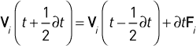

# 第三部分

## 第十一章 流式工作负载

流式工作负载是最简单的 CUDA 移植类型之一：每个数据元素可以独立计算，通常计算密度如此低，以至于工作负载受带宽限制。流式工作负载不会使用 GPU 的许多硬件资源，如缓存和共享内存，这些资源旨在优化数据的重用。

由于 GPU 在具有*高*计算密度的工作负载上提供最大的性能提升，因此回顾一些情况下流式工作负载仍然值得迁移到 GPU 上可能会很有用。

• 如果输入和输出都在设备内存中，那么仅为了执行一个操作将数据传输回 CPU 是没有意义的。

• 如果 GPU 在操作方面提供比 CPU 更强的指令级支持（例如，Black-Scholes 期权计算，它大量使用特殊功能单元指令），那么即便有内存传输开销，GPU 也能超过 CPU 的表现。

• 即使 CPU 和 GPU 的速度相同，GPU 与 CPU 并行操作时，性能也能大致翻倍。

• 对于给定的工作负载，CUDA 代码可能比针对同一计算进行高度优化的 CPU 代码更易读或更易维护。

• 在集成系统（即，CPU 和支持 CUDA 的 GPU 在同一内存上运行的系统）上，数据传输开销不存在。CUDA 可以使用“零复制”方法，完全避免复制。

本章涵盖了流式工作负载的各个方面，给出了同一工作负载的不同表述，以突出不同问题的出现。所讨论的工作负载——来自 BLAS 库的 SAXPY 操作——将标量乘法和向量加法结合在一个操作中进行。

清单 11.1 给出了一个简单的 C 实现的 SAXPY。对于两个输入数组中的对应元素，一个元素由常数缩放后加到另一个元素上，并写入输出数组。输入数组和输出数组都包含 *N* 个元素。由于 GPU 有原生的乘加指令，SAXPY 的最内层循环在每次内存访问时的指令数非常少。

*清单 11.1.* saxpyCPU。

点击此处查看代码图像

* * *

void

saxpyCPU(

float *out，

const float *x，

const float *y，

size_t N，

float alpha )

{

for ( size_t i = 0; i < N; i++ ) {

out[i] += alpha*x[i]+y[i];

}

}

* * *

清单 11.2 给出了一个简单的 CUDA 实现的 SAXPY。这个版本适用于任何网格或块大小，并且对于大多数应用程序来说，它的表现是足够的。这个内核的带宽需求非常高，因此大多数应用程序通过重构应用程序来增加计算密度，而不是优化这个小内核，会得到更多的性能提升。

*清单 11.2.* saxpyGPU。

点击此处查看代码图像

* * *

__global__ void

saxpyGPU(

float *out，

const float *x，

const float *y，

size_t N，

float alpha )

{

for ( size_t i = blockIdx.x*blockDim.x + threadIdx.x；

i < N；

i += blockDim.x*gridDim.x ) {

out[i] = alpha*x[i]+y[i];

}

}

* * *

本章的主要内容讨论如何高效地将数据移动到主机内存和设备内存之间，但首先我们将花一点时间来检查如何在操作设备内存时提高此内核的性能。

### 11.1\. 设备内存

如果输入和输出数据位于设备内存中，优化像 SAXPY 这样的低密度计算就是优化全局内存访问的问题。除了对性能有影响的对齐和合并约束外，CUDA 内核还对每个块中的块数和线程数敏感。`globalRead`、`globalWrite`、`globalCopy` 和 `globalCopy2` 应用程序（位于源代码的 `memory/` 子目录中）会生成关于不同操作数大小、块大小和循环展开因子所达到的带宽的报告。由 `globalCopy2` 生成的示例报告（它遵循类似 SAXPY 的内存访问模式：每次循环迭代读取两次并写一次）见于 Listing 11.3。

如果我们参考第五章中的 `globalCopy2.cu` 应用程序（见 Listing 5.8），在 GK104 上运行它，我们可以得到 Listing 11.3 中对于 4 字节操作数的输出。最上面一行（展开因子为 1）对应的是简单实现（类似于 Listing 11.2）；当循环展开时，观察到轻微的性能提升。展开因子为 4 时，性能提升大约 10%，带宽从简单实现的 116 GiB/s 提升至 128 GiB/s。

有趣的是，使用 `#pragma` `unroll` 编译器指令仅将性能提升到大约 118 GiB/s，而将 `globalCopy2.cu` 的模板化内核修改为执行 SAXPY 计算，则性能提升至 135 GiB/s。Listing 11.4 给出了最终的内核实现，该内核在 `stream1Device.cu` 应用程序中实现（位于`cudahandbook/streaming/`）。

对于大多数应用而言，这些小的性能差异不足以通过这种方式重写内核。但是，如果内核被编写成“与块无关”（即能够正确地适应任何网格或块大小），那么最优设置可以通过经验方法轻松确定。

*Listing 11.3.* `globalCopy2` 输出（GK104）。

点击这里查看代码图像

* * *

操作数大小：4 字节

输入大小：16M 操作数

块大小

展开  32      64      128     256     512     最大带宽   最大线程数

1       63.21   90.89   104.64  113.45  116.06  116.06  512

2       66.43   92.89   105.09  116.35  120.66  120.66  512

3       87.23   100.70  112.07  110.85  121.36  121.36  512

4       99.54   103.53  113.58  119.52  128.64  128.64  512

5       94.27   103.56  108.02  122.82  124.88  124.88  512

6       100.67  104.18  115.10  122.05  122.46  122.46  512

7       94.56   106.09  116.30  117.63  114.50  117.63  256

8       58.27   45.10   47.07   46.29   45.18   58.27   32

9       41.20   34.74   35.87   35.49   34.58   41.20   32

10      33.59   31.97   32.42   31.43   30.61   33.59   32

11      27.76   28.17   28.46   27.83   26.79   28.46   128

12      25.59   26.42   26.54   25.72   24.51   26.54   128

13      22.69   23.07   23.54   22.50   20.71   23.54   128

14      22.19   22.40   22.23   21.10   19.00   22.40   64

15      20.94   21.14   20.98   19.62   17.31   21.14   64

16      18.86   19.01   18.97   17.66   15.40   19.01   64

* * *

*Listing 11.4.* saxpyGPU (模板展开).

点击这里查看代码图像

* * *

template<const int n>

__device__ void

saxpy_unrolled(

float *out,

const float *px,

const float *py,

size_t N,

float alpha )

{

float x[n], y[n];

size_t i;

for ( i = n*blockIdx.x*blockDim.x+threadIdx.x;

i < N-n*blockDim.x*gridDim.x;

i += n*blockDim.x*gridDim.x ) {

for ( int j = 0; j < n; j++ ) {

size_t index = i+j*blockDim.x;

x[j] = px[index];

y[j] = py[index];

}

for ( int j = 0; j < n; j++ ) {

size_t index = i+j*blockDim.x;

out[index] = alpha*x[j]+y[j];

}

}

// 为了避免内层循环中的 (index<N) 条件判断，

// 我们在最后留下了一些工作

for ( int j = 0; j < n; j++ ) {

for ( int j = 0; j < n; j++ ) {

size_t index = i+j*blockDim.x;

if ( index<N ) {

x[j] = px[index];

y[j] = py[index];

}

}

for ( int j = 0; j < n; j++ ) {

size_t index = i+j*blockDim.x;

如果 ( index<N ) out[index] = alpha*x[j]+y[j];

}

}

}

__global__ void

saxpyGPU( float *out, const float *px, const float *py, size_t N, float alpha )

{

saxpy_unrolled<4>( out, px, py, N, alpha );

}

* * *

`stream1Device.cu`应用程序报告了从可分页系统内存到设备内存传输数据、使用第 11.4 节中的内核对数据进行操作以及将数据传回的总墙钟时间。在一台配备 Intel i7 处理器、运行 Windows 7 并使用 GeForce GTX 680 显卡的测试系统上，该应用程序的输出如下。

点击这里查看代码图像

测量 128M 浮点数的时间（使用--N 指定浮点数的数量）

Memcpy( host->device ): 365.95 毫秒 (2934.15 MB/s)

内核处理：11.94 毫秒 (134920.75 MB/s)

Memcpy (device->host ): 188.72 毫秒 (2844.73 MB/s)

总时间（墙钟时间）：570.22 毫秒 (2815.30 MB/s)

内核只占用总体执行时间的一小部分——大约 2%的墙钟时间。其余的 98%的时间用于将数据传输到 GPU 和从 GPU 传输回来！对于像这样的传输绑定型工作负载，如果一些或全部操作的数据位于主机内存中，优化应用程序的最佳方法是改善 CPU/GPU 的重叠性和传输性能。

### 11.2\. 异步 Memcpy

除非输入和输出数据可以保持驻留在 GPU 上，否则通过 GPU 流式传输数据——将输入和输出数据复制到设备内存并从设备内存复制回来——就成了主要的考虑因素。两种最适合提高传输性能的工具是固定内存和异步 memcpy（它只能在固定内存上操作）。

`stream2Async.cu`应用程序演示了将`stream1Device.cu`的可分页内存移至固定内存并异步调用 memcpys 的效果。

点击这里查看代码图像

测量 128M 浮点数的时间（使用--N 指定浮点数的数量）

Memcpy( host->device ): 181.03 毫秒 (5931.33 MB/s)

内核处理：13.87 毫秒 (116152.99 MB/s)

Memcpy (device->host ): 90.07 毫秒 (5960.35 MB/s)

总时间 (实际时钟): 288.68 毫秒 (5579.29 MB/s)

示例 11.5 对比了 `stream1Device.cu`（执行同步传输）与 `stream2Async.cu`（执行异步传输）的时间段差异。^(1) 在这两种情况下，都使用了四个 CUDA 事件来记录开始时、主机→设备传输后、内核启动后以及结束时的时间。对于 `stream2Async.cu`，所有这些操作都迅速依次请求 GPU，并由 GPU 在执行时记录事件时间。对于 `stream1Device.cu`，由于任何 `cudaMemcpy()` 调用都必须等待 GPU 完成后才能继续，因此 GPU 事件的时间可能不太准确，导致在 `evHtoD` 和 `evDtoH` 的 `cudaEventRecord()` 调用之前会出现管道气泡。

1. 为了简洁起见，已删除错误检查。

请注意，尽管使用了较慢的、天真的 `saxpyGPU` 实现（来自 示例 11.2），该应用程序的实际时钟时间表明，它几乎以两倍的速度完成了计算：289 毫秒与 570.22 毫秒。更快的数据传输和异步执行的结合大大提高了性能。

尽管性能有所提升，应用程序的输出仍然突出了另一个性能机会：部分内核处理可以与数据传输并行执行。接下来的两个部分描述了两种不同的方法，用于将内核执行与数据传输重叠。

*示例 11.5.* 同步 (`stream1Device.cu`) 与异步 (`stream2Async.cu`)。

点击此处查看代码图片

* * *

//

// 来自 stream1Device.cu

//

cudaEventRecord( evStart, 0 );

cudaMemcpy( dptrX, hptrX, ..., cudaMemcpyHostToDevice );

cudaMemcpy( dptrY, hptrY, ..., cudaMemcpyHostToDevice );

cudaEventRecord( evHtoD, 0 );

saxpyGPU<<<nBlocks, nThreads>>>( dptrOut, dptrX, dptrY, N, alpha );

cudaEventRecord( evKernel, 0 );

cudaMemcpy( hptrOut, dptrOut, N*sizeof(float), cudaMemcpyDeviceToHost );

cudaEventRecord( evDtoH, 0 );

cudaDeviceSynchronize();

//

// 来自 stream2Async.cu

//

cudaEventRecord( evStart, 0 );

cudaMemcpyAsync( dptrX, hptrX, ..., cudaMemcpyHostToDevice, NULL );

cudaMemcpyAsync( dptrY, hptrY, ..., cudaMemcpyHostToDevice, NULL );

cudaEventRecord( evHtoD, 0 );

saxpyGPU<<<nBlocks, nThreads>>>( dptrOut, dptrX, dptrY, N, alpha );

cudaEventRecord( evKernel, 0 );

cudaMemcpyAsync( hptrOut, dptrOut, N*sizeof(float), ... , NULL );

cudaEventRecord( evDtoH, 0 );

cudaDeviceSynchronize();

* * *

### 11.3\. 流

对于那些可以从并发的 memcpy 和内核执行中获益的工作负载（GPU/GPU 重叠），可以使用 CUDA 流来协调执行。`stream3Streams.cu`应用程序将输入和输出数组分成 k 个流，然后分别在各自的流中调用 k 个主机→设备的 memcpy、内核和设备→主机的 memcpy。将传输和计算关联到不同的流，让 CUDA 知道计算是完全独立的，CUDA 将利用硬件可以支持的任何并行机会。在具有多个复制引擎的 GPU 上，GPU 可能在处理其他数据时，既向设备内存传输数据，又从设备内存传输数据。

清单 11.6 展示了`stream3Streams.cu`中的一个片段，它与清单 11.5 中的应用部分相同。在测试系统上，来自该应用程序的输出如下所示。

点击这里查看代码图像

使用 128M 浮点数测量时间

使用默认最大值 8 个流进行测试（使用--maxStreams <count>设置）

流         时间 (ms)     MB/s

1        290.77 ms  5471.45

2        273.46 ms  5820.34

3        277.14 ms  5744.49

4        278.06 ms  5725.76

5        277.44 毫秒  5736.52

6        276.56 毫秒  5751.87

7        274.75 毫秒  5793.43

8        275.41 毫秒  5779.51

该 GPU 只有一个复制引擎，因此，两个流的情况能够提供最高性能并不令人惊讶。如果内核执行时间与传输时间更为匹配，可能有益于将数组拆分成多个子数组，而不仅仅是两个。就目前情况而言，第一次内核启动不能开始处理，直到第一次主机→设备的 memcpy 完成，最后一次设备→主机的 memcpy 也不能开始，直到最后一次内核启动完成。如果内核处理时间更长，这种“悬挂”现象会更加明显。对于我们的应用程序，273 毫秒的时钟时间表明，大部分内核处理时间（13.87 毫秒）已经被隐藏了。

请注意，在这种表达方式中，部分由于硬件限制，我们没有像在列表 11.5 中那样尝试在操作之间插入任何`cudaEventRecord()`调用。在大多数 CUDA 硬件上，尝试在列表 11.6 中的流式操作之间记录事件会破坏并发性并降低性能。相反，我们在操作之前和之后分别用一个`cudaEventRecord()`来括起来。

*列表 11.6.* `stream3Streams.cu`摘录。

点击此处查看代码图片

* * *

for ( int iStream = 0; iStream < nStreams; iStream++ ) {

CUDART_CHECK( cudaMemcpyAsync(

dptrX+iStream*streamStep,

hptrX+iStream*streamStep,

streamStep*sizeof(float),

cudaMemcpyHostToDevice,

streams[iStream] ) );

CUDART_CHECK( cudaMemcpyAsync(

dptrY+iStream*streamStep,

hptrY+iStream*streamStep,

streamStep*sizeof(float),

cudaMemcpyHostToDevice,

streams[iStream] ) );

}

for ( int iStream = 0; iStream < nStreams; iStream++ ) {

saxpyGPU<<<nBlocks, nThreads, 0, streams[iStream]>>>(

dptrOut+iStream*streamStep,

dptrX+iStream*streamStep,

dptrY+iStream*streamStep,

streamStep,

alpha );

}

for ( int iStream = 0; iStream < nStreams; iStream++ ) {

CUDART_CHECK( cudaMemcpyAsync(

hptrOut+iStream*streamStep，

dptrOut+iStream*streamStep，

streamStep*sizeof(float)，

cudaMemcpyDeviceToHost，

streams[iStream] ) );

}

* * *

### 11.4\. 映射固定内存

对于传输绑定的流式工作负载，如 SAXPY，将应用程序重构为使用映射固定内存来处理输入和输出，会带来许多好处。

• 如`stream4Mapped.cu`中的摘录所示（清单 11.7），它消除了调用`cudaMemcpy()`的需求。

• 它消除了分配设备内存的需求。

• 对于离散 GPU，映射固定内存执行总线传输，但最大限度地减少了前一节提到的“悬挂”现象。输入数据可以在到达后立即由 SM 处理，而无需等待主机→设备的内存拷贝完成。在内核完成之前，数据也会立即传输到总线上，而无需等待设备→主机的传输。

• 对于集成 GPU，主机和设备内存位于同一内存池中，因此映射固定内存实现了“零拷贝”，并完全消除了通过总线传输数据的需求。

*清单 11.7.* `stream4Mapped`摘录。

点击这里查看代码图片

* * *

chTimerGetTime( &chStart );

cudaEventRecord( evStart, 0 );

saxpyGPU<<<nBlocks, nThreads>>>( dptrOut, dptrX, dptrY, N, alpha );

cudaEventRecord( evStop, 0 );

cudaDeviceSynchronize();

* * *

映射的固定内存在写入主机内存时尤其有效（例如，将归约结果传送给主机），因为与读取不同，写入无需等待读取完成就可以继续执行。^(2) 读取映射的固定内存的工作负载更具挑战性。如果 GPU 在读取映射的固定内存时无法维持完整的总线性能，则较小的传输性能可能会压倒较小悬挂的好处。此外，对于某些工作负载，SM 可能有更重要的任务要做，而不是驱动（和等待）PCI Express 总线流量。

2。硬件设计师称之为“覆盖延迟”。

在我们的应用程序中，在我们的测试系统上，映射的固定内存确实是一个优势。

点击这里查看代码图片

使用 128M 浮点数测量时间（使用--N 指定浮点数数量）

总时间：204.54 毫秒（7874.45 MB/s）

它在 204.54 毫秒内完成计算，显著快于第二快实现的 273 毫秒。有效带宽为 7.9 GiB/s，表明 GPU 在推动 PCI Express 的双向数据流。

并非所有系统和 GPU 的组合都能在映射的固定内存下维持如此高的性能。如果有任何疑虑，保持数据在设备内存中，并使用异步内存拷贝方法，类似于`stream2Async.cu`。

### 11.5\. 性能和总结

本章涵盖了 SAXPY 的四种不同实现，重点强调了不同的数据移动策略。

• 同步内存拷贝到设备内存和从设备内存拷贝

• 异步内存拷贝到设备内存和从设备内存拷贝

• 使用流的异步内存拷贝

• 映射的固定内存

表 11.1 和 图 11.1 总结了这几种实现方法在 128M 浮点数上的相对性能，测试系统为两种不同的系统：Intel i7 系统（PCI Express 2.0）和 Intel Xeon E5-2670（PCI Express 3.0）。PCI Express 3.0 的优势非常明显，速度约为其两倍。此外，由于分页的 memcpy 操作较慢，E5-2670 上的 CPU/GPU 同步开销较高。

*表 11.1* 流式性能

*图 11.1* 带宽（GeForce GTX 680 在 Intel i7 与 Sandy Bridge 上的对比）

## 第十二章\. 归约

归约是一类并行算法，遍历 *O*(N) 输入数据并生成 *O*(1) 结果，该结果是通过二元结合运算符  计算的。此类操作的例子包括最小值、最大值、和、平方和、与、或以及两个向量的点积。归约还是其他操作中的重要原语，例如扫描（将在下一章介绍）。

除非运算符  计算代价非常高，否则归约通常受带宽限制。我们对归约的讨论从基于 `reduction` SDK 示例的几种双遍实现开始。接下来，`threadFenceReduction` SDK 示例展示了如何在单遍操作中执行归约，这样只需要调用一个内核来执行操作。最后，本章以快速二元归约为结尾，介绍了如何使用 `__syncthreads_count()` 内建函数（SM 2.0 添加）以及如何使用 warp shuffle 指令（SM 3.0 添加）执行归约。

### 12.1\. 概述

由于二元运算符是结合性的，计算一个归约的*O*(*N*)操作可以按任意顺序执行。

图 12.1 显示了处理一个 8 元素数组的不同选项。为了对比，展示了串行实现。只需要一个能够执行运算符的执行单元，但性能较差，因为完成计算需要 7 步。

*图 12.1* 8 元素的归约。

成对公式直观且仅需要 *O*(lg*N*) 步骤（在此例中为 3 步）来计算结果，但在 CUDA 中表现较差。读取全局内存时，单个线程访问相邻的内存位置会导致未合并的内存事务。读取共享内存时，显示的模式会导致银行冲突。

对于全局内存和共享内存，基于交错的策略效果更好。在图 12.1 中，交错因子为 4；对于全局内存，按 `blockDim.x * gridDim.x` 的倍数交错具有良好的性能，因为所有内存事务都能合并。对于共享内存，最佳性能是通过选择一个交错因子来积累部分和，从而避免银行冲突，并保持线程块中的相邻线程处于活动状态。

一旦一个线程块完成了其交错子数组的处理，它会将结果写入全局内存，以便后续的内核启动进行进一步处理。启动多个内核可能看起来很昂贵，但内核启动是异步的，因此 CPU 可以在 GPU 执行第一个内核时请求下一个内核启动；每次内核启动都代表着一个机会，可以指定不同的启动配置。

由于内核的性能可能随着线程和块大小的不同而变化，因此编写内核时最好确保它能在任何有效的线程和块大小组合下正确工作。然后可以通过实验证明最佳的线程/块配置。

本章中的初始归约核展示了一些可能熟悉的重要 CUDA 编程概念。

• *合并内存操作*以最大化带宽

• *可变大小共享内存*以促进线程间的协作

• 避免共享内存*银行冲突*

优化后的归约核展示了更高级的 CUDA 编程习惯。

• *Warp 同步*编码避免了不必要的线程同步。

• *原子操作*和*内存屏障*消除了调用多个内核的需要。

• *shuffle*指令使得 warp 级别的归约得以实现，而无需使用共享内存。

### 12.2\. 两遍归约

该算法分为两个阶段。一个内核并行执行*NumBlocks*次归约，其中*NumBlocks*是调用内核时使用的块数；结果写入一个中间数组。最终结果通过调用相同的内核在中间数组上执行第二遍处理，使用一个块生成。Listing 12.1 给出了一个两遍归约核，用于计算一个整数数组的和。

*Listing 12.1.* 两遍归约核。

点击这里查看代码图片

* * *

__global__ void

Reduction1_kernel( int *out, const int *in, size_t N )

{

extern __shared__ int sPartials[];

int sum = 0;

const int tid = threadIdx.x;

for ( size_t i = blockIdx.x*blockDim.x + tid;

i < N;

i += blockDim.x*gridDim.x ) {

sum += in[i];

}

sPartials[tid] = sum;

__syncthreads();

for ( int activeThreads = blockDim.x>>1;

activeThreads;

activeThreads >>= 1 ) {

if ( tid < activeThreads ) {

sPartials[tid] += sPartials[tid+activeThreads];

}

__syncthreads();

}

if ( tid == 0 ) {

out[blockIdx.x] = sPartials[0];

}

}

void

Reduction1( int *answer, int *partial,

const int *in, size_t N,

int numBlocks, int numThreads )

{

unsigned int sharedSize = numThreads*sizeof(int);

Reduction1_kernel<<<

numBlocks, numThreads, sharedSize>>>(

partial, in, N );

Reduction1_kernel<<<

1, numThreads, sharedSize>>>（

answer, partial, numBlocks );

}

* * *

共享内存数组用于在每个线程块内积累归约结果。它的大小取决于线程块中的线程数量，因此在启动内核时必须指定。*注意：* 线程块中的线程数必须是 2 的幂！

第一个 `for` 循环计算线程在输入数组上的和。如果输入指针正确对齐，这段代码的所有内存事务都将合并，从而最大化内存带宽。然后每个线程将其累计和写入共享内存，并在开始对数步长归约前进行同步。

第二个 `for` 循环在共享内存中的值上执行对数步长归约。共享内存上半部分的值与下半部分的值相加，参与的线程数依次减半，直到 `shared_sum[0]` 中的一个值包含该块的输出。这个内核部分要求线程块的大小是 2 的幂。

最后，线程块的输出值被写入全局内存。该内核设计为调用两次，如主机函数中所示：第一次使用 *N* 个块，其中 *N* 选择为在对输入数组执行归约时获得最佳性能，然后使用 1 个块来累积最终输出。Listing 12.2 显示了调用 `Reduction1_kernel()` 的主机函数。请注意，部分和数组是单独分配并传递的。还要注意，由于内核使用的是无大小的共享内存数组，内核所需的共享内存量必须作为 `<<< >>>` 语法中的第三个参数指定。

CUDA SDK 讨论了该内核的几种优化，重点减少对数步骤归约中的条件代码量。执行对数步骤归约的`for`循环的后半部分，当线程数小于等于 32 时，可以通过*warp 同步*代码来实现。由于每个线程块中的 warp 以锁步方式执行每条指令，当一个块中的活跃线程数小于硬件的 warp 大小 32 时，就不再需要`__syncthreads()`内建函数。最终的内核代码位于`reduction2.cu`源文件中，见第 12.2 列表。

* * *

重要提示

编写 warp 同步代码时，必须使用`volatile`关键字来声明指向共享内存的指针。否则，编译器可能会引入优化，改变内存操作的顺序，从而导致代码无法正确工作。

* * *

*第 12.2 列表* 使用展开的、warp 同步的结束进行归约。

点击此处查看代码图片

* * *

__global__ void

Reduction2_kernel( int *out, const int *in, size_t N )

{

extern __shared__ int sPartials[];

int sum = 0;

const int tid = threadIdx.x;

for ( size_t i = blockIdx.x*blockDim.x + tid;

i < N;

i += blockDim.x*gridDim.x ) {

sum += in[i];

}

sPartials[tid] = sum;

__syncthreads();

for ( int activeThreads = blockDim.x>>1;

activeThreads > 32;

activeThreads >>= 1 ) {

if ( tid < activeThreads ) {

sPartials[tid] += sPartials[tid+activeThreads];

}

__syncthreads();

}

if ( threadIdx.x < 32 ) {

volatile int *wsSum = sPartials;

if ( blockDim.x > 32 ) wsSum[tid] += wsSum[tid + 32];

wsSum[tid] += wsSum[tid + 16];

wsSum[tid] += wsSum[tid + 8];

wsSum[tid] += wsSum[tid + 4];

wsSum[tid] += wsSum[tid + 2];

wsSum[tid] += wsSum[tid + 1];

if ( tid == 0 ) {

volatile int *wsSum = sPartials;

out[blockIdx.x] = wsSum[0];

}

}

}

* * *

warp 同步优化可以通过将线程数提升为模板参数进一步推进，从而实现对数步长归约的完全展开。列表 12.3 给出了完整的优化内核。根据 Mark Harris 的归约演讲，^(1) 在编译时评估的代码用斜体表示。

1. [`bit.ly/WNmH9Z`](http://bit.ly/WNmH9Z)

*列表 12.3.* 模板化的、完全展开的对数步长归约。

点击这里查看代码图像

* * *

template<unsigned int numThreads>

__global__ void

Reduction3_kernel( int *out, const int *in, size_t N )

{

extern __shared__ int sPartials[];

const unsigned int tid = threadIdx.x;

int sum = 0;

for ( size_t i = blockIdx.x*numThreads + tid;

i < N;

i += numThreads*gridDim.x )

{

sum += in[i];

}

sPartials[tid] = sum;

__syncthreads();

if (numThreads >= 1024) {

if (tid < 512) {

sPartials[tid] += sPartials[tid + 512];

}

__syncthreads();

}

if (numThreads >= 512) {

if (tid < 256) {

sPartials[tid] += sPartials[tid + 256];

}

__syncthreads();

}

if (numThreads >= 256) {

if (tid < 128) {

sPartials[tid] += sPartials[tid + 128];

}

__syncthreads();

}

if (numThreads >= 128) {

if (tid <  64) {

sPartials[tid] += sPartials[tid +  64];

}

__syncthreads();

}

// 在最后进行 warp 同步

if ( tid < 32 ) {

volatile int *wsSum = sPartials;

if (numThreads >=  64) { wsSum[tid] += wsSum[tid + 32]; }

if (numThreads >=   32) { wsSum[tid] += wsSum[tid + 16]; }

if (numThreads >=  16) { wsSum[tid] += wsSum[tid +  8]; }

if (numThreads >=   8) { wsSum[tid] += wsSum[tid +  4]; }

if (numThreads >=   4) { wsSum[tid] += wsSum[tid +  2]; }

if (numThreads >=   2) { wsSum[tid] += wsSum[tid +  1]; }

if ( tid == 0 ) {

out[blockIdx.x] = wsSum[0];

}

}

}

* * *

要在 Listing 12.3 中实例化函数模板，必须在单独的主机函数中显式调用它。Listing 12.4 展示了如何通过另一个函数模板调用`Reduction3_kernel`，而主机函数使用`switch`语句来为每个可能的块大小调用该模板。

*Listing 12.4.* 用于展开归约的模板实例化。

Click here to view code image

* * *

template<unsigned int numThreads>

void

Reduction3_template( int *answer, int *partial,

const int *in, size_t N,

int numBlocks )

{

Reduction3_kernel<numThreads><<<

numBlocks, numThreads, numThreads*sizeof(int)>>>(

partial, in, N );

Reduction3_kernel<numThreads><<<

1, numThreads, numThreads*sizeof(int)>>>(

answer, partial, numBlocks );

}

void

Reduction3( int *out, int *partial,

const int *in, size_t N,

int numBlocks, int numThreads )

{

switch ( numThreads ) {

case 1: return Reduction3_template< 1>( ... );

case 2: return Reduction3_template< 2>( ... );

case 4: return Reduction3_template< 4>( ... );

case 8: return Reduction3_template< 8>( ... );

case 16: return Reduction3_template< 16>( ... );

case 32: return Reduction3_template< 32>( ... );

case 64: return Reduction3_template< 64>( ... );

case 128: return Reduction3_template< 128>( ... );

case 256: return Reduction3_template< 256>( ... );

case 512: return Reduction3_template< 512>( ... );

case 1024: return Reduction3_template<1024>( ... );

}

}

* * *

### 12.3\. 单次归约

双次归约方法在一定程度上是对 CUDA 块无法相互同步的一个变通方法。由于缺乏跨块同步来确定何时可以开始处理最终输出，因此需要第二次内核调用。

第二次内核调用可以通过使用原子操作和共享内存的组合来避免，具体方法可参考 CUDA SDK 中的`threadfenceReduction`示例。一个设备内存位置跟踪哪些线程块已经完成了部分和的写入。所有线程块完成后，一个线程块执行最终的对数步骤归约，写入输出。

由于此内核执行多个来自共享内存的对数步骤归约，代码在列表 12.3 中根据模板化的线程数条件性地添加，被提取到一个单独的设备函数中以供重用。

*列表 12.5.* `Reduction4_LogStepShared.`

点击这里查看代码图像

* * *

template<unsigned int numThreads>

__device__ void

Reduction4_LogStepShared( int *out, volatile int *partials )

{

const int tid = threadIdx.x;

如果(numThreads >= 1024) {

如果(tid < 512) {

partials[tid] += partials[tid + 512];

}

__syncthreads();

}

如果(numThreads >= 512) {

如果(tid < 256) {

partials[tid] += partials[tid + 256];

}

__syncthreads();

}

如果(numThreads >= 256) {

如果(tid < 128) {

partials[tid] += partials[tid + 128];

}

__syncthreads();

}

如果(numThreads >= 128) {

如果(tid < 64) {

partials[tid] += partials[tid + 64];

}

__syncthreads();

}

// warp 同步在末尾

如果(tid < 32) {

如果(numThreads >= 64) { partials[tid] += partials[tid + 32]; }

如果(numThreads >= 32) { partials[tid] += partials[tid + 16]; }

如果(numThreads >= 16) { partials[tid] += partials[tid + 8]; }

如果(numThreads >= 8) { partials[tid] += partials[tid + 4]; }

如果(numThreads >= 4) { partials[tid] += partials[tid + 2]; }

如果(numThreads >= 2) { partials[tid] += partials[tid + 1]; }

如果(tid == 0) {

*out = partials[0];

}

}

}

* * *

`Reduction4_LogStepShared()` 函数，如清单 12.5 所示，将线程块的部分和 `partials` 写入由 `out` 指定的内存位置。清单 12.6 提供了使用 `Reduction4_LogStepShared()` 作为子例程的单次减法。

*清单 12.6.* 单次减法内核 (`reduction4SinglePass.cuh`)。

点击这里查看代码图像

* * *

// reduceSinglePass 使用的全局变量，用于计数块

__device__ unsigned int retirementCount = 0;

template <unsigned int numThreads>

__global__ void

reduceSinglePass( int *out, int *partial,

const int *in, unsigned int N )

{

extern __shared__ int sPartials[];

unsigned int tid = threadIdx.x;

int sum = 0;

for ( size_t i = blockIdx.x*numThreads + tid;

i < N;

i += numThreads*gridDim.x ) {

sum += in[i];

}

sPartials[tid] = sum;

__syncthreads();

if (gridDim.x == 1) {

Reduction4_LogStepShared<numThreads>( &out[blockIdx.x],

sPartials );

return;

}

Reduction4_LogStepShared<numThreads>( &partial[blockIdx.x],

sPartials );

__shared__ bool lastBlock;

// 等待此线程中的未完成内存指令

__threadfence();

// 线程 0 获取一张票

if( tid==0 ) {

unsigned int ticket = atomicAdd(&retirementCount, 1);

//

// 如果票据 ID 等于块的数量，

// 我们是最后一个块！

//

lastBlock = (ticket == gridDim.x-1);

}

__syncthreads();

// 一个块执行最终的日志步减法

if( lastBlock ) {

int sum = 0;

for ( size_t i = tid;

i < gridDim.x;

i += numThreads ) {

sum += partial[i];

}

sPartials[threadIdx.x] = sum;

__syncthreads();

Reduction4_LogStepShared<numThreads>( out, sPartials );

retirementCount = 0;

}

}

* * *

内核一开始使用的是常见的代码，每个线程计算输入数组的部分归约并将结果写入共享内存。完成后，单块情况会被特别处理，因为来自共享内存的日志步长归约的输出可以直接写入，而不是写入部分和数组。其余的内核只会在有多个线程块的情况下执行。

共享布尔值`lastBlock`用于评估必须传递给最终块中所有线程的谓词。`__threadfence()`使块中的所有线程等待，直到所有待处理的内存事务已经提交到设备内存。当执行`__threadfence()`时，写入全局内存的内容对所有线程可见，而不仅仅是调用线程或块中的线程。

每个块退出时，都会执行`atomicAdd()`来检查它是否是需要执行最终日志步长归约的那个块。由于`atomicAdd()`返回的是内存位置的*先前*值，递增`retirementCount`并且得到值为`gridDim.x-1`的块可以被认为是“最后一个线程”，并可以执行最终的归约。`lastBlock`共享内存位置将该结果传递给块中的所有线程，然后必须调用`__syncthreads()`，这样写入`lastBlock`的结果才能对块中的所有线程可见。最后一个块执行部分和的最终日志步长归约并写入结果。最后，`retirementCount`被重置为 0，以便后续调用`reduceSinglePass()`。

### 12.4\. 使用原子操作的归约

对于那些由硬件中实现的原子操作原生支持的操作符的归约操作，可以采用更简单的归约方法：只需遍历输入数据，并将输入数据“发射并忘记”到输出内存位置，以接收输出值。给定的`Reduction5`内核比之前的实现要简单得多。每个线程计算输入的部分和，并在最后对输出进行`atomicAdd`操作。

请注意，除非`out`指向的内存位置被初始化为 0，`Reduction5_kernel`不会正常工作。^(2) 像`threadFenceReduction`示例一样，这个内核的优点是只需要一次内核调用就能完成操作。

2。内核本身无法执行此初始化，因为 CUDA 的执行模型不支持在线程块之间解决竞态条件。参见第 7.3.1 节。

*示例 12.7.* 使用全局原子操作的归约（`reduction5Atomics.cuh`）。

点击这里查看代码图像

* * *

__global__ void

Reduction5_kernel( int *out, const int *in, size_t N )

{

const int tid = threadIdx.x;

int partialSum = 0;

for ( size_t i = blockIdx.x*blockDim.x + tid;

i < N;

i += blockDim.x*gridDim.x ) {

partialSum += in[i];

}

atomicAdd( out, partialSum );

}

void

Reduction5( int *answer, int *partial,

const int *in, size_t N,

int numBlocks, int numThreads )

{

cudaMemset( answer, 0, sizeof(int) );

Reduction5_kernel<<< numBlocks, numThreads>>>( answer, in, N );

}

* * *

### 12.5\. 任意块大小

到目前为止，所有使用共享内存的归约实现都要求块大小是 2 的幂。通过少量的额外代码，可以使归约在任意块大小上工作。清单 12.8 给出了一个内核，该内核源自清单 12.1 中给出的第一个两遍内核，经过修改以在任何块大小上运行。`floorPow2` 变量计算小于或等于块大小的最大 2 的幂，并且大于该 2 的幂的线程贡献会在继续进行实现对数步归约的循环之前被加上。

*清单 12.8.* 归约（任意块大小） (`reduction6AnyBlockSize.cuh`)。

点击此处查看代码图片

* * *

__global__ void

Reduction6_kernel( int *out, const int *in, size_t N )

{

extern __shared__ int sPartials[];

int sum = 0;

const int tid = threadIdx.x;

for ( size_t i = blockIdx.x*blockDim.x + tid;

i < N;

i += blockDim.x*gridDim.x ) {

sum += in[i];

}

sPartials[tid] = sum;

__syncthreads();

// 在下一个小于的 2 的幂上启动共享内存循环

// 比块大小更大。如果块大小不是 2 的幂，

// 在剩余范围内累加中间结果。

int floorPow2 = blockDim.x;

if ( floorPow2 & (floorPow2-1) ) {

while ( floorPow2 & (floorPow2-1) ) {

floorPow2 &= floorPow2-1;

}

if ( tid >= floorPow2 ) {

sPartials[tid - floorPow2] += sPartials[tid];

}

__syncthreads();

}

for ( int activeThreads = floorPow2>>1;

activeThreads;

activeThreads >>= 1 ) {

if ( tid < activeThreads ) {

sPartials[tid] += sPartials[tid+activeThreads];

}

__syncthreads();

}

if ( tid == 0 ) {

out[blockIdx.x] = sPartials[0];

}

}

* * *

### 12.6\. 使用任意数据类型的归约

到目前为止，我们只开发了能够计算整数数组总和的归约内核。为了将这些内核推广到执行更广泛操作的能力，我们转向 C++ 模板。除了使用原子操作的算法外，到目前为止所有出现过的内核都可以适配为使用模板。在书籍附带的源代码中，它们位于 CUDA 头文件 `reduction1Templated.cuh`、`reduction2Templated.cuh` 等中。列表 12.9 给出了来自 列表 12.1 的归约内核的模板版本。

*列表 12.9.* 模板化归约内核。

点击这里查看代码图片

* * *

template<typename ReductionType, typename T>

__global__ void

Reduction_templated( ReductionType *out, const T *in, size_t N )

{

SharedMemory<ReductionType> sPartials;

ReductionType sum;

const int tid = threadIdx.x;

for ( size_t i = blockIdx.x*blockDim.x + tid;

i < N;

i += blockDim.x*gridDim.x ) {

sum += in[i];

}

sPartials[tid] = sum;

__syncthreads();

for ( int activeThreads = blockDim.x>>1;

activeThreads;

activeThreads >>= 1 ) {

if ( tid < activeThreads ) {

sPartials[tid] += sPartials[tid+activeThreads];

}

__syncthreads();

}

if ( tid == 0 ) {

out[blockIdx.x] = sPartials[0];

}

}

* * *

请注意，由于我们希望能够为给定类型的输入计算多种输出类型（例如，我们希望构建可以计算整数数组的最小值、最大值、总和或平方和的内核），因此我们使用了两个不同的模板参数：`T` 是被归约的类型，而 `ReductionType` 是用于部分和以及最终结果的类型。

代码的前几行使用`+=`运算符“扫过”输入数据，为每个线程在块中累加部分和。^(3) 执行接着与清单 12.1 完全相同，不同之处在于代码操作的是`ReductionType`而不是`int`。为了避免与对齐相关的编译错误，该内核使用 CUDA SDK 中的一种惯用法来声明可变大小的共享内存。

3。我们同样可以定义一个函数来包装由 reduction 评估的二元运算符。Thrust 库定义了一个函数对象`plus`。

点击这里查看代码图片

template<class T>

struct SharedMemory

{

__device__ inline operator       T*()

{

extern __shared__ int __smem[];

return (T*) (void *) __smem;

}

__device__ inline operator const T*() const

{

extern __shared__ int __smem[];

return (T*) (void *) __smem;

}

};

清单 12.10 展示了一个旨在与模板化的 reduction 函数（如`Reduction_templated`）一起使用的类的示例。该类计算整数数组的和及其平方和。^(4) 除了定义`operator+=`外，还必须声明`SharedMemory`模板的特化；否则，编译器会生成以下错误。

4。你可以在一次遍历中计算输入数组的所有统计数据，但为了说明问题，我们在此保持简单。

错误：不支持未对齐的内存访问

附带源代码中的`reductionTemplated.cu`程序展示了如何调用 CUDA 头文件中的函数模板。

Reduction1<CReduction_Sumi_isq, int>( ... );

*清单 12.10.* `CReduction_Sumi_isq` 类。

点击这里查看代码图片

* * *

struct CReduction_Sumi_isq {

public:

CReduction_Sumi_isq();

int sum;

long long sumsq;

CReduction_Sumi_isq& operator +=( int a );

volatile CReduction_Sumi_isq& operator +=( int a ) volatile;

CReduction_Sumi_isq& operator +=( const CReduction_Sumi_isq& a );

volatile CReduction_Sumi_isq& operator +=(

volatile CReduction_Sumi_isq& a ) volatile;

};

inline __device__ __host__

CReduction_Sumi_isq::CReduction_Sumi_isq()

{

sum = 0;

sumsq = 0;

}

inline __device__ __host__

CReduction_Sumi_isq&

CReduction_Sumi_isq::operator +=( int a )

{

sum += a;

sumsq += (long long) a*a;

return *this;

}

inline __device__ __host__

volatile CReduction_Sumi_isq&

CReduction_Sumi_isq::operator +=( int a ) volatile

{

sum += a;

sumsq += (long long) a*a;

return *this;

}

inline __device__ __host__

CReduction_Sumi_isq&

CReduction_Sumi_isq::operator +=( const CReduction_Sumi_isq& a )

{

sum += a.sum;

sumsq += a.sumsq;

return *this;

}

inline __device__ __host__

volatile CReduction_Sumi_isq&

CReduction_Sumi_isq::operator +=(

volatile CReduction_Sumi_isq& a ) volatile

{

sum += a.sum;

sumsq += a.sumsq;

return *this;

}

inline int

operator!=( const CReduction_Sumi_isq& a,

const CReduction_Sumi_isq& b )

{

return a.sum != b.sum && a.sumsq != b.sumsq;

}

//

// 来自 Reduction SDK 示例：

// 为避免未对齐的内存进行专门化处理

// 访问编译错误

//

template<>

struct SharedMemory<CReduction_Sumi_isq>

{

__device__ inline operator       CReduction_Sumi_isq*()

{

extern __shared__ CReduction_Sumi_isq

__smem_CReduction_Sumi_isq[];

return (CReduction_Sumi_isq*)__smem_CReduction_Sumi_isq;

}

__device__ inline operator const CReduction_Sumi_isq*() const

{

extern __shared__ CReduction_Sumi_isq

__smem_CReduction_Sumi_isq[];

return (CReduction_Sumi_isq*)__smem_CReduction_Sumi_isq;

}

};

* * *

### 12.7\. 谓词归约

谓词或布尔值（真/假）可以紧凑表示，因为每个谓词只占用 1 个位。在 SM 2.0 中，NVIDIA 增加了一些指令来提高谓词操作的效率。`__ballot()`和`__popc()`内建函数可以用于 warp 级别的归约，而`__syncthreads_count()`内建函数可以用于块级别的归约。

int __ballot( int p );

`__ballot()`会对 warp 中所有线程评估一个条件，并返回一个 32 位字，其中每一位表示 warp 中相应线程的条件。由于`__ballot()`将结果广播到 warp 中的每个线程，它实际上是对 warp 进行归约。任何希望计算 warp 中满足条件的线程数量的线程都可以调用`__popc()`内建函数。

int __popc( int i );

它返回输入字中的置位位数。

SM 2.0 还引入了`__syncthreads_count()`。

int __syncthreads_count( int p );

这个内建函数会等待线程块中的所有 warp 到达后，再将输入条件为真的线程数量广播给线程块中的所有线程。

由于 1 位的谓词在 warp 级或块级归约后立即变为 5 位、9 位或 10 位值，这些内建函数只用于减少最低级评估和归约所需的共享内存量。不过，它们极大地放大了单个线程块可以考虑的元素数量。

### 12.8\. 使用 Shuffle 进行 Warp 归约

SM 3.0 引入了“shuffle”指令，如第 8.6.1 节所述，可以用于在一个 warp 的 32 个线程之间进行归约。通过使用“蝴蝶”变种的 shuffle 指令，可以执行最终 5 步的对数步长归约。

wsSum[tid] += wsSum[tid+16];

wsSum[tid] += wsSum[tid+8];

wsSum[tid] += wsSum[tid+4];

wsSum[tid] += wsSum[tid+2];

wsSum[tid] += wsSum[tid+1];

可以重写为

int mySum = wsSum[tid];

mySum += __shuf_xor( mySum, 16 );

mySum += __shuf_xor( mySum, 8 );

mySum += __shuf_xor( mySum, 4 );

mySum += __shuf_xor( mySum, 2 );

mySum += __shuf_xor( mySum, 1 );

然后，warp 中的所有线程都包含 `mySum` 中的归约值。图 12.2 展示了这个 warp 扫描原语的操作。每个线程的和显示为一个 4W × 8H 的矩形，深色方块显示了哪些线程对每个线程的部分和做出了贡献。（除了插图，顶部行显示了哪些方块对应于每个线程的贡献。）在每一步对数步长归约中，贡献的数量翻倍，直到每个线程都有一个完整的归约。^(5)

5。shuffle-up 或 shuffle-down 变体可以用于实现归约，但它们与蝴蝶（XOR）变体一样耗时，只能将归约值提供给单个线程。

*图 12.2* 使用 shuffle 指令的归约。

## 第十三章 扫描

扫描（Scan），也称为 *前缀扫描*、*前缀和* 或 *并行前缀和*，是并行编程中的一个重要原语，作为许多不同算法的构建块，以下列举了一些，包括但不限于：

• 基数排序

• 快速排序

• 流压缩和流分割

• 稀疏矩阵-向量乘法

• 最小生成树构建

• 求和区域表的计算

本章首先描述了算法及其几种变体，讨论了早期的实现策略以及如何通过电路图描述扫描算法，接着提供了 CUDA 中扫描实现的详细描述。参考文献部分涵盖了扫描算法以及硬件设计中的并行前缀和电路问题。

### 13.1 定义和变体

*包含扫描* 使用二元结合运算符  和一个长度为 *N* 的数组。

[a[0], a[1], . . . a[N-1]]

并返回数组

[a[0], (a[0]a[1]), . . . (a[0]a[1] . . . a[N-1])].

输出的每个元素依赖于输入中的前一个元素。

*排除扫描*的定义类似，但它移位输出并使用*恒等元素* *id*![Image]，在与进行操作时对值没有影响（例如，整数加法中的 0，乘法中的 1 等）。

*id*[![Image], a[0], a[0]a[1], . . . a[0]a[1] . . . a[N-2]].

包括扫描和排除扫描可以通过逐元素地加或减输入数组来相互转换，如图 13.1 所示。

*图 13.1* 包括扫描和排除扫描。

*流压缩*是一种根据标准将数组中的元素分开的操作。如果对输入数组中的每个元素计算一个谓词（0 或 1），以确定该元素是否应包含在输出流中，则对这些谓词进行排除扫描可以计算输出元素的索引。流压缩的一种变体，称为*流分割*，为谓词的每个值单独写入压缩后的输出。*分段扫描*是一种变体，它除了数组外，还需要一组输入标志（每个数组元素一个），并对由这些标志划定的子数组进行扫描。

由于扫描原语的重要性，已经投入了大量精力开发针对 CUDA 的优化扫描实现。参考文献列表见本章末尾。CUDPP 和 Thrust 库都包括一系列优化过的扫描原语，它们使用模板来实现最佳的通用性与性能折衷。尽管如此，使用扫描作为原语的应用通常可以通过定制实现来获得更多好处，这些实现能够利用对问题的特定了解。

### 13.2\. 概述

在 C++中的一个简单实现如列表 13.1 所示。

*列表 13.1.* 包含扫描（在 C++中）。

点击这里查看代码图像

* * *

template<class T>

T

InclusiveScan( T *out, const T *in, size_t N )

{

T sum(0);

for ( size_t i = 0; i < N; i++ ) {

sum += in[i];

out[i] = sum;

}

return sum;

}

* * *

对于列表 13.1 和 13.2 中的这些串行实现，包含扫描和独占扫描之间唯一的区别在于以下行

out[i] = sum;

和

sum += in[i];

被交换了。^(1)

1。如所写，独占扫描的实现不支持原地计算。为了使输入和输出数组相同，`in[i]` 必须保存在一个临时变量中。

*列表 13.2.* 独占扫描（在 C++中）。

点击这里查看代码图像

* * *

template<class T>

T

ExclusiveScan( T *out, const T *in, size_t N )

{

T sum(0);

for ( size_t i = 0; i < N; i++ ) {

out[i] = sum;

sum += in[i];

}

return sum;

}

* * *

扫描的串行实现非常显而易见且简单，如果你在想并行实现会是什么样子，是可以理解的！所谓的*前缀依赖*，即每个输出都依赖于所有前面的输入，可能会让人怀疑这是否可能。但经过深思熟虑，你可以看到，相邻的操作对（a*[i]*a*[i]*[+1]，其中 0 ≤ *i* < *N –* 1）可以并行计算；对于*i* = 0，a*[i]*a*[i]*[+1]计算扫描的最终输出，其他情况下这些配对操作计算的部分和可以用于贡献最终输出，就像我们在第十二章中使用部分和一样。

Blelloch^(2) 描述了一种两次传递算法，其中包括一个*向上扫掠*阶段，计算数组的归约，并在过程中存储中间结果，随后是一个*向下扫掠*阶段，计算扫描的最终输出。向上扫掠的伪代码如下所示。

2. [`bit.ly/YmTmGP`](http://bit.ly/YmTmGP)

点击此处查看代码图片

向上扫掠(a, N)

对于 d 从 0 到 (lg N) – 1

并行执行，i 从 0 到 N – 1，以 2^(d+1) 为步长

a[i + 2^(d+1) – 1] += a[i + 2^(d – 1)]

该操作类似于我们之前讨论的对数步归约，唯一不同的是，中间的和被存储起来，以便稍后用于生成扫描的最终输出。

根据 Blelloch 的描述，图 13.2 展示了这个向上扫掠算法在一个包含 8 个元素的数组上使用整数加法的示例运行。*向上扫掠*一词来自于将数组看作一个平衡树的思路（参见图 13.3）。

*图 13.2* 向上扫掠传递（数组视图）。

*图 13.3* 向上扫掠传递（树形视图）。

一旦向上扫描完成，*向下扫描* 就会将中间的和传播到树的叶子节点。向下扫描的伪代码如下。

点击这里查看代码图像

downsweep(a, N)

a[N-1] = 0

从(dg N)-1 开始，d 一直减小到 0

对 i 从 0 到 N-1 并行执行，步长为 2^(d+1)

t := a[i+2^d-1]

a[i+2^d-1] = a[i + 2^(d+1)-1]

a[i+2^(d+1)-1] += t

图 13.4 显示了在向下扫描过程中示例数组的变换，图 13.5 显示了树形结构中的向下扫描。CUDA 的早期扫描实现紧密跟随了这一算法，并且它确实为思考并行实现提供了很好的引导。不幸的是，它并不非常适合 CUDA 的架构；一个简单的实现容易受到共享内存银行冲突的影响，而为了弥补这些银行冲突所采取的寻址方案，会带来足够的开销，使得成本超过了收益。

*图 13.4* 向下扫描（数组视图）。

*图 13.5* 向下扫描（树形视图）。

### 13.3\. 扫描与电路设计

在探索了一个可能的并行算法之后，现在可能已经清楚，实际上有很多不同的方式可以实现并行的扫描算法。在思考其他可能的实现方式时，我们可以借鉴类似功能的整数加法硬件的设计方法：与其在数组中传播一个任意的二进制结合运算符 ，并在最终的归约中得出输出，不如让硬件加法器传播部分加法结果，最终将进位位传播到多精度运算中。

硬件设计师使用有向无环图来表示 Scan“电路”的不同实现方式。这些图示紧凑地表达了数据流和并行性。列表 13.1 的串行实现图示见图 13.6。步骤随时间向下进行；垂直线表示信号传播的线路。具有 2 个输入度的节点（“操作节点”）对其输入应用运算符 。

*图 13.6* 串行扫描。

注意，电路图显示的是包含扫描，而不是排他扫描。对于电路图而言，二者的差异很小；要将图 13.6 中的包含扫描转换为排他扫描，需要将 0 接入第一个输出端，并将和接入输出端，如图 13.7 所示。请注意，包含扫描和排他扫描都会将输入数组的减少作为输出，这是我们在构建高效扫描算法时将会利用的特性。（为了清晰起见，除了图 13.7 之外，所有电路图都将展示包含扫描。）

*图 13.7* 串行扫描（包含和排他）。

Blelloch 描述的 Scan 算法对应于一种称为 Brent-Kung 的电路设计，这是一种递归分解方式，其中每个第二个输出被送入一个宽度为一半的 Brent-Kung 电路。图 13.8 展示了一个 Brent-Kung 电路在我们的示例长度 8 上的工作情况，并包括 Blelloch 的向上扫描和向下扫描阶段。将输出广播到下一阶段多个节点的节点被称为*风扇*。Brent-Kung 电路的一个显著特点是其具有恒定的风扇输出为 2。

*图 13.8* Brent-Kung 电路。

在更大的电路中，Brent-Kung 电路的结构变得更加清晰；例如，见处理 16 个输入的电路图 13.9。图 13.9 还突出显示了电路的*主干*，即生成扫描输出最后一个元素的最长子图。

*图 13.9* Brent-Kung 电路（16 输入）。

Brent-Kung 电路的深度随输入数量呈对数增长，说明它比（例如）串行算法更高效。但由于递归分解中的每个阶段都会将深度增加 2，因此 Brent-Kung 电路的深度并非最小深度。Sklansky 描述了一种方法，通过递归分解电路来构建最小深度电路，如图 13.10 所示。

*图 13.10* Sklansky（最小深度）电路。

两个(*N*/2)输入电路并行运行，左侧电路的主干输出与右侧电路的每个元素相加。对于我们的 16 元素示例，递归的左侧子图在图 13.10 中被突出显示。

另一种最小深度扫描电路，称为 Kogge-Stone 电路，具有 2 的常数扇出，这是硬件实现的理想特性。然而，正如你在图 13.11 中看到的，它有许多操作节点；与 Kogge-Stone 类似的软件实现效率较低。

*图 13.11* Kogge-Stone 电路。

任何扫描电路都可以通过*扫描*（执行并行前缀计算并生成输入数组的总和作为输出）和*扇出*（将输入添加到每个剩余输出）组合构建。图 13.10 中的最小深度电路在递归定义中大量使用了扇出。

对于优化的 CUDA 实现，一个关键的见解是，风扇不一定需要从扫描*本身*获取输入；任何归约都可以。并且从第十二章中，我们有一个高度优化的归约算法。

举例来说，如果我们将输入数组拆分成长度为*b*的子数组，并使用优化过的归约例程计算每个子数组的和，我们最终会得到一个包含归约值的数组。*如果我们接着对* *该数组执行独占扫描，它将成为每个子数组扫描的风扇输入（*种子*）数组。* 可以在全局内存中一次扫描的值的数量受限于 CUDA 的线程块和共享内存大小，因此对于较大的输入，必须递归地应用此方法。

### 13.4\. CUDA 实现

设计扫描算法并研究电路图是很有启发性的，但为了在 CUDA 中实现扫描，我们需要将算法映射到寄存器、内存和寻址方案，并进行正确的同步。扫描的最优 CUDA 实现取决于正在执行的扫描的大小。不同的方案适用于符合 warp 大小的扫描、能够适配共享内存的扫描以及必须溢出到全局内存的扫描。因为块不能通过全局内存可靠地交换数据，因此过大的扫描必须执行多个内核调用。^(3)

3. 使用 CUDA 5.0 和 SM 3.5 硬件，动态并行性可以将大多数内核启动移至“子网格”，而不是由主机启动的内核调用。

在考察特殊情况（例如谓词的扫描）之前，我们将探讨三种在 CUDA 上执行扫描的方法。

• 扫描-再风扇（递归）

• 减少-再扫描（递归）

• 两级减少-再扫描

#### 13.4.1\. 扫描-再风扇

scan-then-fan 方法对全局内存和共享内存使用了类似的分解。图 13.12 展示了用于扫描线程块的方法：对每个 32 线程 warp 执行扫描，并将该 32 元素子数组的归约结果写入共享内存。然后，一个 warp 扫描部分和的数组。由于 CUDA 不支持超过 1024 个线程的线程块，因此一个 warp 足以完成扫描。最后，基础和会分配到每个 warp 的输出元素。注意，图 13.12 显示了在第 2 步执行的是包含扫描，因此其输出的第一个元素必须分配到第二个 warp，依此类推。

*图 13.12* Scan-then-fan（共享内存）。

实现此算法的代码见于清单 13.3。假设输入数组已加载到共享内存中，参数`sharedPartials`和`idx`分别指定要扫描的 warp 的基地址和索引。（在我们第一次实现中，`threadIdx.x`作为参数`idx`传递。）第 9 到 13 行实现了图 13.12 中的第 1 步；第 16 到 21 行实现了第 2 步；第 31 到 45 行实现了第 3 步。此线程写入的输出值会返回给调用者，但只有在它恰好是线程块的归约时才会使用。

*清单 13.3.* scanBlock：线程块的 scan-then-fan 部分。

点击这里查看代码图片

* * *

template<class T>

inline __device__ T

scanBlock( volatile T *sPartials )

{

extern __shared__ T warpPartials[];

const int tid = threadIdx.x;

const int lane = tid & 31;

const int warpid = tid >> 5;

//

// 计算此线程的部分和

//

T sum = scanWarp<T>( sPartials );

__syncthreads();

//

// 将每个 warp 的归约结果写入共享内存

//

if ( lane == 31 ) {

warpPartials[16+warpid] = sum;

}

__syncthreads();

//

// 让一个 warp 进行归约扫描

//

if ( warpid==0 ) {

scanWarp<T>( 16+warpPartials+tid );

}

__syncthreads();

//

// 扩展独占扫描元素（获得

// 由条件判断和减去 1 所致）

// 到此 warp 的待处理输出

//

if ( warpid > 0 ) {

sum += warpPartials[16+warpid-1];

}

__syncthreads();

//

// 写入此线程的扫描输出

//

*sPartials = sum;

__syncthreads();

//

// 返回值仅在调用者需要时使用

// 包含主干值（即约简

// 我们刚刚扫描的数组的）。

//

return sum;

}

* * *

Figure 13.13 显示了这种方法如何适应全局内存。一个内核扫描*b*元素的子数组，其中*b*是块大小。部分和被写入全局内存，另一个 1 块内核调用扫描这些部分和，然后将它们扩展为全局内存中的最终输出。

*Figure 13.13* 扫描然后扩展（全局内存）。

Listing 13.4 给出了步骤 1 中 CUDA 扫描内核的代码，在 Figure 13.13 中展示。它循环遍历线程块进行处理，将输入数组进出共享内存。该内核在结束时可选择性地将主干值写入全局内存。在递归的最底层，不需要记录主干值，因此`bWriteSpine`模板参数使得内核能够避免动态检查`partialsOut`的值。

*Listing 13.4.* scanAndWritePartials.

Click here to view code image

* * *

template<class T, bool bWriteSpine>

__global__ void

scanAndWritePartials(

T *out,

T *gPartials,

const T *in,

size_t N,

size_t numBlocks )

{

extern volatile __shared__ T sPartials[];

const int tid = threadIdx.x;

volatile T *myShared = sPartials+tid;

for ( size_t iBlock = blockIdx.x;

iBlock < numBlocks;

iBlock += gridDim.x ) {

size_t index = iBlock*blockDim.x+tid;

*myShared = (index < N) ? in[index] : 0;

__syncthreads();

T sum = scanBlock( myShared );

__syncthreads();

if ( index < N ) {

out[index] = *myShared;

}

//

// 将主干值写入全局内存

//

if ( bWriteSpine && (threadIdx.x==(blockDim.x-1)) )

{

gPartials[iBlock] = sum;

}

}

}

* * *

清单 13.5 给出了主机函数，利用清单 13.3 到 13.4 来实现对全局内存中数组的包容性扫描。注意，该函数对无法在共享内存中执行的扫描进行递归。函数中的第一个条件既是递归的基本情况，也是为了对足够小的扫描直接在共享内存中执行，避免分配全局内存。请注意，在内核调用时指定了内核所需的共享内存量（`b*sizeof(T)`）。

对于较大的扫描，该函数计算所需的部分和的数量 ，为它们分配全局内存，并遵循图 3.13 中的模式，将部分和写入全局数组，以供`scanAndWritePartials`内核在清单 13.4 中稍后使用。

每一层递归都会将处理的元素数量减少一个*b*倍，因此，例如，当*b* = 128 且*N* = 1048576 时，需进行两层递归：第一层大小为 8192，第二层大小为 64。

*清单 13.5.* scanFan 主机函数。

点击这里查看代码图片

* * *

template<class T>

void

scanFan( T *out, const T *in, size_t N, int b )

{

cudaError_t status;

if ( N <= b ) {

scanAndWritePartials<T, false><<<1,b,b*sizeof(T)>>>(

out, 0, in, N, 1 );

return;

}

//

// 指向全局内存中部分和数组的设备指针

//

T *gPartials = 0;

//

// ceil(N/b)

//

size_t numPartials = (N1)/b;

//

// 要使用的 CUDA 线程块数。内核是

// 阻塞无关，因此我们可以将其限制为任意数字

// 在 CUDA 的限制内，代码将正常工作。

//

const unsigned int maxBlocks = 150;   // 启动的最大块数

无符号整数 numBlocks = min( numPartials, maxBlocks );

CUDART_CHECK( cudaMalloc( &gPartials,

numPartials*sizeof(T) ) );

scanAndWritePartials<T, true><<<numBlocks,b,b*sizeof(T)>>>(

out, gPartials, in, N, numPartials );

scanFan<T>( gPartials, gPartials, numPartials, b );

scanAddBaseSums<T><<<numBlocks, b>>>( out, gPartials, N,

numPartials );

错误：

cudaFree( gPartials );

}

* * *

列表 13.6 用一个非常简单的内核完成了从全局内存到全局内存的结果分发。

*列表 13.6.* scanAddBaseSums 内核。

点击这里查看代码图像

* * *

template<class T>

__global__ void

scanAddBaseSums(

T *out,

T *gBaseSums,

size_t N,

size_t numBlocks )

{

const int tid = threadIdx.x;

T fan_value = 0;

for ( size_t iBlock = blockIdx.x;

iBlock < numBlocks;

iBlock += gridDim.x ) {

size_t index = iBlock*blockDim.x+tid;

if ( iBlock > 0 ) {

fan_value = gBaseSums[iBlock-1];

}

out[index] += fan_value;

}

}

* * *

在最高层次的递归中，扫描-再分发策略执行了 4*N* 次全局内存操作。初始扫描执行一次读取和一次写入，然后在列表 13.4 中执行的分发又进行了一次读取和写入。我们可以通过首先仅对输入数组进行归约来减少全局内存写入的次数。

#### 13.4.2\. 归约-再扫描（递归）

图 13.14 展示了这一策略的工作原理。与之前一样，计算输入的部分和数组  并扫描以计算基和数组。但我们在第一次传递中只计算部分和，而不是进行扫描。然后执行最终输出的扫描，同时添加基和。

*图 13.14* 归约-再扫描。

Listing 13.7 给出了用于计算部分和数组的代码，该代码使用 Listing 12.3 中的归约代码作为子程序。与归约代码一样，内核根据块大小进行了模板化，包装模板使用 `switch` 语句来调用模板的特化版本。

*Listing 13.7.* scanReduceBlocks.

点击这里查看代码图片

* * *

template<class T, int numThreads>

__global__ void

scanReduceBlocks( T *gPartials, const T *in, size_t N )

{

extern volatile __shared__ T sPartials[];

const int tid = threadIdx.x;

gPartials += blockIdx.x;

for ( size_t i = blockIdx.x*blockDim.x;

i < N;

i += blockDim.x*gridDim.x ) {

size_t index = i+tid;

sPartials[tid] = (index < N) ? in[index] : 0;

__syncthreads();

reduceBlock<T,numThreads>( gPartials, sPartials );

__syncthreads();

gPartials += gridDim.x;

}

}

template<class T>

void

scanReduceBlocks(

T *gPartials,

const T *in,

size_t N,

int numThreads,

int numBlocks )

{

switch ( numThreads ) {

case 128: return scanReduceBlocks<T, 128> ... ( ... );

case 256: return scanReduceBlocks<T, 256> ... ( ... );

case 512: return scanReduceBlocks<T, 512> ... ( ... );

case 1024: return scanReduceBlocks<T,1024> ... ( ... );

}

}

* * *

Listing 13.8 给出了用于执行扫描的内核。与 Listing 13.4 的主要区别在于，内核不是将输入子数组的和写入全局内存，而是在写入之前将每个子数组对应的基准和加到输出元素中。

*Listing 13.8.* scanWithBaseSums.

点击这里查看代码图片

* * *

template<class T>

__global__ void

scanWithBaseSums(

T *out,

const T *gBaseSums,

const T *in,

size_t N,

size_t numBlocks )

{

extern volatile __shared__ T sPartials[];

const int tid = threadIdx.x;

for ( size_t iBlock = blockIdx.x;

iBlock < numBlocks;

iBlock += gridDim.x ) {

T base_sum = 0;

size_t index = iBlock*blockDim.x+tid;

if ( iBlock > 0 && gBaseSums ) {

base_sum = gBaseSums[iBlock-1];

}

sPartials[tid] = (index < N) ? in[index] : 0;

__syncthreads();

scanBlock( sPartials+tid );

__syncthreads();

if ( index < N ) {

out[index] = sPartials[tid]+base_sum;

}

}

}

* * *

使用 reduce-then-scan 策略的主机代码见 Listing 13.9。在递归的最高层次，reduce-then-scan 策略执行 3*N* 次全局内存操作。初始的归约步骤对每个元素执行一次读取，然后 Listing 13.9 中的扫描操作会再执行一次读取和一次写入。与 fan-then-scan 相似，每一级递归都会将处理的元素数量减少一个 *b* 的倍数。

*Listing 13.9.* scanReduceThenScan.

点击此处查看代码图片

* * *

template<class T>

void

scanReduceThenScan( T *out, const T *in, size_t N, int b )

{

cudaError_t status;

if ( N <= b ) {

return scanWithBaseSums<T><<<1,b,b*sizeof(T)>>>(

out, 0, in, N, 1 );

}

//

// 指向全局内存中部分和数组的设备指针

//

T *gPartials = 0;

//

// ceil(N/b) = 要计算的部分和的数量

//

size_t numPartials = (N1)/b;

//

// 使用的 CUDA 线程块数。内核是阻塞式的

// 无关紧要，因此我们可以将其限制为 CUDA 限制内的任何数值

// 代码将正常工作。

//

const unsigned int maxBlocks = 150;

unsigned int numBlocks = min( numPartials, maxBlocks );

CUDART_CHECK( cudaMalloc( &gPartials, numPartials*sizeof(T) ) );

scanReduceBlocks<T>( gPartials, in, N, b, numBlocks );

scanReduceThenScan<T>( gPartials, gPartials, numPartials, b );

scanWithBaseSums<T><<<numBlocks,b,b*sizeof(T)>>>(

out,

gPartials,

in,

N,

numPartials );

错误：

cudaFree( gPartials );

}

* * *

#### 13.4.3\. Reduce-Then-Scan（两次传递）

Merrill^(4) 描述了另一种扫描的公式，它使用了一个小的、固定大小的基本和数目。该算法与图 13.14 相同，唯一的区别是步骤 2 中的数组大小相对较小，固定为几百个，而不是个部分和。部分和的数量与需要使用的线程块数量相同，既用于归约过程，也用于扫描过程。代码清单 13.10 展示了计算这些部分和的代码，代码更新为计算大小为`elementsPerPartial`的子数组的归约，而不是线程块的大小。

4. [`bit.ly/ZKtlh1`](http://bit.ly/ZKtlh1)

*代码清单 13.10*。 scanReduceSubarrays。

点击此处查看代码图片

* * *

template<class T, int numThreads>

__device__ void

scanReduceSubarray(

T *gPartials,

const T *in,

size_t iBlock,

size_t N,

int elementsPerPartial )

{

extern volatile __shared__ T sPartials[];

const int tid = threadIdx.x;

size_t baseIndex = iBlock*elementsPerPartial;

T sum = 0;

for ( int i = tid; i < elementsPerPartial; i += blockDim.x ) {

size_t index = baseIndex+i;

if ( index < N )

sum += in[index];

}

sPartials[tid] = sum;

__syncthreads();

reduceBlock<T,numThreads>( &gPartials[iBlock], sPartials );

}

/*

* 计算每个大小为子数组的归约

* elementsPerPartial，并将它们写入 gPartials。

*/

template<class T, int numThreads>

__global__ void

scanReduceSubarrays(

T *gPartials,

const T *in,

size_t N,

int elementsPerPartial )

{

extern volatile __shared__ T sPartials[];

for ( int iBlock = blockIdx.x;

iBlock*elementsPerPartial < N;

iBlock += gridDim.x )

{

scanReduceSubarray<T,numThreads>(

gPartials,

in,

iBlock,

N,

elementsPerPartial );

}

}

* * *

列表 13.11 给出了扫描代码，已经修改为在每个块的扫描完成时传递该块的和。列表 13.11 中的`bZeroPad`模板参数和使用它的实用函数`scanSharedIndex`在第 13.5.1 节中有更详细的描述。

*列表 13.11.* scan2Level_kernel.

点击这里查看代码图片

* * *

template<class T, bool bZeroPad>

__global__ void

scan2Level_kernel(

T *out,

const T *gBaseSums,

const T *in,

size_t N,

size_t elementsPerPartial )

{

extern volatile __shared__ T sPartials[];

const int tid = threadIdx.x;

int sIndex = scanSharedIndex<bZeroPad>( threadIdx.x );

if ( bZeroPad ) {

sPartials[sIndex-16] = 0;

}

T base_sum = 0;

if ( blockIdx.x && gBaseSums ) {

base_sum = gBaseSums[blockIdx.x-1];

}

for ( size_t i = 0;

i < elementsPerPartial;

i += blockDim.x ) {

size_t index = blockIdx.x*elementsPerPartial + i + tid;

sPartials[sIndex] = (index < N) ? in[index] : 0;

__syncthreads();

scanBlock<T,bZeroPad>( sPartials+sIndex );

__syncthreads();

if ( index < N ) {

out[index] = sPartials[sIndex]+base_sum;

}

__syncthreads();

// 从当前块传递到下一个块。

base_sum += sPartials[

scanSharedIndex<bZeroPad>( blockDim.x-1 ) ];

__syncthreads();

}

}

* * *

列表 13.12 提供了 Merrill 的两遍归约-扫描算法的主机代码。由于计算的部分数量较少且始终不变，主机代码不需要分配全局内存来执行扫描；相反，我们声明了一个`__device__`数组，该数组在模块加载时分配。

__device__ int g_globalPartials[MAX_PARTIALS];

并通过调用`cudaGetSymbolAddress()`来获取其地址。

status = cudaGetSymbolAddress(

(void **) &globalPartials,

g_globalPartials );

该程序接着计算每个部分的元素数量和使用的线程块数量，并调用执行计算所需的三个（3）内核。

*列表 13.12.* scan2Level。

点击此处查看代码图像

* * *

模板<class T, bool bZeroPad>

void

scan2Level( T *输出, const T *输入, size_t N, int b )

{

int sBytes = scanSharedMemory<T,bZeroPad>( b );

如果 ( N <= b ) {

返回 scan2Level_kernel<T, bZeroPad><<<1,b,sBytes>>>(

输出，0，输入，N，N );

}

cudaError_t 状态；

T *gPartials = 0；

状态 = cudaGetSymbolAddress(

(void **) &gPartials，

g_globalPartials );

如果 ( cudaSuccess == 状态 )

{

//

// ceil(N/b) = 计算要计算的部分和的数量

//

size_t numPartials = (N+b-1)/b；

如果 ( numPartials > MAX_PARTIALS ) {

numPartials = MAX_PARTIALS;

}

//

// elementsPerPartial 必须是 b 的倍数

//

unsigned int elementsPerPartial =

(N+numPartials-1)/numPartials;

elementsPerPartial = b * ((elementsPerPartial+b-1)/b);

numPartials = (N+elementsPerPartial-1)/elementsPerPartial；

//

// 要使用的 CUDA 线程块数量。内核是

// 与阻塞无关，因此我们可以限制为任意数量的线程块

// CUDA 的限制，代码会正常工作。

//

const unsigned int maxBlocks = MAX_PARTIALS;

unsigned int numBlocks = min( numPartials, maxBlocks );

scanReduceSubarrays<T>(

gPartials，

输入，

N，

elementsPerPartial，

numBlocks，

b );

scan2Level_kernel<T, bZeroPad><<<1,b,sBytes>>>(

gPartials，

0，

gPartials，

numPartials，

numPartials );

scan2Level_kernel<T, bZeroPad><<<numBlocks,b,sBytes>>>(

输出，

gPartials，

输入，

N，

elementsPerPartial );

}

}

* * *

### 13.5\. Warp 扫描

到目前为止，我们一直专注于从上到下构建我们的扫描实现。然而，在我们所有三种扫描实现的底部，隐藏着一种完全不同的软件方法。对于大小为 32 或更小的子数组，我们使用一种特殊的 *warp 扫描*，该方法基于 Kogge-Stone 电路（图 13.11）。Kogge-Stone 电路是 *工作低效* 的，意味着它们尽管深度较小，但会执行许多操作，但在 warp 级别，CUDA 硬件的执行资源无论开发者是否使用它们，都可用，因此 Kogge-Stone 在 CUDA 硬件上表现良好。

列表 13.13 给出了一个 `__device__` 例程，旨在操作共享内存，这是线程之间交换数据的最快方式。由于没有共享内存冲突，且该例程在 warp 粒度下执行，因此在更新共享内存时无需线程同步。

*列表 13.13.* scanWarp.

点击这里查看代码图像

* * *

template<class T>

内联 __device__ T

scanWarp( volatile T *sPartials )

{

const int tid = threadIdx.x;

const int lane = tid & 31;

如果 ( lane >= 1 ) sPartials[0] += sPartials[-1];

如果 ( lane >= 2 ) sPartials[0] += sPartials[-2];

如果 ( lane >= 4 ) sPartials[0] += sPartials[-4];

如果 ( lane >= 8 ) sPartials[0] += sPartials[-8];

如果 ( lane >= 16 ) sPartials[0] += sPartials[-16];

return sPartials[0];

}

* * *

#### 13.5.1\. 零填充

我们可以通过将 warp 的数据与 16 元素的 0 数组交错，减少实现 warp 扫描所需的机器指令，从而移除条件语句。列表 13.14 给出了一个假设共享内存中基址前有 16 个零元素的 `scanWarp` 版本。

*列表 13.14.* scanWarp0.

点击这里查看代码图像

* * *

template<class T>

__device__ T scanWarp0( volatile T *sharedPartials, int idx )

{

const int tid = threadIdx.x;

const int lane = tid & 31;

sharedPartials[idx] += sharedPartials[idx - 1];

sharedPartials[idx] += sharedPartials[idx - 2];

sharedPartials[idx] += sharedPartials[idx - 4];

sharedPartials[idx] += sharedPartials[idx - 8];

sharedPartials[idx] += sharedPartials[idx - 16];

return sharedPartials[idx];

}

* * *

图 13.15 显示了 256 线程块的交错工作方式，该块包含 8 个 warp。共享内存索引按如下方式计算。

点击这里查看代码图片

const int tid = threadIdx.x;

const int warp = tid >> 5;

const int lane = tid & 31;

const int sharedIndex = 49 * warp + 32 + lane;

*图 13.15* 交错零填充用于 warp 扫描。

初始化为 0 如下所示。

partials[sharedIndex-16] = 0;

另一个受此更改影响的共享内存寻址区域是块扫描子程序。每个 warp 的每个部分和的索引必须偏移 16，以使计算基本和的单个 warp 扫描能够工作。最后，内核调用必须预留足够的共享内存，以容纳部分和与零填充。

#### 13.5.2\. 模板化公式

更快的零填充扫描实现需要更多的共享内存，这是并非所有应用程序都能满足的资源要求。为了使我们的代码支持这两种版本，列表 13.15 显示了一个包含 `bool` 模板参数 `bZeroPad` 的实用函数。`scanSharedMemory` 函数返回给定块大小所需的共享内存量。`scanSharedIndex` 返回与给定线程对应的共享内存索引。接着，列表 13.16 给出了适用于零填充和非零填充情况的 `scanWarp` 模板版本。

*列表 13.15.* 零填充的共享内存实用工具。

点击这里查看代码图片

* * *

template<bool bZeroPad>

inline __device__ int

scanSharedIndex( int tid )

{

if ( bZeroPad ) {

const int warp = tid >> 5;

const int lane = tid & 31;

return 49 * warp + 16 + lane;

}

else {

return tid;

}

}

template<typename T, bool bZeroPad>

inline __device__ __host__ int

scanSharedMemory( int numThreads )

{

if ( bZeroPad ) {

const int warpcount = numThreads>>5;

return (49 * warpcount + 16)*sizeof(T);

}

else {

return numThreads*sizeof(T);

}

}

* * *

*Listing 13.16.* scanWarp (模板化)。

点击这里查看代码图片

* * *

template<class T, bool bZeroPadded>

inline __device__ T

scanWarp( volatile T *sPartials )

{

T t = sPartials[0];

if ( bZeroPadded ) {

t += sPartials[- 1]; sPartials[0] = t;

t += sPartials[- 2]; sPartials[0] = t;

t += sPartials[- 4]; sPartials[0] = t;

t += sPartials[- 8]; sPartials[0] = t;

t += sPartials[-16]; sPartials[0] = t;

}

else {

const int tid = threadIdx.x;

const int lane = tid & 31;

if ( lane >=  1 ) { t += sPartials[- 1]; sPartials[0] = t; }

if ( lane >=  2 ) { t += sPartials[- 2]; sPartials[0] = t; }

if ( lane >=  4 ) { t += sPartials[- 4]; sPartials[0] = t; }

if ( lane >=  8 ) { t += sPartials[- 8]; sPartials[0] = t; }

if ( lane >= 16 ) { t += sPartials[-16]; sPartials[0] = t; }

}

return t;

}

* * *

#### 13.5.3\. Warp Shuffle

SM 3.0 指令集添加了 warp shuffle 指令，允许在一个 warp 的 32 个线程之间交换寄存器。warp shuffle 的“向上”和“向下”变种可以分别用于实现扫描和逆向扫描。shuffle 指令需要一个寄存器进行交换，并且应用一个偏移量到 lane ID。它返回一个谓词，对于非活动线程或偏移量超出 warp 的线程，该谓词为 false。

列表 13.17 给出了 `scanWarpShuffle`，一个实现包括 warp 扫描的设备函数，使用 shuffle 指令。模板参数是一个整数，通常传递值 5，因为 5 是 warp 大小 32 的二进制对数。`scanWarpShuffle` 使用一个实用函数 `scanWarpShuffle_step`，该函数在内联 PTX 中实现，因为编译器不会生成高效的代码来处理 shuffle 指令返回的谓词。

*列表 13.17.* scanWarpShuffle 设备函数。

点击这里查看代码图像

* * *

__device__ __forceinline__

int

scanWarpShuffle_step(int partial, int offset)

{

int result;

asm(

"{.reg .u32 r0;"

".reg .pred p;"

"shfl.up.b32 r0|p, %1, %2, 0;"

"@p add.u32 r0, r0, %3;"

"mov.u32 %0, r0;}"

: "=r"(result) : "r"(partial), "r"(offset), "r"(partial));

return result;

}

template <int levels>

__device__ __forceinline__

int

scanWarpShuffle(int mysum)

{

for(int i = 0; i < levels; ++i)

mysum = scanWarpShuffle_step(mysum, 1 << i);

return mysum;

}

* * *

列表 13.18 说明了如何扩展 `scanWarpShuffle`，通过共享内存扫描线程块中的值。按照与 列表 13.3 中块扫描相同的模式，`scanBlockShuffle` 使用 warp shuffle 来扫描每个 warp。每个 warp 将其部分和写入共享内存，然后再次使用 warp shuffle，这次由单个 warp 执行，扫描这些基础和。最后，每个 warp 将其对应的基础和相加，计算最终输出值。

*列表 13.18.* scanBlockShuffle 设备函数。

点击这里查看代码图像

* * *

template <int logBlockSize>

__device__

int

scanBlockShuffle(int val, const unsigned int idx)

{

const unsigned int lane   = idx & 31;

const unsigned int warpid = idx >> 5;

__shared__ int sPartials[32];

// 每个 warp 内部的扫描

val = scanWarpShuffle<5>(val);

// 收集每个 warp 的结果

如果 lane == 31，则 sPartials[warpid] = val;

__syncthreads();

// 使用第一个 warp 扫描每个 warp 的结果

如果 warpid == 0 {

int t = sPartials[lane];

t = scanWarpShuffle<logBlockSize-5>( t );

sPartials[lane] = t;

}

__syncthreads();

// 将扫描的基准和加到最终结果中

如果 warpid > 0 {

val += sPartials[warpid - 1];

}

return val;

}

* * *

#### 13.5.4\. 指令计数

为了检验本节讨论的不同 warp 扫描变种之间的权衡，我们针对 SM 3.0 进行了编译，并使用 `cuobjdump` 来反汇编这三种实现。

• 在列表 13.19 中给出的非零填充实现包含 30 条指令，并且包含大量的分支（`SSY/.S` 指令对用于推送和弹出分支栈，详见第 8.4.2 节）。

• 在列表 13.20 中给出的零填充实现包含 17 条指令，因为它在执行共享内存读取之前没有检查 lane ID。请注意，由于共享内存操作保证是在同一个 warp 内进行，因此无需通过 `__syncthreads()` 内建函数进行屏障同步，该函数在 SASS 中编译为 `BAR.SYNC` 指令。

• 在列表 13.21 中给出的基于 shuffle 的实现只有 11 条指令。

我们确认基于 shuffle 的实现实际上显著更快（大约 2 倍）与列表 13.19 中给出的通用实现，在一个隔离 warp 扫描的合成工作负载下运行。

*列表 13.19.* 适用于 warp 扫描的 SASS（无零填充）。

点击此处查看代码图片

* * *

/*0070*/     SSY 0xa0;

/*0078*/     @P0 NOP.S CC.T;

/*0088*/     LDS R5, [R3+-0x4];

/*0090*/     IADD R0, R5, R0;

/*0098*/     STS.S [R3], R0;

/*00a0*/     ISETP.LT.U32.AND P0, pt, R4, 0x2, pt;

/*00a8*/     SSY 0xd8;

/*00b0*/     @P0 NOP.S CC.T;

/*00b8*/     LDS R5, [R3+-0x8];

/*00c8*/     IADD R0, R5, R0;

/*00d0*/     STS.S [R3], R0;

/*00d8*/     ISETP.LT.U32.AND P0, pt, R4, 0x4, pt;

/*00e0*/     SSY 0x110;

/*00e8*/     @P0 NOP.S CC.T;

/*00f0*/     LDS R5, [R3+-0x10];

/*00f8*/     IADD R0, R5, R0;

/*0108*/     STS.S [R3], R0;

/*0110*/     ISETP.LT.U32.AND P0, pt, R4, 0x8, pt;

/*0118*/     SSY 0x140;

/*0120*/     @P0 NOP.S CC.T;

/*0128*/     LDS R5, [R3+-0x20];

/*0130*/     IADD R0, R5, R0;

/*0138*/     STS.S [R3], R0;

/*0148*/     ISETP.LT.U32.AND P0, pt, R4, 0x10, pt;

/*0150*/     SSY 0x178;

/*0158*/     @P0 NOP.S CC.T;

/*0160*/     LDS R4, [R3+-0x40];

/*0168*/     IADD R0, R4, R0;

/*0170*/     STS.S [R3], R0;

/*0178*/     BAR.SYNC 0x0;

* * *

*列表 13.20.* 用于波束扫描的 SASS（带零填充）。

点击这里查看代码图像

* * *

/*0058*/     LDS R4, [R3+-0x4];

/*0060*/     LDS R0, [R3];

/*0068*/     IADD R4, R4, R0;

/*0070*/     STS [R3], R4;

/*0078*/     LDS R0, [R3+-0x8];

/*0088*/     IADD R4, R4, R0;

/*0090*/     STS [R3], R4;

/*0098*/     LDS R0, [R3+-0x10];

/*00a0*/     IADD R4, R4, R0;

/*00a8*/     STS [R3], R4;

/*00b0*/     LDS R0, [R3+-0x20];

/*00b8*/     IADD R4, R4, R0;

/*00c8*/     STS [R3], R4;

/*00d0*/     LDS R0, [R3+-0x40];

/*00d8*/     IADD R0, R4, R0;

/*00e0*/     STS [R3], R0;

/*00e8*/     BAR.SYNC 0x0;

* * *

*列表 13.21.* 用于波束扫描的 SASS（使用洗牌）。

点击这里查看代码图像

* * *

/*0050*/     SHFL.UP P0, R4, R0, 0x1, 0x0;

/*0058*/     IADD.X R3, R3, c [0x0] [0x144];

/*0060*/     @P0 IADD R4, R4, R0;

/*0068*/     SHFL.UP P0, R0, R4, 0x2, 0x0;

/*0070*/     @P0 IADD R0, R0, R4;

/*0078*/     SHFL.UP P0, R4, R0, 0x4, 0x0;

/*0088*/     @P0 IADD R4, R4, R0;

/*0090*/     SHFL.UP P0, R0, R4, 0x8, 0x0;

/*0098*/     @P0 IADD R0, R0, R4;

/*00a0*/     SHFL.UP P0, R4, R0, 0x10, 0x0;

/*00a8*/     @P0 IADD R4, R4, R0;

* * *

### 13.6\. 流压缩

扫描实现通常操作于*谓词*——通过评估条件计算出的真假值（0 或 1）。如章节开头所提到，谓词的独占扫描可用于实现*流压缩*，这是一类并行问题，在这些问题中，只有输入数组中“有趣”的元素被写入输出。对于谓词值为 1 的“有趣”元素，独占扫描计算该元素的输出索引。

例如，我们编写一个扫描实现，操作一个`int`数组，并输出所有奇数`int`。^(5) 我们的实现基于 Merrill 的先归约后扫描方法，使用固定数量的块*b*。

5。该代码可以轻松修改，以评估更复杂的谓词。

**1.** 对输入数据进行第一次归约，得到每个子数组中符合标准的元素个数。

**2.** 对*b*个计数的数组执行扫描，得到每个子数组输出的基索引。

**3.** 对输入数组执行扫描，评估标准，并使用“种子”值作为每个子数组输出的基索引。

Listing 13.22 展示了第 1 步的代码：`predicateReduceSubarrays_odd()`函数调用子程序`predicateReduceSubarray_odd()`和`isOdd()`，用于评估每个数组元素的谓词，计算归约并将其写入基和数组。

*Listing 13.22.* `predicateReduceSubarrays_odd`。

Click here to view code image

* * *

template<class T>

__host__ __device__ bool

isOdd( T x )

{

return x & 1;

}

template<class T, int numThreads>

__device__ void

predicateReduceSubarray_odd(

int *gPartials,

const T *in,

size_t iBlock,

size_t N,

int elementsPerPartial )

{

extern volatile __shared__ int sPartials[];

const int tid = threadIdx.x;

size_t baseIndex = iBlock*elementsPerPartial;

int sum = 0;

对于 ( int i = tid; i < elementsPerPartial; i += blockDim.x ) {

size_t index = baseIndex+i;

如果 ( index < N )

sum += isOdd( in[index] );

}

sPartials[tid] = sum;

__syncthreads();

reduceBlock<int,numThreads>( &gPartials[iBlock], sPartials );

}

/*

* 计算每个大小为的子数组的归约

* elementsPerPartial，并将它们写入 gPartials。

*/

template<class T, int numThreads>

__global__ void

predicateReduceSubarrays_odd(

int *gPartials,

const T *in,

size_t N,

int elementsPerPartial )

{

extern volatile __shared__ int sPartials[];

对于 ( int iBlock = blockIdx.x;

iBlock*elementsPerPartial < N;

iBlock += gridDim.x )

{

predicateReduceSubarray_odd<T,numThreads>(

gPartials,

in,

iBlock,

N,

elementsPerPartial );

}

}

* * *

通过调用第 13.23 节中的核心函数来计算基本和数组的扫描。一旦完成，每个基本和元素包含满足谓词条件的前面数组元素的数量，也就是对应块输出数组的起始索引。

*第 13.23 节.* `streamCompact_odd` 核心函数。

点击这里查看代码图片

* * *

template<class T, bool bZeroPad>

__global__ void

streamCompact_odd(

T *out,

int *outCount,

const int *gBaseSums,

const T *in,

size_t N,

size_t elementsPerPartial )

{

extern volatile __shared__ int sPartials[];

const int tid = threadIdx.x;

int sIndex = scanSharedIndex<bZeroPad>( threadIdx.x );

如果 ( bZeroPad ) {

sPartials[sIndex-16] = 0;

}

// 排他扫描元素 gBaseSums[blockIdx.x]

int base_sum = 0;

如果 ( blockIdx.x && gBaseSums ) {

base_sum = gBaseSums[blockIdx.x-1];

}

对于 ( size_t i = 0;

i < elementsPerPartial;

i += blockDim.x ) {

size_t index = blockIdx.x*elementsPerPartial + i + tid;

int value = (index < N) ? in[index] : 0;

sPartials[sIndex] = (index < N) ? isOdd( value ) : 0;

__syncthreads();

scanBlock<int,bZeroPad>( sPartials+sIndex );

__syncthreads();

如果 ( index < N && isOdd( value ) ) {

int outIndex = base_sum;

如果 ( tid ) {

outIndex += sPartials[

scanSharedIndex<bZeroPad>(tid-1)];

}

out[outIndex] = value;

}

__syncthreads();

// 从当前块传递到下一个块。

{

int inx = scanSharedIndex<bZeroPad>( blockDim.x-1 );

base_sum += sPartials[ inx ];

}

__syncthreads();

}

if ( threadIdx.x == 0 && blockIdx.x == 0 ) {

if ( gBaseSums ) {

*outCount = gBaseSums[gridDim.x-1];

}

else {

int inx = scanSharedIndex<bZeroPad>( blockDim.x-1 );

*outCount = sPartials[ inx ];

}

}

}

* * *

Listing 13.23 显示了步骤 3 的代码，该步骤接受输入数组和基数和数组，针对每个输入数组元素再次评估谓词，如果谓词为真，则将元素写入正确索引的输出元素。主机代码与 Listing 13.12 类似，只有一些小改动，这里不再展示。

### 13.7\. 参考文献（并行扫描算法）

递归扫描然后扇形方法在 NVIDIA 技术报告 NVR-2008-003 中由 Sengupta 等人描述。递归减少然后扫描算法由 Dotsenko 等人描述。两级减少然后扫描算法由 Merrill 提出。Merrill 的论文对于背景知识和负面结果的概述非常有价值——例如，Sklansky 的最小深度电路模型中尝试的 Scan 公式，其性能令人失望。

Blelloch, Guy E. 前缀和及其应用. 技术报告 CMU-CS-90-190.

Dotsenko, Yuri, Naga K. Govindaraju, Peter-Pike Sloan, Charles Boyd, 和 John Manferdelli. 图形处理器中的快速扫描算法. 载于 *第 22 届国际超级计算大会论文集*，ACM，2008 年，页码 205–213。

Fellner, D., 和 S. Spender, 编. SIGGRAPH/Eurographics 图形硬件会议. Eurographics 协会，瑞士 Aire-la-Ville，页码 97–106。

Harris, Mark, 和 Michael Garland. 为 Fermi 架构优化并行前缀操作。在*GPU 计算宝石, Jade 版*中，Wen-Mei Hwu 主编。摩根·考夫曼，马萨诸塞州沃尔瑟姆，2012 年，第 29-38 页。

Harris, Mark, Shubhabrata Sengupta 和 John Owens. 使用 CUDA 的并行前缀和（扫描）。在*GPU Gems 3*中，H. Nguyen 主编。阿迪森-韦斯利，马萨诸塞州波士顿，2007 年 8 月。

Merrill, Duane, 和 Andrew Grimshaw. 流架构的并行扫描。技术报告 CS2009-14。弗吉尼亚大学计算机科学系。

Sengupta, Shubhabrata, Mark Harris 和 Michael Garland. 高效的并行扫描算法针对 GPU。NVIDIA 技术报告 NVR-2008-003。2008 年 12 月。

[`research.nvidia.com/publication/efficient-parallel-scan-algorithms-gpus`](http://research.nvidia.com/publication/efficient-parallel-scan-algorithms-gpus)

Sengupta, Shubhabrata, Mark Harris, ZhangYao Zhang 和 John D. Owens. GPU 计算的扫描原语。在*第 22 届 ACM SIGGRAPH/欧洲图形学硬件研讨会论文集*中。加利福尼亚州圣地亚哥，2007 年 8 月 4-5 日。

### 13.8. 进一步阅读（并行前缀和电路）

有关计算并行前缀和的电路有丰富的文献。除了 Brent-Kung、Sklansky 和 Kogge-Stone 的公式外，其他扫描电路的例子还包括 Ladner-Fischer 和 Lin 与 Hsiao 的最新工作。Hinze 描述了一种扫描代数，可以用来推理扫描实现的相关问题。他的工作细节超出了本书的范围，但他的论文非常值得一读。

Sean Baxter 的官方网站，[`www.moderngpu.com`](http://www.moderngpu.com)，是优化扫描及其应用的绝佳资源。

Brent, Richard P., 和 H.T. Kung. 并行加法器的常规布局。*IEEE 计算机学报* C-31，1982 年，第 260-264 页。

Hinze, Ralf. 扫描的代数。在*程序构造的数学*中，Springer，2004 年，苏格兰斯特灵，第 186-210 页。

Kogge, Peter M., 和 Harold S. Stone. 一种用于高效解决一般类型递归方程的并行算法。*IEEE Transactions on Computers* C-22，1973 年，第 783-791 页。

Sklansky, J. 条件和加法逻辑。*IRE Trans. Electron. Comput*。9 (2)，1960 年 6 月，第 226-231 页。

## 第十四章 N-体问题

N-体计算是一类模拟一组粒子（称为*物体*）的计算，每个粒子在计算过程中必须考虑其他所有粒子。N-体问题的典型应用包括（但不限于）以下几种。

• 引力模拟，其中恒星施加引力

• 分子建模，其中离子施加静电力

• 计算机图形学中的粒子系统，用于模拟水和火

• “Boids”，一种用于计算机动画的技术，旨在模拟群体行为

通常，物体的路径是按时间步长进行模拟的，每个时间步的计算对于*N*个物体来说需要 O(*N*²)次运算。在大多数情况下，力随着距离的增加迅速减小，这导致了层次化算法（例如，通过物体集合的质心质量和位置来避免进行完整的 O(*N*²)计算）。Barnes-Hut 算法通过引入空间层次结构，近似物体簇之间的力，将运行时间降低到 O(*N*lg*N*)；对于计算的“叶节点”包含*k*个物体的应用，必须在给定的叶节点中执行 O(*k*²)次计算。在这个 O(*k*²)部分的计算中，GPU 表现得尤为出色。

N-Body 工作负载已被证明是 GPU 达到其理论处理能力极限的最有效方式。在他们的《GPU Gems 3》论文《CUDA 快速 N-Body 仿真》中，Harris 等人^(1) 经常引用这个理论极限来解释为何进一步的性能提升已经不可能。所涉及的 GPU，NVIDIA GeForce 8800 GTX，在 N-Body 计算中的表现如此出色，以至于超越了专为天体物理计算设计的定制 GRAPE-6 硬件。

1. [http.developer.nvidia.com/GPUGems3/gpugems3_ch31.html](http://developer.nvidia.com/GPUGems3/gpugems3_ch31.html)

本章旨在帮助读者能够“插入”他们的计算并找到最快的方法，展示了多种使用 CUDA 实现 N-Body 和相关计算的方式。

• 一个简单的实现展示了该技术，并强调了缓存的有效性和循环展开的重要性。

• 一个共享内存实现（对于我们的引力计算来说是最快的）复制了 Harris 等人的结果，将计算分块到线程块大小的物体集合上，以最小化最内层循环中的内存延迟。

• 一个常量内存实现，灵感来自 Stone 等人对直接库伦求和（DCS）实现的研究^(2)，使用常量内存保存物体描述，从而将共享内存释放给其他用途。

2. [www.ncbi.nlm.nih.gov/pubmed/17894371](http://www.ncbi.nlm.nih.gov/pubmed/17894371)

因为读者的应用程序可能不涉及引力 N-Body 计算，这些不同的实现并非以优化该特定计算为唯一目标。根据目标 SM 架构、问题规模和中心计算的细节，采用不同的实现可能更为合适。

由于引力 N 体问题被作为理论性能展示的典型案例，报告中提到速度提升可达 400 倍，本章最后通过展示一个针对 CPU 优化的实现来总结。通过重写计算方式，使用 SSE（流式 SIMD 扩展）和多线程，获得了超过 300 倍的加速。然而，正如在第 14.9 节中所报告的，基于 GK104 的 GPU 显著快于配备一对 Intel Xeon E2670 CPU 的高端服务器。CUDA 实现比优化过的 CPU 实现更快、更易读且更易维护。

本章中，性能结果使用一台服务器级别的机器进行报告，该机器配备了两颗 Xeon E2670 “Sandy Bridge” CPU 和最多四个降频以节省电力并最小化散热的 GK104 GPU。我们并未以 GFLOPS 为单位报告结果，而是以每秒体体相互作用次数来报告性能结果。

### 14.1\. 引言

给定 *N* 个物体，其中每个物体的位置信息为 **x**[i]，速度信息为 **v**[i]，其中 1 ≤ *i* ≤ *N*，物体 *i* 受物体 *j* 影响的力向量 **f**[ij] 为

其中 *m*[i] 和 *m*[j] 分别是物体 *i* 和物体 *j* 的质量；**d**[ij] 是从物体 *i* 到物体 *j* 的差向量；*G* 是引力常数。由于除法溢出，当 **d**[ij] 的大小很小时，该表达式会发散；为了解决这个问题，通常会应用一个 *软化因子* 来模拟两个普朗默质量体之间的相互作用——这些质量体的行为类似于球形星系。对于一个软化因子 ε，得到的表达式为

物体 *i* 受到其他 *N* – 1 个物体的相互作用产生的总力 **F**[i] 由所有相互作用的合力得出。

为了更新每个物体的位置和速度，施加在物体*i*上的力（加速度）是**a**[i] = **F**[i]/*m*[i]，因此**m**[i]项可以从分子中去除，具体如下。

像 Nyland 等人一样，我们使用跳跃 Verlet 算法为模拟应用时间步长。位置和速度的值相互偏移半个时间步长，这一特性在代码中并不明显，因为在我们的示例中，位置和速度初始时被赋予了随机值。我们的跳跃 Verlet 积分法首先更新速度，然后更新位置。

这种方法仅是许多不同的积分算法之一，这些算法可用于更新模拟，但详细讨论超出了本书的范围。

由于积分的运行时间为 O(*N*)，而计算力的运行时间为 O(*N*²)，将计算迁移到 CUDA 中最显著的性能提升来自于优化力的计算。优化这部分计算是本章的主要重点。

#### 14.1.1\. 力矩阵

一个简单的 N-Body 算法实现包括一个双重嵌套的循环，在每次迭代中，对于每个物体，计算所有其他物体施加在该物体上的力的总和。O(*N*²)的物体间力可以被视为一个*N*×*N*的矩阵，其中每一行*i*的总和就是施加在物体*i*上的总引力。

该“矩阵”的对角线为零，表示每个物体对自身的影响，可以忽略。

由于矩阵中的每个元素可以独立计算，因此具有巨大的潜在并行性。每行的总和是一个可以通过单个线程计算的归约操作，也可以通过结合多个线程的结果来计算，正如在第十二章中所描述的那样。

图 14.1 展示了一个 8 物体“矩阵”的处理过程。行对应于计算结果的和。在使用 CUDA 时，N-Body 实现通常让每个线程计算每行的和。

*图 14.1* 力的“矩阵”（8 个物体）。

由于“矩阵”中的每个元素是独立的，因此它们也可以在给定的行内并行计算：例如，计算每四个元素的和，然后将四个部分和相加得到最终结果。Harris 等人描述了这种方法用于小*N*的情况，在这种情况下，线程不足以覆盖 GPU 的延迟：启动更多线程，在每个线程中计算部分和，并在共享内存中通过归约累加最终和。Harris 等人报告了当*N* ≤ 4096 时的好处。

对于具有对称性的物理力（即，物体*i*受到物体*j*作用的力与物体*j*受到物体*i*作用的力大小相等但方向相反），例如引力，矩阵的转置“元素”具有相反的符号。

在这种情况下，“矩阵”的形式如图 14.2 所示。利用对称性时，实施时只需计算“矩阵”的右上三角部分，执行的体间计算大约是原来的一半。^(3)

3。准确来说，。

*图 14.2* 带有对称力的矩阵。

问题在于，与图 14.1 中概述的暴力方法不同，当利用对称力时，不同的线程可能需要对给定的输出和进行加法操作。必须累积部分和，并将其写入临时位置以便最终归约，或者系统必须通过互斥保护最终的和（通过使用原子操作或线程同步）。由于体-体计算约为 20 FLOPS（单精度）或 30 FLOPS（双精度），从和中减去将看起来是一个决定性的性能提升。

不幸的是，开销往往压倒了进行一半数量体-体计算所带来的好处。例如，一个完全天真的实现，每次体-体计算执行两个（2）浮点原子加法，比暴力方法慢得多，几乎无法接受。

图 14.3 展示了两种极端情况之间的折中：通过分块计算，只需要计算*tiles*的右上对角线部分。对于大小为*k*的块，该方法每个非对角块执行*k*²次体-体计算，另外对*N/k*个对角块，每个执行*k*(*k*–1)次体-体计算。对于大*N*，体-体计算的节省大致相同，^(4)，但由于块可以局部累积部分和以贡献最终答案，减少了同步开销。图 14.3 显示了一个块大小为*k* = 2，但一个与 warp 大小相对应的块大小（*k* = 32）更加实用。

4。例如，当*N* = 65536 和 *k* = 32 时，分块方法执行的体-体计算为暴力算法的 51.5%，比理想的对称算法多出 3%。

*图 14.3* 分块 N 体问题（*k* = 2）。

图 14.4 显示了如何计算给定瓦片的部分和。分别通过加法和减法计算行和列的部分和，以得到必须添加到相应输出和的部分和。

*图 14.4* N-Body 瓦片。

流行的分子建模应用 AMBER 利用力的对称性，在调整到 32 的 Warp 大小的瓦片上进行计算，^(5)，但在广泛的测试中，这种方法对于此处描述的更轻量的计算并未取得良好的效果。

5. Götz, Andreas, Mark J. Williamson, Dong Xu, Duncan Poole, Scott Le Grand, 和 Ross C. Walker. 使用 AMBER 在 GPU 上进行常规微秒分子动力学模拟—第 I 部分：广义 Born，*J. Chem. Theory Comput*. 8, 第 5 期 (2012)，第 1542–1555 页。

### 14.2\. 简单实现

Listing 14.1 给出了实现前述章节中描述的体-体相互作用的函数；通过在函数前标注 `__host__` 和 `__device__` 关键字，CUDA 编译器就知道该函数适用于 CPU 和 GPU。该函数是模板化的，因此可以在 `float` 和 `double` 类型上调用（尽管在本书中，只有 `float` 类型得到了完全实现）。它会返回 3D 力向量，格式为 `(fx, fy, fz)` 元组。

*Listing 14.1.* `bodyBodyInteraction`。

点击这里查看代码图片

* * *

template <typename T>

__host__ __device__ void bodyBodyInteraction(

T& ax, T& ay, T& az,

T x0, T y0, T z0,

T x1, T y1, T z1, T mass1,

T softeningSquared)

{

T dx = x1 - x0;

T dy = y1 - y0;

T dz = z1 - z0;

T distSqr = dx*dx + dy*dy + dz*dz;

distSqr += softeningSquared;

T invDist = (T)1.0 / (T)sqrt(distSqr);

T invDistCube = invDist * invDist * invDist;

T s = mass1 * invDistCube;

ax = dx * s;

ay = dy * s;

az = dz * s;

}

* * *

清单 14.2 给出了计算每个物体所受总引力的函数。对于每个物体，它将该物体的位置加载到`(myX, myY, myZ)`中，然后对于每个其他物体，调用`bodyBodyInteraction<float>`来计算两者之间施加的力。函数名中的“AOS”表示输入数据采用“结构体数组”（array of structures）形式：四个打包的`float`值，表示一个物体的*(x, y, z, mass)*元组，指定物体的位置和质量。`float4`表示法是一个适合 GPU 实现的便捷大小，原生硬件支持加载和存储。我们优化过的 CPU 实现，如第 14.9 节所述，采用了所谓的“数组结构”（SOA）表示法，其中四个`float`数组包含打包的*x*、*y*、*z*和*mass*元素，以便通过 SIMD 指令集进行更容易的处理。SOA 不适合 GPU 实现，因为 SOA 表示法所需的 4 个基础指针需要消耗过多的寄存器。

*清单 14.2.* `ComputeGravitation_AOS`（CPU 实现）。

点击这里查看代码图片

* * *

float

ComputeGravitation_AOS(

float *force,

float *posMass,

float softeningSquared,

size_t N

)

{

chTimerTimestamp start, end;

chTimerGetTime( &start );

for ( size_t i = 0; i < N; i++ )

{

float ax = 0.0f;

float ay = 0.0f;

float az = 0.0f;

float myX = posMass[i*4+0];

float myY = posMass[i*4+1];

float myZ = posMass[i*4+2];

for ( size_t j = 0; j < N; j++ ) {

float acc[3];

float bodyX = posMass[j*4+0];

float bodyY = posMass[j*4+1];

float bodyZ = posMass[j*4+2];

float bodyMass = posMass[j*4+3];

bodyBodyInteraction<float>(

ax, ay, az,

myX, myY, myZ,

bodyX, bodyY, bodyZ, bodyMass,

softeningSquared );

ax += acc[0];

ay += acc[1];

az += acc[2];

}

force[3*i+0] = ax;

force[3*i+1] = ay;

force[3*i+2] = az;

}

chTimerGetTime( &end );

return (float) chTimerElapsedTime( &start, &end ) * 1000.0f;

}

* * *

列表 14.3 给出了与列表 14.2 相对应的 GPU 版本。对于每个物体，它将所有其他物体的加速度求和，然后将该值写入力数组。SM 2.x 及更高版本的 GPU 中的 L1 和 L2 缓存能够很好地加速此工作负载，因为在最内层的循环中有大量的重用。

外层循环和内层循环都将输入数组`posMass`转换为`float4`，以确保编译器正确发出单个 16 字节的加载指令。循环展开是针对 GPU 上 N-Body 计算的常见优化，而且不难理解为什么：GPU 上的分支开销比 CPU 高得多，因此每次循环迭代减少的指令数带来了更大的好处，展开的循环还揭示了更多的指令级并行（ILP）机会，其中 GPU 覆盖了指令执行延迟以及内存延迟。

为了在我们的 N-Body 应用程序中获得循环展开的好处，我们只需要插入这一行

#pragma unroll <因子>

在 `j` 的 `for` 循环前插入。遗憾的是，最佳的循环展开因子必须通过经验来确定。表 14.1 总结了在此内核中展开循环的效果。

*表 14.1* 原始内核中的循环展开

在这个内核的情况下，如果没有展开，它每秒只能提供 250 亿次物体-物体交互。即使是展开因子为 2，也能将性能提高到 300 亿次；将展开因子增加到 16 会提供此内核观察到的最高性能：每秒 343 亿次物体-物体交互，性能提升了 37%。

*列表 14.3.* `ComputeNBodyGravitation_GPU_AOS`。

点击这里查看代码图片

* * *

template<typename T>

__global__ void

ComputeNBodyGravitation_GPU_AOS(

T *force,

T *posMass,

size_t N,

T softeningSquared )

{

for ( int i = blockIdx.x*blockDim.x + threadIdx.x;

i < N;

i += blockDim.x*gridDim.x )

{

T acc[3] = {0};

float4 me = ((float4 *) posMass)[i];

T myX = me.x;

T myY = me.y;

T myZ = me.z;

for ( int j = 0; j < N; j++ ) {

float4 body = ((float4 *) posMass)[j];

float fx, fy, fz;

bodyBodyInteraction(

&fx, &fy, &fz,

myX, myY, myZ,

body.x, body.y, body.z, body.w,

softeningSquared);

acc[0] += fx;

acc[1] += fy;

acc[2] += fz;

}

force[3*i+0] = acc[0];

force[3*i+1] = acc[1];

force[3*i+2] = acc[2];

}

}

* * *

### 14.3\. 共享内存

N-Body 计算的最内层循环有足够的局部性和重用性，因此缓存能够很好地工作，而无需程序员的任何干预；但是在 CUDA 架构中，使用共享内存显式地缓存数据是有益的^(6)，如 Listing 14-4 所示。内层循环使用两个循环进行“平铺”操作：外层循环按线程块逐步遍历*N*个体，加载共享内存；内层循环遍历共享内存中的体描述。共享内存始终经过优化，以便在 warp 内的线程读取相同共享内存位置时进行广播，因此这一使用模式与硬件架构非常契合。

6. 在 SM 1.x 架构中，共享内存是必须的，因为这些架构没有包含缓存。但事实证明，在所有 CUDA 架构中使用共享内存都是有益的，尽管在 SM 2.x 和 SM 3.x 架构上这一效果较为微弱。

这种方法与 Harris 等人报告的相同，后者为大型*N*问题实现了最高性能，并接近 GPU 性能的理论极限。

*Listing 14.4.* `ComputeNBodyGravitation_Shared`。

点击这里查看代码图片

* * *

__global__ void

ComputeNBodyGravitation_Shared(

float *force,

float *posMass,

float softeningSquared,

size_t N )

{

float4 *posMass4 = posMass;

extern __shared__ float4 shPosMass[];

for ( int i = blockIdx.x*blockDim.x + threadIdx.x;

i < N;

i += blockDim.x*gridDim.x )

{

float acc[3] = {0};

float4 myPosMass = posMass4[i];

#pragma unroll 32

for ( int j = 0; j < N; j += blockDim.x ) {

shPosMass[threadIdx.x] = posMass4[j+threadIdx.x];

__syncthreads();

for ( size_t k = 0; k < blockDim.x; k++ ) {

float fx, fy, fz;

float4 bodyPosMass = shPosMass[k];

bodyBodyInteraction(

&fx, &fy, &fz,

myPosMass.x, myPosMass.y, myPosMass.z,

bodyPosMass.x,

bodyPosMass.y,

bodyPosMass.z,

bodyPosMass.w,

softeningSquared );

acc[0] += fx;

acc[1] += fy;

acc[2] += fz;

}

__syncthreads();

}

force[3*i+0] = acc[0];

force[3*i+1] = acc[1];

force[3*i+2] = acc[2];

}

}

* * *

与之前的内核一样，循环展开提高了性能。表 14.2 总结了在共享内存实现中循环展开的效果。最佳的展开因子为 4，可以提高 18% 的性能。

*表 14.2* 在共享内存内核中的循环展开

### 14.4\. 常量内存

Stone 等人描述了一种使用共享内存存储分子建模应用中潜力地图格点的直接库仑求和（DCS）方法^(7)，因此必须使用常量内存来保存物体描述。列表 14.5 展示了一个使用相同方法进行重力模拟的 CUDA 内核。由于每个内核只有 64K 的常量内存可用，每次内核调用最多只能处理约 4000 个 16 字节的物体描述。常量 `g_bodiesPerPass` 指定了内层循环中可以处理的物体数量。

7. [www.ncbi.nlm.nih.gov/pubmed/17894371](http://www.ncbi.nlm.nih.gov/pubmed/17894371)

由于内层循环中的每个线程都读取相同的物体描述，常量内存非常有效，因为它被优化为将读取广播到 warp 中的所有线程。

*列表 14.5* N-Body（常量内存）。

点击此处查看代码图片

* * *

const int g_bodiesPerPass = 4000;

__constant__ __device__ float4 g_constantBodies[g_bodiesPerPass];

template<typename T>

__global__ void

ComputeNBodyGravitation_GPU_AOS_const(

T *force,

T *posMass,

T softeningSquared,

size_t n,

size_t N )

{

for ( int i = blockIdx.x*blockDim.x + threadIdx.x;

i < N;

i += blockDim.x*gridDim.x )

{

T acc[3] = {0};

float4 me = ((float4 *) posMass)[i];

T myX = me.x;

T myY = me.y;

T myZ = me.z;

for ( int j = 0; j < n; j++ ) {

float4 body = g_constantBodies[j];

float fx, fy, fz;

bodyBodyInteraction(

&fx, &fy, &fz,

myX, myY, myZ,

body.x, body.y, body.z, body.w,

softeningSquared);

acc[0] += fx;

acc[1] += fy;

acc[2] += fz;

}

force[3*i+0] += acc[0];

force[3*i+1] += acc[1];

force[3*i+2] += acc[2];

}

}

* * *

如列表 14.6 所示，主机代码必须循环遍历各个天体，在每次内核调用前使用`cudaMemcpyToSymbolAsync()`加载常量内存。

*列表 14.6.* 主机代码（常量内存 N 体）。

点击这里查看代码图像

* * *

float

ComputeNBodyGravitation_GPU_AOS_const(

float *force,

float *posMass,

float softeningSquared,

size_t N

)

{

cudaError_t status;

cudaEvent_t evStart = 0, evStop = 0;

float ms = 0.0;

size_t bodiesLeft = N;

void *p;

CUDART_CHECK( cudaGetSymbolAddress( &p, g_constantBodies ) );

CUDART_CHECK( cudaEventCreate( &evStart ) );

CUDART_CHECK( cudaEventCreate( &evStop ) );

CUDART_CHECK( cudaEventRecord( evStart, NULL ) );

for ( size_t i = 0; i < N; i += g_bodiesPerPass ) {

// bodiesThisPass = max(bodiesLeft, g_bodiesPerPass);

size_t bodiesThisPass = bodiesLeft;

if ( bodiesThisPass > g_bodiesPerPass ) {

bodiesThisPass = g_bodiesPerPass;

}

CUDART_CHECK( cudaMemcpyToSymbolAsync(

g_constantBodies,

((float4 *) posMass)+i,

bodiesThisPass*sizeof(float4),

0,

cudaMemcpyDeviceToDevice,

NULL ) );

ComputeNBodyGravitation_GPU_AOS_const<float> <<<300,256>>>(

force, posMass, softeningSquared, bodiesThisPass, N );

bodiesLeft -= bodiesThisPass;

}

CUDART_CHECK( cudaEventRecord( evStop, NULL ) );

CUDART_CHECK( cudaDeviceSynchronize() );

CUDART_CHECK( cudaEventElapsedTime( &ms, evStart, evStop ) );

错误：

cudaEventDestroy( evStop );

cudaEventDestroy( evStart );

return ms;

}

* * *

### 14.5\. Warp Shuffle

SM 3.x 添加了一个 warp shuffle 指令（在第 8.6.1 节中描述），它使线程能够在不将数据写入共享内存的情况下，在寄存器之间交换数据。`__shfl()` 内建函数可以用来将一个线程的寄存器值广播到 warp 中的所有其他线程。如清单 14.4 所示， 我们可以使用大小为 32 的瓦片（对应 warp 大小），并将每个线程读取的体描述广播给 warp 中的其他线程，而不是使用与线程块大小匹配的瓦片并使用共享内存。

有趣的是，这种策略的性能比共享内存实现低 25%（每秒 34 亿次交互，相比之下共享内存实现为 45.2 亿次交互）。warp shuffle 指令的执行时间大约与读取共享内存相当，且计算是以 warp 大小（32 线程）而非线程块大小进行瓦片化的。因此，warp shuffle 的好处似乎在于替换共享内存的读写操作，而不仅仅是读取操作。只有当内核需要共享内存用于其他用途时，才应使用 warp shuffle。

*清单 14.7.* `ComputeNBodyGravitation_Shuffle`。

点击这里查看代码图片

* * *

__global__ void

ComputeNBodyGravitation_Shuffle(

float *force,

float *posMass,

float softeningSquared,

size_t N )

{

const int laneid = threadIdx.x & 31;

for ( int i = blockIdx.x*blockDim.x + threadIdx.x;

i < N;

i += blockDim.x*gridDim.x )

{

float acc[3] = {0};

float4 myPosMass = ((float4 *) posMass)[i];

for ( int j = 0; j < N; j += 32 ) {

float4 shufSrcPosMass = ((float4 *) posMass)[j+laneid];

#pragma unroll 32

for ( int k = 0; k < 32; k++ ) {

float fx, fy, fz;

float4 shufDstPosMass;

shufDstPosMass.x = __shfl( shufSrcPosMass.x, k );

shufDstPosMass.y = __shfl( shufSrcPosMass.y, k );

shufDstPosMass.z = __shfl( shufSrcPosMass.z, k );

shufDstPosMass.w = __shfl( shufSrcPosMass.w, k );

bodyBodyInteraction(

&fx, &fy, &fz,

myPosMass.x, myPosMass.y, myPosMass.z,

shufDstPosMass.x,

shufDstPosMass.y,

shufDstPosMass.z,

shufDstPosMass.w,

softeningSquared);

acc[0] += fx;

acc[1] += fy;

acc[2] += fz;

}

}

force[3*i+0] = acc[0];

force[3*i+1] = acc[1];

force[3*i+2] = acc[2];

}

}

* * *

### 14.6\. 多 GPU 和可扩展性

由于计算密度非常高，N-Body 在多个 GPU 之间具有良好的扩展性。便携式固定内存用于存储物体描述，以便所有 GPU 都能轻松访问。对于一个包含*k*个 GPU 的系统，每个 GPU 被分配*N*/*k*个力进行计算。^(8) 我们的多 GPU 实现的 N-Body 算法在第九章中进行了介绍。各行数据在 GPU 之间均匀分配，输入数据通过便携式固定内存广播到所有 GPU，每个 GPU 独立计算其输出。使用多个 GPU 的 CUDA 应用可以是多线程或单线程的。第九章包含了优化过的 N-Body 实现，展示了这两种方法。

8. 我们的实现要求*N*能被*k*整除。

对于 N-Body，单线程和多线程的实现具有相同的性能，因为 CPU 的工作量很小。表 14.3 总结了 96K 个物体在多达 4 个 GPU 下的多线程实现的可扩展性。效率是与完美扩展相比的性能百分比。由于这里报告的性能结果包括在每个时间步上为每个 GPU 分配和释放设备内存，因此该结果还有改进的空间。

*表 14.3* N-Body 可扩展性

### 14.7\. CPU 优化

许多关于 CUDA 移植的论文通常会与那些没有经过最高性能优化的 CPU 实现进行比较。尽管 CUDA 硬件在这些论文中描述的工作负载下通常比 CPU 更快，但报告的加速比往往高于如果 CPU 实现得到了适当优化时的情况。

为了更好地理解 CUDA 与现代 CPU 优化之间的权衡，我们使用了两种关键策略来优化 N-Body 计算，这些策略对于多核 CPU 达到峰值性能是必要的。

• SIMD（“单指令多数据”）指令可以在一条指令中执行多个单精度浮点运算。

• 多线程能够在可用的 CPU 执行核心数目上实现接近线性的加速。自 2006 年以来，多核 CPU 已广泛普及，N-Body 计算预计将在核心数目上几乎线性扩展。

由于 N-Body 计算具有非常高的计算密度，我们不会关注亲和性（例如，尝试使用 NUMA API 将内存缓冲区与特定的 CPU 关联）。在此计算中有大量重用，CPU 缓存将外部内存流量限制到极低的水平。

流式 SIMD 扩展（SSE）指令在 1990 年代末期被添加到 Intel 的 x86 架构中，从 Pentium III 开始。它们增加了一组八个 128 位的 XMM 寄存器，可以在四个打包的 32 位浮点值上执行操作。^(9) 例如，ADDPS 指令可以并行地对 XMM 寄存器中相应的打包浮点数执行四次浮点加法。

9。后来，英特尔添加了可以将 XMM 寄存器视为打包整数（最多 16 字节）或两个打包的双精度浮点值的指令，但我们并未使用这些功能。我们也没有使用 AVX（“高级向量扩展”）指令集。AVX 特性包括支持 SIMD 操作的寄存器和指令，宽度是 SSE 的两倍（256 位），因此它可能使性能翻倍。

在将 N-Body 移植到 SSE 指令集时，我们一直使用的 AOS（结构数组）内存布局变得有问题。尽管物体描述是 16 字节，就像 XMM 寄存器一样，但指令集要求我们重新排列数据，使得 X、Y、Z 和质量组件分别打包到不同的寄存器中。我们不在计算物体间交互时执行此操作，而是将内存布局重组为数组结构：我们不使用单一的`float4`数组（每个元素包含给定物体的 X、Y、Z 和质量值），而是使用四个`float`数组，分别存储 X 值数组、Y 值数组等等。数据按这种方式重新排列后，四个物体的描述可以通过仅仅 4 条机器指令加载到 XMM 寄存器中；四个物体位置之间的差向量可以通过仅仅 3 条`SUBPS`指令计算出来；等等。

为了简化 SSE 编码，英特尔与编译器供应商合作，添加了对 SSE 指令集的跨平台支持。一个特殊的数据类型`__m128`对应于 128 位寄存器和操作数大小，以及诸如`_mm_sub_ps()`的内联函数，它们对应于 SUBPS 指令。

为了实现我们的 N 体模拟，我们还需要一个高精度的倒数平方根实现。SSE 指令集提供了一个 RSQRTPS 指令，用于计算倒数平方根的近似值，但其 12 位估算值必须通过牛顿-拉夫森迭代来细化，以达到完整的浮点精度。^(10)

10。这个代码在 SSE 编译器支持中并不存在，且令人惊讶地很难找到。我们的实现来自于[`nume.googlecode.com/svn/trunk/fosh/src/sse_approx.h`](http://nume.googlecode.com/svn/trunk/fosh/src/sse_approx.h)。

Listing 14.8 给出了一个 SSE 版本的体-体计算实现，它将两个物体的描述作为`__m128`变量，平行计算四个体-体力，并返回三个结果力向量。Listing 14.8 在功能上等价于 Listings 14.1 和 14.2，尽管可读性明显较差。请注意，`x0`、`y0`和`z0`变量包含相同物体的描述，这些描述被四次复制到`__m128`变量中。

*Listing 14.8.* 体-体交互（SSE 版本）。

点击这里查看代码图片

* * *

static inline __m128

rcp_sqrt_nr_ps(const __m128 x)

{

const __m128

nr      = _mm_rsqrt_ps(x),

muls    = _mm_mul_ps(_mm_mul_ps(nr, nr), x),

beta    = _mm_mul_ps(_mm_set_ps1(0.5f), nr),

gamma   = _mm_sub_ps(_mm_set_ps1(3.0f), muls);

return _mm_mul_ps(beta, gamma);

}

static inline __m128

horizontal_sum_ps( const __m128 x )

{

const __m128 t = _mm_add_ps(x, _mm_movehl_ps(x, x));

return _mm_add_ss(t, _mm_shuffle_ps(t, t, 1));

}

inline void

bodyBodyInteraction(

__m128& f0,

__m128& f1,

__m128& f2,

const __m128& x0,

const __m128& y0,

const __m128& z0,

const __m128& x1,

const __m128& y1,

const __m128& z1,

const __m128& mass1,

const __m128& softeningSquared )

{

__m128 dx = _mm_sub_ps( x1, x0 );

__m128 dy = _mm_sub_ps( y1, y0 );

__m128 dz = _mm_sub_ps( z1, z0 );

__m128 distSq =

_mm_add_ps(

_mm_add_ps(

_mm_mul_ps( dx, dx ),

_mm_mul_ps( dy, dy )

),

_mm_mul_ps( dz, dz )

);

distSq = _mm_add_ps( distSq, softeningSquared );

__m128 invDist = rcp_sqrt_nr_ps( distSq );

__m128 invDistCube =

_mm_mul_ps(

invDist,

_mm_mul_ps(

invDist, invDist )

);

__m128 s = _mm_mul_ps( mass1, invDistCube );

f0 = _mm_add_ps( a0, _mm_mul_ps( dx, s ) );

f1 = _mm_add_ps( a1, _mm_mul_ps( dy, s ) );

f2 = _mm_add_ps( a2, _mm_mul_ps( dz, s ) );

}

* * *

为了利用多核处理器，我们必须生成多个线程，并让每个线程执行部分计算。对于多个 CPU 核心的情况，采用与多个 GPU 相同的策略：^(11) 将输出行均匀分配给线程（每个 CPU 核心一个），并在每个时间步中，让“父”线程通知工作线程执行任务，然后等待它们完成。由于线程创建可能比较耗费资源并且可能失败，我们的应用程序在初始化时创建了一个 CPU 线程池，并使用线程同步使工作线程等待工作并在完成后发出信号。

11。事实上，我们使用了相同的跨平台线程库来实现第九章中的多线程多 GPU 支持。

可移植的 CUDA 手册线程库，详见第 A.2 节，实现了一个函数`processorCount()`，该函数返回系统上的 CPU 核心数量，并且提供了一个 C++ 类`workerThread`，它包含创建和销毁 CPU 线程的方法，以及同步或异步地委派工作。在使用`delegateAsynchronous()`成员函数委派异步工作后，静态函数`waitAll()`用于等待所有工作线程完成。

清单 14.9 给出了将 N-Body 计算分派到工作 CPU 线程的代码。`sseDelegation` 结构体用于将委托传递给每个工作 CPU 线程；`delegateSynchronous` 函数接受一个函数指针来执行，并传递一个 `void *` 类型的参数，该参数会被传递给该函数（在此例中，`void *` 指向对应 CPU 线程的 `sseDelegation` 结构体）。

*清单 14.9.* 多线程 SSE（主线程代码）。

点击这里查看代码图像

* * *

float

ComputeGravitation_SSE_threaded(

float *force[3],

float *pos[4],

float *mass,

float softeningSquared,

size_t N

)

{

chTimerTimestamp start, end;

chTimerGetTime( &start );

{

sseDelegation *psse = new sseDelegation[g_numCPUCores];

size_t bodiesPerCore = N / g_numCPUCores;

if ( N % g_numCPUCores ) {

return 0.0f;

}

for ( size_t i = 0; i < g_numCPUCores; i++ ) {

psse[i].hostPosSOA[0] = pos[0];

psse[i].hostPosSOA[1] = pos[1];

psse[i].hostPosSOA[2] = pos[2];

psse[i].hostMassSOA = mass;

psse[i].hostForceSOA[0] = force[0];

psse[i].hostForceSOA[1] = force[1];

psse[i].hostForceSOA[2] = force[2];

psse[i].softeningSquared = softeningSquared;

psse[i].i = bodiesPerCore*i;

psse[i].n = bodiesPerCore;

psse[i].N = N;

g_CPUThreadPool[i].delegateAsynchronous(

sseWorkerThread,

&psse[i] );

}

workerThread::waitAll( g_CPUThreadPool, g_numCPUCores );

delete[] psse;

}

chTimerGetTime( &end );

return (float) chTimerElapsedTime( &start, &end ) * 1000.0f;

}

* * *

最后，清单 14.10 给出了 `sseDelegation` 结构体和由 `ComputeGravitation_SSE_threaded` 在清单 14.9 中调用的委托函数。它一次执行四个物体间的计算，累加四个部分和，在存储最终输出力之前，使用 `horizontal_sum_ps()` 将其加总。这个函数以及它调用的所有函数，使用面向对象的内存布局（SOA）来处理所有输入和输出。

*Listing 14.10.* sseWorkerThread.

点击这里查看代码图像

* * *

struct sseDelegation {

size_t i;   // 当前线程处理的基准偏移量

size_t n;   // 当前线程问题的大小

size_t N;   // 物体总数

float *hostPosSOA[3];

float *hostMassSOA;

float *hostForceSOA[3];

float softeningSquared;

};

void

sseWorkerThread( void *_p )

{

sseDelegation *p = (sseDelegation *) _p;

for (int k = 0; k < p->n; k++)

{

int i = p->i + k;

__m128 ax = _mm_setzero_ps();

__m128 ay = _mm_setzero_ps();

__m128 az = _mm_setzero_ps();

__m128 *px = (__m128 *) p->hostPosSOA[0];

__m128 *py = (__m128 *) p->hostPosSOA[1];

__m128 *pz = (__m128 *) p->hostPosSOA[2];

__m128 *pmass = (__m128 *) p->hostMassSOA;

__m128 x0 = _mm_set_ps1( p->hostPosSOA[0][i] );

__m128 y0 = _mm_set_ps1( p->hostPosSOA[1][i] );

__m128 z0 = _mm_set_ps1( p->hostPosSOA[2][i] );

for ( int j = 0; j < p->N/4; j++ ) {

bodyBodyInteraction(

ax, ay, az,

x0, y0, z0,

px[j], py[j], pz[j], pmass[j],

_mm_set_ps1( p->softeningSquared ) );

}

// 累加 SSE 寄存器中的四个浮点数和

ax = horizontal_sum_ps( ax );

ay = horizontal_sum_ps( ay );

az = horizontal_sum_ps( az );

_mm_store_ss( (float *) &p->hostForceSOA[0][i], ax );

_mm_store_ss( (float *) &p->hostForceSOA[1][i], ay );

_mm_store_ss( (float *) &p->hostForceSOA[2][i], az );

}

}

* * *

### 14.8\. 结论

由于指令集和架构不同，性能是通过每秒钟的物体-物体交互次数来衡量的，而不是 GFLOPS。性能测试是在一台双插槽的 Sandy Bridge 系统上进行的，配备了两颗 E5-2670 CPU（类似于亚马逊的`cc2.8xlarge`实例类型），64GB 内存，以及四个（4）个工作频率约为 800MHz 的 GK104 GPU。GK104 安装在两块双 GPU 板卡上，插入 16 通道的 PCI Express 3.0 插槽中。

表 14.4 总结了由于 CPU 优化带来的加速效果。所有测量都在配备双 Xeon E2670 CPU（2.6GHz）的服务器上进行。在该系统上，列表 14.2 中的通用 CPU 代码每秒执行 17.2M 次交互；单线程 SSE 代码每秒执行 307M 次交互，速度快了约 17.8 倍！正如预期的那样，SSE 代码通过多线程化实现了良好的加速效果，32 个 CPU 线程每秒执行 5650M 次交互，约为单线程的 18 倍。通过将代码移植到 SSE 并进行多线程处理，在该平台上 CPU 的总加速比超过了 300 倍。

*表 14.4* 由于 CPU 优化带来的加速效果

由于我们通过 CPU 优化获得了如此巨大的性能提升，性能比较在 GPU 方面的优势不像大多数人预期的那样明显。我们测试中的最高性能内核（列表 14.4 中的共享内存实现，循环展开因子为 4）每秒执行 45.2 亿次体对体交互，速度正好是最快的多线程 SSE 实现的 8 倍。这个结果在某些方面低估了 CUDA 的性能优势，因为用于测试的服务器配备了两颗高端 CPU，而 GPU 则进行了降额处理以减少功耗和散热。

12。公平地说，书中许多其他工作负载也适用这一点，比如第十一章中的 SAXPY 实现和第十五章中的标准化互相关实现。将这些工作负载移植到多线程 SIMD 上，会带来与 CUDA 版本在性能、工程投入、可读性和可维护性上的类似权衡。

此外，未来两种技术都可以进行改进：对于 CPU，将此工作负载移植到 AVX（“高级向量扩展”）指令集可能会使性能翻倍，但它仅能在 Sandy Bridge 及之后的芯片上运行，而且优化后的 CPU 实现并没有利用对称性。对于 GPU，NVIDIA 的 GK110 大约是 GK104 的两倍大（并且假设其速度也大约是 GK104 的两倍）。然而，通过比较 Listings 14.1 和 14.9（核心体-体交互代码的 GPU 和 SSE 实现）的源代码，可以明显看出，性能并不是偏向 CUDA 而不是优化 CPU 代码的唯一原因。Vincent Natoli 博士在他 2010 年 6 月的文章《CUDA 的称赞》中提到了这一权衡。^(13)

13. [www.hpcwire.com/hpcwire/2010-07-06/kudos_for_cuda.html](http://www.hpcwire.com/hpcwire/2010-07-06/kudos_for_cuda.html)

同样，我们在许多情况下发现，在油气、生物信息学和金融等领域，CUDA 中算法并行性的表达比等效优化的 CPU 代码更加优雅、简洁且易读，保留并更清晰地呈现了底层算法。在一个最近的项目中，我们将 3500 行高度优化的 C 代码缩减为约 800 行的 CUDA 内核。优化过的 C 代码充满了内联汇编、SSE 宏、展开的循环和特定的特殊情况，使得阅读、提取算法含义和未来扩展都变得困难。而相比之下，CUDA 代码更加简洁易读，最终也会更容易维护。

尽管开发该应用程序的 SSE 实现是可行的，其中核心的体-体计算大约需要 50 行代码来表示（Listing 14.8），但很难想象像 Boids 这样的程序的 SSE 优化实现的源代码会是什么样的，因为每个物体都必须评估条件，并且在 CUDA 硬件上运行时，代码往往会出现分歧。SSE 支持分歧，可以通过预测（使用掩码和布尔指令序列，如`ANDPS/ANDNOTPS/ORPS`构造结果）和分支（通常使用`MOVMSKPS`提取评估的条件）来实现，但在这种工作负载上获得理论加速，除非可以通过矢量化编译器自动提取，否则需要大量的工程投入。

### 14.9\. 参考文献与进一步阅读

N-Body 及类似的高计算密度算法是许多高性能加速的来源，因为它们能够接近 GPU 计算能力的理论极限。以下只是关于计算密集型方法（如 N-Body）的一些文献示例。

#### *引力模拟*

Burtscher, Martin, 和 Keshav Pingali. 基于树的 Barnes-Hut N 体算法的高效 CUDA 实现。见 *GPU Gems Emerald Edition*，Wen-Mei Hwu 编辑，Morgan-Kaufmann，2011 年，马萨诸塞州伯灵顿，第 75-92 页。

[`cs.txstate.edu/~burtscher/papers/gcg11.pdf`](http://cs.txstate.edu/~burtscher/papers/gcg11.pdf)

Harris, Mark, Lars Nyland, 和 Jan Prins. 使用 CUDA 的快速 N 体模拟。见 *GPU Gems 3*，Addison-Wesley，波士顿，马萨诸塞州，2007 年，第 677-695 页。

[http.developer.nvidia.com/GPUGems3/gpugems3_ch31.html](http://developer.nvidia.com/GPUGems3/gpugems3_ch31.html)

#### *分子建模*

Götz, Andreas, Mark J. Williamson, Dong Xu, Duncan Poole, Scott Le Grand, 和 Ross C. Walker. 使用 AMBER 在 GPU 上进行常规微秒分子动力学模拟——第一部分：广义 Born，*J. Chem. Theory Comput*，8 (5)，2012，第 1542–1555 页.

Hwu, Wen-Mei, 和 David Kirk. *大规模并行处理器编程*. Morgan-Kaufmann, 2010，第 173–188 页.

Hardy, David J., John E. Stone, Kirby L. Vandivort, David Gohara, Christopher Rodrigues, 和 Klaus Schulten. 在 GPU 上的快速分子电荷算法. 见于 *GPU 计算宝石*，Elsevier，Burlington, MA, 2011，第 43–58 页.

Stone, John E., James C. Phillips, Peter L. Freddolino, David J. Hardy, Leonardo G. Trabuco, 和 Klaus Schulten. 使用图形处理器加速分子建模应用. *计算化学杂志* 28 (2007)，第 2618–2640 页.

[`cacs.usc.edu/education/cs653/Stone-MDGPU-JCC07.pdf`](http://cacs.usc.edu/education/cs653/Stone-MDGPU-JCC07.pdf)

Stone, John E., David J. Hardy, Barry Isralewitz, 和 Klaus Schulten. 用于分子建模的 GPU 算法. 见于 *多核和加速器科学计算*，Jack Dongarra, David A. Bader, 和 Jakob Kurzak 编著. Chapman & Hall/CRC Press, 伦敦，英国, 2010，第 351–371 页.

#### *Boids*

da Silva, A.R., W.S. Lages, 和 L. Chaimowicz. 会看的 Boids：利用自遮挡模拟 GPU 上的大型群体. *ACM 计算娱乐*，7 (4), 2009.

[`doi.acm.org/10.1145/1658866.1658870`](http://doi.acm.org/10.1145/1658866.1658870)

## 第十五章. 图像处理：归一化相关

归一化互相关是图像处理和计算机视觉中常用的模板匹配算法。模板通常是描绘所寻特征的图像；通过反复计算模板图像与输入图像子集对应像素之间的统计值，搜索算法可以定位输入图像中存在的模板实例。

归一化互相关在这一应用中的流行源于其*幅度独立性*，在图像处理的背景下，实际上意味着该统计量对图像和模板之间的光照变化具有鲁棒性。归一化相关方法足够流行且计算密集，以至于促使公司开发定制硬件。本章将开发一种针对 8 位灰度图像的归一化互相关优化实现，但许多概念可以扩展到其他类型的图像处理或计算机视觉算法。

### 15.1\. 概述

两幅二维图像，图像和模板，通过计算相关系数进行比较，如下所示。

其中 *I* 和 *T* 分别是图像和模板； 是模板的平均值；而 是与模板对应的图像像素的平均值。

该系数的值范围在[–1.0, 1.0]之间；1.0 的值对应完美匹配。归一化相关的优化实现将可以预先计算的统计量提取出来，并计算总和而非平均值，以避免对输入数据进行单独的遍历。如果比较的是 *N* 个像素，替换为，并将分子和分母都乘以 *N*，就能得到一个完全由总和表示的系数。重写时去掉坐标表示法：

假设模板在多次相关计算中保持不变，可以预先计算模板的统计数据 和，以及分母中的子表达式。将此符号转换为 C 语言变量名得到如下结果。

然后可以使用此函数计算标准化的相关值。

点击此处查看代码图片

float

CorrelationValue( float SumI, float SumISq,

float SumT, float SumTSq, float SumIT,

float N )

{

float Numerator = N*SumIT - SumI*SumT;

float Denominator = (N*SumISq - SumI*SumI)*

(N*SumTSq – SumT*SumT);

return Numerator / sqrtf(Denominator);

}

在该算法的实际应用中，模板在多次调用中保持固定，并与图像中的不同偏移量进行匹配。因此，预计算模板统计数据和分母子表达式是有意义的。

float fDenomExp = N*SumSqT - SumT*SumT;

在实践中，最好使用双精度计算 `fDenomExp`。

float fDenomExp = (float) ((double) N*SumSqT – (double) SumT*SumT);

*注意：* 该计算在 CPU 上执行，每个模板计算一次。

通过倒数平方根乘法比通过平方根除法更快，这就得到了以下 `CorrelationValue()` 函数。

点击此处查看代码图片

float

CorrelationValue( float SumI, float SumISq, float SumIT,

float N, float fDenomExp )

{

float Numerator = cPixels*SumIT - SumI*SumT;

float Denominator = fDenomExp*(cPixels*SumISq - SumI*SumI);

return Numerator * rsqrtf(Denominator);

}

因此，这个算法的优化实现只需要计算三个关于像素的和来计算给定的相关系数：、 和 。由于 SM 单元包含对整数乘加运算的硬件支持，NVIDIA GPU 能够非常快速地执行此计算。

CUDA 提供了多条路径，可以用来将数据传送到流式多处理器。

• 图像、模板或两者的全局内存或纹理内存

• 模板的常量内存以及可能的其他模板特定参数（最多 64K）

• 使用共享内存存储图像和/或模板值以便重用。

本章假设像素为 8 位灰度图像。硬件在处理高精度图像时表现非常好，但实际上，这通过简化问题，使得能够更高效地访问全局内存和共享内存，从而简化了问题。

本章中的所有 CUDA 实现都使用纹理来存储与模板进行比较的图像。这样做有几个原因。

• 纹理单元优雅而高效地处理边界条件。

• 纹理缓存通过重用聚合外部带宽，这将在计算附近的相关值时发生。

• 纹理缓存的二维局部性与相关性搜索算法展示的访问模式非常契合。

我们将探讨使用纹理与常量内存存储模板的权衡。

### 15.2\. 天真的纹理-纹理实现

我们的第一个归一化互相关实现使用纹理单元读取图像和模板值。这个实现并没有经过优化；它甚至没有包括预计算模板统计数据的优化。但它简单易懂，将为更高效（但更加复杂）的实现提供良好的基础。

列表 15.1 给出了执行此计算的内核。它计算五个和，然后使用之前给出的 `CorrelationValue()` 工具函数将 `float` 类型的相关系数写入输出数组。请注意，计算 `fDenomExp` 的表达式会在 pre–SM 1.3 架构上发出警告，因为该架构不支持双精度计算。只要模板中的像素数不是特别大，内核仍然可以正常工作。

图像的左上角由`(xUL, yUL)`给出；搜索窗口的宽度和高度，以及输出系数数组的宽度和高度分别由`w`和`h`给出。如果模板在纹理中，模板在纹理图像中的左上角由`(xTemplate, yTemplate)`给出。

最后，偏移量`(xOffset, yOffset)`指定了模板如何与图像叠加进行比较。当获取图像像素时，偏移量会被加到搜索矩形的坐标上，该矩形的左上角为`(xUL, yUL)`。

观察相关函数在提取模板的图像邻域中的“衰减”情况非常有帮助。示例程序`normalizedCrossCorrelation.cu`输出模板周围的邻域：

点击这里查看代码图像

模板周围的邻域：

0.71 0.75 0.79 0.81 0.82 0.81 0.81 0.80 0.78

0.72 0.77 0.81 0.84 0.84 0.84 0.83 0.81 0.79

0.74 0.79 0.84 0.88 0.88 0.87 0.85 0.82 0.79

0.75 0.80 0.86 0.93 0.95 0.91 0.86 0.83 0.80

0.75 0.80 0.87 0.95 1.00 0.95 0.88 0.83 0.81

0.75 0.80 0.86 0.91 0.95 0.93 0.87 0.82 0.80

0.75 0.80 0.84 0.87 0.89 0.88 0.85 0.81 0.78

0.73 0.78 0.81 0.83 0.85 0.85 0.82 0.79 0.76

0.71 0.75 0.78 0.81 0.82 0.82 0.80 0.77 0.75

在书中的硬币图像中，默认模板是一个 52x52 的子图像，位于右下角的角币周围（图 15.1）。默认程序可以选择性地将相关值转换为像素值范围 0..255 并写入 PGM 文件作为输出。对于图 15.1 中高亮显示的模板，结果图像如图 15.2 所示。其他角币非常亮，匹配度强，而其他硬币则响应较弱。

*图 15.1* Coins.pgm（高亮显示的默认模板）。

*图 15.2* 使用默认模板的相关性图像。

*列表 15.1.* `corrTexTex2D_kernel.`

点击这里查看代码图像

* * *

__global__ void

corrTexTex2D_kernel(

float *pCorr, size_t CorrPitch,

float cPixels,

int xOffset, int yOffset,

int xTemplate, int yTemplate,

int wTemplate, int hTemplate,

float xUL, float yUL, int w, int h )

{

size_t row = blockIdx.y*blockDim.y + threadIdx.y;

size_t col = blockIdx.x*blockDim.x + threadIdx.x;

// 调整 pCorr 指向行

pCorr = (float *) ((char *) pCorr+row*CorrPitch);

// 本内核没有 __syncthreads，因此我们可以提前退出

// 无需担心发散的影响。

if ( col >= w || row >= h )

return;

int SumI = 0;

int SumT = 0;

int SumISq = 0;

int SumTSq = 0;

int SumIT = 0;

for ( int y = 0; y < hTemplate; y++ ) {

for ( int x = 0; x < wTemplate; x++ ) {

unsigned char I = tex2D( texImage,

(float) col+xUL+xOffset+x, (float) row+yUL+yOffset+y );

unsigned char T = tex2D( texTemplate,

(float) xTemplate+x, (float) yTemplate+y);

SumI += I;

SumT += T;

SumISq += I*I;

SumTSq += T*T;

SumIT += I*T;

}

float fDenomExp = (float) ( (double) cPixels*SumTSq -

(double) SumT*SumT);

pCorr[col] = CorrelationValue(

SumI, SumISq, SumIT, SumT, cPixels, fDenomExp );

}

}

* * *

列表 15.2 给出了调用 `corrTexTex2D_kernel()` 的主机代码。它是为了配合示例源文件 `normalizedCrossCorrelation.cu` 中的测试和性能测量代码设计的，这也是它参数众多的原因。这个主机函数只是简单地调用内核并传递所需的参数，但该函数的后续实现将会检查设备属性，并根据结果启动不同的内核。对于有用大小的图像，进行这些检查的成本与 GPU 运行时相比几乎可以忽略不计。

*列表 15.2.* `corrTexTex2D()`（主机代码）。

点击这里查看代码图像

* * *

void

corrTexTex2D(

float *dCorr, int CorrPitch,

int wTile,

int wTemplate, int hTemplate,

float cPixels,

float fDenomExp,

int sharedPitch,

int xOffset, int yOffset,

int xTemplate, int yTemplate,

int xUL, int yUL, int w, int h,

dim3 threads, dim3 blocks,

int sharedMem )

{

corrTexTex2D_kernel<<<blocks, threads>>>(

dCorr, CorrPitch,

cPixels,

xOffset, yOffset,

xTemplate + xOffset, yTemplate + yOffset,

wTemplate, hTemplate,

(float) xUL, (float) yUL, w, h );

}

* * *

如果应用程序在搜索过程中选择不同的模板以及不同的图像，那么纹理-纹理公式非常合适——例如，在与图像比较时对模板数据应用变换。但对于大多数应用程序，模板在开始时选择一次，并在图像中与多个不同偏移位置进行比较。本章其余部分将讨论为这种情况优化的实现。

### 15.3\. 常量内存中的模板

大多数模板匹配应用程序在输入图像的不同偏移位置使用相同的模板执行许多相关性计算。在这种情况下，模板统计数据（`SumT` 和 `fDenomExp`）可以预先计算，模板数据可以移到特殊内存或以其他方式进行预处理。对于 CUDA，显然应该将模板数据放入常量内存，以便每个模板像素可以广播到计算不同图像位置相关性值的线程中。

`CopyToTemplate` 函数在清单 15.3 中提到，它从输入图像中提取一个矩形区域的像素，计算统计数据，并将数据和统计信息复制到 `__constant__` 内存。

*清单 15.3.* `CopyToTemplate` 函数（错误处理已移除）。

点击这里查看代码图像

* * *

cudaError_t

CopyToTemplate(

unsigned char *img, size_t imgPitch,

int xTemplate, int yTemplate,

int wTemplate, int hTemplate,

int OffsetX, int OffsetY

)

{

cudaError_t status;

unsigned char pixels[maxTemplatePixels];

int inx = 0;

int SumT = 0;

int SumTSq = 0;

int cPixels = wTemplate*hTemplate;

size_t sizeOffsets = cPixels*sizeof(int);

float fSumT, fDenomExp, fcPixels;

cudaMemcpy2D(

pixels, wTemplate,

img+yTemplate*imgPitch+xTemplate, imgPitch,

wTemplate, hTemplate,

cudaMemcpyDeviceToHost );

cudaMemcpyToSymbol( g_Tpix, pixels, cPixels );

for ( int i = OffsetY; i < OffsetY+hTemplate; i++ ) {

for ( int j = OffsetX; j < OffsetX+wTemplate; j++) {

SumT += pixels[inx];

SumTSq += pixels[inx]*pixels[inx];

poffsetx[inx] = j;

poffsety[inx] = i;

inx += 1;

}

}

g_cpuSumT = SumT;

g_cpuSumTSq = SumTSq;

cudaMemcpyToSymbol(g_xOffset, poffsetx, sizeOffsets);

cudaMemcpyToSymbol(g_yOffset, poffsety, sizeOffsets);

fSumT = (float) SumT;

cudaMemcpyToSymbol(g_SumT, &fSumT, sizeof(float));

fDenomExp = float( (double)cPixels*SumTSq – (double) SumT*SumT);

cudaMemcpyToSymbol(g_fDenomExp, &fDenomExp, sizeof(float));

fcPixels = (float) cPixels;

cudaMemcpyToSymbol(g_cPixels, &fcPixels, sizeof(float));

错误：

return status;

}

* * *

`corrTemplate2D()` 核函数给出的列表 15.4 可以从 `g_TPix[]` 中读取模板值，该值存在于常量内存中。`corrTemplate2D()` 比 `corrTexTex2D()` 更简洁和更短，因为它不需要计算模板统计数据。

*列表 15.4.* `corrTemplate2D` 核函数。

点击此处查看代码图片

* * *

__global__ void

corrTemplate2D_kernel(

float *pCorr, size_t CorrPitch,

float cPixels, float fDenomExp,

float xUL, float yUL, int w, int h,

int xOffset, int yOffset,

int wTemplate, int hTemplate )

{

size_t row = blockIdx.y*blockDim.y + threadIdx.y;

size_t col = blockIdx.x*blockDim.x + threadIdx.x;

// 调整指针到行

pCorr = (float *) ((char *) pCorr+row*CorrPitch);

// 此核函数没有 __syncthreads，因此可以提前退出

// 无需担心分支失效的影响。

if ( col >= w || row >= h )

return;

int SumI = 0;

int SumISq = 0;

int SumIT = 0;

int inx = 0;

for ( int j = 0; j < hTemplate; j++ ) {

for ( int i = 0; i < wTemplate; i++ ) {

unsigned char I = tex2D( texImage,

(float) col+xUL+xOffset+i,

(float) row+yUL+yOffset+j );

unsigned char T = g_Tpix[inx++];

SumI += I;

SumISq += I*I;

SumIT += I*T;

}

}

pCorr[col] =

相关值(

SumI, SumISq, SumIT, g_SumT, cPixels, fDenomExp );

}

* * *

### 15.4\. 共享内存中的图像

对于像我们的示例程序计算出的相关值矩形，CUDA 内核在模板匹配穿过图像时展示了大量的图像数据重用。到目前为止，我们的代码依赖纹理缓存来处理这些冗余读取，而不需要访问外部内存。然而，对于较小的模板，可以使用共享内存通过降低延迟进一步提高性能，使图像数据更容易访问。

Listing 15.1 和 15.3 中的内核隐式地将输入图像划分为与线程块相同大小的瓦片。对于我们在 Listing 15.5 中展示的共享内存实现，我们将使用线程块的高度（`blockDim.y`），但指定一个显式的瓦片宽度 `wTile`。在我们的示例程序中，`wTile` 为 32\. 图 15.4 显示了内核如何“超取”一个 `wTemplate×hTemplate` 像素的矩形区域，超出了瓦片的范围；边界条件通过纹理寻址模式处理。共享内存填充了图像数据后，内核执行 `__syncthreads()` 并计算并写出瓦片的相关系数。

*Listing 15.5.* `corrShared_kernel().`

点击这里查看代码图像

* * *

__global__ void

corrShared_kernel(

float *pCorr, size_t CorrPitch,

int wTile,

int wTemplate, int hTemplate,

float xOffset, float yOffset,

float cPixels, float fDenomExp, int SharedPitch,

float xUL, float yUL, int w, int h )

{

int uTile = blockIdx.x*wTile;

int vTile = blockIdx.y*blockDim.y;

int v = vTile + threadIdx.y;

float *pOut = (float *) (((char *) pCorr)+v*CorrPitch);

for ( int row = threadIdx.y;

row < blockDim.y+hTemplate;

row += blockDim.y ) {

int SharedIdx = row * SharedPitch;

for ( int col = threadIdx.x;

col < wTile+wTemplate;

col += blockDim.x ) {

LocalBlock[SharedIdx+col] =

tex2D( texImage,

(float) (uTile+col+xUL+xOffset),

(float) (vTile+row+yUL+yOffset) );

}

}

__syncthreads();

for ( int col = threadIdx.x;

col < wTile;

col += blockDim.x ) {

int SumI = 0;

int SumISq = 0;

int SumIT = 0;

int idx = 0;

int SharedIdx = threadIdx.y * SharedPitch + col;

for ( int j = 0; j < hTemplate; j++ ) {

for ( int i = 0; i < wTemplate; i++) {

unsigned char I = LocalBlock[SharedIdx+i];

unsigned char T = g_Tpix[idx++];

SumI += I;

SumISq += I*I;

SumIT += I*T;

}

SharedIdx += SharedPitch;

}

if ( uTile+col < w && v < h ) {

pOut[uTile+col] =

CorrelationValue( SumI, SumISq, SumIT, g_SumT,

cPixels, fDenomExp );

}

}

__syncthreads();

}

* * *

为确保共享内存引用能避免从一行到下一行的银行冲突，每行的共享内存量被填充到下一个 64 的倍数。

sharedPitch = ~63&(((wTile+wTemplate)+63));

每个块所需的共享内存总量是通过将宽度乘以行数（块高度加上模板高度）得到的。

sharedMem = sharedPitch*(threads.y+hTemplate);

启动 `corrShared_kernel()` 的主机代码，如列表 15.6，检测内核启动是否会需要比可用共享内存更多的内存。如果是这种情况，它会调用 `corrTexTex2D()`，该函数适用于任何模板大小。

*列表 15.6.* `corrShared()` (主机代码)。

点击这里查看代码图片

* * *

void

corrShared(

float *dCorr, int CorrPitch,

int wTile,

int wTemplate, int hTemplate,

float cPixels,

float fDenomExp,

int sharedPitch,

int xOffset, int yOffset,

int xTemplate, int yTemplate,

int xUL, int yUL, int w, int h,

dim3 threads, dim3 blocks,

int sharedMem )

{

int device;

cudaDeviceProp props;

cudaError_t status;

CUDART_CHECK( cudaGetDevice( &device ) );

CUDART_CHECK( cudaGetDeviceProperties( &props, device ) );

如果 ( sharedMem > props.sharedMemPerBlock ) {

dim3 threads88(8, 8, 1);

dim3 blocks88;

blocks88.x = INTCEIL(w,8);

blocks88.y = INTCEIL(h,8);

blocks88.z = 1;

return corrTexTex2D(

dCorr, CorrPitch,

wTile,

wTemplate, hTemplate,

cPixels,

fDenomExp,

sharedPitch,

xOffset, yOffset,

xTemplate, yTemplate,

xUL, yUL, w, h,

threads88, blocks88,

sharedMem );

}

corrShared_kernel<<<blocks, threads, sharedMem>>>(

dCorr, CorrPitch,

wTile,

wTemplate, hTemplate,

(float) xOffset, (float) yOffset,

cPixels, fDenomExp,

sharedPitch,

(float) xUL, (float) yUL, w, h );

错误：

return;

}

* * *

### 15.5\. 进一步优化

示例源代码中还实现了两个优化：基于 SM 的内核调用（因为 SM 1.x 对于乘法操作有不同的指令集支持，而该乘法操作位于计算的最内层循环中），以及内核的内层循环展开。

#### 15.5.1\. 基于 SM 的编码

SM 1.x 硬件使用的是 24 位乘法器（足够宽以完成计算中的最内层循环的乘法操作），而 SM 2.x 和 SM 3.x 硬件使用的是 32 位乘法器。有时编译器可以检测到当参与的整数足够窄时，它可以在 SM 1.x 类硬件上使用 24 位乘法，但这似乎不适用于 `corrShared_kernel()`。为了解决这个问题，我们可以在内核声明中使用模板。

template<bool bSM1>

__global__ void

corrSharedSM_kernel( ... )

然后，内核的内层循环变为

点击此处查看代码图像

for ( int j = 0; j < hTemplate; j++ ) {

for ( int i = 0; i < wTemplate; i++) {

unsigned char I = LocalBlock[SharedIdx+i];

unsigned char T = g_Tpix[idx++];

SumI += I;

如果 ( bSM1 ) {

SumISq += __umul24(I, I);

SumIT += __umul24(I, T);

}

否则 {

SumISq += I*I;

SumIT += I*T;

}

}

SharedIdx += SharedPitch;

}

而调用内核的主机函数必须检测设备是否为 SM 1.x，如果是，则用 `bSM1=true` 来调用内核。在示例源代码中，这一实现给出了 `corrSharedSM.cuh` 和 `corrSharedSMSums.cuh` 头文件。

#### 15.5.2\. 循环展开

由于每个线程都在访问共享内存中的相邻字节，这些内核的最内层循环会在 SM 1.x 类硬件上产生 4 路 bank 冲突。如果我们重写

点击此处查看代码图像

for ( int j = 0; j < hTemplate; j++ ) {

for ( int i = 0; i < wTemplate; i++) {

unsigned char I = LocalBlock[SharedIdx+i];

unsigned char T = g_Tpix[idx++];

SumI += I;

SumISq += I*I;

SumIT += I*T;

}

SharedIdx += SharedPitch;

}

如下所示

点击此处查看代码图像

for ( int j = 0; j < hTemplate; j++ ) {

for ( int i = 0; i < wTemplate/4; i++) {

corrSharedAccumulate<bSM1>( ... LocalBlock[SharedIdx+i*4+0], );

corrSharedAccumulate<bSM1>( ... LocalBlock[SharedIdx+i*4+1], );

corrSharedAccumulate<bSM1>( ... LocalBlock[SharedIdx+i*4+2], );

corrSharedAccumulate<bSM1>( ... LocalBlock[SharedIdx+i*4+3], );

}

SharedIdx += SharedPitch;

}

其中 `corrSharedAccumulate()` 函数封装了模板参数 bSM1

点击此处查看代码图像

template<bool bSM1>

__device__ void

corrSharedAccumulate(

int& SumI, int& SumISq, int& SumIT,

unsigned char I, unsigned char T )

{

SumI += I;

if ( bSM1 ) {

SumISq += __umul24(I,I);

SumIT += __umul24(I,T);

}

else {

SumISq += I*I;

SumIT += I*T;

}

}

尽管主要的动机是减少由于字节读取而导致的 bank 冲突——这种效应只在 SM 1.x 硬件上发生——但最终的内核在所有 CUDA 硬件上都更快。

### 15.6\. 源代码

在优化过的标准化互相关代码中，工作时不难意识到，它既出乎意料地困难又容易出错。将求和转换为相关系数，如第 15.1 节所述，必须小心处理，因为`float`与`int`的精度特性不同（`float`具有更大的动态范围，但精度只有 24 位）。一个好的做法是开发单独的子程序，将计算出的求和报告给根本原因，以确定给定实现是否因为错误的求和或错误的系数计算而报告了不正确的系数。此外，求和可以与 CPU 结果逐位比较，而浮动值的系数则必须与一个ε值进行模糊比较。

不同的相关性实现被拆分成单独的头文件（`.cuh`），发出求和以及相关系数的内核是分开的。

`normalizedCrossCorrelation.cu` 程序测试了内核的功能和性能。默认情况下，它加载 `coins.pgm` 并检测右下角的硬币。硬币位于（210,148），大小为 52×52 像素。程序还将性能测量写入 `stdout`——例如：

点击此处查看代码图片

$ normalizedCrossCorrelation --padWidth 1024 --padHeight 1024 -wTemplate 16 -hTemplate 16

corrTexTex2D: 54.86 Mpix/s 14.05Gtpix/s

corrTemplate2D: 72.87 Mpix/s 18.65Gtpix/s

corrShared: 69.66 Mpix/s 17.83Gtpix/s

corrSharedSM: 78.66 Mpix/s 20.14Gtpix/s

corrShared4: 97.02 Mpix/s 24.84Gtpix/s

程序支持以下命令行选项。

### 15.7\. 性能与进一步阅读

我们的示例程序使用 CUDA 事件报告若干连续内核启动的性能（默认为 100 次），并报告输出系数的速率（根据模板大小变化）和“模板像素”速率，即每单位时间内的内循环迭代次数。

GPU 执行此计算的原始性能令人惊叹。GeForce GTX 280（GT200）每秒可以执行近 250 亿个模板像素计算（Gtpix/s），而 GeForce 680 GTX（GK104）则可以达到超过 100 Gtpix/s。

程序的默认参数并不适合性能测量。它们被设置为检测右下角的暗影，并可选择性地输出图像 图 15.3。特别是，图像过小，无法让 GPU 完全忙碌。图像的大小只有 300×246 像素（74K 大小），因此共享内存实现只需要 310 个块来执行计算。可以使用示例程序中的 `--padWidth` 和 `--padHeight` 命令行选项来增大图像大小，从而增加计算的相关系数数量（代码中没有数据依赖性，因此填充可以使用任意数据）；1024×1024 的图像既更为现实，也能更好地利用所有测试过的 GPU。

*图 15.3* `__constant__` 内存中的模板。

*图 15.4* 共享内存中的图像。

图 15.5 总结了我们 5 种实现的相对性能。

• `corrTexTex`: 模板和图像都在纹理内存中

• `corrTexConstant`: 常量内存中的模板

• `corrShared`: 常量内存中的模板和共享内存中的图像

• `corrSharedSM`: `corrShared`，带有 SM 感知的内核调用

• `corrShared4`: `corrSharedSM`，将内循环展开 4 倍

*图 15.5* 性能对比。

各种优化确实在不同程度上提升了性能，如图 15.6 所示。将模板移到常量内存对 GK104 的影响最大，性能提高了 80%；将图像移到共享内存对 GF100 的影响最大，性能提高了 70%。SM 感知内核启动的影响最小，GT200 的性能提高了 14%（对其他架构没有影响，因为使用内建的乘法运算符也是最快的）。

*图 15.6* 相关性速率与模板大小的关系。

在 GT200 上，`corrShared`在共享内存中存在银行冲突，以至于`corrShared`比`corrTexConstant`还要慢；`corrShared4`缓解了这些银行冲突，性能提高了 23%。

模板的大小也会影响该算法的效率：模板越大，每个模板像素的计算效率越高。图 15.6 展示了模板大小如何影响`corrShared4`公式的性能。

当模板从 8×8 增长到 28×28 时，GT200 的性能提升了 36%（从 19.6 Gtpix/s 提升到 26.8 Gtpix/s），GF100 提升了 57%（从 46.5 Gtpix/s 提升到 72.9 Gtpix/s），GK104 提升了 30%（从 93.9 Gtpix/s 提升到 120.72 Gtpix/s）。

对于小模板，如果在编译时已知模板大小，编译器会生成更快的代码。将`wTemplate`和`hTemplate`作为模板参数，并为 8×8 模板进行专门化，性能有所提升。

### 15.8\. 进一步阅读

*数字图像处理* 包括了归一化相关性（第 583–586 页）和用于计算我们示例程序中输出像素的对数变换（第 168–169 页）的讨论。

Gonzalez, Rafael C., 和 Richard E. Woods. *数字图像处理*。Addison-Wesley, Reading, MA, 1992.

[www.imageprocessingplace.com/root_files_V3/publications.htm](http://www.imageprocessingplace.com/root_files_V3/publications.htm)

J.P. Lewis 进行了出色的讨论，其中包括一种更渐进高效的加速方法，用于加速我们示例程序中实现的那种相关操作，在该操作中，需要对输入图像中的每个像素进行模板匹配。Lewis 使用 FFT 来计算系数的分子，使用求和区域表来计算分母。

Lewis, J.P. 快速模板匹配。*Vision Interface 10*, 1995 年，第 120–123 页。一个扩展版本题为“快速归一化相关”可以在[`bit.ly/NJnZPI`](http://bit.ly/NJnZPI)在线找到。
