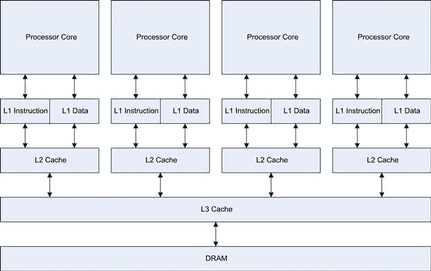
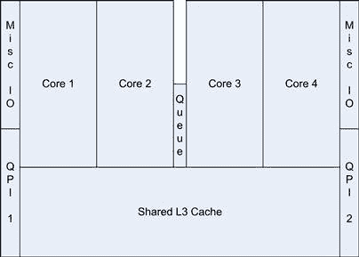
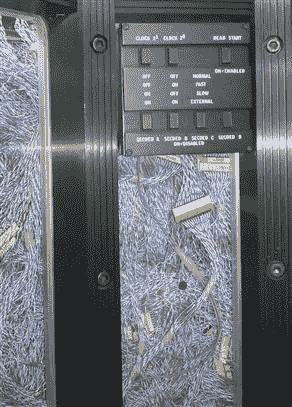
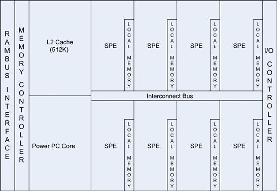
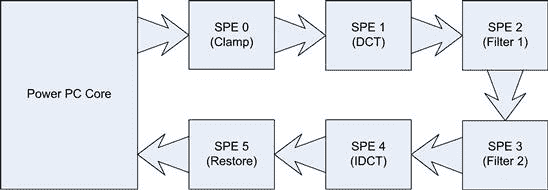
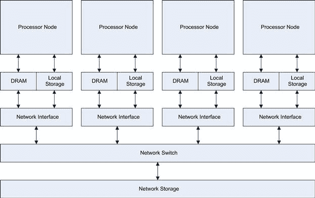
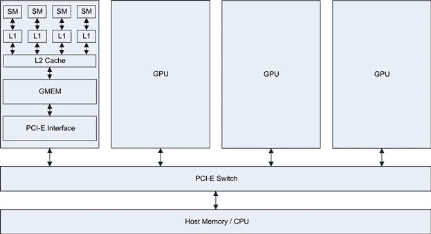
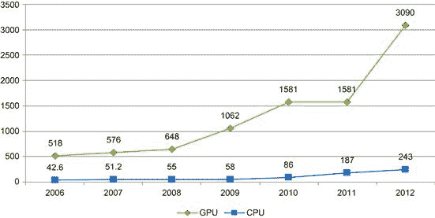
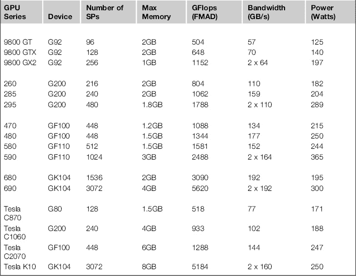

# 第一章：超级计算机的简短历史

## 介绍

那么，为什么在一本关于 CUDA 的书中，我们要关注超级计算机呢？超级计算机通常处于技术曲线的前沿。我们现在看到的技术，未来五到十年内将成为桌面计算机的普遍配置。在 2010 年，德国汉堡举行的年度国际超级计算机大会宣布，基于 NVIDIA GPU 的计算机被列为全球第二大最强计算机，依据的是《TOP500》榜单([`www.top500.org`](http://www.top500.org))。理论上，它的峰值性能超过了强大的 IBM Roadrunner，或当时的领头者 Cray Jaguar，后者的峰值性能接近 3 拍拉弗。在 2011 年，NVIDIA CUDA 驱动的 GPU 赢得了全球最快超级计算机的称号。突然间，大家都明白了，GPU 已经在高性能计算领域以及普通桌面 PC 中大放异彩。

超级计算是现代处理器中许多技术的推动力。由于需要更快的处理器来处理越来越大的数据集，工业界不断生产更快的计算机。正是在这些技术发展的过程中，GPU CUDA 技术才得以诞生。

无论是超级计算机还是桌面计算，都朝着异构计算的方向发展——也就是说，它们试图通过结合 CPU（中央处理单元）和 GPU（图形处理单元）技术来实现更高的性能。全球最大的两个使用 GPU 的项目是 BOINC 和 Folding@Home，两个都是分布式计算项目。它们让普通人能够为特定的科学项目做出实际贡献。支持 GPU 加速器的项目中，CPU/GPU 主机的贡献远远超过了仅支持 CPU 的主机。截至 2011 年 11 月，约有 550 万个主机贡献了总计约 5.3 拍拉弗的计算能力，这相当于 2011 年全球最快超级计算机——日本富士通的“K 计算机”一半的性能。

目前美国最快的超级计算机——代号“Titan”的 Jaguar 替代品，计划于 2013 年投入使用。它将使用近 30 万个 CPU 核心和最多 18,000 块 GPU 板卡，达到每秒 10 到 20 拍拉弗的性能。在全球范围内的支持下，GPU 编程有望迅速进入主流，无论是在 HPC 行业，还是在桌面领域。

现在你可以组装或购买一台桌面超级计算机，性能达到几个 TFLOPS。大约在 2000 年初，12 年前，这样的性能可以让你在全球 500 强榜单上位居第一，超过 IBM ASCI Red 的 9632 个 Pentium 处理器。这仅仅展示了十多年来计算机技术的进步，也引发了一个问题：十年后我们会处于什么位置？你可以相当确定，GPU 将在这个趋势中占据前沿位置一段时间。因此，学习如何有效地编程 GPU 是任何优秀开发者需要掌握的关键技能。

## 冯·诺依曼架构

几乎所有处理器都基于冯·诺依曼开发的流程工作，他被认为是计算机科学的奠基人之一。在这种方法中，处理器从内存中获取指令，解码，然后执行该指令。

现代处理器的运行速度通常可以达到 4 GHz。现代的 DDR-3 内存，当与像标准 Intel I7 设备配对时，速度可以达到 2 GHz。然而，I7 至少有四个处理器或核心，如果你将其超线程能力算作真实的处理器，数量则是其两倍。

在 I7 Nehalem 系统上，DDR-3 三通道内存配置将产生 表 1.1 中显示的理论带宽数据。根据主板和内存模式的不同，实际带宽可能会低得多。

表 1.1 I7 Nehalem 处理器带宽

| QPI 时钟 | 理论带宽 | 每核心 |
| --- | --- | --- |
| 4.8 GT/s（标准版） | 19.2 GB/s | 4.8 GB/s |
| 6.4 GT/s（极限版） | 25.6 GB/s | 6.4 GB/s |

注：QPI = 快速路径互联。

当你考虑处理器时钟速度时，你会遇到内存带宽的第一个问题。如果你有一个运行在 4 GHz 的处理器，你可能需要在每个周期获取一条指令（运算符）以及一些数据（操作数）。

每条指令通常为 32 位，因此如果你只执行一组线性指令，且每个核心上都没有数据，你将得到 4.8 GB/s ÷ 4 = 1.2 GB 每秒的指令吞吐量。这假设处理器平均每时钟周期可以调度一条指令^(∗)。然而，你通常还需要获取和写回数据，如果我们假设数据与指令的比例是 1:1，那么实际上我们将吞吐量减半。

时钟速度与内存的比率是 CPU 和 GPU 吞吐量的一个重要限制因素，我们稍后会讨论。当你深入研究时，会发现大多数应用程序，无论是 CPU 还是 GPU，都往往受限于内存，而不是处理器周期或处理器时钟/负载。

CPU 厂商通过使用缓存内存和突发内存访问来解决这个问题。这利用了局部性原理。如果你查看一个典型的 C 程序，你可能会在一个函数中看到以下类型的操作：

```cpp
void some_function
{
 int array[100];
```

`int i = 0;`

```cpp
 for (i=0; i<100; i++)
 {
  array[i] = i ∗ 10;
 }
}
```

如果你查看处理器通常如何实现这一点，你会看到`array`的地址被加载到某个内存访问寄存器中。参数`i`会被加载到另一个寄存器中。循环退出条件 100 会被加载到另一个寄存器，或者可能以字面值的形式编码到指令流中。计算机随后会重复执行相同的指令，反复执行 100 次。对于每个计算值，我们都有控制、内存和计算指令被提取并执行。

这种做法显然效率低下，因为计算机正在执行相同的指令，但数据值不同。因此，硬件设计师在几乎所有处理器中实现了一小部分缓存，在更复杂的处理器中，有许多级别的缓存（图 1.1）。当处理器需要从内存中提取数据时，首先查询缓存，如果数据或指令已存在缓存中，高速缓存就会将其提供给处理器。



图 1.1 典型的现代 CPU 缓存组织。

如果数据不在第一级（L1）缓存中，则需要从第二级或第三级（L2 或 L3）缓存中提取，或者如果没有缓存行包含该数据，则从主内存中提取。第一级缓存通常与处理器时钟速度相匹配，因此对于我们的循环执行，理论上我们能接近处理器的全速，假设我们同时写入和读取缓存。然而，这也有代价：L1 缓存的大小通常只有 16K 或 32K。L2 缓存较慢，但更大，通常为 256K 左右。L3 缓存更大，通常为数兆字节，但比 L2 缓存慢得多。

在实际应用中，循环的迭代次数通常要大得多，可能达到数兆字节大小。即使程序能保持在缓存内存中，数据集通常也不能。因此，尽管有这些缓存技巧，处理器通常会受到内存吞吐量或带宽的限制。

当处理器从缓存而非主内存中提取指令或数据项时，这被称为缓存命中。使用逐步增大的缓存所带来的增益会迅速下降。这也意味着，我们在现代处理器上看到的越来越大的缓存，除非它们能够涵盖问题的*整个*数据集，否则在提高性能方面的效果越来越小。

英特尔 I7-920 处理器具有大约 8MB 的内部 L3 缓存。这些缓存内存并非免费的，如果我们查看英特尔 I7 处理器的芯片，我们会看到大约 30%的芯片面积被用于 L3 缓存内存（图 1.2）。



图 1.2 I7 Nehalem 处理器在处理器芯片上的布局。

随着缓存大小的增长，用来制造处理器的硅片物理尺寸也在增大。芯片越大，制造成本就越高，而且它包含错误并在制造过程中被丢弃的可能性也越大。有时，这些有缺陷的设备会被便宜出售，作为三核或双核设备，其中有缺陷的核心被禁用。然而，越来越大、效率越来越低的缓存最终会导致终端用户的成本上升。

## Cray

我们今天所知的计算革命始于 1950 年代，随着第一批微处理器的问世。这些设备按照今天的标准，运行速度很慢，你现在的智能手机可能拥有比它更强大的处理器。然而，这些设备为超级计算机的演变奠定了基础，超级计算机通常由政府、大型学术机构或公司拥有。它们比今天常规使用的计算机强大数千倍。它们的生产成本数百万美元，占用大量空间，通常需要特殊的冷却条件，并且需要一个工程师团队来维护。它们消耗巨量的电力，甚至每年的运行费用可能与建造成本相当。事实上，电力是规划此类设施时需要重点考虑的因素之一，也是今天超级计算机发展中的主要限制因素之一。

现代超级计算机的创始人之一是 Seymour Cray，他的 Cray-1 由 Cray Research 于 1976 年生产。这款计算机需要数千根电缆来连接所有组件——以至于他们曾经雇佣女性员工，因为女性的手比大多数男性的小，因此能够更轻松地连接这些数千根电缆。

这些机器通常的正常运行时间（即故障间的实际运行时间）是按小时计算的。能够连续运行一天的时间被认为是一个巨大的成就。



图 1.3 Cray-2 超级计算机内部线路图。

成就。以今天的标准来看，这似乎相当落后。然而，我们今天所拥有的许多成就，归功于 Seymour Cray 以及那个时代其他研究人员的努力。

Cray 继续以多个 Cray 品牌生产一些当时最具突破性的超级计算机。原始的 Cray-1 售价约为 880 万美元，达到了 160 MFLOPS（百万浮点运算每秒）。如今，计算速度以 TFLOPS（万亿浮点运算每秒）为单位衡量，比旧的 MFLOPS 标准大一百万倍（10¹² 对比 10⁶）。今天一张 Fermi GPU 卡的理论峰值性能超过 1 teraflop。

Cray-2 是对 Cray-1 的重大改进。它采用了共享内存架构，分为多个内存区块。这些内存区块连接到一个、两个或四个处理器上。它为今天的基于服务器的对称多处理器（SMP）系统的创建奠定了基础，在这种系统中，多个 CPU 共享同一内存空间。像其时代的许多机器一样，它是一个基于向量的机器。在向量机中，相同的操作作用于多个操作数。如今，这些机器仍然存在，部分以处理器扩展的形式出现，例如 MMX、SSE 和 AVX。GPU 设备本质上是向量处理器，与早期的超级计算机设计有许多相似之处。

Cray 还为散射和收集类型的原语提供硬件支持，这在并行计算中非常重要，我们将在后续章节中讨论这一点。

Cray 至今仍活跃于超级计算机市场，并且截至 2010 年，其 Jaguar 超级计算机在奥克里奇国家实验室（[`www.nccs.gov/computing-resources/jaguar/`](http://www.nccs.gov/computing-resources/jaguar/)）位列全球 500 强。我鼓励你去了解这家伟大公司的历史，你可以在 Cray 的官网上找到相关信息（[`www.cray.com`](http://www.cray.com)），这将帮助你了解计算机的发展历程，以及我们今天所处的位置。

## 连接机

早在 1982 年，一家名为 Thinking Machines 的公司提出了一个非常有趣的设计——连接机。

这是一个相对简单的概念，促成了今天并行计算机的革命。它们反复使用一些简单的部件。它们创建了一个 16 核 CPU，然后将这些设备中的 4096 个安装在一台机器中。这个概念有所不同。与单个快速处理器处理数据集不同，64 K 个处理器共同执行这个任务。

让我们以操控 RGB（红、绿、蓝）图像的颜色为例。每种颜色由一个字节组成，每个像素的颜色由 3 个字节表示。假设我们想将蓝色的值减少到零。

假设内存被配置为红色、蓝色和绿色三个内存区块，而不是交错排列。对于常规处理器，我们会有一个循环遍历蓝色内存并将每个像素的颜色值减去 1。每个数据项执行的操作是相同的，但每次我们都需要提取、解码并在每次循环迭代中执行指令流。

连接机使用了一种叫做 SIMD（单指令，多数据）的技术，这在现代处理器中得到了应用，并以 SSE（流式 SIMD 扩展）、MMX（多媒体扩展）和 AVX（高级向量扩展）等名称被人们熟知。这个概念是定义一个数据范围，然后让处理器将该操作应用到数据范围上。然而，SSE 和 MMX 基于只有一个处理器核心的架构。连接机拥有 64 K 个处理器核心，每个核心在其数据集上执行 SIMD 指令。

像 Intel I7 这样的处理器是 64 位处理器，这意味着它们一次可以处理最多 64 位（8 字节）。SSE SIMD 指令集将其扩展到 128 位。使用这样的处理器上的 SIMD 指令，我们消除了所有冗余的指令内存获取，并且与逐次获取和写入 1 字节相比，生成的内存读写周期仅为其 1/16。AVX 将这一扩展到 256 位，效果更加显著。

对于 1920 × 1080 分辨率的高清（HD）视频图像，数据大小为 2,073,600 字节，约为每个颜色平面 2 MB。因此，使用 SSE/MMX 的单一常规处理器将生成约 260,000 个 SIMD 周期。我们所说的 SIMD 周期，是指一次读取、计算和写入的周期。实际的处理器时钟数量可能与此相差较大，具体取决于特定的处理器架构。

Connection Machine 使用了 64 K 个处理器。因此，2 MB 的帧数据将为每个处理器生成大约 32 个 SIMD 周期。显然，这种方法远远优于现代处理器的 SIMD 方法。然而，当然也有一个警告。当从今天 CPU 的粗线程化方法转向这种机器使用的极度并行方法时，处理器之间的同步和通信将成为主要问题。

## Cell 处理器

超级计算机中的另一个有趣发展来源于 IBM 发明的 Cell 处理器（图 1.4）。这一设计的思路是让一个常规处理器充当监督处理器，连接到多个高速流处理器。Cell 中的常规 PowerPC（PPC）处理器作为流处理器和外部世界之间的接口。流 SIMD 处理器，或 IBM 所称的 SPE，将处理由常规处理器管理的数据集。



图 1.4 IBM Cell 处理器芯片布局（8 SPE 版本）。

对我们来说，Cell 是一个特别有趣的处理器，因为它的设计与 NVIDIA 后来在 G80 和随后的 GPU 中使用的设计类似。索尼也在其 PS3 游戏主机中使用了它，这是一个与 GPU 主要用途非常相似的领域。

要编程 Cell，你需要编写一个程序在 PowerPC 核心处理器上执行。然后，它会在每个流处理单元（SPE）上调用一个完全不同的二进制程序。每个 SPE 实际上都是一个独立的核心。它可以从自己的本地内存中执行独立的程序，这与旁边的 SPE 不同。此外，SPE 之间以及与 PowerPC 核心之间可以通过共享互连进行通信。然而，这种混合架构并不容易编程。程序员必须明确管理八个 SPE，无论是程序还是数据，以及在 PowerPC 核心上运行的串行程序。

通过能够直接与协调处理器通信，可以实现一系列简单的步骤。以我们之前的 RGB 示例为例，PPC 核心获取一块数据进行处理。它将这些数据分配给八个 SPE。当每个 SPE 执行相同的操作时，每个 SPE 获取字节，递减该字节，并将其位写回到本地内存。当所有 SPE 完成后，PC 核心从每个 SPE 获取数据。然后它将数据块（或图块）写入正在组装整个图像的内存区域。Cell 处理器设计为以组方式使用，因此它重复了我们之前讨论过的连接机器的设计。

SPEs 也可以被指令执行流操作，涉及多个步骤，因为每个 SPE 都连接到一个高速环形网络（图 1.5）。



图 1.5 示例路由流处理器在 Cell 上的路由。

这种流处理或流水线处理方法的问题在于，它的运行速度仅受限于最慢的节点。这就像工厂里的生产线一样，整条生产线只能按照最慢的环节运行。每个 SPE（工人）只需执行一小部分任务，因此就像装配线工人一样，它可以非常快速和高效地完成这些任务。然而，就像任何处理器一样，它也存在带宽限制和将数据传递到下一个阶段的开销。因此，虽然你可以通过在每个 SPE 上执行一致的程序来提高效率，但在处理器之间的通信上则会有所损失，并且最终会受到最慢步骤的限制。这是任何基于流水线的执行模型中的常见问题。

另一种方法是将所有任务放在一个 SPE 上，然后让每个 SPE 处理一小块数据，这通常是一种更高效的做法。这相当于训练所有装配线工人组装一个完整的组件。对于简单的任务来说，这很容易，但每个 SPE 对可用程序和数据内存都有一定限制。PowerPC 核心现在必须同时处理来自八个 SPE 的数据，而不是仅仅两个，因此管理开销和主机与 SPE 之间的通信会增加。

IBM 在其 Roadrunner 超级计算机中使用了高性能版本的 Cell 处理器，该计算机截至 2010 年排名全球超级计算机 TOP 500 的第三快计算机。它由 12,960 个 PowerPC 核心以及 103,680 个流处理器组成。每个 PowerPC 板由一个双核的 AMD（高级微设备公司）Opteron 处理器进行监督，总共有 6912 个 Opteron 处理器。这些 Opteron 处理器充当节点之间的协调者。Roadrunner 的理论吞吐量为 1.71 拍浮点运算每秒（petaflops），建设成本为 1.25 亿美元，占地 560 平方米，运行时消耗 2.35 兆瓦的电力！

## 多节点计算

当你提高单台机器所需的要求（如 CPU、内存、存储空间）时，成本会迅速增加。比如一个 2.6 GHz 的处理器可能需要 250 美元，而一个 3.4 GHz 的同款处理器可能要 1400 美元，时钟频率增加不到 1 GHz，却导致成本大幅上涨。类似的情况也出现在速度、内存大小和存储容量上。

随着计算需求的增加，成本不仅增加，电力需求和由此产生的散热问题也会增加。只要提供足够的电力和冷却，处理器的频率可以达到 4–5 GHz。

在计算中，你常常会遇到收益递减法则。单一设备能承载的东西是有限的，你会受到成本、空间、电力和热量的限制。解决方法是选择每个因素的合理平衡，并将其多次复制。

集群计算在 1990 年代随着时钟频率的不断提升而变得流行。这个概念非常简单：用若干台从商用部件购买或制造的普通 PC，将它们连接到一个 8、16、24 或 32 端口的以太网交换机上，你就能得到单台计算机 32 倍的性能。你不再需要为一个高性能处理器支付 1600 美元，而是花 250 美元买六个中等性能的处理器。如果你的应用需要巨大的内存容量，最大化多台机器的 DIMM 内存并将它们相加往往已经足够。多台机器的合力性能远远超过了你用相同预算所能买到的任何单台机器。

突然之间，大学、学校、办公室和计算机部门可以构建比以往更强大的机器，不再因为资金不足而无法进入高速计算市场。那时候的集群计算就像今天的 GPU 计算一样，是一种颠覆性的技术，改变了计算的面貌。再加上不断提高的单核时钟频率，它提供了一种廉价的方式，在单核 CPU 上实现并行计算。

PC 集群通常运行着某种版本的 LINUX，每个节点通常从中央主节点获取启动指令和操作系统（OS）。例如，在 CudaDeveloper，我们有一个由低功耗、基于 Atom 的 PC 和嵌入式 CUDA GPU 组成的小型集群。购买和搭建一个集群非常便宜。有时这些集群甚至可以由一些正在被替换掉的旧 PC 组成，因此硬件实际上是免费的。

然而，集群计算的问题在于，它的速度取决于问题所需的节点间通信量。如果你有 32 个节点，而问题能被分解成 32 个相互独立的部分，并且不需要节点间的通信，那么你有一个非常适合集群的应用。如果每个数据点都需要从每个节点获取数据，那么将这样的应用放入集群中就会遇到很大的问题。

集群出现在现代 CPU 和 GPU 中。回顾图 1.1，CPU 缓存层次结构。如果我们将每个 CPU 核心视为一个节点，将 L2 缓存视为 DRAM（动态随机存取存储器），将 L3 缓存视为网络交换机，将 DRAM 视为大容量存储，那么我们就得到了一个微型集群（参见图 1.6）。



图 1.6 典型集群布局。

现代 GPU 内部的架构与此并无太大区别。你会有多个类似于 CPU 核心的流式多处理器（SM）。这些处理器连接到共享内存/L1 缓存。然后，它们连接到作为 SM 间交换机的 L2 缓存。数据可以保存在全局内存存储中，然后由主机提取并使用，或者通过 PCI-E 交换机直接发送到另一个 GPU 的内存。PCI-E 交换机的速度远远超过任何网络的互连速度。

节点本身可以多次复制，如图 1.7 所示。这种在受控环境中的复制形成了集群。集群设计的一个演变是分布式应用程序。分布式应用程序在多个节点上运行，每个节点可能包含多个处理单元，包括 GPU。分布式应用程序可以，也不一定需要，在管理集群的受控环境中运行。它们可以将任意机器连接在一起，共同处理某个问题，BOINC 和 Folding@Home 是这类通过互联网将机器连接在一起的应用程序中的两个最大例子。



图 1.7 GPUs 与集群的对比。

## Gpgpu 编码的早期

图形处理单元（GPU）是大多数现代 PC 中存在的设备。它们为 CPU 提供一系列基本操作，例如在内存中渲染图像，并将该图像显示在屏幕上。GPU 通常会处理一组复杂的多边形，这些多边形是要渲染的场景的映射。然后，它会将纹理应用于这些多边形，并进行着色和光照计算。NVIDIA 5000 系列显卡首次带来了照片级真实感效果，如 2003 年“黎明仙子”演示中所展示的效果。

查看[`www.nvidia.com/object/cool_stuff.html#/demos`](http://www.nvidia.com/object/cool_stuff.html%23/demos)，并下载一些较旧的演示，你将看到 GPU 在过去十年中是如何发展的。请参见表 1.2。

表 1.2 多年来展示的 GPU 技术

| 演示 | 显卡 | 年份 |
| --- | --- | --- |
| 黎明 | GeForce FX | 2003 |
| 黄昏 Ultra | GeForce FX | 2003 |
| Nalu | GeForce 6 | 2004 |
| 月亮 | GeForce 7 | 2005 |
| 青蛙 | GeForce 8 | 2006 |
| 人头 | GeForce 8 | 2007 |
| 美杜莎 | GeForce 200 | 2008 |
| 超音速雪橇 | GeForce 400 | 2010 |
| 新黎明 | GeForce 600 | 2012 |

其中一个重要的步骤是可编程着色器的发展。这些实际上是小型程序，由 GPU 运行，用于计算不同的效果。渲染不再固定在 GPU 中；通过可下载的着色器，它可以被操控。这是通用图形处理单元（GPGPU）编程的第一次演变，因为设计已迈出了远离固定功能单元的第一步。

然而，这些着色器本质上是对表示多边形地图的 3D 点集进行操作的。这些着色器以极高的并行方式对许多此类数据集应用相同的操作，从而提供了巨大的计算能力吞吐量。

现在，尽管多边形是由三个点组成的集合，一些其他数据集（如 RGB 照片）也可以通过三个点的集合来表示，但许多数据集并非如此。一些勇敢的研究人员利用 GPU 技术尝试加速通用计算。这导致了许多倡议的开发（例如 BrookGPU、Cg、CTM 等），这些倡议的目标是使 GPU 成为一个像 CPU 一样的真正可编程设备。不幸的是，每个方案都有自己的优缺点。它们都不容易学习或编程，并且从未大规模地教授给人们。简而言之，程序员群体从未对这种难以学习的技术产生关键的兴趣，也未能形成关键的规模。它们从未成功打入大众市场，而 CUDA 首次做到了这一点，并且同时为程序员提供了一个真正的通用 GPU 语言。

## 单核解决方案的终结

当今现代处理器的一个问题是，它们已经达到了大约 4 GHz 的时钟频率极限。在这个频率下，它们产生的热量对于当前技术来说太大，需要特殊且昂贵的冷却解决方案。这是因为随着时钟频率的提高，功耗也会上升。事实上，如果固定电压，CPU 的功耗大致与时钟频率的立方成正比。更糟糕的是，随着 CPU 产生的热量增加，在相同时钟频率下，由于硅的特性，功耗也会增加。这种功率转化为热量是完全浪费能源的。功率越来越低效的使用最终意味着你无法为处理器提供足够的电力或冷却，并且达到了设备或其外壳的热极限，这就是所谓的功率墙。

面对无法提高时钟频率、制造更快处理器的困境，处理器制造商不得不想出另一种应对策略。两大主流 PC 处理器制造商，Intel 和 AMD，不得不采取不同的方法。它们被迫走上了给处理器增加更多核心的道路，而不是不断地尝试通过提高 CPU 时钟频率和/或通过指令级并行性提取每时钟更多指令。现在我们有双核、三核、四核、六核、8 核、12 核，甚至很快就会有 16 核和 32 核等等。这是计算技术的未来方向，不仅适用于 GPU，还适用于 CPU 社区。Fermi GPU 在 CPU 术语中实际上已经是一个 16 核设备。

这种方法存在一个大问题——它要求程序员从传统的串行、单线程方法转变为处理多个同时执行的线程。现在程序员必须考虑两个、四个、六个或八个程序线程以及它们之间如何相互作用和通信。当双核 CPU 出现时，这个转变相对容易，因为通常有一些后台任务可以被转移到第二个核心上。当四核 CPU 出现时，并不是很多程序做出了改变来支持它。它们只是继续作为单线程应用程序出售。即使是游戏行业，也并没有很快转向四核编程，然而这是一个本应希望充分利用当今技术的行业。

在某些方面，处理器制造商也要为此负责，因为单核应用程序在四核设备的四分之一核心上运行得相当不错。一些设备甚至在只有一个核心活动时动态提高时钟频率，促使程序员变得懒惰，不去充分利用可用的硬件。

也有经济方面的原因。软件开发公司需要尽快将产品推向市场。开发一个更好的四核解决方案固然好，但如果市场被先行的竞争对手抢占，那就得不偿失了。由于制造商仍然继续生产单核和双核设备，市场自然会倾向于选择最低配置的设备，且销售范围最广。直到四核 CPU 成为生产的最低配置时，市场力量才会推动 CPU 市场向多核编程转变。

## Nvidia 和 Cuda

如果你看一下 GPU 和 CPU 在计算能力上的相对差异，我们会得到一个有趣的图表（图 1.8）。我们开始看到 CPU 和 GPU 的计算能力开始分化，直到 2009 年，GPU 终于突破了 1000 吉帕（gigaflops）或 1 泰帕（teraflop）障碍。此时，我们正从 G80 硬件过渡到 G200，然后在 2010 年进入 Fermi 的演进阶段。这一切都得益于大规模并行硬件的引入。G80 是一个 128 CUDA 核心的设备，G200 是一个 256 CUDA 核心的设备，而 Fermi 则是一个 512 CUDA 核心的设备。



图 1.8 CPU 和 GPU 在千亿次浮点运算中的峰值性能。

我们看到 NVIDIA 的 GPU 从 G200 架构到 Fermi 架构实现了 300 gigaflops 的飞跃，吞吐量提升了近 30%。相比之下，英特尔从 Core 2 架构到 Nehalem 架构的飞跃仅仅是一个小幅提升。只有在转向 Sandy Bridge 架构时，我们才看到 CPU 性能的显著提升。这并不是说一个比另一个好，因为传统的 CPU 是为了串行代码执行而设计的，在这方面非常优秀。它们包含了特殊的硬件，例如分支预测单元、多个缓存等，所有这些硬件都针对串行代码执行优化。GPU 并非为串行执行流程而设计，只有在完全并行使用时，才能达到它们的峰值性能。

2007 年，NVIDIA 看到了将 GPU 引入主流的机会，通过添加一个易于使用的编程接口，命名为 CUDA（计算统一设备架构）。这为编程 GPU 打开了可能性，无需学习复杂的着色器语言，也不必仅仅考虑图形原语。

CUDA 是 C 语言的扩展，允许用常规 C 语言编写 GPU 代码。代码可以针对主处理器（CPU）或者设备处理器（GPU）编写。主处理器将多线程任务（或在 CUDA 中称为内核）分派到 GPU 设备。GPU 有自己的内部调度器，然后将内核分配给存在的 GPU 硬件。稍后我们将详细讨论调度问题。只要任务中有足够的并行性，随着 GPU 中 SM 单元数量的增加，程序的速度也应该增加。

然而，隐藏在这里的一个大问题是，你必须问一下代码中有多少百分比可以并行运行。最大加速的可能性受到串行代码部分的限制。如果你有无限的处理能力，且可以在零时间内完成并行任务，你仍然会受到串行代码部分所需时间的限制。因此，我们必须从一开始就考虑是否能够有效地并行化大量工作负载。

NVIDIA 致力于提供对 CUDA 的支持。从其网站上的 [`www.nvidia.com`](http://www.nvidia.com) 的 CudaZone 页面可以获取大量的信息、示例和开发工具来帮助开发。

与前辈们不同，CUDA 现在实际上已经开始获得动力，并且首次看起来会有一种编程语言成为 GPU 编程的首选。考虑到目前支持 CUDA 的 GPU 数量已达数百万，市场上有一个巨大的空间在等待着支持 CUDA 的应用程序。

目前有许多支持 CUDA 的应用程序，而且每月都有新的应用程序加入。NVIDIA 在其社区网站上展示了其中的许多应用，地址是 [`www.nvidia.com/object/cuda_apps_flash_new.html`](http://www.nvidia.com/object/cuda_apps_flash_new.html)。

在需要进行大量计算的领域，例如将家庭电影制作成 DVD（视频转码），我们看到大多数主流视频软件现在都支持 CUDA。在这个领域，平均加速比为 5 到 10 倍。

随着 CUDA 的推出，Tesla 系列卡也随之推出。这些卡不是显卡，实际上它们没有 DVI 或 VGA 连接器。它们是专门针对科学计算的计算卡。在这里，我们看到了科学计算方面的巨大加速。这些卡可以安装在普通的桌面 PC 中，也可以安装在专用的服务器机架中。NVIDIA 提供了这样的系统，网址为 [`www.nvidia.com/object/preconfigured_clusters.html`](http://www.nvidia.com/object/preconfigured_clusters.html)，该系统宣称提供的计算能力是传统集群的 30 倍。CUDA 和 GPU 正在重新定义高性能计算的世界。

## GPU 硬件

NVIDIA G80 系列处理器及其以后的设计，类似于 Connection Machine 和 IBM 的 Cell 处理器。每个显卡由多个 SM 组成，每个 SM 上连接着八个或更多的 SP（流处理器）。原始的 9800 GTX 卡有八个 SM，总共有 128 个 SP。然而，与 Roadrunner 不同的是，每个 GPU 卡的价格只有几百美元，并且它的功耗也没有达到 2.35 MW。电力消耗问题不容忽视，正如我们稍后在讨论构建 GPU 服务器时将会提到的那样。

GPU 卡可以广泛地视为加速器或协处理器卡。目前，GPU 卡必须与基于 CPU 的主机协同工作。在这方面，它非常类似于 Cell 处理器的设计，后者有一个常规的串行核心和多个 SIMD SPE 核心。每个 GPU 设备包含一组 SM，每个 SM 又包含一组 SP 或 CUDA 核心。SP 以最多 32 个单元的并行集执行工作。它们消除了 CPU 上为了实现高速串行执行而需要的复杂电路，这些电路通过指令级并行实现。它们用程序员指定的显式并行模型取而代之，使得更多的计算能力可以被压缩到同一片硅片上。

GPU 的整体吞吐量在很大程度上取决于 SP 的数量、全局内存的带宽，以及程序员如何有效利用他们所使用的并行架构。请参阅 表 1.3 以查看当前 NVIDIA GPU 卡的列表。

表 1.3 当前 NVIDIA GPU 卡系列



针对特定应用，选择哪个显卡是一个在内存和 GPU 处理能力之间的平衡。需要注意的是，9800 GX2、295、590、690 和 K10 卡实际上是双卡，因此要充分利用这些卡，需要将其作为两个设备而不是一个设备来编程。这里有一个警告：GPU 的性能数据是针对单精度（32 位）浮点性能的，而不是双精度（64 位）性能。另外，需要小心 GF100（Fermi）系列，因为 Tesla 版本的双精度单元数量是标准桌面单元的两倍，因此在双精度吞吐量上表现显著更好。尚未发布的 Kepler K20 相比已发布的 K10 版本，双精度性能也会有显著提升。

还需要注意的是，虽然这里没有展示，但随着代际发展，每个 SM 的功耗逐时减少。然而，整体功耗却大幅增加，这也是任何基于多 GPU 解决方案的关键考虑因素之一。通常情况下，我们看到双 GPU 卡（如 9800 GX2、295、590、690）的功耗略低于等效的两个单卡，因为它们采用了共享电路和/或降低了时钟频率。

NVIDIA 提供了各种机架（M 系列计算模块），这些机架包含了两到四个 Tesla 卡，连接在共享的 PCI-E 总线上，用于高密度计算。完全可以使用标准 PC 零部件来搭建自己的 GPU 集群或微型超级计算机，稍后在书中我们将介绍如何实现这一点。

CUDA 的伟大之处在于，尽管硬件存在诸多差异，针对原始 CUDA 设备编写的程序仍然可以在今天的 CUDA 设备上运行。CUDA 的编译模型采用了与 Java 相同的原理——虚拟指令集的运行时编译。这使得现代 GPU 能够执行来自即使是最旧一代 GPU 的代码。在许多情况下，程序通过原始程序员根据新 GPU 的特性进行改进，从而显著获益。事实上，对于各种硬件版本的调优空间非常大，我们将在书的后面部分讨论这一点。

## CUDA 的替代方案

### OpenCL

那么其他 GPU 厂商如何呢，ATI（现在的 AMD）作为典型的代表？就原始计算能力而言，AMD 的产品系列与 NVIDIA 的系列一样令人印象深刻。然而，AMD 将流计算技术推向市场的时间远晚于 NVIDIA 推出 CUDA。因此，NVIDIA 为 CUDA 提供了远多于 AMD/ATI 的应用程序。

本书不会深入讨论 OpenCL 和 DirectCompute，但它们作为 CUDA 的替代方案值得一提。CUDA 目前只能在 NVIDIA 硬件上官方执行。虽然 NVIDIA 在 GPU 市场上占有相当大的份额，但它的竞争对手也占有不小的市场份额。作为开发者，我们希望为尽可能大的市场开发产品，尤其是在消费市场中。因此，大家应该意识到，除了 CUDA 外，还有其他支持 NVIDIA 及其他硬件的替代方案。

OpenCL 是一个开放且免版税的标准，得到了 NVIDIA、AMD 等公司的支持。OpenCL 商标由苹果公司拥有。它制定了一个开放标准，允许使用计算设备。计算设备可以是 GPU、CPU，或者是有 OpenCL 驱动的其他专业设备。截至 2012 年，OpenCL 支持所有主要品牌的 GPU 设备，包括至少支持 SSE3 的 CPU。

任何熟悉 CUDA 的人都可以相对容易地掌握 OpenCL，因为它们的基本概念非常相似。然而，OpenCL 的使用比 CUDA 稍微复杂，因为 CUDA 运行时 API 为程序员做的许多工作，在 OpenCL 中需要显式地执行。

你可以在[`www.khronos.org/opencl/`](http://www.khronos.org/opencl/)阅读更多关于 OpenCL 的内容。现在也有许多关于 OpenCL 的书籍。我个人推荐在学习 OpenCL 之前先学习 CUDA，因为 CUDA 相较于 OpenCL 更像是一个更高层次的语言扩展。

### DirectCompute

DirectCompute 是微软对 CUDA 和 OpenCL 的替代方案。它是一个专有产品，链接到 Windows 操作系统，特别是 DirectX 11 API。对于那些记得在 DirectX 出现之前编写显卡程序的人来说，DirectX API 是一次巨大的飞跃。它意味着开发者只需要学习一个库 API 就可以编程所有显卡，而不需要为每个主要显卡制造商编写或授权驱动程序。

DirectX 11 是最新的标准，并在 Windows 7 下得到支持。微软的背书意味着你可能会看到开发者社区对该标准的迅速采纳。特别是对于那些已经熟悉 DirectX API 的开发者来说。如果你熟悉 CUDA 和 DirectCompute，那么将 CUDA 应用程序移植到 DirectCompute 是一个相对容易的任务。根据微软的说法，如果你熟悉这两个系统，通常可以在一个下午完成这个工作。然而，由于 DirectCompute 以 Windows 为中心，我们将排除那些以 UNIX 各种版本为主的高端系统。

微软也将推出 C++ AMP，这是一个额外的标准模板库（STL）集，可能更吸引那些已经熟悉 C++风格 STL 的程序员。

### CPU 替代方案

如果你在开发 Linux 程序，主要的并行处理语言扩展包括 MPI、OpenMP 和 pthreads。对于 Windows 来说，则有 Windows 线程模型和 OpenMP。MPI 和 pthreads 作为来自 Unix 世界的各种移植版本被支持。

**MPI**（消息传递接口）可能是最广为人知的消息传递接口。它是基于进程的，通常出现在大型计算实验室中。它需要管理员正确配置安装，并且最适用于受控环境。并行性通过在节点集群中启动数百个进程并显式地交换消息来表达，通常是通过高速网络通信链接（如以太网或 InfiniBand）。MPI 被广泛使用并教授，在受控的集群环境中，它是一个不错的解决方案。

**OpenMP**（开放多处理）是一个为节点或计算机系统内的并行性设计的系统。它的工作方式完全不同，程序员通过编译器指令指定各种并行指令。然后，编译器会根据可用的处理器核心数自动尝试将问题分割成 *N* 个部分。许多编译器（包括用于 CUDA 的 NVCC 编译器）都内建了 OpenMP 支持。由于底层 CPU 架构的原因，OpenMP 常常面临扩展性问题。通常，CPU 的内存带宽不足以让所有核心持续从内存中读取或写入数据。

**Pthreads** 是一个广泛用于 Linux 多线程应用的库。与 OpenMP 类似，pthreads 使用线程而不是进程，因为它是为单节点内的并行性设计的。然而，与 OpenMP 不同，程序员需要负责线程的管理和同步。这提供了更多的灵活性，从而使得编写良好的程序能够获得更好的性能。

**ZeroMQ**（0MQ）也是值得一提的。这是一个简单的库，你只需链接它，我们将在本书稍后使用它来开发一个多节点、多 GPU 示例。ZeroMQ 支持线程、进程和基于网络的通信模型，并且提供一个跨平台的 API。它也可以在 Linux 和 Windows 平台上使用。它是为分布式计算设计的，因此连接是动态的，节点可以优雅地失败。

**Hadoop**也是你可以考虑的一个选择。Hadoop 是 Google 的 MapReduce 框架的开源版本，主要面向 Linux 平台。其概念是将一个庞大的数据集分解（或映射）成多个小块。然而，与将数据发送到节点不同，数据集已经通过并行文件系统分割到数百个或数千个节点上。因此，程序的“reduce”步骤被发送到包含数据的节点上。输出结果会写入本地节点并保留在那里。随后的 MapReduce 程序会接收前一个输出并以某种方式进行转换。由于数据实际上是镜像到多个节点上，这使得系统具有高度的容错性以及高吞吐量。

### 指令和库

有许多编译器供应商，其中 PGI、CAPS 和 Cray 是最著名的，它们支持最近发布的用于 GPU 的 OpenACC 编译器指令集。实质上，这些指令集复制了 OpenMP 的方法，程序员插入一些编译器指令，标记出“需要在 GPU 上执行”的区域。然后，编译器负责将数据移动到 GPU 或从 GPU 移动，调用内核等繁琐的工作。

与使用 pthread 而非 OpenMP 类似，pthread 提供的更低级的控制可以实现更高的性能。CUDA 与 OpenACC 的情况也是如此。额外的控制级别带来了更高的编程知识要求、更高的错误风险，以及可能对开发进度造成的时间影响。目前，OpenACC 要求使用指令指定哪些代码区域应在 GPU 上运行，还需要指定数据应该存储在哪种类型的内存中。NVIDIA 声称使用这些指令可以获得大约 5 倍以上的加速。这对于需要快速实现某些功能的程序员来说是一个很好的解决方案。对于那些编程是次要考虑的人，他们只想在合理的时间框架内解决问题，这也是一个很棒的选择。

使用库也是获得显著生产力提升以及执行时间加速的另一个关键领域。像 SDK 这样的库提供了 Thrust，它以非常高效的方式实现了常见的功能。像 CUBLAS 这样的库是线性代数领域最出色的库之一。许多知名的应用程序，如 Matlab 和 Mathematica，也有相应的库。Python、Perl、Java 等语言也有相关绑定。CUDA 甚至可以与 Excel 集成。

就像现代软件开发的许多方面一样，很有可能有人已经开发了你即将开发的内容。在你花费数周时间开发一个库之前，先在互联网上搜索，看看是否已经有类似的东西，除非你是 CUDA 专家，否则它可能不会比现有的库更快。

## 结论

所以，也许你会想，为什么要开发 CUDA？答案是，CUDA 目前是开发中最容易的语言，特别是在支持、调试工具和驱动程序方面。CUDA 在所有方面都抢占了先机，并且在成熟度上遥遥领先。如果你的应用需要支持 NVIDIA 以外的硬件，那么目前最好的路线是先在 CUDA 下开发，然后再将应用移植到其他 API 上。因此，我们将集中讨论 CUDA，因为如果你成为 CUDA 的专家，那么如果需要，你很容易掌握其他的 API。了解 CUDA 的工作原理将帮助你更好地利用并理解任何更高层次 API 的局限性。

从单线程 CPU 程序员到完全成熟的 GPU 并行程序员的旅程是我希望你能感兴趣的。即使你将来从不编写 GPU 程序，你所获得的见解也将极大帮助你设计多线程程序。如果你像我们一样看到世界正在转向并行编程模型，你会希望站在这波创新和技术挑战的前沿。单线程产业正慢慢走向过时。为了成为一个有价值的资产和具备就业能力的个人，你需要具备反映计算世界发展方向的技能，而不是那些正在逐渐过时的技能。

GPU 正在改变计算的面貌。突然间，十年前超级计算机的计算能力可以放在你的桌子下面。你不再需要排队提交工作批次，也不必等待几个月才能通过委员会审批使用超负荷计算设施的有限计算资源。你可以出去花费 5000 到 10,000 美元，拥有一台桌面上的超级计算机，或者一台运行 CUDA 的开发机器，价格只是其中的一小部分。GPU 是一种颠覆性的技术变革，它将使超级计算机般的性能水平对每个人开放。

^∗实际达到的调度速率可能高于或低于 1，这里为了简便我们使用 1。
