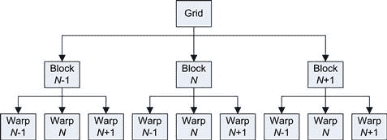
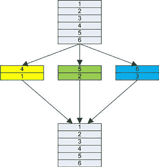

# 第二章：理解 GPU 的并行性

## 引言

本章旨在提供并行编程概念的广泛介绍，并说明这些概念如何与 GPU 技术相关。它主要面向那些具有串行编程背景，但对并行处理概念不熟悉的读者。我们将在 GPU 的主要背景下讨论这些概念。

## 传统串行代码

很多程序员是在串行程序主导的时代毕业的，当时并行编程只吸引了一小部分爱好者。大多数上大学的人选择与 IT 相关的专业，因为他们对技术感兴趣。然而，他们也意识到自己需要一份能支付合理薪水的工作或职业。因此，在专业化时，至少会考虑大学毕业后可能获得职位的情况。除了研究或学术职位外，并行编程的商业岗位数量一直很少，最多只能算是少数。大多数程序员开发应用程序时采用简单的串行方式，基本上是根据大学教授他们的编程方式来进行的，而这种方式又是由市场需求推动的。

并行编程的格局是支离破碎的，存在着许多从未真正进入主流的技术和语言。并行硬件从未真正存在大规模市场需求，因此也就没有大量的并行程序员。每年或两年，CPU 厂商都会推出比前一代执行速度更快的新处理器，继而推动了串行代码的延续。

相比之下，并行程序通常与硬件紧密相关。它们的目标是实现更快的性能，而这种性能往往是以可移植性为代价的。特性 X 的实现方式可能不同，或者在下一代并行硬件中根本不存在。周期性地，某种革命性的新架构出现，需要彻底重写所有代码。如果你作为程序员的知识集中在处理器 X 上，那么这份知识在市场上的价值仅限于处理器 X 还在使用的时候。因此，学习编程 x86 架构比学习某种仅在短短几年内存在的异国并行架构更具商业意义。

然而，在这一过程中，还是有一些标准逐渐发展出来，直到今天我们仍然在使用。OpenMP 标准处理单个节点内的并行性，并且设计用于包含多核处理器的共享内存机器。它没有涉及单个节点或盒子外部的任何概念。因此，你受到处理能力、内存容量和存储空间方面的限制，只能解决适合在单个盒子中运行的问题。然而，编程相对容易，因为大多数底层线程代码（如果用 Windows 线程或 POSIX 线程编写）都由 OpenMP 为你处理了。

MPI（消息传递接口）标准解决了节点之间的并行性，旨在处理位于明确网络中的计算机集群。它通常用于超级计算机的安装中，可能涉及成千上万的独立节点。每个节点保存问题的一小部分。因此，常见的资源（CPU、缓存、内存、存储等）是通过网络中的节点数来倍增的。任何网络的“阿基里斯之踵”是各种互连部分，即将网络中的机器连接在一起的部分。节点间的通信通常是决定任何基于集群的解决方案最大速度的主要因素。

OpenMP 和 MPI 可以一起使用，以便在节点内部以及跨机器网络利用并行性。然而，它们的 API 和使用的方法完全不同，这意味着它们通常不会一起使用。OpenMP 指令允许程序员通过指定并行区域来以高层次的视角看待并行性。相比之下，MPI 使用显式的进程间通信模型，需要程序员做更多的工作。

在花时间熟悉一种 API 后，程序员通常不愿学习另一种。因此，适用于单台计算机的问题通常会采用 OpenMP 解决方案，而真正大规模的问题则采用基于集群的解决方案，如 MPI。

CUDA 是我们在本文中将要探索的 GPU 编程语言，可以与 OpenMP 和 MPI 一起使用。CUDA 还有一个类似 OpenMP 的指令版本（OpenACC），对于熟悉 OpenMP 的人来说，可能更容易上手。OpenMP、MPI 和 CUDA 正在许多大学的计算机课程中逐渐成为本科生和研究生的教学内容。

然而，大多数串行程序员首次接触并行编程时，是在多核 CPU 的引入下。像之前的并行环境一样，这些 CPU 也被大多数人忽视，只有少数热衷者在关注。多核 CPU 的主要用途是基于操作系统的并行性。这是一个基于*任务并行性*的模型，我们稍后会详细讨论。

随着技术明显朝着多核路线发展，越来越多的程序员开始关注多核时代。几乎所有桌面计算机现在都配备了双核或四核处理器。因此，程序员开始使用线程来利用 CPU 上的多个核心。

线程是程序中一个独立的执行流，可以根据需要与主执行流分开或合并。通常，CPU 程序的线程数量不会超过物理处理器核心数量的两倍。与单核处理器类似，通常每个操作系统任务会被时间分片，轮流分配一个小的时间片，从而给人一种运行更多任务的假象，尽管物理 CPU 核心数量有限。

然而，随着线程数量的增加，这个问题变得更加明显。后台操作系统每次需要在任务之间切换时，都必须进行上下文切换（即交换一组寄存器）。由于上下文切换是一项昂贵的操作，通常需要几千个周期，CPU 应用程序的线程数量通常相较于 GPU 较少。

## 串行/并行问题

线程带来了许多并行编程的问题，例如资源共享。通常，这通过信号量来完成，信号量其实就是一个锁或令牌。拥有令牌的人可以使用资源，其他人则必须等待令牌持有者释放令牌。只要只有一个令牌，一切都能正常工作。

当有两个或更多令牌必须由相同线程共享时，问题就会出现。在这种情况下，线程 0 获取令牌 0，而线程 1 获取令牌 1。然后，线程 0 尝试获取令牌 1，而线程 1 尝试获取令牌 0。由于令牌不可用，线程 0 和线程 1 都会进入休眠状态，直到令牌变得可用。由于两个线程都没有释放自己已经拥有的令牌，所有线程会永远等待下去。这就是死锁，它是在没有正确设计的情况下可以且会发生的。

反过来，也会发生资源共享的偶然情况。在任何锁定系统中，所有参与资源访问的方都必须正确行为。也就是说，它们必须请求令牌，必要时等待，并且只有在获得令牌后，才能执行操作。这依赖于程序员识别共享资源，并专门制定机制来协调多个线程的更新。然而，任何团队中通常都有多个程序员。如果其中一个程序员没有遵循这个惯例，或者根本不知道这是一个共享资源，那么你可能看似有一个正常工作的程序，但这只是偶然的情况。

我曾为一家大公司工作时参与的一个项目就遇到了这个问题。所有线程请求锁、等待并更新共享资源。一切都正常，该代码通过了质量保证和所有测试。然而，在实际使用中，偶尔会有用户报告某个字段的值被重置为 0，似乎是随机的。随机的 bug 总是很难追踪，因为能否一致地重现问题通常是追踪错误的起点。

一名恰好在公司实习的员工发现了这个问题。在代码中一个完全无关的部分，在某些条件下指针未初始化。由于程序运行的方式，根据线程执行顺序的不同，有时候指针会指向我们受保护的数据。然后，其他代码会通过将 0 写入指针来初始化“它的变量”，从而消除了我们“受保护”的线程共享参数的内容。

这是基于线程的操作中不幸的一个方面；它们在共享内存空间中运行。这在不需要通过消息交换数据的情况下是一种优势，但在缺乏对共享数据的保护方面也是一种劣势。

线程的替代方案是进程。就操作系统负载而言，进程相对较重，因为操作系统必须维护代码*和*数据上下文。相比之下，线程只需要维护代码上下文（程序/指令计数器加上一组寄存器），并且共享相同的数据空间。无论何时，线程和进程都可能在执行程序的完全不同部分。

进程默认在独立的内存区域中运行。通常，这足以确保一个进程无法影响其他进程的数据。因此，指针错误问题应该导致越界内存访问异常，或者至少将错误局限于特定进程。数据因此必须通过正式的消息传递机制进行进程间的传递。

在许多方面，线程模型与 OpenMP 非常契合，而进程模型则与 MPI 契合。就 GPU 而言，它们映射到两种方法的混合体。CUDA 使用块的网格。可以将其视为一个没有进程间通信的进程（块）队列（或网格）。在每个块内，有许多线程以协作方式批量执行，称为*warp*。我们将在接下来的章节中进一步讨论这一点。

## 并发

并发的第一个方面是考虑特定问题，不考虑任何实现方式，并思考其中哪些方面可以并行运行。

如果可能，尽量考虑一个公式，表示每个输出点是输入数据的某种函数。这对于某些算法来说可能过于繁琐，例如那些迭代大量步骤的算法。对于这些算法，考虑逐步或逐次的迭代。每一步的数据点能否表示为输入数据集的转换？如果可以，那么你就有了一组按顺序执行的内核（步骤）。这些可以简单地推送到队列（或流）中，由硬件顺序调度。

很多问题被称为“令人尴尬的并行问题”，这个词语有些低估了所实现的内容。如果你能构造出一个公式，使得输出数据点之间没有相互关系——例如，矩阵乘法——那就非常幸运。这类问题可以在 GPU 上实现得非常好，并且容易编程。

如果算法的某些步骤可以以这种方式表示，但某个阶段可能无法表示，那也没关系。这一阶段可能会成为瓶颈，并可能需要一些思考，但问题的其余部分通常可以很容易地在 GPU 上编程实现。

如果问题要求每个数据点都知道其周围邻居的值，那么加速最终会受到限制。在这种情况下，向问题投放更多的处理器会在一定程度上有效，但最终，计算会因为处理器（或线程）花更多时间共享数据而不是做有用的工作而变慢。达到这一点的时刻，很大程度上取决于通信开销的数量和成本。

CUDA 非常适合于典型的并行问题，其中几乎不需要线程间或块间的通信。它支持使用片上资源进行显式原语的线程间通信。然而，块间通信仅通过串行调用多个内核来支持，通过内核运行之间使用片外全局内存进行通信。它也可以通过原子操作以某种受限的方式在全局内存中执行。

CUDA 将问题拆分成多个块的网格，每个块包含多个线程。块可以以任何顺序运行。在任何时刻，只有一部分块会执行。一个块必须从开始到完成地执行，并且可能会在 *N* 个 SMs（对称多处理器）之一上运行。块从块的网格中分配给任何有空闲槽的 SM。最初，这通过轮询的方式进行分配，以确保每个 SM 得到相等的块分配。对于大多数内核，块的数量通常需要是 GPU 上物理 SM 数量的八倍或更多。

用军事类比来说，我们有一支军队（网格）由士兵（线程）组成。军队被分成若干个单位（块），每个单位由一名上尉指挥。单位又分为 32 名士兵一组的小队（warp），每个小队由一名中士指挥（见 图 2.1）。

图 2.1 基于 GPU 的线程视图。

为了执行某个操作，中央指挥（内核/主机程序）必须提供某些操作以及一些数据。每个士兵（线程）在自己负责的部分上工作。线程可能会不时在中士（warp）或上尉（block）的协调下交换数据。然而，与其他单元（块）的任何协调必须由中央指挥（内核/主机程序）来执行。

因此，当你考虑 CUDA 程序如何实现并发时，必须以这种非常分层的方式来考虑如何协调成千上万的线程。这听起来一开始可能相当复杂。然而，对于大多数典型的并行程序来说，只需要考虑一个线程生成一个单一的输出数据点。一个典型的 GPU 有大约 24 K *活跃*线程。在 Fermi GPU 上，你最多可以定义 65,535 × 65,535 × 1536 个线程，其中 24 K 个线程在任何时刻都是活跃的。这通常足以覆盖单个节点内的大多数问题。

### 局部性

近十年来，计算机技术的发展已经从以处理器计算吞吐量为限制，转变为数据传输成为主要限制因素。在设计处理器时，计算单元（或 ALU—算法逻辑单元）是便宜的。它们可以高速运行，消耗的功率和物理芯片空间很小。然而，没有操作数，ALU 几乎没有用。大量的能量和时间被用于在这些功能单元之间移动操作数。

在现代计算机设计中，这个问题通过使用多级缓存来解决。缓存的工作原理基于空间局部性（地址空间接近）或时间局部性（时间接近）。因此，之前访问过的数据可能会再次被访问（时间局部性），而与最后一次访问的数据接近的数据，未来也可能会被访问（空间局部性）。

缓存在任务重复多次的情况下效果很好。暂时考虑一下一个工匠，一个带有工具箱（缓存）的管道工，工具箱可以容纳四个工具。他将参与的一些工作是相似的，所以这四个工具会被反复使用（缓存命中）。

然而，许多工作需要额外的工具。如果工匠无法提前知道工作内容，他到达后就开始工作。在工作过程中，他需要额外的工具。由于工具不在他的工具箱（L1 缓存）中，他从货车（L2 缓存）中取出所需的工具。

有时他需要一个特殊工具或零件，就必须离开工作现场，开车到本地五金店（全球内存），取来所需物品，然后返回。工匠和客户都不知道这一操作实际需要多久（延迟）。可能在高速公路上有交通堵塞，或者五金店有排队情况（其他进程在争夺主内存访问）。

显然，这对工匠的时间来说并不是一种高效的利用。每当需要不同的工具或零件时，工匠需要从货车或五金店取来。而在取新工具的时候，工匠并没有在解决当前的问题。

尽管这看起来可能不太好，但从硬盘或 SSD（固态硬盘）中提取数据就像是在五金店订购商品一样。做一个比较，硬盘中的数据通常需要几天后通过常规快递送达。SSD 中的数据可能通过隔夜快递送达，但与访问全球内存中的数据相比，它仍然非常慢。

在一些现代的处理器设计中，我们有了硬件线程。某些 Intel 处理器具备超线程技术，每个 CPU 核心有两个硬件线程。为了保持相同的类比，这相当于工人有了一个助手，并开始了两个工作。每当需要新工具/部件时，助手会去获取新的工具/部件，而工人则切换到另一个工作。只要助手能够在另一个工作也需要额外工具/部件之前将所需工具/部件带回来，工人就能继续工作。

尽管有所改进，这仍未解决延迟问题——从硬件商店（全局内存）获取新工具/部件所需的时间。通常访问全局内存的延迟是以数百个时钟周期为单位的。传统处理器设计对这一问题的回应是增大缓存的大小。实际上，就是配备更大的货车，减少前往硬件商店的次数。

然而，这种方法的成本在不断增加，无论是在更大货车的资本支出方面，还是在搜索更大货车中的工具/部件所需的时间方面。因此，今天大多数设计采取的方法是配备一辆货车（L2 缓存）和一辆卡车（L3 缓存）。在服务器处理器的极端情况下，甚至会引入一辆巨大的 18 轮卡车，试图确保工人能忙碌更长时间。

所有这些工作都是由于一个根本原因。CPU 被设计用来运行不需要程序员关心局部性的软件。局部性是一个问题，无论处理器是否试图将其隐藏在程序员面前。否认这是一个问题的做法导致了需要大量硬件来处理内存延迟。

GPU 的设计采取了不同的方法。它将 GPU 程序员置于处理局部性问题的责任中，并且不再给他或她一辆 18 轮卡车，而是提供了若干辆小货车和大量的工人。

因此，首先程序员必须处理局部性问题。他或她需要提前考虑在某个工作中需要哪些工具/部件（内存位置/数据结构）。这些工具/部件需要在一次去硬件商店（全局内存）时收集，并在开始时放置在正确的货车（片上内存）中。既然这些数据已经收集好，那么尽可能多地使用这些数据来完成工作，避免必须再次获取并返回数据，只是为了之后为了另一个目的再次获取它。

因此，工作-停顿-从全局内存获取的循环被打破了。我们可以看到生产线上的相同类比。工人们获得了装满零件的篮子来处理，而不是每个工人单独从仓库经理的桌子上一个接一个地获取小部件。否则就是极其低效地浪费了工人的时间。

这种提前规划的简单过程允许程序员在需要之前将内存加载到芯片内存中。这对于显式的本地内存模型（如 GPU 的共享内存）和基于 CPU 的缓存都能很好地工作。在共享内存的情况下，你可以告诉内存管理单元请求此数据，然后去执行另一块数据的有用工作。而在缓存的情况下，你可以使用特殊的缓存指令，预先填充缓存，以便程序稍后使用这些数据。

缓存方法相比共享内存方法的缺点是缓存置换和脏数据。缓存中的数据被称为脏数据，如果它已经被程序写入。为了腾出缓存空间给新的有用数据，脏数据必须先写回全局内存，然后缓存空间才能再次使用。这意味着，与访问一次全局内存并且其延迟未知相比，我们现在有两次访问——一次写入旧数据，一次读取新数据。

程序员控制的片上内存的一个大优势是，程序员可以控制何时进行写操作。如果你在执行某些本地数据转换，可能不需要将中间转换结果写回全局内存。使用缓存时，缓存控制器不知道哪些需要写入，哪些可以丢弃。因此，它会写入所有内容，这可能会产生大量无用的内存流量，进而导致内存接口上的不必要的拥塞。

尽管很多算法都适用，但并非所有算法都适合这种“提前已知”的内存模式，程序员可以为其进行优化。同时，并非所有程序员一开始就想处理局部性问题，甚至有时根本不想处理。开发一个程序，验证其概念后，再去处理局部性问题，完全是一个有效的做法。

为了促进这种方法并解决那些没有明确数据/执行模式的算法问题，后续几代 GPU（从 compute 2.x 开始）都配备了 L1 和 L2 缓存。这些缓存可以配置为偏向缓存或共享内存，从而允许程序员根据特定问题灵活配置硬件。

## 并行类型

### 基于任务的并行

如果我们看一个典型的操作系统，我们会看到它利用了一种被称为*任务并行*的并行类型。进程是多样的且互不相关。一个用户可能在浏览网站上的文章，同时在后台播放音乐库中的音乐。通过在不同的核心上运行每个应用程序，可以利用多个 CPU 核心。

在并行编程方面，可以通过将程序写成多个部分来利用这一点，这些部分“管道”信息（通过消息传递）从一个应用程序传递到另一个应用程序。Linux 的管道操作符（| 符号）就是这样做的，通过操作系统完成。一个程序的输出，例如`grep`，是下一个程序的输入，例如`sort`。因此，可以很容易地扫描一组输入文件，查找一组特定的字符（`grep`程序），然后将该输出集合进行排序（`sort`程序）。每个程序都可以调度到不同的 CPU 核心上。

这种并行模式被称为*管道并行性*。一个程序的输出为下一个程序提供输入。通过像 Linux 中各种基于文本的工具这样多样化的组件，用户可以执行各种各样有用的功能。由于程序员无法一开始就知道每个人的需求，通过提供可以协同工作的组件并且易于连接，程序员可以面向非常广泛和多样化的用户群体。

这种并行性主要针对*粗粒度并行性*。也就是说，有许多强大的处理器，每个处理器可以执行相当一部分工作。

在 GPU 的领域，我们只能在 GPU 卡和 GPU 内核执行的层面上看到粗粒度的并行性。GPU 支持管道并行模式有两种方式。首先，内核可以推送到单一流中，并且不同流可以并行执行。其次，多个 GPU 可以直接通过主机传递数据或者通过 PCI-E 总线直接互相传递消息来协同工作。这种后者的方法，即点对点（P2P）机制，是在 CUDA 4.x SDK 中引入的，并且需要特定的操作系统/硬件/驱动级别的支持。

基于管道的模式的一个问题是，像任何生产线一样，它的运行速度取决于最慢的组件。因此，如果管道由五个元素组成，每个元素需要一秒钟，我们每秒钟可以生成一个输出。然而，如果其中一个元素需要两秒钟，那么整个管道的吞吐量就会降低至每两秒钟输出一个结果。

解决这个问题的方法是双管齐下。让我们暂时考虑生产线的类比。弗雷德的工作站需要两秒钟，因为他的任务较为复杂。如果我们为弗雷德配一个助手，蒂姆，并且把他的任务一分为二，那么每个阶段的时间又回到了每秒钟一件事。我们现在有了六个阶段，而不是五个，但管道的吞吐量现在又恢复到每秒钟一件产品。

你可以将最多四个 GPU 安装到台式电脑中，只要在设计时稍加考虑和用心（见第十一章关于 GPU 系统设计）。因此，如果我们只有一个 GPU，而它在处理特定工作流时速度太慢，我们可以简单地添加另一个 GPU，增加节点的整体处理能力。然而，接下来我们需要考虑两个 GPU 之间的工作分配。可能不会有一个简单的 50/50 分配。如果我们只能做到 70/30 的分配，显然，最大收益将是现有运行时间的 7/10（70%）。如果我们能再增加一个 GPU，并可能移动另一个占用 20%时间的任务，我们将得到 50/30/20 的分配。再次强调，相比于单个 GPU，速度提升将是原始时间的一半或 50%。我们仍然面临最差情况下的时间主导了整体执行时间。

使用单个 CPU/GPU 组合时提供加速也面临相同的问题。如果我们将 80%的工作从 CPU 转移到 GPU，而 GPU 仅用 10%的时间完成这些工作，那么加速效果如何？实际上，CPU 现在需要 20%的原始时间，GPU 则需要 10%的原始时间，但它们是并行执行的。因此，主导因素仍然是 CPU。由于 GPU 是并行运行并且消耗的时间少于 CPU 部分，我们可以完全忽略这段时间。因此，最大加速比是程序中执行时间最长部分的倒数。

这被称为阿姆达尔定律（Amdahl's law），并且通常被引用为任何加速中的限制因素。它使你在开始时就能知道最大可能的加速比，而无需编写一行代码。最终，你仍然会有串行操作。即使你将所有操作移到 GPU 上，仍然需要使用 CPU 来加载和存储数据到存储设备之间。你还需要在 GPU 与其他设备之间传输数据，以便进行输入输出（I/O）。因此，最大理论加速比由执行计算/算法部分的程序比例加上剩余的串行部分决定。

### 基于数据的并行性

计算能力在过去几十年中大幅增加。现在我们拥有能够支持 TeraFlop 的 GPU。然而，随着计算能力的进步，数据访问时间并没有同步提升。基于数据的并行性理念是，重点不再仅仅是执行哪些任务，而是首先关注数据及其需要如何转换。

基于任务的并行性更适合粗粒度并行方法。让我们用一个例子来说明，假设我们要对四个独立、不相关且大小相似的数组执行四种不同的转换。我们有四个 CPU 核心和一个有四个 SM 的 GPU。在任务分解方法中，我们将每个数组分配给一个 CPU 核心或 GPU 中的一个 SM。问题的并行分解是由任务或转换的思维方式驱动，而非数据。

在 CPU 端，我们可以创建四个线程或进程来实现这一点。在 GPU 端，我们需要使用四个块，并将每个数组的地址传递给每个块。在较新的 Fermi 和 Kepler 设备上，我们还可以创建四个独立的内核，一个处理每个数组并并行运行。

基于数据的分解方法会将第一个数组拆分成四个块，并将每个块分配给一个 CPU 核心或一个 GPU SM。完成后，剩余的三个数组将以类似的方式处理。在 GPU 实现方面，这将是四个内核，每个内核包含四个或更多块。这里的并行分解是通过先考虑数据，再进行转换来驱动的。

由于我们的 CPU 只有四个核心，将数据分解为四个块是非常合理的。我们可以让线程 0 处理元素 0，线程 1 处理元素 1，线程 2 处理元素 2，线程 3 处理元素 3，依此类推。或者，数组可以分成四个部分，每个线程可以开始处理自己部分的数组。

在第一种情况下，线程 0 获取元素 0。由于 CPU 包含多个级别的缓存，这会将数据带入设备。通常，L3 缓存是所有核心共享的。因此，第一次获取的内存访问会分配给 CPU 中的所有核心。相反，在第二种情况下，需要进行四次独立的内存获取，并使用四个独立的 L3 缓存行。后一种方法在 CPU 核心需要将数据写回内存时通常更好。将数据元素按核心交错意味着缓存必须协调并合并来自不同核心的写入，这通常不是一个好主意。

如果算法允许，我们可以利用某种类型的数据并行性，即 SIMD（单指令多数据）模型。这将利用许多基于 x86 的 CPU 中存在的特殊 SIMD 指令，如 MMX、SSE、AVX 等。因此，线程 0 实际上可以获取多个相邻的元素，并通过单个 SIMD 指令进行处理。

如果我们考虑在 GPU 上解决相同的问题，则每个数组需要单独进行转换。这自然地映射为每个转换对应一个 GPU 内核（或程序）。与 CPU 核心不同，每个 SM 设计为运行多个数据块，每个块又被拆分为多个线程。因此，我们需要进一步的分解级别，以高效使用 GPU。通常，至少在最初阶段，我们会分配块和线程的组合，使得每个线程处理一个数据元素。与 CPU 一样，通过每个线程处理多个元素是有好处的。尽管 GPU 上对 SIMD 原语的支持仅限于加载/存储/移动显式指令，但这反而允许更高水平的*指令级并行性*（ILP），如我们稍后所见，这实际上是相当有益的。

使用 Fermi 和 Kepler GPU 时，我们有一个共享的 L2 缓存，它复制了 CPU 上的 L3 缓存功能。因此，像 CPU 一样，来自一个线程的内存访问请求可以直接从缓存分发到其他线程。在较旧的硬件上没有缓存。然而，在 GPU 上，相邻的内存位置会被硬件合并（组合）在一起，结果是一次更高效的内存访问。我们在第六章中详细讨论了内存的这一点。

GPU 和 CPU 中的缓存之间有一个重要的区别，那就是缓存一致性。在一个缓存一致性的系统中，对内存位置的写操作需要被传达给所有核心的所有级别的缓存。因此，所有处理器核心在任何时刻看到的都是相同的内存视图。这是限制处理器核心数的关键因素之一。当处理器核心数量增加时，通信在时间上的开销也变得越来越大。在缓存一致性系统中，最糟糕的情况是每个核心写入相邻的内存位置，因为每次写操作都会强制全局更新每个核心的缓存。

相比之下，非缓存一致性的系统不会自动更新其他核心的缓存。它依赖程序员将每个处理器核心的输出写入不同的区域/地址。这支持一种程序的视图，其中单个核心负责一个单独的或少量的输出。CPU 采用缓存一致性方法，而 GPU 则不采用，因此能够在每个设备上扩展到更多的核心（SMs）。

为了简单起见，假设我们将内核实现为四个块。因此，我们在 GPU 上有四个内核，在 CPU 上有四个进程或线程。CPU 可能支持如超线程之类的机制，以便在发生停滞事件时（例如，缓存未命中）处理额外的线程/进程。因此，我们可以将此数字增加到八，可能会看到性能提升。然而，在某些情况下，即使核心数还不够，CPU 也会达到一个点，线程数过多时，性能反而下降。

到这个时候，内存带宽会被淹没，缓存的利用率下降，导致性能降低，而不是提升。

在 GPU 方面，四个块远不足以满足四个 SM 的需求。每个 SM 实际上可以调度最多八个块（在 Kepler 上为 16）。因此，我们需要 8 × 4 = 32 个块来正确加载四个 SM。由于我们有四个独立的操作，我们可以通过流特性在 Fermi 硬件上启动四个同时运行的内核（参见第八章关于使用多个 GPU）。因此，我们总共可以启动 16 个块，并行处理四个数组。然而，像 CPU 一样，更高效的方法是一次处理一个数组，因为这样可能会带来更好的缓存利用率。因此，在 GPU 上，我们需要确保始终有足够的块（通常是 GPU 设备上 SM 数的 8 到 16 倍）。

## 弗林分类法

我们之前提到了 SIMD 这个术语。这一分类来自 Flynn 的分类法，这是对不同计算机架构的分类。各种类型如下：

• SIMD—单指令，多数据

• MIMD—多指令，多数据

• SISD—单指令，单数据

• MISD—多指令，单数据

大多数人熟悉的标准串行编程遵循 SISD 模型。也就是说，在任何时刻，只有单个指令流作用于单个数据项。这等同于一个单核 CPU 一次只能执行一个任务。当然，也可以通过非常快速地在任务之间切换，从而提供能够执行多个任务的假象，这就是所谓的时间分片。

MIMD 系统是我们今天在双核或四核桌面计算机中看到的。它们拥有一个线程/进程的工作池，操作系统会将其分配给*N*个 CPU 核心中的一个。每个线程/进程都有一个独立的指令流，因此硬件包含所有解码多个独立指令流的控制逻辑。

SIMD 系统尝试简化这种方法，特别是在数据并行模型中。它们在任何时刻都遵循单一的指令流。因此，它们只需要设备内部的一套逻辑来解码并执行指令流，而不是多个指令解码路径。通过从设备中去除这种硅片空间，它们可以比 MIMD 系统更小、更便宜、功耗更低，并且能够以更高的时钟频率运行。

许多算法以某种方式利用少量数据点。这些数据点通常可以安排为 SIMD 指令。因此，所有数据点可能会加上一些固定的偏移量，然后进行乘法运算，例如增益因子。这可以很容易地实现为 SIMD 指令。实际上，你是在为“这范围的数据，执行此操作”编程，而不是“为此数据点，执行此操作”。由于数据操作或变换对于该范围内的所有元素都是恒定的，它可以只从程序存储器中获取并解码一次。由于该范围是已定义并且连续的，因此数据可以从存储器中批量加载，而不是一次加载一个字。

然而，在某些算法中，一个元素应用变换 A，另一个元素应用变换 B，而其他所有元素应用变换 C，这种情况使用 SIMD 很难实现。唯一的例外是当这个算法被硬编码到硬件中，因为它非常常见。例如 AES（高级加密标准）和 H.264（视频压缩标准）。

GPU 对 SIMD 采用了稍有不同的方法。它实现了 NVIDIA 称为 SIMT（单指令，多线程）的一种模型。在这种模型中，SIMD 指令的指令侧并不是像 CPU 硬件中那样的固定功能。相反，程序员通过内核定义每个线程将做什么。因此，内核将统一读取数据，并根据需要执行变换 A、B 或 C。实际上，发生的情况是 A、B 和 C 按顺序执行，通过重复指令流并屏蔽掉不参与的线程。然而，从概念上讲，这比仅支持 SIMD 的模型更易于使用。

## 一些常见的并行模式

许多并行问题可以被看作是模式。我们在许多软件程序中看到这些模式，尽管并非每个人都意识到它们的存在。以模式的方式思考让我们能够广泛地拆解或抽象一个问题，因此更容易考虑如何解决它。

### 基于循环的模式

几乎任何做过编程的人都熟悉循环。它们主要在进入和退出条件（`for`、`do…while`、`while`）以及是否在循环迭代之间创建依赖方面有所不同。

基于循环的迭代依赖是指循环中的一个迭代依赖于一个或多个先前的迭代。我们希望尽可能去除这些依赖，因为它们使得实现并行算法变得更加困难。如果实际上无法去除这些依赖，通常会将循环分成多个块并行执行。块 0 的结果会被追溯地应用到块 1，然后是块 2，以此类推。本文后面会有一个示例，我们在处理前缀和算法时采用了这种方法。

基于循环的迭代是最容易并行化的模式之一。当去除循环间的依赖后，剩下的就是如何将工作划分或分配给可用的处理器。这样做应该考虑到最小化处理器之间的通信并最大化芯片内资源的使用（GPU 上的寄存器和共享内存；CPU 上的 L1/L2/L3 缓存）。通信开销通常扩展性差，并且在设计不良的系统中常常成为瓶颈。

宏观级别的分解应该基于可用的逻辑处理单元数量。对于 CPU 来说，这只是可用的逻辑硬件线程数量。对于 GPU 来说，这等于 SM 的数量乘以我们可以给每个 SM 分配的最大负载，通常是 1 到 16 个块，具体取决于资源使用和 GPU 型号。注意，我们使用的是“逻辑”而不是物理硬件线程这个术语。特别是一些英特尔 CPU 支持每个物理核心有多个逻辑线程，即所谓的超线程技术。GPU 在单个 SM 上运行多个块，因此我们至少需要将 SM 的数量乘以每个 SM 可以支持的最大块数。

对每个物理设备使用多个线程可以最大化这些设备的吞吐量，尤其是在它们可能需要等待内存获取或 I/O 操作时，给它们一些事情做。选择这个最小线程数的倍数对于 GPU 的负载平衡也很有用，并且在新 GPU 发布时可以带来改进。尤其是在数据划分会产生不均匀工作负载的情况下，一些块的执行时间远长于其他块。此时，使用多个 SM 的数量作为数据划分的基础，可以让空闲的 SM 从可用块池中获取工作。

然而，在 CPU 方面，超额订阅线程数量往往会导致性能下降。这主要是因为操作系统在软件中执行上下文切换。如果你尝试运行过多线程，增加对缓存和内存带宽的争用也会显著影响性能。因此，现有的多核 CPU 解决方案在直接使用时，通常对 GPU 来说粒度过大。你几乎总是需要将数据重新划分为多个较小的块，才能在 GPU 上解决相同的问题。

在考虑循环并行性以及移植现有串行实现时，必须批判性地识别隐藏的依赖关系。仔细查看循环，确保一个迭代不会计算一个稍后使用的值。要小心倒计时的循环，与常见的从零到最大值的标准构造不同。为什么原程序员要倒数？这很可能是因为循环中存在某些依赖关系，如果没有理解这些依赖关系就进行并行化，可能会导致程序出错。

我们还必须考虑有内循环和一个或多个外循环的情况。这些应该如何并行化？在 CPU 上，方法是仅并行化外循环，因为你只有有限数量的线程。这种方法效果不错，但和之前一样，它取决于循环迭代之间没有依赖关系。

在 GPU 上，内循环（只要它较小）通常由单个块中的线程实现。由于循环迭代是分组的，相邻的线程通常访问相邻的内存位置。这通常让我们能够利用局部性，这是 CUDA 编程中非常重要的一点。任何外循环则作为线程块来实现。这些概念我们将在第五章中详细讨论。

还要考虑到，大多数循环可以被“扁平化”，即将内循环和外循环合并为一个单一循环。举个例子，假设有一个图像处理算法，在内循环中沿*X*像素轴进行迭代，在外循环中沿*Y*像素轴进行迭代。通过将所有像素视为一个一维数组并按像素迭代，而不是按图像坐标迭代，可以扁平化这个循环。这样做需要在编程时多加思考，但如果某些循环迭代次数很少，这种方式可能会有帮助。因为这些小的循环相比每次迭代的工作量，会带来相当大的循环开销，因此通常不高效。

### Fork/join 模式

fork/join 模式是在串行编程中常见的一种模式，其中存在同步点，且程序的某些部分是并行执行的。串行代码运行到某一时刻时，会遇到一个可以将工作以某种方式分配给*P*处理器的区域。它然后“分叉”或生成*N*个线程/进程，执行并行计算。这些线程独立执行，最后在*所有*计算完成后汇聚或合并。典型的实现方式是 OpenMP，在其中你通过 pragma 语句定义并行区域。代码随后会分裂成*N*个线程，并最终再次合并为单个线程。

在图 2.2 中，我们看到一个数据项队列。由于我们有三个处理元素（例如 CPU 核心），这些数据被分割成三个数据队列，每个处理元素一个。每个队列独立处理，然后将结果写入目标队列中的相应位置。

图 2.2 *N*个线程处理的数据队列。

fork/join 模式通常通过数据的静态分区来实现。也就是说，串行代码将启动*N*个线程，并在*N*个线程之间均匀分配数据集。如果每个数据包的处理时间相同，这种方式效果很好。然而，由于执行的总时间由最慢的线程决定，因此给某个线程分配过多的工作会导致它成为决定总时间的单一因素。

像 OpenMP 这样的系统还具有动态调度分配机制，类似于 GPU 的处理方式。在这种方式中，创建一个线程池（GPU 的块池），并且只有当一个任务完成后，才会分配更多的工作。因此，如果一个任务需要 10 倍的时间，而 20 个任务只需 1 倍的时间，则这些任务只会分配给空闲的核心。在双核 CPU 中，核心 1 会处理一个大约 10 倍时间的任务，以及五个小的 1 倍时间任务。核心 2 则会处理 15 个小的 1 倍时间任务，因此 CPU 核心 1 和核心 2 会几乎同时完成任务。

在这个特定的示例中，我们选择了派生三个线程，但队列中有六个数据项。为什么不派生六个线程呢？现实情况是，在大多数问题中，实际上可能有数百万的数据项，尝试派生一百万个线程将导致几乎所有操作系统以某种方式失败。

通常，操作系统会应用一种“公平”的调度策略。因此，每个百万级线程需要依次由可能的四个处理器核心中的一个来处理。每个线程还需要自己的内存空间。在 Windows 中，一个线程可能会分配 1MB 的栈空间，这意味着我们在能够派生足够线程之前，内存就会迅速耗尽。

因此，在 CPU 上，通常程序员和许多多线程库会使用可用的逻辑处理器线程数作为需要 fork 的进程数。由于创建和销毁 CPU 线程通常也很昂贵，而且为了限制最大利用率，通常会使用一个线程池，工作线程从可能任务的队列中获取工作。

在 GPU 上，我们面临相反的问题，因为我们实际上需要成千上万的线程。我们拥有的正是我们在更高级的 CPU 调度程序中看到的线程池概念，不过它更像是一个块池，而不是线程池。GPU 对其可以执行的*并发*块数有上限。每个块包含一定数量的线程。每个块的线程数和并发运行的块总数会根据 GPU 的不同代数而有所变化。

fork/join 模式通常在问题中存在未知数量并发时使用。遍历树结构或路径探索类型的算法可能会在遇到另一个节点或路径时生成（fork）额外的线程。当路径完全探索完毕后，这些线程可以重新加入线程池，或者完成任务后稍后重新生成。

这种模式在 GPU 上并不原生支持，因为它在内核启动时使用固定数量的块/线程。内核不能启动额外的块，只有主机程序可以。因此，这类算法在 GPU 端通常是通过一系列 GPU 内核启动来实现的，每次启动都需要生成下一个状态。另一种替代方法是协调或发信号给主机，由它来启动额外的并发内核。然而，这两种解决方案都不是特别有效，因为 GPU 是为静态的并发数量设计的。Kepler 引入了一个概念——动态并行性，它解决了这个问题。有关更多信息，请参见第十二章。

在 GPU 的线程块内，有多种方法可以让线程之间进行通信，并协调问题增长或内核内不同并发性级别的调整。例如，如果你有一个 8 × 8 的矩阵，可能有很多地方只有 64 个线程在活动。然而，其他地方可能可以使用 256 个线程。你可以启动 256 个线程，并将大部分线程保持空闲，直到需要它们。虽然这些空闲线程占用了资源，并可能限制整体吞吐量，但在空闲时它们不会消耗 GPU 的执行时间。这使得你可以使用共享内存，即靠近处理器的快速内存，而不是通过使用速度较慢的全局内存和多个内核启动来创建需要同步的多个步骤。我们将在第六章中讨论内存类型。

最后，后代 GPU 支持快速的原子操作和同步原语，这些操作不仅可以同步线程，还能在线程之间传递数据。我们将在本文后面查看一些相关示例。

### 平铺/网格

CUDA 在处理所有问题时的做法是要求程序员将问题分解为更小的部分。大多数并行方法都以某种方式使用了这一概念。即使是在巨大的超级计算机中，像气候模型这样的任务也必须被分解为数十万个块，每个块分配给机器中的一个处理单元。这种并行分解的巨大优势在于它的扩展性非常好。

在许多方面，GPU 类似于一个单处理器上的对称多处理系统。每个 SM（流处理器单元）本身就是一个处理器，能够同时运行多个线程块，通常每个线程块有 256 或 512 个线程。单个 GPU 上存在多个 SM，它们共享一个公共的全局内存空间。作为一个单一的 GPU，它们可以在最高速度下达到每秒 3 万亿次浮点运算（GTX680）。

尽管峰值性能可能令人印象深刻，但没有特别设计的程序，这种性能是无法实现的，因为这种峰值性能并不包括诸如内存访问等内容，而内存访问对于任何实际程序来说都是至关重要的。要在任何平台上实现良好的性能，需要对硬件有深入了解，并理解两个关键概念——并发性和局部性。

许多问题中都有并发性。只是作为可能来自串行背景的开发者，你可能不会立即在问题中看到并发性。因此，平铺模型是一个容易理解的模型。想象这个问题是二维的——一个平面的数据排列——然后简单地将一个网格覆盖在问题空间上。对于三维问题，想象问题像一个魔方——一组块映射到问题空间上。

CUDA 提供了简单的二维网格模型。对于许多问题来说，这完全足够。如果在单个块内有线性分布的工作量，那么这就是一个理想的 CUDA 块分解。由于每个 SM 最多可以分配 16 个块，且我们最多可以有 16 个 SM（在某些 GPU 上为 32 个 SM），因此 256 或更大数量的块都是可以的。在实践中，我们希望将块内的元素数量限制为 128、256 或 512，因此这本身可能会推动典型数据集中的块数量更大。

在考虑并发性时，也要考虑是否有 ILP 可以被利用。从概念上讲，更容易认为每个线程都与一个输出数据项相关联。然而，如果我们能够在这种基础上填充 GPU 的线程，并且仍然有更多数据可以处理，是否还能提高吞吐量呢？答案是肯定的，但这只能通过利用 ILP 来实现。

ILP 利用指令流可以在处理器内进行流水线操作的事实。因此，将四个加法操作推入队列，等待，然后一次一个地收集它们（推-推-推-推-等待），比起一次一个地执行它们（推-等待-推-等待-推-等待-推-等待）要更高效。对于大多数 GPU，通常每个线程的 ILP 水平为四个操作是最理想的。关于这一点，有一些详细的研究和示例可以参考第九章。因此，如果可能的话，我们希望每个线程处理*N*个元素，但不要减少整体活跃线程的数量。

### 分治法

分治法模式也是一种将大问题分解成更小部分的模式，每个部分都可以被解决。将这些单独的计算结果结合起来，就能解决一个更大的问题。

通常，我们看到分治法算法与递归一起使用。快速排序就是一个经典的例子。它递归地将数据分为两个集合，一个在基准点之上，另一个在基准点之下。当分区最终只包含两个元素时，它们会被比较并交换。

大多数递归算法也可以表示为迭代模型，通常这种表示方式更容易映射到 GPU 上，因为它更适合 GPU 的主要基于瓦片的分解模型。

递归算法也在 Fermi 类 GPU 上得到支持，尽管与 CPU 一样，必须注意最大调用深度并将其转化为堆栈使用。可以通过 API 调用`cudaDeviceGetLimit()`查询可用的堆栈大小，也可以通过 API 调用`cudaDeviceSetLimit()`进行设置。与 CPU 一样，如果分配的堆栈空间不足，程序将失败。像 Parallel Nsight 和 CUDA-GDB 这样的调试工具可以检测到此类堆栈溢出问题。

在选择递归算法时，要意识到你正在权衡开发时间与性能之间的关系。递归算法可能比将这种方法转换为迭代算法更容易构思，因此也更容易编码。然而，每一次递归调用都会导致任何形式参数以及局部变量被压入栈中。GPU 和 CPU 的栈实现方式相同，都是简单地将内存区域从全局内存空间分配出来。尽管 CPU 和 Fermi 级 GPU 会缓存这个区域，但与使用寄存器传递值相比，这仍然是较慢的。尽量使用迭代解决方案，因为它们通常性能更好，并且可以在更广泛的 GPU 硬件上运行。

## 结论

我们在这里概述了一些并行处理的概念，以及这些概念如何特别应用于 GPU 行业。本篇文章的目的并不是写一本关于并行处理的专著，因为有整本书专门讨论这个主题。我们希望读者能对并行编程带来的挑战有一定的了解，这些挑战在串行编程环境下是不会被考虑到的。

在接下来的章节中，我们将结合实际例子详细讨论一些这些概念。我们还将探讨并行前缀和算法，这是一种允许多个数据写入者共享公共数组而不互相覆盖数据的算法。对于基于串行编程的程序，这类算法是完全不需要的。

并行性带来了一定的复杂性，需要程序员提前思考并规划，考虑并发性和局部性这两个关键问题。在设计 GPU 软件时，始终牢记这两个关键概念。
