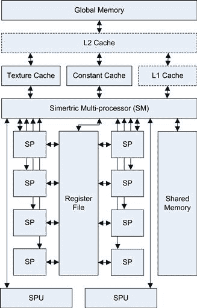

# 第三章

# CUDA 硬件概述

## 计算机架构

让我们从看看我们今天仍在许多 PC 中发现的典型 Core 2 架构开始，看看它如何影响我们使用 GPU 加速器（图 3.1）。

图 3.1 典型的 Core 2 系列布局。

请注意，所有 GPU 设备都通过 PCI-E 总线与处理器连接。在这种情况下，我们假设使用的是 PCI-E 2.0 规范总线，这是当前最快的总线，提供 5 GB/s 的传输速率。在本文写作时，PCI-E 3.0 已经可用，预计将显著提高带宽。

然而，要从处理器获取数据，我们需要通过北桥设备通过较慢的 FSB（前端总线）。FSB 的时钟频率最高可以达到 1600 MHz，尽管在许多设计中，它要慢得多。这通常只有快速处理器时钟频率的三分之一。

内存也是通过北桥访问的，外设则通过北桥和南桥芯片组连接。北桥处理所有高速组件，如内存、CPU、PCI-E 总线连接等。南桥芯片处理较慢的设备，如硬盘、USB、键盘、网络连接等。当然，也可以将硬盘控制器连接到 PCI-E 连接中，实际上，这是在这种系统中获得 RAID 高速数据访问的唯一真正方式。

PCI-E（外设通讯互连快速总线）是一种有趣的总线，因为与其前身 PCI（外设组件互连）不同，它基于保证的带宽。在旧的 PCI 系统中，每个组件可以使用总线的全部带宽，但每次只有一个设备可以使用。因此，添加的卡越多，每个卡能获得的带宽就越少。PCI-E 通过引入 PCI-E 通道解决了这个问题。这些是高速串行连接，可以组合成 X1、X2、X4、X8 或 X16 连接。如今，大多数 GPU 至少使用 PCI-E 2.0 X16 规范，如图 3.1 所示。在这种设置下，我们有一个 5 GB/s 的全双工总线，意味着我们可以在同一时间同时获得相同的上传和下载速度。因此，我们可以向卡传输 5 GB/s，同时从卡接收 5 GB/s。然而，这并不意味着如果我们没有接收任何数据时，我们可以向卡传输 10 GB/s（即带宽不是累积的）。

在典型的超级计算机环境中，甚至在桌面应用中，我们都在处理一个大型数据集。超级计算机可能处理数 PB 的数据。桌面 PC 可能处理少至几个 GB 的高清视频。在这两种情况下，都有大量的数据需要从附加外设中获取。一个单独的 100 MB/s 硬盘将在一分钟内加载 6 GB 的数据。以这个速度，读取一个标准 1 TB 磁盘的全部内容需要两个半小时以上。

如果使用 MPI（消息传递接口），这种接口通常用于集群中，如果以太网连接连接到南桥而不是 PCI-E 总线，则这种安排的延迟可能会相当大。因此，通常使用如 InfiniBand 或 10 Gigabit 以太网卡等专用高速互连，在 PCI-E 总线上。这会占用本可以用于 GPU 的插槽。以前，由于没有直接的 GPU MPI 接口，所有在这种系统中的通信都会通过 PCI-E 总线传输到 CPU 并再返回。CUDA 4.0 SDK 中提供的 GPU-Direct 技术解决了这个问题，现在某些 InfiniBand 卡可以直接与 GPU 通信，而无需先通过 CPU。这一 SDK 更新还允许 GPU 之间的直接通信。

随着 Nehalem 架构的问世，我们看到了一些重大变化。主要的变化是用 X58 芯片组取代了北桥和南桥芯片组。Nehalem 架构带来了 QPI（快速路径互连），这实际上是对 FSB（前端总线）方法的一次重大改进，类似于 AMD 的 HyperTransport。QPI 是一种高速互连，可以用于与其他设备或 CPU 通信。在典型的 Nehalem 系统中，它将连接到内存子系统，并通过 X58 芯片组连接到 PCI-E 子系统（见图 3.2）。QPI 在 Extreme/Xeon 处理器版本中以 4.8 GT/s 或 6.4 GT/s 的速度运行。

图 3.2 Nehalem/X58 系统。

使用 X58 和 1366 处理器插槽时，提供总共 36 条 PCI-E 通道，这意味着最多可以支持两个 X16 模式的卡，或者四个 X8 模式的卡。在 LGA2011 插槽推出之前，这是目前为止为 GPU 机器提供的最佳带宽解决方案。

X58 设计也可以在较低版本的 P55 芯片组中找到，但该版本仅提供 16 条通道。这意味着一个 GPU 卡在 X16 模式下，或者两个 GPU 卡在 X8 模式下。

从 I7/X58 芯片组设计开始，英特尔转向了 Sandybridge 设计，如图 3.3 所示。最显著的改进之一是对 SATA-3 标准的支持，支持 600 MB/s 的传输速率。结合固态硬盘（SSD），这大大提高了加载和保存数据时的输入/输出（I/O）性能。

图 3.3 Sandybridge 设计。

Sandybridge 设计的另一个重大进展是引入了 AVX（高级向量扩展）指令集，这也是 AMD 处理器所支持的。AVX 支持向量指令，可以提供最多四个双精度（256 位/32 字节）宽向量操作。这是一个非常有趣的进展，可以显著加速 CPU 上的计算密集型应用。

然而，需要注意的是，1155 针 Sandybridge 设计的一个大缺点：它仅支持 16 条 PCI-E 通道，将 PCI-E 带宽限制为理论上的 16 GB/s，实际带宽为 10 GB/s。英特尔在其桌面处理器中逐步将更多功能集成到 CPU 中。只有 2011 针 Sandybridge-E（服务器版）才有足够数量的 PCI-E 通道（40 条）。

那么，AMD 与英特尔设计相比如何呢？与英特尔逐渐减少 PCI-E 通道数量不同，除其服务器系列外，AMD 在所有产品中保持了相对稳定。其 FX 芯片组支持两个 X16 设备或四个 X8 PCI-E 设备。AMD3+插槽配合 990FX 芯片组为工作站提供了良好的选择，因为它提供 SATA 6 GB/s 端口，并配有最多四个 X16 PCI-E 插槽（通常以 X8 速度运行）。

英特尔和 AMD 之间的一个主要区别是核心数量的定价。如果只计算真实的处理器核心而忽略逻辑（超线程）核心，那么在相同的价格点上，AMD 设备通常会有更多的核心。然而，英特尔设备的核心性能通常更强。因此，最终取决于您需要支持的 GPU 数量和给定核心的负载水平。

与英特尔设计类似，您会看到系统周围有相似的带宽水平，唯一例外的是主内存的带宽。英特尔在其高端系统上使用三通道或四通道内存，在低端系统上使用双通道内存。AMD 仅使用双通道内存，这导致可用的 CPU 主机内存带宽显著较低（图 3.4）。

图 3.4 AMD。

AMD 芯片组相比英特尔芯片组的一个显著优势是支持最多六个 SATA（串行 ATA）6 GB/s 端口。如果考虑到任何系统中最慢的组件通常会限制整体吞吐量，那么这一点需要特别关注。然而，在使用多个 SSD（固态硬盘）时，SATA3 很容易使南桥的带宽超载。PCI-E 总线解决方案可能是一个更好的选择，但显然需要额外的成本。

## GPU 硬件

GPU 硬件与 CPU 硬件截然不同。图 3.5 展示了从 PCI-E 总线另一端来看多 GPU 系统的概念。

图 3.5 GPU（G80/GT200）显卡的框图。

请注意，GPU 硬件由多个关键模块组成：

• 内存（全局内存、常量内存、共享内存）

• 流处理器（SMs）

• 流处理器（SPs）

这里需要注意的主要一点是，GPU 实际上是由多个 SM 组成的阵列，每个 SM 都有 *N* 个核心（G80 和 GT200 为 8 个，Fermi 为 32–48 个，Kepler 为 8 个以上；见 图 3.6）。这是支持处理器扩展的关键因素。一个 GPU 设备由一个或多个 SM 组成。增加更多的 SM 到设备中，可以使 GPU 同时处理更多的任务，或者在任务中有足够的并行性时，使任务处理更快。

图 3.6 SM 内部结构。

像 CPU 一样，如果程序员编写的代码将处理器的使用限制在 *N* 个核心上，比如说双核，当 CPU 制造商推出四核设备时，用户并不会看到任何性能提升。这正是从双核到四核 CPU 转型时发生的情况，许多软件必须重新编写，以便利用更多的核心。NVIDIA 硬件的性能将通过增加 SM 的数量和每个 SM 的核心数来提升。在设计软件时，需要注意下一代设备可能会增加任一方面的数量。

现在让我们更详细地看看 SM 本身。每个 SM 由多个关键组件构成，然而出于简化原因，图中并没有显示所有组件。最重要的部分是，每个 SM 中都有多个 SP（流处理器）。这里显示了 8 个 SP；在 Fermi 中，这个数量增加到 32–48 个，在 Kepler 中增加到 192 个。没有理由认为下一个硬件版本不会继续增加每个 SM 中的 SP 数量。

每个 SM 都可以访问一个被称为寄存器文件的区域，这类似于一块与 SP 单元运行速度相同的内存，因此在这块内存上的等待时间几乎为零。这块内存的大小随着代际的变化而有所不同。它用于存储在 SP 上运行的线程中使用的寄存器。此外，还有一个仅可由单个 SM 访问的共享内存块；它可以用作程序管理的缓存。与 CPU 缓存不同，程序员完全控制该内存区域，不会有硬件在你背后自动移除缓存数据。

每个 SM 都有一条单独的总线连接到纹理内存、常量内存和全局内存空间。纹理内存是对全局内存的特殊视图，对于需要插值的数据非常有用，例如 2D 或 3D 查找表。它具有硬件级别的插值功能。常量内存用于只读数据，并在所有硬件版本中进行缓存。像纹理内存一样，常量内存仅仅是对主全局内存的一个视图。

全局内存通过 GDDR（图形双倍数据速率）供给，这是一种高性能版本的 DDR（双倍数据速率）内存。内存总线宽度可达到 512 位，带宽比 CPU 上的内存大 5 到 10 倍，Fermi 硬件的带宽最高可达 190 GB/s。

每个 SM（流处理单元）还配备了两个或更多的专用单元（SPUs），用于执行特殊的硬件指令，例如高速的 24 位正弦/余弦/指数运算。GT200 和 Fermi 硬件上也配备了双精度单元。

## CPU 和 GPU

现在你对 GPU 硬件有了一些了解，你可能会说这些都很有趣，但从编程的角度来看，这对我们意味着什么呢？

任何曾经参与过大型项目的人都知道，项目通常被分成几个部分并分配给特定小组。可能有规范小组、设计小组、编码小组和测试小组。每个小组中有了解前后流程的成员，能极大地提升项目的效率。

以测试为例。如果设计师没有考虑到测试，他们就不会在软件中包含任何测试硬件故障的手段。如果测试团队只能通过硬件故障来测试硬件问题，那么他们必须物理上修改硬件以引发故障。这是很困难的。软件人员设计一个标志，反转硬件故障标志，便可以轻松测试故障功能，这就容易得多。作为测试团队的一员，你可能会发现其他方式做起来有多困难，但如果你只关注自己的专业领域，你可能会认为测试不是你的职责。

一些最优秀的工程师是那些能够看到自己工作前后流程的人。作为软件人员，了解硬件如何实际工作总是非常有益的。对于串行代码执行来说，了解事物如何运作可能很有趣，但通常并非必须。绝大多数开发人员从未学习过计算机架构课程或读过相关书籍，这是一个巨大的遗憾。这是我们今天看到如此低效的软件的主要原因之一。我从 11 岁开始学习 BASIC，14 岁时就开始编写 Z80 汇编语言，但直到大学时，我才真正开始深入理解计算机架构。

在嵌入式领域工作，你可以非常深入地接触到硬件。没有像 Windows 这样的操作系统来为你设置处理器。编程是一项非常底层的工作。对于嵌入式应用来说，通常会有数百万个产品发货。代码写得不规范意味着 CPU 和内存的利用效率低下，这可能意味着需要更快的 CPU 或更多的内存。每个产品上多出的 50 美分成本，乘以百万个产品，就是 50 万美元。这意味着大量的设计和编程工作，所以显然，写出更好的代码比购买额外的硬件更具成本效益。

即便是今天，并行编程仍然与硬件密切相关。如果你只想编写代码而不关心性能，那么并行编程实际上是相当简单的。要从硬件中真正获得性能，你需要理解它是如何工作的。大多数人可以在一档的情况下安全缓慢地驾驶汽车，但如果你不知道还有其他档位，或者没有能力切换档位，你就永远无法迅速从 A 点到达 B 点。了解硬件有点像学习如何换手动挡汽车的档位——一开始可能有点棘手，但过一段时间后就会自然而然地掌握。同样的道理，你也可以购买一辆自动挡汽车，相当于使用已经有人编写的硬件低级机制的库。然而，如果没有理解其基本原理，这样做往往会导致次优的实现。

## 计算级别

CUDA 支持多个计算级别。最初的 G80 系列显卡搭载了 CUDA 的第一个版本。计算能力被固定在硬件中。为了升级到更新的版本，用户必须升级硬件。虽然这可能听起来像是 NVIDIA 强迫用户购买更多显卡，但实际上它带来了许多好处。升级计算级别时，通常可以从旧平台迁移到新平台，通常以与原始显卡相似的价格翻倍提升显卡的计算能力。考虑到 NVIDIA 通常每隔几年就会推出一个新平台，到目前为止，我们已经看到了 CUDA 发布几年以来计算能力的巨大增长。

每个计算级别之间的差异完整列表可以在 NVIDIA CUDA 编程指南的附录 G 中找到，该附录作为 CUDA SDK 的一部分随附。因此，我们将只讨论每个计算级别之间的主要区别，也就是作为开发者需要了解的内容。

### 计算 1.0

计算能力 1.0 出现在较旧的显卡中，例如最初的 8800 Ultra 以及许多 8000 系列显卡和 Tesla C/D/S870s。计算 1.0 显卡缺少的主要功能是原子操作。原子操作是指我们能够保证一个完整操作不会被其他线程中断的操作。实际上，硬件在原子操作入口处实现了一个屏障点，并保证操作（加法、减法、最小值、最大值、逻辑与、或、异或等）作为一个完整的操作被执行。计算 1.0 显卡现在实际上已经过时，因此这一限制从实际角度来看可以忽略不计。

### 计算 1.1

计算能力 1.1 出现在许多后期发布的 9000 系列显卡中，如 9800 GTX，这些显卡曾非常受欢迎。这些显卡基于 G92 硬件，而不是计算 1.0 设备的 G80 硬件。

引入计算 1.1 设备的一个主要变化是，许多设备（但不是所有设备）支持重叠的数据传输和内核执行。SDK 调用 `cudaGetDeviceProperties()` 返回 `deviceOverlap` 属性，该属性定义了此功能是否可用。这为一个非常好且重要的优化提供了支持，称为双缓冲，它的工作原理如 图 3.7 所示。

图 3.7 单 GPU 的双缓冲。

使用这种方法，我们需要的内存空间是正常使用内存的两倍，如果目标市场的显卡只有 512 MB，这可能是一个问题。然而，使用主要用于科学计算的 Tesla 卡，你可以拥有最多 6 GB 的 GPU 内存，这使得这些技术非常有用。让我们看看会发生什么：

**周期 0：** 在 GPU 内存空间中分配了两个内存区域后，CPU 填充第一个缓冲区。

**周期 1：** 然后，CPU 在 GPU 上调用 CUDA 内核（GPU 任务），并立即返回到 CPU（非阻塞调用）。然后，CPU 获取下一个数据包，无论是来自磁盘、网络还是其他地方。与此同时，GPU 正在后台处理提供的数据包。当 CPU 准备好时，它开始填充另一个缓冲区。

**周期 2：** 当 CPU 填充完缓冲区后，它调用一个内核来处理缓冲区 1。然后它检查周期 1 中处理缓冲区 0 的内核是否已完成。如果没有，它会等待该内核完成，然后从缓冲区 0 中获取数据，并将下一个数据块加载到同一缓冲区中。在此期间，在周期开始时启动的内核正在 GPU 上处理缓冲区 1 中的数据。

**周期 *N*：** 然后我们重复周期 2，交替在 CPU 上读取和写入哪个缓冲区，同时 GPU 上正在处理的缓冲区。

GPU 到 CPU 和 CPU 到 GPU 的数据传输是通过相对较慢（5 GB/s）的 PCI-E 总线进行的，这种双缓冲方法在很大程度上隐藏了这种延迟，并保持 CPU 和 GPU 都在忙碌。

### 计算 1.2

计算 1.2 设备出现在低端的 GT200 系列硬件中。这些是最初的 GTX260 和 GTX280 显卡。通过 GT200 系列硬件，NVIDIA 大约将单张卡上的 CUDA 核心处理器数量翻倍，通过将卡上的多处理器数量翻倍。我们稍后将讨论 CUDA 核心和多处理器。实际上，这使得这些卡的性能相较于之前的 G80/G92 系列翻倍。

除了将多处理器的数量翻倍外，NVIDIA 还将单个多处理器可以执行的并发 Warp 数量从 24 增加到 32。Warp 是在多处理器内执行的代码块，增加每个多处理器可用的 Warp 数量为我们提供了更大的空间，以便获得更好的性能，我们稍后会探讨这一点。

在 compute 1.0 和 compute 1.1 设备中，关于全局内存的合并访问限制和共享内存中的银行冲突问题得到极大减少。这使得 GT200 系列硬件编程变得更加容易，并且大大提高了许多先前编写不当的 CUDA 程序的性能。

### Compute 1.3

Compute 1.3 设备是在 GT200 硬件的 GT200 a/b 版本发布时推出的。这一变化紧接着 GT200 系列的首次发布。几乎所有当时的高端卡都兼容 compute 1.3。

在 compute 1.3 硬件中，主要的变化是引入了对有限双精度计算的支持。GPU 主要面向图形处理，在这方面，对于快速的单精度计算有巨大的需求，但对于双精度计算的需求相对较小。通常，在进行双精度运算时，性能会比单精度运算下降一个数量级，因此应该考虑是否有办法使用单精度运算以最大限度地发挥硬件性能。在许多情况下，可以使用单精度和双精度运算的混合方式，这是理想的选择，因为它利用了硬件中专门的单精度和双精度硬件。

### Compute 2.0

Compute 2.0 设备采用了 Fermi 硬件架构。调优 Fermi 架构应用程序的原始指南可以在 NVIDIA 官网找到，链接为：[`developer.nvidia.com/cuda/nvidia-gpu-computing-documentation`](http://developer.nvidia.com/cuda/nvidia-gpu-computing-documentation)。

Compute 2.x 硬件的一些主要变化如下：

• 每个 SP 引入了 16K 到 48K 的 L1 缓存。

• 引入了所有 SM 共享的 L2 缓存。

• 在基于 Tesla 的设备中支持 ECC（错误校正码）内存检查和错误修正。

• 在基于 Tesla 的设备中支持双副本引擎。

• 每个 SM 的共享内存从 16K 扩展到 48K。

• 为了实现最佳的数据合并，数据必须是 128 字节对齐的。

• 共享内存的银行数从 16 增加到 32。

让我们详细看看这些变化的影响。首先，我们来看看 L1 缓存的引入及其含义。L1（一级）缓存是设备上存在的缓存类型，是最快的缓存类型。Compute 1.x 硬件没有缓存，除了纹理和常量内存缓存。引入缓存使得许多程序员编写能够在 GPU 硬件上良好运行的程序变得更加容易。它还允许应用程序在编译时无法预知内存访问模式的情况下运行。然而，要充分利用缓存，应用程序需要具有顺序的内存访问模式，或者至少需要一定的数据重用。

在 Fermi 中，L2 缓存的最大大小为 768 K，重要的是，它是一个统一缓存，这意味着它是共享的，并为所有 SM 提供一致的视图。这允许通过全局原子操作进行更快的跨块通信。与需要访问 GPU 上的全局内存相比，使用共享缓存要快一个数量级。

ECC 内存的支持是数据中心的必需项。ECC 内存提供自动错误检测和更正功能。电子设备会发出少量辐射。当它们靠近其他设备时，这些辐射可能会改变其他设备内存单元的内容。尽管这种情况发生的概率很小，但随着设备密集地堆放在数据中心中，设备的暴露度增加，出现问题的概率也会升高到不可接受的水平。因此，ECC 可以检测和更正你在大型数据中心中可能遇到的单比特错误。这样做会减少可用的 RAM，并对内存带宽产生负面影响。由于这是显卡的一个主要缺点，ECC 仅在 Tesla 产品中提供。

双复制引擎使你可以将之前查看的双缓冲示例扩展到使用多个流。流是我们稍后会详细讨论的一个概念，但基本上，它们允许多个独立的内核按流水线方式执行，如图 3.8 所示。

图 3.8 流管道化。

注意图中内核部分是如何一个接一个运行的。复制操作被另一个流上内核的执行所隐藏。内核和复制引擎并行执行，从而最大化了相关单元的使用。

请注意，双复制引擎几乎在所有高端 Fermi GPU 上都可以使用，例如 GTX480 或 GTX580 设备。然而，只有 Tesla 卡才会使这两个引擎对 CUDA 驱动程序可见。

共享内存也发生了剧烈变化，它被转换为一个合并的 L1 缓存。L1 缓存的大小是 64 K。然而，为了保持向后兼容性，必须分配至少 16 K 给共享内存，这意味着 L1 缓存的实际大小只有 48 K。通过一个开关，共享内存和 L1 缓存的使用可以互换，从而提供 48 K 的共享内存和 16 K 的 L1 缓存。从 16 K 共享内存增加到 48 K 共享内存对于某些程序来说是一个巨大的好处。

由于引入了 L1 和 L2 缓存，最佳使用的对齐要求比以前的版本更为严格。两者的缓存行大小都是 128 字节。缓存行是内存可以提取的*最小*数据量。因此，如果你的程序提取数据的后续元素，这样的方式效果非常好。这通常是大多数 CUDA 程序的做法，线程组会提取相邻的内存地址。由此变化产生的唯一要求是数据集必须进行 128 字节对齐。

然而，如果你的程序每个线程有稀疏且分布式的内存模式，你需要禁用此功能并切换到 32 位的缓存操作模式。

最后，我们要提到的一个主要变化是共享内存银行从 16 位增加到 32 位。这是相较于上一代的一项重大改进。它允许当前 warp（32 个线程）中的每个线程写入共享内存中恰好一个 32 位的内存银行，而不会造成共享银行冲突。

### Compute 2.1

Compute 2.1 出现在一些专门面向游戏市场的设备上，比如 GTX460 和 GTX560。这些设备的架构变更如下：

• 每个 SM 有 48 个 CUDA 核心，而不是通常的每个 SM 有 32 个 CUDA 核心。

• 每个 SM 有八个单精度特殊功能单元用于处理超越函数，而不是通常的四个。

• 双 warp 调度器，而不是通常的单 warp 调度器。

x60 系列显卡在中端游戏市场一直有着非常高的渗透率，因此，如果你的应用面向消费市场，了解这些变化的影响是非常重要的。

在 compute 2.1 硬件上，显著不同的是为了增加 CUDA 核心数而牺牲了双精度硬件。对于单精度和整数计算主导的内核，这是一个不错的折衷。大多数游戏几乎不使用双精度浮点数据，但会大量使用单精度浮点和整数计算。

warp 是线程的组，我们将在后面详细讨论。在 compute 2.0 硬件上，单个 warp 调度器需要两个时钟周期来调度整个 warp 的指令。在 compute 2.1 硬件上，我们现在有四个调度器，而不是通常的两个调度器（每两个时钟周期一个调度器）。在硬件中，有三组 16 个 CUDA 核心的银行，总共 48 个 CUDA 核心，而不是通常的两组 16 个 CUDA 核心。如果 NVIDIA 能够再加一个 16 个 CUDA 核心的组，那就会有一个理想的解决方案。也许我们在未来的硬件中会看到这一点。

Compute 2.1 硬件实际上是一种超标量方法，类似于从原始 Pentium CPU 开始的 CPU 架构。为了充分利用所有核心，硬件需要在*单个*线程中识别指令级并行性（ILP）。这与过去推荐的线程级并行性（TLP）方法有显著差异。为了实现 ILP，必须有相互独立的指令。一种最简单的方式是通过本书后面会介绍的特殊向量类来实现。

Compute 2.1 硬件的性能有所不同。一些著名的应用程序，如 Folding at Home，在 compute 2.1 硬件上表现非常好。而其他应用程序，如视频编码软件，由于更难提取指令级并行性（ILP），并且内存带宽是一个关键因素，通常表现较差。

凯普勒（Kepler）和新的计算 3.0 平台的最终细节，在本文写作时，仍然大部分未发布。关于已经公布的凯普勒特性，讨论内容可以在第十二章中找到，位于“面向未来 GPU 的开发”一节。
