# 第四章：设置 CUDA

## 介绍

本章为那些完全不了解 CUDA 的人提供帮助。我们将介绍如何在不同操作系统上安装 CUDA、可以使用的工具以及 CUDA 如何进行编译。最后，我们会看看如何利用 API 帮助你识别每个人都会犯的编码和 API 错误。

CUDA 支持三个主要操作系统：Windows、Mac 和 Linux。到目前为止，最容易使用和学习 CUDA 的平台是你最熟悉的编程开发操作系统。对于完全的初学者，Windows 操作系统配合 Microsoft Visual C++可能是最佳选择。Windows 和 Mac 的安装过程都相当简单，只需点击几下即可。两者都提供了相当标准的集成开发环境，能够很好地与 CUDA 配合使用。

## 在 Windows 下安装 SDK

要在运行 Windows 的 PC 上安装 CUDA，你需要从 NVIDIA 开发者门户网站下载以下组件，网址为[*http://developer.nvidia.com/cuda-toolkit-41*](http://developer.nvidia.com/cuda-toolkit-41)。需要注意的是，本书发布时，CUDA 工具包的第 5 个版本已经进入候选发布阶段。请访问 NVIDIA 官网查看最新版本。

你需要预先安装 Microsoft Visual Studio 2005、2008 或 2010 版本。第一步是从上述链接下载并安装适用于你操作系统的最新 NVIDIA 开发驱动。接下来，你需要下载 32 位或 64 位版本的 CUDA 工具包、GPU 计算以及 SDK 代码示例。确保选择与你的操作系统兼容的版本。按照以下顺序进行安装：

1. NVIDIA 开发驱动

2. CUDA 工具包

3. CUDA SDK

4. GPU 计算 SDK

5. Parallel Nsight 调试器

在 Windows 7 下，SDK 会将所有文件安装到“ProgramData”文件夹中，这是 C 盘中的一个隐藏目录。要查看这些文件，你需要始终通过桌面上创建的 CUDA SDK 图标来访问，或者进入 Windows 的“文件夹选项”，并设置显示隐藏文件（见图 4.1）。

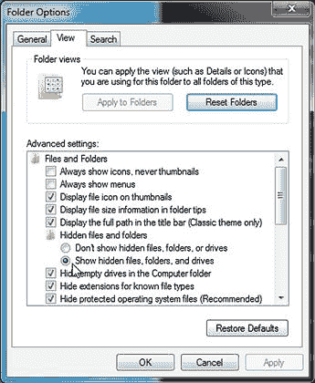

图 4.1 “文件夹选项”以查看隐藏文件。

## Visual Studio

CUDA 支持从 2005 年到 2010 年的 Visual Studio 版本，包括大部分的 express 版本。express 版本可以从 Microsoft 官方网站免费获得。专业版本也可以通过 DreamSpark 计划免费提供给注册学生，访问地址为[*https://www.dreamspark.com*](https://www.dreamspark.com)。

要注册，你只需要提供你的大学或学院的详细信息和身份证明号码，就可以下载 Visual Studio 以及许多其他编程工具。这个计划不仅限于美国的学术机构，全球的学生都可以使用。

总体而言，Visual Studio 2008 对 CUDA 的支持最好，并且比 Visual Studio 2010 编译速度稍快。然而，Visual Studio 2010 有一个非常有用的功能，即自动语法检查源代码。因此，如果你使用了未定义的类型，它会像 Microsoft Word 一样将错误用红色下划线标出。这是一个非常有用的功能，因为它可以节省很多因为明显问题而不必要的编译周期。因此，我推荐 2010 版本，特别是如果你可以通过 DreamSpark 免费下载安装的话。

### 项目

创建项目的一种快速方法是取一个 SDK 示例，删除所有不必要的项目文件，并插入你自己的源文件。请注意，你的 CUDA 源代码应该有“.cu”扩展名，这样它会被 NVIDIA 编译器编译，而不是 Visual C。不过，正如我们稍后所看到的，你也可以简单地使用项目模板向导创建一个基本的项目框架。

### 64 位用户

在使用 Windows 64 位版本时，请注意，一些项目文件默认设置为作为 32 位应用程序运行。因此，当你尝试构建它们时，可能会收到错误信息：致命错误 LNK1181：无法打开输入文件‘cutil32D.lib’。

这未被安装，因为你很可能只安装了 64 位版本的 SDK 和 64 位版本的 Windows。为了解决这个问题，我们只需将目标从 64 位设置为 32 位，方法是通过 Visual Studio 中的“生成”菜单，然后将平台更改为 X64，如图 4.2 所示。

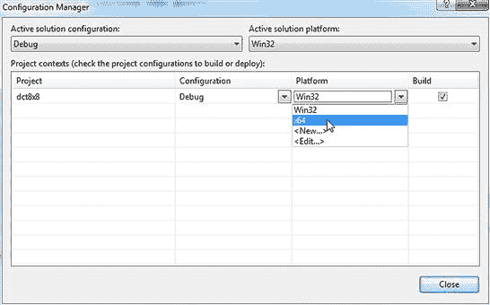

图 4.2 Visual C 平台选择。

当你启动重建时，系统可能会提示你保存项目。只需在项目名称后添加“_X86”并保存。然后，项目将在 64 位环境下构建并链接到正确的库文件。

你可能还会遇到缺少库的问题，例如“cutil32.lib”。当 SDK 安装时，它会设置一个环境变量`$(CUDA_LIB_PATH)`。通常这个变量的值为：C:\Program Files\NVIDIA GPU Computing Toolkit\CUDA\v4.1\lib\X64。

你可能会发现默认项目文件中的路径设置没有将`$(CUDA_LIB_PATH)`作为其中之一。要添加它，请点击项目，然后选择“项目→属性”。这将弹出如图 4.3 所示的对话框。

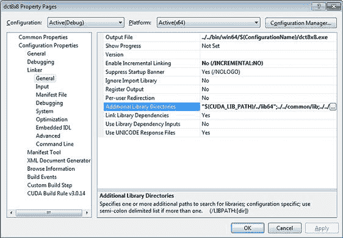

图 4.3 额外的库路径。

点击最右侧的“…”按钮会弹出一个对话框，你可以在其中添加库路径（图 4.4）。只需将“$(CUDA_LIB_PATH)”作为新的一行添加，项目应该就可以链接了。

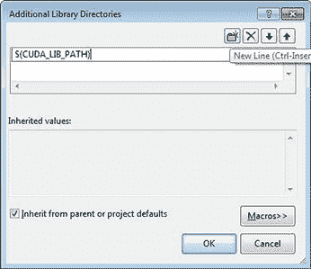

图 4.4 添加库目录。

如果您希望构建 64 位和 32 位的 CUDA 应用程序，则需要同时安装 32 位和 64 位 CUDA 工具包。SDK 中的示例也要求安装 32 位和 64 位版本的 SDK，以便能够构建 32 位和 64 位版本的示例。

您可以通过访问以下目录并构建解决方案文件来构建所需的库：

C:\ProgramData\NVIDIA Corporation\NVIDIA GPU Computing SDK 4.1\C\common

C:\ProgramData\NVIDIA Corporation\NVIDIA GPU Computing SDK 4.1\shared

您可以在以下位置找到所需的库

C:\ProgramData\NVIDIA Corporation\NVIDIA GPU Computing SDK 4.1\C\common\lib\X64。

您也可以手动将这些库添加到任何缺少它们的项目中。不幸的是，SDK 示例没有设置自动构建必要库的功能。库的二进制文件也没有提供，这使得构建 SDK 示例变得有些令人沮丧。

### 创建项目

要创建一个新的 CUDA 启用应用程序，只需使用“文件→新建→项目向导”创建一个 CUDA 应用程序，如图 4.5 所示。向导将创建一个包含文件“kernel.cu”的单一项目，文件中包含一部分在 CPU 上执行的代码和一部分在 GPU 上执行的代码。GPU 代码包含在`addKernel`函数中。此函数简单地接受指向目标数组`c`的指针，以及指向两个输入数组`a`和`b`的指针。然后，它将`a`和`b`数组的内容相加，并将结果存储在目标数组`c`中。这是执行 CUDA 程序所需框架的一个非常简单的示例。

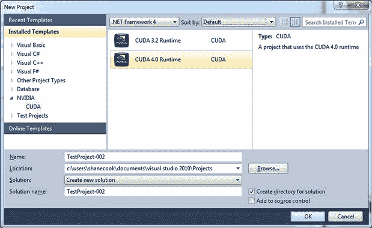

图 4.5 CUDA 项目向导。

还包含了将数据复制到设备、调用内核并将数据从设备复制回主机的基本代码。这是一个非常有用的起始项目，可以帮助您在 CUDA 下进行编译。我们将在后面的文字中介绍使 CUDA 程序正常工作的标准框架。查看代码并尝试理解它是很有帮助的。如果您能理解的话，但在这个阶段，如果它不太明白也不用担心，我们会逐步介绍如何编写 CUDA 程序。

## Linux

CUDA 支持以下 Linux 发行版。支持的版本将根据您安装的 CUDA 工具包版本而有所不同。

• Fedora 14

• Redhat 6.0 和 5.5/CentOS 6.2（Redhat 的免费版本）

• Ubuntu 11.04

• OpenSUSE 11.2

在 Linux 平台上安装 CUDA 的第一步是确保您拥有最新版本的内核软件。可以在终端窗口中使用以下命令进行操作：

```cpp
sudo yum update
```

`sudo`命令将以管理员身份登录。`yum`命令是 Linux RPM 包的标准安装工具。你只是让它检查所有已安装的软件包，并查看是否有更新可用。这可以确保在安装任何驱动程序之前，你的系统已完全更新。许多基于 GUI 的安装也有 GUI 版本的软件更新，取代了较旧的命令行更新界面。

一旦内核更新到最新版本，运行以下命令：

`sudo yum install gcc-c++ kernel-devel`

这将安装标准的 GNU C++环境以及你需要重建内核的内核源代码。请注意，软件包名称区分大小写。这将提示你进行大约 21MB 的下载，并花费几分钟时间安装。如果你愿意，也可以通过特定操作系统的 GUI 软件安装程序安装此软件包。

最后，由于你可能需要绘制一些图形输出，你需要一个 OpenGL 开发环境。使用以下命令安装：

```cpp
sudo yum install freeglut-devel libXi-devel libXmu-devel
```

现在你准备好安装 CUDA 驱动程序了。确保你安装至少版本为 4.1 的 CUDA 工具包。有多种方法可以安装更新的 NVIDIA 驱动程序。NVIDIA 没有发布驱动程序的源代码，因此默认情况下，大多数 Linux 发行版会安装一个非常基础的图形驱动程序。

### 内核基础驱动程序安装（CentOS，Ubuntu 10.4）

CUDA 发布版本应与特定的*开发*驱动程序一起使用。通过其他方式安装驱动程序可能会导致 CUDA 无法正常工作。请注意，给定版本的 CUDA 工具包支持的操作系统版本。这些可能不是特定 Linux 发行版的最新版本。使用更新的发行版可能*无法*正常工作。因此，第一步安装是用适合你特定 Linux 发行版的版本替换现有的驱动程序。请参见图 4.6。

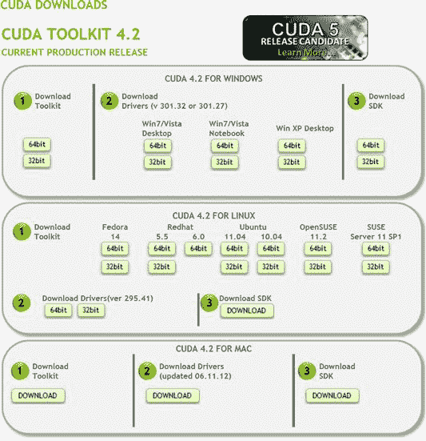

图 4.6 支持的 Linux 下载和截至 2012 年 9 月的支持驱动程序版本。

下载完成后，你需要以文本模式启动 Linux。与 Windows 不同，Windows 始终处于图形模式，Linux 安装驱动程序时需要文本模式。你可以通过终端窗口（通常位于 GUI 的系统菜单下）使用以下命令让系统启动到文本模式：

```cpp
sudo init 3
```

这将重启 Linux 机器，并以文本模式重新启动。你可以稍后使用`sudo init 5`恢复图形模式。

如果出现类似“User <user_name> is not in sudoers file”的错误，使用`su`命令以 root 身份登录。编辑“/etc/sudoers”文件并附加以下行：

```cpp
your_user_name ALL=(ALL) ALL
```

小心将`your_user_name`替换为你的登录名。

某些发行版（例如 Ubuntu）坚持使用 GUI 启动，无论 `init` 模式如何。解决方法之一是通过文本窗口进行操作。编辑 grub 启动文件：

```cpp
sudo chmod +w /etc/default/grub
sudo nano /etc/default/grub
```

修改以下几行：

```cpp
GRUB_CMDLINE_LINUX_DEFAULT="quiet splash"
GRUB_CMDLINE_LINUX_DEFAULT=""
```

到

```cpp
# GRUB_CMDLINE_LINUX_DEFAULT="quiet splash"
```

`GRUB_CMDLINE_LINUX_DEFAULT="text"`

现在使用以下命令更新 grub：

```cpp
sudo update-grub
```

最后，重启你的机器，它应该会以文本模式启动。一旦驱动程序安装完成，使用原始命令再次启动到 GUI 模式。

现在进入你存放从 NVIDIA 网站下载的“.run”文件的目录。然后输入

`sudo sh NVIDIA-Linux-x86_64-285.05.33.run`

你下载的驱动版本当然会有所不同。你将被要求同意 NVIDIA 的许可协议，然后需要等待几分钟，直到所有内容安装完成。在此过程中，安装程序会尝试将默认的 Nouveau 驱动替换为所需的 NVIDIA 驱动。如果安装程序询问是否要执行此操作，选择“是”。这是一个容易出错的过程，并不是所有的发行版都能开箱即用。如果 NVIDIA 安装程序无法删除 Nouveau 驱动，那么可能需要将其加入黑名单，以便 NVIDIA 安装程序可以安装正确的驱动。

当你正确安装 NVIDIA 驱动程序后，输入

```cpp
sudo init 5
```

机器随后将重新启动进入常规的图形模式。有关 Ubuntu 的内容请参见前文。

下一步是安装工具包。根据你的发行版，有多个可选工具包—选择 Fedora、Red Hat、Ubuntu、OpenSUSE 或 SUSE。如前所述，只需导航到你安装 SDK 的目录并运行它，输入

```cpp
sudo sh <sdk_version>.run
```

其中 `<sdk_version>` 是你下载的文件。接下来，它将安装所有所需的工具，并打印一条消息，表示安装成功。然后，它会提到你需要手动更新 `PATH` 和 `LD_LIBRARY_PATH` 环境变量。为此，你需要编辑“/etc/profile”启动文件。添加以下几行：

```cpp
export PATH=/usr/local/cuda/bin:$PATH
export LD_LIBRARY_PATH=/usr/local/cuda/lib:$LD_LIBRARY_PATH
```

请注意，文件必须具有写入权限。如果需要，可以使用“sudo chmod +w /etc/profile”使其可写。你可以使用喜欢的编辑器编辑该文件，例如使用“sudo nano /etc/profile”命令。

现在登出并重新登录，然后输入

```cpp
env
```

这将列出所有当前的环境变量设置。检查你刚刚修改的两个新条目。CUDA 现在已安装到“/usr/local/bin”目录中。

接下来，我们需要安装 GNU C++ 编译器。从你系统中使用的任何软件安装器安装“g++”包。

下一步是安装 SDK 示例代码，这样我们就有东西可以构建和测试了。从 NVIDIA 网站下载这些示例并运行它们，再次使用 `sh sdk_version.run` 命令（将 `sdk_version` 替换为你下载的实际版本）。*不要*以 root 用户身份运行此安装，否则你将必须以 root 用户登录才能构建任何示例。

默认情况下，SDK 会安装到用户账户区域的子目录中。它可能会抱怨找不到 CUDA 安装，并使用默认目录（即之前安装 CUDA 时使用的目录）。您可以安全地忽略此消息。

安装完 GPU 计算 SDK 后，您需要进入“Common”子目录，并运行 `make` 以创建一组库。

完成上述步骤后，SDK 示例应该能正常构建，您可以在 Linux 中执行您的第一个 CUDA 程序，并检查驱动程序是否正常工作。

## Mac

Macintosh 版本可在 [*http://developer.nvidia.com/cuda-toolkit-41*](http://developer.nvidia.com/cuda-toolkit-41) 处下载，与其他版本一样。只需按以下顺序下载并安装软件包：

• 开发驱动程序

• CUDA 工具包

• CUDA 工具 SDK 和代码示例

CUDA 4.1 需要 Mac OS 版本 10.6.8（Snow Leopard）或更高版本。最新版本（10.7.x）或 Lion 版本可以从 Apple Store 下载，或通过单独购买获取。

SDK 安装到“Developer”高层目录下的“GPU Computing”目录中。只需浏览“Developer/GPU Computing/C/bin/darwin/release”目录，您将找到预编译的可执行文件。运行 `deviceQuery` 工具可以帮助验证驱动程序和运行时环境是否正确安装。

要编译示例，您需要安装 XCode。它是 Mac 系统中类似于 GCC（GNU C 编译器）的工具。XCode 可以从 Apple Store 下载。虽然这不是免费的产品，但对任何在 Apple Developer 程序中的用户来说，XCode 是免费的，该程序包括 Mac 和 iPhone/iPad 应用的开发。此外，它在 Lion OS 发布后不久，作为免费的下载供 Lion OS 用户使用。

安装 XCode 后，只需打开一个终端窗口。操作步骤是：打开 Finder，进入 Utilities 文件夹，然后双击 Terminal 窗口。输入以下命令：

```cpp
cd /Developer/’GPU Computing/C/src/project’
make–i
```

将 `project` 替换为您希望编译的特定 SDK 应用程序的名称。如果收到编译错误，说明您未下载 XCode 包或安装的版本较旧。

## 安装调试器

CUDA 提供了一种名为 Parallel Nsight 的调试环境，适用于 Windows 平台。它支持调试 CPU 和 GPU 代码，并突出显示效率较低的地方。它在调试多线程应用程序时也非常有帮助。

Nsight 完全免费，并且是一个极为有用的工具。它要求您注册为 CUDA 注册开发者，注册过程同样完全免费。注册后，您可以从 NVIDIA 网站下载该工具。

请注意，您必须安装 Visual Studio 2008 或更高版本（非简化版），并且必须安装 Service Pack 1。在 Nsight 的发布说明中，有一个链接指向您需要安装的 SP1 下载。

Parallel Nsight 分为两部分，一部分是集成到 Visual Studio 中的应用程序，如图 4.7 所示，另一部分是独立的监视应用程序。监视应用程序与主应用程序协同工作。监视器通常驻留在与 Visual Studio 环境相同的机器上，但也不一定非要如此。Parallel Nsight 最佳配置是两块支持 CUDA 的 GPU，一块用于运行代码，另一块作为常规显示使用。因此，运行目标代码的 GPU 不能用于驱动第二个显示器。由于大多数 GPU 卡具有双显示输出，如果你有双显示器设置，可以简单地使用显示卡来连接两个显示器。注意，在最新的 2.2 版本中，不再要求使用两块 GPU。

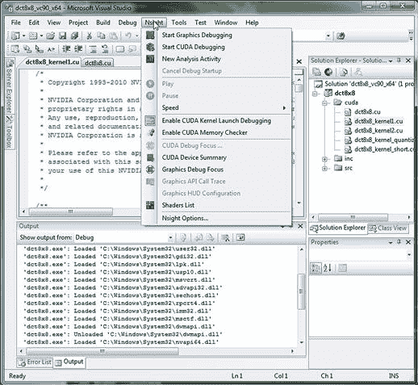

图 4.7 Nsight 集成到 Microsoft Visual Studio 中。

也可以设置工具从远程 GPU 获取数据。然而，在大多数情况下，购买一块低端 GPU 并将其安装到你的 PC 或工作站中更为简单。在 Windows 上设置 Parallel Nsight 的第一步是禁用 TDR（图 4.8）。TDR（超时检测与恢复）是 Windows 中的一种机制，用于检测驱动程序级代码中的崩溃。如果驱动程序停止响应事件，Windows 将重置驱动程序。由于在定义断点时驱动程序会停止，因此需要禁用此功能。

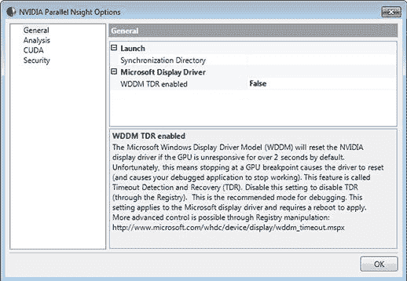

图 4.8 禁用 Windows 内核超时。

要设置该值，只需运行监视器并点击监视器对话框右下角的“Nsight Monitor Options”超链接。这将打开图 4.8 所示的对话框。设置“WDDM TDR 启用”将修改注册表以禁用此功能。重启你的 PC，Parallel Nsight 将不再警告 TDR 已启用。

要在远程机器上使用 Parallel Nsight，只需在远程 Windows PC 上安装监视器包。当你第一次运行监视器时，它会警告你 Windows 防火墙阻止了对监视器的“公共网络”（基于 Internet）访问，这正是你所希望的。然而，工具需要访问本地网络，因此需要允许此防火墙规则例外。与本地节点一样，安装后你还需要解决 TDR 问题并重启。

下一步是在主机 PC 上运行 Visual Studio，并选择一个新的分析活动。你会看到窗口顶部附近有一个部分，类似于图 4.9。注意，“连接名称”显示为`localhost`，这意味着你的本地机器。打开 Windows 文件资源管理器并浏览本地网络，查看你想要用来进行远程调试的 Windows PC 的名称。将`localhost`替换为在 Windows 文件资源管理器中显示的名称。然后点击“连接”按钮。你应该会看到两次确认，表明连接已建立，如图 4.10 所示。

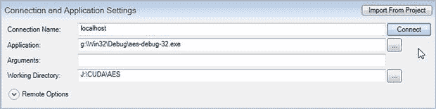

图 4.9 Parallel Nsight 远程连接。

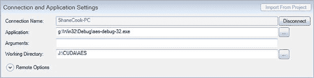

图 4.10 Parallel Nsight 远程连接状态。

首先，“连接”按钮会变成“断开连接”。其次，“连接状态”框应该变为绿色，并显示目标机器上的所有可用 GPU（图 4.11）。在这种情况下，我们正在连接到一台测试 PC，测试机上安装了五张 GTX470 GPU 卡。

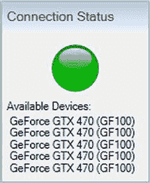

图 4.11 Parallel Nsight 连接状态。

点击“应用程序控制”面板上位于“连接状态”面板旁边的“启动”按钮将远程启动目标机器上的应用程序。不过，在此之前，所有必要的文件需要被复制到远程机器。这大约需要几秒钟，但这一切都是自动完成的。总体来说，这是分析/调试远程应用程序的一个非常简单的方法。

如果你有一台笔记本电脑并希望调试或仅仅是远程运行将在 GPU 服务器上运行的应用程序，你可能希望以这种方式设置 Parallel Nsight。例如，这种用法包括当 GPU 服务器或服务器被多人在不同时间共享使用时，比如教学课程。你也可能有远程开发者需要在特别设置的测试服务器上运行代码，可能是因为这些服务器还包含大量数据，将数据传输到本地开发机器并不实际或不可取。这也意味着你不需要在每一台远程服务器上安装 Visual C++。

在 Linux 和 Mac 系统上，调试器环境是 CUDA-GDB。这提供了一个扩展的 GNU 调试器包。与 Parallel Nsight 一样，它允许调试主机和 CUDA 代码，包括在 CUDA 代码中设置断点、单步调试、选择调试线程等。CUDA-GDB 和 Visual Profiler 工具在安装 SDK 时默认安装，而不是像 Parallel Nsight 那样需要单独下载。自 2012 年起，Parallel Nsight 也在 Linux 的 Eclipse 环境下发布。

Windows 和 Mac/Linux 之间的主要区别在于分析工具的支持。Parallel Nsight 在这方面远远优于 Visual Profiler。Visual Profiler 在 Windows 上也可以使用。它提供了一个相当高层次的概览，并给出关于代码中需要关注的地方的建议，因此非常适合刚开始使用 CUDA 的用户。相比之下，Parallel Nsight 面向的是更为高级的用户。我们将在后续章节中讨论 Parallel Nsight 和 Visual Profiler 的使用。不过，本书的重点是将 Parallel Nsight 作为 GPU 开发的主要调试/分析工具。

对于高级 CUDA 开发，我强烈建议使用 Parallel Nsight 进行调试和分析。对于大多数 CUDA 新手来说，Visual Profiler 和 CUDA-GDB 的组合足以支持开发工作。

## 编译模型

NVIDIA 编译器 NVCC 在后台运行，当需要编译一个 CUDA 源文件时会被调用。表 4.1 中展示的文件扩展名用于定义文件类型，区分 CUDA 源文件和常规源文件。这决定了将调用哪个编译器：NVCC 还是主机编译器。

表 4.1 不同的 CUDA 文件类型

| 文件扩展名 | 含义 | 处理工具 |
| --- | --- | --- |
| .cu | 混合主机和设备源文件。 | NVCC |
| .cup | .cu 文件的预处理扩展版本。 | NVCC |
| .c, .cc, .cpp | 主机 C 或 C++ 源文件。 | 主机编译器 |
| .ptx, .gpu | 中间虚拟汇编文件。 | NVCC |
| .cubin | GPU 代码的二进制镜像。 | NVCC |

生成的可执行文件，或称为 fat binary，包含针对不同 GPU 代际的一个或多个二进制可执行镜像。它还包含一个 PTX 镜像，使得 CUDA 运行时可以进行即时（JIT）编译。这非常类似于 Java 字节码，其中目标是虚拟架构，并在程序调用时编译为实际的目标硬件。只有当可执行文件不包含与当前使用的 GPU 完全相同的二进制镜像时，才会进行 PTX 的 JIT 编译。因此，所有未来的架构都向下兼容基本的虚拟架构。即使是程序没有为其编译的 GPU，也会通过在运行时编译嵌入可执行文件中的 PTX 代码来执行遗留 GPU 代码。

就像 Java 一样，支持代码仓库。定义环境变量 `CUDA_DEVCODE_CACHE` 指向一个目录，将导致运行时保存已编译的二进制文件以供以后使用，从而避免每次调用时都需要为未知的 GPU 变种编译 PTX 代码而产生的启动延迟。

我们将在后续章节中讲解如何查看实际的目标汇编代码，即 PTX 到目标翻译的结果。

## 错误处理

CUDA 中的错误处理和 C 语言一样，并没有做到最好。运行时检查很少，如果你做了些愚蠢的事，运行时通常会允许它。这导致 GPU 程序可能会异常退出。如果你幸运的话，可能会收到一个错误信息，像编译器错误一样，你会随着时间的推移学会如何解读这些错误信息。

几乎所有的 CUDA 函数调用都返回错误类型 `cudaError_t`，它只是一个整数值。任何非 `cudaSuccess` 的值都表示发生了致命错误。通常这是因为你的程序在使用之前没有正确设置某些内容，或者在对象被销毁后仍然使用它。它也可能是由于 Microsoft Windows 中存在的 GPU 内核超时问题引起的，如果内核运行超过几秒钟，并且在安装像 Parallel Nsight 这样的工具时没有禁用此功能（见前一节）。越界的内存访问可能会生成异常，通常会将各种错误信息打印到 `stderr`（标准错误输出）。

由于每个函数都返回一个错误代码，因此每个函数调用都必须检查并编写一些处理程序。这会导致非常繁琐且高度缩进的编程。例如，

```cpp
if (cudaMalloc(…) == cudaSuccess)
{
 if (cudaEventCreate(&event) == cudaSucess)
 {
 …
 }
}
else
{
…
}
```

为了避免这种重复的编程，本书中将使用以下宏定义来进行 CUDA API 的调用：

```cpp
#define CUDA_CALL(x) {const cudaError_t a = (x); if (a != cudaSuccess) { printf("\nCUDA Error: %s (err_num=%d) \n", cudaGetErrorString(a), a); cudaDeviceReset(); assert(0);} }
```

这个宏的作用是允许你指定 `x` 为某个函数调用，例如，

```cpp
CUDA_CALL(cudaEventCreate(&kernel_start));
```

这会创建一个临时变量 `a`，并将函数的返回值（类型为 `cudaError_t`）赋给它。然后，它检查该值是否不等于 `cudaSuccess`，也就是说，调用遇到了一些错误。如果检测到错误，它会在屏幕上打印出返回的错误以及对该错误的简短描述。它还使用了 assert 宏，这会标识出错误发生的源文件和行号，从而帮助你轻松追踪错误被检测到的点。

这种技术适用于所有 CUDA 调用，除了内核的调用。内核是你编写的在 GPU 上运行的程序。它们通过如下的 `<<<` 和 `>>>` 操作符执行：

```cpp
my_kernel <<<num_blocks, num_threads>>>(param1, param2,…);
```

对于内核的错误检查，我们将使用以下函数：

```cpp
__host__ void cuda_error_check(const char ∗ prefix, const char ∗ postfix)
{
 if (cudaPeekAtLastError() != cudaSuccess)
 {
  printf("\n%s%s%s", prefix, cudaGetErrorString(cudaGetLastError()), postfix);
  cudaDeviceReset();
  wait_exit();
  exit(1);
 }
}
```

这个函数应该在执行内核调用后立即调用。它检查任何即时错误，如果有的话，会打印错误信息，重置 GPU，选择性地通过 `wait_exit` 函数等待按键，并退出程序。

请注意，这并不是万无一失的，因为内核调用是与 CPU 代码异步的。也就是说，当我们调用 `cudaPeekAtLastError` 时，GPU 代码正在后台运行。如果此时没有检测到错误，那么我们就看不到任何错误信息，函数会继续执行到下一行代码。通常，下一行代码会是将数据从 GPU 内存复制回 CPU 内存。内核中的错误可能会导致随后的 API 调用失败，这几乎总是发生在内核调用之后的下一个 API 调用。将所有 API 调用都用 `CUDA_CALL` 宏包围起来，将在这一点标记错误。

你还可以通过在`cudaPeekAtLastError`调用之前插入`cudaDeviceSynchronize`调用，强制内核在错误检查之前完成。然而，只有在调试版本的程序中或当你希望 CPU 在 GPU 忙碌时处于空闲状态时才这么做。正如你在阅读完本文后应该理解的那样，这种同步操作有利于调试，但会损害性能，因此你应该小心，确保这些调用不会在生产代码中保留下来，除非它们是专门为调试插入的。

## 结论

现在你应该已经成功安装了 CUDA SDK，包括 GPU 计算 SDK 示例和调试环境。你应该能够构建一个简单的 GPU SDK 示例，例如 `deviceQuery` 项目，并且能够在运行时识别你系统中的 GPU。
