# 第五章：网格、块和线程

## 这意味着什么

NVIDIA 为其调度选择了一种相当有趣的模型，它称之为 SPMD（单程序，多数据），这是 SIMD 的一种变体。这在很多方面都基于底层硬件的实现。并行编程的核心思想是线程，即程序中执行流的单一路径，就像一根棉线穿过一件衣物一样。就像棉线被编织成布一样，多个线程一起构成了一个并行程序。CUDA 编程模型将线程分组为它所称的 warp、块和网格，我们将逐一探讨。

## 线程

线程是并行程序的基本构建块。大多数 C 程序员如果做过多核编程，应该对这个概念很熟悉。即使你从未在任何代码中启动过线程，你也应该熟悉至少执行过一个线程，即通过任何串行代码执行的单线程。

随着双核、四核、六核处理器的出现，程序员在利用这些硬件方面的责任显著增加。过去几十年写的大多数程序，除了也许过去十年间的程序，都是单线程程序，因为它们执行的主要硬件是单核 CPU。当然，你有集群和超级计算机，它们通过复制硬件并拥有成千上万的普通服务器来试图利用高并行度，而不是拥有少数几台极其强大的机器。然而，这些大多只限于大学和大型机构，而非普及到大众。

以大量线程为思维方式很困难。一次处理一个任务要容易得多。像 C/C++ 这样的串行编程语言诞生于串行处理速度每几年翻倍的时代。当时几乎没有必要做困难的并行编程。十年前这一趋势停止了，现在，无论你是否愿意，要提高程序速度，我们必须从并行设计的角度进行思考。

### 问题分解

在 CPU 领域，并行性通常是为了在单个 CPU 上运行多个（单线程）程序。这就是我们之前讲解的任务级并行性。例如，像视频编码这样的数据密集型程序使用数据并行模型，将任务拆分成 *N* 部分，其中 *N* 是可用的 CPU 核心数。例如，你可以让每个 CPU 核心计算一个“帧”的数据，而各个帧之间没有相互依赖。你也可以选择将每一帧拆分成 *N* 个段，并将每个段分配给一个独立的核心。

在 GPU 领域，当尝试通过使用多个 GPU 加速计算机游戏中 3D 世界的渲染时，您会看到这些选择。您可以将完整的交替帧发送到每个 GPU（图 5.1）。或者，您可以让一个 GPU 渲染屏幕的不同部分。

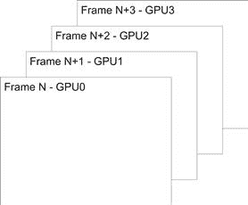

图 5.1 交替帧渲染（AFR）与分帧渲染（SFR）。

然而，这里有一个权衡。如果数据集是自包含的，您可以通过仅向 GPU（或 CPU）提供需要计算的数据子集，来使用更少的内存并传输更少的数据。在这里使用的 SFR GPU 示例中，GPU3 负责渲染地面，可能不需要知道 GPU0 的数据内容，而 GPU0 可能正在渲染天空。然而，可能会有飞行物体的阴影，或者地面的光照强度可能需要根据一天中的时间变化。在这种情况下，由于共享数据，选择交替帧渲染方法可能会更有利。

我们将 SFR 类型的拆分称为粗粒度并行性。大块数据以某种方式在*N*个强大设备之间拆分，然后作为处理后的数据重新构建。在为并行环境设计应用程序时，这一层次的选择会严重影响程序的性能。这里的最佳选择与您将使用的实际硬件紧密相关，正如我们在本书中开发的各种应用程序所展示的那样。

对于少数几个强大的设备，例如 CPU，问题通常是如何平均分配工作负载。这通常更容易推理，因为您通常只涉及少量设备。对于大量小型设备（如 GPU），它们能更好地平衡工作负载的峰值，但会遇到同步和协调方面的问题。

就像宏观（大规模）和微观（小规模）经济学一样，您也有粗粒度和细粒度并行性。然而，您通常只有在支持大量线程的设备（如 GPU）上，才能在程序员层面找到细粒度并行性。相比之下，CPU 也支持线程，但由于开销较大，因此被认为更适合解决粗粒度并行性问题。与 GPU 不同，CPU 遵循 MIMD（多指令多数据）模型，支持多个独立的指令流。这是一种更灵活的方法，但在获取多个独立的指令流时会产生额外的开销，而不是将单个指令流分摊到多个处理器上。

为了让这个问题更具上下文，我们来考虑一张数字照片，您应用图像修正功能以增加亮度。在 GPU 上，您可能选择为每个像素分配一个线程。在四核 CPU 上，您可能会将图像的四分之一分配给每个 CPU 核心。

### CPU 和 GPU 的不同之处

GPU 和 CPU 在架构上是非常不同的设备。CPU 设计用于运行少量的、可能非常复杂的任务。GPU 设计用于运行大量的、相对简单的任务。CPU 设计针对的是执行若干个离散且互不相关的任务的系统。而 GPU 设计则是针对那些可以被分解成数千个小片段并单独处理的问题。因此，CPU 非常适合运行操作系统和应用软件，因为计算机在任何给定时刻可能需要执行多种多样的任务。

因此，CPU 和 GPU 在支持线程的方式上有很大的不同。每个 CPU 核心有少量寄存器，必须用来执行给定的任务。为了实现这一点，CPU 会快速进行任务之间的上下文切换。CPU 上下文切换的时间成本较高，因为整个寄存器集必须保存到 RAM 中，并且下一个寄存器集必须从 RAM 恢复。相比之下，GPU 也使用上下文切换的概念，但它们不仅仅拥有一组寄存器，而是有多个寄存器组。因此，上下文切换仅涉及设置一个寄存器组选择器来切换当前的寄存器集，这比将数据保存到 RAM 中快几个数量级。

CPU 和 GPU 都必须处理停顿情况。这些通常是由 I/O 操作和内存提取引起的。CPU 通过上下文切换来处理这一问题。只要任务足够多，且线程的运行时间不太短，这种方式通常效果不错。如果没有足够的进程来保持 CPU 忙碌，CPU 就会空闲。如果任务过多且每个任务在短时间内阻塞，CPU 大部分时间都会用于上下文切换，而很少有时间进行有效的工作。CPU 调度策略通常基于时间分片，将时间均匀分配给各个线程。随着线程数的增加，花费在上下文切换上的时间比例也会越来越大，效率会迅速下降。

GPU 被设计用来处理停顿情况，并且预期这种情况会频繁发生。GPU 模型是数据并行模型，因此它需要数千个线程才能高效运行。它使用这池可用的工作来确保总是有有用的任务可以执行。因此，当它遇到内存提取操作或必须等待计算结果时，流处理器只需切换到另一个指令流，稍后再返回到停顿的指令流。

CPU 和 GPU 之间的主要区别之一是每个设备上的处理器数量。CPU 通常是双核或四核设备。也就是说，它们有多个执行核心来运行程序。目前的 Fermi GPU 拥有 16 个 SM，这可以看作是类似 CPU 核心的存在。CPU 通常运行单线程程序，这意味着它们每个核心每次迭代只计算一个数据点。GPU 默认并行运行。因此，GPU 每个 SM 计算的不是一个数据点，而是 32 个数据点。这使得在核心数量（SM 数量）上，GPU 比典型的四核 CPU 有 4 倍的优势，在数据吞吐量上有 32 倍的优势。当然，CPU 程序也可以使用所有可用的核心以及像 MMX、SSE 和 AVX 这样的扩展。问题是，究竟有多少 CPU 应用程序实际使用了这些类型的扩展。

GPU 还提供了一些独特的功能——高速内存位于 SM 旁边，即所谓的共享内存。在许多方面，这实现了连接机器和 Cell 处理器的设计理念，因为它为设备提供了一个标准寄存器文件之外的本地工作区。因此，程序员可以将数据保存在这块内存中，放心地知道硬件不会在背后将其驱逐出去。它也是线程间通信的主要机制。

### 任务执行模型

任务执行模型有两个主要区别。第一个是*N*个 SP 组以锁步方式执行（图 5.3），运行相同的程序但处理不同的数据。第二个是，由于这个巨大的寄存器文件，线程切换的开销几乎为*零*。因此，GPU 可以支持大量线程，并且是以这种方式设计的。

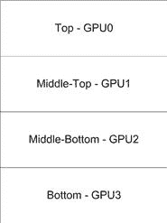

图 5.2 粗粒度并行。

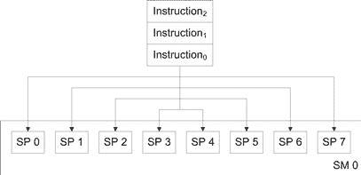

图 5.3 锁步指令调度。

那么，锁步方式究竟是什么意思呢？指令队列中的每条指令都会被分发到 SM 内的每个 SP。记住，每个 SM 可以看作是一个单独的处理器，其中嵌入了*N*个核心（SP）。

传统的 CPU 会为每个 CPU 核心获取一个单独的指令流。这里使用的 GPU SPMD 模型允许为*N*个逻辑执行单元获取指令流，这意味着你拥有的是传统处理器的 1/*N*的指令内存带宽需求。这与许多高端超级计算机中找到的矢量或 SIMD 处理器采用的方法非常相似。

然而，这并非没有代价。正如你稍后将看到的那样，如果程序没有遵循一个整洁的执行流，其中所有*N*线程遵循相同的控制路径，那么对于每个分支，你将需要额外的执行周期。

### GPU 上的线程调度

回到线程，来看一段代码，看看从编程角度来看这意味着什么。

```cpp
void some_func(void)
{
  int i;
```

```cpp
  for (i=0;i<128;i++)
  {
    a[i] = b[i] ∗ c[i];
  }
}
```

这段代码非常简单。它将给定索引处`b`和`c`值的乘积结果存储到同一索引位置的结果变量`a`中。`for`循环迭代 128 次（索引从 0 到 127）。在 CUDA 中，你可以将其转换为 128 个线程，每个线程执行以下代码行。

```cpp
a[i] = b[i] ∗ c[i];
```

这是可能的，因为循环的每次迭代之间没有依赖关系。因此，将其转换为并行程序实际上非常简单。这就是所谓的循环并行化，也是许多流行并行语言扩展（如 OpenMP）的基础。

在四核 CPU 上，你也可以将其转换为四个块，其中 CPU 核心 1 处理索引 0–31，核心 2 处理索引 32–63，核心 3 处理索引 64–95，核心 4 处理索引 96–127。某些编译器会自动转换这些块，或者在程序员标记该循环可以并行化时进行转换。Intel 编译器在这方面尤其出色。此类编译器可以用于创建嵌入式 SSE 指令，以此方式向量化循环，并生成多个线程。这提供了两级并行性，与 GPU 模型没有太大不同。

在 CUDA 中，你通过创建一个内核函数来翻译这个循环。内核函数是在 GPU 上执行的*唯一*函数，不能直接在 CPU 上执行。在 CUDA 编程模型中，CPU 处理串行代码的执行，这是它擅长的地方。当你遇到计算密集型的代码段时，CPU 会将其交给 GPU，以利用其强大的计算能力。有些人可能还记得早期 CPU 使用浮点协处理器的时代。使用大量浮点运算的应用程序在配备了此类协处理器的机器上运行得更快。GPU 的情况也是如此。它们被用来加速程序中的计算密集型部分。

从概念上讲，GPU 内核函数看起来与循环体相同，但移除了循环结构。因此，你得到如下代码：

```cpp
__global__ void some_kernel_func(int ∗ const a, const int ∗ const b, const int ∗ const c)
{
  a[i] = b[i] ∗ c[i];
}
```

注意，你已经丢失了循环和循环控制变量`i`。你还会在 C 函数前面加上`__global__`前缀，告诉编译器在编译此函数时生成 GPU 代码而非 CPU 代码，并使得该 GPU 代码在 CPU 中全局可见。

CPU 和 GPU 有各自独立的内存空间，这意味着你不能在 GPU 代码中访问 CPU 参数，反之亦然。虽然有一些特殊的方式可以做到这一点，我们将在书中的后面部分讲解，但现在我们将它们当作独立的内存空间来处理。因此，CPU 级别的全局数组`a`、`b`和`c`在 GPU 级别上不再可见。你必须在 GPU 上声明内存空间，将数组从 CPU 复制到 GPU，并将内核函数指针传递给 GPU 内存空间以进行读写。完成后，你需要将内存数据复制回 CPU。稍后我们将进一步讨论这个问题。

接下来你面临的问题是，`i`不再被定义；相反，`i`的值是由你当前运行的线程定义的。你将启动 128 个该函数的实例，最初这些实例将以 128 个线程的形式启动。CUDA 提供了一个特殊的参数，每个线程不同，定义了线程的 ID 或编号。你可以使用它来直接索引数组。这与 MPI 非常相似，在 MPI 中，你可以获得每个进程的进程等级。

线程信息以结构的形式提供。由于它是一个结构元素，我们暂时将其存储在变量`thread_idx`中，以避免每次都引用结构。因此，代码变成了：

```cpp
__global__ void some_kernel_func(int ∗ const a, const int ∗ const b, const int ∗ const c)
{
  const unsigned int thread_idx = threadIdx.x;
  a[thread_idx] = b[thread_idx] ∗ c[thread_idx];
}
```

注意，有些人更喜欢使用`idx`或`tid`作为线程索引的名称，因为这些名称比较简短，打字方便。

现在发生的事情是，对于线程 0，`thread_idx`计算返回 0，对于线程 1，返回 1，依此类推，直到线程 127，使用索引 127。每个线程都会执行两个内存读取操作，一个乘法和一个存储操作，然后终止。请注意，每个线程执行的代码是相同的，但数据有所不同。这正是 CUDA 和 SPMD 模型的核心。

在 OpenMP 和 MPI 中，你有类似的代码块。它们为循环的每次迭代提取分配给该线程的线程 ID 或线程等级。然后使用这些 ID 来索引数据集。

### 硬件一窥

现在记住，你每个 SM 上实际上只有*N*个核心，那么如何能运行 128 个线程呢？就像 CPU 一样，每个线程组被放置到 SM 中，然后*N*个 SP 开始运行代码。在提取线程索引后，首先要做的事情是从`b`和`c`数组中获取参数。不幸的是，这并不会立即发生。实际上，在内存子系统返回请求的数据之前，可能会经过 400 到 600 个 GPU 时钟周期。在这段时间里，*N*个线程会被挂起。

线程实际上是被分组为 32 个线程组的，当所有 32 个线程都在等待某些操作（例如内存访问）时，它们会被挂起。这些线程组的技术术语是 warp（32 个线程）和半 warp（16 个线程），我们稍后会再讨论这个问题。

因此，128 个线程被划分为四组，每组 32 个线程。第一组线程一起运行，用来提取线程 ID，然后计算数组中的地址并发出内存访问请求（见图 5.4）。接下来的指令是乘法运算，需要两个操作数都已经准备好，因此该线程被挂起。当该组 32 个线程中的所有线程都被挂起时，硬件会切换到另一个 warp。

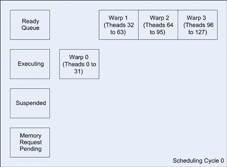

图 5.4 周期 0。

在图 5.5 中可以看到，当 warp 0 由于等待内存访问完成而被挂起时，warp 1 成为执行中的 warp。GPU 会继续以这种方式工作，直到所有 warp 都进入挂起状态（见图 5.6）。

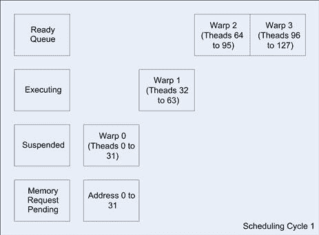

图 5.5 周期 1。

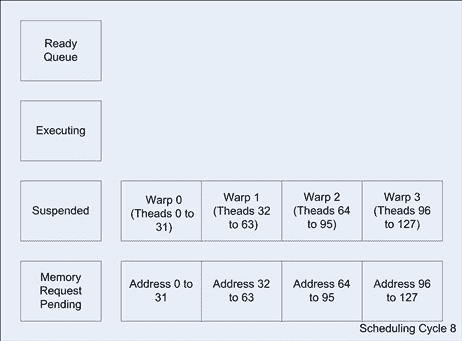

图 5.6 周期 8。

在发出内存获取请求之前，来自连续线程的获取通常会被合并或分组在一起。这减少了整体的延迟（响应请求的时间），因为在硬件上管理每个请求会有一定的开销。通过合并，内存获取请求会返回包含一组线程数据，通常足以支持一个完整的 warp。

这些线程随后会进入就绪状态，并在 GPU 遇到下一个阻塞操作时（如来自另一组线程的内存获取）可以切换进来。

执行完所有 warps（32 线程的组）后，GPU 变为空闲状态，等待任何一个待处理的内存访问完成。稍后，你会得到一系列内存块从内存子系统返回。这些内存块很可能会按请求的顺序返回，但这并不是保证的。

假设地址 0–31 是同时返回的。warp 0 移动到就绪队列，由于当前没有正在执行的 warp，warp 0 会自动进入执行状态（见图 5.7）。逐渐地，所有待处理的内存请求会完成，导致所有 warp 块都返回到就绪队列。

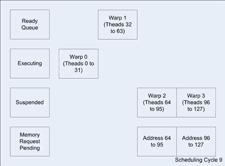

图 5.7 周期 9。

一旦 warp 0 执行完毕，它的最后一条指令是写入目标数组`a`。由于该操作没有依赖的指令，warp 0 就完成并被注销。其他 warps 会进入同样的周期，最终它们都会发出存储请求。每个 warp 随后都被注销，内核完成，控制权返回到 CPU。

### CUDA 内核

现在让我们更详细地看看如何调用内核。CUDA 定义了一种扩展的 C 语言语法来调用内核。记住，内核只是一个在 GPU 上执行的函数的名称。要调用一个内核，你需要使用以下语法：

```cpp
kernel_function<<<num_blocks, num_threads>>>(param1, param2, …)
```

你可以传递一些其他参数，我们稍后会讨论，但现在你需要关注两个重要的参数：`num_blocks` 和 `num_threads`。这些可以是变量或字面值。我推荐使用变量，因为你在调优性能时会用到它们。

`num_blocks`参数是你尚未涉及的内容，接下来的章节会详细讲解。现在你只需要确保至少有一个线程块。

`num_threads` 参数仅仅是你希望在内核中启动的线程数量。对于这个简单的例子，这直接对应于循环的迭代次数。然而，需要注意的是，硬件限制了每个块上的线程数量，早期硬件限制为 512 个线程，而后期硬件则为 1024 个线程。在这个例子中，这不是问题，但对于任何实际的程序来说，这几乎肯定是一个问题。你将在接下来的章节中看到如何解决这个问题。

内核调用的下一部分是传递的参数。参数可以通过寄存器或常量内存传递，选择哪种方式取决于编译器。如果使用寄存器，你将为每个传递的参数每个线程使用一个寄存器。因此，对于 128 个线程和三个参数，你将使用 3 × 128 = 384 个寄存器。这可能听起来很多，但请记住，每个 SM 至少有 8192 个寄存器，并且在后期硬件版本中可能更多。所以对于 128 个线程，你有总共 64 个寄存器（8192 个寄存器 ÷ 128 个线程）可用，*如果*你在一个 SM 上只运行一个线程块。

然而，每个 SM 上运行一个包含 128 个线程的线程块是一个非常糟糕的主意，即使你可以为每个线程使用 64 个寄存器。只要你访问内存，SM 就会有效地处于空闲状态。只有在非常有限的情况下，重度算术密集型操作利用了 64 个寄存器时，才应该考虑这种方法。实际上，每个 SM 上会运行多个块，以避免任何空闲状态。

## 块

现在，512 个线程在 GPU 上并不会让你走得很远。对于许多来自 CPU 领域的程序员来说，这可能听起来是一个庞大的数字，但在 GPU 上，通常你需要成千上万或者甚至是数万个并发线程，才能真正实现设备上可用的吞吐量。

我们在上一节讨论过这个问题，涉及到内核调用中的 `num_blocks` 参数。这是 `<<<` 和 `>>>` 符号中的第一个参数：

```cpp
kernel_function<<<num_blocks, num_threads>>>(param1, param2,…..)
```

如果你将其从 1 改为 2，你就把要求 GPU 调用硬件的线程数量翻倍。因此，相同的调用，

```cpp
some_kernel_func<<< 2, 128 >>>(a, b, c);
```

将会调用名为 `some_kernel_func` 的 GPU 函数 2 × 128 次，每次使用不同的线程。这样做会使得 `thread_idx` 参数的计算变得复杂，实际上就是数组的索引位置。这个之前简单的内核需要稍作修改，以考虑到这一点。

```cpp
__global__ void some_kernel_func(int ∗ const a, const int ∗ const b, const int ∗ const c)
{
  const unsigned int thread_idx = (blockIdx.x ∗ blockDim.x) + threadIdx.x;
```

```cpp
  a[thread_idx] = b[thread_idx] ∗ c[thread_idx];
}
```

为了计算 `thread_idx` 参数，你现在必须考虑块的数量。对于第一个块，`blockIdx.x` 将包含零，因此，实际上 `thread_idx` 参数等于你之前使用的 `threadIdx.x` 参数。然而，对于第二个块，`blockIdx.x` 将保存值 1。参数 `blockDim.x` 保存值 128，这实际上是你在这个例子中为每个块请求的线程数。因此，在加入来自 `threadIdx.x` 参数的线程偏移量之前，你将有一个 1 × 128 的线程基地址。

你是否注意到在添加另一个块时引入的小错误？现在，你将启动 256 个线程，并且将数组索引从 0 到 255。如果你没有改变数组的大小，从 128 个元素扩展到 256 个元素，你将访问并写入数组的末尾之外。这个数组越界错误不会被编译器捕获，代码可能会运行，具体取决于目标数组`a`之后的内容。调用内核时要小心，确保不访问越界的元素。

对于这个例子，我们将保持 128 字节的数组大小，并将内核更改为调用两个 64 个线程的块：

```cpp
some_kernel_func<<< 2, 64 >>>(a, b, c);
```

因此，你得到的是图 5.8 所示的效果。

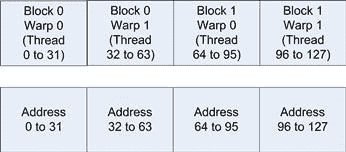

图 5.8 块映射到地址。

注意，尽管现在有了两个块，`thread_idx`参数仍然等同于数组索引，和之前完全一样。那么，使用块的意义何在呢？在这个简单的例子中，根本没有任何意义。然而，在任何实际问题中，你需要处理的元素数量远远超过 512 个。事实上，如果你查看块的数量限制，你会发现可以使用 65,536 个块。

在 65,536 个块的情况下，每个块有 512 个线程，你总共可以调度 33,554,432 个线程（大约 3350 万个）。在每个块 512 个线程的情况下，每个 SM 最多可以有三个块。实际上，这个限制是基于每个 SM 的线程总数，在最新的 Fermi 硬件上为 1536 个，而在最初的 G80 硬件上仅为 768 个。

如果你在 Fermi 硬件上调度每个块最大 1024 个线程，那么 65,536 个块将转换为大约 6400 万个线程。不幸的是，在 1024 个线程的情况下，你每个 SM 只能获得一个线程块。因此，你需要大约 65,536 个 SM 才能在每个 SM 上至少分配一个块。目前，任何卡上最大数量的 SM 是 30 个。因此，SM 的数量可以增长，直到超出硬件支持的块数量为止，这也是 CUDA 的一个优点——它能够扩展到成千上万个执行单元。并行性的限制实际上仅仅是应用程序中可以找到的并行性数量的限制。

在 6400 万个线程的情况下，假设每个线程对应一个数组元素，你可以处理最多 6400 万个元素。假设每个元素是一个单精度浮点数，需要 4 个字节的数据，那么你大约需要 256 百万字节，或者 256MB 的数据存储空间。几乎所有 GPU 卡都支持至少这种大小的内存空间，因此，仅通过线程和块，你就可以实现相当大的并行度和数据覆盖。

对于那些担心大数据集的用户，尤其是当问题涉及到数 GB、TB 或 PB 的数据时，有一个解决方案。为此，通常你要么在每个线程中处理多个元素，要么使用另一个维度的块，接下来的章节将介绍这一点。

### 块排列

为了确保我们理解块的排列，我们将编写一个简短的内核程序，打印块、线程、warp 和线程索引到屏幕上。现在，除非你至少使用了 3.2 版本的 SDK，否则内核中的`printf`语句是不被支持的。因此，我们将数据传回 CPU 并打印到控制台窗口。内核程序如下：

```cpp
__global__ void what_is_my_id(unsigned int ∗ const block,
                              unsigned int ∗ const thread,
                              unsigned int ∗ const warp,
                              unsigned int ∗ const calc_thread)
{
  /∗ Thread id is block index ∗ block size + thread offset into the block ∗/
  const unsigned int thread_idx = (blockIdx.x ∗ blockDim.x) + threadIdx.x;
  block[thread_idx] = blockIdx.x;
  thread[thread_idx] = threadIdx.x;
```

```cpp
  /∗ Calculate warp using built in variable warpSize ∗/
  warp[thread_idx] = threadIdx.x / warpSize;
```

```cpp
  calc_thread[thread_idx] = thread_idx;
}
```

现在，在 CPU 上，你需要运行以下一段代码，为 GPU 上的数组分配内存，然后将数组从 GPU 传回并在 CPU 上显示它们。

```cpp
#include <stdio.h>
#include <stdlib.h>
#include <conio.h>
```

```cpp
__global__ void what_is_my_id(unsigned int ∗ const block,
              unsigned int ∗ const thread,
              unsigned int ∗ const warp,
              unsigned int ∗ const calc_thread)
{
  /∗ Thread id is block index ∗ block size + thread offset into the block ∗/
  const unsigned int thread_idx = (blockIdx.x ∗ blockDim.x) + threadIdx.x;
```

```cpp
  block[thread_idx] = blockIdx.x;
  thread[thread_idx] = threadIdx.x;
```

```cpp
  /∗ Calculate warp using built in variable warpSize ∗/
  warp[thread_idx] = threadIdx.x / warpSize;
```

```cpp
  calc_thread[thread_idx] = thread_idx;
```

`}`

```cpp
#define ARRAY_SIZE 128
#define ARRAY_SIZE_IN_BYTES (sizeof(unsigned int) ∗ (ARRAY_SIZE))
```

```cpp
/∗ Declare statically four arrays of ARRAY_SIZE each ∗/
```

```cpp
unsigned int cpu_block[ARRAY_SIZE];
unsigned int cpu_thread[ARRAY_SIZE];
unsigned int cpu_warp[ARRAY_SIZE];
unsigned int cpu_calc_thread[ARRAY_SIZE];
```

```cpp
int main(void)
{
  /∗ Total thread count = 2 ∗ 64 = 128 ∗/
  const unsigned int num_blocks = 2;
  const unsigned int num_threads = 64;
  char ch;
```

```cpp
  /∗ Declare pointers for GPU based params ∗/
  unsigned int ∗ gpu_block;
  unsigned int ∗ gpu_thread;
  unsigned int ∗ gpu_warp;
  unsigned int ∗ gpu_calc_thread;
```

```cpp
  /∗ Declare loop counter for use later ∗/
  unsigned int i;
```

```cpp
  /∗ Allocate four arrays on the GPU ∗/
  cudaMalloc((void ∗∗)&gpu_block, ARRAY_SIZE_IN_BYTES);
  cudaMalloc((void ∗∗)&gpu_thread, ARRAY_SIZE_IN_BYTES);
  cudaMalloc((void ∗∗)&gpu_warp, ARRAY_SIZE_IN_BYTES);
  cudaMalloc((void ∗∗)&gpu_calc_thread, ARRAY_SIZE_IN_BYTES);
```

```cpp
  /∗ Execute our kernel ∗/
  what_is_my_id<<<num_blocks, num_threads>>>(gpu_block, gpu_thread, gpu_warp,
                                             gpu_calc_thread);
```

```cpp
 /∗ Copy back the gpu results to the CPU ∗/
   cudaMemcpy(cpu_block, gpu_block, ARRAY_SIZE_IN_BYTES,
             cudaMemcpyDeviceToHost);
   cudaMemcpy(cpu_thread, gpu_thread, ARRAY_SIZE_IN_BYTES,
             cudaMemcpyDeviceToHost);
   cudaMemcpy(cpu_warp, gpu_warp, ARRAY_SIZE_IN_BYTES,
             cudaMemcpyDeviceToHost);
   cudaMemcpy(cpu_calc_thread, gpu_calc_thread, ARRAY_SIZE_IN_BYTES,
             cudaMemcpyDeviceToHost);
```

`   /∗ 释放 GPU 上的数组，因为我们已经不再使用它们 ∗/`

```cpp
   cudaFree(gpu_block);
   cudaFree(gpu_thread);
   cudaFree(gpu_warp);
   cudaFree(gpu_calc_thread);
```

```cpp
   /∗ Iterate through the arrays and print ∗/
   for (i=0; i < ARRAY_SIZE; i++)
   {
     printf("Calculated Thread: %3u - Block: %2u - Warp %2u - Thread %3u\n",
      cpu_calc_thread[i], cpu_block[i], cpu_warp[i], cpu_thread[i]);
   }
   ch = getch();
}
```

在这个例子中，你可以看到每个块的位置紧接在前一个块之后。由于数组只有一个维度，将线程块按相似方式排列是一种简单的思维方式。前面程序的输出如下：

```cpp
Calculated Thread: 0 - Block: 0 - Warp 0 - Thread 0
Calculated Thread: 1 - Block: 0 - Warp 0 - Thread 1
Calculated Thread: 2 - Block: 0 - Warp 0 - Thread 2
Calculated Thread: 3 - Block: 0 - Warp 0 - Thread 3
Calculated Thread: 4 - Block: 0 - Warp 0 - Thread 4
…
Calculated Thread: 30 - Block: 0 - Warp 0 - Thread 30
Calculated Thread: 31 - Block: 0 - Warp 0 - Thread 31
Calculated Thread: 32 - Block: 0 - Warp 1 - Thread 32
Calculated Thread: 33 - Block: 0 - Warp 1 - Thread 33
Calculated Thread: 34 - Block: 0 - Warp 1 - Thread 34
…
Calculated Thread: 62 - Block: 0 - Warp 1 - Thread 62
Calculated Thread: 63 - Block: 0 - Warp 1 - Thread 63
Calculated Thread: 64 - Block: 1 - Warp 0 - Thread 0
Calculated Thread: 65 - Block: 1 - Warp 0 - Thread 1
Calculated Thread: 66 - Block: 1 - Warp 0 - Thread 2
Calculated Thread: 67 - Block: 1 - Warp 0 - Thread 3
…
Calculated Thread: 94 - Block: 1 - Warp 0 - Thread 30
Calculated Thread: 95 - Block: 1 - Warp 0 - Thread 31
Calculated Thread: 96 - Block: 1 - Warp 1 - Thread 32
Calculated Thread: 97 - Block: 1 - Warp 1 - Thread 33
Calculated Thread: 98 - Block: 1 - Warp 1 - Thread 34
Calculated Thread: 99 - Block: 1 - Warp 1 - Thread 35
Calculated Thread: 100 - Block: 1 - Warp 1 - Thread 36
…
Calculated Thread: 126 - Block: 1 - Warp 1 - Thread 62
```

`计算的线程: 127 - 块: 1 - Warp 1 - 线程 63`

如你所见，计算得到的线程 ID，从 0 到 127。在其中，你分配了两个 64 线程的块。每个块中的线程索引从 0 到 63。你还会看到，每个块生成两个 warps。

## 网格

网格实际上就是一组块，其中你有一个*X*轴和一个*Y*轴，本质上是一个二维映射。最终的*Y*映射给你提供了*Y* × *X* × *T*种线程索引的可能性。让我们通过一个例子来看一下，但首先将*Y*轴限制为单行。

如果你看一下典型的高清图像，它的分辨率是 1920 × 1080。块中的线程数应该*始终*是 warp 大小的倍数，当前 warp 大小定义为 32。因为硬件上只能调度完整的 warp，如果你不这样做，warp 中剩余的部分将无法使用，并且你必须引入一个条件，以确保你不会处理超出*X*轴末端的元素。如你将看到的，这会使得整个过程变慢。

为了避免不良的内存合并，你应该始终尝试安排内存和线程的使用，使其能够映射。这将在下一个关于内存的章节中详细讲解。如果不这么做，性能可能会下降约五倍。

为了避免产生过小的块，因为它们无法充分利用硬件，我们将每个块选择为 192 个线程。在大多数情况下，这是你应该考虑使用的*最小*线程数。这样，每行图像正好有 10 个块，这是一个容易处理的数字（见图 5.9）。使用线程数是*X*轴和 warp 大小的倍数会让工作变得更简单。

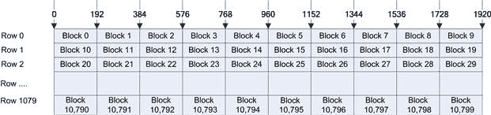

图 5.9 块分配到行。

在顶部的 *X* 轴上，你有线程索引。行索引形成 *Y* 轴。行的高度正好是一个像素。由于你有 1080 行，每行 10 个块，因此你总共有 1080 × 10 = 10,800 个块。由于每个块有 192 个线程，你将调度超过两百万个线程，每个像素对应一个线程。

这种特定的布局在你对单个像素或数据点进行操作时非常有用，*或者*在你对同一行中的多个数据点进行操作时也同样适用。在 Fermi 硬件上，每个 SM 有八个块，你需要总共 1350 个 SM（10,800 个总块 ÷ 8 个已调度块）来消耗应用层面的并行性。在目前可用的 Fermi 硬件上，只有 16 个 SM（GTX580），因此每个 SM 将处理 675 个块。

这很好，但如果你的数据不是基于行的呢？与数组一样，你并不局限于单一维度。你可以使用 2D 线程块排列。例如，许多图像算法使用 8 × 8 的像素块。我们这里使用像素来展示这种排列，因为大多数人更容易理解。你的数据不一定是基于像素的。你通常将像素表示为红、绿、蓝三色分量。你也可以将 *x*、*y* 和 *z* 空间坐标视为单个数据点，或者使用简单的 2D 或 3D 矩阵来存储数据点。

### 步幅和偏移

与 C 中的数组一样，线程块可以被视为 2D 结构。然而，对于 2D 线程块，我们需要引入一些新概念。就像数组索引一样，要索引到 2D 数组的 *Y* 元素，你需要知道数组的宽度，即 *X* 元素的数量。请参考 图 5.10 中的数组。

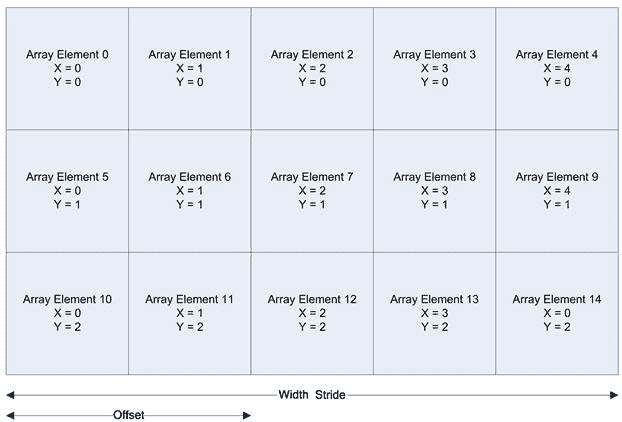

图 5.10 数组映射到元素。

数组的宽度被称为内存访问的步幅。偏移量是正在访问的列值，从左边开始，总是元素 0。因此，你有数组元素 5 被通过索引 [1][5] 或通过地址计算（行 ×（sizeof(array_element) × 宽度)）+（（sizeof(array_element) × 偏移量））访问。这是编译器在 C 代码中进行多维数组索引时，实际上使用的优化计算方法。

现在，这与 CUDA 中的线程和块有什么关系呢？CUDA 设计允许将数据分解为并行的线程和块。它允许你在引用程序的并行结构时定义 1D、2D 或 3D 索引（*Y* × *X* × *T*）。这直接映射到典型内存区域的排列方式，使得你正在处理的数据能够分配到各个 SM 中。将数据保持在接近处理器的位置，显著提高了 GPU 和 CPU 的性能。

然而，在布置这样的数组时，你必须注意一个警告。数组的宽度值必须始终是 warp 大小的倍数。如果不是，则需要将数组填充到下一个最接近 warp 大小的倍数。填充到 warp 大小的下一个倍数应该只会使数据集的大小略微增加。然而，请注意，你需要以不同的方式处理填充边界或光晕单元格，而不是处理其余的单元格。你可以通过执行流中的分歧来处理这个问题（例如，使用`if`语句），或者你可以简单地计算填充的单元格并丢弃结果。我们将在本书后面讨论分歧及其引起的问题。

### *X*和*Y*线程索引

具有 2D 数组形式的块意味着你将获得两个线程索引，因为你将以 2D 方式访问数据：

```cpp
const unsigned int idx = (blockIdx.x ∗ blockDim.x) + threadIdx.x;
const unsigned int idy = (blockIdx.y ∗ blockDim.y) + threadIdx.y;
```

```cpp
some_array[idy][idx] += 1.0;
```

注意`blockDim.x`和`blockDim.y`的使用，CUDA 运行时会自动为你完成这些工作，指定*X*轴和*Y*轴的维度。因此，我们来修改现有程序，使其适用于 32 × 16 的数组。由于你想调度四个块，可以将它们作为条带安排在数组中，或者作为数组中的方块，正如图 5.11 所示。

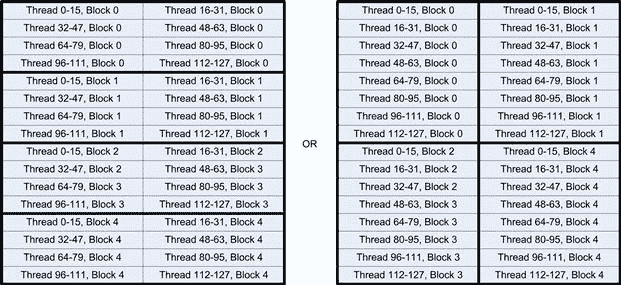

图 5.11 替代线程块布局。

你也可以将条带版本旋转 90 度，并让每个线程块对应一列。不要这样做，因为这样会导致完全未合并的内存访问，性能可能下降一个数量级甚至更多。并且在并行化循环时要小心，确保访问模式始终按行顺序通过内存访问，而不是按列顺序。无论是 CPU 代码还是 GPU 代码，这都适用。

那么，为什么你可能会选择方形布局而不是矩形布局呢？有两个原因。第一个是，*同一块中的线程*可以通过共享内存进行通信，这是一种非常快速的协作方式。第二个考虑因素是，由于 warp 内的访问是合并的，且 128 字节是 Fermi 硬件中缓存行的大小，因此你通过单次 128 字节事务获取内存，比通过两次 64 字节事务获得内存要稍微快一些。在方形布局中，注意到你有 0 到 15 号线程映射到一个块，而下一个内存位置属于另一个块。因此，你会得到两次事务，而不是矩形布局中的一次。然而，如果数组稍大一些，比如 64 × 16，那么你就不会看到这个问题，因为你将有 32 个线程访问连续内存，从而发出一次 128 字节的内存获取。

使用以下代码修改程序以使用这两种布局之一：

```cpp
dim3 threads_rect(32,4);
```

`dim3 blocks_rect(1,4);`

```cpp
or
dim3 threads_square(16,8);
dim3 blocks_square(2,2);
```

无论哪种排列方式，你都有相同的线程总数（32 × 4 = 128，16 × 8 = 128）。不同之处仅在于线程的布局。

`dim3` 类型是一个特殊的 CUDA 类型，你必须使用它来创建线程的二维布局。在矩形示例中，你表示你希望在 *X* 轴上有 32 个线程，在 *Y* 轴上有 4 个线程，且都在单个块内。然后，你表示你希望块的布局是宽度为 1 个块，高度为 4 个块。

你需要使用以下方式调用内核：

```cpp
some_kernel_func<<< blocks_rect, threads_rect >>>(a, b, c);
```

或者

```cpp
some_kernel_func<<< blocks_square, threads_square >>>(a, b, c);
```

由于你不再仅需要一个线程 ID，而是需要 *X* 和 *Y* 位置，因此你需要更新内核来反映这一点。然而，你还需要线性化线程 ID，因为有时你可能需要一个绝对线程索引。为此，我们需要引入几个新概念，如图 5.12 所示。

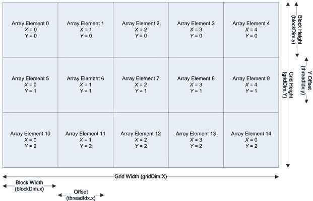

图 5.12 网格、块和线程维度。

你可以看到一些新的参数，它们是：

```cpp
gridDim.x–The size in blocks of the X dimension of the grid.
gridDim.y–The size in blocks of the Y dimension of the grid.
```

```cpp
blockDim.x–The size in threads of the X dimension of a single block.
```

`blockDim.y–单个块的 Y 维度线程大小。`

```cpp
theadIdx.x–The offset within a block of the X thread index.
theadIdx.y–The offset within a block of the Y thread index.
```

你可以通过计算 *Y* 位置并将其乘以每行的线程数来得出绝对线程索引。然后，你只需将 *X* 偏移量加到行的起始位置。因此，线程索引计算为：

```cpp
thread_idx = ((gridDim.x ∗ blockDim.x) ∗ idy) + idx;
```

因此，你需要修改内核以返回额外的 *X* 和 *Y* 位置，以及其他一些有用的信息，如下所示：

```cpp
__global__ void what_is_my_id_2d_A(
unsigned int ∗ const block_x,
unsigned int ∗ const block_y,
unsigned int ∗ const thread,
unsigned int ∗ const calc_thread,
unsigned int ∗ const x_thread,
unsigned int ∗ const y_thread,
```

`unsigned int ∗ const grid_dimx,`

```cpp
unsigned int ∗ const block_dimx,
unsigned int ∗ const grid_dimy,
unsigned int ∗ const block_dimy)
{
  const unsigned int idx        = (blockIdx.x ∗ blockDim.x) + threadIdx.x;
  const unsigned int idy        = (blockIdx.y ∗ blockDim.y) + threadIdx.y;
  const unsigned int thread_idx = ((gridDim.x ∗ blockDim.x) ∗ idy) + idx;
```

```cpp
  block_x[thread_idx]     = blockIdx.x;
  block_y[thread_idx]     = blockIdx.y;
  thread[thread_idx]      = threadIdx.x;
  calc_thread[thread_idx] = thread_idx;
  x_thread[thread_idx]    = idx;
  y_thread[thread_idx]    = idy;
  grid_dimx[thread_idx]   = gridDim.x;
  block_dimx[thread_idx]  = blockDim.x;
  grid_dimy[thread_idx]   = gridDim.y;
  block_dimy[thread_idx]  = blockDim.y;
}
```

我们将调用两次内核，以演示如何安排数组块和线程。

由于你现在要传递额外的数据集进行计算，你需要额外的 `cudaMalloc`、`cudaFree` 和 `cudaMemcpy` 来将数据从设备复制过来。由于你使用的是二维数据，你还需要修改数组大小以分配和传输正确大小的数据。

```cpp
#define ARRAY_SIZE_X 32
#define ARRAY_SIZE_Y 16
```

```cpp
#define ARRAY_SIZE_IN_BYTES ((ARRAY_SIZE_X) ∗ (ARRAY_SIZE_Y) ∗ (sizeof(unsigned int)))
```

```cpp
/∗ Declare statically six arrays of ARRAY_SIZE each ∗/
unsigned int cpu_block_x[ARRAY_SIZE_Y][ARRAY_SIZE_X];
unsigned int cpu_block_y[ARRAY_SIZE_Y][ARRAY_SIZE_X];
unsigned int cpu_thread[ARRAY_SIZE_Y][ARRAY_SIZE_X];
unsigned int cpu_warp[ARRAY_SIZE_Y][ARRAY_SIZE_X];
unsigned int cpu_calc_thread[ARRAY_SIZE_Y][ARRAY_SIZE_X];
unsigned int cpu_xthread[ARRAY_SIZE_Y][ARRAY_SIZE_X];
unsigned int cpu_ythread[ARRAY_SIZE_Y][ARRAY_SIZE_X];
unsigned int cpu_grid_dimx[ARRAY_SIZE_Y][ARRAY_SIZE_X];
unsigned int cpu_block_dimx[ARRAY_SIZE_Y][ARRAY_SIZE_X];
unsigned int cpu_grid_dimy[ARRAY_SIZE_Y][ARRAY_SIZE_X];
unsigned int cpu_block_dimy[ARRAY_SIZE_Y][ARRAY_SIZE_X];
```

```cpp
int main(void)
{
  /∗ Total thread count = 32 ∗ 4 = 128 ∗/
  const dim3 threads_rect(32, 4); /∗ 32 ∗ 4 ∗/
```

` const dim3 blocks_rect(1,4);`

```cpp
  /∗ Total thread count = 16 ∗ 8 = 128 ∗/
  const dim3 threads_square(16, 8); /∗ 16 ∗ 8 ∗/
  const dim3 blocks_square(2,2);
```

```cpp
  /∗ Needed to wait for a character at exit ∗/
  char ch;
```

```cpp
  /∗ Declare pointers for GPU based params ∗/
  unsigned int ∗ gpu_block_x;
  unsigned int ∗ gpu_block_y;
  unsigned int ∗ gpu_thread;
  unsigned int ∗ gpu_warp;
  unsigned int ∗ gpu_calc_thread;
  unsigned int ∗ gpu_xthread;
  unsigned int ∗ gpu_ythread;
  unsigned int ∗ gpu_grid_dimx;
  unsigned int ∗ gpu_block_dimx;
  unsigned int ∗ gpu_grid_dimy;
  unsigned int ∗ gpu_block_dimy;
```

```cpp
  /∗ Allocate four arrays on the GPU ∗/
  cudaMalloc((void ∗∗)&gpu_block_x, ARRAY_SIZE_IN_BYTES);
  cudaMalloc((void ∗∗)&gpu_block_y, ARRAY_SIZE_IN_BYTES);
  cudaMalloc((void ∗∗)&gpu_thread, ARRAY_SIZE_IN_BYTES);
  cudaMalloc((void ∗∗)&gpu_calc_thread, ARRAY_SIZE_IN_BYTES);
  cudaMalloc((void ∗∗)&gpu_xthread, ARRAY_SIZE_IN_BYTES);
  cudaMalloc((void ∗∗)&gpu_ythread, ARRAY_SIZE_IN_BYTES);
  cudaMalloc((void ∗∗)&gpu_grid_dimx, ARRAY_SIZE_IN_BYTES);
  cudaMalloc((void ∗∗)&gpu_block_dimx, ARRAY_SIZE_IN_BYTES);
  cudaMalloc((void ∗∗)&gpu_grid_dimy, ARRAY_SIZE_IN_BYTES);
  cudaMalloc((void ∗∗)&gpu_block_dimy, ARRAY_SIZE_IN_BYTES);
```

```cpp
  for (int kernel=0; kernel < 2; kernel++)
  {
    switch (kernel)
    {
      case 0:
      {
        /∗ Execute our kernel ∗/
        what_is_my_id_2d_A<<<blocks_rect, threads_rect>>>(gpu_block_x, gpu_block_y, gpu_thread, gpu_calc_thread, gpu_xthread, gpu_ythread, gpu_grid_dimx, gpu_block_dimx, gpu_grid_dimy, gpu_block_dimy);
      } break;
```

```cpp
      case 1:
```

` {`

```cpp
       /∗ Execute our kernel ∗/
       what_is_my_id_2d_A<<<blocks_square, threads_square>>>(gpu_block_x, gpu_block_y, gpu_thread, gpu_calc_thread, gpu_xthread, gpu_ythread, gpu_grid_dimx, gpu_block_dimx, gpu_grid_dimy, gpu_block_dimy);
      } break;
```

```cpp
      default: exit(1); break;
    }
```

```cpp
    /∗ Copy back the gpu results to the CPU ∗/
    cudaMemcpy(cpu_block_x, gpu_block_x, ARRAY_SIZE_IN_BYTES,
               cudaMemcpyDeviceToHost);
    cudaMemcpy(cpu_block_y, gpu_block_y, ARRAY_SIZE_IN_BYTES,
               cudaMemcpyDeviceToHost);
    cudaMemcpy(cpu_thread, gpu_thread, ARRAY_SIZE_IN_BYTES,
               cudaMemcpyDeviceToHost);
    cudaMemcpy(cpu_calc_thread, gpu_calc_thread, ARRAY_SIZE_IN_BYTES,
               cudaMemcpyDeviceToHost);
    cudaMemcpy(cpu_xthread, gpu_xthread, ARRAY_SIZE_IN_BYTES,
               cudaMemcpyDeviceToHost);
    cudaMemcpy(cpu_ythread, gpu_ythread, ARRAY_SIZE_IN_BYTES,
               cudaMemcpyDeviceToHost);
    cudaMemcpy(cpu_grid_dimx, gpu_grid_dimx, ARRAY_SIZE_IN_BYTES,
               cudaMemcpyDeviceToHost);
    cudaMemcpy(cpu_block_dimx,gpu_block_dimx, ARRAY_SIZE_IN_BYTES,
               cudaMemcpyDeviceToHost);
    cudaMemcpy(cpu_grid_dimy, gpu_grid_dimy, ARRAY_SIZE_IN_BYTES,
               cudaMemcpyDeviceToHost);
    cudaMemcpy(cpu_block_dimy, gpu_block_dimy, ARRAY_SIZE_IN_BYTES,
               cudaMemcpyDeviceToHost);
```

```cpp
    printf("\nKernel %d\n", kernel);
    /∗ Iterate through the arrays and print ∗/
    for (int y=0; y < ARRAY_SIZE_Y; y++)
    {
        for (int x=0; x < ARRAY_SIZE_X; x++)
        {
            printf("CT: %2u BKX: %1u BKY: %1u TID: %2u YTID: %2u XTID: %2u GDX: %1u BDX: %1u GDY %1u BDY %1u\n", cpu_calc_thread[y][x], cpu_block_x[y][x], cpu_block_y[y][x], cpu_thread[y][x], cpu_ythread[y][x], cpu_xthread[y][x], cpu_grid_dimx[y][x], cpu_block_dimx[y][x], cpu_grid_dimy[y][x], cpu_block_dimy[y][x]);
```

```cpp
          /∗ Wait for any key so we can see the console window ∗/
          ch = getch();
          }
    }
    /∗ Wait for any key so we can see the console window ∗/
```

` printf("按任意键继续\n");`

```cpp
    ch = getch();
  }
```

```cpp
  /∗ Free the arrays on the GPU as now we’re done with them ∗/
  cudaFree(gpu_block_x);
  cudaFree(gpu_block_y);
  cudaFree(gpu_thread);
  cudaFree(gpu_calc_thread);
  cudaFree(gpu_xthread);
  cudaFree(gpu_ythread);
  cudaFree(gpu_grid_dimx);
  cudaFree(gpu_block_dimx);
  cudaFree(gpu_grid_dimy);
  cudaFree(gpu_block_dimy);
}
```

输出结果太大，无法在此列出。如果你在可下载的源代码部分运行程序，你会看到你在图 5.12 中迭代线程和块的过程。

## Warp

我们在讨论线程时稍微提到过 warp 调度。Warp 是 GPU 上执行的基本单元。GPU 实际上是多个 SIMD 向量处理器的集合。每一组线程或 warp 会一起执行。这意味着，在理想情况下，当前指令只需要从内存中获取一次，并将该指令广播到 warp 中的所有 SP（流处理器）。这比 CPU 模型更高效，因为 CPU 模型获取独立的执行流来支持任务级并行。在 CPU 模型中，对于每个运行独立任务的核心，你可以通过核心数来概念性地划分内存带宽，从而影响有效指令吞吐量。在实际情况中，CPU 的多级片上缓存会隐藏很多这一部分的细节，前提是程序适合缓存。

你可以在传统 CPU 上找到矢量类型指令，如 SSE、MMX 和 AVX 指令。这些指令会对多个数据操作数执行相同的单一指令。因此，你可以说，对于 *N* 个值，将所有值都加 1。使用 SSE，你可以获得 128 位寄存器，因此可以同时处理四个参数。AVX 将此扩展到 256 位。这非常强大，但直到最近，除非你使用英特尔编译器，否则几乎没有原生支持这种优化类型。AVX 现在已被当前的 GNU gcc 编译器支持。Microsoft Visual Studio 2010 通过使用“/arch:AVX”编译器开关来支持它。由于直到最近才有支持，矢量类型指令并没有像它们应该的那样广泛使用，但随着不再仅限于英特尔编译器，情况可能会显著改变。

在 GPU 编程中，你别无选择：它是矢量架构，并且期望你编写能够在成千上万个线程上运行的代码。你实际上可以写一个单线程 GPU 程序，使用简单的 `if` 语句检查线程 ID 是否为零，但与 CPU 相比，这样做会让你得到糟糕的性能。然而，这种方法可以在将并行化引入应用程序之前，确保一些初步的串行 CPU 实现能够正常工作。例如，你可以在此时检查是否能够正确地将内存复制到/从 GPU。

目前，GPU 上的 warp 大小为 32 个元素，尽管 nVidia 保留未来更改这一大小的权利。因此，它们提供了一个内建变量 `warpSize`，供你使用以获取当前硬件的 warp 大小。像任何“魔法数字”一样，你不应该硬编码假设的 32 大小。许多 SSE 优化的程序曾经硬编码假定 SSE 大小为 128 位。当 AVX 发布时，简单地重新编译代码并不足够。不要犯同样的错误，把这种细节硬编码到你的程序中。

那么，为什么你应该关心 warp 的大小呢？原因有很多，下面我们将简要讨论每一个。

### 分支

感兴趣于 warp 大小的第一个原因是分支。由于 warp 是一个单一的执行单元，分支（例如`if`、`else`、`for`、`while`、`do`、`switch`等）会导致执行流的分歧。在 CPU 上，有复杂的硬件来进行分支预测，预测过去的执行情况，从而确定某段代码将走哪条路径。指令流会提前预取并注入到 CPU 指令流水线中。如果预测正确，CPU 就能避免“停顿事件”。停顿事件非常糟糕，因为此时 CPU 需要撤销任何猜测执行的指令，从另一条分支路径中提取指令，并重新填充流水线。

GPU 是一个更简单的设备，并没有这种复杂性。它只是执行分支的一个路径，然后执行另一个路径。那些选择了分支的线程会被执行，而那些没有选择分支的线程则被标记为非活动状态。一旦选中的分支被解决，分支的另一边就会执行，直到线程再次汇聚。看一下下面的代码：

```cpp
__global__ some_func(void)
{
  if (some_condition)
  {
    action_a();
  }
  else
  {
    action_b();
  }
}
```

一旦你评估了`some_condition`，至少在一个块中会出现分歧，否则程序中就没有必要进行测试。假设所有偶数编号的线程走真路径，所有奇数编号的线程走假路径。然后，warp 的计分板就像图 5.13 所示。


图 5.13 谓词线程/分支选择。

为了简单起见，我只画了 32 个线程中的 16 个，稍后你会明白为什么。所有标记为+的线程走真（正）路径，所有标记为−的线程走假（负）路径。

由于硬件每次只能获取一个单独的指令流，因此一半的线程会停滞，另一半会沿着一条路径继续执行。这是非常不利的消息，因为此时硬件的利用率仅为 50%。这有点像是你拥有一颗双核 CPU，却只使用一个核心。许多懒惰的程序员能够忍受这种情况，但与可能的性能相比，这种性能非常糟糕。

现在，恰好有一个技巧可以避免这个问题。实际的指令执行调度器是基于半 warp 的，而不是基于 warp 的。这意味着如果你能够将分歧安排在半 warp（16 线程）边界上，你就可以执行分支条件的两侧，示例程序中的`if-else`结构。通过这种方式，你可以实现设备的 100%利用率。

如果你有两种类型的数据处理方式，在 16 字边界上交错数据可以带来不错的性能。代码只需根据线程 ID 进行分支，如下所示：

```cpp
if ((thread_idx % 32) < 16)
{
  action_a();
}
else
{
  action_b();
}
```

C 中的取模运算符（`%`）返回操作数整数除法的余数。实际上，你从 0 计数到 31，然后再回到 0。理想情况下，`action_a()`函数让它的每个 16 个线程访问一个单一的浮点数或整数值。这样就会进行一次单一的 64 字节内存获取。接下来的半 warp 也做同样的事情，因此你会发出一次单一的 128 字节内存获取，而恰好 128 字节是缓存行的大小，因此是 warp 的最优内存获取大小。

### GPU 利用率

那么，为什么你还会对 warp 感兴趣呢？为了避免低效利用 GPU。CUDA 模型使用大量线程来隐藏内存延迟（内存请求返回的时间）。通常，访问全局内存（DRAM）的延迟约为 400 到 600 个周期。在此期间，GPU 忙于执行其他任务，而不是闲待内存获取完成。

当你将内核分配到 GPU 时，当前你可以分配到 SM 上的最大线程数为 768 到 2048，具体取决于计算级别。这是与实现相关的，因此随着未来硬件版本的更新可能会有所变化。快速查看不同线程数量下的利用率，详见表 5.1。

表 5.1 利用率百分比

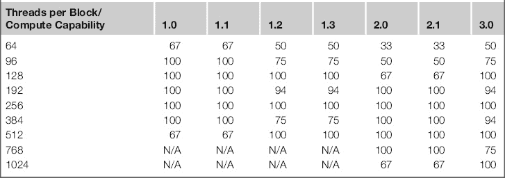

计算 1.0 和 1.2 设备是 G80/G92 系列设备，计算 1.3 设备是 GT200 系列，计算 2.0/2.1 设备是 Fermi 系列，计算 3.0 是 Kepler 系列。

请注意，唯一能在所有硬件级别上实现 100%利用率的线程数量是 256 个。因此，为了最大兼容性，你应该选择 192 个或 256 个线程。然而，数据集应与线程布局匹配，以实现特定的优化。因此，你还应考虑使用 192 线程布局，尤其是在你拥有三点数据布局的情况下。

另一种替代固定线程数量的方法是直接从设备中查找计算级别，并选择能够实现最高设备利用率的最小线程数量。

现在你可能还需要考虑可以调度到给定 SM 中的块数量。当内核中有同步点时，这个问题才会显得重要。这些同步点是每个线程必须等待其他线程达到相同位置的地方。例如，当你进行分阶段读取时，所有线程都必须完成读取。由于执行的性质，一些 warps 可能进展顺利，而一些可能在同步点前进展缓慢。

执行给定块所需的时间或延迟是未定义的。从负载平衡的角度来看，这并不好。你希望有足够的线程可供运行。对于 256 个线程，每个 warp 有 32 个线程，在计算 2.x 硬件上，你可以有 8 个 warps。对于计算 1.x 设备，你可以在任一时刻调度最多 24 个 warps（32 × 24 = 768 个线程），而对于计算 2.x 设备，可以调度 48 个 warps（32 × 48 = 1536 个线程）。块必须完成*整个*执行过程，才能从 SM 中移除。对于支持每块 1024 个线程的计算 2.0x 或更高设备，你可能需要等待那个单独的 warp 完成，而其他所有 warps 都处于空闲状态，实际上使 SM 也处于空闲状态。

因此，线程块越大，你就越有可能等待一个慢速 warp 追赶上来，因为 GPU 不能继续执行，直到所有线程都通过检查点。因此，你可能曾选择较小数量的线程，例如 128 个线程，以减少这种潜在的等待时间。然而，这会降低 Fermi 级硬件的性能，因为设备利用率会降至三分之二。如表 5.1 所示，在计算 2.0 设备（Fermi）上，你需要每块至少 192 个线程才能充分利用 SM。

然而，你不应该过于关注 warp 的数量，因为它们实际上只是表示 SM 上线程总数的一个指标。表 5.3 显示了运行的总线程数，实际上，真正值得关注的是这个总数，以及表 5.1 中显示的利用率百分比。

表 5.2 每个 SM 的块数

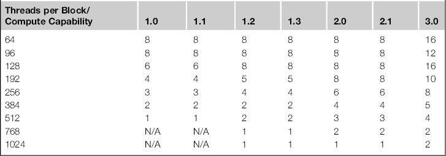

表 5.3 每个 SM 的总线程数

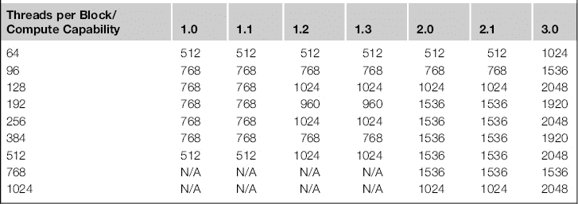

注意，当每个块的线程数为 128 或更少时，从计算 1.3 硬件（GT200 系列）到计算 2.x 硬件（Fermi），你会发现运行的总线程数没有差异。这是因为每个 SM 可以调度的块数是有限制的。线程数的多少

一个 SM 可以支持的线程数增加了，但块数并没有增加。因此，为了实现更好的扩展性，你需要确保至少有 192 个线程，最好是更多。

## 块调度

假设你有 1024 个块需要调度，并且有八个 SM 来调度这些块。在 Fermi 硬件下，每个 SM 最多可以接受 8 个块，但前提是每个块的线程数较低。在合理的线程数下，通常每个 SM 看到 6 到 8 个块。

现在，1024 个块分配给六个 SM，每个 SM 得到 170 个完整的块，还有 4 个块剩余。稍后我们会讨论这些剩余的块，因为它们会引发一个有趣的问题。

对于可以分配给 SM 的 1020 个块，应该如何分配？硬件可以将 6 个块分配给第一个 SM，6 个块分配给第二个 SM，以此类推。或者，它可以轮流将 1 个块分配给每个 SM，这样 SM 0 得到块 0，SM 1 得到块 1，SM 2 得到块 2，等等。NVIDIA 没有具体说明使用哪种方法，但很可能是后者，以便在 SM 之间实现合理的负载平衡。

如果你有 19 个块和四个 SM，将块分配给 SM 直到其满载并不是一个好主意。前三个 SM 会各得到 6 个块，最后一个 SM 会得到 1 个块。最后一个 SM 可能很快完成并空闲，等待其他 SM。这会导致可用硬件的利用率较低。

如果你按轮换方式将块分配给交替的 SM，每个 SM 将获得 4 个块（4 个 SM × 4 个块 = 总共 16 个块），并且有三个 SM 各获得一个额外的块。假设每个块的执行时间相同，通过在 SM 之间平衡块，而不是使某些 SM 过载而其他 SM 空闲，你已经将执行时间减少了 17%。

在实践中，你通常需要处理成千上万的块。在典型的应用中，完成初步的块分配到 SM 后，块调度器会一直空闲，直到任何一个 SM 上的块执行完毕。此时，该块被退役，使用的资源变得空闲。由于所有的块大小相同，*任何*等待块列表中的块都可以被调度。块的执行顺序是故意未定义的，编写问题解决方案时不应隐含假设块会按某种顺序执行。

如果执行了某些关联操作，比如浮点加法，而浮点加法在实践中并不是关联的，这可能会带来严重的问题。在浮点数学中，通过数组执行加法的顺序将影响结果。这是由于舍入误差以及浮点数学的工作方式。结果在所有情况下都是正确的。这不是一个并行执行问题，而是一个排序问题。在单线程 CPU 代码中，你也能看到完全相同的问题。如果你在 CPU 或 GPU 上将一组随机数从下到上或从上到下地加到一个浮点数组中，你会得到不同的答案。更糟糕的是，在 GPU 上，由于块调度未定义，对相同数据的多次运行可能会得到不同但正确的答案。有一些方法可以解决这个问题，我们将在本书后面讨论。所以现在，只需要意识到，由于结果与之前不同，并不一定意味着结果是错误的。

回到剩余块的问题，每当块的数量不是 SM 数量的倍数时，你就会遇到这种情况。通常情况下，你会看到 CUDA 设备配备了奇数数量的 SM，因为制造大型复杂处理器是困难的。随着用于制造处理器的硅材料量增加，某些部分发生故障的可能性也会大幅增加。像许多处理器制造商一样，NVIDIA 会简单地禁用故障的 SM，并将设备作为低规格单元发货。这提高了产量，并为本应有缺陷的设备提供了经济价值。然而，对于程序员来说，这意味着总的 SM 数量不一定是偶数倍数。Fermi 480 系列卡，以及 Tesla S2050/S2070/C2050/C2070 系列，都配备了一个有 1 个 SM 被禁用的 16 SM 设备，从而变成了 15 个 SM。这在 580 系列中得到了修复，但随着未来 GPU 世代的发布，这个问题可能会再次出现。

如果有一些剩余的块，只有在你有一个非常长的内核并且需要等待每个内核完成时，这才是一个问题。例如，在有限时间步长的仿真中，你可能会看到这种情况。如果你有 16 个块，假设使用的是 Fermi 480 系列显卡，15 个块会被分配到每个 SM 上。剩余的块只有在其他 15 个块完成后才会调度。如果每个内核执行需要 10 分钟，那么很可能所有块会在差不多同一时间完成。GPU 会再调度一个额外的块，整个内核调用将等待额外的 10 分钟，直到这个单独的块执行完成。与此同时，其他 14 个 SM 将处于空闲状态。解决这个问题的方法是提供更好的粒度，将少量块拆分成更多的块。

在服务器环境中，你可能不仅仅有 15 个 SM，而是实际拥有多个节点，每个节点有多个 GPU。如果它们的唯一任务是这个内核，那么它们很可能会在内核调用结束时处于空闲状态。在这种情况下，重新设计内核可能会更好，确保块的数量是每个节点上 SM 数量的精确倍数。

从负载均衡的角度来看，这个问题显然不好。因此，在后来的 CUDA 运行时，你可以支持内核重叠，并在同一 CUDA 设备上运行多个独立的内核。使用这种方法，如果你有多个作业源需要调度到 GPU 集群上，你可以保持吞吐量。当 CUDA 设备开始空闲时，它们会从一系列可用内核中选择另一个内核。

## 实际例子—直方图

直方图在编程问题中很常见。它们通过统计数据在多个“箱子”中的分布来工作。当数据点包含一个与某个箱子相关的值时，该箱子中的值就会递增。

在最简单的例子中，你有 256 个箱子，数据范围从 0 到 255。你遍历一个字节数组。如果数组中元素的值是 0，你就增加箱子 0 的值。如果元素的值是 10，你就增加箱子 10 的值，依此类推。

从串行的角度来看，算法非常简单：

```cpp
for (unsigned int i=0; i< max; i++)
{
  bin[array[i]]++;
}
```

在这里，你从数组中提取值，通过 `i` 进行索引。然后，你使用 `++` 运算符递增相应的箱子值。

串行实现会在转换为并行问题时遇到问题。如果你使用 256 个线程来执行这段代码，你会得到多个线程*同时*递增*同一个*箱子中的值。

如果你观察 C 语言如何被转换为汇编代码，你会发现执行这段代码可能需要一系列汇编指令。这些指令会分解成

1. 从数组中读取值到寄存器。

2. 计算基地址和偏移量以定位到正确的箱子元素。

3. 获取现有的箱值。

4. 将箱值增加 1。

5. 将新的箱子值写回内存中的箱子。

问题在于第三步、第四步和第五步不是原子的。原子操作是指在完成之前不能被中断的操作。如果你像 CUDA 的线程模型那样以锁步方式执行这段伪代码，就会遇到问题。两个或更多线程在第三步时获取相同的值。它们都递增该值并写回。最后一个执行写入的线程获胜。值本应递增*N*次，但实际上只递增了一次。所有线程读取相同的值来应用递增，因此你丢失了*N*次递增。

这里的问题是你在串行执行版本中看不到的数据依赖性。每次增量的箱子值必须在下一个线程读取并增量之前完成。线程之间存在共享资源。

这不是一个罕见的问题，CUDA 为此提供了一种原语，称为

```cpp
atomicAdd(&value);
```

这个操作保证了在所有线程之间的加法操作是串行化的。

现在你解决了这个问题，你来到了真正的选择——如何将你必须处理的任务结构化为线程、块和网格。这里有两种方法：任务分解模型或数据分解模型。通常两者都需要考虑。

使用任务分解模型，你只需为输入数组中的每个元素分配一个线程，并让它执行原子加法。这是最简单的编程解决方案，但也有一些主要的缺点。你必须记住，这实际上是一个共享资源。如果你有 256 个箱子和一个包含 1024 个元素的数组，假设均匀分布，那么每个箱子会有 4 个元素在争夺资源。对于大型数组（使用 CUDA 处理小数组没有意义），这个问题成为决定总执行时间的主导因素。

如果假设直方图中的值均匀分布（通常不是这种情况），那么争夺每个箱子的元素数量就是数组元素大小除以箱子数量。对于一个 512 MB 的数组（524,288 个元素），每个箱子将有 131,072 个元素在争夺。在最坏的情况下，所有元素都写入同一个箱子，因此，由于原子内存写入的串行化，实际上你会得到一个串行程序。

在这两种例子中，执行时间受限于硬件处理这种争用的能力和读/写内存带宽。

让我们看看在现实中这是如何运作的。这里是实现这一操作的 GPU 程序。

```cpp
/∗ Each thread writes to one block of 256 elements of global memory and contends for write access ∗/
```

```cpp
__global__ void myhistogram256Kernel_01(
  const unsigned char const ∗ d_hist_data,
  unsigned int ∗ const d_bin_data)
{
  /∗ Work out our thread id ∗/
  const unsigned int idx = (blockIdx.x ∗ blockDim.x) + threadIdx.x;
```

```cpp
  const unsigned int idy = (blockIdx.y ∗ blockDim.y) + threadIdx.y;
```

```cpp
  const unsigned int tid = idx + idy ∗ blockDim.x ∗ gridDim.x;
```

`  /∗ 获取数据值 ∗/`

```cpp
  const unsigned char value = d_hist_data[tid];
```

```cpp
  atomicAdd(&(d_bin_data[value]),1);
}
```

使用 GTX460 显卡，我们测得了 1025 MB/s 的性能。值得注意的是，这个方法并没有随着数组元素的增加而扩展。无论数组的大小如何，你都会得到持续较差的性能。请注意，参与此测试的 GPU——1 GB 的 GTX460——具有 115 GB/s 的内存带宽，所以这显示了通过实现天真解决方案可以达到的糟糕性能。

这个图表，虽然结果不佳，却仅仅告诉你，程序性能受某个因素的限制，而你的任务作为程序员就是找出这个因素并消除它。在这种类型的程序中，影响性能的最可能因素是内存带宽。你正在从输入数组中提取 *N* 个值，并将这些值压缩成 *N* 次写入一个小的 1K（256 个元素 × 每个整数计数器 4 字节）内存区域。

如果你先看内存读取操作，你会发现每个线程读取数组中的一个 *字节* 元素。读取操作在半 warp 层级（16 个线程）合并。最小的传输大小是 32 字节，因此你浪费了大约 50% 的读取内存带宽，表现得相当差。半 warp 的最佳内存读取是最大支持的大小，即 128 字节。为此，每个线程需要读取 4 字节的内存。你可以通过让每个线程处理四个直方图条目而不是一个条目来实现这一点。

我们可以通过读取一个整数来发起一个 4 字节的读取操作，然后像图 5.14 所示那样提取该整数的组成部分。这应该能够提供更好的读取合并，因此提升性能。修改后的内核如下：

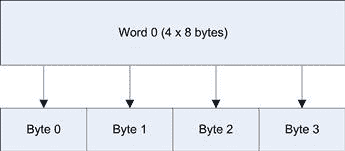

图 5.14 单词到字节的映射。

```cpp
/∗ Each read is 4 bytes, not one, 32 x 4 = 128 byte reads ∗/
__global__ void myhistogram256Kernel_02(
const unsigned int const ∗ d_hist_data,
unsigned int ∗ const d_bin_data)
{
  /∗ Work out our thread id ∗/
  const unsigned int idx = (blockIdx.x ∗ blockDim.x) + threadIdx.x;
```

```cpp
  const unsigned int idy = (blockIdx.y ∗ blockDim.y) + threadIdx.y;
```

```cpp
  const unsigned int tid = idx + idy ∗ blockDim.x ∗ gridDim.x;
```

```cpp
  /∗ Fetch the data value as 32 bit ∗/
  const unsigned int value_u32 = d_hist_data[tid];
```

```cpp
  atomicAdd(&(d_bin_data[ ((value_u32 & 0x000000FF) ) ]),1);
```

```cpp
  atomicAdd(&(d_bin_data[ ((value_u32 & 0x0000FF00) >> 8 ) ]),1);
```

```cpp
  atomicAdd(&(d_bin_data[ ((value_u32 & 0x00FF0000) >> 16 ) ]),1);
```

```cpp
  atomicAdd(&(d_bin_data[ ((value_u32 & 0xFF000000) >> 24 ) ]),1);
}
```

当运行内核时，我们注意到所有的努力并没有带来任何速度提升。事实上，在优化程序时，这种情况是相当常见的。这是一个非常强烈的指示，表明你没有理解瓶颈的根本原因。

需要注意的一个问题是，在 compute 2.x 中，硬件并不会因为只能从半 warp 中合并数据而受到影响，能够进行全 warp 合并。因此，在测试设备 GTX460（compute 2.1 硬件）上，由单个 warp 发出的 32 个单字节读取请求被合并成了一个 32 字节的读取操作。

显然的候选者是原子写操作，而不是通常的内存带宽问题。对此，你需要查看数据分解模型所提供的替代方法。在这里，你需要从数据流的角度出发，寻找数据重用的机会，并优化数据大小，使其能够与共享资源（如缓存或共享内存）有效配合。

你可以看到，256 个桶的争用是一个问题。当多个块从多个 SM 向内存写入数据时，硬件需要在所有处理器的缓存之间同步桶数组的值。为此，它需要从内存中读取当前值，增加它，然后再写回内存。这样有可能将该值永久保存在 L2 缓存中，而 L2 缓存在 Fermi 代硬件中是各 SM 共享的。对于 compute 1.x 硬件来说，你正在进行全局内存的读写操作，因此这种方法会慢上一个数量级。

即便你可以使用 Fermi 硬件上的 L2 缓存，你仍然需要离开 SM 与其他所有 SM 进行同步。此外，你生成的写入模式是散乱的，这在很大程度上依赖于直方图输入数据的特性。这意味着几乎没有合并写入操作，这会严重影响性能。

另一种方法是在每个 SM 内部构建直方图，然后在结束时将直方图写入主内存。这是你必须始终尝试实现的方法，无论是 CPU 编程还是 GPU 编程。你越是利用靠近处理器的资源（在这种情况下是 SM），程序运行得就越快。

我们之前提到过，我们可以使用共享内存，这是一种特殊形式的内存，它位于芯片上，因此非常快速。你可以在共享内存中创建一个 256 桶的直方图，然后在最后执行原子加法操作，将结果写入全局内存。假设每个块只处理一个直方图，你不会减少全局内存的读取或写入次数，但你确实会将所有的写入操作合并到一起。此方法的内核如下：

```cpp
__shared__ unsigned int d_bin_data_shared[256];
```

```cpp
/∗ Each read is 4 bytes, not one, 32 x 4 = 128 byte reads ∗/
__global__ void myhistogram256Kernel_03(
const unsigned int const ∗ d_hist_data,
unsigned int ∗ const d_bin_data)
{
  /∗ Work out our thread id ∗/
  const unsigned int idx = (blockIdx.x ∗ blockDim.x) + threadIdx.x;
  const unsigned int idy = (blockIdx.y ∗ blockDim.y) + threadIdx.y;
  const unsigned int tid = idx + idy ∗ blockDim.x ∗ gridDim.x;
```

```cpp
  /∗ Clear shared memory ∗/
  d_bin_data_shared[threadIdx.x] = 0;
```

```cpp
  /∗ Fetch the data value as 32 bit ∗/
  const unsigned int value_u32 = d_hist_data[tid];
```

```cpp
  /∗ Wait for all threads to update shared memory ∗/
  __syncthreads();
```

```cpp
  atomicAdd(&(d_bin_data_shared[ ((value_u32 & 0x000000FF) ) ]),1);
  atomicAdd(&(d_bin_data_shared[ ((value_u32 & 0x0000FF00) >> 8 ) ]),1);
  atomicAdd(&(d_bin_data_shared[ ((value_u32 & 0x00FF0000) >> 16 ) ]),1);
  atomicAdd(&(d_bin_data_shared[ ((value_u32 & 0xFF000000) >> 24 ) ]),1);
```

```cpp
  /∗ Wait for all threads to update shared memory ∗/
  __syncthreads();
```

```cpp
  /∗ The write the accumulated data back to global memory in blocks, not scattered ∗/
  atomicAdd(&(d_bin_data[threadIdx.x]), d_bin_data_shared[threadIdx.x]);
}
```

该内核必须对共享内存执行额外的清空操作，否则会有来自其他内核的随机数据残留在那里。另外，需要等到所有线程在块内完成共享内存单元的清空操作后，才能允许线程更新任何共享内存单元，因此你需要在开始更新前执行`__syncthreads`。最后，你还需要在结束时执行相同的同步操作，以确保每个线程都完成后，再将结果写回全局内存。

你会发现，通过简单地按顺序安排写入操作以便合并写入，你的性能突然提升了六倍。现在，你可以实现 6800 MB/s 的处理速度。然而，请注意，只有计算能力为 1.2 或更高的设备才能执行此操作，因为只有这些设备支持共享内存的原子操作。

现在，既然你的写入顺序已经正确，接下来需要考虑减少全局内存流量。你必须从源数据中读取每个值，并且每个值只读取一次。你已经使用了最优的读取传输大小，那么接下来我们来看看写入的数据。如果你每个块处理 *N* 个直方图，而不是每个块处理一个直方图，你将写入带宽减少了 *N* 倍。

表 5.4 显示了基于不同的 *N* 值在 Fermi 460 卡（包含七个 SM）上处理 512 MB 直方图时所得到的结果。你可以看到在 *N* 值为 64 时，峰值达到 7886 MB/s。内核如下：

表 5.4 直方图结果

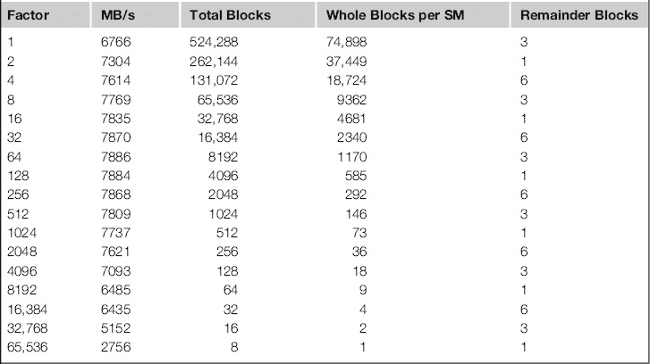

```cpp
/∗ Each read is 4 bytes, not one, 32 x 4 = 128 byte reads ∗/
/∗ Accumulate into shared memory N times ∗/
__global__ void myhistogram256Kernel_07(const unsigned int const ∗ d_hist_data,
                                        unsigned int ∗ const d_bin_data,
                                        unsigned int N)
{
  /∗ Work out our thread id ∗/
  const unsigned int idx = (blockIdx.x ∗ (blockDim.x∗N) ) + threadIdx.x;
  const unsigned int idy = (blockIdx.y ∗ blockDim.y ) + threadIdx.y;
  const unsigned int tid = idx + idy ∗ (blockDim.x∗N) ∗ (gridDim.x);
```

```cpp
  /∗ Clear shared memory ∗/
  d_bin_data_shared[threadIdx.x] = 0;
```

```cpp
  /∗ Wait for all threads to update shared memory ∗/
  __syncthreads();
```

```cpp
  for (unsigned int i=0, tid_offset=0; i< N; i++, tid_offset+=256)
  {
   const unsigned int value_u32 = d_hist_data[tid+tid_offset];
```

```cpp
   atomicAdd(&(d_bin_data_shared[ ((value_u32 & 0x000000FF) ) ]),1);
   atomicAdd(&(d_bin_data_shared[ ((value_u32 & 0x0000FF00) >> 8 ) ]),1);
   atomicAdd(&(d_bin_data_shared[ ((value_u32 & 0x00FF0000) >> 16 ) ]),1);
   atomicAdd(&(d_bin_data_shared[ ((value_u32 & 0xFF000000) >> 24 ) ]),1);
  }
  /∗ Wait for all threads to update shared memory ∗/
  __syncthreads();
```

```cpp
  /∗ The write the accumulated data back to global memory in blocks, not scattered ∗/
  atomicAdd(&(d_bin_data[threadIdx.x]), d_bin_data_shared[threadIdx.x]);
}
```

让我们稍微分析一下这个问题，因为理解你在这里做的事情很重要。你有一个循环`i`，它运行*N*次。这是你将 256 字节数据处理到共享内存直方图的次数。内核会调用 256 个线程，每个线程对应一个桶。因此，你所需要的唯一循环是对要处理的直方图数量进行循环。当你完成一次迭代后，你将在内存中移动 256 字节，处理下一个直方图（`tid_offset += 256`）。

另外需要注意的是，当你使用原子操作时，只有在内核的开始和结束时才需要同步点。添加不必要的同步点通常会减慢程序的运行速度，但可以导致内存中更均匀的访问模式。

现在有趣的是，当你开始每个块处理 32 个或更多直方图时，吞吐量并没有有效提升。每次增加*N*值时，全球内存带宽都会下降一倍。如果全球内存带宽确实是问题所在，你应该看到每增加一个*N*因子，速度是线性提升的。那么，发生了什么？

主要的问题是原子操作。每个线程必须与其他线程竞争访问共享数据区域。数据模式对执行时间有巨大影响，这不是一个好的设计。

当我们回到这个问题时，我们会看看如何编写这样的算法，而不必使用原子操作。

## 结论

我们在这一章中涵盖了很多内容，你现在应该熟悉 CUDA 如何将任务分解为网格、块和线程。我们讲解了块和 warp 在硬件上的调度以及确保硬件上总是有足够线程的必要性。

CUDA 中使用的线程模型是理解如何高效编程 GPU 的基础。你应该理解 CPU 和 GPU 在编程上根本不同，但同时又是相互关联的。

你已经看到，线程如何相对于你要处理的数据进行排列非常重要，并且影响性能。你也看到了，特别是对于需要共享数据的应用程序来说，将某个问题并行化并非总是容易的任务。你应该注意，往往花时间考虑正确的解决方案，比直接用第一个看似合适的方案更为重要。

我们还讨论了原子操作的使用以及它们可能引起的序列化问题。我们提到了分支可能引发的问题，你应该牢记，确保所有线程遵循相同的控制路径是必要的。稍后在书中，我们会更详细地探讨原子操作和分支。

你已经接触过 CUDA 中使用的扩展 C 语法，并且应该能够写出 CUDA 程序，清楚地理解会发生什么。

通过阅读本章，你已经获得了大量知识，希望你不再觉得 CUDA 或并行编程像是某种神秘的黑魔法。

### 问题

1. 确定本章开发的直方图算法的最佳和最差数据模式。是否有常见的使用场景存在问题？你如何克服这个问题？

2. 在不运行算法的情况下，你认为在基于 G80 设计的旧硬件上运行这段代码可能产生的影响是什么？

3. 在 CPU 上处理内存中的数组时，按行列顺序遍历更好，还是按列行顺序遍历更好？当你将代码移植到 GPU 上时，这种情况是否会发生变化？

4. 考虑一段代码，使用四个块，每个块有 256 个线程，和相同代码但使用一个块，包含 1024 个线程。哪个更可能先完成，为什么？每个块在代码的不同位置都会使用四个 `syncthreads()` 调用。这些块不需要块间协作。

5. 在 GPU 中找到的基于 SIMD 的实现与在多核 CPU 中找到的 MIMD 实现相比，有哪些优缺点？

### 答案

最佳情况是数据的均匀分布。这是因为这样可以均匀地加载桶，因此你可以在可用的共享内存银行上得到原子操作的均等分布。

最坏的情况是数据值相同。这会导致所有线程不断地访问相同的共享内存桶，从而通过原子操作和共享内存中的银行冲突串行化整个程序。

不幸的是，一个非常常见的使用场景是排序数据。这提供了最坏情况使用的变种。在这种情况下，一个银行一个接一个地被连续访问原子写操作，从而有效地串行化了问题。

一种解决方案是通过逐步遍历数据集，使得每次迭代都写入一个新的桶。这需要了解数据分布。例如，考虑使用 32 个桶对 256 个数据点建模线性函数的情况。假设数据点 0 到 31 落入第一个桶，并且这种情况在每个桶中都被复制。通过每个桶处理一个值，你可以将写操作分配到各个桶，从而避免冲突。在这个示例中，你会按以下顺序读取数据点：0、32、64、96、1、33、65、97、2、34、66、98 等等。

2. G80 设备（计算 1.0，计算 1.1）不支持共享内存原子操作，因此代码将无法编译。假设你修改它以使用全局内存原子操作，我们在本章前面提供的示例中看到性能下降了七倍。

3. 按行列顺序遍历更好，因为 CPU 很可能会使用预取技术，确保即将访问的数据会被加载到缓存中。至少，整个缓存行将被从内存中提取。因此，当 CPU 进行第二次行访问时，`a[0]` 将会把 `a[1]` 加载到缓存中。

列遍历将导致代码变得更慢，因为在 CPU 上获取单个缓存行不太可能获取在后续循环迭代中使用的数据，除非行大小非常小。在 GPU 上，每个线程获取行中的一个或多个元素，因此，循环遍历通常是按列进行的，整个行由多个独立的线程组成。与 CPU 一样，整个缓存行将在计算 2.x 硬件上被获取。然而，与 CPU 不同，这个缓存行可能会立即被多个线程消耗。

4. 在`syncthreads()`操作期间，整个 block 会暂停，直到每个线程都达到`syncthreads()`检查点。此时，它们都重新变得可调度。每个 block 内的线程数量非常大时，可能意味着 SM 在等待一个 block 中的线程达到检查点时，没有其他可用的 warp 可以调度。哪个线程何时执行是未定义的。这意味着一些线程可以比其他线程更快地向`syncthreads()`检查点推进。这是硬件层面上的设计决策，优先考虑吞吐量而非延迟。每个 block 的线程数量非常高通常仅在 block 中的线程需要相互通信时有用，而不需要通过全局内存进行跨 block 通信。

5. SIMD 模型将指令获取时间分摊到多个执行单元上，其中指令流是相同的。然而，当指令流发生分歧时，执行必须序列化。MIMD 模型专为分歧执行流设计，在执行流分歧时不需要暂停线程。然而，多个获取和解码单元需要更多的硅片和更高的指令带宽要求，以维持多个独立的执行路径。

混合使用 SIMD 和 MIMD 通常是处理大数据集中的控制流和相同操作的最佳方式。你可以在 CPU 上看到这种方式，比如 SSE/MMX/AVX 的支持。在 GPU 上，可以通过 warp 和 block 的方式看到，这些方式允许在更高粒度上进行分歧。
