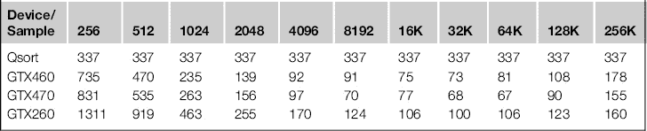

# 第六章

# 使用 CUDA 进行内存管理

## 介绍

在传统的 CPU 模型中，我们拥有所谓的线性或平面内存模型。这意味着任何单个 CPU 核心都可以不受限制地访问任何内存位置。在实践中，对于 CPU 硬件，通常会看到一级（L1）、二级（L2）和三级（L3）缓存。那些优化过 CPU 代码或来自高性能计算（HPC）背景的人会非常熟悉这一点。然而，对于大多数程序员来说，这是他们可以轻松抽象掉的内容。

抽象化已成为现代编程语言的趋势，程序员与底层硬件的距离越来越远。尽管这可以提高生产力，因为问题可以在非常高的层次上指定，但它极度依赖于聪明的编译器，将这些抽象实现为硬件能够理解的层次。尽管理论上很美好，但现实可能稍逊于市场营销所宣扬的理想。我相信，在未来几十年中，我们将看到编译器和语言的巨大改进，使它们能够自动利用并行硬件。然而，在这一点到来之前，尤其是直到我们到达那一步，理解硬件如何运作将是从任何平台中提取最佳性能的关键。

要实现 CPU 系统的真正性能，您需要理解缓存的工作原理。我们将在 CPU 方面进行探讨，然后看看与 GPU 的相似之处。缓存的概念是，大多数程序以串行方式执行，具有各种循环结构，就执行流程而言。如果程序调用了一个函数，那么程序很可能会很快再次调用它。如果程序访问了特定的内存位置，那么大多数程序也很可能在短时间内再次访问该位置。这就是*时间局部性*的原则，即您很可能会重用数据，并在已经使用/执行过后重新执行相同的代码。

从 DRAM（计算机系统的主内存）中获取数据非常缓慢。与处理器时钟速度相比，DRAM 历来一直非常慢。随着处理器时钟速度的提高，DRAM 的速度则越来越滞后。

今天处理器中的 DDR-3 DRAM 的标准运行频率为 1.6 GHz，尽管使用某些高速模块和正确的处理器时，频率可以提升至 2.6 GHz。然而，通常每个 CPU 核心的运行频率大约为 3 GHz。如果没有缓存提供快速访问内存区域的能力，DRAM 的带宽将无法满足 CPU 的需求。由于代码和数据都存在于 DRAM 空间中，如果 CPU 无法从 DRAM 中快速提取程序或数据，它实际上会受到指令吞吐量的限制（即在给定时间内执行的指令数量）。

这就是*内存带宽*的概念，即我们在给定时间内能够读取或存储到 DRAM 的数据量。然而，还有一个重要的概念——*延迟*。延迟是指响应取数请求所需的时间。这可能是数百个处理器周期。如果程序需要从内存中获取四个元素，那么发出所有请求并等待它们到达是有意义的，而不是一个一个请求，等待每个请求的结果，再发出下一个请求，如此循环。如果没有缓存，处理器的性能将受到内存带宽*和*延迟的限制。

为了用日常术语理解带宽和延迟，想象一个超市结账过程。在某个商店里有*N*个结账点，并非所有结账点都有人值守。当只有两个结账点在使用（有人值守）时，顾客排成长龙，等着支付购物款项。吞吐量或带宽是指在给定时间内处理的顾客数量（例如一分钟）。顾客在队列中等待的时间则是延迟的衡量标准，即顾客加入队列后，等待多长时间才得以支付并离开。

随着队列变大，店主可能会开设更多的结账点，队列就会在新旧结账点之间分散。随着两个新的结账点的开设，结账区的带宽翻倍，因为现在有两倍的人可以在相同的时间内得到服务。延迟也减半，因为平均而言，队列只有原来的一半大小，因此每个人的等待时间也只有原来的一半。

然而，这并不是免费的。雇佣更多的结账助理需要花费资金，同时需要将更多的零售空间分配给结账点，而不是用于产品的货架空间。在处理器设计中也存在类似的权衡，涉及到内存总线的宽度和内存设备的时钟频率。设备上的硅空间是有限的，通常外部内存总线的宽度受到处理器上物理引脚数量的限制。

另一个我们需要考虑的概念是*事务开销*。每个顾客支付时都会有一定的开销。有些人可能只有两三件商品，而另一些人可能购物车里满满当当。店主们喜欢购物车里的顾客，因为他们能更高效地处理，即结账人员的时间更多地用于结账商品，而不是处理支付的开销。

我们在 GPU 中也看到了类似的情况。一些内存事务相比于处理它们所需的固定开销来说非常轻量。相对于开销时间，获取的内存单元数量较少，换句话说，峰值效率的百分比较低。其他的则较大，需要花费大量时间来处理，但能够高效地服务并接近峰值内存传输速率。这些事务在一个极端表现为基于字节的内存事务，而在另一个极端则表现为基于长字的事务。为了达到峰值内存效率，我们需要大量的大事务，并且尽量避免小事务，或者说很少出现小事务。

## 缓存

缓存是与处理器核心物理接近的高速内存单元。缓存在硅面积上非常昂贵，这也意味着更大的芯片、更低的良率和更贵的处理器。因此，许多服务器机器中的英特尔 Xeon 处理器，配备了巨大的 L3 缓存，其制造成本远高于桌面版本的处理器，后者在处理器芯片上配备较少的缓存。

缓存的最大速度与缓存的大小成正比。L1 缓存是最快的，但其大小通常限制在 16K、32K 或 64K 左右，通常分配给单个 CPU 核心。L2 缓存较慢，但大得多，通常为 256K 到 512K。L3 缓存可能存在，也可能不存在，通常其大小为几兆字节。L2 和/或 L3 缓存可能是多个处理器核心共享的缓存，或者是分别维持与指定核心直接连接的独立缓存。通常，至少 L3 缓存是多个处理器核心之间共享的缓存。这允许设备内核心间通过共享内存进行快速通信。

G80 和 GT200 系列 GPU 没有类似 CPU 的缓存。它们确实有一个硬件管理的缓存，在常量和纹理内存方面的行为类似于只读 CPU 缓存。GPU 主要依赖于程序员管理的缓存或共享内存部分。

Fermi GPU 实现首次引入了非程序员管理的数据缓存的概念。该架构每个 SM 都有一个既可以由程序员管理又可以由硬件管理的 L1 缓存。它还在所有 SM 之间共享一个 L2 缓存。

那么，缓存是否需要跨处理器核心或 SM 共享呢？这种安排有何意义？这对于使用相同共享缓存与其他设备通信有着有趣的影响。它允许处理器之间的通信，无需完全访问全局内存。这对于原子操作尤其有用，因为 L2 缓存是统一的，所有 SM 可以看到给定内存位置的值的最新版本。处理器无需写入慢速的全局内存再读取回来，以确保处理器之间的一致性。


图 6.1 SM L1/L2 数据路径。

核心。在 G80/GT200 系列硬件上，由于没有统一缓存，我们正是看到这种不足，导致与 Fermi 及之后的硬件相比，原子操作相对较慢。

缓存对大多数程序是有用的。许多程序员对如何在软件中实现良好的性能并不关心，或者对这方面的理解有限。引入缓存意味着大多数程序能合理地运行，程序员不需要过多关心硬件是如何工作的。这种编程的简便性对于初期开发很有帮助，但在大多数情况下，你可以做得更好。

新手 CUDA 程序员与专家之间的差距可以达到一个数量级。我希望通过阅读本书，你能够从现有的代码中获得数倍的加速，并逐步能够编写 CUDA 代码，这些代码能显著超越等效的串行代码。

### 数据存储的类型

在 GPU 上，我们有多个层级的数据存储区域，每个区域都有其潜在的带宽和延迟，如表 6.1 所示。

表 6.1 按内存类型划分的访问时间


在最高且最优先级的层级是设备内部的寄存器。接下来是共享内存，实际上是程序员管理的 L1 缓存，再是常量内存、纹理内存、常规设备内存，最后是主机内存。注意，存储类型之间的速度差异是多么显著。接下来我们将依次讨论每种内存类型的使用，并介绍如何最大化每种类型的使用收益。

传统上，大多数文献会从查看全局内存开始，因为全局内存通常在性能中扮演关键角色。如果你搞错了全局内存的访问模式，那就可以忘记其他的内容，直到你纠正了这个模式。我们在这里采取不同的方法，首先看如何高效地利用设备内部的资源，然后再向外扩展到全局内存和主机内存。这样，你可以理解每个层级的效率，并知道如何提取这些效率。

大多数 CUDA 程序是逐步开发的，至少最初是专门使用全局内存。一旦有了初步的实现，就会考虑使用其他类型的内存，如零拷贝内存、共享内存、常量内存，最终是寄存器。为了获得最佳的程序，你需要在开发过程中就考虑这些问题。因此，快速的内存类型不是事后考虑的，而是在一开始就被考虑进去，你也清楚在哪里以及如何改进程序。你应该持续思考的不仅是如何高效访问全局内存，还包括如何消除那些访问，特别是对于以某种方式被重复使用的数据。

## 寄存器使用

与 CPU 不同，GPU 每个 SM（流处理器）有成千上万的寄存器。可以将 SM 看作是一个多线程的 CPU 核心。在典型的 CPU 中，我们有两个、四个、六个或八个核心。而在 GPU 中，我们有 *N* 个 SM 核心。在费米 GF100 系列中，顶级设备有 16 个 SM。GT200 系列每个设备最多有 32 个 SM。G80 系列每个设备最多有 16 个 SM。

看起来，费米架构的 SM 数量比其前任少，这似乎很奇怪。直到你意识到每个费米 SM 包含更多的 SP（流处理器），而正是这些处理器承担了“大部分”工作。由于每个核心的 SP 数量不同，你会看到每个核心的线程数量存在显著差异。典型的 CPU 每个核心支持一个或两个硬件线程。相比之下，GPU 每个核心有 8 到 192 个 SP，这意味着每个 SM 在任何时候都可以执行这一数量的并发硬件线程。

在 GPU 中，应用线程是流水线处理的，通过上下文切换，并被分派到多个 SM，这意味着在 GPU 设备的所有 SM 上，活跃线程的数量通常在几万个数量级。

我们在 CPU 和 GPU 架构之间看到的一个主要区别是它们如何映射寄存器。CPU 通过寄存器重命名和堆栈来运行大量线程。为了运行新任务，CPU 需要进行上下文切换，这涉及将所有寄存器的状态存储到堆栈（系统内存）中，然后从上次运行的线程恢复状态。这可能需要几百个 CPU 周期。如果你将太多线程加载到 CPU 上，它将花费大量时间仅仅是在进行上下文切换时交换寄存器。加载过多线程后，*有效*工作吞吐量会迅速下降。

相反，GPU 则恰恰相反。它利用线程来隐藏内存访问和指令执行的延迟，因此在 GPU 上线程过少意味着 GPU 会处于空闲状态，通常是在等待内存事务。GPU 也不使用寄存器重命名，而是将真实寄存器分配给每一个线程。因此，当需要进行上下文切换时，它几乎没有任何开销。上下文切换时发生的唯一事情就是更新当前寄存器集的选择器（或指针），使其指向下一个将执行的 warp 的寄存器集。

请注意，我在这里使用了“warp”这一概念，详细内容请参考第五章中的线程部分。Warp 只是将线程按组调度在一起。在当前硬件中，warp 包含 32 个线程。因此，我们会在单个 SM 中交换或调度 32 个线程的组。

每个 SM 可以调度多个块。SM 级别的块仅仅是独立 warp 的逻辑组。每个内核线程所需的寄存器数在编译时计算。所有的块大小相同，并且有已知数量的线程，每个块的寄存器使用量是已知并固定的。因此，GPU 可以为每个调度到硬件上的块分配固定数量的寄存器。

在线程级别，这对程序员是透明的。然而，一个请求每个线程过多寄存器的内核可能会限制 GPU 在 SM 上调度的块数量，从而限制运行的线程总数。线程太少会导致硬件利用不足，性能会迅速下降。线程太多则可能导致资源不足，整个线程块将被从调度队列中移除，无法被调度到 SM。

注意这个效果，因为它可能导致应用程序突然性能下降。如果之前应用程序使用了四个块，现在它使用了更多的寄存器，导致只剩下三个块可用，你可能会看到 GPU 吞吐量下降四分之一。你可以使用各种性能分析工具来查看此类问题，具体内容可以参见第七章的性能分析部分。

根据你所使用的具体硬件，每个 SM 有 8K、16K、32K 或 64K 的寄存器空间供*所有线程*使用。你需要记住，每个线程需要*一个寄存器*。因此，在 C 语言中，简单的局部浮动变量会使用*N*个寄存器，其中*N*是调度的线程数。对于 Fermi 级硬件，每个 SM 有 32K 的寄存器空间。每个块 256 个线程时，你将得到（（32,768 字节/每个寄存器 4 字节）/256 个线程）= 每个线程 32 个寄存器可用。为了达到 Fermi 上最大可用寄存器数 64（G80/GT200 上是 128），你需要将线程数减少一半，只保留 128 个线程。你可以为每个 SM 分配一个单独的块，并在该块中使用最大允许的寄存器数量。同样，你也可以拥有八个由 32 个线程组成的块（8 × 32 = 256 个线程总数），每个块使用最大数量的寄存器。

如果你能够利用最大数量的寄存器，例如，利用它们来处理数组的某一部分，那么这种方法可以非常有效。它之所以有效，是因为这样的值集通常是数据集中*N*个独立的元素。如果每个元素是独立的，你可以在单个线程中创建指令级并行性（ILP）。硬件会通过流水线处理许多独立指令来利用这一点。稍后你会看到这个方法在实践中的示例。

然而，对于大多数内核，所需的寄存器数量相对较少。如果你将寄存器需求从 128 降低到 64，你可以将另一个块调度到同一个 SM 中。例如，使用 32 个寄存器，你可以调度四个块。通过这样做，你实际上是在增加线程总数。在 Fermi 架构上，每个 SM 最多可以有 1536 个线程，通常情况下，越高的占用率，程序执行速度越快。你会达到一个点，拥有足够的线程级并行性（TLP）来隐藏内存延迟。要进一步提高性能，你需要采用更大的内存事务或引入 ILP（指令级并行性），即在单个线程中处理数据集的多个元素。

然而，每个 SM 可以调度的 warp 数量是有限制的。因此，将寄存器数量从 32 个减少到 16 个并不会得到八个块。我们受到 192 个线程的限制，如表 6.2 所示。

表 6.2 Fermi 架构按线程使用的寄存器可用性


表 6.2 涉及 Fermi 架构。对于 Kepler 架构，只需将这里显示的寄存器和块的数量加倍。我们使用了 192 和 256 个线程，因为它们能够较好地利用硬件。请注意，内核使用 16 个与 20 个寄存器并不会引入额外的块到 SM 中。这是因为每个 SM 可分配的 warp 数量有限。因此，在这种情况下，你可以轻松增加寄存器的使用而不影响在给定 SM 上运行的线程总数。

你想使用寄存器来避免使用较慢的内存类型，但必须小心确保有效利用它们。例如，假设我们有一个循环，每次根据某个布尔变量的值设置每一位。实际上，我们将把 32 个布尔值打包到一个字的 32 位中。我们可以将其写成一个循环，每次通过将新的布尔值移到字中的正确位置来修改内存位置，如下所示：

```cpp
for (i=0; i<31; i++)
{
 packed_result |= (pack_array[i] << i);
}
```

这里我们从一个数组中读取元素`i`，将其打包成一个整数`packed_result`。我们将布尔值按必要的位数左移，然后使用按位`或`运算符与先前的结果进行合并。

如果参数`packed_result`存在于内存中，那么你将进行 32 次内存读写操作。我们也可以将参数`packed_result`放入一个局部变量中，编译器将其放入寄存器中。由于我们将数据累积到寄存器中，而不是主内存中，然后只将*结果*写入主内存，因此可以节省 32 次内存读写中的 31 次。

回顾一下表 6.1，你可以看到进行全局内存操作需要几百个周期。假设一次全局内存读写操作需要 500 个周期。对于每个值，你需要读取、应用`or`操作，然后将结果写回。因此，你将需要 32 次读取 + 32 次写入 = 64 × 500 周期 = 32,000 周期。寄存器版本将消除 31 次读取和 32 次写入操作，将 500 周期的操作替换为单周期操作。因此，你将得到


显然，这在周期数上是一个巨大的减少。我们在某些问题领域中执行相对常见的操作时，性能提升了 31 倍。

我们可以看到类似的关系，常见的归约操作如`sum`、`min`、`max`等也是如此。归约操作是通过某个函数将数据集缩减为更小的集合，通常是单个项。因此，`max (10, 12, 1, 4, 5)`将返回一个单一的值 12，即给定数据集中的最大值。

将数据累积到寄存器中节省了大量的内存写入。在我们的位打包示例中，我们将内存写入减少了 31 倍。无论你是使用 CPU 还是 GPU，这种寄存器优化都将极大提高程序的执行速度。

然而，这给程序员带来了负担，需要考虑哪些参数在寄存器中，哪些在内存中，哪些寄存器需要复制回内存等。这似乎是相当麻烦的事，对于普通程序员来说，通常也是如此。因此，我们看到大量的代码直接操作内存。大多数情况下，CPU 上的缓存内存显著掩盖了这个问题。累积的值通常保存在 L1 缓存中。如果缓存使用写回策略，其中值不需要立即写回主内存，而是在稍后进行，这样性能还算可以。需要注意的是，L1 缓存仍然比寄存器慢，因此这种解决方案仍然是次优的，可能比实际应该有的速度慢几倍。

一些编译器可能会检测到这样的低效，并在优化阶段实现将数据加载到寄存器中。其他编译器则可能不会。依赖编译器的优化来修复糟糕的编程可能会让你受到编译器优化质量的制约。你可能会发现，随着优化级别的提高，程序中会出现错误。这可能并不是编译器的错。C 语言的定义相当复杂。随着优化级别的提升，可能会因为漏掉`volatile`关键字等原因，出现细微的错误。自动化测试脚本和与未优化版本进行对比测试是确保正确性的一种有效解决方案。

你还应该意识到，优化编译器的供应商并不总是选择实现最佳的解决方案。如果某个优化策略被编译器供应商采用后，仅有 1%的程序会失败，那么由于可能产生的支持问题，该策略不太可能被采用。

GPU 的计算速率远超其内存带宽能力。Fermi 硬件的内存峰值带宽约为 190 GB/s，计算性能峰值超过 1 teraflop。这是内存带宽的五倍以上。在 Kepler GTX680/Tesla K10 上，计算能力提升到 3 teraflops，但内存带宽几乎与 GTX580 相同。在位打包示例中，如果没有寄存器优化，并且系统没有缓存，你每次循环迭代将需要一次读取和一次写入。每个整数或浮点数值的大小为 4 字节。由于需要读取和写入总共 8 字节，在理论上，我们在这个示例中能够实现的最佳性能是内存带宽的八分之一。以 190 GB/s 为例，这相当于每秒约 250 亿次操作。

在实际应用中，你永远无法接近这个数值，因为需要考虑循环索引和迭代次数，以及原始内存带宽。然而，这种背面的计算方式在你开始编写任何代码之前，能够为你提供一些关于应用程序上限的概念。

将我们的 31 倍减少因子应用到内存操作次数上，可以实现理论上的峰值性能，达到此数值的 31 倍，即每秒大约 775 亿次迭代。实际上，我们会遇到设备内的其他限制。然而，你可以看到，通过在可能的地方积累或利用寄存器，我们能够轻松地实现比简单的全局内存版本好得多的性能。

为了获得一些真实的数据，我们将编写一个程序，分别在全局内存和寄存器上进行位打包操作。结果如下：

```cpp
ID:0 GeForce GTX 470:Reg. version faster by: 2.22ms (Reg=0.26ms, GMEM=2.48ms)
ID:1 GeForce 9800 GT:Reg. version faster by: 52.87ms (Reg=9.27ms, GMEM=62.14ms)
ID:2 GeForce GTX 260:Reg. version faster by: 5.00ms (Reg=0.62ms, GMEM=5.63ms)
ID:3 GeForce GTX 460:Reg. version faster by: 1.56ms (Reg=0.34ms, GMEM=1.90ms)
```

生成这些结果的两个内核如下：

```cpp
__global__ void test_gpu_register(u32 ∗ const data, const u32 num_elements)
{
 const u32 tid = (blockIdx.x ∗ blockDim.x) + threadIdx.x;
 if (tid < num_elements)
 {
  u32 d_tmp = 0;

  for (int i=0;i<KERNEL_LOOP;i++)
  {
   d_tmp |= (packed_array[i] << i);
```

`  }`

```cpp

  data[tid] = d_tmp;
 }
}

__device__ static u32 d_tmp = 0;
__global__ void test_gpu_gmem(u32 ∗ const data, const u32 num_elements)
{
 const u32 tid = (blockIdx.x ∗ blockDim.x) + threadIdx.x;
 if (tid < num_elements)
 {
  for (int i=0;i<KERNEL_LOOP;i++)
  {
   d_tmp |= (packed_array[i] << i);
  }

  data[tid] = d_tmp;
 }
}
```

这两个内核的唯一区别在于一个使用了全局变量`d_tmp`，另一个使用了本地寄存器。查看结果，你可以看到表 6.3 中的加速比。你会看到平均加速比为 7.7 倍。也许最令人惊讶的是，最快的加速来自于那些 SM 数量最多的设备，这提示了一个我希望你已经发现的问题。在全局内存版本的内核中，每个线程来自每个块都要读取和写入`d_tmp`。无法保证这些操作的执行顺序，因此程序的输出是不确定的。该内核执行得非常顺利，且没有检测到 CUDA 错误，但答案总是无意义的。这种类型的错误是在将串行代码转换为并行代码时，非常常见的错误。

表 6.3 使用寄存器相对于全局内存的加速比


奇怪的答案总是表明某些地方出了问题。那么如何修正这个问题呢？在寄存器版本中，每个线程写入一个唯一的寄存器。在 GMEM（全局内存）版本中，它必须做同样的事情。因此，你只需要替换原始的`d_tmp`定义：

```cpp
__device__ static u32 d_tmp = 0;
```

通过

```cpp
__device__ static u32 d_tmp[NUM_ELEM];
```

内核需要更新如下：

```cpp
__global__ void test_gpu_register(u32 ∗ const data, const u32 num_elements)
{
 const u32 tid = (blockIdx.x ∗ blockDim.x) + threadIdx.x;
 if (tid < num_elements)
 {
  u32 d_tmp = 0;

  for (int i=0;i<KERNEL_LOOP;i++)
  {
   d_tmp |= (packed_array[i] << i);
  }

  data[tid] = d_tmp;
 }
}
```

现在，每个线程可以读取和写入一个独立的全局内存区域。那么现在的加速比如何呢？请参见表 6.4。

表 6.4 使用寄存器代替 GMEM 的实际加速比


正如你从表 6.4 中看到的，平均加速比降至仅 1.7 倍。如果没有 9800GT（一个 Compute 1.1 设备），你会看到在这段简单的代码中，平均加速几乎达到两倍。在可能的情况下，你总是需要通过其他方式避免全局内存写入。像第一个例子那样趋向于单一的内存地址，会迫使硬件串行化内存操作，从而导致糟糕的性能。

现在让这段代码更快变得相当简单。循环通常效率非常低，因为它们会导致分支，从而可能导致管道停顿。更重要的是，它们会消耗对最终结果没有贡献的指令。循环代码将包含循环计数器的增量、结束循环条件的测试，以及每次迭代的分支。相比之下，每次迭代的有用指令将从`pack_array`加载值，将其左移*N*位，并与现有的`d_tmp`值进行`or`操作。单从操作来看，我们可以看到大约 50%的操作是围绕循环展开的。你可以直接查看下面的 PTX（并行线程执行）代码来验证这一点。为了便于阅读虚拟汇编代码，执行循环的指令已用粗体标出。

```cpp
 .entry _Z18test_gpu_register1Pjj (
  .param .u64 __cudaparm__Z18test_gpu_register1Pjj_data,
  .param .u32 __cudaparm__Z18test_gpu_register1Pjj_num_elements)
{
 .reg .u32 %r<27>;
 .reg .u64 %rd<9>;
 .reg .pred %p<5>;
 // __cuda_local_var_108903_15_non_const_tid = 0
 // __cuda_local_var_108906_13_non_const_d_tmp = 4
 // i = 8
 .loc 16 36 0
$LDWbegin__Z18test_gpu_register1Pjj:
$LDWbeginblock_180_1:
 .loc 16 38 0
 mov.u32  %r1, %tid.x;
 mov.u32  %r2, %ctaid.x;
 mov.u32  %r3, %ntid.x;
 mul.lo.u32  %r4, %r2, %r3;
 add.u32  %r5, %r1, %r4;
 mov.s32  %r6, %r5;
 .loc 16 39 0
 ld.param.u32  %r7, [__cudaparm__Z18test_gpu_register1Pjj_num_elements];
 mov.s32  %r8, %r6;
 setp.le.u32  %p1, %r7, %r8;
 @%p1 bra  $L_0_3074;
$LDWbeginblock_180_3:
 .loc 16 41 0
 mov.u32  %r9, 0;
 mov.s32  %r10, %r9;
$LDWbeginblock_180_5:
 .loc 16 43 0
 mov.s32  %r11, 0;
 mov.s32  %r12, %r11;
 mov.s32  %r13, %r12;
 mov.u32  %r14, 31;
 setp.gt.s32  %p2, %r13, %r14;
 @%p2 bra  $L_0_3586;
$L_0_3330:
 .loc 16 45 0
 mov.s32  %r15, %r12;
 cvt.s64.s32  %rd1, %r15;
 cvta.global.u64  %rd2, packed_array;
 add.u64  %rd3, %rd1, %rd2;
 ld.s8  %r16, [%rd3+0];
 mov.s32  %r17, %r12;
 shl.b32  %r18, %r16, %r17;
 mov.s32  %r19, %r10;
```

` or.b32  %r20, %r18, %r19;`

```cpp
 mov.s32  %r10, %r20;
 .loc 16 43 0
 mov.s32  %r21, %r12;
 add.s32  %r22, %r21, 1;
 mov.s32  %r12, %r22;
$Lt_0_1794:
 mov.s32  %r23, %r12;
 mov.u32  %r24, 31;
 setp.le.s32  %p3, %r23, %r24;
 @%p3 bra  $L_0_3330;
$L_0_3586:
$LDWendblock_180_5:
 .loc 16 48 0
 mov.s32  %r25, %r10;
 ld.param.u64  %rd4, [__cudaparm__Z18test_gpu_register1Pjj_data];
 cvt.u64.u32  %rd5, %r6;
 mul.wide.u32  %rd6, %r6, 4;
 add.u64  %rd7, %rd4, %rd6;
 st.global.u32  [%rd7+0], %r25;
$LDWendblock_180_3:
$L_0_3074:
$LDWendblock_180_1:
 .loc 16 50 0
 exit;
$LDWend__Z18test_gpu_register1Pjj:
 }
```

因此，PTX 代码首先测试`for`循环是否实际会进入循环。这是在标记为`$LDWbeginblock_180_5`的块中完成的。标记为`$Lt_0_1794`的代码然后执行循环操作，跳回标记`$L_0_3330`，直到循环完成 32 次迭代。标记为`$L_0_3330`的其他代码执行该操作：

```cpp
  d_tmp |= (packed_array[i] << i);
```

请注意，除了循环开销外，由于`packed_array`是通过变量索引的，代码必须在每次迭代时计算地址：

```cpp
 cvt.s64.s32  %rd1, %r15;
 cvta.global.u64  %rd2, packed_array;
 add.u64  %rd3, %rd1, %rd2;
```

这样做相当低效。与展开后的版本相比，我们可以看到一些相当有趣的情况：

```cpp
 .entry _Z18test_gpu_register2Pjj (
  .param .u64 __cudaparm__Z18test_gpu_register2Pjj_data,
  .param .u32 __cudaparm__Z18test_gpu_register2Pjj_num_elements)
 {
 .reg .u32 %r<104>;
```

` .reg .u64 %rd<6>;`

```cpp
 .reg .pred %p<3>;
 // __cuda_local_var_108919_15_non_const_tid = 0
 .loc 16 52 0
$LDWbegin__Z18test_gpu_register2Pjj:
$LDWbeginblock_181_1:
 .loc 16 54 0
 mov.u32  %r1, %tid.x;
 mov.u32  %r2, %ctaid.x;
 mov.u32  %r3, %ntid.x;
 mul.lo.u32  %r4, %r2, %r3;
 add.u32  %r5, %r1, %r4;
 mov.s32  %r6, %r5;
 .loc 16 55 0
 ld.param.u32  %r7, [__cudaparm__Z18test_gpu_register2Pjj_num_elements];
 mov.s32  %r8, %r6;
 setp.le.u32  %p1, %r7, %r8;
 @%p1 bra  $L_1_1282;
 .loc 16 57 0
 ld.global.s8  %r9, [packed_array+0];
 ld.global.s8  %r10, [packed_array+1];
 shl.b32  %r11, %r10, 1;
 or.b32  %r12, %r9, %r11;
 ld.global.s8  %r13, [packed_array+2];
 shl.b32  %r14, %r13, 2;
 or.b32  %r15, %r12, %r14;

[Repeated code for pack_array+3 to packed_array+29 removed for clarity]

 ld.global.s8  %r97, [packed_array+30];
 shl.b32  %r98, %r97, 30;
 or.b32  %r99, %r96, %r98;
 ld.global.s8  %r100, [packed_array+31];
 shl.b32  %r101, %r100, 31;
 or.b32  %r102, %r99, %r101;
 ld.param.u64  %rd1, [__cudaparm__Z18test_gpu_register2Pjj_data];
 cvt.u64.u32  %rd2, %r6;
 mul.wide.u32  %rd3, %r6, 4;
 add.u64  %rd4, %rd1, %rd3;
 st.global.u32  [%rd4+0], %r102;
$L_1_1282:
$LDWendblock_181_1:
 .loc 16 90 0
 exit;
$LDWend__Z18test_gpu_register2Pjj:
 }
```

现在几乎所有指令都对结果有所贡献。循环开销已消失。`packed_array`的地址计算简化为一个编译时解决的基地址加偏移量类型的地址。一切变得更加简洁，但在 C 代码和虚拟 PTX 汇编代码中都变得更长。

这里的重点不是理解 PTX，而是看到 C 代码中微小的变化对生成的虚拟汇编代码的巨大影响。它的目的是让你明白像循环展开这样的技术在许多情况下可以带来巨大的好处。我们在第九章的优化部分中会详细讨论 PTX 以及它是如何在实际执行的代码中转换的。

那么，这在加速方面有什么效果呢？请参见表 6.5。你可以看到，在 9800GT 或 GTX260 上，几乎没有任何效果。然而，在更现代的 2.x 架构硬件上，GTX460 和 GTX470 分别获得了 2.4 倍和 3.4 倍的加速。如果回顾纯 GMEM 实现，在 GTX470 上这是 6.4 倍的加速。为了让这个对比更加清晰，如果原始程序需要六个半小时才能运行，那么优化后的版本只需一个小时。

表 6.5 循环展开的效果


寄存器优化对代码执行时间有巨大的影响。花时间查看程序的*内部循环*所生成的 PTX 代码。你能否展开循环，将其转换成单个或一组表达式？考虑一下你的代码，你会看到显著的性能提升。寄存器的使用更好，比如消除内存访问，或提供额外的 ILP，是加速 GPU 内核的最佳方式之一。

## 共享内存

共享内存实际上是一个用户控制的 L1 缓存。L1 缓存和共享内存每个 SM 共享一个 64K 的内存段。在 Kepler 架构中，可以根据应用需求配置为 16K 块，以偏向 L1 或共享内存。在 Fermi 架构中，选择为 16K 或 48K，以偏向 L1 或共享内存。Fermi 之前的硬件（计算能力 1.×）有固定的 16K 共享内存，并且没有 L1 缓存。共享内存的带宽约为 1.5 TB/s，且延迟极低。显然，这比全局内存的最高 190 GB/s 要强大得多，但大约是寄存器速度的五分之一。

实际上，低端显卡的全局内存速度只有高端显卡的十分之一。可是，共享内存的速度由核心时钟频率决定，核心时钟频率在所有 GPU 中相对保持一致（大约 20%的波动）。这意味着，为了从任何显卡中获得最大性能，除了使用寄存器外，还必须有效利用共享内存，而不仅仅是高端显卡。

实际上，仅通过查看带宽数据——共享内存为 1.5 TB/s，最佳全局内存访问为 190 GB/s——你可以看到它们之间的比例是 7:1。换句话说，如果你能够有效利用共享内存，理论上可以获得 7 倍的加速。显然，共享内存是每个关心性能的 CUDA 程序员需要深入了解的概念。

然而，GPU 采用了加载-存储的内存模型，即任何操作数必须在操作之前先加载到寄存器中。因此，将一个值加载到共享内存中，而不是直接加载到寄存器中，必须通过数据重用、全局内存合并或线程间数据共享来证明其合理性。否则，直接将全局内存的值加载到寄存器中，能实现更好的性能。

共享内存是一种银行切换架构。在 Fermi 上，它有 32 个银行宽，而在 G200 和 G80 硬件上，它有 16 个银行宽。每个数据银行的大小为 4 字节，足够存储一个单精度浮点数据项或一个标准的 32 位整数值。Kepler 还引入了一种特殊的 64 位宽模式，这样较大的双精度值就不再跨越两个银行。每个银行每个周期只能处理一个*单独*的操作，不管有多少线程发起该操作。因此，如果每个 warp 中的线程都访问一个独立的银行地址，每个线程的操作都将在同一个周期内处理。需要注意的是，这里并不要求一对一的顺序访问，只要每个线程访问共享内存中的一个独立银行即可。实际上，有一个交叉开关连接着任何一个银行和任何一个线程。当你需要交换数据项时（例如，在排序算法中），这就非常有用，我们稍后将展示一个例子。

还有一个非常有用的情况，就是每个线程在一个 warp 中读取*相同*的银行地址。与常量内存类似，这会触发一个广播机制，将值传递给 warp 中的所有线程。通常，线程零会写入该值，以便与 warp 中的其他线程通信一个公共值。见图 6.2。


图 6.2 共享内存模式。

然而，如果我们有*其他任何模式*，就会出现不同程度的银行冲突。这意味着，其他线程会被挂起，处于空闲状态，而访问共享内存地址的线程则一个接一个排队。一个重要的方面是，这*不会*被切换到另一个 warp 所隐藏，因此我们确实会导致 SM 空闲。因此，尽可能避免银行冲突，因为 SM 会空闲，直到所有的银行请求被处理完毕。

然而，这在实际中往往不可行，例如我们在第五章中看到的直方图例子。在这里，数据是未知的，因此它会落入哪个银行完全取决于数据模式。

最坏的情况是每个线程都写入同一个银行，这时我们会得到 32 次串行访问同一个银行。通常我们会看到这种情况出现在线程以非 32 的步幅访问银行时。在步幅按 2 的幂递减（例如，在并行归约中）时，我们也会看到这种情况，随着每一轮操作的进行，银行冲突会越来越严重。

### 使用共享内存进行排序

这里引入一个实际的例子，使用排序。排序算法通过获取一个随机数据集并生成一个已排序的数据集来工作。因此，我们需要*N*个输入数据项和*N*个输出数据项。排序的关键在于确保最小化对内存的读取和写入次数。许多排序算法实际上是多次通过的，这意味着我们会读取*N*中的每个元素，读取*M*次，这显然不是一个好选择。

快速排序算法是串行世界中首选的排序算法。作为一种分治算法，它看起来似乎是并行方法的一个好选择。然而，默认情况下它使用递归，这仅在 CUDA 计算能力为 2.x 的设备中受到支持。典型的并行实现会为数据的每次分割生成一个新线程。目前的 CUDA 模型（也请参阅关于 Kepler 动态并行性的讨论，见第十二章）要求在内核启动时指定总线程数，或者每一层级进行一系列内核启动。数据会导致显著的分支分歧，这对于 GPU 来说也不是一个好情况。虽然有一些方法可以解决这些问题，但这些问题使得快速排序并不是在 Kepler 之前的 GK110/Tesla K20 GPU 上使用的最佳算法。事实上，你会发现最佳的串行算法并不一定是最佳的并行算法，因此最好一开始就以开放的心态来考虑最适合的方案。

在并行世界中，常见的一个算法是归并排序（见图 6.3）。它通过递归地将数据分割成越来越小的包，直到最终只剩下两个值需要排序。然后，每个已排序的列表被合并在一起，形成一个完整的排序列表。


图 6.3 简单的归并排序示例。

在计算能力低于 2.×的 CUDA 版本中不支持递归，那么如何执行这样的算法呢？任何递归算法最终都会有一个大小为*N*的数据集。在 GPU 上，线程块大小或 warp 大小是*N*的理想大小。因此，要实现一个递归算法，你所需要做的就是将数据分解成 32 个或更多元素的块，作为*N*的最小情况。

使用归并排序，如果你取一组元素，如{1,5,2,8,9,3,2,1}，我们可以在第四个元素处分割数据，得到两个数据集{1,5,2,8}和{9,3,2,1}。现在，你可以使用两个线程对这两个数据集应用排序算法。瞬间，你从*p* = 1 变为*p* = 2，其中*p*是并行执行路径的数量。

将来自两个集合的数据拆分为四个集合，得到{1,5}，{2,8}，{9,3}和{2,1}。现在执行四个线程变得很简单，每个线程比较两个数字，并在必要时交换它们。因此，你将得到四个已排序的数据集：{1,5}，{2,8}，{3,9}和{1,2}。排序阶段现在完成了。此阶段可以表达的最大并行度是*N*/2 个独立线程。因此，使用 512 MB 的数据集，你有 128K 个 32 位元素，对于这些元素，我们最多可以使用 64K 个线程（*N* = 128K，*N*/2 = 64K）。由于 GTX580 GPU 有 16 个 SM，每个 SM 最多支持 1536 个线程，因此每个 GPU 最多支持 24K 个线程。通过约两到两次半的遍历，你可以通过这种分解方式迭代排序 64K 个数据对。

然而，你现在遇到了合并排序的经典问题——合并阶段。这里，通过将每个列表中的最小元素移动到输出列表中来合并这些列表。然后重复此过程，直到所有输入列表中的元素都被处理完。以之前的例子为例，已排序的列表是{1,5}，{2,8}，{3,9}和{1,2}。在传统的合并排序中，这些列表会被合并为{1,2,5,8}和{1,2,3,9}。这两个列表随后会以相同的方式进一步合并，最终生成一个已排序的列表{1,1,2,2,3,5,8,9}。

因此，随着每个合并阶段的完成，可用的并行度会减半。作为一种替代方法，当*N*较小的时候，你可以简单地扫描*N*个列表集，并立即将值放入正确的输出列表，跳过任何中间的合并阶段，如图 6.4 所示。问题在于，图 6.4 中高亮显示的阶段所执行的排序通常是用两个线程来完成的。由于 32 个线程以下意味着我们使用的不到一个 warp，这在 GPU 上效率低下。


图 6.4 同时合并*N*个列表。

这种方法的缺点在于，你需要从每个集合中读取已排序列表集的第一个元素。对于 64K 个集合来说，这就是 64K 次读取，或者说需要从内存中获取 256MB 的数据。显然，当列表数量非常大时，这不是一个好的解决方案。

因此，我们的方法是通过限制递归的应用来解决合并问题，从而比传统的归并排序提供更好的解决方案，并在一个 warp 中的线程数 32 时停止，而不是每个排序集合有两个元素。这将减少前面示例中集合的数量，从 64 K 个排序集合减少到仅 4 K 个集合。它还将可用的最大并行度从*N*/2 提高到*N*/32。在我们之前看到的 128 K 元素示例中，这意味着我们将需要 4 K 个处理元素。这将把 256 个处理元素（warps）分配到每个 GTX580 上的 SM。由于每个 Fermi SM 最多可以执行 48 个 warps，因此需要通过多个块进行迭代，这使得在未来硬件上可以处理更小的问题规模并获得加速。见图 6.5。


图 6.5 基于共享内存的分解。

共享内存是银行切换的。我们在一个 warp 中有 32 个线程。然而，如果这些线程中的任何一个访问同一个银行，就会发生银行冲突。如果线程在执行流中发生分歧，最坏的情况下，执行速度可能会降到原来的 1/32。线程可以使用私有于线程的寄存器，它们只能通过共享内存互相通信。

通过在共享内存中按 32 个元素的行排列数据集，并按线程访问这些列，你可以实现无银行冲突的内存访问（图 6.6）。


图 6.6 共享内存银行访问。

对全局内存的合并访问（我们将在下一节中讨论），你需要按 32 个元素为一行从全局内存中获取数据。然后，你可以对该列应用任何排序算法，而无需担心共享内存冲突。你需要考虑的唯一问题是分支分歧。你需要尽量确保每个线程遵循相同的执行流，即使它们处理的数据元素差异很大。

这种策略的一个副作用是我们最终需要做出折衷。假设每个 SM 只有一个 warp，我们将不会有共享内存银行冲突。然而，单个 warp 在 SM 上不会隐藏全局内存读取和写入的延迟。至少在内存获取和写回阶段，我们需要大量的线程。然而，在排序阶段，多个 warps 可能会互相冲突。单个 warp 不会有任何银行冲突，但这并不能隐藏指令执行的延迟。所以实际上，我们在排序的所有阶段都需要多个 warps。

### 基数排序

一个具有固定迭代次数和一致执行流程的算法是基数排序。它通过根据最低有效位进行排序，然后向最高有效位进行排序。对于一个 32 位整数，使用单个基数位，你将有 32 次排序迭代，无论数据集有多大。让我们考虑一个包含以下数据集的示例：

```cpp
{ 122, 10, 2, 1, 2, 22, 12, 9 }
```

这些的二进制表示为

```cpp
122 = 01111010
 10 = 00001010
 2 = 00000010
 22 = 00010010
 12 = 00001100
```

` 9 = 00001001`

在列表的第一次传递中，所有最低有效位（右侧）为 0 的元素将形成第一个列表。那些最低有效位为 1 的元素将形成第二个列表。因此，两个列表是

```cpp
0 = { 122, 10, 2, 22, 12 }
1 = { 9 }
```

这两个列表按照这个顺序连接，变成

```cpp
{ 122, 10, 2, 22, 12, 9 }
```

该过程随后在第一位重复，根据上一个周期的排序生成下两个列表：

```cpp
0 = { 12, 9 }
1 = { 122, 10, 2, 22 }
```

然后合并的列表是

```cpp
{ 12, 9, 122, 10, 2, 22 }
```

按照第二位扫描列表，我们生成

```cpp
0 = { 9, 122, 10, 2, 22 }
1 = { 12 }
= { 9, 122, 10, 2, 22, 12 }
```

程序继续运行，直到它在 32 次传递中处理完列表的所有 32 位。为了构建列表，你需要 *N* + 2*N* 个内存单元，一个用于源数据，一个用于 0 列表，一个用于 1 列表。我们不严格需要 2*N* 额外的单元，因为我们可以例如从内存的开始处为 0 列表计数，并从内存的末尾处为 1 列表计数。然而，为了简化，我们将使用两个独立的列表。

基数排序的串行代码如下所示：

```cpp
__host__ void cpu_sort(u32 ∗ const data,
                       const u32 num_elements)
{
 static u32 cpu_tmp_0[NUM_ELEM];
 static u32 cpu_tmp_1[NUM_ELEM];

 for (u32 bit=0;bit<32;bit++)
 {
  u32 base_cnt_0 = 0;
  u32 base_cnt_1 = 0;

  for (u32 i=0; i<num_elements; i++)
  {
   const u32 d = data[i];
   const u32 bit_mask = (1 << bit);

   if ( (d & bit_mask) > 0 )
```

`   {`

```cpp
    cpu_tmp_1[base_cnt_1] = d;
    base_cnt_1++;
   }
   else
   {
    cpu_tmp_0[base_cnt_0] = d;
    base_cnt_0++;
   }
  }

  // Copy data back to source - first the zero list
  for (u32 i=0; i<base_cnt_0; i++)
  {
   data[i] = cpu_tmp_0[i];
  }

  // Copy data back to source - then the one list
  for (u32 i=0; i<base_cnt_1; i++)
  {
   data[base_cnt_0+i] = cpu_tmp_1[i];
  }
 }
}
```

该代码通过传递两个值来工作，一个是待排序数据的指针，另一个是数据集中的元素数量。它会覆盖未排序的数据，因此返回的集合是已排序的。外部循环遍历 32 位整数字中的所有 32 位，而内部循环遍历列表中的所有元素。因此，该算法需要 32*N* 次迭代，其中整个数据集会被读取和写入 32 次。

当数据的大小小于 32 位（例如，16 位或 8 位整数值）时，由于只需要做一半或四分之一的工作，排序速度会快两倍或四倍。基数排序的实现可以在 CUDA SDK v4.0 及以后版本的 Thrust 库中找到，因此你不必自己实现基数排序（图 6.7）。


图 6.7 简单的基数排序。

在内循环中，数据被分成两个列表，0 列表和 1 列表，具体取决于正在处理的字节位。然后从这两个列表中重建数据，0 列表总是被先写入，1 列表随后写入。

GPU 版本稍微复杂一些，因为我们需要处理多个线程。

```cpp
__device__ void radix_sort(u32 ∗ const sort_tmp,
                           const u32 num_lists,
                           const u32 num_elements,
                           const u32 tid,
                           u32 ∗ const sort_tmp_0,
                           u32 ∗ const sort_tmp_1)
{
 // Sort into num_list, lists
 // Apply radix sort on 32 bits of data
 for (u32 bit=0;bit<32;bit++)
 {
  u32 base_cnt_0 = 0;
  u32 base_cnt_1 = 0;

  for (u32 i=0; i<num_elements; i+=num_lists)
  {
   const u32 elem = sort_tmp[i+tid];
   const u32 bit_mask = (1 << bit);

   if ( (elem & bit_mask) > 0 )
   {
    sort_tmp_1[base_cnt_1+tid] = elem;
    base_cnt_1+=num_lists;
   }
   else
   {
    sort_tmp_0[base_cnt_0+tid] = elem;
    base_cnt_0+=num_lists;
   }
  }

  // Copy data back to source - first the zero list
  for (u32 i=0; i<base_cnt_0; i+=num_lists)
  {
   sort_tmp[i+tid] = sort_tmp_0[i+tid];
  }

  // Copy data back to source - then the one list
  for (u32 i=0; i<base_cnt_1; i+=num_lists)
  {
   sort_tmp[base_cnt_0+i+tid] = sort_tmp_1[i+tid];
  }
 }
 __syncthreads();
}
```

GPU 内核在这里作为设备函数编写，这是一个只能在 GPU 内核内调用的函数。这相当于在 C 语言中声明一个函数为“static”，或者在 C++ 中声明为“private”。

请注意，内层循环已经改变，程序不再按 1 递增，而是按`num_lists`递增，这是传递给函数的一个值。这个值表示基数排序应生成的独立数据列表的数量。该值应该等于用于调用内核块的线程数。为了避免银行冲突，理想的值是 warp 大小，32。然而，从隐藏指令和内存延迟的角度来看，这个值并不理想。

这个 GPU 版本的基数排序将使用`num_lists`个线程生成`num_lists`个独立的排序列表。由于 GPU 中的 SM 可以以与单个线程相同的速度运行 32 个线程，并且它有 32 个共享内存银行，您可以想象，`num_lists`的理想值是 32。请参见表 6.6 和图 6.8。

表 6.6 并行基数排序结果（毫秒）


图 6.8 并行基数排序图。

如您从表格和图形中所见，基数排序实际上非常高效。您会看到近似线性的加速，最多支持 128 个线程。这并不令人惊讶，因为每次将线程数加倍，意味着每个线程处理的数据量是之前的一半。值得注意的是，这种线性关系的停止点，它告诉我们硬件达到了某种限制。在 256 个线程时，加速开始趋于平稳，只有 2/3 的加速效果，因此我们知道理想的情况是 128 个线程。然而，我们还必须考虑使用 128 个线程可能会限制 SM 的使用，特别是在计算 2.x 硬件中。因此，根据多个块如何交互，我们可能会选择 256 个线程。实际上，共享内存是我们需要考虑的主要因素，限制了我们能够放入每个 SM 中的块数。

如果您查看最初的基数排序函数，您会发现它并不高效。您会如何优化这个函数？最明显的改动是，您不需要单独的 0 和 1 列表。可以通过重用原始列表中的空间来创建 0 列表。这不仅允许您丢弃 1 列表，还可以避免将数据复制回源列表。这可以节省大量不必要的工作。

最后，您是否注意到位掩码在`bit`循环的单次迭代中其实是常量？因此，它在`i`循环内是一个不变量，可以被移到`bit`循环外。这是一个标准的编译器优化技术，称为不变量分析。大多数编译器会将其移到`i`循环之外。编译器优化通常文档支持不佳，并且可能在不同的编译器之间甚至编译器的不同版本之间有所变化。因此，依赖编译器的优化步骤通常是糟糕的编程实践，最好避免。为了确保计算在正确的位置执行，我们将明确地将其移出。有关典型编译器优化的内容，请参见优化的第九章。

我们最终得到的稍微更优化的代码如下：

```cpp
__device__ void radix_sort2(u32 ∗ const sort_tmp,
                            const u32 num_lists,
                            const u32 num_elements,
       const u32 tid,
       u32 ∗ const sort_tmp_1)
{
 // Sort into num_list, lists
 // Apply radix sort on 32 bits of data
 for (u32 bit=0;bit<32;bit++)
 {
  const u32 bit_mask = (1 << bit);
  u32 base_cnt_0 = 0;
  u32 base_cnt_1 = 0;

  for (u32 i=0; i<num_elements; i+=num_lists)
  {
   const u32 elem = sort_tmp[i+tid];

   if ( (elem & bit_mask) > 0 )
   {
    sort_tmp_1[base_cnt_1+tid] = elem;
    base_cnt_1+=num_lists;
   }
   else
   {
    sort_tmp[base_cnt_0+tid] = elem;
    base_cnt_0+=num_lists;
   }
  }

```

`  // 从一个列表复制数据回源`

```cpp
  for (u32 i=0; i<base_cnt_1; i+=num_lists)
  {
   sort_tmp[base_cnt_0+i+tid] = sort_tmp_1[i+tid];
  }
 }
 __syncthreads();
}
```

还有进一步的优化可以进行，但这里的关键问题是我们现在只使用一个临时存储区，这反过来允许处理更多的元素。这很重要，因为正如我们稍后将看到的，列表的数量是一个重要的因素。那么这些变化如何影响基数排序的性能呢？

如果你查看表 6.7，你会看到最坏的情况，使用单个线程，已经从 82 毫秒降到了 52 毫秒。上一轮中的最佳情况，0.26 毫秒，已经降到了 0.21 毫秒，执行速度大约提高了 20%。

表 6.7 优化的基数排序结果（毫秒）


### 合并列表

合并已排序元素的列表是并行编程中常用的另一个算法。然而，让我们先从一些串行代码开始，将任意数量的已排序列表合并成一个已排序的列表，因为这是最简单的情况。

```cpp
void merge_array(const u32 ∗ const src_array,
                 u32 ∗ const dest_array,
                 const u32 num_lists,
                 const u32 num_elements)
{
 const u32 num_elements_per_list = (num_elements / num_lists);

 u32 list_indexes[MAX_NUM_LISTS];

 for (u32 list=0; list < num_lists; list++)
 {
  list_indexes[list] = 0;
 }

```

` for (u32 i=0; i<num_elements;i++)`

```cpp
 {
  dest_array[i] = find_min(src_array,
                           list_indexes,
                           num_lists,
                           num_elements_per_list);
 }
}
```

假设有`num_lists`个列表需要收集数据，你需要某种方式来追踪我们在列表中的位置。程序使用`list_indexes`数组来实现这一点。由于列表的数量可能较少，你可以使用栈，因此将数组声明为局部变量。请注意，在 GPU 内核中这样做是一个坏主意，因为栈分配可能会被放入较慢的全局内存中，这取决于特定的 GPU 型号。根据所需列表的数量，共享内存可能是 GPU 上的最佳位置。


图 6.9 多个部分合并的列表。

首先，所有的索引值都设置为零。然后程序遍历所有元素，并从`find_min`函数的结果中为已排序的数组分配值。`find_min`函数从`num_lists`个值中找出最小的值。

```cpp
u32 find_min(const u32 ∗ const src_array,
             u32 ∗ const list_indexes,
             const u32 num_lists,
             const u32 num_elements_per_list)
{
 u32 min_val = 0xFFFFFFFF;
 u32 min_idx = 0;

 // Iterate over each of the lists
 for (u32 i=0; i<num_lists; i++)
 {
  // If the current list has already been emptied
  // then ignore it
  if (list_indexes[i] < num_elements_per_list)
  {
   const u32 src_idx = i + (list_indexes[i] ∗ num_lists);

   const u32 data = src_array[src_idx];

   if (data <= min_val)
   {
     min_val = data;
     min_idx = i;
   }
  }
 }

 list_indexes[min_idx]++;
 return min_val;
}
```

该函数通过遍历已排序值的列表并保持每个列表的索引来工作。如果它识别出比`min_val`更小的值，它会将`min_val`更新为这个新值。当它扫描完所有列表后，它会递增相关的列表索引并返回找到的值。

现在让我们看看这个算法在 GPU 上的实现。首先是顶层函数：

```cpp
__global__ void gpu_sort_array_array(
 u32 ∗ const data,
 const u32 num_lists,
 const u32 num_elements)
{
```

` const u32 tid = (blockIdx.x ∗ blockDim.x) + threadIdx.x;`

```cpp
 __shared__ u32 sort_tmp[NUM_ELEM];
 __shared__ u32 sort_tmp_1[NUM_ELEM];

 copy_data_to_shared(data, sort_tmp, num_lists,
                     num_elements, tid);

 radix_sort2(sort_tmp, num_lists, num_elements,
             tid, sort_tmp_1);

 merge_array6(sort_tmp, data, num_lists,
              num_elements, tid);
}
```

现在这是一个相当简单的程序。它将用一个*N*线程的单个块来调用。我们将开发这个作为如何使用共享内存的示例。查看第一个函数，我们看到以下内容：

```cpp
__device__ void copy_data_to_shared(const u32 ∗ const data,
                                    u32 ∗ const sort_tmp,
                                    const u32 num_lists,
                                    const u32 num_elements,
                                    const u32 tid)
{
 // Copy data into temp store
 for (u32 i=0; i<num_elements; i+=num_lists)
 {
  sort_tmp[i+tid] = data[i+tid];
 }
 __syncthreads();
}
```

在这里，程序从全局内存按行而不是按列读取数据到共享内存中。这一步骤很重要，原因有二。首先，程序会反复从该内存中读取和写入数据。因此，为了获得最快的存储速度，我们需要使用共享内存而不是全局内存。其次，全局内存在按行访问时提供最佳性能。按列访问会产生硬件无法合并的分散式内存模式，除非每个线程都访问相同的列值，并且这些地址是相邻的。因此，在大多数情况下，GPU 必须执行比实际需要的更多内存读取操作，导致程序的速度下降一个数量级。

当你编译这个程序时，如果你在 nvcc 编译器选项中设置了 `-v` 标志，它会输出一个看似无害的消息，表示它创建了一个堆栈帧。例如：

```cpp
1>ptxas info : Function properties for _Z12merge_arrayPKjPjjjj
1> 40 bytes stack frame, 40 bytes spill stores, 40 bytes spill loads
```

当一个函数调用另一个子函数并传递参数时，这些参数必须以某种方式传递给被调用函数。程序就是这样进行调用的：

`dest_array[i] = find_min(src_array,`

```cpp
                         list_indexes,
                         num_lists,
                         num_elements_per_list);
```

有两种方法可以使用：通过寄存器传递必要的值，或者创建一个称为堆栈帧的内存区域。大多数现代处理器都有一个较大的寄存器集合（32 个或更多寄存器）。因此，对于单级调用，这通常是足够的。较旧的架构使用堆栈帧，并将值推入堆栈中。被调用的函数然后从堆栈中弹出这些值。由于你需要内存来实现这一点，在 GPU 上这意味着使用“本地”内存，这在本质上是指哪个线程可以访问它。实际上，“本地”内存可以存放在全局内存中，因此在效率上非常低下，尤其是在较老的架构（1.x）上，因为它没有缓存。此时，我们需要重写归并例程以避免函数调用。新的例程如下：

```cpp
// Uses a single thread for merge
__device__ void merge_array1(const u32 ∗ const src_array,
                             u32 ∗ const dest_array,
                             const u32 num_lists,
                             const u32 num_elements,
                             const u32 tid)
{
 __shared__ u32 list_indexes[MAX_NUM_LISTS];

 // Multiple threads
 list_indexes[tid] = 0;
 __syncthreads();

 // Single threaded
 if (tid == 0)
 {
  const u32 num_elements_per_list = (num_elements / num_lists);

  for (u32 i=0; i<num_elements;i++)
  {
   u32 min_val = 0xFFFFFFFF;
   u32 min_idx = 0;

   // Iterate over each of the lists
   for (u32 list=0; list<num_lists; list++)
   {
    // If the current list has already been
    // emptied then ignore it
    if (list_indexes[list] < num_elements_per_list)
    {
     const u32 src_idx = list + (list_indexes[list] ∗ num_lists);

```

`     const u32 data = src_array[src_idx];`

```cpp
     if (data <= min_val)
     {
      min_val = data;
      min_idx = list;
     }
    }
   }
   list_indexes[min_idx]++;
   dest_array[i] = min_val;
  }
 }
}
```

这个函数现在将原来的 `merge_arrary` 函数和它的 `find_min` 函数合并在一起。重新编译后不会再创建额外的堆栈帧。运行代码后，我们可以看到结果如表 6.8 所示。如果将其绘制成图形，观察会更容易一些（见图 6.10）。

表 6.8 初始单线程归并排序结果


图 6.10 初始单线程归并排序图。

从这个图表中令人惊讶的是，表现最差的是 GTX260，它比前一代的 9800GT 更慢。有趣的是，GTX460 在这个特定的测试中比 GTX470 更快。要理解这一点，你需要查看所用的具体设备，如表 6.9 所示。

表 6.9 设备时钟频率与带宽


你可以看到，9800GT 的内核时钟频率高于 GTX260，GTX460 和 GTX470 也一样。由于程序只使用了一个 SM，并且内存访问主要受共享内存访问时间的支配，所以这是完全可以预见的。

然而，也许你从图表中能看到的最有趣的特点是，当线程数量增加到一定程度后，计算反而变得更慢。如果你以前没有见过这种关系，最初这似乎是违反直觉的。这个结果表明，增加线程数时，资源可能存在冲突，或者问题的扩展性并非线性。

问题在于后者。合并步骤是单线程的，并且必须查看每个元素的*N*个列表。随着列表数量的增加，问题空间变为 2*N*、4*N*、8*N*等，随着线程数的增加而增加。根据计时结果，该算法的最佳点实际上是在四到八个数据列表之间。这并不好，因为它大大限制了潜在的并行度。

### 并行合并

为了获得更好的性能，显然在合并阶段需要使用多个线程。然而，这会引入一个问题，因为我们正在写入一个单一的列表。为了解决这个问题，线程需要以某种方式进行协作，这使得合并过程变得更加复杂。

```cpp
// Uses multiple threads for merge
// Deals with multiple identical entries in the data
__device__ void merge_array6(const u32 ∗ const src_array,
                             u32 ∗ const dest_array,
                             const u32 num_lists,
                             const u32 num_elements,
                             const u32 tid)
{
 const u32 num_elements_per_list = (num_elements / num_lists);

 __shared__ u32 list_indexes[MAX_NUM_LISTS];
 list_indexes[tid] = 0;

```

`  // 等待 list_indexes[tid]被清空`

```cpp
 __syncthreads();

 // Iterate over all elements
 for (u32 i=0; i<num_elements;i++)
 {
  // Create a value shared with the other threads
  __shared__ u32 min_val;
  __shared__ u32 min_tid;

  // Use a temp register for work purposes
  u32 data;

  // If the current list has not already been
  // emptied then read from it, else ignore it
  if (list_indexes[tid] < num_elements_per_list)
  {
   // Work out from the list_index, the index into
   // the linear array
   const u32 src_idx = tid + (list_indexes[tid] ∗ num_lists);

   // Read the data from the list for the given
   // thread
   data = src_array[src_idx];
  }
  else
  {
   data = 0xFFFFFFFF;
  }

  // Have thread zero clear the min values
  if (tid == 0)
  {
   // Write a very large value so the first
   // thread thread wins the min
   min_val = 0xFFFFFFFF;
   min_tid = 0xFFFFFFFF;
  }

  // Wait for all threads
  __syncthreads();

  // Have every thread try to store it’s value into
  // min_val. Only the thread with the lowest value
  // will win
  atomicMin(&min_val, data);

  // Make sure all threads have taken their turn.
```

`   __syncthreads();`

```cpp

  // If this thread was the one with the minimum
  if (min_val == data)
  {
   // Check for equal values
   // Lowest tid wins and does the write
   atomicMin(&min_tid, tid);
  }

  // Make sure all threads have taken their turn.
  __syncthreads();

  // If this thread has the lowest tid
  if (tid == min_tid)
  {
   // Incremene the list pointer for this thread
   list_indexes[tid]++;

   // Store the winning value
   dest_array[i] = data;
  }
 }
}
```

该版本使用`num_lists`线程进行合并操作。然而，只有一个线程会同时写入输出数据列表，从而确保单个输出列表始终是正确的。

它利用了`atomicMin`函数。不是一个线程从所有列表中读取所有值并计算最小值，而是每个线程调用`atomicMin`函数，传入其列表项的值。当所有线程都调用了`atomicMin`函数后，每个线程会读取返回值并与自己尝试写入的值进行比较。如果两个值相同，则说明该线程是“胜利”线程。然而，仍然存在一个问题，即可能有多个胜利线程，因为数据项可能在一个或多个列表中重复。因此，只有那些具有相同数据的线程需要进行第二次筛选。通常情况下，这第二步是不必要的。然而，在排序一个由相同数字组成的列表时，最坏的情况是每个线程都必须进行两次筛选步骤。

那么这个版本的表现如何呢？正如你从表 6.10 和图 6.11 中看到的，通过增加线程数量（128 和 256 线程），我们将总执行时间缩短了 10 倍。然而，单线程的计时保持不变。更重要的是，最快的时间已经从 8 线程版本移动到了 16 线程版本，并且在绝对时间上缩短了一半。

表 6.10 `atomicMin` 并行合并排序结果（毫秒）


图 6.11 `atomicMin` 并行归并排序图。

我在这里需要提到的是，`atomicMin` 在共享内存上的使用要求设备支持计算能力 1.2 或更高版本。9800GT 只是一个计算能力为 1.1 的设备，因此未显示在这里，因为它无法运行该内核。

如果我们使用像 Parallel Nsight 这样的工具仔细查看硬件计数器，可以看到，超过 32 个线程后，分支的数量和共享内存访问的数量会迅速增加。目前我们有一个不错的解决方案，但还有哪些替代方法？它们更快吗？

### 并行归约

解决这个问题的一种常见方法是并行归约。这种方法可以应用于许多问题，`min` 操作只是其中之一。它通过使用数据集中的元素数的一半的线程来工作。每个线程计算它自己的元素与其他某个元素之间的最小值。结果元素会被传递到下一轮。然后，线程数减半，过程重复进行，直到只剩下一个元素，这就是操作的结果。

使用 CUDA 时，必须记住给定 SM 的执行单元是 warp。因此，任何少于一个 warp 的线程数量都会导致硬件利用率低下。此外，尽管必须执行所有的分支线程，但分支的 warp 不必都执行。

在为给定线程选择“其他元素”时，你可以这样做，以便在 warp 内进行归约，这样会在其中引发显著的分支分歧。这会影响性能，因为每一个分支分歧都会让 SM 的工作量加倍。更好的方法是通过从数据集的另一半选择其他元素，丢弃整个 warp。

在图 6.12 中，你可以看到当前项与数据集另一半中的项进行比较。阴影部分表示活动线程。


图 6.12 GPU 并行归约的最后阶段。

```cpp
// Uses multiple threads for reduction type merge
__device__ void merge_array5(const u32 ∗ const src_array,
                             u32 ∗ const dest_array,
                             const u32 num_lists,
                             const u32 num_elements,
                             const u32 tid)
{
 const u32 num_elements_per_list = (num_elements / num_lists);

 __shared__ u32 list_indexes[MAX_NUM_LISTS];
 __shared__ u32 reduction_val[MAX_NUM_LISTS];
 __shared__ u32 reduction_idx[MAX_NUM_LISTS];

 // Clear the working sets
 list_indexes[tid] = 0;
 reduction_val[tid] = 0;
 reduction_idx[tid] = 0;
 __syncthreads();

 for (u32 i=0; i<num_elements;i++)
 {
  // We need (num_lists / 2) active threads
  u32 tid_max = num_lists >> 1;

  u32 data;

  // If the current list has already been
```

`  // 清空后忽略它`

```cpp
  if (list_indexes[tid] < num_elements_per_list)
  {
   // Work out from the list_index, the index into
   // the linear array
   const u32 src_idx = tid + (list_indexes[tid] ∗ num_lists);

   // Read the data from the list for the given
   // thread
   data = src_array[src_idx];
  }
  else
  {
   data = 0xFFFFFFFF;   
  }

  // Store the current data value and index
  reduction_val[tid] = data;
  reduction_idx[tid] = tid;

  // Wait for all threads to copy
  __syncthreads();

  // Reduce from num_lists to one thread zero
  while (tid_max != 0)
  {
   // Gradually reduce tid_max from
   // num_lists to zero
   if (tid < tid_max)
   {
    // Calculate the index of the other half
    const u32 val2_idx = tid + tid_max;

    // Read in the other half
    const u32 val2 = reduction_val[val2_idx];

    // If this half is bigger
    if (reduction_val[tid] > val2)
    {
     // The store the smaller value
     reduction_val[tid] = val2;
     reduction_idx[tid] = reduction_idx[val2_idx];
    }
   }

   // Divide tid_max by two
   tid_max >>= 1;

```

`   __syncthreads();`

```cpp
  }

  if (tid == 0)
  {
   // Incremenet the list pointer for this thread
   list_indexes[reduction_idx[0]]++;

   // Store the winning value
   dest_array[i] = reduction_val[0];
  }

  // Wait for tid zero
  __syncthreads();
 }
}
```

这段代码通过在共享内存中创建一个临时数据列表来工作，并通过每个周期从 `num_list` 数据集填充该列表。当一个列表已经被清空时，数据集会填充 `0xFFFFFFFF`，这将排除该值。`while` 循环逐渐减少活动线程的数量，直到只剩下一个活动线程，即线程零。然后，它会复制数据并递增列表索引，确保该值不会被重复处理。

注意在循环内及循环结束时使用 `__syncthreads` 指令。当使用的线程数超过 32 个（即一个 warp）时，程序需要在 warps 之间同步。

那么它的表现如何呢？正如你在表 6.11 和图 6.13 中看到的，这种方法比`atomicMin`版本慢得多，最快的减少时间为 8.4 毫秒，而`atomicMin`为 5.86 毫秒（GTX460，16 线程）。这比`atomicMin`版本慢了将近 50%。然而，需要注意的一点是，当使用 256 个线程时，它的速度大约是`atomicMin`的两倍（12.27 毫秒对比 21.58 毫秒）。不过，这仍然比 16 线程版本慢了一倍。

表 6.11 并行减少结果（毫秒）


图 6.13 并行减少图

尽管这个版本较慢，但它的优势在于不需要使用`atomicMin`函数。这个函数仅在 compute 1.2 设备上可用，通常只有在需要考虑消费者市场或者需要支持*非常*老旧的 Tesla 系统时才会成为问题。然而，主要问题是`atomicMin`只能用于整数值。许多实际问题是基于浮点数的，在这种情况下我们需要两种算法。

然而，从`atomicMin`和并行减少方法中我们可以得出结论，传统的使用两个列表的归并排序并不是 GPU 上的理想情况。当你增加列表的数量时，基数排序的并行性会提高，性能也随之增加。然而，当你增加并行性并超过 16 个列表时，归并阶段的性能却会下降。

### 混合方法

这里有潜力通过创建混合方法来利用两种算法的优势。我们可以按照以下方式重写归并排序：

```cpp
#define REDUCTION_SIZE 8
#define REDUCTION_SIZE_BIT_SHIFT 3
#define MAX_ACTIVE_REDUCTIONS ( (MAX_NUM_LISTS) / REDUCTION_SIZE )

// Uses multiple threads for merge
// Does reduction into a warp and then into a single value
__device__ void merge_array9(const u32 ∗ const src_array,
                             u32 ∗ const dest_array,
                             const u32 num_lists,
                             const u32 num_elements,
                             const u32 tid)
{
 // Read initial value from the list
 u32 data = src_array[tid];

 // Shared memory index
 const u32 s_idx = tid >> REDUCTION_SIZE_BIT_SHIFT;

 // Calcuate number of 1st stage reductions
```

`const u32 num_reductions = num_lists >> REDUCTION_SIZE_BIT_SHIFT;`

```cpp

 const u32 num_elements_per_list = (num_elements / num_lists);

 // Declare a number of list pointers and
 // set to the start of the list
 __shared__ u32 list_indexes[MAX_NUM_LISTS];
 list_indexes[tid] = 0;

 // Iterate over all elements
 for (u32 i=0; i<num_elements;i++)
 {
  // Create a value shared with the other threads
  __shared__ u32 min_val[MAX_ACTIVE_REDUCTIONS];
  __shared__ u32 min_tid;

  // Have one thread from warp zero clear the
  // min value
  if (tid < num_lists)
  {
   // Write a very large value so the first
   // thread thread wins the min
   min_val[s_idx] = 0xFFFFFFFF;
   min_tid = 0xFFFFFFFF;
  }

  // Wait for warp zero to clear min vals
  __syncthreads();

  // Have every thread try to store it’s value into
  // min_val for it’s own reduction elements. Only
  // the thread with the lowest value will win.
  atomicMin(&min_val[s_idx], data);

  // If we have more than one reduction then
  // do an additional reduction step
  if (num_reductions > 0)
  {
   // Wait for all threads
   __syncthreads();

   // Have each thread in warp zero do an
   // additional min over all the partial
   // mins to date
   if ( (tid < num_reductions) )
   {
    atomicMin(&min_val[0], min_val[tid]);
```

`   }`

```cpp

   // Make sure all threads have taken their turn.
   __syncthreads();
  }

  // If this thread was the one with the minimum
  if (min_val[0] == data)
  {
   // Check for equal values
   // Lowest tid wins and does the write
   atomicMin(&min_tid, tid);
  }

  // Make sure all threads have taken their turn.
  __syncthreads();

  // If this thread has the lowest tid
  if (tid == min_tid)
  {
   // Incremenet the list pointer for this thread
   list_indexes[tid]++;

   // Store the winning value
   dest_array[i] = data;

   // If the current list has not already been
   // emptied then read from it, else ignore it
   if (list_indexes[tid] < num_elements_per_list)
    data = src_array[tid + (list_indexes[tid] ∗ num_lists)];
   else
    data = 0xFFFFFFFF;   
  }

  // Wait for min_tid thread
  __syncthreads();
 }
}
```

简单的 1 对*N*减少的主要问题之一是，随着*N*值的增加，其速度会变得越来越慢。从之前的测试中我们可以看到，理想的*N*值大约是 16 个元素。这个内核通过创建*N*个值的部分减少，然后将这些*N*个值最终减少成一个单一的值。这样，它类似于减少示例，但跳过了大多数迭代。

请注意，`min_val`已经从单一的值扩展成一个共享值的数组。这是必要的，因为每个独立的线程都可以在其数据集上最小化值。每个`min`值的宽度为 32 位，因此它存在于一个独立的共享内存银行中，这意味着只要第一次级减少的最大元素数不超过 32，就不会发生内存银行冲突。

`REDUCTION_SIZE`的值已经设置为八，这意味着程序将在最终的`min`之前对八个值的组进行`min`操作。最大值为 256 个元素时，结果恰好为 32。


图 6.14 混合并行减少

使用不同的内存银行进行归约。在 256 个元素中，我们有一个 256:32:1 的归约。对于 128 个元素的列表，我们有一个 128:16:1 的归约，依此类推。

另一个主要的变化是，现在只有写出获胜元素的线程会将新值读取到`data`中，这是每个线程的寄存器值。以前，所有线程都会重新读取其各自列表中的值。由于每轮只有一个线程获胜，因此只有一个列表指针发生了变化。因此，随着*N*的增加，这变得越来越低效。然而，这并不像你最初想象的那样有太大帮助。

那么这个版本表现如何呢？请注意在表 6.12 中，`atomicMin`示例中的最小时间 5.86 毫秒已经降至 5.67 毫秒。这并不显得非常出色，但有趣的是图形的形状（图 6.15）。图形不再呈现出一个倾斜的 U 形。32 线程和 64 线程版本都超过了基于 16 线程的简单`atomicMin`。我们开始平滑表 6.12 和图 6.15 中显示的归约步骤所引入的上升斜率。

表 6.12 混合原子和并行归约结果（毫秒）


图 6.15 混合原子和并行归约图。

### 不同 GPU 上的共享内存

不是所有的 GPU 都相同。随着向计算 2.x 设备的过渡，共享内存的数量变得可以配置。默认情况下，计算 2.x（Fermi）设备配置提供 48K 的共享内存，而计算 1.x 设备则只有 16K 的共享内存。

共享内存的数量可以随着硬件版本的不同而变化。为了编写能够在新的 GPU 发布时提高性能的程序，你必须编写可移植的代码。为此，CUDA 允许你通过以下代码查询设备上可用的共享内存数量：

```cpp
struct cudaDeviceProp device_prop;
CUDA_CALL(cudaGetDeviceProperties(&device_prop, device_num));
printf("\nSharedMemory: %u", device_prop.sharedMemPerBlock);
```

有更多共享内存可用使我们能够选择两种策略之一。我们可以将使用的共享内存从 16K 扩展到 48K，或者我们可以简单地将更多的块调度到单个 SM 中。最好的选择实际上取决于具体应用的需求。在我们的排序示例中，48K 的共享内存可以将每个 SM 中的列表数量减少三倍。正如我们之前看到的，合并的列表数量对整体执行时间有显著影响。

### 共享内存总结

到目前为止，我们只讨论了在单个 SM 中进行排序，实际上是在单个块中排序。从单块版本转换为多块版本引入了另一组归约步骤。每个块将生成一个独立的排序列表。这些列表然后需要合并，但这次是在全局内存中。列表的大小超出了共享内存所能容纳的范围。当使用多个 GPU 时，情况也一样——你会生成*N*个或更多的排序列表，其中*N*等于系统中的 GPU 数量。

在本节中，我们主要讨论了使用共享内存的线程间协作。选择合并示例是为了以一种不太复杂且易于理解的方式演示这一点。并行排序已经有大量的研究支持。更复杂的算法在内存使用和/或共享内存（SM）利用率方面可能会更高效。这里的重点是使用一个实践性的示例，该示例既易于跟随，又能处理大量数据，而不仅仅是简化为一个单一的值。

我们将继续讨论排序，并了解如何在线程级通信之外实现块间通信与协调。

### 共享内存问题

1. 看`radix_sort`算法，如何减少共享内存的使用？这样做有什么好处？

2. 所有同步点都是必要的吗？每次使用同步原语时，讨论一下原因。是否存在不需要同步点的情况？

3. 使用 C++模板会对执行时间产生什么影响？

4. 如何进一步优化这个排序算法？

### 共享内存答案

1. 有多种解决方案。一种方法是仅使用分配给排序的内存。这可以通过 MSB 基数排序实现，并将 1 与列表末尾的元素交换。0 列表从前向后计数，1 列表从后向前计数。当它们相遇时，排序下一个数字，直到排序完 LSB。减少内存使用是有益的，因为它可以在共享内存中容纳更大的列表，减少所需的列表总数，从而显著影响执行时间。

2. 这里需要理解的主要概念是，只有在使用多个 warp 时才需要同步点。在一个 warp 内，所有指令都是同步执行的。一个分支会导致未分支的线程停顿。当分支汇聚时，保证所有指令同步执行，尽管 warp 随后可能立即再次分裂。请注意，若希望保证线程之间写操作的可见性，必须将内存声明为 volatile，或者在 warp 内使用 syncthread 同步点。关于 volatile 限定符的使用，请参见第十二章中的常见问题讨论。

3. 模板将允许在编译时替代`num_lists`参数的许多运行时评估。该参数必须始终是 2 的幂，并且在实践中通常限制为最大 256。因此，可以创建多个模板，并在运行时调用相应的函数。由于在编译时已知固定的迭代次数，而非在运行时，编译器可以高效地展开循环并将变量读取替换为常量。此外，模板还可以用于支持不同数据类型的多种实现，例如，对于整数数据使用`atomicMin`版本，而对于浮点数据则使用并行归约。

4. 这是一个开放性的问题，存在许多有效的答案。随着需要合并的已排序列表数量的增加，问题变得显著更大。消除合并步骤将是一个不错的解决方案。这可以通过将原始列表按值部分排序成*N*个子列表来实现。然后可以对每个子列表进行排序，并将列表连接起来，而不是合并。这个方法是另一种排序类型——样本排序的基础，这是我们在本章后面会讨论的算法。

还需要考虑示例中数据集的大小，1024 个元素。使用 256 个线程时，每个列表只有四个元素。对于这个元素数量，使用单个比特的基数排序非常低效，需要 128 次迭代。基于比较的排序对于这种小的*N*值要快得多。

在这个例子中，我们使用了一个比特来进行基数排序。可以使用多个比特，这样可以减少对数据集的遍历次数，但需要更多的中间存储。我们目前使用迭代方法将元素排序到顺序列表中。在这种方法中，通过计算基数位并使用`前缀和`计算来确定数据应该写入的索引，是完全有可能工作的。我们将在本章后面讨论`前缀和`。

## 常量内存

常量内存是一种全局内存的虚拟寻址形式。没有特别预留的常量内存块。常量内存有两个特殊属性，您可能会感兴趣。首先，它是缓存的，其次，它支持将单个值广播到 warp 中的所有元素。

如其名称所示，常量内存是用于只读内存的。这是指在编译时声明为只读的内存，或由主机在运行时定义为只读的内存。因此，它在 GPU 视图中的内存是常量的。常量内存的大小限制为 64 K。

要在编译时声明一部分内存为常量，只需使用`__constant__`关键字。例如：

```cpp
___constant__ float my_array[1024] = { 0.0F, 1.0F, 1.34F, … };
```

要在运行时更改常量内存部分的内容，只需在调用 GPU 内核之前使用`cudaCopyToSymbol`函数调用。如果在编译时或主机运行时都没有定义常量内存，则该内存部分的内容是未定义的。

### 常量内存缓存

#### 计算设备 1.x

在计算设备 1.x（Fermi 之前）上，常量内存具有被缓存到一个小的 8K L1 缓存中的特性，因此*后续*访问可以非常快速。这是建立在应用程序使用的内存模式中有一定数据重用潜力的前提下的。它还针对广播访问进行了高度优化，以便访问相同内存地址的线程可以在一个周期内得到服务。

在 64 K 的段大小和 8 K 的缓存大小下，你的内存与缓存的比例为 8:1，这真的是非常好的。如果你能够将对 8 K 块的访问限制或局部化到这个常量区域内，你将获得非常好的程序性能。在某些设备上，你会发现将数据局部化到更小的块会提供更高的性能。

如果常量内存的访问是不均匀的，缓存未命中将导致从全局内存获取 *N* 次数据，此外还需要从常量缓存中获取数据。因此，展示出差的局部性和/或差的数据重用的内存模式不应当作为常量内存来访问。此外，每次内存访问模式的分歧都会导致在等待常量内存时的序列化。因此，一个具有 32 次独立常量缓存访问的 warp 将需要比访问单个数据项至少多 32 倍的时间。如果它还包括缓存未命中，时间将显著增加。

单周期访问比从全局内存获取数据所需的几百个周期要好得多。然而，如果 SM 有足够的可用 warps 来执行任务，几百个周期的全局内存访问可能会被任务切换隐藏。因此，使用常量内存的缓存特性带来的好处依赖于从全局内存获取数据的时间和算法的数据重用量。与共享内存一样，低端设备的全局内存带宽要小得多，因此它们比高端设备更能从这些技术中受益。

大多数算法可以将它们的数据分解为“瓦片”（即，更小的数据集），从一个更大的问题中拆分出来。事实上，只要你遇到一个无法物理地放入一台机器的问题，你就必须对数据进行瓦片化。相同的瓦片化可以在多核 CPU 上进行，每个 *N* 个核心处理 1/*N* 的数据。你可以将 GPU 上的每个 SM 看作是一个支持数百个线程的 CPU 核心。

想象一下在你处理的数据上覆盖一个网格，网格中的单元格或块的总数等于你希望将数据拆分成的核心数（SM）。将这些基于 SM 的块进一步划分为至少八个额外的块。现在，你已经将数据区域分解成*N*个 SM，每个 SM 分配 *M* 个块。

实际上，这种拆分通常太大，无法允许未来的 GPU 增加 SM 的数量或可用块的数量并获得任何好处。在 SM 数量未知的情况下，它也无法很好地工作，例如，在编写将运行在消费硬件上的商业程序时。迄今为止，每个设备的最大 SM 数量为 32（GT200 系列）。针对计算的 Kepler 和 Fermi 系列分别最多有 15 和 16 个 SM。主要为游戏设计的系列最多有 8 个 SM。

另一个重要的考虑因素是你是否需要线程间通信。如果需要，这通常只能通过线程实现，并且在 Fermi 和 Kepler 架构上，每个块的线程数限制为 1024，早期设备的限制更少。当然，你可以在每个线程中处理多个数据项，因此这并不是一个像初看时那样严格的限制。

最后，你需要考虑负载均衡。许多早期发布的 GPU 卡有非二的 SM 数量（GTX460 = 7，GTX260 = 30 等）。因此，使用太少的块会导致粒度过小，从而在计算的最后阶段出现未占用的 SM。

在常量内存方面，瓦片化意味着将数据拆分成每个不超过 64 K 的块。理想情况下，瓦片大小应为 8 K 或更小。有时，瓦片化需要处理占据边界的光晕或幽灵单元，因此需要在瓦片之间传播数值。当需要光晕时，较大的块大小比较小的单元更有效，因为需要在块之间通信的区域要小得多。

使用瓦片化时，实际上有很多因素需要考虑。通常，最佳解决方案是简单地遍历所有线程数、每个线程处理的元素数、块数和瓦片宽度的组合，并寻找适合给定问题的最佳方案。我们将在第九章中讨论如何进行优化。

#### 计算 2.x 设备

在 Fermi（计算 2.x）及更高版本的硬件上，有一个二级缓存（L2 缓存）。Fermi 使用的是一个在每个 SM 之间共享的 L2 缓存。所有内存访问都会自动缓存到 L2 缓存中。此外，通过牺牲每个 SM 的 32 K 共享内存，L1 缓存的大小可以从 16 K 增加到 48 K。由于 Fermi 上所有内存都被缓存，因此使用常量内存时需要仔细考虑。

与计算 1.x 设备不同，Fermi 允许*任何*常量数据部分被视为常量内存，即使它没有显式声明为常量。1.x 设备上的常量内存必须通过特殊调用（如`cudaMemcpyToSymbol`）显式管理，或者在编译时声明。对于 Fermi，任何声明为常量的内存区域（只需使用标准`const`关键字）都将通过常量缓存进行访问。非线程基础的访问是指不包含`threadIdx.x`的数组索引计算的访问。

如果你需要基于每个线程访问常量数据，则需要使用编译时（`__constant__`）或运行时函数（`cudaMemcpyToSymbol`），就像计算 1.x 设备一样。

然而，请注意，L2 缓存仍然存在，而且比常量缓存大得多。如果你正在实现一个需要在块之间传递 halo 或 ghost 单元的平铺算法，解决方案通常会涉及将 halo 单元复制到常量或共享内存中。由于 Fermi 的 L2 缓存，这种策略通常会比直接将平铺单元复制到共享或常量内存中，然后从全局内存访问 halo 单元更慢。L2 缓存会从前一个块访问内存时收集到 halo 单元。因此，halo 单元可以快速从 L2 缓存中获得，并比在 compute 1.x 硬件上更快地进入设备，因为在那种硬件上，全局内存提取必须完全访问全局内存。

### 常量内存广播

常量内存有一个非常有用的特点。它可以用于将数据分发或广播到 warp 内的每个线程。这个广播只需要一个*周期*，使得这一功能非常有用。相比之下，在 compute 1.x 硬件上对全局内存的合并访问需要经历几百个周期的延迟才能完成。一旦从内存子系统获取数据后，它会以相同的方式分发给所有线程，但只有在经过显著等待内存子系统提供数据后才能开始。遗憾的是，这是一个非常普遍的问题，因为内存速度未能跟上处理器时钟速度的提升。

将从全局内存获取数据的过程视为与从磁盘获取数据类似的操作。你永远不会编写一个程序，使其多次从磁盘获取数据，因为那样会非常慢。你需要考虑获取哪些数据，一旦获得数据后，如何尽可能地重用这些数据，同时一些后台进程触发下一块数据从磁盘加载。

通过使用广播机制——这在 Fermi 架构中也存在，用于基于 L2 缓存的访问——你可以非常快速地将数据分发到 warp 内的多个线程。这在所有线程都执行某个共同转换时尤其有用。每个线程从常量内存中读取元素*N*，这会触发对 warp 内所有线程的广播。然后对从常量内存获取的值进行一些处理，可能会结合对全局内存的读/写操作。接着你再从常量内存中获取元素*N* + 1，仍然通过广播进行，以此类推。由于常量内存区域几乎提供了 L1 缓存的速度，这种算法效果很好。

然而，请注意，如果常量确实是一个字面量值，最好使用`#define`语句将其定义为字面量值，因为这样可以释放常量内存。因此，不要将像 PI 这样的字面量放入常量内存，而应将其定义为字面量`#define`。实际上，选择哪种方法对速度几乎没有影响，只有内存使用会有所不同。让我们来看一个示例程序：

```cpp
#include "const_common.h"
#include "stdio.h"
#include "conio.h"
#include "assert.h"

#define CUDA_CALL(x) {const cudaError_t a = (x); if (a != cudaSuccess) { printf("\nCUDA Error: %s (err_num=%d) \n", cudaGetErrorString(a), a); cudaDeviceReset(); assert(0);} }
#define KERNEL_LOOP 65536

__constant__ static const u32 const_data_01 = 0x55555555;
__constant__ static const u32 const_data_02 = 0x77777777;
__constant__ static const u32 const_data_03 = 0x33333333;
__constant__ static const u32 const_data_04 = 0x11111111;

__global__ void const_test_gpu_literal(u32 ∗ const data, const u32 num_elements)
{
 const u32 tid = (blockIdx.x ∗ blockDim.x) + threadIdx.x;
 if (tid < num_elements)
 {
  u32 d = 0x55555555;

  for (int i=0;i<KERNEL_LOOP;i++)
  {
   d ^= 0x55555555;
   d |= 0x77777777;
   d &= 0x33333333;
   d |= 0x11111111;
  }

  data[tid] = d;
 }
}

__global__ void const_test_gpu_const(u32 ∗ const data, const u32 num_elements)
{
 const u32 tid = (blockIdx.x ∗ blockDim.x) + threadIdx.x;
 if (tid < num_elements)
 {
  u32 d = const_data_01;

  for (int i=0;i<KERNEL_LOOP;i++)
  {
   d ^= const_data_01;
   d |= const_data_02;
   d &= const_data_03;
   d |= const_data_04;
```

`  }`

```cpp
  data[tid] = d;
 }
}

__host__ void wait_exit(void)
{
 char ch;

 printf("\nPress any key to exit");
 ch = getch();
}

__host__ void cuda_error_check(
 const char ∗ prefix,
 const char ∗ postfix)
{
 if (cudaPeekAtLastError() != cudaSuccess)
 {
  printf("\n%s%s%s", prefix, cudaGetErrorString(cudaGetLastError()), postfix);
  cudaDeviceReset();
  wait_exit();
  exit(1);
 }
}

__host__ void gpu_kernel(void)
{
 const u32 num_elements = (128∗1024);
 const u32 num_threads = 256;
 const u32 num_blocks = (num_elements+(num_threads-1)) / num_threads;
 const u32 num_bytes = num_elements ∗ sizeof(u32);
 int max_device_num;
 const int max_runs = 6;

 CUDA_CALL(cudaGetDeviceCount(&max_device_num));

 for (int device_num=0; device_num < max_device_num; device_num++)
 {
  CUDA_CALL(cudaSetDevice(device_num));

  for (int num_test=0;num_test < max_runs; num_test++)
  {
   u32 ∗ data_gpu;
   cudaEvent_t kernel_start1, kernel_stop1;
   cudaEvent_t kernel_start2, kernel_stop2;
   float delta_time1 = 0.0F, delta_time2=0.0F;
   struct cudaDeviceProp device_prop;
```

`   char device_prefix[261];`

```cpp

   CUDA_CALL(cudaMalloc(&data_gpu, num_bytes));
   CUDA_CALL(cudaEventCreate(&kernel_start1));
   CUDA_CALL(cudaEventCreate(&kernel_start2));
   CUDA_CALL(cudaEventCreateWithFlags(&kernel_stop1, cudaEventBlockingSync));
   CUDA_CALL(cudaEventCreateWithFlags(&kernel_stop2, cudaEventBlockingSync));

   // printf("\nLaunching %u blocks, %u threads", num_blocks, num_threads);
   CUDA_CALL(cudaGetDeviceProperties(&device_prop, device_num));
   sprintf(device_prefix, "ID:%d %s:", device_num, device_prop.name);

   // Warm up run
   // printf("\nLaunching literal kernel warm-up");
   const_test_gpu_literal <<<num_blocks, num_threads>>>(data_gpu, num_elements);

   cuda_error_check("Error ", " returned from literal startup kernel");

   // Do the literal kernel
   // printf("\nLaunching literal kernel");
   CUDA_CALL(cudaEventRecord(kernel_start1,0));
   const_test_gpu_literal <<<num_blocks, num_threads>>>(data_gpu, num_elements);

   cuda_error_check("Error ", " returned from literal runtime kernel");

   CUDA_CALL(cudaEventRecord(kernel_stop1,0));
   CUDA_CALL(cudaEventSynchronize(kernel_stop1));
   CUDA_CALL(cudaEventElapsedTime(&delta_time1, kernel_start1, kernel_stop1));
   //  printf("\nLiteral Elapsed time: %.3fms", delta_time1);

   // Warm up run
   // printf("\nLaunching constant kernel warm-up");
   const_test_gpu_const <<<num_blocks, num_threads>>>(data_gpu, num_elements);

   cuda_error_check("Error ", " returned from constant startup kernel");

   // Do the constant kernel
   // printf("\nLaunching constant kernel");
   CUDA_CALL(cudaEventRecord(kernel_start2,0));

   const_test_gpu_const <<<num_blocks, num_threads>>>(data_gpu, num_elements);

   cuda_error_check("Error ", " returned from constant runtime kernel");

   CUDA_CALL(cudaEventRecord(kernel_stop2,0));
   CUDA_CALL(cudaEventSynchronize(kernel_stop2));
   CUDA_CALL(cudaEventElapsedTime(&delta_time2, kernel_start2, kernel_stop2));
```

`   // printf("\nConst Elapsed time: %.3fms", delta_time2);`

```cpp
   if (delta_time1 > delta_time2)
    printf("\n%sConstant version is faster by: %.2fms (Const=%.2fms vs. Literal=%.2fms)", device_prefix, delta_time1-delta_time2, delta_time1, delta_time2);
   else
    printf("\n%sLiteral version is faster by: %.2fms (Const=%.2fms vs. Literal=%.2fms)", device_prefix, delta_time2-delta_time1, delta_time1, delta_time2);

   CUDA_CALL(cudaEventDestroy(kernel_start1));
   CUDA_CALL(cudaEventDestroy(kernel_start2));
   CUDA_CALL(cudaEventDestroy(kernel_stop1));
   CUDA_CALL(cudaEventDestroy(kernel_stop2));
   CUDA_CALL(cudaFree(data_gpu));
  }

  CUDA_CALL(cudaDeviceReset());
  printf("\n");
 }

 wait_exit();
}
```

该程序由两个 GPU 内核组成，`const_test_gpu_literal`和`const_test_gpu_const`。请注意，每个内核都以`__global__`前缀声明，表示此函数具有公共作用域。这些内核中的每一个都会在`for`循环中提取一些数据，作为常量数据或字面量数据，并使用它来操作局部变量`d`。然后，它将这个操作过的值写入全局内存。这样做是必要的，以避免编译器优化掉这些代码。

代码的下一部分获取当前存在的 CUDA 设备数量，并使用`cudaSetDevice`调用遍历这些设备。请注意，这是可能的，因为在循环结束时，主机代码调用`cudaDeviceReset`来清除当前上下文。

设置好设备后，程序分配一些全局内存并创建两个事件，一个开始计时事件和一个停止计时事件。这些事件被送入执行流中，与内核调用一起。因此，您最终会得到包含开始事件、内核调用和停止事件的流。这些事件通常会与 CPU 异步发生，即它们不会阻塞 CPU 的执行，并且是并行执行的。当尝试进行计时时，会出现一些问题，因为 CPU 计时器不会看到经过的时间。因此，程序调用`cudaEventSynchronize`来等待最后一个事件，即内核停止事件完成。然后，它计算开始和停止事件之间的时间差，从而知道内核的执行时间。

这对于常量和字面量内核重复执行，包括执行预热调用以避免任何初始的缓存填充效果。结果如下所示：

```cpp
ID:0 GeForce GTX 470:Constant version is faster by: 0.00ms (C=345.23ms, L=345.23ms)
ID:0 GeForce GTX 470:Constant version is faster by: 0.01ms (C=330.95ms, L=330.94ms)
ID:0 GeForce GTX 470:Literal version is faster by: 0.01ms (C=336.60ms, L=336.60ms)
ID:0 GeForce GTX 470:Constant version is faster by: 5.67ms (C=336.60ms, L=330.93ms)
ID:0 GeForce GTX 470:Constant version is faster by: 5.59ms (C=336.60ms, L=331.01ms)
```

`ID:0 GeForce GTX 470:常量版本比：14.30ms（C=345.23ms, L=330.94ms）`

```cpp
ID:1 GeForce 9800 GT:Literal version is faster by: 4.04ms (C=574.85ms, L=578.89ms)
ID:1 GeForce 9800 GT:Literal version is faster by: 3.55ms (C=578.18ms, L=581.73ms)
ID:1 GeForce 9800 GT:Literal version is faster by: 4.68ms (C=575.85ms, L=580.53ms)
ID:1 GeForce 9800 GT:Constant version is faster by: 5.25ms (C=581.06ms, L=575.81ms)
ID:1 GeForce 9800 GT:Literal version is faster by: 4.01ms (C=572.08ms, L=576.10ms)
ID:1 GeForce 9800 GT:Constant version is faster by: 8.47ms (C=578.40ms, L=569.93ms)

ID:2 GeForce GTX 260:Literal version is faster by: 0.27ms (C=348.74ms, L=349.00ms)
ID:2 GeForce GTX 260:Literal version is faster by: 0.26ms (C=348.72ms, L=348.98ms)
ID:2 GeForce GTX 260:Literal version is faster by: 0.26ms (C=348.74ms, L=349.00ms)
ID:2 GeForce GTX 260:Literal version is faster by: 0.26ms (C=348.74ms, L=349.00ms)
ID:2 GeForce GTX 260:Literal version is faster by: 0.13ms (C=348.83ms, L=348.97ms)
ID:2 GeForce GTX 260:Literal version is faster by: 0.27ms (C=348.73ms, L=348.99ms)

ID:3 GeForce GTX 460:Literal version is faster by: 0.59ms (C=541.43ms, L=542.02ms)
ID:3 GeForce GTX 460:Literal version is faster by: 0.17ms (C=541.20ms, L=541.37ms)
ID:3 GeForce GTX 460:Constant version is faster by: 0.45ms (C=542.29ms, L=541.83ms)
ID:3 GeForce GTX 460:Constant version is faster by: 0.27ms (C=542.17ms, L=541.89ms)
ID:3 GeForce GTX 460:Constant version is faster by: 1.17ms (C=543.55ms, L=542.38ms)
ID:3 GeForce GTX 460:Constant version is faster by: 0.24ms (C=542.92ms, L=542.68ms)
```

有趣的是，如果将其作为总执行时间的百分比来查看，执行时间几乎没有区别。因此，我们会看到常量版本和字面量版本哪个更快的分布非常随机。那么，这与使用全局内存相比如何呢？为了测试这一点，我们简单地将字面量内核替换为使用全局内存的内核，如下所示：

```cpp
__device__ static u32 data_01 = 0x55555555;
__device__ static u32 data_02 = 0x77777777;
__device__ static u32 data_03 = 0x33333333;
__device__ static u32 data_04 = 0x11111111;

__global__ void const_test_gpu_gmem(u32 ∗ const data, const u32 num_elements)
{
 const u32 tid = (blockIdx.x ∗ blockDim.x) + threadIdx.x;
 if (tid < num_elements)
 {
  u32 d = 0x55555555;

  for (int i=0;i<KERNEL_LOOP;i++)
  {
   d ^= data_01;
   d |= data_02;
   d &= data_03;
   d |= data_04;
  }

```

`  data[tid] = d;`

```cpp
 }
}
```

请注意，在 GPU 内存空间中声明全局变量时，您只需在前面加上 `__device__` 修饰符。我们有一个与之前非常相似的内核，从内存中读取四个值 *N* 次。然而，在这个例子中，我不得不将 `KERNEL_LOOP` 从 64K 减少到 4K，否则内核执行时间会非常长。所以在比较时间时，请记住我们只做了原工作量的六分之一。结果很有趣。

```cpp
ID:0 GeForce GTX 470:Constant version is faster by: 16.68ms (G=37.38ms, C=20.70ms)
ID:0 GeForce GTX 470:Constant version is faster by: 16.45ms (G=37.50ms, C=21.06ms)
ID:0 GeForce GTX 470:Constant version is faster by: 15.71ms (G=37.30ms, C=21.59ms)
ID:0 GeForce GTX 470:Constant version is faster by: 16.66ms (G=37.36ms, C=20.70ms)
ID:0 GeForce GTX 470:Constant version is faster by: 15.84ms (G=36.55ms, C=20.71ms)
ID:0 GeForce GTX 470:Constant version is faster by: 16.33ms (G=37.39ms, C=21.06ms)

ID:1 GeForce 9800 GT:Constant version is faster by: 1427.19ms (G=1463.58ms, C=36.39ms)
ID:1 GeForce 9800 GT:Constant version is faster by: 1425.98ms (G=1462.05ms, C=36.07ms)
ID:1 GeForce 9800 GT:Constant version is faster by: 1426.95ms (G=1463.15ms, C=36.20ms)
ID:1 GeForce 9800 GT:Constant version is faster by: 1426.13ms (G=1462.56ms, C=36.44ms)
ID:1 GeForce 9800 GT:Constant version is faster by: 1427.25ms (G=1463.65ms, C=36.40ms)
ID:1 GeForce 9800 GT:Constant version is faster by: 1427.53ms (G=1463.70ms, C=36.17ms)

ID:2 GeForce GTX 260:Constant version is faster by: 54.33ms (G=76.13ms, C=21.81ms)
ID:2 GeForce GTX 260:Constant version is faster by: 54.31ms (G=76.11ms, C=21.80ms)
ID:2 GeForce GTX 260:Constant version is faster by: 54.30ms (G=76.10ms, C=21.80ms)
ID:2 GeForce GTX 260:Constant version is faster by: 54.29ms (G=76.12ms, C=21.83ms)
ID:2 GeForce GTX 260:Constant version is faster by: 54.31ms (G=76.12ms, C=21.81ms)
ID:2 GeForce GTX 260:Constant version is faster by: 54.32ms (G=76.13ms, C=21.80ms)

ID:3 GeForce GTX 460:Constant version is faster by: 20.87ms (G=54.85ms, C=33.98ms)
ID:3 GeForce GTX 460:Constant version is faster by: 19.64ms (G=53.57ms, C=33.93ms)
ID:3 GeForce GTX 460:Constant version is faster by: 20.87ms (G=54.86ms, C=33.99ms)
ID:3 GeForce GTX 460:Constant version is faster by: 20.81ms (G=54.77ms, C=33.95ms)
ID:3 GeForce GTX 460:Constant version is faster by: 20.99ms (G=54.87ms, C=33.89ms)
ID:3 GeForce GTX 460:Constant version is faster by: 21.02ms (G=54.93ms, C=33.91ms)
```

请注意，在每一代硬件上，常量缓存的表现都优于全局内存访问。在计算 1.1 硬件（9800GT）上，速度提升为 40:1。在计算 1.3 硬件（GTX260）上，速度提升为 3:1。在计算 2.0 硬件（GTX470）上，速度提升为 1.8:1。在计算 2.1 硬件（GTX460）上，速度提升为 1.6:1。

或许最有趣的是，Fermi 设备（GTX460 和 GTX470）在使用常量缓存时，速度提升显著，相较于使用 L1/L2 缓存进行全局内存访问的情况。因此，即使是 Fermi，使用常量缓存似乎也能显著提高吞吐量。然而，真的是这样吗？

为了进一步研究，您需要查看生成的 PTX（虚拟汇编）代码。要查看此内容，您需要在编译器中使用 `-keep` 选项。对于常量内核，这个单独函数的 PTX 代码如下所示：

```cpp
 .const .u32 const_data_01 = 1431655765;
 .const .u32 const_data_02 = 2004318071;
 .const .u32 const_data_03 = 858993459;
 .const .u32 const_data_04 = 286331153;

 .entry _Z20const_test_gpu_constPjj (
  .param .u64 __cudaparm__Z20const_test_gpu_constPjj_data,
  .param .u32 __cudaparm__Z20const_test_gpu_constPjj_num_elements)
 {
 .reg .u32 %r<29>;
 .reg .u64 %rd<6>;
 .reg .pred %p<5>;
 // __cuda_local_var_108907_15_non_const_tid = 0
 // __cuda_local_var_108910_13_non_const_d = 4
 // i = 8
 .loc 16 40 0
$LDWbegin__Z20const_test_gpu_constPjj:
$LDWbeginblock_181_1:
 .loc 16 42 0
 mov.u32  %r1, %tid.x;
 mov.u32  %r2, %ctaid.x;
 mov.u32  %r3, %ntid.x;
 mul.lo.u32  %r4, %r2, %r3;
 add.u32  %r5, %r1, %r4;
 mov.s32  %r6, %r5;
 .loc 16 43 0
 ld.param.u32  %r7, [__cudaparm__Z20const_test_gpu_constPjj_num_elements];
 mov.s32  %r8, %r6;
 setp.le.u32  %p1, %r7, %r8;
 @%p1 bra  $L_1_3074;
$LDWbeginblock_181_3:
 .loc 16 45 0
 mov.u32  %r9, 1431655765;
 mov.s32  %r10, %r9;
$LDWbeginblock_181_5:
 .loc 16 47 0
 mov.s32  %r11, 0;
 mov.s32  %r12, %r11;
 mov.s32  %r13, %r12;
 mov.u32  %r14, 4095;
 setp.gt.s32  %p2, %r13, %r14;
 @%p2 bra  $L_1_3586;
$L_1_3330:
 .loc 16 49 0
 mov.s32  %r15, %r10;
 xor.b32  %r16, %r15, 1431655765;
 mov.s32  %r10, %r16;
```

` .loc 16 50 0`

```cpp
 mov.s32  %r17, %r10;
 or.b32  %r18, %r17, 2004318071;
 mov.s32  %r10, %r18;
 .loc 16 51 0
 mov.s32  %r19, %r10;
 and.b32  %r20, %r19, 858993459;
 mov.s32  %r10, %r20;
 .loc 16 52 0
 mov.s32  %r21, %r10;
 or.b32  %r22, %r21, 286331153;
 mov.s32  %r10, %r22;
 .loc 16 47 0
 mov.s32  %r23, %r12;
 add.s32  %r24, %r23, 1;
 mov.s32  %r12, %r24;
$Lt_1_1794:
 mov.s32  %r25, %r12;
 mov.u32  %r26, 4095;
 setp.le.s32  %p3, %r25, %r26;
 @%p3 bra  $L_1_3330;
$L_1_3586:
$LDWendblock_181_5:
 .loc 16 55 0
 mov.s32  %r27, %r10;
 ld.param.u64  %rd1, [__cudaparm__Z20const_test_gpu_constPjj_data];
 cvt.u64.u32  %rd2, %r6;
 mul.wide.u32  %rd3, %r6, 4;
 add.u64  %rd4, %rd1, %rd3;
 st.global.u32  [%rd4+0], %r27;
$LDWendblock_181_3:
$L_1_3074:
$LDWendblock_181_1:
 .loc 16 57 0
 exit;
$LDWend__Z20const_test_gpu_constPjj:
 } // _Z20const_test_gpu_constPjj
```

理解汇编代码的确切含义并不是必须的。我们展示了完整的函数，以便让您大致了解一小段 C 代码是如何展开成汇编级别的。PTX 代码使用的格式是：

<操作符> <目标寄存器> <源寄存器 A> <源寄存器 B>

因此，

```cpp
xor.b32  %r16, %r15, 1431655765;
```

取寄存器 15 中的值，并与字面值 1431655765 进行 32 位按位 `xor` 操作。然后将结果存储到寄存器 16 中。注意，在之前的 PTX 列表中加粗的数字。编译器已将内核中使用的常量值替换为字面值。这就是为什么如果结果与预期不符，值得深入查看发生了什么的原因。为了做对比，以下是 GMEM PTX 代码的摘录：

```cpp
ld.global.u32  %r16, [data_01];
xor.b32  %r17, %r15, %r16;
```

程序现在正在从全局内存加载一个值。常量版本实际上并没有进行任何内存读取。编译器在将 C 代码转换成 PTX 汇编时，已经将常量值替换为字面值。这可以通过将常量版本声明为数组，而不是一组标量变量来解决。因此，新的函数变为：

```cpp
__constant__ static const u32 const_data[4] = { 0x55555555, 0x77777777, 0x33333333, 0x11111111 };

__global__ void const_test_gpu_const(u32 ∗ const data, const u32 num_elements)
{
 const u32 tid = (blockIdx.x ∗ blockDim.x) + threadIdx.x;
 if (tid < num_elements)
 {
  u32 d = const_data[0];

  for (int i=0;i<KERNEL_LOOP;i++)
  {
   d ^= const_data[0];
   d |= const_data[1];
   d &= const_data[2];
   d |= const_data[3];
  }

  data[tid] = d;
 }
}
```

在生成的 PTX 代码中，您现在看到：

```cpp
 ld.const.u32  %r15, [const_data+0];
 mov.s32  %r16, %r10;
 xor.b32  %r17, %r15, %r16;
 mov.s32  %r10, %r17;
 .loc 16 47 0
 ld.const.u32  %r18, [const_data+4];
 mov.s32  %r19, %r10;
 or.b32  %r20, %r18, %r19;
 mov.s32  %r10, %r20;
```

现在您已经从常量数组的起始位置获得了一个索引地址，这是您应该看到的。这个结果如何影响最终表现？

```cpp
ID:0 GeForce GTX 470:Constant version is faster by: 0.34ms (G=36.67ms, C=36.32ms)
ID:0 GeForce GTX 470:Constant version is faster by: 1.11ms (G=37.36ms, C=36.25ms)
ID:0 GeForce GTX 470:GMEM  version is faster by: 0.45ms (G=36.62ms, C=37.07ms)
ID:0 GeForce GTX 470:GMEM  version is faster by: 1.21ms (G=35.86ms, C=37.06ms)
ID:0 GeForce GTX 470:GMEM  version is faster by: 0.63ms (G=36.48ms, C=37.11ms)
ID:0 GeForce GTX 470:Constant version is faster by: 0.23ms (G=37.39ms, C=37.16ms)

ID:1 GeForce 9800 GT:Constant version is faster by: 1496.41ms (G=1565.96ms, C=69.55ms)
ID:1 GeForce 9800 GT:Constant version is faster by: 1496.72ms (G=1566.42ms, C=69.71ms)
ID:1 GeForce 9800 GT:Constant version is faster by: 1498.14ms (G=1567.78ms, C=69.64ms)
ID:1 GeForce 9800 GT:Constant version is faster by: 1496.12ms (G=1565.81ms, C=69.69ms)
ID:1 GeForce 9800 GT:Constant version is faster by: 1496.91ms (G=1566.61ms, C=69.70ms)
ID:1 GeForce 9800 GT:Constant version is faster by: 1495.76ms (G=1565.49ms, C=69.73ms)

ID:2 GeForce GTX 260:Constant version is faster by: 34.21ms (G=76.12ms, C=41.91ms)
ID:2 GeForce GTX 260:Constant version is faster by: 34.22ms (G=76.13ms, C=41.91ms)
ID:2 GeForce GTX 260:Constant version is faster by: 34.19ms (G=76.10ms, C=41.91ms)
ID:2 GeForce GTX 260:Constant version is faster by: 34.20ms (G=76.11ms, C=41.91ms)
ID:2 GeForce GTX 260:Constant version is faster by: 34.21ms (G=76.12ms, C=41.91ms)
ID:2 GeForce GTX 260:Constant version is faster by: 34.20ms (G=76.12ms, C=41.92ms)

ID:3 GeForce GTX 460:GMEM  version is faster by: 0.20ms (G=54.18ms, C=54.38ms)
ID:3 GeForce GTX 460:GMEM  version is faster by: 0.17ms (G=54.86ms, C=55.03ms)
ID:3 GeForce GTX 460:GMEM  version is faster by: 0.25ms (G=54.83ms, C=55.07ms)
ID:3 GeForce GTX 460:GMEM  version is faster by: 0.81ms (G=54.24ms, C=55.05ms)
ID:3 GeForce GTX 460:GMEM  version is faster by: 1.51ms (G=53.54ms, C=55.05ms)
ID:3 GeForce GTX 460:Constant version is faster by: 1.14ms (G=54.83ms, C=53.69ms)
```

现在我们看到了预期的结果：在 Fermi（compute 2.x 硬件）上，L1 缓存内的全局内存访问和常量内存访问速度相同。然而，常量内存在 compute 1.x 设备上显示出显著的优势，因为全局内存没有缓存。

### 常量内存在运行时更新

GPU 的常量内存实际上并不是真正的常量内存，因为并没有专门为常量内存预留出独立的特殊内存区域。64 K 的限制实际上是一个 16 位的偏移量，允许非常快速的 16 位寻址。这既带来了一些机会，也带来了一些问题。首先，常量内存可以一次更新最多 64 K 的块或切片。这个操作是通过`cudaMemcpyToSymbol` API 调用完成的。稍微修改我们的常量程序，让我们来看一下它是如何工作的。

```cpp
#include "stdio.h"
#include "conio.h"
#include "assert.h"

typedef unsigned short int u16;
typedef unsigned int u32;

```

`#define CUDA_CALL(x) {const cudaError_t a = (x); if (a != cudaSuccess) { printf("\nCUDA Error: %s (err_num=%d) \n", cudaGetErrorString(a), a); cudaDeviceReset(); assert(0);} }`

```cpp

#define KERNEL_LOOP 4096

__constant__ static const u32 const_data_gpu[KERNEL_LOOP];
__device__ static  u32 gmem_data_gpu[KERNEL_LOOP];
static u32 const_data_host[KERNEL_LOOP];

__global__ void const_test_gpu_gmem(u32 ∗ const data, const u32 num_elements)
{
 const u32 tid = (blockIdx.x ∗ blockDim.x) + threadIdx.x;
 if (tid < num_elements)
 {
  u32 d = gmem_data_gpu[0];

  for (int i=0;i<KERNEL_LOOP;i++)
  {
   d ^= gmem_data_gpu[i];
   d |= gmem_data_gpu[i];
   d &= gmem_data_gpu[i];
   d |= gmem_data_gpu[i];
  }

  data[tid] = d;
 }
}

__global__ void const_test_gpu_const(u32 ∗ const data, const u32 num_elements)
{
 const u32 tid = (blockIdx.x ∗ blockDim.x) + threadIdx.x;
 if (tid < num_elements)
 {
  u32 d = const_data_gpu[0];

  for (int i=0;i<KERNEL_LOOP;i++)
  {
   d ^= const_data_gpu[i];
   d |= const_data_gpu[i];
   d &= const_data_gpu[i];
   d |= const_data_gpu[i];
  }

  data[tid] = d;
 }
}

__host__ void wait_exit(void)
{
```

` char ch;`

```cpp

 printf("\nPress any key to exit");
 ch = getch();
}

__host__ void cuda_error_check(const char ∗ prefix, const char ∗ postfix)
{
 if (cudaPeekAtLastError() != cudaSuccess)
 {
  printf("\n%s%s%s", prefix, cudaGetErrorString(cudaGetLastError()), postfix);
  cudaDeviceReset();
  wait_exit();
  exit(1);
 }
}

__host__ void generate_rand_data(u32 ∗ host_data_ptr)
{
 for (u32 i=0; i < KERNEL_LOOP; i++)
 {
  host_data_ptr[i] = (u32) rand();
 }
}

__host__ void gpu_kernel(void)
{
 const u32 num_elements = (128∗1024);
 const u32 num_threads = 256;
 const u32 num_blocks = (num_elements+(num_threads-1)) / num_threads;
 const u32 num_bytes = num_elements ∗ sizeof(u32);
 int max_device_num;
 const int max_runs = 6;

 CUDA_CALL(cudaGetDeviceCount(&max_device_num));

 for (int device_num=0; device_num < max_device_num; device_num++)
 {
  CUDA_CALL(cudaSetDevice(device_num));

  u32 ∗ data_gpu;
  cudaEvent_t kernel_start1, kernel_stop1;
  cudaEvent_t kernel_start2, kernel_stop2;
  float delta_time1 = 0.0F, delta_time2=0.0F;
  struct cudaDeviceProp device_prop;
  char device_prefix[261];

  CUDA_CALL(cudaMalloc(&data_gpu, num_bytes));
```

` CUDA_CALL(cudaEventCreate(&kernel_start1));`

```cpp
  CUDA_CALL(cudaEventCreate(&kernel_start2));
  CUDA_CALL(cudaEventCreateWithFlags(&kernel_stop1, cudaEventBlockingSync));
  CUDA_CALL(cudaEventCreateWithFlags(&kernel_stop2, cudaEventBlockingSync));

  // printf("\nLaunching %u blocks, %u threads", num_blocks, num_threads);
  CUDA_CALL(cudaGetDeviceProperties(&device_prop, device_num));
  sprintf(device_prefix, "ID:%d %s:", device_num, device_prop.name);

  for (int num_test=0;num_test < max_runs; num_test++)
  {
   // Generate some random data on the host side
   // Replace with function to obtain data block from disk, network or other
   // data source
   generate_rand_data(const_data_host);

   // Copy host memory to constant memory section in GPU
   CUDA_CALL(cudaMemcpyToSymbol(const_data_gpu, const_data_host,
           KERNEL_LOOP ∗ sizeof(u32)));
   // Warm up run
   // printf("\nLaunching gmem kernel warm-up");
   const_test_gpu_gmem <<<num_blocks, num_threads>>>(data_gpu, num_elements);
   cuda_error_check("Error ", " returned from gmem startup kernel");

   // Do the gmem kernel
   // printf("\nLaunching gmem kernel");
   CUDA_CALL(cudaEventRecord(kernel_start1,0));

   const_test_gpu_gmem <<<num_blocks, num_threads>>>(data_gpu, num_elements);

   cuda_error_check("Error ", " returned from gmem runtime kernel");

   CUDA_CALL(cudaEventRecord(kernel_stop1,0));
   CUDA_CALL(cudaEventSynchronize(kernel_stop1));
   CUDA_CALL(cudaEventElapsedTime(&delta_time1, kernel_start1, kernel_stop1));
   // printf("\nGMEM Elapsed time: %.3fms", delta_time1);

   // Copy host memory to global memory section in GPU
   CUDA_CALL(cudaMemcpyToSymbol(gmem_data_gpu, const_data_host,
           KERNEL_LOOP ∗ sizeof(u32)));
   // Warm up run
   // printf("\nLaunching constant kernel warm-up");
   const_test_gpu_const <<<num_blocks, num_threads>>>(data_gpu, num_elements);

   cuda_error_check("Error ", " returned from constant startup kernel");

   // Do the constant kernel
   // printf("\nLaunching constant kernel");
```

`   CUDA_CALL(cudaEventRecord(kernel_start2,0));`

```cpp

   const_test_gpu_const <<<num_blocks, num_threads>>>(data_gpu, num_elements);

   cuda_error_check("Error ", " returned from constant runtime kernel");

   CUDA_CALL(cudaEventRecord(kernel_stop2,0));
   CUDA_CALL(cudaEventSynchronize(kernel_stop2));
   CUDA_CALL(cudaEventElapsedTime(&delta_time2, kernel_start2, kernel_stop2));
   // printf("\nConst Elapsed time: %.3fms", delta_time2);

   if (delta_time1 > delta_time2)
    printf("\n%sConstant version is faster by: %.2fms (G=%.2fms, C=%.2fms)", device_prefix, delta_time1-delta_time2, delta_time1, delta_time2);
   else
    printf("\n%sGMEM  version is faster by: %.2fms (G=%.2fms, C=%.2fms)", device_prefix, delta_time2-delta_time1, delta_time1, delta_time2);
  }

  CUDA_CALL(cudaEventDestroy(kernel_start1));
  CUDA_CALL(cudaEventDestroy(kernel_start2));
  CUDA_CALL(cudaEventDestroy(kernel_stop1));
  CUDA_CALL(cudaEventDestroy(kernel_stop2));
  CUDA_CALL(cudaFree(data_gpu));

  CUDA_CALL(cudaDeviceReset());
  printf("\n");
 }

 wait_exit();
}
```

注意`cudaMemcpyToSymbol`调用是如何工作的。你可以将数据复制到 GPU 上任何命名的全局符号，不管这个符号是在全局内存还是常量内存中。因此，如果你将数据分成 64 K 的块，就可以从常量缓存中访问它。如果所有线程都访问相同的数据元素，这非常有用，因为你可以从常量内存部分获得广播和缓存效果。

还要注意，内存分配、事件创建、事件销毁和设备内存释放现在都在主循环外部完成。像这样的 CUDA API 调用在 CPU 时间方面实际上是非常耗费资源的。通过这一简单的更改，程序的 CPU 负载显著降低。始终尽量在开始时设置所有内容，并在结束时销毁或释放它。绝不要在循环体内做这些操作，否则会极大地降低应用程序的运行速度。

### 常量问题

1. 如果你有一个大小为 16 K 的数据结构，每个块的访问模式是随机的，但每个 warp 的访问模式是统一的，那么最好将它放入寄存器、常量内存还是共享内存？为什么？

### 常量答案

1. 尽管将大数组放入寄存器有点棘手，但将其按线程划分为寄存器块可以实现最快的访问，无论访问模式如何。然而，你的每个 SM 只能分配 32 K（计算 < 1.2）、64 K（计算 1.2、1.3）、128 K（计算 2.x）或 256 K（计算 3.x）寄存器空间。你必须为每个线程分配其中的一部分作为工作寄存器。在 Fermi 中，每个线程最多可以使用 64 个寄存器，因此，若分配 32 个用于数据，32 个作为工作集，则你只能有 128 个活跃线程，或四个活跃 warp。一旦程序访问了外部内存（例如全局内存），延迟可能会导致 SM 停滞。因此，内核需要在寄存器块上执行较高比例的操作，以便将其作为一个好的解决方案。

将其放入共享内存可能是最好的选择，尽管根据实际的访问模式，你可能会看到共享内存银行冲突。统一的 warp 访问将允许从共享内存向单个 warp 中的所有线程广播。只有当来自两个块的 warp 访问同一个内存银行时，才会发生共享内存冲突。

然而，在计算 1.x 设备上，16 K 的共享内存将完全占用一个 SM 中的共享内存，并且在计算 2.x/3.x 硬件上最多只能限制为三个块。

常量内存对于计算 1.x 设备来说也是一个合理的选择。常量内存的好处在于它能向线程广播。然而，16 K 的数据可能会淹没缓存内存。而且，更重要的是，常量缓存针对线性访问进行了优化，即它在单次访问时就会提取缓存行。因此，接近原始访问的访问会被缓存。访问未缓存的缓存行将导致较大的缓存未命中的惩罚，甚至可能比从全局内存访问没有缓存未命中的数据更糟。

在计算 2.x/3.x 设备上，全局内存可能会更快，因为每个 warp 的统一访问应由编译器转换为统一的 warp 级别的全局内存访问。这提供了在计算 1.x 设备上常量内存所提供的广播访问。

## 全局内存

全局内存可能是最有趣的内存类型，因为它是你必须完全理解的。GPU 的全局内存之所以被称为全局内存，是因为它可以同时被 GPU 和 CPU 写入。它实际上可以从 PCI-E 总线上的任何设备访问。GPU 卡之间可以直接相互传输数据，而无需 CPU 的介入。这一点是 CUDA 4.x SDK 引入的对等特性，但并非所有平台都支持。目前，Windows 7/Vista 平台仅通过 TCC 驱动模型在 Tesla 硬件上得到支持。使用 Linux 或 Windows XP 的用户可以在消费级和 Tesla 卡上都使用此特性。

GPU 的内存可以通过以下三种方式之一被 CPU 主机处理器访问：

• 明确地通过阻塞传输。

• 明确地通过非阻塞传输。

• 隐式地使用零内存拷贝。

GPU 设备上的内存位于 PCI-E 总线的另一侧。这是一个双向总线，理论上每个方向支持最高 8 GB/s 的传输（PCI-E 2.0）。实际上，PCI-E 带宽通常在每个方向为 4–5 GB/s。根据所使用的硬件，可能不支持非阻塞和隐式内存传输。我们将在第九章中更详细地讨论这些问题。

通常的执行模型是 CPU 将数据块传输到 GPU，GPU 内核处理数据，然后 CPU 启动将数据传回主机内存的传输。稍微更高级的模型是使用流（稍后介绍）来重叠传输和内核操作，以确保 GPU 始终保持忙碌状态，如图 6.16 所示。


图 6.16 内核与内存传输的重叠。

一旦数据进入 GPU，接下来要解决的问题是如何高效地在 GPU 上访问它？请记住，GPU 的计算能力可以超过 3 teraflops，但通常主内存带宽在 190 GB/s 到 25 GB/s 之间。相比之下，典型的 Intel I7 Nehalem 或 AMD Phenom CPU 的带宽约为 25–30 GB/s，这取决于具体设备的速度和内存总线的宽度。

显卡使用高速 GDDR（图形动态内存），它能够实现非常高的持续带宽，但和所有内存一样，它也有较高的延迟。延迟是指返回数据访问第一个字节所花费的时间。因此，正如我们可以流水线化内核操作一样，正如图 6.16 所示，内存访问也是流水线化的。通过创建线程与内存访问次数之间通常为 10:1 的比例，你可以隐藏内存延迟，但前提是你按照共聚模式访问全局内存。

那么，什么是共聚模式呢？这就是所有线程访问一个连续且对齐的内存块，如图 6.17 所示。在这里，我们假设访问的是基于字节的数据，并将`Addr`表示为从基址位置开始的逻辑地址偏移量。TID 表示线程编号。如果我们有一对一的顺序和对齐的内存访问，每个线程的地址访问会合并在一起，从而发起一个单一的内存事务。假设我们访问的是单精度浮点数或整数值，每个线程将访问 4 个字节的内存。内存是基于 warp 进行共聚的（较旧的 G80 硬件使用半 warp），意味着我们可以实现 32 × 4 = 128 字节的内存访问。


图 6.17 线程 ID 访问的地址。

支持的共聚大小为 32、64 和 128 字节，这意味着如果访问模式是顺序的并且对齐到 32 字节边界，warp 访问字节、16 位和 32 位数据时将始终进行共聚。

对齐是通过使用特殊的 malloc 指令实现的，将标准的 `cudaMalloc` 替换为 `cudaMallocPitch`，其语法如下：

```cpp
extern __host__ cudaError_t CUDARTAPI cudaMallocPitch(void ∗∗devPtr, size_t ∗pitch, size_t width, size_t height);
```

这会转化为 `cudaMallocPitch`（指向设备内存指针、指向步幅的指针、期望的行宽（字节）、数组的高度（字节））。

因此，如果你有一个包含 100 行 60 个浮动元素的数组，使用常规的 `cudaMalloc`，你需要分配 100 × 60 × sizeof(float) 字节，或者 100 × 60 × 4 = 24,000 字节。访问数组索引 `[1][0]`（即第一行，元素零）将导致非合并访问。这是因为单行 60 个元素的长度是 240 字节，而这显然不是 2 的幂。

每个线程系列中第一个地址将不满足合并的对齐要求。使用 `cudaMallocPitch` 函数后，每行的大小会通过必要的填充来满足给定设备的对齐要求（图 6.18）。在我们的例子中，它通常会扩展为每行 64 个元素，或 256 字节。设备实际使用的步幅会在传递给 `cudaMallocPitch` 的步幅参数中返回。


图 6.18 使用 `cudaMallocPitch` 实现的填充。

让我们看看这个在实践中是如何工作的。非对齐的访问会导致发出多个内存取值请求。在等待内存取值时，warp 中的所有线程都会被停顿，直到*所有*内存取值从硬件返回。因此，为了实现最佳的吞吐量，你需要发出少量的大内存取值请求，这样可以通过对齐和顺序合并访问来达到结果。

那么，如果你的数据以某种方式交织在一起，例如，一个结构体，会发生什么呢？

```cpp
typedef struct
{
 unsigned int a;
 unsigned int b;
 unsigned int c;
 unsigned int d;
} MY_TYPE_T;

MY_TYPE_T some_array[1024]; /∗ 1024 ∗ 4 bytes = 4K ∗/
```

图 6.19 显示了 C 语言如何在内存中布局这个结构。


图 6.19 内存中的数组元素。

元素在内存中按其在结构体中定义的顺序排列。该结构的访问模式如图 6.20 所示。如图所示，结构体元素的地址在内存中并不连续。这意味着你无法进行合并访问，内存带宽突然下降一个数量级。根据数据元素的大小，可能每个线程读取较大的值，然后在线程内部屏蔽掉必要的位。例如，如果你有基于字节的数据，你可以执行以下操作：


图 6.20 线程访问的单词（无合并）。

```cpp
const unsigned int value_u32 = some_data[tid];
const unsigned char value_01 = (value_u32 & 0x000000FF)  );
const unsigned char value_02 = (value_u32 & 0x0000FF00) >> 8 );
const unsigned char value_03 = (value_u32 & 0x00FF0000) >> 16 );
const unsigned char value_04 = (value_u32 & 0xFF000000) >> 24 );
```

也可以通过简单地将结构体元素的数组视为一个单词数组，来保持一对一线程与数据元素的映射。我们可以将一个线程分配给结构体的每个元素。然而，如果结构体成员之间存在数据流关系，这种解决方案并不适用，例如，线程 1 需要结构体的 *x*、*y* 和 *z* 坐标。在这种情况下，最好在 CPU 的加载或传输阶段重新排序数据，或许是将其重组为 *N* 个离散数组。这样，数组将并行地存储在内存中。我们可以简单地访问数组 `a`、`b`、`c` 或 `d`，而不是使用结构体解引用的 `struct->a` 表示法。这样，我们就避免了交错和未合并的模式，每个线程将从不同的内存区域获取四个合并的访问，从而保持了最佳的全局内存带宽利用率。

看看全局内存读取的一个例子。在这个例子中，我们将使用两种方法对结构体中所有元素的值求和。首先，我们从结构体数组中加上所有值，然后从数组结构体中加上所有值。

```cpp
// Define the number of elements we’ll use
#define NUM_ELEMENTS 4096

// Define an interleaved type
// 16 bytes, 4 bytes per member
typedef struct
{
 u32 a;
 u32 b;
 u32 c;
 u32 d;
} INTERLEAVED_T;

// Define an array type based on the interleaved structure
typedef INTERLEAVED_T INTERLEAVED_ARRAY_T[NUM_ELEMENTS];

// Alternative - structure of arrays
typedef u32 ARRAY_MEMBER_T[NUM_ELEMENTS];

typedef struct
{
 ARRAY_MEMBER_T a;
 ARRAY_MEMBER_T b;
 ARRAY_MEMBER_T c;
 ARRAY_MEMBER_T d;
} NON_INTERLEAVED_T;
```

在这段代码中，我们声明了两种类型；第一种是 `INTERLEAVED_T`，它是一个包含 `a` 到 `d` 成员的结构体数组。然后我们声明 `NON_INTERLEAVED_T` 作为一个包含四个数组（`a` 到 `d`）的结构体。根据类型的命名，第一种我们期望数据在内存中是交错排列的，而第二种我们期望的是多个连续的内存区域。

先来看一下 CPU 代码。

```cpp
__host__ float add_test_non_interleaved_cpu(
 NON_INTERLEAVED_T ∗ const host_dest_ptr,
 const NON_INTERLEAVED_T ∗ const host_src_ptr,
 const u32 iter,
 const u32 num_elements)
{
 float start_time = get_time();

 for (u32 tid = 0; tid < num_elements; tid++)
 {
  for (u32 i=0; i<iter; i++)
  {
   host_dest_ptr->a[tid] += host_src_ptr->a[tid];
   host_dest_ptr->b[tid] += host_src_ptr->b[tid];
   host_dest_ptr->c[tid] += host_src_ptr->c[tid];
   host_dest_ptr->d[tid] += host_src_ptr->d[tid];
  }
 }

 const float delta = get_time() - start_time;

 return delta;
}

__host__ float add_test_interleaved_cpu(
 INTERLEAVED_T ∗ const host_dest_ptr,
 const INTERLEAVED_T ∗ const host_src_ptr,
 const u32 iter,
 const u32 num_elements)
{
 float start_time = get_time();

 for (u32 tid = 0; tid < num_elements; tid++)
 {
  for (u32 i=0; i<iter; i++)
  {
   host_dest_ptr[tid].a += host_src_ptr[tid].a;
   host_dest_ptr[tid].b += host_src_ptr[tid].b;
   host_dest_ptr[tid].c += host_src_ptr[tid].c;
   host_dest_ptr[tid].d += host_src_ptr[tid].d;
  }
 }

```

` const float delta = get_time() - start_time;`

```cpp
 return delta;
}
```

这两个加数据的函数大致相似。每个函数会遍历列表中的所有元素 `iter` 次，并将源数据结构中的值添加到目标数据结构中。每个函数还会返回执行所需的时间。由于这些将在 CPU 上运行，我们使用 CPU 上的壁钟时间。

GPU 代码大体相似，外部循环中的 `tid` 被从调用内核的 *N* 个线程所替代。

```cpp
__global__ void add_kernel_interleaved(
 INTERLEAVED_T ∗ const dest_ptr,
 const INTERLEAVED_T ∗ const src_ptr,
 const u32 iter,
 const u32 num_elements)
{
 const u32 tid = (blockIdx.x ∗ blockDim.x) + threadIdx.x;

 if (tid < num_elements)
 {
  for (u32 i=0; i<iter; i++)
  {
   dest_ptr[tid].a += src_ptr[tid].a;
   dest_ptr[tid].b += src_ptr[tid].b;
   dest_ptr[tid].c += src_ptr[tid].c;
   dest_ptr[tid].d += src_ptr[tid].d;
  }
 }
}

__global__ void add_kernel_non_interleaved(
 NON_INTERLEAVED_T ∗ const dest_ptr,
 const NON_INTERLEAVED_T ∗ const src_ptr,
 const u32 iter,
 const u32 num_elements)
{
 const u32 tid = (blockIdx.x ∗ blockDim.x) + threadIdx.x;

 if (tid < num_elements)
 {
  for (u32 i=0; i<iter; i++)
  {
   dest_ptr->a[tid] += src_ptr->a[tid];
   dest_ptr->b[tid] += src_ptr->b[tid];
   dest_ptr->c[tid] += src_ptr->c[tid];
```

`   dest_ptr->d[tid] += src_ptr->d[tid];`

```cpp
  }
 }
}
```

GPU 函数的调用者是一个相当标准的设备拷贝和时间例程。我这里只列出交错版本，因为这两个函数基本相同。

```cpp
__host__ float add_test_interleaved(
 INTERLEAVED_T ∗ const host_dest_ptr,
 const INTERLEAVED_T ∗ const host_src_ptr,
 const u32 iter,
 const u32 num_elements)
{
 // Set launch params
 const u32 num_threads = 256;
 const u32 num_blocks = (num_elements + (num_threads-1)) / num_threads;

 // Allocate memory on the device
 const size_t num_bytes = (sizeof(INTERLEAVED_T) ∗ num_elements);
 INTERLEAVED_T ∗ device_dest_ptr;
 INTERLEAVED_T ∗ device_src_ptr;

 CUDA_CALL(cudaMalloc((void ∗∗) &device_src_ptr, num_bytes));

 CUDA_CALL(cudaMalloc((void ∗∗) &device_dest_ptr, num_bytes));

 // Create a stop and stop event for timing
 cudaEvent_t kernel_start, kernel_stop;
 cudaEventCreate(&kernel_start, 0);
 cudaEventCreate(&kernel_stop, 0);

 // Create a non zero stream
 cudaStream_t test_stream;
 CUDA_CALL(cudaStreamCreate(&test_stream));

 // Copy src data to GPU
 CUDA_CALL(cudaMemcpy(device_src_ptr, host_src_ptr, num_bytes, cudaMemcpyHostToDevice));

 // Push start event ahread of kernel call
 CUDA_CALL(cudaEventRecord(kernel_start, 0));

 // Call the GPU kernel
 add_kernel_interleaved<<<num_blocks, num_threads>>>(device_dest_ptr, device_src_ptr, iter, num_elements);

 // Push stop event after of kernel call
 CUDA_CALL(cudaEventRecord(kernel_stop, 0));
```

```cpp
 // Wait for stop event
 CUDA_CALL(cudaEventSynchronize(kernel_stop));

 // Get delta between start and stop,
 // i.e. the kernel execution time
 float delta = 0.0F;
 CUDA_CALL(cudaEventElapsedTime(&delta, kernel_start, kernel_stop));

 // Clean up
 CUDA_CALL(cudaFree(device_src_ptr));
 CUDA_CALL(cudaFree(device_dest_ptr));
 CUDA_CALL(cudaEventDestroy(kernel_start));
 CUDA_CALL(cudaEventDestroy(kernel_stop));
 CUDA_CALL(cudaStreamDestroy(test_stream));

 return delta;
}
```

当我们运行这段代码时，我们得到了以下结果：

```cpp
Running Interleaved /  Non Interleaved memory test using 65536 bytes (4096 elements)
ID:0 GeForce GTX 470:  Interleaved time: 181.83ms
ID:0 GeForce GTX 470:  Non Interleaved time: 45.13ms

ID:1 GeForce 9800 GT:  Interleaved time: 2689.15ms
ID:1 GeForce 9800 GT:  Non Interleaved time: 234.98ms

ID:2 GeForce GTX 260:  Interleaved time: 444.16ms
ID:2 GeForce GTX 260:  Non Interleaved time: 139.35ms

ID:3 GeForce GTX 460:  Interleaved time: 199.15ms
ID:3 GeForce GTX 460:  Non Interleaved time: 63.49ms

        CPU (serial):  Interleaved time: 1216.00ms
        CPU (serial):  Non Interleaved time: 13640.00ms
```

我们看到的结果相当有趣，而且大多是预期中的。交错内存访问模式的执行时间比非交错模式长三到四倍，尤其是在计算能力为 2.x 的硬件上。在计算能力为 1.3 的 GTX260 上，使用交错内存模式时，执行时间慢了三倍。然而，计算能力为 1.1 的 9800GT 显示出 11 倍的性能下降，因为这些老旧设备对内存合并的要求更为严格。

我们可以通过类似 Parallel Nsight 这样的工具，深入了解慢速交错模式与更快速的非交错模式之间的内存访问模式。我们可以看到，非交错版本所使用的内存事务数量（CUDA 内存统计实验）大约是交错版本的四分之一，这意味着非交错版本将数据传输到/从内存的次数仅为交错版本的四分之一。

另一个有趣的事情是，CPU 表现出完全相反的效果。乍一看这似乎很奇怪，但如果你考虑访问模式和缓存重用，就会明白。CPU 在交错示例中访问元素`a`时，会将结构元素`b`、`c`和`d`一同加载到缓存中，因为它们很可能在同一缓存行中。然而，非交错版本将访问四个不同且物理分散的内存区域。这会导致四倍的内存总线事务数量，任何 CPU 可能使用的预读策略也不会那么有效。

因此，如果您现有的 CPU 应用程序使用了交错排列的结构元素，将其直接复制到 GPU 上是可行的，但由于内存合并不佳，会付出相当大的代价。像我们在这个例子中所做的那样，重新排列声明和访问机制，可以让您以极少的努力获得显著的加速。

### 记分板

全局内存的另一个有趣特点是它与记分板配合工作。如果我们从全局内存发起加载（例如，`a=some_array[0]`），那么发生的事情只是内存取值被发起，本地变量`a`被列为有一个待处理的内存事务。与传统的 CPU 代码不同，直到稍后在表达式中使用变量`a`时，我们才会看到停滞或甚至上下文切换到另一个 warp。在这个时候，我们才真正需要变量`a`的内容。因此，GPU 遵循懒加载（lazy evaluation）模型。

你可以把这个情况想象成叫出租车然后准备离开。准备好可能只需要五分钟，但出租车可能需要 15 分钟才能到达。如果在我们实际上需要它之前就叫出租车，那么它会在我们忙于准备离开时开始行程。如果我们等到准备好才叫出租车，那么我们就将准备离开的任务与等待出租车的任务串行化了。

同样的情况也适用于内存事务。相比之下，它们就像是慢速的出租车，需要花费大量的 GPU 周期才能到达。直到我们实际上需要内存事务到达时，GPU 才会忙于计算算法的其他方面。这通过简单地将内存取值放在内核的开始位置，并在内核的稍后使用它们来实现。实际上，我们将内存取值的延迟与有用的 GPU 计算重叠，减少了内存延迟对内核的影响。

### 全局内存排序

从我们在共享内存排序的讨论继续，您认为相同的算法如何应用于基于全局内存的排序？需要考虑哪些因素？首先，您需要考虑内存合并。我们的排序算法是专门为 32 个共享内存银行开发的，并且按列访问共享内存。如果您再次查看图 6.8，您会看到如果所有线程同时读取，它也能实现对全局内存的合并访问。

合并访问发生在基数排序过程中，因为每个线程都在遍历自己的列表。每个线程的访问会由硬件合并（组合）在一起。写操作则不是合并的，因为列表的大小可能会有所不同。然而，零值会同时被读写到相同的地址范围，从而提供合并访问。

在合并阶段，启动时每个列表中的一个值会从全局内存读取到共享内存中。在每次合并迭代中，一个值会写入全局内存，一个值会读取到共享内存中，替换被写出的值。每次内存访问都需要进行相当多的工作。因此，尽管合并不理想，内存延迟应该大部分被隐藏。让我们来看看实际中是如何工作的。

从表格 6.13 和图 6.21 中可以看到，32 个线程效果相当好，但在所有测试的设备上，64 个线程略微超过了它。很可能是因为执行另一个 warp 隐藏了一些延迟，并且稍微提高了内存带宽的利用率。

表格 6.13 单个 SM 全局内存排序（1K 元素）


图 6.21 单个 SM 全局内存排序（1K 元素）图

超过 64 个线程会使性能下降，那么如果我们现在将线程数量固定为 64 并增加数据集大小，会看到什么结果呢？请参考表格 6.14 和图 6.22 查看结果。事实上，当使用单个 SM 时，我们看到几乎完美的线性关系，就像我们当前所做的那样。

表格 6.14 按大小排序的全局内存排序


图 6.22 按大小排序的全局内存（GMEM）图。

正如表格 6.14 所示，1024 KB（1 MB）的数据在 GTX460 上排序需要 1486 毫秒。这意味着我们可以在大约 1.5 秒（精确为 1521 毫秒）内排序 1MB 的数据，每分钟排序约 40MB，无论数据的大小如何。

因此，一个 1 GB 的数据集大约需要 25 到 26 分钟来排序，这并不算非常惊人。那么问题出在哪里呢？好吧，目前我们只使用了一个单独的数据块，这限制了我们只能使用一个 SM。测试用的 GPU 在 GTX470 上有 14 个 SM，在 GTX260 上有 27 个 SM，在 GTX460 上有 7 个 SM。显然，我们只利用了显卡实际潜力的一小部分。这样做主要是为了简化解决方案，因此我们现在来看一下使用多个数据块的情况。

一个 SM 的输出是一个单一的线性排序列表。因此，两个 SM 的输出将是两个线性排序列表，这并不是我们想要的。请看下面这个从两块版本的排序中输出的转储。原始值的排序顺序是从`0x01`到`0x100`的倒序。第一个显示的值是数组索引，后面是该数组索引处的值。

```cpp
000:00000041 001:00000042 002:00000043 003:00000044 004:00000045 005:00000046 006:00000047 007:00000048
008:00000049 009:0000004a 010:0000004b 011:0000004c 012:0000004d 013:0000004e 014:0000004f 015:00000050
016:00000051 017:00000052 018:00000053 019:00000054 020:00000055 021:00000056 022:00000057 023:00000058
024:00000059 025:0000005a 026:0000005b 027:0000005c 028:0000005d 029:0000005e 030:0000005f 031:00000060
032:00000061 033:00000062 034:00000063 035:00000064 036:00000065 037:00000066 038:00000067 039:00000068
040:00000069 041:0000006a 042:0000006b 043:0000006c 044:0000006d 045:0000006e 046:0000006f 047:00000070
048:00000071 049:00000072 050:00000073 051:00000074 052:00000075 053:00000076 054:00000077 055:00000078
056:00000079 057:0000007a 058:0000007b 059:0000007c 060:0000007d 061:0000007e 062:0000007f 063:00000080

064:00000001 065:00000002 066:00000003 067:00000004 068:00000005 069:00000006 070:00000007 071:00000008
072:00000009 073:0000000a 074:0000000b 075:0000000c 076:0000000d 077:0000000e 078:0000000f 079:00000010
080:00000011 081:00000012 082:00000013 083:00000014 084:00000015 085:00000016 086:00000017 087:00000018
088:00000019 089:0000001a 090:0000001b 091:0000001c 092:0000001d 093:0000001e 094:0000001f 095:00000020
096:00000021 097:00000022 098:00000023 099:00000024 100:00000025 101:00000026 102:00000027 103:00000028
104:00000029 105:0000002a 106:0000002b 107:0000002c 108:0000002d 109:0000002e 110:0000002f 111:00000030
112:00000031 113:00000032 114:00000033 115:00000034 116:00000035 117:00000036 118:00000037 119:00000038
120:00000039 121:0000003a 122:0000003b 123:0000003c 124:0000003d 125:0000003e 126:0000003f 127:00000040
```

我们可以看到这里有两个排序列表，一个从`0x41`到`0x80`，另一个从`0x01`到`0x40`。你可能会说这不是一个大问题，我们只需要重新合并这两个列表。但这就是我们遇到第二个问题的地方；考虑一下按每个线程进行内存访问的情况。

假设我们只使用两个线程，每个列表一个线程。线程 0 访问元素 0，线程 1 访问元素 64。硬件无法将这两次访问合并，因此硬件必须发出两次独立的内存获取请求。

即使我们在零时间内执行合并，假设我们最多有 16 个 SM 并且使用所有 SM 都没有淹没设备的带宽，在最好的情况下，我们将得到 16 × 40 MB/min = 640 MB/min，或者大约 10.5 MB/s。也许需要一种替代方法。

### 示例排序

示例排序试图绕过归并排序的问题，也就是必须执行一个合并步骤。它的原理是将数据分成*N*个独立的数据块，每个数据块是部分排序的，并且我们可以保证块*N*中的数字小于块*N* + 1 中的数字，同时大于块*N* − 1 中的数字。

我们首先看一个例子，使用三个处理器排序 24 个数据项。第一阶段从数据集中选择*S*个等距的样本。*S*被选定为*N*的一个分数，其中*N*是整个数据集中的元素总数。重要的是*S*能够代表数据集。如果数据相对均匀分布在数据范围内，等距点是最好的选择。如果数据中包含大且不宽的峰值，可能需要使用更多的样本，或者选择集中在已知峰值周围的样本。我们将选择等距点，并假设数据点更常见的是均匀分布的。

然后，样本会被排序，确保最低值排在列表的最前面，假设是升序排序。样本数据随后会根据可用的处理器数量被分成多个桶。数据会被扫描以确定每个桶中可以放入多少样本。每个桶中的样本数会被累加形成前缀和，并用来索引数组。

前缀和就是当前元素之前所有元素的总和。查看示例，我们可以看到九个元素分配给了 bin 0。因此，第二个数据集的起始位置是元素 9。接下来的列表大小，也正好是 9。9 加上之前的和是 18，因此我们知道下一个数据集的索引，依此类推。

数据随后会被打乱，因此所有的 bin 0 元素被写入前缀和的第一个索引（零），bin 1 写入下一个索引，以此类推。这实现了数据的部分排序，使得 bin *N* - 1 中的所有样本都小于 bin *N* 中的样本，而 bin *N* 中的样本又小于 bin *N* + 1 中的样本。然后，这些桶会被分发到 *P* 个处理器上并行排序这些列表。如果使用就地排序，那么在最后一个数据块排序完成时，列表就会被排序，无需任何合并步骤。图 6.24 是使用六个处理元素的相同示例。


图 6.23 使用三个处理器的样本排序。


图 6.24 使用六个处理器的样本排序。

请注意，当我们基于六个样本使用三个处理器时，桶的大小为 9、9、6。使用六个处理器时，桶的大小为 6、3、5、4、1、5。我们真正关心的是最大值，因为在 *P* 个处理器上，最大块将决定总耗时。在此示例中，最大值是

从九个元素减少到六个元素，因此将处理器数量加倍仅减少了三分之一的数据点。

实际的分布将很大程度上依赖于数据集。最常见的数据集实际上是一个大部分已排序的列表，或者是一个经过排序并且必须添加一些新数据项的列表。这通常会给大多数数据集带来相对均匀的分布。对于问题数据集，可以相应地调整采样策略。

使用 GPU 时，我们不仅有六个处理器；我们有*N*个 SM，每个 SM 上需要运行多个块。理想情况下，每个块大约包含 256 个线程，基于理想的内存延迟隐藏，尽管我们在本章之前开发的基数排序中看到 64 个线程效果最好。使用 GTX470 设备时，我们有 14 个 SM，每个 SM 最多可以有 8 个块。因此，我们至少需要 112 个块来保持每个 SM 的繁忙状态。实践中，我们将找出哪种方式最好。实际上，我们可能需要更多的块来平衡负载。

然而，首要任务是开发一个 CPU 版本的样本排序算法并理解它。我们将逐步查看每个操作，并讨论如何将其转化为并行解决方案。

为了跟随后续章节中的代码开发，你需要理解我们刚刚讨论过的样本排序算法。这是一个较为复杂的排序算法，选择它既是为了性能考虑，也因为它使我们能够看到一个涉及 GPU 实现难题的实际问题。如果你略过了这个算法，请重新阅读最后几页，直到你确保理解了算法的工作原理，再继续进行。

#### 选择样本

样本排序的第一部分是从源数据中选择 *N* 个样本。CPU 版本使用标准循环，其中源数据的循环索引每次增加 `sample_interval` 个元素。然而，样本索引计数器每次只增加 1。

```cpp
__host__ TIMER_T select_samples_cpu(
```

` u32 ∗ const sample_data,`

```cpp
 const u32 sample_interval,
 const u32 num_elements,
 const u32 ∗ const src_data)
{
 const TIMER_T start_time = get_time();
 u32 sample_idx = 0;

 for (u32 src_idx=0; src_idx<num_elements; src_idx+=sample_interval)
 {
  sample_data[sample_idx] = src_data[src_idx];
  sample_idx++;
 }

 const TIMER_T end_time = get_time();
 return end_time - start_time;
}
```

在 GPU 版本中，我们可以使用经典的循环消除方法，为每个样本点创建一个线程，按需要跨多个块分配线程。因此，第一条语句

```cpp
 const u32 tid = (blockIdx.x ∗ blockDim.x) + threadIdx.x;
```

只需获取块索引，将其乘以每块的线程数，然后将当前线程添加到我们的合并线程索引中。

```cpp
__global__ void select_samples_gpu_kernel(u32 ∗ const sample_data,
 const u32 sample_interval, const u32 ∗ const src_data)
{
 const u32 tid = (blockIdx.x ∗ blockDim.x) + threadIdx.x;
 sample_data[tid] = src_data[tid∗sample_interval];
}

__host__ TIMER_T select_samples_gpu(
 u32 ∗ const sample_data,
 const u32 sample_interval,
 const u32 num_elements,
 const u32 num_samples,
 const u32 ∗ const src_data,
 const u32 num_threads_per_block,
 const char ∗ prefix)
{
 // Invoke one block of N threads per sample
 const u32 num_blocks = num_samples / num_threads_per_block;
```

```cpp
 // Check for non equal block size
 assert((num_blocks ∗ num_threads_per_block) == num_samples);

 start_device_timer();

 select_samples_gpu_kernel<<<num_blocks, num_threads_per_block>>>(sample_data, sample_interval, src_data);
```

` cuda_error_check(prefix, "Error invoking select_samples_gpu_kernel");`

```cpp

 const TIMER_T func_time = stop_device_timer();

 return func_time;
}
```

最后，为了计算源数据中的索引，我们只需将样本数据索引（`tid`）乘以样本间隔的大小。为了简化起见，我们只考虑数据集大小是彼此倍数的情况。

请注意，CPU 和 GPU 版本都返回操作所用的时间，这是我们在排序的每一部分中都会做的事情，用来了解每个操作的不同时间。

#### 排序样本

接下来，我们需要对已选择的样本进行排序。在 CPU 上，我们可以简单地调用标准 C 库中的 `qsort`（快速排序）例程。

```cpp
__host__ TIMER_T sort_samples_cpu(
 u32 ∗ const sample_data,
 const u32 num_samples)
{
 const TIMER_T start_time = get_time();

 qsort(sample_data, num_samples, sizeof(u32),
   &compare_func);

 const TIMER_T end_time = get_time();
 return end_time - start_time;
}
```

然而，在 GPU 上，这些标准库是不可用的，因此我们将使用之前开发的基数排序。注意，基数排序也可以通过 Thrust 库提供，因此你不必像我们在这里所做的那样编写它。我不会在这里复制代码，因为我们已经在共享内存部分详细讨论过它。

然而，值得注意的是，我们之前开发的版本对共享内存中的单个 SM 执行基数排序，然后使用共享内存归约进行合并操作。这并不是一个最优的解决方案，但我们至少会在初步测试中使用它。

#### 计数样本桶

接下来，我们需要知道每个样本桶中有多少个值。对应的 CPU 代码如下：

```cpp
__host__ TIMER_T count_bins_cpu(const u32 num_samples,
 const u32 num_elements,
 const u32 ∗ const src_data,
 const u32 ∗ const sample_data,
 u32 ∗ const bin_count)
{
 const TIMER_T start_time = get_time();
```

` for (u32 src_idx=0; src_idx<num_elements; src_idx++)`

```cpp
 {
  const u32 data_to_find = src_data[src_idx];
  const u32 idx = bin_search3(sample_data,
                              data_to_find,
                              num_samples);
  bin_count[idx]++;
 }
 const TIMER_T end_time = get_time();
 return end_time - start_time;
}
```

为了计算每个桶中的值，我们只需遍历源数据集，对于每个元素调用一个搜索函数，确定给定数据值属于哪个桶。然后，我们为该桶的索引增量计数。

对于搜索，我们有两个选项：二分查找或顺序查找。二分查找利用了我们有一个从上一步得到的已排序样本列表的事实。它通过将列表分成两半，并询问它要找的值是在数据集的上半部分还是下半部分来工作。然后它不断地将列表一分为二，直到找到该值为止。

二分查找的最坏情况排序时间是 log2。在许多情况下，我们会遇到最坏情况，因为大多数数据都缺失于样本列表中。因此，我们将假设在比较这两种方法时，所有情况都会达到最坏情况。

顺序查找的最坏情况是*N*。也就是说，我们从列表的开始处开始，并且完全没有找到该项，已经从头到尾遍历了整个列表。然而，对于一个已排序的列表，并且数据均匀分布的情况下，最有可能的情况是*N*/2。因此，对于一个包含 1024 个元素的样本集，二分查找只需要 10 次迭代，而顺序查找需要 512 次迭代。显然，从搜索空间的覆盖角度来看，二分查找是最好的方法。

然而，我们必须考虑到，从联合内存访问和分支分歧的角度来看，二分查找对 GPU 并不是很有效。只要一个线程在 warp 中发生分歧，硬件就需要两个控制路径。我们可能会遇到这种情况，即 warps 发生分歧，以至于每个线程都拥有完全独立的控制。在这种情况下，我们可能会将所需时间乘以分歧线程的数量。这将始终是最大值，最多为迭代次数，即 log2。因此，我们的样本大小需要非常大，才能看到类似最大分歧的情况——即 warp 中的所有线程都分歧。

每个线程可能会访问样本集中的不同区域，因此没有联合访问，因此在全局内存带宽方面会下降一个数量级。在实践中，这应该在计算 2.x 设备上通过 L1 和 L2 缓存大部分隐藏，具体取决于样本空间的大小。我们还可以将样本空间存储在共享内存中，这样我们就可以忽略联合访问问题。

标准 C 库再次提供了一个`bsearch`函数，它返回在数组中找到的值。然而，我们并不关心最接近的值，而是实际的数组索引。因此，我们将编写一个基本的二分查找函数，并在 GPU 和 CPU 上都使用它。请注意，使用了`__host__`和`__device__`修饰符，以便在 CPU 和 GPU 上运行相同的源代码，但不运行二进制代码。

```cpp
__host__ __device__ u32 bin_search3(
 const u32 ∗ const src_data,
```

` const u32 search_value,`

```cpp
 const u32 num_elements)
{
 // Take the middle of the two sections
 u32 size = (num_elements >> 1);

 u32 start_idx = 0;
 bool found = false;

 do
 {
  const u32 src_idx = (start_idx+size);
  const u32 test_value = src_data[src_idx];

  if (test_value == search_value)
   found = true;
  else
   if (search_value > test_value)
    start_idx = (start_idx+size);

  if (found == false)
   size >>= 1;

 } while ( (found == false) && (size != 0) );

 return (start_idx + size);
}
```

二分查找例程通过将`size`参数减少到零来工作。它返回索引或应该放置搜索值的区间。

```cpp
// Single data point, atomic add to gmem
__global__ void count_bins_gpu_kernel5(
 const u32 num_samples,
 const u32 ∗ const src_data,
 const u32 ∗ const sample_data,
 u32 ∗ const bin_count)
{
 const u32 tid = (blockIdx.x ∗ blockDim.x) + threadIdx.x;

 // Read the sample point
 const u32 data_to_find = src_data[tid];

 // Obtain the index of the element in the search list
 const u32 idx = bin_search3(sample_data, data_to_find, num_samples);

 atomicAdd(&bin_count[idx],1);
}

```

`__host__ TIMER_T count_bins_gpu(`

```cpp
 const u32 num_samples,
 const u32 num_elements,
 const u32 ∗ const src_data,
 const u32 ∗ const sample_data,
 u32 ∗ const bin_count,
 const u32 num_threads,
 const char ∗ prefix)
{
 const u32 num_blocks = num_elements / num_threads;

 start_device_timer();

 count_bins_gpu_kernel5<<<num_blocks, num_threads>>>(num_samples, src_data, sample_data, bin_count);
 cuda_error_check(prefix, "Error invoking count_bins_gpu_kernel");

 const TIMER_T func_time = stop_device_timer();
 return func_time;
}
```

与选择样本的函数不同，其中线程的最大数量受样本数的限制，在这里我们只受源数组中元素数量的限制。因此，主机函数启动一个内核，其中每个元素对应一个线程。

核心函数计算其元素，并以一种良好的合并方式从源数据集中读取它。每个块使用更多线程可以增加从全局内存读取的带宽。

每个 warp 的线程将跳入二分查找，经过不多的迭代后返回。对于一个随机的元素列表，你会遇到线程分歧。然而，在更常见的、基本已排序的列表中，所有线程往往遵循相同的路径，因此在实践中线程分歧很少。

当一个 warp 的所有线程从二分查找返回时，它们通过原子写入操作增加全局内存中一个 *N* 个箱子中的值。对全局内存的原子操作是指无论哪一个 SM 上的线程发起该操作，都能保证操作完成且不中断。因此，我们可以安全地让多个线程写入相同的地址。显然，只有一个线程可以实际写入，因此任何值的冲突都会导致请求的串行化。

不幸的是，对于一个基本排序的列表，我们发现，由于块是依次分配的，大多数活动块位于内存的相似区域。虽然这对局部性非常有利，但这意味着所有线程都在写入时访问相同的内存区域。因此，对于一个排序的列表，我们会看到这种方法的速度有所下降，但不会显著下降，正如我们稍后所见。

#### 前缀和

前缀和的用途在于它可以用来创建一个值表，该表可以索引到具有可变长度记录的数组。在我们的案例中，每个箱子的大小是一个可变长度，并且每个箱子是按顺序一个接一个地存储在内存中的。因此，我们可以计算一个前缀和数组，然后使用数组元素 0 来访问箱子 0 的开始，使用数组元素 1 来访问箱子 1 的开始，依此类推。

在 CPU 上计算前缀和的代码相当简单：

```cpp
__host__ TIMER_T calc_bin_idx_cpu(const u32 num_samples,
      const u32 ∗ const bin_count,
      u32 ∗ const dest_bin_idx)
{
 const TIMER_T start_time = get_time();
 u32 prefix_sum = 0;

 for (u32 i=0; i<num_samples; i++)
 {
  dest_bin_idx[i] = prefix_sum;
  prefix_sum += bin_count[i];
 }

 const TIMER_T end_time = get_time();
 return end_time - start_time;
}
```

在这里，我们只是简单地遍历数组`bin_count`，该数组包含每个箱子中的元素数量。前缀和从零开始，我们将循环到目前为止所看到的箱子计数之和存储到数组`prefix_sum`中。

这段代码和前缀和的主要问题在于，起初它看起来像是一个固有的串行问题。你不能计算出最后一个值而不依赖于它之前的值。对于单处理器系统，遍历所有元素的循环实际上是计算这个问题的非常高效的方法。那么，如何以并行方式计算前缀和，从而不仅仅利用一个 SM 呢？

事实证明，这种简单的前缀和实现对于少量元素是相当快的。然而，随着样本元素数量的增加（4096 及以上），需要一种更快且更复杂的方法。

你可以通过将数组拆分为多个块，并在这些块上计算前缀和，来并行计算前缀和。每个前缀和块的终点被放入另一个数组中。接着，在这个数组上再进行一次前缀和计算。这次前缀和的结果会加到原始前缀和计算中的每个元素上。这样就生成了一个并行的前缀和，我们可以轻松地在 GPU 上使用它（见图 6.25）。


图 6.25 并行前缀和。

对于前缀和块，我们将使用每个块一个线程。由于每个线程处理相同数量的元素，并且仅仅是围绕循环迭代，因此不存在线程分歧。然而，读内存访问的聚合性较差，因为线程 0 将访问从零偏移开始的地址，而线程 1 将访问从`(NUM_SAMPLES/NUM_BLOCKS)`偏移开始的地址。

我们希望在多个 SM 上运行这段代码，这意味着需要创建多个块。我们需要一个同步点，在中间进行前缀和计算。这个操作必须等到所有块完成后才能进行。因此，我们将需要启动一个内核来进行初始前缀和计算，另一个内核来对结果进行前缀和计算，再有一个内核来进行加法步骤。

这实际上是非常有益的，因为它给了我们改变使用的块数和线程数的机会。虽然我们可能为每个前缀和块使用一个线程，但加法内核的并行性仅受样本点数量的限制。因此，我们可以运行*N*个块，每个块有*M*个线程，其中*N* × *M*就是样本数量，从而最大化 GPU 的使用率。

与大多数更复杂的算法一样，总有一个权衡点，简单的算法反而更快。对于串行前缀和与分块前缀和来说，这个权衡点大约在 4096 个样本点左右。我们本可以在第一阶段实现更复杂的前缀和，但除非数据集非常大，否则前缀和在排序时间中不会成为关键因素。

让我们详细查看 GPU 代码。

```cpp
__global__ void calc_prefix_sum_kernel(
 const u32 num_samples_per_thread,
 const u32 ∗ const bin_count,
 u32 ∗ const prefix_idx,
 u32 ∗ const block_sum)
{
 const u32 tid = (blockIdx.x ∗ blockDim.x) + threadIdx.x;

 const u32 tid_offset = tid ∗ num_samples_per_thread;
 u32 prefix_sum;

 if (tid == 0)
  prefix_sum = 0;
 else
  prefix_sum = bin_count[tid_offset-1];

 for (u32 i=0; i<num_samples_per_thread; i++)
```

` {`

```cpp
  prefix_idx[i+tid_offset] = prefix_sum;
  prefix_sum += bin_count[i+tid_offset];
 }

 // Store the block prefix sum as the value from the last element
 block_sum[tid] = prefix_idx[(num_samples_per_thread-1uL)+tid_offset];
}
```

首先，我们根据块和线程计算我们的`tid`编号。然后，我们根据每个线程需要计算前缀和的样本数量计算`tid_offset`。

然后对于第一个块，结果必须为零。对于其他块，我们包括第一元素的箱数。然后我们只需实现之前看到的代码，但加上`tid_offset`来读写适当的元素。

```cpp
__global__ void add_prefix_sum_total_kernel(
 u32 ∗ const prefix_idx,
 const u32 ∗ const total_count)
{
 const u32 tid = (blockIdx.x ∗ blockDim.x) + threadIdx.x;

 prefix_idx[tid] += total_count[blockIdx.x];
}
```

加法内核非常简单。程序只是计算线程的`tid`，并使用它在目标数组中进行索引。要添加的值来自块的计数。在此实现中隐含的假设是调用者调用了*N*个线程，其中*N*是之前内核中每个线程使用的样本数。我们显式地这样做，因为这使得我们可以使用`blockIdx.x`（块编号），而不需要访问线程索引。这使得数据抓取可以落入统一常量缓存，并对线程块中的所有元素进行广播操作。

此外，我们还有简单的前缀和内核，在需要处理少量元素时调用。并行版本因为需要执行额外的块前缀步骤、再加一次加法和同步，所以在这种情况下会花费更多时间。只有当块大小较大时，我们能更好地利用硬件，才能看到更复杂版本的显著加速。

```cpp
__global__ void calc_prefix_sum_kernel_single(
 const u32 num_samples,
 const u32 ∗ const bin_count,
 u32 ∗ const dest_bin_idx)
{
 u32 prefix_sum = 0;

 for (u32 i=0; i<num_samples; i++)
 {
  dest_bin_idx[i] = prefix_sum;
  prefix_sum += bin_count[i];
 }
}
```

最后是主机函数，用于调度内核：

```cpp
__host__ TIMER_T calc_bin_idx_gpu(
 const u32 num_elements,
 const u32 ∗ const bin_count,
 u32 ∗ const dest_bin_idx,
 const u32 num_threads_per_block,
 u32 num_blocks,
 const char ∗ prefix,
 u32 ∗ const block_sum,
 u32 ∗ const block_sum_prefix)
{
 start_device_timer();

 if (num_elements >= 4096)
 {
  const u32 num_threads_total = num_threads_per_block
                                ∗ num_blocks;

  const u32 num_elements_per_thread = num_elements / num_threads_total;

  // Make sure the caller passed arguments which correctly divide the elements to blocks and threads
  assert( (num_elements_per_thread ∗
           num_threads_total) == num_elements );

  // First calculate the prefix sum over a block
  calc_prefix_sum_kernel<<<num_blocks, num_threads_per_block>>>(num_elements_per_thread, bin_count, dest_bin_idx, block_sum);

  cuda_error_check(prefix, "Error invoking calc_prefix_sum_kernel");

  // Calculate prefix for the block sums
  // Single threaded
  calc_prefix_sum_kernel_single<<<1,1>>>(num_threads_total, block_sum, block_sum_prefix);
  cuda_error_check(prefix, "Error invoking calc_prefix_sum_kernel_single");

  // Add the prefix sums totals back into the original prefix blocks
  // Switch to N threads per block
  num_blocks = num_elements /
               num_elements_per_thread;
  add_prefix_sum_total_kernel<<<num_blocks, num_elements_per_thread>>>(dest_bin_idx, block_sum_prefix);

  cuda_error_check(prefix, "add_prefix_sum_total_kernel");
 }
 else
 {
```

`  // 计算块总和的前缀和`

```cpp
  // Single threaded
  calc_prefix_sum_kernel_single<<<1,1>>>(num_elements, bin_count, dest_bin_idx);

  cuda_error_check(prefix, "Error invoking calc_prefix_sum_kernel_single");
 }
 const TIMER_T func_time = stop_device_timer();
 return func_time;
}
```

在这个函数中，我们首先检查是使用简单的前缀和还是更复杂的前缀和计算。对于更复杂的解决方案，我们计算每个线程最初要处理多少元素。然后我们按顺序调用三个内核。函数参数`num_threads_per_block`和`num_blocks`允许我们调整这些参数，以便进行调优。

在 4K 样本点时，我们看到两个函数之间的过渡，其中简单版本的速度与复杂版本相当。当样本数增加到 16K 时，复杂版本的速度已经快了四倍。

#### 将数据排序到各个桶中

为了避免合并操作，样本必须预先排序到*N*个桶中。这至少需要遍历整个数组一次，并将数据重新排列到正确的桶中。对应的 CPU 代码如下：

```cpp
__host__ TIMER_T sort_to_bins_cpu(
 const u32 num_samples,
 const u32 num_elements,
 const u32 ∗ const src_data,
 const u32 ∗ const sample_data,
 const u32 ∗ const bin_count,
 const u32 ∗ const dest_bin_idx,
 u32 ∗ const dest_data)
{
 const TIMER_T start_time = get_time();
 u32 dest_bin_idx_tmp[NUM_SAMPLES];

 // Copy the dest_bin_idx array to temp storage
 for (u32 bin=0;bin<NUM_SAMPLES;bin++)
 {
  dest_bin_idx_tmp[bin] = dest_bin_idx[bin];
 }

 // Iterate over all source data points
 for (u32 src_idx=0; src_idx<num_elements; src_idx++)
 {
  // Read the source data
  const u32 data = src_data[src_idx];

  // Identify the bin in which the source data
  // should reside
```

`  const u32 bin = bin_search3(sample_data,`

```cpp
                              data,
                              num_samples);

  // Fetch the current index for that bin
  const u32 dest_idx = dest_bin_idx_tmp[bin];

  // Write the data using the current index
  // of the correct bin
  dest_data[dest_idx] = data;

  // Increment the bin index
  dest_bin_idx_tmp[bin]++;
 }

 const TIMER_T end_time = get_time();
 return end_time - start_time;
}
```

源数组中的每个数据点需要被放入*N*个线性存储的桶中。每个桶的开始和结束位置已计算为数组中的偏移量。我们需要保留这些数据，同时创建*N*个索引指针来跟踪我们在每个桶中的位置。因此，必须先复制`dest_bin_idx`数组，这个数组存储前缀索引。

然后我们遍历所有源点。对于每个源点，使用二分查找来确定数据点应该放入哪个桶。然后我们将数据复制到相应的桶中，并递增该桶的桶索引指针。

当尝试将这个算法转换为并行算法时，你会遇到多个线程尝试写入相同数据项的常见问题。在这种情况下，有两种选择。第一种是将数据分离成*N*个独立的块，分别处理每个块，然后合并最终输出。这就是我们之前查看的前缀和内核中使用的方法。然而，还有另一种方法，我们将在这里使用。

```cpp
__global__ void sort_to_bins_gpu_kernel(
 const u32 num_samples,
 const u32 ∗ const src_data,
 const u32 ∗ const sample_data,
 u32 ∗ const dest_bin_idx_tmp,
 u32 ∗ const dest_data)
{
 // Calculate the thread we’re using
 const u32 tid = (blockIdx.x ∗ blockDim.x) + threadIdx.x;

 // Read the sample point
 const u32 data = src_data[tid];

 // Identify the bin in which the
 // source data should reside
 const u32 bin = bin_search3(sample_data,
```

`                             data,`

```cpp
                             num_samples);

 // Increment the current index for that bin
 const u32 dest_idx = atomicAdd(&dest_bin_idx_tmp[bin],1);

 // Write the data using the
 // current index of the correct bin
 dest_data[dest_idx] = data;
}
```

这是一种使用原子操作的方法，在大多数情况下可以实现更简单的实现。然而，这通常会以牺牲性能为代价。当然，我们可以在后期将原子的使用替换为一种拆分并合并数据的算法。这是在编程复杂度较高、意味着更长的开发时间和更多的错误的情况下，与有时性能增益很小之间的权衡。如果有足够的时间，可以尝试这两种方法。至少，这为旧硬件提供了一个解决方案，因为旧硬件的原子支持通常有限。

原子`sort_to_bins_gpu_kernel`函数简单地将 CPU 代码中的循环结构展开到*N*个并行线程。这些线程随后通过线程和块的组合实现，每个数据元素由一个线程调用。

线程读取源元素并对样本数据空间进行二分查找，以找到适当的箱子。然而，我们随后需要单线程访问来递增存储索引的计数器，以便将元素写入该索引。你不能像在 CPU 代码中那样简单地递增计数器，

```cpp
// Increment the bin index
dest_bin_idx_tmp[bin]++;
```

相反，我们使用原子调用，`atomicAdd`：

```cpp
// Increment the current index for that bin
const u32 dest_idx = atomicAdd(&dest_bin_idx_tmp[bin],1);
```

`atomicAdd`函数在全局内存中使用时，会将第二个形式参数，在这种情况下是 1，添加到第一个参数的地址处的值。如果多个线程调用这个函数，我们可以保证每次加法操作都会完成。`atomicAdd`函数返回在加法操作之前它所持有的值。因此，我们可以使用返回值作为数组中的唯一索引，将新值写入箱子。

但是，请注意，这个算法会改变箱子内元素的顺序，因为块的执行顺序可能是任意的。因此，这不仅仅是简单的内存复制，因为可能有多个线程尝试同时写入同一个箱子。还要注意的是，在一个几乎已排序的列表中，大多数线程会访问相同的原子地址。正如你预期的那样，这会导致比数据均匀分布时更慢的执行。

#### 对箱子进行排序

在将数据分类到箱子中之后，我们需要以某种并行方式对每个单独的箱子进行排序。在 CPU 端，我们仅对每个箱子调用`qsort`（快速排序）。在 GPU 端，我们使用基数排序。

`__host__ TIMER_T sort_bins_gpu(`

```cpp
 const u32 num_samples,
 const u32 num_elements,
 u32 ∗ const data,
 const u32 ∗ const sample_data,
 const u32 ∗ const bin_count,
 const u32 ∗ const dest_bin_idx,
 u32 ∗ const sort_tmp,
 const u32 num_threads,
 const char ∗ prefix)
{
 start_device_timer();

 const u32 num_blocks = num_samples / num_threads;

 sort_bins_gpu_kernel3<<<num_blocks, num_threads>>>(num_samples, num_elements, data, sample_data, bin_count, dest_bin_idx, sort_tmp);

 cuda_error_check(prefix, "Error invoking sort_bins_gpu_kernel");

 const TIMER_T func_time = stop_device_timer();
 return func_time;
}
```

我们使用一个主机函数来调用`num_samples`个线程，这些线程根据每个块请求的线程数被分成多个块。

```cpp
__global__ void sort_bins_gpu_kernel3(
 const u32 num_samples,
 const u32 num_elements,
 u32 ∗ const data,
 const u32 ∗ const sample_data,
 const u32 ∗ const bin_count,
 const u32 ∗ const dest_bin_idx,
 u32 ∗ const sort_tmp)
{
 // Calculate the thread we’re using
 const u32 tid = (blockIdx.x ∗ blockDim.x) + threadIdx.x;

 if (tid != (num_samples-1))
  radix_sort(data, dest_bin_idx[tid], dest_bin_idx[tid+1], sort_tmp);
 else  
  radix_sort(data, dest_bin_idx[tid], num_elements, sort_tmp);
}
```

核心是一个两级内核，因为数组`dest_bin_idx`只保存了起始索引。对于最后一个元素，访问`[tid+1]`会导致数组溢出问题，因此最后一个线程需要稍微不同的处理。

排序多个块是通过我们在第五章中开发的修改版`radix_sort`内核完成的。

```cpp
__device__ void radix_sort(
 u32 ∗ const data,
 const u32 start_idx,
 const u32 end_idx,
 u32 ∗ const sort_tmp_1)
{
 // Sort into num_list, lists
 // Apply radix sort on 32 bits of data
 for (u32 bit=0;bit<32;bit++)
 {
  // Mask off all but the bit we’re interested in
  const u32 bit_mask = (1u << bit);

  // Set up the zero and one counter
  u32 base_cnt_0 = start_idx;
  u32 base_cnt_1 = start_idx;

  for (u32 i=start_idx; i<end_idx; i++)
  {
   // Fetch the test data element
   const u32 elem = data[i];

   // If the element is in the one list
   if ( (elem & bit_mask) > 0u )
   {
    // Copy to the one list
    sort_tmp_1[base_cnt_1++] = elem;
   }
   else
   {
    // Copy to the zero list (inplace)
    data[base_cnt_0++] = elem;
   }
  }

  // Copy data back to source from the one’s list
  for (u32 i=start_idx; i<base_cnt_1; i++)
  {
   data[base_cnt_0++] = sort_tmp_1[i];
  }
 }
}
```

基数排序只是遍历给定块的数据集。对于每一位，它将值放入 0 或 1 的列表中。调用者定义了排序将进行的数组的起始和结束索引。

#### 分析结果

在样本大小为 16K，源数据集大小为 1MB 的情况下，我们在一个基本已排序的列表上得到了以下结果：

```cpp
ID:3 GeForce GTX 460: Test 32 - Selecting 16384 from 1048576 elements using 512 blocks of 32 threads
Select Sample Time - CPU: 0.19 GPU:0.03
Sort Sample Time - CPU: 2.13 GPU:125.57
Count Bins Time - CPU: 157.59 GPU:17.00
Calc. Bin Idx Time - CPU: 0.03 GPU:0.58
Sort to Bins Time - CPU: 163.81 GPU:16.94
Sort Bins Time  - CPU: 72.06 GPU:64.46
Total Time   - CPU: 395.81 GPU:224.59
Qsort Time   - CPU: 185.41 GPU:N/A

ID:3 GeForce GTX 460: Test 32 - Selecting 16384 from 1048576 elements using 256 blocks of 64 threads
Select Sample Time - CPU: 0.53 GPU:0.03
Sort Sample Time - CPU: 2.06 GPU:125.57
Count Bins Time - CPU: 157.75 GPU:19.07
Calc. Bin Idx Time - CPU: 0.13 GPU:0.26
Sort to Bins Time - CPU: 164.09 GPU:19.09
Sort Bins Time  - CPU: 72.31 GPU:62.11
Total Time   - CPU: 396.88 GPU:226.13
Qsort Time   - CPU: 184.50 GPU:N/A

ID:3 GeForce GTX 460: Test 32 - Selecting 16384 from 1048576 elements using 128 blocks of 128 threads
Select Sample Time - CPU: 0.28 GPU:0.03
Sort Sample Time - CPU: 2.09 GPU:125.57
Count Bins Time - CPU: 157.91 GPU:13.96
Calc. Bin Idx Time - CPU: 0.09 GPU:0.26
Sort to Bins Time - CPU: 164.22 GPU:14.00
Sort Bins Time  - CPU: 71.19 GPU:91.33
Total Time   - CPU: 395.78 GPU:245.16
Qsort Time   - CPU: 185.19 GPU:N/A

ID:3 GeForce GTX 460: Test 32 - Selecting 16384 from 1048576 elements using 64 blocks of 256 threads
Select Sample Time - CPU: 0.22 GPU:0.03
Sort Sample Time - CPU: 2.00 GPU:125.57
Count Bins Time - CPU: 158.78 GPU:12.43
Calc. Bin Idx Time - CPU: 0.13 GPU:0.49
Sort to Bins Time - CPU: 164.38 GPU:12.39
Sort Bins Time  - CPU: 71.16 GPU:84.89
Total Time   - CPU: 396.66 GPU:235.80
```

`Qsort 时间 - CPU: 186.13 GPU:N/A`

请注意，整个排序过程（224–245 毫秒）主要被 GPU 上样本数据集的排序所主导（约 125 毫秒）。随着样本数据集变大，排序和合并的方式在此阶段表现不佳。

解决这个问题的一种方法是对样本数据运行样本排序；当样本数据集较大时，这是一种有效的方法。然而，对于 16K 的样本集，样本排序的运行时间大约是 9 毫秒，而 CPU 的快速排序时间为 2 毫秒。

总是使用在给定解决方案中表现最佳的设备是有意义的。对于小样本集，CPU 通常会比 GPU 更快。GPU 需要较为合理大小的数据集，在此之后它会轻松超越 CPU。因此，最佳方案是先在 CPU 上对样本集进行快速排序，然后将其转移到 GPU 上进行大规模并行的“重”工作（排序）。

当我们使用这种方法时，时间显著下降。

```cpp
ID:3 GeForce GTX 460: Test 32 - Selecting 16384 from 1048576 elements using 512 blocks of 32 threads
Select Sample Time - CPU: 0.09 GPU:0.09
Sort Sample Time - CPU: 2.09 GPU:2.09
Count Bins Time - CPU: 157.69 GPU:17.02
Calc. Bin Idx Time - CPU: 0.09 GPU:0.58
Sort to Bins Time - CPU: 163.78 GPU:16.94
Sort Bins Time  - CPU: 71.97 GPU:64.47
Total Time   - CPU: 395.72 GPU:101.19
Qsort Time   - CPU: 184.78 GPU:N/A
```

可以看到，样本排序的时间大约是 CPU 快速排序时间的 55%（16K 样本时 GPU 为 101 毫秒，CPU 为 185 毫秒）。如果我们改变样本大小，就能增加问题中的并行性。见表 6.15 和图 6.26。

表 6.15 样本排序结果（毫秒）


图 6.26 样本排序结果图。

从表 6.15 和图 6.26 可以看到，随着样本数量的增加，时间显著下降。在 128K 样本时，GTX460 达到了最佳时间，即排序数据量的八分之一。GTX470 由于拥有更多的 SM 单元，从 2048 个样本点开始，性能迅速超过了 GTX460。相比之下，GTX260（上一代硬件）需要更多的样本点才能接近 Fermi 的性能。

在 128K 样本点时，样本排序变得再次重要（参见表 6.16），我们使用 CPU 上的快速排序策略成为瓶颈。如果我们详细查看 GTX470 的结果，会发现 256K 样本点时，最多 50%的时间都花费在排序样本数据上。此时，样本数据的样本排序成为一个不错的选择（参见表 6.16）。

表 6.16 GTX470 样本排序结果（大致排序数据）


为了与几乎排序的数据与完全随机数据进行对比，我们将在一个随机数据集上运行相同的测试（参见表 6.17）。各种测试表明，最佳性能是在每个块 128 个线程时实现的。

表 6.17 随机数据上的样本排序



正如你从表 6.17 中看到的，最快的运行时间是 GTX470，耗时 67 毫秒。这个速度比 CPU 主机上的串行快速排序快五倍。使用 128 个线程每个块处理大约 32K 个样本似乎是 1MB 数据的最佳启动配置。参见图 6.27。


图 6.27 随机数据上样本排序的图表。

### 关于全局内存的问题

1. 讨论当列表大致排序时，样本排序更快的原因？

2. 你如何改进这里展示的样本排序算法？

3. 你预计使用更大数据集时会遇到什么问题？你可能需要做哪些更改才能运行更大的数据集？

### 关于全局内存的回答

1. 当使用大致排序的列表时，样本排序更快，因为线程分歧显著减少。每个桶中的值几乎相同。只要从数据集中选择足够的样本以生成合理数量的块，我们最终将每个 SM 分配的工作量接近最优。

2. 该算法的一个关键问题是在基数排序过程中对全局内存的非合并访问。这是由于使用前缀计算和每个块的上下边界进行就地排序所造成的。如果你改为将每个样本集拆分，使其按线程数量交错，就像共享内存示例中的基数排序那样，我们将在大多数排序过程中获得合并访问。这样做的缺点是可能浪费内存，因为某些列表只有几项，而其他列表可能有数百项。

另一个明显的解决方案是改善样本排序。在 128K 样本时，样本数据的排序占总排序时间的 43%。然而，在实际操作中，我们永远不会使用如此多的样本，32K 的结果才是更现实的使用案例。此时，排序样本仅占 7%（参见表 6.16）。最大的贡献者是排序桶（62%）、排序到桶中（14%）和计数桶（14%）。基数排序显然是最好的起点。

随着数据量的增加，使用单一维度时，您很快会达到允许的最大块数（在计算 2.x 或更低平台上为 65,535）。此时，您需要将各种内核调用中的`num_block`计算转换为`dim3`类型，以便在块布局中包括`x`和`y`组件，并且如果数据量非常大，可能还需要多个网格。然后，您当然还需要修改内核，以便根据块维度和网格大小正确计算块索引。

## 纹理内存

本文不会详细介绍纹理内存。然而，我们会提及它的一些特殊用途，以防它对您的应用有用。纹理内存可以用于两种主要用途：

• 计算 1.x 和 3.x 硬件上的缓存。

• 基于硬件的内存读取操作。

### 纹理缓存

由于计算 1.x 硬件几乎没有缓存可言，因此每个 SM 6-8K 的纹理内存提供了在此类设备上真正缓存数据的唯一方法。然而，随着 Fermi 的出现及其高达 48K 的 L1 缓存和高达 768K 的共享 L2 缓存，纹理内存作为缓存属性的使用基本上已经过时。纹理缓存仍然存在于 Fermi 上，以确保与先前版本代码的向后兼容性。

纹理缓存针对局部性进行了优化，即它期望将数据提供给相邻的线程。这在很大程度上与 Fermi 上的 L1 缓存策略相同。除非您使用纹理内存的其他方面，否则在 Fermi 上使用它所需的编程工作量与它能带来的好处相比相对较小。然而，在 Kepler 上，纹理缓存获得了一条专门的计算路径，消除了与编程相关的复杂性。有关详细信息，请参见第十二章。请注意，常量内存缓存是计算 1.x 硬件上唯一一个为广播访问组织的缓存，即所有线程访问相同的内存地址。

然而，在计算 1.x 硬件上，纹理缓存可以大有帮助。如果您考虑执行具有一定局部性的内存读取，您可以节省大量内存提取。例如，如果我们需要从内存执行聚集操作，即将一组无序的内存地址读取到 *N* 个线程中。除非线程模式创建对齐且连续的内存模式，否则合并硬件将发出多个读取操作。如果我们改为通过纹理内存加载数据，大多数读取将命中纹理缓存，从而带来显著的性能提升。

当然，您也可以同样使用共享内存来实现此目的，先以合并的方式从内存读取数据，然后从共享内存中执行读取操作。由于计算 1.x 设备的共享内存仅限于 16K，您可能决定将共享内存分配给特定目的，并在内存模式不那么确定的情况下使用纹理内存。

### 硬件操作内存提取

纹理内存的第二个，或许更有用的方面是，当访问内存单元时，它允许自动应用一些 GPU 硬件特性。

一个有用的功能是硬件中的低分辨率线性插值。通常，线性插值用于表示一个函数，该函数的输出不容易表示或在计算上代价较高。因此，来自传感器的输入可能会在其范围的低端或高端应用修正。与其建模这个，你可以简单地在一个表格中放置一些代表跨越范围的离散值的点。对于位于实际点之间的点，你可以使用线性插值来计算近似值。

考虑一个插值表

```cpp
P = 10, 20, 40, 50, 20
X = 0, 2, 4, 6, 8
```

如果我们有一个新值，`X`为 5，那么它的插值`P`值是多少？值 5 恰好位于我们定义的两个点之间，2 和 4 之间。由于 2 的值为 20，4 的值为 40，我们可以很容易地计算出 5 的值为 30。见图 6.28。


图 6.28 插值。

使用纹理内存，你可以将`P`设置为一个从 0 到 1 或−1 到+1 归一化的数组。然后，提取会在硬件中自动插值。结合缓存特性，这可以是处理那些不容易表示为纯计算的数据的快速方法。硬件中还支持二维和三维数组的双线性和三线性插值。

纹理的另一个优点是自动处理数组索引的边界条件。你可以配置纹理数组的处理方式，要么是环绕数组边界，要么在数组边界处夹紧。这很有用，因为它允许正常情况处理所有元素，而无需嵌入特殊的边缘处理代码。特殊情况代码通常会导致线程分歧，而且在 Fermi 的缓存特性下，可能完全不需要这些代码（见第九章关于优化的内容）。

### 使用纹理的限制

纹理来自 GPU 的图形世界，因此比标准 CUDA 类型灵活性差。纹理必须在编译时声明为固定类型，即各种对齐向量类型之一（u8、u16、u32、s8、s16、s32）。值如何被解释在运行时指定。纹理内存仅对 GPU 内核可读，必须通过特殊的纹理 API（例如，`tex1Dfetch()`等）和绑定到纹理的数组显式访问。

纹理有其用途，尤其是在计算 1.x 硬件上。纹理的用途是相当特定的，并且并不总是值得学习另一个 API。因此，我们在本节中没有涉及 API 方面，而是简单列出了纹理的一些典型用途。集中精力掌握全局/共享内存和寄存器的使用，然后再考虑纹理内存，前提是它适用于你的应用程序。

有关纹理的更多信息，请参见 CUDA C 编程指南。

## 结论

我们已经研究了在 GPU 内使用不同内存系统的一些方面。程序性能，无论是在 CPU 还是 GPU 领域，通常由内存吞吐量主导。你应该已经理解了局部性原理（即，数据离设备越近，访问速度越快）和访问外部芯片资源的成本。

理解三种主要存储类型——寄存器、共享内存和全局内存——应该能让你编写高效且正确使用每种类型的程序。

使用全局内存时，你需要考虑生成能够提供良好数据合并并减少设备需要发出给内存子系统的事务数量的模式。

当你要将相同的值分发给多个线程，或者将相同的值分发给多个线程块时，可以考虑使用常量内存。

使用共享内存时，你需要考虑数据重用。如果没有数据重用，那么使用寄存器并直接从常量/全局内存中读取。若存在重用的潜力，或者你需要更多的寄存器空间，则使用共享内存。

尽可能使用寄存器，也就是说，在可能的情况下将数据声明为局部变量。考虑每次对内存的读取，看看是否会被重用。通过写入寄存器并稍后将数据写回内存来避免多次写入内存。寄存器是实现设备几乎满载吞吐量的唯一方式，但它们是稀缺且宝贵的资源。要意识到过度使用寄存器可能会导致性能下降，因为寄存器会溢出到“本地”内存。

现在你已经理解了这些内存类型的原理，接下来的章节中，我们将更深入地探讨优化以及如何在实际中使用这些内存类型。
