# 第七章：实践中的 CUDA 使用

## 介绍

在本章中，我们将通过几个不常见的 GPU 使用案例，提供一些如何解决不同类型计算问题的见解。我们将讨论使用 GPU 进行这些计算时涉及的问题。

## 串行与并行代码

### CPU 和 GPU 的设计目标

CPU 和 GPU 尽管都执行程序，但它们的设计目标截然不同。CPU 使用 MIMD（多重指令多重数据）方法，而 GPU 使用 SIMT（单指令多线程）指令模型。

CPU 对并行的处理方式是执行多个独立的指令流。在这些指令流中，它试图提取指令级并行性。也就是说，它填充一个非常长的指令管道，并寻找可以发送到独立执行单元的指令。这些执行单元通常由一个或多个浮点单元、一个或多个整数单元、一个分支预测单元和一个或多个加载/存储单元组成。

分支预测是计算机架构师研究了十多年的一项技术。分支问题在于单一指令流变成了两个流，一个是执行分支路径，另一个是未执行分支路径。像 `for, while` 这样的编程结构通常会向后分支到循环开始处，直到循环完成。因此，在许多情况下，分支可以静态预测。一些编译器通过在分支指令中设置一个位来帮助预测分支是否会被执行。因此，向后分支的循环可以预测为已执行，而条件语句通常预测为未执行，从而避免了分支的发生。这还有一个附加优点，即下一条指令通常已经被预取到缓存中。

分支预测从简单但相当有效的静态模型发展到使用记录先前分支历史的动态模型。由于错误预测分支的代价非常高，以及随之而来的长执行管道重新填充，现代处理器中实际上存在多级复杂的分支预测。

除了分支预测外，还使用了一种称为*推测执行*的技术。由于 CPU 很可能已经正确预测了分支，因而从该分支地址开始执行指令流是有意义的。然而，这增加了分支错误预测的代价，因为现在已经执行的指令流必须被撤销或丢弃。

对于分支预测和推测执行的最优模型，就是执行分支的两个路径，然后在实际的分支确定后提交结果。由于分支经常嵌套，因此这种方法在实践中需要多个层级的硬件，因此很少使用。

最后，我们看到另一个主要区别，直到最近才出现，那就是缓存内存层次的数量和大小。CPU 的编程模型遵循良好的抽象原理，也就是说，程序员不必关心内存在哪里，因为硬件会处理这些。对于大多数程序，除非是那些需要快速运行的程序，这个原理运行得非常好。过去，指令周期是昂贵的，但随着芯片密度的不断增加，指令周期变得便宜了。如今，访问内存成为现代处理器设计的瓶颈，而这一问题通过多个级别的缓存得到了缓解。

直到 Fermi 的引入，GPU 采取了一种不同的设计方法。Fermi 的设计者认为，程序员最适合利用可以靠近处理器放置的高速内存，在这种情况下，就是每个 SM 上的共享内存。这与常规处理器上的 L1 缓存相同，都是低延迟和更高带宽的内存小区域。如果你考虑到大多数程序，这非常有意义。程序员比任何人都更了解程序，因此应该能够识别哪些离芯片的内存访问可以通过使用共享内存来避免。

Fermi 将片上内存空间扩展到 64K，其中 16K 必须分配给 L1 缓存。因此，为了保证总有一些共享内存存在，他们不允许将整个空间分配给缓存或共享内存。默认情况下，Fermi 将 48K 分配给共享内存，16K 分配给缓存。然而，你可以切换这些设置，使得 48K 为缓存，16K 为共享内存。Kepler 还引入了一个 32K/32K 的分配选项。在不使用共享内存的程序中，设置此开关可以显著提高内存受限内核的性能，使其优先使用 L1 缓存而非共享内存。这可以通过一个调用来实现。

```cpp
cudaFuncSetCacheConfig(cudaFuncCachePreferL1);
```

在本章后面我们用来优化的示例排序程序中，这个简单的变化将整体执行时间减少了 15%。这是启用一个默认禁用的功能所带来的巨大好处。

随着 L1 缓存的引入，GPU 和 CPU 在从内存获取数据方面变得更加接近。在之前的 GPU 代中，内存访问需要进行合并才能实现任何形式的性能提升。考虑一下基于 G80 和 GT200 硬件的非合并内存提取。如果线程 0 从内存地址`0x1000`读取，线程 1 从`0x2000`读取，线程 3 从`0x3000`读取，以此类推，那么每个线程都会进行一次 32 字节的内存提取。不是 32 位，而是 32 字节，这是最小的内存事务大小。下一个访问（`0x1004`、`0x2004`、`0x3004`等）会完全相同。

在 Fermi 中，与 CPU 一样，每次内存访问都会获取 128 字节的缓存行。因此，相邻线程的后续访问通常会命中缓存，而不需要访问设备上的全局内存。这使得编程模型更加灵活，并且更像大多数程序员熟悉的 CPU 编程模型。

GPU 设计与 CPU 设计显著不同的一个方面是 SIMT 执行模型。在 MIMD 模型中，每个线程都有独立的硬件，允许完全独立的指令流。在线程处理相同的指令流但数据不同的情况下，这种方法非常浪费硬件资源。因此，GPU 提供了一套硬件来运行 *N* 个线程，其中 *N* 当前为 32，即 warp 大小。

这对 GPU 程序设计有重大影响。GPU 中的 SIMT 实现类似于旧的向量架构 SIMD 模型。早在 1970 年代初期，当串行 CPU 的速度不断提高时，SIMD 机器的“硬”编程方式逐渐不再受欢迎。SIMT 解决了其中的一个关键问题，即程序员不再被迫编写每个线程都遵循相同执行路径的代码。线程可以分歧，然后在稍后某个时刻重新合并。这种灵活性的缺点是，只有一套硬件来处理多个分歧的程序路径。因此，每条路径必须依次执行，或序列化，直到控制流再次合并。作为程序员，你必须意识到这一点，并在设计内核时考虑到它。

最后，我们将讨论 CPU 和 GPU 之间的另一个重要区别。在 CPU 模型中，有串行控制流。执行一个需要多个周期才能完成的指令会使当前线程停滞。这也是英特尔使用超线程技术的原因之一。当当前线程停滞时，硬件会内部切换到另一个线程。GPU 不仅有其他线程，而且设计上能够切换到成千上万的其他线程。这样的停滞是由于指令延迟和内存延迟导致的，也就是说，处理器在等待某个操作完成。线程模型的设计旨在隐藏这两种延迟。

然而，GPU 还有一个优势，即使用惰性求值。也就是说，直到访问依赖的寄存器时，它才会停滞当前线程。因此，你可以在内核中较早地将一个值读入寄存器，直到该寄存器实际被使用时，线程才会停滞。CPU 模型会在内存加载或长延迟指令时停滞。考虑以下程序片段。

第一部分：

```cpp
int sum=0;
for (int i=0; i< 128; i++)
{
 sum += src_array[i];
}
```

如果我们看第一部分，程序必须计算 `src_array[i]` 的地址，然后加载数据，最后将其加到现有的 `sum` 值中。每个操作都依赖于前一个操作。

第二部分：

```cpp
int sum=0;
int sum1=0, sum2=0, sum3=0, sum4=0;
for (int i=0; i< 128; i+=4)
{
 sum1 += src_array[i];
 sum2 += src_array[i+1];
 sum3 += src_array[i+2];
 sum4 += src_array[i+3];
}
sum = sum1 + sum2 + sum3 + sum4;
```

如果我们看第二部分，我们每四步进行一次迭代。使用四个独立的`sum`值，这样可以在硬件中计算四个独立的求和操作。实际并行运行的操作数量取决于处理器上可用的执行单元数量。这些执行单元可以是处理器核心（使用线程）中的执行单元，或者是超标量处理器设计中的执行单元。

第三部分：

```cpp
int sum=0;
int sum1=0, sum2=0, sum3=0, sum4=0;
for (int i=0; i< 128; i+=4)
{
 const int a1 = src_array[i];
 const int a2 = src_array[i+1];
 const int a3 = src_array[i+2];
 const int a4 = src_array[i+3];
 sum1 += a1;
 sum2 += a2;
 sum3 += a3;
 sum4 += a4;
}
sum = sum1 + sum2 + sum3 + sum4;
```

最后，看看第三部分，我们将内存操作的加载移出了计算步骤。因此，`a1` 的加载操作后面有三个进一步的加载操作，再加上一些数组索引计算，之后才在 `sum1` 计算中使用。

在 CPU 使用的急切求值模型中，我们在第一次读取 `a1` 时发生停顿，在随后的每次读取时也会停顿。而在 GPU 使用的懒惰求值模型中，我们仅在消费数据时发生停顿（即第三段代码中的加法操作），如果该数据当前不可用。由于大多数 CPU 和 GPU 设计都是超标量处理器，使用流水线指令，因此它们在单线程执行中都能从这种方法中受益。

### 在 CPU 和 GPU 上表现最好的算法

计算机科学中有成百上千种算法，这些算法几十年来一直在为串行 CPU 开发和优化。并不是所有这些算法都能轻松应用于并行问题。然而，绝大多数问题在某种形式上都表现出并行性。许多问题可以分解为对数据集的操作。在许多情况下，如果从数据并行性或任务并行性的角度来看，这些操作本质上是并行的。

并行工作中最重要的算法之一是所谓的*扫描*，也叫前缀和。在串行计算中，这种算法并不存在，因为它并不需要。假设我们每个函数输出的元素数量是可变的。我们可以为每个输出分配一个固定大小的存储空间，比如一个数组，但这会导致内存中出现空隙。输出 0 可能生成 10 个条目，输出 1 生成 5 个条目，输出 3 生成 9 个条目。我们需要一个至少有 10 个条目的数组，这样就会浪费 6 个位置。

前缀和将每个输出所使用的元素数量存储在一个单独的数组中。然后，实际数据被压缩（即去除所有空白）形成一个单一的线性数组。我们现在面临的问题是，线程 2 的输出应该写入哪个位置？为了计算每个输出的输出索引，我们只需将当前输出之前的所有输出加起来。因此，输出 2 必须写入数组索引 10，因为输出 1 写入了 10 个元素（0…9）。输出 2 将写入 5 个元素（10…14），所以输出 3 将从元素 15 开始写入，依此类推。

我们在第六章中讨论了内存访问的一个示例，使用了样本排序（Sample Sort），它利用前缀和，因此我在这里不会重复如何并行计算这些前缀和。需要理解的重要一点是，通过使用前缀和，我们可以将许多算法转换为*N*个独立的输出。重要的是，我们可以独立地编写输出，而不受原子操作的限制，实际上，也就是资源的争用。这种限制，取决于它们的过载程度，可能会严重减慢内核执行速度。

不是所有并行架构都相同。许多并行程序和并行语言假设使用 MIMD 模型，也就是说，线程是独立的，并且不需要像 GPU 一样按组（或 warp）执行。因此，并不是所有并行程序在 GPU 上都能原封不动地运行。事实上，这一直是并行程序至今的一个问题；针对特定架构的优化往往将应用程序与该特定硬件绑定在一起。

像 MPI 和 OpenMP 这样的标准与 GPU 模型并不完全契合。OpenMP 可能最接近，因为它要求共享内存视图。在 OpenMP 中，编译器负责生成共享公共数据区的线程。程序员通过各种编译器指令指定哪些循环可以并行化，编译器会处理所有那些“并行相关的事情”。另一方面，MPI 则认为所有进程是相同的，更适合用于节点集群而非单节点机器。

你可以采取为每个 MPI 进程分配一个 GPU 线程，或为每个 MPI 进程分配一个块的方法。然而，这两种方法在 GPU 上都不会特别有效，除非你能识别出一组 MPI 进程实际上遵循相同的执行流，并能将它们组合成 GPU 上的“warp”。通常，MPI 实现为共享的 CPU/GPU 对，CPU 负责网络和磁盘输入输出（I/O）。使用 GPU Direct 的实现允许通过共享内存主机页面将数据传输到某些 InfiniBand 网络卡。然而，直接通过 PCI-E 总线进行的点对点（P2P）传输，而不使用主机内存，通常是更优选的方式。RDMA（远程 DMA）是新一代 Kepler 架构的一个特性，使得 GPU 在这样的网络中成为一个独立的节点。

随着 GPU 被越来越多地应用于数据中心和超级计算机的安装中，OpenMP 和 MPI 将不可避免地发展以适应加速计算的硬件。在第十章中，我们讨论了 OpenACC 的使用，它是基于指令的 GPU 计算方法。OpenMP4ACC（OpenMP 加速器）标准可能会将这些指令纳入主流的 OpenMP 标准。

使用 GPU 时，你需要考虑到能够轻松地*一起*处理给定问题的线程数量是有限的。通常，我们在 Fermi 和 Kepler 架构上最多可以处理 1024 个线程，较旧的硬件则更少。实际上，任何合理复杂的内核由于寄存器使用限制，最多只能支持 256 或 512 个线程。线程间的通信考虑因素主导了问题的任何分解。线程间通信是通过高速共享内存来执行的，因此同一块内存中的线程可以快速且低延迟地进行通信。相比之下，块间通信只能通过单独的内核调用来执行，而且全局内存的访问速度要慢一个数量级。Kepler 还扩展了这种模型，允许无需使用共享内存的 warp 间通信。

GPU 算法的另一个主要考虑因素是设备上可用的内存。最大单个 GPU 内存空间为 Tesla M2090 卡上的 6 GB。相比于主机上通常有 16 至 64 GB 的内存，这可能会成为问题。然而，通过使用多个 GPU 卡，这个问题可以解决，许多高端主板能够支持最多四个 PCI-E 卡，从而为每个节点提供最多 24 GB 的 GPU 内存。

递归在 GPU 上也存在问题，因为它仅在计算能力为 2.x 的 GPU 上得到支持，并且仅支持`__device__`函数，而不支持`__global__`函数。Kepler K20 设计中即将推出的动态并行性功能将在许多方面帮助递归算法。

许多 CPU 算法使用递归。通常，将一个问题分解为更小的子问题，然后进一步分解，直到问题变得琐碎是非常方便的。二分查找就是一个经典的例子。二分查找将一个已排序的数字列表分成两半，并简单地询问我们要找的数据是否存在于左边或右边的集合中。然后，它继续分割，直到找到该项，或者问题变成只有两个项，因此可以轻松解决。

然而，任何递归算法也可以表示为迭代算法。前面提到的二分查找问题在示例排序示例中展示了作为迭代解法（见第六章）。快速排序也是通常使用递归实现的算法之一。该算法选择一个枢轴点，然后将所有小于枢轴点的元素排到左边，所有小于或等于枢轴点的元素排到右边。现在，你有了两个独立的数据集，可以由两个独立的线程进行排序。接着，在下一次迭代中，这变成了 4 个线程，然后是 8 个线程，再到 16 个线程，依此类推。

GPU 内核调用需要*固定*数量的线程。目前，它无法利用动态并行性，尽管这将在 Kepler K20 发布时发生变化。动态并行性是指问题中的并行度随着时间变化而变化。在快速排序问题中，每一层的并行度都会翻倍。在路径寻找类问题中，发现一个新节点可能会为问题引入 30,000 条或更多的额外路径。

如何在 GPU 上复制此类算法？有多种方法。最简单的方法是当并行度以某种已知方式扩展时，就像快速排序一样。你可以简单地在一个流中依次调用每一层的内核，或者每*N*层的内核。每当一层完成时，它会将状态写入全局内存，下一次内核执行就会处理下一层。由于内核已经被推入流中准备执行，因此不需要 CPU 干预来启动下一个流。请参见图 7.1。

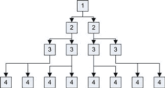

图 7.1 递归算法的内核调用。

当并行度在每次迭代中以某个不确定的数量增长时，你也可以将状态存储在全局内存中。然后，你必须将下一次迭代将要探索的并行度数量传回主机。你可以通过在块内执行原子写操作到共享内存，再在块完成前进行原子加法到全局内存来实现这一点。接着，使用`memcpy`将数据复制回主机，主机可以利用这些数据来调整下一次内核的启动。

以快速排序的第一层为例，你可以使用一个数据块和一个线程。然后，继续调用单线程块内核，直到达到 GPU 上 SM 数量的某个倍数。当你即将填满 SM 上的块数量时（每个 SM 最多 16 个块），你可以增加每个块的线程数量。当每个块达到 256 个线程时，你可以再次开始增加块的数量。

尽管这种方法相对容易实现，但也有一些缺点。首先，至少在初期，没有足够的工作量来使 GPU 达到饱和。在第一层只使用一个线程时，内核开销非常大。即使到了第四层，我们也只调用了八个块，占用了 GTX580 设备上 16 个 SM 的一半。直到第五层，我们才会有每个 SM 一个块。当达到 16 个 SM，每个 SM 有八个块，每个 SM 有 256 个线程时，我们需要 32K 个点才能让所有 SM 都以最大效率工作。这将需要 16 次内核调用。

对于计算能力为 2.x 的设备，这并不是一个问题，因为初始的几层可以通过递归调用来计算，直到你达到足够的深度，需要通过更多的线程块重新启动内核。另一种方法是在 CPU 上完成一些初步工作，只有当问题中具有足够的并行性时，才使用 GPU。不要认为所有事情都必须在 GPU 上完成。CPU 可以是一个非常有用的伙伴，尤其是对于这种较少并行的工作类型。

解决这些问题的另一种方法是使用一种特殊的扫描操作，称为分段扫描。通过分段扫描，你可以对数据集执行常规的扫描操作（如`min`、`max`、`sum`等），并使用一个额外的数组将源数组拆分为可变大小的块。每个区域分配一个或多个线程来计算该操作。由于额外的数组也可以在运行时更新，如果分段扫描能够保持在单个块内，这将减少需要调用多个内核的情况。否则，你完全可以采用更简单的解决方案，在许多情况下，它同样有效，并且允许根据问题的并行性变化来灵活调整线程/块的数量。

所有这些方法都试图解决 GPU 天生并未设计来处理的问题。作为程序员，你应该意识到算法与硬件设计模型的契合程度。今天的 GPU 对于递归问题通常最好将其转化为迭代问题。选择一个适合硬件的算法，并确保数据布局正确，通常是确保 GPU 上良好性能的关键。

## 处理数据集

在典型的数据采集过程中，你会得到一些有趣的数据，部分无关的数据周期，以及信号中的噪声。去除噪声的一种简单方法是过滤掉高于或低于某个阈值的数据。在图 7.2 中所示的数据集，我们用一条白线表示阈值水平的位置。随着阈值的提高，你会过滤掉较低水平的噪声。在采集数据的最右侧，你可能希望完全去除这些数据，因为你只对数据的峰值感兴趣。


图 7.2 示例数据和阈值水平。

对于一个你预计将会有非常少量项目需要过滤的数据集，你可以轻松地将数据附加到同一个数据列表中，因为附加操作本身的频率非常低。然而，随着过滤数据的频率增高，对单个列表的争用将成为瓶颈。虽然这种方法对于少量并行操作可能有效，例如四核 CPU 上可能找到的四个操作，但写入单一列表的锁定方式是无法扩展的。

一个更好的方法是拥有多个列表，然后在后期将这些列表合并。实际上，几乎所有的并行数据处理算法都会以某种方式使用这种方法，以避免由于更新共享数据结构而导致的串行瓶颈。这种方法也非常适合 CUDA 用于分解问题的模型——瓦片化方法。

我们还应该认识到，过滤操作实际上是一种常见的并行模式，即拆分操作。拆分操作将给定的数据集根据某些主键拆分成*N*个部分。在我们的过滤示例中，我们使用阈值条件作为主键，并试图提取高于给定阈值的数据。我们可能对保留低于阈值的数据不感兴趣，也可能感兴趣。拆分操作简单地生成两个列表，一个符合某些标准，另一个则是未符合标准的数据。

在并行执行这种操作时，我们需要考虑多个因素。第一个问题是我们不知道有多少数据项会符合匹配标准，因而有多少数据项会出现在不匹配的列表中。第二个问题是我们有许多处理元素需要以某种方式合作，以构建输出列表。最后，原始数据集中的任何顺序通常必须被保持。

扫描原语非常强大，可以应用于许多数据处理场景。例如，假设我们在数据库中有一个学生列表，且没有特定顺序。我们可能希望从这个学生列表中提取所有属于 CS-192 班的学生。这样我们最终会得到两个数据集，一个是符合标准的，另一个是不符合标准的。

假设我们有一个位于赤道附近的气象站，每分钟收集一次温度数据，持续多年。我们可能想知道在整个样本期间内，温度超过 40 摄氏度的样本点或分钟数有多少。

同样，我们正在查看的数据可能是财务数据——例如交易的金额。你可能希望筛选数据，以了解是否存在超过某个金额的交易，以及有多少笔。某些高金额交易可能有法规要求进行报告或记录，例如为了防止洗钱。你的公司政策也可能要求对超过某个金额的交易进行额外检查。我们希望从庞大的数据集中快速、轻松地提取出那些感兴趣的数据。

如果数据是来自科学仪器的数据，你可能希望筛选数据包中的“有趣”异常。那些包含异常的数据包将被转发以供进一步分析，而常规数据包则会被发送到其他地方或丢弃。我们如何定义“有趣”取决于具体应用，但能够扫描和过滤数据的基本需求在许多领域中都有体现。

在 CPU 上扫描一百万个数据元素可能会非常耗时。这是标准的“*i* 从 0 到数据集大小”的问题。使用 GPU，我们可以并行扫描数据集。如果数据集很大，那么唯一的限制就是我们可以分配给该问题的 GPU 数量。到目前为止，最大的 GPU 卡 Tesla M2090 可以容纳 6 GB 的数据，但每个节点的最大问题规模限制在 18–24 GB 之间，超过这个限制就需要使用主机或甚至基于磁盘的存储。

接下来，我们将看看如何使用 CUDA 的一些不太为人所知的特性来处理数据。这当然适用于任何形式的数据，因为几乎所有问题都涉及以某种形式处理输入数据。

### 使用 `ballot` 和其他内建操作

从计算 2.0 设备开始，NVIDIA 引入了一个非常有用的函数：

```cpp
unsigned int __ballot(int predicate);
```

这个函数会评估由给定线程传递的谓词值。在此上下文中，谓词只是一个真假值。如果谓词值非零，它会返回一个将第 *N* 位设置为 1 的值，其中 *N* 是线程的值（`threadIdx.x`）。这个原子操作可以通过如下的 C 源代码实现：

```cpp
__device__ unsigned int __ballot_non_atom(int predicate)
{
 if (predicate != 0)
  return (1 << (threadIdx.x % 32));
 else
  return 0;
}
```

前面展示的非原子版本的速度与内建版本相似，但可以在所有计算版本上运行。稍后我们将使用它来提供对旧硬件的向后兼容性。

`ballot` 的有用性可能不会立即显现，除非你将它与另一个原子操作 `atomicOr` 结合使用。其原型如下：

```cpp
int atomicOr(int ∗ address, int val);
```

它读取 `address` 所指向的值，与 `val` 的内容进行按位 `OR` 运算（C 中的 | 运算符），然后将结果写回该地址。它还会返回旧值。可以与 `__ballot` 函数结合使用，示例如下：

```cpp
volatile __shared__ u32 warp_shared_ballot[MAX_WARPS_PER_BLOCK];
// Current warp number - divide by 32
const u32 warp_num = threadIdx.x >> 5;
atomicOr( &warp_shared_ballot[warp_num],
```

`                              __ballot(data[tid] > threshold) );`

在这个调用中，我们使用一个数组，这个数组可以位于共享内存或全局内存中，但显然由于速度原因，共享内存是更好的选择。我们根据 warp 的编号写入数组索引，在这里我们隐式地假设 warp 数量为 32。因此，每个 warp 的每个线程都会对该 warp 的结果贡献 1 位。

对于谓词条件，我们询问 `data[tid]` 中的值（我们的源数据）是否大于给定阈值。每个线程从这个数据集中读取一个元素。每个线程的结果被组合形成按位 `OR`，其中线程 0 设置（或不设置）第 0 位，线程 1 设置（或不设置）第 1 位，依此类推。

然后我们可以利用另一个编译器内建函数 `__popc`。它返回一个 32 位参数中已设置的位数。它可以用于计算所有 warp 在该块中的位计数和，如下所示：

```cpp
atomicAdd(&block_shared_accumulate,
          __popc(warp_shared_ballot[warp_num]));
```

因此，我们可以为给定的 CUDA 块累加每个 warp 中满足我们用于谓词设置的条件的线程数。在这个例子中，条件是数据值大于某个阈值。基于块的求和在许多算法中都很有用，但一个 CUDA 内核通常由许多块组成，通常是成千上万的。如果你想知道整个数据集上有多少数据项符合谓词，你必须将每个块的和加起来。

有许多方法可以做到这一点。对于少量块，我们可以简单地将结果块计数发送回 CPU，并让 CPU 执行求和。如果 CPU 本来是空闲的，而 GPU 上还有其他可以执行的工作流，这可能是一个有用的策略（有关如何执行此操作的讨论，请参见第八章）。

另一种策略是将所有块的部分和写入 GPU 的全局内存。然而，为了完成所有单独块组件的求和，所有 SM 中的所有块必须完成谓词的评估。确保这一点的唯一方法是完成当前内核并调用另一个内核。然后，之前写入的所有全局内存值必须以某种方式重新读取，可能通过并行归约，然后计算最终和。虽然这种方法可能是传统 CPU 并行编程中教授的方式，但从 GPU 的性能角度来看，这并不是最好的方式。

如果我们查看一个 Fermi SM 上常驻的块的数量，最多可以有八个块*是*常驻的，尽管通常最多见到的是六个。假设现在最大为八个块。最大的 Fermi 设备有 16 个 SM。因此，设备上一次最多可以有 8 × 16 = 128 个块常驻。我们可以因此使用`atomicAdd`函数在全局内存中简单地累加到*一个单一的值*，因为每个块只产生一个更新。

从统计学角度来看，同时有多个块到达原子加法指令的概率是相当小的。因为读取源数据的内存事务很可能是顺序到达的，实际上这很好地排定了 SM 内部的执行流程，因此确保原子加法操作不会相互竞争。

使用这种技术扫描一百万个元素大约需要 5 毫秒，排除 GPU 之间的数据传输时间。我们排除传输时间是因为数据很可能会完全常驻在 GPU 上。因此，我们每秒钟可以对数据集执行大约两亿次这样的查询。实际上，谓词可能更复杂，我们稍后将讨论这如何影响性能。

现在，让我们更详细地看一下执行此操作的完整函数：

```cpp
__device__ int predicate_gt(const u32 a, const u32 b)
{
 return (a > b);
}
__global__ void kernel_gt_u32(const u32 ∗ const data,
                              u32 ∗ const block_results,
                              u32 ∗ const acum,
                              const u32 num_elements,
                              const u32 threshold)
{
 kernel_ballot_u32_acum(data, block_results, acum,
                        num_elements, threshold,
                        &predicate_gt);
}
```

我们声明了几个函数：一个设备函数，用于计算谓词条件，一个全局函数，作为调用投票函数的封装器。我们将数据集传递给投票函数，投票函数将数据存储到一个内存区域中，并将块结果存放到一个内存区域中，同时还传递处理元素的数量，最后传递比较的阈值。

请注意，使用这种格式，我们可以通过编写新的谓词函数和封装器，轻松实现其他操作，例如小于、等于等，如下所示：

```cpp
// Pad the SM array by 16 elements to ensure alignment
// on 32 element boundary to avoid bank conflicts
#define SM_PADDING 16
// Max threads is 1024 so therefore max warps
// is 1024 / 32 = 48
#define MAX_WARPS_PER_BLOCK (48 + (SM_PADDING))
#define WARP_SIZE 32
// SM output per warp
volatile __shared__ u32 warp_shared_ballot[MAX_WARPS_PER_BLOCK];
// SM output per block
volatile __shared__ u32 block_shared_accumulate;
// Ballot and accumulate if predicate function is non zero
__device__ void kernel_ballot_u32_acum(
 const u32 ∗ const data,
 u32 ∗ const block_results,
 u32 ∗ const gmem_acum,
 const u32 num_elements,
```

` const u32 threshold,`

```cpp
 int (∗predicate_func)(const u32 a, const u32 b) )
{
 // Calculate absolute thread number
 const u32 tid = (blockIdx.x ∗ blockDim.x) + threadIdx.x;
 // Current warp number - divide by 32
 const u32 warp_num = threadIdx.x >> 5;
 // Total number of warp number - divide by 32
 const u32 number_of_warps = blockDim.x >> 5;
 // If not off the end of the array then contribute
 if (tid < num_elements)
 {
  // Have the first thread of every warp
  // clear the shared memory entry
  if ((threadIdx.x % WARP_SIZE) == 0)
  {
    warp_shared_ballot[warp_num] = 0;
  }
  // Call __ballot to set the N’th bit in the word
  // with a warp if the predicate is true
  // OR the bits from all threads in the warp into
  // one value per warp held in shared memory
  atomicOr( &warp_shared_ballot[warp_num],
            __ballot_non_atom( predicate_func(data[tid], threshold)) );
 }
 // Wait for all warps to complete
 __syncthreads();
 // From the first warp, activate up to 32 threads
 // Actual number of threads needed is the number
 // warps in the block
 // All other warps drop out at this point
 if (threadIdx.x < number_of_warps)
 {
  // Have thread zero, zero the accumulator
  if (threadIdx.x == 0)
  {
   block_shared_accumulate = 0;
  }
  // Add to the single accumulator the number
```

`  // 从每个 warp 中设置的位数。`

```cpp
  // Max threads equals number of warps
  // which is typically 8 (256 threads), but
  // max 32 (1024 threads)
  atomicAdd(&block_shared_accumulate,
            __popc(warp_shared_ballot[threadIdx.x]));
  // No sync is required as only warp zero
  // accumulates
  // Have thread zero write out the result
  if (threadIdx.x == 0)
  {
   // Read from SMEM the result for the block
   const u32 block_result = block_shared_accumulate;
   // Store the value for the block
   block_results[blockIdx.x] = block_result;
   // Add the value into GMEM total for all blocks
   atomicAdd( gmem_acum, block_result );
  }
 }
}
```

函数的第一部分计算绝对线程 ID：

```cpp
 // Calculate absolute thread number
 const u32 tid = (blockIdx.x ∗ blockDim.x) + threadIdx.x;
```

这个函数设计用于处理单维度的线程。对于大型数据集（大约 1600 万个元素及以上），我们需要利用另一个维度，否则我们将启动超过 64K 个块。

```cpp
 // Current warp number - divide by 32
 const u32 warp_num = threadIdx.x >> 5;
 // Total number of warp number - divide by 32
 const u32 number_of_warps = blockDim.x >> 5;
```

然后，我们通过简单地将当前线程索引右移 32 位来计算当前的 warp。对于块维度，我们也进行同样的操作，以计算当前块中的 warp 数量。

```cpp
 // If not off the end of the array then contribute
 if (tid < num_elements)
 {
```

然后，我们需要检查我们的绝对线程 ID，`tid`，是否在数据集范围内。在元素数量不是 2 的幂时，最后一个块的`tid`计算结果会超出源数据的范围。我们既不希望读取也不希望写入越界的数组，因此这个检查是必要的。

注意，这也意味着我们不能在这个`if`块内执行`__syncthreads`操作，因为即使是那些在数组末尾的线程，也必须参与这样的同步操作。

```cpp
  // Have the first thread of every warp
  // clear the shared memory entry
  if ((threadIdx.x % WARP_SIZE) == 0)
  {
   warp_shared_ballot[warp_num] = 0;
  }
```

接下来，我们需要清除即将使用的共享内存的值。共享内存可以保存上次内核运行的值，并不会自动初始化为零。由于我们只需要一个写入者，warp 中的第一个线程会清除这个值。需要注意的是，这里不需要任何同步操作，因为每个 warp 中的第一个线程进行写操作。通过这种方式在 warp 内的分支使得其他线程在`if`语句的末尾隐式等待。

```cpp
  // Call __ballot to set the N’th bit in the word
  // with a warp if the predicate is true
  // OR the bits from all threads in the warp into
  // one value per warp held in shared memory
  atomicOr( &warp_shared_ballot[warp_num],
           __ballot_non_atom( predicate_func(data[tid], threshold)) );
```

现在，我们可以让每个活跃 warp 中的每个线程调用`atomicOr`函数，传入当前 warp 的共享内存元素地址。我们将`__ballot`调用返回的值传递给`OR`操作。我们将从调用`predicate_func`函数指针返回的值传递给`__ballot`，并传递给它要评估的两个数据项。然后它跳转并进行评估，在这种情况下调用之前定义的`predicate_gt`函数。

```cpp
 // Wait for all warps to complete
 __syncthreads();
```

现在，我们必须等待块内的所有 warp 执行完毕，然后才能进行第二部分，即块级累加。

```cpp
 // From the first warp, activate up to 32 threads
 // Actual number of threads needed is the number
 // warps in the block
 // All other warps drop out at this point
 if (threadIdx.x < number_of_warps)
 {
```

由于每个块的最大线程数是 1024，因此每个块的最大 warp 数量是 32（1024 ÷ 32 = 32）。因此，我们可以仅使用一个 warp 来处理累加。我们本可以像之前那样使用每个 warp 的线程 0，但在这种情况下，我们希望其他 warp 完成，而不是让每个 warp 只执行一个线程。

```cpp
 // Have thread zero, zero the accumulator
 if (threadIdx.x == 0)
 {
  block_shared_accumulate = 0;
 }
```

再次，我们不知道即将用来进行累加的共享内存元素中的现有值，因此需要先将其清零。注意，由于现在只运行一个 warp，因此不需要同步。线程 0 将进入条件，而线程 1 到 31 会跳过该条件，并隐式地等待线程 0 与它们重新汇合。

```cpp
 // Add to the single accumulator the number
 // of bits set from each warp.
 // Max threads equals number of warps
 // which is typically 8 (256 threads), but
 // max 32 (1024 threads)
 atomicAdd(&block_shared_accumulate,
           __popc(warp_shared_ballot[threadIdx.x]));
```

现在我们将块基共享内存累加器中的位数增加到其他 warp 生成的结果中。这些结果存储在共享内存的相邻元素中，每个 warp 一个元素。因此，避免了共享内存银行冲突。然而，线程需要序列化写操作到累加器，以确保正确性。通常每个块有 256 个线程，因此有 8 个 warp。这个序列化操作实际上不需要并行类型的归约。然而，如果 warp 数量更大，并行归约可能会稍微加速执行。

```cpp
 // No sync is required as only warp zero
 // accumulates
 // Have thread zero write out the result
 if (threadIdx.x == 0)
 {
```

由于我们只需要一个写入器，我们选择线程 0 来执行下一步操作。

```cpp
  // Read from SMEM the result for the block
  const u32 block_result = block_shared_accumulate;
  // Store the value for the block
  block_results[blockIdx.x] = block_result;
  // Add the value into GMEM total for all blocks
  atomicAdd( gmem_acum, block_result );
```

最后，我们将块级累加器从共享内存读入寄存器，因为我们将两次使用它。然后，我们将块级结果写入全局内存，只有在我们需要块结果以及整体累加结果时，才需要执行此操作。

然后，我们调用 `atomicAdd` 函数，将总结果加到单一的全局累加器中。注意，我们不能将最终累加器的结果清零，这个操作必须在主机端完成，在调用函数之前。原因很简单：块及其中的 warp 可以以任何顺序执行。因此，我们不能像 `if (threadIdx.x == 0) && (blockIdx.x == 0)` 那样清零累加器。这样做*可能*有效，因为刚好是块 0 的 warp 0 最先执行，但这并不是好做法。CUDA 的执行模型是块的执行顺序是随机的，你不能假设块执行有任何隐式顺序。

通过一个小的修改来提供 GTX 260（一个 compute 1.3 设备）所缺失的 `__ballot` 函数，我们可以在多个设备上运行这个内核。注意，我们不能使用 9800GT，因为它是 compute 1.1 设备，因此不支持基于共享内存的原子操作。

```cpp
Processing 48 MB of data, 12M elements
ID:0 GeForce GTX 470: GPU Reduction Passed. Time 8.34 ms
ID:2 GeForce GTX 260: GPU Reduction Passed. Time 12.49 ms
ID:3 GeForce GTX 460: GPU Reduction Passed. Time 17.35 ms
```

乍一看，可能会觉得 GTX260 比较现代的 GTX460 快 50%。然而，GTX260 的 SM 数量大约是 GTX460 的四倍。每个 SM 都有自己的内部共享内存，因此 GTX260 相较于 GTX460 具有更大的共享内存带宽。

我们还可以做一个小的修改。由于我们使用的是`atomicOr`函数，实际上不需要`__ballot`的附加原子功能，因此我们在所有情况下都可以使用非原子版本。这会稍微修改计时。

```cpp
Processing 48 MB of data, 12M elements
ID:0 GeForce GTX 470: GPU Reduction Passed. Time 7.35 ms
ID:2 GeForce GTX 260: GPU Reduction Passed. Time 12.53 ms
ID:3 GeForce GTX 460: GPU Reduction Passed. Time 14.11 ms
Result: 8742545
```

你可以看到，这大大减少了 Fermi 设备上的时间，因为 GTX260 已经在使用非原子版本。GTX470 的时间减少了 15%，而 GTX460 的时间减少了 21%。这个略微改进的时间使我们能够在单个 GTX470 上每秒扫描大约 1632 万个元素。然而，如果我们使用更复杂的谓词和/或需要多个块维度的数据集，这个时间将会减少。

为了了解这一点，如果我们将结果更改为在边界内，而不仅仅是大于某个阈值，那么计时会发生什么变化？为此，我们需要修改谓词条件如下：

```cpp
__device__ int predicate_within(const u32 a,
                                const u32 b,
                                const u32 c)
{
 return ( (a > b) && (a < c) );
}
```

因此，我们引入了另一个条件，可能会显著增加总体计时。那么，实际效果如何呢？

```cpp
Processing 48 MB of data, 12M elements
ID:0 GeForce GTX 470: GPU Reduction Passed. Time 7.49 ms
ID:2 GeForce GTX 260: GPU Reduction Passed. Time 12.62 ms
ID:3 GeForce GTX 460: GPU Reduction Passed. Time 14.23 ms
Result: 7679870
```

你可以看到，添加另一个条件的效果最多是微乎其微，执行时间差异为 0.1 毫秒。这意味着谓词可以变得相当复杂，而不会导致显著的减速。

我们可以使用非常复杂的谓词条件，这使得在 GPU 上高效编码非常复杂的操作成为可能。即使是需要以某种方式收集数据点的代码，也可以使用这样的原语集合。在这种情况下，我们需要做的就是调整谓词，以便获取更多数据。

## 性能分析

我们将继续使用第六章中讨论的示例排序，并通过它来探讨如何使用性能分析工具识别给定算法实现中的问题。

示例排序示例已经包含了多个计时元素，我们可以利用这些元素调整各种参数。如果你不熟悉示例排序是如何工作的，请重新阅读第六章中的示例排序部分。

主要参数是样本数量和线程数量。如果我们要求程序探索可能的搜索空间，双倍增加每次迭代的样本数量，并使用 32、64、128 或 256 个线程，我们会发现以下有前景的情况。

```cpp
ID:0 GeForce GTX 470: Test 16 - Selecting 16384 from 1048576 elements using 64 blocks of 256 threads
Num Threads:                            32    64   128   256
Select Sample Time- CPU:   0.56  GPU: 0.56  0.19  0.06  0.38
Sort Sample Time -  CPU:   5.06  GPU: 5.06  5.06  5.06  5.06
Count Bins Time -   CPU: 196.88  GPU: 7.28  4.80  4.59  4.47
Calc. Bin Idx Time- CPU:   0.13  GPU: 1.05  0.71  0.70  0.98
Sort to Bins Time - CPU: 227.56  GPU: 7.63  4.85  4.62  4.49
Sort Bins Time -    CPU:  58.06  GPU:64.77 47.88 60.58 54.51
Total Time -        CPU: 488.25  GPU:86.34 63.49 75.61 69.88
QSORT Time -        CPU: 340.44
ID:0 GeForce GTX 470: Test 16 - Selecting 32768 from 1048576 elements using 128 blocks of 256 threads
Num Threads:                             32     64    128    256
Select Sample Time- CPU:    0.63  GPU: 0.63   0.63   0.75   0.38
Sort Sample Time -  CPU:   10.88  GPU:10.88  11.06  10.63  10.69
Count Bins Time -   CPU:  222.19  GPU: 7.85   5.51   5.39   5.22
Calc. Bin Idx Time- CPU:    0.19  GPU: 1.76   0.99   0.98   1.16
Sort to Bins Time - CPU:  266.06  GPU: 8.19   5.53   5.40   5.24
```

`Sort Bins Time -    CPU:   37.38  GPU:57.57  39.40  44.81  41.66`

```cpp
Total Time -        CPU: 537.31  GPU:86.88 63.13 67.96 64.35
QSORT Time -        CPU: 340.44
ID:0 GeForce GTX 470: Test 16 - Selecting 65536 from 1048576 elements using 256 blocks of 256 threads
Num Threads:                            32    64   128   256
Select Sample Time- CPU:   1.00  GPU: 1.00  0.88  0.81  0.94
Sort Sample Time -  CPU:  22.69  GPU:22.69 22.50 22.44 23.00
Count Bins Time -   CPU: 239.75  GPU: 8.32  5.90  5.79  5.62
Calc. Bin Idx Time- CPU:   0.25  GPU: 1.49  1.98  1.60  1.65
Sort to Bins Time - CPU: 300.88  GPU: 8.69  5.97  5.82  5.67
Sort Bins Time -    CPU:  24.38  GPU:52.32 33.55 30.85 32.21
Total Time -        CPU: 588.94  GPU:94.50 70.78 67.32 69.09
QSORT Time -        CPU: 340.44
```

如果我们将一个示例视为饼图，就可以轻松看到我们在时间上花费的地方（图 7.3）。

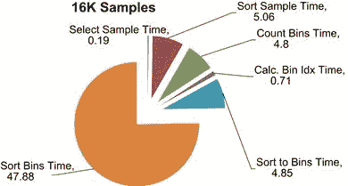

图 7.3 示例排序时间分布，16 K 样本。

从图表中可以明显看出，大约四分之三的时间用于排序，四分之一用于设置示例排序。然而，随着样本数量的增加，这种情况会发生变化（图 7.4）。

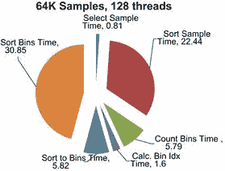

图 7.4 示例排序时间分布，64 K 样本。

正如你从图 7.4 中看到的，排序样本的时间突然跃升到总时间的大约三分之一。我们还可以看到，根据样本数量和使用的线程数的不同，结果变化很大。我们将集中优化中间情况，即使用 64 个线程每块处理 32K 样本。

Parallel Nsight 提供了一个非常有用的功能，列在“新分析活动”下。Parallel Nsight 是一个免费的调试和分析工具，非常有助于识别瓶颈。

在 Nsight 中，第一个要选择的选项是选择“Profile”活动类型（图 7.5）。默认情况下，这将运行几个实验，“已实现占用率”和“指令统计”。在样本排序示例上运行这些实验会产生一个总结。在总结页面的顶部是一个下拉框。选择“CUDA 启动”会显示一些有用的信息，如图 7.6 所示。

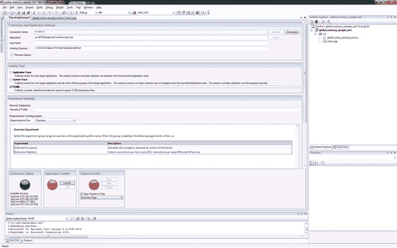

图 7.5 Parallel Nsight 启动选项。

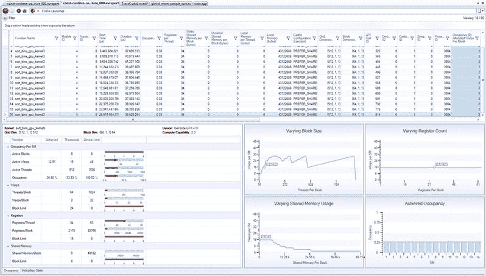

图 7.6 Parallel Nsight 分析。

第一个视图是“占用率视图”（图 7.6 左下角）。你应该注意到，这里有一个关于内核启动参数的总结，以及以红色标出的限制占用率的因素。在我们的例子中，每个设备的块限制为 8 个块，这限制了设备上活动 warp 的最大数量。请记住，warp 是线程的组，调度器可以从中选择。调度器在不同的 warp 之间切换，以隐藏内存和指令的延迟。如果没有足够的 warp 存在，那么这*可能*会限制性能，因为 GPU 没有其他 warp 可供运行。

我们已经启动了大约 16 个 warp，而每个设备的最大数量为 48，达到了设备最大占用率的三分之一。这表明我们应该通过增加每个设备的 warp 数量来提高占用率，这反过来意味着增加线程数。然而，测量结果表明，这会产生相反的效果，实际上会降低性能。

第二个有趣的屏幕是“指令统计”（图 7.7）。在这里（IPC 部分）值得注意的是，有一大块发出的指令从未被执行。已执行的指令显示在屏幕上，在左下角的第一个条形图的粉红色部分，其中下方的线穿过条形图。蓝色的条形表示由于串行化，指令正在被重新发出。串行化是指由于某些原因，线程无法作为完整的 warp（32 个线程的集合）来执行。这通常与分支控制流、不合并的内存访问或由于冲突（共享内存或原子操作）导致的吞吐量受限操作相关。

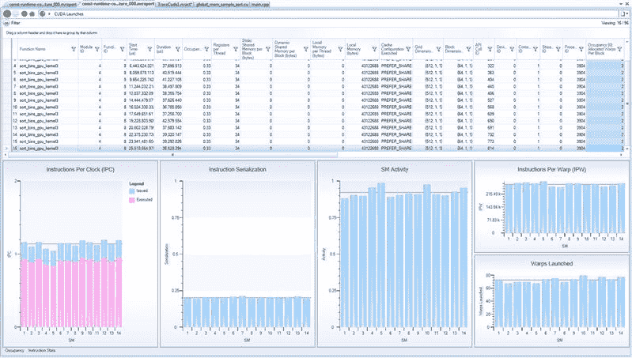

图 7.7 Parallel Nsight 分析。

另外，注意到工作分配给 SM 的方式是不均匀的（SM 活动块，图 7.7）。我们启动了 512 个 64 线程的块。考虑到使用的 GTX470 设备上有 14 个 SM，我们预计每个 SM 大约有 36 个块（72 个 warp）。实际上，一些 SM 获得了 68 个 warp，而另一些则获得了 78 个 warp（已启动 warp 部分，图 7.7）。还需要注意的是，尽管给定了相同数量的 warp，一些 SM 的执行时间较长，意味着并非所有 warp 在执行时间上都得到了相同的工作量。

当我们将每块的线程数增加到 256 时，发布指令与实际执行的指令之间的差异增大。由于每个线程使用 34 个寄存器，调度的块数从八个降至仅三个。虽然在每块 64 个线程时不存在这个问题，但每块 256 个线程限制了每个 SM 可以调度的总块数。然而，尽管如此，调度的 warp 数从 16 增加到 24，提供了 50%的占用率。进一步增加占用率是否有帮助？

简单地要求编译器最多使用 32 个寄存器（`-maxregcount=32`编译器标志）证明是一个糟糕的优化。编译器随后只使用了 18 个寄存器，允许调度六个块，这是允许的最大值。这将理论上的占用率提高到 100%，但导致执行时间从 63 毫秒增加到 86 毫秒。

这是由于 GPU 必须将寄存器推送到“本地”存储中，在 Fermi 架构上是 L1 缓存，而在早期的 GPU 上则是全局内存。在早期的 GPU 上，使用全局内存的时间将完全抵消由于更好的占用率带来的任何收益。在 Fermi 上，将更多数据推送到 L1 缓存中会减少用于其他目的的缓存空间。

我们也可以走相反的路径，增加寄存器的使用量。执行排序箱时间输出的原始 C 代码如下所示：

```cpp
__device__ void radix_sort(
 u32 ∗ const data,
 const u32 start_idx,
 const u32 end_idx,
 u32 ∗ const sort_tmp_1)
{
 // Sort into num_list, lists
 // Apply radix sort on 32 bits of data
 for (u32 bit=0;bit<32;bit++)
 {
  // Mask off all but the bit we’re interested in
  const u32 bit_mask = (1u << bit);
  // Set up the zero and one counter
  u32 base_cnt_0 = start_idx;
  u32 base_cnt_1 = start_idx;
  for (u32 i=start_idx; i<end_idx; i++)
  {
   // Fetch the test data element
   const u32 elem = data[i];
   // If the element is in the one list
   if ( (elem & bit_mask) > 0u )
   {
    // Copy to the one list
    sort_tmp_1[base_cnt_1++] = elem;
   }
```

`   else`

```cpp
   {
    // Copy to the zero list (inplace)
    data[base_cnt_0++] = elem;
   }
  }
  // Copy data back to source from the one’s list
  for (u32 i=start_idx; i<base_cnt_1; i++)
  {
   data[base_cnt_0++] = sort_tmp_1[i];
  }
 }
}
```

如果我们查看为内核生成的 PTX 代码（有关如何做到这一点的详细信息，请参见第九章），我们会看到以下代码片段：

```cpp
  mov.s64 %rd5, %rd2;
  cvt.u64.u32 %rd6, %r17;
  mul.wide.u32 %rd7, %r17, 4;
  add.u64 %rd8, %rd5, %rd7;
  ld.u32 %r20, [%rd8+0];
  mov.s32 %r21, %r20;
```

这相当于 C 源代码中的一行：

```cpp
// Fetch the test data element
const u32 elem = data[i];
```

这里有一些问题。首先，数组索引导致使用了乘法指令。由于`elem`在下一个 C 指令中立即用于分支，数据加载需要完成，因此线程在此处停顿。乘法和除法指令通常需要很多周期才能完成指令流水线，而且可能有有限的执行单元来执行这些复杂的指令。

我们可以用指针替换所有的数组索引，然后在每次使用后递增指针。因此，我们之前看到的代码片段变为：

```cpp
// Fetch the test data element
const u32 elem = (∗data_in_ptr);
data_in_ptr++;
```

这意味着编译器现在将其翻译为以下 PTX 代码：

```cpp
; const u32 elem = (∗data_in_ptr);
mov.s64  %rd20, %rd14;
ld.u32 %r18, [%rd20+0];
mov.s32  %r19, %r18;
; data_in_ptr++;
mov.s64   %rd21, %rd14;
add.u64   %rd22, %rd21, 4;
```

`mov.s64   %rd14, %rd22;`

我们仍然有六条指令，但现在第一组指令负责加载数据，第二组负责指针的增量。指针的增量现在是一个简单的加法，比乘法要简单得多，而且结果直到下一次循环迭代才需要。

对其他数组操作应用相同的策略，执行时间从 39.4 毫秒减少到 36.3 毫秒，下降了 3 毫秒，约为 10%的减少。然而，每个 warp 执行工作量的波动从哪里来呢？这是为什么？

样本排序将数据排序到块或桶中，我们使用单个 warp 独立地对其进行排序。如果我们对单个 warp 的值进行转储，会看到一些有趣的现象。

```cpp
Bin Usage - Max:331 Min:0 Avg:32 Zero:10275
0000:00000022 0001:00000000 0002:0000003e 0003:0000001d 0004:00000028 0005:00000000 0006:00000018 0007:0000003d
0008:00000052 0009:00000000 0010:0000001d 0011:00000000 0012:00000061 0013:00000000 0014:00000000 0015:00000000
0016:00000024 0017:0000009d 0018:00000021 0019:00000000 0020:0000002b 0021:00000021 0022:00000000 0023:00000000
0024:00000025 0025:00000000 0026:00000056 0027:00000050 0028:00000019 0029:00000000 0030:00000025 0031:0000001d
```

有大量的桶中条目为零。还有一些桶中的条目总数非常大。由于每个线程处理每个桶，要遍历整个数据集，我们需要遍历给定 warp 的最大桶数。第一个 warp 的最大值为`0x9d`（157 十进制），最小值为零。到达第 157 次迭代时，整个 warp 中只有一个线程处于活动状态。我们可以在之前看到的发出和执行指令之间的巨大差异中看到这一点（每时钟周期指令数，图 7.7）。正是那些迭代次数非常大的桶占用了时间。

当我们将样本数量加倍时，我们看到基数排序的执行时间减少了，因为峰值被压低并分配到更多的桶中。然而，排序样本本身成了主导问题。问题出在样本分配到桶中的方式。

大量零桶实际上是由样本数据集中的重复数据引起的。源数据数组通过简单调用`rand()`填充，`rand()`返回的不是完全随机的数字。经过一段时间后，这些数字会重复。由于样本是均匀间隔选择的，因此样本集包含许多重复项。去除随机数据集中的这个错误后，几乎所有零桶都会被移除，但有一个意外效果就是执行时间又回升到了原来的 40 毫秒。

然而，我们可以应用另一种技术来解决这个问题，那就是循环展开和尾部优化，二者我们将在第九章中讨论。我们将替换以下代码段：

```cpp
for (u32 i=start_idx; i<end_idx; i++)
{
// Fetch the test data element
const u32 elem = (∗data_in_ptr);
data_in_ptr++;
```

使用

```cpp
// Unroll 4 times
```

`u32 i=start_idx;`

```cpp
if ( (end_idx - start_idx) >= 4)
{
 for (; i< (end_idx-4); i+=4)
 {
  // Fetch the test first and second data element
  const u32 elem_1 = (∗data_in_ptr);
  const u32 elem_2 = (∗(data_in_ptr+1));
  const u32 elem_3 = (∗(data_in_ptr+2));
  const u32 elem_4 = (∗(data_in_ptr+3));
  data_in_ptr+=4;
```

假设`start_idx`和`end_idx`之间的差值为 32，这是常见的情况。第一次循环的迭代次数将是 32。然而，通过将循环展开四倍，我们将操作数减少了四倍，也就是八次迭代。循环展开还有一些其他重要的效果。注意，在四倍展开的情况下，我们需要额外的三个寄存器来存储三个额外的数据点。我们还需要处理循环结束条件，其中可能仍然有零到三个元素需要处理。

查看 PTX 代码，我们看到：

```cpp
;const u32 elem_1 = (∗data_in_ptr);
  mov.s64 %rd20, %rd14;
  ld.u32 %r23, [%rd20+0];
  mov.s32 %r24, %r23;
;const u32 elem_2 = (∗(data_in_ptr+1));
  mov.s64 %rd21, %rd14;
  ld.u32 %r25, [%rd21+4];
  mov.s32 %r26, %r25;
;const u32 elem_3 = (∗(data_in_ptr+2));
  mov.s64 %rd22, %rd14;
  ld.u32 %r27, [%rd22+8];
  mov.s32 %r28, %r27;
;const u32 elem_4 = (∗(data_in_ptr+3));
  mov.s64 %rd23, %rd14;
  ld.u32 %r29, [%rd23+12];
  mov.s32 %r30, %r29;
;data_in_ptr+=4;
  mov.s64 %rd24, %rd14;
  add.u64 %rd25, %rd24, 16;
  mov.s64 %rd14, %rd25;
```

我们在这里做了一个非常重要的事情，通过每个线程使用独立的元素引入了指令级并行性。表 7.1 和图 7.8 展示了循环展开的效果。

表 7.1 展开级别与时间和寄存器使用的关系

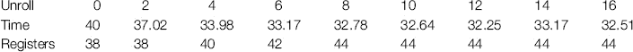

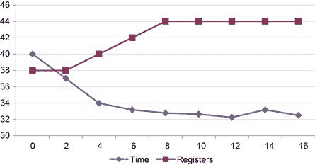

图 7.8 展开级别与时间和寄存器使用的关系。

从表 7.1 和图 7.8 中可以看到，引入少量线程级并行性显著降低了基数排序的执行时间。然而，还需要注意另一点：即使我们可以在 Fermi 中使用最多 63 个寄存器，寄存器的数量始终不会超过 44 个。此时发生的情况是，编译器引入了调用栈，并且不再增加使用的寄存器数量。

我们对源代码应用了几种优化技术，这些技术本应由编译器自动应用。我们不会移除这些优化，因此任何提升应该来自于编译器添加的额外优化。让我们通过切换到发布模式来查看是否如此，这样可以默认启用所有编译器优化（表 7.2 和 图 7.9）。

表 7.2 调试版与发布版的时间对比

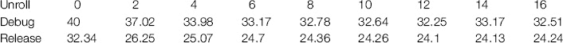

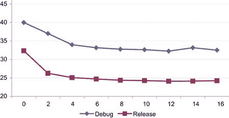

图 7.9 调试版与发布版时间对比。

从表 7.2 和图 7.9 中我们看到与发布版本或优化版本非常相似的模式，表明我们刚刚应用的优化并没有被编译器自动应用。另一个明显的现象是，我们再次看到相同的模式，每个线程四个元素有很大帮助，但超过这个数量的效果边际递减。请注意，即使启用了优化，编译器也没有自动展开循环。因此，我们将坚持手动四个元素的展开，因为额外的速度与额外的寄存器使用并不是一个好的权衡。

你可能期待编译器能够将读操作提取（或提升）并将其放置在展开循环的开始处。在许多情况下，它会这样做，除了在一些困难的情况下，这些情况不幸地往往是我们遇到的情况。当你有一个读操作后跟一个写操作，再跟另一个读操作时，编译器不能轻易判断写操作是否写入了与正在读取的数据区域相同的地方。因此，编译器必须保持读-写-读的顺序以确保正确性。然而，作为程序员，你知道读操作是否受到前面的写操作影响，并且可以将读-写-读顺序替换为一个更高效的读-读-写顺序。

由于我们已经在一个方面做出了根本性的改变，将时间从 40 毫秒降到 25 毫秒，因此我们应该重新扫描问题空间，以查看这是否改变了最佳的样本/线程数量。

一件显而易见的事情是，QSort 的发布版本实际上要快得多，速度是原来的两倍多。这使得生成一个更快的排序算法变得相当困难。然而，快速排序现在是样本排序的重要组成部分，因为我们在 CPU 上对样本进行预排序。因此，这种执行时间的缩短帮助显著提高了性能。最佳的时间如下：

```cpp
ID:0 GeForce GTX 470: Test 16 - Selecting 32768 from 1048576 elements using 128 blocks of 256 threads
Num Threads:                            32    64   128   256
Select Sample Time- CPU:   0.38  GPU: 0.38  0.19  0.50  0.31
Sort Sample Time -  CPU:   4.63  GPU: 4.63  4.69  4.31  4.31
Count Bins Time -   CPU:  64.50  GPU: 5.71  5.65  5.59  5.31
Calc. Bin Idx Time- CPU:   0.06  GPU: 1.55  0.79  0.86  0.79
Sort to Bins Time - CPU:  80.44  GPU: 6.25  6.08  5.96  5.71
```

`Sort Bins Time -    CPU:  62.81  GPU:27.37 25.10 36.28 39.87`

```cpp
Total Time -        CPU: 212.81  GPU:45.89 42.49 53.50 56.31
QSORT Time -        CPU: 187.69
ID:0 GeForce GTX 470: Test 16 - Selecting 65536 from 1048576 elements using 256 blocks of 256 threads
Num Threads:                            32    64   128   256
Select Sample Time- CPU:   0.50  GPU: 0.50  0.50  0.44  0.50
Sort Sample Time -  CPU:   9.56  GPU: 9.56  9.63  9.56  9.63
Count Bins Time -   CPU:  95.88  GPU: 6.70  6.67  6.60  6.34
Calc. Bin Idx Time- CPU:   0.06  GPU: 1.17  1.22  1.36  1.19
Sort to Bins Time - CPU: 119.88  GPU: 7.27  7.06  6.94  6.73
Sort Bins Time -    CPU:  52.94  GPU:24.23 16.84 25.22 29.95
Total Time -        CPU: 278.81  GPU:49.43 41.91 50.12 54.35
QSORT Time -        CPU: 187.69
```

所以实际上，16 K 和 32 K 的样本版本都超过了基准，二者之间相差 0.6 毫秒。这是 CPU 基于快速排序的 4.4 倍加速。缓存利用率在这里起到了关键作用。请参见 第九章中的“线程内存模式”部分，我们在其中分析了这一点的影响。

总结来说，我们使用 Parallel Nsight 展示了改变使用的块的数量和大小对整体性能的影响，并观察到这可能会极大地影响整体性能。随后我们深入分析了这些数据，发现最终问题出在样本排序的设计上。由于每个线程处理的元素数量不同，导致了序列化问题。尽管有这个问题，我们还是能够通过线程级别的并行性来优化实现，方法是每个线程使用多个元素。启用额外的编译器级优化为 CPU 和 GPU 代码带来了显著的附加收益。

## 使用 AES 的示例

AES（高级加密标准）是一种在像 WinZip、Bitlocker、TrueCrypt 等程序中提供加密的算法。根据你的行业，加密可能是你已经在使用的技术，也可能看起来与自己无关。许多公司犯的一个错误是认为它们创建的数据不需要在本地机器上安全存储。所有恶意程序和黑客都在公司防火墙之外，因此任何保存在本地的数据都不需要安全保护。这种思维方式是错误的，因为很常见的情况是，机器、员工或承包商可能通过某些方式在防火墙上打孔，从而实现远程工作或在办公室外工作等需求。安全性需要采取多层次的防护措施。

加密的思想是，我们对某些数据应用一个算法来使其变得模糊。这样，即使数据或存储数据的机器，如笔记本电脑，可能会被妥协、丢失或被盗，但数据本身是无法访问的。大量的数据泄露事件都是由于机器被攻破所致。将保护转移到数据本身意味着，访问这些数据需要一个“密钥”。应用该密钥和特定的算法后，数据将恢复为明文。

加密也可以用于在不安全的网络（如互联网）上进行主机之间的安全连接。如果你有一个分布式应用程序并且运行在公共网络上，如何确保你发送的数据包不会被拦截或篡改？像 OpenSSL（开放安全套接字层）这样的标准在浏览器登录安全服务器时被使用，比如在线银行，以确保没有人窃听登录数据的交换。

在设计软件时，你需要考虑它的安全性，以及数据如何在各种计算机之间传输。批准新互联网标准的组织——互联网工程任务组（ITEF）要求所有标准提案都包含一部分关于安全的内容。对于因消费者或企业数据丢失而被罚款的组织，处罚是相当严重的。因此，如果你涉及计算机网络或存储敏感或个人数据，理解至少一些加密标准是非常有益的。

许多美国政府机构在存储数据时都要求使用 AES。作为当前使用的算法，我们将以此为案例，探讨如何使用 GPU 实现基于 AES 的加密。然而，在深入实现细节之前，我们首先需要分析该算法，理解它，并寻找可以并行计算的元素。AES 算法包含许多复杂性，但同时也可以为没有密码学背景的人所理解。因此，它是一个很有用的算法，可以看看如何应用到目前为止讨论的一些技术。

### 算法

AES 是一种基于块的加密算法。加密算法通常被称为*密码*。因此，未加密的文本被称为明文，而加密后的文本称为密文。将明文编码为密文需要一个算法和一个密钥。密钥仅仅是一系列数字，像机械钥匙一样起作用，而算法则像锁一样。

AES 支持多种操作模式，其中最简单的是 ECB（电子密码本模式），我们在这里讨论的就是这个模式。AES 将要编码的数据分成多个 128 位（16 字节）长度的块。在 ECB 模式下，每个块根据从加密密钥派生的一系列值独立进行编码。编码过程分为多个“轮次”，每一轮都使用一个新派生的密钥来进一步加密数据。见图 7.10。

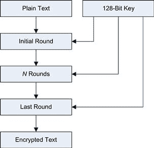

图 7.10 AES 概述。

128 位密钥为每一轮独立调整，并且与要编码的文本或前一轮加密无关。因此，提取各个轮次的密钥可以独立于 AES 算法的编码轮次进行。通常，由于密钥对于所有块都是恒定的，这个过程会在任何加密开始之前完成。

AES 使用 128 位、192 位或 256 位密钥，尽管块大小（明文的大小）始终为 128 位。使用的轮次数根据选择的密钥长度而变化：分别为 10、12 和 14 轮。

明文表示为一个 4 × 4 的字节数据矩阵，称为状态空间。

一个加密轮次本身包括以下步骤：

• 替代——在 4 × 4 矩阵中的字节与查找表中的其他字节交换。

• 行向左旋转——第一行、第二行和第三行分别向左旋转一、二或三位，第 0 行不变。

• 混合列——每列都会应用一个步骤来扩散其值。

• 轮密钥——数据与从原始密钥中提取出的当前轮密钥进行异或操作。

初始轮次，也称为零轮，仅包括轮密钥操作。最终轮次则省略了混合列操作。解密过程仅是加密过程的逆过程，从最后一轮开始，逆向执行直到开始。

因此，为了实现该算法，我们需要详细查看五个关键方面，这些方面包括刚才所示的内容以及从原始 128 位密钥中提取轮密钥的过程。

#### 替代

替代步骤将 4 × 4 数据块中的每个字节，即状态空间中的字节，与来自常量查找表的值进行交换，这个查找表称为 Rijndael s-box。

```cpp
unsigned char s_box[256] =
{
/∗   0         1        2        3         4        5         6         7        8         9        A         B         C        D         E         F    ∗/
 0x63, 0x7C, 0x77, 0x7B, 0xF2, 0x6B, 0x6F, 0xC5, 0x30, 0x01, 0x67, 0x2B, 0xFE, 0xD7, 0xAB, 0x76, /∗ 0 ∗/
 0xCA, 0x82, 0xC9, 0x7D, 0xFA, 0x59, 0x47, 0xF0, 0xAD, 0xD4, 0xA2, 0xAF, 0x9C, 0xA4, 0x72, 0xC0, /∗ 1 ∗/
 0xB7, 0xFD, 0x93, 0x26, 0x36, 0x3F, 0xF7, 0xCC, 0x34, 0xA5, 0xE5, 0xF1, 0x71, 0xD8, 0x31, 0x15, /∗ 2 ∗/
 0x04, 0xC7, 0x23, 0xC3, 0x18, 0x96, 0x05, 0x9A, 0x07, 0x12, 0x80, 0xE2, 0xEB, 0x27, 0xB2, 0x75, /∗ 3 ∗/
 0x09, 0x83, 0x2C, 0x1A, 0x1B, 0x6E, 0x5A, 0xA0, 0x52, 0x3B, 0xD6, 0xB3, 0x29, 0xE3, 0x2F, 0x84, /∗ 4 ∗/
 0x53, 0xD1, 0x00, 0xED, 0x20, 0xFC, 0xB1, 0x5B, 0x6A, 0xCB, 0xBE, 0x39, 0x4A, 0x4C, 0x58, 0xCF, /∗ 5 ∗/
 0xD0, 0xEF, 0xAA, 0xFB, 0x43, 0x4D, 0x33, 0x85, 0x45, 0xF9, 0x02, 0x7F, 0x50, 0x3C, 0x9F, 0xA8, /∗ 6 ∗/
 0x51, 0xA3, 0x40, 0x8F, 0x92, 0x9D, 0x38, 0xF5, 0xBC, 0xB6, 0xDA, 0x21, 0x10, 0xFF, 0xF3, 0xD2, /∗ 7 ∗/
 0xCD, 0x0C, 0x13, 0xEC, 0x5F, 0x97, 0x44, 0x17, 0xC4, 0xA7, 0x7E, 0x3D, 0x64, 0x5D, 0x19, 0x73, /∗ 8 ∗/
 0x60, 0x81, 0x4F, 0xDC, 0x22, 0x2A, 0x90, 0x88, 0x46, 0xEE, 0xB8, 0x14, 0xDE, 0x5E, 0x0B, 0xDB, /∗ 9 ∗/
 0xE0, 0x32, 0x3A, 0x0A, 0x49, 0x06, 0x24, 0x5C, 0xC2, 0xD3, 0xAC, 0x62, 0x91, 0x95, 0xE4, 0x79, /∗ A ∗/
```

` 0xE7, 0xC8, 0x37, 0x6D, 0x8D, 0xD5, 0x4E, 0xA9, 0x6C, 0x56, 0xF4, 0xEA, 0x65, 0x7A, 0xAE, 0x08, /∗ B ∗/`

```cpp
 0xBA, 0x78, 0x25, 0x2E, 0x1C, 0xA6, 0xB4, 0xC6, 0xE8, 0xDD, 0x74, 0x1F, 0x4B, 0xBD, 0x8B, 0x8A, /∗ C ∗/
 0x70, 0x3E, 0xB5, 0x66, 0x48, 0x03, 0xF6, 0x0E, 0x61, 0x35, 0x57, 0xB9, 0x86, 0xC1, 0x1D, 0x9E, /∗ D ∗/
 0xE1, 0xF8, 0x98, 0x11, 0x69, 0xD9, 0x8E, 0x94, 0x9B, 0x1E, 0x87, 0xE9, 0xCE, 0x55, 0x28, 0xDF, /∗ E ∗/
 0x8C, 0xA1, 0x89, 0x0D, 0xBF,0xE6, 0x42, 0x68, 0x41,0x99, 0x2D, 0x0F, 0xB0, 0x54, 0xBB, 0x16 /∗ F ∗/
};
```

对于状态空间中的每一个 16 字节元素，我们需要提取出一个十六进制数字。字节的第一个数字，或者高 nibble（0…F），用作行索引。字节的第二个数字，或者低 nibble，用作列索引。因此，状态空间中的 `0x3E` 会得到行值为 3，列值为 E。如果我们在 `s_box` 表中查找这个值，我们得到 `0xB2`。因此，状态空间中的字节 `0x3E` 被替换为 `0xB2`。对状态空间中的其他字节执行相同的操作。

#### 行向左旋转

在此步骤中，第一行、第二行和第三行分别向左旋转一、二或三位。第 0 行保持不变。左旋操作将行中的所有字节向左移动一位，最左侧的字节会绕回并变成最右侧的字节。在图 7.11 中，我提取了每一行以展示字节旋转的过程。

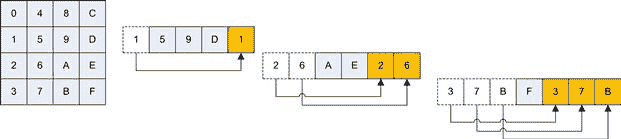

图 7.11 AES 行向左旋转。

#### 混合列

Rijndael 混合列步骤是一个复杂的代码部分。它将列 `r` 与一个 4 × 4 的矩阵相乘。矩阵见于图 7.12。

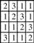

图 7.12 混合列矩阵。

矩阵中的 1 表示保持值不变。2 表示乘以 2。3 表示先乘以 2 再与原始值进行异或运算。如果结果值大于`0xFF`，则需要进行额外的与`0x1B`的异或操作。这是伽罗瓦乘法的简化形式。一个典型的 C 语言实现示例如下（见维基百科，2012 年 1 月 31 日）。

```cpp
void mix_column(unsigned char ∗r)
{
 unsigned char a[4];
 unsigned char b[4];
 unsigned char c;
 unsigned char h;
 for(c=0;c<4;c++)
 {
  a[c] = r[c];
  h = r[c] & 0x80; /∗ hi bit ∗/
  b[c] = r[c] << 1;
  if(h == 0x80)
   b[c] ^= 0x1b; /∗ Rijndael’s Galois field ∗/
 }
 r[0] = b[0] ^ a[3] ^ a[2] ^ b[1] ^ a[1];
 r[1] = b[1] ^ a[0] ^ a[3] ^ b[2] ^ a[2];
 r[2] = b[2] ^ a[1] ^ a[0] ^ b[3] ^ a[3];
 r[3] = b[3] ^ a[2] ^ a[1] ^ b[0] ^ a[0];
}
```

这不是最优化的实现，但它是你最可能找到的标准算法的示例实现。在前面的代码中，输入参数`r`指向一个 1×4 矩阵，这是状态空间中的一个列。它被复制到临时数组`a`中，以便稍后使用。然后生成一个数组`b`，保存乘以 2（`<<1`）的操作。乘以 3 实际上是先乘以 2 再进行异或（`^`）操作。因此，最后一步变成了对原始数据`a`中的元素以及矩阵乘法结果`b`的异或操作。请参见图 7.13。

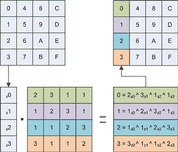

图 7.13 `混合列`与列 0（对列 1、2 和 3 进行相同操作）。

稍后我们会更详细地看一下这一步，因为它是比较耗时的步骤之一。

#### 添加轮密钥

轮密钥是从原始密钥中提取的，用于加密算法的给定轮次或迭代。它的形式是一个 4×4 矩阵，并与当前结果进行异或操作。

#### 提取轮密钥

AES 算法使用多个轮密钥，每个轮次都有一个密钥。密钥生成是一个迭代过程，新密钥依赖于前一个密钥。操作的第一部分是获取现有密钥并将其复制为密钥 0，从而生成一个 4×4 矩阵，提供单个起始轮密钥。

接下来的*N*个轮密钥必须一次一个地构建。任何轮密钥的第一列都以上一轮密钥的最后一列作为起点。新密钥中第一列的操作包含了一些超出标准列生成函数的加法操作。

对于密钥的第一列，我们需要进行基于列的旋转，使得值向上移动。列顶端（第 0 行）的值会移动到第 3 行。一个相同的操作是对密文数据进行行旋转，不过这次旋转是在列上进行的。然后我们再次使用替代方法和 Rijndael S 盒对值进行替代，就像我们处理密文时做的那样。

所有元素的操作方式都是相同的。新计算的值必须与索引减去 4 的密钥值进行异或操作。对于列 1、2 和 3，我们现在已经完成。然而，列 0 需要进行加法操作。列零的第一个元素会与`0x01`、`0x02`、`0x04`、`0x08`、`0x10`、`0x20`、`0x40`、`0x80`、`0x1b`或`0x36`，即 RCON 值，根据当前的轮次进行异或运算（见图 7.14）。

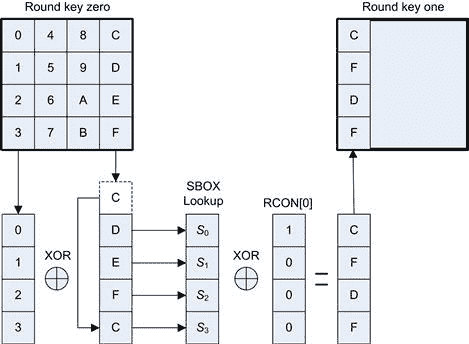

图 7.14 AES 轮密钥生成（第一列）。

因此，轮密钥 1 的第一列成为下一个提取的列。列 1、2 和 3 的计算更简单（见图 7.15）。列旋转和与 RCON 值的异或操作被省略。因此，我们只需对比“行-4”的列进行异或操作。在第 4 列，模式重复。

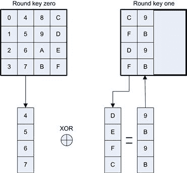

图 7.15 AES 轮密钥生成（列 1、2 和 3）。

由于密钥生成始终使用前一个密钥的值，这意味着密钥需要按顺序生成。如果需要多个密钥，这可能会成为任何并行实现的瓶颈。幸运的是，对于大多数用途，只需要一组密钥。因此，这一步可以在任何编码或解码之前执行，密钥只需存储在数组中。由于单个密钥的生成不耗时，因此可以在 CPU 或 GPU 上完成。

### AES 的串行实现

AES 已经成为大量研究的主题。它的设计旨在在 8 位、16 位或 32 位的机器上运行，而不会造成显著的处理负担。然而，正如我们从查看算法中所见，这并不是一个简单的实现算法。让我们考虑一些设计权衡，以便在为 GPU 优化此类算法时思考。

#### 访问大小

第一个问题是它围绕字节访问设计，以支持 8 位简单处理器。所有现代处理器至少是 32 位设计。因此，如果我们仅使用单字节操作，那么寄存器中的 75%空间和潜在的工作将未被利用。显然，对于 32 位处理器、x86 或 Fermi GPU，我们需要设计一种解决方案，使其使用 32 位。

我们可以自然地将单行合并为一个 32 位字。我们还可以将整个 4 × 4 矩阵合并为一个 16 字节的向量（128 位）。英特尔的 AVX（高级向量扩展）指令集支持这种向量。GPU 的`uint4`类型也允许 GPU 在单个指令中从内存读取和存储此数据。然而，与英特尔的 AVX 不同，GPU 没有每线程宽向量指令，除了存取内存之外。

我们必须考虑到，任何大于单个字节的状态或密钥矩阵编码，如果操作需要单独应用于单个字节，将需要进行位掩码和移位操作。只要这些操作的开销不大，那么尽管在更大的事务中提取数据，但减少内存读取/写入的好处很容易超过基于寄存器的掩码和移位操作。

#### 内存与操作的权衡

对于大多数算法来说，可以通过增加内存占用来减少执行时间。这主要取决于内存的速度与被交换的算术指令的成本和数量。

有些 AES 实现通过将替代、左移行和混合列操作展开为一系列查找来简化操作。对于 32 位处理器，这显然需要一个 4K 的常量表以及少量的查找和按位操作。如果 4K 查找表保持在缓存中，使用这种方法在大多数处理器上可以大幅减少执行时间。然而，在我们考虑这种优化类型之前，我们至少会首先实现完整的算法。

#### 硬件加速

英特尔的 AES-NI 扩展指令集在大多数英特尔 Sandybridge I5 和 I7 处理器，以及基于 Westmere 的 I7 Xeon 处理器及其后继产品中可用。AES-NI 指令集包含以下指令：

• AESENC（密码数据，轮密钥）—硬件中完全执行的标准加密轮次。

• AESENCLAST（密码数据，轮密钥）—硬件中完全执行的最后一轮加密。

• AESKEYGENASSIST（轮密钥，密码密钥，轮次）—辅助生成轮密钥。

• ASDEC（密码数据，轮密钥）—硬件中的标准解密轮次。

• ASDECLAST（密码数据，轮密钥）—硬件中的最后一轮解密。

因此，整个 AES 加密和解密过程可以完全在硬件中完成。特殊的 128 位 xmm1 和 xmm2 寄存器用于在单个寄存器中容纳操作数。当实际应用中使用 AES-NI 时，我们可以看到性能提高大约 2 倍或更多（Toms Hardware，“AES-NI 基准测试结果：Bitlocker、Everest 和 WinZip 14，”[`www.tomshardware.co.uk/clarkdale-aes-ni-encryption,review-31801-7.html`](http://www.tomshardware.co.uk/clarkdale-aes-ni-encryption,review-31801-7.html)）。当然，使用手写汇编并在多个核心上进行最佳调度条件时，可能获得更多的提升。然而，这给我们提供了一个对编码此类解决方案的预期效益的感觉，因此看起来值得付出努力。

### 初始内核

让我们来看一下这个算法的初始内核。

```cpp
__host__ __device__ void AES_encrypt_4x4_reg(uint4 ∗ const cipher_block,
                                             KEY_T ∗ const cipher_key,
                                             const u32 num_rounds)
{
```

首先，我们有函数原型。在这里，我们传递一个指向密码块的指针，该指针是一个`uint4`向量类型。单个`uint4`向量（四个整数）足以容纳一组 16 字节的 128 位密码数据。接下来是密码密钥，它是一组 10 个`uint4`密钥。最后，我们有一个轮次的说明符，稍后我们会用固定值替换它。注意`__host__`和`__device__`限定符，它们允许从 CPU 和 GPU 调用该函数。

```cpp
 const u8 ∗ const s_box_ptr = s_box;
 // Read 4 x 32 bit values from data block
 u32 w0 = cipher_block->w;
 u32 w1 = cipher_block->x;
 u32 w2 = cipher_block->y;
 u32 w3 = cipher_block->z;
```

接下来，我们从`uint4`向量类型中提取四个无符号整数组件部分。

```cpp
 register u8 a0 =  EXTRACT_D0(w0);
 register u8 a1 =  EXTRACT_D0(w1);
 register u8 a2 =  EXTRACT_D0(w2);
 register u8 a3 =  EXTRACT_D0(w3);
 register u8 a4 =  EXTRACT_D1(w0);
 register u8 a5 =  EXTRACT_D1(w1);
 register u8 a6 =  EXTRACT_D1(w2);
 register u8 a7 =  EXTRACT_D1(w3);
 register u8 a8 =  EXTRACT_D2(w0);
 register u8 a9 =  EXTRACT_D2(w1);
 register u8 a10 = EXTRACT_D2(w2);
 register u8 a11 = EXTRACT_D2(w3);
 register u8 a12 = EXTRACT_D3(w0);
 register u8 a13 = EXTRACT_D3(w1);
 register u8 a14 = EXTRACT_D3(w2);
 register u8 a15 = EXTRACT_D3(w3);
```

接下来我们从四个字中提取单独的字节到独立的寄存器中。注意使用了`u8`类型，而不是基础 C 类型，这使得重新定义此类型变得更容易。还要注意`EXTRACT`宏，它用于支持 32 位字内字节的大小端表示。

```cpp
// Initial round - add key only
 u32 round_num = 0;
 // Fetch cipher key from memory
```

` w0 = (∗cipher_key)[round_num].w;`

```cpp
 w1 = (∗cipher_key)[round_num].x;
 w2 = (∗cipher_key)[round_num].y;
 w3 = (∗cipher_key)[round_num].z;
```

然后我们从密钥中读取一组四个值，再次从`uint4`类型读取到四个 32 位值中。

```cpp
 a0 ^=  EXTRACT_D0(w0);
 a4 ^=  EXTRACT_D1(w0);
  a8 ^= EXTRACT_D2(w0);
 a12 ^= EXTRACT_D3(w0);
  a1 ^= EXTRACT_D0(w1);
  a5 ^= EXTRACT_D1(w1);
  a9 ^= EXTRACT_D2(w1);
 a13 ^= EXTRACT_D3(w1);
 a2 ^=  EXTRACT_D0(w2);
 a6 ^=  EXTRACT_D1(w2);
 a10 ^= EXTRACT_D2(w2);
 a14 ^= EXTRACT_D3(w2);
  a3 ^= EXTRACT_D0(w3);
  a7 ^= EXTRACT_D1(w3);
 a11 ^= EXTRACT_D2(w3);
 a15 ^= EXTRACT_D3(w3);
 round_num++;
```

密钥编码的第一轮仅使用 XOR 操作对列中的值进行处理。

```cpp
 while (round_num <= num_rounds)
 {
  // Fetch cipher key from memory
  w0 = (∗cipher_key)[round_num].w;
  w1 = (∗cipher_key)[round_num].x;
  w2 = (∗cipher_key)[round_num].y;
  w3 = (∗cipher_key)[round_num].z;
   // Substitution step
   a0 = s_box_ptr[a0];
   a1 = s_box_ptr[a1];
   a2 = s_box_ptr[a2];
   a3 = s_box_ptr[a3];
   a4 = s_box_ptr[a4];
   a5 = s_box_ptr[a5];
   a6 = s_box_ptr[a6];
   a7 = s_box_ptr[a7];
   a8 = s_box_ptr[a8];
```

`   a9 =  s_box_ptr[a9];`

```cpp
  a10 = s_box_ptr[a10];
  a11 = s_box_ptr[a11];
  a12 = s_box_ptr[a12];
  a13 = s_box_ptr[a13];
  a14 = s_box_ptr[a14];
  a15 = s_box_ptr[a15];
```

然后进入内核的主循环。我们将执行`num_rounds`次迭代。由于后续需要使用密钥，并且密钥需要从内存中获取，因此我们尽早发起内存读取操作。接下来是替换步骤，它简单地用`s_box`数组中的新值替换现有的值。

```cpp
 // Rotate Rows
 u8 tmp0, tmp1, tmp2, tmp3;
 // a0, a4, a8, a12 remains unchanged
 // a1, a5, a9, a13 rotate 1
 // a5, a9, a13, a1
 tmp0 = a1;
 a1 = a5;
 a5 = a9;
 a9 = a13;
 a13 = tmp0;
 // a2, a6, a10, a14 rotate 2
 // a10, a14, a2, a6
 tmp0 = a14;
 tmp1 = a10;
 a14 = a6;
 a10 = a2;
 a6 = tmp0;
 a2 = tmp1;
 // a3, a7, a11, a15 rotate 3
 // a15, a3, a7, a11
 tmp0 = a3;
 tmp1 = a7;
 tmp2 = a11;
 tmp3 = a15;
 a15 = tmp2;
 a11 = tmp1;
  a7 = tmp0;
  a3 = tmp3;
```

下一步是旋转第 1、2 和 3 行。由于我们每个寄存器存储了一个字节，不能简单地进行 32 位旋转操作。由于 GPU 指令集并不原生支持这种操作，因此这对实际操作影响不大。

```cpp
 if (round_num != 10)
 {
  // Column Mix
  const u8 b0 =  MIX_COL(a0);
  const u8 b1 =  MIX_COL(a1);
  const u8 b2 =  MIX_COL(a2);
  const u8 b3 =  MIX_COL(a3);
  const u8 b4 =  MIX_COL(a4);
  const u8 b5  = MIX_COL(a5);
  const u8 b6  = MIX_COL(a6);
  const u8 b7  = MIX_COL(a7);
  const u8 b8  = MIX_COL(a8);
  const u8 b9  = MIX_COL(a9);
  const u8 b10 = MIX_COL(a10);
  const u8 b11 = MIX_COL(a11);
  const u8 b12 = MIX_COL(a12);
  const u8 b13 = MIX_COL(a13);
  const u8 b14 = MIX_COL(a14);
  const u8 b15 = MIX_COL(a15);
   tmp0 = XOR_5(b0, a3, a2, b1, a1 );
   tmp1 = XOR_5(b1, a0, a3, b2, a2 );
   tmp2 = XOR_5(b2, a1, a0, b3, a3 );
   tmp3 = XOR_5(b3, a2, a1, b0, a0 );
  const u8 tmp4  = XOR_5(b4, a7, a6, b5, a5 );
  const u8 tmp5  = XOR_5(b5, a4, a7, b6, a6 );
  const u8 tmp6  = XOR_5(b6, a5, a4, b7, a7 );
  const u8 tmp7  = XOR_5(b7, a6, a5, b4, a4 );
  const u8 tmp8  = XOR_5(b8, a11, a10, b9, a9 );
  const u8 tmp9  = XOR_5(b9, a8, a11, b10, a10 );
  const u8 tmp10 = XOR_5(b10, a9, a8, b11, a11 );
  const u8 tmp11 = XOR_5(b11, a10, a9, b8, a8 );
  const u8 tmp12 = XOR_5(b12, a15, a14, b13, a13 );
  const u8 tmp13 = XOR_5(b13, a12, a15, b14, a14 );
  const u8 tmp14 = XOR_5(b14, a13, a12, b15, a15 );
  const u8 tmp15 = XOR_5(b15, a14, a13, b12, a12 );
   a0 = tmp0;
   a1 = tmp1;
   a2 = tmp2;
   a3 = tmp3;
   a4 = tmp4;
   a5 = tmp5;
   a6 = tmp6;
   a7 = tmp7;
   a8 = tmp8;
```

`   a9 = tmp9;`

```cpp
  a10 = tmp10;
  a11 = tmp11;
  a12 = tmp12;
  a13 = tmp13;
  a14 = tmp14;
  a15 = tmp15;
 }
```

下一步是混合列操作，这在每一轮中都会进行，除了最后一轮。之前显示的混合列代码中的`c`循环已被展开，形成了`MIX_COL`宏。此外，为了控制 XOR 的顺序，我们实现了一个`XOR_5`，它是一个五输入 XOR 宏。

```cpp
   // Addkey
   a0 ^= EXTRACT_D0(w0);
   a4 ^= EXTRACT_D1(w0);
   a8 ^= EXTRACT_D2(w0);
  a12 ^= EXTRACT_D3(w0);
   a1 ^= EXTRACT_D0(w1);
   a5 ^= EXTRACT_D1(w1);
   a9 ^= EXTRACT_D2(w1);
  a13 ^= EXTRACT_D3(w1);
   a2 ^= EXTRACT_D0(w2);
   a6 ^= EXTRACT_D1(w2);
  a10 ^= EXTRACT_D2(w2);
  a14 ^= EXTRACT_D3(w2);
   a3 ^= EXTRACT_D0(w3);
   a7 ^= EXTRACT_D1(w3);
  a11 ^= EXTRACT_D2(w3);
  a15 ^= EXTRACT_D3(w3);
  round_num++;
 }
```

然后我们使用在循环开始时获取的密钥执行 XOR 操作。

```cpp
 cipher_block->w = (ENCODE_D0(a0) | ENCODE_D1(a4) | ENCODE_D2(a8) | ENCODE_D3(a12));
 cipher_block->x = (ENCODE_D0(a1) | ENCODE_D1(a5) | ENCODE_D2(a9) | ENCODE_D3(a13));
 cipher_block->y = (ENCODE_D0(a2) | ENCODE_D1(a6) | ENCODE_D2(a10) | ENCODE_D3(a14));
 cipher_block->z = (ENCODE_D0(a3) | ENCODE_D1(a7) | ENCODE_D2(a11) | ENCODE_D3(a15));
}
```

最后，结果密钥被合并成一个 32 位值，并写回`uint4`密文字中。此时我们已经完成了所有 10 轮，且基于这 10 轮密钥集合对密文块进行了编码。

为了完整性，所用的宏定义如下：

```cpp
#define EXTRACT_D0(x) ( ( (x) >> 24uL ) )
```

`#define EXTRACT_D1(x) ( ( (x) >> 16uL ) & 0xFFuL )`

```cpp
#define EXTRACT_D2(x) ( ( (x) >> 8uL ) & 0xFFuL )
#define EXTRACT_D3(x) ( ( (x)  ) & 0xFFuL )
#define ENCODE_D0(x) ( (x) << 24uL )
#define ENCODE_D1(x) ( (x) << 16uL )
#define ENCODE_D2(x) ( (x) << 8uL )
#define ENCODE_D3(x) ( (x)  )
#define MIX_COL(a) ( ((a) & 0x80uL) ? ((((a) << 1uL) & 0xFFuL) ^ 0x1Bu) : ((a) << 1uL) )
#define XOR_5(a,b,c,d,e) ( (((a)^(b)) ^ ((c)^(d))) ^ (e) )
```

### 内核性能

那么这个内核的性能如何呢？我们如何衡量、理解和预测性能？最初，看一下针对计算 2.x 目标的反汇编代码，我们看到了一些你可能不期望的东西。将寄存器声明为无符号 8 位会导致代码中出现移位和掩码数据的部分。提取数据宏被故意写成掩码掉不需要的位，因此这完全没有必要。实际上，如果我们使用`u8`类型而不是`u32`类型，我们会生成大约四倍数量的代码。

将`u8`定义更改为`u32`定义意味着我们*可能*浪费了大量寄存器空间，但它消除了大量指令。实际上，GPU 将`u8`寄存器实现为`u32`寄存器，因此这在寄存器空间方面并不会对我们造成任何额外成本。

接下来是使用的寄存器数量。我们的初始内核使用了 43 个寄存器，这并不算太令人惊讶，但多少有些令人失望。如果你打开 CUDA 占用率计算器（位于 SDK 的“工具”目录下），你会看到 43 个寄存器将使我们每个 SM 只能有一个块，且最多 320 个线程。这仅仅是 10 个活跃的 warp，远远低于最大值（在计算 1.3 设备上为 24，在计算 2.x 设备上为 48，在计算 3.x 设备上为 64）。我们需要更多的块，以便 warp 调度器能从中选择更多指令进行调度。例如，SM 能执行的 XOR 操作数量是有限制的（见 第九章），而 10 个 warp 也无法隐藏内存延迟。

因此，为了获得最佳吞吐量，我们不希望只是连续执行一系列相同的指令。通过让每个 SM 上有多个块，可以提高概率，当一个块正在执行 XOR 部分时，另一个块可能正在进行 `s_box` 替代操作。这个操作涉及多个地址计算和内存查找。我们需要以某种方式减少寄存器的使用。

编译器为此提供了一个开关。效果如何？我们将使用 16 块每块 256 线程的方式来调用该函数。因此，当我们可以每个 SM 调度更多的块时，应该会看到改进。我们将在一台基于 NVIDIA ION（计算 1.2）的笔记本电脑上运行该测试，该笔记本有两个 SM。

```cpp
// Encodes multiple blocks based on different key sets
__global__ void AES_encrypt_gpu(uint4 ∗ const cipher_blocks,
                                KEY_T ∗ const cipher_keys,
                                const u32 num_cipher_blocks,
                                const u32 num_cipher_keys,
                                const u32 num_rounds)
{
```

` const int idx = (blockIdx.x ∗ blockDim.x) + threadIdx.x;`

```cpp
 if (idx < num_cipher_blocks)
 {
  AES_encrypt_4x4_reg(&(cipher_blocks[idx]),
                      &(cipher_keys[0]),
                      num_rounds);
 }
}
```

由于我们的`encrypt`函数是设备函数，我们需要一个`global`函数来调用它。`global`函数提取适当的密文数据块，并为所有数据块使用相同的密钥。这代表了大多数编码算法的做法。

我们看到，在原始情况下，我们需要 6.91 毫秒来同时编码 512 个密钥（两个 256 线程的块，每个 SM 一个块）。强制编译器仅使用 32 个寄存器应该导致每个 SM 两个块，总共四个块。选择 24 个寄存器将导致每个 SM 三个块，总共六个块。实际上，当使用 32 个寄存器时，我们看到时间降至 4.74 毫秒，改进非常显著。然而，当我们尝试使用 24 个寄存器时，时间却增加到了 5.24 毫秒。为什么会这样呢？

要求编译器使用更少的寄存器并不会让它们神奇地消失。编译器有很多可以使用的策略。首先，它可以从内存中重新加载寄存器。这可能听起来有些违反直觉，因为我们知道全局内存比寄存器慢得多。然而，额外的块可能会引入另一组 warp，进而可能隐藏内存延迟。在从 256 线程（1 块，8 warp）增加到 512 线程（2 块，16 warp）的情况下，我们在指令组合和每个 SM 可调度的 warp 数量上有显著提高。

第二种策略是将寄存器移动到其他类型的内存中：共享内存、常量内存或局部内存。如果在编译时使用`-v`选项，编译器会告诉你每种内存类型使用的数量。共享内存比寄存器慢。常量内存是缓存的，但仍然比寄存器慢。局部内存是 Fermi（计算 2.x）的 L1 缓存，而在计算 1.x 设备上则是全局内存。

最后，编译器可以重用寄存器，只要它能够正确识别寄存器在某个部分的作用范围和使用情况。

当我们迫使编译器使用越来越少的寄存器时，它最终会将寄存器溢出到局部内存中。虽然在 Fermi 上这种情况还不算太差，但在我们的计算 1.2 测试平台上，性能就非常差，因为实际上我们正在使用全局内存。第三个块带来的额外收益不足以克服这种巨大的性能损失。因此，我们看到内核的运行速度变慢了，而不是加速。

我们通过设置一个编译器选项，成功实现了 30%的执行时间减少，这对于五分钟的工作来说相当令人印象深刻。然而，我们能通过重写 C 代码做得更好吗？是什么导致常规编译需要使用大量 43 个寄存器？我们可以做些什么来减少这一点？

通过修改现有代码，我们可以注释掉某些部分。这可以轻松告诉我们该代码部分需要哪些*额外*的寄存器。因此，我们首先将所有寄存器本地化到各个块中。通过简单地在代码块周围加上大括号（{}符号），我们可以在 C 语言中创建一个新的作用域级别。这应该能使变量或常量的作用域被识别，并限定在某个部分内。

事实证明，代码中最昂贵的部分是混合列（mix columns）部分。看代码其实也不难理解。我们基于 16 个`a<n>`值计算 16 个`b<n>`值，并加上另外 16 个`tmp<n>`值。然而，这些值其实只是四个列参数的集合。当编译器构建依赖关系树时，它应该能够看到这些并重新安排执行顺序。因此，它只需要 8 个寄存器，而不是 32 个额外的寄存器。然而，它并没有进行这种重排，可能是因为它根本无法高效地建模这么多参数。不管原因是什么，它使用的寄存器比需要的要多得多。因此，我们可以重写混合列部分：

```cpp
// Column Mix
const u8 b0 = MIX_COL(a0);
const u8 b1 = MIX_COL(a1);
const u8 b2 = MIX_COL(a2);
const u8 b3 = MIX_COL(a3);
const u8 tmp0 = XOR_5(b0, a3, a2, b1, a1 );
const u8 tmp1 = XOR_5(b1, a0, a3, b2, a2 );
const u8 tmp2 = XOR_5(b2, a1, a0, b3, a3 );
const u8 tmp3 = XOR_5(b3, a2, a1, b0, a0 );
a0 = tmp0;
a1 = tmp1;
a2 = tmp2;
a3 = tmp3;
```

为了简化，这里只展示了对单列的操作。然而，这样做将变量的使用更接近于变量或常量的设定位置。这改善了指令混合，同时减少了变量或常量存在的作用域。实际上，我们使得编译器更容易识别和重用这些寄存器。

我们还改变了密钥值的读取方式。之前我们会为每次访问计算地址：

```cpp
w0 = (∗cipher_key)[round_num].w;
```

在这里，`cipher_key`指针被解引用，然后通过`round_num`索引，并使用零字节偏移量来访问结构成员`w`。通常，这个计算会只执行一次，偏移量部分（`w`、`x`、`y`或`z`）会随后被加上。为了避免创建对下一条指令的依赖，编译器实际上将此指令重复执行四次，每次处理不同的`w<n>`值。由于指令的延迟大约为 20 个周期，这种方法能够快速地产生四个答案。然而，这比一次性计算并添加偏移量使用更多的寄存器。由于更多的块会带来显著更多的 warps，从而隐藏更多的延迟，这是一种不错的折衷。因此，我们用新的代码段替换了这一部分：

```cpp
// Fetch cipher key from memory
const uint4 ∗ const key_ptr = &((∗cipher_key)[0]);
w0 = key_ptr->w;
w1 = key_ptr->x;
w2 = key_ptr->y;
w3 = key_ptr->z;
```

在这里，我们引入了一个新的指针参数，该参数仅执行一次基地址计算。通过指针访问成员`w`、`x`、`y`或`z`时，编译器计算地址偏移量时只需要简单地将字面值 0、4、8 或 12 加到基地址上。

请注意，我们还尝试将`uint4`键直接读取到`uint4`本地常量中。不幸的是，这导致编译器将`uint4`常量放入本地内存（`lmem`），这是我们不希望发生的，或许编译器的后续版本可以解决这个问题。LLVM 编译器（CUDA 4.1）似乎更倾向于将向量类型放入本地内存，而不是寄存器。

最终，我们将`round_num`的定义从函数开始处移到了`while`循环之前，并在零轮次中使用显式的零索引替代了它的用法。

这些步骤将内核的寄存器使用量从 43 个寄存器减少到仅 25 个寄存器，并将执行时间缩短到仅 4.32 毫秒，比强制寄存器分配版本稍快。将寄存器数强制限制为 24 个反而导致了更慢的代码，因为编译器使用了本地内存。不幸的是，我们真正想要的是最多 24 个寄存器，而不是 25 个，因为这将增加块数，并引入另一组 warp，从而增加整体的并行性。

让我们替换

```cpp
while (round_num <= num_rounds)
```

with

```cpp
while (round_num <= NUM_ROUNDS)
```

这将消除将正式参数`num_rounds`保存在寄存器中的需要，并允许编译器改为使用字面值 10，即`NUM_ROUNDS`的`#define`值。使用字面值有两个目的。首先，它允许将持有`num_rounds`的寄存器与立即数进行比较，而不是将两个寄存器进行比较。其次，这意味着循环的边界是已知的，从而允许编译器根据需要安全地展开整个循环或循环的部分。

这确实使编译器仅使用 24 个寄存器，这是我们可能调度另一个块所需的魔法边界数。节省是显著的，尽管在每个块使用 256 个线程时，我们并没有引入额外的块。尽管如此，16 个块的执行时间确实有所下降。然而，时间变得不稳定且变化较大，一些运行的时间比之前还要长。现在我们开始看到 warp 之间相互竞争。由于样本量很小（16 个密码块），结果在每次运行之间变得非常不稳定。因此，我们将增加密码块的数量到 2048K，并对结果进行平均。

CUDA 在分配寄存器时采用的策略是尽量使用最小数量的寄存器。通过将寄存器从 25 个减少到 24 个，在每个块使用 256 个线程时，我们仍然只能调度两个块。然而，如果我们将每个块的线程数减半，就可以挤入另一个包含 128 个线程的块。因此，我们可以在每个 SM 上运行五个 128 线程、24 寄存器（共 640 个寄存器）块。与每块使用 25 个寄存器（共 512 个线程）的四个块相比，这有何不同？是的，确实有不同（见表 7.3）。

表 7.3 使用不同线程数的效果

| 64 线程 | 128 线程 | 256 线程 |
| --- | --- | --- |
| 1150 ms | 1100 ms | 1220 ms |
| 100% | 96% | 111% |

如果我们以 64 线程版本为基准，我们达到了八个块的最大限制，这反过来又限制了我们总共只能有 512 个线程。128 线程版本限制为五个块，总线程数为 640 个。256 线程版本限制为两个块，依然是 512 个线程总数。

你可能会认为 64 线程版本和 256 线程版本，因为它们总共运行 512 个线程，所需时间应该相同。实际上，64 线程版本更快，因为它提供了更好的指令混合，不同的块执行算法的不同部分。而 256 线程版本往往让所有线程同时执行相同的任务。请记住，在这个计算 1.2 设备上，没有 L1/L2 缓存，因此这只是指令和内存吞吐量的比较。由于较小的调度单元，CUDA 运行时也更容易在两个 SM 之间实现更好的负载平衡。

通过选择每个块较少的线程数，挤入额外的 64 个线程，使我们获得了 120 毫秒的提升，比在这个计算 1.2 设备上使用 256 线程版本提高了 15%。我们之所以能够做到这一点，是因为我们仍在 24 个寄存器的阈值内。

使用一台小型的基于 ION 的笔记本 GPU，我们每秒钟编码大约 180 万个密码块，约合 28MB/s（包括传输时间）。如果不计算传输时间，这个速度大约翻倍。这是接下来需要解决的领域。

### 传输性能

必须通过 PCI-E 数据总线将数据传输到 GPU。与访问内存相比，这条总线非常慢。第九章详细探讨了 PCI-E 传输大小以及使用分页或固定内存的影响。固定内存是指不能被操作系统的虚拟内存管理分页（交换）到磁盘上的内存。实际上，PCI-E 传输只能使用固定内存进行，如果应用程序没有分配固定内存，CUDA 驱动会在后台为你处理这个问题。不幸的是，这会导致一个不必要的复制操作，从常规（分页）内存到固定内存或从固定内存复制回来。当然，我们可以通过自己分配固定内存来消除这个问题。

在应用程序中，我们只需要替换以下几行来分配主机应用程序中的内存：

```cpp
uint4 ∗ cipher_data_host = (uint4 ∗) malloc(size_of_cipher_data_in_bytes);
KEY_T ∗ cipher_key_host = (KEY_T ∗) malloc(size_of_cipher_key_size_in_bytes);
```

与

```cpp
uint4 ∗ cipher_data_host;
KEY_T ∗ cipher_key_host;
CUDA_CALL(cudaMallocHost(&cipher_data_host, size_of_cipher_data_in_bytes));
CUDA_CALL(cudaMallocHost(&cipher_key_host, size_of_cipher_key_size_in_bytes));
```

最终，当清理主机上的内存分配时，我们会替换

```cpp
free(cipher_key_host);
free(cipher_data_host);
```

与

```cpp
CUDA_CALL(cudaFreeHost(cipher_data_host));
CUDA_CALL(cudaFreeHost(cipher_key_host));
```

那么，这如何影响性能呢？它将我们原本的 1100 毫秒时间缩短至 1070 毫秒，减少了大约 30 毫秒，执行时间下降了 3%。实际的性能提升*非常*依赖于所使用的处理器和芯片组。通常，使用这种方法可以看到高达 20%的传输时间性能提升。然而，我们用于此测试的笔记本电脑使用的是 X1 PCI-E 2.0 链接。我们看到的微小但稳定的提升表明，移除冗余复制与通过这个相对较慢的链接进行的实际复制时间相比，几乎可以忽略不计。

尽管固定内存在这个平台上带来的性能提升微乎其微，但我们仍需要在优化传输的下一步中使用固定内存。

### 单流版本

我们在第八章中详细介绍了流，因为它们在处理多 GPU 问题时至关重要。我们将在这里处理单 GPU 问题，因为它们允许我们同时执行内存传输和内核操作。实际上，你必须尽量使内核执行与传输时间重叠。如果幸运的话，传输时间小于或等于计算时间。因此，传输时间实际上被隐藏在另一个流的计算时间后面，变得“免费”。

流（Streams）只是虚拟的工作队列，我们将在这里以相对简单的方式使用它们。最初，我们将创建一个单一的流，并将 CPU 的同步操作转换为异步操作。采用这种方法，我们可能会看到轻微的性能提升，因为异步操作减少了所需的同步，但我预计这种提升是微小的。只有当你引入多个流时，才能真正期待看到显著的加速。

Stream 0 是默认流；如果你没有指定流，则使用该流。它是一个同步流，在调试应用程序时非常有用，但并不是 GPU 最有效的使用方式。因此，我们必须首先创建一个替代流。接下来，我们需要将内存复制、事件和内核操作推送到该流中。

我们需要做的第一件事是创建一个备用流。这可以通过以下方式完成：

```cpp
cudaStream_t aes_async_stream;
CUDA_CALL(cudaStreamCreate(&aes_async_stream));
```

相反，一旦完成主机程序中的流操作，我们需要在程序结束时销毁该流：

```cpp
CUDA_CALL(cudaStreamDestroy(aes_async_stream));
```

接下来，复制和事件操作需要添加新的流。因此，我们更改

```cpp
// Copy to GPU and then zero host cipher memory
CUDA_CALL(cudaEventRecord(start_round_timer));
CUDA_CALL(cudaMemcpyAsync(cipher_data_device, cipher_data_host, size_of_cipher_data_in_bytes, cudaMemcpyHostToDevice));
CUDA_CALL(cudaMemcpyAsync(cipher_key_device, cipher_key_host, size_of_cipher_key_size_in_bytes, cudaMemcpyHostToDevice));
```

到

```cpp
// Copy to GPU and then zero host cipher memory
```

`CUDA_CALL(cudaEventRecord(start_round_timer, **aes_async_stream**));`

```cpp
CUDA_CALL(cudaMemcpyAsync(cipher_data_device, cipher_data_host, size_of_cipher_data_in_bytes, cudaMemcpyHostToDevice, aes_async_stream));
CUDA_CALL(cudaMemcpyAsync(cipher_key_device, cipher_key_host, size_of_cipher_key_size_in_bytes, cudaMemcpyHostToDevice, aes_async_stream));
```

注意到新创建的流在每个调用中都作为最后一个参数使用。流参数是一个可选参数。然后，我们需要将内核启动到正确的流中，这同样是通过指定流来完成的。由于流参数实际上是第四个参数，我们需要使用零作为参数 3。参数 3 是内核将使用的动态共享内存的数量。由于我们不使用动态分配的共享内存，因此将其设置为零。这样，

```cpp
AES_encrypt_gpu<<<num_blocks, num_threads>>> (cipher_data_device, cipher_key_device, num_cipher_blocks, num_cipher_keys);
```

变为

```cpp
AES_encrypt_gpu<<<num_blocks, num_threads, 0, aes_async_stream>>> (cipher_data_device, cipher_key_device, num_cipher_blocks, num_cipher_keys);
```

对于回复制作和停止计时器事件，我们做了相同的操作。由于停止计时器事件位于内核的末尾，我们还需要确保等待此事件。

```cpp
CUDA_CALL(cudaEventSynchronize(stop_round_timer));
```

由于内核、复制和事件操作现在完全是异步的，因此关键的是在内核实际完成之前不要使用从内核返回的数据。忘记在最终的内存复制回主机后添加这样的同步操作，通常是将操作转换为异步操作时失败的原因。

这种变化有什么帮助呢？运行测试程序显示，时间从 1070 毫秒下降到仅 940 毫秒，执行时间下降了超过 12%。考虑到我们所做的只是移除了 CUDA 驱动程序在使用流 0 时插入的隐式同步步骤，这真的是相当显著的变化。

### 我们如何与 CPU 进行比较

英特尔提供了一种名为 AES-NI 的 AVX 指令集扩展。它基于对整个 AES 密钥状态和密钥扩展的 128 位宽度处理。这相当于我们目前用于内存加载/存储的`u4`类型。AES-NI 为加密/解密操作和密钥扩展操作提供了硬件支持。因此，让我们来看一下如何利用这一点。

英特尔提供了一个 AES-NI 示例库，可以在[*http://software.intel.com/en-us/articles/download-the-intel-aesni-sample-library/*](http://software.intel.com/en-us/articles/download-the-intel-aesni-sample-library/)下载。下载后，库需要构建，因为没有预编译的二进制库可以链接。这仍然通过旧的命令行接口进行。使用 Microsoft Visual Studio 的人需要运行一个命令`vcvars32.bat`，它为命令行版本设置了一些命令行环境变量。实际上，这对应于`vsvars32.bat`文件，后者实际设置了环境变量。

一旦库构建完成，您需要添加库搜索路径，并将搜索路径和库添加到 Visual Studio 项目中的附加库中。

Intel 版本的 AES 与我们目前开发的 GPU 版本有一个主要区别。AES 的原始规范以列格式排列数据，因此 A、B、C 和 D 位于同一列。Intel 的 AES-NI 期望这些数据进行转置，因此 A、B、C 和 D 都在同一行。由于 Intel 的字节顺序，AES-NI 还要求字节在内存中的顺序与我们现在的顺序相反。

因此，我们有两个选择：要么重构代码以匹配 Intel AES-NI 的顺序，要么对数据执行转换，将其从一种格式转换为另一种格式。为了允许内存块在主机上直接进行比较，我们将调整当前的解决方案，以匹配 AES-NI 格式。由于我们还需要 AES-NI 的支持，因此我们将所有未来的开发工作转移到我们的 Sandybridge-E（Core i7 3930K @ 3.2 GHz）平台，并使用 GTX470 GPU。因此，之后的任何计时结果将无法与我们迄今为止用于此开发的基于 Atom 的 ION 系统进行比较。

另一个我们需要注意的主要问题是，`uint4`类型在 GPU 上的编码顺序为`x`、`y`、`z`、`w`，而不是`w`、`x`、`y`、`z`。我的 GPU 和 CPU 版本都给出了相同的错误答案，因为它们基于相同的错误代码。一旦理解了`uint4`类型的这种奇怪顺序（通常这是红色、绿色、蓝色、透明度的表示，其中`w`是透明度通道），就很容易纠正了。显然，我们应该基于现有的库来编写 CPU 版本，或者更早地使用 AES-NI 库来检测此类问题。AES-NI 代码非常简单，如下所示：

```cpp
void aes_encode_block_aes_ni(const u32 num_cipher_blocks,
                             const u32 num_cipher_keys,
                             const u8 ∗ initial_keys,
                             u8 ∗ src_data_blocks,
                             u8 ∗ dest_data_blocks)
{
  // Encode the data blocks
  TIMER_T encode_key_time = get_time();
  // Encode using one or more blocks and single key
  intel_AES_enc128( (_AES_IN UCHAR ∗) src_data_blocks,
               (_AES_OUT UCHAR ∗) dest_data_blocks,
               (_AES_IN UCHAR ∗) initial_keys,
               (_AES_IN size_t) num_cipher_blocks );
  encode_key_time = (get_time() - encode_key_time);
  if (num_cipher_blocks > 1)
  {
   printf("\n\nEncrypting using AES-NI : %.u blocks", num_cipher_blocks);
  printf("\nEncrypt Encode : %.3fms", encode_key_time);
 }
}
```

AES 代码的接口需要是基于字节的接口。这里展示了一些示例代码，用于基于单个密钥对单个数据块`num_cipher_blocks`进行编码。解码操作使用的是一套类似的代码。

```cpp
void aes_decode_block_aes_ni(const u32 num_src_cipher_blocks,
               const u32 num_cipher_keys,
```

`               const u8 ∗ key,`

```cpp
               const u8 ∗ src_data_blocks,
               u8 ∗ const dest_data_blocks)
{
  // Decode one or more blocks using a single key
  TIMER_T decode_key_time = get_time();
  intel_AES_dec128( (_AES_IN UCHAR ∗) src_data_blocks,
                    (_AES_OUT UCHAR ∗) dest_data_blocks,
                    (_AES_IN UCHAR ∗ ) key,
                    (_AES_IN size_t) num_src_cipher_blocks );
  decode_key_time = (get_time() - decode_key_time);
  if (num_src_cipher_blocks > 1)
  {
   printf("\n\nDecrypting using AES-NI : %.u blocks", num_src_cipher_blocks);
   printf("\nDecrypt Decode   :%.3fms", decode_key_time);
  }
}
```

密钥扩展操作在这个操作中是隐式的，因为我们传递了一个未扩展的仅包含 16 个字节的密钥。然而，它在内部每次加密/解密阶段仅执行一次。

我们将开发一个程序，生成一组四百万个随机数据块（大约 64MB 的数据），并使用单个密钥进行编码。然后我们会解码这些数据，并检查解码后的数据是否与原始数据一致。我们将运行 AES-NI、串行（Serial）和 CUDA 版本的这些操作，并交叉验证每个版本的结果，以确保所有实现结果一致。

一旦 GPU 和 CPU 版本与 AES-NI 库匹配，我们就能看到 AES-NI 指令集的速度有多快。在我们的 Sandybridge-E 系统上，基于软件的串行扩展密钥和解码块操作需要 3880 毫秒，而硬件支持的 AES-NI 版本仅需 20 毫秒。相比之下，CUDA 版本在不包括设备间数据传输时间的情况下需要 103 毫秒。实际上，数据传输到设备和从设备传输分别需要 27 毫秒和 26 毫秒。鉴于我们使用的是 GTX470 作为测试设备，而非 Tesla，我们无法同时进行数据传入和传出，因为该设备仅启用了一个内存传输引擎。因此，我们能够实现的最佳情况是将内核执行时间完全隐藏在这些传输操作后面，从而有效地消除它。然而，要做到这一点，我们需要在内核执行时间上实现 5 倍的改进。因此，让我们来看一下经过修订后的解码内核，它与 AES-NI 输出字节对字节兼容。

```cpp
#define AES_U8_DECODE u32
__host__ __device__ void AES_decrypt_4x4_reg(const uint4 ∗ const src_cipher_block,
                                             uint4 ∗ const dest_cipher_block,
                                             KEY_T ∗ const cipher_key)
{
 // Read 4 x 32 bit values from data block as 128 bit read
 uint4 key = ∗src_cipher_block;
 // Store into four 32 bit registers
 u32 w0 = key.x;
```

`  u32 w1 = key.y;`

```cpp
 u32 w2 = key.z;
 u32 w3 = key.w;
 // Allocate room for sixteen 32 bit registers
 register AES_U8_DECODE a0, a4, a8, a12;
 register AES_U8_DECODE a1, a5, a9, a13;
 register AES_U8_DECODE a2, a6, a10, a14;
 register AES_U8_DECODE a3, a7, a11, a15;
 // Expand the 32 bit words into 16 registers
 EXTRACT_WORD(w0, a0, a1, a2, a3);
 EXTRACT_WORD(w1, a4, a5, a6, a7);
 EXTRACT_WORD(w2, a8, a9, a10, a11);
 EXTRACT_WORD(w3, a12, a13, a14, a15);
 // Always start at round ten
 u32 round_num = NUM_ROUNDS;
 // Setup some pointers to the lookup gmul tables
 const GMUL_U8 ∗ const gmul_14_ptr = gmul_tab_14;
 const GMUL_U8 ∗ const gmul_09_ptr = gmul_tab_09;
 const GMUL_U8 ∗ const gmul_13_ptr = gmul_tab_13;
 const GMUL_U8 ∗ const gmul_11_ptr = gmul_tab_11;
 // Define either a host or device point for the s_box function
#ifdef __CUDA_ARCH__
  const S_BOX_U8 ∗ const s_box_ptr = s_box_inv_device;
#else
  const S_BOX_U8 ∗ const s_box_ptr = s_box_inv_host;
#endif
 // Count down from round ten to round one
 while (round_num > 0)
 {
  // Add Round Key
  {
   // Fetch cipher key from memory as a 128 bit read
   key = ((∗cipher_key)[round_num]);
   // Convert to four 32 bit values
   w0 = key.x;
   w1 = key.y;
   w2 = key.z;
   w3 = key.w;
   // Extract the key values, XOR’ing them with
   // the current values
   EXTRACT_WORD_XOR(w0, a0, a1, a2, a3);
```

`   EXTRACT_WORD_XOR(w1, a4, a5, a6, a7);`

```cpp
   EXTRACT_WORD_XOR(w2, a8, a9, a10, a11);
   EXTRACT_WORD_XOR(w3, a12, a13, a14, a15);
  }
  // Invert Column Mix on every round except the first
  if (round_num != 10)
  {
   AES_U8_DECODE tmp0, tmp1, tmp2, tmp3;
   // Invert mix column operation on each column
   INV_MIX_COLUMN_PTR(a0, a1, a2, a3,
               tmp0, tmp1, tmp2, tmp3,
               gmul_14_ptr, gmul_09_ptr, gmul_13_ptr, gmul_11_ptr);
   INV_MIX_COLUMN_PTR(a4, a5, a6, a7,
               tmp0, tmp1, tmp2, tmp3,
               gmul_14_ptr, gmul_09_ptr, gmul_13_ptr, gmul_11_ptr);
   INV_MIX_COLUMN_PTR(a8, a9, a10, a11,
               tmp0, tmp1, tmp2, tmp3,
               gmul_14_ptr, gmul_09_ptr, gmul_13_ptr, gmul_11_ptr);
   INV_MIX_COLUMN_PTR(a12, a13, a14, a15,
               tmp0, tmp1, tmp2, tmp3,
               gmul_14_ptr, gmul_09_ptr, gmul_13_ptr, gmul_11_ptr);
  }
  // Invert Shift Rows
  {
   // a0, a4, a8, a12 remains unchanged
   // a1, a5, a9, a13 rotate right 1
   AES_U8_DECODE tmp0;
   ROTR_1(a1, a5, a9, a13, tmp0);
   // a2, a6, a10, a14 rotate right 2
   AES_U8_DECODE tmp1;
   ROTR_2(a2, a6, a10, a14, tmp0, tmp1);
   // a3, a7, a11, a15 rotate right 3
   ROTR_3(a3, a7, a11, a15, tmp0);
  }
  // Invert Substitute bytes
  {
   SBOX_SUB(s_box_ptr, a0, a4, a8, a12);
   SBOX_SUB(s_box_ptr, a1, a5, a9, a13);
   SBOX_SUB(s_box_ptr, a2, a6, a10, a14);
   SBOX_SUB(s_box_ptr, a3, a7, a11, a15);
```

`  }`

```cpp
  // Decrement the round counter
  round_num--;
 }
 // Execute round zero - only an XOR
 // Read ahead of time, round zero of the cipher key
 key = ((∗cipher_key)[0]);
 // Pack the values back into registers
 w0 = ENCODE_WORD( a0, a1, a2, a3 );
 w1 = ENCODE_WORD( a4, a5, a6, a7 );
 w2 = ENCODE_WORD( a8, a9, a10, a11 );
 w3 = ENCODE_WORD( a12, a13, a14, a15 );
 // XOR the results with the last key
 key.x ^= w0;
 key.y ^= w1;
 key.z ^= w2;
 key.w ^= w3;
 // Use a 128 bit memory write to store the decoded block
 ∗dest_cipher_block = key;
}
```

该函数首先读取加密数据，然后将其解码成一组 16 个寄存器。解码函数是编码函数的反向操作。因此，我们从 10 轮数到 0 轮。

解码过程比编码更复杂，主要是因为使用了 Galois 乘法。乘法结果被预先计算到一个表格中。因此，原本简单的 XOR 操作系列现在需要执行若干次数据依赖的查找操作，这些查找操作会访问四个表格中的一个，每个表格的大小为 1K 字节。然而，这会生成一个较差的分散内存访问模式。

然后，我们旋转行中的值，最后像以前一样执行`s_box`替代操作。与反向混合列操作类似，`s_box`函数生成了一个分散的内存读取模式。最后，使用一个 128 字节的写操作将数据写入全局内存。

这个初始实现的另一个显著问题是它使用了太多的寄存器，总共 44 个。它是一个复杂的内核。我们成功地实现了将计算保持在寄存器内，直到最后一刻。通过强制设置（通过`maxrregcount=42`编译器标志）为 42 个寄存器，可以将一个额外的块调度到 SM 中。这反过来将执行时间减少到 97 毫秒。强制减少寄存器使用意味着更多的数据溢出到全局内存，在这种情况下，我们看到内存带宽的需求增加了 25%。这表明通过减少寄存器使用有改进的空间，但需要通过其他方式来实现。

通过减少每个块的线程数，我们可以实现允许更多块被调度的效果。从每个块 128 个线程降到 96 个线程，可以让我们调度与之前相同数量的 warp，但块数从六个增加到八个。这样，执行时间降至 96 毫秒。由于内核没有同步点，这完全归功于额外块带来的更好的指令组合以及缓存的效果。

如果我们查看图 7.16 中通过 Parallel Nsight 运行的实验结果，我们看到 L1 缓存使用率非常高，但有 281 MB 的数据溢出到 L2。更糟糕的是，其中的 205 MB 溢出到全球内存。内核对全球内存进行读写，因此我们会有一定的全球内存流量，但我们应该期待多少流量呢？我们有 4,195,328 个块，每个块为 16 字节。因此，我们需要读取 67,125,248 个字节，或者正好 64 MB 的数据。同样，我们写出一个解密后的块，因此我们需要写出 64 MB 的数据。全球内存的统计数据显示设备的整体情况，显示我们读取/写入的总量为 205 MB。因此，我们生成了必要的全球内存流量的 160%，从而限制了性能。

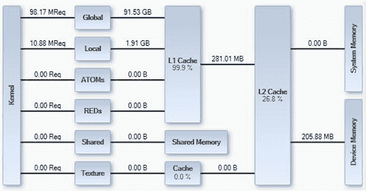

图 7.16 初始内存带宽视图。

目前，L1 缓存的效率达到峰值，但我们有 16 K 的共享内存完全没有使用。它没有像全球内存那样的合并要求，因此它非常适合用于具有分散内存模式的小数据区域。然而，不同于 L1 缓存，共享内存具有每块可见性，这意味着必须为 SM 上的每个驻留块复制数据。

常量内存缓存未在图 7.16 中显示，但它的大小也足够容纳 Galios 乘法（`gmul`）和/或`s_box`表。然而，常量缓存每个时钟周期只有一个 32 位元素带宽，且其设计是为了每个线程访问相同的元素。因此，共享内存是更好的选择。

然而，让我们首先看看两个问题区域，`s_box`和`gmul`表。为了避免大量的指令被添加来进行 32 位字的移位和掩码，这两个表被声明为 32 位无符号类型。鉴于我们产生的内存流量，这可能并不是一个好的选择。将其改为`u8`类型后，我们看到离芯片的内存访问从 205 MB 降到 183 MB，执行时间从 96 毫秒降到 63 毫秒。显然，这造成了全球内存的过多读取，减少这一点有很大帮助。

通过减小内存占用，每个`gmul`表现在为 256 字节，因此四个表格可以轻松适配 1 K。由于每个 SM 最多可以放置八个块，8 K 的共享内存现在足够容纳`gmul`表。

然而，进行这种共享内存优化有一个问题。的确，我们将 18 GB 的内存带宽从 L1 缓存转移到了共享内存，而主内存的带宽下降了 7 MB。然而，我们必须在每个块的开始时移动 1 K 的数据，因为共享内存在块之间不是持久的或共享的。然而，L1 缓存在块之间是共享的，并且目前在处理这种散布的内存模式时表现非常出色，因为表格完全驻留在缓存中。我们使用 8 K 共享内存的速度净改善几乎为零，因此这个优化被移除，表格保留在 L1 缓存中。请注意，与全局内存访问相比，这在计算 1.x 设备上会带来显著的改进，因为那里没有 L1/L2 缓存。

回顾图 7.16，你注意到什么有趣的事情了吗？你是否注意到我们使用了 1.91 GB 的局部存储？局部存储是编译器将寄存器溢出到内存系统的地方。在计算 2.0 设备之前，这部分会实际被转移到全局内存空间。从计算 2.0 开始，它会尽可能地被限制在 L1 缓存中，但仍然可能导致大量不必要的全局内存流量。

在编译时，`-v`选项将显示内核的寄存器使用摘要。每当你看到以下信息时，表示局部内存正在被使用：

```cpp
nn bytes stack frame, nn bytes spill stores, nn bytes spill loads
```

这里的主要问题是使用了`uint4`类型。由于其他地方高频繁使用寄存器，这个从全局内存加载的`uint4`立即被溢出到局部内存。选择 128 位的`uint4`加载是故意的，目的是最小化加载到全局内存的事务数量。通过将其溢出到局部内存，而不是保留在寄存器中，编译器不必要地污染了缓存并导致写回到全局内存。

我们可以通过简单地将数据项声明为`__shared__`数组，并通过`threadIdx.x`进行索引，显式地将其从局部内存移动到共享内存中。由于共享内存是每个块的局部内存形式，我们可以显式地将溢出的寄存器移到共享内存中。移动此参数会生成在图 7.17 中显示的内存视图。

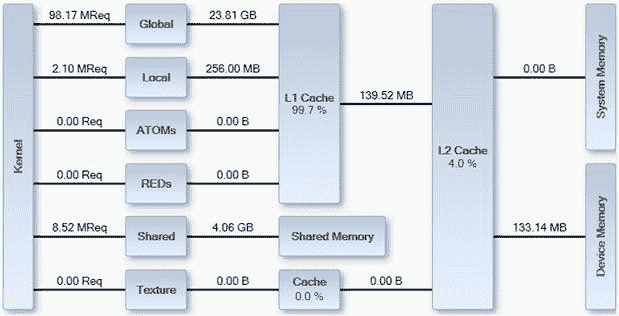

图 7.17 使用共享内存后的内存传输。

请注意，仅仅将这个数据项移动到共享内存中，就能将局部内存的使用量从 1.91 GB 降到仅仅 256 MB，而全局内存的流量也从 183 MB 降到 133 MB。我们共享内存的流量大约是之前的两倍，主要是由于共享内存银行冲突。这是由于将 128 位（16 字节）值放入 32 位（4 字节）的共享内存系统造成的。然而，编译器仍然坚持创建一个堆栈帧，尽管比以前小得多，但它依然存在。整体执行时间依然顽固地保持在 63 毫秒。

要确切查看哪些参数被溢出，必须查看在给定内核中生成的 PTX 代码、汇编代码。任何 PTX 指令，如`st.local`或`ld.local`，都在操作本地数据。本地数据也通过 `local` 前缀进行声明。事实证明，剩余的本地数据实际上是 `__global__` 调用者和 `__device__` 函数之间使用的参数数据，也就是说，

```cpp
__global__ void AES_decode_kernel_multi_block_single_key(uint4 ∗ const src_block,
                                                         uint4 ∗ const dest_blocks,
                                                         KEY_T ∗ const expanded_key,
                                                         const u32 num_cipher_blocks)
{
```

` const u32 tid = (blockIdx.x ∗ blockDim.x) + threadIdx.x;`

```cpp
 if (tid < num_cipher_blocks)
  AES_decrypt_4x4_reg( &(src_block[tid]), &(dest_blocks[tid]), &(expanded_key[0]) );
}
__host__ __device__ void AES_decrypt_4x4_reg(
 const uint4 ∗ const src_cipher_block,
 uint4 ∗ const dest_cipher_block,
 KEY_T ∗ const cipher_key)
{
…
}
```

我们将多个参数传递给设备函数，这使得该函数能够被多个全局函数和主机函数调用，从而导致编译器插入了堆栈框架。我们很少希望编译器调用堆栈，反而希望它内联调用设备函数，从而消除使用堆栈的需求。我们可以使用 `__forceinline__` 指令在声明函数时实现这一点，如下所示：

```cpp
__host__ __device__ __forceinline__ void AES_decrypt_4x4_reg(
 const uint4 ∗ const src_cipher_block,
 uint4 ∗ const dest_cipher_block,
 KEY_T ∗ const cipher_key)
{
…
```

`}`

重新编译代码后不再生成堆栈框架消息。由于该函数现在是一个整体，编译器可以更好地对其应用优化技术。寄存器的使用量降至仅 33，而不是之前为了容纳 8 个块而强制使用的 42 个寄存器。我们可以通过查看图 7.18 中的内存概览来验证不再使用本地内存。

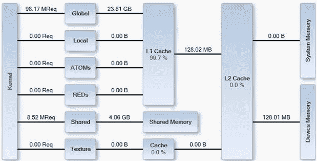

图 7.18 堆栈消除后的内存使用情况。

在图 7.18 中我们可以看到，本地内存流量现在降为零。之前的少量 L2 缓存使用已被消除。全局内存使用量再次减少了 5 MB，降至 128 MB，这是我们预期基于处理数据大小的全局内存带宽的理想值。执行时间略微减少，但仍保持在 63 毫秒。

该内核大量使用 XOR 操作，这是设备中无法以全速执行的指令之一。因此，通过确保在 SM 中保持最大数量的块，我们确保了良好的指令混合，避免了所有操作都排队等待执行 XOR 操作的单元。

在每个块 96 个线程和之前的高 42 寄存器数目下，我们可以使用 24 个 warp 调度八个块。这大约占 SM 可用容量的 50%，即它能够运行的 warp 数量。然而，通过查看 Parallel Nsight 的“问题停顿”实验，我们可以看到实际使用了多少 SM 容量。我们仅停顿了 0.01% 的时间，这意味着 SM 已经几乎达到了峰值容量。因此，通过增加可调度 warp 的数量来增加占用率，可能不会显著帮助性能提升。将线程数从 96 增加到 128 使我们能够将可调度 warp 的数量从 24 增加到 28。这消除了剩余的小停顿问题，并增加了两个 warp 调度器都有可用 warp 的时间比例，从而使时间减少了 1.5 毫秒。这将总执行时间减少到 61.5 毫秒。

### 在其他 GPU 上运行的注意事项

现在已经为单个现代 GPU 开发了一个程序，那么它在其他 GPU 上的表现如何呢？通常，尤其是当你编写商业应用程序时，你的程序需要在市场上每一层次的硬件上都能良好运行。虽然程序可以在大多数 GPU 世代上运行，但你应该了解为了在这些硬件上获得良好的性能，可能需要做哪些适配。我们将通过我们在这里开发的 AES 程序来观察这一点。

我们的第一个目标是 GTX460 卡，这是一款基于 Fermi 的计算 2.1 卡。主要区别包括计算 2.1 架构（7 个 SM × 48 个 CUDA 核心 vs. 14 个 SM × 32 个 CUDA 核心）、减少的 L2 缓存大小（512K vs. 640K）、每个 CUDA 核心的 L1 缓存大小减少（每 48 个 CUDA 核心共享 48K L1 vs. 每 32 个 CUDA 核心共享 48K L1）以及减少的内存带宽（115 GB/s vs. 134 GB/s）。

单纯从 CUDA 核心总数（336 核 vs. 448 核）来看，我们预计性能大约为 75%。然而，考虑到时钟速度的差异，这使得两个设备之间的性能差异不到 10%。GTX460 的内存带宽比 GTX 460 少了 15%。

对于解密函数，实际测量的时间为 100 毫秒，而不是 61.5 毫秒，这有些令人失望。从执行概况来看，我们发现 GTX460 上的 SM 能够执行更多指令，因此数据到达与计算的比率发生了变化。我们再次看到 SM 中出现了微小的停顿。每块 128 个线程时，我们设法调度了七个块（28 个 warps）。如果我们能稍微减少寄存器的使用，我们就能执行另一个块，更好地利用 SM。因此，我们采用与编码操作相同的技术，将逆混合列操作移近解码操作。于是，

```cpp
 // Add Round Key
 {
  // Fetch cipher key from memory as a 128 bit read
  ∗key_ptr = ((∗cipher_key)[round_num]);
  // Extract the key values, XOR’ing them with
  // the current values
  EXTRACT_WORD_XOR2((key_ptr->x), a0, a1, a2, a3);
  EXTRACT_WORD_XOR2((key_ptr->y), a4, a5, a6, a7);
  EXTRACT_WORD_XOR2((key_ptr->z), a8, a9, a10, a11);
  EXTRACT_WORD_XOR2((key_ptr->w), a12, a13, a14, a15);
 }
 // Invert Column Mix on every round except the first
 if (round_num != 10)
 {
  INV_MIX_COLUMN_PTR2(a0, a1, a2, a3,
             gmul_14_ptr, gmul_09_ptr, gmul_13_ptr, gmul_11_ptr);
  INV_MIX_COLUMN_PTR2(a4, a5, a6, a7,
             gmul_14_ptr, gmul_09_ptr, gmul_13_ptr, gmul_11_ptr);
  INV_MIX_COLUMN_PTR2(a8, a9, a10, a11,
             gmul_14_ptr, gmul_09_ptr, gmul_13_ptr, gmul_11_ptr);
```

`  INV_MIX_COLUMN_PTR2(a12, a13, a14, a15,`

```cpp
             gmul_14_ptr, gmul_09_ptr, gmul_13_ptr, gmul_11_ptr);
 }
```

变得

```cpp
 // Add Round Key
 {
  // Fetch cipher key from memory as a 128 bit read
  ∗key_ptr = ((∗cipher_key)[round_num]);
  // Extract the key values, XOR’ing them with
  // the current values
  EXTRACT_WORD_XOR2((key_ptr->x), a0, a1, a2, a3);
  if (round_num != 10)
   INV_MIX_COLUMN_PTR2(a0, a1, a2, a3,
              gmul_14_ptr, gmul_09_ptr, gmul_13_ptr, gmul_11_ptr);
  EXTRACT_WORD_XOR2((key_ptr->y), a4, a5, a6, a7);
  if (round_num != 10)
   INV_MIX_COLUMN_PTR2(a4, a5, a6, a7,
              gmul_14_ptr, gmul_09_ptr, gmul_13_ptr, gmul_11_ptr);
  EXTRACT_WORD_XOR2((key_ptr->z), a8, a9, a10, a11);
  if (round_num != 10)
   INV_MIX_COLUMN_PTR2(a8, a9, a10, a11,
              gmul_14_ptr, gmul_09_ptr, gmul_13_ptr, gmul_11_ptr);
  EXTRACT_WORD_XOR2((key_ptr->w), a12, a13, a14, a15);
  if (round_num != 10)
   INV_MIX_COLUMN_PTR2(a12, a13, a14, a15,
              gmul_14_ptr, gmul_09_ptr, gmul_13_ptr, gmul_11_ptr);
 }
```

这种操作融合使得寄存器的使用降到了神奇的 31 个寄存器，这反过来允许我们调度另一个块，从而在每个 SM 中得到 32 个 warp。这弥补了计算 2.1 设备比计算 2.0 设备具有更高的计算与加载/存储单元比的情况。我们看到执行时间从 100 毫秒稍微下降到了 98 毫秒。然而，我们的计算 2.0 设备（GTX470）已经完全使用了它的计算核心。这一变化，虽然引入了更多的测试，但让我们损失了 0.5 毫秒，回到了 62 毫秒，尤其是在计算 2.0/计算 2.1 设备中，SM 内部执行单元的平衡有所不同时，你可能会遇到这种情况。

第二个目标是 GTX260，它是一个计算 1.3 设备。这里的主要区别是完全没有 L1 和 L2 缓存。SM 架构不同，有 27 个 SM，而不是 14 个 SM，总共有 216 个 CUDA 核心，而不是 448 个 CUDA 核心。内存带宽为 112 GB/s，而 134 GB/s，减少了大约 16%，与 GTX460 相当。

初始运行解码函数的时间为 650 毫秒，比 GTX470 慢了 10 倍以上。为什么会这样？其中一个关键原因是计算 1.x 平台不支持统一寻址模式。因此，需要明确声明预期的内存使用情况。在 `gmul` 表的情况下，它们通过一个小的计算内核在设备上生成。因此，这些表存在于全局内存中。在计算 2.x 平台上，全局内存是有缓存的，而在计算 1.x 平台上，你必须明确将其设为可缓存。我们可以通过几种方式做到这一点。

首先，我们需要指定 `gmul` 使用的内存是常量，这意味着我们无法从设备写入它。由于我们在主机上有一份数据副本，因此我们可以通过 `cudaMemcpyToSymbol` 调用将其复制到设备，或者直接在设备上将其声明为常量内存并在那里进行静态初始化。因此，计算 `gmul` 表的代码被替换为对表查找的简单扩展定义。这样，表就存储在常量缓存中。重新运行代码后，我们看到执行时间从 650 毫秒下降到 265 毫秒，下降了近 60%。然而，GTX260 仍然比 GTX470 慢 4.2 倍，比 GTX460 慢 2.7 倍。

最后，一张旧的 GT9800 卡的 CUDA 核心数量大约是 GTX260 的一半，内存带宽也只有一半。正如预期的那样，我们看到 265 毫秒的时间大约是 478 毫秒（增加了 1.8 倍）。

GTX260 和 GT9800 的问题在于数据的组织。将数据与 AES-NI 使用的格式匹配意味着单个密钥值的数据会按顺序布局在内存中。为了获得更好的性能，我们需要组织内存，使得密钥中的每个连续的 32 位值在内存中以列的形式出现，而不是按行排列。典型的顺序排列方式虽然对于 CPU 是理想的，但对于 GPU 来说却远非理想。

我们的 AES 加密/解密的实际输出如下所示：

```cpp
Intel AES NI support enabled.
Logical CUDA device 0 mapped to physical device 0\. Device ID: GeForce GTX 470 on PCI-E 5
Logical CUDA device 1 mapped to physical device 1\. Device ID: GeForce GTX 470 on PCI-E 4
Logical CUDA device 2 mapped to physical device 2\. Device ID: GeForce GTX 470 on PCI-E 3
Logical CUDA device 3 mapped to physical device 3\. Device ID: GeForce GTX 470 on PCI-E 2
Logical CUDA device 4 mapped to physical device 4\. Device ID: GeForce GTX 470 on PCI-E 1
test_single_block_single_key_encode_decode
AES NI Key           :  2b, 7e, 15, 16, 28, ae, d2, a6, ab, f7, 15, 88, 09, cf, 4f, 3c,
AES NI Plaintext     :  6b, c1, be, e2, 2e, 40, 9f, 96, e9, 3d, 7e, 11, 73, 93, 17, 2a,
AES NI Ciphertext    :  3a, d7, 7b, b4, 0d, 7a, 36, 60, a8, 9e, ca, f3, 24, 66, ef, 97,
Expected Ciphertext  :  3a, d7, 7b, b4, 0d, 7a, 36, 60, a8, 9e, ca, f3, 24, 66, ef, 97,
Single block single key AES-NI decode Passed
GPU Intial Key       :  16157e2b,  a6d2ae28,  8815f7ab,  3c4fcf09,
GPU Plaintext        :  e2bec16b,  969f402e,  117e3de9,  2a179373,
CPU Ciphertext       :  b47bd73a,  60367a0d,  f3ca9ea8,  97ef6624,
GPU Ciphertext       :  b47bd73a,  60367a0d,  f3ca9ea8,  97ef6624,
Expected Ciphertext  :  b47bd73a,  60367a0d,  f3ca9ea8,  97ef6624,
Single block single key serial decode Passed
Single block single key parallel decode Passed
Single block single key parallel decode and AES-NI match Passed
Encrypting on GPU         :  4194304 blocks (32768 Blocks x 128 Threads)
Encrypt Copy To Device    :  28.469ms
Encrypt Expand Key Kernel :   0.025ms
Encrypt Encode Key Kernel :  45.581ms
```

`设备加密复制：25.428 毫秒`

```cpp
Encrypt Total Time        :  99.503ms
Encrypting on CPU        :  4194304 blocks
Encrypt Encode           :  3900.000ms
Encrypting using AES-NI  :  4194304 blocks
Encrypt Encode           :  20.000ms
CPU and GPU encode result Passed.
CPU and GPU AES-NI encode result Passed.
Decrypting on GPU         :  4194304 blocks (32768 Blocks x 128 Threads)
Decrypt Copy To Device    :  27.531ms
Decrypt Expand Key Kernel :   0.028ms
Decrypt Decode Key Kernel :  62.027ms
Decrypt Copy From Device  :  25.914ms
Decrypt Total Time        : 115.500ms
Decrypting on CPU  :  4194304 blocks
Decrypt Decode     :  2760.000ms
Decrypting using AES-NI  :  4194304 blocks
Decrypt Decode           :  20.000ms
CPU and GPU decode result Passed.
CPU and AES-NI decode result Passed.
```

请注意，通过加密，我们已经成功将性能提升到接近 AES-NI 硬件的约 2 倍，而解密则大约为 3 倍。我们这里使用的是 GTX470，它是常规 Sandybridge CPU 时期的硬件，而不是更现代的 Sandybridge-E 设备。常规 Sandybridge 设备的 AES-NI 性能大约是 Sandybridge-E 的一半，这使得我们的性能与 Sandybridge-E 相近。基于 Kepler 的 GTX680 是与 Sandybridge-E CPU 搭配的代表性设备。这将带来约 2 倍的性能提升，使得 GPU 与基于硬件的 AES-NI 性能相当。

关于支持哪些 GPU 的问题相当棘手。消费者市场上有很多老旧 GPU，因此如果你开发的是消费者应用程序，应用程序必须在这些旧设备上运行良好。然而，在大型安装环境中，仅仅电费就意味着，如果能够用更新的 GPU 替代旧的 GPU，继续使用这些旧 GPU 毫无意义。Kepler 的引入将大大加速旧款 Tesla 显卡的退役。

如果你需要支持旧硬件，那么最佳方法是从第一天开始就在该硬件上开发。这样，你将有一个在较新一代显卡上也能 reasonably 工作的基础应用程序。为这些显卡做的许多优化，在较新一代显卡上可能获得的好处会显著减少。然而，几乎所有的优化都会带来*某种*程度的好处，关键是你投入的时间能带来怎样的回报。

### 使用多个流

第八章提供了多流和多流/多 GPU 编程的示例。因此，我们不会讨论如何实现该算法的流式版本。然而，我们会讨论一些你在实现时需要考虑的问题，无论是针对这个算法还是你自己遇到的某个问题。

多个流的作用在于它们可以允许内核执行与 PCI-E 传输的重叠。然而，它们的有效性受到限制，原因在于只有消费级显卡上才会启用一个 PCI-E 传输引擎。只有 Tesla 系列显卡才同时启用了两个 PCI-E 传输引擎，允许实现双向传输的同时进行。

我们通常希望将数据传输到显卡，处理一些数据，然后将数据从显卡传出。在启用单个 PCI-E 传输引擎的情况下，硬件中的所有内存传输只有一个队列。尽管在不同的流中，内存传输请求会被送入 Fermi 及更早版本硬件上的*单个*队列。因此，从主机到设备的传输、调用内核，然后从设备到主机的传输这种典型工作流模式会导致工作流停滞。设备中的传输会阻塞下一个流中设备的传输。因此，所有流实际上是串行执行的。

使用多个流时，我们需要考虑的下一个问题是资源使用。你需要 *N* 组主机和设备内存，其中 *N* 是你希望运行的流的数量。当你使用多个 GPU 时，这样做是很有意义的，因为每个 GPU 都会显著贡献于整体结果。然而，对于单一消费者 GPU，增益就不容易量化。只有当 GPU 工作负载的输入或输出相比较小时，并且总传输时间少于内核执行时间时，这种做法才有效。

在我们的应用中，我们将一组块传入并在单一密钥集下进行编码。我们将编码后的块传出。传入和传出的大小几乎相同。内核执行时间大约是传输时间的两倍。这意味着我们有机会隐藏输入传输时间，仅遭受输出传输时间的影响。

单个 GPU 最多支持 16 个硬件流（Kepler 中为 32 个），因此可以执行 16 次入站传输、16 个内核计算，然后是 16 次出站传输，并且仍然可以在设备和主机的内存范围内进行。随着我们在第九章中介绍多个 GPU 进入系统，传输将变得更加复杂。如你所见，随着并发传输越多，传输时间本身可能会因为 PCI-E 总线上的主机资源争用而变得更长。

### AES 总结

我们在 AES 中遇到了一些值得总结的问题。

• CPU 和 GPU 版本的理想内存模式是不同的。优化 GPU 的内存模式将带来显著的收益（通常在 Fermi 上至少是 2×），尤其是在早期的 GPU 上，这一点尤为重要。

• 对于 compute 1.x 设备，读写内存需要明确声明为常量内存，而不是由编译器自动指定。

• 可能需要重新排序或转换内核，以便编译器更容易发现优化机会。

• 高效的寄存器使用和计数对于实现良好的性能至关重要。

• 你可以通过 L1 缓存在不同块之间共享只读数据，而将相同的只读数据保存在共享内存中则需要 *N* 个副本，其中 *N* 是驻留块的数量。

• 复杂的线程分歧算法，例如解码时的 `gmul` 函数，可以通过非线程分歧的内存查找在缓存或共享内存中替代。缓存的添加就是为了应对这种数据驱动的分散内存模式。

• 检查变量分配到寄存器中的情况，并在可能的情况下消除栈或本地内存的使用。

• 始终在解决方案初期检查正确性，最好使用独立开发的代码进行验证。

• 永远要看程序的*实际*时间。你对事物如何运作的心理模型并不总是正确的，而且你经常会忽略某些东西。始终查看数据，了解每个变化带来的效果。

## 结论

我们已经研究了 GPU 技术的几个应用，特意选择了不同于许多 CUDA 编程示例中的简单矩阵乘法的例子。我们研究了如何利用 GPU 过滤数据，这在从搜索数据中的有趣事实角度以及从纯信号处理角度来看都非常有用。我们还研究了如何在 GPU 上实现 AES，一个标准的加密算法。即使你从未需要在 CUDA 中实现这个算法，你现在也应该理解并且对实现或使用这些算法感到自信。

你还应该注意到，当针对多个计算级别时的一些权衡和设计点，以及项目开发早期的设计决策如何影响后续的结果。考虑寄存器、共享内存、缓存的使用，以及访问全局内存的模式，都是设计中的关键方面，这些内容应该在编写第一行代码之前就理解并加以解决。

今天程序员面临的最大问题之一是他们生活在一个与编程硬件隔离的世界里。为了获得卓越的性能，而不仅仅是平均性能，理解并彻底理解你所开发的环境是非常重要的。诸如各种级别的内存层次结构等概念在传统编程语言中并不存在。C 语言是在 1970 年代初期发明的，直到 C11（即 2011 年）标准中，我们才终于看到线程和本地线程存储开始出现。CUDA 及其原生语言 C 遵循信任程序员的原则。它向你暴露硬件的某些方面，因此你应该视其为自己的责任，理解这些特性并将其使用得当。

通过几个例子，现在我们将转向使用多个 GPU 和优化应用程序，这是一个通过将更多显卡插入 PCI-E 总线并调整我们的应用程序以支持多 GPU 的方式，从单一节点中提取巨大加速的领域。Kepler Tesla K10 产品是首款 Tesla 双 GPU 解决方案，也许是我们在未来几年中会看到的众多解决方案之一。在 CUDA 4.0 之后，多 GPU 编程其实并不难，正如你将在接下来的章节中看到的那样。

#### 问题

1. 为什么在 GTX260 和 GT9800 显卡上，AES 应用程序的运行速度明显慢于 GTX460 和 GTX470 显卡？你会如何解决这个问题？

2. 在 AES 应用程序中，为什么将`u32`类型的`s_box`和`gmul`表转换为`u8`后性能得到了提升？

3. 什么是线程级并行？它有帮助吗？如果有，为什么？

4. 使用原子操作有什么问题？

#### 答案

1. GTX260 和 GT9800 卡分别是计算 1.3 和计算 1.1 卡。因此，它们没有计算 2.x 卡上存在的一级（L1）或二级（L2）缓存。在所示的内存图表中，我们使用的是 99%命中率的 L1 缓存。从 L1 到全局内存意味着我们从 TB 级的带宽降到只有几百 MB 的带宽。

内存合并也发生了根本性变化。计算 2.x 硬件以 128 字节缓存行的形式获取内存。如果线程获取单个 128 字节的值，例如`uint4`，硬件可以处理这个请求。在计算 1.x 硬件上，合并要求要严格得多。

当前编译的`uint4`类型对算法造成了不利影响。在计算 2.x 硬件上，使用从内存中加载四字长向量，然后将四字长向量存入共享内存。而在计算 1.x 硬件上，CUDA 4.1 编译器生成的代码会分别加载每个 32 位字，因此每个方向的流量是必要流量的四倍。加密的密文数据需要以适合合并的形式存储。

常量缓存很有帮助。然而，如果将`uint4`类型从共享内存中移除，替换为寄存器中持有的`u32`值，然后使用共享内存存储`gmul`和`s_box`表格，将会更有利。你还应该考虑到，在旧设备上，纹理缓存可能是一个值得利用的额外资源。

2. `s_box`和`gmul`表格的访问模式依赖于数据。我们总共有四个表格，每个表格包含 256 个条目。使用`u8`类型意味着我们使用 5KB 内存，这适合 L1 缓存和常量缓存。使用`u32`值去除了许多`cvt`（类型转换）指令，但会使 L1 缓存或常量缓存移动四倍的数据。额外的计算开销完全值得为了不移动那么多数据而付出的成本。作为`u32`类型，缓存需要存储 20KB 的数据，轻松超过了常规 16KB 的 L1 缓存分配和 8KB 常量缓存工作集。

3. 线程级并行性利用了大多数硬件是流水线的这一事实，因此能够在连续的时钟周期内接收不依赖的指令而不发生阻塞。每个线程处理四个独立项的值通常是实现线程级并行性的一个好值，这是我们在第九章中讨论的内容。

4. 需要考虑两个主要问题。首先，如果原子操作过度订阅，会导致串行化。因此，32 个值的 warp 写入相同的内存地址（无论是共享内存还是全局内存）将会串行化。至少在 Fermi 架构中，原子操作是 warp 级的操作。因此，让 warp 中的每个线程对独立的可寻址位置执行原子操作，将导致 32 个原子操作而不发生串行化。

第二个问题是原子写操作的顺序。如果一个 warp 的所有值都写入同一地址，则操作的顺序是未定义的。显然，你可以观察到顺序，并且很可能在某个设备上这个顺序会保持一致。然而，另一个设备可能会有所不同。因此，在使用此类知识时，你会在应用程序中构建一个失败点。

## 参考文献

1\. *维基百科，Rijndael 混合列*。可在 *[`en.wikipedia.org/wiki/Rijndael_mix_columns`](http://en.wikipedia.org/wiki/Rijndael_mix_columns)* 查阅；访问时间：2012 年 1 月 31 日。

2\. *联邦信息处理标准出版物 197，高级加密标准（AES）*。可在 *[`csrc.nist.gov/publications/fips/fips197/fips-197.pdf`](http://csrc.nist.gov/publications/fips/fips197/fips-197.pdf)* 查阅；访问时间：2012 年 2 月 5 日。

3\. *Toms Hardware，AES-NI 基准测试结果：Bitlocker、Everest 和 WinZip 14*。可在 *[`www.tomshardware.co.uk/clarkdale-aes-ni-encryption, review-31801–7.html`](http://www.tomshardware.co.uk/clarkdale-aes-ni-encryption_review-31801-7.html)* 查阅；访问时间：2012 年 4 月 26 日。
