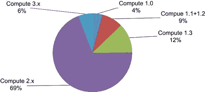
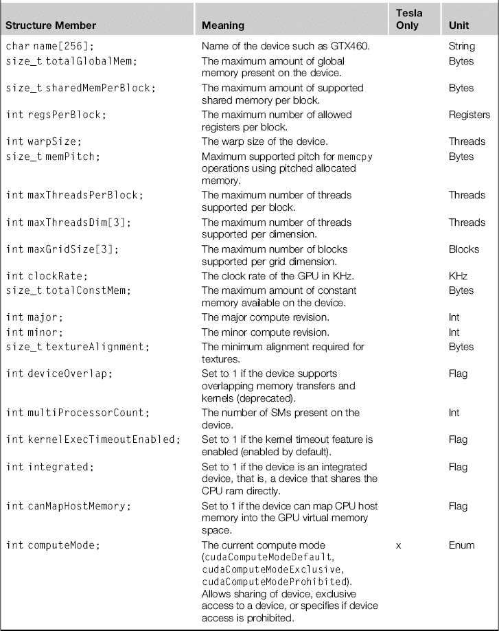
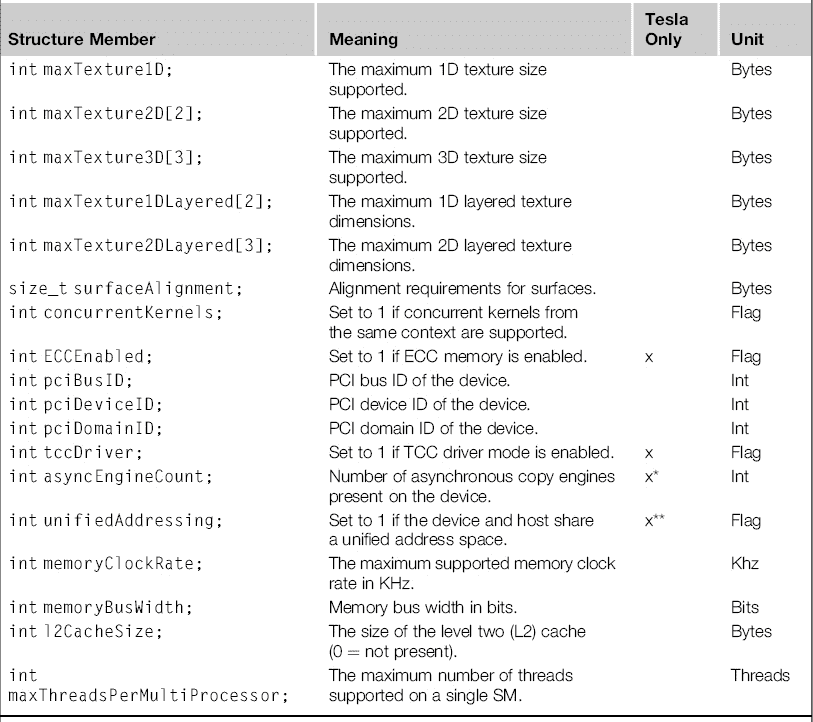
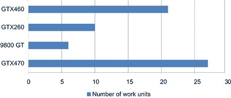
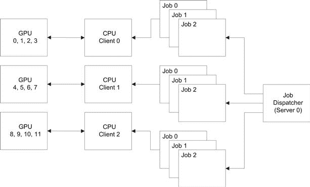

# 第八章

# 多 CPU 和多 GPU 解决方案

## 介绍

在现代计算系统中，通常会有多个设备，包括 CPU 和 GPU。在 CPU 方面，我们将讨论插槽和核心。插槽是主板上的一个物理插口，用于安装 CPU。一个 CPU 可能包含一个或多个核心。每个核心实际上是一个独立的实体。多个 CPU 和 GPU 插槽位于同一个节点或计算机系统中。

了解核心、插槽和节点的物理布局可以实现更有效的任务调度或分配。

## 局部性

局部性原则在 GPU 和 CPU 中都有很好的体现。更靠近设备的内存（GPU 上的共享内存、CPU 上的缓存）访问速度更快。插槽内的通信（即核心之间的通信）比不同插槽之间的核心通信要快得多。与另一个节点上的核心通信至少比同一节点内的通信慢一个数量级。

显然，拥有了解硬件架构的软件可以对任何系统的整体性能产生巨大影响。这样的插槽感知软件可以根据硬件布局划分数据，确保一个核心处理一致的数据集，并且需要协作的核心位于同一插槽或节点内。

## 多 CPU 系统

人们最常遇到的多 CPU 系统是单插槽的多核桌面电脑。几乎任何你今天购买的 PC 都将配备多核 CPU。即使是在笔记本电脑和媒体 PC 中，你也会找到多核 CPU。如果我们查看 Steam 的常规硬件（消费者/游戏）调查，它显示截至 2012 年中期，大约 50%的用户拥有双核系统，另外 40%的用户拥有四核或更高的系统。

你遇到的第二种多 CPU 系统是在工作站和低端服务器中。这些通常是双插槽机器，通常由多核的 Xeon 或 Opteron CPU 驱动。

你遇到的最终一种多 CPU 系统是基于数据中心的服务器，这些服务器通常具有 4 个、8 个或 16 个插槽，每个插槽上都有一个多核 CPU。这种硬件通常用于创建虚拟化机器集，使公司能够从一台大型服务器集中支持大量的虚拟 PC。

任何多处理器系统中的一个主要问题是内存一致性。CPU 和 GPU 都会为各自的设备分配内存。对于 GPU 而言，这是每个 GPU 卡上的全局内存。对于 CPU 而言，这是主板上的系统内存。

当你有独立的程序仅使用单个核心时，你可以很好地进行扩展，因为每个程序可以局部化到一个特定的核心。程序接着访问其自己的数据，并充分利用 CPU 核心的缓存。然而，一旦两个核心开始协作，就会出现问题。

为了加速访问内存位置，CPU 广泛使用缓存。当一个参数的值被更新时（例如，`x++`），`x`是否真的写入了内存？假设两个核心需要更新`x`，因为一个核心被分配了借记处理任务，另一个分配了贷记处理任务。这两个核心必须对存储参数`x`的内存位置有一致的视图。

这就是缓存连贯性问题，它限制了在单个节点上能够实际协作的最大核心数量。在硬件中发生的情况是，当核心 1 写入`x`时，它通知所有其他核心`x`的值已经改变，然后执行一个慢速写入到主内存，而不是快速写回缓存访问。

在一个简单的连贯性模型中，其他核心会将它们缓存中`x`的条目标记为无效。下次访问`x`时，会导致`x`从慢速主内存重新加载。随着后续核心写入`x`，这一过程会重复，接下来访问参数`x`的核心必须再次从内存中获取它并重新写回。实际上，参数`x`变成了非缓存，这在 CPU 中意味着巨大的性能损失。

在更复杂的连贯性模型中，代替使`x`无效，失效请求被更新请求所取代。因此，每次写入必须分发到*N*个缓存中。随着*N*的增加，同步缓存的时间变得不切实际。这通常限制了你能放入对称多处理器（SMP）系统中的实际节点数量。

现在记住，缓存应该以高速运行。在单个插槽内，这并不困难。然而，一旦你需要超出插槽的范围，就很难保持高时钟速率，因此一切开始变慢。插槽越多，保持所有内容同步就变得越困难。

我们面临的下一个主要问题是内存访问时间。为了让编程这样的机器更容易，通常将内存逻辑上安排为一个巨大的线性地址空间。然而，一旦来自插槽 1 的核心尝试访问插槽 2 的内存地址，它必须由插槽 2 来服务，因为只有插槽 2 可以物理寻址那块内存。这就是所谓的非统一内存访问（NUMA）。尽管从概念上讲，它让程序员的生活更轻松，但在实践中，你需要考虑内存局部性，否则你写出的程序会非常慢。

## 多 GPU 系统

就像 CPU 世界一样，许多系统现在内部有多个 GPU。从拥有三卡或四卡 SLI 系统的发烧友，或拥有 9800GX2、GTX295、GTX590 和 GTX690 等双卡的用户，到将低功耗 ION 台式机升级为专用 GPU 卡的用户，有许多人使用多 GPU 系统。作为程序员，你应该始终努力在可用的任何硬件上提供最佳的体验。

如果用户有一个双 GPU 系统，而你只使用一个 GPU，那么你就像那些不愿意学习如何使用多个核心的 CPU 程序员一样懒惰。有很多程序会监控 GPU 负载。技术娴熟的用户或评论员会批评你的产品，因为它没有做到额外的努力。

如果你在编写科学应用程序或使用已知硬件，而不是消费级应用程序，你也应该研究多 GPU 解决方案。几乎所有 PC 都至少支持两个 PCI-E 插槽，这样几乎可以将至少两个 GPU 卡放入任何 PC 中。CUDA 不使用也不要求 SLI（可扩展链接接口），因此没有 SLI 认证的主板也不会成为在 CUDA 应用中使用多个 GPU 的障碍。增加一张额外的 GPU 卡，你通常会看到性能水平翻倍，当前的执行时间减半。很少有机会能够如此轻松地获得这样的加速。

## 多 GPU 上的算法

CUDA 环境本身不支持合作的多 GPU 模型。该模型更倾向于基于单核心、单 GPU 的关系。这对于相互独立的任务非常有效，但如果你希望编写一个需要 GPU 以某种方式合作的任务，这就变得非常麻烦。

例如，像 BOINC 这样的应用程序在这种模式下表现得很好。BOINC 是一个允许用户将空闲计算能力捐赠给解决世界问题的应用程序。在多 GPU 系统中，它会生成*N*个任务，其中*N*等于系统中 GPU 的数量。每个任务会从中央服务器获取一个单独的数据包或任务。当 GPU 完成任务时，它会从中央服务器（任务调度器）请求额外的任务。

现在如果你看一个不同的例子，在需要合作的情况下，故事就不同了。在最简单的层面上，视频编码通常是通过对每一帧应用类似 JPEG 的算法，然后寻找帧与帧之间的运动矢量来完成的。因此，我们在每一帧内有一个可以分配给*N*个 GPU 的操作，但接着会有一个操作需要 GPU 共享数据，并且依赖于第一个任务（JPEG 压缩）完成。

有几种方法可以处理这个问题。最简单的是使用两次传递，一次内核只是对*N*个独立帧做 JPEG 压缩，第二次内核则做基于运动矢量的压缩。我们之所以能够这样做，是因为基于运动矢量的压缩使用的是有限的帧窗口，所以帧 1 不会影响帧 1000。因此，我们可以将工作分成*N*个独立的任务。采用这种方法的缺点，就像任何多传递算法一样，是我们需要多次读取数据。由于数据集通常非常大，并且涉及到较慢的大容量存储设备，因此这通常不是一个好方法。

单遍方法效率更高，但编程更为复杂。如果你将做运动矢量压缩的帧集视为数据集，你可以转换问题。每一组帧都是独立的，可以分配到不同的 GPU 卡上。GPU 内核首先对它所提供的每一组帧进行 JPEG 压缩，然后在这些帧上计算运动相关信息。通过这种方法，你成功地将数据保留在 GPU 卡上，这消除了此类问题的主要瓶颈——即数据在系统中移动的过程。

在这个实例中，我们成功地重构了算法，使其可以被拆分成独立的数据块。这并不总是可行的，许多类型的问题至少需要从其他 GPU 获取少量数据。一旦你需要另一个 GPU 的数据，就必须显式地共享该数据，并在 GPU 之间显式地按顺序访问这些数据。在 4.0 SDK 之前，CUDA 环境并不支持这一点。如果有可能将问题拆分成独立的数据块，建议采用这种方法。

还有几种替代方法。你可以使用从 4.0 SDK 版本开始提供的 GPU 点对点通信模型，或者使用 CPU 级原语在 CPU 层面进行协作。前者并不适用于所有操作系统，尤其是在带有消费者硬件的 Windows 7 上。CPU 解决方案需要操作系统特定的通信原语，除非使用通用的第三方解决方案。

## 哪个 GPU？

当系统中有多个 GPU 时，它们是相同的吗？还是不同的？程序员怎么知道？这重要吗？

这通常很重要，但在很大程度上取决于具体应用。在 CUDA 二进制文件中，通常包含多个二进制镜像，每个镜像对应一代 GPU。至少应该包含最低计算能力 GPU 的二进制文件。然而，针对更高计算设备优化的其他二进制文件也可能存在。CUDA 运行时会根据计算设备自动选择最高级别的二进制文件来执行内核。

某些功能，例如原子操作，只在特定计算级别的设备上可用；在低级计算设备上运行这些代码会导致内核无法运行。因此，至少对于某些程序，我们必须关注使用的是哪个 GPU。由于缓存和应用程序选择块大小的影响，其他程序在新硬件上运行得更好或更差。还有一些程序可能是为 G80/G200 系列设备使用大量寄存器编写的，而这一点在 Fermi 架构上有所减少，之后在 Kepler 架构中得以恢复。

因此，需要一些用户或管理员级别的知识，来了解在哪个平台上运行给定的内核是最好的，或者程序员需要调整程序，以便它能在所有平台上良好运行。这可以通过避免特定于计算设备的例程来完成，这些例程通常会使编程更加困难，或者通过提供一些避免计算级别问题的替代内核来实现。然而，后者通常是由商业考虑驱动的。程序员的时间是有成本的，您需要评估您的目标市场是否包含足够多使用旧硬件的用户，以证明额外开发和测试的工作是值得的。就消费者市场而言，截至 2012 年 8 月，大约四分之一的市场仍在使用 Fermi 之前的硬件。请参阅图 8.1。



图 8.1 消费者计算水平分布 2012 年 8 月。

程序员如何选择 GPU 设备？到目前为止，我们已经看到了一些例子，其中使用了四个设备并比较了每个设备的结果。从各种代码示例中，您应该已经看到，需要通过调用来设置设备。

```cpp
cudaError_t cudaSetDevice(int device_num);
```

或者是本文中常用的简化版本，

`CUDA_CALL(cudaSetDevice(0));`

参数`device_num`是从零（默认设备）到系统中设备数量的一个数字。要查询设备的数量，只需使用以下调用：

```cpp
cudaError_t cudaGetDeviceCount(int ∗ device_count);
```

```cpp
CUDA_CALL(cudaGetDeviceCount(&num_devices));
```

在这两个调用中，我们都使用了在第四章中开发的`CUDA_CALL`宏。这个宏简单地获取返回值，检查是否有错误，打印适当的错误信息，如果失败则退出。有关具体如何工作的更多信息，请参阅第四章中的 CUDA 设置部分。

现在我们知道有多少个设备以及如何选择其中一个，问题是选择哪个设备。为此，我们需要了解特定设备的详细信息。我们可以通过以下调用来查询：

```cpp
cudaError_t cudaGetDeviceProperties(struct cudaDeviceProp ∗ properties, int device);
```

```cpp
struct cudaDeviceProp device_0_prop;
CUDA_CALL(cudaGetDeviceProperties(&device_0_prop, 0));
```

结构体`properties`由表 8.1 中显示的结构成员组成。

表 8.1 设备属性解释





^∗双复制引擎仅支持 Telsa 设备。消费级设备仅支持单复制引擎。

^(∗∗)统一地址仅在 64 位平台上受支持。在 Windows 上，它需要 TCC 驱动程序，而 TCC 驱动程序又需要 Tesla 显卡。在 UNIX 平台上则不是这样。

这些并不全都可能引起兴趣，但某些内容会引起关注。最重要的内容是主要和次要计算级别修订。此外，还请注意，`warpSize`出现在这里，这意味着 warp 大小在不同设备上会有所不同，尽管在实践中，它在迄今发布的所有设备中都保持在 32。

选择设备时，不必检查每个项是否符合特定用户程序的需求。你只需用你想要的属性（0 表示不关心）填充相同的结构体，让 CUDA 运行时为你选择合适的设备。例如：

```cpp
struct cudaDeviceProp device_prop;
int chosen_device;
```

```cpp
memset(device_prop, 0, sizeof(cudaDeviceProp));
device_prop.major = 2;
device_prop.minor = 0;
```

```cpp
if (cudaChooseDevice(&chosen_device, device_prop) != cudaErrorInvalidValue)
{
CUDA_CALL(cudaSetDevice(chosen_device));
}
```

在这段代码中，我们创建一个设备属性结构体，使用`memset`调用清空它，然后请求一个计算能力为 2.0 的设备（任何 Fermi 设备）。接着，我们要求 CUDA 将上下文设置为指定的设备。

## 单节点系统

在 CUDA 4.0 SDK 之前的版本中，单节点系统是唯一可用的多 GPU 模型，如图 8.2 所示。单个基于 CPU 的任务会与一个单独的 GPU 上下文关联。在这个上下文中，一个任务可以是进程也可以是线程。在幕后，CUDA 运行时会将 CPU 进程/线程 ID 绑定到 GPU 上下文。因此，所有后续的 CUDA 调用（例如`cudaMalloc`）都会在绑定到该上下文的设备上分配内存。


图 8.2 多客户端，多服务器。

这种方法存在一些缺点，但也有一些优点。从编程的角度看，主机端的进程/线程模型被操作系统类型所割裂。进程是一个作为独立可调度单元在 CPU 上运行的程序，并且拥有自己的数据空间。为了节省内存，同一进程的多个实例通常共享代码空间，操作系统会为每个进程维护一组寄存器（或上下文）。

线程，另一方面，是 CPU 调度中的一个更轻量的元素。它共享其父进程使用的代码*和*数据空间。然而，与进程一样，每个线程也需要操作系统维护一个状态（指令指针、栈指针、寄存器等）。

线程可以与同一进程中的其他线程进行通信与协作。进程则可以通过进程间通信与其他进程进行通信与协作。进程之间的这种通信可能发生在同一个 CPU 核心、同一个 CPU 插槽、同一个 CPU 节点、同一个机架、同一个计算机系统中，甚至跨计算机系统进行。

实际的 API 会根据通信的级别和操作系统而有所不同。在 Windows 上使用的 API 与 Linux 上使用的完全不同。POSIX 线程，或称 pthreads，是 Linux 上常用的线程模型。Windows 本身不原生支持这一模型，尽管它有对应的移植版本。C++ Boost 库支持一个通用的线程包`thread`，它同时支持 Linux 和 Windows。

CPU 线程类似于我们在执行内核时使用的 GPU 线程，区别在于它们不像 GPU 线程那样以组或 warp 的形式执行。GPU 线程通过共享内存进行通信，并显式同步，以确保每个线程都已读/写该内存。共享内存是本地于 SM 的，这意味着线程只能与同一 SM 内的其他线程进行通信（理论上）。由于块是 SM 的调度单元，线程通信实际上是基于每个块的。

CPU 上的进程可以被认为与 GPU 上的块类似。一个进程被调度到 *N* 个 CPU 核心中的一个运行。一个块被调度到 GPU 上 *N* 个 SM 中的一个运行。从这个意义上讲，SM 就像 CPU 核心一样。

CPU 进程可以通过同一插槽上的主机内存互相通信。然而，由于进程使用的是独立的内存空间，这只有在借助第三方进程间通信库的情况下才能发生，因为每个进程无法物理访问对方的地址空间。然而，对于 GPU 块来说情况不同，因为它们访问的是 GPU 全局内存上的公共地址空间。

使用共享主机内存的多 CPU 系统也可以通过这种共享内存进行相互通信，但仍需要借助第三方进程间通信库。多个 GPU 也可以在同一主机上通过主机内存进行通信，或者从 CUDA SDK 4.0 开始，直接通过 PCI-E 总线进行点对点通信。需要注意的是，点对点通信仅支持使用 Fermi 或更高版本显卡的 64 位操作系统。在 Windows 系统中，只有使用 TCC（Tesla 计算集群）驱动时才支持，这实际上意味着它仅支持 Tesla 显卡。

然而，一旦你无法再使用 CPU 核心/插槽之间的共享主机内存，你就必须使用其他网络传输机制（如 TCP/IP、InfiniBand 等）。这种类型通信的标准已成为 MPI（消息传递接口）。还有一些不太为人所知但同样有效的替代方案，如 ZeroMQ（0MQ）。

请注意，这两者在同一主机节点内部进行通信时，都利用了共享主机内存传输。然而，支持线程的模型（例如 pthreads、ZeroMQ）比基于进程模型的模型（如 MPI）更快速地进行线程间通信。

在这里我们将重点讨论单个 CPU 插槽的情况，运行一个单线程的 CPU 程序并有多个 GPU 存在。这是消费级硬件中最常见的使用场景，因此是最有用的案例。有关多个 GPU 之间的点对点传输等更高级的主题，请参见第十章。

## 流

流（Streams）是 GPU 上的虚拟工作队列。它们用于异步操作，也就是说，当你希望 GPU 与 CPU 分开工作时使用。某些操作会隐式地造成同步点，例如默认的内存从主机到设备的复制。大多数情况下，这正是程序员所希望的，因为在将结果从 GPU 复制回 CPU 后，它们会立即在 CPU 上执行。如果结果是部分显示的，那么在调试或单步执行时，应用程序可能能正常工作，但当以全速运行时则会失败——这将是一个调试噩梦。

通过创建流，您可以将工作和事件推送到流中，随后它们将按推送顺序执行。流和事件与它们创建时的 GPU 上下文相关联。因此，为了展示如何在多个 GPU 上创建几个流和事件，我们将设置一个小程序来演示这一点。

```cpp
void fill_array(u32 ∗ data, const u32 num_elements)
{
 for (u32 i=0; i< num_elements; i++)
 {
  data[i] = i;
 }
}
```

```cpp
void check_array(char ∗ device_prefix,
                 u32 ∗ data,
                 const u32 num_elements)
{
 bool error_found = false;
```

```cpp
 for (u32 i=0; i< num_elements; i++)
 {
  if (data[i] != (i∗2))
  {
   printf("%sError: %u %u",
          device_prefix,
          i,
          data[i]);
```

```cpp
   error_found = true;
  }
 }
```

```cpp
 if (error_found == false)
  printf("%sArray check passed", device_prefix);
}
```

在第一个函数中，我们只是简单地用从 0 到`num_elements`的值填充数组。第二个函数则简单地检查 GPU 的结果是否符合预期。显然，这两个函数最终会被实际的代码替换，以执行一些更有用的操作。

```cpp
__global__ void gpu_test_kernel(u32 ∗ data)
{
 const int tid = (blockIdx.x ∗ blockDim.x)
     + threadIdx.x;
 data[tid] ∗= 2;
```

`}`

接下来，我们声明内核函数本身。这个函数做的不过是将每个数据元素乘以 2。虽然没什么实际用处，但它是我们能轻松检查的内容，确保数组中的每个元素都被正确处理。

```cpp
// Define maximum number of supported devices
#define MAX_NUM_DEVICES (4)
```

```cpp
// Define the number of elements to use in the array
#define NUM_ELEM (1024∗1024∗8)
```

```cpp
// Define one stream per GPU
cudaStream_t stream[MAX_NUM_DEVICES];
```

```cpp
// Define a string to prefix output messages with so
// we know which GPU generated it
char device_prefix[MAX_NUM_DEVICES][300];
```

```cpp
// Define one working array per device, on the device
u32 ∗ gpu_data[MAX_NUM_DEVICES];
```

```cpp
// Define CPU source and destination arrays, one per GPU
u32 ∗ cpu_src_data[MAX_NUM_DEVICES];
u32 ∗ cpu_dest_data[MAX_NUM_DEVICES];
```

最后，我们来到了程序的主部分。这个函数声明了多个值，每个值都由`device_num`索引。这使得我们可以为每个设备使用相同的代码，只需要递增索引即可。

```cpp
// Host program to be called from main
__host__ void gpu_kernel(void)
{
 // No dynamic allocation of shared memory required
 const int shared_memory_usage = 0;
```

```cpp
 // Define the size in bytes of a single GPU’s worth
 // of data
 const size_t single_gpu_chunk_size = (sizeof(u32) ∗
           NUM_ELEM);
```

```cpp
 // Define the number of threads and blocks to launch
 const int num_threads = 256;
 const int num_blocks = ((NUM_ELEM + (num_threads-1))
       / num_threads);
```

```cpp
 // Identify how many devices and clip to the maximum
 // defined
 int num_devices;
```

` CUDA_CALL(cudaGetDeviceCount(&num_devices));`

```cpp
 if (num_devices > MAX_NUM_DEVICES)
  num_devices = MAX_NUM_DEVICES;
```

首先，我们需要使用`cudaGetDeviceCount`调用来确定可用的 GPU 数量。为了确保不会超过预期的数量，这个数字会被裁剪到最大支持的值，这只是一个简单的`#define`。如果允许使用四张双 GPU 卡，那么八个将是比这里选择的四个更好的最大值。

```cpp
 // Run one memcpy and kernel on each device
 for (int device_num=0;
      device_num < num_devices;
      device_num++)
 {
  // Select the correct device
  CUDA_CALL(cudaSetDevice(device_num));
```

每个循环的第一部分将当前设备上下文设置为`device_num`参数，以确保所有后续的调用都将作用于该设备。

```cpp
  // Generate a prefix for all screen messages
  struct cudaDeviceProp device_prop;
  CUDA_CALL(cudaGetDeviceProperties(&device_prop,
                                    device_num));
  sprintf(&device_prefix[device_num][0], "\nID:%d %s:", device_num, device_prop.name);
```

```cpp
  // Create a new stream on that device
  CUDA_CALL(cudaStreamCreate(&stream[device_num]));
```

```cpp
  // Allocate memory on the GPU
  CUDA_CALL(cudaMalloc((void∗∗)&gpu_data[device_num],
                        single_gpu_chunk_size));
```

```cpp
  // Allocate page locked memory on the CPU
  CUDA_CALL(cudaMallocHost((void ∗∗)
                            &cpu_src_data[device_num],
                            single_gpu_chunk_size));
```

```cpp
  CUDA_CALL(cudaMallocHost((void ∗∗)
                            &cpu_dest_data[device_num],
                            single_gpu_chunk_size));
```

```cpp
  // Fill it with a known pattern
  fill_array(cpu_src_data[device_num], NUM_ELEM);
```

```cpp
  // Copy a chunk of data from the CPU to the GPU
```

`  // 异步`

```cpp
  CUDA_CALL(cudaMemcpyAsync(gpu_data[device_num],
            cpu_src_data[device_num],
            single_gpu_chunk_size,
            cudaMemcpyHostToDevice,
            stream[device_num]));
```

```cpp
  // Invoke the GPU kernel using the newly created
  // stream - asynchronous invokation
  gpu_test_kernel<<<num_blocks,
                    num_threads,
                    shared_memory_usage,
    stream[device_num]>>>(gpu_data[device_num]);
```

```cpp
  cuda_error_check(device_prefix[device_num],
                   "Failed to invoke gpu_test_kernel");
```

```cpp
  // Now push memory copies to the host into
  // the streams
  // Copy a chunk of data from the GPU to the CPU
  // asynchronous
  CUDA_CALL(cudaMemcpyAsync(cpu_dest_data[device_num],
                            gpu_data[device_num],
                            single_gpu_chunk_size,
                            cudaMemcpyDeviceToHost,
                            stream[device_num]));
 }
```

我们为系统中每个 GPU 创建一个流或工作队列。我们将数据从主机（CPU）内存复制到 GPU 全局内存，并紧接着进行内核调用，之后再复制回 CPU。它们将按此顺序执行，因此内核在前面的内存复制完成之前不会开始执行。

请注意主机上使用页锁定内存的用法，使用 `cudaMallocHost` 分配，而不是常规的 C `malloc` 函数。页锁定内存是无法交换到磁盘的内存。由于内存复制操作是通过 PCI-E 总线的直接内存访问（DMA）执行的，因此 CPU 端的内存必须始终物理地驻留在内存中。使用 `malloc` 分配的内存可能会被交换到磁盘上，如果尝试对其进行 DMA 操作，将会失败。由于我们使用 `cudaMallocHost` 函数来分配内存，因此必须使用 `cudaFreeHost` 函数来释放内存。

```cpp
 // Process the data as it comes back from the GPUs
 // Overlaps CPU execution with GPU execution
 for (int device_num=0;
   device_num < num_devices;
   device_num++)
 {
  // Select the correct device
```

`  CUDA_CALL(cudaSetDevice(device_num));`

```cpp
  // Wait for all commands in the stream to complete
  CUDA_CALL(cudaStreamSynchronize(stream[device_num]));
```

最后，一旦内核流被填充，就该等待 GPU 内核完成。此时，GPU 可能甚至还没有开始，因为我们所做的只是将命令推送到流或命令队列中。

```cpp
  // GPU data and stream are now used, so
  // clear them up
  CUDA_CALL(cudaStreamDestroy(stream[device_num]));
  CUDA_CALL(cudaFree(gpu_data[device_num]));
```

```cpp
  // Data has now arrived in
  // cpu_dest_data[device_num]
  check_array( device_prefix[device_num],
               cpu_dest_data[device_num],
               NUM_ELEM);
```

```cpp
  // Clean up CPU allocations
  CUDA_CALL(cudaFreeHost(cpu_src_data[device_num]));
  CUDA_CALL(cudaFreeHost(cpu_dest_data[device_num]));
```

```cpp
  // Release the device context
  CUDA_CALL(cudaDeviceReset());
 }
}
```

然后，CPU 按顺序等待每个设备完成，完成后它会检查内容，然后释放与每个流相关联的 GPU 和 CPU 资源。然而，如果系统中的 GPU 设备不同，并且它们执行内核所需的时间不同，会发生什么情况呢？首先，我们需要添加一些计时代码，以便实际查看每个内核的执行时间。为此，我们必须在工作队列中添加事件。事件有一个特殊之处，即我们可以查询事件，无论当前选择的是哪个 GPU。为此，我们需要声明一个开始事件和一个停止事件：

```cpp
// Define a start and stop event per stream
cudaEvent_t kernel_start_event[MAX_NUM_DEVICES];
cudaEvent_t memcpy_to_start_event[MAX_NUM_DEVICES];
cudaEvent_t memcpy_from_start_event[MAX_NUM_DEVICES];
cudaEvent_t memcpy_from_stop_event[MAX_NUM_DEVICES];
```

接下来，它们需要被推送到流或工作队列中：

```cpp
// Push the start event into the stream
CUDA_CALL(cudaEventRecord(memcpy_to_start_event[device_num], stream[device_num]));
```

我们在内存复制到设备开始时推送一个开始事件，在内核调用之前推送一个事件，在内存复制回主机之前推送一个事件，最后，在内存复制结束时推送一个事件。这使我们能够看到每个 GPU 操作的各个阶段。

最后，我们需要获取经过的时间并将其打印到屏幕上：

```cpp
// Wait for all commands in the stream to complete
CUDA_CALL(cudaStreamSynchronize(stream[device_num]));
```

```cpp
// Get the elapsed time between the copy
// and kernel start
CUDA_CALL(cudaEventElapsedTime(&time_copy_to_ms,
 memcpy_to_start_event[device_num],
 kernel_start_event[device_num]));
```

```cpp
// Get the elapsed time between the kernel start
// and copy back start
CUDA_CALL(cudaEventElapsedTime(&time_kernel_ms,
 kernel_start_event[device_num],
 memcpy_from_start_event[device_num]));
```

```cpp
// Get the elapsed time between the copy back start
// and copy back start
CUDA_CALL(cudaEventElapsedTime(&time_copy_from_ms,
 memcpy_from_start_event[device_num],
 memcpy_from_stop_event[device_num]));
```

```cpp
// Get the elapsed time between the overall start
// and stop events
CUDA_CALL(cudaEventElapsedTime(&time_exec_ms,
 memcpy_to_start_event[device_num],
 memcpy_from_stop_event[device_num]));
```

```cpp
// Print the elapsed time
const float gpu_time = (time_copy_to_ms + time_kernel_ms + time_copy_from_ms);
```

```cpp
printf("%sCopy To  : %.2f ms",
       device_prefix[device_num], time_copy_to_ms);
```

```cpp
printf("%sKernel   : %.2f ms",
       device_prefix[device_num], time_kernel_ms);
```

```cpp
printf("%sCopy Back  : %.2f ms",
       device_prefix[device_num], time_copy_from_ms);
```

```cpp
printf("%sComponent Time : %.2f ms",
       device_prefix[device_num], gpu_time);
```

```cpp
printf("%sExecution Time : %.2f ms",
       device_prefix[device_num], time_exec_ms);
```

`printf("\n");`

我们还需要重新定义内核，使其能够执行更多的工作，以便我们能够真正看到内核的合理执行时间：

```cpp
__global__ void gpu_test_kernel(u32 ∗ data, const u32 iter)
{
 const int tid = (blockIdx.x ∗ blockDim.x)
     + threadIdx.x;
```

```cpp
 for (u32 i=0; i<iter; i++)
 {
  data[tid] ∗= 2;
  data[tid] /= 2;
 }
}
```

当我们运行程序时，我们会看到以下结果：

```cpp
ID:0 GeForce GTX 470:Copy To        :   20.22 ms
ID:0 GeForce GTX 470:Kernel         : 4883.55 ms
ID:0 GeForce GTX 470:Copy Back      :   10.01 ms
ID:0 GeForce GTX 470:Component Time : 4913.78 ms
ID:0 GeForce GTX 470:Execution Time : 4913.78 ms
ID:0 GeForce GTX 470:Array check passed
```

```cpp
ID:1 GeForce 9800 GT:Copy To        :    20.77 ms
ID:1 GeForce 9800 GT:Kernel         : 25279.57 ms
ID:1 GeForce 9800 GT:Copy Back      :    10.02 ms
ID:1 GeForce 9800 GT:Component Time : 25310.37 ms
ID:1 GeForce 9800 GT:Execution Time : 25310.37 ms
ID:1 GeForce 9800 GT:Array check passed
```

```cpp
ID:2 GeForce GTX 260:Copy To        :    20.88 ms
ID:2 GeForce GTX 260:Kernel         : 14268.92 ms
ID:2 GeForce GTX 260:Copy Back      :    10.00 ms
ID:2 GeForce GTX 260:Component Time : 14299.80 ms
ID:2 GeForce GTX 260:Execution Time : 14299.80 ms
ID:2 GeForce GTX 260:Array check passed
```

```cpp
ID:3 GeForce GTX 460:Copy To        :   20.11 ms
ID:3 GeForce GTX 460:Kernel         : 6652.78 ms
ID:3 GeForce GTX 460:Copy Back      :    9.94 ms
ID:3 GeForce GTX 460:Component Time : 6682.83 ms
ID:3 GeForce GTX 460:Execution Time : 6682.83 ms
ID:3 GeForce GTX 460:Array check passed
```

从结果中可以看出，内存复制操作之间的差异在一个小的容忍范围内。这并不令人惊讶，因为每个设备都在 x8 PCI-E 2.0 链接上运行。PCI 链接速度远远慢于即使是最慢设备的内存速度，因此我们实际上受限于 PCI-E 总线速度，尤其是在这样的数据传输中。

然而，有趣的是，内核执行速度变化非常剧烈，从 5 秒到 25 秒不等。因此，如果我们严格按照顺序为每个设备提供数据，这样的周期大约需要 51 秒（5 秒 + 25 秒 + 14 秒 + 7 秒）。然而，当程序等待设备 1（9800GT，最慢的设备）时，设备 2（GTX260）和设备 3（GTX460）已经完成。在这段时间内，它们本可以继续接收更多的工作。

我们可以通过查询结束事件来解决这个问题，而不是仅仅等待结束事件。也就是说，我们检查内核是否已完成，如果没有，则跳到下一个设备，稍后再返回处理较慢的设备。这可以通过以下函数来实现：

```cpp
cudaError_t cudaEventQuery (cudaEvent_t event);
```

这个函数接受一个指定的事件，并在事件已经发生时返回`cudaSuccess`，如果事件尚未发生，则返回`cudaErrorNotReady`。注意，这意味着我们不能使用常规的`CUDA_CALL`宏，因为`cudaErrorNotReady`状态并不是真正的错误状态，而只是状态信息。

我们还需要指定 CUDA 如何通过以下调用跟踪待处理的 GPU 任务：

```cpp
// Give back control to CPU thread
CUDA_CALL(cudaSetDeviceFlags(cudaDeviceScheduleYield));
```

这个调用在任何其他 CUDA 调用之前进行，它只是告诉驱动程序，在等待操作时，应该始终将 CPU 线程让给其他 CPU 线程。这可能会导致一些额外的延迟，因为驱动程序必须等待 CPU 工作队列中的轮次，但这允许其他 CPU 任务继续进行。另一种选择是驱动程序旋转 CPU 线程（轮询设备），这显然不是我们希望的，尤其是在其他设备可能已经准备好的情况下。

为了避免我们自己轮询事件队列，从而使程序在处理其他 CPU 任务时表现不佳，程序需要进入休眠状态，稍后再醒来检查事件队列。这一过程在 Linux 和 Windows 中有所不同，因此我们将使用一个自定义函数`snooze`，它适用于这两个平台。

```cpp
// Give up control of CPU threads for some milliseconds
void snooze(const unsigned int ms)
{
#ifdef _WIN32
 Sleep(ms);
#else
 if ((ms/1000) <= 0)
  sleep(1);
 else
  sleep(ms/1000);
#endif
}
```

最后，我们将重新排列数据处理顺序，移除`cudaStreamSynchronize`调用，并将此代码放入一个函数中。我们还将移除清理代码并将其放置在主循环外部。这个操作非常重要，因为在循环内部执行此操作可能会根据函数的不同导致驱动程序调用的串行化。因此，查询事件队列的修订代码如下：

```cpp
printf("\nWaiting");
```

```cpp
u32 results_to_process = num_devices;
u32 sleep_count = 0;
```

```cpp
// While there are results still to process
while(results_to_process != 0)
{
 // Process the data as it comes back from the GPUs
 // Overlaps CPU execution with GPU execution
 for (int device_num=0;
      device_num < num_devices;
      device_num++)
 {
  // If results are pending from this device
  if (processed_result[device_num] == false)
  {
   // Try to process the data from the device
   processed_result[device_num] =
        process_result(device_num);
```

```cpp
   // If we were able to process the data
   if (processed_result[device_num] == true)
   {
    // Then decrease the number of pending
    // results
    results_to_process--;
```

```cpp
    // print the time host waited
    printf("%sHost wait time : %u ms\n",
           device_prefix[device_num],
           sleep_count ∗ 100);
```

```cpp
    // If there are still more to process
    // print start of progress indicator
    if (results_to_process != 0)
     printf("\nWaiting");
```

```cpp
    fflush(stdout);
   }
   else
   {
    printf(".");
    fflush(stdout);
```

`   }`

```cpp
  }
```

```cpp
  // Try again in 100ms
  sleep_count++;
  snooze(100);
 }
}
```

```cpp
for (int device_num=0;
     device_num < num_devices;
     device_num++)
{
 cleanup(device_num);
}
```

`while`循环会一直运行，直到每个设备都提供了结果。我们设置了一个数组`processed_results[num_devices]`，最初所有元素都是 false。随着每个 GPU 提供结果，待处理的结果数量会递减，并且数组中的处理结果会被标记，表示该 GPU 已经提供了结果。如果某个 GPU 的结果还不可用，CPU 线程将休眠 100 毫秒，然后再次尝试。最终输出如下：

```cpp
Waiting……………………………………………
ID:0 GeForce GTX 470:Copy To  : 20.84 ms
ID:0 GeForce GTX 470:Kernel         : 4883.16 ms
ID:0 GeForce GTX 470:Copy Back      :   10.24 ms
ID:0 GeForce GTX 470:Component Time : 4914.24 ms
ID:0 GeForce GTX 470:Execution Time : 4914.24 ms
ID:0 GeForce GTX 470:Array check passed
ID:0 GeForce GTX 470:Host wait time : 5200 ms
```

```cpp
Waiting…………
ID:3 GeForce GTX 460:Copy To        :   20.58 ms
ID:3 GeForce GTX 460:Kernel         : 6937.48 ms
ID:3 GeForce GTX 460:Copy Back      :   10.21 ms
ID:3 GeForce GTX 460:Component Time : 6968.27 ms
ID:3 GeForce GTX 460:Execution Time : 6968.27 ms
ID:3 GeForce GTX 460:Array check passed
ID:3 GeForce GTX 460:Host wait time : 7100 ms
```

```cpp
Waiting………………………………
ID:2 GeForce GTX 260:Copy To        :    21.43 ms
ID:2 GeForce GTX 260:Kernel         : 14269.09 ms
ID:2 GeForce GTX 260:Copy Back      :    10.03 ms
ID:2 GeForce GTX 260:Component Time : 14300.55 ms
ID:2 GeForce GTX 260:Execution Time : 14300.55 ms
ID:2 GeForce GTX 260:Array check passed
ID:2 GeForce GTX 260:Host wait time : 14600 ms
```

```cpp
Waiting……………………
```

`ID:1 GeForce 9800 GT:Copy To        :    21.19 ms`

```cpp
ID:1 GeForce 9800 GT:Kernel         : 25275.88 ms
ID:1 GeForce 9800 GT:Copy Back      :    11.01 ms
ID:1 GeForce 9800 GT:Component Time : 25308.08 ms
ID:1 GeForce 9800 GT:Execution Time : 25308.08 ms
ID:1 GeForce 9800 GT:Array check passed
ID:1 GeForce 9800 GT:Host wait time : 25300 ms
```

注意到结果的顺序现在如预期那样排列。最快的设备 GTX470 只需 5 秒，而最慢的 9800 GT 则需要 25 秒。大部分时间内，CPU 线程处于空闲状态，可以做一些有用的工作，比如在 GPU 完成任务后分配更多工作。我们来看一下在实际操作中如何实现这一点。

首先，我们需要抽象出将任务推送到流或工作队列中的过程。然后，我们可以利用这个过程进行初始流填充，并在工作完成后继续填充流。

```cpp
__host__ void get_and_push_work(const int num_devices,
                                const size_t single_gpu_chunk_size,
                                const u32 new_work_blocks)
{
 // Work out the total number to process
 // Number already scheduled plus new work
 u32 results_to_process = num_devices +
                          new_work_blocks;
```

```cpp
 // Keep track of the number of calculations in flow
 u32 results_being_calculated = num_devices;
```

```cpp
 // Keep track of how long the CPU needs to sleep
 u32 sleep_count = 0;
```

```cpp
 // While there are results still to process
 while(results_to_process != 0)
 {
  // Process the data as it comes back from the GPUs
  // Overlaps CPU execution with GPU execution
  for (int device_num=0;
       device_num < num_devices;
       device_num++)
  {
   // Assume will process nothing
   bool processed_a_result = false;
```

```cpp
   // If results are pending from this device
   if (processed_result[device_num] == false)
   {
    // Try to process the data from the device
    processed_result[device_num] =
        process_result(device_num);
```

```cpp
    // If we were able to process the data
    if (processed_result[device_num] == true)
    {
     // Then decrease the number of pending
     // results
     results_to_process--;
```

```cpp
     // Increment the number this device
     // processed
     num_processed[device_num]++;
```

```cpp
     // Decreate the number in flow
     results_being_calculated--;
```

```cpp
     // Note we processed at least
     // one result
     processed_a_result = true;
```

```cpp
     // print the time host waited
     printf("%sHost wait time : %u ms\n",
            device_prefix[device_num],
            sleep_count ∗ 100);
```

```cpp
     // If there are still more blocks
     // to process
     if (results_to_process >
         results_being_calculated)
     {
      // Give more work to the
      // finished GPU
      push_work_into_queue(device_num,
                           single_gpu_chunk_size);
```

```cpp
      // Set flag to say GPU has work
      processed_result[device_num] =
              false;
```

```cpp
      // Increment the number of
      // active tasks
      results_being_calculated++;
```

```cpp
      // Format output
      printf("\n");
     }
     fflush(stdout);
    }
   }
```

```cpp
   // If we processed no results then sleep
   if (processed_a_result == false)
   {
    sleep_count++;
    printf(".");
    fflush(stdout);
```

```cpp
    // Try again in 100ms
    snooze(100);
   }
  }
 }
}
```

在这里，程序只是简单地跟踪活跃的 GPU 任务数量，并倒计时剩余的待处理结果。当我们分配总共 64 个工作单元时，这将导致在图 8.3 中所示的工作块分配到 GPU。



图 8.3 多个 GPU 的工作单元分配。

从条形图中可以看到，GTX470 在相同时间内可以处理 25 个以上的工作单元，而 9800 GT 只能处理 5 个以上，二者的比率为 5:1。如果仅仅在流同步操作中循环等待，会导致工作分配完全相等，而在许多现实系统中，GPU 是混合使用的。许多游戏玩家会使用一张卡片进行游戏（如 GTX670），然后通常使用一张旧卡片专门用于 PhysX（如 GTX260），这正是这种场景。事实上，如果将较差的卡片一起计算，它们贡献了 37 个工作单元，比主卡单独贡献的 27 个还多 10 个。这反过来又使得机器上的工作吞吐量翻倍。

这一切看起来不错，但我们实际上可以做得更好。我们实际上没有充分利用系统中每个 GPU 的性能。流被设计用来提供对流 0（默认流）的替代方案，并为 GPU 提供多个工作队列进行处理。如果内核过小，无法充分利用整个 GPU，这种设计是有用的，尽管这种情况不太可能发生；或者更常见的情况是，CPU 可能需要一些时间才能向 GPU 提供额外的工作。在这里的例子中，CPU 只是在检查数组是否符合预期值，但它也可以执行一个更慢的操作，比如从磁盘加载下一个工作单元。在这种情况下，我们希望 GPU 在此期间也能保持忙碌。为此，我们使用了一种叫做双缓冲的方案。

双缓冲技术通过让 GPU 与一个缓冲区进行工作，而 CPU 与另一个缓冲区进行工作来实现。因此，即使 CPU 正在处理一个数据集，GPU 仍然可以执行有用的工作，而不是等待 CPU。CPU 的处理可能只是简单的数据加载或保存到磁盘。它还可能包括一些额外的处理和/或来自多个 GPU 的数据组合。

为此，我们需要根据`MAX_NUM_DEVICES`为每个数组引入另一个维度。例如：

```cpp
// Define N streams per GPU
cudaStream_t stream[MAX_NUM_DEVICES][MAX_NUM_STREAMS];
```

然后，我们有一个选项来支持每个设备两个或更多流。每个设备使用两个流有一个小问题，如果我们将工作单元分配给优先级相等的 GPU，它们都会得到相同数量的工作单元。实际上，这意味着我们最终仍然需要在工作队列的末尾，等待最慢的设备。解决这个问题的方法是按 GPU 的速度分配工作单元。

如果你回顾一下 F 图 8.3，你会看到 GT9800 是最慢的设备。GTX260 大约是它的两倍速度，GTX460 又是它的两倍速度，而 GTX470 比 GTX460 快大约 20%。鉴于我们至少需要两个流来实现双缓冲，如果我们按照设备的速度比例增加分配的流数，我们就能得到一个工作分配，使所有设备在差不多相同的时间内保持忙碌。我们可以通过一个简单的数组来实现这一点：

```cpp
// Define the number of active streams per device
const u32 streams_per_device[MAX_NUM_DEVICES] =
{
 10, /∗ GTX470 ∗/
 2, /∗ 9800 GT ∗/
 4, /∗ GTX260 ∗/
 8, /∗ 460 GTX ∗/
};
```

因此，最初我们为设备 0（GTX470）分配了 10 个工作单元。然而，我们只为 GT9800 分配了 2 个工作单元，以此类推。当我们工作单元用完时，每个设备的队列长度大致为数组中显示的值。由于这大约等于相同的时间，所以所有设备都会在短时间内完成。

这里各种 GPU 相对速度的列表是静态构建的。如果目标机器的硬件始终相同，那么这种方法是可行的。然而，如果你不知道目标硬件是什么，你可以进行一些初步的计时运行，然后在运行时完成这样的表格。需要记住的关键点是，列表中的最小值应该始终至少为 2，以实现双缓冲。其他值应该是 2 的倍数，这反映了与最慢设备的相对时序。

在前面的例子中，我们只给每个 GPU 使用了一个流，可以看到 GPU 负载是变化的。有时它会降到 25%或更低。实际上，我们看到的是 GPU 工作负载的停滞。给它多个任务处理，而不再依赖 CPU 的进一步干预，可以将 GPU 负载提高到几乎连续的 100%，使所有设备都忙碌。这还具有减少 GPU 内核对其他任务 CPU 负载敏感性的好处，因为它在 CPU*必须*再次服务它之前，给每个 GPU 提供了大量的工作。

实际上，如果你运行单流内核与多流内核，我们会看到执行时间从 151 秒下降到 139 秒，减少了 8%。任务的 CPU 部分相对较小，因此它能够相对快速地填满单个队列。然而，对于更复杂的 CPU 任务，CPU 时间和 GPU 时间的重叠变得更加重要，你会看到这个 8%的值会显著增长。

与任何你添加到程序中的额外复杂性一样，开发它会花费时间，并且可能引入额外的错误。对于大多数程序，至少每个设备使用两个流将有助于改善整体吞吐量，足以证明额外编程工作的价值。

## 多节点系统

一台计算机构成了网络中的一个单节点。将许多单独的机器连接在一起，就形成了一个机器集群。通常，这样的集群将由一组机架式节点组成。然后，机架本身可能与一个或多个额外的机架互连。

截至 2012 年，世界上最大的单一 GPU 系统天河-1A 由超过 14,000 个 CPU 和超过 7000 个 Tesla Fermi GPU 组成。这些硬件被分成 112 个机柜（机架），每个机柜包含 64 个计算节点。它运行一个定制的互联网络，支持最高 160GB/s 的通信带宽。

实际上，大多数研究人员和商业组织永远无法接触到如此规模的系统。然而，他们通常能够购买的是一组网络连接的节点，连接到一个 16 到 48 端口的千兆以太网交换机。这个系统通常表现为一个 19 英寸的机架单元，放置在一个空调控制的计算机房中。

CPU 核心与 GPU 的理想比例取决于应用程序以及代码中串行部分的比例。如果串行部分非常少，那么简单的“一核 CPU 对多个 GPU”方案通常足够好，无需额外的编程工作。然而，如果 CPU 负载较重，可能会限制吞吐量。为了解决这个问题，我们需要为每个 CPU 核心分配更少的 GPU，随着应用程序需求，可以调整为 1:2 或 1:1 的比例。最简单且可扩展的方法是为每个节点上的 CPU/GPU 集群分配一个进程。

一旦我们转向这种模型，它允许更大的扩展，因为我们可以拥有两个节点，每个节点有四个 GPU 和一个或多个 CPU 核心。如果问题可以进一步分解为八个块而不是四个块，那么我们应该看到性能翻倍。实际上，正如我们之前看到的，由于引入了通信开销，这种情况不会发生。随着节点数量的增加，网络通信对问题的影响也会增加。因此，通常会发现，具有较多 GPU 的节点网络会优于将相同数量 GPU 分布到更多节点的网络。局部节点资源（磁盘、内存、CPU）可能会对特定问题的最佳拓扑结构产生重大影响。

要构建这样的系统，我们需要一种通信机制，允许我们将工作调度到指定的 CPU/GPU 集群，而不管它们在网络上的位置。为此，我们将使用 ZeroMQ，这是一个非常轻量级且相对易于使用的通信库。虽然我们也可以使用套接字库，但这会更加底层，并且在大多数情况下，编程上更难以正确实现。我们也可以使用 MPI，它是 Linux 平台上一个相对标准的协议定义，但通常需要一些设置，并且更适用于高度控制的环境。ZeroMQ 处理错误的能力很好，它允许节点消失并重新出现，而不会导致整个程序崩溃。

ZeroMQ（或 0MQ）是一个小型、轻量级的库，只需链接到它即可使用。没有编译器包装器等，只是一个简单的库。初始化后，ZeroMQ 会在后台运行，并允许应用程序使用同步或异步通信，而无需担心缓冲区管理。如果你想向另一个节点发送一个 10 MB 的文件，只需发送，ZeroMQ 会在内部处理任何缓冲。这为编写分布式应用程序提供了一个良好的接口。它可以从[*http://www.zeromq.org/*](http://www.zeromq.org/)免费下载。

ZeroMQ 支持多种传输方式，包括线程间（INPROC）、进程间（IPC）、广播到多个节点（MULTICAST）以及基于网络的系统（TCP）。我们将使用后者，因为它在连接网络（或互联网）上多个节点时提供了最大的灵活性。

我们需要在 ZeroMQ 中完成的第一个任务是设置一个连接点。我们将使用主/工作者模式，如图 8.4 所示。这是指我们有一个主服务器（server），它将工作包分发到工作机（client）。每台客户端机器都会连接到由服务器提供的网络上的特定点，然后等待任务的分配。请注意，这里的客户端是指 CPU/GPU 集合，而不是物理节点。因此，一台四核 CPU 配备四个 GPU，且 CPU 核心与 GPU 设备一一映射的情况下，将代表四个客户端。相同地，一台四核 CPU 以 1:4 映射关系将显示为单个客户端。



图 8.4 单服务器，多客户端。

在 ZeroMQ 术语中，服务器将与端口`bind`，即它会创建一个访问点。然后，所有客户端将`connect`到这个已知的访问点。此时，尚未传输任何应用数据。然而，在后台，ZeroMQ 已为每个连接到该端口的客户端设置了一个内部队列。

下一步是决定消息传递模式，最简单的就是请求/响应模式。这与 MPI 类似，我们有一个`send`和`recv`函数，对于每次发送，都必须有一个响应。具体步骤如下：

```cpp
Client:
```

```cpp
zmq::context_t context(1);
zmq::socket_t socket(context, ZMQ_REQ);
socket.connect("tcp://localhost:5555");
```

```cpp
Server:
```

```cpp
zmq::context_t context(1);
zmq::socket_t socket(context, ZMQ_REP);
socket.bind("tcp://∗:5555");
```

CPU 客户端然后维护一个工作队列，通常至少包含两个项目以便进行 GPU 双重缓冲，此外还至少有一个入站和一个出站的网络消息。

应用程序中使用的协议是，CPU 客户端连接到服务器并请求服务器提供一批工作。然后，服务器响应一个它希望客户端处理的工作范围。客户端随后在 CPU 上执行必要的工作，以生成该工作包所需的数据。例如，这可能是为给定的模型值生成所有可能的组合，以进行一些预测测试。

```cpp
// Host program to be called from main
__host__ void gpu_kernel_client(const u32 pid)
{
 printf("\nRunning as Client");
```

```cpp
 // Init Network
 zmq::context_t context(1);
 zmq::socket_t socket(context, ZMQ_REQ);
 socket.connect("tcp://localhost:5555");
```

```cpp
 // GPU params
 size_t chunk_size;
 u32 active_streams;
```

` u32 num_devices;`

```cpp
 // Setup all available devices
 setup_devices(&num_devices,
               &active_streams,
               &chunk_size);
```

```cpp
 u32 results_to_process;
 get_work_range_from_server(pid,
                            &results_to_process,
                            &socket);
```

```cpp
 // Generate CPU data for input data
 generate_cpu_data_range(0, results_to_process);
```

```cpp
 // Keep track of pending results
 u32 pending_results = results_to_process;
```

```cpp
 // While there is still work to be completed
 while (pending_results != 0)
 {
  // Try to distribute work to each GPU
  u32 work_distributed = distribute_work(num_devices,
                                         chunk_size,
                                         pending_results);
```

```cpp
  // Collect work from GPU
  u32 work_collected = collect_work(num_devices,
                                    chunk_size);
```

```cpp
  // Decrement remaining count
  pending_results -= work_collected;
```

```cpp
  // Post completed work units to server
  if (work_collected > 0)
  {
   send_completed_units_to_server(pid,
                                  chunk_size,
                                  &socket);
  }
```

```cpp
  // If no work was distributed, or collected
  // and we’ve not finished yet then sleep
  if ( (work_distributed == 0) &&
       (work_collected == 0) &&
       (pending_results != 0) )
  {
   printf(".");
```

` fflush(stdout);`

```cpp
   snooze(100);
  }
 }
```

```cpp
 // Print summary of how many each device processed
 for (u32 device_num=0u;
      device_num < num_devices;
      device_num++)
 {
  printf("%s processed: %u",
         device_prefix[device_num],
         num_processed[device_num]);
 }
```

```cpp
 printf("\nTotal: src:%u dest:%u",
        unprocessed_idx, completed_idx);
```

```cpp
 cleanup_devices(num_devices);
}
```

客户端代码在从服务器接收到初始工作并生成 GPU 工作队列后，会在一个循环中运行直到工作完成。这个循环将工作分配给可用的 GPU，处理已完成的工作，并将任何已完成的工作发布到服务器。最后，如果无法完成上述操作，它会休眠 100 毫秒然后重试。程序退出时，我们会打印每个设备处理了多少工作单元的总结。

注意到调度与之前的示例有所不同。现在我们需要一些额外的缓冲空间，将完成的单元发布到服务器，并需要一些时间将数据推送到传输队列。因此，我们不再立即将工作重新调度到 GPU，而是稍后安排额外的工作。这使得我们可以采取更简单的方法：分配工作，收集任何已完成的工作，必要时进行本地处理，然后将其发布到服务器。

```cpp
__host__ u32 distribute_work(const int num_devices,
                             const size_t chunk_size,
                             u32 pending_results)
{
 u32 work_units_scheduled = 0;
```

```cpp
 // Cycle through each device
 for (u32 device_num = 0;
      device_num < num_devices;
      device_num++)
 {
  u32 stream_num = 0;  
  bool allocated_work = false;
```

```cpp
  while ( (allocated_work == false) &&
```

`          (stream_num < streams_per_device[device_num]) )`

```cpp
  {
   // If there is more work to schedule
   if (pending_results > 0)
   {
    // If the device is available
    if (processed_result[device_num][stream_num] == true)
    {
     // Allocate a job to the GPU
     push_work_into_queue(device_num,
                          chunk_size,
                          stream_num);
```

```cpp
     // Set flag to say GPU has work pending
processed_result[device_num][stream_num] = false;
```

```cpp
     // Keep track of how many new
     // units were issued
     work_units_scheduled++;
```

```cpp
     // Move onto next device
     allocated_work = true;
```

```cpp
     pending_results--;
    }
   }
   stream_num++;
  }
 }
```

```cpp
 return work_units_scheduled;
}
```

这里我们遍历`processed_results`数组，查看流中的任何元素是否在上一个周期中已处理，并且现在可以再次使用。然后我们分配待处理的工作，每个 GPU 设备分配一个工作单元到一个可用的流槽位。

```cpp
__host__ void push_work_into_queue(const u32 device_num,
                                   const size_t chunk_size,
                                   const u32 stream_num)
{
 // No dynamic allocation of shared memory required
 const int shared_memory_usage = 0;
```

```cpp
 // Define the number of threads and blocks to launch
 const int num_threads = 256;
 const int num_blocks = ((NUM_ELEM + (num_threads-1))
                         / num_threads);
```

` // 将源数据从主机队列复制进来`

```cpp
 memcpy(cpu_src_data[device_num][stream_num],
        cpu_unprocessed_data[unprocessed_idx % MAX_IN_QUEUED_PACKETS],
        chunk_size);
```

```cpp
 // Processed this packet
 unprocessed_idx++;
```

```cpp
 // Select the correct device
 CUDA_CALL(cudaSetDevice(device_num));
```

```cpp
 // Push the start event into the stream
 CUDA_CALL(cudaEventRecord(memcpy_to_start_event[device_num][stream_num], stream[device_num][stream_num]));
```

```cpp
 // Copy a chunk of data from the CPU to the GPU
 // asynchronous
 CUDA_CALL(cudaMemcpyAsync(gpu_data[device_num][stream_num],
cpu_src_data[device_num][stream_num], chunk_size, cudaMemcpyHostToDevice, stream[device_num][stream_num]));
```

```cpp
 // Push the start event into the stream
CUDA_CALL(cudaEventRecord(kernel_start_event[device_num][stream_num], stream[device_num][stream_num]));
```

```cpp
 // Invoke the GPU kernel using the newly created
 // stream - asynchronous invokation
 gpu_test_kernel<<<num_blocks,
                   num_threads,
                   shared_memory_usage,
                   stream[device_num][stream_num]>>>
                   (gpu_data[device_num][stream_num],
                   kernel_iter);
```

```cpp
 cuda_error_check(device_prefix[device_num],
                  "Failed to invoke gpu_test_kernel");
```

```cpp
 // Push the start event into the stream
 CUDA_CALL(cudaEventRecord(memcpy_from_start_event[device_num][stream_num], stream[device_num][stream_num]));
```

```cpp
 // Copy a chunk of data from the GPU to the CPU
 // asynchronous
 CUDA_CALL(cudaMemcpyAsync(cpu_dest_data[device_num][stream_num], gpu_data[device_num][stream_num], single_gpu_chunk_size, cudaMemcpyDeviceToHost, stream[device_num][stream_num]));
```

` // 将停止事件推送到流中`

```cpp
CUDA_CALL(cudaEventRecord(memcpy_from_stop_event[device_num][stream_num], stream[device_num][stream_num]));
```

```cpp
}
```

`push_work_into_stream`函数与之前类似。然而，现在它接受一个`stream_num`参数，使我们能够填充流中的任何空闲槽位。它还将数据从`cpu_unprocessed_data`复制到 CPU 内存中，`cpu_unprocessed_data`是一个位于 CPU 主机端的常规内存数组。请注意，这与 GPU 异步内存操作使用的页面映射主机内存不同。CPU 主机需要保持自由，以便根据需要计算/更新该内存，而无需担心与正在进行的 GPU 内核同步。

```cpp
__host__ u32 collect_work(const int num_devices,
       const size_t chunk_size)
{
 // Keep track of the number of results processed
 u32 results_processed = 0;
```

```cpp
 // Cycle through each device
 for (u32 device_num=0;
   device_num < num_devices;
   device_num++)
 {
  // Then cycle through streams
  for(u32 stream_num=0;
      stream_num < streams_per_device[device_num];
      stream_num++)
  {
   // If results are pending from this device
   if (processed_result[device_num][stream_num] == false)
   {
    // Try to process the data from the device
    processed_result[device_num][stream_num] = process_result(device_num, stream_num, chunk_size);
```

```cpp
    // If we were able to process the data
    if (processed_result[device_num][stream_num] == true)
    {
     // Increment the number this device
     // processed
     num_processed[device_num]++;
```

```cpp
     // Increment this run’s count
     results_processed++;
    }
   }
  }
```

` }`

```cpp
 return results_processed;
}
```

`collect`结果函数简单地遍历所有设备及每个设备的每个流，并调用`process_result`函数尝试处理任何可用的结果。

```cpp
__host__ bool process_result(const u32 device_num,
                             const u32 stream_num,
                             const size_t chunk_size)
{
 bool result;
```

```cpp
 bool stop_event_hit = (cudaEventQuery(memcpy_from_stop_event[device_num][stream_num]) == cudaSuccess);
```

```cpp
 // Space is avaiable if network_out_idx is not
 // more than the total queue length behind
 bool output_space_avail = ((completed_idx - network_out_idx) < MAX_OUT_QUEUED_PACKETS);
```

```cpp
 // If the stop event has been hit AND
 // we have room in the output queue
 if (stop_event_hit && output_space_avail)
 {
  float time_copy_to_ms = 0.0F;
  float time_copy_from_ms = 0.0F;
  float time_kernel_ms = 0.0F;
  float time_exec_ms = 0.0F;
```

```cpp
  // Select the correct device
  CUDA_CALL(cudaSetDevice(device_num));
```

```cpp
  // Get the elapsed time between the copy
  // and kernel start
  CUDA_CALL(cudaEventElapsedTime(&time_copy_to_ms, memcpy_to_start_event[device_num][stream_num], kernel_start_event[device_num][stream_num]));
```

```cpp
  // Get the elapsed time between the kernel start
  // and copy back start
  CUDA_CALL(cudaEventElapsedTime(&time_kernel_ms,
kernel_start_event[device_num][stream_num],
memcpy_from_start_event[device_num][stream_num]));
```

```cpp
  // Get the elapsed time between the copy back start
  // and copy back start
  CUDA_CALL(cudaEventElapsedTime(&time_copy_from_ms,
```

`memcpy_from_start_event[device_num][stream_num],`

```cpp
memcpy_from_stop_event[device_num][stream_num]));
```

```cpp
  // Get the elapsed time between the overall start
  // and stop events
  CUDA_CALL(cudaEventElapsedTime(&time_exec_ms,
memcpy_to_start_event[device_num][stream_num],
memcpy_from_stop_event[device_num][stream_num]));
```

```cpp
  // Print the elapsed time
  const float gpu_time = (time_copy_to_ms +
                          time_kernel_ms +
                          time_copy_from_ms);
```

```cpp
  printf("%sCopy To  : %.2f ms",
         device_prefix[device_num], time_copy_to_ms);
```

```cpp
  printf("%sKernel   : %.2f ms",
         device_prefix[device_num], time_kernel_ms);
```

```cpp
  printf("%sCopy Back  : %.2f ms",
         device_prefix[device_num],
         time_copy_from_ms);
```

```cpp
  printf("%sComponent Time : %.2f ms",
         device_prefix[device_num], gpu_time);
```

```cpp
  printf("%sExecution Time : %.2f ms",
         device_prefix[device_num], time_exec_ms);
  fflush(stdout);
```

```cpp
  // Data has now arrived in
  // cpu_dest_data[device_num]
  check_array( device_prefix[device_num],
               cpu_dest_data[device_num][stream_num],
               NUM_ELEM);
```

```cpp
  // Copy results into completed work queue
  memcpy(cpu_completed_data[completed_idx % MAX_OUT_QUEUED_PACKETS],
    cpu_dest_data[device_num][stream_num],
    chunk_size);
```

```cpp
  printf("\nProcessed work unit: %u", completed_idx);
  fflush(stdout);

  // Incremenet the destination idx
  // Single array per CPU
```

`  completed_idx++;`

```cpp
  result = true;
 }
 else
 {
  result = false;
 }
```

```cpp
 return result;
}
```

在`process_results`函数中，处理一个流的两个条件是：流已完成，即我们已遇到该流的停止事件，*并且*当前传输的输出队列有一个空闲的槽位。如果这两个条件都不成立，函数会直接返回并不执行任何操作。

否则，函数会收集一些时间信息并打印。然后它将接收到的数据复制到输出队列，从而释放主机上锁页内存，并释放 GPU 上的流槽位以便后续使用。

最后，我们查看将数据发送到服务器所需的操作。

```cpp
__host__ void send_completed_units_to_server(
 const u32 pid,
 const size_t chunk_size,
 zmq::socket_t ∗ socket)
{
 for (u32 packet=network_out_idx;
      packet < completed_idx;
      packet++)
 {
  // Define a client message
  CLIENT_MSG_T client_msg;
  client_msg.id.pid = pid;
  client_msg.id.ip = 0;
  client_msg.id.msg_type = 0;
  client_msg.id.msg_num = packet;
  memset(client_msg.data, 0, CLIENT_MSG_DATA_SIZE);
```

```cpp
  SERVER_MSG_T server_msg;
  memset(&server_msg, 0, sizeof(SERVER_MSG_T) );
```

```cpp
  // Create object to send to server
  zmq::message_t request(sizeof(CLIENT_MSG_T));
  zmq::message_t reply;
```

```cpp
  // Copy in the output data
  memcpy(client_msg.data,
         cpu_completed_data[packet % MAX_OUT_QUEUED_PACKETS],
         chunk_size);
```

`  // 将总消息复制到 ZEROMQ 数据区域`

```cpp
  memcpy( (void∗) request.data(), &client_msg, sizeof(CLIENT_MSG_T) );
```

```cpp
  // Send to server
  printf("\nSending data %u to server", packet);
  socket->send(request);
```

```cpp
  // Free output buffer
  network_out_idx++;
```

```cpp
  // Wait for a reply
  socket->recv(&reply);
```

```cpp
  // Decode the reply
  memcpy( &server_msg, (void∗) reply.data(), sizeof(SERVER_MSG_T) );
  printf("\nReceived acknowledge from server");
 }
}
```

使用 ZeroMQ 发送消息时，我们只需使用`zmq::message_t`构造函数来创建请求和回复消息。然后，我们将`cpu_completed_data`数组中的相关元素复制到消息的负载区域，并附加一些头信息，使服务器能够看到发送者是谁。然后，我们将消息发送到服务器并等待服务器的确认。

现在，关于调度和工作负载，这种方法有一些警告。主要问题是网络负载和通信开销。我们在网络上发送的数据量对于性能有巨大的影响。接收任何传入数据、在 CPU 上进行转换并重新发送出去的时间，必须小于 GPU 内核运行所需的时间。如果不是，那么应用程序将受到 CPU 或网络的限制。

在这个例子中，服务器向客户端发送一系列数据，假设客户端知道如何处理这些数据。这可能是通过生成一个数据集来进行处理，或者从本地磁盘加载一些数据。你需要避免的做法是尽可能避免直接将数据本身发送到客户端。尽可能利用节点上的本地资源，无论是 CPU、主机内存还是本地存储空间。

其次，输出数据被完全发送回服务器。问题可能是输出数据并不是一大块数据，而仅仅是一个值，例如，某个归约操作的结果。通常是输入空间比较大。然而，如果输入空间可以被划分并分配到*N*个本地磁盘上，那么网络流量就会非常小，你开始真正看到通过使用多个 GPU 节点来扩展。

## 结论

我们已经看过了两种在计算机系统中使用多个 GPU 的例子。在第一个例子中，一切都包含在一个单独的盒子或节点中。第二个例子允许使用多个节点，并且每个节点上都有多个 GPU。我们介绍了使用 ZeroMQ 作为传统 MPI 方法的一个更简单、更灵活的替代方案。

我们使用流来实现双缓冲系统，这意味着 GPU 在 CPU 准备下一个数据块并处理上一个数据块时始终处于繁忙状态。我们将流的使用从两个流扩展到多个流，以便在单个节点内平衡不同速度 GPU 设备之间的工作负载。

每个节点使用两个或四个 GPU 为单个 GPU 绑定的应用程序带来了将当前吞吐量翻倍甚至四倍的可能性。要进一步增长这一点，你需要使用多个节点，并且必须非常清楚你在网络上发送的数据量。然而，正如像天河一号这样的系统所展示的那样，如果你的问题和预算允许，你可以扩展到数千个 GPU。

### 问题

1. 给出的示例使用了同步网络通信，特别是基于发送/确认的协议。采用这种方法的优缺点是什么？还有什么其他方式可以实现这一点，这样做会带来什么样的好处或成本？

2. 使用多个 GPU 时，使用线程与进程各有什么优缺点？

3. 将第二个示例从 ZeroMQ 转换为 MPI 时，您需要考虑哪些问题？

### 答案

1. 同步模型是最简单的工作方式，也最容易调试。然而，正如在 GPU 之间进行同步和异步内存传输一样，通信也可以在同步或异步模型中进行。如果内存被固定，网络控制器可以使用 DMA 模式访问它，这样就不会给 CPU 带来任何负担。这样做的优点是释放了 CPU 去做其他任务，但它增加了管理另一个异步设备的程序复杂性。

关于发送/确认方法，这可能非常昂贵。在一个小型局域网中看不到这种情况，但如果服务器负载过重并且响应时间很长，客户端工作队列可能会停滞。简单地增加每个设备的流数有帮助，但单个服务器能处理的客户端数量是有限的。还有必须等待确认消息的延迟，而这其实并不是必需的。服务器可以简单地重新发布它没有收到的工作单元。然后我们可以在客户端使用后处理方法。结合异步通信，这可以让客户端继续进行其工作，将通信任务交给通信栈。

2. 线程最好用于线程之间有共同数据空间的情况，类似于在一个 SM 内部使用共享内存。进程则最好用于需要更正式通信的场景，例如使用 MPI。当使用多个节点时，进程可以更容易地进行扩展。

3. MPI 是为封闭系统设计的，因此客户端如果能够掉线、重启并重新出现，可能会引发问题。MPI 实现通常具有固定大小和有限的缓冲区。向消息中投入过多数据通常会导致 MPI 堆栈崩溃。ZeroMQ 是隐式异步的，即您的消息会被复制到本地存储中，然后通过后台线程推送到网络卡。只有当其内部缓冲区达到上限时才会阻塞。MPI 的同步通信会立即阻塞，而其异步通信要求应用数据在 MPI 完成之前保持持久。这意味着数据复制更少，但使得编程 MPI 稍显复杂。

在转换方面，创建 ZeroMQ 上下文的操作被 `MPI_Init` 调用所替代。ZeroMQ 中创建并绑定套接字相当于 `MPI_Comm_size (MPI_COMM_WORLD)` 调用。你不再需要使用 PID 来标识消息（在多个节点上你需要 IP 地址和 PID），而是使用简单的 `MPI_Comm_rank` 调用来获取整个系统中的唯一 ID。ZeroMQ 的 `send` 和 `recv` 调用与 `MPI_Send` 和 `MPI_Recv` 调用非常相似。在 MPI 实现中，你需要做的唯一额外工作是记得在函数结束时调用 `MPI_Finalize`，而 ZeroMQ 中则不需要这样做。

对于更具冒险精神的用户，ZeroMQ 中固有的缓冲区、异步通信可以通过 `MPI_Bsend` 与适当的缓冲区管理结合使用，在应用层面实现。

请注意，从 SDK 4.0 起，CUDA 分配的页面锁定内存默认可以被其他设备（例如网卡）访问。因此，现在可以让网卡和 GPU 共享同一页面锁定内存，避免了之前必须在主机内存中进行的多余复制操作。

此外，在 Linux 系统或基于 Fermi Tesla 的 Windows 系统上，也可以直接将数据从 GPU 发送到网卡，或在 GPU 之间进行数据传输，而无需经过主机内存。这可以大大减少从主机进出有限的 PCI 总线带宽使用。由于这一功能当前并非所有平台都支持，因此我们在此并未详细讨论。不过，SDK 中有一个点对点通信的示例，欲了解此功能的使用者可以参考我们在第十章中的详细讲解。
