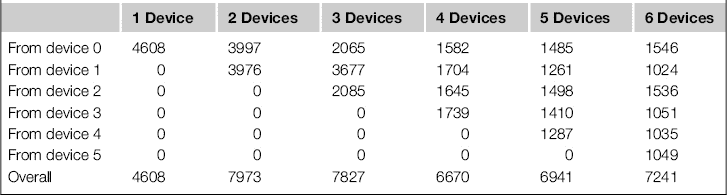
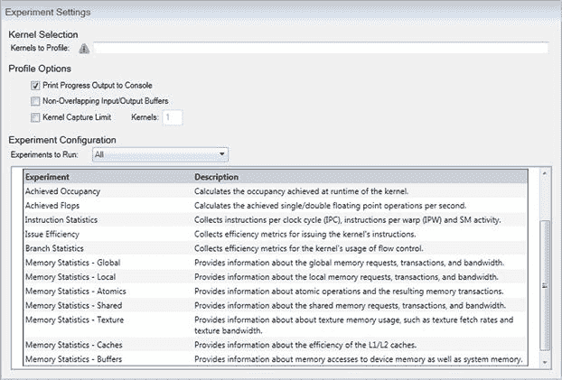

# 第九章：优化你的应用程序

在本章中，我们详细分析了限制 CUDA 性能的主要领域。每个部分都包含小示例来说明问题。它们应按顺序阅读。前几章介绍了 CUDA 和 GPU 编程。本章假设你已经阅读了前面的章节，并对其中介绍的概念感到熟悉，或者你已经熟悉 CUDA，并且特别关心提高程序执行速度的技术。

本章分为多个策略：

策略 1：理解问题并正确地将其分解为串行和并行工作负载。

策略 2：理解并优化内存带宽、延迟和缓存使用。

策略 3：理解将数据传输到主机或从主机传输数据的影响。探讨固定内存、零拷贝内存和带宽限制对一些硬件的影响。

策略 4：深入理解线程和计算能力，以及它们如何影响性能。

策略 5：在哪里寻找算法实现，并举例说明一些通用算法的优化。

策略 6：专注于性能分析，找出应用程序中的瓶颈及其原因。

策略 7：应用程序如何根据各种硬件实现进行自我调优的探讨。

## 策略 1：并行/串行 GPU/CPU 问题分解

### 分析问题

这是考虑将问题并行化是否真的正确解决方案的第一步。让我们看看其中的一些问题。

### 时间

确定你所考虑的算法执行时间的“可接受”时间段是很重要的。这里的可接受并不意味着最短的最佳时间。在考虑优化时，你必须意识到，作为一名软件专业人士，你的时间是有价值的，如果你在西方国家工作，你的时间并不便宜。程序执行所需的速度越快，涉及的工作就越多，来实现这一点的努力也就越大(图 9.1)。


图 9.1 程序员时间与加速效果的关系。

通常，在任何优化活动中，你会发现有一些所谓的“低垂的果实”。所需的更改很简单，并能带来合理的加速效果。当这些被去除后，找到优化点会变得越来越困难，这些优化往往需要更复杂的重构，从而在时间和可能引入的错误方面变得更加昂贵。

在大多数西方国家，编程的成本相当高。即使你的编程时间是免费的——比如说，你是一个正在做项目的学生——优化所花费的时间仍然是本可以用于其他活动的时间。作为工程师，我们有时会陷入让事情变得比必要的更完美的境地。了解需求并设定适当的目标。

在设定适当的加速目标时，你必须意识到，在给定的硬件条件下，什么是合理的。如果你有 20TB 的数据需要在几秒钟内处理，单个 GPU 机器是无法应对的。当你考虑到互联网搜索引擎时，正好会遇到这种问题。它们必须在几秒钟内返回一组搜索结果给用户。然而，曾几何时，搜索引擎的索引更新需要几天时间——也就是，它们需要多长时间才能获取到新的内容。在这个现代社会，即便这样也被认为是慢的。因此，今天可以接受的标准，可能在明天、下个月或明年就不再能接受了。

在考虑可接受的时间时，问问自己，你距离这个目标有多远。如果差距只有两倍以内，通常花时间优化 CPU 实现会比创造一种全新的并行方法来解决问题更值得。多个线程会引入各种各样的依赖性、死锁、同步、调试等问题。如果你能接受串行的 CPU 版本，这在短期内可能是一个更好的解决方案。

还要考虑过去 30 年左右使用的简单解决方案。只需购买一些更快的硬件。使用分析工具找出应用程序花费时间最多的地方，确定其瓶颈所在。是输入/输出（I/O）瓶颈，内存瓶颈，还是处理器瓶颈？如果是 I/O 问题，可以购买一张高速 PCI-E RAID 卡，使用 SATA 3/SAS SSD 硬盘。如果是内存带宽问题，换一个内存时钟速率更高的 Socket 2011 系统。如果是单纯的计算吞吐量问题，可以安装一款极限版或黑版的处理器，选择你能买到的最高时钟速率。也可以购买一款现成的，液冷的 Sandybridge K 系列或 X 系列超频处理器解决方案。这些解决方案的费用通常远低于$3,000–$6,000 美元，这个预算，你完全可以用来支付将程序从串行转换为并行程序的编程时间。

然而，尽管当你面临的差距不大时，这种方法效果很好，但并不总是最佳选择。高时钟频率意味着高功耗。处理器制造商已经放弃了这种路线，转而支持多核处理作为提供更多计算能力的唯一长期解决方案。虽然“购买新硬件”的方法在短期内可能有效，但这不是长期的解决方案。有时你手头的硬件可能无法轻易更换，因为它是由限制性较强的 IT 部门提供的，或者是因为你没有足够的资金购买新硬件，但却有很多“免费”的编程时间。

如果你决定走 GPU 路线，这对于许多问题来说是一个非常好的解决方案，那么你通常应该将设计目标设置为程序执行时间提高大约 10×（十倍）。你实际达到的效果取决于程序员的知识水平和可用时间，再加上我们接下来要讨论的一个重要因素——应用中并行性的程度。至少 2× 或 3× 的加速是一个相对容易实现的目标，即使对于 CUDA 新手也是如此。

### 问题分解

这里的根本问题其实就是：你面临的问题是否可以拆解成可以并行运行的任务块；也就是说，问题中是否有机会利用并发性？如果答案是否定的，那么 GPU 就不是你的解决方案。你需要考虑 CPU 的优化技术，比如缓存优化、内存优化、SIMD 优化等。我们在前几章已经介绍了一些 GPU 方面的优化技巧，而这一章也会涉及其他的一些技巧。这些优化技术在串行 CPU 代码中通常效果很好。

假设你能够将问题划分为并发的任务块，那么问题就是多少个块？CPU 并行化的一个主要限制因素是，通常没有足够的大粒度（或粗粒度）并行工作可做。GPU 可以运行成千上万的线程，因此问题需要被拆解为成千上万个块，而不仅仅是像 CPU 那样的少数并发任务。

问题分解应该始终从数据开始，然后是要执行的任务。你应该尽量将问题表示为输出数据集的形式。你能否构造出一个公式，将数据集中给定输出点的值表示为输入数据集的*该单个点*的变换？你可能需要不止一个公式，例如，一个用于大多数数据点，另一个用于问题空间边缘的数据点。如果你能做到这一点，那么将问题转化为 GPU 处理空间相对容易。

这种方法的一个问题是，你需要完全理解问题才能获得最佳的效果。你不能仅仅查看 CPU 使用最多的“占用者”并尝试使它们并行。此方法的真正好处来自于使从输入数据点到输出数据点的链条完全并行。这个链条中可能有些部分，如果你有硬件，可能使用 100,000 个处理器，而某些部分则可能仅能使用几百个处理器。几乎没有任何问题是完全单线程的。只是作为程序员、科学家和工程师，这是我们多年前在大学里学到的解决方案。因此，识别问题中的潜在并行性通常是第一个障碍。

现在有些问题，在这种单输出数据点的视角下并不实际——例如 H264 视频编码。在这个特定的问题中，定义了多个阶段，每个阶段都定义了一个可变长度的输出数据流。然而，在图像编码/处理中，有一些方面，特别是滤波操作，非常适合采用这种方法。在这里，目标像素是*N*个源像素的函数。这个类比在许多科学问题中都非常有效。给定目标原子的力值可以表示为所有对该目标原子施加力的原子的力之和。当输入集非常大时，只需应用一个阈值或截止点，将那些贡献极少的输入数据点从数据集中排除。这会产生一些小的误差，但在某些问题中，这样做可以消除计算中的大量数据集部分。

优化曾经主要是关于如何优化对数据执行的操作或函数。然而，随着计算能力与内存带宽相比大幅提升，现在主要的考虑因素变成了数据。尽管 GPU 的内存带宽大约是 CPU 的 5 到 10 倍，但你必须将问题分解，以便能够充分利用这种带宽。这是我们将在下一节讨论的内容。

这里的最后一个考虑因素是，如果你计划使用多个 GPU 或多个 GPU 节点，那么如何将问题和数据集分解到处理器元素上。节点之间的通信在计算周期方面将是*非常*昂贵的，因此需要尽量减少，并与计算重叠进行。这是我们稍后将讨论的内容。

### 依赖性

依赖性是指某些计算需要依赖先前计算的结果，无论是问题领域中的某些计算，还是仅仅是数组索引计算。在任何情况下，依赖性都会导致并行执行方面的问题。

依赖性主要有两种形式，一种是一个元素依赖于周围一个或多个元素，另一种是对数据集进行多次遍历，并且存在从一次遍历到下一次遍历的依赖关系。

```cpp
extern int a,c,d;
extern const int b;
extern const int e;
```

```cpp
void some_func_with_dependencies(void)
{
 a = b ∗ 100;
 c = b ∗ 1000;
 d = (a + c) ∗ e;
```

`}`

如果你考虑这个例子，你会发现`a`和`c`都依赖于`b`。你也会看到`d`依赖于`a`和`c`。`a`和`c`的计算可以并行进行，但`d`的计算要求`a`和`c`都已完成计算。

在典型的超标量 CPU 中，有多个独立的管道。`a`和`c`的独立计算可能会被分配到不同的执行单元，这些单元将执行乘法操作。然而，在能够计算`a`和`c`的加法操作之前，需要这些计算的结果。这次加法操作的结果也需要在最终的乘法操作应用之前准备好。

这种代码安排允许的并行性很少，并且会导致管道中的许多停顿，因为一条指令的结果必须传递给下一条指令。在停顿期间，CPU 和 GPU 将处于空闲状态。显然，这是浪费，因此 CPU 和 GPU 都使用多个线程来解决这个问题。

在 CPU 端，来自其他虚拟 CPU 核心的指令流填补了指令管道中的空隙（例如超线程技术）。然而，这需要 CPU 知道管道中的指令来自哪个线程，这增加了硬件的复杂性。在 GPU 上，也使用多个线程，但以时间切换的方式进行，因此算术操作的延迟通过几乎没有成本或无成本的方式被隐藏。事实上，在 GPU 上，你大约需要 20 个时钟周期来覆盖这种延迟。然而，这种延迟不一定来自另一个线程。考虑以下示例：

```cpp
extern int a,c,d,f,g,h,i,j;
extern const int b;
extern const int e;
```

```cpp
void some_func_with_dependencies(void)
{
 a = b ∗ 100;
 c = b ∗ 1000;
```

```cpp
 f = b ∗ 101;
 g = b ∗ 1001;
```

```cpp
 d = (a + c) ∗ e;
 h = (f + g) ∗ e;
```

```cpp
 i = d ∗ 10;
 j = h ∗ 10;
}
```

在这里，代码已被重新排列，并引入了一些新的术语。注意，如果你在`a`和`c`的计算与它们在`d`中的使用之间插入一些独立的指令，你可以为这些计算提供更多时间，在得到结果之前完成计算。示例中的`f`、`g`和`h`的计算也与`d`的计算重叠。实际上，你通过重叠非依赖指令来隐藏算术执行延迟。

处理依赖关系并引入额外非依赖指令的一种方法是通过一种叫做循环融合（loop fusion）的技术，具体如图所示。

```cpp
void loop_fusion_example_unfused(void)
{
 unsigned int i,j;
```

```cpp
 a = 0;
 for (i=0; i<100; i++)  /∗ 100 iterations ∗/
 {
  a + = b ∗ c ∗ i;
 }
```

```cpp
 d = 0;
 for (j=0; j<200; j++)  /∗ 200 iterations ∗/
 {
  d += e ∗ f ∗ j;
 }
}
```

```cpp
void loop_fusion_example_fused_01(void)
{
 unsigned int i;   /∗ Notice j is eliminated ∗/
```

```cpp
 a = 0;
 d = 0;
 for (i=0; i<100; i++)  /∗ 100 iterations ∗/
 {
  a += b ∗ c ∗ i;
  d += e ∗ f ∗ i;
 }
```

```cpp
 for (i=100; i<200; i++)  /∗ 100 iterations ∗/
 {
  d += e ∗ f ∗ i;
 }
}
```

```cpp
void loop_fusion_example_fused_02(void)
{
 unsigned int i;   /∗ Notice j is eliminated ∗/
```

```cpp
 a = 0;
 d = 0;
 for (i=0; i<100; i++)  /∗ 100 iterations ∗/
 {
  a += b ∗ c ∗ i;
  d += e ∗ f ∗ i;
  d += e ∗ f ∗ (i∗2);
 }
```

`}`

在这个示例中，我们有两个独立的计算，分别得到结果`a`和`d`。第二个计算所需的迭代次数多于第一个。然而，这两个计算的迭代空间是重叠的。因此，你可以将第二个计算的一部分移动到第一个计算的循环体内，如函数`loop_fusion_example_fused_01`所示。这会引入额外的非依赖指令，并在这个例子中将总迭代次数减少三分之一。循环迭代并非免费的，因为它们需要循环迭代值并会导致分支。因此，去掉三分之一的迭代给我们带来了显著的好处，减少了执行的指令数量。

在`loop_fusion_example_fused_02`中，我们可以通过消除第二个循环并将操作合并到第一个循环中来进一步融合这两个循环，同时相应地调整循环索引。

现在在 GPU 中，这些循环很可能会被展开为线程，并且一个内核会计算`a`和`d`的值。有多种解决方案，但最可能的情况是一个包含 100 个线程的块计算`a`，另一个包含 200 个线程的块计算`d`。通过将这两种计算结合在一起，您可以消除为计算`d`而需要的额外块。

然而，采用这种方法时需要注意一点。通过执行这些操作，您会减少线程/块调度可用的并行度。如果并行度本身就已经很小，这会影响执行时间。还要注意，内核在融合后通常会消耗更多的临时寄存器。这可能会限制您实际能实现的融合量，因为它会限制在一个 SM 上调度的块数量，原因是寄存器使用量增加。

最后，您应该考虑那些需要多次迭代的算法。通常这些算法会通过多个顺序的内核调用来实现，每次迭代处理一部分数据。由于每次迭代都需要读取和写入全局数据，这通常效率较低。许多这类算法可以被编写成内核，代表单个或少量的目标数据点。这样可以将数据保存在共享内存或寄存器中，并大大增加每个内核所做的工作量，相较于全局内存的访问次数。这将大大提高大多数内核的执行速度。

### 数据集大小

数据集的大小对问题的处理方式有巨大影响。这些数据集在典型的 CPU 实现中属于多个类别：

• 数据集在 L1 缓存中（约 16 KB 至 32 KB）

• 数据集在 L2 缓存中（约 256 KB 至 1 MB）

• 数据集在 L3 缓存中（约 512 K 至 16 MB）

• 数据集在一台机器的主机内存中（约 1 GB 至 128 GB）

• 数据集在主机持久存储中（约 500 GB 至约 20 TB）

• 数据集分布在多台机器上（大于 20 TB）

使用 GPU 时，列表略有不同：

• 数据集在 L1 缓存中（约 16 KB 至 48 KB）^(1)

• 数据集在 L2 缓存中（约 512 KB 至 1536 MB）^(2)

• 数据集在 GPU 内存中（约 512 K 至 6 GB）

• 数据集在一台机器的主机内存中（约 1 GB 至 128 GB）

• 数据集在主机持久存储中（约 500 GB 至约 20 TB）

• 数据集分布在多台机器上（大于 20 TB）

对于非常小的问题集，向特定问题添加更多的 CPU 核心可能会带来超标量加速。这意味着通过添加更多的 CPU 核心，您获得的加速比线性加速更高。实际发生的情况是，每个处理器核心获得的数据集现在变得更小。对于 16 核的 CPU，问题空间通常会缩小 16 倍。如果这将问题从内存移动到 L3 缓存，或者从 L3 缓存移动到 L2 缓存，您会看到非常显著的加速，这并非由于并行性，而是由于相关缓存的内存带宽更高。当然，当您将问题从 L2 缓存转移到完全存储在 L1 缓存时，情况也是如此。

对于 GPU 来说，主要的问题不是缓存，而是单个卡上可以容纳多少数据。将数据传输到主机系统和从主机传输回去是非常耗费计算时间的。为了掩盖这一点，您可以将计算和数据传输重叠进行。在更先进的显卡上，您可以同时进行一次数据传入和一次数据传出。然而，为了实现这一点，您需要在主机上使用固定内存。由于固定内存无法被虚拟内存管理系统交换出去，因此它必须是主机上的实际 DRAM 内存。

在一个 6 GB 的 Tesla 系统上，您可能已将其分配为 1 GB 的输入缓冲区、1 GB 的输出缓冲区和 4 GB 的计算或工作内存。在普通硬件上，您最多可用 2 GB 的内存，虽然一些普通卡支持高达 4 GB 的全局内存，但可用的内存要少得多。

在主机端，您需要至少和输入输出缓冲区固定的内存一样多。大多数 I7 Nehalem 平台上通常可以提供最多 24 GB 内存（6 个 DIMM，每个 4 GB），Sandybridge–EP I7 平台提供 32 GB 内存（8 个 DIMM，每个 4 GB），AMD 平台提供 16 GB 内存（4 个 DIMM，每个 4 GB）。由于您通常只会固定最多 2 GB 内存，因此您很容易有足够的空间支持多个 GPU。大多数系统至少支持两张 GPU 卡。四张物理卡是单台高端系统的实际限制。

当问题的规模远大于主机内存大小时，您必须考虑单台主机上存储容量的实际限制。多 TB 硬盘可以使节点存储达到数十 TB。大多数主板都配备了六个或更多 SATA 连接器，4 TB 以上的硬盘也很容易获得。如果数据集需要在某个偏远地区捕获，硬盘非常易于运输。第二天的快递通常是不同站点之间传输此类数据的最快方式。

最后，当您无法将数据集放入单台机器时，不论是因为计算、内存、存储还是电力需求，您必须考虑使用多个节点。这就引出了节点间通信的领域。节点间通信在时间上是昂贵的，至少比任何内部数据通信慢一个数量级。您还需要学习另一套 API，因此如果问题可以限制在单个节点内，最好避免这个步骤。

### 分辨率

想想如果有 10 倍或 50 倍的处理能力，能做些什么。一个以前需要一个小时才能解决的问题，现在可以在一分钟左右完成。这如何改变在给定数据集下能提出的问题？过去不可能实时或接近实时完成的任务，现在能做什么？之前的批处理提交问题，现在变成了一个互动性问题。

这种变化允许从问题中退后一步，考虑其他可能的解决方法。过去是否有一些算法因计算成本过高而被舍弃？现在你是否能处理更多的数据点，或者以更高的分辨率处理数据点，以产生更精确的结果？如果你过去因为几小时或一天的运行时间能够同时进行其他任务而感到满意，那么提高问题分辨率是否比加速更具吸引力？在你的问题领域，更准确的结果带来了什么收益？

在金融应用中，如果你的事件数学模型领先于主要市场参与者，那么你就能比别人更快地对变化作出反应，这可以直接转化为更好的交易回报。

在医学应用中，能够在病人穿好衣服并离开之前就向医生展示测试结果，可以更高效地利用医生和病人的时间，避免重复预约。

在仿真应用中，不必长时间等待，可以在给定的时间框架内探索更大的问题空间。它还允许进行推测性执行。这是指你要求系统在给定数据集中的*n*和*m*之间探索所有*x*值。同样，你可能会探索二维或三维空间中的变量。对于复杂问题或非线性系统，最佳解决方案并不总是显而易见，特别是当改变一个参数会影响许多其他参数时。与其让专家坐下来尝试计算出最佳解决方案，不如直接探索问题空间并观察结果，这可能会更快。这个暴力破解方法异常有效，常常会找到“专家”未曾考虑过的解决方案。

作为学生，你现在可以在个人桌面超级计算机上解决问题，而不需要将作业提交给学校的计算机并等待一天才完成，结果却发现作业在中途崩溃。你可以原型化解决方案，比没有 CUDA 知识的同学更快地得出答案。想一想，如果他们的批处理作业需要一天，而你的作业在本地一个小时内完成，你能解决多少问题。

### 识别瓶颈

#### 阿姆达尔定律

阿姆达尔定律通常在并行架构的研究中被引用。它很重要，因为它告诉我们，当执行流程中仍然存在串行元素时，它们会限制我们能够实现的加速。

假设程序执行时间的 50%是在一个可以并行运行的部分，另外 50%是必须串行执行的部分。如果你有一组无限快的并行处理单元，并将程序的并行部分缩短为零时间，你仍然会剩下 50%的串行代码需要执行。在这种情况下，最大可能的加速是 2 倍，也就是说，程序执行的时间是之前的一半。考虑到使用了大量的并行处理能力，这其实并不那么令人印象深刻。

即使在我们有 90%程序可以并行化的情况下，我们仍然有 10%的串行代码需要执行。因此，最大加速是 9 倍，也就是比原本完全串行的程序快 9 倍。

无限扩展一个程序的唯一方法是消除所有串行瓶颈。请参见图 9.2，其中所有的方块代表需要处理的数据项。


图 9.2 数据流瓶颈。

在这个例子中，有 10 个线程，每个线程处理数据的一个列。在中间是一个依赖关系，因此所有线程必须将各自的结果贡献给一个单一的值，然后才能继续处理。

想象一下，这是一片农田，每列都是一行作物。每个线程就像一台联合收割机，沿着列向下移动，在每个方块上收集作物。然而，在田地的中央有一堵墙，墙上有两个门。

如果只有 1 个甚至 2 个联合收割机，门并不会构成太大问题，每台联合收割机可以从一个田地移动到另一个田地。而如果有 10 台联合收割机，每台收割机负责一列，想要让每台机器都通过门就需要时间，这会使整个过程变慢。这就是为什么大而开阔的田地比小而有限的田地更高效的原因之一。

那么这与软件有什么关系呢？每个门就像代码中的串行点。程序正在顺利执行，处理着一块块的工作，突然之间它遇到一个串行点或同步点，所有的工作都停滞了。这就像每个人试图同时通过有限的出口离开停车场。

解决这种问题的方法是对瓶颈进行并行化。如果我们有 10 个田地门或 10 个停车场出口，就不会出现瓶颈，只有一个有序的队列，它将在*N*个周期内完成。

当你考虑像直方图这样的算法时，你会发现让所有线程都往同一组桶里添加数据就会形成这种瓶颈。通常这是通过原子操作来完成的，这实际上会在一组并行线程中引入串行执行。如果你给每个线程分配一组自己的桶，然后再将这些桶的结果合并，便可以消除串行瓶颈。

仔细考虑代码中可能存在的瓶颈，并思考如何消除这些瓶颈。通常这些瓶颈会限制你应用程序的最大扩展性。虽然在两个或四个 CPU 核心的情况下可能没有问题，但对于 GPU 代码，你需要考虑成千上万的并行线程。

#### 性能分析

性能分析是识别你当前状态并确定时间分配的最有用的任务之一。很多人认为自己知道瓶颈在哪里，然后去优化那个程序，结果发现它对应用程序整体执行时间的改善只有 1%或 2%。

在现代软件开发中，通常有多个团队在处理软件包的不同方面。与所有涉及软件开发的人保持联系可能并不现实，尤其是在更大的团队中。你可能认为的瓶颈往往并不是最重要的因素。

优化应基于硬数据和事实，而不是对“可能”是最佳优化位置的推测。NVIDIA 提供了两个很好的工具，CUDA Profiler 和 Parallel Nsight，它们提供了详细的性能分析信息。

性能分析工具通过查看硬件计数器，揭示代码的时间分布，以及 GPU 的占用率水平。它们提供了有用的计数器，如合并读取或写入的次数、缓存命中/未命中率、分支分歧、warp 序列化等。CUDA Memcheck 工具对于识别内存带宽使用不当也非常有用。

在使用性能分析器进行初步测试后，首先应查看代码在其中花费最多*总*时间的程序。典型的未优化程序在 20%的代码中花费了 80%的时间。优化这 20%是高效利用时间的关键，而性能分析是识别这 20%代码的关键。

当然，一旦优化达到最佳状态后，进一步加速将变得越来越耗时，而不进行完全重构将难以取得显著提升。衡量加速效果，并知道什么时候你投入的时间不再带来良好的回报。

在这方面，Parallel Nsight 是一个非常有用的工具，因为它提供了多个默认的“实验”。这些实验可以揭示你的内核实际在做什么。从这些实验中，你可以获取的一些有用信息如图 9.3 所示。


图 9.3 Parallel Nsight 实验。

第一个实验是 CUDA 内存统计，它提供了一个图形化的视图，展示了缓存的布局以及在设备不同部分实现的带宽。

这个具体的例子（见图 9.4）取自我们稍后将要讨论的奇偶排序。值得注意的是缓存命中率。由于在 L1 缓存中获得了 54%的命中率，我们实现了每秒 310GB 的全球内存吞吐量，大约是全球内存实际带宽的两倍。文中还列出了事务数量，这一点很重要。如果我们能通过更好的合并和/或发出更大的读写请求来减少所需的事务数量，就可以显著提高内存吞吐量。


图 9.4 Parallel Nsight 内存概览。

另一个重要的实验是占用率（见图 9.5）。在这个实验中，请注意“已实现占用率”栏，特别是“活动 warp”的数量。由于这是一个 compute 2.0 设备，我们最多可以在单个 SM 上保留 48 个 warp。已实现的占用率与理论占用率不同，它是实际测量得到的占用率。通常情况下，这个值会显著低于理论最大值。还要注意，任何限制因素都会以红色突出显示，在这个例子中是每个 SM 的块数为 6。图表中的“占用率”选项卡允许你更详细地了解这一点。这是 CUDA SDK 中提供的占用率计算电子表格的摘录。


图 9.5 Parallel Nsight 占用率数据。

这个限制的原因实际上是线程的数量。将线程数从 256 减少到 192，硬件就可以调度八个块。由于该内核存在同步点，更多的块可用可能会带来更好的指令混合。同时，由于同步点的存在，将会有更少的 warp 无法执行。

实际上，做出这个改变会有相当显著的帮助。它将占用率从 98.17%提高到 98.22%，提升幅度很小。但执行时间却从 14 毫秒下降到仅 10 毫秒。原因就在于内存使用情况。每个块有 192 个线程时，我们访问的是较小范围的地址，从而增加了访问的局部性，进而提高了缓存利用率。每个 SM 所需的内存事务总数减少了大约四分之一。因此，我们看到执行时间也相应地下降。

### 将任务分配给 CPU 和 GPU

来自 NVIDIA 的 Dr. M. Fatica 在 GTC2010 上做了一场精彩的演讲，介绍了 Linpack 如何针对 GPU 进行优化。Linpack 是一个基于线性代数的基准测试。它被用于 Top500 超级计算机基准测试（[*www.top500.org*](http://www.top500.org)），用来评估全球各种超级计算机的性能。在这场演讲中，有一个有趣的事实是，当时使用的 GPU ——Fermi Tesla C2050 卡——产生了约 350 吉弗洛普的 DGEMM（双精度矩阵乘法）性能。而使用的 CPU 则产生了约 80 吉弗洛普。80 吉弗洛普的贡献稍微不到 GPU 贡献的四分之一，因此并不是可以忽视的部分。大约四分之一的额外性能对于减少执行时间有着非常重要的作用。

事实上，最好的应用程序通常是那些能够充分发挥 CPU *和* GPU 优势的应用，并根据情况拆分数据。任何基于 GPU 的优化都必须考虑到 CPU，因为关键是整体应用时间。如果你有一个四核、六核或八核的 CPU，而其中一个核心正忙于处理 GPU 应用，为什么不利用其他核心一起工作解决问题呢？你拥有的核心越多，将一部分工作卸载到 CPU 上所获得的潜在增益就越高。

如果我们说 CPU 的处理速度是 GPU 的十分之一，那么仅仅通过三个 CPU 核心，你就能获得 30% 的额外吞吐量。如果你有一个八核设备，理论上这是一个 70% 的性能提升，几乎等同于有两个 GPU 协同工作。然而，在实际应用中，其他约束（如内存、网络或 I/O 带宽）往往会限制整体速度。然而，即便如此，当应用没有受到主机端这些约束的限制时，你仍然可能会看到显著的加速效果。

在这些约束中，I/O 是一个有趣的因素，因为增加更多的 CPU 线程或进程通常能显著提高整体 I/O 吞吐量。这听起来可能有些奇怪，因为显然 I/O 设备的物理限制决定了速度？但在现代配备大量内存的机器上，大多数 I/O 实际上是被缓存的。因此，I/O 更多的是关于在内存中移动数据，而不是在设备之间移动数据。一款不错的 RAID 控制器有自己的处理器来执行 I/O 操作。多个 CPU 核心可以进行多个独立的内存传输，通常会提供比单个 CPU 核心更高的整体带宽。

独立的 CPU 进程或线程可以创建一个独立的 GPU 上下文，并将其内核启动到 GPU 上。这些额外的内核随后会在 GPU 内排队等待执行。当可用资源释放时，内核会被执行。如果你查看典型的 GPU 使用情况，你会看到 图 9.6 所示的内容。


图 9.6 CPU 和 GPU 空闲时间。

注意，GPU 和 CPU 上都有显著的空闲时间。GPU 上的空闲时间更为昂贵，因为它通常比 CPU 时间更为有用，通常是 10 倍。像 Parallel Nsight 这样的工具可以让你显示这样的时间线，你会惊讶于看到某些内核能产生多少空闲时间。

通过将多个内核放置到单个 GPU 上，这些内核将插入空闲的插槽中。这会稍微增加第一组内核的延迟，但大大提高了应用程序的整体吞吐量。在许多应用程序中，可能会有多达 30%的空闲时间。试想一下一个典型的应用程序会做什么。首先，从某个地方获取数据，通常是一个慢速 I/O 设备，比如硬盘。然后将数据传输到 GPU，接着等待直到 GPU 内核完成。当完成时，主机将数据从 GPU 中传出。然后将其保存到某个地方，通常是慢速 I/O 存储，获取下一个数据块，依此类推。

当 GPU 执行内核时，为什么不从慢速 I/O 设备获取下一个数据块，这样等 GPU 内核完成时就能准备好呢？实际上，这就是执行多个进程时发生的情况。I/O 设备阻塞第二个进程，同时为第一个进程获取数据。当第一个进程正在传输数据并调用内核时，第二个进程则在访问 I/O 硬件。然后它执行传输操作，而进程一在计算，并且第二个进程的内核调用排队。当第一个进程的数据传输回主机时，第二个进程的内核也开始执行。因此，通过引入少数几个进程，你就巧妙地重叠了 I/O、CPU、GPU 和传输时间，显著提高了整体吞吐量。有关此内容的详细解释，请参见第八章中的流示例。

请注意，你可以使用线程或进程来实现相同的结果。线程允许应用程序数据共享一个公共数据区域，并提供更快的同步原语。进程允许处理器亲和性，即将进程绑定到某个 CPU 核心，这通常能提高性能，因为它有助于更好的核心特定缓存重用。选择主要取决于 CPU 任务之间是否需要同步，以及需要多少同步。

CPU/GPU 决策的另一个方面是如何最佳地拆分任务。CPU 擅长处理串行问题，尤其是数据分布稀疏或数据集较小的情况。然而，在 GPU 对 CPU 的典型 10:1 性能比下，你必须小心不要阻塞 GPU。因此，许多应用程序简单地使用 CPU 来加载和存储数据。根据 GPU 需要的计算时间，这有时可能会使 CPU 的单个核心负载满。

有时你会看到 CPU 被用来处理归约的最终阶段。归约操作通常会在每次归约迭代时将元素数减少一半。如果你从一百万个元素开始，在六次迭代后，你就开始接近 GPU 上可调度线程的最大数量。再经过几次迭代，几个 SM 会处于空闲状态。在 GT200 及之前的硬件上，内核不会重叠执行，因此内核必须继续迭代，直到处理完最后的元素，才能释放空闲的 SM 去执行更多的工作。

因此，当某一阈值达到时，一种优化方法是将剩余的计算任务转发给 CPU 来完成。如果 CPU 本身处于空闲状态，而且剩余的数据传输量不大，这种策略可以比等待 GPU 完成整个归约操作获得显著的性能提升。在 Fermi 架构中，NVIDIA 解决了这个问题，允许空闲的 SM 开始处理下一个排队的内核。然而，为了使 SM 空闲，必须保证所有线程块都已完成。某些非最优内核在归约的最后阶段仍可能有一个或多个活跃线程，这会将内核锁定在 SM 上，直到完整的归约操作完成。像归约这样的算法，要确保你在每次迭代中减少活跃 warp 的数量，而不仅仅是减少活跃线程的数量。

### 小节总结

• 理解问题，并在可用的编程时间和技能范围内定义你的加速目标。

• 识别问题中的并行性，并思考如何在 CPU 和一个或多个 GPU 之间最佳分配这些并行性。

• 考虑哪个更重要，是降低执行时间还是将数据处理成更高的分辨率。

• 理解任何串行代码部分的含义，并思考如何最好地处理这些部分。

• 对应用程序进行性能分析，确保你的理解反映了实际情况。如果适当的话，根据你更深入的理解，重复之前的分析。

## 策略 2：内存考虑

### 内存带宽

内存带宽和延迟是几乎所有应用中的关键考虑因素，尤其是在 GPU 应用中尤为重要。带宽指的是可以传输到或从给定目标位置移动的数据量。在 GPU 的情况下，我们主要关注的是全局内存带宽。延迟指的是操作完成所需的时间。

在 GPU 上，内存延迟的设计是通过运行来自其他 warp 的线程来隐藏的。当一个 warp 访问一个不可用的内存位置时，硬件会发出读写请求到内存。如果这些线程访问的是相邻的内存位置，并且内存区域的起始位置得到了适当对齐，那么这个请求会自动与同一个 warp 中其他线程的请求合并或聚合。

Fermi 和旧版本之间的内存事务大小差异显著。在计算 1.x 设备（如 G80，GT200）中，合并的内存事务大小通常是每次内存访问 128 字节。如果合并线程访问的总区域足够小，并且位于相同的 32 字节对齐块内，事务大小会减少到 64 或 32 字节。这些内存不会被缓存，因此，如果线程没有访问连续的内存地址，就会导致内存带宽的快速下降。因此，如果线程 0 读取地址 0、1、2、3、4、……、31，线程 1 读取地址 32、32、34、……、63，它们将无法合并。事实上，硬件将为每个线程发起至少 32 字节的读取请求。未使用的字节将从内存中读取并简单地丢弃。因此，如果不仔细考虑内存的使用方式，你可能会得到设备上可用带宽的一小部分。

从这个角度来看，Fermi 和 Kepler 的情况有了很大改善。Fermi 不像计算 1.x 设备那样以 32 或 128 字节的事务方式提取内存，不支持 64 字节的提取。默认情况下，每个内存事务都是 128 字节的缓存行提取。因此，一个关键的区别是，如果访问步长不为 1，但仍在 128 字节以内，那么现在会导致缓存访问，而不是再次发起内存提取。这使得从 Fermi 开始的 GPU 模型比前几代更容易编程。

需要考虑的关键领域之一是内存事务的数量。每个内存事务会进入队列，并由内存子系统单独执行。这样会有一定的开销。对于线程来说，发起一次读取四个浮点数或四个整数比发起四个单独的读取操作要便宜得多。事实上，如果你查看 NVIDIA 提供的一些图表，你会看到，要接近 Fermi 和 Kepler 上的峰值带宽，你需要采取两种方法中的一种。首先，充分加载处理器，使用多个 warp，并实现接近 100% 的占用率。其次，使用 `float2`/`int2` 或 `float4`/`int4` 向量类型的 64 位/128 位读取，即使你的占用率较低，仍然可以实现接近 100% 的峰值内存带宽。实际上，通过使用向量类型，你发起了更少的更大事务，这些事务硬件可以更高效地处理。你还通过每个线程处理多个元素引入了某种程度的指令级并行性。

但是，要注意，向量类型（`int2`、`int4` 等）会隐式引入 8 字节和 16 字节的对齐要求。数据必须支持这一点，例如，你不能将 `int[5]` 数组元素的指针强制转换为 `int2∗` 并期望它正确工作。在这种情况下，最好进行背靠背的 32 位读取，或向数据结构中添加填充，以允许对齐访问。正如我们在优化示例排序示例时看到的，四个元素每个线程通常提供了额外寄存器使用、增加内存吞吐量和让处理器能够利用指令级并行的最佳平衡。

### 限制的来源

内核通常受限于两个关键因素：内存延迟/带宽和指令延迟/带宽。当优化其中一个，而另一个才是主要限制因素时，会导致大量的努力却收效甚微。因此，能够了解是哪一个关键因素限制了性能，对于确定努力方向至关重要。

你可以通过最简单的方法来查看代码的平衡所在，那就是将所有算术指令注释掉，并用一个直接的赋值操作替换它们，赋值给结果。算术指令包括任何计算、分支、循环等。如果输入值与计算输出之间有一一对应关系，这非常简单，且一一赋值效果良好。当你有某种形式的归约操作时，只需将其替换为求和操作。确保将所有从内存读取的参数包含在最终输出中，否则编译器会删除那些看似冗余的内存读写操作。重新计时内核执行的时间，你将看到大致的算术或算法部分所花费的时间百分比。如果这个百分比非常高，你就是算术限制。相反，如果整体时序变化很小，那你就是内存限制。

在算术代码仍被注释掉的情况下，使用 Parallel Nsight 运行内核，使用分析功能和性能设置。检查它生成的指令统计数据（图 9.7）。如果条形图中有大量的蓝色，那么内核的内存模式显示出较差的合并性，GPU 必须序列化指令流，以支持散乱的内存读写。


图 9.7 高指令重发率。

如果是这样，是否有可能重新排列内存模式，以便 GPU 能够按线程合并内存访问模式？记住，要做到这一点，线程 0 必须访问地址 0，线程 1 访问地址 1，线程 2 访问地址 2，依此类推。理想情况下，你的数据模式应该生成按列访问的模式，而不是按行访问。如果你无法轻松地重新排列数据模式，是否可以重新排列线程模式，以便在访问数据之前将其加载到共享内存中？如果可以，你就不必担心从共享内存中访问时合并读取。

是否有可能扩大由单个线程处理的输出数据集元素的数量？这通常有助于内存绑定和算术绑定的内核。如果你这样做，应该通过复制代码来完成，而不是在线程中引入循环。如果代码比较复杂，也可以将其作为设备函数或宏来处理。确保将读取操作提到内核的开始位置，这样在需要时读取操作已经完成数据获取。这将增加寄存器的使用，因此要确保监控调度的 warp 数量，确保它不会突然下降。

对于算术绑定的内核，查看源代码并思考它如何被转换为汇编（PTX）代码。不要害怕查看实际生成的 PTX 代码。数组索引通常可以用基于指针的代码替换，将较慢的乘法替换为更快的加法。使用 2 的幂次方的除法或乘法指令可以分别替换为更快的右移和左移操作。任何在循环体内保持不变的常量（不变量），都应该移到循环体外。如果线程中包含循环，展开循环会加速吗（通常是的）？哪种循环展开因子效果最好？我们稍后将在本章中详细讨论这些优化策略。

你在实际中使用的是单精度还是双精度浮点数，你想使用的是哪种？注意那些没有`F`后缀的浮点常量，编译器会将其视为双精度。你是否真的需要在所有计算中使用 32 位精度？尝试使用`-use_fast_math`编译选项，看看结果是否仍然足够准确以满足你的需求。此选项启用了 24 位浮点运算，比标准的 IEEE 32 位浮点数学逻辑快得多。

最后，你是否在“发布”版本的代码中进行速度测试？正如我们之前一些例子所看到的，仅此一项就可以提高 15%或更多的性能。

### 内存组织

获取 GPU 的内存模式通常是许多应用中的关键考虑因素。CPU 程序通常将数据按行排列在内存中。虽然 Fermi 和 Kepler 会容忍非合并读取和写入，但正如我们之前提到的，计算 1.x 设备则不会。你必须尝试安排内存模式，使得连续线程对它的访问将是按列的。这对于全局内存和共享内存都适用。这意味着，对于一个给定的 warp（32 个线程），线程 0 应该访问地址偏移 0，线程 1 访问地址偏移 1，线程 2 访问地址偏移 2，依此类推。想想访问全局内存的提取。

然而，假设你有对齐访问，那么每次会从全局内存中获取 128 字节的数据。每个线程有一个浮点数或整数时，warp 中的 32 个线程将每个获取一个数据元素。

请注意，`cudaMalloc`函数会在 128 字节对齐的块中分配内存，因此大多数情况下对齐不是问题。然而，如果使用一个会跨越这样的边界的结构，那么有两种方法可以解决。首先，你可以显式地向结构中添加填充字节/字。或者，你可以使用我们在第六章中介绍的`cudaMallocPitch`函数。

请注意，对齐是决定是否需要获取一个或两个内存事务或缓存行的关键标准。假设线程 0 访问的是地址偏移 2 而不是 0\. 也许你正在访问某个数据结构，该结构的开头有一个头部，例如：

```cpp
#define MSG_SIZE 4096
typedef struct
{
 u16 header;
 u32 msg_data[MSG_SIZE];
} MY_STRUCT_T;
```

如果内核处理`msg_data`，那么 warp 的线程 30 和 31 无法通过单一的内存获取来服务。实际上，它们会生成一个额外的 128 字节内存事务，如图 9.8 所示。任何后续的 warp 都会遇到相同的问题。仅仅在数据结构的开头有一个 2 字节的头部，你的内存带宽就被减半了。


图 9.8 结构内的缓存行/内存事务使用情况。

你将在计算 1.x 设备上最为明显地看到这一点，其中为线程 30/31 生成的额外获取甚至没有用于预填充缓存，而是直接被丢弃。将头部加载到内存中的其他位置的单独块中，可以实现对数据块的对齐访问。如果你无法做到这一点，那么可以手动在结构定义中插入填充字节，以确保`msg_data`对齐到 128 字节边界。请注意，简单地重新排序结构元素，将‘header’放在`msg_data`之后也可以解决问题，前提是该结构之后不会被用来创建结构数组。突然之间，你的线程与内存组织对齐，并且在处理结构中的`msg_data`部分时，内存吞吐量将翻倍。

还要考虑使用前缀和的情况。前缀和允许多个独立的进程或线程读取或写入独立的内存区域，而互不干扰。多次从同一地址读取实际上是非常有益的，因为 GPU 会将值直接转发给 warp 内的其他需要它的线程，而无需额外的内存获取。多次写入当然是一个问题，因为它们需要排队。

如果我们现在假设使用整数或浮点数，那么数据数组中每个条目的大小为 4 字节。如果前缀数组的分布完全相等，那么无论如何我们不需要前缀数组来访问数据，因为你可以简单地为每个线程使用固定偏移量。因此，如果你使用前缀和来计算数据集的偏移量，那么每个桶内的元素数量很可能是可变的。如果你知道每个桶内元素数量的上限，并且有足够的内存可用，那么只需将每个桶填充到对齐边界。使用一个额外的数组来保存桶内的元素数量，或者通过前缀和索引计算这个值。通过这种方式，我们可以通过牺牲大多数桶末尾的未使用单元来实现对内存的对齐访问。

对齐问题的一个非常简单的解决方案是使用一个不会影响计算结果的填充值。例如，如果你在每个桶内执行求和操作，使用零填充意味着对最终结果没有改变，但会为 warp 中的所有元素提供一致的内存模式和执行路径。对于`min`操作，你可以使用填充值 0xFFFFFFFF，反之对于`max`操作使用 0。通常不难想到一个可以处理的填充值，但它对结果没有任何贡献。

一旦你转向固定大小的桶，确保数据集是按列而非按行生成和访问也变得相对简单。由于没有合并要求，通常希望使用共享内存作为暂存缓冲区。然后可以用它来允许合并的全局内存读写操作。

### 内存访问与计算比率

你应该经常问的一个问题是，内存操作与算术操作的比率是多少？理想情况下，你希望比率至少为 10:1。也就是说，每次内核从全局内存获取内存时，它会执行 10 条或更多的其他指令。这些指令可以是数组索引计算、循环计算、分支或条件评估。每条指令都应该对有用的输出做出贡献。特别是循环，尤其是在没有展开的情况下，通常只是贡献到指令开销，而不是任何有用的工作。

如果我们查看一个 SM 内部的结构，从架构上看，warp 是根据奇偶指令调度器分派到 CUDA 核心的。计算 1.x 设备有一个 warp 调度器，而计算 2.x 设备有两个。在 GF100/GF110 芯片组（Fermi GTX480/GTX580）中，每个 SM 有 32 个 CUDA 核心和 4 个 SFU（特殊功能单元）(图 9.9)。在 GF104/GF114 基础的设备（GTX460/GTX560）中，每个 SM 有 48 个 CUDA 核心和 8 个 SFU (图 9.10)。对于计算 2.0 和计算 2.1 设备，每个 SM 都有一组 16 个 LSU，用于从内存（全局、常量、共享、局部和缓存）加载值。


图 9.9 CUDA warp 的调度（GF100/GF110，计算 2.0）。


图 9.10 CUDA warp 的调度（GF104/GF114）。

因此，在单个周期中，warp 调度器会发出（或调度）总共两条（计算 2.0）或四条（计算 2.1）指令，来自每个调度器的一组指令。由于这些指令来自不同的 warps，它们完全独立。然后，这些指令会被推送到执行单元的流水线（CUDA 核心、SFU 和 LSU）。

这个设计有几个含义。首先，必须存在的 warps 最少数量是 GF100 系列（计算 2.0）硬件的两个，GF104 系列（计算 2.1）硬件的四个。由此推导出，分别至少需要每个 SM 64 或 128 个线程。如果线程数少于这个数量，意味着一个或多个指令调度单元将保持空闲，实际上会使指令调度速度减半（GF100）。使用不是 32 的倍数的线程数会导致某些 CUDA 核心元素空闲，这同样是不希望发生的。

拥有这个最小数量的驻留 warp 完全无法隐藏延迟，无论是内存延迟还是指令延迟，因为可以切换到另一个 warp。在指令流中出现停顿时，实际上会使 CUDA 核心停顿，这非常不希望发生。实际上，会将多个块分配给一个 SM，试图确保这个问题永远不会发生，更重要的是，能够生成一个指令的多样化组合。

第二个含义是共享资源限制了持续执行相同操作的能力。CUDA 核心和 LSU（负载存储单元）都采用流水线，但每个单元的宽度仅为 16 个。因此，要将整个 warp 调度到任一单元需要两个周期。在计算 2.0 硬件中，每个调度器每次只能调度一条指令。因此，为了将操作推入 LSU，必须留出一个 CUDA 核心流水线的空槽。调度有四个可能的接收者（CUDA，CUDA，SFU 和 LSU），但每个周期只有两个供应者。

在计算 2.1 硬件中，情况有了极大改善，因为两个调度器每个调度两个指令，总共每个时钟周期可以调度四条指令。拥有三组 CUDA 核心的情况下，可以提供三条算术指令以及一条加载/保存指令，而不会在流水线中造成空洞。

然而，如果所有的 warps 都想向同一个执行单元发出指令，例如 LSU 或 SFU，就会出现问题。每两个时钟周期只能有一个 warp 使用 LSU。由于 SFU 只有八个单元，其中四个是在计算 2.0 硬件上，因此一个 warp 可能需要最多八个时钟周期才能被 SFU 完全消耗。

因此，计算 2.1 设备上 LSU 的带宽比相同数量 CUDA 核心的计算 2.0 设备少 50%。因此，LSU 或 SFU 可能成为瓶颈。需要在流中有其他指令，以便在内存和超越指令通过 LSU 或 SFU 流水线时，CUDA 核心能够进行一些有用的工作。

Kepler GK104 设备（GTX680/Tesla K10）进一步扩展了 GF104/114（GTX460/560）的设计，通过将 CUDA 核心的数量从 48 扩展到 96，并将其中两个核心放入一个 SM 中。因此，每个 SM 有四个 warp 调度器，八个调度单元，两个 LSU 和两个 SFU。

让我们稍微展开一下之前看到的示例。考虑一个典型的内核的情况。在内核开始时，所有 warps 中的所有线程从内存中获取一个 32 位的值。地址安排得如此合理，以至于它们可以被合并。例如：

```cpp
int tid = (blockIdx.x ∗ blockDim.x) + threadIdx.x;
data[tid] = a[tid] ∗ b[tid];
```

这将分解为一个乘加（MADD）整数指令，用于计算存入寄存器中的 `tid` 变量的值。`data`、`b` 和 `c` 变量是全局内存中的数组。`data`、`a` 和 `b` 变量通过 `tid` 索引，因此需要通过将 `tid` 乘以数组元素大小来计算写入地址。假设它们都是整数数组，因此每个条目的大小是 4 字节。

我们在计算 `tid` 时很快遇到了第一个依赖（见图 9.11）。warp 将 `blockIdx.x` 和 `blockDim.x` 的乘法操作分派到 CUDA 核心的整数 MADD 单元中。在计算 `tid` 的乘加指令完成之前，我们无法继续，因此该 warp 被标记为阻塞并挂起。


图 9.11 数据流依赖关系。

此时，选择下一个 warp，该 warp 执行相同的操作，并在计算`tid`时再次暂停。当所有 warp 都进展到这一点时，足够的时钟周期已经过去，warp 0 中`tid`的值现在已知，并可以用于乘法运算中的目标地址计算。因此，三个额外的 MADD 指令被调度到 CUDA 核心，用于计算地址偏移量。接下来的指令将是几次加载，但为了实现这一点，我们需要从乘法指令中获取`a`和`b`的地址。在这一点，我们再次暂停该 warp，其他 warps 继续执行。

一旦`a`的地址计算可用，加载指令可以被调度。由于`b`的地址计算与`a`的计算是连续发布的，因此在`a`的加载指令被调度时，`b`的地址计算很可能已经被执行完成。因此，我们立即发布对`b`的加载指令。数据流中的下一条指令将是`a`和`b`的乘法，但它们都还需要一些时间才能到达，因为它们需要从主内存加载到 SM 中。因此，该 warp 被暂停，随后其他 warps 执行到相同的位置。

由于内存获取需要较长时间，所有 warps 将必要的加载指令调度到 LSU，并暂停。如果没有来自其他 block 的工作，SM 将在等待内存事务完成时处于空闲状态。

一段时间后，`a`终于从内存子系统到达，作为一次 128 字节的合并读取，一个缓存行，或者一个内存事务。16 个 LSU 将 128 字节中的 64 字节分发到 warp 0 的第一个半 warp 所使用的寄存器中。在下一个周期，16 个 LSU 将剩余的 64 字节分发到另一个半 warp 所使用的寄存器中。然而，warp 0 仍然无法推进，因为它只得到了进行乘法运算所需的两个操作数中的一个。因此，它不会执行，随后从`a`的合并读取中到达的字节会分发到其他 warps 相关的寄存器中。

当所有从`a`的合并读取中获得的数据分发到所有其他 warps 的寄存器时，`b`的数据可能已经到达 L1 缓存。同样，16 个 LSU 将前 64 字节分发到 warp 0 第一个半 warp 的寄存器中。在随后的周期，它们将第二 64 字节分发到第二个半 warp。

在第二个周期的开始，第一个半 warp 能够推进`a[tid] ∗ b[tid]`的乘法指令。在第三个周期，LSUs 开始为 warp 0 的第一个半 warp 提供数据。同时，warp 0 的第二个半 warp 开始执行乘法操作。由于 warp 0 的下一个指令是一个存储指令，并且依赖于乘法运算，因此 warp 0 被暂停。

假设大约有 18 到 22 个 warp 驻留，当最后一个 warp 调度完最后的乘法操作时，warp 0 的乘法操作已经完成。它接着可以将存储指令调度到 16 个 LSU 并完成执行。其他的 warp 则做完全相同的事情，内核执行完毕。

现在考虑以下情况（见图 9.12）。


图 9.12 双数据流依赖。

```cpp
int tid = (blockIdx.x ∗ blockDim.x) + threadIdx.x;
data[tid] = a[tid] ∗ b[tid];
data[tid+1] = a[tid+1] ∗ b[tid+1];
```

通过将块数减半，我们可以使每个线程处理两个元素。注意，这会在每个 warp 的线程中引入一个独立的执行流。因此，算术操作开始与加载操作重叠。

然而，正如示例 C 代码所写的那样，这并不会起作用。因为代码包含了一些不立即显现的依赖关系。对`data`的第一个元素的写操作可能会影响`a`或`b`数组中的值。也就是说，`data`的地址空间可能与`a`或`b`重叠。当在数据流中有对全局内存的写操作时，你需要将读取操作提前到内核的开始处。请改用以下代码：

```cpp
int tid = (blockIdx.x ∗ blockDim.x) + threadIdx.x;
int a_0 = a[tid];
int b_0 = b[tid];
int a_1 = a[tid+1];
int b_1 = b[tid+1];
data[tid] = a_0 ∗ b_0;
data[tid+1] = a_1 ∗ b_1;
```

或

```cpp
int tid = (blockIdx.x ∗ blockDim.x) + threadIdx.x;
int2 a_vect = a[tid];
int2 b_vect = b[tid];
```

`data[tid] = a_vect * b_vect;`

我们有两种选择，一种是标量方法，一种是向量方法。GPU 硬件只支持向量加载和保存，而不支持向量运算。因此，乘法实际上是作为 C++中的重载运算符进行的，它仅仅独立地将两个整数相乘。然而，向量加载和保存分别是两个 64 位加载和一个 64 位保存，而非向量版本是四个 32 位加载和一个 32 位保存。因此，40%的内存事务被消除了。内存带宽的使用保持不变，但更少的内存事务意味着更少的内存延迟，因此等待内存的停顿时间得以减少。

要使用向量类型，只需将所有数组声明为`int2`类型，这是一个内置的包含两个整数的向量类型。支持的类型有`int2`、`int3`、`int4`、`float2`、`float3`和`float4`。当然，你也可以创建自己的类型，如`uchar4`，并定义你自己的运算符。每种向量类型实际上只是一个对齐的结构，具有*N*个命名的基本类型成员元素。

因此，我希望你能意识到，在不同类型的指令之间需要保持平衡。这在计算 2.1 设备（GF104 系列）中变得尤为关键，其中有三组 CUDA 核心共享 SM 内相同的资源。从计算 2.0 到计算 2.1 设备的变化，在 SM 内显著增加了算术能力，但并未提供额外的数据传输能力。计算 2.0 设备在总线宽度最高为 384 位的情况下，最多有 512 个 CUDA 核心，核心与内存带宽的比率为 1:3。计算 2.1 设备在总线宽度最高为 256 位的情况下，最多有 384 个 CUDA 核心，核心与内存带宽的比率为 1:5。因此，计算 2.0 设备更适合内存受限的应用，而计算 2.1 设备更适合计算受限的应用。

实际上，计算 2.0 设备通过拥有多达 33% 的更多 CUDA 核心来平衡这一点。然而，计算 2.1 设备通常也以稍高的时钟频率运行，无论是内部时钟速度，还是外部内存总线速度。这有助于在一定程度上重新平衡较小的内存总线宽度，但通常不足以让计算 2.1 设备超越它们的 2.0 对应设备。

特别是对于计算 2.1 设备，需要认识到的是，指令流中必须有足够的算术密度，才能充分利用 SM 上的 CUDA 核心。一个仅仅进行加载或存储的内核，如果做得不多，将无法达到这些设备所能提供的峰值性能。扩展这样的内核，使其通过每个线程处理两个、四个或八个元素来包含独立的指令流。尽可能使用向量操作。

### 循环与内核融合

我们可以显著节省内存带宽的另一个技术是基于上节中提到的循环融合。循环融合是指两个看似独立的循环在交叉的范围内运行。例如，循环 1 从 0 运行到 100，循环 2 从 0 运行到 200\. 循环 2 的代码可以与循环 1 的代码融合，至少在前 100 次迭代中。这增加了指令级并行性，但也减少了总的迭代次数，约为三分之一。

内核融合是循环融合的一种变体。如果你有一系列顺序执行的内核，这些内核中是否有可以融合的部分？在处理你没有编写或完全理解的内核时要小心。连续调用两个内核会在它们之间产生隐式同步。这可能是设计时就有意为之的，并且由于是隐式的，可能只有原设计者知道这一点。

在开发内核时，通常会将操作分解成多个阶段或多个通道。例如，在第一次通道中，你可能会计算整个数据集的结果。 在第二次通道中，你可能会对数据进行某些条件筛选，并对某些数据点进行进一步处理。 如果第二次通道可以局部化到一个块中，第一次和第二次通道通常可以合并为一个内核。 这样可以消除第一次内核写入主内存和第二次内核读取的操作，以及调用额外内核的开销。 如果第一次内核能够将结果写入共享内存，并且你只在第二次通道中需要这些结果，那么你就完全消除了对全局内存的读/写操作。 减少操作通常属于这一类，并且能够从这样的优化中受益，因为第二阶段的输出通常比第一阶段小得多，从而显著节省了内存带宽。

内核融合效果如此显著的部分原因在于它所允许的数据重用。 从全局内存中提取数据很慢，大约需要 400-600 个时钟周期。 可以将内存访问想象成从磁盘读取数据。 如果你做过磁盘 I/O 操作，你就会知道，一次读取一个字符的速度非常慢，而使用`fread`一次读取大块数据比反复调用读取单个字符的函数（如`fgetch`）要高效得多。 读取数据后，你将其保存在内存中。 将这种方法应用到全局内存的访问上。 每个线程一次提取最多 16 字节的数据（`float4`、`int4`），而不是一次提取单个字节或字。 一旦每个线程成功处理了一个元素，切换到`int2`或`float2`，同时处理两个元素。 转向四个元素可能没有太大帮助，但从一个到两个的切换通常会有帮助。 一旦你获得了数据，就将其存储在共享内存中，或者保存在寄存器集中并尽可能多次重用。

### 使用共享内存和缓存

使用共享内存相比全局内存可以提供 10:1 的速度提升，但其大小是有限的——在 Fermi/Kepler 设备上为 48K，在所有较早的设备上为 16K。 这听起来可能不算很大，特别是在主机上拥有数 GB 内存的情况下，但实际上这是每个 SM 的大小。 因此，一块 GTX580 或 Tesla M2090 GPU 上每个 GPU 有 16 个 SM，每个 SM 提供 48K 的共享内存，总共是 768K。 这些内存以 L1 缓存的速度运行。 此外，你还拥有 768K 的 L2 缓存内存（在 16 个 SM 设备上），它在所有 SM 之间共享。 这使得全局内存的原子操作比上一代 GPU 快一个数量级。

考虑到 GTX580 配备了 1.5 GB 的内存，768 K 意味着在任何时刻，只有极小的一部分内存空间可以被缓存。相应的 Tesla 卡配备了 6 GB 的内存。因此，需要反复遍历数据集的内核需要意识到，如果没有重用数据，它们可能会以无效的方式使用缓存或共享内存。

与其多次遍历大型数据集，不如使用像内核融合这样的技术，通过数据而不是多次遍历数据。将问题看作是关于输出数据，而不是输入数据。构建问题时，将线程分配给输出数据项，而不是输入数据项。在数据流的方向上要有扇入（fan in），而不是扇出（fan out）。倾向于使用收集（gather）数据的原语，而不是分发（scatter）数据的原语。GPU 将从全局内存和 L2 缓存直接广播数据到每个 SM，这支持高速度的收集类型操作。

在 Fermi 和 Kepler 架构中，我们有一个非常有趣的选择，可以将共享内存配置为偏好 L1 缓存（48 K L1 缓存，16 K 共享）或偏好共享内存（48 K 共享，16 K 缓存）。默认情况下，设备将偏好共享内存，因此你将拥有 48 K 的共享内存可用。这个决定不是固定的，而是在运行时设置的，因此可以按每个内核调用来设置。那些不使用共享内存，或保持在 16 K 限制内以确保与早期 GPU 兼容的内核，通常通过启用额外的 32 K 缓存（默认情况下禁用）会显著受益（性能提升 10%到 20%）：

```cpp
cudaFuncSetCacheConfig(cache_prefer, kernel_name);
```

其中`cache_prefer`参数为`cudaFuncCachePreferShared`时，表示 48 K 共享内存和 16 K L1 缓存，或`cudaFuncCachePreferL1`时，表示 48 K 缓存内存和 16 K 共享内存。注意，Kepler 还允许 32 K/32 K 的分割方式。

然而，有一些地方，缓存导致 Fermi 和 Kepler 的性能比上一代 GPU 更慢。在计算 1.x 设备上，如果数据项较小，内存事务的大小会逐步减少，直到每次访问只有 32 字节。因此，一个从广泛分散的内存区域访问单个数据元素的内核，在任何基于缓存的架构、CPU 或 GPU 上表现都不好。原因是单元素读取会引入 128 字节的数据。对于大多数程序来说，引入缓存的数据将在下一次循环迭代时产生缓存命中。这是因为程序通常会访问接近上次访问数据的位置。因此，对于大多数程序来说，这是一项重要的优势。然而，对于只需要一个数据元素的程序，其它 124 字节的数据会浪费掉。对于这种内核，你必须配置内存子系统，仅获取它所需要的内存事务，而不是缓存行大小的事务。你只能通过`-Xptxas –dlcm=cg`标志在编译时进行此操作。这将把所有访问减少到每次事务 32 字节，并禁用 L1 缓存。对于只读数据，也可以考虑使用纹理或常量内存。

对于 G80/GT200，计算 1.x 硬件，确保将共享内存作为内核设计的一个组成部分是至关重要的。如果没有通过共享内存显式访问数据，或者通过硬件管理的缓存隐式访问数据，内存延迟时间将非常大。通过 Fermi 架构，GPU 上缓存的到来使得编写至少在 GPU 上合理运行的程序或内核变得更加容易。

让我们来看一下使用共享内存的一些障碍。第一个是可用的大小——在计算 1.x 硬件上为 16 K，而在计算 2.x 硬件上为 48 K。它可以通过`__shared__`前缀在编译时静态分配给变量。它也是内核调用中的一个可选参数，即，

```cpp
kernel<<<num_blocks, num_threads, smem_size>>>(a,b,c);
```

使用运行时分配时，你还需要一个指向内存开始位置的指针。例如，

```cpp
extern volatile __shared__ int s_data[];
```

```cpp
__global__ my_kernel(const int ∗ a,
       const int ∗ b,
       const int num_elem_a,
       const int num_elem_b)
{
 const int tid = (blockIdx.x ∗ blockDim.x) + threadIdx.x;
```

```cpp
 // Copy arrays ‘a’ and ‘b’ to shared memory
 s_data[tid] = a[tid];
 s_data[num_elem_a + tid] = b[tid];
```

```cpp
// Wait for all threads
__syncthreads();
```

```cpp
 // Process s_data[0] to s_data[(num_elem_a-1)] – a
// Process s_data[num_elem_a] to s_data[num_elem_a + (num_elem_b-1)] – array ‘b’
}
```

请注意，Fermi 中的 L2 缓存大小并不总是如 CUDA C 程序员指南中所述的 768 K。事实上，L2 缓存的大小取决于所使用的设备类型和存在的 SM 数量。计算 2.1 设备可能比计算 2.0 设备具有更少的 L2 缓存。即使是没有启用所有 SM 的计算 2.0 设备（如 GTX470、GTX480、GTX570），它们的 L2 缓存也少于 768 K。我们用于测试的 GTX460 设备有 512 K 的 L2 缓存，而 GTX470 设备有 640 K。

L2 缓存的大小通过调用`cudaGetDeviceProperties` API 返回，作为`l2CacheSize`成员。

### 部分总结

• 仔细考虑你的内核处理的数据以及如何最好地将其安排在内存中。

• 优化内存访问模式，以实现合并的 128 字节访问，确保与 128 字节内存获取和 L1 缓存行大小对齐。

• 考虑单精度/双精度的权衡，以及这对内存使用的影响。

• 在适当的情况下，将多个内核融合为单个内核。

• 充分利用共享内存和缓存，确保在后续计算级别上充分利用扩展的内存大小。

## 策略 3：数据传输

### 锁定内存

要处理数据集，你需要将数据从主机传输到设备，处理数据集，然后将结果传回主机。如果完全以串行方式执行，这将导致主机和 GPU 在某些时期都处于非活动状态，既包括未使用的传输容量，也包括未使用的计算容量。

我们在多 GPU 使用章节中详细讨论了如何使用流来确保 GPU 始终有工作可做。通过一个简单的双缓冲技术，当 GPU 将结果传输回并获取新的工作包时，另一个缓冲区将被计算引擎用来处理下一个数据块。

主机处理器支持虚拟内存系统，可以将物理内存页面标记为已交换出，然后将其分页到磁盘。当主机处理器访问该页面时，处理器将从磁盘加载该页面。它允许程序员使用比硬件实际存在的内存空间要大的虚拟地址空间。考虑到程序通常表现出较好的局部性，这使得总内存空间可以比物理限制更大。然而，如果程序确实需要 8 GB 的内存，而主机只有 4 GB 内存，性能通常会较差。

可以说，虚拟内存的使用是从内存容量非常有限的时代遗留下来的。今天，你可以花费略高于 100 欧元/美元/英镑购买 16 GB 内存，这意味着大多数应用程序几乎不再需要使用虚拟内存。

除了大数据问题外，大多数程序通常可以适应主机内存空间。如果不能，便有一些特殊的服务器解决方案，每个节点可支持多达 128 GB 的内存。此类解决方案通常更为理想，因为它们能让你将数据保持在单个节点内，而不是增加多节点解决方案的复杂性。当然，将数据集分块加载也是完全可行的，但这样最终会受到 I/O 硬件吞吐量的限制。

在具有合理主机内存的系统上，你应该始终使用页锁定内存。页锁定内存允许 GPU 的 DMA（直接内存访问）控制器请求进行主机内存之间的传输，而无需 CPU 主机处理器参与。因此，主机处理器在管理传输或从磁盘加载任何被交换出去的页面时，不会增加负担。

实际上，PCI-E 传输只能通过基于 DMA 的传输执行。当你不直接使用页面锁定内存时，驱动程序会在后台执行此操作。因此，驱动程序必须分配（或 malloc）一个页面锁定内存块，从常规内存到页面锁定内存进行主机复制，启动传输，等待传输完成，然后释放页面锁定内存。所有这些都会耗费时间，并消耗宝贵的 CPU 周期，这些 CPU 周期本可以用于更高效的工作。

在 GPU 上分配的内存默认是页面锁定的，因为 GPU 不支持将内存换出到磁盘。我们关注的是主机处理器上分配的内存。为了分配页面锁定内存，我们需要通过特殊的`cudaHostMalloc`函数分配它，或者使用常规的`malloc`函数并将其注册为页面锁定内存。

注册内存简单地设置一些内部标志，确保内存永远不会被换出，并且还告诉 CUDA 驱动程序该内存是页面锁定内存，因此它可以直接使用这块内存，而不是使用暂存缓冲区。

与`malloc`一样，如果你使用`cudaHostAlloc`，需要使用`cudaFreeHost`函数来释放这块内存。不要对通过`cudaHostAlloc`分配的指针调用常规 C 语言的 free 函数，否则可能会导致程序崩溃、出现未定义行为或在程序后续执行时出现奇怪的错误。

`cudaHostAlloc`的原型是

```cpp
cudaError_t cudaHostAlloc (void ∗∗ host_pointer, size_t size, unsigned int flags)
```

这些标志包括以下内容：

`cudaHostAllocDefault`—用于大多数情况。仅指定默认行为。

`cudaHostAllocWriteCombined`—用于仅将内存区域传输*到设备*。当主机从此内存区域读取时，不要使用此标志。这将关闭主机处理器对内存区域的缓存，也就是说，它在传输过程中完全忽略该内存区域。这会在某些硬件配置下加快向设备的传输速度。

`cudaHostAllocPortable`—页面锁定内存变为页面锁定，并在所有 CUDA 上下文中可见。默认情况下，分配内存属于创建它的上下文。如果你计划在 CUDA 上下文或主机处理器的线程之间传递指针，必须使用此标志。

`cudaHostAllocMapped`—我们稍后会详细讨论。它将主机内存分配到设备内存空间，使得 GPU 内核可以直接读写，所有传输都将被隐式处理。

为了演示页面内存和非页面内存的效果，我们编写了一个简短的程序。该程序进行了一些大小不同的传输，来回传输数据，并调用一个虚拟内核以确保实际发生了传输。结果显示在图 9.13 中。


图 9.13 设备与设备之间的传输速度（AMD Phenom II X4 905e，PCI-E 2.0 X8 链接）。

在 Y 轴上，我们显示了设备到设备的数据传输速度（MB/秒），而 X 轴则表示传输数据的大小（字节）。从图表中可以看到，使用分页内存和非分页内存之间有明显的差异，页面锁定（固定）内存在写入速度上比非分页内存快 1.4 倍，在读取速度上快 1.8 倍。使用页面锁定内存向显卡发送 512 MB 数据需要 194 毫秒，而使用非分页内存则需要 278 毫秒。为了做对比，从设备传输数据的时间是：分页内存需要 295 毫秒，而固定内存只需要 159 毫秒。

在输入端，我们看到一个奇怪的问题：使用页面锁定内存时，从设备传输的数据带宽比向设备传输的数据带宽高出 20%。考虑到 PCI-E 提供的全双工连接应当是相同的速度来回传输，你本应该看到读取和写入的传输速度相似。正如你在后续测试中看到的那样，这种差异非常依赖于硬件。所有被测试的系统中，除了 Intel Nehalem I7 系统外，都有不同程度的这种现象。

从四个设备的传输速率来看，它们几乎是相同的，这也符合预期，因为所有显卡的全局内存带宽至少比 PCI-E 带宽高一个数量级。

另一个显著的现象是，即使使用固定内存，要接近最大带宽，传输数据的大小也需要在 2 MB 左右。事实上，直到传输数据大小达到 16 MB 或更大时，我们才能达到绝对的最大带宽。

为了做对比，测试中使用的多个系统的结果也显示在 图 9.14、9.15 和 9.16 中。


图 9.14 设备的传输速率（Intel Atom D525，PCI-E 2.0 X1 链接）。


图 9.15 设备的传输速率（Intel I3 540，PCI-E X16 链接）。


图 9.16 设备的传输速率（Intel I7 920，PCI-E X16 链接）。

图 9.14 显示了一款基于英特尔低功耗 ATOM 设备的小型笔记本，配备了专用的 GT218 NVIDIA ION 显卡。当使用 2.0 X16 链接时，通常可以看到的最大 PCI-E 带宽高达 5 GB/s。由于这款笔记本使用的是 X1 链接，我们预计最大带宽为 320 MB/s，而实际看到的带宽大约为 200 MB/s。

然而，我们看到的模式与 AMD 系统非常相似，即在开始接近最大传输速率之前，我们需要大约 2 MB 或更多的传输数据量。唯一的区别是，设备到设备的传输与设备到主机的传输之间存在明显差异。

在消费者环境中，i3/i5 系统是非常常见的中端设备，这款特定的系统是运行 H55 芯片组的 i3 540。由于该设备仅配备了单一显卡，它的 PCI-E 2.0 X16 最大带宽速度为 图 9.15 所示。

再次看到固定内存传输和非固定内存传输之间的巨大差异，超过 2 倍。然而，请注意绝对速度差异，约为 AMD 系统的 2 倍增速。这主要是因为 AMD 系统使用的是 X8 PCI-E 连接，而 Intel 系统则使用 X16 PCI-E 连接。

Intel I3 是典型的消费级处理器。任何编写消费级应用程序的人现在应该非常清楚，他们需要使用固定内存传输，因为我们可以看到它带来的巨大差异。

最后，我们来看另一个系统，这次来自服务器领域，使用的是 Intel I7 920 Nehalem 处理器和 ASUS 超级计算机 1366 插槽主板。这是一款常见的高端 GPU 主板，因为它支持最多四个 PCI-E 插槽。这个特定的主板配备了 3 个 GTX290 GPU，每个都使用 PCI-E 2.0 X16 连接。

从图表中我们再次可以看到有趣的现象。固定内存和分页内存传输在传输大小大于 512 KB 之前是相等的，之后固定内存传输的速度比基于分页内存的传输快最多 1.8 倍。与 Nehalem I3 系统不同，请注意 Nehalem I7 系统更为一致，进出传输速度之间没有巨大的波动。然而，也要注意，尽管两台设备都使用 X16 PCI-E 2.0 连接，峰值传输速度仅为 5400 MB/s，而 I3 系统的峰值为 6300 MB/s（图 9.16）。

总结来说，我们可以说，在今天的各种计算硬件中，固定内存传输的速度大约是非固定内存传输的两倍。同时，我们也看到，从各种设备读取和写入速度之间可能存在显著的性能差异。我们还可以看到，我们需要使用更大的块大小，而不是更小的块大小，可能需要将多个传输合并，以提高总带宽利用率。

### 零拷贝内存

零拷贝内存是一种特殊的内存映射方式，它允许将主机内存直接映射到 GPU 的内存空间。因此，当你在 GPU 上解除引用内存时，如果它是基于 GPU 的，你就能获得高速（180 GB/s）的全局内存带宽。如果 GPU 代码读取一个主机映射的变量，它会发起一个 PCI-E 读取事务，然后过很长时间，主机通过 PCI-E 总线返回数据。

在上一节中，我们讨论了 PCI-E 总线带宽，乍一看，这似乎不太合理。大数据传输是高效的，而小数据传输效率较低。如果我们重新运行之前用于示例的测试程序，我们会看到，在我们的 AMD Phenom X4 平台上，中位数传输时间为 0.06 毫秒。然而，这些都是显式的、单独的传输，所以零拷贝实现可能会更高效。

如果你考虑一下对全局内存的访问，会发现整个缓存行从内存中被读取到计算 2.x 硬件中。即使在计算 1.x 硬件上，仍然会从全局内存中获取相同的 128 字节，可能会减少到 64 或 32 字节。

NVIDIA 并没有公开它使用的 PCI-E 传输的大小，或零拷贝是如何实现的细节。然而，全球内存的合并方法可以与 PCI-E 传输一起使用。只要有足够的算术密度来隐藏 PCI-E 传输的延迟，warp 内存延迟隐藏模型同样可以应用于 PCI-E 传输。这实际上是实现这一功能的关键。如果每次全局内存获取时所做的工作很少，而你的应用程序已经是内存瓶颈，那么这种方法可能对你没有帮助。

然而，如果你的应用程序是算术瓶颈，零拷贝内存可能是一个非常有用的技术。它可以节省显式传输到设备和从设备传输的数据时间。实际上，你可以在不需要显式流管理的情况下将计算和数据传输重叠。需要注意的是，你必须高效地使用数据。如果你多次获取或写入相同的数据点，这将导致多个 PCI-E 事务。由于每一个这样的事务在延迟上都是昂贵的，事务越少越好。

这个技术在主机和 GPU 共享相同内存空间的系统中也能非常有效地使用，例如低端的基于 NVIDIA ION 的上网本。在这种情况下，GPU 上的全局内存 malloc 实际上会导致主机上的内存 malloc。显然，将主机上的一个内存区域复制到另一个内存区域没有意义。零拷贝内存可以消除在这些系统中执行这些复制的需求，而且不会受到 PCI-E 总线传输的影响。

零拷贝内存还有一个非常有用的应用场景。这通常出现在你最初将一个 CPU 应用程序移植到 GPU 的阶段。在这个开发阶段，通常会有一些代码部分仍然存在于主机上，而尚未移植到 GPU 上。通过将这些数据引用声明为零拷贝内存区域，它允许分步移植代码并使其正常工作。直到所有预期的部分都出现在 GPU 上，性能通常会较差。它实际上使得这个过程可以分步骤进行，避免了“要么全有，要么全无”的问题。

让我们从现有的`memcpy`程序开始，并扩展内核，使其执行数据读取，而不是依赖显式的复制。为此，我们必须完全合并对内存的访问，在读取简单的一维数组时这很容易实现。因此，我们的内核变成了

```cpp
__global__ void kernel_copy(u32 ∗ const gpu_data,
          const u32 ∗ const host_data,
          const u32 num_elements)
{
  const u32 idx = (blockIdx.x ∗ blockDim.x) + threadIdx.x;
  const u32 idy = (blockIdx.y ∗ blockDim.y) + threadIdx.y;
  const u32 tid = ((gridDim.x ∗ blockDim.x) ∗ idy) + idx;
```

```cpp
  if (tid < num_elements)
   gpu_data[tid] = host_data[tid];
}
```

在内核中，我们只需将 `x` 和 `y` 网格维度合并为一个线性数组，并将源数据集中的一个元素分配给目标数据集。接下来，我们必须做三件关键的事情来使用零拷贝或主机映射内存——即：首先启用它，其次使用它分配内存，最后将常规主机指针转换为设备内存空间中的指针。

在创建 CUDA 上下文之前，我们需要进行以下调用：

```cpp
// Enable host mapping to device memory
CUDA_CALL(cudaSetDeviceFlags(cudaDeviceMapHost));
```

当 CUDA 上下文创建时，驱动程序将知道它也必须支持主机映射内存。如果没有这个，主机映射（零拷贝）内存将无法工作。如果在创建 CUDA 上下文后进行此操作，则无法工作。请注意，尽管 `cudaHostAlloc` 等函数操作的是主机内存，但它们仍会创建 GPU 上下文。

尽管大多数设备支持零拷贝内存，但一些早期设备不支持。它不是计算级别的一部分，因此必须显式检查，如下所示：

```cpp
struct cudaDeviceProp device_prop;
CUDA_CALL(cudaGetDeviceProperties(&device_prop, device_num));
zero_copy_supported = device_prop.canMapHostMemory;
```

下一阶段是在主机上分配内存，以便可以映射到设备内存中。通过为 `cudaHostAlloc` 函数添加一个额外的标志 `cudaHostAllocMapped` 来完成此操作。

```cpp
// Allocate zero copy pinned memory
CUDA_CALL(cudaHostAlloc((void ∗∗) &host_data_to_device, size_in_bytes, cudaHostAllocWriteCombined | cudaHostAllocMapped));
```

最后，我们需要将主机指针转换为设备指针，这可以通过如下的 `cudaHostGetDevicePointer` 函数完成：

```cpp
// Convert to a GPU host pointer
CUDA_CALL(cudaHostGetDevicePointer( &dev_host_data_to_device, host_data_to_device, 0));
```

在此调用中，我们将之前在主机内存空间中分配的 `host_data_to_device` 转换为一个等效的指针，但该指针位于 GPU 内存空间中。不要混淆这些指针。只应在 GPU 内核中使用转换后的指针，而仅在主机上执行的代码中使用原始指针。因此，例如，要稍后释放内存，这是在主机上执行的操作，现有的调用保持不变：

```cpp
// Free pinned memory
CUDA_CALL(cudaFreeHost(host_data_to_device));
```

由于我们使用的内存块最大为 512 MB，为了确保每个线程访问一个元素，无论我们每个块分配多少线程，这样会导致块的数量超过 64 K。这是单一维度上块的数量的硬性限制。因此，我们必须引入另一个维度。这引入了网格，我们在第五章中介绍过。我们可以通过将网格的数量固定为一个足够大的值来简单地做到这一点，从而允许在选择每个块的线程数时具有足够的灵活性。

```cpp
const int num_elements = (size_in_bytes / sizeof(u32));
const int num_threads = 256;
const int num_grid = 64;
const int num_blocks = (num_elements + (num_threads-1)) / num_threads;
int num_blocks_per_grid;
```

```cpp
// Split blocks into grid
if (num_blocks > num_grid)
  num_blocks_per_grid = num_blocks / num_grid;
else
  num_blocks_per_grid = 1;
```

`dim3 blocks(num_grid, num_blocks_per_grid);`

`dim3` 操作简单地将我们计算的常规标量值分配给一个结构类型，该类型持有一个三元组，可以作为内核启动中的单个参数使用。它使内核启动 64 个网格的 *N* 块。这仅仅确保了在给定的块索引下，我们不会超过 64 K 限制。因此，在内核启动时，我们将 `num blocks`（一个标量类型）替换为 `blocks`（一个 `dim3` 类型）：

```cpp
// Run the kernel
kernel_copy<<<blocks, num_threads>>>(gpu_data, dev_host_data_to_device, num_elements);
```

对于传输*到设备*的情况，我们看到整体数据与使用显式内存拷贝的传输数据相同。这具有重要的意义。大多数不使用流 API 的应用程序通常在开始时将内存拷贝到 GPU，内核完成后再拷贝回来。我们可以通过使用固定内存拷贝大幅缩短这个时间，但由于这是串行操作，时间仍然是累积的。

实际上，使用零拷贝内存时，我们将传输和内核操作拆解成更小的块，并通过流水线执行它们（见图 9.17）。总体执行时间显著缩短。


图 9.17 串行与重叠传输/内核执行。

注意，我们并未对从设备拷贝进行相同的优化。原因在于消费级 GPU 仅启用了一个拷贝引擎。因此，它们仅支持单一的内存流。当执行读取-内核-写入操作时，如果写入操作被推到流前面，则会阻塞后续的读取操作，直到待处理的写入完成。需要注意的是，特斯拉设备不适用这种情况，因为两个拷贝引擎都已启用，因此特斯拉卡能够支持独立的到和从流。在 Fermi 之前，任何卡上只会启用一个拷贝引擎。

然而，使用零拷贝内存时，传输实际上非常小。PCI-E 总线在两个方向上的带宽是相同的。由于基于 PCI-E 的内存读取具有较高的延迟，实际上大多数读取操作应该被提前推入读取队列，而不是等待写操作。通过零拷贝，我们可能能够比显式内存拷贝版本节省显著的执行时间。

请注意，图 9.18 中的图示进行了简化，列出了单一的“固定到/从设备”线，但我们显示了各设备的零设备拷贝时间。固定内存时间对所有设备基本相同，因此没有按设备分别显示。


图 9.18 零拷贝时间与显式固定拷贝时间在不同 GPU 代际中的对比。

我们列出了从设备到内核执行的单次内存拷贝以及从设备到内存的拷贝的整个执行时间。因此，存在一些开销，这在仅测量到/从设备的传输时并不出现。由于我们使用了零拷贝，内存事务和内核时间无法分开。但由于内核执行的操作非常少，整体执行时间在零拷贝和显式拷贝版本之间提供了一个公正的比较。

存在相当大的变动性。然而，我们可以看到，对于小于 512 KB 的传输量，零拷贝比显式拷贝要快。现在让我们查看表 9.1 和图 9.19 中大于 512 KB 的大小。

表 9.1 零拷贝结果（执行时间以毫秒为单位）


图 9.19 零拷贝图（时间（毫秒）与传输大小的关系）。

这里非常有趣的是执行时间明显下降。在 Fermi 硬件上，内核操作与内存拷贝的重叠使得执行时间从 182 毫秒降至 104 毫秒，速度提升了 1.75 倍。在较早的设备中，结果不那么引人注目，但仍然代表了显著的加速。

当然，您可以使用流和异步内存拷贝来实现这一点，如第八章中所示。零拷贝仅仅提供了一种替代方案，并且提供了一个您可以使用的相对简单的接口。

然而，也有一些需要注意的事项。请注意数据从内存中获取的次数。重新读取全局内存中的数据通常会排除使用零拷贝内存。

如果我们修改程序，使其从主机内存中读取值两次而不是一次，那么在 9800 GT 和 GTX260 平台（即 compute 1.x 设备）上，性能将下降一半。这是因为这些平台上每次从全局内存获取数据时都没有缓存。因此，发出的 PCI-E 事务数量会翻倍，因为我们使 GPU 访问零拷贝内存区域的次数翻倍。

在 Fermi 上，情况稍有不同。它有 L1 和 L2 缓存，并且很可能内核中较早获取的数据仍然会在缓存中，当后续访问命中相同的内存地址时，它会从缓存中获取。为了确保这一点，您必须显式地将计划重用的数据复制到共享内存中。因此，在 Fermi 上，取决于数据模式，通常不会看到设备发出多个 PCI-E 事务，因为这些大多数命中内部缓存，因此不会产生全局内存事务。

因此，零拷贝内存为您提供了一种相对简单的方法，可以在不需要显式学习流 API 的情况下加速现有的串行代码，前提是您小心数据重用，并且每个数据项的工作量合理。

然而，请注意，PCI-E 总线的带宽远远无法与 CPU 的带宽相比。最新的 Sandybridge I7 处理器（Socket 2011）可以实现约 37 GB/s 的内存带宽，而理论峰值为 51 GB/s。我们在 PCI-E 2.0 总线上实现了 5–6 GB/s，理论峰值为 8 GB/s。你必须在应用中有足够的工作量，才能证明通过 PCI-E 总线传输数据的成本是合理的。考虑到在每个元素的工作量很小的情况下，CPU 可能是更好的选择。

用于这些测量的程序如下所示，供参考。

```cpp
void memcpy_test_zero_to_from(const int device_num,
          const size_t size_in_bytes,
          TIMER_T ∗ const kernel_time,
          const u32 num_runs,
          const bool pinned)
{
  char device_prefix[256];
  int major, minor;
  int zero_copy_supported;
```

```cpp
  // Init
```

```cpp
  // Enable host mapping to device memory
  CUDA_CALL(cudaSetDeviceFlags(cudaDeviceMapHost));
```

```cpp
  // Get the device properties
  get_device_props(device_prefix, device_num, &major,
       &minor, &zero_copy_supported);
```

```cpp
  // Exit if zero copy not supported and is requested
  if (zero_copy_supported == 0)
  {
   printf("%s Error Zero Copy not supported", device_prefix);
   wait_exit(1);
  }
```

```cpp
  // Select the specified device
  CUDA_CALL(cudaSetDevice(device_num));
```

```cpp
  printf("%s Running Memcpy Test to device using",
        device_prefix);
```

```cpp
  if (pinned)
     printf(" locked memory");
  else
   printf(" unlocked memory");
```

```cpp
  printf(" %lu K", size_in_bytes / 1024);
```

```cpp
  (∗kernel_time) = 0;
```

```cpp
  init_device_timer();
```

```cpp
  // Allocate data space on GPU
  u32 ∗ gpu_data;
  CUDA_CALL(cudaMalloc((void∗∗)&gpu_data,
```

`         size_in_bytes));`

```cpp
u32 ∗ dev_host_data_to_device;
  u32 ∗ dev_host_data_from_device;
```

```cpp
  // Allocate data space on host
  u32 ∗ host_data_to_device;
  u32 ∗ host_data_from_device;
```

```cpp
  if (pinned)
  {
   // Allocate zero copy pinned memory
   CUDA_CALL(cudaHostAlloc((void ∗∗) &host_data_to_device, size_in_bytes, cudaHostAllocWriteCombined | cudaHostAllocMapped));
```

```cpp
   CUDA_CALL(cudaHostAlloc((void ∗∗) &host_data_from_device, size_in_bytes, cudaHostAllocDefault | cudaHostAllocMapped));
  }
  else
  {
   host_data_to_device = (u32 ∗) malloc(size_in_bytes);
   host_data_from_device = (u32 ∗) malloc(size_in_bytes);
  }
```

```cpp
  // Convert to a GPU host pointer
  CUDA_CALL(cudaHostGetDevicePointer(&dev_host_data_to_device, host_data_to_device, 0));
```

```cpp
  CUDA_CALL(cudaHostGetDevicePointer(&dev_host_data_from_device, host_data_from_device, 0));
```

```cpp
  // If the host allocation did not result in
  // an out of memory error
  if ( (host_data_to_device != NULL) &&
   (host_data_from_device != NULL) )
  {
   const int num_elements = (size_in_bytes / sizeof(u32));
   const int num_threads = 256;
   const int num_grid = 64;
   const int num_blocks = (num_elements + (num_threads-1)) / num_threads;
   int num_blocks_per_grid;
```

```cpp
   // Split blocks into grid
   if (num_blocks > num_grid)
    num_blocks_per_grid = num_blocks / num_grid;
   else
    num_blocks_per_grid = 1;
```

```cpp
   dim3 blocks(num_grid, num_blocks_per_grid);
```

```cpp
   for (u32 test=0; test < num_runs+1; test++)
```

`   {`

```cpp
    // Add in all but first test run
    if (test != 0)
      start_device_timer();
```

```cpp
    // Run the kernel
    kernel_copy<<<blocks, num_threads>>>(dev_host_data_to_device, dev_host_data_to_device, num_elements);
```

```cpp
    // Wait for device to complete all work
    CUDA_CALL(cudaDeviceSynchronize());
```

```cpp
    // Check for kernel errors
    cuda_error_check(device_prefix, " calling kernel kernel_copy");
```

```cpp
    // Add in all but first test run
    if (test != 0)
      (∗kernel_time) += stop_device_timer();
   }
```

```cpp
   // Average over number of test runs
   (∗kernel_time) /= num_runs;
```

```cpp
   if (pinned)
   {
    // Free pinned memory
    CUDA_CALL(cudaFreeHost(host_data_to_device));
    CUDA_CALL(cudaFreeHost(host_data_from_device));
   }
   else
   {
    // Free regular paged memory
    free(host_data_to_device);
    free(host_data_from_device);
   }
  }
```

```cpp
  CUDA_CALL(cudaFree(gpu_data));
  destroy_device_timer();
```

```cpp
  // Free up the device
  CUDA_CALL(cudaDeviceReset());
```

```cpp
  printf(" KERNEL:%.2f ms", (∗kernel_time));
```

```cpp
  const float one_mb = (1024 ∗ 1024);
  const float kernel_time_for_one_mb = (∗kernel_time) ∗ (one_mb / size_in_bytes);
```

`  // 调整以进行拷贝和返回`

```cpp
  const float MB_per_sec = ((1000.0F / kernel_time_for_one_mb) ∗ 2.0F);
```

```cpp
  printf(" KERNEL:%.0f MB/s", MB_per_sec );
}
```

### 带宽限制

许多应用程序的最终带宽限制是输入和输出数据必须从中获取和写入的设备的 I/O 速度。这通常是应用程序加速的瓶颈。如果你的应用程序在串行 CPU 实现上运行需要 20 分钟，并且能够表达足够的并行性，那么该应用程序很有可能在 GPU 上运行，所需时间比加载和保存你使用的存储设备上的数据还要短。

带宽方面的第一个问题就是如何将数据进出机器。如果你使用的是网络附加存储，那么限制因素将是网络连接的速度。解决这个问题的最佳方法是使用多个高速 SSD 硬盘的高速 SATA3 RAID 控制器。然而，除非你高效地使用硬盘，否则这并不能解决你的带宽问题。每个硬盘都有一个向主机内存传输数据的峰值速率，这实际上是硬盘、控制器以及到主机内存路径的传输速率的函数。

在硬盘上运行基准测试，例如常用的 ATTO 基准测试，可以显示使用不同块大小的效果（见图 9.20）。这个基准测试模拟了基于某一块大小的读写操作。因此，它以 1 K、2 K、4 K 等块大小读取和写入 2 GB 的文件，以观察改变块大小的效果。


图 9.20 单个 SSD 与 RAID 0 中的五个硬盘的带宽（MB/s）对比。

从结果中我们可以看到，只有当我们以 64 K 或更大的块大小读取数据时，才能从单个 SSD 硬盘驱动器中获得峰值带宽。对于 RAID 0 硬盘系统，我们需要至少 1 MB 的块大小才能利用多个磁盘。因此，你需要确保在 C 语言中使用`fread`函数来从磁盘子系统读取合适大小的数据块。如果我们以 1 K 的块大小获取数据，我们只能从驱动器获得 24 MB/s，远低于其峰值读取带宽的 10%。你在 RAID 系统中增加的硬盘越多，最小块大小就会变得越大。如果你处理的是压缩的音乐或图像文件，那么单个文件的大小可能只有几兆字节。

还要注意，数据是否可压缩对硬盘性能有很大影响。服务器级硬盘，如 OCZ Vertex 3，在处理不可压缩数据时提供更高的峰值值和持续带宽。因此，如果你的数据集已经是压缩格式（如 MP3、MP4、WMV、H.264、JPG 等），你需要确保使用服务器级硬盘。许多消费级 SSD 硬盘在使用不可压缩数据流时，带宽可能降至标称峰值的二分之一。

这是由于高端服务器 SSD 使用同步 NAND 存储，而消费级 SSD 则使用更便宜、性能更低的异步 NAND 存储。即使是未压缩的数据，基于同步 NAND 的驱动器仍然优于其异步同类，尤其是在驱动器开始包含一些数据时。OCZ 还提供了基于 PCI-E 的 RevoDrive R4 产品，声称其速度可达到每秒 2 GB 以上，但需要占用一个 PCI-E 插槽。

接下来的带宽限制是主机内存速度。通常，直到在每个节点上引入多个 GPU 时，才会遇到这个问题。如果考虑到您可以从非常高速的 SSD RAID 系统通过 PCI-E 总线以 6 GB/s 的速度获取数据，那么我们必须以 6 GB/s 的速度在主机内存与 GPU 之间传输数据。您也可能会以每秒 6 GB 的速度将数据写回 RAID 控制器。这意味着在没有 CPU 实际执行任何有用工作的情况下，最多可以达到 24 GB/s 的纯数据传输速度，CPU 只做数据移动的工作。我们已经达到了大多数现代处理器设计的带宽极限，并且已经超越了旧一代 CPU 的带宽。事实上，只有最新的四通道 I7 Sandybridge-E CPU 才具有我们可以开始移动的带宽，前提是我们解决了慢速 I/O 设备问题。

CUDA 4.0 SDK 引入了 Peer2Peer GPU 通信。CUDA 4.1 SDK 还引入了与非 NVIDIA 硬件的 Peer2Peer 通信。因此，凭借正确的硬件，GPU 可以与任何支持的设备进行通信。这主要限于少数 InfiniBand 和其他高速网络卡。不过，原则上，任何 PCI-E 设备都可以与 GPU 通信。因此，RAID 控制器可以直接向 GPU 发送数据并接收数据。这类设备具有巨大的潜力，因为它们不消耗主机内存带宽、PCI-E 或内存。由于数据无需先流向 CPU 再返回，因此延迟大大降低。

一旦数据被传输到 GPU，GeForce 卡的带宽上限为 190 GB/s，Tesla 为 177 GB/s，数据在设备的全局内存之间进行读写。为了实现这一点，您需要确保线程的数据读取是合并的，并确保您的应用程序能够充分利用从内存到 GPU 传输的 100% 数据。

最后是共享内存。即使您将数据划分为瓦片，将其移动到共享内存中，并以无银行冲突的方式访问，带宽限制大约为 1.3 TB/s。相比之下，AMD Phenom II 和 Nehalem I7 CPU 的 64 KB L1 缓存块，其容量与 GPU 的 L1 缓存和共享内存相同，带宽大约为 330 GB/s，约为 GPU 带宽的 25%。

如果我们以典型的浮点数或整数参数为例，它的宽度是 4 字节。因此，访问全局内存的带宽最大为每秒 47.5 吉元素（190 GB/s ÷ 4）。假设你只读取和写入一个值，我们可以将这个数值减半，得到每秒 23.75 吉元素。因此，在没有数据复用的情况下，这是你的应用程序的最大上行吞吐量。

Fermi 设备的性能超过了 1 teraflop，即它可以每秒处理大约 1000 亿次浮点运算。Kepler 的性能超过了 3 teraflops。实际可用的浮点运算性能取决于你如何测量浮点运算。最快的测量方法是 FMADD 指令（浮点数乘法加法）指令。它将两个浮点数相乘并加上另一个数。因此，这算作两个浮点运算，而不是一个。实际的指令流会交织着内存加载、整数计算、循环、分支等。因此，在实践中，内核的实际性能通常远未接近这个峰值。

我们可以通过简单地使用之前开发的程序来可视化 PCI-E 带宽，从而测量实际可达到的速度。只需进行从全局内存到全局内存的内存拷贝，就能展示一个内核能够达到的最大读写速度。

```cpp
GTX 470: 8 bytes x 1 K (1x4x32)  0.060 ms, 489 MB/s
GTX 470: 8 bytes x 2 K (1x8x32)  0.059 ms, 988 MB/s
GTX 470: 8 bytes x 4 K (1x16x32)  0.060 ms, 1969 MB/s
GTX 470: 8 bytes x 8 K (1x32x32)  0.059 ms, 3948 MB/s
GTX 470: 8 bytes x 16 K (1x32x64)  0.059 ms, 7927 MB/s
GTX 470: 8 bytes x 32 K (1x64x64)  0.061 ms, 15444 MB/s
GTX 470: 8 bytes x 64 K (1x64x128)  0.065 ms, 28779 MB/s
GTX 470: 8 bytes x 128 K (1x64x256)  0.074 ms, 50468 MB/s
GTX 470: 8 bytes x 256 K (1x128x256) 0.090 ms, 83053 MB/s
GTX 470: 8 bytes x 512 K (1x256x256) 0.153 ms, 98147 MB/s
GTX 470: 8 bytes x 1 M (1x512x256) 0.30 ms, 98508 MB/s
GTX 470: 8 bytes x 2 M (1x1024x256) 0.56 ms, 105950 MB/s
GTX 470: 8 bytes x 4 M (1x2048x256) 1.10 ms, 108888 MB/s
GTX 470: 8 bytes x 8 M (1x4096x256) 2.19 ms, 112215 MB/s
GTX 470: 8 bytes x 16 M (1x8192x256) 4.26 ms, 112655 MB/s
GTX 470: 8 bytes x 32 M (1x16384x256) 8.48 ms, 113085 MB/s
GTX 470: 8 bytes x 64 M (1x32768x256) 16.9 ms, 113001 MB/s
GTX 470: 8 bytes x 128 M (2x32768x256) 33.9 ms, 112978 MB/s
GTX 470: 8 bytes x 256 M (4x32768x256) 67.7 ms, 113279 MB/s
```

注意括号中的数值表示网格 × 块 × 线程。上述数据在图 9.21 中绘制。


图 9.21 各设备的全局内存带宽。

这些结果是通过将 16 个内核推送到异步流中生成的，每个调用都被停止和启动事件包围。每个内核对每个内存位置执行从源到目标的单元素拷贝。每批次第一个内核的执行时间被忽略，剩下的内核贡献了总时间，这些时间会被平均到所有内核上。GTX470 的带宽为 134 GB/s，因此我们仍然没有达到这一点，尽管我们使用的是简单的内核，而且在较大的传输大小时显然达到了峰值。

从这张图表中我们可以看到，要实现接近内存性能峰值的效果，你需要有足够的线程。我们首先使用每个块 32 个线程，直到我们启动了总共 64 个块。这确保所有 SM 都能分配到工作，而不是一个 SM 获取大量线程并因此承担大部分工作。然后，一旦块的分布在 SM 之间合理，我们就将每个块的线程数增加到 256 个。

将元素类型从`uint1`改为`uint2`、`uint3`和`uint4`会产生一些有趣的结果。当你增加单个元素的大小时，发往内存子系统的事务总数会减少。在 GTX470 上，将 4 字节读取（单元素整数或浮点数）改为 8 字节读取（双元素整数、浮点数或单元素双精度浮点数）时，全球内存带宽的峰值提高了 23%。平均改善为 7%，但通过简单地将`int1`/`float1`类型改为`int2`/`float2`向量类型，这仍然代表了执行时间的合理改善。GTX460 呈现出类似但更明显的模式（图 9.23）。


图 9.22 全局内存带宽 GTX470/计算能力 2.0（事务大小，单位字节）。


图 9.23 全局内存带宽 GTX460/计算能力 2.1（事务大小，单位字节）。

为了实现最佳带宽，CUDA 代码专门为计算能力 2.1 的设备编译。我们还发现，线程块大小为 48 的倍数时效果最好。这并不令人惊讶，因为每个 SM 中有三组 16 个核心，而不是通常的两组。当元素大小从 4 字节增加到 8 字节或 16 字节时，带宽平均提高了 19%，但最好的情况是提高了 38%。

每个线程 8 字节的单次 warp 事务会导致总共 256 字节的数据通过内存总线传输。我们使用的 GTX460 显卡具有 256 位宽的总线连接到全局内存。这明显表明，无论占用率如何，在这种设备上，你应该始终每个线程处理 8 字节或 16 字节（两个或四个元素）。这很可能是由于 SM 中 CUDA 代码的比例较高，导致单个 LSU（加载/存储单元）出现一些争用。

与 GTX260 进行比较，该设备为计算能力 1.3 的设备，类似于 Tesla C2050 设备，移至每个元素 8 字节时，平均提高了 5%。然而，当超过这个值时，其性能急剧下降。9800 GT 没有显示出任何显著的改善，这表明该设备在使用每个元素 4 字节时已经达到了峰值。

最后，请注意，基于 Fermi 架构的 Tesla 设备实现了基于 ECC（错误检查和修正）的内存协议。禁用此功能可以将传输速度提高约 10%，但代价是失去了错误检测和修正能力。在单台机器与服务器机房之间，这可能是一个可接受的折中。

### GPU 计时

#### 单 GPU 计时

GPU 上的计时数据并不是特别直观。使用基于 CPU 的定时器并不是一个好的解决方案，因为最好的方式是让 GPU 和 CPU 异步操作。也就是说，GPU 和 CPU 是同时运行的。当你强制执行 GPU 和 CPU 的顺序操作时，CPU 计时只会是半准确的。由于这不是我们在实际应用中想要的，因此这是一个较差的解决方案。

默认情况下，GPU 以同步模式运行，`memcpy`操作会隐式地进行同步。程序员期望将数据复制到设备、运行内核、从设备复制回并将结果存储到 CPU 内存中，以便保存到磁盘或进行进一步处理。虽然这种模型易于理解，但它也是一种较慢的模型。它的目标是让内核能够工作，而不是优化性能。

我们在第八章中详细讨论了流的使用。流实际上是一个工作队列。当你没有为 CUDA API 指定流时，流 0 被用作默认的工作队列。然而，流 0 有许多操作会隐式地与主机同步。你可能期待一个异步操作，但在实践中，使用流 0 时某些 API 调用会有隐式同步。

要使用异步操作，首先需要创建一个流，例如

```cpp
// Create a new stream on the device
cudaStream_t stream;
CUDA_CALL(cudaStreamCreate(&stream));
```

对于带宽测试，我们创建了一个事件数组。

```cpp
#define MAX_NUM_TESTS 16
cudaEvent_t kernel_start[MAX_NUM_TESTS];
cudaEvent_t kernel_stop[MAX_NUM_TESTS];
```

GPU 提供了可以通过 GPU 硬件时间戳的事件（图 9.24）。因此，要在 GPU 上计时某个特定操作，你需要将一个启动事件推送到队列中，然后是你想要计时的操作，最后是一个停止事件。流只是 GPU 执行操作的 FIFO（先进先出）队列。每个流表示一个独立的操作队列。


图 9.24 在 GPU 上计时一个操作。


图 9.25 多 GPU 时间线。

创建了流之后，你需要创建一个或多个事件。

```cpp
for (u32 test=0; test < MAX_NUM_TESTS; test++)
{
  CUDA_CALL(cudaEventCreate(&kernel_start[test]));
  CUDA_CALL(cudaEventCreate(&kernel_stop[test]));
}
```

在这里，我们有一个简单的循环，创建了`MAX_NUM_TESTS`个事件——一个启动事件和一个停止事件。然后，我们需要将这些事件推送到流中，放置在动作的两侧以进行计时。

```cpp
// Start event
CUDA_CALL(cudaEventRecord(kernel_start[test],stream));
```

`// 运行内核`

```cpp
kernel_copy_single<data_T><<<num_blocks, num_threads, dynamic_shared_memory_usage, stream>>>(s_data_in, s_data_out, num_elements);
```

```cpp
// Stop event
CUDA_CALL(cudaEventRecord(kernel_stop[test],stream));
```

要计算时间（无论是每个 CUDA 调用还是总计），调用 CUDA 函数`cudaEventElapsedTime`来获取两个时间戳事件之间的时间差。

```cpp
// Extract the total time
for (u32 test=0; test < MAX_NUM_TESTS; test++)
{
  float delta;
```

```cpp
  // Wait for the event to complete
  CUDA_CALL(cudaEventSynchronize(kernel_stop[test]));
```

```cpp
  // Get the time difference
  CUDA_CALL(cudaEventElapsedTime(&delta, kernel_start[test], kernel_stop[test]));
```

```cpp
  kernel_time += delta;
}
```

你应该意识到，在执行这样的定时事件时，不保证不同流之间事件的顺序。CUDA 运行时可能先在流 0 中执行你的启动事件，然后切换到流 5 中先前挂起的内核执行，过一段时间后再回到流 0，启动内核，跳转到另一个流处理其他启动事件，最后回到流 0 并时间戳停止事件。时间差是从开始阶段到结束阶段的时间。

在这个例子中，请注意我们只创建了一个流。我们有多个事件，但它们都从同一个流中执行。由于只有一个流，运行时只能按顺序执行事件，因此我们可以确保正确的时序。

请注意调用了`cudaEventSynchronize` API。这个调用会导致 CPU 线程阻塞，如果事件尚未完成时调用它。由于我们在 CPU 上没有做任何有用的操作，这对我们的目的来说是完全没问题的。

在主机程序的末尾，我们必须确保释放我们分配的所有资源。

```cpp
// Free up all events
for (u32 test=0; test < MAX_NUM_TESTS; test++)
{
  CUDA_CALL(cudaEventDestroy(kernel_start[test]));
  CUDA_CALL(cudaEventDestroy(kernel_stop[test]));
}
```

在事件尚未被实际使用之前销毁它会导致执行内核时出现未定义的运行时错误。

最后，你应该知道事件并不是免费的。处理事件需要一些运行时资源。在这个例子中，我们特别希望计时每个内核，以确保没有显著的变动。在大多数情况下，在工作队列的开始和结束处设置一个开始和结束事件就足够完成整体的计时。

#### 多 GPU 时序

多 GPU 时序稍微复杂一点，但基于相同的原理。我们再次创建多个流并将事件推送到这些流中。

不幸的是，API 中没有提供获取事件绝对时间戳的函数。你只能获取两个事件之间的时间差。然而，通过将一个事件推送到流的开始位置，你可以将其作为时间点零，从而获得相对于流开始的时间。然而，当请求不同 GPU 之间事件的时间差时，API 会返回错误。这使得在使用多个 GPU 时创建时间线变得复杂，因为你可能需要根据实际发生的开始事件来调整时间。我们可以在图 9.29 中看到：一次设备复制、一次内核执行、一次设备复制、一次设备复制、第二次内核调用，最后一次设备复制。

请注意，虽然不同设备的复制时间大致相似，但内核的执行时间会有显著差异。在 GTX470 设备（CFD 2）进行倒数第二次从设备复制操作时，请注意条形图稍微小一些（258 毫秒对比 290 毫秒）。这是因为 GTX470 首先开始传输，而其他设备只有在传输的尾端才开始传输。GT9800 作为一个速度较慢的设备，尽管 GTX470 已经完成传输，它的内核仍然在执行。不同设备代际之间会出现这种模式。传输速率大致相似，但内核时间会导致传输开始的时间点发生变化。

图 9.25 是通过计时器生成的，但像 Parallel Nsight 和 Visual Profiler 这样的工具会自动为你绘制时间线，并且还会显示 CPU 的时间线，这样你可以清楚地看到何时发生了什么。

请注意，通过`cudaEventQuery` API，您可以仅查询事件是否完成，而不会像`cudaEventSynchronize`那样产生阻塞调用。因此，CPU 可以继续做有用的工作，或者直接进入下一个流，查看它是否已经完成。

```cpp
if ( cudaEventQuery( memcpy_to_stop[device_num][complete_count_in_stop[device_num]] ) == cudaSuccess)
{
  TIMER_T delta = 0.0F;
```

```cpp
  CUDA_CALL( cudaEventElapsedTime( &delta, memcpy_to_start[device_num][0], memcpy_to_stop[device_num][complete_count_in_stop[device_num]] ));
```

```cpp
  printf("%sMemcpy to device test %d completed %.2f ms", device_prefix[device_num], complete_count_in_stop[device_num], delta);
```

```cpp
  complete_count_in_stop[device_num]++;
  event_completed = true;
}
```

在这个特定示例中，来自另一个程序，我们有一个事件数组`memcpy_to_stop`，按设备编号和测试编号索引。我们通过调用`cudaEventQuery`检查事件是否完成，如果事件已经完成，它会返回`cudaSuccess`。如果是这样，我们获取该事件与起始事件`memcpy_to_start`之间的时间差，该事件来自同一设备，但对于测试 0，我们获取整个内核流在该 GPU 上的开始事件。为了获得时间差，我们只需调用`cudaEventElapsedTime`函数。

请注意，如果事件尚未完成，这将会产生一个错误，因此它通过`cudaEventQuery`进行检查。如果我们只是希望有一个阻塞调用等待事件完成，我们也可以调用`cudaEventSynchronize`。

如果我们特别关心绝对时间，GPU 确实可以通过一些嵌入的 PTX 代码提供对低级定时器的访问：

```cpp
// Fetch the lower 32 bits of the clock (pre compute 2.x)
unsigned int clock;
asm("mov.u32 %0, %%clock ;" : "=r"(clock));
```

```cpp
// Fetch the clock (req. compute 2.x)
unsigned long int clock64;
asm("mov.u64 %0, %%clock64 ;" : "=r"(clock64));
```

这段代码将原始时钟值加载到 C 变量中，稍后可以将其存储到历史缓冲区并传回主机。特殊的`%clock`值只是一个 32 位计数器，在最大值（u32）时会回绕。Compute 2.x 硬件提供了一个 64 位时钟，因此允许在更宽的时间范围内进行计时。请注意，CUDA API 提供了通过`clock`和`clock64`函数访问这些寄存器值的功能。

你可以用这个来测量内核调用或代码段中设备函数的时间。这些测量不会显示在 Visual Profiler 或 Parallel Nsight 中，因为它们的时间分辨率仅限于全局级别的内核函数。你也可以用它来存储 warps 到达同步点的时间。只需在调用像`syncthreads`这样的屏障原语之前，按 warp 逐个存储。然后你可以看到 warps 到达同步点的分布情况。

然而，这里有一个非常重要的警告，你必须理解，内核中的一个 warp 并不会一直运行。因此，和计时多个流一样，一个 warp 可能会存储一个开始时间，然后被挂起，稍后恢复，并遇到下一个定时器存储事件。这个差值只是总体的实际时间差，而不是 SM 花费在执行该 warp 的代码上的时间。

你还应该意识到，以这种方式对代码进行仪器化可能会影响其时序和执行顺序，相对于其他 warp 的执行。你将会进行全局内存存储，稍后将这些数据传回主机进行分析。因此，你的仪器化不仅会影响执行流程，还会影响内存访问。通过运行一个包含 32 个线程的单一块，即一个 warp，可以将这种影响最小化。然而，这完全忽视了在 SM 上运行时其他 warp 的必要影响，尤其是在 GPU 的多个 SM 之间。

### 重叠 GPU 传输

有两种策略可以尝试重叠传输；首先是将传输时间与计算时间重叠。我们在上一节中详细讨论了这一点，明确地使用了流，并隐式地使用了零拷贝内存。

流是 GPU 计算中非常有用的功能。通过构建独立的工作队列，我们可以异步驱动 GPU 设备。也就是说，CPU 可以将多个工作元素推送到队列中，然后去做其他事情，而不需要马上再次服务 GPU。

在某种程度上，GPU 与流 0 同步操作就像是通过单字符缓冲区轮询串行设备。这些设备曾在原始的串行端口实现中用于像调制解调器这样的设备，它们通过 RS232 接口进行通信。现在这些设备已经过时，取而代之的是 USB1、USB2 和 USB3 接口。原始的串行控制器 UART 会向处理器发送中断请求，表示它已经接收到足够的位来解码一个字符，并且它的单字符缓冲区已满。只有 CPU 处理了这个中断后，通信才能继续。每次传输一个字符的通信方式既不够快速，也非常依赖 CPU。此类设备迅速被具有 16 字符缓冲区的 UART 替代。因此，设备向 CPU 发送中断的频率减少了 16 倍。它可以处理传入的字符并将其累积，创建一个合理大小的传输到 CPU 的内存中。

通过为 GPU 创建工作流，我们实际上是在做类似的事情。我们并不是让 GPU 与 CPU 同步工作，CPU 也不需要一直轮询 GPU 来查看它是否准备好，而是直接给 GPU 一块工作任务，让它开始处理。然后我们只需要定期检查它是否已经完成任务，如果是，就将更多的工作推送到流或工作队列中。

通过 CUDA 流接口，我们还可以驱动多个 GPU 设备，前提是你记得在访问设备之前切换到所需的设备。对于异步操作，任何传输到 GPU 和从 GPU 传输的数据都需要固定内存或页锁定内存。

在单处理器系统中，所有 GPU 将连接到单一的 PCI-E 交换机。PCI-E 交换机的作用是将各种高速组件连接到 PCI-E 总线。它还充当 PCI-E 卡之间进行通信的手段，而无需访问主机内存。

尽管我们可能有多个 PCI-E 设备，但在我们的测试机器中，四个 GPU 通过四个独立的 X8 PCI-E 2.0 链接连接，它们仍然连接到一个*单一*的 PCI-E 控制器。此外，根据实现方式，这个控制器实际上可能就在 CPU 本身上。因此，如果我们在任何时刻执行一组传输到多个 GPU，尽管每个设备的带宽在每个方向上可能达到大约 5 GB/s，但如果所有设备都变为活跃，PCI-E 交换机、CPU、内存和其他组件能以这个速度工作吗？

在系统中安装四块 GPU 后，能期待什么样的扩展性？在我们的 I7 920 Nehalem 系统中，我们测得通过 PCI-E 2.0 X16 链接向单个卡传输的数据约为 5 GB/s。而在 AMD 系统中，通过 PCI-E 2.0 X8 链接的带宽约为 2.5–3 GB/s。由于 PCI-E 通道数是 I7 系统的一半，这些数据大致是你可以期待的结果。

我们修改了之前用来测量 PCI-E 带宽的带宽测试程序，以便在引入更多显卡和更多并发传输时测量带宽。一旦我们开始为不同的 GPU 引入并发传输，许多因素可能会影响传输速度。任何熟悉游戏行业中多 GPU 扩展的人都会明白，简单地插入第二块 GPU 并不能保证性能翻倍。许多基准测试显示，大多数商业游戏在使用两块 GPU 时性能提升显著。增加第三块卡时，通常会带来一些明显的性能提升，但远不如第二块卡带来的接近翻倍的扩展效果。增加第四块卡时，性能往往会下降。

现在，这看起来可能不太直观，增加更多硬件意味着速度更低。然而，这就像我们在 CPU 上看到的现象，当核心数变得过高而周围组件无法跟上时。典型的高端主板/CPU 解决方案最多会为 PCI-E 总线分配 32 个 PCI-E 引脚。这意味着最多只有两张卡可以以全速 X16 PCI-E 2.0 速度运行。超出这个数量时，便需要使用 PCI-E 开关芯片来复用 PCI-E 线路。这在两个卡上的传输同时进行时表现良好，直到两个卡都需要同时传输数据。

我们在本书中进行大部分测试的 AMD 系统并没有使用多路复用器，而是在连接四个 GPU 时，将每个 GPU 的速度降低为 X8 链接。因此，每个设备的带宽为 2.5–3 GB/s，我们可以实现理论上的最大值 10–12.5 GB/s。此外，作为一款 AMD 解决方案，PCI-E 控制器集成在处理器中，且该处理器位于 PCI-E 系统与主内存之间。主内存的带宽约为 12.5 GB/s。因此，可以看出，该系统不太可能实现四个 GPU 的全部潜力。请参见表 9.2、9.3 和图 9.26、9.27。

表 9.2 多个 PCI-E 传输到设备的带宽效应


表 9.3 多个 PCI-E 传输从设备的带宽效应


图 9.26 多 GPU PCI-E 带宽到设备 AMD 905e Phenom II。


图 9.27 多 GPU PCI-E 带宽从设备 AMD 905e Phenom II。

从表 9.2 和 9.3 中可以看到，传输在三张 GPU 上扩展得非常好，几乎呈线性扩展。然而，当四个 GPU 争夺可用资源（CPU、内存带宽和 PCI-E 开关带宽）时，整体传输速率变得较慢。

我们需要使用的另一个多 GPU 平台是基于 Nehalem I7 平台和 ASUS 超级计算机主板（P6T7WS）以及 3 张 GTX295 双 GPU 卡的六 GPU 系统。该系统使用了双 NF200 PCI-E 开关芯片，允许每个 PCI-E 卡与完整的 X16 链路进行工作。虽然这对于 GPU 之间的通信（在 CUDA 4.x 中支持的 P2P（点对点）模型）可能有用，但如果两个卡同时使用总线，它并不会扩展主机的带宽。我们使用的是 GTX290 卡，这是一个双 GPU 设备。在内部，每个 GPU 必须共享 X16 PCI-E 2.0 链路。表 9.4 和 图 9.28 显示了这一点的影响。

表 9.4 I7 到设备带宽


图 9.28 I7 带宽到设备。

从表 9.4 中可以看出，我们观察到设备到带宽大致呈线性增长。我们达到了稍微超过 10 GB/s 的峰值，比我们的基于 AMD 的系统高出大约 20%。

我们可以看到，从设备的带宽是另一个情况（表 9.5 和 图 9.29）。带宽在使用两个设备时达到峰值，并且比我们的 AMD 系统并没有显著增加。如果考虑到大多数 GPU 系统的设计是围绕游戏展开的，这并不令人意外。在游戏中，大部分数据都是发送*到*GPU，几乎没有数据返回到 CPU 主机。因此，我们看到最多三个卡的带宽几乎呈线性扩展，这与顶级的三重 SLI（可扩展链路接口）游戏平台相吻合。厂商没有太大动力提供超出这个配置的 PCI-E 带宽。由于 GTX290 实际上是一个双 GPU 卡，我们也可能看到内部的 SLI 接口实际上无法突破卡的极限。显然，我们看到了一些资源竞争。

表 9.5 I7 从设备带宽



### 小节总结

• 了解并规划有限的 PCI-E 带宽能力。

• 尽可能使用固定内存（pinned memory）。

• 使用至少 2 MB 的传输大小。

• 了解零拷贝内存作为替代流 API 的使用。

• 考虑如何将传输时间与内核执行时间重叠。

• 在使用多个 GPU 时，不要期望带宽按线性方式扩展。

## 策略 4：线程使用、计算与分歧

### 线程内存模式

将应用程序拆分为 *合适的* 网格、块和线程大小通常是 CUDA 核心性能的关键因素之一。内存几乎是任何计算机设计中的瓶颈，GPU 也不例外。糟糕的线程布局选择通常会导致糟糕的内存模式，从而显著影响性能。

考虑第一个例子，一个 2 × 32 线程布局（图 9.30）与 32 × 2 线程布局的区别。想想它们在处理浮点值时通常是如何覆盖内存的。在 2 × 32 的例子中，线程 0 不能与除了线程 1 之外的任何线程进行合并。在这种情况下，硬件总共发出 16 次内存获取请求。直到至少第一半个 warp 获取了它所需的所有数据，这个 warp 才能继续。因此，在任何计算活动开始之前，至少需要完成这八个非常长的内存事务。由于大多数 warp 会遵循相同的模式，SM 将被大量内存请求所淹没，而 SM 的计算部分几乎处于空闲状态。


图 9.29 设备的 I7 带宽。


图 9.30 2 × 32 线程网格布局。

我们从前一节的带宽分析中看出，SM 推送的内存请求数量是有限的。SM 为任何单一 warp 服务数据请求时需要两个时钟周期。在我们的例子中，请求必须分解为 16 × 8 字节的内存事务。

在 Fermi 上，第一个请求会导致 L1 缓存中的读取缺失。L1 缓存将请求可能的最小数据量，即从 L2 缓存请求 128 字节，而实际请求的数据量是线程所需数据的 16 倍。因此，当数据从 L2 缓存移动到 L1 缓存时，线程 0 仅消耗了移动数据的 3.125%。由于线程 1 也需要相邻的地址，我们可以将这一比例提高到 6.25%，但这仍然非常糟糕。

在第一次运行代码时，L2 缓存不太可能包含数据。它还会发出一个 128 字节的请求来访问较慢的全局内存。这个延迟昂贵的操作最终完成，128 字节的数据到达 L2 缓存。

在一个包含 16 个 SM 的设备上，L2 缓存的大小为 768 KB。假设我们使用的是 GTX580，它有 16 个 SM。每个 SM 的缓存大小仅为 48 KB，这是 L1 缓存的最大大小。使用 128 字节的缓存行，我们每个 SM 只有 384 个缓存条目。如果假设 SM 完全加载，包含 48 个 warp（Kepler 支持 64 个），那么每个 warp 将发出 16 次独立的读取请求，总共是 768 次读取。这意味着我们需要 768 个缓存行，而不是现有的 384 个，仅为了缓存每个 warp 所需的数据，这样每个 warp 才能在内存中保留一个块。

在这个例子中，缓存实质上小得不足以用于时间局部性。这里的时间局部性指的是我们期望数据在一次读取到下一次读取之间能保持在缓存中。在每个 SM 处理 warps 的过程中，缓存会很快被填满，硬件开始用新的数据填充缓存。因此，L2 缓存没有任何数据重用，反而需要花费大量时间来获取整个缓存行。事实上，唯一的安慰是，与之前的世代不同，Fermi 现在会将其获取的数据转发到我们示例中的另一个线程。

缓存模型可能会带来问题，因为它让人们误以为硬件可以拯救他们免于糟糕的编程。假设我们必须使用这个线程模式，而我们已经从内存中获取的元素将被处理多次。获取数据的线程模式不必与使用数据的线程模式相同。如果需要，我们可以按照 32 × 2 的模式将数据获取到共享内存中，同步线程，然后切换到 2 × 32 的使用模式。尽管这样会带来共享内存银行冲突，但仍然比执行全局内存读取快一个数量级。我们还可以通过将共享内存声明为 33 × 2，简单地添加一个填充元素，以确保访问时去除这些银行冲突。

想一想内存系统处理上的差异。我们为 128 字节发出 1 个合并读取，而不是 16 个单独的读取。无论是内存事务数量还是带宽使用，都提高了 16:1。数据可以仅通过一个事务从 L2 移动到 L1 缓存，而不是 16 个事务。

SM 中的 LSU 只需要发出一个获取事务，而不是 16 个单独的获取事务，耗时仅为 2 个时钟周期，而不是 32 个，释放了 LSU 处理其他 warps 任务的时间。

每个 warp 消耗一个缓存行，每个 SM 最多 48 个。因此，在每个 SM 的 L2 缓存中，我们有 384 个缓存行，但只使用了 100 个，也就是只使用了 12.5% 的 L2 缓存，而不是 200%。因此，要想接近完全性能，尤其是在拥有多级缓存的 Fermi 中，至关重要的是，你必须以 128 字节的合并块从全局内存中读取数据。

现在我们可以通过使用`-Xptxas -dlcm=cg`编译器标志，将 L2 缓存配置为只获取 32 字节，而不是 128 字节。然而，这也会禁用 L1 缓存中的全局内存存储。这是一个简单的修复方法，但对于你没有从全局内存中以足够大的块读取数据这一事实来说，解决方案并不理想。为了从给定的设备中获得最佳性能，你需要了解底层发生的情况，或者使用那些由懂得这些的人编写的库。

如果选择“自定义”实验，并添加 L1 和 L2 缓存计数器，你可以非常清楚地看到 Parallel Nsight 对内存带宽的影响。我们感兴趣的特定计数器显示在表 9.6 中。这些可以通过 Parallel Nsight 中的“自定义”实验进行设置，如图 9.31 所示。

表 9.6 Parallel Nsight 缓存计数器

| Nsight 计数器 | 用途 |
| --- | --- |
| L1 全局加载命中 | L1 缓存满足的全局内存加载请求次数。 |
| L1 全局加载未命中 | L1 缓存未满足的全局内存加载请求次数。 |
| L2 子分区 0 读取部分未命中 | L2 未命中次数的一半。 |
| L2 子分区 1 读取部分未命中 | L2 未命中次数的另一半。 |
| L2 子分区 0 读取部分查询 | L2 访问尝试次数的一半。 |
| L2 子分区 1 读取部分查询 | L2 访问尝试次数的另一半。 |


图 9.31 设置 Parallel Nsight 捕获缓存统计信息。

通过这些计数器，我们可以手动计算 L1 和 L2 缓存的命中率。命中率是我们缓存的读取（或写入）占总读取（或写入）的百分比。每次缓存访问都能为我们节省数百个周期的全局内存延迟。

当我们查看表 9.7 中样本排序算法的结果时，可以立刻看到当内核线程数超过 64 时，L2 缓存命中率急剧下降。占用率增加，但性能下降。考虑到 L2 缓存前缀和求和数组的使用，这一点并不令人惊讶。如果每个线程处理一个桶，随着线程数的增加，缓存的内存区域的大小也随之增大。一旦超出 L2 缓存的大小，命中率就会迅速下降。

表 9.7 样本排序的缓存命中率


解决这个问题的方法是将现有的每个桶使用一个线程的算法，替换为所有线程同时处理一个桶的算法。这样我们可以在每次迭代中实现合并内存访问，并显著提高内存访问的局部性。另一种解决方案是使用共享内存来处理线程之间非合并访问与读取或写入全局内存时所需的合并访问之间的过渡。

### 非活动线程

尽管线程数量达到成千上万，但它们并不是免费的，即使它们处于不活跃状态。关于不活跃线程的问题有两个方面。首先，如果一个 warp 中的任意一个线程是活跃的，该 warp 会保持活跃、被调度并使用资源。在一个调度周期（两个时钟周期）内，可以调度的 warp 数量是有限的。在 compute 2.0 硬件中为两个，在 compute 2.1 硬件中为四个，在 compute 3.x 硬件中为八个。如果硬件将一个包含单个活跃线程的 warp 调度到一组 CUDA 核心上，结果只使用一个 CUDA 核心而其他 15 个空闲，这是没有意义的。然而，如果 warp 内部的执行流出现分歧，导致只有一个线程活跃时，硬件就必须做这个操作。

有时你会看到一种并行归约类型的操作，它是由一个不了解硬件的程序员编写的。他们将在每个 warp 内进行归约操作，从 32 个线程减少到 16、8、4、2，最终到 1 个活跃线程。不管你使用的是 32 个线程还是 1 个线程，硬件仍然会分配 32 个线程，只是将不活跃的线程屏蔽掉。因为这些 warps 仍然是活跃的，即使它们只有一个活跃线程，它们仍然需要被调度到硬件上。

更好的方法是让每个块中的所有 32 个线程计算一组部分结果。我们以求和操作为例，因为它容易理解。每个 warp 32 个线程，你可以在一个周期内计算 64 次加法。然后让每个线程将其值存储到共享内存中。这样，第一组 warp 将数据存储到 0..31 元素，第二组存储到 32..63，依此类推。现在将 *N*（归约元素的数量）除以 2。使用阈值 `if (threadIdx.x < (N/2))` 重复归约操作，直到 *N* 等于 2。

线程 0..255 读取值 0..511（八个活跃的 warps）。

线程 0..127 读取值 0..256（四个活跃的 warps）。

线程 0..63 读取值 0..127（两个活跃的 warps）。

线程 0..31 读取值 0..63（一个激活的 warp）。

线程 0..15 读取值 0..31（一个激活的 warp 的一半）。

等等。

线程数超过阈值的 warp 将不再被调度。线程数小于*N*的 warp 将被完全填充工作，直到*N*等于小于 32 的某个值。在这一点上，我们可以简单地对所有剩余元素进行加法操作，或者继续迭代直到最终的加法。

非激活的 warp 本身也不是免费的。尽管 SM 内部关心的是 warp，而不是块，外部调度器*只能调度块*进入 SM，而不能调度 warp。因此，如果每个块只包含一个激活的 warp，我们可以从 SM 中选择的 warp 数量少至 6 到 8 个。通常，SM 中最多会有 64 个 warp 处于激活状态，具体取决于计算版本和资源使用情况。这是一个问题，因为线程级并行性（TLP）模型依赖于大量线程来隐藏内存和指令延迟。随着激活 warp 数量的减少，SM 利用 TLP 隐藏延迟的能力也会急剧下降。在某些情况下，这会影响性能，尤其是当 warp 仍在进行全局内存访问时。

因此，在这种归约操作的最后阶段，或者任何逐渐减少 warp 数量的操作中，我们需要引入一些指令级并行性（ILP）。我们希望尽快终止最后一个 warp，以便整个块可以被退役，并替换为另一个可能包含新一组激活 warp 的块。

我们将在本章稍后详细讨论归约操作。

### 算术密度

算术密度是一个衡量每次内存获取的相对计算数量的术语。因此，一个从内存中获取两个值、相乘并将结果存回内存的内核，算术密度非常低。

```cpp
C[z] = A[y] ∗ B[x];
```

取值和存储操作可能涉及一些索引计算。实际执行的工作是乘法运算。然而，每三次内存事务（两次读取和一次写入）只执行一次操作，内核在很大程度上受到内存限制。

总执行时间是


或


请注意，我们在此使用 *A* + *B*，而不是将 *A*（单次内存获取时间）乘以 2。单独的读取时间不容易预测。事实上，*A*、*B* 或 *C* 都不是常量，因为它们会受到其他 SM 对内存子系统负载的影响。获取 *A* 可能还会将 *B* 引入缓存，因此 *B* 的访问时间远小于 *A*。写入 *C* 可能会将 *A* 或 *B* 从缓存中驱逐。L2 缓存中驻留行的变化可能是完全不同 SM 的活动结果。因此，我们可以看到，缓存使得时序变得非常不可预测。

在查看算术密度时，我们的目标是增加相对于内存获取和其他开销操作的有效工作量比例。然而，我们必须考虑我们定义的内存获取。显然，从全局内存获取应视为一次内存操作，但如果是从共享内存或缓存获取呢？由于处理器必须将数据从共享内存移动到寄存器才能进行操作，因此我们必须将此也视为一次内存操作。如果数据来自 L1、L2 或常量缓存，则它也必须先移动到寄存器，然后才能进行操作。

然而，在共享内存或 L1 缓存访问的情况下，与全局内存访问相比，这类操作的成本降低了一个数量级。因此，如果共享内存访问为 1×，则全局内存获取应加权为 10×。

那么，如何提高这种指令流的算术密度呢？首先，我们需要理解底层的指令集。指令的最大操作数大小为 128 字节，即一个四元素的向量加载/存储操作。这告诉我们理想的数据块大小是四个元素，假设我们使用浮点数或整数，如果使用双精度浮点数则为两个。因此，我们的操作应该在第一次实例化时：

```cpp
C[idx_C].x = A[idx_A].x ∗ B[idx_b].x;
C[idx_C].y = A[idx_A].y ∗ B[idx_b].y;
C[idx_C].z = A[idx_A].z ∗ B[idx_b].z;
C[idx_C].w = A[idx_A].w ∗ B[idx_b].w;
```

我写下了这个长格式的代码，以便使操作更清晰。如果你自己扩展了向量类型类，并提供了执行这些扩展代码的乘法运算符，你可以直接写出

```cpp
C[idx_C] = A[idx_A] ∗ B[idx_b];
```

不幸的是，当前 GPU 硬件并不支持此类向量操作，只支持加载、存储、移动以及标量类型的打包/解包。

通过这种基于向量的操作，我们可以将相关操作（加载`A`、加载`B`、写入`C`、计算`idx_A`、计算`idx_B`、计算`idx_C`）的成本摊销到四次乘法中，而不是一次。由于我们需要引入一个打包和解包操作，而在访问标量参数时不需要此操作，因此加载和存储操作会稍微慢一些。我们通过减少循环迭代次数四倍，从而显著减少了内存请求的数量，发出更少的、更大的请求到内存系统。这大大提高了性能（约 20%），正如本书中的一些示例所展示的那样。

#### 超越运算

GPU 硬件的目标是加速游戏环境。通常，这些环境需要处理成千上万的多边形，以某种方式模拟现实世界。GPU 硬件中内置了某些加速器。这些加速器是专门为单一目的设计的硬件部分。GPU 具备以下这些加速器：

• 除法

• 平方根

• 倒平方根

• 正弦

• 余弦

• 对数²

• 2 为底的指数 Ex²

这些不同的指令执行的是 24 位精度的操作，符合许多游戏环境中常用的 24 位 RGB 设置。默认情况下，这些操作并未启用。Compute 1.x 设备采取了多种捷径，使得单精度数学运算不符合 IEEE 754 标准。这些对于许多应用程序可能无关紧要，但请注意它们的存在。Fermi（Compute 2.x）硬件默认带有符合 IEEE 标准的浮点运算。

如果你希望更快但精度较低的操作，你需要通过编译开关（`-use_fast_math`）或显式使用内置操作来启用它们。第一步仅仅是启用编译器中的选项，并检查现有应用程序的结果。答案会有所不同，但差异有多大以及这个差异的重要性是关键问题。在游戏行业中，如果飞行中的球形投射物偏离目标左或右一个像素，没人会注意到。但在计算应用中，这个差异可能会产生非常实际的影响。

你还可以使用显式的编译器内置函数，如`__logf(x)`等，选择性地启用 24 位数学中的单个操作。有关这些操作的完整列表以及使用它们的缺点的解释，请参见 CUDA C 编程指南的附录 C.2。它们可以显著加速你的内核，因此如果这是你特定代码的一个可行选项，值得进一步调查。

#### 近似值

近似是一种在探索特定搜索空间的问题中非常有用的技术。双精度运算尤其昂贵，速度至少是浮点运算的两倍慢。单精度运算使用 24 位来表示尾数，8 位表示指数。因此，在计算 1.x 设备中，可以使用快速的 24 位整数近似来为单精度和双精度运算提供额外的计算路径。需要注意的是，在 Fermi 架构中，24 位本地整数支持已被 32 位整数支持取代，因此在 24 位数学运算中进行整数近似实际上比在 32 位数学运算中进行相同的近似要慢。

在所有原生支持双精度的计算硬件版本中（从计算开始），单精度近似的速度至少是双精度数学运算的两倍。有时可以实现更高的加速，因为单精度计算需要的寄存器较少，因此可以加载更多的块到硬件中。内存获取的大小也只有原来的一半，双倍有效的每元素内存带宽。消费级 GPU 的双精度单元启用比 Tesla 系列少，这使得在这类硬件上，单精度近似成为一个更具吸引力的选择。

很明显，通过近似，你是在速度和准确性之间做出权衡，同时引入了额外的复杂性。通常，这是一个值得探索的权衡，因为它可以带来显著的加速。

一旦我们完成了近似，内核可以测试结果，看看它是否在某个范围内，或者是否满足某些标准，从而判断是否需要进一步分析。对于这部分数据集，将根据需要执行单精度或双精度计算。

初步的筛选仅仅充当数据的过滤器。对于每一个不符合兴趣标准的数据点，你已经避免了昂贵的双精度计算。对于每一个符合标准的数据点，你增加了一个额外的 24 位或 32 位过滤计算。因此，这种方法的好处取决于额外过滤计算的成本与全计算所需双精度数学运算的成本之间的相对关系。如果过滤器去除了 90%的双精度计算，你就能获得巨大的加速。然而，如果 90%的计算仍然需要进一步的双精度计算，那么这个策略就没有什么用处。

NVIDIA 声称 Tesla Fermi 的双精度计算比之前的 Compute 1.3 版本（GT200 系列）快大约 8 倍。然而，消费级 Fermi 卡的双精度性能被人为限制为 Tesla 卡的四分之一。因此，如果双精度对你的应用至关重要，显然 Tesla 是解决问题的简便方案。然而，有些人可能更倾向于使用多个消费级 GPU。两张 3 GB 的 580 GTX 显然会比一张 Fermi Tesla 提供更快的解决方案，而且成本要低得多。

如果双精度不是关键，或者你只是想在常见硬件上快速原型一个解决方案，那么 24 位单精度的过滤可能是一个有吸引力的解决方案。或者，如果你有不同型号的 GPU，配有一张仍适合单精度使用的老卡，你可以使用老卡扫描问题空间中的有趣部分，再用第二张卡基于第一张卡的快速评估来详细探查问题空间。当然，如果你有一张合适的 Tesla 卡，你可以只用一张卡完成两次计算。

#### 查找表

一种常见的优化技术是查找表。对于计算代价较高的 CPU，这些通常能合理地工作。其原理是，先计算出数据空间中的若干代表性点，然后根据与任一边界点的比例距离应用插值方法。这通常用于对现实世界的建模，因为具有足够数量关键样本点的线性插值方法能够很好地近似实际信号。

这种技术的变种被用于对密码进行暴力破解攻击。大多数系统上的密码以哈希值的形式存储，哈希值看似是一串无法理解的数字。哈希值的设计目的是使得从哈希值反向计算出密码变得困难。否则，如果能够通过已泄露的哈希表轻松计算出原始密码，那就毫无意义了。

一种针对这种系统的攻击方法是让 CPU 花费相当长的时间基于常见的和/或较短的密码生成所有可能的排列。攻击者然后简单地将预计算的哈希与目标哈希进行匹配，直到找到匹配项。

在这两种情况下，查找表方法通过用内存空间换取计算时间。只需存储结果，就能即时访问答案。许多人小时候都会在脑海里记住乘法表。原理是一样的；我们不再为最常见的数值集反复计算 *a* × *b*，而是直接记住结果。

这种优化技术在 CPU 上效果很好，特别是在较老的 CPU 上，因为那时计算时间可能相对较长。然而，随着计算资源越来越强大，计算结果的成本反而比从内存中查找结果更低。

如果你考虑到平均算术指令延迟在 18 到 24 个周期之间，而平均内存获取大约需要 400 到 600 个周期，你可以清楚地看到，在内存从全局内存返回的时间里，我们可以进行大量的计算工作。然而，这假设了我们需要从全局内存中获取结果，而不是存储在共享内存或缓存中。它也没有考虑到与 CPU 不同，GPU 在内存获取期间不会处于空闲状态。事实上，GPU 可能已经切换到另一个线程并执行其他操作。当然，这取决于你已调度到设备上的可用 warp 数量。

在许多情况下，查找操作可能会比计算操作更优，特别是在你达到较高的 GPU 利用率时。在低利用率的情况下，计算方法通常会更优，这当然取决于计算的复杂程度。假设算术操作的指令延迟是 20 个周期，而内存操作的延迟是 600 个周期。显然，如果计算需要的操作少于 30 次，那么在 GPU 利用率较低时，计算会比内存查找要快。在这种情况下，SM 表现得像一个串行处理器，因为它必须等待内存获取。合理的利用率下，内存获取实际上是免费的，因为 SM 只是执行其他 warp。

这通常是一个尝试并观察效果的过程。同时，要准备好在通过其他手段突然提高 GPU 利用率时，将其移除。

请注意，在线性插值的情况下，GPU 硬件中提供了基于低精度浮点数的线性插值。这是纹理内存硬件的一个特性，本文未涉及此内容。纹理内存在计算 1.x 硬件中因其缓存特性（每个 SM 24K）而非常有用，但这一功能在 Fermi 中引入的 L1/L2 缓存中基本上被取代了。然而，硬件中的线性插值仍然可能对某些问题有用。如果你对此感兴趣，请参阅 CUDA 编程指南中的“纹理和表面内存”章节。

### 一些常见的编译器优化

我们将快速浏览一些编译器优化以及它们如何影响 GPU。我们在这里讨论这些内容，旨在突出优化器可能会遇到困难的情况，同时也让你了解当自动优化失败时，优化如何在源代码层面应用。

一些编译器因在某些目标上生成高效代码而广为人知。不出所料，Intel ICC 编译器为 Intel 平台生成的代码非常高效。处理器的新特性会迅速被融入进来，以展示这项技术。主流编译器通常来自一个支持多种目标的代码库，这使得开发更高效，但也意味着编译器可能不太容易为单一目标进行定制。

从 4.1 SDK 开始，CUDA 从使用基于 Open64 的编译器转向了更现代的基于 LLVM 的编译器。从用户的角度来看，最显著的好处是编译时间大大缩短。NVIDIA 还宣称代码速度提高了 10%。我们在代码生成方面确实看到了明显的改进。不过，像所有新技术一样，仍有改进的空间，我相信随着时间的推移，这些改进会逐步实现。

编译器应用的优化有详细的文档记录。我们在这里展示的是一些常见优化的广泛概述。对于大多数程序员来说，仅仅设置优化级别就足够了。其他人则更喜欢了解具体发生了什么并检查输出。这当然是编程时间与潜在收益及相对成本之间的权衡。

#### 强度降低

当访问数组索引时，通常未优化的编译器代码将使用

```cpp
array_element_address = index ∗ element size
```

这可以通过两种技术中的一种更有效地替代。首先，我们必须将数组基地址（元素 0）加载到基寄存器中。然后我们可以选择将索引作为基+偏移量进行访问。我们还可以在每次循环迭代后，简单地将数组元素的字节大小作为固定偏移量添加到基寄存器中。

在 C 语言中，这与写作是一样的

```cpp
{
  int i;
  int a[4];
```

```cpp
  for (i=0;i<4;i++)
   a[i]=i;
}
```

```cpp
vs.
```

```cpp
{
  int i;
```

```cpp
  int a[4];
  int ∗_ptr = a;
```

```cpp
  for (i=0; i<4; i++)
   ∗_ptr++ = i;
}
```

在 GPU 使用方面，这种优化依赖于某些指令（乘法、除法）计算成本高，而其他指令（加法）成本较低。它试图用更便宜（或更快）的操作替换昂贵的操作。这种技术在 CPU 和 GPU 上都能很好地工作。尤其是在计算能力为 2.1 的设备上，整数加法的吞吐量是整数乘法的三倍。

请注意，指针版本的代码在循环迭代之间创建了依赖关系。执行赋值时必须知道`ptr`的值。第一个示例更容易并行化，因为它不依赖于循环迭代，并且`a[i]`的地址可以轻松静态计算。实际上，仅仅添加`#pragma unroll`指令就会导致编译器展开整个循环，因为在这个简单示例中的边界是字面量。

这是一个典型的基于 CPU 的优化示例，可能已被应用，并且为了并行化该循环，你需要逆向工程回到原始代码。之所以在此展示，是因为它有助于你理解 C 代码如何在过去被修改，以便为给定目标提供更快的执行时间。像大多数 C 源代码级别的优化一样，它可能会导致源代码的原意被掩盖。

#### 循环不变式分析

循环不变式分析寻找循环体内常量表达式，并将其移到循环体外。因此，例如，

```cpp
for (int j=0;j<100;j++)
{
  for (int i=0; i<100; i++)
  {
   const int b = j ∗ 200;
   q[i]= b;
  }
}
```

在这个例子中，参数`j`对于参数`i`来说在循环体内是常量。因此，编译器可以轻松检测到这一点，并将`b`的计算移到内层循环外，并生成如下代码：

```cpp
for (int j=0;j<100;j++)
{
  const int b = j ∗ 200;
```

```cpp
  for (int i=0; i<100; i++)
  {
   q[i]= b;
  }
}
```

这段优化后的代码去除了对`b`的数千次不必要的计算，其中`j`，因此`b`，在内层循环中是常量。然而，考虑到`b`是函数外部的全局变量，而非局部变量的情况。例如：

```cpp
int b;
```

```cpp
void some_func(void)
{
  for (int j=0;j<100;j++)
  {
   for (int i=0; i<100; i++)
   {
    b = j ∗ 200;
    q[i]= b;
   }
  }
```

`}`

编译器无法安全地进行此优化，因为对`q`的写入可能会影响`b`。也就是说，`q`和`b`的内存空间可能会交叉。它甚至不能安全地重用`j ∗ 200`在赋值给`q`时的结果，而必须重新从内存加载它，因为自从前一行赋值后，`b`的内容可能已经发生了变化。

如果你单独考虑每一行，那么问题会变得更清晰。任何内存操作，无论是读取还是写入，都会导致可能切换到另一个 warp，如果该操作涉及访问任何未立即可用的内容。全局内存的该区域对任何 warp 中的任何线程都是可访问的，无论它是在任何活动块的任何 SM 中。从一条指令到下一条指令，你可能会遇到任何可写的非寄存器数据已经发生变化的情况。

你可能会说，嗯，我已经将应用程序拆分成了*N*个瓦片，并且这些瓦片互不重叠，所以不需要这样做。作为程序员，你可能知道这一点，但编译器很难推断出来。因此，编译器选择了安全的做法，并未进行这样的优化。许多程序员不了解编译器优化阶段的作用，因此当它做了一些破坏代码的操作时，他们会责怪编译器。因此，编译器在优化代码时通常非常保守。

作为程序员，理解这一点可以让你在源代码级别进行优化。记住，要像对待一个慢速 I/O 设备那样考虑全局内存。读取一次并重用数据。

#### 循环展开

循环展开是一种技术，旨在确保你在执行循环时进行合理数量的数据操作。以下是示例代码：

```cpp
{
  for (i=0;i<100;i++)
   q[i]=i;
}
```

就汇编代码而言，这将生成：

• 为参数`i`加载一个值为 0 的寄存器。

• 对寄存器进行 100 的测试。

• 分支跳转，可能退出或执行循环。

• 对持有循环计数器的寄存器进行递增。

• 计算数组`q`的地址，索引为`i`。

• 将`i`存储到计算得到的地址。

这些指令中只有最后一条实际做了一些*真正的*工作。其余的指令是开销。

我们可以将这段 C 代码重写为

```cpp
{
  for (i=0;i<25;i+=4)
   q[i]=i;
   q[i+1]=i+1;
   q[i+2]=i+2;
   q[i+3]=i+3;
```

`}`

因此，使用循环的有效工作与开销的比例大大增加。然而，C 源代码的大小有所增加，相比第一个循环，代码到底在做什么变得不那么明显了。

就 PTX 代码而言，我们看到每个 C 语句都被翻译成了 PTX 代码。对于每个分支测试，现在有四个内存拷贝操作。因此，GPU 执行的指令比以前更多，但更多的内存拷贝操作在进行有效的工作。

在 CPU 领域，通常寄存器有限，因此相同的寄存器会在每一步中被重复使用。这可以减少寄存器开销，但意味着`q[i+1]`在`q[i]`完成之前不能开始处理。采用这种方法，GPU 也会遇到相同的开销。每条指令有 20 个周期的延迟。因此，GPU 将每个地址计算分配给一个单独的寄存器，从而使我们有一组四个并行指令，而不是四个顺序执行的指令。每组指令被推入流水线，几乎是一个接一个地顺序输出。

使用这种方法的限制是寄存器的数量。由于 GPU 最大有 64 个（计算 2.x，3.0）和 128 个（计算 1.x），因此有相当大的空间来展开小循环体并实现较好的加速。

NVCC 编译器支持`#pragma unroll`指令，当迭代次数为常数时，它会自动展开这些循环，或者当迭代次数不是常数时，什么也不做。如果程序员指定了循环应该展开，而编译器无法展开时，它应该给出警告，直到代码被修改或去除该指令。

你还可以指定`#pragma unroll 4`，其中 4 可以替换为程序员希望的任何数字。通常，四或八会表现良好，但超过这个数，过多的寄存器将被使用，这会导致寄存器溢出。在计算 1.x 硬件上，这会导致性能急剧下降，因为寄存器会溢出到全局内存。从计算 2.x 硬件开始，寄存器会先溢出到 L1 缓存，然后如果需要，再溢出到全局内存。最好的解决方案是尝试不同的值，看看哪一个在每个循环中效果最佳。

#### 循环剥离

循环剥离是对循环展开的增强，适用于迭代次数不是循环展开大小的精确倍数的情况。在这种情况下，最后几个迭代会被剥离出来单独处理，然后再展开主循环体。

比如，如果我们有 101 次循环迭代，并计划使用四级循环展开，那么循环的前 100 次迭代会被展开，最后一次迭代则被剥离出来，以便代码的大部分可以在展开后的代码上运行。最后几个迭代会作为循环或者显式地处理。

循环剥离同样可以应用于循环的开始部分，就像应用于结束部分一样。在这种情况下，它可以被用来允许非对齐的结构像对齐的结构那样被访问。例如，将一个字节对齐的内存区域复制到另一个字节对齐的内存区域很慢，因为它必须逐字节进行。可以剥离掉前几个迭代，使得 32、64 或 128 字节的对齐得到实现。然后，循环可以切换到基于字、双字或四字的更快复制方式。在循环结束时，可以再次使用基于字节的复制方式。

当使用`#pragma loop unroll N`指令时，编译器会展开循环，使得迭代次数不超过循环边界，并自动插入循环结束剥离代码。

#### 皮眼优化

这种优化简单地搜索可以被更复杂的指令替代的指令组合，而这些指令具有相同的功能。经典的例子是先乘法后加法指令，就像你在增益和偏移类型的计算中可能会看到的那样。这种结构可以用更复杂的`madd`（乘法加法）指令替代，将指令数量从两个减少到一个。

其他类型的皮眼优化包括简化控制流、代数简化和移除不可达代码。

#### 公共子表达式和折叠

许多程序员编写的代码会重复某些操作，例如，

```cpp
const int a = b[base + i] ∗ c[base + i];
```

或者

```cpp
const int a = b[NUM_ELEMENTS-1] ∗ c[NUM_ELEMENTS-1];
```

在第一个示例中，数组 `b` 和 `c` 是通过 `base` 和 `i` 参数进行索引的。假设这些参数在局部作用域内，编译器可以直接计算索引（`base + i`），然后将这个值加到数组 `b` 和 `c` 的起始地址以及每个参数的工作地址上。然而，如果其中任何一个索引参数是全局变量，那么计算就必须重复，因为一旦使用多个线程，任意一个可能已经发生变化。在单线程下，消除第二次计算是安全的。而在多线程情况下，尽管这样做可能也是安全的，但编译器无法确定，因此通常会执行两次计算。

在第二个示例中，`NUM_ELEMENTS-1` 被重复使用。如果我们假设 `NUM_ELEMENTS` 是一个宏定义，那么预处理器会替换为实际的值，因此我们得到 `b[1024-1] ∗ c[1024-1]`。显然，1024 − 1 在这两个实例中都可以替换为 1023。然而，如果 `NUM_ELEMENTS` 实际上是一个形式参数，正如许多内核调用中那样，这种优化就不可用。在这种情况下，我们需要回退到公共子表达式优化。

因此，需要注意的是，当将这样的常量作为函数的参数，或将其作为全局内存中的参数时，可能会限制编译器优化代码的能力。此时，你必须确保源代码中没有出现此类公共子表达式。通常，消除公共子表达式会使代码更容易理解，并提高性能。

### 分歧

GPU 执行代码时以块或波束（warp）为单位。单个指令只解码一次，然后分派到波束调度器。在那里，指令会一直排队，直到波束调度器将其分派到 32 个执行单元，后者会执行该指令。

这种方法将指令获取和解码的时间摊销到 *N* 个执行单元上。这本身与旧的向量机非常相似。然而，主要的区别在于，CUDA 并不要求每条指令都以这种方式执行。如果代码中有分支，并且只有部分指令跟随该分支，那么这些指令会发生分歧，而其他指令则在分歧点等待。

单次获取/解码逻辑随后会获取分歧线程的指令流，其他线程则直接忽略它。实际上，warp 中的每个线程都有一个掩码，用以决定是否执行该线程。那些没有跟随分歧的线程会清除掩码，反之，跟随分支的线程会设置该位。

这种安排被称为预处理。一个谓词被创建，它导致在 warp 中跟随分支的线程设置一个单独的位。大多数 PTX 操作码支持可选的谓词，允许选择性地执行指令的线程。

因此，举个例子，考虑以下代码：

```cpp
if (threadIdx.x < 32)
{
  if (threadIdx.x < 16)
  {
   if (threadIdx.x < 8)
    func_a1();
   else
    func_a2();
  }
  else
  {
   func_b();
  }
}
```

在代码的第一行中，程序会去除当前块中所有其他的 warp，保留第一个 warp，即前 32 个线程。这不会导致 warp 内部出现任何分歧。块中的其他 warp 仅仅是未被调度执行这一段代码。它们并不会停滞，而是跳过这段代码，继续执行后续的代码。

第一个 warp 会遇到 `threadIdx.x < 16` 的测试条件，这将 warp 精确地分成两半。这是一个特殊的场景，其中 warp 并不会实际发生分歧。虽然 warp 的大小是 32，但分歧的标准实际上是半个 warp。如果你之前注意到过，CUDA 核心是按 16 个核心为一组排列，而不是 32 个核心。调度程序每个周期向两个或更多的 16 核心组发出指令。因此，条件的真路径和假路径都会被执行。

在随后的步骤中，线程 16 到 31 调用函数`func_b`。然而，线程 0..15 遇到了另一个条件。这次不是基于半 warp，而是基于四分之一 warp。最小调度单位是 16 个线程。因此，第一组八个线程跳到调用函数`func_a1`，而第二组八个线程（8..15）暂停。

函数`func_b`和`func_a1`将继续独立地获取指令并将它们分派到两个半 warp。这比单一指令获取效率稍低，但仍然比顺序执行要好。最终，`func_a1`将完成，`func_a2`将开始，导致线程 0..7 暂停。与此同时，`func_b`可能也已经完成。我们可以编写一个简单的测试程序来演示这一点。

```cpp
// All threads follow the same path
__global__ void cuda_test_kernel(
  u32 ∗ const a,
```

`  const u32 ∗ const b,`

```cpp
  const u32 ∗ const c,
  const u32 num_elements)
{
  const u32 tid = (blockIdx.x ∗ blockDim.x) + threadIdx.x;
```

```cpp
  if (tid < num_elements)
  {
   for (u32 iter=0; iter<MAX_ITER; iter++)
   {
    a[tid] += b[tid] ∗ c[tid];
   }
  }
}
```

```cpp
// Thread diverge by half warps
__global__ void cuda_test_kernel_branched_half(
  u32 ∗ const a,
  const u32 ∗ const b,
  const u32 ∗ const c,
  const u32 num_elements)
{
  const u32 tid = (blockIdx.x ∗ blockDim.x) + threadIdx.x;
```

```cpp
  if (tid < num_elements)
  {
   for (u32 iter=0; iter<MAX_ITER; iter++)
   {
    if (threadIdx.x < 16)
      a[tid] += b[tid] ∗ c[tid];
    else
      a[tid] -= b[tid] ∗ c[tid];
   }
  }
}
```

```cpp
// Thread diverge into one quarter group
__global__ void cuda_test_kernel_branched_quarter(
  u32 ∗ const a,
  const u32 ∗ const b,
  const u32 ∗ const c,
  const u32 num_elements)
{
  const u32 tid = (blockIdx.x ∗ blockDim.x) + threadIdx.x;
```

```cpp
  if (tid < num_elements)
  {
   for (u32 iter=0; iter<MAX_ITER; iter++)
```

`   {`

```cpp
    if (threadIdx.x < 16)
    {
      if (threadIdx.x < 8)
      {
       a[tid] += b[tid] ∗ c[tid];
      }
      else
      {
       a[tid] -= b[tid] ∗ c[tid];
      }
    }
    else
    {
      a[tid] += b[tid] ∗ c[tid];
    }
   }
  }
}
```

```cpp
// Thread diverge into one eighth group
__global__ void cuda_test_kernel_branched_eighth(
  u32 ∗ const a,
  const u32 ∗ const b,
  const u32 ∗ const c,
  const u32 num_elements)
{
  const u32 tid = (blockIdx.x ∗ blockDim.x) + threadIdx.x;
```

```cpp
  if (tid < num_elements)
  {
   for (u32 iter=0; iter<MAX_ITER; iter++)
   {
    if (threadIdx.x < 16)
    {
      if (threadIdx.x < 8)
      {
       if (threadIdx.x < 4)
        a[tid] += b[tid] ∗ c[tid];
       else
        a[tid] -= b[tid] ∗ c[tid];
      }
      else
      {
       if (threadIdx.x >= 8)
        a[tid] += b[tid] ∗ c[tid];
       else
        a[tid] -= b[tid] ∗ c[tid];
```

`      }`

```cpp
    }
    else
    {
      a[tid] += b[tid] ∗ c[tid];
    }
   }
  }
}
```

在这里，我们设置了多个内核，每个内核展示了不同级别的分歧。第一个是没有分歧的最优情况。第二个基于半 warp 发生分歧。这些半 warp 应该并行执行。接下来，我们将第一个半 warp 进一步细分为两个组，这些组应该按序列执行。然后，我们再次将第一组细分为总共四个串行执行路径。我们看到的结果如下：

```cpp
ID:0 GeForce GTX 470:Running 32768 blocks of 32 threads to calculate 1048576 elements
ID:0 GeForce GTX 470:All threads : 27.05 ms (100%)
ID:0 GeForce GTX 470:Half warps : 32.59 ms (121%)
ID:0 GeForce GTX 470:Quarter warps: 72.14 ms (267%)
ID:0 GeForce GTX 470:Eighth warps : 108.06 ms (400%)
```

```cpp
ID:1 GeForce 9800 GT:Running 32768 blocks of 32 threads to calculate 1048576 elements
ID:1 GeForce 9800 GT:All threads : 240.67 ms (100%)
ID:1 GeForce 9800 GT:Half warps : 241.33 ms (100%)
ID:1 GeForce 9800 GT:Quarter warps: 252.77 ms (105%)
ID:1 GeForce 9800 GT:Eighth warps : 285.49 ms (119%)
```

```cpp
ID:2 GeForce GTX 260:Running 32768 blocks of 32 threads to calculate 1048576 elements
ID:2 GeForce GTX 260:All threads : 120.36 ms (100%)
ID:2 GeForce GTX 260:Half warps : 122.44 ms (102%)
ID:2 GeForce GTX 260:Quarter warps: 149.60 ms (124%)
ID:2 GeForce GTX 260:Eighth warps : 174.50 ms (145%)
```

```cpp
ID:3 GeForce GTX 460:Running 32768 blocks of 32 threads to calculate 1048576 elements
ID:3 GeForce GTX 460:All threads : 43.16 ms (100%)
ID:3 GeForce GTX 460:Half warps : 57.49 ms (133%)
ID:3 GeForce GTX 460:Quarter warps: 127.68 ms (296%)
ID:3 GeForce GTX 460:Eighth warps : 190.85 ms (442%)
```

我们可以在图 9.32 中以图形格式更清楚地看到这一点。


图 9.32 线程分歧如何影响执行时间。

请注意，线程分歧在计算 1.x 设备（9800 GT 和 GTX260）上并不是一个显著的问题。它确实有影响，但最大时间只会增加到最优时间的 145%。相比之下，Fermi 计算 2.x 卡（GTX460，GTX470）在 warp 内发生较大分歧时会遭遇超过 4 倍的性能下降。GTX460 似乎特别容易受到 warp 分歧的影响。请注意，在没有分歧的情况下，GTX470 在绝对性能上几乎比 9800 GT 快了 10 倍，这对于仅仅两代显卡来说是一个巨大的提升。

如果你想知道一个 32 路分歧的代价，计算结果表明，在计算 1.x 卡上会导致 27 倍的性能下降，而在计算 2.x 卡上会出现高达 125 倍到 134 倍的性能下降。需要注意的是，这次测试的代码是基于线程索引的简单 switch 语句，因此无法与我们在这里使用的代码直接进行比较。然而，显然这种分歧必须不惜一切代价避免。

避免 warp 内分歧的最简单方法是简单地屏蔽掉你不希望参与计算的 warp 部分。如何做到这一点？只需在 warp 中的每个线程上执行相同的计算，但对于你希望屏蔽掉的线程，选择一个不会贡献结果的值。

例如，对于 32 位整数的`min`操作，为那些不应参与计算的线程选择 0xFFFFFFFF 作为值。相反，对于`max`、`sum`和许多其他算术操作，只需在不希望参与的线程中使用 0。与 warp 内的分支操作相比，这通常会更快。

### 理解低级汇编代码

GPU 将代码编译成一种叫做 PTX（Parallel Thread eXecution Instruction Set Architecture）的虚拟汇编系统。这与 Java 字节码非常相似，都是一种虚拟汇编语言。这些代码可以在编译时或运行时翻译成在设备上执行的真实代码。编译时翻译只是根据你在命令行上指定的架构（`–arch`开关）将一些真实的二进制文件插入到应用程序中。

要查看生成的虚拟汇编代码，你只需要在编译器命令行中添加`–keep`标志。对于 Visual Studio 用户，默认的 NVIDIA 项目包含一个选项来保存 PTX 文件（`–keep`）（图 9.33）。如果你不希望它们占用项目目录的空间，还可以使用`–keep-dir <directory>`选项来指定存储位置。


图 9.33 Visual C 选项—如何保存 PTX 文件。

然而，PTX 并不是硬件上真正执行的代码，因此它只在一定程度上有用。你还可以通过以下方式使用`cuobjdump`工具查看实际的二进制代码：

`cuobjdump –sass global_mem_sample_sort.sm_20.cubin > out.txt`

如果我们查看一个小型设备函数，我们可以在不同的层次看到以下内容：

```cpp
__global__ void add_prefix_sum_total_kernel(
  u32 ∗ const prefix_idx,
  const u32 ∗ const total_count)
{
  const u32 tid = (blockIdx.x ∗ blockDim.x) + threadIdx.x;
```

```cpp
  prefix_idx[tid] += total_count[blockIdx.x];
}
```

在 PTX 中：

```cpp
.entry _Z27add_prefix_sum_total_kernelPjPKj(
 .param .u64 _Z27add_prefix_sum_total_kernelPjPKj_param_0,
 .param .u64 _Z27add_prefix_sum_total_kernelPjPKj_param_1
)
```

`{`

```cpp
 .reg .s32  %r<10>;
 .reg .s64  %rl<9>;
```

```cpp
 ld.param.u64  %rl1, [_Z27add_prefix_sum_total_kernelPjPKj_param_0];
 ld.param.u64  %rl2, [_Z27add_prefix_sum_total_kernelPjPKj_param_1];
 cvta.to.global.u64  %rl3, %rl1;
 .loc 2 923 1
 mov.u32  %r1, %ntid.x;
 mov.u32  %r2, %ctaid.x;
 mov.u32  %r3, %tid.x;
 mad.lo.s32  %r4, %r1, %r2, %r3;
 cvta.to.global.u64  %rl4, %rl2;
 .loc 2 925 1
 mul.wide.u32  %rl5, %r2, 4;
 add.s64  %rl6, %rl4, %rl5;
 ldu.global.u32  %r5, [%rl6];
 .loc 2 925 1
 mul.wide.u32  %rl7, %r4, 4;
 add.s64  %rl8, %rl3, %rl7;
 ld.global.u32  %r6, [%rl8];
 add.s32  %r8, %r6, %r5;
 st.global.u32  [%rl8], %r8;
 .loc 2 926 2
 ret;
}
```

这是为计算 2.0 设备生成的实际代码：

```cpp
Function : _Z27add_prefix_sum_total_kernelPjPKj
```

```cpp
/∗0000∗/ MOV R1, c [0x1] [0x100];
/∗0008∗/ S2R R0, SR_CTAid_X;
/∗0010∗/ S2R R2, SR_Tid_X;
/∗0018∗/ MOV32I R6, 0x4;
/∗0020∗/ IMAD R2, R0, c [0x0] [0x8], R2;
/∗0028∗/ IMUL.U32.U32.HI R3, R2, 0x4;
/∗0030∗/ IMAD.U32.U32 R4.CC, R2, R6, c [0x0] [0x20];
/∗0038∗/ IADD.X R5, R3, c [0x0] [0x24];
/∗0040∗/ IMAD.U32.U32 R6.CC, R0, R6, c [0x0] [0x28];
/∗0048∗/ IMUL.U32.U32.HI R0, R0, 0x4;
/∗0050∗/ IADD.X R7, R0, c [0x0] [0x2c];
/∗0058∗/ LD_LDU.E.E.32.32 R2, R0, [R4], [R6+0x0];
/∗0060∗/ IADD R0, R2, R0;
/∗0068∗/ ST.E [R4], R0;
/∗0070∗/ EXIT;
```

我已经从最终生成的代码中移除了实际的原始十六进制代码，因为它们没有用。PTX 和目标汇编代码使用相同的格式。

```cpp
<instruction> <target_reg> <source_reg1> <source_reg2>
```

PTX 代码在 NVIDIA GPU 计算工具包的“doc”目录中的“ptx_isa_3.0.pdf”文件中有详细文档，适用于 CUDA 4.1 SDK 发布。二进制指令集在同一目录中的“cuobjdump.pdf”文件中列出，适用于 GT200 和 Fermi。与 PTX 一样，实际的指令集尚无详细解释，但很容易看到哪些指令映射回 PTX ISA。

尽管 NVIDIA 支持 PTX ISA 在硬件修订之间的向前兼容性，也就是说，1.x 版本的 PTX 可以在 2.x 版本的硬件上运行，但二进制文件并不兼容。对旧版本 PTX 的支持通常意味着 CUDA 驱动程序会在运行时将代码重新编译为实际目标硬件的代码。

你应该阅读 PTX ISA 文档并深入理解它。文档中频繁提到 CTA，即合作线程数组。这就是 CUDA 运行时层中所称的“块”（线程块）。

C 代码的更改会显著影响最终生成的汇编代码。检查生成的代码并确保它按预期工作是一个好习惯。如果编译器从内存中重新加载某些内容或做了你不期望的事情，通常有其合理的原因。你通常可以在 C 源代码中找到原因并消除问题。在某些情况下，你还可以创建内联 PTX 代码来获得所需的精确功能，尽管许多非常底层的指令都有等效的编译器内建函数可以使用。

查看并理解低级汇编函数的最简单方法之一是通过 Parallel Nsight 中的“查看反汇编”选项查看交错的源代码和汇编列表。只需在 CUDA 代码中设置一个断点，通过 Nsight 菜单（“开始 CUDA 调试”）运行代码，等待断点被触发。然后右键点击断点附近，弹出菜单中会显示“查看反汇编”。这将弹出一个新窗口，显示交错的 C 代码、PTX 和 SASS 代码。例如：

```cpp
  // 0..127 (warps 0..3)
  if (threadIdx.x < 128)
0x0002caa0 [3393] mov.u32  %r30, %tid.x;
0x0002caa0     S2R R0, SR_Tid_X;
0x0002caa8     MOV R0, R0; 
0x0002cab0 [3395] setp.lt.u32  %p7, %r30, 128;
0x0002cab0     ISETP.LT.U32.AND P0, pt, R0, 0x80, pt;
0x0002cab8 [3397] not.pred  %p8, %p7;
0x0002cab8     PSETP.AND.AND P0, pt, pt, pt, !P0;
0x0002cac0 [3399] @%p8 bra  BB16_13;
0x0002cac0     NOP CC.T; 
0x0002cac8     SSY 0x858; 
0x0002cad0     @P0 BRA 0x850; # Target=0x0002cb50
  {
  // Accumulate into a register and then write out
  local_result += ∗(smem_ptr+128);
0x0002cad8 [3403] ld.u64  %rl28, [%rl7+1024];
0x0002cad8     IADD R8.CC, R2, 0x400;
0x0002cae0     IADD.X R9, R3, RZ;
0x0002cae8     MOV R10, R8;
```

`0x0002caf0     MOV R11, R9;`

```cpp
0x0002caf8     LD.E.64 R8, [R10];
0x0002cb00 [3405] add.s64  %rl42, %rl42, %rl28;
0x0002cb00     IADD R6.CC, R6, R8;
0x0002cb08     IADD.X R7, R7, R9;
```

在这里，你可以很容易地看到 C 源代码中 `threadIdx.x < 128` 的测试是如何被转换成 PTX，并且每条 PTX 指令又是如何转换成一个或多个 SASS 指令的。

### 寄存器使用

寄存器是 GPU 上最快的存储机制。它们是实现设备峰值性能的唯一途径。然而，寄存器的数量是有限的。

要将一个块调度到 SM 上，CUDA 运行时会查看该块对寄存器和共享内存的使用情况。如果资源足够，块将被启动。如果不够，则不会启动。驻留在 SM 中的块数会有所变化，但通常，对于相对复杂的内核，你可以实现最多六个块，对于简单的内核，可以达到八个块（在 Kepler 架构上最多 16 个）。块的数量其实并不是最主要的关注点。关键因素是线程的总数占支持的最大线程数的百分比。

我们在第五章列出了一些表格，概述了每个块的寄存器数量如何影响能够调度到 SM 上的块数，从而影响设备将选择的线程数。

编译器提供了一个`–v`选项，它可以提供一些更详细的当前分配情况。一个典型内核的例子是：

```cpp
ptxas info : Compiling entry function ’_Z14functionTest’ for ’sm_20’
ptxas info : Function properties for _Z14functionTest
40 bytes stack frame, 0 bytes spill stores, 0 bytes spill loads
ptxas info : Used 26 registers, 8+0 bytes lmem, 80 bytes cmem[0], 144 bytes cmem[2], 52 bytes cmem[16]
```

输出是有用的，但前提是你理解编译器给出的信息。第一个需要注意的项是`for sm_20`消息，它告诉你这里生成的代码是针对 2.x 架构（Fermi）。如果你仅使用 Fermi 设备进行目标部署，请确保正确设置目标。默认情况下，除非你特别指定，否则将生成计算 1.0 代码，这将限制可用操作，并生成对 Fermi 来说效率不高的代码。

下一个有趣的点是`40 字节的栈帧`，通常意味着你有局部变量的地址，或者你声明了一个局部数组。在 C 语言中，“局部”一词指的是变量的作用域，而在 C++中，这个术语被“private”关键词取代，这更准确地反映了其含义。

在 CUDA 中，“局部”一词指的是给定线程的变量作用域。因此，CUDA 文档中也使用了“局部内存”一词，表示线程私有数据。不幸的是，“局部”一词暗示着接近或靠近，而在内存术语中，这可能意味着数据存储在处理器附近。实际上，“局部数据”存储在计算 1.x 设备的全局内存中，或者存储在 Fermi 设备的 L1 缓存中。因此，只有在 Fermi 设备上，它才真正是“局部的”处理器，而且即便如此，它的大小也受到限制。

栈帧通常出现在计算 2.x 设备的代码中，尤其是在使用原子操作时。栈帧也会存在于 L1 缓存中，除非它变得太大。在可能的情况下，CUDA 编译器会直接内联对设备函数的调用，从而消除传递形式参数给被调用函数的需要。如果栈帧只是为了通过引用（即指针）传递值给设备函数，通常最好去掉调用并手动将函数内联到调用者中。这将消除栈帧并显著提高速度。

下一部分列出了`8+0 字节的 lmem`。通过“lmem”编译器指的是局部内存。因此，对于 8 字节，很可能有几个浮点数或整数被放入局部内存。再次强调，这通常不是一个好的指示，尤其是在计算 1.x 设备上，因为会有隐式的内存读取/写入到全局内存中。这表明你需要考虑如何重写内核，可能的话将这些值放入共享内存或常量内存中。

注意这里使用的*a* + *b* 表示法表示在这些部分中声明的变量总数（第一个数字），然后是系统使用的数量（第二个数字）。如果内核使用了共享内存，`smem`（共享内存）使用量也将列出，此外还有`lmem`。

接下来我们看到`80 bytes cmem[0]`。这表示编译器使用了 80 字节的常量内存。常量内存通常用于参数传递，因为大多数正式参数在调用之间不会改变。方括号中的值是使用的常量内存银行，这并不相关。只需将所有`cmem`数字相加即可获得总的常量内存使用量。

寄存器的使用也可以通过编译器中的`–maxrregcount n`选项进行控制或强制。你可以使用这个选项来指示编译器使用比当前更多或更少的寄存器。你可能希望减少寄存器的使用，以便在 SM 上挤出另一个块。你可能已经受到其他标准的限制，例如共享内存的使用，因此你可能希望允许编译器使用更多的寄存器。通过使用更多的寄存器，编译器可能能够在寄存器中重用更多的值，而不是再次存储/获取它们。相反，请求减少寄存器的使用通常会导致更多的内存访问。

请求减少寄存器以获得更多的块是一种权衡的练习。较低的寄存器计数和额外的块可能会带来更高的占用率，但这不一定使代码运行更快。这是大多数刚开始学习 CUDA 的程序员所面临的一个概念。各种分析工具尝试帮助你实现更高的占用率。大部分情况下，这是一件好事，因为它允许硬件调度器有更多的 warp 可以选择执行。然而，*只有当*调度器在某些时刻确实用尽了 warp，导致 SM 阻塞时，增加更多可用的 warp 才会有帮助。由于 Fermi 具有双 warp 调度器和每个 SM 更多的 CUDA 核心，它比早期的模型更频繁地执行 warp。效果因应用而异，但通常来说，请求减少寄存器使用通常会导致代码变慢。你可以为你的特定应用进行尝试并观察结果。我们将在后面的分析工具部分查看如何判断 SM 是否发生了阻塞。

请求减少寄存器的更好方法是理解变量的寄存器使用和分配。为此，你需要查看 PTX 代码，并使用 `–keep` 编译器标志。PTX 是 CUDA 使用的虚拟汇编语言，定义了多个状态空间。变量存在于这些状态空间之一中。它们展示在表 9.8 中。因此，你可以始终查看 PTX 代码，看看变量被放置在哪里。

表 9.8 PTX 状态空间


将每个内核的寄存器使用量从 26 减少到 25 几乎不会产生什么影响。然而，跨越寄存器边界（16、20、24 和 32）通常会允许更多的块被调度。这将带来更多的 warp 选择，并且通常会提升性能。不过，这并不总是如此。更多的块可能意味着对共享资源（共享内存、L1/L2 缓存）的更多争用。

注册使用量通常可以通过重新排列 C 源代码来减少。通过将变量的赋值和使用靠近在一起，你可以使编译器重用寄存器。因此，在内核开始时，你可能会赋值`a`、`b`和`c`。如果它们实际上只在内核的后面使用，你通常会发现通过将创建和赋值移动到使用附近可以减少寄存器使用。编译器可能能够为这三个变量使用一个寄存器，因为它们存在于内核的不同且不重叠的阶段。

### 段落总结

• 了解线程布局如何影响内存和缓存访问模式。

• 在指定内核启动的线程计数时，仅使用 32 的倍数。

• 考虑如何增加每次内存获取所执行的工作量。

• 了解编译器在优化代码时的工作原理，并调整你的源代码以帮助编译器。

• 考虑如何避免在一个 warp 内的分支。

• 查看 PTX 和最终目标代码，以确保编译器没有生成低效的代码。如果有，了解原因并在源代码级别进行更改以解决问题。

• 注意并理解数据被放置的位置以及编译器告诉你的信息。

## 策略 5：算法

在 GPU 上选择高效的算法可能具有挑战性。CPU 领域中最好的算法不一定是 GPU 上最好的。GPU 有其独特的挑战。为了获得最佳性能，你需要了解硬件。因此，在考虑算法时，我们需要思考：

• 如何将问题分解为块或瓦片，然后如何将这些块分解为线程。

• 线程将如何访问数据，以及这将生成什么样的内存模式。

• 存在哪些数据重用机会，以及如何实现这些机会。

• 算法总共将执行多少工作，以及与串行实现是否存在显著差异。

有一本由摩根·考夫曼出版的 800 多页书籍，名为*GPU 计算宝典*，详细介绍了在以下领域中实现各种算法：

• 科学仿真

• 生命科学

• 统计建模

• 数据密集型应用

• 电子设计与自动化

• 光线追踪与渲染

• 计算机视觉

• 视频与图像处理

• 医学成像

本节的目的是不是要研究特定领域的算法，因为这些算法的普遍兴趣较小。这里我们将研究一些常见的算法，这些算法可以实现，并且可能成为更复杂算法的构建模块。本书并非提供可以直接复制和粘贴的示例，而是提供可以帮助你理解哪些内容构成优秀 CUDA 程序的示例。

### 排序

有很多排序算法可以使用，其中一些可以轻松高效地在 GPU 上实现，而许多则不太适合。我们在前几章中已经看过了归并排序、基数排序和更为特殊的样本排序。这里我们将讨论另外一种有用的并行排序算法，重点是如何在 GPU 上实现算法。

#### 奇偶排序

奇偶排序的工作原理是选择每个偶数数组索引，并将其与更高的相邻奇数数组索引进行比较（图 9.34）。如果偶数元素的值大于奇数索引处的元素值，则交换这两个元素。然后，过程会从奇数索引开始，并将其与更高的相邻偶数索引进行比较。这个过程会重复，直到不再发生交换，此时列表已排序。


图 9.34 奇偶排序。

奇偶排序是冒泡排序的变种。冒泡排序通过选择第一个索引处的数字，并将其与右侧索引的数字进行比较并交换，直到它不再大于右侧的数字为止。奇偶排序只是将这一过程扩展为使用*P*个独立线程来执行，其中*P*是列表中元素数量的一半。

如果我们将数组中的元素数量定义为*N*，那么部署*N*的一半线程可能是一个很有吸引力的选择。排序的概念也相当简单，但在尝试在 GPU 上实现时会引发一些有趣的问题，因此它是一个很好的例子可以参考。

第一个问题是奇偶排序是为并行系统设计的，其中各个处理器元素可以与它们的直接邻居交换数据。它只需要连接到左右邻居。为了我们的目的，连接将通过共享内存进行。

让线程 0 访问数组元素 0 *和*1，线程 1 访问元素 2 *和*3，会导致共 alescing 硬件的序列问题。它需要每个线程访问一个连续的模式以实现合并访问。因此，在 compute 1.x 硬件上，这种访问模式很差，导致多个 32 字节的提取。然而，在 compute 2.x 硬件上，这些访问最多会提取两个缓存行。来自偶数周期的额外数据可能会在奇数周期时可用，反之亦然。还有大量的数据重用，并具有较高的局部性，这表明缓存和/或共享内存可能是一个不错的选择。由于合并效果差，计算 1.x 设备可能只能选择共享内存。

如果我们考虑共享内存，我们需要考虑银行冲突。线程 0 需要读取银行 0 和 1，并写入银行 0。线程 1 需要读取银行 2 和 3，并写入银行 2。在一个具有 16 个银行的计算 1.x 系统中，线程 8 将环绕并开始访问银行 0 和 1。在计算 2.0 硬件上，我们将在线程 16 看到相同的效果。因此，在计算 1.x 硬件上，我们每个线程会有四个银行冲突，而在计算 2.x 硬件上，使用共享内存实现时每个线程会有两个银行冲突。

奇偶排序的 CPU 代码相当简单：

```cpp
void odd_even_sort_cpu(u32 ∗ const data,
        const u32 num_elem)
{
 u32 offset = 0; // Start off with even, then odd
 u32 num_swaps; // Keep track of the number of swaps
 u32 run = 0;  // Keep track of the number of iterations
```

```cpp
 printf("\nSorting %u elements using odd/even sort on cpu\n", num_elem);
 print_array(run, data, num_elem);
```

```cpp
 do
 {
  run++;
  num_swaps = 0; // Reset number of swaps each iteration
```

```cpp
  // Iterate over 0..num_elements OR
  // 1..(num_elements-1) in steps of two
  for (u32 i=offset; i<(num_elem-offset); i+=2)
  {
   // Read values into registers
   const u32 d0 = data[i];
   const u32 d1 = data[i+1];

   // Compare registers
   if ( d0 > d1 )
   {
    // Swap values if needed
    data[i] = d1;
    data[i+1] = d0;
```

```cpp
    // Keep track that we did a swap
    num_swaps++;
   }
  }
```

```cpp
  // Switch from even to odd, or odd to even
  if (offset == 0)
   offset = 1;
```

`  else`

```cpp
   offset = 0;
```

```cpp
  // If something swapped then print the array
  if (num_swaps > 0)
   print_array(run, data, num_elem);

 // While elements are still being swapped
 } while (num_swaps != 0);
}
```

代码从数组元素 0 到`num_elem-1`遍历数据集，然后从元素 1 到`num_elem-2`。两个数据元素被读取到局部变量中并进行比较。必要时交换它们，并使用计数器`num_swaps`来跟踪交换次数。当不需要交换时，列表就已排序。

对于大多数已经排序的列表，这类算法效果很好。逆序排序列表是最糟的情况，我们需要将元素从列表中移动到末尾。逆序排序列表的输出如图所示。我们可以看到在每个阶段，值是如何在单元格之间移动的。

```cpp
Run 000: 15 14 13 12 11 10 09 08 07 06 05 04 03 02 01 00
Run 001: 14 15 12 13 10 11 08 09 06 07 04 05 02 03 00 01
Run 002: 14 12 15 10 13 08 11 06 09 04 07 02 05 00 03 01
Run 003: 12 14 10 15 08 13 06 11 04 09 02 07 00 05 01 03
Run 004: 12 10 14 08 15 06 13 04 11 02 09 00 07 01 05 03
Run 005: 10 12 08 14 06 15 04 13 02 11 00 09 01 07 03 05
Run 006: 10 08 12 06 14 04 15 02 13 00 11 01 09 03 07 05
Run 007: 08 10 06 12 04 14 02 15 00 13 01 11 03 09 05 07
Run 008: 08 06 10 04 12 02 14 00 15 01 13 03 11 05 09 07
Run 009: 06 08 04 10 02 12 00 14 01 15 03 13 05 11 07 09
Run 010: 06 04 08 02 10 00 12 01 14 03 15 05 13 07 11 09
Run 011: 04 06 02 08 00 10 01 12 03 14 05 15 07 13 09 11
Run 012: 04 02 06 00 08 01 10 03 12 05 14 07 15 09 13 11
Run 013: 02 04 00 06 01 08 03 10 05 12 07 14 09 15 11 13
Run 014: 02 00 04 01 06 03 08 05 10 07 12 09 14 11 15 13
Run 015: 00 02 01 04 03 06 05 08 07 10 09 12 11 14 13 15
Run 016: 00 01 02 03 04 05 06 07 08 09 10 11 12 13 14 15
```

对于 GPU 实现，我们将在计算 2.x 设备上使用全局内存。GPU 实现如下：

```cpp
__global__ void odd_even_sort_gpu_kernel_gmem(
  u32 ∗ const data,
  const u32 num_elem)
{
  const u32 tid = (blockIdx.x ∗ blockDim.x) + threadIdx.x;
```

```cpp
  u32 tid_idx;
  u32 offset = 0; // Start off with even, then odd
```

`  u32 num_swaps;`

```cpp
  // Calculation maximum index for a given block
  // Last block it is number of elements minus one
  // Other blocks to end of block minus one
  const u32 tid_idx_max = min( (((blockIdx.x+1) ∗ (blockDim.x∗2))-1), (num_elem-1) );
```

```cpp
  do
  {
   // Reset number of swaps
   num_swaps = 0;
```

```cpp
   // Work out index of data
   tid_idx = (tid ∗ 2) + offset;
```

```cpp
   // If no array or block overrun
   if (tid_idx < tid_idx_max)
   {
    // Read values into registers
    const u32 d0 = data[tid_idx];
    const u32 d1 = data[tid_idx+1];
```

```cpp
    // Compare registers
    if ( d0 > d1 )
    {
      // Swap values if needed
      data[tid_idx] = d1;
      data[tid_idx+1] = d0;
```

```cpp
      // Keep track that we did a swap
      num_swaps++;
    }
   }
```

```cpp
   // Switch from even to off, or odd to even
   if (offset == 0)
    offset = 1;
   else
    offset = 0;
```

```cpp
  } while (__syncthreads_count(num_swaps) != 0);
}
```

与传统的`for`循环结构不同，CPU 代码使用了`do..while`结构。从算法中显而易见的并行化选择是比较与交换操作，这意味着我们需要*N*/2 个线程，其中*N*是数组中的元素个数。考虑到我们在 GPU 上通常会排序的大多数列表都很大，这为我们提供了利用给定设备最大线程数的潜力（GTX580 上为 24,576 个线程）。

由于每个线程处理两个元素，我们不能简单地使用`tid`作为数组索引，因此我们创建一个新的局部参数`tid_idx`，用于索引数组。我们还创建了一个参数`tid_idx_max`，它被设置为数组中的最后一个值，或者在有多个块的情况下，当前块中的最后一个值。

```cpp
// Calculation maximum index for a given block
// Last block it is number of elements minus one
// Other blocks to end of block minus one
const u32 tid_idx_max = min( (((blockIdx.x+1) ∗ (blockDim.x∗2))-1), (num_elem-1) );
```

结束条件有些问题。串行版本中的参数`num_swap`每次迭代只写入一次。在并行版本中，我们需要知道*是否有*线程进行了交换。因此，我们可以使用原子`add`、`increment`、`AND`或`OR`操作来实现这一点，但这会造成串行瓶颈，因为每个进行写操作的线程都必须被串行化。

我们可以通过使用共享内存的原子操作来稍微减轻原子操作的成本。请注意，只有计算 1.2 硬件或更高版本（GT200 系列）才支持共享内存原子操作。对于较旧的计算 1.1 硬件（9000 系列），我们需要使用全局内存原子操作。`num_swaps`变量的定义需要相应地进行更改。

对于计算 2.x 硬件，我们将使用一种更快的解决方案。由于我们无论如何都必须在每轮结束时等待，我们可以利用新提供的原语`__syncthreads_count`，并向其传递一个谓词。如果任何线程中的谓词非零，那么所有线程的结果也将非零。因此，如果只有一个线程进行了交换，所有线程将再次迭代循环。

```cpp
} while (__syncthreads_count(num_swaps) != 0);
```

这里也展示了调用内核的主机函数，供完整性参考。

```cpp
// Host function - copy to / from and invoke kernel
__host__ void odd_even_sort_gpu_gmem(
  u32 ∗ const data_cpu,
  const u32 num_elem)
{
  const u32 size_in_bytes = (num_elem ∗ sizeof(u32));
  u32 ∗ data_gpu;
```

```cpp
  // Allocate memory on the device
  CUDA_CALL(cudaMalloc((void ∗∗) &data_gpu,
         size_in_bytes));
```

```cpp
  // Copy data to GPU
  CUDA_CALL(cudaMemcpy(data_gpu, data_cpu, size_in_bytes, cudaMemcpyHostToDevice));
```

```cpp
  // Use blocks of 256 threads
  const u32 num_threads = 256;
  const u32 num_blocks = (((num_elem/2) + (num_threads-1)) / num_threads);
```

```cpp
  printf("\nInvoking Odd Even sort with %d blocks of
```

`    %d 线程 (%u 活跃)", num_blocks,`

```cpp
    num_threads, (num_elem / 2));
```

```cpp
  // Invoke the kernel
  odd_even_sort_gpu_kernel_gmem<<<num_blocks, num_threads>>>(data_gpu, num_elem);
```

```cpp
  cuda_error_check( "Error Invoking kernel",
        "odd_even_sort_gpu_kernel_gmem");
```

```cpp
  // Copy back to CPU memory space
  CUDA_CALL(cudaMemcpy(data_cpu, data_gpu, size_in_bytes, cudaMemcpyDeviceToHost));
```

```cpp
  // Free memory on the device
  CUDA_CALL(cudaFree(data_gpu));
```

```cpp
  print_array(0, data_cpu, num_elem);
}
```

你在考虑这段代码时应该问的一个问题是块边界上会发生什么。让我们来看一下使用一个和两个块的结果，数据集足够小，可以在这里打印出来：

```cpp
Invoking Odd Even sort with 1 blocks of 8 threads (8 active)
Run 000: 00 01 02 03 04 05 06 07 08 09 10 11 12 13 14 15
Test passed
```

和

```cpp
Invoking Odd Even sort with 2 blocks of 4 threads (8 active)
Run 000: 08 09 10 11 12 13 14 15 00 01 02 03 04 05 06 07
Test failed
```

注意到在第二次输出中，排序仅发生在块内部。右侧的值需要传播到左侧，反之亦然。然而，由于这些块没有重叠，它们无法做到这一点。显然的解决方案是重叠块，但这并不是理想的解决方案。

CUDA 被设计为允许块以任何顺序运行，而在单个内核运行中没有跨块同步的手段。通过发出多个内核来同步块之间是可能的，但这种机制仅在同步步骤较少时效果良好。在这个内核中，我们需要在每次迭代时重叠块。这将失去所有的局部性，因为现在两个 SM 需要共享相同的数据集。我们还需要一个全局内存原子操作或减少操作来跟踪是否有任何块进行了交换，并且必须继续发出内核，直到没有块发生交换——这需要大量的主机交互。这条路并不是一个好的选择。

所以我们只能选择大多数分解成块的排序方法中的两种选择之一。要么先对输入列表进行预排序，使得列表*N*[−1]中的值小于*N*[0]，而*N*[0]大于*N*[1]，这是我们在样本排序中使用的解决方案，或者合并*N*个单独的列表，这是我们之前讨论过的归并排序问题。

### 减少

减少操作在并行编程中被广泛使用。我们将研究一些可以执行减少操作的方法，以便了解哪种方法在不同的计算平台上产生最佳结果，并理解其原因。

我们首先来看计算*N*个 32 位整数的和，这里取 48 百万作为一个合理的大小数据集。对于这样大量的值，我们需要考虑的第一个问题是溢出。如果我们将 0xFFFFFFFF 和 0x00000001 相加，那么就会发生 32 位数字的溢出。因此，我们需要将其累加到一个 64 位数字中。这会带来一些问题。

首先，任何基于原子的累加都需要原子 64 位整数加法。不幸的是，只有计算能力 2.x 的硬件才支持在共享内存中进行此操作，而计算能力 1.2 及更高版本的硬件才支持在全局内存中进行此操作。

#### 全局原子加法

首先，我们来看最简单的归约形式：

```cpp
// Every thread does atomic add to the same
// address in GMEM
__global__ void reduce_gmem(const u32 ∗ const data,
          u64 ∗ const result,
          const u32 num_elements)
{
 const u32 tid = (blockIdx.x ∗ blockDim.x) + threadIdx.x;
```

```cpp
 if (tid < num_elements)
  atomicAdd(result, (u64) data[tid]);
}
```

在这个第一个示例中，每个线程从内存中读取一个单独的元素，并将其添加到全局内存中的一个结果中。虽然这个过程非常简单，但它可能是最糟糕的归约操作之一。块间原子操作意味着该值需要在所有 SM 之间共享。

在较旧的硬件上，这意味着物理写入全局内存。在计算能力 2.x 的硬件上，这意味着保持一个 L2 缓存条目，由所有 SM 共享，最终将其写入全局内存。我们得到的结果如下：

```cpp
Processing 48 MB of data, 12M elements
ID:0 GeForce GTX 470:GMEM   passed Time 197.84 ms
ID:3 GeForce GTX 460:GMEM   passed Time 164.28 ms
```

这里我们将查看计算能力 2.x 的设备，因为这些设备支持 64 位整数原子操作。

即使是写入 L2 缓存的原子操作，也会强制线程序列化。每个 SM 中有六个块，每个块有 256 个线程，总共有 1536 个线程。GTX470 有 14 个 SM，总共有 21,504 个活跃线程。GTX460 有 7 个 SM，总共有 10,752 个活跃线程。在单个全局内存单元上执行原子操作意味着我们会创建一个队列或序列化的线程排队，从 10,000 到 21,000 个线程。每个线程必须排队，每次处理一个元素时都会排队。显然，这是一个很差的解决方案，尽管它是一个相对简单的解决方案。

#### 线程内的归约

我们可以通过在线程内执行一部分归约来改善这种情况。我们可以通过简单地更改数据类型并调整内核来确保我们不会越界，从而轻松实现这一点。

```cpp
// Every thread does atomic add to the same
```

`// 在 GMEM 中的地址`

```cpp
__global__ void reduce_gmem_ILP2(const uint2 ∗ const data,
           u64 ∗ const result,
           const u32 num_elements)
{
 const u32 tid = (blockIdx.x ∗ blockDim.x) + threadIdx.x;
```

```cpp
 if (tid < (num_elements>>1))
 {
  uint2 element = data[tid];
```

```cpp
  const u64 add_value = ((u64)element.x) + 
          ((u64)element.y);
```

```cpp
  atomicAdd(result, add_value);
 }
}
```

```cpp
// Every thread does atomic add to the same
// address in GMEM
__global__ void reduce_gmem_ILP4(const uint4 ∗ const data,
           u64 ∗ const result,
           const u32 num_elements)
{
 const u32 tid = (blockIdx.x ∗ blockDim.x) + threadIdx.x;
```

```cpp
 if (tid < (num_elements>>2))
 {
  uint4 element = data[tid];
```

```cpp
  const u64 add_value = ((u64)element.x) + 
          ((u64)element.y) + 
          ((u64)element.z) + 
          ((u64)element.w);
```

```cpp
  atomicAdd(result, add_value);
 }
}
```

在第一个示例中，我们每个线程处理两个元素，而在第二个示例中使用内置的向量类型 `uint2` 和 `uint4` 处理四个元素。这产生了以下的时间：

```cpp
ID:0 GeForce GTX 470:GMEM ILP2  passed Time 98.96 ms
ID:3 GeForce GTX 460:GMEM ILP2  passed Time 82.37 ms
```

```cpp
ID:0 GeForce GTX 470:GMEM ILP4  passed Time 49.53 ms
ID:3 GeForce GTX 460:GMEM ILP4  passed Time 41.47 ms
```

尽管减少了很多，但我们并没有真正解决问题。我们所做的仅仅是通过执行本地归约，减少了每个线程排队的次数，约为原来的一半或四分之一。这使得总时间降到了原来的大约一半或四分之一。然而，仍然有 5000 个线程在排队等待写入全局内存。

在本地执行加法时，我们通过将全局写入次数减少一个因子，该因子等于 ILP 的级别。然而，我们需要小心加法的执行方式。你可以这样写：

```cpp
const u64 add_value = ((u64)element.x) + element.y + element.z + element.w;
```

在 C 语言中，表达式通常是从左到右进行求值的。左侧操作数的提升会隐式地提升右侧操作数。因此，你可能期望`element.x`被提升为无符号 64 位类型，并且由于`element.y`将被加到它上面，它也会被提升。由于随后会对`element.z`和`element.w`进行加法操作，你可能还会期望它们也会被提升。然而，你的思维方式像一个串行程序员。`z`和`w`元素可以独立于`x`和`y`进行计算。这正是 PTX 代码所做的。由于`z`和`w`都没有被提升为 64 位值，加法操作是作为 32 位加法执行的，这可能会导致溢出。

问题在于 C 语言允许操作数是可交换的情况下，采用任何顺序进行求值。然而，由于通常看到的是从左到右的求值，人们假设所有编译器都是这样工作的。这是 C 语言编译器之间的可移植性问题之一。当我们转向如 GPU 这样的超标量处理器时，它会独立执行两组加法，以最大限度地利用流水线。我们不希望它等待 18 到 22 个周期后，第一轮加法完成，再开始依次执行后续的加法操作。

因此，正确的加法写法应该是：

```cpp
const u64 add_value = ((u64)element.x) + ((u64)element.y) + ((u64)element.z) + ((u64)element.w);
```

在这里，每个值在加法操作之前都被转换为 64 位数字。然后，任何加法顺序对于整数值来说都是可以的。请注意，对于浮点值，仅仅将其转换为双精度浮点数是不够的。由于浮点数的工作方式，将一个非常小的数加到一个非常大的数上会导致小的数被丢弃，因为浮点表示无法提供足够的分辨率来保存这些值。解决此类问题的最佳方法是首先对浮点值进行排序，从最小的数字开始处理，直到最大的。

我们可以通过使用多个`uint4`元素并相应调整内核，进一步优化 ILP 技术。

```cpp
// Every thread does atomic add to the same
// address in GMEM
__global__ void reduce_gmem_ILP8(const uint4 ∗ const data,
           u64 ∗ const result,
           const u32 num_elements)
{
 const u32 tid = (blockIdx.x ∗ blockDim.x) + threadIdx.x;
```

```cpp
 if (tid < (num_elements>>3))
 {
  const u32 idx = (tid ∗ 2);
```

```cpp
  uint4 element = data[idx];
```

`  u64 value = ((u64)element.x) + `

```cpp
      ((u64)element.y) + 
      ((u64)element.z) + 
      ((u64)element.w);
```

```cpp
  element = data[idx+1];
  value += ((u64)element.x) + 
     ((u64)element.y) + 
     ((u64)element.z) + 
     ((u64)element.w);
```

```cpp
  atomicAdd(result, value);
 }
}
```

```cpp
// Every thread does atomic add to the same
// address in GMEM
__global__ void reduce_gmem_ILP16(const uint4 ∗ const data,
           u64 ∗ const result,
           const u32 num_elements)
{
 const u32 tid = (blockIdx.x ∗ blockDim.x) + threadIdx.x;
```

```cpp
 if (tid < (num_elements>>4))
 {
  const u32 idx = (tid ∗ 4);
```

```cpp
  uint4 element = data[idx];
  u64 value = ((u64)element.x) + 
      ((u64)element.y) + 
      ((u64)element.z) + 
      ((u64)element.w);
```

```cpp
  element = data[idx+1];
  value += ((u64)element.x) + 
     ((u64)element.y) + 
     ((u64)element.z) + 
     ((u64)element.w);
```

```cpp
  element = data[idx+2];
  value += ((u64)element.x) + 
     ((u64)element.y) + 
     ((u64)element.z) + 
     ((u64)element.w);
```

```cpp
  element = data[idx+3];
  value += ((u64)element.x) + 
```

`     ((u64)element.y) + `

```cpp
     ((u64)element.z) + 
     ((u64)element.w);
```

```cpp
  atomicAdd(result, value);
 }
}
```

```cpp
// Every thread does atomic add to the same
// address in GMEM
__global__ void reduce_gmem_ILP32(const uint4 ∗ const data,
           u64 ∗ const result,
           const u32 num_elements)
{
 const u32 tid = (blockIdx.x ∗ blockDim.x) + threadIdx.x;
```

```cpp
 if (tid < (num_elements>>5))
 {
  const u32 idx = (tid ∗ 8);
```

```cpp
  uint4 element = data[idx];
  u64 value = ((u64)element.x) + 
      ((u64)element.y) + 
      ((u64)element.z) + 
      ((u64)element.w);
```

```cpp
  element = data[idx+1];
  value += ((u64)element.x) + 
     ((u64)element.y) + 
     ((u64)element.z) + 
     ((u64)element.w);
```

```cpp
  element = data[idx+2];
  value += ((u64)element.x) + 
     ((u64)element.y) + 
     ((u64)element.z) + 
     ((u64)element.w);
```

```cpp
  element = data[idx+3];
  value += ((u64)element.x) + 
     ((u64)element.y) + 
     ((u64)element.z) + 
     ((u64)element.w);
```

```cpp
  element = data[idx+4];
  value += ((u64)element.x) + 
     ((u64)element.y) + 
     ((u64)element.z) + 
```

`     ((u64)element.w);`

```cpp
  element = data[idx+5];
  value += ((u64)element.x) + 
     ((u64)element.y) + 
     ((u64)element.z) + 
     ((u64)element.w);
```

```cpp
  element = data[idx+6];
  value += ((u64)element.x) + 
     ((u64)element.y) + 
     ((u64)element.z) + 
     ((u64)element.w);
```

```cpp
  element = data[idx+7];
  value += ((u64)element.x) + 
     ((u64)element.y) + 
     ((u64)element.z) + 
     ((u64)element.w);
```

```cpp
  atomicAdd(result, value);
 }
}
```

请注意，我们将数据加载与加法操作混合在一起。我们可以将所有加载操作移到函数的开始部分。然而，考虑到每个`uint4`类型需要四个寄存器，`ILP32`示例将需要 32 个寄存器来保存单次读取迭代的值。此外，还需要一些寄存器用于加法和最终写入。如果我们使用过多的寄存器，则可以调度的块数量会减少，或者内核会将寄存器溢出到“本地”内存。这种本地内存对于计算 2.x 设备来说是 L1 缓存，对于计算 1.x 设备来说是全局内存。这里展示了这些 ILP 内核的结果：

```cpp
ID:0 GeForce GTX 470:GMEM ILP8  passed Time 24.83 ms
ID:3 GeForce GTX 460:GMEM ILP8  passed Time 20.97 ms
```

```cpp
ID:0 GeForce GTX 470:GMEM ILP16 passed Time 12.49 ms
ID:3 GeForce GTX 460:GMEM ILP16 passed Time 10.75 ms
```

```cpp
ID:0 GeForce GTX 470:GMEM ILP32 passed Time 13.18 ms
ID:3 GeForce GTX 460:GMEM ILP32 passed Time 15.94 ms
```

我们可以看到，ILP 显著减少了执行时间，前提是不要过度使用。请注意，`ILP32`方案实际上会花费更长的时间。尽管比最简单的版本实现了 20 倍的加速，我们仍然没有解决原子写入排队问题，只是减少了元素的总数。仍然有太多活动线程（10–21 K）都在尝试写入同一个累加器。

#### 减少块的数量

当前，我们启动了*N*个块，其中*N*是问题的大小，1200 万元素（48 MB）除以每个块的线程数，再乘以每个块处理的元素数量。最终，我们得到*N*次原子写操作，所有这些操作都被串行化并导致瓶颈。

如果我们创建的块数量大大减少，同时大幅增加每个块执行的工作量，就可以减少争用的次数。然而，我们必须在不增加寄存器使用量的情况下做到这一点，正如`ILP32`示例所做的那样。反过来，这导致了由于局部内存的读写而出现的性能下降。

当前，我们启动了 48K 个块，但可以将其减少到 16、32、64、128 或 256 个块。然后，每个线程可以依次遍历内存，将结果累积到寄存器中，只有当块完成时才写出结果。根据块的数量，这应该能够在 SM 之间产生良好的内存引用局部性，从而有效利用内存带宽和 L2 缓存（如果有的话）。

```cpp
// Every thread does atomic add to the same
// address in GMEM after internal accumulation
__global__ void reduce_gmem_loop(const u32 ∗ const data,
           u64 ∗ const result,
           const u32 num_elements)
{
 // Divide the num. elements by the number of blocks launched
 // ( 4096 elements / 256 threads) / 16 blocks = 1 iter
 // ( 8192 elements / 256 threads) / 16 blocks = 2 iter
 // (16384 elements / 256 threads) / 16 blocks = 4 iter
 // (32768 elements / 256 threads) / 16 blocks = 8 iter
 const u32 num_elements_per_block = ((num_elements / blockDim.x) / gridDim.x);
```

```cpp
 const u32 increment = (blockDim.x ∗ gridDim.x);
```

```cpp
 // Work out the initial index
 u32 idx = (blockIdx.x ∗ blockDim.x) + threadIdx.x;
```

```cpp
 // Accumulate into this register parameter
 u64 local_result = 0;
```

```cpp
 // Loop N times depending on the number of
 // blocks launched
 for (u32 i=0; i<num_elements_per_block; i++)
 {
  // If still within bounds, add into result
  if (idx < num_elements)
   local_result += (data[idx]);
```

```cpp
  // Move to the next element in the list
  idx += increment;
 }
```

```cpp
 // Add the final result to the GMEM accumulator
 atomicAdd(result, local_result);
```

`}`

第一项任务是计算每个线程需要遍历数据的次数。参数`gridDim.x`表示启动的块数。每个块由`blockDim.x`个线程组成。因此，我们可以计算每个线程必须累积多少个数据元素。然后，我们将这些元素累积到`local_result`中，只有当块完成时，才会一次性写入全局内存。

这将把争用从线程级争用减少到块级争用。由于我们只启动几百个块，它们同时都需要写操作的概率相对较低。显然，随着块的数量增加，潜在的争用也会增加。一旦所有 SM 被加载了允许的最大块数，除非是为了工作负载平衡，否则几乎没有理由再增加块数。

GTX460 可能是最糟糕的例子，因为只有 7 个 SM，每个 SM 有 6 个块，我们应该在仅 42 个块时就使设备饱和。GTX470 则需要 90 个块。因此，我们尝试所有块数（49,152）到 16 的二次幂，块数少于完全填充 SM 所需的块数。这产生了以下结果：

```cpp
ID:0 GeForce GTX 470:GMEM loop1 49152 passed Time 197.82 ms
ID:0 GeForce GTX 470:GMEM loop1 24576 passed Time 98.96 ms
ID:0 GeForce GTX 470:GMEM loop1 12288 passed Time 49.56 ms
ID:0 GeForce GTX 470:GMEM loop1 6144 passed Time 24.83 ms
ID:0 GeForce GTX 470:GMEM loop1 3072 passed Time 12.48 ms
ID:0 GeForce GTX 470:GMEM loop1 1536 passed Time 6.33 ms
ID:0 GeForce GTX 470:GMEM loop1 768 passed Time 3.35 ms
ID:0 GeForce GTX 470:GMEM loop1 384 passed Time 2.26 ms
ID:0 GeForce GTX 470:GMEM loop1 192 passed Time 1.92 ms
ID:0 GeForce GTX 470:GMEM loop1 96 passed Time 1.87 ms
ID:0 GeForce GTX 470:GMEM loop1 64 passed Time 1.48 ms
ID:0 GeForce GTX 470:GMEM loop1 48 passed Time 1.50 ms
ID:0 GeForce GTX 470:GMEM loop1 32 passed Time 1.75 ms
ID:0 GeForce GTX 470:GMEM loop1 16 passed Time 2.98 ms
```

```cpp
ID:3 GeForce GTX 460:GMEM loop1 49152 passed Time 164.25 ms
ID:3 GeForce GTX 460:GMEM loop1 24576 passed Time 82.45 ms
ID:3 GeForce GTX 460:GMEM loop1 12288 passed Time 41.52 ms
ID:3 GeForce GTX 460:GMEM loop1 6144 passed Time 21.01 ms
ID:3 GeForce GTX 460:GMEM loop1 3072 passed Time 10.77 ms
ID:3 GeForce GTX 460:GMEM loop1 1536 passed Time 5.60 ms
ID:3 GeForce GTX 460:GMEM loop1 768 passed Time 3.16 ms
ID:3 GeForce GTX 460:GMEM loop1 384 passed Time 2.51 ms
ID:3 GeForce GTX 460:GMEM loop1 192 passed Time 2.19 ms
ID:3 GeForce GTX 460:GMEM loop1 96 passed Time 2.12 ms
ID:3 GeForce GTX 460:GMEM loop1 64 passed Time 2.05 ms
ID:3 GeForce GTX 460:GMEM loop1 48 passed Time 2.41 ms
ID:3 GeForce GTX 460:GMEM loop1 32 passed Time 1.96 ms
ID:3 GeForce GTX 460:GMEM loop1 16 passed Time 2.70 ms
```

如果我们首先观察大量块数，我们会看到随着每次运行块数减半，GTX470 和 GTX460 显卡的性能呈现出相当线性的下降。我们通过增加每个线程的工作量来每个周期减半块数，但没有增加 ILP（在这里用`loop1`表示）。

请注意，在之前的例子中，GTX460 一直优于 GTX470。直到我们减少到非常少的块数时（图 9.35），GTX470 才开始超越 GTX460。在 384 个块时，我们看到 GTX470 超越了 GTX460。GTX470 较多的小 SM 数量（每个 32 个 CUDA 核心对比 48 个 CUDA 核心）和更大的缓存开始影响性能。


图 9.35 时间（毫秒）与块数（大量块数）之间的关系。

如果你查看非常少量块数的时间，你会发现大约 64 个块是需要的最小值，之后 SM 调度/占用问题开始显现（图 9.36）。在图中，我们将图表分为一个大量块数和一个较少块数的图，以便我们可以看到小块数时的时间。


图 9.36 时间（毫秒）与块数（少量块数）之间的关系。

注意到目前为止我们没有使用 ILP（指令级并行）。然而，我们知道引入 ILP 可以帮助我们获得更好的时序，尤其是在块数量较少时。最佳时序出现在 64 个块的情况下。GTX470 每个 SM 有略多于 4 个块，32 个 warp。使用 32 位内存访问时，我们需要一个完全加载的 SM，即 48 个 warp，才能从全局内存中实现峰值带宽。我们只有在保持这个 warp 数量的同时，通过 ILP 才能实现这一点。

```cpp
// Every thread does atomic add to the same
// address in GMEM after internal accumulation
__launch_bounds__(256)
__global__ void reduce_gmem_loop_ILP2(
 const uint2 ∗ const data,
 u64 ∗ const result,
 const u32 num_elements)
{
 const u32 num_elements_per_block = (( (num_elements / 2) / blockDim.x) / gridDim.x);
 const u32 increment = (blockDim.x ∗ gridDim.x);
```

```cpp
 // Work out the initial index
 u32 idx = (blockIdx.x ∗ blockDim.x) + threadIdx.x;
```

```cpp
 // Accumulate into this register parameter
 u64 local_result = 0;
```

```cpp
 // Loop N times depending on the number
 // of blocks launched
 for (u32 i=0; i<num_elements_per_block; i++)
 {
  // If still within bounds, add into result
  if (idx < (num_elements>>1))
  {
    const uint2 elem = data[idx];
```

```cpp
    local_result += ((u64)elem.x) + ((u64)elem.y);
```

```cpp
    // Move to the next element in the list
    idx += increment;
  }
 }
```

```cpp
 // Add the final result to the GMEM accumulator
 atomicAdd(result, local_result);
}
```

```cpp
// Every thread does atomic add to the same
// address in GMEM after internal accumulation
__launch_bounds__(256)
__global__ void reduce_gmem_loop_ILP4(
```

`const uint4 ∗ const data,`

```cpp
 u64 ∗ const result,
 const u32 num_elements)
{
 const u32 num_elements_per_block = (( (num_elements/4) / blockDim.x) / gridDim.x);
 const u32 increment = (blockDim.x ∗ gridDim.x);
```

```cpp
 // Work out the initial index
 u32 idx = (blockIdx.x ∗ blockDim.x) + threadIdx.x;
```

```cpp
 // Accumulate into this register parameter
 u64 local_result = 0;
```

```cpp
 // Loop N times depending on the number
 // of blocks launched
 for (u32 i=0; i<num_elements_per_block; i++)
 {
  // If still within bounds, add into result
  if (idx < (num_elements>>2))
  {
    const uint4 elem = data[idx];
```

```cpp
    local_result += ((u64)elem.x) + ((u64)elem.y);
    local_result += ((u64)elem.z) + ((u64)elem.w);
```

```cpp
    // Move to the next element in the list
    idx += increment;
  }
 }
```

```cpp
 // Add the final result to the GMEM accumulator
 atomicAdd(result, local_result);
}
```

引入 ILP 的影响还有一个额外的好处：执行循环的时间（开销）可以通过更多有用的指令（内存读取、加法）来摊销。因此，我们看到以下结果：

```cpp
ID:0 GeForce GTX 470:GMEM loop1 64 passed Time 1.48 ms
ID:3 GeForce GTX 460:GMEM loop1 64 passed Time 2.05 ms
ID:0 GeForce GTX 470:GMEM loop2 64 passed Time 1.16 ms
ID:3 GeForce GTX 460:GMEM loop2 64 passed Time 1.49 ms
ID:0 GeForce GTX 470:GMEM loop4 64 passed Time 1.14 ms
ID:3 GeForce GTX 460:GMEM loop4 64 passed Time 1.38 ms
```

在`loop1`中，我们使用一个 32 位元素，在`loop2`中，我们使用两个元素（`uint2`），而在`loop4`中，我们使用四个元素（`uint4`）。在每种情况下，我们使用 64 个块，这是前一个测试的最佳结果。你可以看到，从每个线程使用 32 位元素到每个线程使用 64 位元素，我们的性能提高了大约 20-25%。从 64 位读取到 128 位读取在 GTX470 上几乎没有提升，但在 GTX460 上却有大约 8%的提升。这与我们之前看到的带宽结果完全一致，其中 GTX460（compute 2.1）设备在使用 128 位读取而非 64 位读取时达到了显著更高的带宽。

#### 使用共享内存的减少

如果我们查看到目前为止内核的最后一条指令，我们仍然有一个问题，即使用原子加法来写出结果。每个块有 256 个线程，64 个块驻留在内存中，总共有 16 K 个线程试图写入这个最终的累计值。我们真正需要的是在块内线程之间进行归约。这将把写入次数从 16 K 减少到 64 次，即块的数量。这应该大大减少总体时序，因为我们移除了串行化的瓶颈。

然而，回到本章的第一部分，要知道何时“快”就已经足够，并且要理解为了挤出问题中的最后几个百分点需要付出额外的努力。请注意，随着速度的提升，内核变得越来越复杂。

共享内存是一个银行切换的 32 个银行集（在计算 1.x 中是 16 个）。只要每个线程使用唯一的银行索引（0..31），共享内存就可以在每个时钟周期、每个线程处理一个元素。这是其单个 warp 的峰值性能。当我们引入更多 warp 时，如果它们也需要访问共享内存，一个 warp 使用共享内存的全部带宽的能力就会降低，因为它必须与其他竞争的 warp 共享 LSU。 一旦 LSU 运行在 100%的容量下，我们就受限于 SM 上组合的 64K L1 缓存/共享内存带宽。

我们可以简单地在每个 SM 中执行一个块级的归约，将其归约成一个共享内存值。这样，使用 256 个线程时，我们会得到一个 256:1 的归约比。然而，这证明并不特别有效，因为每个 256 个线程都是串行化的。

SM 中的执行单元可以执行一个半 warp，即一组 16 个线程。因此，在半 warp 之间进行归约是有意义的。然后，我们可以在 16 个半 warp 之间执行一个额外的归约，或者我们可以简单地将一组值写入共享内存。事实证明，这两种方法在执行时间上几乎没有差别。

然而，随后的在共享内存中的块内归约问题在于如何定位共享内存参数以执行归约。如果你将其放置在占据 64 字节的块内归约参数之后，这会导致下一个块的内 warp 不再是 64 字节对齐的。不同的块相互作用，导致共享内存中的银行冲突。

我们选择了直接写入全局内存，因为这是更简单的解决方案，并且性能几乎没有差异。因此，代替将 16K 冲突写操作减少为 64 个可能冲突的写操作，我们有 512 个可能冲突的写操作，这是 32 倍的减少。

```cpp
__global__ void reduce_gmem_loop_block(
 const uint4 ∗ const data,
 u64 ∗ const result,
 const u32 num_elements)
{
 const u32 num_elements_per_block = (( (num_elements/4) / blockDim.x) / gridDim.x);
 const u32 increment = (blockDim.x ∗ gridDim.x);
 const u32 num_u4_elements = (num_elements>>2);
```

```cpp
 // Work out the initial index
 u32 idx = (blockIdx.x ∗ blockDim.x) + threadIdx.x;
```

```cpp
 // Accumulate into this register parameter
 u64 local_result = 0;
```

```cpp
 // Loop N times depending on the
 // number of blocks launched
 for (u32 i=0; i<num_elements_per_block; i++)
 {
  // If still within bounds, add into result
  if (idx < num_u4_elements)
  {
    const uint4 elem = data[idx];
```

```cpp
    local_result += ((u64)elem.x) + ((u64)elem.y);
    local_result += ((u64)elem.z) + ((u64)elem.w);
```

```cpp
    // Move to the next element in the list
    idx += increment;
  }
 }
```

```cpp
 const u32 num_half_warps = blockDim.x >> 4;
 const u32 half_warp = threadIdx.x >> 4;
```

```cpp
 // Have first N threads clear the half warps
 if (threadIdx.x < num_half_warps)
  intra_half_warp_reduce[threadIdx.x] = 0;
```

```cpp
 // Wait for threads to zero SMEM
 __syncthreads();
```

```cpp
 // Reduce first by half warp into SMEM
 // 256 -> 16 (32 banks)
 atomicAdd( &intra_half_warp_reduce[half_warp],
     local_result );
```

```cpp
 // Wait for all threads to complete
 __syncthreads();
```

```cpp
 // Write up to 16 values out to GMEM
 if (threadIdx.x < num_half_warps)
  atomicAdd(result,
      intra_half_warp_reduce[threadIdx.x]);
```

`}`

这导致了以下结果：

```cpp
ID:0 GeForce GTX 470:GMEM loopB 64 passed Time 0.93 ms
ID:0 GeForce GTX 470:GMEM loopC 64 passed Time 0.93 ms
```

```cpp
ID:3 GeForce GTX 460:GMEM loopB 64 passed Time 1.34 ms
ID:3 GeForce GTX 460:GMEM loopC 64 passed Time 1.33 ms
```

在这个例子中，`loopB`有 512 个原子写操作到全局内存。第二个内核`loopC`在进行 64 个原子写操作到全局内存之前，进行了额外的块内减少操作。正如你所看到的，性能几乎没有差异，这表明额外的减少步骤并没有带来任何好处，因此被从最终解决方案中移除。这其实并不令人惊讶，因为如果 512 个内存写操作的延迟已经被相当大的计算工作负载隐藏，减少到仅 64 个写操作对我们来说没有任何意义。

如果我们比较上一节中的最佳结果，使用累积到寄存器，然后写出 16K 值，在 GTX470（计算能力 2.0）上执行时，这花费了 1.14 毫秒。通过在共享内存中添加进一步的减少步骤，我们将这个时间缩短到仅 0.93 毫秒，执行时间节省了 19%。由于 GTX470 有 14 个 SM，这个内部 SM 减少步骤显著减少了必须在这些 SM 之间协调的最终原子全局内存写操作的数量。

相比之下，GTX460 设备（计算能力 2.1）从 1.38 毫秒减少到 1.33 毫秒，仅减少了 4%。绝对差异当然是显而易见的，因为 GTX470 的内存总线宽度为 320 位，而 GTX460 的内存总线宽度为 256 位。更有趣的是相对加速差异。

这样的小幅加速表明，多个全局内存原子操作实际上并不是瓶颈，就像在 GTX470 上那样。这也可能表明，我们可能已经将 LSU（加载存储单元）用到了它们的最大容量。计算能力 2.1 设备上 LSU 与 CUDA 核心的比例远低于计算能力 2.0 设备。全局内存和共享内存访问都需要 LSU。

因此，基于共享内存的归约方法，基于半波段（half-warps），相比上一节中纯粹基于原子操作/全局内存的方法，取得了显著的性能提升。

##### 一种替代方法

与任何实现一样，你应该始终查看之前的工作成果，并思考如何利用这些成果改进现有设计。Mark Harris 在早期 GPU 时代，基于 G80 设备写了一篇关于并行归约的优秀研究^(3)。他没有进行 512:16 的归约，而是将整个值集写入共享内存，然后利用共享内存执行一系列部分归约，每次都将结果积累到共享内存中。

结果令人印象深刻。他使用无符号整数元素，在 400 万元素上达到了总时间 0.268 毫秒。将其扩展到我们在示例中使用的 1200 万元素（48MB 数据），时间为 1.14 毫秒，这个数字与我们在 GTX470 上实现的 0.93 毫秒相当。

然而，GTX470 拥有 448 个 CUDA 核心，而 G80 仅有 128 个 CUDA 核心，算力提升了 3.5 倍。内存带宽从 86 GB/s 增加到 134 GB/s，提升了 1.5 倍。然而，Mark 的内核使用 32 位整数进行累加，而我们使用 64 位整数来避免溢出问题。因此，这些内核并不能直接进行对比。

尽管如此，所提出的方法可能会产生良好的结果。将数据累积到寄存器中显然比累积到共享内存中要快。由于硬件不支持直接操作共享内存的操作，因此要执行任何操作，我们需要将数据从共享内存中移动到寄存器中。选择基于寄存器的累积的原因之一是消除了这一开销。然而，这并不意味着我们已经为这部分归约代码找到了最佳的解决方案。

自本章最初编写以来已经过了一段时间，这一补充是在从 CUDA 4.0 到 CUDA 4.1 SDK 过渡后加入的，该过渡使我们从 Open64 编译器迁移到了基于 LLVM 的编译器。这个变化应该带来性能提升，事实上我们发现更高效的编译器生成的执行时间为 0.74 毫秒，而不是之前的 0.93 毫秒，这仅仅是通过更换编译器就带来了巨大的改进。

然而，这些时间中，实际上有多少是归因于代码末尾的归约操作呢？我们可以通过简单地注释掉最终的归约操作来找出答案。当我们这样做时，时间降至 0.58 毫秒，下降了 0.16 毫秒，约为 21%的提升。进一步调查发现，实际上，除了 0.1 毫秒外，所有的时间都可以归因于原子加法操作。

使用 Parallel Nsight 2.1 版本，我们可以从数据中提取一些有用的信息：

• 在 48 个计划的 warp 中，平均只有 32 个 warp 是活跃的。

• 工作负载在 SMs 之间分布不均。

• 大多数问题依赖性属于短类。

• 几乎没有分歧分支。

• 大约 8%的时间 SMs 处于停滞状态。 这主要是由于指令获取或指令依赖性问题。

这个占用问题有些误导，因为它是由不均匀的分布造成的，而不是某种运行时问题。问题在于启动的块数。拥有 14 个 SM 时，我们可以在每个 SM 上分配 6 个块，总共 84 个块驻留在 SM 上。不幸的是，我们只启动了 64 个块，因此实际上一些 SM 并没有完全加载块。这导致每个 SM 执行的 warps 平均数下降，并意味着在工作负载结束时一些 SM 处于空闲状态。

我们得到了 64 这个值，是因为它在早期实验中被认为是理想值。然而，这些实验基于 16 K 的竞争原子写入全局内存。我们已经将其减少为仅 512 次写入，并且大部分的原子写入都发生在 SM 内部。一旦我们去除了全局瓶颈，看来 64 个块并不是理想的数量。运行一个示例后，我们发现：

```cpp
ID:0 GeForce GTX 470:GMEM loopC 6144 passed Time 2.42 ms
ID:0 GeForce GTX 470:GMEM loopC 3072 passed Time 1.54 ms
ID:0 GeForce GTX 470:GMEM loopC 1536 passed Time 1.11 ms
ID:0 GeForce GTX 470:GMEM loopC 768 passed Time 0.89 ms
ID:0 GeForce GTX 470:GMEM loopC 384 passed Time 0.80 ms
ID:0 GeForce GTX 470:GMEM loopC 192 passed Time 0.82 ms
ID:0 GeForce GTX 470:GMEM loopC 96 passed Time 0.83 ms
ID:0 GeForce GTX 470:GMEM loopC 64 passed Time 0.77 ms
```

`ID:0 GeForce GTX 470:GMEM loopC 48 passed Time 0.82 ms`

```cpp
ID:0 GeForce GTX 470:GMEM loopC 32 passed Time 0.95 ms
ID:0 GeForce GTX 470:GMEM loopC 16 passed Time 1.40 ms
ID:3 GeForce GTX 460:GMEM loopC 6144 passed Time 3.53 ms
ID:3 GeForce GTX 460:GMEM loopC 3072 passed Time 2.04 ms
ID:3 GeForce GTX 460:GMEM loopC 1536 passed Time 1.41 ms
ID:3 GeForce GTX 460:GMEM loopC 768 passed Time 1.11 ms
ID:3 GeForce GTX 460:GMEM loopC 384 passed Time 0.97 ms
ID:3 GeForce GTX 460:GMEM loopC 192 passed Time 0.92 ms
ID:3 GeForce GTX 460:GMEM loopC 96 passed Time 0.91 ms
ID:3 GeForce GTX 460:GMEM loopC 64 passed Time 0.95 ms
ID:3 GeForce GTX 460:GMEM loopC 48 passed Time 1.00 ms
ID:3 GeForce GTX 460:GMEM loopC 32 passed Time 1.02 ms
ID:3 GeForce GTX 460:GMEM loopC 16 passed Time 1.29 ms
```

注意，在 GTX470 上最佳的块数是 384，而在 GTX460 上是 96。192 这个值在两种设备上都表现良好。显然，64 个块的值并不适用。

然而，我们注意到的最后一个问题是，8% 的时间 SM 处于空闲状态。好消息是，当有更多块时，这一空闲时间降低到 7%，所以这种做法有所帮助。但是，问题的根源是什么呢？查看内核输出可以给我们提供一些线索：

```cpp
1>ptxas info  : Used 18 registers, 1032+0 bytes smem, 52 bytes cmem[0]
1>ptxas info  : Compiling entry function ’_Z27reduce_gmem_loop_block_256tPK5uint4Pyj’ for ’sm_20’
1>ptxas info  : Function properties for _Z27reduce_gmem_loop_block_256tPK5uint4Pyj
1>  16 bytes stack frame, 0 bytes spill stores, 0 bytes spill loads
```

注意，与 CUDA 4.0 SDK 编译器不同，4.1 编译器将 `uint4` 类型放入了局部内存中。Fermi 上的这个局部内存是 L1 缓存，那么我们需要关注这个问题吗？我们可以重写 `uint4` 访问，以使用 `uint4` 指针。由于 `uint4` 类型是 128 位对齐的（4 × 32 位字），它们保证位于缓存行和内存事务边界上。因此，任何线程访问 `uint4` 的第一个元素时，将把剩下的三个元素也加载到 L1 缓存中。因此，我们有了 L1 局部内存访问和 L1 直接缓存访问。在理论上，应该没有差别。我们来看一下：

```cpp
ID:0 GeForce GTX 470:GMEM loopD 384 passed Time 0.68 ms
ID:0 GeForce GTX 470:GMEM loopD 192 passed Time 0.72 ms
ID:0 GeForce GTX 470:GMEM loopD 96 passed Time 0.73 ms
```

```cpp
ID:3 GeForce GTX 460:GMEM loopD 384 passed Time 0.85 ms
ID:3 GeForce GTX 460:GMEM loopD 192 passed Time 0.81 ms
ID:3 GeForce GTX 460:GMEM loopD 96 passed Time 0.80 ms
```

GTX470 和 GTX460 设备的执行时间都有显著下降。从缓存利用率统计来看，我们可以看到 L1 缓存命中率从 61.1%跃升到 74.5%，因为我们从本地内存版本（`loopC`）转到了指针版本（`loopD`）。我们还看到 SM 中的停顿百分比降到了 5%。实际上，关于这个统计数据，GTX460 的差异非常明显，因为它一开始的停顿率为 9%，稍微高于 GTX470。这可能是因为我们现在能够在线程之间共享 L1 缓存数据，因为数据不再是“线程私有的”。

你可能会想，为什么我们不直接使用之前计算的 84 个 block 呢？问题在于四舍五入。1200 万个元素的数据集无法平均划分到 84 个 block 中。因此，一些 block 需要处理更多的任务。这意味着逻辑需要更加复杂，但每个 block 的复杂度都会增加。仅仅运行 84 个 block 而不解决这个问题会导致 0.62 毫秒的时间，比 384 个 block 版本快了 0.06 毫秒。这表明，384 个 block 的版本将任务划分得足够小，现有的负载均衡机制能够很好地处理。使代码更复杂的价值明显低于其带来的好处，除非我们实际上不知道输入数据集的大小。

回到共享内存与原子操作的问题，哪一个更快？我们可以用以下代码替代基于原子的归约：

```cpp
// Write initial result to smem – 256 threads
smem_data[threadIdx.x] = local_result;
__syncthreads();
```

```cpp
// 0..127
if (threadIdx.x < 128)
 smem_data[threadIdx.x] += smem_data[(threadIdx.x)+128];
__syncthreads();
```

```cpp
// 0..63
if (threadIdx.x < 64)
 smem_data[threadIdx.x] += smem_data[(threadIdx.x)+64];
__syncthreads();
```

```cpp
// 0..31 - A single warp
if (threadIdx.x < 32)
{
 smem_data[threadIdx.x] += smem_data[(threadIdx.x)+32];  // 0..31
 smem_data[threadIdx.x] += smem_data[(threadIdx.x)+16];  // 0..15
 smem_data[threadIdx.x] += smem_data[(threadIdx.x)+8];  // 0..7
 smem_data[threadIdx.x] += smem_data[(threadIdx.x)+4];  // 0..3
 smem_data[threadIdx.x] += smem_data[(threadIdx.x)+2];  // 0..1
```

```cpp
 // Have thread zero write out the result to GMEM
 if (threadIdx.x == 0)
  atomicAdd(result, smem_data[0] + smem_data[1]);
}
```

注意代码的工作方式。首先，所有 256 个线程（warps 0..6）将它们当前的`local_result`写入一个包含 256 个 64 位值的共享内存数组中。然后编号为 0 到 127 的线程（warps 0..3）将上面一组 warps 的结果加到它们的结果中。由于一个 block 内的 warps 需要相互协作，我们需要确保每个 warp 都执行完毕，因此需要添加必要的`__syncthreads()`调用。

我们继续进行这种简化，直到达到 32 个线程的情况，即一个单一的 warp 大小。在这一点上，warp 中的所有线程都是同步的。因此，我们不再需要同步线程，因为线程同步操作实际上是在单个 block 内的 warp 同步操作。

现在我们有几个选择。我们可以继续执行`if threadIdx.x < threshold`操作，或者我们可以忽略 warp 中冗余线程执行无用操作的事实。额外的测试实际上会生成相当数量的附加指令，因此我们直接计算 warp 内的所有值。请注意，这与运行多个 warps 不同，像在 128 和 64 测试的情况下。在单个 warp 内，减少线程数并没有带来任何收益。相比之下，之前的测试是消除了整个 warp。

那么，这与原子操作相比有什么收益吗？

```cpp
ID:0 GeForce GTX 470:GMEM loopE 384 passed Time 0.64 ms
ID:3 GeForce GTX 460:GMEM loopE 192 passed Time 0.79 ms
```

与上一个版本相比，我们在 GTX470 上从 0.68 毫秒下降到 0.64 毫秒，在 GTX460 上从 0.8 毫秒下降到 0.79 毫秒。虽然这不是一个显著的提升，但还是在执行速度上有所提高。在继续之前，我们可以对这段代码进行最后一次优化。

编译器通常会为数组索引生成不够优化的代码，尤其是当数组索引值不是常量时。CUDA 编译器也不例外。我们可以将数组代码替换为指针代码，这样运行速度会稍微更快。我们还可以减少对共享内存区域的读写次数。然而，像大多数优化解决方案一样，代码变得更复杂，不易理解，也更难维护和调试。

```cpp
// Create a pointer to the smem data area
u64 ∗ const smem_ptr = &smem_data[(threadIdx.x)];
```

```cpp
// Store results - 128..255 (warps 4..7)
if (threadIdx.x >= 128)
{
 ∗(smem_ptr) = local_result;
}
__syncthreads();
```

```cpp
// 0..127 (warps 0..3)
if (threadIdx.x < 128)
{
 // Accumulate into a register and then write out
 local_result += ∗(smem_ptr+128);
```

```cpp
 if (threadIdx.x >= 64)   // Warps 2 and 3
  ∗smem_ptr = local_result;
}
__syncthreads();
```

```cpp
// 0..63 (warps 0 and 1)
if (threadIdx.x < 64)
{
 // Accumulate into a register and then write out
```

` local_result += ∗(smem_ptr+64);`

```cpp
 ∗smem_ptr = local_result;
```

```cpp
 if (threadIdx.x >= 32)   // Warp 1
  ∗smem_ptr = local_result;
}
__syncthreads();
```

```cpp
// 0..31 - A single warp
if (threadIdx.x < 32)
{
 local_result += ∗(smem_ptr+32);
 ∗(smem_ptr) = local_result;
```

```cpp
 local_result += ∗(smem_ptr+16);
 ∗(smem_ptr) = local_result;
```

```cpp
 local_result += ∗(smem_ptr+8);
 ∗(smem_ptr) = local_result;
```

```cpp
 local_result += ∗(smem_ptr+4);
 ∗(smem_ptr) = local_result;
```

```cpp
 local_result += ∗(smem_ptr+2);
 ∗(smem_ptr) = local_result;
```

```cpp
 local_result += ∗(smem_ptr+1);
```

```cpp
 // Have thread zero write out the result to GMEM
 if (threadIdx.x == 0)
  atomicAdd(result, local_result );
}
```

这里采用的方法是，由于我们已经将当前线程的结果存储在 `local_result` 中，因此没有必要将结果累积到共享内存中。所需的唯一共享内存存储是来自上层线程将数据发送到下层线程的部分。因此，在每个缩减步骤中，只有顶部的线程会写入共享内存。一旦我们到达单个 warp，这个测试的代码执行时间将超过它从共享内存中节省的读取/写入时间，因此我们会跳过测试并继续写入。此外，为了避免任何地址计算，除了简单的指针加法外，共享内存区域的地址在代码段开始时就被作为指针使用。修订后的时间是：

```cpp
ID:0 GeForce GTX 470:GMEM loopE 384 passed Time 0.62 ms
ID:3 GeForce GTX 460:GMEM loopE 192 passed Time 0.77 ms
```

因此，在 GTX470 和 GTX460 上，我们分别获得了 0.02 毫秒的提升。我们还大大减少了基于共享内存的原子缩减操作，这也使得可以在较旧的硬件上实现。为了消除最后对全局内存的缩减，你需要将结果写入按 `blockIdx.x` 索引的数组，然后运行一个进一步的内核将各个结果相加。

#### 替代的 CPU 版本

作为参考，提供了 CPU 的串行和并行实现，以便我们可以在 CPU 端看到相同的缩减操作。

```cpp
u64 reduce_cpu_serial(const u32 ∗ data,
        const u32 num_elements)
{
  u64 result = 0;
```

```cpp
  for (u32 i=0; i< num_elements; i++)
   result += data[i];
```

```cpp
  return result;
}
```

```cpp
u64 reduce_cpu_parallel(const u32 ∗ data,
        const int num_elements)
{
  u64 result = 0;
  int i=0;
```

```cpp
#pragma omp paralle l for reduction(+:result)
  for (i=0; i< num_elements; i++)
   result += data[i];
```

```cpp
  return result;
}
```

在一台运行 2.5 MHz 的 AMD Phenom II X4 处理器（四个核心）上，串行版本的时间为 10.65 毫秒，而并行版本的时间为 5.25 毫秒。并行版本是使用 OpenMP 和 “reduction” 原语创建的。要在 NVCC 编译器中启用这些非常有用的 pragma，只需使用 `-Xcompiler –openmp` 标志，你就可以使用任何 OpenMP 指令来实现 CPU 级别的线程并行。

这段代码生成 *N* 个线程，其中 *N* 是核心的数量。然后，这些线程可以自由地运行在任何可用的核心上。工作被分成 *N* 个块，最后将结果合并。

正如 CPU 上并行编程常见的情况一样，随着核心数量的增加，我们会看到子线性扩展性。我们可以看到，从一个核心到两个核心的扩展效果很好，使用两个核心时执行时间下降了 35%，使用三个核心时下降了 50%。然而，添加第四个核心后，执行时间仅减少了 2%，因此基本上没有贡献（图 9.37）。通常随着核心数量的进一步增加，执行时间呈 U 形变化。


图 9.37 四核上的 OpenMP 扩展性。

造成这一现象的原因是，虽然通过引入更多的核心来提升计算性能，但内存带宽在所有核心之间共享。以我们的测试系统为例，AMD 905e 处理器的典型内存带宽为 12.5 MB/s。仅仅从内存中读取 48 MB 数据而不进行任何计算操作，就需要 3.8 秒，这已经占据了 5.25 毫秒执行时间的相当一部分。因此，问题并不是 OpenMP 对比 CUDA，而是 CPU 上每个核心可用的内存带宽与 GPU 的内存带宽的对比。

#### 并行归约总结

原始的非常简化的 GPU 实现分别需要 197 毫秒和 164 毫秒（GTX470 和 GTX460）。与 CPU 四核并行结果 5.25 毫秒相比，这个性能非常差，说明了一个看似快速的设备如何因糟糕的编程实践而陷入瓶颈。

最终的 GPU 版本尽量减少在 SM 外部使用原子操作。从纯计算角度来看，它比四核 CPU 实现了 6.8 倍（GTX460）或 8.4 倍（GTX470）的加速。然而，0.62 毫秒的计算时间对于隐藏任何传输时间来说非常短。在 5 GB/s 的传输速度下，PCI-E 2.0 带宽大约是我们测试平台主内存带宽（12 GB/s）的 40%。5 GB 每秒的传输速率大约相当于每毫秒 5 MB 的数据传输。因此，48 MB 数据的传输时间本身就需要 9.6 毫秒。我们只能将不到 10%的计算时间与此重叠，这限制了整体执行速度不会超过 PCI-E 2.0 的传输速度。

这实际上是 GPU 普遍面临的一个问题。它们需要足够复杂的问题，才能充分发挥其巨大计算能力的优势。在这种情况下，GPU 的性能可以远远超过 CPU。而像执行`sum`、`min`、`max`或其他简单任务这样的简单问题，无法提供足够的挑战，无法为 PCI-E 传输时间提供合理的正当性，除非我们能通过确保数据已经驻留在设备上并保持在那里，来忽略传输时间。这也是为什么 6 GB 的 Tesla 比那些最大容量为 4 GB 的便宜消费级显卡更具吸引力的原因之一。

要增加 GPU 内存空间中的总体数据量，你可以简单地在系统中安装多个显卡，通常每个节点最多安装四张显卡，若使用特殊冷却方法则可安装更多。因此，在单个节点内，最多可以容纳四张 Tesla 级显卡，总共可存储 24 GB 的数据。如果你可以使用 UVA（通用虚拟寻址）功能，还可以通过该功能直接扩展主机内存空间与 GPU 内存空间（要求设备为 compute 2.x 及以上版本，64 位操作系统，Linux 或 Windows 下的 TCC 驱动，CUDA 4.x 运行时）。GPU 之间的通信（P2P，点对点通信）也可以在不通过 CPU 路由数据的情况下进行，从而大大节省 PCI-E 带宽。

随着我们从 PCI-E 2.0（5 GB/s）升级到 PCI-E 3.0，每个 PCI-E 插槽的带宽应该有效翻倍，这显著缓解了支持新 PCI-E 3.0 标准的 GPU 设备的带宽问题。从 2012 年初开始，我们看到主板开始支持 PCI-E 3.0 标准，搭载 Ivybridge/Ivybridge-E 处理器的主板也开始出现。PCI-E 显卡将陆续在 2012 年及以后开始推出。除了增加 PCI-E 带宽外，还提高了主机内存带宽。

这也突显了我们在本书中一直强调的另一个观点。CPU 可以作为 GPU 的有用伙伴，处理所有简单的问题。例如，当数据块需要通信时，CPU 可以处理它们需要共享数据的“边界”情况，而 GPU 则处理数据的主要部分。这类情况通常会涉及大量分支，而 GPU 处理分支不高效，因此这种合作方式可能更为合适。

### 小节总结

• 现在有许多文献详细介绍了针对特定领域的算法。许多算法已经以插件库的形式提供。

• 需要注意的是，并非所有并行算法都能在 GPU 上有明显的实现方式。在考虑如何实现这些算法时，需要考虑如合并（coalescing）和通信等因素。

• 随着 API 的发展，可能引入了新的函数，如 `__syncthreads_count`，来解决某些类型的问题。仔细研究 API 中的各种新增功能，并理解其可能的使用方法。

• 尽可能在每个线程中使用多个元素。然而，使用过多的元素可能会对性能产生不利影响。

• 正如我们的归约示例所示，最简单的内核往往是最慢的。要实现最佳性能通常需要大量的编程时间和对底层硬件的深刻理解。

• 多核 CPU 在计算负载方面是一个非常有能力的伙伴，但通常会受到内存带宽的限制，这可能限制你有效利用所有核心的能力。

• OpenMP 提供了一个易于使用的多线程接口，适用于 CPU 端的线程，并作为标准 CUDA 编译器 SDK 的一部分。

## 策略 6：资源竞争

### 识别瓶颈

对程序员来说，通常不清楚程序是否有问题，或者问题出在哪里。大多数 GPU 程序，如果它们包含适量的 GPU 工作量，通常会比其 CPU 对应程序表现出显著的性能提升。问题是，这种性能提升的程度有多大才算显著？这个问题引出的难点是，GPU 在某些任务上表现得非常出色，在其他任务上则仅仅足够，而在某些任务上表现得很差。任何有大量算术运算且可以分解成许多独立问题的任务通常都能很好地运行。

算法如果有显著的分支或大多数是顺序执行的，那么它们不适合 GPU，也不适合大多数并行架构。在采用并行路线时，你几乎总是会看到单线程性能和多线程性能之间的权衡。GPU 通常的时钟频率最高可达 1000 MHz，只有典型 CPU 的三分之一或更低。它们没有为大型流水线所必需的分支预测逻辑。

CPU 经过数十年的发展，我们几乎已经达到了任何显著的单线程性能提升的终点。因此，与 CPU 相比，大部分串行代码在 GPU 上的表现非常糟糕。这种情况可能会随着未来混合架构的出现而改变，特别是如果我们看到它们包括专用 CPU，就像 NVIDIA 的“丹佛项目”所提议的那样。该项目旨在将基于 ARM 的 CPU 核心嵌入 GPU 架构中。我们已经看到 GPU 元素被纳入常见的 CPU 平台，因此可以相当确定，CPU 和 GPU 世界的未来可能是混合的，取各自最有用的部分。

然而，限制我们自己只关注在当前 GPU 上运行良好的数据并行问题，你的内核的良好基准是什么？你应该与什么进行比较？什么是一个现实的目标？

现在有许多领域使用 CUDA 来加速问题。提供一些你可以实现的想法以及查看是否已经有可以直接购买的解决方案的最佳资源之一是 [`www.nvidia.com/object/cuda_app_tesla.html`](http://www.nvidia.com/object/cuda_app_tesla.html)。在这里，他们列出了以下类型的应用：

• 政府和国防

• 分子动力学、计算化学

• 生命科学、生物信息学

• 电动力学和电磁学

• 医学成像、CR、MRI

• 石油和天然气

• 金融计算和期权定价

• Matlab、Labview、Mathematica

• 电子设计自动化

• 天气和海洋建模

• 视频、成像和视觉应用

因此，如果你的领域是期权定价，你可以进入相关部分，浏览一些网站，看到根据特定供应商的分析，蒙特卡洛定价模型相较于单核 CPU 在速度上提高了 30 倍到 50 倍。当然，你需要问清楚使用的是哪种 CPU，时钟频率是多少，使用了多少个核心等等，才能得到一个合理的比较。你还需要记住，任何供应商提供的数据都是为了推销他们的产品。因此，所有数据都是最佳情况，并且可能忽略了问题中的某些难点，以提供一个更具吸引力的理由，促使你购买他们的产品而不是竞争对手的产品。然而，几个小时的研究可以让你了解在你特定领域内什么样的数据是合理的目标。你还会了解其他人所做的工作，更重要的是，了解哪些方面仍然需要开发。  

然而，不要对你的初始 GPU 结果感到失望，尤其是在与许多这些应用进行比较时。通常这些应用是经过多年的努力开发出来的，这本身可能是一个巨大的优势，但也可能意味着它们需要承担大量的遗留代码。一个新的解决问题的方法，或者是曾经在向量机时代使用的被遗忘的方法，可能才是今天最好的方法。

另外要记住，许多这些项目来自初创公司，尽管随着 CUDA 变得越来越主流，现在也有越来越多的企业产品提供。初创公司通常由有才华的博士生创办，他们希望将自己的研究领域或论文成果带入商业世界。因此，这些公司通常由少数几位对特定问题领域有深入了解的人组成，但这些人可能并非来自计算机背景。因此，作为一个既了解 CUDA 又对应用领域有详细理解的人，你完全有可能做得比现有的商业或研究产品更好。  

#### 分析工具  

##### 可视化分析器  

至少对于现有的代码来说，首先可以从 SDK 提供的分析工具入手。其中第一个工具是 NVIDIA Visual Profiler。这是一个多平台工具，具有非常有用的功能，能够指出它认为你的内核有什么问题，至少能够指引你需要做的工作。

使用这个工具时，你只需要编译你的 CUDA 内核，然后选择 文件→新建会话，选择你刚刚创建的可执行文件。如果适用，你还可以输入任何工作目录和命令行参数。最后，你需要告诉分析器应用程序的运行时长，这样它就能知道内核何时崩溃，而不会永远等待处理结果。需要注意的是，在 Windows 上，你需要禁用默认的 Aero 桌面并选择标准桌面主题。

你可能看不清 图 9.38 中时间轴的细节，但应该能辨别出主要部分。时间轴的第一个显著特点是计算量非常小（图中间的绿色条）。这是一系列在多个 GPU 上按顺序使用默认流的内核。我们看到，使用默认流会导致隐式同步，并且这一点对整体时序的影响巨大。


图 9.38 Visual Profiler 时间轴。

现在切换到流式示例，我们会看到不同的视角。在这里，我们可以看到内核被推入一个流中，周围有`memcpy to`和`memcpy from`设备。虽然我们这次看到两个 GPU 一起使用，但工具提醒我们内核内存传输的重叠很少。这完全是正确的。其原因在于，典型的内核会有一些输入数据*和*一些输出数据。尽管在所有 Fermi 设备上，物理硬件中有两个`memcpy`引擎，但在如 GTX470 和 GTX460 等消费级设备中，只启用了一个。因此，所有传输必须进入同一个`memcpy`流并按顺序执行。由于内核先进行“复制到”操作，然后是“复制从”操作，随后的流中的“复制到”操作会被阻塞。

因此，在具有两个拷贝引擎的 Tesla 设备上，我们不会看到此类问题。对于消费级硬件，我们需要采取不同的方法。我们简单地不在流中发出任何拷贝回传输，直到所有的`memcpy to`和内核调用都已发出。此时，我们再将一组“拷贝回”命令推入流中并执行传输。可能会有一些内核与最后一个内核和回传输的重叠，但这将是最小的。

分析中提出的另一个问题是设备的带宽未得到充分利用（“低内存拷贝/计算重叠”消息）。在这个示例中，我们使用的是 32 MB 的数据块。如果回顾本章前面的部分，你会发现这已经足够达到 PCI-E 总线的峰值带宽。然而，这里存在的问题是计算部分占用了大部分时间。即使我们重叠传输和内核执行，收益也将是微乎其微的。因此，理解工具给出的提示以及相关的努力是否值得节省执行时间是非常重要的。

总体来说，这是一个非常有用的工具，设置和使用都非常简单。它能够快速产生合理的结果，并且支持多种平台（图 9.39）。


图 9.39 Visual Profiler，多个 GPU。

##### Parallel Nsight

不幸的是，Visual Profiler 能提供的信息是有限的。而通过 Parallel Nsight 工具，你可以获得更为详细的分析，Parallel Nsight 是一个仅适用于 Windows 的可视化分析和调试工具。即使 Windows 不是你的主要开发环境，仍然值得为这个工具专门配置一台备用 PC，仅仅为了它的分析功能。

Parallel Nsight 是一个比 Visual Profiler 更加深入的工具。它能告诉你更多关于内核及其执行情况的信息。然而，与任何复杂工具一样，它需要一些时间才能学会如何有效使用它。Visual Profiler 工具设置和使用更简单，适合初学者，而 Parallel Nsight 更适合中级到高级用户。

最好在一台 PC 上使用一张或多张计算 2.x（Fermi）显卡来设置 Parallel Nsight。Parallel Nsight 也可以在两台 PC 上远程运行，每台 PC 都需要安装 NVIDIA 显卡。不过，你会发现拥有一台 PC 会更加方便，而不是等待数据从远程机器复制过来。

Parallel Nsight 提供了多种调试和性能分析的选项。主要有两个选择：“应用程序跟踪”和“性能分析”。“应用程序跟踪”功能允许你生成与 Visual Profiler 类似的时间线。这对于查看 CPU 如何与 GPU 互动特别有用，并展示主机/设备之间交互所花费的时间。你还应该使用时间线来验证流和内核/内存复制操作是否正确执行。

还支持多个并发 GPU 时间线。例如，图 9.40 中的时间线显示我们没有提供足够的工作来保持所有 GPU 忙碌。这里只显示了计算部分。Fermi GPU 用红色表示，作为第一个和最后一个上下文，而较旧的 GPU 用绿色表示，作为中间的两个条形图。每个红色方块代表在给定流上的一个内核调用。你可以看到，第一组内核在下一组运行之前结束。我们有一个很长的时间段，第一个 GPU 处于空闲状态。只有通过使用像 Parallel Nsight 这样的工具，你才能看到类似的问题。仅使用主机/GPU 定时器是很难看出这一点的。


图 9.40 Parallel Nsight，多 GPU 时间线。

下一个有用的功能是活动类型菜单下的“分析”选项（图 9.41）。这允许我们对 CUDA 内核进行分析。然而，由于许多实验需要多次运行内核，选择此选项时无法生成时间线。


图 9.41 Parallel Nsight 活动类型选择。

从下拉框中选择“所有”作为运行的实验是最简单的选项。如图 9.42 所示，实验列表非常广泛。要开始采集数据，只需按下应用程序控制面板中的“启动”按钮（图 9.43）。注意绿色的连接状态圆圈。它告诉你 Parallel Nsight 监控器已成功连接到目标设备。在其他选项有效之前，这个圆圈需要是绿色的。有关设置监控器的详细信息，请参阅帮助选项。



图 9.42 Parallel Nsight 实验。


图 9.43 Parallel Nsight 应用程序启动控制。

一旦你按下“启动”按钮，你的应用程序将运行直到退出。然后，你将在屏幕顶部的下拉框中看到多个选项，最后一个选项是“GPU 设备”(图 9.44)。选择此项后，你将看到系统中 GPU 设备的概览。


图 9.44 并行 Nsight，存在的 GPU 设备。

如果你不确定系统中特定设备的属性，这个对话框会很有用。接下来，将下拉菜单从“GPU 设备”更改为“CUDA 启动”。然后你将看到已执行的内核列表以及各种统计数据。你还将在可扩展列表下方的面板中找到“实验结果”。

在这个具体的示例中，我们有六个内核。从结果中我们可以看到一些问题。首先，没有一个内核的理论占用率超过 33%(图 9.45)。对于第一个内核，这是由于在达到最大 48 个 warp 的设备容量之前，块限制（8）已经达到了。还要注意，第一个内核没有设置缓存配置，CUDA 运行时使用了`PREFER_SHARED`选项，将 48 K 分配给共享内存，而不是缓存。由于该内核没有使用共享内存，这样做毫无意义。在主机代码中，我们缺少在第一次内核调用之前设置缓存配置为`PREFER_L1`的调用。


图 9.45 并行 Nsight 占用率。

接下来要查看的是“指令统计”实验（图 9.46）。在这里，我们看到了一些问题。发出的指令数量非常高，但并没有被执行。这表明 SM 必须将指令序列化，从而重新发出相同的指令。我们还看到 SM 2 上的活动出现了巨大峰值。这实际上是非常糟糕的，因为它意味着分配给该 SM 的某个块相比其他块进行了大量的额外工作。这表明块的工作量分配不均衡，这是我们需要在算法层面解决的问题。需要对每个块的工作量进行一定的平衡。


图 9.46 并行 Nsight “指令统计”。

下一个实验是“分支统计”，它告诉我们一个 Warp 内部的执行偏离了多少（图 9.47）。我们理想情况下希望分支偏离值非常小，甚至为零。在这里，我们看到 16% 的分支发生了偏离，这导致了我们在“指令统计”实验中看到的指令重新发出。这同样源自算法，因为每个线程的工作量不同。它指出了需要在工作块之间平衡工作负载。


图 9.47 并行 Nsight “分支统计”。

下一个实验考察了 SM 发出和执行指令的能力。我们预计在“每周期活动 Warp 数量”图表中看到大致均衡的分布。图表显示，尽管 SM 2 执行的时间非常长，但它实际上只被分配了少量的 Warp 来执行。这证实了它很可能是其中一个分配给它的块包含了比其他块更多的工作。我们还看到“每个活动周期的符合条件的 Warp 数量”非常低，这可能表明 SM 在某个时刻发生了停滞（图 9.48）。


图 9.48 并行 Nsight 问题效率，合适的 warps。

看下一个标签，我们看到指令依赖关系的分布（图 9.49）。指令依赖关系是由于一个操作的输出作为输入供下一个操作使用。由于 GPU 采用延迟求值模型，GPU 在长指令依赖关系下运行效果最佳。


图 9.49 并行 Nsight 问题效率，指令依赖关系。

图 9.49 中的图表显示了有太多的直接依赖关系。解决这个问题最简单的方法是在线程级别引入一些 ILP。由于我们实际上只有很少的块，我们有相当数量的未使用寄存器可以用来引入 ILP。我们可以通过向量类型或者通过扩展循环，使每次迭代处理*N*个元素来实现。我们还可以使用一个或多个寄存器来预取下一个循环迭代的值。

下一个标签确认了我们在“合适的 Warp”标签中看到的内容，即 SM 实际上遇到了停滞条件。图 9.50 中的第一个饼图显示，在 69%的时间里，SM 没有合适的 warp 可以执行，这意味着它将停滞或空闲，这当然不好。图 9.50 中的第二个饼图显示了停滞的原因，我们可以看到 85%的停滞时间与执行依赖关系有关。


图 9.50 并行 Nsight 问题效率，问题停滞。

这个问题可以通过两种方式解决。目前，我们每个块只有 64 个线程，这意味着我们获得的驻留 warp 太少（从 48 个可能 warp 中只有 16 个）。增加每个块的线程数将增加驻留 warp 的数量。仅从这个角度来看，我们需要将每个块的线程数从 64 增加到 192。这本身可能会解决问题。然而，这个问题对整体时间的影响明显小于与内存相关的问题。增加驻留块的数量会影响缓存的使用，可能对整体时间产生更大的影响。

我们可以通过查看从全局内存中提取的总数据量来实际验证这一点，通过创建两个版本，一个每个块使用 128 个线程，另一个每个块使用 64 个线程。由于我们有足够的寄存器空间，我们还将在 64 寄存器版本中提取 16 个元素，在 128 寄存器版本中提取 12 个元素。这最大化了寄存器的使用，同时仍保持每个 SM 八个块。

果然，“warp 效率问题”得到了改善，将“无合适 warp”从 75%降低到仅 25%。每个 SM 的理论 warp 数量也从 16 增加到 32（实际值为 13.25 与 26.96）。占用率从 27%增加到 56%。这些都是改进，但它们是次要的影响。该内核正在执行排序操作，因此像几乎所有排序操作一样，很可能是内存瓶颈。

实际上，当我们通过“CUDA 内存统计”实验对比这两个内核时，存在一些差异。每个 SM 的块数增加意味着每个块的 L1 缓存比例减少。这反过来导致了全局内存提取操作的数量翻倍，这些操作没有被缓存到 L1 或 L2 缓存中。

在第一个内核中，使用每个块 64 个线程时，我们达到了 93.7%的缓存命中率，这是非常好的（图 9.51）。在 6.3%的事务中，L1 缓存未命中，L2 缓存拾取了其中的 30%，即大约三分之一。因此，实际上很少有读取事务进入全局内存，我们大多数时间都停留在芯片上。


图 9.51 内存统计，内存概览（256 个块 × 64 个线程）。

当我们将每个块的线程数扩展到 128 个时，块的总数量减半，变为 128 个块（图 9.52）。然而，这并不成问题，因为设备上有 14 个 SM，每个 SM 最多支持 8 个驻留块，因此在任何给定时间，我们最多只能容纳 112 个块。因此，我们可以增加驻留 warp 的数量，而不会导致任何 SM 用完块。


图 9.52 内存统计，内存概览（128 个块 × 128 个线程）。

注意缓存命中率的问题。L1 和 L2 缓存的命中率都低于之前的值。从全局内存中提取的内存量大约增加了一倍，从 272 MB 增加到 449 MB。这使得执行时间从 35 毫秒增加到 46 毫秒，尽管 SM 的利用率看起来有所改善。注意，由于每个样本块分配一个线程，这些内存提取都是未合并的，因此实际上是非常昂贵的。

注意，如果线程块中的线程协作对一个单一的样本块进行排序，设计会对这一效应的敏感度降低得多。这个分析向我们展示了这种依赖性。通过使用不同的线程映射来进行排序阶段的工作，或者通过平衡或调整桶边界，我们可能能够显著提高吞吐量。

### 解决瓶颈

知道您正在运行的代码在做什么非常好，但理解并修复问题往往是另一回事。您通常会看到的三种瓶颈类型，按重要性排序，分别是：

• PCI-E 传输瓶颈

• 内存带宽瓶颈

• 计算瓶颈

#### PCI-E 传输瓶颈

PCI-E 传输瓶颈通常是一个关键考虑因素。正如我们在前面的章节中看到的，PCI-E 总线带宽是有限的，具体的峰值通常在 PCI-E 2.0 上为大约 5 GB/s，具体取决于主机硬件。然而，要实现这一峰值，您需要使用固定内存，并且传输大小要适当。将更多 GPU 添加到节点中通常会减少整体带宽，但可以增加 GPU 的总体数量。如果您能够将所有数据保持在 GPU 内存空间内，无论是单个 Tesla GPU 还是多个 GPU，那么传输成本就可以从方程中消除。增加更多卡片所导致的带宽减少程度在很大程度上取决于主机硬件。因此，您需要了解自己正在传输多少数据以及数据的使用方式。

压缩技术是一种增加 PCI-E 传输速率这一看似硬性限制的方法。您是否真的需要传输所有正在发送的数据？例如，图像数据通常包含一个用于透明度的 alpha 通道。如果您在 GPU 上不使用这个通道，那么您可以丢弃它，仅从主机传输 RGB（红色、绿色和蓝色）分量，从而减少 25%的传输数据量。虽然这可能意味着每像素仍然是 24 位，但传输时间的节省可能会大大超过这种非对齐访问模式可能带来的影响。

另一个问题是你能否从其他数据中推断出一些信息？这很大程度上取决于问题的具体情况，但你可能可以使用简单的算法，如游程编码，来压缩数据。长时间序列的相同数字可以用一个值-计数对来替代，并在 GPU 端快速重建。你可能会从传感器获得大量数据，然后长时间没有“有趣”的活动。显然，你可以将“有趣”的数据完整传输，并在主机端丢弃“无趣”的数据，或者以某种压缩形式传输。

使用流或零拷贝内存将传输与计算交错进行是我们已经介绍过的另一项关键技术。在 PCI-E 传输时间超过内核时间的情况下，实际上你可以免费获得计算时间。如果不进行重叠，两个时间必须相加，这样就会导致大段时间没有进行计算。更多关于使用流的信息，请参见第八章。

PCI-E 并不是你需要考虑的唯一传输瓶颈。主机的内存带宽也是有限制的。例如，英特尔 Sandybridge-E 处理器使用四通道内存，这意味着它们能够比其他解决方案实现更高的主机内存带宽。如果你的问题允许，使用 P2P（点对点）传输还可以节省主机内存带宽。不幸的是，在写作本文时，使用 P2P 功能需要使用除 Windows 7 以外的操作系统。除使用 Tesla 显卡和 TCC（Tesla 计算集群）驱动的用户外，Windows 7 是唯一目前不支持此功能的主流操作系统。

节点加载和保存数据到存储设备的速度，无论是本地设备还是网络设备，都将成为一个限制因素。连接在 RAID 0 模式下的高速 SSD 驱动器将有助于此。所有这些都是选择主机硬件时需要考虑的因素。在第十一章中，我们会详细讨论这些内容。

#### 内存瓶颈

假设你能够将数据从 GPU 传输进出，接下来的问题就是全局内存的带宽。数据传输在时间和能耗上是昂贵的。因此，能够高效地获取/存储和重用数据是选择合适算法的关键标准。GPU 拥有大量的计算资源，因此即使是一个内存模式适合 GPU（合并、瓦片化、高局部性）的低效算法，可能也会比一个计算密集型但内存模式不适合 GPU 的算法表现更好。

在考虑内存时，也要考虑线程间的协作，并理解协作最好限于单一线程块。假设任何线程都能与其他线程通信的通用算法不如那些重视线程局部性的算法有效。为老式向量机器设计的算法通常比为现代集群机器中分布式工作设计的算法要高效得多，后者通常围绕*N*个独立处理节点展开。

在现代 GPU 上，L1 和 L2 缓存可能会显著影响内核的执行时间，且有时这种影响是难以预测的。共享内存应该在数据重用的场景下使用，特别是在你希望结果更可预测，或是开发针对 1.x 计算硬件时。即使将 L1 缓存分配到 48K，也每个 SM（流多处理器）仍然有 16K 的本地共享内存可用。

一个完全填充的 Fermi GPU 有 16 个 SM，因此总共有 256K 的高速内存，外加 768K 的 L1 缓存。这个配置可以进行交换，提供 768K 的程序员管理共享内存和 256K 的 L1 缓存。通过这两种机制中的一种或两种进行数据重用，对于实现高吞吐量至关重要。这通常通过确保计算的局部性来实现。与其对大型数据集进行多次遍历，不如将数据划分为小块，对每个小块进行多次遍历，然后对其他小块重复此过程。这使得数据在进行任何变换时都能保持在芯片上，避免了频繁地读写全局内存。

内存合并是实现高内存吞吐量的关键，尽管还需要足够高数量的内存事务。在 Fermi 和 Kepler 设备上，要实现接近满带宽的性能，使用 32 位值每线程（即浮点数或整数）时，需要几乎完全填充 GPU 的线程（每个 SM 有 48 到 64 个常驻 warp，每个 warp 有 1536 到 2048 个线程）。通过使用各种向量类型增加事务大小，有助于提高指令级并行性（ILP）和内存带宽。让每个线程处理四个值而不是一个，对于许多应用程序来说效果很好。

#### 计算瓶颈

##### 复杂性

出人意料的是，尽管 GPU 拥有强大的计算吞吐量，仍然存在一些计算受限的问题。这些通常是数据量非常大的问题，例如各种形式的医学图像扫描或来自生成大量样本数据的设备的数据处理。此前，这类问题通常是在集群上处理的。然而，现在由于多 GPU 计算机提供了巨大的处理能力，许多问题可以在单台独立的 PC 上进行处理。

与 CPU 相比，包含大量计算的算法在 GPU 上运行得非常好。然而，包含大量控制复杂性的算法则不然。以典型的瓦片算法中的边界单元格为例。如果单元格收集来自其邻居的数据，那么位于瓦片角落的单元格需要从三个其他瓦片的角点收集数据。

在 图 9.53 中，您可以看到中央有一大块绿色单元格，它们没有边界条件。它们可以安全地从当前块中的周围单元格计算一些值。不幸的是，一些程序员编写的程序会先处理这些问题情况。因此，他们的内核大致如下：


图 9.53 需要 Halo 单元格。

```cpp
if (top left corner cell)
else if (top right corner cell)
else if (bottom right corner cell)
else if (bottom left corner cell)
else if (top row)
```

`else if (right row)`

```cpp
else if (bottom row)
else if (left row)
else (must be centre element)
```

特别是，控制复杂的算法不适合 GPU。如果每个线程都运行相同的内核，那么中心元素在线程对其进行任何操作之前需要测试九个条件。将测试顺序反转，使中心元素首先进行测试，则需要四个边界测试。这会有所改进，但仍然远非最佳解决方案。解决方案是为每个特殊情况编写定制的内核，或者让 CPU 处理这些复杂的条件判断。

这里的问题类型是模板问题，其中距离中心 *N* 层的单元格以某种方式对结果做出贡献。在这个简单的例子中，*N* 是 1，因为只使用了直接的邻居。随着 *N* 的增大，通常会应用某个因子，因为离中心较远的值往往对结果的贡献较小。

由于每个单元需要来自周围单元的值，每个单元的值会被多次读取。因此，解决此类问题的常见方法是使用多个线程将一块数据读取到共享内存中。这允许高性能的全局内存合并访问，无论是读取数据还是写回数据。然而，共享内存在块之间是不可见的，并且没有机制可以直接在块之间传递共享数据。这是由于 CUDA 的设计，在该设计中，只有一部分块在执行。因此，共享内存在旧块退休并调度新块时被重用。

因此，为了加载光环单元，即我们特定瓦片边界外的单元，你可以从全局内存读取它们，也可以将它们加载到共享内存中。从全局内存读取行可以得到一个很好的合并内存模式。然而，列会生成多个独立的内存事务，每个事务对应我们加载的一个单元。由于这些单元可能会被读取多次，读取列可能是一个内存密集型操作，会限制性能。因此，通常至少将列放入共享内存中。

因此，编写多个内核通常是消除控制流复杂性问题的好方法。我们可以有一个内核处理角落元素，一个处理行，一个处理列，另一个处理中心元素。如果合适的话，这些内核中的每一个都可以调用一个通用例程，将数据作为一系列值进行处理，这样，数据来源的复杂性就被去除了。

请注意，对于计算能力 1.x 和 2.x，适用不同的解决方案。由于计算能力 1.x 的硬件没有全局内存缓存，每个内存事务都会产生相当大的延迟。因此，对于这些设备，将必要的数据从周围的瓦片手动缓存到共享内存中，或者将计算交给 CPU 处理是有意义的。

然而，计算 2.x 设备同时拥有 L1 和 L2 缓存。由于每个瓦片都需要处理自己的元素，因此上面、左上方和左边的瓦片可能已经通过其他块的先前活动被加载到缓存中。右侧、右下方和底部的瓦片通常不会出现在缓存中，除非对一个非常小的数据集进行多次遍历。从全局内存访问这些瓦片会将它们带入缓存以供后续块使用。你也可以使用预取 PTX 指令显式请求将缓存行带入缓存（参见 PTX ISA）。

由于缓存的原因，我们可以通过简单选择一个 48 K 的 L1 缓存并完全不使用共享内存，来消除大量管理共享内存所需的控制复杂性。消除复杂性通常对加速计算密集型内核非常有用。

##### 指令吞吐量

和许多处理器一样，并非所有指令在每个设备上执行的时间都相同。选择正确的指令组合是编译器应该能够很好地执行的任务，但程序员也需要意识到这一点。

首先，你需要确保你正在为你的硬件选择正确的二进制文件。理想情况下，你应该为每个目标硬件平台拥有一个计算级别的规格说明。在 Visual Studio 中，这是在项目选项中完成的，我们已经讨论过这个内容。对于使用命令行的人来说，是通过`-arch`标志来指定的。

就单精度浮点操作而言，所有计算级别都能实现每个线程每时钟周期一条指令的吞吐量。然而，请记住，这指的是每个线程的吞吐量。换句话说，我们需要考虑这是每个 SM 上的每个 warp 宽度乘以每个 SM 上的同时 warp 数，再乘以 GPU 上的 SM 数。因此，在 Kepler GTX680 上，我们有一个 32 宽的 warp x 8 个 warp 分派 x 8 个 SMs = 每时钟周期 2048 条指令。现在吞吐量与指令延迟不同。结果可能需要大约 20 个时钟周期才能变得可用，并传递到后续操作中。因此，一系列浮点操作输入到指令流水线中时，会在 20 个周期后逐个出现。吞吐量是每个线程每个周期一条指令，但延迟是 20 个周期。

然而，双精度浮点硬件并未实现这一点。对于计算 2.0 硬件，其速度仅为单精度的一半。对于计算 2.1 硬件，其速度实际上只有单精度的三分之一。计算 2.1 硬件（GTX460/560）和计算 3.0 硬件（GTX680）更多是面向游戏市场，因此缺乏相同级别的双精度浮点性能。

我们在 32 位整数值上看到类似的问题。加法和逻辑指令仅以全速运行。所有其他整数指令（乘法、乘法加法、移位、比较等）在计算 2.0 硬件上以半速运行，在计算 2.1 硬件上以三分之一速度运行。像往常一样，除法和取模操作是例外。这些操作在所有计算级别上都是昂贵的，在计算 1.x 硬件上需要“几十条指令”，在计算 2.x 硬件上则需要“不超过 20 条指令”【NVIDIA CUDA C 编程指南，v4.1，第五章】。

类型转换指令在计算 2.0 设备上的运行速度为一半，在计算 2.1 设备上的运行速度为三分之一。当使用 8 位或 16 位整数类型时，这是必要的，因为硬件只支持原生整数类型（计算 2.x 为 32 位，计算 1.x 为 24 位）。因此，将两个字节值相加会导致这些值提升为两个整数值。随后的结果则需要再次降级为字节值。同样，转换为单/双精度浮动点值会导致插入额外的类型转换指令。

在 C 语言中，所有整数默认都是有符号整数。所有包含小数点的数字除非紧跟一个 `F` 后缀，否则被视为双精度浮动点值。因此，

```cpp
#define PI (3.14)
```

创建双精度定义并

```cpp
#define PI (3.14F)
```

创建单精度定义。

在浮动点表达式中使用未加后缀的常量会导致在计算过程中隐式转换为双精度。当结果赋值给单精度变量时，也会执行隐式转换为单精度。因此，忘记使用 `F` 后缀是导致产生不必要的转换指令的常见原因。

##### 同步和原子操作

在许多算法中，通常需要同步点。线程块内的同步开销不大，但可能会影响性能。CUDA 调度器会尝试每个 SM 调度最多十六个块，除非你开始使用更多线程（见 第五章）。随着线程数量的增加，可以调度的块数会减少。虽然这本身不算太糟，但如果与同步点结合使用，则可能导致 SM 阻塞。

当一个块执行同步时，一部分 warps 会从可用集合中“掉出”（在 compute 1.x 上为 24，在 compute 2.x 上为 48，在 compute 3.x 上为 64），因为除了最后一个 warp 外，其他都达到了同步点。在每个块有 1024 个线程的极端情况下（每个 SM 有两个块），最多有一半的驻留 warps 会停留在同步屏障处。如果没有任何指令级并行（ILP），SM 通过运行多个线程来隐藏内存延迟的能力就会变得不足。SM 无法继续以最佳效率运行。显然，我们希望尽可能长时间地从所有 SM 中获得最大吞吐量。

解决同步问题的办法不是使用大的线程块。你应该尽量使 SM 完全填满，因此 192 个线程是理想的数量，这在 compute 2.x 硬件上会导致每个 SM 有 8 个块，而在 compute 3.x 硬件上 256 个线程则更好。

不幸的是，如果我们使用线程间同步，那么很可能也需要块间同步。线程之间同步比块之间同步更高效。对于基于块的同步，我们需要使用全局内存，而线程间同步则可以通过共享内存来完成。因此，这是两种方案之间的权衡，最好的解决办法是同时运行两者，看看哪种速度更快。

原子操作的行为很像同步点，因为一个 warp 中的所有线程必须依次排队才能执行该操作。所有线程在一个块中排成 32 组，以通过原子操作需要一定时间。然而，与同步点不同的是，执行完成后它们可以继续全速运行。这有助于提高可运行 warp 的数量，但对整个块的执行时间没有帮助。直到所有线程都完成，块才能从 SM 中移除。因此，单个原子操作实际上是串行化并在执行时间上分散了给定块中的 warp。直到所有滞后的线程完成，块才算完成。

可以通过在 Parallel Nsight 中使用“CUDA 问题效率”实验来观察同步和原子操作对内核的影响。

##### 控制流

如我们之前看到的，分支分歧会对执行时间产生严重影响，因为两条路径必须分别执行。编译器知道这一点，因此使用了所谓的条件执行（predication）。

大多数 PTX 指令可以使用 PTX ISA 的 `.p` 标记进行条件执行。例如，

```cpp
setp.eq.s32  %p16, %r295, 1;
@%p16 bra  BB9_31;
```

在这里，我们在每个线程中设置一个谓词寄存器，测试虚拟寄存器 295 的值是否为 1，并相应地设置谓词寄存器 16。在下一条指令中，谓词寄存器 16 用于对 `bra`（跳转到）指令进行条件判断。因此，只有那些满足先前 `setp.eq.s32` 指令测试条件的线程才会跟随跳转。我们可以将分支指令替换为 `mov` 或类似的指令。通常，编译器会为小型 `if-else` 结构生成这种代码。例如，

```cpp
if (local_idx >= 12)
local_idx = 0;
```

将被翻译为

```cpp
setp.gt.u32 %p18, %r136, 11;
selp.b32  %r295, 0, %r136, %p18;
```

这种方式在避免分支时效果良好，因为事实上所有线程都会执行谓词指令，但没有设置谓词位的线程会忽略它。即使其他方法可能更好，编译器仍然偏好使用谓词。其标准仅基于`if`语句体的大小。考虑以下示例：

```cpp
// Fetch the test data element
switch(local_idx)
{
  case 0: elem = local_elem_00; break;
  case 1: elem = local_elem_01; break;
  case 2: elem = local_elem_02; break;
  case 3: elem = local_elem_03; break;
```

```cpp
  case 4: elem = local_elem_04; break;
  case 5: elem = local_elem_05; break;
  case 6: elem = local_elem_06; break;
  case 7: elem = local_elem_07; break;
```

```cpp
  case 8: elem = local_elem_08; break;
  case 9: elem = local_elem_09; break;
  case 10: elem = local_elem_10; break;
  case 11: elem = local_elem_11; break;
```

```cpp
  case 12: elem = local_elem_12; break;
  case 13: elem = local_elem_13; break;
  case 14: elem = local_elem_14; break;
  case 15: elem = local_elem_15; break;
}
```

这段代码简单地根据索引选择一个*N*局部变量（寄存器）。局部变量有各自的名称，因为创建数组会导致编译器将其放入局部内存中。不幸的是，编译器实现了一系列`if-else-if`类型的语句，这意味着在元素 16 时，我们需要先执行 15 次测试。我本希望它能实现跳转表，在每个跳转目标创建一个赋值。这样会是两条指令，首先将`local_idx`加载到寄存器中，然后执行间接跳转，跳转到某个基地址加上寄存器中的值。跳转表本身是在编译时设置的。

因此，你需要确保你预期的控制流与编译器生成的控制流一致。如果你仍然不确定，可以通过检查 PTX 代码和/或实际目标代码来相对容易地做到这一点。谓词在许多情况下都能很好地工作，但并非所有情况。

### 小节总结

• 使用性能分析工具深入了解实际发生的情况，而不是你*认为*发生的情况。

• 避免使用过于复杂的内核，可以通过生成通用情况和例外情况内核，或者使用缓存功能来完全消除复杂内核。

• 了解谓词在控制流中的工作原理。

• 不要假设编译器会提供与更成熟的编译器相同范围的优化。CUDA 仍然相对较新，事情需要时间发展。

## 策略 7：自调节应用

GPU 优化与 CPU 优化不同。许多技术是重叠的，而其他技术则可能产生不良影响。我在前面的章节中尝试涵盖了优化的主要领域。然而，优化从来都不是一门精确的科学，尤其是对于程序员来说。设计 GPU 代码时需要考虑许多因素。获得最优解并不容易，而且需要相当长的时间才能熟悉哪些方法有效，尝试不同的解决方案，并理解为什么某些方法有效而其他方法无效。

考虑一些主要因素：

• 主机与设备之间的数据传输。

• 内存合并。

• 启动配置。

• 理论和实际的占用。

• 缓存利用率。

• 共享内存的使用/冲突。

• 分支分歧。

• 指令级并行性。

• 设备计算层级。

对于刚开始接触 CUDA 的人来说，需要考虑的因素很多，熟练掌握每个领域将需要时间。然而，最具挑战性的方面在于，在一台设备上有效的方案可能在另一台设备上无法奏效。在本书中，我们使用了各种可用的设备和不同的主机平台，以突出这些差异。

就像不同的 CPU 提供不同的性能和功能一样，GPU 也是如此。CPU 世界大多局限于 x86 架构，这一架构反映了设计目标，即运行串行程序的系统。为了提供额外的功能，出现了许多扩展，例如 MMX、SSE、AVX 等。如今，x86 指令集在硬件内部被转换为微指令，这些微指令实际上可以应用于任何目标硬件。Sandybridge 也许是最好的例子，其中微指令本身实际上是缓存的，而不是 x86 汇编代码指令。

GPU 硬件也不是固定的，自从 GTX8800 时代首批支持 CUDA 的设备发布以来，已经发生了显著变化。CUDA 编译成 PTX，一种虚拟汇编代码，旨在适用于并行处理器架构。PTX 本身可以编译成多个目标，包括 CPU，因为协作线程数组的概念便于在大多数并行硬件中实现。然而，就我们而言，它会编译成适用于各种 NVIDIA GPU 的指定计算级别。因此，你需要了解一个给定的计算级别提供什么，即你需要理解你在为哪种硬件编写代码。这一直是良好优化的基础。抽象、分层和隐藏架构的趋势都旨在提高程序员的生产力，但往往以牺牲性能为代价。

并非每个程序员都对硬件的复杂工作原理感兴趣。即使有了前面提到的需要考虑的问题清单，你也不太可能第一次、第二次，甚至是 *第 N 次* 就得到最优解，这需要经过深思熟虑和大量的反复尝试。因此，一个有效的解决方案是让程序自己计算在给定问题上如何最好地使用硬件。你可以在问题的一个小集合上，或直接在实际问题上进行此操作。

### 硬件识别

任何优化过程的第一步是了解可用的硬件以及它的具体情况。要找出我们有多少个 GPU，你只需调用

```cpp
cudaError_t cudaGetDeviceCount(int ∗ count);
```

这将把你传入的 `count` 参数设置为可用设备的数量。如果没有 CUDA 硬件可用，函数将返回 `cudaErrorNoDevice`。

然后，对于每个找到的设备，我们需要知道它的能力。为此，我们调用

```cpp
cudaError_t cudaGetDeviceProperties (struct cudaDeviceProp ∗ prop, int device);
```

我们在第八章中详细介绍了设备的属性，因此这里不再重复。然而，你应该至少对以下内容感兴趣：

• 成员 `major` 和 `minor`，结合起来可以提供设备的计算能力等级。

• `integrated` 标志，特别是与 `canMapHostMemory` 标志结合使用时。这允许你使用零拷贝内存（详见策略 3），避免在设备和主机之间进行内存拷贝，适用于 GPU 内存实际上位于主机上的设备。

• `totalGlobalMem` 值，以便你能够最大化 GPU 内存的使用，并确保不会试图在 GPU 上分配过多的内存空间。

• `sharedMemPerBlock` 值，让你了解每个 SM 可用的共享内存量。

• `multiProcessorCount`，即设备中存在的 SM 数量。将这个数字乘以你能够在一个 SM 上运行的块数。占用率计算器、Visual Profiler 和 Parallel Nsight 都会告诉你每个给定内核可以运行的块数。通常最多是 8，但在 Kepler 上最多可以达到 16。这是你需要调度到该 GPU 的最小块数。

这些信息为我们提供了一些边界，通过这些边界我们可以定义问题空间。然后，我们有两个选择：要么离线分析最佳解决方案，要么尝试在运行时解决。离线方法通常会导致更好的结果，并且能够大大增加你对所涉及问题的理解，甚至可能促使你重新设计程序的某些方面。而运行时方法则是在经历了大量分析之后，仍然是实现最佳性能所必需的。

因此，优化的第一部分发生在离线阶段，即开发阶段。如果你针对多个计算级别进行优化，你将需要一块合适的卡来测试你的应用程序。对于消费者显卡，最受欢迎的 NVIDIA 卡包括 9800（计算 1.1）、8800（计算 1.0）、GTX260（计算 1.3）和 GTX460（计算 2.1）。对于现代的 DirectX 11 显卡，460/560 系列显卡占主导地位，而少数高端用户选择更昂贵的 470/570 显卡。本书选择的硬件基本上反映了市场趋势，以使所呈现的图表对于开发大众市场应用程序的人员尽可能有用。

自从 CUDA 在 8800 系列显卡上发布以来，我们一直在使用它，因此我们手头有许多消费者显卡。显然，其中许多显卡现在已经不再销售，但可以轻松在 eBay 或其他地方购买。你所需要的仅仅是一块具有四个双间距 PCI-E 连接器的主板，并且在完全安装时它们都能以相同的速度运行。本书开发过程中使用的主要主板是(AMD) MSI 790FX-GD70，尽管现在它已经被 MSI 890FXX-G70 所替代。请注意，系列中最新的 990FX 主板不再提供四个双间距的连接器。

### 设备利用率

在确定了我们所拥有的硬件之后，我们还需要充分利用它。如果系统中有多个 GPU，像常见的那样，那么务必加以利用。自 CUDA 4.x SDK 起，多 GPU 编程变得比以前容易得多，因此请确保不要因只使用单个 GPU 而错过 100%的性能提升。有关此方面的更多信息，请参见第八章。

所有应用程序都是不同的，因此相同的主要性能因素可能并不总是相同的。然而，许多因素是相似的。其中最主要的是启动配置。首先，确保在构建过程中设置了多个目标，每个目标对应你计划支持的每个计算级别。目标代码将根据你运行内核的 GPU 自动选择。在运行任何性能测试之前，确保选择了“Release”版本作为构建目标，这本身就能提供高达 2 倍的性能提升。你不会发布调试版本，因此除非是测试，否则不要将其选择为构建目标。

接下来我们需要某种检查来确保正确性。我建议你将 GPU 代码与 CPU 代码进行逐一对比，然后对两个相同测试的输出结果进行内存比较（`memcmp`）。注意，这将检测到任何错误，即使错误不显著。特别是在浮点运算中，操作的顺序会导致微小的舍入/精度误差。在这种情况下，你的检查需要遍历两个结果，并查看答案是否有差异，差异大小应根据你特定问题的需求来判断（如 0.01、0.001、0.0001 等）。

就启动配置而言，我们的目标是优化以下几个方面：

• 每个块的线程数。

• 总体块数。

• 每个线程执行的工作量（ILP）。

对于这些问题的答案，将根据计算级别的不同而有所变化。只需要一个简单的`for`循环，就能遍历所有可能的组合并记录每个组合的时间。最后，只需打印结果摘要即可。

在每个块的线程数方面，从 1 开始，并按照 2 的幂次方递增，直到达到 16。然后以 16 为步长增加线程数，直到达到每个块 512 个线程。根据内核资源的使用情况（寄存器、共享内存），在较早的计算设备上，可能无法达到 512 个线程，因此仅在这些设备上根据需要进行缩减。

请注意，我们在这里选择了 16 作为增量值，而不是 32，即 warp 大小。这是因为 warp 分歧是基于半 warp 的。某些设备，如 GTX460，实际上基于三组 16 个 CUDA 核心，而不是其他计算级别中常见的两组。因此，48 的倍数线程数在这类设备上可能表现得更好。

一般来说，你会发现写得好的内核在每个块 128、192 或 256 个线程时表现最佳。你应当采用从每块一个线程开始，逐步增加线程数，直到性能达到顶峰并开始平稳下降的方式。这个平台通常出现在你达到每个 SM 的最大驻留 warp 数时，从而指令和内存延迟隐藏工作达到顶峰。

如果使用稍小的线程数（例如，使用 192 而非 256 个线程），通常是有利的，前提是这样可以增加每个 SM 上驻留的块数。这通常可以提供更好的指令混合，因为更多的块增加了它们不会同时遇到同一资源争用的机会。

如果在 16、32 或 64 个线程时达到了最大性能，通常表示存在资源争用问题，或者内核高度依赖指令级并行（ILP），并且每个线程使用了大量寄存器。

一旦你有了理想的每个块线程数量的基准值，试着将每个线程的工作量增加到两个或四个元素，使用各种 `vector_N` 类型（例如，`int2`、`int4`、`float2`、`float4` 等）。你通常会发现这会进一步提高性能。最简单的方式是创建具有相同名称的额外函数，直接重载内核函数。CUDA 会根据运行时传递的类型调用相应的内核。

使用向量类型会增加寄存器的使用，从而可能减少每个 SM 上的驻留块数。这反过来可能会提高缓存利用率。内存吞吐量也可能会提高，因为总体内存事务数减少。然而，带有同步点的内核可能会受到影响，因为驻留块数减少，SM 可执行的 warp 选择变少。

与许多优化一样，结果很难以任何程度的确定性来预测，因为一些因素有利于你，而另一些则不然。最好的方法是尝试并观察。然后反向推导，理解哪些因素是主要的，哪些是次要的。除非已经解决了主要因素，否则不要浪费时间担心次要因素。

### 性能采样

自调节应用程序的最后一个部分是采样。尽管你可以围绕计算级别和 SM 数量建立一个良好的性能模型，但还有许多其他因素。相同的卡片型号可能使用 GDD3 和 GDD5 内存生产，后者具有显著更高的全局内存带宽。相同的卡片可能内部时钟为 600 MHz，但也可能表现为 900 MHz 型号。适用于 16 个 SM 的优化策略可能不适用于只有一半 SM 数量的卡片，反之亦然。笔记本中的移动处理器可能已经通过 PCI-E X1 链接连接，并且可能与主机共享或独立内存。

不可能收集每张卡片并处理你的产品可能需要解决的所有变种。即使你能做到这一点，下周 NVIDIA 也会发布另一张卡片。当然，这主要是那些编写消费级应用程序的人的问题，而不是较少多样化的 Tesla 卡片群体。然而，当新卡发布时，人们首先期望他们现有的应用程序能在新卡上运行，其次，如果他们进行了升级，还希望看到性能的提升。

采样是解决这个问题的答案。每张卡片都会有一个最佳的启动配置，这个配置最适合其特定的设置。正如我们在本书的一些测试中看到的，不同的卡片倾向于不同的设置。Fermi 卡片在每块 192 或 256 线程时效果最佳，而之前的 GPU 则在每块 128 和 192 线程时效果较好。Compute 2.1 卡片在 64 或 128 字节内存取回混合 ILP 时表现最佳，而不是 32 字节内存取回和每个线程单一元素。早期的卡片对线程/内存排序在合并时非常敏感。这些卡片的全局内存带宽是新型号的一个小部分，但如果充分利用共享内存，它们仍然可以在某些问题上达到相似的性能水平。Fermi 中的缓存可以发挥重要作用，甚至在线程数非常低（32 或 64）时，如果数据完全存储在缓存中，也能超越更高占用率的情况。

当程序安装时，作为安装过程的一部分，运行一个简短的测试套件。循环运行所有可行的线程数量。尝试每个线程一个到四个元素的 ILP 值。启用和禁用共享内存使用。进行多次实验，每次重复实验，并取平均值。将理想值及其对应的 GPU 存储在数据文件或程序配置文件中。如果用户以后升级了 CPU 或 GPU，则需要重新运行实验并更新配置。只要你不在每次启动时都这么做，用户会很高兴你正在调整应用程序以充分利用他们的硬件。  

### 小节总结  

• 有太多因素，无法在不实际尝试的情况下确定一个更改的效果。

• 在开发过程中，通常需要进行一些实验来获得最优解。  

• 最优解会因不同的硬件平台而异。  

• 编写应用程序时，应该考虑到不同的硬件平台，并了解每个平台上最有效的方式，既可以静态实现，也可以动态实现。  

## 结论  

本章中，我们详细探讨了多种提高内核吞吐量的策略，并通过各种示例进行了说明。你应该了解影响性能的因素及其相对重要性（主要因素包括数据传输、内存/数据模式，最后是 SM 利用率）。  

正确性是优化代码时的一个关键问题。没有自动回归测试，你无法可靠地优化代码。这不需要非常复杂。与一个已知正常工作的版本进行对比测试，并使用几个已知的数据集就足够了。在任何程序离开你的桌面之前，你应该力求发现 95% 以上的错误。测试不是某个测试小组的工作，而是你作为专业人员的责任，确保输出可靠且有效的代码。优化常常会破坏代码，而且会多次破坏。用一分钟得到错误答案，而不是用一小时得到正确答案，对任何人都没有帮助。每次修改后都要测试正确性，这样你就能即时发现引入的错误。

你还需要意识到，优化是一个耗时且迭代的过程，它会加深你对代码和硬件工作原理的理解。这反过来会让你在开始时就能够设计和编写更好的代码，因为你会更加熟悉在 GPU 上什么有效，什么无效。

### 优化相关问题

1. 选择一个现有的程序，其中包含一个或多个 GPU 内核。运行 Visual Profiler 和 Parallel Nsight 来分析这些内核。你需要关注哪些关键指标？你会如何优化这个程序？

2. 一位同事给你带来了一份 GPU 内核的打印输出，并请教你如何让它运行得更快。你会给出什么建议？

3. 另一位同事提议使用 CUDA 实现一个 Web 服务器。你认为这是个好主意吗？你认为这种程序会遇到哪些问题（如果有的话）？

4. 实现一个共享内存版本的奇偶排序，它将生成一个排序后的单一列表。你预期会遇到哪些问题？

### 答案

1. 你首先应该查看每个内核的执行时间。如果一个或多个内核占用了大部分时间，那么在这些内核得到优化之前，尝试优化其他内核就是浪费时间。

其次，你应该关注时间线，特别是与数据传输相关的部分。它们是否与内核操作重叠？是否使用了固定内存？GPU 是否一直忙碌，还是仅在主机定期分配任务时才工作？

对于执行时间最长的两个内核，是什么原因导致它们需要这么长时间？整体上线程数量是否足够？是否有足够的块来填充所有 SMs？是否有某个 SM 的负载达到峰值？如果是，是什么原因？线程到内存的访问模式是怎样的？硬件是否能合并这些访问？是否存在任何串行化点，例如共享内存银行冲突、原子操作、同步点等？

2. 首先，你需要理解问题的根本原因，然后再看具体细节。单纯的“查看代码”优化策略往往事倍功半。当然，你可能能在纸面上优化代码的某些部分，但你需要更多的信息，才能提供一个有效的答案，解决对方真正想问的问题。

可能最好的答案是让你的同事对应用程序进行分析，包括主机时间线，然后根据结果再做分析。通过这样做，他们很可能会发现问题所在，而这些问题可能与原始内核的输出并无直接关系。

3. 高度数据并行的应用程序非常适合 GPU。高度任务并行且有大量线程分歧的应用程序则不适合。CPU 上实现的典型 Web 服务器是为每*N*个连接创建一个线程，并动态地将连接分配到服务器集群中，以防止单个节点的过载。

GPU 以 32 个 warp 为一组执行代码，实际上是一个向量处理器，在必要时能够遵循单线程控制流，但会产生较大的性能惩罚。在实时构建动态网页时，控制流的开销非常大，而且大部分会基于每个用户的情况发生分歧。PCI-E 传输会很小并且效率低下。

GPU 并不是一个好的选择，CPU 主机则是一个更好的选择。然而，GPU 可能会被用在服务器的后端操作中，执行一些分析工作，处理用户生成的数据以便理解等。

4. 这是一个有用的练习，帮助思考如何解决一些开放性问题。首先，问题没有指定如何组合 *N* 个块的输出。

对于最大数据集，最快的解决方案应该是样本排序方法，因为它完全消除了归并排序步骤。样本排序的框架在文中提供，但仍然是一个相当复杂的排序方法。然而，它面临着每个桶中元素数量不固定的问题。一个填充到 128 字节边界的前缀和将显著帮助这一问题。

归并排序更容易实现，允许固定的块大小，这也是我预期大多数实现会选择的方式。

就奇偶排序而言，Fermi 架构中的全局内存的合并问题大部分被缓存隐藏，因为局部性非常高。计算 1.x 实现需要使用共享内存/寄存器进行排序。在加载和写回时，它需要以合并的方式访问全局内存。

¹L1 缓存仅在 Fermi 架构中可用，大小可配置在 16 KB 到 48 KB 之间。GT200/G80 上的 L1 缓存仅通过 24 KB 的纹理内存提供。

²L2 缓存对于计算 1.x 设备为零 K，对于计算 2.x（Fermi）设备为 768 K，对于计算 3.x（Kepler）设备为 1536 K。

³Mark Harris, NVIDIA 开发技术，“CUDA 中并行归约优化”，2007 年。
