# 第十章

# 库和 SDK

## 介绍

直接用 CUDA 编写程序并不是唯一能够通过利用 GPU 加速工作的方法。开发 CUDA 应用程序有三种广泛的方式：

• 使用库

• 基于指令的编程

• 直接编写 CUDA 内核

我们将依次查看这些库，并讨论何时应用它们。

## 库

库是有用的组件，能够节省你数周或数月的开发时间。在可能的情况下使用库是非常合理的，因为通常它们是由该领域的专家开发的，因此既可靠又快速。一些更常见且免费的库如下所示：

• Thrust—C++ STL（标准模板库）的实现。

• NVPP—NVIDIA 性能原语（类似于英特尔的 MKK）。

• CuBLAS—BLAS（基本线性代数）库的 GPU 版本。

• cuFFT—GPU 加速的快速傅里叶变换库。

• cuSparse—稀疏矩阵数据的线性代数和矩阵操作。

• Magma—LAPACK 和 BLAS 库。

• GPU AI—基于 GPU 的路径规划和避障。

• CUDA 数学库—C99 标准数学支持和优化函数。

此外，还有一些商业产品，包括以下内容，其中许多提供有限功能的免费或试用版本：

• Jacket—基于 GPU 的 Matlab M-code 引擎替代方案。

• ArrayFire—类似于 IPP、MKL 和 Eigen 的矩阵、信号和图像处理。

• CULA 工具—线性代数。

• IMSL—Fortran IMSL 数值库的实现。

当然，还有许多其他库没有在此列出。我们在 [*www.cudalibs.com*](http://www.cudalibs.com) 上维护着一份 CUDA 库的列表，其中包括一些我们自己的库，免费提供给个人或学术使用，或为商业用途提供许可和支持。

### 一般库约定

NVIDIA 提供的库通常不为调用者执行内存管理。它们期望调用者提供指向*设备上*已分配内存区域的指针。这使得设备上的多个函数可以一个接一个地运行，而无需在调用之间进行不必要的设备/主机传输操作。

由于它们不执行任何内存操作，因此调用者有责任在使用后分配和释放内存。这甚至包括为库调用使用的任何临时空间或缓冲区区域提供内存。

尽管将这一负担加到程序员身上似乎是一个额外的开销，但它实际上是一个非常好的设计原则，也是你在设计库时应该遵循的原则。内存分配是一项代价高昂的操作，资源是有限的。让库在后台不断进行内存分配和释放，远不如你在启动时进行一次内存分配，在程序退出时再进行一次释放更为高效。

### NPP（Nvidia 性能原语）

NPP 库提供了一套用于图像和通用信号处理的函数。它支持所有 CUDA 平台。要将 NPP 包含到项目中，只需包含相关的头文件并链接到预编译库。

对于信号处理函数，库期望一个或多个源指针（`pSrc1`、`pSrc2`等）、一个或多个目标指针（`pDst1`、`pDst2`等），或一个或多个混合指针用于就地操作（`pSrcDst1`、`pSrcDst2`等）。库根据处理的数据类型命名函数。C++函数名重载—即使用一个名称表示通用函数—是不支持的。

支持的信号处理数据类型有`Npp8u`、`Npp8s`、`Npp16u`、`Npp16s`、`Npp32u`、`Npp32s`、`Npp64u`、`Npp64s`、`Npp32f`和`Npp64f`。这些数据类型包括 8、16、32 和 64 位无符号和有符号版本，以及 32 位和 64 位的单精度和双精度浮点类型。

库中的图像部分遵循类似的命名约定，即函数名反映了预期的用途和数据类型。图像数据可以以多种方式组织，因此有一些关键字母可以让你从函数名中看出功能和数据类型。这些包括：

• A—用于图像包含一个不应处理的 Alpha 通道的情况。

• Cn—用于数据以*n*通道的打包或交错格式布局的情况，例如{R, G, B}、{R, G, B}、{R, G, B}等将是 C3。

• Pn—用于颜色数据分为不同平面的情况，即每种颜色的数据是连续的，比如{R, R, R}、{G, G, G}、{B, B, B}等将是 P3。

除了数据的组织方式外，命名还告诉你该函数将如何处理数据。

• I—用于图像数据就地操作的情况，即源图像数据将被执行的操作覆盖。

• M—表示将使用非零掩码来确定哪些像素符合条件，只有这些像素会被处理。例如，这在将一幅图像覆盖到另一幅图像时非常有用。

• R—表示该函数操作的是图像的一个子区域，通过调用者指定感兴趣区域（ROI，Region of Interest）来实现。

• Sfs—表示该函数在输出数据上执行固定的缩放和饱和度调整，作为操作的一部分。

使用这种简短的函数命名后缀会导致函数名对普通读者来说可能有些晦涩。然而，一旦你记住了每个函数名属性的含义，并且稍微使用过 NPP，你就能很快识别出给定函数执行的操作。

图像数据函数还会额外接受一个参数 `pSrcStep` 或 `pDstStep`，它们是指向给定图像行/列大小（以字节为单位）的指针，包括为确保对齐而在行宽中添加的任何填充字节。许多图像处理函数会在行末尾添加填充字节，以确保接下来的行在合适的边界处开始。因此，一张宽度为 460 像素的图像可能会将每行填充至 512 字节。选择一个行宽值为 128 的倍数是一个不错的选择，因为这将允许整个缓存行从内存子系统中加载。

让我们来看一个来自信号处理库的简单例子。我们将取两组随机数据并对它们进行异或操作。我们将在主机和设备上都进行此操作，然后比较结果。

```cpp
#include <stdlib.h>
#include <stdio.h>
#include <iostream>
#include "cuda.h"
#include "cuda_helper.h"
#include "common_types.h"
#include "timer.h"
```

```cpp
// NPP Library
#include "npp.h"
#include "nppcore.h"
#include "nppdefs.h"
#include "nppi.h"
#include "npps.h"
#include "nppversion.h"
#define NPP_CALL(x) {const NppStatus a = (x); if (a != NPP_SUCCESS) { printf("\nNPP Error: (err_num=%d) \n", a); cudaDeviceReset(); ASSERT(0);} }
int main(int argc, char ∗argv[])
{
```

`const int num_bytes = (1024u ∗ 255u) ∗ sizeof(Npp8u);`

```cpp
 // Declare and allocate memory on the host
 Npp8u ∗ host_src_ptr1 = (u8 ∗) malloc(num_bytes);
 Npp8u ∗ host_src_ptr2 = (u8 ∗) malloc(num_bytes);
 Npp8u ∗ host_dst_ptr1 = (u8 ∗) malloc(num_bytes);
 Npp8u ∗ host_dst_ptr2 = (u8 ∗) malloc(num_bytes);
 // Check memory allocation worked
 if ( (host_src_ptr1 == NULL) ‖ (host_src_ptr2 == NULL) ‖
      (host_dst_ptr1 == NULL) ‖ (host_dst_ptr2 == NULL) )
 {
  printf("\nError Allocating host memory");
  exit(0);
 }
 // Declare and allocate memory on the device
 Npp8u ∗ device_src_ptr1;
 Npp8u ∗ device_src_ptr2;
 Npp8u ∗ device_dst_ptr1;
 Npp8u ∗ device_dst_ptr2;
 CUDA_CALL(cudaMalloc((void ∗∗) &device_src_ptr1, num_bytes));
 CUDA_CALL(cudaMalloc((void ∗∗) &device_src_ptr2, num_bytes));
 CUDA_CALL(cudaMalloc((void ∗∗) &device_dst_ptr1, num_bytes));
 CUDA_CALL(cudaMalloc((void ∗∗) &device_dst_ptr2, num_bytes));
 // Fill host src memory with random data
 for (u32 i=0; i< num_bytes; i++)
 {
  host_src_ptr1[i] = (rand() % 255);
  host_src_ptr2[i] = (rand() % 255);
 }
 // Copy the random data to the device
 CUDA_CALL(cudaMemcpy(device_src_ptr1, host_src_ptr1, num_bytes, cudaMemcpyHostToDevice));
 CUDA_CALL(cudaMemcpy(device_src_ptr2, host_src_ptr2, num_bytes, cudaMemcpyHostToDevice));
 // Call NPP library to perform the XOR operation on the device
 TIMER_T start_time_device = get_time();
 NPP_CALL(nppsXor_8u(device_src_ptr1, device_src_ptr2, device_dst_ptr1, num_bytes));
 NPP_CALL(nppsAnd_8u(device_src_ptr1, device_dst_ptr1, device_dst_ptr2, num_bytes));
 TIMER_T delta_time_device = get_time() - start_time_device;
 // Copy the XOR’d data on the device back to the host
```

`CUDA_CALL(cudaMemcpy(host_dst_ptr1, device_dst_ptr2, num_bytes, cudaMemcpyDeviceToHost));`

```cpp
 // Perform the same XOR followed by AND on the host
 TIMER_T start_time_cpu = get_time();
 for (u32 i=0; i< num_bytes; i++)
 {
  host_dst_ptr2[i] = host_src_ptr1[i] ^ host_src_ptr2[i];
  host_dst_ptr2[i] &= host_src_ptr1[i];
 }
 TIMER_T delta_time_cpu = get_time() - start_time_cpu;
 // Compare the device data with the host calculated version
 printf("\nComparison between CPU and GPU processing: ");
 if (memcmp(host_dst_ptr1, host_dst_ptr2, num_bytes) == 0)
 {
  printf("Passed");
 }
 else
 {
  printf("∗∗∗∗ FAILED ∗∗∗∗");
 }
 printf("\nCPU Time: %f, GPU Time: %f", delta_time_cpu, delta_time_device);
 // Free host and device memory
 CUDA_CALL(cudaFree(device_src_ptr1));
 CUDA_CALL(cudaFree(device_src_ptr2));
 CUDA_CALL(cudaFree(device_dst_ptr1));
 CUDA_CALL(cudaFree(device_dst_ptr2));
 free(host_src_ptr1);
 free(host_src_ptr2);
 free(host_dst_ptr1);
 free(host_dst_ptr2);
 // Reset the device so it’s clear for next time
 CUDA_CALL(cudaDeviceReset());
}
```

注意，在代码中我们在调用 NPP 库时使用了 `NPP_CALL` 宏。这与我们在本文本中多次使用的 `CUDA_CALL` 宏类似。它检查调用者的返回值是否始终等于 `NPP_SUCESS`（零），如果不等则打印与返回值相关联的错误代码。负值表示错误，正值表示警告。不幸的是，没有函数将错误代码转换为错误信息，因此你必须在 NPP 文档中查找错误值（根据 v4.1 版本的库，参见第 7.2 节“ NPP 类型定义和常量”）。

```cpp
NPP_CALL(nppsXor_8u(device_src_ptr1, device_src_ptr2, device_dst_ptr1, num_bytes));
NPP_CALL(nppsAnd_8u(device_src_ptr1, device_dst_ptr1, device_dst_ptr2, num_bytes));
```

每个 NPP 调用都在设备上调用一个内核。默认情况下，NPP 在同步模式下运行，使用默认流 0。然而，通常你会希望连续执行多个操作。此时，你可能希望在 CPU 上做一些其他工作，稍后再回来检查 GPU 任务的进度。

要指定 NPP 使用一个已定义的流，可以使用以下 API 调用：

```cpp
void nppSetStream (cudaStream_t hStream);
```

正如我们在本文中的其他示例所看到的，如果有多个顺序的内核调用，通过将它们推送到非默认流中，可以实现更好的整体性能。这主要是因为这允许异步内存传输，从而使计算和传输工作重叠。然而，为了实现这一点，我们需要对程序做一些修改，如下所示。

```cpp
// Max for compute 2.x devices is 16
#define NUM_STREAMS 4
int main(int argc, char ∗argv[])
{
 // 64MB
 const int num_bytes = (1024u ∗ 255u ∗ 256) ∗ sizeof(Npp8u);
 // Select the GTX470 in our test setup
 CUDA_CALL(cudaSetDevice(0));
 printf("\nXOR’ing with %d MB", (num_bytes / 1024) / 1024);
 // Declare and allocate pinned memory on the host
 Npp8u ∗ host_src_ptr1;
 Npp8u ∗ host_src_ptr2;
 Npp8u ∗ host_dst_ptr1[NUM_STREAMS];
 Npp8u ∗ host_dst_ptr2;
 CUDA_CALL(cudaMallocHost((void ∗∗) &host_src_ptr1, num_bytes));
 CUDA_CALL(cudaMallocHost((void ∗∗) &host_src_ptr2, num_bytes));
 CUDA_CALL(cudaMallocHost((void ∗∗) &host_dst_ptr2, num_bytes));
 for (u32 i=0; i< NUM_STREAMS; i++)
 {
  CUDA_CALL(cudaMallocHost((void ∗∗) &(host_dst_ptr1[i]), num_bytes));
 }
 // Declare and allocate memory on the device
 Npp8u ∗ device_src_ptr1[NUM_STREAMS];
 Npp8u ∗ device_src_ptr2[NUM_STREAMS];
 Npp8u ∗ device_dst_ptr1[NUM_STREAMS];
 Npp8u ∗ device_dst_ptr2[NUM_STREAMS];
 for (u32 i=0; i< NUM_STREAMS; i++)
 {
  CUDA_CALL(cudaMalloc((void ∗∗) &(device_src_ptr1[i]), num_bytes));
  CUDA_CALL(cudaMalloc((void ∗∗) &(device_src_ptr2[i]), num_bytes));
```

`  CUDA_CALL(cudaMalloc((void ∗∗) &(device_dst_ptr1[i]), num_bytes));`

```cpp
  CUDA_CALL(cudaMalloc((void ∗∗) &(device_dst_ptr2[i]), num_bytes));
 }
 // Fill host src memory with random data
 for (u32 i=0; i< num_bytes; i++)
 {
  host_src_ptr1[i] = (rand() % 255);
  host_src_ptr2[i] = (rand() % 255);
 }
 TIMER_T start_time_device = get_time();
 printf("\nRunning Device Synchronous version");
 for (u32 i=0; i< NUM_STREAMS; i++)
 {
  // Copy the random data to the device
  CUDA_CALL(cudaMemcpy(device_src_ptr1[i], host_src_ptr1,
              num_bytes, cudaMemcpyHostToDevice));
  CUDA_CALL(cudaMemcpy(device_src_ptr2[i], host_src_ptr2,
              num_bytes, cudaMemcpyHostToDevice));
  // Call NPP library to perform the XOR operation on the device
  NPP_CALL(nppsXor_8u(device_src_ptr1[i], device_src_ptr2[i],
             device_dst_ptr1[i], num_bytes));
  // Copy the XOR’d data on the device back to the host
  CUDA_CALL(cudaMemcpy(host_dst_ptr1[i], device_dst_ptr1[i],
             num_bytes, cudaMemcpyDeviceToHost));
 }
 // Grab the end time
 // Last memcpy is synchronous, so CPU time is fine
 TIMER_T delta_time_device = get_time() - start_time_device;
 printf("\nRunning Host version");
 // Perform the same XOR on the host
 TIMER_T start_time_cpu = get_time();
 for (u32 i=0; i< NUM_STREAMS; i++)
 {
  for (u32 i=0; i< num_bytes; i++)
  {
   host_dst_ptr2[i] = host_src_ptr1[i] ^ host_src_ptr2[i];
  }
 }
```

```cpp
 TIMER_T delta_time_cpu = get_time() - start_time_cpu;
 // Compare the device data with the host calculated version
 for (u32 i=0; i< NUM_STREAMS; i++)
 {
  compare_results(host_dst_ptr1[i], host_dst_ptr2, num_bytes,
             "\nSingle Stream Comparison between CPU and GPU processing: ");
 }
 printf("\nRunning Device Asynchronous version");
 // Now run and alternate streamed version
 // Create a stream to work in
 cudaStream_t async_stream[NUM_STREAMS];
 for (u32 i=0; i< NUM_STREAMS; i++)
 {
  CUDA_CALL(cudaStreamCreate(&async_stream[i]));
 }
 // Grab the CPU time again
 start_time_device = get_time();
 for (u32 i=0; i< NUM_STREAMS; i++)
 {
  // Tell NPP to use the correct stream
  NPP_CALL(nppSetStream(async_stream[i]));
  // Copy the random data to the device using async transfers
  CUDA_CALL(cudaMemcpyAsync(device_src_ptr1[i], host_src_ptr1, num_bytes,
             cudaMemcpyHostToDevice, async_stream[i]));
  CUDA_CALL(cudaMemcpyAsync(device_src_ptr2[i], host_src_ptr2, num_bytes,
            cudaMemcpyHostToDevice, async_stream[i]));
  // Call NPP library to perform the XOR operation on the device
  NPP_CALL(nppsXor_8u(device_src_ptr1[i], device_src_ptr2[i],
             device_dst_ptr1[i], num_bytes));
 }
 for (u32 i=0; i< NUM_STREAMS; i++)
 {
  // Tell NPP to use the correct stream
  NPP_CALL(nppSetStream(async_stream[i]));
  // Copy the XOR’d data on the device back to the host using async mode
  CUDA_CALL(cudaMemcpyAsync(host_dst_ptr1[i], device_dst_ptr1[i], num_bytes,
            cudaMemcpyDeviceToHost, async_stream[i]));
```

` }`

```cpp
 // Wait for everything to complete
 for (u32 i=0; i< NUM_STREAMS; i++)
 {
  CUDA_CALL(cudaStreamSynchronize(async_stream[i]));
 }
 // Grab the end time
 TIMER_T delta_time_device_async = get_time() - start_time_device;
 // Compare the device data with the host calculated version
 for (u32 i=0; i< NUM_STREAMS; i++)
 {
  compare_results(host_dst_ptr1[i], host_dst_ptr2, num_bytes, "\nMulti Stream Comparison between CPU and GPU processing: ");
 }
 printf("\nCPU Time: %.1f, GPU Sync Time: %.1f, GPU Async Time: %.1f", delta_time_cpu, delta_time_device, delta_time_device_async);
 // Free host and device memory
 for (u32 i=0; i< NUM_STREAMS; i++)
 {
  CUDA_CALL(cudaFree(device_src_ptr1[i]));
  CUDA_CALL(cudaFree(device_src_ptr2[i]));
  CUDA_CALL(cudaFree(device_dst_ptr1[i]));
  CUDA_CALL(cudaFree(device_dst_ptr2[i]));
  CUDA_CALL(cudaFreeHost(host_dst_ptr1[i]));
  CUDA_CALL(cudaStreamDestroy(async_stream[i]));
 }
 CUDA_CALL(cudaFreeHost(host_src_ptr1));
 CUDA_CALL(cudaFreeHost(host_src_ptr2));
 CUDA_CALL(cudaFreeHost(host_dst_ptr2));
 // Reset the device so it’s clear for next time
 CUDA_CALL(cudaDeviceReset());
}
```

我们在流式版本中看到的主要区别是，现在我们需要在主机上有多个输出数据块，并且在设备上有多个副本。因此，所有设备数组现在都由`[NUM_STREAMS]`进行索引，允许流完全独立地操作，彼此之间互不干扰。

要使用异步模型，我们需要将主机内存分配为固定内存，因此我们必须使用`cudaHostMalloc`而不是`malloc`，并配合使用`cudaFreeHost`而不是`free`。我们还需要在处理流数据之前等待该流完成。在这个示例中，我们等待所有四个流，但实际上，随着一个流完成，它将被分配更多的工作。有关多 GPU 编程和优化的详细信息，请参见第八章和第九章。

如果我们查看来自 Parallel Nsight 的图表，实际上可以看到我们的新流式版本代码中的这些操作（图 10.1）。注意，在输出中，先有两个大的传输到设备，然后是一小系列的内核操作。还要注意，流 3 中的传输在流 2 中的内核仍在运行时就开始了（内存和计算行）。最后，注意所有传输回主机的操作是一个接一个的。

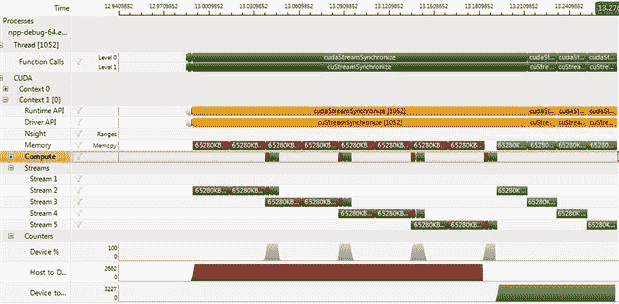

图 10.1 NPP 流式调用。

在这个例子中，传输通常占据了整个时间框架的大部分。这在很大程度上取决于你在 GPU 上执行的处理量，以及你是否确实需要持续进行数据传输。将数据保留在 GPU 上是一个不错的解决方案，尤其是如果你打算稍后进行可视化，或者根本不需要主机上的拷贝。

在这个特定的例子中，由于内核的序列相对于传输较小，同步时间为 300 毫秒，而异步时间为 280 毫秒。我们有一个非常小的内核/传输重叠，因此我们只节省了这一部分时间。从整体时间框架中来看，要从并行的独立工作负载中获得显著收益，我们实际上需要多个 GPU，在这些 GPU 上，传输和内核可以在*N*个 GPU 上并行操作。

根据事件、内存拷贝和内核的组合，你可以通过使用异步模式实现显著的性能提升。这是因为 CUDA 设备可以直接开始工作，而不是在 CPU 为其组织更多任务时处于空闲状态。通过使用多个流来处理独立的工作单元，你可以定义任务级别的并行性，除了常规的数据级并行性之外。这在 Fermi 架构的 GPU（计算能力 2.x）上是可以利用的，某种程度上，它用于通过连续的内核和并行的内核填充 GPU。随着 GPU 中 SM 设备的增大，比如 Kepler 架构，这一点变得越来越重要。

请注意，这里的设置是针对单个 DMA 传输引擎的，这是消费级显卡上的标准配置。Tesla 设备启用了两个 DMA 引擎，允许设备之间的传输和往返的传输同时进行。在之前的时间线中，通过一些程序修改，这会使得在数据传输到设备时，数据传回主机的操作能够重叠进行。实际上，我们将消除数据传回主机的时间，这是一项显著的节省。由于 Tesla 设备启用了两个 DMA 引擎，启用流式传输可以为该平台带来显著的好处。

另请注意，测试中我们使用的是 PCI-E 2.0 X8 链接。如果使用 PCI-E 3.0 X16 链接，传输时间将减少到此处所示的四分之一左右，从而减少传输问题的影响。

一旦你的内核正常工作，且仅在它正常工作之后，才切换到异步操作模式。然而，异步操作可能会使调试变得更加复杂，因此最好在一切正常后再进行此切换。

**SDK 示例：** Grabcut、直方图均衡化、BoxFilter、图像分割、与 FreeImage 库的互操作性。

### Thrust

对 C++ 熟悉的人可能使用过 C++ STL，特别是 BOOST 库。对于不熟悉模板的人来说，模板实际上是 C++ 中非常有用的功能。在传统的 C 语言中，如果你有一个简单的函数，假设是进行加法运算的函数，你必须显式地指定操作数的类型。因此，你可能会有如下所示的代码：

```cpp
int sum(const int x, const int y)
{
  return x+y;
}
```

如果我希望调用这个函数并传递一个浮动值，那么我需要一个新的函数。由于 C 语言不允许两个函数使用相同的名称，我需要像 `sum_i32`、`sum_u8`、`sum_u32`、`sum_f32` 等这样的命名方式。提供和使用一个类型特定的库有些繁琐。

C++尝试通过函数重载来解决这个问题。这允许同一个名称用于多个函数。根据传递的参数类型，调用适当的函数。然而，库提供者仍然需要编写一个函数体来处理`int8`、`int16`、`f32`等，即使现在可以使用统一的名称来调用该函数。

C++的模板系统解决了这个问题。我们有一个通用函数，它仅在其参数类型上发生变化。因此，为什么程序员需要将代码复制粘贴十几次，以支持他或她可能想象的所有组合呢？模板，顾名思义，意味着以类型无关的方式提供你想做的事情的模板。然后，编译器会在编译时生成函数的一个版本，前提是该版本确实被调用。

因此，STL 应运而生，它为 C++中一些非常常见的函数提供了类型无关的定义。如果你使用的是`int32`版本，而不是`f32`版本，那么只有`int32`版本的代码会在你的应用程序中生成。模板的缺点，与库不同，是它们在每次编译时都会被编译，因此可能会增加编译时间。

NVCC 编译器实际上是 C++前端，而不是 C 前端。Windows 上的标准开发包——Microsoft Visual Studio——也支持 C++语言，主要的 Linux 和 Mac 开发环境也同样支持。

Thrust 库支持许多适合在大规模并行处理器上使用的 STL 容器。最简单的结构通常是最好的，因此数组（或者 STL 称之为向量）在 Thrust 中得到了很好的支持。并不是所有容器都适合使用，比如列表，因为列表的访问时间未知且长度可变。

在我们讨论 Thrust 之前，还需要了解一个 C++ 概念，那就是 C++ 命名空间。在 C 中，如果你声明两个同名的函数，且在编译时未被发现，就会在链接阶段出现错误。而在 C++ 中，只要这两个函数属于不同的命名空间，这是完全有效的。命名空间有点像指定库前缀，用来区分编译器应该搜索哪个库中的函数。C++ 命名空间实际上是一个类选择器。C++ 中的类，从非常高的层次上讲，实际上就是一种将相关函数和数据组合在一个定义中的方式。因此，只要命名空间不同，我们可以对同一个函数进行两次调用。例如：

```cpp
ClassNameA::my_func();
ClassNameB::my_func();
```

由于命名空间前缀，编译器可以识别出要调用的是哪个函数。`::`（双冒号）等同于`->`运算符，如果你把类定义看作是一个包含多个函数指针以及数据的结构定义。

最后，为了使用 Thrust 库，我们还需要了解一个 C++ 概念——*函数对象（functor）*。函数对象可以被看作是一个函数指针，但它还能存储状态或数据。实际上，它是指向一个基于给定类定义的对象实例的指针。

如果你曾经使用过标准 C 库中的任何函数，例如`qsort`（快速排序），你就会熟悉用户提供函数的概念。在`qsort`的情况下，你需要提供比较函数，用来判断一个不透明数据对象是否大于或小于另一个不透明数据对象。你可能有特定的或多个标准来排序记录。`qsort`库的提供者无法覆盖所有这些可能性，因此他们提供了一个正式的参数，你必须提供自己的比较函数。

Thrust 库为你提供了两个向量容器。STL 中的向量只是可调整大小的数组，可以容纳任何类型的元素。Thrust 提供了主机和设备向量类，分别驻留在主机和设备的全局内存中。

向量可以使用数组下标符号（`[` 和 `]`）来读取或修改。然而，请注意，如果向量位于设备上，Thrust 会在后台通过 PCI-E 总线对每次访问进行单独的传输。因此，在循环中使用这样的结构是一个*非常*糟糕的主意。

使用 Thrust 的第一个方面就是如何将你需要的数据输入到 Thrust 向量中以及如何将数据从中输出。因此，我们首先需要包含必要的头文件。Thrust 提供了以下几种广泛的函数类型：

• 转换

• 归约

• 前缀和

• 重排序

• 排序

Thrust 不是传统意义上的库，因为它的所有内容都包含在你包含到源代码中的头文件内。因此，你应该避免仅仅包含所有内容，而应该只包含你需要的头文件。

Thrust 提供了两个向量对象，`host_vector` 和 `device_vector`，它们使用 C++ 术语来创建这些对象的实例。例如，

```cpp
thrust::host_vector <float> my_host_float_vector(200);
thrust::device_vector <int> my_device_int_vector(500);
```

在这段代码中，我们声明了两个对象，一个物理上位于主机上，另一个物理上位于设备上。

`thrust::`部分指定了一个类命名空间，可以将其大致理解为 C 语言中的库说明符。`host_vector`和`device_vector`是由对象提供的函数（构造函数）。`<int>`和`<float>`说明符被传递给构造函数（初始化函数）。构造函数然后利用这些说明符以及传递给函数的值来分别分配 200 个`sizeof(float)`元素和 500 个`sizeof(int)`元素。在内部可能还有其他数据结构，但从高层次来看，这就是在使用此类 C++构造函数时实际做的事情。

C++中的对象也有一个析构函数，它在对象超出作用域时被调用。这个函数负责释放构造函数或对象运行期间分配的任何资源。因此，与 C 语言不同，Thrust 向量不需要调用`free`或`cudaFree`。

定义了一个向量后，你现在需要将数据输入和输出到该向量中。Thrust 向量在概念上仅仅是一个可调整大小的数组。因此，一个向量对象提供了一个`size()`函数，用于返回向量中的元素数量。这使得你可以使用标准的循环结构，例如：

```cpp
for (int i=0; i < my_device_int_vector.size(); i++)
{
  int x = my_device_int_vector[i];
  …
}
```

在这个示例中，数组`[]`操作符由类定义提供。因此，在每次迭代中，都会调用一个函数将`i`转化为一个实际的数据单元。因为这个原因，如果数据恰好位于设备上，Thrust 会在后台生成一个从设备到主机的传输，而这一过程对程序员完全透明。`size()`函数意味着迭代次数只有在运行时才能知道。由于这在循环体内可能发生变化，因此必须在每次循环迭代中调用。这反过来又阻止了编译器静态展开该循环。

根据你对这些事情的看法，你要么会喜欢它，要么会讨厌它。喜欢它的人喜欢抽象，因为它们让编程变得更简单，你不需要关心硬件。这一阵营主要由没有经验的程序员和那些只想完成计算的人组成。讨厌它的人则想知道发生了什么，并且非常渴望最大化利用他们所拥有的硬件性能。他们不想让一个“简单”的数组解引用引发一个极其低效的 4 字节 PCI-E 传输。他们更愿意在安排时进行一次更高效的几兆字节传输，不管是从设备到主机，还是从主机到设备。

Thrust 实际上让两个阵营都满意。大规模传输只需通过启动主机向量与设备向量，或者反之来完成。例如：

`thrust::host_vector <float> my_host_float_out_vector (my_device_float_results_vector.begin(), my_device_float_results_vector.end() );`

或者

```cpp
thrust::copy(my_host_float_out_vector.begin(), my_host_float_out_vector.end(), my_device_float_results_vector.begin(), my_device_float_results_vector.begin() );
```

在第一个例子中，我们在主机端创建了一个新的向量，并用设备向量初始化了主机向量。注意，我们没有像之前创建主机向量时那样只指定一个构造函数参数，而是指定了两个。在这种情况下，Thrust 会通过减法计算出需要复制的元素数量，并相应地在主机上分配存储空间。

在第二个示例中，我们使用了显式的复制方法。这个方法（函数）接受三个参数：目标区域的起始和结束位置，以及源区域的起始位置。由于 Thrust 知道你正在使用的向量类型，因此复制方法适用于主机和设备向量。无需指定额外的参数，如 `cudaMemcpyDeviceToHost` 或 `cudaMemcpyHostToDevice`，也无需根据传递的类型调用不同的函数。Thrust 通过使用 C++ 模板重载命名空间来根据传递的参数调用不同的函数。因为这一过程发生在编译时，所以你可以享受到强类型检查和零运行时开销的好处。模板是 C++ 相较于 C 的一个主要优势。

#### 使用 Thrust 提供的函数

一旦数据进入 Thrust 的设备向量或主机向量容器，Thrust 提供了许多标准函数。Thrust 提供了一个简单的排序函数，只需要向量的起始和结束位置。它会将工作分配到不同的块，并为你执行任何归约和块间通信。这通常是 CUDA 新手容易出错的代码。像排序函数这样的功能使得使用 GPU 像使用常见的 C `qsort` 库函数一样简单。

```cpp
thrust::sort(device_array.begin(), device_array.end());
```

我们可以通过一个简短的程序看到这一点。

```cpp
#include <thrust/host_vector.h>
#include <thrust/device_vector.h>
#include <thrust/generate.h>
#include <thrust/sort.h>
#include <thrust/copy.h>
#include <cstdlib>
// 1M Elements = 4MB Data
#define NUM_ELEM (1024∗1024)
int main(void)
{
 // Declare an array on the host
 printf("\nAllocating memory on host");
 thrust::host_vector<int> host_array(NUM_ELEM);
 // Populate this array with random numbers
 printf("\nGenerating random numbers on host");
```

` **thrust::generate(host_array.begin(), host_array.end(), rand);**`

```cpp
 // Create a device array and populate it with the host values
 // A PCI-E transfer to device happens here
 printf("\nTransferring to device");
 thrust::device_vector<int> device_array = host_array;
 // Sort the array on the device
 printf("\nSorting on device");
 thrust::sort(device_array.begin(), device_array.end());
 // Sort the array on the host
 printf("\nSorting on host");
 thrust::sort(host_array.begin(), host_array.end());
 // Create a host array and populate it with the sorted device values
 // A PCI-E transfer from the device happens here
 printf("\nTransfering back to host");
 thrust::host_vector<int> host_array_sorted = device_array;
 printf("\nSorting Complete");
 return 0;
}
```

#### Thrust 的问题

这里需要注意的一个有趣点是，GPU 和 CPU 基于的排序可能会同时执行，也可能不会，取决于你如何安排数据传输。不幸的是，Thrust 总是使用默认流，并且无法像 NPP 库一样更改流。没有流参数可以传递，也没有函数可以设置当前选择的流。

使用默认流会带来一些严重的影响。排序操作实际上只是一个在流 0 中运行的内核序列。内核像普通内核一样是异步启动的。然而，内存传输除非明确以异步方式进行，否则是同步进行的。因此，从 Thrust 中调用的任何返回值的函数，例如`reduce`，以及任何回传主机的拷贝，都会导致隐式同步。在示例代码中，如果将排序主机数组调用放在从设备代码回传后的位置，则会使 GPU 和 CPU 的排序操作串行化。

#### 多 CPU/GPU 考量

在 CPU 端，Thrust 会自动生成*N*个线程，其中*N*是物理处理器核心的数量。Thrust 实际上使用 OpenMP 来处理 CPU 端，并且默认情况下 OpenMP 会使用 CPU 上的物理核心数量。

如果 GPU 版本也能像这样将任务分配到*N*个 GPU 上，那就太好了。主机端实现了一个基于 NUMA（非统一内存访问）的内存系统。这意味着所有的内存地址对任何 CPU 插槽和任何 CPU 核心都是可访问的。因此，即使在双 CPU 系统上，8、12 或 16 个 CPU 核心也可以并行地处理一个问题。

多个 GPU 更像是一组分布式内存机器，所有这些机器都连接到 PCI-E 总线上。如果你有合适的硬件和操作系统（OS），这些 GPU 可以通过点对点（P2P）功能直接通过总线进行通信。让多个 GPU 共同工作进行排序稍微复杂一些。

然而，和常规的多 GPU 编程一样，Thrust 支持单线程/多 GPU 和多线程/多 GPU 模型。它不会隐式地使用多个 GPU。程序员需要自己选择启动多个线程，或者在适当的位置使用`cudaSetDevice`调用来选择正确的设备进行操作。

排序多处理器时有两种基本方法。第一种方法由归并排序使用。在这种方法中，数据被分成相等大小的块，每个块独立排序，然后进行最终的归并操作。第二种方法，由像我们之前看到的样本排序算法使用，是部分排序或预排序这些块。结果块可以独立排序，或者也可以直接连接在一起形成排序后的输出。

由于内存访问时间远比比较时间慢，因此那些对数据进行最少读取和写入操作的算法，往往是最快的。那些会引起竞争的操作，比如归并，最终会限制算法的扩展性，而相比之下，能够在整个过程中保持广泛并行性的算法则更具扩展性。

对于基本类型（`u8`、`u16`、`u32`、`s8`、`s16`、`s32`、`f32`、`f64`），Thrust 使用非常快速的基数排序，这是我们之前在样本排序中看到的。对于其他类型和用户定义的类型，它使用归并排序。Thrust 会根据类型和数据的范围自动调整基数排序中使用的位数。因此，32 位排序，其中数据的最大范围只有 256，比使用整个范围的排序要快得多。

#### 排序计时

为了查看一些计时结果，让我们在 Thrust 示例代码中添加一些计时器，看看得到的值。

```cpp
#include <thrust/host_vector.h>
#include <thrust/device_vector.h>
#include <thrust/generate.h>
#include <thrust/sort.h>
#include <thrust/copy.h>
#include <cstdlib>
#include "cuda_helper.h"
#include "timer.h"
void display_gpu_name(void)
{
 int device_num;
 struct cudaDeviceProp prop;
 CUDA_CALL(cudaGetDevice(&device_num));
 // Get the device name
```

` CUDA_CALL( cudaGetDeviceProperties( &prop, device_num ) );`

```cpp
 // Print device name and logical to physical mapping
 printf("\n\nUsing CUDA Device %u. Device ID: %s on PCI-E %d",
  device_num, prop.name, prop.pciBusID);
}
// 4M Elements = 16MB Data
#define NUM_ELEM (1024∗1024∗4)
int main(void)
{
 int num_devices;
 CUDA_CALL(cudaGetDeviceCount(&num_devices));
 for (int device_num = 0; device_num < num_devices; device_num++)
 {
  CUDA_CALL(cudaSetDevice(device_num));
  display_gpu_name();
  const size_t size_in_bytes = NUM_ELEM ∗ sizeof(int);
  printf("\nSorting %lu data items (%lu MB)", NUM_ELEM, (size_in_bytes/1024/1024));
  // Allocate timer events to track time
  float c2d_t, sort_d_t, sort_h_t, c2h_t;
  cudaEvent_t c2d_start, c2d_stop;
  cudaEvent_t sort_d_start, sort_d_stop;
  cudaEvent_t c2h_start, c2h_stop;
  CUDA_CALL(cudaEventCreate(&c2d_start));
  CUDA_CALL(cudaEventCreate(&c2d_stop));
  CUDA_CALL(cudaEventCreate(&sort_d_start));
  CUDA_CALL(cudaEventCreate(&sort_d_stop));
  CUDA_CALL(cudaEventCreate(&c2h_start));
  CUDA_CALL(cudaEventCreate(&c2h_stop));
  // Declare an array on the host
  printf("\nAllocating memory on host");
  thrust::host_vector<int> host_array(NUM_ELEM);
  // Populate this array with random numbers
  printf("\nGenerating random numbers on host");
  thrust::generate(host_array.begin(), host_array.end(), rand);
  // Create a device array and populate it with the host values
  // A PCI-E transfer to device happens here
  printf("\nTransferring to device");
  CUDA_CALL(cudaEventRecord(c2d_start, 0));
```

` **thrust::device_vector<int> device_array = host_array;**`

```cpp
  CUDA_CALL(cudaEventRecord(c2d_stop, 0));
  // Sort the array on the device
  printf("\nSorting on device");
  CUDA_CALL(cudaEventRecord(sort_d_start, 0));
  thrust::sort(device_array.begin(), device_array.end());
  CUDA_CALL(cudaEventRecord(sort_d_stop, 0));
  CUDA_CALL(cudaEventSynchronize(sort_d_stop));
  // Sort the array on the host
  printf("\nSorting on host");
  sort_h_t = get_time();
  thrust::sort(host_array.begin(), host_array.end());
  sort_h_t = (get_time() - sort_h_t);
  // Create a host array and populate it with the sorted device values
  // A PCI-E transfer from the device happens here
  printf("\nTransfering back to host");
  CUDA_CALL(cudaEventRecord(c2h_start, 0));
  thrust::host_vector<int> host_array_sorted = device_array;
  CUDA_CALL(cudaEventRecord(c2h_stop, 0));
  // Wait for last event to be recorded
  CUDA_CALL(cudaEventSynchronize(c2h_stop));
  printf("\nSorting Complete");
  // Calculate time for each aspect
  CUDA_CALL(cudaEventElapsedTime(&c2d_t, c2d_start, c2d_stop));
  CUDA_CALL(cudaEventElapsedTime(&sort_d_t, sort_d_start, sort_d_stop));
  CUDA_CALL(cudaEventElapsedTime(&c2h_t, c2h_start, c2h_stop));
  printf("\nCopy To Device : %.2fms", c2d_t);
  printf("\nSort On Device : %.2fms", sort_d_t);
  printf("\nCopy From Device : %.2fms", c2h_t);
  printf("\nTotal Device Time: %.2fms", c2d_t + sort_d_t + c2h_t);
  printf("\n\nSort On Host : %.2fms", sort_h_t);
  CUDA_CALL(cudaEventDestroy(c2d_start));
  CUDA_CALL(cudaEventDestroy(c2d_stop));
  CUDA_CALL(cudaEventDestroy(sort_d_start));
  CUDA_CALL(cudaEventDestroy(sort_d_stop));
  CUDA_CALL(cudaEventDestroy(c2h_start));
  CUDA_CALL(cudaEventDestroy(c2h_stop));
 }
 return 0;
```

`}`

由于 Thrust 对所有调用都使用默认流，为了计时设备代码，我们只需插入多个事件，然后计算这些事件之间的时间差。然而，请注意，在排序后和最终事件后，我们需要同步流。`cudaEventRecord` 函数即使设备当前没有执行任何操作，也会立即返回，而不会设置事件。因此，如果在设备排序后遗漏同步调用，会显著延长实际报告的时间。

我们在四个设备上看到的排序时间如 表 10.1 和 图 10.2 所示，数据为 16 MB 的随机数据。从表中可以看到，随着我们回退到不同的 GPU 代际，速度呈现出相当线性的下降趋势。当我们使用计算能力 1.1 的 9800 GT 设备时，执行时间显著增加。9800 GT 的内存带宽不到 GTX260 的一半，且其处理能力最多也只有 GTX260 的三分之二。

表 10.1 不同设备上的 Thrust 排序时间

| 设备 | 时间 |
| --- | --- |
| GTX470 | 67.45 |
| GTX460 | 85.18 |
| GTX260 | 109.02 |
| 9800 GT | 234.83 |

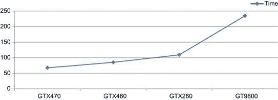

图 10.2 按设备划分的 Thrust 排序时间（16 MB 数据）。

相较之下，我们的 2.5 GHz AMD Phenom II X4 主机的排序时间相当差，平均约为 2400 毫秒，甚至比 9800 GT 慢 10 倍。然而，这真的是一个公平的比较吗？这取决于 Thrust 在 CPU 上如何高效实现排序，所使用的具体 CPU，以及主机的内存带宽。Parallel Nsight 和任务管理器都表明，Thrust 在我们的测试系统上并未充分利用 CPU，CPU 的负载没有超过 25%。这表明它远未充分利用 CPU 资源。因此，将其作为比较是不公平的，这人为地抬高了 GPU 的性能数据。

```cpp
Using CUDA Device 0\. Device ID: GeForce GTX 470 on PCI-E 8
Sorting 4194304 data items (16 MB)
Allocating memory on host
Generating random numbers on host
Transferring to device
Sorting on device
Sorting on host
Transfering back to host
Extracting data from Thrust vector
Sorted arrays Match
Running single core qsort comparison
Sorting Complete
Copy To Device : 10.00ms
Sort On Device : 58.55ms
Copy From Device : 12.17ms
Total Device Time : 80.73ms
Thrust Sort On Host: 2398.00ms
QSort On Host : 949.00ms
```

如你所见，单核的 `qsort` 在 CPU 端轻松超过了 Thrust 排序，并且几乎完全利用了一个核心的计算资源。如果我们假设并行版本的加速效果与我们之前看到的 OpenMP 降维相似，那么典型的 CPU 计算时间大约是此处所示的一半，大约是 475 毫秒。即便如此，基于 GPU 的 Thrust 排序仍然比 CPU 快了接近六倍，即使考虑到从 PCI-E 总线的传输时间。

Thrust 还具有许多其他有用的功能：

• 二分查找

• 降维

• 合并

• 重新排序

• 前缀和

• 集合操作

• 变换

这些内容的文档可以在 Thrust 用户手册中找到。每个操作的用法与我们在这里使用的排序示例相似。

我们显然可以写很多关于 Thrust 的内容，但本章是关于库的，因此我们只看一个例子，即降维。

```cpp
#include <thrust/host_vector.h>
#include <thrust/device_vector.h>
#include <thrust/sequence.h>
#include <thrust/sort.h>
#include <thrust/copy.h>
```

`#include <cstdlib>`

```cpp
#include "cuda_helper.h"
#include "timer.h"
void display_gpu_name(void)
{
 int device_num;
 struct cudaDeviceProp prop;
 CUDA_CALL(cudaGetDevice(&device_num));
 // Get the device name
 CUDA_CALL( cudaGetDeviceProperties( &prop, device_num ) );
 // Print device name and logical to physical mapping
 printf("\n\nUsing CUDA Device %u. Device ID: %s on PCI-E %d",
  device_num, prop.name, prop.pciBusID);
}
long int reduce_serial(const int ∗ __restrict__ const host_raw_ptr,
                       const int num_elements)
{
 long int sum = 0;
 for (int i=0; i < num_elements; i++)
  sum += host_raw_ptr[i];
 return sum;
}
long int reduce_openmp(const int ∗ __restrict__ const host_raw_ptr,
            const int num_elements)
{
 long int sum = 0;
#pragma omp parallel for reduction(+:sum) num_threads(4)
 for (int i=0; i < num_elements; i++)
  sum += host_raw_ptr[i];
 return sum;
}
// 1M Elements = 4MB Data
#define NUM_ELEM_START (1024∗1024)
```

`#define NUM_ELEM_END (1024∗1024∗256)`

```cpp
int main(void)
{
 int num_devices;
 CUDA_CALL(cudaGetDeviceCount(&num_devices));
 for (unsigned long num_elem = NUM_ELEM_START; num_elem < NUM_ELEM_END; num_elem ∗=2)
 {
  const size_t size_in_bytes = num_elem ∗ sizeof(int);
  for (int device_num = 0; device_num < num_devices; device_num++)
  {
   CUDA_CALL(cudaSetDevice(device_num));
   display_gpu_name();
   printf("\nReducing %lu data items (%lu MB)", num_elem, (size_in_bytes/1024/1024));
   // Allocate timer events to track time
   float c2d_t, reduce_d_t, reduce_h_t, reduce_h_mp_t, reduce_h_serial_t;
   cudaEvent_t c2d_start, c2d_stop;
   cudaEvent_t sort_d_start, sort_d_stop;
   CUDA_CALL(cudaEventCreate(&c2d_start));
   CUDA_CALL(cudaEventCreate(&c2d_stop));
   CUDA_CALL(cudaEventCreate(&sort_d_start));
   CUDA_CALL(cudaEventCreate(&sort_d_stop));
   // Declare an array on the host
   thrust::host_vector<int> host_array(num_elem);
   // Populate this array with random numbers
   thrust::sequence(host_array.begin(), host_array.end());
   // Create a device array and populate it with the host values
   // A PCI-E transfer to device happens here
   CUDA_CALL(cudaEventRecord(c2d_start, 0));
   thrust::device_vector<int> device_array = host_array;
   CUDA_CALL(cudaEventRecord(c2d_stop, 0));
   // Sort the array on the device
   CUDA_CALL(cudaEventRecord(sort_d_start, 0));
   const long int sum_device = thrust::reduce(device_array.begin(), device_array.end());
   CUDA_CALL(cudaEventRecord(sort_d_stop, 0));
   CUDA_CALL(cudaEventSynchronize(sort_d_stop));
   // Sort the array on the host
   reduce_h_t = get_time();
   const long int sum_host = thrust::reduce(host_array.begin(), host_array.end());
```

`   reduce_h_t = (get_time() - reduce_h_t);`

```cpp
   // Allocate host memory
   int ∗ const host_raw_ptr_2 = (int ∗) malloc(size_in_bytes);
   int ∗p2 = host_raw_ptr_2;
   if ( (host_raw_ptr_2 == NULL) )
   {
    printf("\nError allocating host memory for extraction of thrust data");
    exit(0);
   }
   // Extract data from Thrust vector to normal memory block
   for (int i=0; i<num_elem; i++)
   {
    ∗p2++ = host_array[i];
   }
   reduce_h_mp_t = get_time();
   const long int sum_host_openmp = reduce_openmp(host_raw_ptr_2, num_elem);
   reduce_h_mp_t = (get_time() - reduce_h_mp_t);
   reduce_h_serial_t = get_time();
   const long int sum_host_serial = reduce_serial(host_raw_ptr_2, num_elem);
   reduce_h_serial_t = (get_time() - reduce_h_serial_t);
   // Free memory
   free(host_raw_ptr_2);
   if ( (sum_host == sum_device) && (sum_host == sum_host_openmp) )
    printf("\nReduction Matched");
   else
    printf("\n∗∗∗∗ FAILED ∗∗∗∗");
   // Calculate time for each aspect
   CUDA_CALL(cudaEventElapsedTime(&c2d_t, c2d_start, c2d_stop));
   CUDA_CALL(cudaEventElapsedTime(&reduce_d_t, sort_d_start, sort_d_stop));
   printf("\nCopy To Device : %.2fms", c2d_t);
   printf("\nReduce On Device : %.2fms", reduce_d_t);
   printf("\nTotal Device Time : %.2fms", c2d_t + reduce_d_t);
   printf("\n\nThrust Reduce On Host: %.2fms", reduce_h_t);
   printf("\nSerial Reduce On Host: %.2fms", reduce_h_serial_t);
   printf("\nOpenMP Reduce On Host: %.2fms", reduce_h_mp_t);
   CUDA_CALL(cudaEventDestroy(c2d_start));
   CUDA_CALL(cudaEventDestroy(c2d_stop));
   CUDA_CALL(cudaEventDestroy(sort_d_start));
   CUDA_CALL(cudaEventDestroy(sort_d_stop));
  }
 }
```

` return 0;`

```cpp
}
```

降维是一个有趣的问题，正如我们之前看到的，由于数据传输到 GPU 的时间，写出比 OpenMP 版本更快的降维算法是困难的。我们获得了显著的优势，因为只有一次重要的设备传输，但这占据了总时间的主导地位。然而，如果数据已经在 GPU 上，那么当然这一传输就与降维步骤无关了。

我们将对基于 Thrust 的降维进行计时，分别在主机和设备上与标准的单核串行降维、OpenMP 四核降维以及四个 GPU 测试设备进行对比，数据规模不同。请参见 表 10.2 和 图 10.3。表中唯一缺失的项是 CPU 上的 Thrust 降维时间。由于它显著大于其他任何数值，因此被排除在外。在所有块大小一致的情况下，CPU 上的 Thrust 排序耗时大约是单核串行版本的 10 倍。

表 10.2 多种大小和 GPU 的归约时间（单位：毫秒）

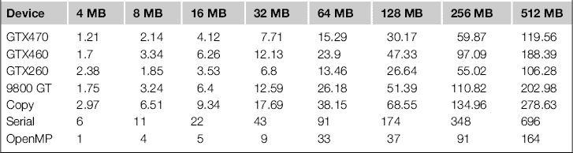

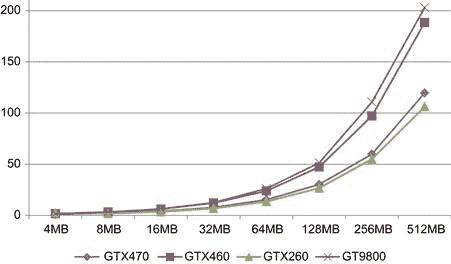

图 10.3 GPU 归约时间（单位：毫秒），按大小分类。

请注意，在图 10.3 中，以及在表 10.2 中，*y* 轴表示时间，单位是毫秒。因此，数值越低越好。令人惊讶的是，GTX260 的归约时间最好，略微超过了后代的 GTX470。

这些都很好，但与 CPU 版本相比如何呢？所有显卡的速度都比单核串行实现快，快了 3.5 倍到 7 倍。GTX470 和 GTX260 显卡与 OpenMP 版本的对比表现非常好，归约时间大约是并行 CPU 版本的三分之二。GTX460 的时间与 CPU 相差不大，而 9800 GT 则较慢。然而，如果考虑到（PCI-E 2.0 x8）传输时间，对于 512 MB 的数据为 278 毫秒，即便是 GTX260 的 106 毫秒（加上 278 毫秒）也比 OpenMP 版本的 164 毫秒慢。

使用 CUDA 实现的归约，或支持流的 Thrust 异步版本，我们可以通过重叠连续的传输和内核来减去内核时间。当然，这是在假设我们有多个归约操作要执行，或者将单个归约操作分解成一系列归约操作的前提下。即使如此，我们仍然只能得到最好的情况——178 毫秒，这仍然比 OpenMP 版本慢。这里的明确信息是，适当时应利用 OpenMP 和 CPU。如果数据已经在 GPU 上，则在 GPU 上执行归约。否则，使用 CPU 来完成一些有用的任务。请参见图 10.4。

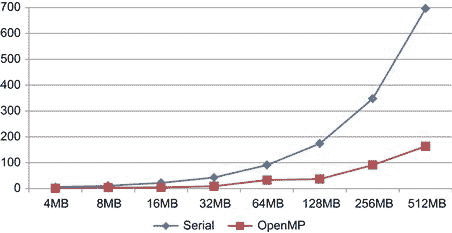

图 10.4 OpenMP 和串行归约的时间（单位：毫秒）。

#### 使用 Thrust 和 CUDA

因此，我们希望能够将 Thrust 库的这些特性与常规 CUDA 代码结合使用。也许你可以完全使用提供的 Thrust 操作来编写应用程序。然而，库永远无法覆盖所有内容，总会有做得好的部分和做得不那么好的部分。因此，我们不想为了使用某个库而被迫采用某种特定的思维方式。

Thrust 不提供一种简便的方法来将数据从其`host_vector`结构中复制出来。它只提供读取单个元素的方法。因此，复制操作只能一次复制一个元素，这样非常慢。然而，通过`device_vectors`，我们有了另一种方法。

首先，你需要自己分配设备上的存储空间，从而获得数据的指针，而不是 Thrust 迭代器。然后，你需要将常规设备指针转换为 Thrust 设备指针。这个过程是通过使用`device_ptr`构造函数来完成的。接下来，你可以将这个 Thrust 设备指针传递给各种 Thrust 函数。现在，Thrust 会在你提供的底层数据上工作，因此它对你是可见的，而不是隐藏在 Thrust 库内部。

我们可以调整排序示例来利用这一点。

```cpp
#include <thrust/host_vector.h>
#include <thrust/device_vector.h>
#include <thrust/sort.h>
#include <cstdlib>
#include "cuda_helper.h"
#include "timer.h"
#include "common_types.h"
void display_gpu_name(void)
{
 int device_num;
 struct cudaDeviceProp prop;
 CUDA_CALL(cudaGetDevice(&device_num));
 // Get the device name
 CUDA_CALL( cudaGetDeviceProperties( &prop, device_num ) );
 // Print device name and logical to physical mapping
 printf("\n\nUsing CUDA Device %u. Device ID: %s on PCI-E %d",
  device_num, prop.name, prop.pciBusID);
}
__global__ void fill_memory(int ∗ const __restrict__ data,
            const int num_elements)
{
 const int tid = (blockIdx.x ∗ blockDim.x) + threadIdx.x;
 if (tid < num_elements)
  data[tid] = (num_elements - tid);
}
// 4M Elements = 16MB Data
#define NUM_ELEM (1024∗1024∗4)
int main(void)
{
 const size_t size_in_bytes = NUM_ELEM ∗ sizeof(int);
 display_gpu_name();
```

` printf("\nSorting %lu data items (%lu MB)", NUM_ELEM, (size_in_bytes/1024/1024));`

```cpp
 // Declare an array on the device
 printf("\nAllocating memory on device");
 int ∗ device_mem_ptr;
 CUDA_CALL(cudaMalloc((void ∗∗) &device_mem_ptr, size_in_bytes));
 const u32 num_threads = 256;
 const u32 num_blocks = (NUM_ELEM + (num_threads-1)) / num_threads;
 printf("\nFilling memory with pattern");
 fill_memory<<<num_threads, num_blocks>>>(device_mem_ptr, NUM_ELEM);
 // Convert the array to
 printf("\nConverting regular device pointer to thrust device pointer");
 thrust::device_ptr<int> thrust_dev_ptr(device_mem_ptr);
 // Sort the array on the device
 printf("\nSorting on device");
 thrust::sort(thrust_dev_ptr, thrust_dev_ptr + NUM_ELEM);
 printf("\nFreeing memory on device");
 CUDA_CALL(cudaFree(device_mem_ptr));
 return 0;
}
```

注意构造函数`thrust::device_ptr`，它创建了对象`thrust_dev_ptr`，然后可以将其传递给`thrust::sort`函数。与常规迭代不同，Thrust 设备指针没有“begin”和“end”函数，因此我们只需使用基地址加上长度来获取排序的最后一个元素。

这使得主机启动的 Thrust 调用可以与简单的设备内核一起实现。然而，请注意（截至 4.2 SDK），Thrust 没有设备级接口，因此你不能在设备或全局函数中调用 Thrust 函数。例如，像 `sort` 这样的函数会自我生成多个内核。由于 GPU 至少在 Kepler K20 发布之前无法自行生成额外的工作任务，因此我们只能依赖主机控制。

**SDK 示例：** 视距、基数排序、粒子、行进立方体、烟雾粒子。

### CuRAND

CuRAND 库提供了在 GPU 上生成各种类型的随机数。在 C 语言中，你可能习惯于在主机上调用标准库函数 `rand()`。像许多标准库函数一样，`rand()` 不能在设备代码中调用。因此，你唯一的选择是先在主机上创建一块随机数数据，然后将其复制到设备上。这会引发一些问题：

• 提高了主机启动时间。

• 增加了 PCI-E 带宽。

• 实际应用中，通常随机数分布不均匀。

标准库的 `rand()` 函数并非设计用来生成真正的随机数。它的工作原理类似于许多随机数生成算法，通过创建一个伪随机数列表并简单地选择下一个元素。因此，知道使用的种子的人可以利用这一知识准确预测给定序列中的下一个随机数。

这有一些影响，尤其是在安全领域。许多算法以某种方式使用随机性，目的是让伪装成对等体变得困难。假设两个对等体交换了一个随机数生成器的种子。对等体 A 将一个随机数编码到消息框架中。对等体 B 使用相同的种子和相同的随机数生成器，知道应该从对等体 A 接收到什么数据标识符。给定从对等体 A 和 B 捕获的标识符序列，攻击者 C 可以推算出下一个数字，并伪装成（假冒）对等体 A 或 B。

这是可能的，因为随机数通常只是一个小的、重复的伪随机数序列。如果随机数集合很小，那么攻击就很容易。种子要么从未由程序员设置，要么设置为某个“秘密”数字，或者基于当前时间进行设置。启动时间实际上并不是非常随机，因此基于时间的种子实际上是在一个非常小的窗口内。秘密很少能保持秘密。

另一个示例是密码生成。如果你需要在一个系统上设置几百个用户，他们通常会被分配“随机”密码，并在第一次登录时更改。这些密码可能是较长的字符字符串，从而让人认为它们是安全的。然而，如果它们实际上是从一个具有小伪随机数集的随机数生成器中选出的，那么暴力破解攻击的实际搜索空间就相当小。

因此，对于任何预测序列可能存在问题的情况，我们需要比大多数标准库实现的`rand()`提供的随机数更好的随机数。

要使用 CuRAND 库，你需要包含以下头文件：

```cpp
#include <curand_kernel.h>
```

此外，你还需要确保链接到以下库：

```cpp
C:\Program Files\NVIDIA GPU Computing Toolkit\CUDA\v4.1\lib\x64\curand.lib
```

显然，替换路径为你当前使用的 CUDA 工具包版本。因此，让我们看一个生成随机数的示例：

```cpp
#include <stdio.h>
#include <stdlib.h>
#include <curand_kernel.h>
#include "cuda_helper.h"
#include "cuda.h"
#define CURAND_CALL(x) {const curandStatus_t a = (x); if (a != CURAND_STATUS_SUCCESS) { printf("\nCuRand Error: (err_num=%d) \n", a); cudaDeviceReset(); ASSERT(0);} }
__host__ void print_array(const float ∗ __restrict__ const data, const int num_elem)
{
 for (int i=0; i<num_elem; i++)
 {
  if ( i% 4 == 0)
```

`   printf("\n");`

```cpp
  printf("%2d: %f ", i, data[i]);
 }
}
__host__ int main(int argc, char ∗argv[])
{
 const int num_elem = 32;
 const size_t size_in_bytes = (num_elem ∗ sizeof(float));
 curandGenerator_t rand_generator_device, rand_generator_host;
 const unsigned long int seed = 987654321;
 const curandRngType_t generator_type = CURAND_RNG_PSEUDO_DEFAULT;
 // Allocate memory on the device
 float ∗ device_ptr;
 CUDA_CALL( cudaMalloc( (void ∗∗) &device_ptr, size_in_bytes ));
 // Allocate memory on the host for the device copy
 float ∗ host_ptr;
 CUDA_CALL( cudaMallocHost( (void ∗∗) &host_ptr, size_in_bytes ));
 // Allocate memory on the host for the host version
 float ∗ host_gen_ptr = (float ∗) malloc(size_in_bytes);
 if (host_gen_ptr == NULL)
 {
  printf("\nFailed to allocation memory on host");
  exit(0);
 }
 // Print library version number
 int version;
 CURAND_CALL(curandGetVersion(&version));
 printf("\nUsing CuRand Version: %d and generator: CURAND_RNG_PSEUDO_DEFAULT", version);
 // Register the generator - note the different function calls
 CURAND_CALL(curandCreateGenerator(&rand_generator_device, generator_type));
 CURAND_CALL(curandCreateGeneratorHost(&rand_generator_host, generator_type));
 // Set the seed for the random number generators
 CURAND_CALL(curandSetPseudoRandomGeneratorSeed(rand_generator_device, seed));
 CURAND_CALL(curandSetPseudoRandomGeneratorSeed(rand_generator_host, seed));
 // Create a set of random numbers on the device and host
 CURAND_CALL(curandGenerateUniform(rand_generator_device, device_ptr, num_elem));
 CURAND_CALL(curandGenerateUniform(rand_generator_host, host_gen_ptr, num_elem));
 // Copy the set of device generated data to the host
```

`CUDA_CALL(cudaMemcpy(host_ptr, device_ptr, size_in_bytes, cudaMemcpyDeviceToHost));`

```cpp
 printf("\n\nRandom numbers from GPU");
 print_array(host_ptr, num_elem);
 printf("\n\nRandom numbers from Host");
 print_array(host_gen_ptr, num_elem);
 printf("\n");
 // Free device resources
 CURAND_CALL(curandDestroyGenerator(rand_generator_device));
 CUDA_CALL(cudaFree(device_ptr));
 CUDA_CALL(cudaFreeHost(host_ptr));
 CUDA_CALL(cudaDeviceReset());
 // Free host resources
 CURAND_CALL(curandDestroyGenerator(rand_generator_host));
 free(host_gen_ptr);
}
```

这个程序使用 CuRand API 在设备和主机上生成`num_elem`个随机数，然后打印两组随机数。输出如下所示：

```cpp
Using CuRand Version: 4010 and generator: CURAND_RNG_PSEUDO_DEFAULT
Random numbers from GPU
 0: 0.468090  1: 0.660579  2: 0.351722  3: 0.891716
 4: 0.624544  5: 0.861485  6: 0.662096  7: 0.007847
 8: 0.179364  9: 0.260115 10: 0.453508 11: 0.711956
12: 0.973453 13: 0.152303 14: 0.784318 15: 0.948965
16: 0.214159 17: 0.236516 18: 0.020540 19: 0.175973
20: 0.085989 21: 0.863053 22: 0.908001 23: 0.539129
24: 0.849580 25: 0.496193 26: 0.588651 27: 0.361609
28: 0.025815 29: 0.778294 30: 0.194206 31: 0.478006
Random numbers from Host
 0: 0.468090  1: 0.660579  2: 0.351722  3: 0.891716
 4: 0.624544  5: 0.861485  6: 0.662096  7: 0.007847
 8: 0.179364  9: 0.260115 10: 0.453508 11: 0.711956
12: 0.973453 13: 0.152303 14: 0.784318 15: 0.948965
16: 0.214159 17: 0.236516 18: 0.020540 19: 0.175973
20: 0.085989 21: 0.863053 22: 0.908001 23: 0.539129
24: 0.849580 25: 0.496193 26: 0.588651 27: 0.361609
28: 0.025815 29: 0.778294 30: 0.194206 31: 0.478006
```

从示例程序中需要注意的一个重要问题是，API 调用在设备和主机功能之间是相同的，除了注册生成器。设备版本必须使用`curandCreateGenerator`，而主机版本则使用`curandCreateGeneratorHost`。另外，请注意，`curandGenerateUniform`函数必须与相关的主机或设备指针一起调用。混淆这两者可能会导致 CUDA 的“未知错误”或程序崩溃。不幸的是，由于主机端和设备端的内存分配只是普通的 C 指针，因此库无法判断传递给它的指针是主机指针还是设备指针。

还需要注意的是，CuRand 与 NPP 一样，支持流。因此，调用`curandSetStream(generator, stream)`会将库切换到该流中的异步操作。默认情况下，库将使用流 0，即默认流。

你可以使用 CuRand 库的多种生成器类型，包括基于梅森旋转算法的生成器，该算法用于蒙特卡洛模拟。

**SDK 示例：** 蒙特卡洛，随机雾霾，梅森旋转算法，Sobol。

### CuBLAS（CUDA 基本线性代数）库

我们要提到的最后一个库是 CuBLAS。CuBLAS 库旨在复制 Fortran BLAS 库的功能，这个库通常用于 Fortran 科学应用程序。为了方便现有 Fortran BLAS 代码的移植，CuBLAS 库保持了 Fortran 的列主序布局，这与标准 C 的行主序布局相反。它还使用 1..N，而不是 C 标准的 0..(N-1)表示法来访问数组元素。

因此，对于将旧版 Fortran 代码迁移到 CUDA，CuBLAS 库是理想的选择。在过去几十年里，有许多大型代码库是用 Fortran 编写的。允许这些现有的遗留代码在现代 GPU 加速硬件上运行，而无需进行重大代码更改，是该库的一个重要优势。然而，这也是其弱点之一，因为它不会吸引那些在现代计算语言中学习编程的人。

CuBLAS 库文档提供了一些示例宏，用于将旧式 Fortran 数组索引转换为大多数程序员认为的“常规”数组索引。然而，即使是作为宏或内联函数实现，这也会为任何尝试使用非 Fortran 索引的人员增加执行时间的开销。这使得 C 语言程序员使用该库时感到相当麻烦。C 语言程序员可能更希望看到一个单独的 C 语言风格的 CuBLAS 实现，原生支持 C 语言数组索引。

从库的版本四开始，弃用了旧版 API。现在要求所有调用者首先通过调用`cublasCreate`函数创建一个句柄，然后才能进行其他任何调用。该句柄将在后续调用中使用，并允许 CuBLAS 支持重入，并使用多个异步流来支持多 GPU 以获得最大性能。请注意，虽然提供了这些功能，但管理多设备是程序员的责任。像许多其他提供的库一样，CuBLAS 库不会自动将负载分配到多 GPU 设备上。

当前的 API 可以通过包含`cublas_v2.h`文件来使用，而不是旧的`cublas.h`包含文件。任何当前使用旧版 API 的代码应替换为新版 API。与 NPP 库一样，操作预计将在已经存在于 GPU 上的数据上执行，因此调用者有责任将数据从设备传输到设备。为此提供了许多“助手”函数。

新的 CuBLAS 接口完全是异步的，这意味着即使是返回值的函数，也以一种方式返回值，除非程序员明确等待异步 GPU 操作完成，否则该值可能不可用。这是向异步流的过渡的一部分，这在 Kepler K20 发布时将变得更加重要。

我们将在这里查看一个简单的示例，声明一个主机端的矩阵，将其复制到设备上，执行一些操作，将数据复制回主机并打印矩阵。

```cpp
#include <stdio.h>
#include <stdlib.h>
#include <cublas_v2.h>
#include "cuda_helper.h"
#include "cuda.h"
#define CUBLAS_CALL(x) {const cublasStatus_t a = (x); if (a != CUBLAS_STATUS_SUCCESS) { printf("\nCUBLAS Error: (err_num=%d) \n", a); cudaDeviceReset(); ASSERT(0);} }
__host__ void print_array(const float ∗ __restrict__ const data1,
                          const float ∗ __restrict__ const data2,
                          const float ∗ __restrict__ const data3,
                          const int num_elem,
                          const char ∗ const prefix)
{
 printf("\n%s", prefix);
 for (int i=0; i<num_elem; i++)
 {
  printf("\n%2d: %2.4f %2.4f %2.4f ", i+1, data1[i], data2[i], data3[i]);
 }
}
__host__ int main(int argc, char ∗argv[])
{
 const int num_elem = 8;
 const size_t size_in_bytes = (num_elem ∗ sizeof(float));
 // Allocate memory on the device
 float ∗ device_src_ptr_A;
 CUDA_CALL( cudaMalloc( (void ∗∗) &device_src_ptr_A, size_in_bytes ));
 float ∗ device_src_ptr_B;
 CUDA_CALL( cudaMalloc( (void ∗∗) &device_src_ptr_B, size_in_bytes ));
 float ∗ device_dest_ptr;
 CUDA_CALL( cudaMalloc( (void ∗∗) &device_dest_ptr, size_in_bytes ));
 // Allocate memory on the host for the device copy
 float ∗ host_src_ptr_A;
 CUDA_CALL( cudaMallocHost( (void ∗∗) &host_src_ptr_A, size_in_bytes ));
 float ∗ host_dest_ptr;
 CUDA_CALL( cudaMallocHost( (void ∗∗) &host_dest_ptr, size_in_bytes ));
 float ∗ host_dest_ptr_A;
 CUDA_CALL( cudaMallocHost( (void ∗∗) &host_dest_ptr_A, size_in_bytes ));
 float ∗ host_dest_ptr_B;
```

` CUDA_CALL( cudaMallocHost( (void ∗∗) &host_dest_ptr_B, size_in_bytes ));`

```cpp
 // Clear destination memory
 memset(host_dest_ptr_A, 0, size_in_bytes);
 memset(host_dest_ptr_B, 0, size_in_bytes);
 memset(host_dest_ptr, 0, size_in_bytes);
 // Init the CUBLAS library
 cublasHandle_t cublas_handle;
 CUBLAS_CALL(cublasCreate(&cublas_handle));
 // Print library version number
 int version;
 CUBLAS_CALL(cublasGetVersion(cublas_handle, &version));
 printf("\nUsing CUBLAS Version: %d", version);
 // Fill the first host array with known values
 for (int i=0; i < num_elem; i++)
 {
  host_src_ptr_A[i] = (float) i;
 }
 print_array(host_src_ptr_A, host_dest_ptr_B, host_dest_ptr, num_elem, "Before Set");
 const int num_rows = num_elem;
 const int num_cols = 1;
 const size_t elem_size = sizeof(float);
 // Copy a matrix one cell wide by num_elem rows from the CPU to the device
 CUBLAS_CALL(cublasSetMatrix(num_rows, num_cols, elem_size, host_src_ptr_A,
           num_rows, device_src_ptr_A, num_rows));
 // Clear the memory in the other two
 CUDA_CALL(cudaMemset(device_src_ptr_B, 0, size_in_bytes));
 CUDA_CALL(cudaMemset(device_dest_ptr, 0, size_in_bytes));
 // SAXPY on device based on copied matrix and alpha
 const int stride = 1;
 float alpha = 2.0F;
 CUBLAS_CALL(cublasSaxpy(cublas_handle, num_elem, &alpha, device_src_ptr_A,
            stride, device_src_ptr_B, stride));
 alpha = 3.0F;
 CUBLAS_CALL(cublasSaxpy(cublas_handle, num_elem, &alpha, device_src_ptr_A,
           stride, device_dest_ptr, stride));
 // Calculate the index of the max of each maxtrix, writing the result
 // directly to host memory
```

` int host_max_idx_A, host_max_idx_B, host_max_idx_dest;`

```cpp
 CUBLAS_CALL(cublasIsamax(cublas_handle, num_elem, device_src_ptr_A,
           stride, &host_max_idx_A));
 CUBLAS_CALL(cublasIsamax(cublas_handle, num_elem, device_src_ptr_B,
           stride, &host_max_idx_B));
 CUBLAS_CALL(cublasIsamax(cublas_handle, num_elem, device_dest_ptr,
           stride, &host_max_idx_dest));
 // Calculate the sum of each maxtrix, writing the result directly to host memory
 float host_sum_A, host_sum_B, host_sum_dest;
 CUBLAS_CALL(cublasSasum(cublas_handle, num_elem, device_src_ptr_A,
            stride, &host_sum_A));
 CUBLAS_CALL(cublasSasum(cublas_handle, num_elem, device_src_ptr_B,
            stride, &host_sum_B));
 CUBLAS_CALL(cublasSasum(cublas_handle, num_elem, device_dest_ptr,
            stride, &host_sum_dest));
 // Copy device versions back to host to print out
 CUBLAS_CALL(cublasGetMatrix(num_rows, num_cols, elem_size, device_src_ptr_A,
            num_rows, host_dest_ptr_A, num_rows));
 CUBLAS_CALL(cublasGetMatrix(num_rows, num_cols, elem_size, device_src_ptr_B,
            num_rows, host_dest_ptr_B, num_rows));
 CUBLAS_CALL(cublasGetMatrix(num_rows, num_cols, elem_size, device_dest_ptr,
            num_rows, host_dest_ptr, num_rows));
 // Make sure any async calls above are complete before we use the host data
 const int default_stream = 0;
 CUDA_CALL(cudaStreamSynchronize(default_stream));
 // Print out the arrays
 print_array(host_dest_ptr_A, host_dest_ptr_B, host_dest_ptr, num_elem, "After Set");
 // Print some stats from the arrays
 printf("\nIDX of max values : %d, %d, %d", host_max_idx_A,
  host_max_idx_B, host_max_idx_dest);
 printf("\nSUM of values : %2.2f, %2.2f, %2.2f", host_sum_A,
  host_sum_B, host_sum_dest);
 // Free device resources
 CUBLAS_CALL(cublasDestroy(cublas_handle));
 CUDA_CALL(cudaFree(device_src_ptr_A));
 CUDA_CALL(cudaFree(device_src_ptr_B));
 CUDA_CALL(cudaFree(device_dest_ptr));
 // Free host resources
 CUDA_CALL(cudaFreeHost(host_src_ptr_A));
 CUDA_CALL(cudaFreeHost(host_dest_ptr_A));
```

` CUDA_CALL(cudaFreeHost(host_dest_ptr_B));`

```cpp
 CUDA_CALL(cudaFreeHost(host_dest_ptr));
 // Reset ready for next GPU program
 CUDA_CALL(cudaDeviceReset());
}
```

程序的基本步骤如下：

• 使用`cublasCreate`函数创建一个 CuBLAS 句柄。

• 在设备和主机上分配资源。

• 直接从主机上的矩阵设置设备上的矩阵。

• 在设备上运行 Saxpy。

• 在设备上运行`max`和`sum`函数。

• 将结果矩阵复制回主机并显示。

• 释放任何已分配的资源。

在实际应用中，真正的程序将复杂得多。我们在这里尝试展示的是使一些简单的 CuBLAS 函数在 GPU 上运行所需的基本模板。

**SDK 示例：** 矩阵乘法。

## CUDA 计算 SDK

CUDA SDK 是一个单独的下载项，和常规工具包及驱动程序不同，虽然它现在已与 Windows 用户的 CUDA 5 版本候选包捆绑在一起，因此未来可能会成为一个单一的下载项。它包含大量示例代码，并提供一个很好的界面来查找所有提供的 CUDA 文档。

有将近 200 个示例，所以我们将选择一些示例应用程序进行详细查看。我们将查看一些通用应用程序，因为这些对于本文本目标受众更易于理解，而不像工具包中的一些更专业的示例。

计算示例对刚开始学习 GPU 编程的人来说非常有用，也对那些想要了解如何实现某些功能的高级程序员有帮助。不幸的是，很多底层的 CUDA API 对你来说是隐藏的。当你学习一个新的 API 时，你最不需要的就是在你希望学习的 API 之上再增加一层 API，这样反而会让理解变得更加复杂。

许多 SDK 示例使用了 `cutil` 或其他不属于标准 CUDA 发布版的包。因此，当你看到这一行时：

```cpp
cutilSafeCall(cudaGetDeviceProperties(&deviceProps, devID));
```

你可能期望它在你自己的代码中正常工作。然而，为了实现这一点，还需要从 SDK 中包含相关的 `cutil` 源代码头文件。NVIDIA 并不保证这些库在不同版本之间的兼容性。它们不是官方 CUDA 发布的一部分，因此不受支持。

CUDA API 总是以 `cuda…` 开头。因此，如果你看到任何其他的内容，你应该意识到，如果你希望使用这些调用，你将需要从 SDK 示例中引入额外的代码。

那么 `cutilSafeCall` 是做什么的呢？它的作用与我们在本文中使用的 `CUDA_CALL` 宏基本相同。如果调用者返回错误，它会打印文件名和行号，然后退出。那么为什么不直接使用 `cutil` 包呢？主要是因为这个库中有很多函数，而实际上你只需要其中的一小部分。

然而，在这个包中有许多有用的函数，例如，`gpuGetMaxGflopsDeviceId` 函数，它可以识别系统中最快的 GPU 设备。你应该浏览 SDK 中提供的库，帮助你在深入了解示例之前理解一些示例。

### 设备查询

设备查询是一个有趣的应用程序，它非常简单，并且可以让你查看 GPU 的能力。它是通过命令行运行，而不是通过 Windows 界面，位于“C:\ProgramData\NVIDIA Corporation\NVIDIA GPU Computing SDK 4.1\C\bin\win64\Release”目录下。

很明显，我们这里使用的是 Windows 64 位版本，来自 4.1 工具包，这可能与你的系统有所不同。输出如下所示：

```cpp
Found 4 CUDA Capable device(s)
Device 0: "GeForce GTX 470"
 CUDA Driver Version / Runtime Version          4.1 / 4.1
 CUDA Capability Major/Minor version number:    2.0
 Total amount of global memory:                 1280 MBytes (1342177280 bytes)
 (14) Multiprocessors x (32) CUDA Cores/MP:     448 CUDA Cores
 GPU Clock Speed:                               1.22 GHz
 Memory Clock rate:                             1674.00 Mhz
 Memory Bus Width:                              320-bit
 L2 Cache Size:                                 655360 bytes
 Max Texture Dimension Size (x,y,z)             1D=(65536), 2D=(65536,65535), 3D=(2048,2048,2048)
 Max Layered Texture Size (dim) x layers        1D=(16384) x 2048, 2D=(16384,16384) x 2048
 Total amount of constant memory:               65536 bytes
 Total amount of shared memory per block:       49152 bytes
 Total number of registers available per block: 32768
 Warp size:                                     32
 Maximum number of threads per block:           1024
 Maximum sizes of each dimension of a block:    1024 x 1024 x 64
 Maximum sizes of each dimension of a grid:     65535 x 65535 x 65535
 Maximum memory pitch:                          2147483647 bytes
 Texture alignment:                             512 bytes
 Concurrent copy and execution:                 Yes with 1 copy engine(s)
 Run time limit on kernels:                     No
 Integrated GPU sharing Host Memory:            No
 Support host page-locked memory mapping:       Yes
 Concurrent kernel execution:                   Yes
 Alignment requirement for Surfaces:            Yes
```

` 设备是否启用了 ECC 支持： No`

```cpp
 Device is using TCC driver mode:               No
 Device supports Unified Addressing (UVA):      No
 Device PCI Bus ID / PCI location ID:           8 / 0
 Compute Mode:
  < Default (multiple host threads can use ::cudaSetDevice() with device simultaneously) >
Device 1: "GeForce 9800 GT"
 CUDA Capability Major/Minor version number:    1.1
 Total amount of global memory:                 1024 MBytes (1073741824 bytes)
 (14) Multiprocessors x ( 8) CUDA Cores/MP:     112 CUDA Cores
 GPU Clock Speed:                               1.63 GHz
 Memory Clock rate:                             950.00 Mhz
 Memory Bus Width:                              256-bit
 Total amount of shared memory per block:       16384 bytes
 Total number of registers available per block: 8192
 Maximum number of threads per block:           512
 Device PCI Bus ID / PCI location ID:           7 / 0
Device 2: "GeForce GTX 260"
 CUDA Capability Major/Minor version number:    1.3
 Total amount of global memory:                 896 MBytes (939524096 bytes)
 (27) Multiprocessors x ( 8) CUDA Cores/MP:     216 CUDA Cores
 GPU Clock Speed:                               1.35 GHz
 Memory Clock rate:                             1100.00 Mhz
 Memory Bus Width:                              448-bit
 Total amount of shared memory per block:       16384 bytes
 Total number of registers available per block: 16384
 Maximum number of threads per block:           512
 Device PCI Bus ID / PCI location ID:           1 / 0
Device 3: "GeForce GTX 460"
 CUDA Capability Major/Minor version number:    2.1
 Total amount of global memory:                 1024 MBytes (1073741824 bytes)
 ( 7) Multiprocessors x (48) CUDA Cores/MP:     336 CUDA Cores
 GPU Clock Speed:                               1.45 GHz
 Memory Clock rate:                             1800.00 Mhz
 Memory Bus Width:                              256-bit
 L2 Cache Size:                                 524288 bytes
 Total amount of shared memory per block:       49152 bytes
 Total number of registers available per block: 32768
 Maximum number of threads per block:           1024
 Device PCI Bus ID / PCI location ID:           2 / 0
```

程序将遍历所有 GPU，查找并列出每个设备的各种详细信息。为了简洁起见，我们只完全列出了四个设备中的一个，并从其他设备中提取了有趣的部分。对于对 Kepler GK104 感兴趣的用户，相关详细信息如下：

```cpp
Device 0: "GeForce GTX 680"
```

` CUDA 能力主/次版本号： 3.0`

```cpp
 Total amount of global memory:                 2048 MBytes (2146762752 bytes)
 ( 8) Multiprocessors x (192) CUDA Cores/MP:    1536 CUDA Cores
 GPU Clock Speed:                               1006 MHz
 Memory Clock rate:                             3004.00 Mhz
 Memory Bus Width:                              256-bit
 L2 Cache Size:                                 524288 bytes
 Total amount of shared memory per block:       49152 bytes
 Total number of registers available per block: 65536
 Warp size: 32
 Maximum number of threads per block:           1024
 Concurrent copy and execution:                 Yes with 1 copy engine(s)
```

报告的重点项目是当前的驱动程序和运行时版本，它们应该是相同的。计算能力定义了我们在给定设备编号下的设备类型。还详细列出了每个设备的核心数/SM 数、设备速度、内存速度和宽度。因此，可以计算出给定设备的峰值带宽。说到带宽，这引出了 SDK 中的下一个有用应用。

### 带宽测试

SDK 提供的带宽示例提供了有关你特定设备/主机设置的以下有用统计信息：

• 主机到设备带宽（分页和固定内存）

• 设备到主机带宽（分页和固定内存）

• 设备到设备带宽

实际输出显示了在 x8 PCI-E 2.0 连接上的 GTX470：

```cpp
>> bandwidthtest --device=0 --memory=pageable
Device 0: GeForce GTX 470
 Quick Mode
 Host to Device Bandwidth, 1 Device(s), Paged memory
  Transfer Size (Bytes) Bandwidth(MB/s)
  33554432 1833.6
 Device to Host Bandwidth, 1 Device(s), Paged memory
  Transfer Size (Bytes) Bandwidth(MB/s)
  33554432 1700.5
 Device to Device Bandwidth, 1 Device(s)
  Transfer Size (Bytes) Bandwidth(MB/s)
  33554432 113259.3
>> bandwidthtest --device=0 --memory=pinned
Host to Device Bandwidth, 1 Device(s), Pinned memory
```

` 传输大小（字节） 带宽（MB/s）`

```cpp
  33554432 2663.6
 Device to Host Bandwidth, 1 Device(s), Pinned memory
  Transfer Size (Bytes) Bandwidth(MB/s)
  33554432 3225.8
 Device to Device Bandwidth, 1 Device(s)
  Transfer Size (Bytes) Bandwidth(MB/s)
  33554432 113232.3
```

使用这个示例程序时，你会看到使用锁定内存带来的好处有多大。我们在第九章中已经讨论过这一点，但亲自看到自己系统上的表现，能够更加深刻地理解锁定内存在内存传输中的优势。即使是现代的 Sandybridge-E 处理器，在类似的 PCI-E 2.0 x8 连接下，使用锁定内存时的速度为 3 GB/s，而使用分页内存时仅为 2.3 GB/s。

消费级 GPU 显卡的典型内存范围从 512MB（88/9800 系列）到 2GB（GTX680）。实际上，没理由不将系统内存锁定，用于与 GPU 之间的数据传输。即使是在 4GB 内存限制的 32 位系统中，CUDA 仍然会在后台使用锁定传输。因此，你完全可以自己锁定内存，避免驱动程序内隐式地将可分页内存复制到锁定内存。

由于内存现在非常便宜，因此完全没有理由不将机器的内存加载满。这尤其适用于拥有多个 GPU 显卡或使用 Tesla 显卡的情况。你可以以不到 100 欧元/美元/英镑的价格购买 16GB 的主机内存。

如果我们以 GTX470 的内存时钟为例，它的时钟频率为 1674 MHz，数据总线宽度为 320 位。因此，我们将总线宽度除以 8 得到字节数（40 字节）。接着我们将其乘以时钟频率（66,960 MB/s）。然后再乘以 2 来适应 GDDR5（133,920 MB/s）。最后，我们除以 1000 得到标注的内存带宽（133.9 GB/s），或除以 1024 得到实际带宽（130.8 GB/s）。

那么，为什么我们得到的设备间带宽是 113,232 MB/s，而不是 133,920 MB/s 呢？丢失的 20 MB/s 或 15%的内存带宽去了哪里？GPU 从未达到这个理论的峰值带宽。这就是为什么运行带宽测试比计算理论峰值更有用的原因。这样，你就能非常清楚地了解在*你的*系统中，使用你的 PCI-E 配置、主机 CPU、CPU 芯片组、主机内存等，你将得到什么样的带宽。通过了解这些，你就能知道你的应用在给定目标上应该能够达到的水平，从而可以看出你还有多少潜力尚未开发。

请注意，在基于 Tesla 的 Fermi 设备中，你可以通过使用 nvidia-smi 工具禁用 ECC 内存选项来显著提高带宽。错误检查和纠正（ECC）使用哈明码分配比特模式。实际上，这意味着你需要更大的内存空间来存储相同的数据块。这一额外的存储需求意味着你为了 ECC 带来的冗余而牺牲了空间和速度。NVIDIA 声称在 Kepler K20（GK110）中已经解决了这个问题，据称使用 ECC 的影响大约是 Fermi 的三分之一。

### SimpleP2P

SimpleP2P 示例展示了如何使用计算 2.x 设备（Fermi）中引入的 P2P 内存传输功能。P2P 传输的原理是避免必须通过主机内存（见图 10.5）。主机内存可能直接可通过 PCI-E I/O 集线器（Northbridge）访问，这在基于 Intel QPI 的系统中常见。它也可能位于处理器的另一侧，例如 Intel 的 DMI 和 AMD 的超传输（HyperTransport）系统。

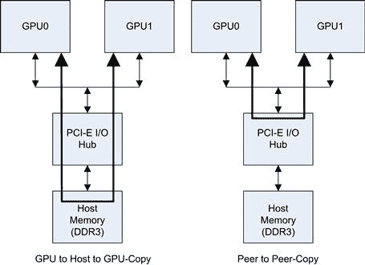

图 10.5 P2P 传输。

根据系统中 GPU 的数量，主机内存可能会成为传输的瓶颈，影响其自身的速度。在 PCI-E 2.0 链接中，最大传输速度接近 6 GB/s。使用 PCI-E 3.0（如 GTX680、GTX690、Tesla K10）时，实际带宽几乎翻倍，达到每个方向接近 12 GB/s。为了最大化带宽，通常会定义两个固定内存区域，并使用双缓冲方案，一个区域传输数据，另一个区域接收数据。特别是在较旧的处理器上，仅通过主机内存在 GPU 之间进行数据传输，就能迅速耗尽整个主机内存带宽。这将严重影响任何尝试使用 CPU 进行额外处理的操作，因为它将与 GPU 传输竞争主机内存带宽。

P2P 的概念是将数据保持在主机内存空间之外，直接在 GPU 之间进行传输。虽然这是一个非常有用的功能，但在主流的 Windows 7 系统中，P2P 的支持明显不足。因此，在本文本中我们尚未涉及此功能，这里将重点介绍，因为这项技术有很多应用。使用 P2P 功能的要求包括：

• 64 位操作系统，从而启用 UVA（统一虚拟地址），这是 P2P 可用的前提。

• 支持此功能的两个或更多计算 2.x 设备。

• 在同一 PCI-E I/O 集线器上的 GPU 设备。

• 适当的驱动程序级别支持。

在 Windows 7 下使用此功能需要 64 位操作系统并启用 TCC（Tesla 计算集群）驱动程序。由于 TCC 驱动程序仅在 Tesla 卡上激活，因此 Windows 7 上实际上并不支持主流消费级设备。因此，这应视为适用于集群、高性能计算（HPC）和其他计算密集型应用程序的功能。这不是你可以在消费级 PC 上使用的视频转码应用程序中利用的功能。

为了支持 P2P，首先应检查是否启用了 UVA：

```cpp
struct cudaDevice device_prop;
CUDA_CALL(cudaGetDeviceProperties(&device_prop));
if (device_prop.unifiedAddressing == 1) // If unified addressing is enabled
```

UVA 只会在 64 位操作系统或使用 TCC 驱动程序的 Windows 7 上启用。

接下来，您需要检查设备 A 是否可以与设备 B 通信。请注意，仅仅因为这个测试通过，并不意味着设备 B 可以与设备 A 通信。在启用 P2P 访问的特定方向时会消耗资源。可以使用以下代码来执行此测试：

```cpp
int peer_access_avail;
int src_device = 0;
int peer_device = 1;
CUDA_CALL(cudaDeviceCanAccessPeer( &peer_access_avail, src_device, peer_device));
if (peer_access_avail == 1) // If peer access from device 0 to device 1 is available
{
  int flags = 0;
  CUDA_CALL(cudaSetDevice(peer_device));
  CUDA_CALL(cudaEnablePeerAccess(peer_device, flags);
}
```

一旦启用了对等访问，内存可以按照对等访问的方向进行访问，无论是在设备内核中还是作为主机发起的内存复制。因此，设备 0 可以启用对设备 1 的对等访问，如前面的示例所示。然后，您可以在设备 1 上调用一个内核，传递一个指向设备 0 全局内存空间的指针。内核将像访问零拷贝设备指针访问主机内存一样解引用这个指针。每次通过该指针进行访问时，设备 1 将通过 PCI-E 总线从设备 0 发起数据获取。当然，与零拷贝内存使用一样，适用相同的注意事项，特别是您应该避免重新读取这些内存，并尽量实现合并访问模式以提高性能。

当然，您可以使用这些功能进行设备发起的内存复制。要从设备进行此操作，可以让设备内核通过设备指针获取数据，并将其简单地存储到本地设备的全局内存中。同样，您可以将数据推送或拉取到另一个设备。然而，如果您需要双向访问，您需要记得在两个方向上启用 P2P 访问。

第二种方法是显式的内存复制，这是我们必须从主机发起的。它有两种标准形式，同步版本和异步流式版本：

`cudaMemcpyPeer(dest_device_ptr, dst_device_num, src_device_ptr, src_device_num,num_bytes);`

和

```cpp
cudaMemcpyPeerAsync( dest_device_ptr, dst_device_num, src_device_ptr, src_device_num, num_bytes, stream );
```

最后，一旦我们完成操作，我们需要通过调用禁用 P2P 访问资源的配置。

```cpp
cudaDeviceDisablePeerAccess(device_num);
```

性能方面，SimpleP2P 应用报告了 2.4 GB/s 的传输速度，这非常接近此特定（PCI-E 2.0 x8）测试系统的峰值 3 GB/s。

SDK 中的 SimpleP2P 示例程序提供了一些简单的模板代码，演示如何在实践中实现这一点。它在两个 GPU 之间进行一系列 GPU 传输，然后计算传输速度。通过我们在此处介绍的背景，您应该能够阅读并跟随示例代码。

### asyncAPI 和 cudaOpenMP

`asyncAPI` SDK 示例提供了使用异步 API 的示例，但对于 CUDA 新手来说，其实并不简单易懂。我们已经在文本中介绍了流和异步操作。它们对于让多 GPU 设置与 CPU 一起工作非常重要。因此，我们将查看这个示例，了解它到底是如何实现的。

`asyncAPI`示例的基本前提是，它创建一个异步流，将内存复制到设备、一个内核，并最终将内存复制回主机。在此期间，它在 CPU 上运行一些代码，该代码简单地计数，而 GPU 正在运行异步内核。

`cudaOpenMP` 示例展示了如何将 OpenMP 与 CUDA 一起使用。它识别 CPU 线程的数量以及每个附加 CUDA 设备的数量和名称。然后，它尝试为每个 GPU 设备生成一个线程，并对不同设备进行工作共享。

我们将在这里提供一个类似的示例，融合这两个 SDK 示例，但将其简化一些，并且可能作为您自己工作的模板代码更加实用。

```cpp
#include <stdio.h>
#include <omp.h>
#include "cuda_helper.h"
#include "cuda.h"
__global__ void increment_kernel(int ∗ __restrict__ const data,
                                 const int inc_value,
                                 const int num_elem)
{
 const int idx = blockIdx.x ∗ blockDim.x + threadIdx.x;
 // Check array index does not overflow the array
```

`  if (idx < num_elem)`

```cpp
 {
  // Repeat N times - just to make the kernel take some time
  const int repeat = 512;
  for (int i=0; i < repeat; i++)
   data[idx] += inc_value;
 }
}
// Max number of devices on any single node is, usually at most, eight
#define MAX_NUM_DEVICES 8
__host__ int main(int argc, char ∗argv[])
{
 const int num_elem = 1024 ∗ 1024 ∗ 16;
 const int size_in_bytes = num_elem ∗ sizeof(int);
 const int increment_value = 1;
 const int loop_iteration_check = 1000000;
 const int shared_mem = 0;
 // Define the number of threads/blocks needed
 const int num_threads = 512;
 const int num_blocks = ((num_elem + (num_threads-1)) / num_threads);
 // One array element per CPU thread
 int host_counter[MAX_NUM_DEVICES];
 float delta_device_time[MAX_NUM_DEVICES];
 cudaDeviceProp device_prop[MAX_NUM_DEVICES];
 int num_devices;
 CUDA_CALL(cudaGetDeviceCount(&num_devices));
 printf("\nIdentified %d devices. Spawning %d threads to calculate %d MB using (%dx%d)", num_devices, num_devices, ((size_in_bytes/1024)/1024), num_blocks, num_threads );
 // Declare thread private, per thread variables
 int ∗ device_ptr[MAX_NUM_DEVICES];
 int ∗ host_ptr[MAX_NUM_DEVICES];
 cudaEvent_t start_event[MAX_NUM_DEVICES], stop_event[MAX_NUM_DEVICES];
 cudaStream_t async_stream[MAX_NUM_DEVICES];
 // Create all allocations outside of OpenMP in series
 for (int device_num=0; device_num < num_devices; device_num++)
 {
  // Set the device to a unique device per CPU thread
  CUDA_CALL(cudaSetDevice(device_num));
  // Get the current device properties
```

`  CUDA_CALL(cudaGetDeviceProperties(&device_prop[device_num], device_num));`

```cpp
  // Allocate the resources necessary
  CUDA_CALL(cudaMalloc((void ∗∗) &device_ptr[device_num], size_in_bytes));
  CUDA_CALL(cudaMallocHost((void ∗∗) &host_ptr[device_num], size_in_bytes));
  CUDA_CALL(cudaEventCreate(&start_event[device_num]));
  CUDA_CALL(cudaEventCreate(&stop_event[device_num]));
  CUDA_CALL(cudaStreamCreate(&async_stream[device_num]));
 }
 // Spawn one CPU thread for each device
#pragma omp parallel num_threads(num_devices)
 {
  // Variables declared within the OpenMP block are thread private and per thread
  // Variables outside OpenMP block exist once in memory and are shared between
  // threads.
  // Get our current thread number and use this as the device number
  const int device_num = omp_get_thread_num();
  // Set the device to a unique device per CPU thread
  CUDA_CALL(cudaSetDevice(device_num));
  // Push start timer, memset, kernel, copy back and stop timer into device queue
  CUDA_CALL(cudaEventRecord(start_event[device_num], async_stream[device_num]));
  // Copy the data to the device
  CUDA_CALL(cudaMemsetAsync(device_ptr[device_num], 0, size_in_bytes,
            async_stream[device_num]));
  // Invoke the kernel
  increment_kernel<<<num_blocks, num_threads, shared_mem, async_stream[device_num]>>>(device_ptr[device_num], increment_value, num_elem);
  // Copy data back from the device
  CUDA_CALL(cudaMemcpyAsync(host_ptr[device_num], device_ptr[device_num],
           size_in_bytes, cudaMemcpyDeviceToHost,
           async_stream[device_num]));
  // Record the end of the GPU work
  CUDA_CALL(cudaEventRecord(stop_event[device_num], async_stream[device_num]));
  // Device work has now been sent to the GPU, so do some CPU work
  // whilst we’re waiting for the device to complete its work queue
  // Reset host counter
  int host_counter_local = 0;
```

`  int complete = 0;`

```cpp
  // Do some work on the CPU until all the device kernels complete
  do
  {
   // Insert useful CPU work here
   host_counter_local++;
   // Check device completion status every loop_iteration_check iterations
   if ( (host_counter_local % loop_iteration_check) == 0 )
   {
    // Assume everything is now complete
    complete = 1;
    // Check if all GPU streams have completed. Continue to do more CPU
    // work if one of more devices have pending work.
    for ( int device_check_num=0; device_check_num < num_devices;
     device_check_num++)
   {
     if ( cudaEventQuery(stop_event[device_check_num]) == cudaErrorNotReady )
      complete = 0;
    }
   }
  } while( complete == 0 );
  // Write out final result
  host_counter[device_num] = host_counter_local;
  // Calculate elapsed GPU time
  CUDA_CALL(cudaEventElapsedTime(&delta_device_time[device_num],
            start_event[device_num],
            stop_event[device_num]));
 } // End parallel region
 // Now running as a single CPU thread again
 // Free allocated resources
 // Create all allocations outside of OpenMP in series
 for (int device_num=0; device_num < num_devices; device_num++)
 {
  // Set the device to a unique device per CPU thread
  CUDA_CALL(cudaSetDevice(device_num));
  CUDA_CALL(cudaStreamDestroy(async_stream[device_num]));
  CUDA_CALL(cudaEventDestroy(stop_event[device_num]));
  CUDA_CALL(cudaEventDestroy(start_event[device_num]));
```

`  CUDA_CALL(cudaFreeHost(host_ptr[device_num]));`

```cpp
  CUDA_CALL(cudaFree(device_ptr[device_num]));
  // Reset the device for later use
  CUDA_CALL(cudaDeviceReset());
 }
 // Print a summary of the results
 for (int device=0; device < num_devices; device++)
 {
  printf("\n\nKernel Time for device %s id:%d: %.2fms",
         device_prop[device].name, device, delta_device_time[device]);
  printf("\nCPU count for thread %d: %d", device, host_counter[device]);
 }
}
```

SDK 示例中有一些需要进一步讨论的点。首先，在`asyncAPI`示例中，使用了流 0，即默认流。不幸的是，许多情况下默认流会导致流之间的隐式同步。你几乎肯定会使用双缓冲或三重缓冲方法，这时这种隐式同步可能会让你吃亏。使用异步操作时，始终创建自己的流。

```cpp
cudaStream_t async_stream[MAX_NUM_DEVICES];
CUDA_CALL(cudaSetDevice(device_num));
CUDA_CALL(cudaStreamCreate(&async_stream[device_num]));
```

`asyncAPI`流示例中的第二点，您可能没有注意到的是，它获取元素数量*N*，并直接将其除以线程数来获取网格的块数。恰巧*N*是线程数的倍数，但如果不是呢？发生的情况是，数组中的最后几个元素不会被 GPU 内核处理。对于任何刚接触 CUDA 的人来说，这一点可能并不明显。如果您计划允许*N*不是线程数的倍数，请始终使用以下公式来生成块数：

```cpp
const int num_elem = 1024 ∗ 1024 ∗ 16;
const int num_threads = 512;
const int num_blocks = ((num_elem + (num_threads-1)) / num_threads);
```

在内核中，添加一个检查数组越界的代码：

```cpp
// Check array index does not overflow the array
if (idx < num_elem)
```

现在，这就增加了将`num_elem`传递给内核并在内核中进行检查的开销。如果您能*保证*始终使用线程数的倍数，那么您可以避免这段代码，继续使用更简单的`num_blocks = num_elem / num_threads`方法。大多数时候，作为程序员，我们可以说这是真的，因为我们通常控制数据块的大小。

现在如果我们看一下`cudaOpenMP`示例，多个 CPU 线程是如何启动的？它使用了`omp_set_num_threads`调用：

```cpp
omp_set_num_threads(num_gpus);
//omp_set_num_threads(2∗num_gpus);
#pragma omp parallel
{
}
```

这里有两种方法：为每个 GPU 设置一个线程，或者为每个 GPU 设置多个线程（图 10.6）。后一种方法在 GPU 数量远少于 CPU 核心数时更为有用。我们在示例程序中使用的这种 OpenMP 指令的简化形式通常更可靠：

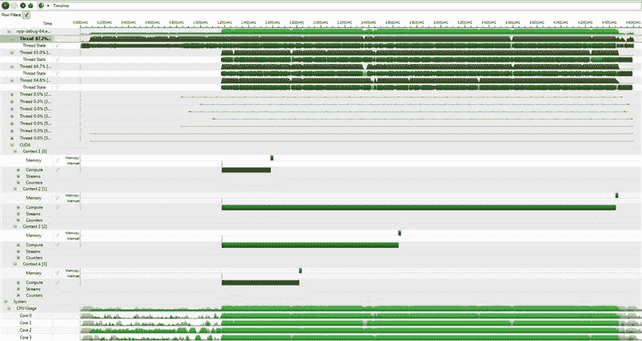

图 10.6 多 GPU 与 OpenMP。

```cpp
// Spawn one CPU thread for each device
#pragma omp parallel num_threads(num_devices)
{
}
```

使用这种方法，OpenMP 的配置情况、设置了哪些环境变量或没有设置都不重要，它会生成指定数量的线程。请注意，当前线程是用于执行工作的线程之一。

```cpp
Identified 4 devices. Spawning 4 threads to calculate 64 MB using (32768x512)
Kernel Time for device GeForce GTX 470 id:0: 427.74ms
CPU count for thread 0: 1239000000
Kernel Time for device GeForce 9800 GT id:1: 3300.55ms
CPU count for thread 1: 1180000000
Kernel Time for device GeForce GTX 285 id:2: 1693.63ms
CPU count for thread 2: 1229000000
Kernel Time for device GeForce GTX 460 id:3: 662.61ms
CPU count for thread 3: 1254000000
```

从程序输出中可以看出，通过使用不同的 GPU，线程完成的时间不同。从图 10.6 中可以看到有四个线程在运行，包括原始线程。如果在屏幕上查看，您会看到顶部有深绿色的条形，表示线程大部分时间在运行（约 95%），偶尔会有停顿，这些停顿会以浅绿色显示。下面是四个 GPU 任务，每个任务执行 memset、启动内核，然后将数据复制回主机。底部的条形显示了此时间段内 CPU 的使用情况。您可以看到 CPU 几乎整个时间都在忙碌。

随着四个 GPU 的完成，CPU 线程继续工作，直到所有 GPU 任务完成。当然，如果我们的 GPU 性能差异非常大，我们可以（并且在实际操作中会）为这些 GPU 分配更多的工作。然而，大多数 GPU 系统都会有相同的 GPU，因此我们不必担心重新分配工作，直到所有 GPU 完成。由于它们相同，在类似的任务下，它们会在大约相同的时间完成。

使用 OpenMP 时，我们需要解决的下一个问题是如何处理资源的分配和释放。给定设备上的内存分配和资源创建是一个耗时的过程。通常，线程之间需要对分配有共同的理解，因此需要共享数据结构。为了在线程之间共享公共数据结构，需要加锁，这反过来通常会导致串行化。当我们将资源分配/释放放置在 OpenMP 并行区域内时，正好会看到这种情况。因此，在 OpenMP 并行区域之前和之后进行分配/释放，可以实现该区域内最佳的 CPU 利用率。

与此相关的是调用 CUDA API，特别是 `cudaEventQuery` 调用，用于检查设备是否已完成。这样的调用绝不能被认为是低开销的。如果我们将 `loop_iteration_check` 常量的值从一百万更改为仅为 1，我们会看到 CPU 计数从 1,239,000,000 降低到仅 16,136。在这种情况下，每个线程每次循环迭代都会询问设备的状态。因此，CPU 花更多时间在驱动程序中，而不是做其他任何事情。不幸的是，这正是 `asyncAPI` 编码的方式，也是我们在此强调它的原因之一。在循环中调用任何 API 时要谨慎。它会消耗时间，所以不要让 CPU 每个周期都轮询设备。在设备查询之间，做一些有用的事情。

### 对齐类型

对齐类型示例旨在展示使用 _`_align__(n)`_ 指令的效果。例如：

```cpp
typedef struct __align__(8)
{
  unsigned int l, a;
} LA32;
```

这里的`8`部分是指任何元素的起始地址应对齐的字节数。示例在相关文本中解释了，`align`指令允许编译器在每个线程中使用比平时更大的读取方式。在前面的`LA32`案例中，编译器可以使用 64 位读取，而不是两次 32 位读取。正如我们在第九章中看到的，较少的内存事务意味着更高的带宽。我们在那里的示例中使用了向量类型，它们也在定义中使用了`align`指令。

我们在早期示例中看到的一点是，要实现类似峰值带宽的性能，必须生成足够多的内存事务。遗憾的是，这个 SDK 示例并未考虑到这一点。它使用了 64 个 256 线程的块，总共 32 个 warp。要完全加载一个计算 2.x 设备，我们需要 48 个 warp（Kepler 需要 64 个），因此这个示例使用的块数太少。因此，我们将块数扩展到 1024，并选择了 192 个线程的设置，这个设置在整个计算级别上都表现良好。

我们还将基本类型输出添加到了测试中，以便查看基准数据。此外，每次运行都是专门编译的，生成该设备计算级别的代码。请注意，尽管进行了这些更改，这个 SDK 示例仍然只能达到峰值内存传输能力的约 50%。然而，实际更重要的是相对内存带宽这一数据。

最初，我们可以看到来自不同设备的基准数据，这些数据显示在表 10.3 和图 10.7 中。我们可以利用这个基准性能表来评估对齐类型和非对齐类型的性能表现。

表 10.3 各设备的基准性能表

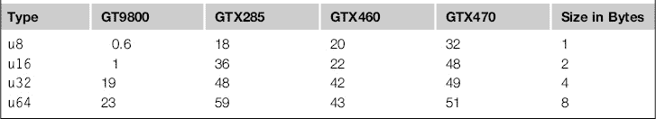

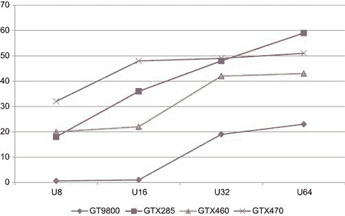

图 10.7 不同设备的基准性能图（MB/s 与传输大小的关系）。

正如你从图 10.7 中看到的，它们都在`u32`，即四字节时达到了最大合并内存大小。这相当于 32 个线程，每个线程 4 字节，总共 128 字节。在 Fermi 架构中，这是单个缓存行的大小，因此在计算 2.x 设备上，我们在这一点上会平稳直线。

GTX285 设备（计算 1.3）执行的是 16 线程的合并内存读取，而不是像计算 2.x 设备那样的 32 线程读取。因此，它从连续读取中受益，并能够利用每个线程 64 位（8 字节）读取的优势。此外，GTX285 拥有比 Fermi 世代卡片多一倍的 SM 单元，且内存总线宽度比 GTX470 更大，因此在这个特定内核中，它能够超越 GTX470 的性能。

在 9800 GT（计算 1.1）中，我们看到与 GTX285 相似的模式。然而，主要的区别在于其物理内存带宽只有 GTX285 的一半。因此，我们看到每个线程在 32 位到 64 位访问之间的性能提升较小，远低于 GTX285 的提升。参见表 10.4。从运行示例中，我们可以看到对齐访问与非对齐访问之间的百分比变化。在表 10.5 中，100%表示没有变化。

表 10.4 各种设备的对齐/非对齐带宽（MB/s）

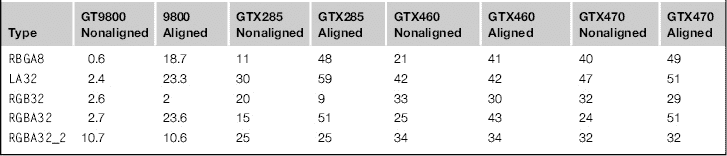

表 10.5 对比对齐与非对齐访问模式的百分比变化

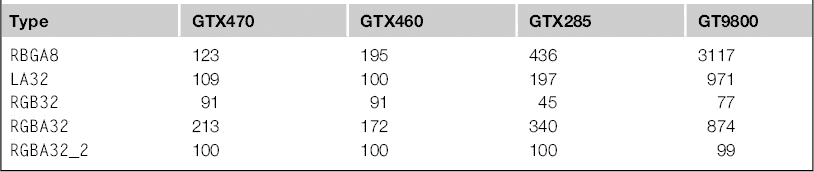

因此，我们可以看到，当我们回溯到计算层次时，特别是对于早期的计算层次，对齐访问的性能提升显著。在最好的情况下，向数据结构添加此类指令可以实现 31 倍的速度提升。即使是移动到现代 GPU，我们也能看到 2 倍的性能提升。显然，添加此类指令在除非导致更多内存从主内存转移到 GPU 的情况下，在所有情况下都非常有益。

注意`RGB32`的例子。实际上，这是一个 96 位结构（三个`u32`），有效地相当于`float3`类型的`int3`。添加`align`指令会在结构体的末尾插入 4 字节的填充。尽管这样可以实现合并访问，但从内存系统传输的数据中有 25%被丢弃。在非对齐的情况下，Fermi 设备从前一个缓存行中的过度提取节省了 33%的后续内存获取。

从这个例子中我们可以得出结论，如果你正在使用结构体，需要考虑这一点的合并影响，并至少使用`align`指令。一个更好的完全解决方案是创建数组结构体，而不是结构体数组。例如，使用单独的红色、绿色和蓝色（RGB）色彩平面，而不是交错的 RGB 值。

## 基于指令的编程

本书主要集中于直接编写 CUDA。如果你喜欢编程，并且可能像我一样有计算机科学（CS）背景，这很好。然而，今天许多编写 CUDA 的程序员并不属于这一类。许多人最关心的是他们自己的问题空间，而不是 CUDA 或从计算机科学角度出发的优雅解决方案。

OpenMP 的一个巨大成功之处在于它相对容易学习和掌握。它通过在 C 源代码中添加指令来装饰代码，告诉编译器关于代码并行性质的各种信息。因此，它要求程序员显式地识别代码中的并行性。编译器则负责处理利用并行性的较为复杂的任务。总体而言，它做得相当好。

因此，使 GPU 编程更简单的显而易见的解决方案是将 OpenMP 模型扩展到 GPU。然而，不幸的是，已经出现了两个标准或将要出现：OpenMP4ACC 和 OpenACC 标准。我们这里将专注于 OpenACC 标准，因为这是 NVIDIA 明确支持的标准。通常，支持者的规模和程序员的接受程度将在很大程度上决定给定软件编程倡议的成功或失败。大多数标准，不论是由谁开发的，通常涵盖相同的领域，因此在大多数情况下，学习一个标准会让你更容易学习另一个标准。

如果你有兴趣使用指令编写 GPU 代码，你可能已经对用于 CPU 的 OpenMP 指令有了相当的了解。我们发现像 OpenACC 这样的标准与众不同之处在于，程序员还必须处理数据的位置。在一个有多个物理插槽的 OpenMP 系统中，我们称之为 NUMA（非一致性内存访问）系统。

正如我们从图 10.8 中看到的，具有多个 CPU 的系统中的内存是直接连接到特定 CPU 的。因此，驻留在 CPU[0]上的进程访问驻留在 CPU[1]上的内存的时间要远长于访问本地内存（CPU[0]上的内存）。假设我们有八个进程在两个 CPU 插槽上运行，每个 CPU 有四个核心。要执行需要多对多通信的数据交换，意味着我们受限于最慢通信链路的吞吐量。这将是处理器之间的 QPI/超传输链路，通过该链路，内存流量必须经过另一处理器的内存总线。OpenMP 模型简单地忽略了这一影响，并缺少加速器解决方案所需的许多数据概念。

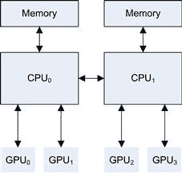

图 10.8 多 GPU 数据通道。

### OpenACC

OpenACC 是朝着指令式编程迈进的一步，并且在很大程度上继承了 OpenMP 的理念，后者在独立的单机系统中取得了巨大的成功。

OpenACC 的目标群体是：

• 独立的基于循环的并行性。

• 尚未接触过 CUDA 或觉得 CUDA 太复杂的程序员。

• 不愿意学习 CUDA 并且愿意将特定目标架构的细节抽象到编译器中的程序员。

• 希望在 GPU 上快速原型化现有串行应用程序的程序员。

OpenACC 和 OpenMP 一样，试图抽象硬件，让程序员编写标准的串行代码，然后由编译器将其转换为在加速器上运行的代码。与 OpenMP 类似，它需要在循环周围添加一系列的 pragma 语句，指示编译器将特定的循环并行执行。

优势：

• 看起来与 OpenMP 相似，因此对于曾经使用过 OpenMP 的人来说，学习起来非常容易。

• 现有的串行源代码保持不变，仅通过指令进行装饰。

• 针对 CPU 和 GPU 加速版本的单一源代码集。

• 与加速器供应商无关。与 OpenCL 类似，有潜力支持包括基于 CPU 的 AVX 加速在内的多种硬件平台。

• 负责处理许多“细节”，例如将用户指定为缓存的数据从共享内存中移动进出。

• 供应商引用的研究表明，非 CUDA 程序员的学习曲线较容易。

• 除了 C 之外，还支持 Fortran。允许许多现有的 Fortran 程序在无需大规模重写的情况下受益于加速。

缺点：

• 目前不支持 Visual Studio，因此实际上是一个仅限 Linux 的解决方案。

• 目前由 PGI、CAPS 和 Cray 支持的商业产品，因此不属于免费的 CUDA SDK 产品套件。

• 要在非平凡的程序中实现与 OpenMP 相当或更好的性能，用户还必须额外指定各种简单的数据子句，以最小化基于 PCI-E 的传输。

• 针对单 CPU / 单 GPU 解决方案。添加额外 GPU 时不自动扩展。使用多个 GPU 需要使用多个 CPU 线程/进程。这在未来可能会有所改变。

• CUDA 工具包或硬件的新特性可能需要编译器供应商的显式支持。目前，OpenACC 编译器支持可能需要几个月的时间才能切换到 CUDA SDK 发布版本，或者支持新的硬件发布。

OpenACC 与 OpenMP 的主要区别在于，OpenMP 没有关于各种内存级别或内存位置的概念，因为这些概念在传统的 CPU 编程模型中并不存在。在 OpenMP 中，数据要么是线程私有的，要么是全局的（共享的）。

相比之下，GPU 系统要复杂得多。你有：

• 主机内存

• GPU 全局内存

• GPU 常量内存

• GPU 块私有内存（CUDA 中的共享内存）

• GPU 线程私有内存（CUDA 中的本地内存）

OpenACC 模型为了简化，假设数据驻留在主机上，并在并行区域开始时传输到加速器内存空间，在并行区域结束时传输回主机。因此，每个并行区域默认情况下都受到这些通过 PCI-E 总线进行的隐式内存复制的限制。

尽管这是一种简化的思维方式，从概念上讲，它是一种确保正确性的方法，可能会以牺牲性能为代价。如果你只有一个计算任务并且不会重复使用数据，那么这在 CUDA 中实际上就是你要做的。如果你计划对数据进行多次转换，那么你需要通过向指令中添加数据限定符，明确指定哪些数据应该保留在设备上。

那么，让我们来看一个简单的程序，了解它是如何转换为 OpenMP/OpenACC 的。如果我们以经典的归约为例，通常会看到以下内容：

```cpp
long int reduce_serial(const int ∗ __restrict__ const host_ptr,
                       const int num_elements)
{
 long int sum = 0;
 for (int i=0; i < num_elements; i++)
      sum += host_ptr[i];
 return sum;
}
long int reduce_openmp(const int ∗ __restrict__ const host_ptr,
                       const int num_elements)
{
 long int sum = 0;
#pragma omp parallel for reduction(+:sum)
 for (int i=0; i < num_elements; i++)
 {
  sum += host_ptr[i];
 }
 return sum;
}
long int reduce_openacc(const int ∗ __restrict__ const host_ptr,
                        const int num_elements)
{
 long int sum = 0;
#pragma acc kernels
 for (int i=0; i < num_elements; i++)
 {
  sum += host_ptr[i];
 }
 return sum;
```

`}`

如你所见，我们所做的只是用 OpenACC 指令替换 OpenMP 指令。然后我们使用厂商提供的 OpenACC 编译器进行编译。这可能生成从高级 CUDA 代码到原始 PTX 代码的任何内容。然后，它通常会调用 NVCC 编译器来生成目标 GPU 代码。一些厂商支持除了 NVIDIA GPU 之外的其他目标。

在编译阶段，大多数厂商的编译器会提供关于它们如何将串行代码转换为设备代码的统计信息。然而，这有点类似于 NCC 中的`-v`选项，因为你需要能够理解编译器告诉你的内容。这里我们看一个 PGI 编译器输出的例子。

```cpp
Accelerator kernel generated
60, #pragma acc loop gang, vector /∗ blockIdx.x threadIdx.x ∗/
CC 1.3 : 21 registers; 1024 shared, 20 constant, 0 local memory bytes; 100% occupancy
CC 2.0 : 23 registers; 1048 shared, 40 constant, 0 local memory bytes; 100% occupancy
```

要理解这个输出，你需要理解 OpenACC 术语如何映射到 CUDA 术语（表 10.6）。

表 10.6 OpenACC 和 CUDA 术语对照

| OpenACC | CUDA |
| --- | --- |
| 并行单元 | 块 |
| 工作者 | 执行单元 |
| 向量 | 线程 |

第一行说明内核占用了 60 个并行单元（在 CUDA 术语中为“块”）。接着它说明为“CC 1.3 和 CC 2.0”生成了输出，即分别为计算能力 1.3 和 2.0 的设备。它还告诉你使用了多少寄存器、每个块使用了多少共享内存、每个块使用了多少字节的常量内存，以及是否有寄存器溢出到局部内存。

最后，它会计算出理想的线程数（OpenACC 称之为向量），以便根据内核使用的寄存器和共享内存，尽可能实现接近 100%的占用率。然而，它可能并不总是为给定的内核/数据模式选择最佳值。指定此项允许我们覆盖或部分覆盖这些选择。

它会根据你的数据决定最佳的启动参数（线程数、块数、网格数等）。它还会自动尝试将数据分配到常量内存和/或全局内存中。如果你愿意，可以覆盖这些选择。

要覆盖主机上全局数据镜像的默认行为（自动后台更新命令），需要指定数据如何管理。可以通过以下方式进行：

```cpp
#pragma acc data <directives>
```

其中，`<directives>`可以是以下几种指令中的一种，此外还有一些更复杂的指令在此未展示：

**copy** (data1, data2, …)—通过在内核开始时将数据复制到 GPU 并在结束时从 GPU 复制回 CPU，保持与 CPU 的相同版本（默认行为）。

**copyin** (data1, data2, …)—仅将数据复制到 GPU，不再复制回 CPU，即丢弃 GPU 上的数据。对于 GPU 将处理的只读数据非常有用。

**copyout** (data1, data2, …)—仅将数据从 GPU 复制回 CPU。对于声明在 GPU 上的输出数据非常有用。

**create** (data1, data2, …)—在 GPU 上分配临时存储，但不进行任何方向上的复制操作。

**present** (data1, data2, …)—数据已存在于 GPU 上，因此不需要复制或重新分配。

请注意，OpenACC 模型要求使用 C99 标准，特别是 C 语言中的`__restrict__`关键字，用于指定所使用的指针彼此之间没有别名。如果没有这样做，可能会导致代码无法向量化。

你可以通过使用`PGI_ACC_TIME=1`（厂商特定）选项来判断添加数据指令是否有帮助（几乎总是有效）。在 PGI 编译器的情况下，这将启用性能分析。它会告诉你内核被调用的频率、内核的块维度、执行所花费的时间，以及数据传输所耗费的时间。通常，数据传输部分是最关键的，而数据指令可以提供帮助。你还可以使用 Linux 中可用的标准性能分析工具，例如 Visual Profiler，来查看 OpenACC 编译器的实际操作。通过这样做，你可能会发现一些原本没有注意到的问题。

通过查看所选择的块大小，你也可以对其进行一定的优化。例如，你可以指定比数据元素数量更少的块和线程。默认情况下，OpenACC 编译器通常会为每个元素选择一个线程，尽管标准中并没有要求必须这么做。因此，如果你希望每个线程处理四个元素——这是我们发现效果较好的做法——你可以通过指定更少的块和线程来实现：

```cpp
#define NUM_ELEM 32768
#pragma acc kernels loop gang(64), vector(128)
for( int i = 0; i < NUM_ELEM; i++ )
{
 x[i] += y[i];
}
```

在这里，我们指定循环应使用 64 个块（组），每个块包含 128 个线程（向量）。因此，我们在设备上有 8192 个活跃线程。假设使用的是 16 个 SM 的设备，例如 GTX580，这样每个 SM 上会有四个块，每个块 128 个线程。这等同于每个 SM 上有 16 个 warp，这对 GTX580 来说占用过少，不能实现理想的占用率。为了解决这个问题，我们需要增加块（组）或线程（向量）的数量。

根据具体的算法，你可能希望每个线程处理多个元素，而不是增加块或线程的数量。只要编译器知道元素的数量，就像在前面的示例中一样，它将处理每个线程多个元素，在这种情况下是四个。

同样需要记住，和常规的 CUDA 一样，线程实际上是作为 warp 运行的，每个 warp 由 32 个线程组成。分配 33 个线程实际上会在硬件上分配 64 个线程，其中 31 个线程什么也不做，仅仅消耗设备上的空间资源。始终以 32 为单位分配线程块（在 OpenACC 中是向量）。

同样，和 CUDA 一样，如果你指定了组或向量（块或线程），虽然你不必这样做，但仍然会遵循通常的内核启动规则。因此，块可以支持的线程数量是有限制的，这个限制会根据你所针对的硬件的计算能力级别而变化。通常，你会发现，64、128、192 和 256 的值对于计算能力为 1.x 的设备来说效果较好；而 128、192、256、384 和 512 的值适用于计算能力为 2.x 的设备。对于计算能力为 3.x 的平台，256 通常是最合适的值。

然而，在考虑添加任何修饰符时，请考虑未来硬件可能带来的影响，以及这可能如何限制对其他加速器目标的使用。通过不指定任何修饰符，你让编译器选择它认为最合适的值。当新的 GPU 出现，拥有更多的每块线程和每个 SM 的块，且一旦厂商更新编译器以支持这一变化，一切就能顺利运行。如果你确实指定了这些参数，那么应该指定当前最大值的某个倍数，以便你的代码在未来的设备上能够运行，而不会耗尽块数。

默认情况下，OpenACC 模型使用同步内核调用。也就是说，主机处理器会等待 GPU 完成计算，只有当 GPU 内核调用返回时，才会继续执行。这类似于在 C 语言中进行函数调用，而不是创建一个工作线程然后稍后合并。

你现在应该已经意识到，尽管这种方法适合在初期开发应用时使用，但一旦应用程序运行良好，就应该替换为异步模型。你的机器可能配备了一个性能良好的多核 CPU，你可以在 GPU 计算某些内容时，充分利用 CPU。应该优先分配给 CPU 的任务是那些与内存的加载与存储操作相比，计算量较少的操作。

我们看到归约操作表现更好，或者至少和 GPU 一样快的原因之一，是每次内存读写操作中所完成的工作量。要在 GPU 上计算数据，我们需要么在 GPU 上生成数据，要么通过 PCI-E 总线将数据发送过去。如果你仅仅为了执行一个简单的操作（如加法）而通过总线传输两个数据项，那就放弃它，直接在 CPU 上做吧。在这种情况下，PCI-E 传输的成本远大于任何其他因素。最适合 GPU 的任务是那些计算密集型的领域，或者是 GPU 的额外内存带宽可以发挥作用的地方。

因此，OpenACC 提供了`async`子句，用于内核和数据，使它们能够与主机异步运行，并执行与主机的异步传输。

```cpp
#pragma acc kernels loop async
for (i=0; i< num_elem; i++)
{
…
}
```

异步传输需要使用固定内存，即不能交换到磁盘的内存。你不需要像在 CUDA 中那样显式关注这一点，在 OpenACC 中，只需要指定`async`子句，OpenACC 编译器就会在幕后为传输使用固定内存。当然，使用异步操作时需要记住的一件事是，在异步操作完成之前，你不能更改正在传输或由内核操作的数据。

一旦人们掌握了异步通信，并在单核/GPU 对上达到了最佳性能，显而易见的问题是：我能通过使用多个 GPU 来加速我的应用吗？答案当然是肯定的，而且如果你能保持在单个节点内，通常会看到接近线性的扩展效果。

OpenACC 标准仅支持在单个节点上“每个 GPU 一个 CPU 线程”的多 GPU 视图。如果你打算在 CPU 上执行一些工作，这样的方式是非常合理的，因为它可以让你充分利用多核 CPU 的潜力。因此，在 OpenMP 中，你只需使用 OpenMP 指令启动若干线程。

```cpp
#pragma omp parallel num_thread(4)
```

假设你有一个四核 CPU 和四张 GPU 卡连接，那么你需要指定给 OpenACC 当前线程使用特定的 GPU。

```cpp
#pragma omp parallel num_thread(4)
{
const int cpu_thread_id = omp_get_thread_num();
acc_set_device_num( cpu_thread_id, acc_device_nvidia );
}
```

如果系统中只有两张 GPU，那么你可能更适合为 OpenMP 指定两个线程。如果你希望利用四个线程，但只有两个线程用于 GPU 使用，你可以这样做：

```cpp
const int num_gpus = acc_get_num_devices( acc_device_nvidia );
#pragma omp parallel num_thread(4)
{
const int cpu_thread_id = omp_get_thread_num();
if (cpu_thread_id < num_gpus)
{
// Do CPU and GPU work
acc_set_device_num( cpu_thread_id, acc_device_nvidia );
}
else
{
    // Do CPU only work
}
}
```

我们可以在 MPI 中使用相同的方法，通过以下方式：

```cpp
const int num_gpus = acc_get_num_devices( acc_device_nvidia );
// Get my MPI virtual process id (rank)
int my_rank;
MPI_Comm_rank( MPI_COMM_WORLD, &my_rank );
if ( my_rank < num_gpus)
{
// Do CPU and GPU work e.g. workers
acc_set_device_num( my_rank, acc_device_nvidia );
}
else
{
  // Do CPU only work, e.g. master
```

`}`

这里需要注意的一个问题是，`acc_set_device_num` API 调用仅在每个主机线程中执行一次。这与 CUDA 4.x SDK 之前 `cudaSetDevice` 调用的方式非常相似。你不能从单个主机线程选择一个上下文并因此控制多个 GPU。唯一支持的模型是每个 GPU 上下文对应一个主机线程的模型。

请注意，对于高负载的系统，理想的配置是每个 CPU 核心对应一个 GPU 核心的 1:1 比例。然而，将多个 GPU 分配给单个 CPU 核心也可能有用，因为 GPU 程序通常不会真正饱和 GPU。因此，可能会出现 GPU 未充分利用的情况，通常出现在同步点或内核调用之间。在有主/工作者安排的情况下（通常出现在 MPI 中），将一个非 GPU 的 CPU 核心专门作为主线程可能是有益的。

我在这里要提到的一个方面是内存访问模式。OpenACC，当在一个能够进行全局内存合并的加速器上实现时，将会像 CUDA 程序一样，受到糟糕内存布局的严重影响。它没有自动转置。你需要考虑你的内存布局，并创建一个适合 GPU 的最优布局（数据应按 32 个元素的列排列，而不是按顺序的行排列）。

总体来说，OpenACC 代表了 GPU 编程领域的一项非常有趣的发展，并且可能会将 GPU 编程领域引入许多非 GPU 编程人员。许多人会进而学习 CUDA，因为完全可以将 OpenACC 和 CUDA 混合使用。因此，你可以从 OpenACC 开始，如果你发现某些特定区域需要更多控制时，再切换到 CUDA，同时保持应用程序的大部分不变。

## 编写你自己的内核

本章中我们介绍了多种选择，从高层次指定并让编译器完成繁重工作，到使用那些比你更擅长利用硬件的库。你永远不可能，也许实际上不应该尝试在所有领域都做到最好。像编译器指令和库这样的工具，能让你借助他人的努力来实现你的目标。你的知识主要存在于你自己感兴趣的领域。

作为一名专业开发人员，甚至作为一名学生，你应该意识到你开发解决方案所花费的时间。开发最高效的并行快速排序可能在技术上具有挑战性，但很可能已经有某个聪明的计算机科学毕业生写过相关论文。如果你在招聘，那么显而易见的做法是将这个人纳入团队。购买知识，无论是通过人才还是软件，都能让你在竞争中获得巨大的领先优势。

选择那些涵盖你不擅长领域的库也非常有意义。例如，如果你正在开发一个图像模糊算法，加载/保存磁盘上的图像并不是你真正关注的内容。市面上有很多开源或商业库可以涵盖你开发中的这一部分内容。

使用库时，常见的一个问题是内存分配。大多数基于 CPU 的解决方案，如果它们分配内存，通常不会分配固定内存。因此，一个返回已加载图像指针的图像库，在你将图像数据传输到 GPU 时会导致应用程序的性能下降。因此，选择那些允许用户控制内存管理，或者是 GPU 感知并支持固定内存的库。

使用指令和库方法时，我们遇到的下一个问题是，它们通常不支持多 GPU，除非特别编写为支持多 GPU。因为通常你可以在工作站中安装最多四张 GPU 卡，所以这种方法有点像在标准四核 CPU 中只使用一个核心。支持多 GPU 配置的编程并不简单，但也不是无法实现的难题。我们在 CudaDeveloper 内部使用的库支持多 GPU 设置。它使得数据处理变得更加复杂，并需要更多的思考，但绝对是可以实现的。

如何判断你需要自己编写多少代码，通常是一个性能问题。使用指令时，你需要在程序开发速度和一定的性能之间做出权衡。与此相比，库可能会带来显著的加速，同时减少开发工作量，但也可能牺牲灵活性并带来许可问题。许多库在商业使用上有一定的限制，这反映出，如果你打算通过使用库来避免自己开发的成本，那么你应该准备好为这种特权付费。对于学术用途，通常只需简单地承认贡献即可。

因此，你可能选择在 CUDA 中开发自己的内核的原因有很多。这篇文章很好地揭示了使用 CUDA 开发内核的相关问题。基本原则（合并内存访问、充分利用硬件、避免资源争用、理解硬件限制、数据局部性）适用于你自己编写内核，还是将内核抽象成别人解决的问题。

本节中我们已经介绍了一些 NVIDIA 提供的库。如果你所从事的领域涵盖了这些库，为什么不选择使用这些库呢？它们是由制造商开发的，能够在他们的硬件上运行得很好。它们被设计为更复杂算法的基本构建模块。NVIDIA 的许可条款非常慷慨，因为他们希望人们使用这些库并构建 CUDA 应用程序。考虑到 CUDA 的更广泛应用意味着更多 GPU 的销售，这并不令人惊讶，当然，越是精通 CUDA，你的知识也就越有价值。

问题其实在于，这样做能否带来足够的性能水平？大多数人使用高级语言编程，因为它比汇编语言更具生产力。优秀的程序员通常会非常熟悉 C 语言和汇编语言。他们知道何时应该使用 C 语言以提高生产力，也知道在某些情况下需要用汇编语言手动编写少量函数。使用库/指令的问题在本质上是类似的。你可以自己编写所有代码，但除非必须，为什么要让自己的生活变得这么艰难呢？

在为 GPU 开发应用程序时，一个好的方法是首先在 CPU 端实现一个原型。考虑如何使 CPU 版本支持多核，并思考这是否会对应用程序有所帮助。CPU/GPU 之间的工作平衡如何？如果需要线程，如何在 CPU 端创建线程？然而，至少在初期，还是坚持使用单个 CPU 线程和单个 GPU，但从一开始就要考虑你最终希望达到的目标。

现在考虑主机/设备之间的传输。传输-计算-传输模型通常会（根据比率的不同）未充分利用 GPU。根据你所支持的硬件，某种程度上我们可以重叠传输和计算。

接下来思考 GPU 内存层次结构。你将如何在 GPU 上利用哪些局部性（寄存器、共享内存、缓存、常量、纹理）？你需要为这些不同类型的数据存储设计什么样的数据布局？

现在考虑内核设计。将其分解为线程和块在跨线程/跨块通信和资源使用方面有着重要影响。你可能会遇到哪些序列化或竞争问题？

一旦你有了一个可用的 CPU/GPU 应用程序，进行性能分析并使其尽可能高效地运行。在这一阶段，保持对正确性非常关注，最好通过一些前后对比的自动化测试来确保。

这就引出了内核实现效率的问题，以及你需要考虑 CUDA/库/指令选择的问题。根据你计划如何使用 GPU，你在此做出的选择会如何影响你的能力？你选择使用我们的 CUDA/库/指令是在积极还是消极地影响性能？影响的百分比是多少？

以共享内存为例。OpenACC 有一个`cache`限定符，指示编译器将数据放入并保存在共享内存中，这是一个它可能会忽略或根据编译器供应商的不同而使用的资源。库通常不会直接暴露共享内存，但内部通常会非常高效地使用它，并且通常会记录这一点。较新的硬件可能有不同的实现。例如，Kepler 可以将共享内存配置为 32 位或 64 位宽，这意味着许多金融和其他应用程序可能会从这种优化中受益匪浅。

你能利用这些显著的优化吗？如果你依赖指令供应商或库开发者来实现这一点，他们会提供什么样的支持，可能需要多长时间？如果这个库是由一个学生作为其论文工作的一部分编写的，除非你或其他人愿意维护它，或者你支付某人来维护，否则它将不会更新。如果你需要的功能是指令供应商认为没有广泛需求的，那么他们不太可能为你的应用开发这个功能。

当你有一个高效的单 CPU/单 GPU 实现时，根据你的工作负载，将其移到多核/多 GPU 解决方案中。对于 GPU 主导的工作流，CPU 未被充分利用时，简单的单 CPU 核心控制和全 GPU 异步模型就能很好地工作。若 CPU 核心也被加载，使用多个线程，每个线程一个 GPU 会如何帮助？对于 CPU 负载未充分利用的情况，多核 CPU 是否能做一些有用的工作？最佳设计是最有效地利用你现有的资源来解决给定问题。

转向多线程/多 GPU 方法可能是一个无痛或非常痛苦的过程。你的 GPU 全局内存数据现在被拆分到多个 GPU 的内存空间中。现在需要什么样的 GPU 间通信？如果支持 P2P 模型，这通常是进行此类通信的最佳方法。另一种选择是由主机来协调或传输数据。让单个 CPU 协调*N*个 GPU 可能比让多个 CPU 线程协调这些 GPU 更简单。

你的指令或库对多 GPU 方法的支持如何？它们是线程安全的吗？还是它们保持一个内部状态，假设只有一个实例或 CPU 线程？它们对交换数据和并发操作的支持如何？你是否被迫按顺序发送或接收每个 GPU 的数据，还是可以执行*N*个同时传输？

选择工具或库时，考虑它们的成熟度以及它们的编写目的。当代码出错时，你如何调试它，因为错误是不可避免的？你是自己解决问题，还是有提供支持来修复 bug、功能请求等？它们是什么时候编写的，在哪种 GPU 上运行最佳？它们是否针对不同的 GPU 世代进行了优化，或者是否考虑了这些差异？

通过提前思考设计，并意识到你希望最终实现的目标，你可以在一开始就决定需要哪些软件/工具。你也许可以通过某种方法原型化一个解决方案，但最终可能还是需要使用 CUDA 来达到你期望的性能和效率。软件开发中没有神奇的“灵丹妙药”。你必须思考设计，规划如何实现它，并理解某些方法能够带你多远。

## 结论

在本章中，我们已经看了多种针对 GPU 开发的不同方法。你选择的方案很大程度上取决于你的背景，以及你目前对 CUDA 的熟悉程度和经验。我特别鼓励你查看 NVIDIA 提供的库，因为它们覆盖了许多常见问题，且涵盖面非常广。

我们已经看了 SDK 中的一些非特定领域的例子，特别是因为每个人都可以通过这些例子获益。SDK 中还有许多特定领域的例子。我鼓励你去探索这些例子，因为在现在对 CUDA 有了较好的理解后，你将能从这些例子中获得更多的启发。

我希望你已经从这一章中看出，在 CUDA 中自己编写所有内容并不是*唯一*的选择。通过使用库，可以显著提高生产力。指令还允许更高层次的编程，许多人可能更倾向于这种方式，而不是更低级的 CUDA 方法。人们根据各种原因做出不同的选择。了解对你来说关键的标准是什么，并据此选择。
