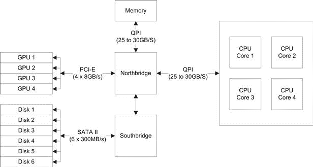

# 第十一章

# 设计基于 GPU 的系统

## 引言

服务器环境通常是大型的、专门空调的房间，通常隔音，以减少它们产生的噪音。它们消耗数百千瓦到数兆瓦的电力。通常，计算机按 1U、2U 或 4U 节点排列，并插入一个大型机架单元。这些机架通常使用高速互联（如 InfiniBand）互连，如图 11.1 所示。

图 11.1 典型的高性能计算（HPC）设置。

每个节点都通过高速交换机与给定服务器中的其他节点连接。这可以是简单的千兆以太网。大多数主板配备两个千兆以太网端口，每个节点可以有一个内部和一个外部连接。所有外部连接都连接到一个公共交换机，交换机本身连接到如 InfiniBand 这样的高速骨干网络。

这种布局有一个非常有趣的特性：在服务器机架内，一个节点与另一个节点之间的通信速度可能远远快于与其他机架中的节点通信。这种布局导致了非一致性内存访问（NUMA）架构。作为程序员，你需要处理这种转变。你可以选择忽略这个问题，但这会导致性能差。你需要考虑数据存放的位置以及节点间需要共享的数据。

如果你观察一个多 GPU 系统，你会发现它实际上与图 11.1 中展示的单一服务器机箱非常相似。不同之处在于，节点之间不是通过千兆以太网连接，而是每个节点都是一块 GPU 卡，并通过中央 PCI-E 总线连接。每组 GPU 卡构成一个更强大的节点，通过高速链路与其他类似节点连接，如图 11.2 所示。

图 11.2 GPU 高性能计算（HPC）设置。

注意图中的单个节点内共有七个 GPU。实际上，这只有在使用专业机架或液冷 GPU 系统时才可能实现。我们在 CudaDeveloper 构建的一个示例如图 11.3 所示。

图 11.3 展示了在 CudaDeveloper 构建的 3x GTX290（6 个 GPU）液冷机。

大多数 GPU 卡都是双插槽卡，除了部分较旧的 G80 系列系统。大多数主板最多只支持四个 PCI-E 插槽，这意味着对于任何空气冷却系统，如果是桌面形式的，你每个节点只能使用四个 GPU。鉴于每张 Kepler 系列卡的处理能力大约是 3 TeraFlops，这就意味着在桌面上你能达到 12 TeraFlops，而不是在远程服务器机房。

目前限制高性能计算使用的主要问题之一是功率和热量。随着时钟频率的提高，产生的热量也会增加。热量上升时，相同时钟频率下消耗的功率也会增加。对于 Fermi 设备来说，热封装极限在约 212°F（100°C）时就会被超越。如果系统中有两个以上的 GPU 并排放置，且空气流通不良，温度很容易迅速接近这个阈值。

将手放在现代 GPU 的排气口后面，感觉就像将手靠近吹风机一样。将这个情况重复四次，很快大多数小型办公室会发现他们的 TeraFlop 工作站附带了一个不错的免费供热系统。

580 系列 Fermi 卡（GF110）引入了一个更好的蒸汽腔散热系统，后来由于热输出较低而在 GTX680 上取消。通过这种设计，中空铜管内含有液体，迅速将热量带走并传递给散热鳍片和风扇。这与液冷系统非常相似，唯一的不同是热量依然需要通过风扇从鳍片中散发出来，且风扇位于 GPU 卡的小范围内。保持 GPU 更冷意味着更低的功耗和更少的热量产生。然而，基于空气的散热方式有其极限，最终将限制 GPU 的显著增长。典型的 480/580 系列卡每张卡最大功耗可达 250 W。因此，四卡系统轻松超过每节点 1 kW。Kepler GTX680 每卡功耗不到 200 W，双 GTX690 的功耗则控制在 300 W 以下。

然而，GPU 并不是典型高性能工作站或服务器中的唯一组件。我们将逐一查看这些组件，并了解它们如何影响系统设计。设计任何系统时，记住一个关键点：最慢的组件将限制整体吞吐量，无论你使用的是何种速度的 GPU。

## CPU 处理器

处理器的选择主要是在英特尔和 AMD 之间做出决定。忽略过时的处理器，目前你可以选择英特尔 I7 系列或 AMD Phenom 系列。需要注意的是，由于提供的 PCI-E 通道有限，Sandybridge Socket 1156/1155 的设计不在考虑范围内。根据这些选项，我们有：

英特尔 I7 Nehalem（Socket 1366；图 11.4）：

• 4 到 6 核心

• 基于 QPI 的 DDR-3 三通道内存接口

• 125 W 热设计功耗

• 36 PCI-E 2.0 通道

图 11.4 典型 I7 Nehalem 布局。

英特尔 I7 Sandybridge-E（Socket 2011）

• 4 到 6 核心（Xeon 版本最多可达 8 核心）

• 基于 QPI 的 DDR-3 四通道内存接口

• 130 W 热设计功耗

• 40 PCI-E 2.0 通道

AMD Phenom II / FX

• 基于超传输的 DDR-2/DDR-3 内存接口

• 125 W 热设计功耗

• 42 个 PCI-E 2.0 通道

从性能角度来看，英特尔处理器通常在相似的核心数和时钟速度下比 AMD 处理器更快。从价格来看，AMD 处理器明显更便宜，同时也有低功耗版本，适用于长时间运行的机器，确实具有吸引力。然而，支持四个或更多 PCI-E 插槽的主板选择有限，这意味着你可能不得不在每个节点上安装更少的 GPU，这可能会成为问题。Sandybridge-E 平台明显比其他解决方案更快，但在处理器和主板方面都带来了显著的价格溢价。

在需要显著 CPU 参与的应用程序中，通常会为每个 GPU 分配一个线程核心。这使得你有机会将一个线程或进程固定到物理核心上。除非你有超过四个 GPU，或者 CPU 核心的额外负载很大，否则六核设备中的额外两个核心可能会被浪费。在这种情况下，I7 在性能方面显然更具优势。然而，如果你有六个 GPU，插入一个六核设备可能会带来优势。

另一个选择是最近发布的基于 IvyBridge 的英特尔处理器系列。该系列支持 PCI-E 3.0 标准。随着 2012 年末发布的 Socket 2011 Ivybridge-E，这将最终带来一个 PCI-E 3.0 解决方案，提供足够的 PCI-E 通道用于 GPU 计算。

## GPU 设备

GPU 机器中的 GPU 显然是任何设计中最重要的考虑因素。GPU 的更替周期大约为 12–24 个月，比 CPU 的更新速度略快。截至目前，我们已经看到 GPU 性能大约每 18–24 个月翻一番，完全符合摩尔定律，至少现在是这样。CPU 也经历了许多年这种更新换代，但单核的速度提升是有极限的。只要问题领域中存在足够的并行性，GPU 应该能够继续保持这种扩展趋势，至少在未来几年内会像 CPU 的多核增长一样持续下去。

那么，GPU 的主要考虑因素是什么呢？首先，使用上一代硬件是没有意义的。每一代硬件性能翻倍，并且大约在相同的功耗预算下，除非你已经拥有足够的性能，否则没有理由保留旧硬件。从 2 分钟到 1 分钟不算什么，但从 10 小时到 5 小时，或者从 10 天到 5 天则可能带来巨大的差异，无论是在可用性，还是在功率和空间预算方面。

GPU 市场由游戏玩家驱动——感谢他们，因为正是他们将平行硬件以普通价格带给了大众。GPU 硬件主要分为两大类：游戏 GPU 和服务器 GPU。NVIDIA 提供了 Tesla 系列 GPU，面向服务器和工作站市场，相比于桌面版本，它们有一些关键优势：

• 大内存支持

• ECC 内存支持（Fermi 及之后）

• Tesla 计算集群驱动程序

• 更高的双精度计算能力

• 大内存总线宽度

• SMI（系统管理中断）

• 状态 LED

让我们看看这些因素是什么，以及它们为何对服务器市场如此重要。

### 大内存支持

将数据传输进出 GPU 的速度较慢。最多你只能通过 5 GB/s 的双向 PCI-E 总线（总计 10 GB/s 带宽）与主 CPU 内存进行数据传输。GPU 上的内存越大，你可以在 GPU 上保留的数据就越多，这样就不需要频繁地进行数据传输。Tesla 显卡通常配备 4 GB 到 6 GB 的内存。随着 Fermi 架构的推出，我们终于摆脱了 32 位内存空间的限制，允许 GPU 拥有最多 6 GB 的内存。考虑到每个 CPU 最多支持 4 个 GPU，这样总共有 24 GB 的内存，这完全在大多数服务器主板的内存大小限制内。

### ECC 内存支持

ECC 内存是一种特殊类型的内存，通常用于服务器环境，或是那些内存可能会遭到损坏的地方。在有大量电磁干扰的情况下，常规内存中的内存单元可能会被更改为随机值。设备周围的电子元件密度越高，产生的电磁辐射就越强，错误率也会越高。将大量 GPU 放入机架中，并将机架放置在其他几个机架旁边，会产生大量的电子噪声。多年来，CPU 端的服务器都在使用 ECC 内存。ECC 内存能够检测并修正内存中的错误，因此非常适合这种环境。

在 GPU 上，数据的内存损坏通常对玩家来说并不重要，通常不会被察觉。它可能表现为一个奇怪的像素，或一个异常出现的物体。然而，由于帧缓冲区通常每秒会从头开始重绘 50 到 60 次，因此很难看到任何单个像素被损坏。

然而，当你转向计算领域时，数据内存的损坏意味着输出数据集中一个或多个元素的错误结果，这显然是不可接受的。你可以通过多种方式解决这个问题，要么使用 ECC，要么将每个计算重复进行两次以检查结果。后者需要你双倍配置硬件，这实际上意味着初始投资和运营成本都将翻倍——这显然不是最优的解决方案。

### Tesla 计算集群驱动程序（TCC）

这是仅支持 Tesla 的驱动程序。Tesla 显卡没有图形输出，专为计算而设计。由于需要支持图形接口，内核调用存在相当大的开销和延迟。通过去除这一点，TCC 驱动程序相较于标准 GeForce 驱动程序提供了显著的性能提升。某些硬件部分仅在 Tesla 设备上启用，例如 ECC 和双 PCI-E 复制引擎。

TCC 驱动程序包含在标准的 NVIDIA 驱动程序下载包中，但只能在基于 Tesla 的硬件上启用。

### 更高的双精度运算性能

由于大多数游戏几乎不涉及双精度运算（如果有的话），Fermi 系列显卡在每个 SM 中禁用了两个双精度单元之一。因此，标准的 GeForce Fermi 显卡的双精度性能大约只有相同型号 Tesla 显卡的一半。单精度性能相当，且由于较高的时钟频率，GeForce 显卡在许多情况下表现得更快。然而，如果在应用中双精度计算很重要，就像许多金融应用中一样，那么只安装基于 Tesla 的 GPU 是更为合适的选择。

### 更大的内存总线宽度

Tesla 卡通常是顶级卡片，通常是那些所有 SM 单元都启用的卡。NVIDIA 对服务器级卡收费较高，因此他们可以根据 SM 单元的功能状态对 GPU 进行“筛选”。那些 SM 单元不可用的卡可以作为更便宜的 GeForce 卡销售，其中一两个 SM 单元禁用对整体游戏性能几乎没有影响。

启用所有 SM 单元通常也意味着可以使用完整的总线宽度来进行与卡上的全局内存的传输。由于内存带宽常常是许多算法中的单一限制因素，因此将总线宽度从 448 位提升到 512 位会带来显著的差异。在较老的 G200 系列卡中，使用 285 卡而不是 275 卡可以通过额外的总线带宽带来显著的性能提升，尽管成本也有所增加。GeForce 480 和 580 卡也面临同样的问题，320 位与 384 位的比较，仅内存总线带宽就提升了 20%，更不用说额外的 SM 单元了。针对计算的 Kepler 架构，Tesla K20 型号与 GTX680 的 256 位总线相比，也将拥有 384 位总线。

### SMI

SMI 是一个有用的功能，可以通过网络远程查询设备。在大型数据中心中，你可能安装了成千上万的 GPU。现有的中央管理解决方案已经适用于 CPU 节点，增加 SMI 支持只是将这一功能扩展到 GPU。因此，GPU 具备响应请求并向中央管理系统报告多项有用信息的能力。

### 状态 LED

Tesla 卡的背面有多个 LED 灯，用于显示卡的状态。除了 GeForce 295 卡，其他任何标准 GeForce 卡上都没有这些 LED 灯。它们允许技术人员在 GPU 安装中走动并识别故障的 GPU。在一个拥有千个 GPU 的数据中心，能够快速看到是否有节点出现问题，对于 IT 人员来说是一个巨大的好处。

## PCI-E 总线

Intel 系统使用 Northbridge/Southbridge 芯片组设计。Northbridge 基本上是一个高速交换机，连接所有高速外设。较慢的 Southbridge 处理所有常规请求，如 USB、鼠标、键盘等。在基于 AMD 的系统以及后期的 Intel 设计中，PCI-E 总线控制器的某些功能被集成到 CPU 中，而不是作为完全独立的设备。

在 Intel I7 Nehalem 系统上，你可以获得总共 36 条（在 Sandybridge-E 上为 40 条）PCI-E 总线带宽。这些带宽被组合成 16 条一组，形成单一的 PCI-E 2.0 X16 链接。这正是 GPU 所使用的，提供每个方向 4 GB/s 的带宽。一颗 I7 或 AMD 处理器最多支持两块 GPU 以全 X16 模式运行。当你添加更多 GPU 时，每块 GPU 所分配的通道数和带宽都会减少。使用四个 GPU 时，你会运行一个 X8 链接，也就是每个方向 2 GB/s 的带宽。

大多数主板不支持超过 4 个 PCI-E 插槽。然而，有些主板通过使用专用的 NVIDIA 多路复用器设备（NF200）来增加通道数量。例如，ASUS 超级计算机就是一个例子。这款主板支持七个 PCI-E 插槽。

设计系统时，请记住其他设备也可能需要连接到 PCI-E 总线上。图 11.3 中显示的六台 GPU 工作站的最后一个 PCI-E 插槽也插有一个 24 通道 PCI-E RAID 卡。其他系统可能在空余的 PCI-E 插槽中使用 InfiniBand 或千兆以太网网卡，因此不仅仅是 GPU 需要考虑。

PCI-E 3.0 现在也已在许多主板上提供。这将显著提升每个 GPU 可用的总线带宽，因为 PCI-E 3.0 上相同数量的通道相当于 PCI-E 2.0 的两倍。然而，PCI-E 3.0 仅在 Kepler 系列显卡上得到支持。

## GeForce 显卡

Tesla 显卡的替代品是 GeForce 显卡。Tesla 显卡主要面向服务器和企业市场。如果你是学生或工程师，自己学习 CUDA，且无法通过公司或大学获得这些显卡，那么 GeForce 显卡完全适合用于开发 CUDA 代码。如果你是为消费市场开发，显然这些显卡是你需要开发的设备。

消费者显卡的主要区别在于计算能力。目前，几乎任何你从 400 或 500 系列购买的显卡都包含 Fermi 类 GPU。600 系列显卡大多基于 Kepler 架构。如果你特别想要一款旧款显卡，上一代（计算能力 1.3）的显卡编号为 200 系列。计算能力 1.1/1.2 的显卡通常编号为 9000 系列。最后，8000 系列通常是计算能力 1.0 的显卡，实际上，与现代设计相比，这些显卡编程起来相对困难。

在同一代显卡中，显卡的差异主要体现在 SM 数量和全局内存的大小。你应该购买至少拥有 1 GB 内存的显卡。目前，GeForce 显卡的最大内存容量为 4 GB。需要注意的是，大多数 GPU 显卡的噪音相较于通常安静的 PC 来说要大。如果噪音是你的顾虑，可以选择一款功率较低的显卡，或者选择带有定制散热器的显卡，例如 MSI Frozr 系列。请注意，后来的 500 系列显卡通常比 400 系列显卡安静，因为它们基于一种改进版的硅芯片，降低了功耗和热量。基于 Kepler 架构的显卡相比 500 系列显卡，因产生的热量较少，通常会稍微安静一些。然而，正如所有产品一样，价格决定了性能。因此，对于某一系列的显卡来说，价格靠近上端的显卡（例如 560、570、580 等）通常会比最低端的显卡安静。

就显卡设计而言，几乎所有的显卡都基于标准的 NVIDIA 布局。因此，它们大体上是相同的，区别主要体现在品牌、附加配件和提供的软件上。唯一的例外是那些高端显卡，制造商在这些显卡上进行了创新。Gigabyte SOC（Super OverClock）系列可能是这一创新的最佳代表。典型的单风扇散热器被三风扇散热器取代。GPU 经过超频筛选，挑选出那些在较高速度下能可靠工作的芯片，通常是超频 10%。电源电路经过重新设计，提供额外的电力，确保 GPU 能够稳定运行在这一规格下。

就低端显卡而言，GTX520/GTX610 是价格最低的显卡之一，售价不到 50 美元，约为 30 英镑或 35 欧元。它不需要任何特殊的电源连接器，几乎可以适配任何 PC。它是进行 CUDA 开发的理想低预算显卡。

在液体冷却方面，Zoltac Infinity Edition 卡可能是最有用的，因为它配备了一个封闭且自给自足的液体冷却系统，类似于一些为 CPU 提供的系统。因此，你所需要做的就是将现有的排气风扇替换为提供的散热器和风扇。它适用于单卡解决方案，但不适合多 GPU 系统。Point of View (POV) TGT Beast GTX580 液冷版配备了 3 GB 的内存和一个预装的水冷块，可以轻松连接到额外的冷却块。EVGA、MSI 和 PNY 也提供预装液冷卡。

## CPU 内存

CPU 内存可能看起来并不是一个重要的考虑因素。然而，任何数据传输都必须有来源，并最终返回给发送者。在最大 4 GB/s 的 PCI-E 2.0 双向带宽下，每张 GPU 卡可以使用最多 8 GB/s 的内存带宽。

你需要的带宽量很大程度上取决于你的数据结构以及你能在 GPU 卡上保留多少数据。你可能有一个大的输入数据集，但输出数据集很小，或者反之亦然。

假设数据集是平衡的，拥有三张 GPU 卡（总共 24 GB/s 的峰值带宽）可以饱和 CPU 内存带宽，而 CPU 本身并不需要执行任何工作。四张或更多的卡意味着，如果你的应用程序有较大的输入和输出带宽需求，你可能需要使用 I7 Nehalem 或 Sandybridge-E 处理器的服务器版本，并配备 6 GT/s 的 QPI 总线连接器，以确保卡片有足够的数据供应。

如果需要传输大量数据，标准 1066/1333 MHz 内存时钟会成为多 GPU 系统的瓶颈。对于主要依赖计算的应用，这几乎没有影响。DDR-3 内存在 I7 平台上可以安全地超频到 2 GHz，但在 AMD 平台上很少达到如此高的频率。官方上，两种设备都不支持超过 1333 MHz 的内存时钟。内存还配有特定的时序信息，有时缩写为 CL7、CL8 或 CL9。这大致衡量的是对数据请求的响应时间。因此，同样的 CL7 内存在 1066 MHz 时可能也会以 CL9 内存在 1333 MHz 时出售。与大多数计算机硬件一样，时钟频率越高、响应时间越低，内存的价格就越贵。

可用的特殊内存 DIMMs 包含嵌入式信息（Intel XMP）。在适当的主板支持下，它们可以自动安全地将内存时钟设置为最佳速率。当然，由于与这种品牌相关的许可费用，这种认证内存比未认证的内存更贵，尽管在其他方面可能完全相同。

然而，需要注意的是，时钟频率越高，消耗的热量和功率就越多。内存设备在这方面是相同的。通常，你应该为主板上每 GB DDR-3 内存预留大约 1 W 的功率预算。

除了内存的速度外，你还需要考虑你可能需要的总内存容量。最快的数据传输是通过页锁定内存实现的，这意味着系统中为每张卡分配一个专用内存块。使用 Tesla 卡时，你可能希望将最多 6 GB 的内存传输到卡上，达到卡的最大内存容量。由于 Tesla 卡是无头的（没有显示器），典型的桌面配置将使用三张 Tesla 卡和一张专用显卡。因此，仅就页锁定内存而言，你可能需要最多 18 GB 的内存。

操作系统还需要大约 1 到 2 GB 的内存用于其自身的目的。大约再分配 2 GB 左右的内存作为磁盘缓存。因此，对于一台三卡特斯拉系统，你可以看到我们需要大约 20 GB 的内存。

然而，DDR3 内存系统通常是英特尔系统的三通道或四通道，AMD 系统则是双通道。大多数英特尔系统有四到八个 DIMM 插槽，大多数 AMD 系统有四个 DIMM 插槽。通常，每个插槽都必须使用相同大小的内存：4 GB 的 DIMM 现在相当常见，8 GB 的 DIMM 也可以获得，但每 GB 的价格大约是 4 GB DIMM 的两倍。因此，四个插槽的系统通常可以支持 16 GB/32 GB 的 AMD 系统，最多支持 16 GB/24 GB/32 GB/64 GB 的英特尔系统。请注意，4 GB 的 32 位系统仍然是最常见的消费级平台。

对于非特斯拉卡，我们通常卡上的内存容量最大为 2 GB，这意味着我们需要分配到页锁定内存的总内存占用要小得多。对于四张卡，我们只需要 8 GB 内存。最多七张卡时，我们需要 14 GB 内存，这完全在典型高端主板的容量范围内。

## 空气冷却

热量和功率是任何系统设计师的噩梦。随着时钟频率的提升，所需的功率也会增加，进而产生更多的热量。设备越热，驱动门的功率需求就越大。时钟频率越高，这个问题就越严重。

CPU 设计师早就放弃了推动 4 GHz 极限的做法，而是选择了并行核心的路线。经验丰富的超频玩家会告诉你，他们可以让系统在 4 GHz 甚至更高频率下稳定运行。然而，与设备的标准时钟频率和功率占用相比，产生的热量和功耗是巨大的。

GPU 一直消耗大量的电力并产生大量的热量。这并不是因为它们效率低下，而是因为它们在一个设备上集成了如此多的核心。一个 CPU 通常有四个核心，但在一些高端服务器设备中最多可以有 16 个核心。当你开始考虑顶级 GPU 拥有 512 个 CUDA 核心需要保持冷却时，你就会理解这个问题。是否在 SM 级别还是 CUDA 核心级别进行公平比较是值得讨论的。无论使用哪种衡量标准，GPU 设备的核心数都远远超过 CPU。

零售版 CPU 通常配备相当基础的散热器和风扇单元。它们是低成本、大规模生产的单元。更换标准的散热器和风扇为先进型散热器后，CPU 温度可以轻松降低 20 度以上。

GPU 通常为双高度板（两个 PCI-E 插槽），上部分为空气散热器。拆开后，你通常可以看到一个相当大的散热器（图 11.5）。

图 11.5 GTX295（双 GPU）板的散热器。

GeForce 580 的设计甚至配备了蒸汽室散热器，其中位于 GPU 旁边的铜表面充满液体，帮助将热量从 GPU 传导到散热鳍片。这是一项非常先进的技术，仅用于冷却 GPU。然而，你会发现其中一个问题是，GPU 的散热器*只有*在周围有冷空气时才能发挥良好的效果，但如果你把它们放在一起，就会让它们的空气供应窒息。

如果在标准 PC 机箱中放入四张 GPU 卡，它会像气垫船一样发出声音，并且在替代储热器方面表现出色。不幸的是，一旦开始加载 GPU，它很可能会在不到 10 分钟的时间内开始过热。过热最终会导致计算错误，操作员不得不穿着 T 恤和短裤来工作。

使用空气冷却来运行四个显卡的唯一方法是将空调空气引入（成本较高），或者购买带有定制散热器的特殊显卡（图 11.6）。大多数服务器环境选择前者，并且服务器通常会放在专门空调的服务器机房中。定制冷却方案则更适合办公室工作站使用。不过，这意味着你不能使用 Tesla 显卡，或者如果想要在桌旁放置一台安静的机器，你最多只能使用两张显卡并且两者之间保持间隔。对于更大的机箱，像 ASRock X58 Extreme6 这样的主板非常合适，因为其三槽间距的 PCI-E 插槽设计，使得三卡空气冷却系统成为一个实际的可能性。

图 11.6 四显卡空气冷却系统（各类消费级显卡）。

互联网上有很多评测网站会对 GeForce 显卡进行评测，几乎所有的评测都会测量显卡的噪音输出。MSI、Gigabyte 和 Gainward 都生产了一些非常有趣的空气冷却解决方案。大多数解决方案（无论是 GPU 还是 CPU）附带的常规散热器一般来说应该尽量避免使用，因为它们通常在办公桌旁使用时噪音太大。多花 $20 美元购买一个定制冷却方案，通常会让你的生活变得安静得多，同时使显卡保持更低温度，节省运行成本。

## 液冷

与空气相比，液体在冷却时有两个有趣的特性。液体的热导性更强，且热质量更高。这意味着它既能更容易地吸收热量，也能带走更多的热量。

液冷可能听起来像是一个奇异的热量解决方案，但实际上它是一个非常实用的方案。早期超级计算机冷却的重大突破之一就是使用非导电液体。例如，Cray-II 使用了一种由 3M 公司制造的特殊非导电液体，名为 Fluorinert，整个电路板被浸泡在这种液体中。液体通过系统泵送，然后送到外部冷却单元，在那里热量被散发出去。

对于 GPU 计算，我们有了一些进展。尽管将整个主板和 GPU 浸泡在非导电液体（如常见的油类）中是可行的，但这并不是一个理想的解决方案。液体最终可能渗透到敏感组件中，最终导致系统故障。

液冷爱好者提出了液冷块的概念。这些是中空的铜块，液体通过其中流动，并且永远不会与任何电子元件接触（见图 11.7）。你可以购买非导电液体，我们在液冷系统中使用这种液体，以尽量减少液体泄漏时对组件造成损害的风险。

图 11.7 单个 CPU 和 GPU 水冷循环系统。

现代液冷系统由多个热收集器、一个 CPU 块、一个或多个 GPU 块以及可选的内存和芯片组块组成。中空的铜块内有液体通过，它由一个储液池供给。加热后的液体输出后进入冷却系统，通常是一个或多个散热器或热交换器。典型布局如图 11.8 所示。

图 11.8 典型液冷循环系统。

这种布局有很多不同的变种。像图 11.8 所示的那种串联配置，液体流动的阻力越大，单元数量越多。虽然有并联流动解决方案可以克服这一点，但实际上很难确保每条并联线路的流量完全相同，因为液体总是选择阻力最小的路径。

液体冷却的主要问题是它并不能真正解决热量生成的问题。它只允许你将热量移到一个更容易散热的位置。因此，散热器可能是一个大型外部散热器，或者如果只需要少量冷却，甚至可以安装在工作站内部。

任何水冷系统的关键部分实际上是散热器，更重要的是空气流量的大小、数量和温度。最好的散热器之一是外部的 Watercool MO-RA3，提供 9 × 120 mm 或 4 × 180 mm 的规格。内部散热器应该是能适配机箱内的最大尺寸（高度、宽度、深度），并且应该将空气排出机箱。始终确保你考虑到物理法则，尤其是热空气上升这一点。顶部安装散热器通常是最好的解决方案，但在初次填充系统时需要某种方法来排出残余空气。将水泵放置在尽可能低的位置，水箱放在尽可能高的位置，以确保水泵始终在泵送液体而非空气。考虑如何填充和排空这种系统，以及空气可能会积聚的地方。通常系统中会包含一个排水点和一个空气排除点。

液冷连接器有多种尺寸。大多数液冷系统使用 G1/4 螺纹连接器。它们的管道内径（ID）为 10 毫米。因此，常用 13 毫米/10 毫米（3/8 英寸 ID）管道。第一个尺寸是外径（OD），然后是内径（ID）。连接器可以是插嘴型、推入型或压缩型接头。压缩和插嘴型接头使用一种系统，即使未完全密封，拆卸连接器时也需要合理的力。压缩密封圈会滑过插嘴并旋入到位，确保在不拧开顶部的情况下几乎无法移除。插嘴型接头则使用一个不那么紧的软管夹，但在较小的机箱中通常更容易操作。压缩型接头泄漏的可能性最小，且不容易脱离连接器，因此强烈推荐使用。参见图 11.9。

图 11.9 CPU 液冷块与插座和压缩接头并排放置的示意图。

至于液体，许多人使用各种预混液体。这些液体通常含有必要的抗菌剂，以防止藻类生长。有些是非导电的，尽管大多数液体至少是部分导电的。或者，也可以使用蒸馏水或去离子水，但绝不能使用自来水，因为自来水中含有各种你不希望出现在液冷系统中的成分。

系统中的多个 GPU 必须相互连接。这是通过专用连接块完成的，例如 AquaComputer 双连接器和其他类似系统。它们由一个固体塑料连接器组成，所有卡片都以 90 度角安装。这些比金属条类型的 SLI 连接器更为优越，因为它们为卡片提供了更好的抓握力，并确保了正确的间距。参见图 11.10。

图 11.10 双液冷 GPU 卡安装在固体连接块中的示意图。

液体冷却的主要优点是它可以让你打造一个几乎无声的工作站，同时也能比空气冷却系统更好地冷却组件。反过来，这意味着更低的功耗。它还可以提高时钟速度，超越原始的时钟规格，这就是所谓的超频。超频后的 GeForce 显卡，在单精度任务上，往往能比工作站和服务器环境中的 Tesla 显卡提高 20%或更多的性能。你甚至可以购买许多显卡的液冷版本，无论是作为组件还是自封闭的系统。

缺点有两个。首先，是安装所有组件所需的额外成本和工作量。其次，存在冷却液泄漏的风险，这通常只有在系统首次组装时才会成为重大问题。维护成本也较高，因为大多数液体必须每年更换一次。

## 台式机机箱和主板

有意构建自己的 GPU 系统的人需要将其放置在某种类型的机箱中。机箱必须是合适的尺寸。主要的标准是你希望在机箱中安装多少个 GPU，以及主板的外形尺寸。大多数主板是 ATX 或 E-ATX 设计，这意味着它们适用于大多数桌面机箱。然而，一些较小的机箱不支持 E-ATX。

支持四个或更多 PCI-E 连接器的主板往往大于 E-ATX 规格，EVGA 就是一个典型的例子。EVGA 销售唯一的双 X58 主板——EVGA Classified SR-2，它支持两颗基于 Xeon 的 Nehalem I7 处理器和最多 48GB 的内存。然而，选择这种主板会将机箱选择限制在少数几种型号内（请参阅 EVGA 网站[*http://www.evga.com*](http://www.evga.com)以获取最新的列表）。

ASUS 是首批推出专门面向 CUDA 的计算平台主板的厂商之一，其 P6T7 WS 超级计算机主板便是其中之一。这是一个 X58 平台（Nehalem I7），支持四个双间距 PCI-E 2.0 插槽，具有完整的 x16 PCI-E 2.0 速度。请注意，这块主板采用的是 CEB 规格，通常意味着它适配大多数 E-ATX 机箱。它是少数几个在所有四个插槽上都支持 x16 速度的主板之一。

ASUS Rampage III Extreme 也是一款优秀的 E-ATX 设计，尽管它仅支持四张卡的 x8 PCI-E 速度。ASUS Extreme V 主板是少数几个兼容 Ivybridge 的 PCI-E 3.0 主板之一，支持 4 个 PCI-E 连接器。

MSI 生产的 BigBang 系列主板面向高端用户，拥有七个物理 PCI-E 插槽。然而，当插入四张显卡时，像大多数主板一样，仅支持 X8 PCI-E 总线速度。MSI 是少数几个支持 AMD 平台上四个双间距 PCI-E 插槽的厂商之一，例如 MSI 890FXA-GD70。

ASRock X58 超级计算机设计提供四个 PCI-E 2.0 插槽，运行在 x8 速度，并支持最多 24 GB 的内存。自此设计以来，它的设计有了巨大的改进，尤其是其最新的 Socket 2011（Sandybridge-E）设计。ASRock X79 Extreme9 是我们目前见过的最好的 Sandybridge-E 平台设计之一（见图 11.9）。它支持五个 PCI-E x8 插槽、八个 SATA-3 端口、PCI-E 3.0 标准，以及最多 64 GB 的内存，同时依旧是 ATX 规格设计。ASROCK 最近发布了 Socket 2011 的 Extreme 11 主板，拥有 7 个 PCI-E 3.0 x16 插槽。

技嘉也是一款备受尊敬的制造商。其 UD9-X58 平台与 ASUS 超级计算机类似，配有双 NF200 芯片，这意味着它支持四个完整速度的 x16 PCI-E 2.0 插槽。其 GA-990FXA-UD7 AMD 平台支持最新的 990 芯片组，提供 SATA-3 支持，并支持四个最高达 x8 速度的 PCI-E 2.0 插槽。

确定了主板后，你需要一个支持该主板规格的机箱，同时还要考虑你计划使用的 PCI-E 插槽数量。标准 PC 机箱通常只提供七个 PCI-E 插槽，如果你有四个双高的 PCI-E 显卡，这就会成为一个问题。

在选择机箱时，散热和气流应该是重要的考虑因素，特别是在有多个 GPU 的情况下。Silverstone 生产了许多机箱，能够将主板旋转 90 度，从而直接将 CPU 和 GPU 的热空气从机箱中向上排出。图 11.3 展示了一个与 Raven RV02 机箱配合使用的设计。我们发现这种设计在散热效果方面是最有效的。向上流动的空气设计使机箱内部温度降低了几度。Raven 的 Fortress FT02 和 Temjin TJ11 机箱采用了类似的设计。Raven 系列的外观风格要么是你喜欢，要么是你讨厌。Fortress 和 Temjin 的设计则更为传统，尽管这三款机箱都相当大。需要注意的是，新版 Raven（RV02-evolution）和 Fortress 系列仅支持七个 PCI-E 插槽，而 Temjin 支持九个插槽。

作为替代方案，Coolermaster HAF 和 Antec 1200 系列机箱也有非常好的气流设计。然而，这两款机箱仅支持七个 PCI-E 插槽。Raven RV03 是 Raven RV02 的一个更为紧凑的版本。它支持完整的八个 PCI-E 插槽，并且是市场上最便宜的机箱之一。

就液冷机箱而言，大多数都针对单个 CPU 的冷却设计，因此缺乏为多 GPU 液冷配置所需的空间。使用四个 GPU 和一个 I7 CPU 时，你的系统功耗将超过 1 千瓦，其中大量的能量会转化为热量。此类系统最适合外部冷却。作为大致参考，你需要一个 120 mm 的散热器容量来冷却每个设备（CPU 或 GPU）。Silverstone Temjin TJ11 机箱允许你移除机箱底部的内部硬盘部分，并用一个 4 × 140 mm 散热器和泵组件替代。这可能是当前市场上最好，但也是最贵的机箱之一。

## 大容量存储

### 基于主板的输入输出（I/O）

大容量存储子系统是非常重要的部分。你需要能够轻松地从系统中导入和导出数据。如果你考虑到每个 GPU 的最大输入带宽为 5 GB/s，输出带宽为 5 GB/s，你就会发现从大容量存储设备提供如此大量数据会遇到问题。

一般硬盘的传输速率大约为 160 MB/s 的最大值。由于硬盘的构造，当你接近磁盘中心时，数据的密度会下降。因此，当磁盘逐渐填满并开始使用内圈部分时，数据传输速率会降至最大速率的约一半。

大多数 Intel I7 主板配有一个内置控制器，支持最多六个基于 SATA 的硬盘。这是南桥芯片组的一部分，它负责控制诸如键盘和鼠标等慢速设备，同时也处理 SATA 硬盘和网络接口。

SATA-2 标准定义了每个 SATA 通道的最高速度为 300 MB/s。新的 SATA-3 标准支持是其两倍。内置控制器支持最多六个硬盘，这意味着理论上你可以通过 SATA 端口将数据传输到主内存，速度可达到 1.8 GB/s。考虑到 SATA-2 SSD 磁盘的读取速度已超过 300 MB/s，你可能会认为能够简单地连接最多六个磁盘并获得合理的输入数据速率，但即使这样也仅是*单个*PCI-E X16 显卡带宽的一半。

然而，生活从来不会这么简单。实际上，基于南桥的内置控制器的峰值传输速度大约为 600 MB/s 到 700 MB/s，这远远达不到你需要的 1.8 GB/s 来支持所有硬盘以全速数据传输。对于 160 MB/s 的物理硬盘来说，这可能有效，但对于可以匹配或超过 SATA-2 接口速度的 SSD 驱动器，标准的主板 SATA 控制器就没什么用处了。即使只连接四个 SSD 驱动器，控制器已经成为系统中的瓶颈。

现在更现代的主板已完全在 AMD 平台上使用 SATA-3，在 Intel 平台上则混合使用 SATA-2 和 SATA-3。SATA-3 的速度是 SATA-2 的两倍，这意味着 SSD 驱动器的峰值速度可以达到 550 MB/s（SATA-3 的速度为 600 MB/s）。使用六个这样的驱动器时，峰值速度迅速接近单个 GPU 所需的速度。然而，和 SATA-2 控制器一样，大多数主板上的 SATA-3 控制器的传输速度最高只能达到 1GB/s，因此无法支持大量 SSD。

### 专用 RAID 控制器

若要实现更快的数据输入，你需要使用专用的硬盘控制器，它位于 PCI-E 总线上。然而，这种方法与我们需要将图形计算卡放在同一总线上的需求相冲突。在基于空气冷却的情况下，所有 GPU 都是双槽卡。你可能需要移除一个 GPU 卡，才能插入专用的硬盘控制器卡和/或高速网络卡。

对于液冷系统来说，这稍微容易一些，因为每张卡都是单槽设计。然而，你仍然受限于 PC 的整体功耗，通常最大为 1.5 kW。这实际上意味着，至少对于高端卡来说，仍然会有多余的 PCI-E 槽位。

假设你有一个 550 MB/s 的 SATA-3 SSD 驱动器子系统，为了实现单个 GPU 卡的 5 GB/s 输入带宽，你需要 10 个 SSD 驱动器。如果你使用的 RAID 卡支持与 PCI-E 总线的同时传输，那么你需要总共 20 个 SATA-3 SSD 驱动器，以支持单个 PCI-E X16 RAID 控制器的全部带宽。

所以，为了实时供应和存储单个 GPU 卡的全部带宽，即使使用 SSD，也需要 20 个 SSD 驱动器。即便每个驱动仓支持六个 SSD，你仍然需要 4 个驱动仓来支持这一点。

如果你看一下高端 GPU 配置，解决方案是基于支持七个 PCI-E 总线连接器的主板的四 GPU 液冷解决方案。没有额外卡片的情况下，四个 GPU 卡运行在 X8 速度（2.5 GB/s 输入，2.5 GB/s 输出），而两个 GPU 卡则运行在 X16 速度。

在液冷系统中，卡之间有空余槽位，因为大多数液冷解决方案为单槽设计。一旦添加了 RAID 控制卡，GPU 和 RAID 卡的槽位都将降至 X8 或 X4，除非你为 RAID 控制卡专门分配一个 X16 槽位，这是我们推荐的做法。

工作站格式中有物理限制，决定了可以包含多少驱动仓。即便是配有七个 PCI-E 槽的主板，通常被称为超级计算机主板，在安装了四个液冷 GPU 后，也只剩下三个可用的槽位。这使得两张 RAID 控制卡和一张高速网络卡可以被挤入这种系统中。

然而，RAID 并不仅仅是关于速度，尽管 RAID-0 模式确实用于此目的。RAID-1 支持镜像功能，其中数据会被完全复制到另一块硬盘上。这样，一块硬盘的故障意味着系统将切换到剩余的硬盘，且不会对系统的运行产生重大影响。然而，显然，故障的硬盘需要尽快更换。这样可以避免因硬盘故障而丧失数周的计算时间。

在小型集群中，硬盘故障的发生率较低，因此问题并不大。然而，在更大的系统中，当有成千上万的活跃硬盘时，你将需要定期更换硬盘。

RAID-5 是一种平衡存储使用与冗余的系统，允许数据安全地分布在多块硬盘上。一个硬盘在 RAID 阵列中充当专用的奇偶校验盘，如果某块硬盘发生故障，可以使用该奇偶校验盘来恢复 RAID 阵列。如果不接受在另一台机器上重启工作并丢失已有计算结果，RAID 是你必须考虑的一个系统。

检查点是一种常用于避免故障影响的系统。在一定时间后，所有的结果数据都会被检查或保存到永久存储中。这样，作业可以通过简单地移动检查点数据和相关的程序代码迁移到另一个节点。在设计运行较长时间的应用程序时，你应始终考虑将检查点系统集成到应用程序中。

### HDSL

HDSL 是由一家名为 OCZ 的公司提出的标准，该公司在 SSD 市场上开发了许多创新产品。其中最著名的是 RevoDrive 系列，这款产品实际上是将多个 SSD 驱动器集成在一张 PCI-E 卡上，并配备内置的硬盘控制器。该原始卡的读取速度达到了约 500 MB/s，已经相当合理；而高端卡（R4 C 系列）宣称可以达到 2800 MB/s。要达到相同的带宽，您需要一款 SATA-3 控制器和至少五个顶级的 SSD。

OCZ 提供的 HDSL 驱动器也是一款有趣的产品，展示了存储技术的未来发展方向。它将四个较旧型号的 SSD 驱动器嵌入到标准的 3.5 英寸硬盘中，并配有内嵌的 RAID-0 控制器。使用一张特殊的控制卡，基本上将四条 PCI-E 总线通过一条电缆直接延伸到驱动器接口。四条 PCI-E 2.0 通道大约可以提供 1 GB/s 的双向带宽，远远优于单向的 SATA-3 接口。

作为一种新技术，它还有一定的发展空间，直到驱动器本身能够匹配这种带宽。目前，驱动器的最高速度大约为 750 MB/s，略低于链接的 1000 MB/s 容量。驱动器配备单端口 X4 HDSL 控制器，但计划推出双端口和四端口的 X8 及 X16 控制器。假设驱动器的速度能够稍微提升到接口的全带宽，鉴于技术的进步，这几乎是肯定的，那么这将是一项非常有趣的技术，值得关注其发展。

由于驱动器本身采用的是 3.5 英寸格式，这意味着可以在相同的物理空间中放置更多的驱动器。分配两个 X8 插槽将支持四个 HDSL 驱动器，提供约 3 GB/s 的读写能力。

### 大规模存储需求

除了来自大容量存储设备的输入速度外，我们还需要考虑总存储容量。以全球最大的数据使用者之一——谷歌为例，2008 年他们每天处理 20PB（拍字节）的数据。一个 PB 是 1000TB（太字节），而 1TB 是 1000GB（千兆字节）。考虑到目前最大单个大容量存储驱动器约为 4TB，仅仅存储这些数据就需要（20 × 1000）÷ 4 = 5000 个硬盘驱动器！

因此，显然设计任何节点时一个重要的考虑因素是大容量存储需求。在实际操作中，大多数大型系统使用专门的存储节点，这些节点没有计算功能。因此，计算节点只需要为一次计算运行所需的存储容量。它们可以通过高速互连从中央数据集群下载数据，这意味着你可以为它们设计高速、小容量的 SSD 驱动器，这也是我们在 CudaDeveloper 的一些测试机器上所做的。

### 网络

网络连接是考虑包含多个节点的系统时的关键问题之一。随着廉价商品硬件的普及，节点集群在大学和商业组织中变得非常常见。配置一个小型机器网络并让它们共同解决一个问题是相对简单的。

你通常会看到两种类型的网络：一种是基于千兆以太网，另一种是使用稍快但显著更昂贵的 InfiniBand 网络。千兆以太网便宜，通常在主板上免费提供，并且可以相对容易地连接到 16 端口、24 端口或 32 端口的交换机。一些主板提供双千兆以太网连接，通常包括一个叫做链路聚合（Link Aggregation）的功能。在交换机支持的情况下，这使得两个物理连接可以作为一个使用，从而使该节点的带宽翻倍。

网络在你的问题中的重要性，很大程度上取决于需要共享的数据量。如果你能保持在单一节点内，并采用多 GPU 路线，这通常比采用多节点路线更为高效。

像谷歌的 MapReduce 这样的系统就是一个例子，由于处理的数据量庞大，你被迫将数据分割到多个节点之间。MapReduce 基于共享和分布式文件系统的原理，使得文件系统看起来像一个非常大的磁盘。数据本身被分散存储在每个节点的本地存储中。MapReduce 的工作方式是将程序送到数据所在的位置，而不是将数据带到程序那里。Hadoop 是 MapReduce 的开源实现，它允许你建立一个非常类似的框架来分发和调度此类任务。通常，数据集非常庞大，而程序则相对较小，因此这种方法在大幅减少网络流量方面非常有效。

像 MPI 这样的专用通信通常也是此类系统的设置方式。然而，一旦网络通信成为程序的主导特征（在时间上），你就需要转向更快的网络架构，如 InfiniBand。这显然会带来额外成本，但你可能通过巧妙的编程方法（如异步通信、压缩数据包等）来避免这一点。

在节点内，GPU 之间的点对点通信现在已经在 CUDA 4.0 SDK 中得到了支持。此外，GPU 可以直接与某些 InfiniBand 卡进行通信，而无需主机 CPU 的参与。因此，对于大规模 GPU 安装，如果网络流量扮演着重要角色，InfiniBand 和其他更高速的互连将成为必需。

## 电力考虑

电力消耗是设计持续运行的机器时必须考虑的重要因素。通常，超级计算机在仅仅几年内的运行成本就可以等同于最初安装时的成本。当然，运行这样一台机器的总成本在其使用寿命内很容易超过最初的安装成本。

电力消耗来自于各个组件本身，也来自于为了让这些计算机正常运作所需要的冷却。即使是一台配有四个 GPU 的高端工作站，也需要考虑如何保持其冷却。除非你生活在寒冷的气候中，并能够将计算机放置在一个寒冷的地方，否则它将为你加热办公室。如果将多个这样的机器放入同一个房间，很快该房间的空气温度就会开始上升，达到相当无法接受的水平。

因此，需要大量的电力来安装空调系统，以确保计算机保持冷却并能够正常运行，避免产生错误。尤其是在夏季气温可能达到 85°F/30°C 或更高的地方，空调的运行成本非常高。必须认真考虑如何最好地为此类系统降温，以及是否能以某种方式重复利用热能。液冷系统在这方面非常高效，因为液体可以通过热交换器循环到传统的供暖系统中，而且两种液体永远不会混合。我总是对计算机安装中如何重复利用废热的思考缺乏感到惊讶。随着自然资源成本的不断上升，以及公司在社会压力下需要表现得更环保，简单地将热量排出窗外已经不再是经济上或社会上可以接受的做法。

如果你查看高端 GPU 卡，它们的功耗通常在 250 瓦特左右。而典型的 CPU 功耗大约为 125 瓦特。一个四 GPU 系统的典型功耗预算可能如下表所示：表 11.1。

表 11.1 典型功耗使用

如表所示，使用这种配置，每个节点的功耗可能达到 1250 瓦特（1.3 千瓦）。现成的电源供应器功率上限约为 1.5 千瓦，超过这个功率后，你将需要非常昂贵的定制解决方案。

GPU 的选择对整体功耗有巨大影响。如果你看每核心的功率和每核心的浮点运算性能，你会发现一些有趣的现象（表 11.2）。注意 500 系列 Fermi 卡的架构改进，如何在功率和浮点运算性能方面都表现出更好的性能。Fermi 设备在空闲时自动降低时钟频率，功耗远低于旧的 G80 或 G200 系列卡。因此，它们的待机功耗更低。实际上，在每瓦特浮点运算性能方面，GF114 芯片基础的 560 Ti 系列表现最佳。560 Ti 专为游戏市场设计，拥有较高的内部时钟频率，性能约为 1.2 GFLOPS，而 580 卡几乎可以达到 1.6 GFLOPS。然而，560 Ti 的功耗仅为 170 瓦特，相比之下 580 为 240 瓦特，因此 560 Ti 的每瓦特浮点运算性能最为出色。请注意，560 Ti 在 2011 年底重新推出，成为基于 570 设计的 448 核心设备。GTX680 基于 560 设计。双 GPU 的 690 卡包含两块这样的设备，经过特殊筛选和超频，达到了 300 瓦特的功耗，使得这款卡在每瓦特浮点运算性能方面表现最佳。

表 11.2 每核心浮点运算性能

选择电源时一个重要的考虑因素是要意识到，并非所有电源都一样。许多便宜的电源声称具有某种功率额定值，但在 12v 轨道上无法提供足够的功率，而 12v 轨道是该系统的主要功率来源（来自显卡）。另外，一些电源提供的 PCI-E 连接器不足，无法支持超过少量的显卡。

然而，最需要关注的一个问题是电源的效率。效率可能低至 80%，也可能高达 96%。这 16%的差距相当于每花费一美元（欧元/英镑/法郎）电费时额外产生的$0.16 的成本。

电源的额定值是根据效率评级来确定的。符合 80PLUS 标准的电源保证在整个功率范围内至少有 80%的效率。更高效的型号按照 100%负载效率分别被评级为铜牌（82%）、银牌（85%）、金牌（87%）、铂金（89%）和钛金（91%）。在 50%负载时，效率通常会高出几个百分点，使用欧洲 240v 电源时效率也通常会高于美国 115v 标准。有关认证电源的列表，请查看网站 [*http://www.80plus.org*](http://www.80plus.org)。

如果按典型的欧洲电价（假设为每千瓦时 0.20 欧元）来计算，一台 1.3 千瓦的机器每小时的运行成本为 0.20 × 1.3 = 0.26 欧元。每天是 6.24 欧元，每周是 43.48 欧元，或者每年 2271 欧元，仅仅是电力成本。这假设你使用的是 100%高效的电源，但实际上这种电源并不存在。请参见 表 11.3。

表 11.3 按电力消耗计算的年度典型成本

使用 80%效率的电源时，对于 1.3 kW 的输出功率，你需要输入 1.625 kW 的电力，多出 325 W 的电力被浪费掉。这使得年费用从 2271 欧元增加到 2847 欧元，增加了 216 欧元。如果使用 92%效率的电源，则只需要 1.413 kW（少了 212 W），年费用为 2475 欧元。这节省了大约 400 欧元，足以弥补高效电源的额外成本。

就美国市场而言，电价相对便宜，大约为每千瓦时$0.12。因此，一台 1.3 kW 的机器，配备 80%效率的电源（输入功率 1.625 kW），每小时的运行成本大约是$0.19。如果使用 92%效率的电源（输入功率 1.413 kW），每小时成本为$0.17。每小时节省的$0.02，在机器持续运行时，年节省约为$175。将这个数字乘以*N*个节点，你很快就会明白为什么效率是许多公司采购计算机系统时的关键标准。

当然，在我们自己的机器中，我们始终使用开发机器时可获得的最高效电源。像谷歌这样的公司也有类似的政策，使用高效电源，目标是达到 90%以上的效率。能源价格随着时间推移很可能只会上涨，因此这一做法完全有意义。

液冷系统在回收废热能方面提供了一个有趣的选择。虽然空气冷却系统只能用于加热它所处的周围环境，但液体冷却系统的热量可以被泵送到其他地方。通过使用热交换器，冷却液可以通过常规的水进行冷却。然后，这些水可以被泵入供暖系统，甚至用于加热室外游泳池或其他大面积的水体。如果在公司或大学计算机中心等地方安装了多个这样的系统，那么利用这些废热能来减少其他区域的供暖费用，确实是非常有意义的。

许多超级计算机的安装地点正好位于主要河流旁边，因为它们需要充足的冷水供应。其他一些则使用大型冷却塔来散发废热能量。这两种解决方案都不是特别环保。在已经支付了能源费用的情况下，单纯地将能源浪费掉显得没有意义，因为这些能量本可以轻松地用来供暖。

在考虑功耗时，我们还必须记住，程序设计实际上在功耗中起着非常重要的作用。最耗电的操作是将数据从芯片中移入移出。因此，充分利用设备内的寄存器和共享内存可以大幅减少功耗。如果再考虑到编写得当的程序总执行时间远小于编写不当的程序，那么你就可以看到，重写旧程序以利用新特性，如更大的共享内存，甚至可以降低大型数据中心的运营成本。

## 操作系统

### Windows

CUDA 开发环境在 Windows XP、Windows Vista 和 Windows 7 的 32 位和 64 位版本中均得到官方支持。Windows HPC（高性能计算）服务器版也支持 CUDA。

由于缺乏对 DirectX 10 和 11 的支持，XP 不支持与渲染相关的某些功能，这些功能在 DirectX 版本 9 以后才被支持。对于超过四个 GPU 的支持也可能会出现问题，这不仅是操作系统（OS）方面的问题，也可能是主板 BIOS（基本输入输出系统）方面的问题。支持可能会随着不同 CUDA 驱动版本而有所变化，但大多数情况下它现在已经能够正常工作。

使用 Windows 远程桌面时，GPU 支持是不存在的，因为导出的桌面不包含任何 CUDA 设备。还有其他提供 SSH（安全外壳）类型连接的软件包支持此功能，UltraVNC 是一个非常常见的例子。

在 Windows 平台上，驱动程序的安装简便且调试工具（特别是 Parallel NSight）的可用性非常好。对于多 GPU 解决方案，64 位版本是必不可少的，否则 CPU 内存空间将被限制为总共 4GB。

### Linux

大多数主流 Linux 发行版都支持 CUDA。然而，Linux 发行版和 Windows 发行版之间的一个主要区别在于安装程序所需的知识水平。对于大多数发行版，CUDA 驱动程序需要显式安装。这因发行版而异。请参考第四章，我们在其中介绍了每个主流发行版的安装步骤。

在 Linux 下对多个 GPU 的支持要比在 Windows 下好得多。通过定制 BIOS，甚至可以绕过一些启动系统时遇到的 BIOS 问题，尤其是当系统包含超过四个 GPU 时。遇到的问题是，大多数旧版 BIOS 设计为 32 位，因此无法将如此大量的内存映射到由多个 GPU 提供的内存空间。如果你想尝试这种方法，可以查看 Fastra II 项目（[*http://fastra2.ua.ac.be/*](http://fastra2.ua.ac.be/)），他们在一个台式机上使用了支持 13 个 GPU 的 BIOS。

主要的 Linux 支持调试器是来自 GNU 的 GDB 包。虽然这不像现在也可以在 Linux 上使用的 Parallel NSight 包那样全面，但它正在稳步改进。其他常见的并行调试器大多已经支持或正在添加对 CUDA 的支持。

与 Windows 版本一样，对于多 GPU 解决方案，64 位版本是必不可少的，因为否则 CPU 内存空间将被限制为总共 4GB。然而，与 Windows 不同的是，Linux 的操作系统占用空间明显较小，因此更多的内存可以分配给应用程序。

## 结论

在本章中，我们探讨了构建基于 GPU 的机器的几个方面，既从在数据中心使用 GPU 的角度，也从构建自己的 GPU 机器的考虑出发。如果你是研究人员，想要一台超快的机器，亲自构建一台是一个非常有用的经验，可以帮助你更好地设置一切。对于那些希望使用现成解决方案的人，NVIDIA 提供了预先构建的桌面和服务器系统，这些系统经过测试和认证，可以可靠地运行。无论你决定自己构建还是购买，通过阅读本章，你将更全面地了解在决定购买任何硬件之前需要考虑的关键决策和问题。
