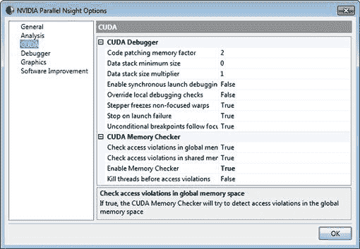

# 第十二章：常见问题、原因与解决方案

## 介绍

在本章中，我们将探讨一些困扰 CUDA 开发者的问题，以及如何通过一些相对简单的实践来避免或至少减轻这些问题。CUDA 程序中的问题通常可以归类为以下几种类型：

• 使用各种 CUDA 指令时的错误。

• 一般的并行编程错误。

• 算法错误。

最后，我们将在本章结束时讨论如何继续学习。关于 CUDA 和 GPU 编程的书籍有很多，在线资源也非常丰富。我们将提供一些阅读建议和获取资源的途径。同时，我们还会简要讨论 NVIDIA 针对 CUDA 开发者的专业认证计划。

## 使用 CUDA 指令时的错误

使用 CUDA API 时的错误是我们在学习 CUDA 时最常见的问题。这对于许多人来说是一个新的 API，因此在使用中出现错误是可以预料并且应该有所准备的。

### CUDA 错误处理

在第四章中，我们介绍了 `CUDA_CALL` 宏。所有 CUDA API 函数都会返回一个错误代码。除非返回 `cudaSuccess`，否则通常表示你在调用 API 时出了问题。不过，也有一些例外情况，比如 `cudaEventQuery`，它返回的是事件状态，而不是错误状态。

CUDA API 本质上是异步的，这意味着在查询时返回的错误代码可能发生在过去的某个远程时刻。实际上，它通常是由于在检测到错误之前的紧接着的调用所导致的。当然，你可以通过在每个 API 调用后进行同步（即调用 `cudaDeviceSynchronize` 函数）来强制实现这一点。尽管这种策略在调试时可能是个不错的方法，但它不应该出现在任何发布版本的代码中。

每个错误代码都可以转换为一个半有用的错误字符串，而不是一个需要查阅 API 文档的数字。错误字符串是识别问题潜在原因的一个稍微有用的初步尝试。然而，它依赖于程序员在主机程序中显式检查返回代码。如果 CUDA 运行时能够捕获这些异常并执行一些错误指示，那就更好了，就像我们在运行调试版本时通过 `CUDA_CALL` 宏显式执行的那样。这将极大地帮助指出用户程序中的错误，并在错误发生时及时发现。我们在 CUDA v4.1 SDK 中看到了一些朝这个方向发展的变化。

CUDA 错误处理有些简陋。大多数时候，你会收到一个有用的错误信息。然而，通常你会收到一个不太有用的信息，如 `unknown error`，通常是在内核调用之后。这基本上意味着你的内核做了一些不该做的事情，例如，写入了全局或共享内存数组的末尾。我们将在本章稍后介绍一些调试工具和方法，帮助识别这种类型的问题。

### 内核启动和边界检查

CUDA 中最常见的错误之一是数组溢出。你应该确保所有的内核调用都以检查开始，确保它们访问的数据（无论是读取还是写入）都有条件保护。例如，

```cpp
if (tid < num_elements)
{
… array[tid] = ….
}
```

这个条件语句会消耗少量时间，但可以节省大量调试工作。通常你会在存在多个数据元素且它们不是线程块大小的倍数时，遇到这样的情况。

假设我们每个块有 256 个线程，且有 1024 个数据元素。这将调用四个 256 线程的块，每个线程都会贡献结果。现在假设我们有 1025 个数据元素。通常你会遇到两种错误。第一个是由于使用整数除法，未调用足够的线程。这样通常会截断所需的块数。通常人们会写：

```cpp
const int num_blocks = num_elements / num_threads;
```

这样是可以工作的，但仅在元素数量是线程数的精确倍数时。在 1025 个元素的情况下，我们启动了 4 × 256 个线程，总共 1024 个线程。最后一个元素未被处理。我还看到过，除了其他变体外，有些人试图“绕过”这个问题。例如，

```cpp
const int num_blocks = ((float) num_elements / num_threads);
```

这样并不能解决问题。你不能有 4.1 个块。分配给整数时会将数字截断为四个块。解决方案很简单。你可以改写为：

```cpp
const int num_blocks = (num_elements + (num_threads-1)) / num_threads;
```

这将确保你始终分配足够的块。

接下来是我们常见的第二个问题。我们现在调用五个块，总共 1280 个线程。如果在内核中没有对数组的这种受保护访问，除了第一个线程外，块 5 中的所有线程都会访问越界的内存位置。CUDA 运行时几乎不会进行任何运行时检查，如数组边界检查。你永远不会看到它停止内核并显示类似`array overrun in line 252 file kernel.cu`的消息。然而，与其默默失败（这是最糟糕的情况），它至少会以某种方式捕获错误，并返回类似`unknown error`的消息。

### 无效的设备句柄

你通常会看到的另一类错误是句柄混用错误，最常见的是指针错误。当你在设备或主机上分配内存时，你会得到指向该内存的指针。然而，这个指针隐含着一个要求，即*只有主机*可以访问主机指针，*只有设备*可以访问设备指针。也有一些例外情况，例如零拷贝内存，在这种情况下，主机指针可以转换为设备指针以访问主机内存，但即便如此，你仍然需要区分它们。

由于指针不可互换，人们可能会希望设备指针使用不同的类型进行声明。这样就可以在调用 API 时进行基于类型的检查，在编译时标记出这种问题。不幸的是，设备指针和主机指针是相同的基本类型，这意味着编译器并不会执行静态类型检查。

当然，你完全可以定义这样的类型。然后，你可以围绕 API 函数开发你自己的包装函数，进行类型检查。当然，对于那些刚开始写 CUDA 的人来说，这将是一个巨大的帮助，或许我们会在 CUDA 的发展过程中看到这样的功能。我们在第十章中看到的 Thrust 库就有主机向量和设备向量的概念。它使用 C++的函数重载机制，确保针对给定数据类型始终调用正确的函数。

标准 CUDA 运行时检查这种类型的错误，涉及到设备和主机指针的混用问题，在将主机指针传递给设备函数时是否合理。CUDA API 会检查指针的来源，如果你在没有先将其转换为设备指针的情况下将主机指针传递给内核函数，它会生成运行时错误。然而，标准的 C/C++系统库就不能如此智能。如果你使用设备指针调用标准的`free`函数而不是`cudaFree`函数，系统库将试图在主机上释放该内存，这可能导致崩溃。主机库并不理解它无法访问的内存空间。

另一种无效句柄的类型来源于在初始化之前使用某个类型。这就像在为变量赋值之前使用它一样。例如，

```cpp
cudaStream_t my_stream;
my_kernel<<<num_blocks, num_threads, dynamic_shared, my_stream>>>(a, b, c);
```

在这个例子中，我们缺少调用`cudaStreamCreate`和随后的`cudaStreamDestroy`函数。创建调用执行一些初始化，注册事件到 CUDA API 中。销毁调用则释放这些资源。正确的代码如下：

```cpp
cudaStream_t my_stream;
cudaStreamCreate(&my_stream);
my_kernel<<<num_blocks, num_threads, dynamic_shared, my_stream>>>(a, b, c);
cudaStreamSynchronize(my_stream);
```

`cudaStreamDestroy(my_stream);`

不幸的是，CUDA 的多设备模型基于在执行操作之前选择一个设备上下文。一个更清晰的接口本应该是在每个调用中指定一个可选的`device_num`参数，如果没有指定，则默认为设备 0。这样就可以实现如下功能：

```cpp
{
cudaStream_t my_stream(device_num); // constructor for stream
my_kernel<<<num_blocks, num_threads, dynamic_shared, my_stream, device_num>>>(a, b, c);
cudaStreamSynchronize(my_stream);
} // destructor for stream
```

尽管这是从 C 转向 C++，但它提供了一个相对更清晰的接口，因为资源将通过构造函数自动创建，并通过析构函数销毁。当然，你可以轻松编写这样的 C++类。

然而，无效的设备句柄并不仅仅是由于忘记创建它们造成的。它们还可能是由于在设备完成对它们的使用之前销毁了它们。尝试从原始代码中删除`cudaStreamSynchronize`调用。这将导致异步内核正在使用的流在内核可能仍在设备上运行时被销毁。

由于流的异步性质，`cudaStreamDestroy`函数不会失败。它将返回`cudaSuccess`，因此不会被`CUDA_CALL`宏检测到。事实上，直到稍后从与此完全无关的 CUDA API 调用中，你才会遇到错误。解决方法之一是将`cudaSynchronizeDevice`调用嵌入到`CUDA_CALL`宏中，这有助于确定问题的具体原因。然而，要小心不要将其留在生产代码中。

### 易变修饰符

C 语言中的“volatile”关键字指示编译器，所有对该变量的读写操作都必须导致内存访问，并且这些操作必须按照程序中指定的顺序进行。考虑以下代码段：

```cpp
static unsigned int a = 0;
void some_func(void)
{
 unsigned int i;
 for (i=0; i<= 1000; i++)
 {
  a += i;
 }
}
```

这里我们声明一个从 0 开始的全局变量`a`。每次调用该函数时，它都会将`i`从 0 迭代到 1000，并将每个值加到变量`a`中。在这个未优化的代码版本中，每次对`a`的写操作很可能会导致物理内存写入。然而，在优化后的代码版本中，这种情况的发生几率极低。

优化器可以在此应用两种方法。首先，也是最常见的，可能是在循环开始时将`a`的值加载到寄存器中，执行循环直到结束，然后将结果寄存器写回内存，作为*单次*存储操作。这只是一个例子，说明程序员可能没有意识到，或者不在乎内存访问的成本。C 代码可以如下编写：

```cpp
static unsigned int a = 0;
void some_func(void)
{
 unsigned int register reg_a = a;
 unsigned int i;
 for (i=0; i<1000; i++)
 {
  reg_a += i;
 }
 a = reg_a;
}
```

这实际上是编译器可能会用来替换它的方式。一种稍微高级的优化器可能能够将循环展开，就像它有常量边界一样，转化为一个单一的表达式。由于该表达式包含`a`加上一系列常量，这些常量可以在编译时被简化为一个单一常量，从而完全消除循环。例如，

```cpp
static unsigned int a = 0;
void some_func(void)
{
 a += (1 + 2 + 3 + 4 + 5 + 6 + 7 .......);
}
```

或

```cpp
static unsigned int a = 0;
void some_func(void)
{
 a += 500500;
}
```

虽然许多编译器会展开循环，但我不认为许多编译器，甚至没有编译器，能够生成后面简化的代码。然而，理论上没有理由不这么做。

如果其他线程在任何中间循环迭代过程中需要共享参数`a`的值，这两种方法都有可能引发问题。在 GPU 上，这个共享参数可以位于共享内存或全局内存中。在大多数情况下，这些类型的问题对于 GPU 程序员来说是隐藏的，因为`__syncthreads()`的调用会隐式地刷新共享内存和全局内存中所有对内存的写入，作用于*当前块*。由于大多数共享内存代码通常会执行一些操作，写入结果，然后同步，同步操作也会自动将数据分发到各个线程。

问题出现在程序员考虑到线程在一个 warp 内以同步方式操作，并因此省略了同步原语时。通常，当使用归约操作且最后 32 个值不需要同步原语时，你会看到这种优化。只有在共享内存额外声明为 volatile 的情况下，这种优化才成立。否则，编译器根本不需要将任何值写入共享内存。

共享内存有两个目的：首先，作为每个线程的局部高速内存块，其次，促进块内线程间的通信。仅在后者情况下，才需要将共享内存声明为 volatile。因此，`__shared__`指令不会隐式地将参数声明为 volatile，因为程序员可能并不总是希望在编译器能够使用寄存器来优化掉其中一些操作时强制执行读写操作。在线程在一个 warp 内协作时，不调用`syncthread`是完全有效的做法，但你必须意识到，此时共享内存已不再对 warp 内的每个线程保持一致性。

当你通过全局内存进行块间通信时，每个块看到的全局内存视图在没有显式同步的情况下，块与块之间并不一致。我们面临的问题与共享内存相同，因为编译器可能会优化掉中间的全局写入，只将最后一次写入保存到内存中。通过在块内使用`volatile`关键字来访问，可以解决这个问题。然而，CUDA 并没有指定块的执行顺序，因此这不能解决基于块间依赖的问题。这些问题有两种处理方式。第一种，也是最常见的，是通过终止并调用另一个内核。隐含的含义是完成所有待处理的全局内存事务，并刷新所有缓存。第二种方法用于你希望在同一个内核调用内执行某些操作的场景。在这种情况下，你需要调用`__threadfence`原语，它会简单地触发并等待，确保调用线程的所有写入对所有受影响的线程可见。对于共享内存，这意味着同一块中的线程，因为只有这些线程才能看到分配给特定块的共享内存。对于全局内存，这意味着设备内的所有线程。

### 计算级别相关的函数

compute 2.x 硬件支持许多早期硬件不具备的附加功能。compute 1.3 设备也是如此。如果你查阅 CUDA 编程指南，会发现某些功能仅在特定的计算架构下可用。例如，`__syncthreads_count` 是一个 compute 2.0 函数。

不幸的是，默认的 CUDA 项目（例如 Visual Studio 中的新建项目向导）使用的是 CUDA 1.0 支持。因此，当你安装了 Fermi 卡（一个 compute 2.x 设备）并使用 compute 2.0 指令编译项目时，编译器会非常不友好地给出以下提示：

```cpp
Error 1 error: identifier "__syncthreads_count" is undefined j:\CUDA\Chapter-009-OddEvenSort\OddEven\kernel.cu 145 OddEven
```

它并没有说明这个函数仅在 compute 2.0 架构下得到支持。这至少能帮助你识别问题。它只是说明该函数未定义，这让大多数程序员误以为他们遗漏了某个包含声明或者做错了什么。因此，他们会朝错误的方向去寻找解决方案。

这个问题可以通过通过更改 CUDA 运行时中 GPU 选项的属性来设置 GPU 架构级别来简单地解决，正如 图 12.1 所示。这样会将以下命令行选项添加到编译器调用命令中：


图 12.1 设置正确的架构。

```cpp
-gencode=arch=compute_20,code=\"sm_20,compute_20\"
```

请注意，在 Visual Studio 为 CUDA 项目创建的标准项目中，默认情况下最多可以设置三种架构。你可以使用编译器预处理器为不同的计算架构级别编写代码。实际上，这就是用来使更高计算级别的功能可见的方法。

CUDA 定义了一个预处理器符号 `__CUDA_ARCH__`，其当前值为 100、110、120、130、200、210 或 300。显然，随着未来架构的定义，这些值将会增加。因此，你可以编写

```cpp
#if (__CUDA_ARCH__ >= 200)
 my_compute_2x_function();
#else
 my_compute_1x_function();
#endif
```

或者，你可以编写一个单一的函数，仅在必要时使用条件编译，既能利用较新的计算级别函数，又能为较低计算级别的设备提供替代解决方案。

许多计算 2.x 函数简化了所需的编程，因此使得开发变得更加容易。然而，这些较新的函数大多数也可以通过较低计算级别的设备以较慢的方式或稍多的编程实现。如果不提供任何实现来支持向后兼容性，CUDA 就迫使程序员做出选择：要么不使用新功能，要么使用它们并排除那些使用较旧硬件的客户，要么使用它们并为旧硬件编写自己的实现。

大多数消费者会期望你的软件能够在他们的硬件上正常运行。他们不会对提示他们更换 9800 GT 或 GTX260 为 400/500/600 系列 Fermi/Kepler 显卡的消息感到满意。大多数消费者根本不清楚计算级别是什么，而且他们购买显卡的目的是为了玩最新版本的某个游戏。

如果你从事研究或商业领域工作，那么你的硬件在很大程度上是由机构或公司为你定义的。如果你可以参与选择，务必选择至少是计算 2.x 或更高版本的硬件，因为这将大大简化编程。这样你就可以基本上忽略 GPU 迭代的历史，使用一种对大多数 CPU 程序员来说更为熟悉的基于缓存的系统。如果你有多种硬件配置，就像我们许多客户一样，那么你需要考虑如何在每一代硬件上实现最佳性能，并据此编写程序。

### 设备、全局和主机函数

在 CUDA 中，你必须指定一个函数或数据项存在于主机（CPU 端）还是设备（GPU 端）的 PCI-E 数据总线上。因此，可以使用三种限定符，如 表 12.1 所示。如果你省略限定符，CUDA 编译器将假定该函数存在于主机端，并且只允许从主机调用该函数。这是一个在编译时检测到的错误，因此很容易纠正。通过同时使用 `__device__` 和 `__host__` 限定符，可以指定函数同时存在于主机（CPU）和设备（GPU）上。然而，不能将 `__global__` 和 `__host__` 限定符混合使用。

表 12.1 GPU 和主机函数

| 限定符 | 代码所在位置 | 可被调用者 |
| --- | --- | --- |
| `__device__` | GPU | 全局函数或设备函数 |
| `__global__` | GPU | 使用内核调用的主机函数 |
| `__host__` | 主机 | 普通 C 函数调用 |

这种双重限定指定方式非常有用，因为它允许你在 GPU 和 CPU 上编写通用代码。你可以将由哪个线程处理的数据抽象到全局函数中。全局函数然后调用设备函数，并传递一个指向它应该处理的数据的指针。主机函数可以简单地通过循环调用设备函数，以实现相同的功能。

在设备函数和全局函数如何被翻译方面，设备函数类似于 C 中的静态函数。也就是说，CUDA 编译器期望在编译时看到设备函数的整个作用域，而不是链接时看到。这是因为设备函数默认会内联到全局函数中。

内联是一种消除形式参数和调用开销的过程，每次调用函数时，都会像把被调用函数的代码包含在调用点一样展开。这可能会让你觉得编译器浪费了代码空间，因为你可能会在程序内存中有两个相同的设备函数副本。然而，通常调用的上下文会允许使用额外的优化策略，因此，尽管设备函数大体上是重复的，但每次使用时可能略有不同。

这个问题对于你，程序员来说，就是编译器期望只有一个源文件。如果你想拥有两个共享公共设备函数的内核源文件（.cu 文件），那么你需要将 `.cu` 源文件 `#include` 到每个调用者中，而不是采用通常的头文件声明方法，并让链接器解析调用。注意，在 CUDA 5.0 版本的 SDK 中，它的新 GPU 库对象链接功能允许标准的设备代码内核对象代码生成，甚至将这些代码放入静态可链接库中。这大大提高了现有代码的重用性，并且编译时间有所缩短。

### 流内的内核

让异步操作按预期工作其实相当棘手，因为流模型并未在实际硬件中得到体现，至少在计算能力为 2.1 的设备上是这样的。因此，你可能会创建两个流，将流 A 填充一系列内存复制操作，然后将流 B 填充另一系列内存复制操作。你可能预期，由于流 A 和 B 是不同的，硬件会交替执行来自每个流的复制操作。实际上发生的情况是，硬件只有一个队列，并按发出命令的顺序执行命令。因此，两个实现 `copy to` 设备、`execute` 内核和 `copy from` 设备操作的流将会顺序执行，而不是彼此重叠。

在包括计算 3.0 设备的消费者硬件中，只有两个队列——一个用于内存复制，另一个用于 kernels。在内存队列中，任何前面的操作必须在新操作被发出之前完成。这是非常合理的，因为单个 DMA（直接内存访问）引擎一次只能进行一个传输。然而，这意味着按流的深度优先方式填充队列，会使得流操作序列化，这违背了使用流的目的——实现更高水平的并发 kernel/内存传输。

解决方案仍然是首先填充队列深度，但要排除队列中的`copy back`内存操作。因此，`copy to`和`kernel`操作将互相重叠执行。在输入数据大于输出数据的情况下，这种方式效果相当好。一旦批次中的最后一个 kernel 被推入队列，所有的`copy back`操作将被推入传输队列。

在基于 GF100/GF110 设备的 Fermi 设备（例如 GTX470、GTX480、GTX570、GTX580、Tesla C2050、C2070、C2075、Tesla M2050/2070）中，有两个 DMA 引擎。然而，只有 Tesla 设备在驱动程序中启用了第二个传输引擎，称为“异步引擎计数（async engine count）”。因此，在 Fermi Tesla 设备上，前述的深度优先方法可以得到改进。由于我们不再有单一的传输队列，实际上我们应该按广度优先方式向流发出命令。这大大简化了流的处理，因为我们可以有效地忽略硬件内部的处理，预期它将按逻辑流模型的预测正常工作。

然而，必须注意硬件中的一种优化，它可能导致问题。硬件会将连续的传输操作按完成时间串联起来。因此，启动两个内存拷贝，然后进行两个内核调用时，必须等到两个内存拷贝都完成后，任何一个内核才会被启动。你可以通过在内存拷贝之间插入一个事件来打破这种行为。这样，每个拷贝就会独立于其后的拷贝进行处理。

## 并行编程问题

克服了 API 使用问题后，接下来大多数 CUDA 开发者遇到的陷阱是一些困扰所有并行软件开发的通用问题。我们在这一节中探讨这些问题以及它们如何影响 GPU 开发。

### 竞态风险

在单线程应用中，生产者/消费者问题相对容易处理。这只是一个查看数据流并检查一个变量在被写入之前是否被读取的简单问题。许多较好的编译器会高亮显示此类问题。然而，即使有了这种帮助，复杂的代码仍然可能受到这个问题的影响。

一旦引入线程，生产者/消费者问题就会变得非常棘手，如果没有事先仔细考虑。大多数操作系统中的线程机制——CUDA 也不例外——尝试实现最佳的总体吞吐量。这通常意味着线程可以以任何顺序运行，程序必须对这种顺序不敏感。

假设有一个循环，其中迭代 `i` 依赖于上一轮迭代 `i-1`。如果我们仅将每个数组元素分配给一个线程，并且不做其他处理，程序只有在处理器按照线程 ID 从低到高顺序逐个执行线程时才能正常工作。如果反转这个顺序，或者并行执行多个线程，程序就会出错。然而，这只是一个相对简单的例子，并不是所有程序都会出错。许多程序在某些情况下能运行并正确输出答案。如果你发现某些运行时结果正确，而其他运行时结果错误，那么很可能是你遇到了生产者/消费者或竞态风险问题。

竞态风险，顾名思义，发生在程序的不同部分“竞速”到达一个关键点，例如内存的读写。有时 warp 0 可能赢得竞赛，结果是正确的。其他时候，warp 1 可能会被延迟，warp 3 先到达关键区段，从而产生错误的结果。

竞态风险的主要问题在于它们并不总是发生。这使得调试它们并在错误发生时设置断点变得困难。竞态风险的第二个特点是它们对时序干扰非常敏感。因此，添加断点并单步执行代码总是会延迟被观察的线程。这个延迟常常会改变其他 warp 的调度模式，这意味着错误答案发生的特定条件可能永远不会出现。

在这种情况下，第一个问题不是代码中发生的具体位置，而是需要你退后一步，从更大的角度看问题。考虑在哪些情况下答案可能会改变。如果设计中有关于线程或块执行顺序的假设，那么我们已经找到了问题的根源。由于 CUDA 不提供任何关于块顺序或 warp 执行顺序的保证，任何此类假设都意味着设计存在缺陷。例如，考虑一个简单的基于求和的归约操作来加和一个大数组中的所有数字。如果每次运行都产生不同的结果，那么很可能是因为块的执行顺序不同，*这是可以预期的*。顺序不应该也必须不影响结果的最终输出。

在这样的示例中，我们可以通过对数组进行排序并按照定义的顺序从低到高组合值来解决排序问题。我们可以并且应该为这类问题定义一个顺序。然而，硬件中的实际执行顺序应该被视为未定义的，但有已知的同步点。

### 同步

在 CUDA 中，*同步*是指线程之间在一个块内，或在一个网格中的块之间共享信息的过程。线程可以访问寄存器空间或本地内存空间，这两者都是线程私有的。为了让线程在问题上协作，它们通常会使用片上共享内存。我们在之前的归约问题中已经看过一些这样的例子。

线程被分组为 32 个线程的 warp。每个 warp 是硬件可独立调度的单元。SMs 本身有 8、16、32、48 或更多的 CUDA 核心。因此，它们可以在任何单一时刻调度多个 warp，并会切换 warp 以保持设备的吞吐量。这会在同步方面带来一些问题。假设我们在一个块中有 256 个线程。这相当于 8 个 warp。在一个 compute 2.0 设备上，拥有 32 个 CUDA 核心，任何时刻都会有两个 warp 在运行。之所以是两个 warp，而不是一个 warp，是因为硬件实际上每个着色器时钟周期运行两个独立的半 warp（每个 GPU 时钟周期运行两个完整的 warp）。因此，两个 warp 可能会在程序中有所进展，而其他 warp 仍然处于空闲状态。

假设 warp 0 和 warp 1 是硬件最初选择运行的 warp。SMs 并不使用传统的时间切片方法，而是持续运行直到 warp 被阻塞或达到最大运行周期。从原理上讲，调度器只需要做到这一点。一旦 warp 0 发出一个操作，无论是算术运算还是内存操作，它都会停顿，然后切换到另一个 warp。如果所有 warp 都走相同的路径，那么就相当于在一个块内对操作进行流水线处理，一次处理一个 warp。这反过来又可以实现跨 *N* 个 warp 高效执行指令流。

然而，这种安排很少能维持很长时间，因为一个或多个外部依赖会导致某个 warp 被延迟。例如，假设块中的每个 warp 都从全局内存中读取数据。除了最后一个 warp，其余的 warp 都命中了 L1 缓存。最后一个 warp 不幸地需要从全局内存中获取数据。如果我们假设指令延迟为 20 时钟周期，内存延迟为 600 时钟周期，那么其他 warp 会在内存请求被满足时已经推进了 30 条指令。如果内核中有一个循环，那么 warp 0 到 warp 6 可能会比 warp 7 提前几次迭代。

让我们来看一下来自第九章的一个示例，添加一个数据集。为此，我们将以下代码部分添加到循环开始的位置：

```cpp
#define MAX_WARPS_PER_SM 8
__shared__ u64 smem_start_clock_times[MAX_WARPS_PER_SM];
__shared__ u64 smem_sync_clock_times[MAX_WARPS_PER_SM];
__global__ void reduce_gmem_loop_block_256t_smem(const uint4 ∗ const data,
                                          u64 ∗ const result,
                                          const u32 num_elements)
{
 // Calculate the current warp id
 const u32 log_warp_id = threadIdx.x >> 5;
 // For the first SM only, store the start clock times
 if (blockIdx.x == 0)
   smem_start_clock_times[log_warp_id] = clock64();
 // Shared memory per block
 // Divide the number of elements by the number of blocks launched
 // ( 4096 elements / 256 threads) / 16 blocks = 1 iteration
```

` // ( 8192 元素 / 256 线程) / 16 块 = 2 次迭代`

```cpp
 // (16384 elements / 256 threads) / 16 blocks = 4 iterations
 // (32768 elements / 256 threads) / 16 blocks = 8 iterations
 const u32 num_elements_per_block = (( (num_elements/4) / 256) / gridDim.x);
 const u32 increment = (gridDim.x ∗ 256);
 const u32 num_elem_per_iter = (num_elements>>2);
 // Work out the initial index
 u32 idx = (blockIdx.x ∗ 256) + threadIdx.x;
 // Accumulate into this register parameter
 u64 local_result = 0;
 // Loop N times depending on the number of blocks launched
 for (u32 i=0; i<num_elements_per_block; i++)
 {
  // If still within bounds, add into result
  if (idx < num_elem_per_iter)
  {
   const uint4 ∗ const elem = &data[idx];
   local_result += ((u64)(elem->x)) + ((u64)(elem->y)) + ((u64)(elem->z)) + ((u64)(elem->w));
   // Move to the next element in the list
   idx += increment;
  }
 }
 // Create a pointer to the smem data area
 u64 ∗ const smem_ptr = &smem_data[(threadIdx.x)];
 // Store results - 128..255 (warps 4..7)
 if (threadIdx.x >= 128)
 {
  ∗(smem_ptr) = local_result;
 }
 // For the first SM only, store the clock times before the sync
 if (blockIdx.x == 0)
   smem_sync_clock_times[log_warp_id] = clock64();
 __syncthreads();
…
}
```

我们在这里所做的，是将 GPU 时钟在累积开始时的内部时钟存储到共享内存中，然后在同步操作之前再次存储。原始数据结果显示在表 12.2 中。从这些数据中可以注意到几个点。首先，第一次处理数据所需的时间更长。这是因为数据是从内存中获取的，而不是从缓存中获取。其次，注意实际的启动时间在不同的 Warps 之间有所不同。正如你可能预期的那样，我们可以看到偶数和奇数 Warp 在几个时钟周期内被调度在一起。

表 12.2 来自归约示例的时钟数据


然而，即便如此，在这个非常早期的阶段，启动时间仍然存在相当大的差异。图 12.2 显示了一个归一化版本的启动时间散点图。*X*轴上显示了 Warp，*Y*轴上显示了周期。注意到我们可以看到交替的 Warp 调度器将 Warp 发射到 SM 中。


图 12.2 归一化的 Warp 启动时间分布。

正如我们所预期的，由于 Warp 是无序执行的，到我们执行同步操作时，时间差异大约在 4000 个时钟周期的数量级。即使 Warp 1 在 Warp 0 之后启动，它仍然会在大约 3000 个周期后到达同步点（图 12.3）。


图 12.3 归一化的 Warp 同步时间分布。

很明显，我们可以看到，无法依赖*任何*执行顺序来实现正确操作。在不同 Warp 中的线程需要交换数据的任何时刻，都需要同步点。

当我们尝试交换来自不同块的数据时，我们会看到相同的问题：

```cpp
Block  Id: 16 SM: 0 Start: 10420984500 End: 10421078132 Delta: 93632
Block  Id: 22 SM: 0 Start: 10420984504 End: 10421079614 Delta: 95110
Block  Id: 36 SM: 0 Start: 10420984508 End: 10421086198 Delta: 101690
Block  Id: 50 SM: 0 Start: 10420984512 End: 10421105046 Delta: 120534
Block  Id: 64 SM: 0 Start: 10420984592 End: 10421137178 Delta: 152586
Block Id: 171 SM: 0 Start: 10421223384 End: 10421308772 Delta: 85388
Block Id: 172 SM: 0 Start: 10421223406 End: 10421311256 Delta: 87850
Block Id: 176 SM: 0 Start: 10421223424 End: 10421322372 Delta: 98948
Block Id: 177 SM: 0 Start: 10421223518 End: 10421350178 Delta: 126660
Block Id: 178 SM: 0 Start: 10421233178 End: 10421381276 Delta: 148098
Block Id: 303 SM: 0 Start: 10421449580 End: 10421535186 Delta: 85606
Block Id: 304 SM: 0 Start: 10421449618 End: 10421538246 Delta: 88628
Block Id: 305 SM: 0 Start: 10421449800 End: 10421546884 Delta: 97084
Block Id: 306 SM: 0 Start: 10421449822 End: 10421577204 Delta: 127382
Block Id: 313 SM: 0 Start: 10421469888 End: 10421606770 Delta: 136882
```

在这里，我们从线程 0 中导出了那些在 SM 0 上运行的块的开始时间和完成时间。你可以看到，最初 SM 0 会广泛分配块 ID，因为这些块依次分配给多个 SM。我们预计这种模式会继续下去，因为单个块会从 SM 中退役并引入新的块。

在实践中，我们看到调度器将大批接近线性的块 ID 添加到每个 SM。这表明块调度器仅在给定 SM 的空闲块槽位达到某个阈值时才分配新的块。这种做法有助于本地化缓存访问，从而可能提高 L1 缓存命中率。然而，这也可能导致可调度的 warp 数量减少。因此，我们可以看到，warps 和块是按时间分布的，因此任何基于线程或块的协作都必须确保计算的所有元素都能够完成。

对于线程同步，你需要使用 `__syncthreads` 原语，并可以利用片上共享内存。对于块级同步，你可以将数据写入全局内存并启动进一步的内核。

另一个常常让人困惑的同步问题是，你需要记住，*线程块*中的*所有*线程必须到达任何同步屏障原语，如 `__syncthreads`，否则你的内核将会挂起。因此，要小心在 `if` 语句或循环结构中使用这些原语，因为这种用法可能导致 GPU 挂起。

### 原子操作

正如前一节所示，你不能依赖或假设排序来确保输出正确。然而，你也不能假设读/修改/写操作会与设备内其他 SM 同步完成。考虑 SM 0 和 SM 1 都执行读/修改/写的场景。为了确保正确的结果，它们必须按顺序执行。如果 SM 0 和 SM 1 都从一个内存地址读取 10，分别加 1 然后写回 11，那么其中一个计数器的增量将丢失。由于 L1 缓存不是一致的，如果多个块在单个内核调用中写入同一个输出地址，这是一个非常现实的可能性。

当我们有许多线程需要写入一个公共输出时，就使用原子操作。它们保证读/写/修改操作会作为整个串行操作执行。然而，它们并不保证读/写/修改操作的顺序。因此，如果 SM 0 和 SM 1 都请求对同一地址执行原子操作，哪个 SM 先执行是未定义的。

让我们考虑经典的并行归约算法。它可以看作是一个简单的树，如图 12.4 所示。我们有多种方式来查看这个操作。我们可以将 A、B、C 和 D 分配给单个线程，让这些线程进行原子加法操作，将 (A,B) 和 (C,D) 存储到输出中。然后我们降级为两个线程，每个线程会将部分结果加到最终结果中。


图 12.4 经典归约。

另一种方式是从第二行开始，使用两个线程。线程 0 会读取 A 和 B 的内容，并将其写入指定的输出地址。线程 1 会处理来自 C 和 D 的输入。然后线程 1 会退出，留下线程 0 来将两个部分结果相加。同样，我们也可以通过让线程 0 计算 A + B + C + D 来将问题归约为单线程。

第一种方法通过将目标数据写入一个公共输出（即散射操作）来工作。其他方法通过考虑源数据并将其收集以供下一阶段使用来工作。散射操作因为有多个参与者向输出写入数据，所以需要使用原子操作。聚合方法完全消除了原子操作的使用，因此通常是更可取的解决方案。

原子操作引入了序列化问题，特别是当多个线程确实在完全相同的时间尝试进行写入时。如果写入操作在时间上分布得当，确保没有冲突的写入，那么原子操作的开销就不大。然而，在复杂系统中，你无法百分百确定任何时刻不会有两个写入发生。因此，即便预计写入操作在时间上会稀疏分布，我们仍然需要使用原子操作来*确保*这种情况始终成立。

鉴于我们可以用一次聚合操作来替代原子写入，而聚合操作不需要任何形式的数据锁定，那么使用原子操作是否还有意义呢？在大多数情况下，答案是聚合方法会更快。然而，这也有一定的代价。

在我们的归约示例中，两个数字的加法是微不足道的。假设只有四个数字，我们可以轻松地消除所有线程，让一个线程按顺序加这四个数字。这对于少量的值显然是有效的，但如果我们有 3200 万个值需要以某种形式进行归约处理，情况就不一样了。

在第九章的归约示例中，我们看到使用单线程在 CPU 上比使用两个线程更慢，而两个线程又比三个线程更慢。这里显然存在一个权衡问题，即给定线程的工作量与运行的线程总数之间的关系。在 CPU 的例子中，我们的 AMD Phenom II 905e 系统的最大吞吐量实际上被内存带宽问题限制为三个线程。  

更现代的处理器，如 Sandybridge-E，具有更高的主机内存带宽，但同时也增加了两个处理器核心（从四个增加到六个）。在 Sandybridge-E I7 3930 K 系统上运行相同的 OpenMP 归约操作会产生如表 12.3 和图 12.5 所示的结果。因此，即使我们大幅增加内存带宽并增加核心数量，仍然会出现与之前相同的问题。在基于 CPU 的架构上使用更多线程时，随着核心数量的增加，性能回报逐渐递减。  

表 12.3 Sandybridge-E 上的 OpenMP 扩展性  

  

  

图 12.5 Sandybridge-E 上的 OpenMP 扩展性。  

仅运行两个线程将无法充分利用硬件。每轮归约时运行 1600 万线程并杀死其中一半，在 CPU 上也不是一个好的方法。在 GPU 上，我们可以采用这种方法，因为 GPU 会创建一个线程池，逐步处理程序员请求的 3200 万线程。当然，我们也可以在 CPU 上手动创建类似的线程池，尽管我们可用的核心数要少得多。

我们在第九章中使用的规约示例中采用了一个结合了收集操作和分发操作的方式。我们根据设备上物理存在的 SM 数量的倍数来调度多个块。然后，我们将数据集划分为*N*个块，每个线程从内存中收集必要的数据，执行本地的片上累加。

每个线程都在执行大量工作。从前面的计时示例中我们可以看到，GTX470 更宽的数据总线和双倍的 SM 数量使其能够比 GTX460 更快地完成此操作。我们希望确保最大化地利用设备中存在的并行性，无论是 GPU 还是 CPU。

在按线程计算出部分和之后，问题是如何合并这些部分和。这时原子操作就变得必要了，因为累加的数据是线程私有的。因此，不可能从另一个线程收集数据，除非源线程将其数据写入某个地方。

一般的计算 2.0 GPU 最多有 16 个 SM，每个 SM 可以运行最多 48 个 warp，每个 warp 包含 32 个线程。因此，我们在任何时刻最多有 24.5K 个线程处于活动状态。原子操作可以在共享内存中执行（从计算 1.1 设备及更高版本开始）或在全局内存中执行。共享内存的原子操作显然比必须从 SM 进入全局内存执行全局内存原子操作要快得多。由于我们最多有 16 个 SM，因此基于共享内存的原子操作的带宽是写入全局内存的 16 倍。因此，我们希望尽可能使用共享内存的原子操作。

作为整体，原子函数仅在计算能力 1.1 的设备上可用，这几乎包括除了早期的 GTX8800 系列显卡以外的所有设备。共享内存上的 32 位整数原子操作从计算能力 1.2（即 9800 系列及更高版本）开始支持。64 位整数原子操作从计算能力 1.2 的设备上的全局内存以及计算能力 2.0 设备（即 GTX400 系列）的共享内存中可用。

基于单精度浮点数的原子操作仅在计算能力 2.0 及更高版本中可用。双精度原子操作在当前硬件中并不原生支持。不过，你可以通过软件实现它们。CUDA 编程指南提供了如何使用原子 CAS（比较与交换）操作实现这一点的示例。

理解何时使用聚集操作（gather operations）以及何时使用分散操作（scatter operations）通常是实现正确性和性能的关键。考虑如何最好地构建设计，以尽量减少原子操作（分散操作）的使用，而最大化聚集操作的使用。

## 算法问题

程序员遇到的最后一种问题是一个棘手的问题。程序运行时没有产生任何错误，但答案却是错误的。

### 连续测试

测试是决定程序员是否被认为是编写“优秀代码”还是偶尔能正常工作的“胡乱拼凑”的关键。作为一名专业程序员，你应该努力在可用的时间框架内交付出最优质的软件。你该如何做到这一点呢？

连续测试（Back-to-back testing）是一种技巧，它承认编写并行执行的代码比为串行处理器编写功能等效的代码要困难得多。考虑到这一点，你总是在 CUDA 应用程序的并行开发或之前，先开发问题的串行实现。然后，将相同的数据集通过两组代码运行并比较输出。任何不同之处都表明你可能有问题。

那么，为什么我只说“可能”会有问题呢？答案主要取决于你是否使用浮动点（单精度或双精度）数字。浮动点数字的问题在于舍入和精度。在串行 CPU 上，从最低数组值加到最高数组值的随机浮动点数字序列的结果，与从最高数组索引加到最低数组索引的结果是不同的。试试看吧。

那么，为什么会这样呢？单精度浮动点数使用 24 位来表示尾数值，8 位来表示指数。如果我们将 1.1e+38 加到 0.1e−38，你认为结果会是什么？答案是 1.1e+38。由 0.1e−38 表示的微小值太小，无法在尾数部分表示。在一大组数字中，类似的问题会很多。因此，数字处理的顺序变得很重要。为了保持精度，通常最好的解决方法是对数字集合进行排序，从最小的数字加到最大的数字。然而，这会引入潜在的大量工作量，尤其是排序部分，以提高精度。

在计算 1.x 设备中处理浮动点值时，还存在其他问题，特别是当值非常小并接近 0 时，可能会导致它们以不同于 CPU 上运行相同代码的方式处理浮动点数。因此，通常最好是妥协，允许在处理浮动点等价性测试时存在一定的误差阈值。

如果你已有一个现成的 CPU 解决方案，那么比较结果相对简单。对于基于整数的问题，标准的 C 库函数 `memcmp`（内存比较）完全足够用来判断两组输出之间是否有差异。通常，当 GPU 端出现编程错误时，结果不仅仅是稍微不同，而是差异很大，因此很容易判断这段代码是否有效，并且能够确定差异出现在输出的哪个位置。

更难的是某些情况，结果在某一时刻之前完全匹配。通常，这可能是前 256 个值。因为 256 通常被用作线程数，这指向了块索引计算中的错误。如果只有前 32 个值是正确的，这则指示了线程索引计算中的错误。

如果没有现成的 CPU 实现，你需要自己编写一个，或者使用你知道有效的其他人的实现。然而，实际上编写自己的串行实现可以帮助你在尝试并行实现之前，更好地理解和构思问题。当然，你必须确保串行版本能够生成预期的答案，才可以开始并行工作。

它还提供了一个有用的基准，帮助你判断使用 GPU 是否能带来显著的加速。在此评估过程中，始终要考虑 PCI-E 总线的传输时间。就像在归约示例中一样，我们可以在 GPU 上编写一个归约算法，它运行速度比 CPU 上的 OpenMP 版本快得多。然而，仅仅将数据传输到 GPU 就会使得任何执行时间的节省都被淹没。要意识到 GPU 并不总是最佳解决方案。拥有一个 CPU 对应实现可以让你轻松评估这一决策。解决方案应该是尽量最大化利用所有可用资源，无论是 CPU 还是 GPU。

一旦设置了连续测试，并且在本书中的多个示例中你会看到这样的例子，你可以立即看到引入错误的地方。因为你是在引入错误的*那个时刻*看到它，这使得查找和识别错误变得更加容易。将这一点与版本控制系统结合使用，或者简单地在每个重要步骤后创建一个新的备份，可以让你在开发周期的后期消除大量困难的调试工作。

### 内存泄漏

内存泄漏是一个常见的问题，并且不仅仅局限于 CPU 领域。顾名思义，内存泄漏就是在程序运行时，空闲内存空间不断流失。造成这种情况的最常见原因是程序分配（或 malloc）了内存空间，但之后没有释放这块空间。

如果你曾经让计算机连续运行几周，迟早它会开始变慢。再过一段时间，它会开始显示内存不足的警告。这是由于写得不好的程序没有清理自己的资源所导致的。

显式内存管理是 CUDA 中你需要负责的任务。如果你分配了内存，当程序完成任务时，你就需要负责释放这块内存。你还需要负责避免使用已经释放回 CUDA 运行时的设备句柄或指针。

一些 CUDA 操作，特别是流和事件，要求你创建该流的实例。在初次创建时，CUDA 运行时可能会在内部分配内存。如果没有调用`cudaStreamDestroy`或`cudaEventDestroy`，那么这块可能位于主机或 GPU 上的内存就会保持分配状态。你的程序可能会退出，但如果程序员没有显式释放这些数据，运行时并不知道应该释放它们。

解决这种问题的一个有效方法是调用`cudaResetDevice`，该函数会完全清除设备上的所有内存分配。这应该是你在退出主机程序之前调用的最后一个函数。即使你认为已经释放了所有分配的资源，但在程序规模适中的情况下，你或团队中的同事可能忘记了一个或多个内存分配。这是一个简单且有效的方式，确保所有资源都得到清理。

最后，开发人员可以使用一个非常有用的工具——`cuda-memcheck`工具，它支持 Linux、Windows 和 Mac 平台。Linux 和 Mac 用户可以将其集成到`cuda-gdb`中；而 Windows 用户则可以直接通过命令行运行。

```cpp
cuda-memcheck my_cuda_program
```

如果你的内核存在以下问题，程序将执行内核并打印相应的错误信息：

• 未指定的启动失败。

• 越界的全局内存访问。

• 未对齐的全局内存访问。

• 在计算能力为 2.x 的 GPU 上检测到的某些硬件异常。

• 通过`cudaGetLastError` API 调用检测到的错误。

它将同时在调试版和发布版内核上运行。在调试模式下，由于可执行文件中包含了额外的信息，因此可以定位到引发问题的源代码行。

### 长时间运行的内核

执行时间较长的内核可能会引发一些问题。其中最显著的是当内核在后台执行时，屏幕更新变得缓慢，特别是当设备同时用于显示屏时。为了在运行 CUDA 内核的同时支持显示，GPU 必须在显示更新和内核执行之间进行上下文切换。当内核执行时间较短时，用户对此几乎没有感知。然而，当执行时间变长时，可能会变得非常令人烦恼，甚至导致用户放弃使用该程序。

Fermi 尝试解决这个问题，拥有 2.x 及以上计算能力的硬件用户，比使用较早硬件的用户更少遭遇这个问题。然而，这个问题仍然是可察觉的。因此，如果你的应用像 BOINC 那样使用“空闲”GPU 周期，那么用户很可能会将其关闭——显然这是不好的。

解决这个问题的方法是首先确保你的内核足够小。如果你考虑到显示每 60 毫秒需要更新一次，这意味着每次屏幕更新大约发生在 16 毫秒的间隔内。你可以将内核分成适应这个时间段的多个部分。然而，这可能会导致你的整体问题执行时间显著增加，因为 GPU 需要不断在图形上下文和 CUDA 上下文之间切换。

对于这个特定问题，没有简单的解决方案。如果 CUDA 工作负载变得非常重要，低功耗机器和旧版（计算 1.x）显卡在尝试执行 CUDA 和图形工作负载时会遭遇很大的性能问题。只需意识到这一点，并在旧硬件上测试你的程序，确保它的行为正常。用户通常更喜欢稍微慢一点的程序，只要这意味着他们可以继续用于其他任务。

## 查找和避免错误

### 你的 GPU 程序有多少错误？

我们在 CudaDeveloper 所做的最有益的开发变更之一是将所有 CUDA API 调用封装在`CUDA_CALL`宏中。我们在第四章中讨论了如何设置 CUDA。这是一种非常有用的方式，可以帮助你免去费力地检查返回值，同时还能看到你在 CUDA 程序中引入错误的地方。

如果你没有使用这种检测机制，内核生成的错误数量会显示在像 Parallel Nsight 这样的工具中。不幸的是，它们不会为你定位错误。它们只是告诉你执行过程中返回的错误数量。显然，任何非零值都不好。然后追踪这些错误就会变得麻烦。通常是因为你没有检查返回值，这显然是糟糕的编程习惯。要么函数应该在内部处理所有错误，要么如果没有处理，调用者必须处理它们。

运行时检测到的错误是容易修复的问题。只需在每个 CUDA API 中使用`CUDA_CALL`宏，并在内核完成后调用`cudaGetLastError()`，即可捕捉到大多数问题。与 CPU 代码进行的背靠背测试将捕捉到大多数内核中的功能性/算法错误。

像 Memcheck 和 Parallel Nsight 中的内存检查器工具也是非常有用的（图 12.6）。其中一个最常见的错误，通常会导致内核调用后返回“未知错误”，就是越界内存访问。我们已经介绍过 Memcheck 工具。然而，Parallel Nsight 调试器也可以检查越界内存访问。



图 12.6 默认启用 CUDA 内存检查器工具。

选择 Nsight→选项菜单可以在 Nsight 作为调试器运行的会话期间启用内存检查器。如果你的内核随后发生越界写入，无论是在全局内存还是共享内存中，调试器将在越界访问时中断。

但是请注意，当越界内存访问发生在线程本地变量上时，这个功能不起作用，并且启用此功能会导致内核的整体执行时间变慢。由于它仅在使用 Parallel Nsight 调试时启用，因此通常不会成为问题。

启用此选项还会提供一些关于内存访问不对齐的有用信息。内存访问不对齐严格来说不是错误，只是指出如果你能够让访问对齐，可能会显著提高内核的速度。这些信息会被写入到 Nsight 输出窗口中，这是 Microsoft Visual Studio 中可通过下拉框选择的众多输出窗口之一。这个输出窗口与编译错误信息输出窗口相同，通常位于 Visual Studio 项目中打开的三个标准窗口的底部窗格。

### 分而治之

分而治之的方法是调试中的一种常见方法，并非 GPU 特有。然而，它非常有效，这也是我们在这里提到它的原因。这个方法在内核引发了一个运行时未处理的异常时非常有用。这通常意味着你会得到一个错误信息，程序停止运行，或者在最坏的情况下，机器会直接挂起。

解决此类问题的第一种方法应该是通过调试器逐步执行每一行代码，确保以较高的层次进行逐步调试。迟早你会触发导致崩溃的调用。从主机调试器开始，确保使用`CUDA_CALL`宏，并查看错误发生的具体位置。最可能的情况是它会出现在内核调用或者是内核调用后的第一次 CUDA API 调用。

如果你确认问题出在内核中，可以切换到 GPU 调试器，比如 Parallel Nsight 或 CUDA-GDB。然后只需按照单线程的方式重复这个过程，跟踪内核执行过程中的一个线程。这应该能让你看到触发故障的顶级调用。如果没有，这个问题可能出现在你正在追踪的线程以外。通常，“有趣”的线程是任何给定块中的线程 0 和线程 32。大多数 CUDA 内核错误如果没有被其他方式检测出来，通常是与跨 warp 或跨 block 的行为不符合程序员的预期有关。

单步调试代码，并检查每个计算的答案是否符合预期。当你发现有一个错误答案时，只需理解为什么它是错误的，通常解决方案就会变得清晰。你正在做的是一种非常高级的二分查找。通过逐步跳过代码直到遇到故障点，你实际上是在消除某一层功能。然后你可以非常迅速地定位到问题的函数/代码行。

如果你由于某种原因无法访问调试器，或者调试器干扰了问题的可见性，你也可以在没有调试器的情况下使用这种方法。只需在你希望去除的代码周围加上`#if 0`和`#endif`预处理指令。编译并运行内核，然后检查结果。当代码运行没有错误时，错误可能就在被移除的部分中。逐步缩小这一部分，直到它再次出错。出错的地方是问题来源的明确指示。

你也可以尝试以下方法来检查程序是否运行正常：

• 一个 1 线程的块。

• 一个 32 线程的块。

• 一个 64 线程的块。

• 两个 1 线程的块。

• 两个 32 线程的块。

• 两个 64 线程的块。

• 十六个 1 线程的块。

• 十六个 32 线程的块。

• 十六个块，每块 64 个线程。

如果这些测试中的一个或多个失败，它会告诉你是线程在一个 warp 内部、线程在一个块内部，还是块在内核启动时的交互引发了问题。它提供了一个指针，指示你在代码中应该查找什么。

### 断言和防御性编程

防御性编程是假设调用者会做错事的编程。例如，下面的代码有什么问题？

```cpp
char ∗ ptr = malloc(1024);
free(ptr);
```

代码假设`malloc`会返回一个有效的指针，指向 1024 字节的内存。考虑到我们请求的内存量很小，实际上它失败的可能性不大。如果它失败，`malloc`会返回一个空指针。为了让代码正确工作，`free()`函数也需要处理空指针。因此，`free`函数的开始可能是

```cpp
if (ptr != NULL)
{
… search list of allocated memory areas for ptr and de-allocate memory.
}
```

`free()`函数需要同时考虑接收到空指针和看似有效的指针。然而，`NULL`指针并不指向一个有效的已分配内存区域。通常情况下，如果你用空指针或无效指针调用`free()`，一个防御性编写的函数不会损坏堆存储，而是会什么也不做。防御性编程是在函数接收到错误输入时，不做任何错误操作。

然而，这有一个相当糟糕的副作用。当用户不再看到程序崩溃时，测试部门、质量保证部门，甚至作者也不会看到这个问题。事实上，程序现在悄无声息地失败了，尽管调用者中存在编程错误。如果一个函数对输入的范围或界限有隐含要求，这应该被检查。例如，如果一个参数是数组的索引，你应该绝对检查这个值，以确保数组访问不会导致越界访问。这是一个经常被错误处理的问题。

C 提供了一种非常有用的构造，但很少被使用，除非是那些熟悉良好软件工程实践的程序员——`assert`指令。当程序失败时，默默地失败是不好的做法。这会让程序中的错误得以保留并未被检测到。`assert`背后的理念正好相反。如果调用者传递的参数有错误，那就是编程错误。被调用的函数应该大声喊出这个问题，直到修复为止。因此，如果不允许空指针作为函数的输入参数之一，那么应将`if ptr =! NULL`检查替换为以下内容：

```cpp
// Null pointers not supported
assert(ptr_param != NULL);
```

这意味着我们不再需要额外的缩进，同时我们在代码中记录了进入函数的前提条件。务必确保在断言上方加上注释，解释为什么断言是必要的。它可能在未来某个时刻失败，你希望调用该函数的人能尽快理解为什么他们的函数调用无效。这个调用者很可能是你自己，所以为了自己的利益，确保有注释是很重要的。

六个月后，你可能会忘记为什么这个前提条件是必要的。届时，你需要四处寻找，试图回想为什么它是必须的。这也有助于防止未来的程序员移除“错误的”断言，从而在即将发布的版本之前让问题“消失”。在完全理解为什么一开始要放置断言之前，绝不要这么做。在几乎所有的情况下，移除`assert`检查只会在程序后续的地方掩盖错误。

使用断言时，要小心不要把编程错误的处理与有效的失败条件混淆。例如，以下代码是错误的：

```cpp
char ∗ ptr = malloc(1024);
assert(ptr != NULL);
```

`malloc`返回`NULL`指针是一个有效的情况。当堆空间耗尽时，它会这么做。这是程序员应当有有效错误处理的情况，因为最终这种情况总会发生。断言应该保留用于处理无效条件，例如越界索引、处理枚举时的默认`switch`情况等。

使用防御性编程和断言时的一个问题是，处理器需要花费时间检查那些大多数情况下总是有效的条件。这可以在每次函数调用、循环迭代等时进行检查，具体取决于断言使用的广泛程度。解决这个问题的简单方法是生成两组软件，一个调试版和一个发布版。如果你已经在使用诸如 Visual Studio 之类的工具，这在默认项目设置中是固有的。旧系统，尤其是非 IDE 的系统，可能需要手动设置。

完成后，你可以简单地生成`assert`宏的一个版本，即`ASSERT`。

```cpp
#ifdef DEBUG
#define ASSERT(x) (assert(x))
#else
#define ASSERT(x)
#endif
```

这个简单的宏只会将断言检查包含到调试代码中，即你和质量保证人员在发布版本旁边测试的版本。

从 CUDA 4.1 版本开始，现在也可以在计算 2.x 设备的设备代码中放置断言。这在之前是不可行的，因为 GPU 无法抛出此类异常。

### 调试级别和打印

除了拥有一个单一的发布版和调试版外，通常还需要有一个可以轻松更改的调试级别，例如通过设置全局变量、`#define`或其他常量的值来设置。你也可能希望通过命令行设置这样的参数，例如`-debug=5`来设置调试级别为 5，等等。

在开发过程中，你可以向代码中添加有用的信息消息，例如：

```cpp
#ifdef DEBUG
#ifndef DEBUG_MSG
// Set to 0..4 to print errors
// 0 = Critical (program abort)
// 1 = Serious
// 2 = Problem
// 3 = Warning
// 4 = Information
#define DEBUG_ERR_LVL_CRITICAL (0u)
#define DEBUG_ERR_LVL_SERIOUS (1u)
#define DEBUG_ERR_LVL_PROBLEM (2u)
#define DEBUG_ERR_LVL_WARNING (3u)
#define DEBUG_ERR_LVL_INFO (4u)
// Define the global used to set the error indication level
```

`extern unsigned int GLOBAL_ERROR_LEVEL;`

```cpp
void debug_msg(char ∗ str, const unsigned int error_level)
{
 if (error_level <= GLOBAL_ERROR_LEVEL)
 {
  if (error_level == 0)
   printf("\n∗∗∗∗∗∗∗∗∗∗∗%s%s", str, "∗∗∗∗∗∗∗∗∗∗∗∗∗∗\n");
  else
   printf("\n%s", str);
  fflush(stdout);
  if (error_level == 0)
   exit(0);
 }
}
#define DEBUG_MSG(x, level) debug_msg(x, level)
#else
#define DEBUG_MSG(x, level)
#endif
#endif
```

在这个示例中，我们创建了五个级别的调试信息。如果没有使用调试版本的软件，这些信息会以一种不会导致编译错误的方式从可执行文件中去除。

```cpp
#define DEBUG
#include "debug_msg.h"
unsigned int GLOBAL_ERROR_LEVEL = DEBUG_ERR_LVL_WARNING;
int main(int argc, char ∗argv[])
{
 DEBUG_MSG("Error from level four", DEBUG_ERR_LVL_INFO);
 DEBUG_MSG("Error from level three", DEBUG_ERR_LVL_WARNING);
 DEBUG_MSG("Error from level two", DEBUG_ERR_LVL_PROBLEM);
 DEBUG_MSG("Error from level one", DEBUG_ERR_LVL_SERIOUS);
 DEBUG_MSG("Error from level zero", DEBUG_ERR_LVL_CRITICAL);
 return 0;
}
```

调用这个函数时，你只需将宏像前面示例中那样插入代码中即可。这在主机代码中可以正常工作，但在设备代码中则需要做一些小的修改才能正常工作。

首先，你需要了解在内核中打印消息时的一些问题。内核级的 `printf` 仅支持 compute 2.x 能力。如果你尝试在为 compute 1.x 设备编译的内核中使用 `printf`，你会收到一个错误，提示不能从全局函数或设备函数中调用 `printf`。这不完全准确——实际上，这是因为 compute 1.x 设备不支持 `printf`，目标架构必须是 compute 2.x。

假设你有一个 Fermi 层次的设备，因此支持 `printf` 调用。除非你特别小心，否则消息会从每个线程以 32 个为一组（即 warp 大小）打印出来。显然，由于你应该启动成千上万的线程，仅仅打印一条消息可能会导致 10,000 多行信息滚动出终端窗口的顶部。由于 `printf` 缓冲区大小是固定的，并且会循环覆盖，你将会丢失早期的输出。

由于这些行可以按任意顺序打印，我们不能仅凭打印顺序来表示执行顺序，除非我们参考时间戳，以确认消息的具体来源时间。因此，我们需要标识每条消息的来源并为其加上时间戳。

第一个问题很容易处理，只需让一个线程在一个块或 warp 中打印消息。按照惯例，这通常是线程 0。我们也可能希望从每个 warp 打印一条消息，因此我们再次只选择每个 warp 中的第一个线程来打印消息。你可能还有其他标准，比如计算 halo 区域的线程等。这里展示了一段示例代码。

```cpp
if ( (blockIdx.x == some_block_id) && ((threadIdx.x %32) == 0) )
{
 // Fetch raw clock value
 unsigned int clock32 = 0;
 asm("mov.u32 %0, %%clock ;" : "=r"(clock32));
 // Fetch the SM id
 unsigned int sm = 0;
 asm("mov.u32 %0, %%smid ;" : "=r"(sm));
 printf("\nB:%05d, W:%02d, SM:%02u, CLK:%u", blockIdx.x, (threadIdx.x>>5), sm, clock32);
}
```

这只是寻找指定的块 ID，并打印块 ID、warp 编号、我们正在执行的 SM 和原始时钟值。

```cpp
B:00007, W:05, SM:13, CLK:1844396538
B:00001, W:04, SM:05, CLK:1844387468
B:00002, W:09, SM:09, CLK:1844387438
B:00007, W:10, SM:13, CLK:1844396668
B:00002, W:06, SM:09, CLK:1844387312
B:00007, W:00, SM:13, CLK:1844396520
B:00005, W:12, SM:06, CLK:1844396640
B:00005, W:13, SM:02, CLK:24073638
B:00006, W:03, SM:04, CLK:24073536
B:00005, W:15, SM:02, CLK:24073642
B:00002, W:03, SM:05, CLK:24076530
B:00006, W:00, SM:04, CLK:24073572
```

`B:00002, W:00, SM:05, CLK:24076570`

在这里，我们打印的是块索引、warp ID、warp 正在执行的 SM 以及原始时钟值。你可以简单地将这个输出重定向到一个文件中，然后绘制一个散点图。由于我们选择将设备 `printf` 放在内核的开始位置，它显示了每个内核何时被调用。

在图 12.7 中，SMs 显示在纵轴上，绝对时钟时间显示在横轴上。我们可以看到所有 SMs 几乎同时开始，除了少数几个 SM 开始得稍晚，但它们仍然是一起开始的。接着我们看到每个块在其执行开始时打印其详细信息的时间戳几乎是随机分布的。这个分布完全依赖于你执行的程序以及外部资源可用的时间，全球内存是最主要的例子。


图 12.7 由 14 个 SM 执行的 warp（GTX470）。

使用多个 GPU 或多个流时，我们还面临着识别消息来源的问题。这可以通过在消息前加上唯一标识符来简单处理。在多个示例中，我们使用了由设备 ID 字符串`device_prefix`生成的字符串来实现这一点，尤其是在使用多个 GPU 时。然而，提取这些信息的 API 是一个主机端调用，而不是设备端调用。这是有道理的，因为我们不希望每 30,000 个线程都获取设备 ID 字符串，因为它们的值是相同的。因此，我们可以通过全局或常量内存来提供这个主机端的信息。如果只有一个 GPU 和一个流，这就不必要了，但任何复杂的程序都会在有多个 GPU 和流的情况下运行。

在多个 GPU 的情况下，你会看到时钟值的明显变化。因此，很容易看出输出流来自不同的设备，但到底是来自设备 0、1、2 还是 3 呢？对于相同的设备，我们无法确定。如果这些消息来自同一设备的不同流呢？

使用绝对 TID（线程 ID）值就足够识别单个 GPU 内核的消息。然而，若使用多个流和/或设备时，必须结合设备编号、TID 和流编号来识别。

排序问题仅仅是查看输出时的问题。你应该创建一个如下格式的前缀：

```cpp
GPU ID : Stream ID : TID : Message
```

使用这个前缀，我们可以将输出重定向到文件，并使用一种可以保持相对顺序的排序方式进行简单排序。然后，我们就能得到每个 GPU 和流的所有消息，按顺序排列。

请注意，尽管`printf`是一种在主机端显示信息的简便方式，但请注意它会在 GPU 内存中创建一个 1MB 的缓冲区，并在某些事件发生时将该缓冲区传回主机。

因此，`printf`输出只有在以下条件下才会显示：

1. 在*后续*内核启动时。

2. 在内核执行结束时，如果设置了环境变量`CUDA_LAUNCH_BLOCKING`（如果使用多个 GPU 或流，不推荐这样做）。

3. 作为主机端发起的同步点的结果，例如同步设备、流或事件。

4. 阻塞版本的`cudaMemcpy`。

5. 程序员发起的设备重置（`cudaDeviceReset`或驱动程序`cuCtxDestroy` API 调用）。

因此，在大多数情况下，你会看到输出已打印出来。如果没有，简单地在退出主机程序之前调用`cudaDeviceReset`，或者在流的一组工作结束时调用`cudaStreamSynchronize`，缺失的输出应该会出现。

如果你需要更大的缓冲区，可以使用`cudaDeviceSetLimit(cudaLimitPrintFifoSize, new_size_in_bytes)` API 调用来设置。

### 版本控制

版本控制是任何专业软件开发中的一个关键方面。它并不要求使用非常昂贵的工具或庞大的流程来管理谁可以更新什么。在大型项目中，版本控制是绝对必要的。然而，即使是单人开发的项目，对于许多读者来说，版本控制也同样重要。

想一想，调试一个包含 30,000 个线程的程序是不是很简单。如果你对这个说法感到好笑，那么你就意识到，如果不定期版本控制你的程序，或者在每次到达一个重大节点时进行版本控制，你将给自己设置一个多么困难的任务。程序员通常是一个相当自信的群体，刚开始时他们可能会很确定一个“简单”的修改会毫无问题地工作。然而，当它并没有按照预期工作时，准确记住你所做的所有修改可能会很困难。如果没有程序的工作备份，回到修改前的工作版本几乎是不可能的。

专业领域中的大多数程序都是由团队开发的。一个同事能提供非常有帮助的“新眼睛”，帮助看清问题。如果你拥有一个版本化或基准化的工作代码副本，那么仅仅查看差异就能相对轻松地看到现在是什么导致了原本正常工作的解决方案出现问题。没有这些定期的基准版本，就很难确定错误可能出现的位置，因此你可能需要查看几千行代码，而不是几百行。

## 为未来 GPU 开发

### Kepler

NVIDIA 从 Fermi 及其后续版本展示的路线图包括 Kepler GK104（K10）、Kepler GK110（K20）和 Maxwell。2012 年 3 月，Kepler 系列的第一个版本发布，即 GK104。该产品完全针对消费者市场，但缺少了一些高性能计算（HPC）市场可能希望看到的特性，特别是对双精度数学运算的支持。Kepler GK110 几乎可以肯定会成为一个更加面向 HPC 的产品，并可能以某种形式或另一种形式最终成为消费者卡。GK110 计划在 2012 年底发布，但该设计已经在 NVIDIA 内部用于开发将伴随其发布的 CUDA 5 版本。

让我们简要看一下 Kepler 带来的变化。首先，它带来了能效提升。Kepler GTX680 的 TDP（热设计功率）为 195 瓦特，而 GTX580 为 244 瓦特。这意味着顶级单用户 GPU 的功耗减少了超过 20%。仔细看看 GTX680，它的架构实际上比 GTX580（GF110）更接近 GTX560（GF114），有点像 GTX560 的内部双倍版。

然而，如果我们从每吉浮点运算（gigaflop）所消耗的功率来考虑，那么可以看到 Kepler GK104 的表现比 Fermi GF110 高出最多两倍。NVIDIA 自己对常见消费者游戏的研究（NVIDIA, 2012 年 5 月 18 日）显示每瓦性能提高了 1.5 倍。今天的许多游戏都非常复杂，因此可以合理预期计算型应用程序也会有类似的功率使用模式。

通过在组件分选方面非常严格，GTX690（GTX680 的双 GPU 版本）在每瓦计算性能上显著超过了 GTX680。每瓦性能翻倍或更多是 NVIDIA 团队的一项巨大成就。GTX690 是 Tesla K10 系列的基础。这是 Tesla 产品首次采用双 GPU 解决方案。

尽管从 GTX580 到 GTX680，峰值全局内存带宽保持不变，但我们已经从 PCI-E 2.0 过渡到了 PCI-E 3.0 规范。因此，在配备 PCI-E 3.0 启用 CPU 的 PCI-E 3.0 主板上，卡与卡之间的传输速度是 PCI-E 2.0 400/500 系列卡的两倍。这种带宽的翻倍应能为某些 PCI-E 限制的内核带来显著的速度提升。

Kepler GTX680/GTX690 将计算级别从 2.1 升级到 3.0，Kepler GK110 被定位为计算 3.5 级设备。新的计算级别总结见 表 12.4。

表 12.4 Kepler 中的新计算级别


^∗每个 SM 还增加了额外的 64 个双精度单元。

Kepler 中的一个主要变化是消除了着色器时钟。在 Kepler 之前，GPU 以给定的 GPU 时钟频率运行，而着色器时钟则内部被乘以 2。在之前的世代中，驱动 CUDA 核心执行的是着色器时钟，而非 GPU 时钟。

时钟频率是任何处理器设计中功耗的一个重要驱动因素。在取消着色器时钟的同时，NVIDIA 必须在每个 SM 上布局双倍数量的 CUDA 核心，以实现相同的吞吐量。这一折衷大大降低了整体功耗，并使 NVIDIA 能够将核心时钟从 772 MHz 提升至超过 1 GHz。

Kepler GK104 设计实际上增加了四个 CUDA 核心的数量。它将负载/存储单元（LSUs）、特殊功能单元（SFUs）、指令调度器以及寄存器文件的大小都翻倍了。共享内存/L1 缓存保持在 64 KB 不变，但现在可以按 32 K/32 K 分割，除了常规的 16 K/48 K 分割方式外。

这个选择很有趣，因为添加了大量的额外计算能力。如果我们回顾之前的几代产品，我们可以看到从 GT200（计算能力 1.3）到 GF110（计算能力 2.0）设备的变化，每个 SM 的 warp 数从 24 增加到 48。Kepler GK104 设计将每个 SM 的 warp 总数增加到 64，每个 SM 的线程总数增加到 2048。

GTX680 的宣称峰值性能为 3 teraflops，相比之下，GTX580 的宣称峰值性能为 1.5 teraflops。这个峰值性能是基于执行浮点乘加（FMAD）操作的。当然，在实际使用中，指令组成和内存访问模式有很大变化，最终决定了实际的性能水平。

此外，Kepler GK104 现在具有动态时钟调整功能，可以根据当前 GPU 负载上下调时钟频率。我们在 CPU 领域已经看到这个功能多年，它在节省功耗方面起到了显著作用，特别是当设备本身没有被使用时。

在指令演化方面，我们看到的主要好处是引入了洗牌指令，允许在同一 warp 内的线程之间进行通信。这是一个巨大的优势，因为 warp 内的线程现在可以在无需通过共享内存共享数据的情况下进行协作。减少操作和前缀和的最终阶段可以通过这种操作轻松加速。额外的编译器内建函数已经可以用于硬件级别的移位、旋转，以及访问纹理内存，作为一个简单的附加 48K 只读缓存，而无需编写纹理内存代码的开销。还引入了四字节打包向量指令（`add, subtract, average, abs, min, max`）。

Kepler GK110（K20）从计算角度来看具有一些非常吸引人的特性——NVIDIA 所称的动态并行性、Hyper-Q 和 RDMA 技术。它还几乎将每个设备的 SM 数量翻倍，并增加了重要的双精度浮点单元，这对于大量 HPC 应用至关重要。初步（NVIDIA）的数据显示，双精度性能超过 1 teraflop。内存总线从 256 位增加到 384 位，如果我们看到类似 GK104 的时钟频率，应该会导致超过 250 GB/s 的内存带宽。

这些技术中的第一个，动态并行性，使我们第一次能够轻松地从 GPU 内核启动额外的工作。以前，这通过过度订阅线程块并让一些线程空闲，或者通过运行多个内核来实现。前者浪费资源，特别是在处理大型问题时效果较差。后者意味着 GPU 存在低利用率的时期，并且防止内核在高速度共享内存/缓存中保持数据，因为这种内存在内核启动之间并不是持久的。

这些技术中的第二个是 Hyper-Q，它解决了程序员暴露的流模型与硬件实际实现之间的差异。直到包括 Kepler GK104 的所有流，都在硬件中作为单一管道实现。因此，尽管程序员通过将这些内核放入不同的流中明确指定它们是独立的工作单元，但来自流 0 的内核流与来自流 1 的内核流不会混合。

Hyper-Q 将这个单一的硬件流打破为 32 个独立的硬件队列。因此，最多可以有 32 个流，可能来自几百个程序员定义的流，这些流可以独立地在硬件上运行。其主要好处体现在设备负载方面。每个 SM 有超过 192 个核心，SM 的粒度大大增加。因此，如果运行的小内核仅部分加载 SM，SM 中的资源可能会浪费。

最后，RDMA（远程直接内存访问）也是一项有趣的技术。NVIDIA 一直在与某些厂商，尤其是在 Infiniband 方面，合作，以提高节点间 GPU 之间通信的延迟。目前，点对点功能支持在节点内直接通过 PCI-E 总线进行 GPU 之间的通信。对于支持此功能的卡和操作系统，它避免了通过 CPU 内存空间间接进行通信的需求。

然而，要从非 GPU 设备（例如网络卡等 I/O 设备）发送或接收数据，最佳情况是主机上一个共享的固定内存区域。RDMA 功能改变了这一点，因为它允许 GPU 通过 PCI-E 总线直接与其他 PCI-E 卡通信，不仅仅是 NVIDIA 的 GPU。目前，这仅支持某些 Infiniband 卡，但它为其他卡的使用开辟了潜力，比如直接数据采集、FPGA、RAID 控制器等，可以直接与 GPU 进行通信。这将是一个值得关注的技术发展。

### 需要考虑的事项

开发能够在未来多年运行的代码，或者至少能够在未来运行的代码，一直是一个困难的问题。越是针对某一特定硬件进行优化，代码在未来开发中的可移植性就越差。因此，一个策略是确保你开发的任何代码都可以参数化，以便能够轻松适应未来的 GPU。

通常，应用程序会针对特定的架构进行调整。因此，你可能会遇到如下代码段：

```cpp
if ( (major == 2) && (minor == 0) ) // Compute 2.0
 num_blocks = (96∗4);
else if ( (major == 2) && (minor == 1) ) // Compute 2.1
 num_blocks = (96∗2);
else
 num_blocks = 64; // Assume compute 1.x
```

那么，如果发布了计算能力为 2.2 或 3.0 的架构会怎样呢？在示例程序中，我们将进入计算能力为 1.x 的路径（G80/G92/G200 系列）。你的程序用户不希望将他们的 Fermi 级 GPU 更换为新的 Kepler 显卡，然后发现你的程序在他们的全新显卡上运行得更慢或者根本无法运行。在编写这样的代码时，要假设你可能会遇到一个未知的计算能力等级，并相应地为其做准备。

在从 G200 到 Fermi 的过渡过程中，曾经历过一段过渡期，作者不得不重新发布程序，因为每个 SM 执行的块数在不同代之间保持不变，只有每个块的线程数增加。如果一个内核已经使用了每个 SM 的最大块数，这样能实现最佳的指令混合，从而获得良好的性能，那么就没有额外的块被调度到 SM 上。因此，新硬件未得到利用，现有的软件在新硬件上并没有更快地运行。

G200 与 Fermi 之间的主要过渡是需要增加每个块的线程数量。每个块的最大线程数，这一可查询属性，从最大 512 增加到 1024。与此同时，驻留 warp 的数量从 24（计算 1.0/1.1）增加到 32（计算 1.2/1.3），再到 48（计算 2.0/2.1）。因此，未来我们很可能会继续看到这一趋势，块中包含的线程数量越来越多。Kepler 是第一个将每个 SM 的块数增加的 GPU 架构，将其从 8 个块增加到 16 个块。因此，调度最大块数的最佳线程数回归为 2048 线程 ÷ 16 块 = 每块 128 线程。

我们可以通过简单查询线程数和 warp 大小来计算可用的 warp 数量。`cudaDeviceProp`结构返回`warpSize`和`maxThreadsPerBlock`。因此，我们可以调用`cudaGetDeviceProperties(&device_props)` API，然后将每个块的线程数除以 warp 的数量，从而计算出给定 GPU 上的最大 warp 数。

这种方法适用于 Kepler GK104，也适用于即将发布的 Kepler GK110。然而，它并未考虑到 GK110 将带来的编程模型变化。随着 GK110 的动态并行性功能现在已经公开，我们可以清楚地为此做好规划。NVIDIA 在 GTC（GPU 技术大会）上展示了一些工作，声称仅此特性，尤其是消除 CPU 控制开销，将在许多代码中带来显著的加速。它还简化了递归的形式，在递归部分可以随着节点数量的增加或减少，依据遇到的数据量来增加并行度。

一个你今天可以在程序中实现的关键方面，是使用专用的 48 K 只读纹理缓存，而无需进行纹理内存编程。这只需要你使用 C99 标准中的`___restrict__`关键字声明只读指针，例如：

```cpp
void my_func(float ∗ __restrict__ out_ptr, const float ∗ __restrict__ in_ptr)
```

在这个例子中，通过添加这个关键字，我们表示对参数`out_ptr`的任何写操作将不会影响`in_ptr`指向的内存区域。实际上，我们是在说这两个指针不会相互别名。这样会使得通过`in_ptr`的读取操作能够在纹理缓存中缓存，从而提供额外的 48 K 只读缓存内存。这样做可能显著减少对全局内存的外部访问，从而大幅提高内存吞吐量。

Hyper-Q 逻辑也是你需要考虑的一个方面，思考现有内核中哪些元素可以并行执行。首次，任务级别的并行性将在 GPU 上真正实现。为此，如果你当前运行一系列内核，请将这些内核拆分为独立的流，每个独立任务一个流。这样做不会对你当前平台上的代码性能产生不利影响，但一旦该功能可用，它将使这些内核在 Kepler 上执行得更好。

最后，新款 K10 Tesla 产品是一个双 GPU，基于目前可用的 GTX690 消费者卡。与 CPU 一样，如果你只使用单个核心，你将浪费超过 50% 的计算能力。因此，任何计划安装 K10 产品的人都需要将现有代码移植到支持多 GPU 的环境中。我们在第八章中已讨论过这个问题。你需要考虑数据存储的位置以及 GPU 之间是否需要进行通信。今天采用多 GPU 解决方案将使过渡更加顺利，并为许多应用提供几乎线性扩展。

## 进一步资源

### 介绍

网上和全球许多大学都有大量 CUDA 资源。我们为有意学习 CUDA 的专业人士提供个别或团体形式的培训。因此，我尽力每年亲自或在线参加尽可能多的 CUDA 课程。由于 CUDA 是我非常热衷的领域，我已经阅读了迄今为止所有关于这一主题的书籍。因此，我希望在这里提供一些有关 CUDA 资源的信息，供任何希望深入了解 CUDA 的人参考。这些信息也可以通过我们的网站[*www.learncuda.com*](http://www.learncuda.com)获取，这是一个提供全球各类 CUDA 资源的门户。

### 在线课程

CUDA 的一个重大成功是 NVIDIA 致力于将 CUDA 带给更广泛的受众。如果我们回顾历史，会发现许多曾经尝试将并行编程推向主流的努力，以及许多旨在支持并行构造的编程语言。除了可能的 OpenMP，和较小程度上的 MPI，其他都失败了。这主要是因为这些技术从未摆脱它们为之创建的特定小众群体，且没有主要的支持者愿意投资于培训，通常也只局限于大学、政府或企业拥有的小规模计算机。

因此，我们从 CUDA 的最佳资源之一开始，即 NVIDIA 自己提供的培训页面：[*http://developer.nvidia.com/cuda-training*](http://developer.nvidia.com/cuda-training)。在这里，你可以访问来自各大大学的多场录制讲座，包括：

ECE-498AL，[*http://courses.engr.illinois.edu/ece498al/*](http://courses.engr.illinois.edu/ece498al/) —— 这是由 Wen-mei W. Hwu 教授教授的课程，他是首部 CUDA 重要教材的作者。2010 年课程的音频录音和幻灯片可以在此找到。

Stanford CS193G，[*http://code.google.com/p/stanford-cs193g-sp2010/*](http://code.google.com/p/stanford-cs193g-sp2010/) — 斯坦福大学开设的课程，基于 ECE-498 课程。包括通过 iTunes 提供的录制讲座视频。由 Jared Hoberock 和 David Tarjan 教授讲授。

Winsconsin ME964，[*http://sbel.wisc.edu/Courses/ME964/*](http://sbel.wisc.edu/Courses/ME964/) — 这是一门关于高性能计算在工程中应用的课程，包含了讲座视频链接和若干有趣的嘉宾讲座。由 Dan Negrut 教授讲授。

EE171 并行计算机架构，[*http://www.nvidia.com/object/cudau_ucdavis*](http://www.nvidia.com/object/cudau_ucdavis) — 这是一门出色的课程，涵盖了从架构角度看数据级并行、指令级并行和线程级并行。由加利福尼亚大学戴维斯分校的 John Owens 教授讲授。

下一个主要的在线信息来源是 GPU 会议的录制档案。每年，NVIDIA 都会在位于加利福尼亚州圣荷西的总部举办一场叫做 GPU 技术大会的会议。这些会议实际上会在世界各地的多个地点举行。大约在会议结束一个月后，各个会议的不同环节会被上传到 NVIDIA 的 GPU 技术门户网站 [*http://www.gputechconf.com/gtcnew/on-demand-gtc.php*](http://www.gputechconf.com/gtcnew/on-demand-gtc.php)。由于像许多会议一样，不同的会议环节会有重叠，因此你不可能参加所有环节。你几乎可以在线查看所有会议的录像，回溯多年。此外，还有其他一些 NVIDIA 录制的会议。

主题演讲，特别是黄仁勋的演讲，总是非常有趣，能为我们提供关于 GPU 技术未来的深刻见解。由塞巴斯蒂安·特伦（Sebastian Thrun）做的关于 DARPA 挑战的主题演讲，展示了 CUDA 应用的广泛性，例如，GPU 被用来自主控制汽车。保利乌斯·米基凯维丘斯（Paulius Micikevicius）的多场讲座聚焦于 CUDA 优化，还有一场由瓦西里·沃尔科夫（Vasily Volkov）关于占用率的讲座，也非常值得观看。

下一个主要的在线信息来源是 NVIDIA 提供的归档网络研讨会，可以在[*http://developer.nvidia.com/gpu-computing-webinars*](http://developer.nvidia.com/gpu-computing-webinars)找到。这个系列的网络研讨会面向注册的 CUDA 开发者。注册是免费的，并允许你实时参与网络研讨会。现场参与可以让你提问并就特定话题提供反馈。网络研讨会结束后，通常会提供归档版本。该系列研讨会主要关注 CUDA 的新创新、API，也可能有关于厂商特定工具的讲座。

还有许多关于 CUDA 和并行计算的其他资源。访问[*www.learncuda.com*](http://www.learncuda.com)获取完整列表。

### 课程教学

许多大学将 CUDA 作为并行编程课程的一部分进行教授。通常，它与 OpenMP 和 MPI 一起教授，这两者是今天主流的跨核心和节点内编程模型。NVIDIA 提供了一个非常有用的工具，可以帮助你找到全球教授 CUDA 的地方，因此你可以找到离你最近的课程：[*http://research.nvidia.com/content/cuda-courses-map*](http://research.nvidia.com/content/cuda-courses-map)。截至 2012 年中期，NVIDIA 列出了全球超过 500 所教授 CUDA 的大学。

### 书籍

有许多关于 CUDA 的书籍。没有一本书能覆盖 CUDA 和/或并行编程的所有方面。你可能希望阅读以下额外的书籍：

• *CUDA 示例*，作者 Jason Sanders

• *CUDA 应用设计与开发*，作者 Rob Farber

• *大规模并行处理器编程*，作者 D. Kirk 和 Wen-mei W. Hwu

• *GPU 计算宝石*，翡翠版和翡翠版，作者为多位作者

我已经按照这些书籍对于新手 CUDA/GPU 程序员的可接近性来进行排序。所有这些书籍在像 Amazon 这样的消费者网站上都有很高的评价，因此它们值得投资。

### NVIDIA CUDA 认证

CUDA 认证程序是 NVIDIA 推出的一项计划，旨在让你向潜在雇主展示你在 CUDA 方面已达到一定的能力水平。它包括一系列选择题和多个编程任务，必须在规定的时间内完成。考试大纲可在 NVIDIA 网站上的[*http://developer.nvidia.com/nvidia-cuda-professional-developer-program-study-guide*](http://developer.nvidia.com/nvidia-cuda-professional-developer-program-study-guide) 和 [*http://developer.nvidia.com/cuda-certification*](http://developer.nvidia.com/cuda-certification)查看。

你需要掌握的内容与《*编程大规模并行处理器*》教科书中的内容高度重叠。问题主要聚焦于编程方面。你需要对 CUDA 有扎实的理解，既能够从零开始编写 CUDA 内核，又能理解如何编写高效且高性能的代码。你正在阅读的这本书涵盖了认证考试的许多重要方面，但并非所有可能会被提问的内容。在许多领域，本书的内容远超认证考试的要求。书中有许多问答部分，需要你思考并理解各章节中提供的示例。通过解决这些问题并调整示例，你将获得最大程度的理解。

你还需要保持对 CUDA 新发展的关注，这些发展可能不会出现在教学大纲中，但通过 NVIDIA 提供的其他资源，如网络研讨会和培训课程，都会有所涉及。

## 结论

你终于读完了这本试图从实践者的角度介绍 CUDA 的书籍。我希望你已经学到了很多关于 CUDA、GPU、CPU 以及如何编写高效程序的知识。

我也希望你对 GPU 和 CUDA 的使用充满兴奋感。过去的串行编程模型已经过时。无论是在 GPU 还是 CPU 上，平行架构才是计算的未来。你正处在历史的转折点，平行计算终于吸引了足够多的从业者，并且由计算行业推动，成为应对日益增长的计算吞吐量的唯一解决方案。

作为程序员，必须以并行的方式进行思考，已经越来越成为常态。我们日常使用的智能手机现在已经配备或正在向双核处理器过渡。大多数平板电脑也都采用双核处理器。在用于游戏的 PC 中，绝大多数家庭 PC 市场（约 92%）现在都是多核机器。在这些机器中，接近 50%正在运行 NVIDIA 的 GPU（Steam，2012 年 4 月 14 日）。

CUDA 具有巨大的潜力，能够彻底改变并行处理技术，涵盖消费者领域和商业市场。你可以购买一款顶级的消费者级 Kepler 显卡（GeForce GTX680），价格大约为 500 美元。GPU 行业仍然处于每隔几年性能翻倍的曲线之中，并且看起来至少在短期内这一趋势将会持续下去。现在正是学习编程 GPU 的激动人心的时刻。

## 参考文献

1\. NVIDIA, “NVIDIA 的下一代计算架构：Kepler GK110”。可在[*http://www.nvidia.com/content/PDF/kepler/NVIDIA-Kepler-GK110-Architecture-Whitepaper.pdf*](http://www.nvidia.com/content/PDF/kepler/NVIDIA-Kepler-GK110-Architecture-Whitepaper.pdf)访问，最后访问日期：2012 年 5 月 18 日。

2\. Steam, “消费者硬件调查”。可在[*http://store.steampowered.com/hwsurvey*](http://store.steampowered.com/hwsurvey)访问，最后访问日期：2012 年 4 月 14 日。
