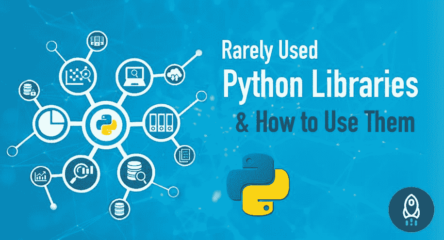
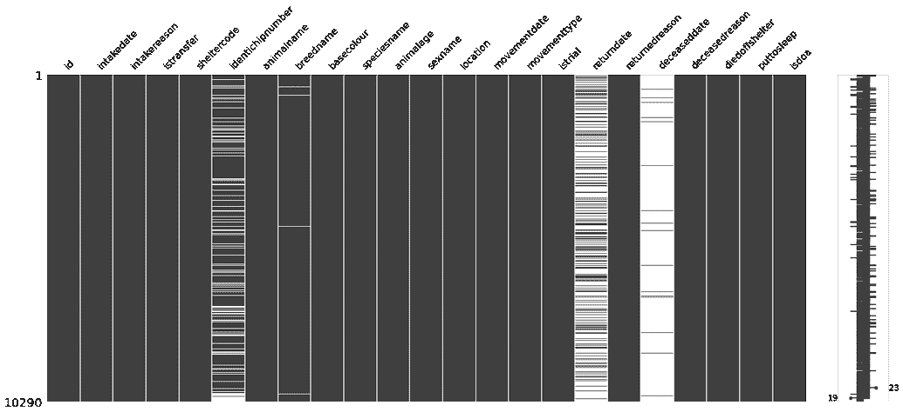
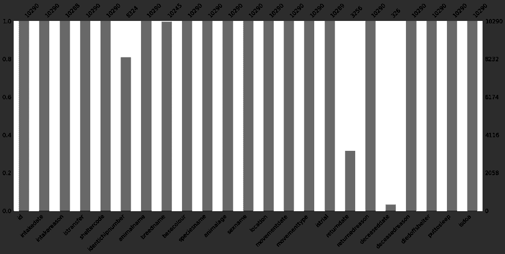
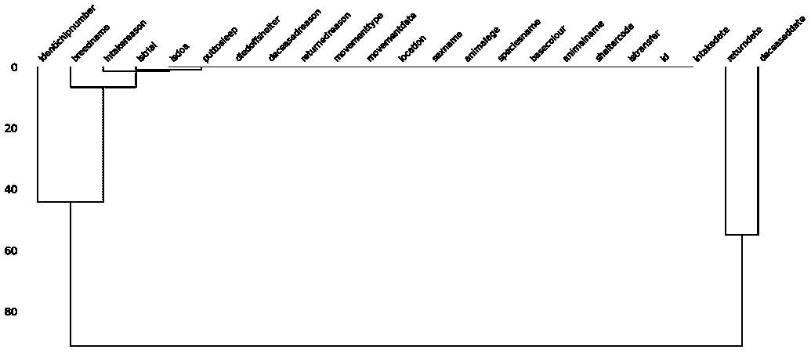
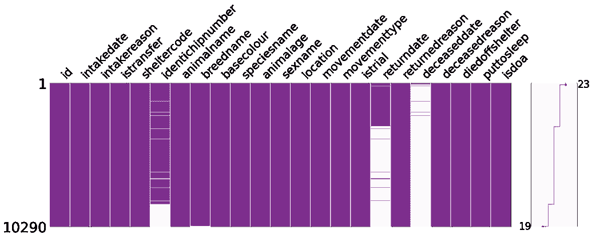
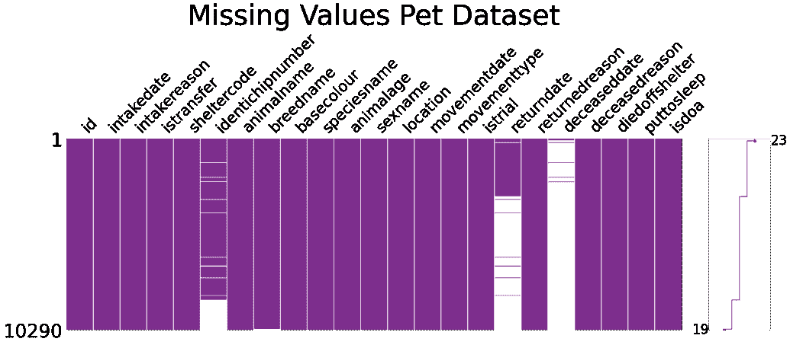

# 8 个很少使用的 Python 库&如何使用它们

> 原文：<https://www.dataquest.io/blog/8-rarely-used-python-libraries-how-to-use-them/>

August 29, 2021

最流行的 Python 库通常是 TensorFlow、Numpy、PyTorch、Pandas、Scikit-Learn、Keras 和其他一些库。虽然您可能会经常遇到这些名称，但是有成千上万的 Python 库可供您使用。在本文中，我们将重点讨论如何使用 Python 库，这些库很少被使用或听说过，但是对于解决特定的任务非常有用，或者可以用于有趣的项目。

我们将要练习的 Python 库有:

1.  缺少编号
2.  有平面的
3.  维基百科(一个基于 wiki 技术的多语言的百科全书协作计划ˌ也是一部用不同语言写成的网络百科全书ˌ 其目标及宗旨是为全人类提供自由的百科全书)ˌ开放性的百科全书
4.  Wget
5.  骗子
6.  数字计算器
7.  表情符号
8.  彼得罗

首先，我们将从 Kaggle 下载一个数据集—[动物护理和控制收养的动物](https://www.kaggle.com/jinbonnie/animal-data)

```py
import pandas as pd
f = pd.read_csv('animal-data-1.csv')
rint('Number of pets:', len(df))
rint(df.head(3))
```

```py
Number of pets: 10290

         id           intakedate intakereason  istransfer sheltercode  \
   0  15801  2009-11-28 00:00:00       Moving           0   C09115463
   1  15932  2009-12-08 00:00:00       Moving           0   D09125594
   2  28859  2012-08-10 00:00:00    Abandoned           0   D12082309

     identichipnumber animalname                breedname basecolour speciesname  \
   0       0A115D7358     Jadzia      Domestic Short Hair     Tortie         Cat
   1       0A11675477      Gonzo  German Shepherd Dog/Mix        Tan         Dog
   2       0A13253C7B     Maggie  Shep Mix/Siberian Husky    Various         Dog

      ...         movementdate movementtype istrial returndate returnedreason  \
   0  ...  2017-05-13 00:00:00     Adoption     0.0        NaN          Stray
   1  ...  2017-04-24 00:00:00     Adoption     0.0        NaN          Stray
   2  ...  2017-04-15 00:00:00     Adoption     0.0        NaN          Stray

      deceaseddate deceasedreason diedoffshelter puttosleep isdoa
   0           NaN   Died in care              0          0     0
   1           NaN   Died in care              0          0     0
   2           NaN   Died in care              0          0     0

   [3 rows x 23 columns]
```

## 1.缺少编号

库安装:pip 安装缺失编号

**Python 中什么是 Missingno？**–missing no 是一个特殊的 Python 库，用于显示数据帧中缺失的值。当然，我们也可以使用任何可视化库中的 seaborn 热图或条形图来实现这一目的。但是，在这种情况下，我们必须首先使用 df.isnull()创建一个包含每列中缺失值的序列。sum()，而 missingno 已经在幕后完成了所有这些工作。该 Python 库提供了几种类型的图表:

*   矩阵显示一个数据帧中多达 50 列的数据完成密度模式，它类似于 seaborn 缺失值热图。此外，通过右侧的迷你图，它显示了数据完整性的大致形状，强调了具有最大和最小空值的行。
*   条形图按列以条形显示无效可视化。
*   热图测量范围从-1 到 1 的零相关性。本质上，它显示了一个变量的存在与否对另一个变量的存在有多么强烈的影响。没有丢失值或正好相反，完全为空的列被排除在可视化之外，没有有意义的相关性。
*   树状图和热图一样，度量列之间的空关系，但在这种情况下不是成对的，而是在列组之间，检测缺失数据的聚类。那些在图表上位置更近的变量显示出更强的零相关性。对于少于 50 列的数据帧，树状图是垂直的，否则，它翻转成水平的。
    让我们在 pet 数据集上使用默认设置尝试所有这些图表:

```py
import missingno as msno

sno.matrix(df)
```



```py
msno.bar(df)
```



```py
msno.heatmap(df)
```


```py
msno.dendrogram(df)
```



我们可以对数据集进行以下观察:

*   总的来说，有一些值缺失。
*   最空的列是 deceaseddate 和 returndate。
*   大多数宠物都有芯片。
*   无效相关性:
    *   被植入芯片和死亡之间有一点负面影响，
    *   略显积极——被植入芯片与被归还、被归还与死亡。

有几个选项可以自定义缺少图表:figsize、fontsize、sort(按完整性对行进行排序，升序或降序)、labels(可以是 True 或 False，表示是否显示列标签)。一些参数是特定于图表的:矩阵和条形图的颜色、矩阵的迷你图(是否绘制)和 width_ratios(矩阵宽度与迷你图宽度之比)、条形图的 log(对数刻度)、热图的 cmap 颜色图、树状图的方向。让我们将其中一些应用到上面的图表中:

```py
msno.matrix(
           df,
           figsize=(25,7),
           fontsize=30,
           sort='descending',
           color=(0.494, 0.184, 0.556),
           width_ratios=(10, 1)
           )
```



最后，如果还有什么我们想要调整的，我们总是可以将 matplotlib 的任何功能添加到缺少的图形中。为此，我们应该内联添加参数，并将其赋值为 False。让我们给矩阵图添加一个标题:

```py
import matplotlib.pyplot as plt
sno.matrix(
           df,
           figsize=(25,7),
           fontsize=30,
           sort='descending',
           color=(0.494, 0.184, 0.556),
           width_ratios=(10, 1),
           inline=False
           )
lt.title('Missing Values Pet Dataset', fontsize=55)
lt.show()
```



为了进一步练习，让我们只保留数据帧中最有趣的列:

```py
columns = ['identichipnumber', 'animalname', 'breedname', 'speciesname', 'sexname', 'returndate',
          'returnedreason']
f = df[columns]
```

[缺少文件](https://github.com/ResidentMario/missingno)

## 2.有平面的

库安装:pip 安装制表

**Python 中的制表是什么？**–这个 Python 库用于用 Python 漂亮地打印表格数据。它允许智能和可定制的列对齐，数字和文本格式，通过小数点对齐。

table te()函数接受一个表格数据类型(dataframe、list 或 dictionary、dictionary、NumPy 数组)、一些其他可选参数，并输出一个格式良好的表格。让我们在 pet 数据集的一个片段上练习一下，从最基本的漂亮打印的表格开始:

```py
from tabulate import tabulate
f_pretty_printed = df.iloc[:5, [1,2,4,6]]
rint(tabulate(df_pretty_printed))
```

```py
-  -----------  -----------------------  ------  -----
  Jadzia       Domestic Short Hair      Female  Stray
  Gonzo        German Shepherd Dog/Mix  Male    Stray
  Maggie       Shep Mix/Siberian Husky  Female  Stray
  Pretty Girl  Domestic Short Hair      Female  Stray
  Pretty Girl  Domestic Short Hair      Female  Stray
  -----------  -----------------------  ------  -----
```

我们可以在表中添加一个 headers 参数。如果我们指定 headers='firstrow '，则使用数据的第一行，如果 headers = ' keys 数据帧/字典的键。对于表格格式，我们可以使用 tablefmt 参数，它可以接受众多选项中的一个(以字符串形式分配):simple、github、grid、fancy_grid、pipe、orgtbl、jira、presto、pretty 等。

默认情况下，制表将包含浮点数的列靠小数点对齐，整数靠右，文本列靠左。这可以通过使用 numalign 和 stralign 参数(右、中、左、数字的小数或无)来覆盖。对于文本列，可以禁用默认的前导和尾随空格删除。

让我们自定义我们的表格:

```py
print(tabulate(
              df_pretty_printed,
              headers='keys',
              tablefmt='fancy_grid',
              stralign='center'
              ))
```

```py
│    │  animalname  │        breedname        │  sexname  │  returnedreason  │
════╪══════════════╪═════════════════════════╪═══════════╪══════════════════╡
  0 │    Jadzia    │   Domestic Short Hair   │  Female   │      Stray       │
────┼──────────────┼─────────────────────────┼───────────┼──────────────────┤
  1 │    Gonzo     │ German Shepherd Dog/Mix │   Male    │      Stray       │
────┼──────────────┼─────────────────────────┼───────────┼──────────────────┤
  2 │    Maggie    │ Shep Mix/Siberian Husky │  Female   │      Stray       │
────┼──────────────┼─────────────────────────┼───────────┼──────────────────┤
  3 │ Pretty Girl  │   Domestic Short Hair   │  Female   │      Stray       │
────┼──────────────┼─────────────────────────┼───────────┼──────────────────┤
  4 │ Pretty Girl  │   Domestic Short Hair   │  Female   │      Stray       │
════╧══════════════╧═════════════════════════╧═══════════╧══════════════════╛
```

使用这个 Python 库时要记住的一点是，它有时会在智能手机和 iPhones 等较小的屏幕上显示，这些打印精美的表格最好在笔记本电脑和计算机上显示。

[将文件制成表格](https://pypi.org/project/tabulate/)

## 3.维基百科(一个基于 wiki 技术的多语言的百科全书协作计划ˌ也是一部用不同语言写成的网络百科全书ˌ 其目标及宗旨是为全人类提供自由的百科全书)ˌ开放性的百科全书

库安装:pip 安装维基百科

**Python 中的维基百科库是什么？**——维基百科图书馆，顾名思义，方便从维基百科获取信息。使用它可以完成的一些任务包括:

*   搜索维基百科–search()，
*   获取文章摘要-摘要，
*   获取完整的页面内容，包括图片、链接、维基百科页面的任何其他元数据–page()，
*   选择页面的语言–set _ lang()。

在上面印刷精美的表格中，我们看到了一个名为“西伯利亚哈士奇”的犬种。作为练习，我们将语言设置为俄语(我的母语:little _ smiling _ face:)，并搜索相应维基百科页面的一些建议:

```py
import wikipedia
ikipedia.set_lang('ru')
rint(wikipedia.search('Siberian Husky'))
```

```py
['Сибирский хаски', 'Древние породы собак', 'Маккензи Ривер Хаски', 'Породы собак по классификации кинологических организаций', 'Ричардсон, Кевин Майкл']
```

让我们取第一个建议，取该页摘要的第一句话:

```py
print(wikipedia.summary('Сибирский хаски', sentences=1))
```

```py
Сибирский хаски — заводская специализированная порода собак, выведенная чукчами северо-восточной части Сибири и зарегистрированная американскими кинологами в 1930-х годах как ездовая собака, полученная от аборигенных собак Дальнего Востока России, в основном из Анадыря, Колымы, Камчатки у местных оседлых приморских племён — юкагиров, кереков, азиатских эскимосов и приморских чукчей — анкальын (приморские, поморы — от анкы (море)).
```

现在，我们将从该页面获得一张哈士奇图片的链接:

```py
print(wikipedia.page('Сибирский хаски').images[0])
```

想象这个美丽的生物:


[维基百科文档](https://wikipedia.readthedocs.io/en/latest/code.html#api)

## 4.Wget

库安装:pip 安装 wget

Wget 库允许下载 Python 中的文件，而不需要打开它们。我们还可以添加一个保存该文件的路径作为第二个参数。

下面下载上面哈士奇的图片:

```py
import wget
get.download('https://upload.wikimedia.org/wikipedia/commons/a/a3/Black-Magic-Big-Boy.jpg')
```

```py
'Black-Magic-Big-Boy.jpg'
```

现在，我们可以在与此笔记本相同的文件夹中找到该图片，因为我们没有指定保存它的路径。

由于互联网上的任何网页实际上都是一个 HTML 文件，这个库的另一个非常有用的应用是抓取整个网页，包括所有的元素。让我们下载数据集所在的 Kaggle 网页:

```py
wget.download('https://www.kaggle.com/jinbonnie/animal-data')
```

```py
'animal-data'
```

生成的动物数据文件如下所示(我们将只显示前几行):

```py
<!DOCTYPE html>
lt;html lang="en">
lt;head>
   <title>Animal Care and Control Adopted Animals | Kaggle</title>
   <meta charset="utf-8" />
   <meta name="robots" content="index, follow" />
   <meta name="description" content="animal situation in Bloomington Animal Shelter from 2017-2020" />
   <meta name="turbolinks-cache-control" content="no-cache" />
```

[获取文档](https://pypi.org/project/wget/)

## 5.骗子

库安装:pip install Faker

**Python 中的 Faker 库是什么？**–该模块用于生成虚假数据，包括姓名、地址、电子邮件、电话号码、工作、文本、句子、颜色、货币等。faker 生成器可以将区域设置作为参数(默认为 en_US 区域设置)，以返回本地化数据。为了生成一段文本或一个句子，我们可以使用缺省的 lorem ipsum 或者，我们可以提供我们自己的单词集。为了确保所有创建的值对于某个特定的实例都是惟一的(例如，当我们想要创建一个很长的假名列表时)。应用了唯一属性。相反，如果需要生成相同的值或数据集，则使用 seed()方法。

让我们看一些例子。

```py
from faker import Faker
ake = Faker()

rint(
     'Fake color:', fake.color(), '\n'
     'Fake job:',   fake.job(),   '\n'
     'Fake email:', fake.email(), '\n'
     )

 Printing a list of fake Korean and Portuguese addresses
ake = Faker(['ko_KR', 'pt_BR'])
or _ in range(5):
   print(fake.unique.address())     # using the `.unique` property

rint('\n')

 Assigning a seed number to print always the same value / data set
ake = Faker()
aker.seed(3920)
rint('This English fake name is always the same:', fake.name())
```

```py
Fake color: #212591
ake job: Occupational therapist
ake email: [[email protected]](/cdn-cgi/l/email-protection)

strada Lavínia da Luz, 62
este
5775858 Moura / SE
esidencial de Moreira, 57
orro Dos Macacos
5273529 Farias / TO
종특별자치시 강남구 가락거리 (예원박김마을)
라북도 광주시 백제고분길 (승민우리)
상남도 당진시 가락53가

his English fake name is always the same: Kim Lopez
```

回到我们的数据集，我们发现至少有两只不幸的宠物有着不太好听的名字:

```py
df_bad_names = df[df['animalname'].str.contains('Stink|Pooh')]
rint(df_bad_names)
```

```py
identichipnumber animalname            breedname speciesname sexname  \
692              NaN    Stinker  Domestic Short Hair         Cat    Male
336  981020023417175       Pooh  German Shepherd Dog         Dog  Female
337  981020023417175       Pooh  German Shepherd Dog         Dog  Female

              returndate                     returnedreason
692                  NaN                              Stray
336  2018-05-14 00:00:00  Incompatible with owner lifestyle
337                  NaN                              Stray
```

最后 2 排的狗实际上是同一只，因为与主人的生活方式不兼容而被送回收容所。用我们的新技能，让我们拯救这两种动物的名声，给它们重新起个更体面的名字。因为这只狗是德国牧羊犬，我们将为她选择一个德国名字。至于猫，根据这个[维基百科页面](https://en.wikipedia.org/wiki/Domestic_short-haired_cat)，家养短毛是美国最常见的品种，所以我们会为它取一个英文名字。

```py
# Defining a function to rename the unlucky pets
ef rename_pets(name):
   if name == 'Stinker':
       fake = Faker()
       Faker.seed(162)
       name = fake.name()
   if name == 'Pooh':
       fake = Faker(['de_DE'])
       Faker.seed(20387)
       name = fake.name()
   return name

 Renaming the pets
f['animalname'] = df['animalname'].apply(rename_pets)

 Checking the results
rint(df.iloc[df_bad_names.index.tolist(), :] )
```

```py
identichipnumber            animalname            breedname speciesname  \
692              NaN         Steven Harris  Domestic Short Hair         Cat
336  981020023417175  Helena Fliegner-Karz  German Shepherd Dog         Dog
337  981020023417175  Helena Fliegner-Karz  German Shepherd Dog         Dog

    sexname           returndate                     returnedreason
692    Male                  NaN                              Stray
336  Female  2018-05-14 00:00:00  Incompatible with owner lifestyle
337  Female                  NaN                              Stray
```

对于一只猫和一只狗来说，史蒂文·哈里斯和海伦娜·弗利格纳-卡兹听起来有点太夸张了，但绝对比他们以前的名字好得多！

[Faker 文档](https://faker.readthedocs.io/en/master/)

## 6.数字计算器

库安装:pip 安装编号器

**Python 中的枚举器库是什么？**–这个小 Python 包用于将自然语言 numerics 转换成数字(整数和浮点数)，只包含一个函数——numerize()。

现在让我们在数据集上尝试一下。一些宠物的名字包含数字:

```py
df_numerized_names = df[['identichipnumber', 'animalname', 'speciesname']]\
                       [df['animalname'].str.contains('Two|Seven|Fifty')]
f_numerized_names
```

|  | idenrichipnumber | 动物名 | 物种名称 |
| --- | --- | --- | --- |
| Two thousand one hundred and twenty-seven | 圆盘烤饼 | 七 | 狗 |
| Four thousand and forty | 981020025503945 | 五十李 | 猫 |
| Six thousand five hundred and nineteen | 981020021481875 | 两个脚趾 | 猫 |
| Six thousand five hundred and twenty | 981020021481875 | 两个脚趾 | 猫 |
| Seven thousand seven hundred and fifty-seven | 981020029737857 | 新两个 | 猫 |
| Seven thousand seven hundred and fifty-eight | 981020029737857 | 新两个 | 猫 |
| Seven thousand seven hundred and fifty-nine | 981020029737857 | 新两个 | 猫 |

我们将把这些名字的数字部分转换成实数:

```py
from numerizer import numerize
f['animalname'] = df['animalname'].apply(lambda x: numerize(x))
f[['identichipnumber', 'animalname', 'speciesname']].iloc[df_numerized_names.index.tolist(), :]
```

|  | idenrichipnumber | 动物名 | 物种名称 |
| --- | --- | --- | --- |
| Two thousand one hundred and twenty-seven | 圆盘烤饼 | seven | 狗 |
| Four thousand and forty | 981020025503945 | 50 李 | 猫 |
| Six thousand five hundred and nineteen | 981020021481875 | 两个脚趾 | 猫 |
| Six thousand five hundred and twenty | 981020021481875 | 两个脚趾 | 猫 |
| Seven thousand seven hundred and fifty-seven | 981020029737857 | Mew 2 | 猫 |
| Seven thousand seven hundred and fifty-eight | 981020029737857 | Mew 2 | 猫 |
| Seven thousand seven hundred and fifty-nine | 981020029737857 | Mew 2 | 猫 |

[编号器文档](https://pypi.org/project/numerizer/)

## 7.表情符号

库安装:pip 安装表情符号

Python 中的表情库是什么？–通过使用这个库，我们可以根据由 [Unicode Consortium 2](http://www.unicode.org/emoji/charts/full-emoji-list.html) 定义的表情符号代码，将字符串转换为表情符号，并且如果指定了 use_aliases=True，则使用[别名](https://www.webfx.com/tools/emoji-cheat-sheet/)进行补充。表情包只有两个功能:emojize()和 demojize()。默认的英语语言(language='en ')可以更改为西班牙语(es)、葡萄牙语(pt)或意大利语(it)。

```py
import emoji
rint(emoji.emojize(':koala:'))
rint(emoji.demojize(''))
rint(emoji.emojize(':rana:', language='it'))
```

```

koala:
img role="img" class="emoji" alt="🐸" src="https://s.w.oimg/core/emoji/13.1.0/svg/1f438.svg">
/code>
```py

让我们给我们的动物表情符号。首先，我们将检查它们独特的物种名称:

```
print(df['speciesname'].unique())
```py

```
['Cat' 'Dog' 'House Rabbit' 'Rat' 'Bird' 'Opossum' 'Chicken' 'Wildlife'
'Ferret' 'Tortoise' 'Pig' 'Hamster' 'Guinea Pig' 'Gerbil' 'Lizard'
Hedgehog' 'Chinchilla' 'Goat' 'Snake' 'Squirrel' 'Sugar Glider' 'Turtle'
Tarantula' 'Mouse' 'Raccoon' 'Livestock' 'Fish']
```py

我们必须将这些名称转换成小写，给每个名称添加前导和尾随冒号，然后将 emojize()应用于结果:

```
df['speciesname'] = df['speciesname'].apply(lambda x: emoji.emojize(f':{x.lower()}:',
                                                                   use_aliases=True))
rint(df['speciesname'].unique())
```py

```
['' '' ':house rabbit:' '' '' ':opossum:' '' ':wildlife:' ':ferret:'
:tortoise:' '' '' ':guinea pig:' ':gerbil:' '' '' ':chinchilla:' ''
' ':squirrel:' ':sugar glider:' '' ':tarantula:' '' '' ':livestock:'
']
```py

让我们将家兔、乌龟和松鼠重命名为表情库可以理解的同义词，并再次尝试对它们进行表情符号化:

```
df['speciesname'] = df['speciesname'].str.replace(':house rabbit:', ':rabbit:')\
                                        .replace(':tortoise:', ':turtle:')\
                                        .replace(':squirrel:', ':chipmunk:')
f['speciesname'] = df['speciesname'].apply(lambda x: emoji.emojize(x, variant='emoji_type'))
rint(df['speciesname'].unique())
```py

```
['' '' '️' '' '' ':opossum:️' '' ':wildlife:️' ':ferret:️' '️' ''
' ':guinea pig:' ':gerbil:️' '' '' ':chinchilla:️' '' '' ''
:sugar glider:' '' ':tarantula:️' '' '' ':livestock:️' '']
```py

剩下的物种有集合名称(野生动物和家畜)，或者没有表情符号，至少现在还没有。我们将让它们保持原样，仅删除冒号，并将它们转换回标题大小写:

```
df['speciesname'] = df['speciesname'].str.replace(':', '').apply(lambda x: x.title())
rint(df['speciesname'].unique())
f[['animalname', 'speciesname', 'breedname']].head(3)
```py

```
['' '' '️' '' '' 'Opossum️' '' 'Wildlife️' 'Ferret️' '️' '' ''
Guinea Pig' 'Gerbil️' '' '' 'Chinchilla️' '' '' '' 'Sugar Glider'
' 'Tarantula️' '' '' 'Livestock️' '']
```

|  | 动物名 | 物种名称 | 品种名称 |
| --- | --- | --- | --- |
| Zero | 他在吃东西 |  | 国内短发 |
| one | 事实和臆想参半的 |  | 德国牧羊犬/混血 |
| Two | 不纯煤 |  | 雪普混合/西伯利亚哈士奇 |

[表情符号文档](https://pypi.org/project/emoji/)

## 8.皮阿兹特罗

库安装:pip 安装 pyaztro

**Python 中的 PyAstro 库是什么？**–PyAztro 的设计似乎更多是为了娱乐而不是工作。这个图书馆为每个星座提供了一个占星术。该预测包括那天的标志描述、该标志的日期范围、心情、幸运数字、幸运时间、幸运颜色、与其他标志的兼容性。例如:

```py
import pyaztro
yaztro.Aztro(sign='taurus').description
```

`'You need to make a radical change in some aspect of your life - probably related to your home. It could be time to buy or sell or just to move on to some more promising location.'`

太好了！我已经在跑着买新房子了

在我们的数据集中，有一只猫和一只狗叫白羊座:

```py
df[['animalname', 'speciesname']][(df['animalname'] == 'Aries')]
```

|  | 动物名 | 物种名称 |
| --- | --- | --- |
| Three thousand and thirty-six | 白羊星座 |  |
| Nine thousand two hundred and fifty-five | 白羊星座 |  |

还有很多叫狮子座的宠物:

```py
print('Leo:', df['animalname'][(df['animalname'] == 'Leo')].count())
```

```py
Leo: 18
```

让我们假设那些是他们相应的黄道十二宫😉有了 PyAztro，我们可以查看明星们今天为这些动物准备了什么:

```py
aries = pyaztro.Aztro(sign='aries')
eo = pyaztro.Aztro(sign='leo')

rint('ARIES: \n',
     'Sign:',             aries.sign,          '\n',
     'Current date:',     aries.current_date,  '\n',
     'Date range:',       aries.date_range,    '\n',
     'Sign description:', aries.description,   '\n',
     'Mood:',             aries.mood,          '\n',
     'Compatibility:',    aries.compatibility, '\n',
     'Lucky number:',     aries.lucky_number,  '\n',
     'Lucky time:',       aries.lucky_time,    '\n',
     'Lucky color:',      aries.color,       2*'\n',

     'LEO: \n',
     'Sign:',             leo.sign,            '\n',
     'Current date:',     leo.current_date,    '\n',
     'Date range:',       leo.date_range,      '\n',
     'Sign description:', leo.description,     '\n',
     'Mood:',             leo.mood,            '\n',
     'Compatibility:',    leo.compatibility,   '\n',
     'Lucky number:',     leo.lucky_number,    '\n',
     'Lucky time:',       leo.lucky_time,      '\n',
     'Lucky color:',      leo.color)
```

```py
ARIES:
Sign: aries
Current date: 2021-02-06
Date range: [datetime.datetime(2021, 3, 21, 0, 0), datetime.datetime(2021, 4, 20, 0, 0)]
Sign description: It's a little harder to convince people your way is best today -- in part because it's much tougher to play on their emotions. Go for the intellectual arguments and you should do just fine.
Mood: Helpful
Compatibility: Leo
Lucky number: 18
Lucky time: 8am
Lucky color: Gold

LEO:
Sign: leo
Current date: 2021-02-06
Date range: [datetime.datetime(2021, 7, 23, 0, 0), datetime.datetime(2021, 8, 22, 0, 0)]
Sign description: Big problems need big solutions -- but none of the obvious ones seem to be working today! You need to stretch your mind as far as it will go in order to really make sense of today's issues.
Mood: Irritated
Compatibility: Libra
Lucky number: 44
Lucky time: 12am
Lucky color: Navy Blue
```

这些预测在 2021 年 2 月 6 日有效，所以如果你想查看我们宠物当天的星座(或者你自己的)，你必须重新运行上面的代码。很明显，除了 sign 和 date_range 之外，所有的属性在 GTM 午夜时都会改变。

[PyAztro 文档](https://github.com/sameerkumar18/pyaztro)

当然，还有许多其他有趣的 Python 库，如 PyAztro，包括:

*   art2–用于将文本转换成 ASCII 艺术，比如:ʕ •`ᴥ• ʔ
*   [乌龟](https://docs.python.org/3/library/turtle.html)——画画用，
*   [象棋 2](https://pypi.org/project/chess/)——用于下棋，
*   [圣诞老人](https://pypi.org/project/santa/)–随机配对秘密圣诞老人礼物和接收者，

甚至

*   [py nder 5](https://pypi.org/project/pynder/)–用于使用火绒。

我们可以肯定，通过使用这些罕见的 Python 库，我们永远不会感到无聊！

## 结论

综上所述，我希望数据集中的所有宠物都能找到它们充满爱心和关怀的主人，也希望 Python 用户能够发现更多令人惊叹的库，并将其应用到他们的项目中。

## 你下一步应该做什么？

*   在本课中学习如何使用 Python 识别和[处理缺失数据](https://app.dataquest.io/m/370)
*   在本简介课中，学习[如何进行纸牌游戏比赛](https://app.dataquest.io/m/185)
*   在这个指导项目中学习如何使用 Python[分析维基百科页面](https://app.dataquest.io/m/227/)