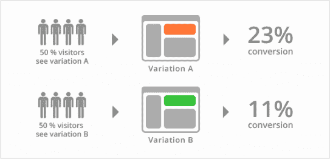
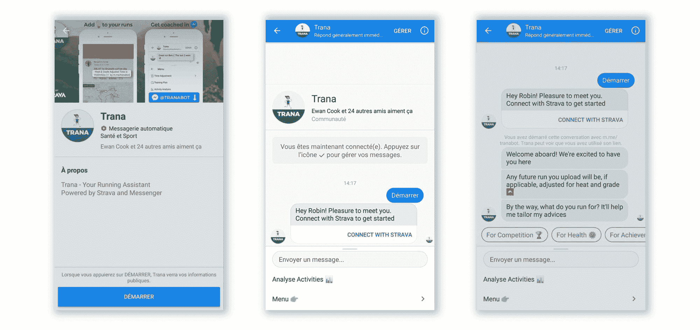
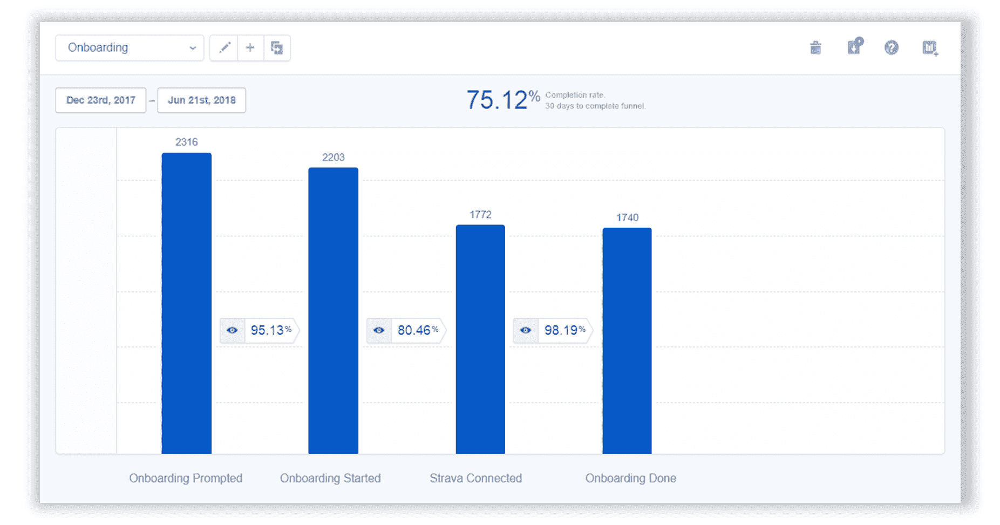
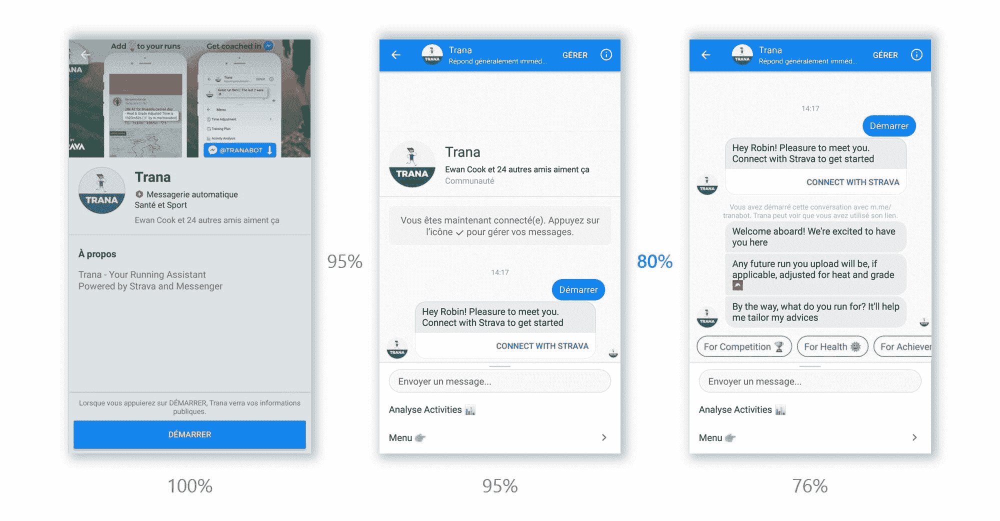
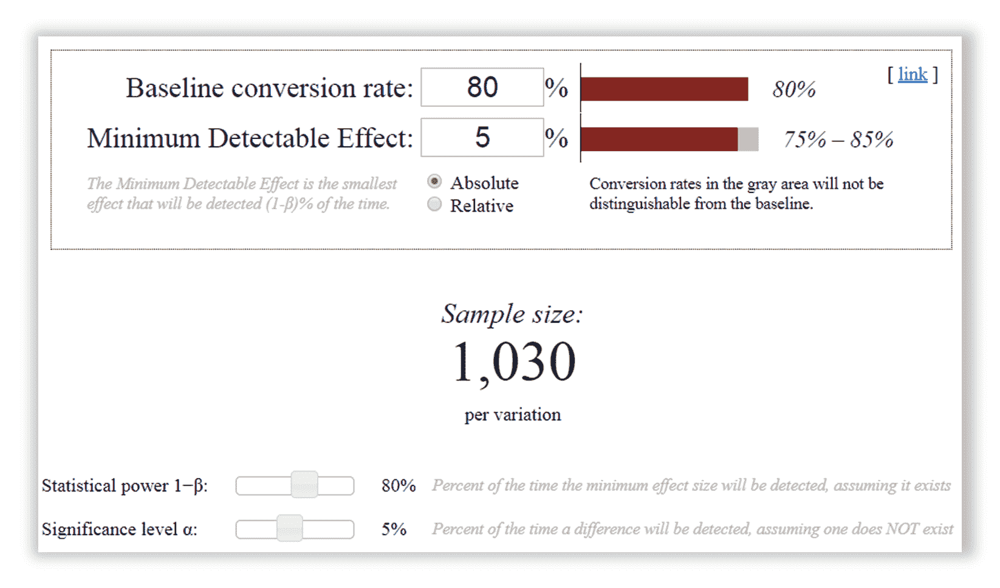
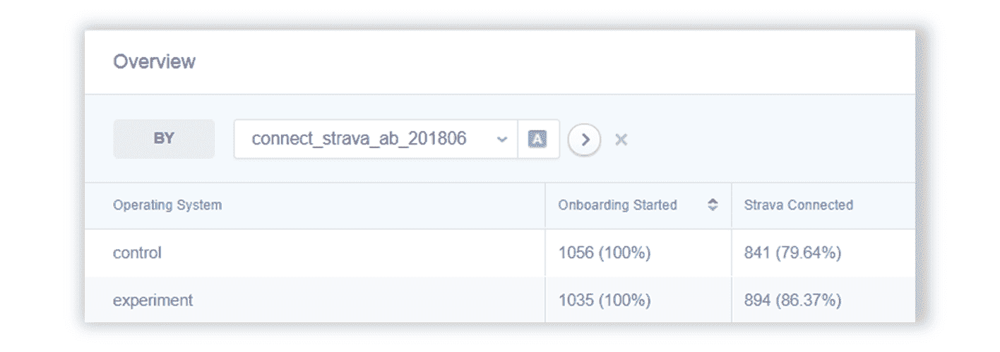
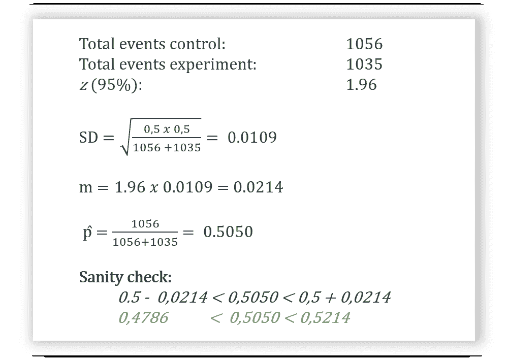
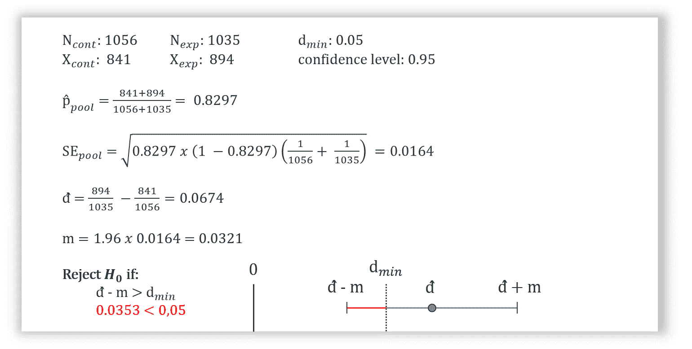

# A/B 测试:改进产品的权威指南

> 原文：<https://www.dataquest.io/blog/a-b-testing-the-definitive-guide-to-improving-your-product/>

October 11, 2018

> 从**“我想”**到**“我知道多少。”**

### 无论你是从事产品、设计还是发展，你都可能会遇到以下问题:

*   我们如何提高转化率？
*   我们如何改进我们的漏斗？
*   这项功能的发布有多成功？
*   这些通知是否提高了保留率？

### 通过正确地设计、运行和解释 A/B 测试，你可以得到这些问题的答案

开始测试之旅所需的一切就是:

*   **基本统计理解**
*   **准确和充分的(> 1000 个月独立用户)产品数据**

所采用的方法是严格的，并且鼓励最佳实践，但是:

*   它不会展示频繁假设检验背后的数学原理。
*   **它不会**涵盖更高级的方面，如贝叶斯环境中的 A/B、多变量测试或 Bonferroni 校正。

准备好了吗？我们开始吧！

## 0.理解分割测试是一种改进产品的定量方法，并且很容易出错

从本质上来说，A/B 测试是一种比较用户旅程中两个版本的流程的方法，以确定哪一个执行得最好。

为了能够从你的测试中获得洞察力，你需要在每组(分别称为*控制组*和*实验组*)中有**足够多的人，以及**足够多的转化差异**。这两个值都应该在**运行您的测试之前定义**，正如您将在第 3 点中看到的。**

## 1.从您的产品漏斗中选择一个重要的转化步骤

从技术上讲，你可以测试任何东西，比如改变你的条款和条件页面上的字体。但是，您总是希望选择对您的业务成果影响最大的步骤。此外，请记住数据量的重要性——流量越大，得出结论的速度越快——以及**数据质量**的重要性——垃圾进，垃圾出。

> 糟糕的数据，糟糕的结论。数据少，结论慢。

让我们实际一点，为 [Trana](https://trana.glitch.me?ref=ab-testing-bp) 做这件事，我们将在这篇文章中使用这个例子。

Getting Started – Connecting Strava – Onboarding

Trana 是一个 Facebook Messenger*chat app*，为其用户提供额外的跑步洞察。为此，它连接到他们的斯特拉发帐户。因此，我们要求用户链接其帐户的时刻是关键。在这一本能原理的基础上，让我们分析一下我们的全面入职漏斗。在[设计了一个跟踪计划](https://segment.com/academy/intro/how-to-create-a-tracking-plan/)之后，这可以在诸如 Mixpanel 这样的工具中完成。

Funnel analysis in Mixpanel

我们可以看到，从*入职开始*到 *Strava 连接*，无论从绝对还是相对角度来看，关联账户都是最有影响力的行动。有自己重要的一步吗？我们继续吧！

## 2.分析从该步骤到所需动作的当前*点击率*

点击率(CTP)是给定用户点击进入下一步的概率。

它的值总是在 0 和 1 之间。因此**与**不同，点击率(CTR)是指点击次数/印象次数。

CTP 需要从选择的步骤到关键的行动，不一定是下一个步骤，因为你可能会以局部最大值结束。这里有一个简单的例子来理解这一点:假设您现在自动将人们从主页重定向到您产品的定价/溢价页面。你的家庭价格转换将通过屋顶，但你可能要评估人们是否更有可能成为优质用户。

简而言之:优化要着眼于结果，而不是下一步。

80% connect their Strava account, let’s improve that

我们从完整的漏斗中看到，CTP 为 80%。在这种情况下，联系他们的 Strava 帐户显然是一个重要的里程碑，因此我们可以使用这个转换概率作为目标指标。

## 3.构建一个假设来启动你的实验

AB 测试只不过是在方法上评估一个被称为**实验**的变异是否比被称为**控制**的当前情况表现得更好。
实验从构建假设开始。它可能来自直觉、客户反馈或团队讨论。

假设如下:*通过了解 Trana 如何帮助他们更智能地运行，用户将更愿意连接他们的 Strava 帐户*

## 4.确定样本量

这是 A/B 测试的核心，也是本指南中术语最多的部分。我很乐意回答你在 twitter 上提出的任何问题。

运行 A/B 测试包括创建一个控制和一个实验样本。*抽样*，给每个用户分配一个变体，将通过把你的用户分成两组来完成。

一个用户应该总是看到相同的变化，这意味着**采样是确定性的**，而不仅仅是 50%的概率。
我们通常根据奇数/偶数 id 进行采样，许多工具可以帮你做到这一点。

一个常见的错误是忽略抽样，直接改变你的产品，将新的转换概率与旧的进行比较。

这导致团队得出错误的结论，因为使用你的产品的人是随着时间而变化的。例如，你不能说新的信息流(来自广告的人使用的)比旧的信息流(你的朋友和家人使用的)差，因为看到它不太可能一开始就忍受你的产品。

您的样本量将由以下因素决定:

1.  你的基线转化率
2.  你选择的绝对*最小可检测效应* (MDE/d *min* )。这是您能够检测到的控制转化率和实验转化率之间的最小差异。如果你有大量的周流量(相对于最终的样本大小)，选择你觉得值得的最小差异。如果你不这样做，选择一个差异，导致合理的小样本量，但似乎仍然可以实现。
3.  Alpha (α):默认情况下保持为 95%
4.  Beta (β):默认情况下，keep 为 20%，这为 1-β提供了 80%的值

测试将一直运行到**两个**样本都有至少 1030 个观察值。根据历史流量，你可以估计那会持续多久。尽量让实验运行少于一个月。他们跑得越快，你的产品改进得越快。

[计算你的样本量](https://www.evanmiller.org/ab-testing/sample-size.html)，记下来，然后开始测试。一旦你有了足够的数据，你就可以分析结果。

## 5.从您的结果中获得有效的见解

#### 5.1 收集数据。

等到两个变量都有足够的样本量，然后继续收集数据。

Breakdown of CTP per version

实验转化率较好。这是第一个好迹象，但我们不能就此止步。所以让我们进行几项检查。

#### 5.2 确保您的采样工作符合预期。

首先，[检查取样是否偏向其中一组](https://abtesting.glitch.me)。以下是我们示例的计算:

#### 5.3 检查实验是否表现得明显更好。

评估实验是否优于对照组可能是一件麻烦的事。因此，我建立了一个小工具来做这件事，把你的数字插入它来执行三个检查。下面是计算的细节。d *min* 是最小可检测效应，N 是样本大小，X 是转换**计数**，采取预期行动的人数。

Statistical but no practical significance

其中 d̂ m 是置信区间。

以下是解释结果的方法:

*   d̂–m > d*𝑚𝑖𝑛*:
    试验优于对照组(**统计**和**实际**显著性)。将流程更改为新版本。
*   d̂–m > 0:
    实验优于对照(仅**统计**显著性)。我们的例子中的**就是这种情况。为了获得实际意义，你可以让测试运行更长时间。你也可以做出判断，跟着你的直觉走。**
*   d̂——你不能说实验的表现优于对照组。保持原来的版本，产生新的假设。

## 6.传达您的结果。

无论结果如何，**总是**沟通和记录。

我建议您在测试开始和结束时发出信号，将这些关键时刻作为利益相关者表达自己想法和了解最新变化的机会。

此外，始终记录和存档。你希望测试过程比你活得长，这样任何接手的人都有一个可供学习的实验库。

这里有一个[谷歌幻灯片模板，你可以用它来交流和记录你的结果](https://docs.google.com/presentation/d/1mvXSG99HPRkhSbhYhzvgqbX0oC_Fq6zh7OJ4QQbqJl0/copy)。

## 7.把这些都集中起来。

以下是你从**“我想”**到**“我知道多少”**应该采取的步骤:

1.  从您的产品漏斗中选择一个重要的转化步骤
2.  找出从这一步到所需行动的当前点击率(CTP)
3.  构建一个假设
4.  [确定样本量](https://www.evanmiller.org/ab-testing/sample-size.html)
5.  [收集和分析结果](https://abtesting.glitch.me/)
6.  [交流并记录您的结果](https://docs.google.com/presentation/d/1mvXSG99HPRkhSbhYhzvgqbX0oC_Fq6zh7OJ4QQbqJl0/copy)

### 多亏了这些惊人的资源，本指南才成为可能:

*   [Udacity 的 A/B 测试类](https://eu.udacity.com/course/ab-testing--ud257)
*   [埃文·米勒出色的 A/B 测试工具](https://www.evanmiller.org/ab-testing/)

### 以下是你可以更进一步的方法:

*   [使用顺序测试来确定结果](https://www.evanmiller.org/sequential-ab-testing.html)
*   [了解第一类和第二类错误](https://en.m.wikipedia.org/wiki/Type_I_and_type_II_errors)

*编者按:这篇文章最初发表在[罗宾·兰帕尔的博客](https://rrampaer.github.io/how-to-use-ab-testing-to-make-your-product-funnel-better#)上，并被 perlesson 转载。*