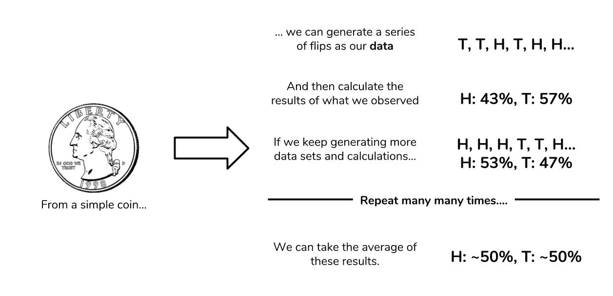
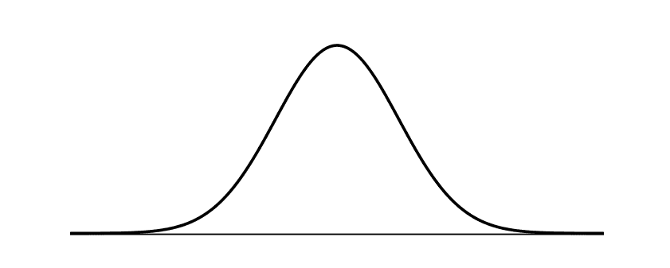
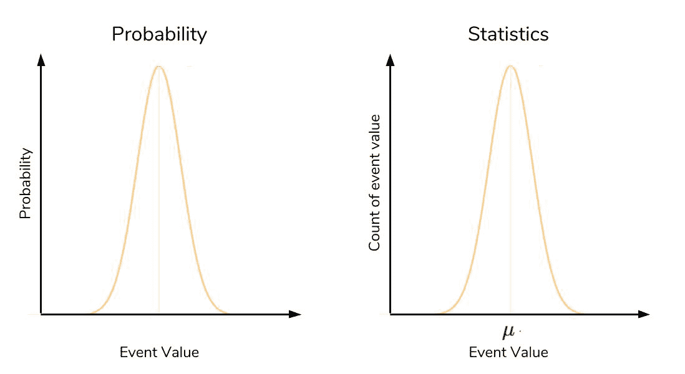
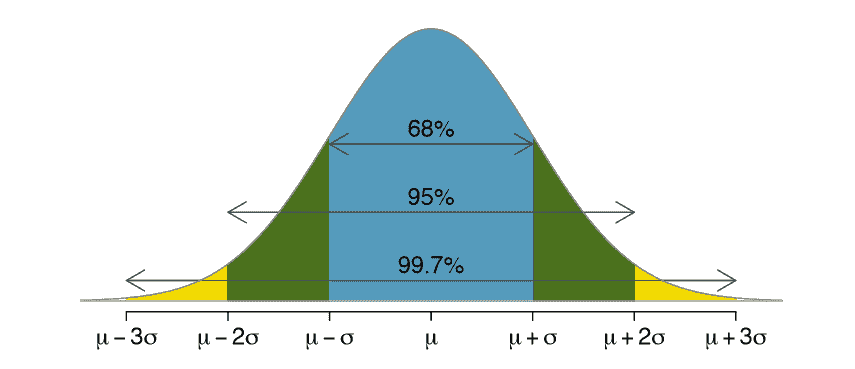
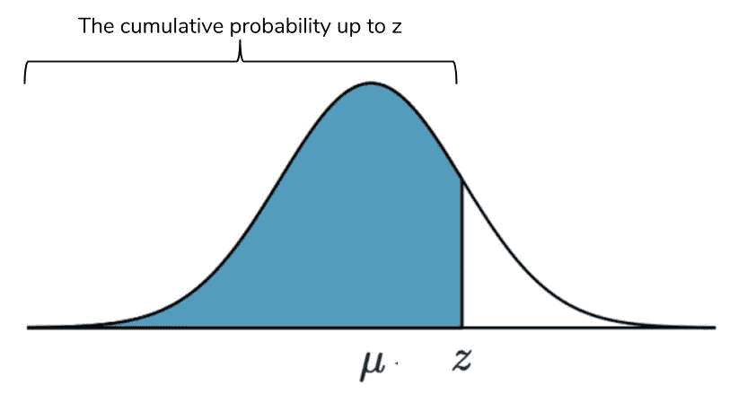
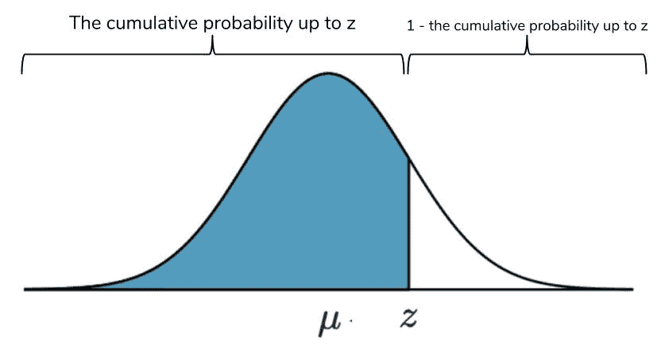

# 教程:Python 中的基本统计—概率

> 原文：<https://www.dataquest.io/blog/basic-statistics-in-python-probability/>

July 18, 2018

在学习数据科学的统计学时，你不可避免地要学习概率。人们很容易迷失在概率背后的公式和理论中，但它在工作和日常生活中都有重要的用途。我们之前已经讨论过描述统计学中的一些基本概念；现在我们将探索统计学与概率的关系。

### 先决条件:

与上一篇文章类似，本文假设没有统计学的先验知识，但是至少需要 Python 和一般数据科学工作流的一般知识。如果你对 for 循环和列表感到不舒服，我建议在继续之前，在我们的 Python 入门课程中简要介绍一下它们。

## 概率是什么？

在最基本的层面上，概率试图回答这样一个问题，“一个事件发生的可能性有多大？”一个**事件**是一些感兴趣的结果。为了计算一个事件发生的几率，我们还需要考虑所有其他可能发生的事件。概率的典型表现是简单的抛硬币。在掷硬币游戏中，唯一可能发生的事件是:

1.  翻转一个头
2.  翻转尾巴

这两个事件形成了**样本空间**，所有可能发生的事件的集合。为了计算一个事件发生的概率，我们计算感兴趣的事件可能发生的次数(比如翻转头部)并用它除以样本空间。因此，概率会告诉我们，一个理想的硬币有 1/2 的机会是正面或反面。通过观察可能发生的事件，概率给了我们一个框架来对事件发生的频率做出*预测*。然而，即使看起来很明显，如果我们真的试着扔一些硬币，我们很可能每隔一段时间就会得到异常高或异常低的人头数。如果我们不想假设硬币是公平的，我们能做什么？我们可以收集数据！我们可以使用统计学来计算基于现实世界观察的概率，并检查它与理想情况相比如何。

## 从统计到概率

我们的数据将通过投掷硬币 10 次并计算我们得到多少次正面来生成。我们将一组 10 枚硬币的投掷称为*试验*。我们的数据点将是我们观察到的人头数。我们可能不会得到“理想的”5 个头，但我们不会太担心，因为一次试验只是一个数据点。如果我们进行很多很多的试验，我们期望所有试验中的*平均*头数接近 50%。下面的代码模拟 10、100、1000 和 1000000 次试验，然后计算观察到的头部的平均比例。下图也总结了我们的流程。



```py
 import random
def coin_trial():
heads = 0
for i in range(100):
    if random.random() <= 0.5:
        heads +=1
    return heads
def simulate(n):
    trials = [] 
    for i in range(n):
        trials.append(coin_trial())
    return(sum(trials)/n)
simulate(10)
>>> 5.4
simulate(100)
>>> 4.83
simulate(1000)
>>> 5.055
simulate(1000000)
>>> 4.999781
```

`coin_trial`函数代表 10 次抛硬币的模拟。它使用`random()`函数生成一个介于 0 和 1 之间的浮点数，如果它在这个范围的一半以内，就增加我们的`heads`计数。然后，`simulate`根据您想要的次数重复这些试验，返回所有试验的平均人头数。抛硬币模拟给了我们一些有趣的结果。

首先，数据证实了我们的平均头数确实接近概率所建议的数量。此外，这个平均值*随着更多的试验而提高*。在 10 次试验中，会有一些微小的误差，但是在 1，000，000 次试验中，这个误差几乎完全消失。随着我们得到更多的试验，偏离平均值的*偏差*减小。听起来熟悉吗？当然，我们可以自己抛硬币，但是 Python 允许我们用代码对这个过程建模，从而节省了我们很多时间。随着我们获得越来越多的数据，现实世界开始与理想世界相似。

因此，给定足够的数据，统计学使我们能够使用真实世界的观察来计算概率。概率提供了理论，而统计学提供了用数据检验理论的工具。描述性统计，特别是均值和标准差，成为理论统计的替代物。你可能会问，“如果我可以计算理论概率本身，为什么我需要代理？”扔硬币是一个简单的玩具例子，但是更有趣的概率并不容易计算。

随着时间的推移，某人患病的几率有多大？当你在驾驶时，一个关键的汽车部件发生故障的概率是多少？没有简单的方法来计算概率，所以我们必须依靠数据和统计来计算它们。有了越来越多的数据，我们可以更加自信地认为，我们计算的数据代表了这些重要事件发生的*真实*概率。话虽如此，请记住我们之前在[发布的](https://www.dataquest.io/blog/basic-statistics-with-python-descriptive-statistics/)统计数据，你是一名实习侍酒师。在你开始购买葡萄酒之前，你需要弄清楚哪些葡萄酒比其他的好。你手头有很多数据，所以我们将使用我们的统计数据来指导我们的决策。

## 数据和分布

在我们解决“哪种葡萄酒比平均水平更好”的问题之前，我们必须记住我们的数据的性质。直觉上，我们想用酒的分数来比较不同的组，但是有一个问题:分数通常在一个范围内。我们如何比较不同类型葡萄酒的分数，并在一定程度上确定其中一种比另一种更好？进入**正态分布。**正态分布是概率统计领域中一个特别重要的现象。正态分布是这样的:

关于正态分布要注意的最重要的性质是它的**对称性**和它的**形状**。我们一直称之为分配，但是到底分配的是什么呢？这要看上下文。在概率上，正态分布是所有事件概率的一种特殊分布。x 轴代表我们想要知道其概率的事件值。y 轴是与每个事件相关联的概率，从 0 到 1。

这里我们没有深入讨论概率分布，但是知道正态分布是一种特别重要的概率分布。在统计学中，分配的是我们数据的值。这里，x 轴是我们数据的值，y 轴是这些值的计数。这是正态分布的同一张图片，但是根据概率和统计上下文来标记:

在概率上下文中，正态分布的高点代表发生概率最高的事件。当你在任何一边离这个事件越来越远时，概率迅速下降，形成那个熟悉的钟形。统计意义上的高点实际上代表了平均值。就概率而言，当你离平均值越远，频率就越低。也就是说，与平均值的极高和极低偏差是存在的，但极其罕见。

如果你通过正态分布怀疑概率和统计之间还有另一种关系，那么你这么想是对的！我们将在本文后面探讨这种重要的关系，所以请抓紧时间。因为我们将使用分数分布来比较不同的葡萄酒，所以我们将做一些设置来捕捉我们感兴趣的一些葡萄酒。我们将引入葡萄酒数据，然后分离出我们感兴趣的一些葡萄酒的分数。为了取回数据，我们需要以下代码:

```py
import csv
with open("wine-data.csv", "r", encoding="latin-1") as f:
    wines = list(csv.reader(f)) 
```

数据以表格形式显示如下。我们需要`points`列，所以我们将它提取到自己的列表中。我们从一位葡萄酒专家那里听说匈牙利的托卡伊葡萄酒非常棒，而一位朋友建议我们从意大利的 Lambrusco 开始。我们有数据对比这些酒！如果你不记得数据是什么样子的，这里有一个快速的表格可以参考并重新熟悉。

| 指数 | 国家 | 描述 | 指定 | 点 | 价格 | 省 | 区域 _1 | 区域 _2 | 多样化 | 酿酒厂 |
| --- | --- | --- | --- | --- | --- | --- | --- | --- | --- | --- |
| Zero | 美国 | “这个惊人的 100%…” | 马撒葡萄园岛 | Ninety-six | Two hundred and thirty-five | 加利福尼亚 | 纳帕谷 | 英特尔迅驰双核移动计算技术 | 解百纳索维浓 | Heitz |
| one | 西班牙 | “无花果的成熟香气… | 特别储备胡萝卜 | Ninety-six | One hundred and ten | 西班牙北部 | 公牛 |  | 廷塔-德托罗 | 博德加卡门·罗德里格斯 |
| Two | 美国 | “麦克·沃森荣誉…… | 特别精选晚熟收获 | Ninety-six | Ninety | 加利福尼亚 | 骑士谷 | 索诺马 | 白葡萄酒 | 麦考利 |
| three | 美国 | “这花了 20 个月…… | 保留 | Ninety-six | Sixty-five | 俄勒冈州 | 威拉米特山谷 | 威拉米特山谷 | 黑皮诺酒 | 庞氏骗局 |
| four | 法国 | “这是顶级葡萄酒… | 拉布雷拉德 | Ninety-five | Sixty-six | 普罗旺斯 | 班多尔 |  | 普罗旺斯红混合 | 米色区 |

```py
 # Extract the Tokaji scores
tokaji = []
non_tokaji = []
for wine in wines:
    if points != '':
        points = wine[4]
    if wine[9] == "Tokaji":
    tokaji.append(float(points))
    else:
        non_tokaji.append(points)
# Extract the Lambrusco scores
lambrusco = []
non_lambrusco = []
for wine in wines:
    if points != '':
        points = wine[4]
    if wine[9] == "Lambrusco":
        lambrusco.append(float(points))
    else:
        non_lambrusco.append(float(points))
```

如果我们将每组分数想象成正态分布，我们可以根据它们的位置立即判断两个分布是否不同。但是这种方法很快就会遇到问题，如下所示。我们假设分数将呈正态分布，因为我们有*吨*的数据。虽然这个假设在这里是可以的，但是我们将在后面讨论这样做实际上什么时候是危险的。

当两个分数分布重叠太多时，最好假设它们实际上来自同一个分布，没有什么不同。在另一个没有重叠的极端情况下，假设分布不相同是安全的。我们的问题在于有些重叠。考虑到一个分布的极端高点可能与另一个分布的极端低点相交，我们怎么能说这些组是不同的呢？在这里，我们必须再次呼吁正态分布给我们一个答案，并在统计和概率之间架起一座桥梁。

## 重温常态

正态分布对概率统计有重要意义得益于两个因素:**中心极限定理**和**三适马法则**。

### 中心极限定理

在上一节中，我们展示了如果我们重复 10 次投掷试验很多很多次，所有这些试验的平均人数将接近我们对理想硬币的预期的 50%。随着试验越来越多，这些试验的平均值就越接近*真实*概率，即使单个试验本身并不完美。这个想法是中心极限定理的一个关键原则。在我们掷硬币的例子中，10 次投掷的单次试验产生了一个单次的*估计*，该估计表明*应该发生什么(5 次正面)。我们称之为估计，因为我们知道它不会是完美的(即，我们不会每次都得到 5 个头)。*

如果我们做出许多估计，中心极限定理表明这些**估计**的**分布**将看起来像正态分布。这种分布的顶点将与估计值应该呈现的真实值一致。在统计学中，正态分布的峰值与平均值一致，这正是我们观察到的。因此，给定多个“试验”作为我们的数据，中心极限定理表明我们可以专注于由概率给出的理论理想，即使我们不知道真实的概率。中心极限定理让我们知道许多试验平均值将接近真实平均值，三适马法则将告诉我们有多少数据将围绕这个平均值分布。

### 三个适马法则

三适马法则，也称为经验法则或 68-95-99.7 法则，是一种表达我们有多少观察值落在平均值的一定距离内的方式。请记住，标准偏差(也称为“sigma”)是数据集中观察值与平均值的平均距离。三适马法则规定，给定一个正态分布，68%的观察值将落在平均值的一个标准差之间。95%会落在二内，99.7%会落在三内。这些值的推导过程中涉及到大量复杂的数学运算，因此超出了本文的范围。关键是要知道三适马法则使我们能够知道在正态分布的不同区间下包含了多少数据。下面的图片很好地总结了适马三法则的含义。

我们将把这些概念与我们的葡萄酒数据联系起来。作为一名侍酒师，我们非常自信地想知道霞多丽和黑皮诺比一般的葡萄酒更受欢迎。我们有数以千计的葡萄酒评论，所以根据中心极限定理，这些评论的平均分数应该与葡萄酒质量的所谓“真实”表现一致(由评论者判断)。虽然三适马法则是关于你的数据有多少属于已知值的陈述，但它也是关于极端值的稀有性的陈述。任何偏离平均值超过三个标准偏差的值都应谨慎处理。通过利用三适马法则和 **Z 值**，我们将最终能够为霞多丽和黑皮诺与普通葡萄酒的不同程度设定一个值。

## z 分数

Z 得分是一个简单的计算，它回答了这样一个问题:“给定一个数据点，它离平均值有多少标准差？”下面的等式是 Z 分数等式。

Z 分数本身并不能给你提供多少信息。当与一个 **Z 表**比较时，它获得了最大的价值，该表列出了一个标准正态分布的**累积概率**，直到一个给定的 Z 分数。标准正态是平均值为 0、标准差为 1 的正态分布。即使我们的正态分布不是标准的，Z 得分也允许我们引用这个 Z 表。累积概率是到给定点为止所有值出现的概率的总和。

一个简单的例子是均值本身。平均值正好是正态分布的中间值，所以我们知道从左侧直到平均值为 50%的所有概率之和。如果你试图计算标准差之间的累积概率，三适马规则的值实际上会出现。下图提供了累积概率的可视化。我们知道*所有*概率之和必须等于 100%，所以我们可以使用 Z 表来计算正态分布下 Z 得分两侧的概率。计算超过某个 Z 分数的概率对我们很有用。它让我们从“一个值离平均值有多远”到“一个离平均值这么远的值有多大可能来自同一组观察值？”因此，从 Z 得分和 Z 表得出的概率将回答我们基于葡萄酒的问题。

```py
 import numpy as np
tokaji_avg = np.average(tokaji)
lambrusco_avg = np.average(lambrusco)
tokaji_std = np.std(tokaji)
lambrusco = np.std(lambrusco)
# Let's see what the results are
print("Tokaji: ", tokaji_avg, tokaji_std)
print("Lambrusco: ", lambrusco_avg, lambrusco_std)
>>> Tokaji: 90.9 2.65015722804
>>> Lambrusco: 84.4047619048 1.61922267961
```

这个看起来不太适合我们朋友的推荐！出于本文的目的，我们将把 Tokaji 和 Lambrusco 分数都视为正态分布。因此，每种葡萄酒的平均分数将代表它们在质量方面的“真实”分数。我们将计算 Z 分数，并查看 Tokaji 平均值与 Lambrusco 的差距。

```py
 z = (tokaji_avg - lambrusco_avg) / lambrusco_std
>>> 4.0113309781438229
# We'll bring in scipy to do the calculation of probability from the Z-table
import scipy.stats as st
st.norm.cdf(z)
>>> 0.99996981130231266
# We need the probability from the right side, so we'll flip it!
1 - st.norm.cdf(z)
>>> 3.0188697687338895e-05
```

答案挺小的，但是到底是什么意思呢？这个概率极小，需要一些仔细的解释。假设我们相信我们朋友的 Lambrusco 和葡萄酒专家的 Tokaji 之间没有什么不同。也就是说，我们认为 Lambrusco 和 Tokaji 的质量差不多。同样，由于葡萄酒之间的个体差异，这些葡萄酒的得分会有一些差异。由于中心极限定理，如果我们制作托卡伊和兰布鲁斯科葡萄酒的直方图，这将产生**正态分布的分数**。

现在，我们有了一些数据，可以计算这两种葡萄酒的平均值和标准差。这些值允许我们实际测试我们的信念，即 Lambrusco 和 Tokaji 具有相似的质量。我们使用 Lambrusco 葡萄酒评分作为基础，并比较了 Tokaji 的平均值，但我们可以轻松地反过来做。唯一的区别是 Z 值为负。Z 值是 4.01！请记住，适马三定律告诉我们，假设托卡伊和兰布鲁斯科相似，99.7%的数据应该落在 T2 3 个标准差内。

在一个 Lambrusco 和 Tokaji 葡萄酒被认为是一样的世界里，像 Tokaji 这样极端的平均得分概率是非常非常小的。小到我们不得不考虑相反的情况:托卡伊葡萄酒不同于兰布鲁斯科葡萄酒，会产生不同的分数分布。我们小心翼翼地选择了措辞:我小心翼翼地不说，“托卡伊葡萄酒比兰布鲁斯科葡萄酒更好。”他们极有可能是。这是因为我们计算了一个概率，虽然从微观上看很小，但并不为零。为了准确起见，我们可以说 Lambrusco 和 Tokaji 葡萄酒肯定不是来自同一个分数分布，但我们不能说一个比另一个更好或更差。

这种类型的推理属于**推理统计学**的范畴，本文只是试图给你一个简单的介绍。我们在这篇文章中讨论了很多概念，所以如果你发现自己迷路了，回头慢慢来。拥有这种思维框架是非常强大的，但是容易被误用和误解。

## 结论

我们从描述性统计开始，然后将它们与概率联系起来。根据概率，我们开发了一种方法来定量显示两个组是否来自相同的分布。在这种情况下，我们比较了两个葡萄酒推荐，发现它们很可能不来自相同的分数分布。换句话说，一种葡萄酒很可能比另一种更好。统计学不一定是只属于统计学家的领域。作为一名数据科学家，对常用的统计方法有一个直观的理解将会让你在发展你自己的理论和随后测试这些理论的能力上占有优势。我们在这里仅仅触及了推论统计学的表面，但是这里同样的一般思想将有助于在你的统计之旅中引导你的直觉。我们的文章讨论了正态分布的优势，但是统计学家也开发了技术来调整非正态分布。

## 进一步阅读

本文围绕正态分布及其与统计学和概率的联系展开。如果您有兴趣阅读其他相关的分布或了解更多关于推断统计学的知识，请参考下面的参考资料。

*   [学生的 t 分布:当我们只有几个数据点时](https://en.wikipedia.org/wiki/Student%27s_t-distribution)
*   [深入研究假设检验和推断统计](https://en.wikipedia.org/wiki/Statistical_hypothesis_testing)
*   [使用 Python 深入研究统计数据](https://www.youtube.com/watch?v=TMmSESkhRtI)

## 获取免费的数据科学资源

免费注册获取我们的每周时事通讯，包括数据科学、 **Python** 、 **R** 和 **SQL** 资源链接。此外，您还可以访问我们免费的交互式[在线课程内容](/data-science-courses)！

[SIGN UP](https://app.dataquest.io/signup)