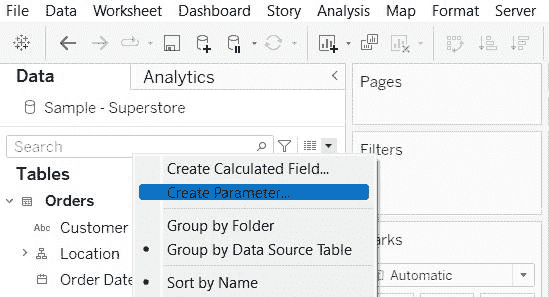
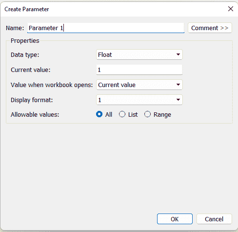
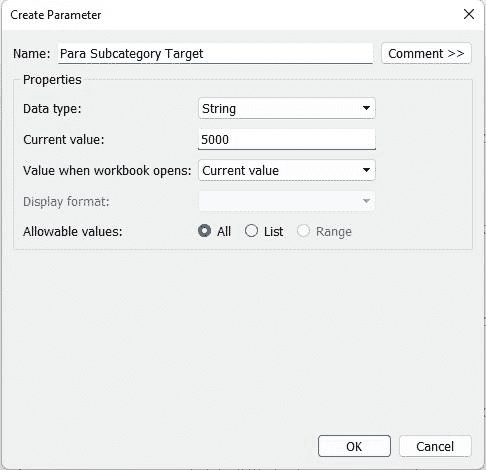
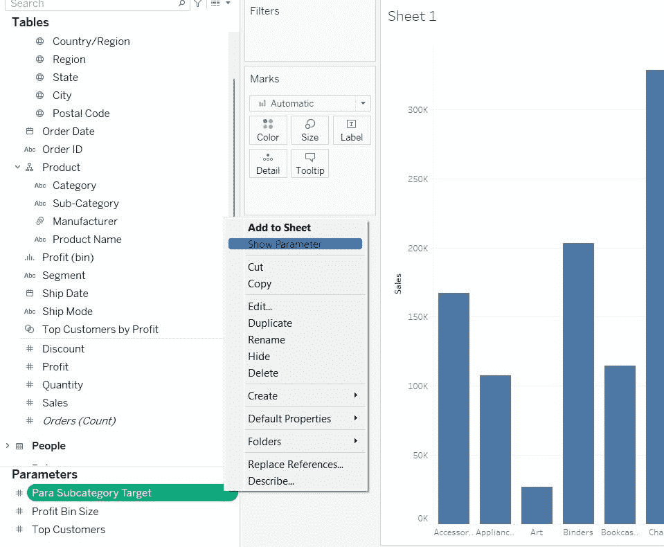
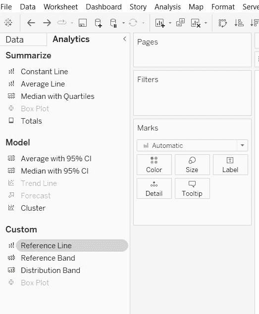
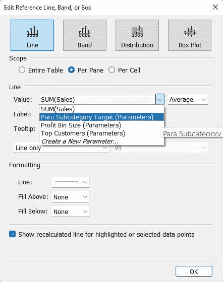
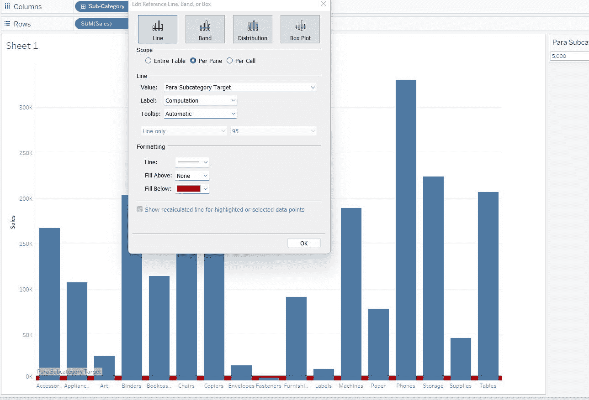
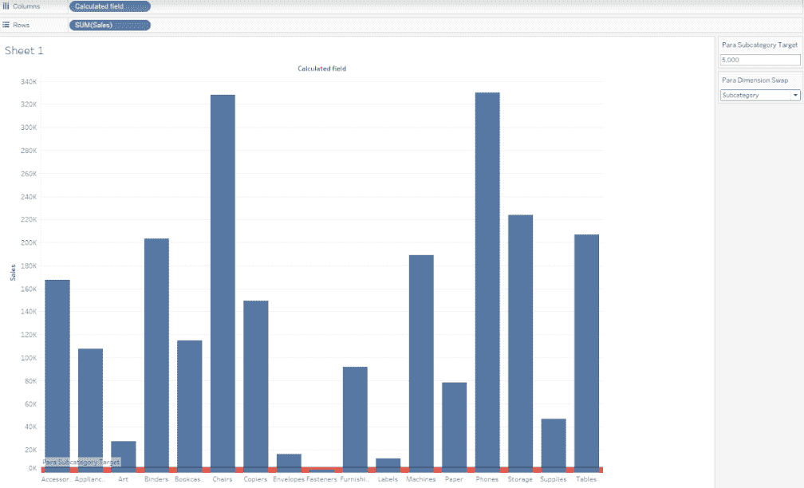

# 如何在 Tableau 中创建参数(简单指南)

> 原文：<https://www.dataquest.io/blog/creating-parameters-in-tableau/>

October 10, 2022

## **Tableau 中的参数是什么？**

参数是 Tableau 中最通用和最有用的功能之一，尤其是在 2020 年添加了参数仪表板操作之后。就像 Tableau 中的任何东西一样，我们可以从小处着手，然后逐渐变得更复杂——Tableau 参数也不例外。

## **为什么要在 Tableau 中使用参数？**

但是在我们开始之前，你可能想知道 tableau 中的参数是什么，我们为什么要使用它？匪夷所思的问题。tableau 参数类似于计算字段，因为它不是数据集的一部分，而是由 tableau 开发人员创建的。它也类似于过滤器，因为分析消费者通常会在仪表板上看到 Tableau 参数，他们可以单击该参数来自定义视图。它不同于计算字段和过滤器，因为一旦我们部署了它，它在创建和行为方面给了我们更多的灵活性。

在开始在 Tableau 中创建参数之前，下面是 Tableau 参数的一些最常见用法:

1.  创建前 x 个过滤器
2.  更改图表中显示的维或度量
3.  选择要突出显示的单个值

## **如何在 Tableau 中创建参数**

在 Tableau 中创建参数的方式与创建计算字段的方式相同。单击搜索栏右侧的下拉箭头。选择**创建参数**。然后我们将看到这个小部件。让我们过一遍。

**名称:**这将是参数的名称。

(提示—我喜欢以前缀“Para”或“@”开始我的所有参数，这样它们更容易识别。)

**数据类型:**我们在这里选择是浮点、整数、字符串(文本)还是日期类型。

**显示格式:**允许我们格式化数值(例如，将其改为货币)。

**当前值:**这是默认的起始值。

**工作簿打开时的值:**这里的默认值是当前值，在初学者教程中我们不会与此进行交互，但是随着我们获得更多关于参数的经验，这里有一些有用的功能。

**允许值:**缺省值为 all，这意味着任何浮点值(因此所有十进制数)都是有效的输入。一个*列表*意味着我们，作为开发者，给用户一个预定义的允许值列表来选择。*范围*(文本参数不可用)允许我们设置起点和终点，起点和终点之间的所有值都有效。

## **在 Tableau 中创建参数**

让我们看两个例子，看看何时以及如何在 Tableau 中创建一个参数。我将使用超市销售数据集，这是内置于 Tableau。第一个示例是创建一个动态目标，用户可以控制它来快速查看哪些维度高于或低于目标。

在创建参数之前，让我们通过将**子类别**添加到**列并将**销售添加到**行**来构建一个快速图表。现在对于参数，让我们按照这些步骤。

1.  点击字段搜索栏旁边的箭头，选择**创建参数**。
2.  将参数命名为“Para 子类别目标”
3.  将数据类型改为**整数**。
4.  将当前值更改为 5000。
5.  点击**确定**。

当我们单击 **OK** 时，计算字段窗格中会出现一个名为“Parameters”的新部分在该列表中，我们应该看到 *Para 子类别目标*。

如果我们右击参数并选择**显示参数**，参数控制部分出现在左侧。它将生成一个类似于过滤器的框，标题为“Para 子类别目标”，值为 5000。

参数本身是没有帮助的，所以我们必须采取第二步，将它们添加到我们的可视化或者计算字段中。例如，如果您在参数控件中键入 6000，我们的条形图不会发生任何变化。让我们将这个参数添加到图表中。

1.  在字段列表的顶部，有一个将窗格更改为“分析”的选项
2.  在“数据分析”面板中，将参考线拖到图表上。
3.  对于数值，从参数中选择**，并选择**参数子类别目标**。**
4.  点击下方的**填充，选择**红色**。**

这样，我们就有了一个动态目标，我们可以很容易地看到哪些子类别表现不佳。

参数的另一个常见用例是作为动态维度互换器，这是一个根据用户输入改变图表维度的参数。让我们创建第二个参数。这个将被称为“对位维度互换”

1.  对于第二个参数，将类型设置为**字符串**。
2.  把它做成一个**列表**。
3.  在列表中，每一行输入以下内容:**子类别、地区、州**。
4.  点击**确定**。
5.  创建如下所示的计算字段:

现在，我们可以将新的计算字段拖到图表中的**子类别**维度上。如果我们右键单击我们的 **Para Dimension Swap** 参数并单击 **Show Parameter** ，我们可以让数据消费者选择他们如何查看该图表。当然，由于原始参数仍然存在，我们还可以在进行分析时调整目标参考线。

## **使用 Tableau 参数**

我们刚刚探索了实现 Tableau 参数的两个介绍性示例，但是用例是无穷无尽的。掌握 Tableau 参数可以彻底改变 Tableau 开发体验，并在我们为用户创建定制的数据消费体验时打开一个充满可能性的世界。

随着我们获得参数方面的经验，我们可以尝试诸如测量交换、尺寸突出显示和页面交换等概念。一旦我们感到非常自信，我们就可以在仪表板上包含参数操作，这本身就非常强大。

现在，拿出你最喜欢的工作簿，尝试一些你自己的参数！

如果你想了解这个主题的更多信息，请查看 Dataquest 的 Tableau Path 中的交互式[数据可视化，它将帮助你在大约 2 个月内掌握这些技能。](https://www.dataquest.io/path/data-visualization-in-tableau/)