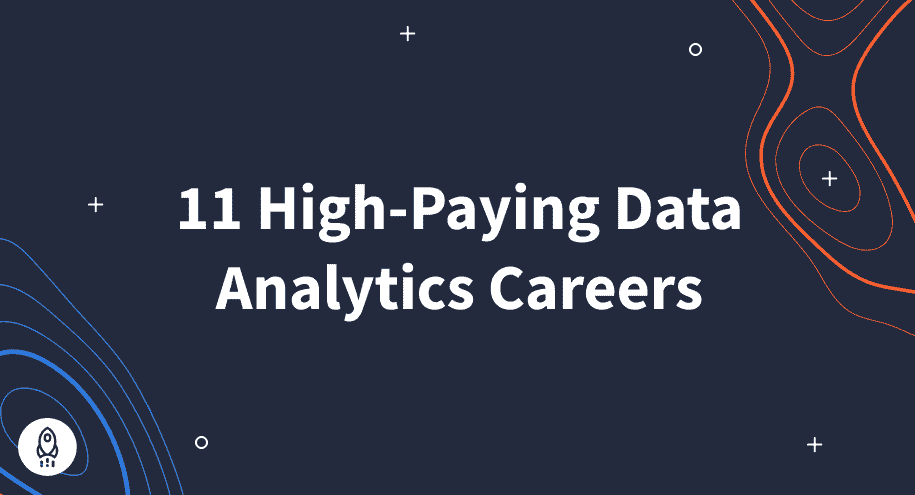

# 11 份高薪数据分析职业(2022 年 12 月)

> 原文：<https://www.dataquest.io/blog/data-analytics-careers/>

December 22, 2022

现在是学习数据分析并成为数据科学家的最佳时机。工作前景看好，机会横跨多个行业。工作的性质通常允许远程工作，灵活的时间表，甚至自营职业。

此外，许多数据分析专家的工资中位数很高，即使是在入门级的职位上！

劳工统计局认为数据科学是增长最快的前 20 个职业之一，并预测未来 10 年将增长 31%。

此外，数据科学领域的技能和工作机会超越了技术和数字领域。让我们看看作为一名分析师或数据科学家，你需要知道些什么，以及要达到这些目标，你需要学习些什么。

## 为什么选择数据分析职业？

数据分析职业之所以有吸引力，有很多实际原因。以下是几个例子:

*   高平均工资
*   技术工人的机会越来越多
*   职业发展的空间很大

然而，有几个不太明显的原因可以解释为什么从事数据分析是一个很好的选择:

*   基于解决问题的有趣的日常工作
*   技术工作和人际交流的良好结合
*   数据科学技能可以转移到许多其他职业中
*   典型的弹性工作时间和环境
*   几乎没有强制性的资格证书——技能比学位或证书更重要
*   丰富的学习资源——比以往任何时候都更容易[了解到获得数据分析工作所需的一切](https://www.dataquest.io/path/data-analyst/)
*   各种各样的可用机会

感兴趣吗？让我们先来看看这个领域中收入最高的工作，然后我们再来探究你需要哪些技能才能达到这个目标。

## **11 项使用数据分析的工作**

在你开始学习一项新技能之前，你应该了解相关职位的收入潜力。

这里有几个值得研究的职位，以及它们的中值收入。

### 1.商业智能分析师

商业智能分析师的主要工作是从他们公司的数据中提取价值。

在大多数公司，BI 分析师需要熟练地分析数据、使用 SQL、创建数据可视化和模型。和大多数数据角色一样，这份工作也需要很强的沟通能力。

2022 年，商业智能分析师的平均年薪为 80，323 美元，外加平均 7，000 美元的现金奖励。

**查看我们的** [**数据分析用异能匕技能路径**](https://www.dataquest.io/path/analyzing-data-with-microsoft-power-bi-skill-path/) **。**

### 2.数据分析师

数据分析师的工作职能正如其职位所暗示的那样——分析公司和行业数据以提取价值。

数据分析师在每个行业都有工作，尽管职位名称可能会有所不同。有些角色会有特定的行业名称，如“医疗保健数据分析师”“业务分析师”、“情报分析师”和其他类似名称的角色通常与数据分析师角色重叠。

与数据科学家不同，数据分析师通常不需要精通机器学习。大多数数据分析师工作需要编程和 SQL 技能，以及统计知识、熟悉数据分析工作流程和数据可视化技能。

2022 年，数据分析师的平均工资为[72443 美元/年](https://www.indeed.com/career/data-analyst/salaries?from=top_sb)，外加 2000 美元奖金。

**如果你对数据分析师职业感兴趣，我们有一条** [**数据分析师职业道路**](https://www.dataquest.io/path/data-analyst/) **，将带你从完全的初学者走向工作就绪。**

### 3.数据科学家

与其他角色的分析师非常相似，数据科学家收集和分析数据，然后传达可行的见解。数据科学家通常比数据分析师高一个技术层次。他们可以从更明智的角度理解数据，以帮助做出预测。

这些职位需要很强的数据分析知识，包括软件工具、Python 或 R 等编程语言以及数据可视化技能，以交流他们的发现。

这些职位既有挑战性又有回报，平均工资为 145，145 美元。对具有技术背景的数据分析专家的需求空前高涨。

**用我们的** [**数据科学家之路**](https://www.dataquest.io/path/data-scientist/) **开启你的数据科学家生涯。**

### 4.数据工程师

数据工程师通常专注于更大的数据集，他们的工作是优化围绕不同数据分析流程的基础架构。

例如，数据工程师可能专注于捕获数据的过程，以提高采集管道的效率。他们可能还需要升级数据库基础设施以实现更快的查询。这些高级数据分析专业人员收入丰厚，平均工资[与数据科学家相当，为 94，262 美元](https://www.payscale.com/research/US/Job=Data_Engineer/Salary)。

**我们的** [**数据工程师之路**](https://www.dataquest.io/path/data-scientist/) **将带你了解开启数据工程师职业生涯所需的一切。**

### 5.定量分析师

定量分析师是另一个非常抢手的职业，尤其是在金融公司。定量分析师使用数据分析来发现潜在的金融投资机会或风险管理问题。

他们也可能独自冒险，创建交易模型来预测股票、商品、汇率等的价格。这个行业的一些分析师甚至开始自己开公司。2022 年，量化分析师的[工资中位数是 85995 美元](https://www.payscale.com/research/US/Job=Quantitative_Analyst/Salary)。

**想成为量化分析师？我们有** [**课程帮你学习数据分析**](https://www.dataquest.io/path/python-basics-for-data-analysis/) **。**

### 6.数据分析顾问

像许多这些职位一样，分析顾问的主要作用是为公司提供见解，帮助他们做出更好的决策。

虽然分析顾问可能专注于任何特定的行业或研究领域，但顾问与内部数据科学家或数据分析师之间的区别在于，顾问可能会短期为不同的公司工作。他们也可能同时为不止一家公司工作，专注于有明确目标的特定项目。

这些职位最适合那些喜欢改变的人，以及那些对某个特定研究领域有特殊兴趣的人。分析顾问经常远程工作，这是这一角色的另一个诱人之处。

不同行业的薪酬差异很大，但 87，068 美元是该职位在 2022 年的代表性薪酬。

**通过我们的** [**数据分析**](https://www.dataquest.io/path/python-basics-for-data-analysis/) **课程，开始成为数据分析顾问。**

### 7.运营分析师

运营分析师通常在大公司内部工作，但他们也可能作为顾问工作。

运营分析师关注企业的内部流程。这可能包括内部报告系统、产品制造和分销以及一般业务运营。

对于担任这些角色的专业人员来说，具备一般的业务知识是很重要的，通常还需要具备他们正在使用的系统的技术知识。运营分析师在各种类型的企业中工作，从大型连锁杂货店到邮政服务提供商，甚至在军队中。

2022 年，运营分析师的平均年薪为 68，080 美元，平均额外现金奖励为 3，750 美元。由于数据分析工作的多面性，以及你可能找到工作的许多行业，工资可能会有很大差异。

**下面是** [**一些课程**](https://www.dataquest.io/path/python-basics-for-data-analysis/) **帮助你入门数据分析。**

### 8.营销分析师

数字营销也依赖于数据分析。营销人员经常使用谷歌分析、定制报告工具和其他第三方网站等工具来分析网站和社交媒体广告的流量。

营销活动通常会涉及大量资金，因此营销专业人士依靠分析师做出如何利用现有资源的明智决策。

虽然数字营销人员的工资范围很广，但营销分析师的平均工资[为 65，792 美元](https://www.indeed.com/career/marketing-analyst/salaries)，对于高级和管理级别的职位，他们的工资可以超过六位数。

**对营销分析感兴趣？我们有** [**课程，可以帮助**](https://www.dataquest.io/path/python-basics-for-data-analysis/) **。**

### 9.项目管理人

项目经理使用分析工具来跟踪团队的进度、效率和生产力。为此，他们至少需要对数据分析有一个实用的理解。

这些职位通常是大公司的内部职位，通常是管理咨询。

项目经理的另一个职业轨迹是产品和供应链管理，公司依靠它来保持利润率和高效运营。

在 2022 年，[项目经理的典型薪资约为 73，495 美元](https://www.payscale.com/research/US/Job=Project_Manager/Salary)。

**想成为项目经理？我们有** [**课程**](https://www.dataquest.io/path/python-basics-for-data-analysis/) **帮助你学习数据分析。**

### 10.IT 系统分析师

系统分析员设计系统来解决信息技术中的问题。

这些职位所需的专业技术水平各不相同，这为行业和个人兴趣的专业化创造了机会。一些系统分析师使用现有的第三方工具来测试公司内部的软件，而其他人则通过结合数据分析和业务运营来开发新的专有工具。

2022 年，美国一名典型的 IT 系统分析师[的收入约为 86，474 美元](https://www.glassdoor.com/Salaries/us-it-systems-analyst-salary-SRCH_IL.0,2_IN1_KO3,21.htm)。

**参加关于数据分析的******课程，为 IT 系统分析师的工作做准备。****

 **### 11.运输物流专家

运输物流专家通常为亚马逊或 UPS 等大型航运公司以及海军运输公司、航空公司和城市规划办公室优化实物货物的运输。

数据分析背景对这项工作特别有帮助，因为运输物流专家需要可靠地确定产品和服务的最有效交付路径。他们必须查看大量数据，以帮助消除运输瓶颈，无论是在陆地、海上还是空中。

该行业经验丰富的专业人士[年收入约为 53，653 美元](https://www.glassdoor.com/Salaries/us-transportation-logistics-specialist-salary-SRCH_IL.0,2_IN1_KO3,38.htm)，这使得运输物流成为注重细节、具有前瞻性思维的个人极具吸引力的职业道路。

想成为运输物流专员？**通过我们关于数据分析的******课程，了解在运输物流领域工作所需的一切。****

 **## 数据分析工作需要哪些技能？

这里列出的许多工作都需要同样的基本技能。在你开始找工作之前，确保你已经掌握了这些技能！

如果你发现一项你仍需要学习的技能，一门负担得起的、[自定进度的数据科学课程](https://www.dataquest.io/)可能正是你所需要的。从以下基础开始。

### 计算机编程语言

Python 是目前最常用的编程语言之一。

了解如何使用 Python 进行数据分析是许多数据科学职位的要求。但是，即使不是必需的，了解 Python 也会帮助你在潜在雇主面前脱颖而出。

如果您准备好提高您的编程语言水平，学习如何操作和分析数据，并开始 web 抓取和数据收集，当您注册我们的[Python for Data Science:Fundamentals 课程](https://www.dataquest.io/course/python-for-data-science-fundamentals/)时，您可以立即开始构建 web 应用程序。

### 结构化查询语言

使用数据源是数据分析的一个必要方面。

在职业生涯的早期，您至少需要对 SQL 有一个基本的了解。SQL 通常是这些职位的主要组成部分。当你面试时，许多招聘经理在询问你与数据库有关的工作时会提到 SQL。

您将在我们的 SQL 课程中获得的经验是一个良好的开端。像 Python 一样，SQL 是一种相对容易学习的语言。即使你是新手，一点 SQL 经验也大有帮助。

了解 SQL 的基础知识会让你有信心浏览大型数据库。一旦你有了第一份工作，你可以随时寻找机会学习更高级的 SQL 操作。

### 数据可视化技能

知道如何可视化数据和交流结果对求职者来说是一个巨大的优势。

在就业市场上，这些技能需求很大，而且报酬丰厚！不管你在考虑什么职业道路，能够可视化和交流与公司底线相关的见解是一项有价值的技能。

在 Dataquest，我们使用数据科学和可视化库，让学生掌握 Python 和 R 中的数据可视化技能，这将使你走上成为优秀的数据可视化者的道路。如果你想学习这个技能，可以看看我们的[数据可视化技能路径](https://www.dataquest.io/path/data-analysis-and-visualization-with-python/)。****