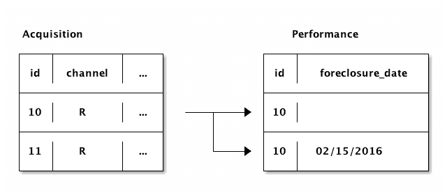
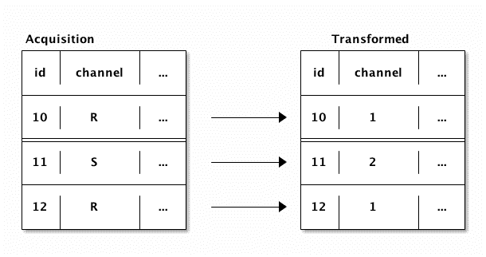
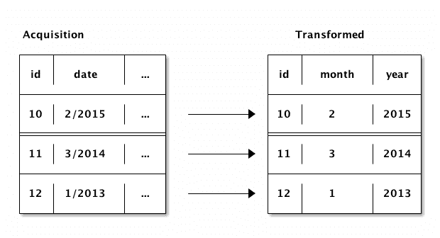

# 构建数据科学投资组合:机器学习项目

> 原文：<https://www.dataquest.io/blog/data-science-portfolio-machine-learning/>

July 5, 2016Companies are increasingly looking at data science portfolios when making hiring decisions, and having a machine learning project in your portfolio is key.

(这是关于如何构建数据科学组合的系列文章的第三篇。你可以在文章的底部找到本系列其他文章的链接。)

制作高质量作品集的第一步是要知道要展示什么技能。公司希望数据科学家具备的主要技能，也就是他们希望投资组合展示的主要技能是:

*   通讯能力
*   与他人合作的能力
*   技术能力
*   对数据进行推理的能力
*   主动的动机和能力

任何好的投资组合都将由多个项目组成，每个项目都可能展示上述 1-2 点。这是一个系列的第三篇文章，将介绍如何制作一个全面的数据科学投资组合。

在这篇文章中，我们将讨论如何制作你的作品集中的第二个项目，以及如何构建一个端到端的机器学习项目。最后，你会有一个展示你数据推理能力和技术能力的项目。

如果你想看的话，这是已经完成的项目。

## 一个端到端的机器学习项目

作为一名数据科学家，有时你会被要求获取一个数据集，并想出如何用它来讲述一个故事。在这种时候，很重要的一点是要很好地沟通，并走完你的过程。像 Jupyter notebook 这样的工具，我们在之前的帖子中使用过，可以很好地帮助你做到这一点。这里的期望是，可交付成果是总结您的发现的演示文稿或文档。

然而，有时候你会被要求创建一个有操作价值的项目。一个有运营价值的项目直接影响着公司的日常运营，会被不止一次的使用，而且往往会被多人使用。像这样的任务可能是“创建一个算法来预测我们的流失率”，或者“创建一个可以自动标记我们的文章的模型”。

在这种情况下，讲故事不如技术能力重要。您需要能够获取一个数据集，理解它，然后创建一组可以处理该数据的脚本。这些脚本快速运行并使用最少的系统资源(如内存)通常很重要。这些脚本会被运行多次，这是很常见的，所以可交付的东西变成了脚本本身，而不是演示文稿。可交付成果通常被集成到操作流程中，甚至可能是面向用户的。构建端到端项目的主要组件包括:

*   理解上下文
*   探索数据，找出细微差别
*   创建一个结构良好的项目，使其易于集成到操作流程中
*   编写运行速度快且使用最少系统资源的高性能代码
*   很好地记录您的代码的安装和使用，这样其他人就可以使用它

为了有效地创建这种类型的项目，我们需要处理多个文件。强烈推荐使用像 Atom T1 这样的文本编辑器，或者像 T2 py charm T3 这样的 IDE。这些工具将允许您在文件之间跳转，并编辑不同类型的文件，如 markdown 文件、Python 文件和 csv 文件。

构建你的项目，使其易于版本控制和上传到协作编码工具，如 [Github](https://github.com/) 也是有用的。*Github 上的这个项目。*在这篇文章中，我们将使用我们的编辑工具以及像 [Pandas](https://pandas.pydata.org/) 和 [scikit-learn](https://scikit-learn.org/) 这样的库。我们将广泛使用 Pandas [DataFrames](https://pandas.pydata.org/pandas-docs/stable/generated/pandas.DataFrame.html) ，这使得在 Python 中读取和处理表格数据变得容易。

## 寻找好的数据集

端到端机器学习项目的良好数据集可能很难找到。数据集需要足够大，这样内存和性能限制才能发挥作用。它还需要具有潜在的可操作性。例如，[这个数据集](https://collegescorecard.ed.gov/data/)，包含美国大学 adlesson 标准、毕业率和毕业生未来收入的数据，将是一个用来讲述故事的很好的数据集。

然而，当您考虑数据集时，很明显没有足够的细微差别来用它构建一个好的端到端项目。例如，你可以告诉某人，如果他们去某个特定的大学，他们未来的潜在收入是多少，但这将是一个快速的查找，没有足够的细微差别来证明技术能力。你也可以弄清楚 adless 标准较高的大学是否倾向于让毕业生挣得更多，但这更多的是讲故事，而不是操作。

当您拥有超过 1gb 的数据时，以及当您对想要预测的内容有一些细微差别时，这些内存和性能约束往往会发挥作用，这涉及到在数据集上运行算法。一个好的操作数据集使您能够构建一组转换数据的脚本，并回答动态问题。

一个很好的例子是股票价格的数据集。您将能够预测第二天的价格，并在市场关闭时不断向算法输入新数据。这将使你能够进行交易，甚至有可能获利。这不是讲故事，而是增加直接价值。找到这样的数据集的一些好地方是:

*   [/r/datasets](https://reddit.com/r/datasets) —拥有数百个有趣数据集的子编辑。
*   [Google 公共数据集](https://cloud.google.com/bigquery/public-data/#usa-names) —可通过 Google BigQuery 获得的公共数据集。
*   [Awesome 数据集](https://github.com/caesar0301/awesome-public-datasets) —一个数据集列表，托管在 Github 上。

当您浏览这些数据集时，想想有人可能希望用这些数据集来回答什么问题，并想想这些问题是否是一次性的(“房价如何与标准普尔 500 相关联？”)，或者正在进行(“你能预测股市吗？”).这里的关键是找到正在进行的问题，并要求相同的代码使用不同的输入(不同的数据)运行多次。

出于本文的目的，我们将看看[房利美贷款数据](https://www.fanniemae.com/portal/funding-the-market/data/loan-performance-data.html)。房利美是美国政府支持的企业，从其他贷方购买抵押贷款。然后，它将这些贷款打包成抵押贷款支持证券并转售。这使得贷款人可以发放更多的抵押贷款，并在市场上创造更多的流动性。这在理论上导致更多的房屋所有权，以及更好的贷款条件。

不过，从借款人的角度来看，情况基本没变。

房利美发布两种类型的数据——关于其收购的贷款的数据，以及这些贷款在一段时间内表现如何的数据。在理想的情况下，有人从贷款人那里借钱，然后偿还贷款，直到余额为零。然而，一些借款人错过了多次付款，这可能会导致取消抵押品赎回权。取消抵押品赎回权是指房子被银行没收，因为无法支付抵押贷款。

房利美跟踪哪些贷款已经逾期，哪些贷款需要取消抵押品赎回权。该数据每季度发布一次，比当前日期滞后`1`年。

在撰写本文时，最新的可用数据集来自于`2015`的第一季度。房利美收购贷款时公布的收购数据包含借款人的信息，包括信用评分以及他们的贷款和住房信息。获得贷款后，每季度公布一次的业绩数据包含借款人支付的款项以及止赎状况(如果有的话)的信息。

获得的贷款在绩效数据中可能有几十行。一个很好的方法是，收购数据告诉你房利美现在控制着贷款，业绩数据包含贷款的一系列状态更新。其中一个状态更新可能会告诉我们贷款在某个季度被取消赎回权。 *被出售的止赎房屋。*

## 挑选一个角度

我们可以从房利美数据集的几个方面入手。我们可以:

*   试着预测房子取消赎回权后的销售价格。
*   预测借款人的付款历史。
*   在收购时算出每笔贷款的分数。

重要的是坚持单一角度。试图同时关注太多的事情会让你很难做一个有效的项目。选择一个有足够细微差别的角度也很重要。以下是没有太多细微差别的角度示例:

*   找出哪些银行出售给房利美的贷款被取消抵押品赎回权最多。
*   弄清楚借款人信用评分的趋势。
*   探索哪种类型的房屋最常被取消赎回权。
*   探索贷款金额和止赎销售价格之间的关系

以上所有的角度都很有趣，如果我们专注于讲故事会很好，但是不太适合运营项目。有了房利美的数据集，我们将试图通过仅使用获得贷款时可用的信息来预测贷款在未来是否会被取消赎回权。实际上，我们将为任何抵押贷款创建一个“分数”，告诉我们房利美是否应该购买它。这将为我们提供一个很好的基础，也将是一个很好的投资组合。

## 理解数据

让我们快速看一下原始数据文件。以下是从第`1`季度到第`2012`季度的前几行采集数据:

```py
100000853384|R|OTHER|4.625|280000|360|02/2012|04/2012|31|31|1|23|801|N|C|SF|1|I|CA|945||FRM|
100003735682|R|SUNTRUST MORTGAGE INC.|3.99|466000|360|01/2012|03/2012|80|80|2|30|794|N|P|SF|1|P|MD|208||FRM|788
100006367485|C|PHH MORTGAGE CORPORATION|4|229000|360|02/2012|04/2012|67|67|2|36|802|N|R|SF|1|P|CA|959||FRM|794 
```

这是第一季度的前几行性能数据

`2012`的`1`:

```py
 100000853384|03/01/2012|OTHER|4.625||0|360|359|03/2042|41860|0|N||||||||||||||||
100000853384|04/01/2012||4.625||1|359|358|03/2042|41860|0|N||||||||||||||||
100000853384|05/01/2012||4.625||2|358|357|03/2042|41860|0|N||||||||||||||||
```

在深入编码之前，花些时间真正理解数据是有用的。这在运营项目中更为关键——因为我们不是以交互方式探索数据，除非我们提前发现，否则很难发现某些细微差别。

在这种情况下，第一步是阅读房利美网站上的资料:

*   [概述](https://www.fanniemae.com/portal/funding-the-market/data/loan-performance-data.html)
*   [有用术语表](https://s3.amazonaws.com/dq-blog-files/lppub_glossary.pdf)
*   [常见问题解答](https://s3.amazonaws.com/dq-blog-files/lppub_faq.pdf)
*   [采集和性能文件中的列](https://s3.amazonaws.com/dq-blog-files/lppub_file_layout.pdf)
*   [样本采集数据文件](#)(不再提供)
*   [样本性能数据文件](#)(不再提供)

通读这些文件后，我们知道一些对我们有帮助的关键事实:

*   从`2000`年开始到现在，每个季度都有一个采集文件和一个性能文件。数据中有一个`1`年的滞后，所以在撰写本文时，最新的数据来自`2015`。
*   这些文件是文本格式的，以竖线(`|`)作为分隔符。
*   这些文件没有标题，但是我们有一个每一列是什么的列表。
*   这些文件总共包含了 100 万笔贷款的数据。
*   因为绩效档案中包含了前几年获得的贷款的信息，所以前几年获得的贷款会有更多的绩效数据(即`2014`年获得的贷款不会有太多的绩效历史)。

这些小信息将为我们节省大量时间，因为我们知道如何构建我们的项目和处理数据。

## 构建项目

在我们开始下载和研究数据之前，重要的是要考虑如何构建项目。构建端到端项目时，我们的主要目标是:

*   创造一个可行的解决方案
*   拥有运行速度快、使用资源最少的解决方案
*   让其他人能够轻松扩展我们的工作
*   让其他人更容易理解我们的代码
*   编写尽可能少的代码

为了实现这些目标，我们需要很好地组织我们的项目。一个结构良好的项目遵循几个原则:

*   将数据文件和代码文件分开。
*   将原始数据与生成的数据分开。
*   有一个`README.md`文件，引导人们完成项目的安装和使用。
*   有一个`requirements.txt`文件，其中包含运行项目所需的所有包。
*   有一个单独的`settings.py`文件，包含其他文件中使用的任何设置。
    *   例如，如果您从多个 Python 脚本中读取同一个文件，让它们都导入`settings`并从一个集中的地方获取文件名是很有用的。
*   有一个`.gitignore`文件，防止提交大文件或机密文件。
*   将任务中的每个步骤分解成一个单独的文件，可以单独执行。
    *   例如，我们可能有一个文件用于读入数据，一个用于创建要素，一个用于进行预测。
*   存储中间值。例如，一个脚本可能输出下一个脚本可以读取的文件。
    *   这使我们能够在数据处理流程中进行更改，而无需重新计算一切。

我们的文件结构很快就会变成这样:

```py
 loan-prediction
├── data
├── processed
├── .gitignore
├── README.md
├── requirements.txt
├── settings.py 
```

## 创建初始文件

首先，我们需要创建一个`loan-prediction`文件夹。在这个文件夹中，我们需要创建一个`data`文件夹和一个`processed`文件夹。第一个将存储我们的原始数据，第二个将存储任何中间计算值。

接下来，我们将制作一个`.gitignore`文件。一个`.gitignore`文件将确保某些文件被 git 忽略，而不是被推送到 Github。这种文件的一个很好的例子是 OSX 在每个文件夹中创建的`.DS_Store`文件。一个`.gitignore`文件的良好起点是这里的。

我们还想忽略数据文件，因为它们非常大，而且房利美条款禁止我们重新分发它们，所以我们应该在文件末尾添加两行:

```py
data
processed 
```

这里是这个项目的一个示例文件。接下来，我们需要创建`README.md`，这将帮助人们理解项目。`.md`表示文件为降价格式。Markdown 使您能够编写纯文本，但如果您愿意，也可以添加一些有趣的格式。这里有一个降价指南。如果你上传一个名为`README.md`的文件到 Github，Github 会自动处理 markdown，并显示给任何查看该项目的人。这里有一个例子。现在，我们只需要在`README.md`中放一个简单的描述:

```py
 Loan Prediction
-----------------------

Predict whether or not loans acquired by Fannie Mae will go into foreclosure.  Fannie Mae acquires loans from other lenders as a way of inducing them to lend more.  Fannie Mae releases data on the loans it has acquired and their performance afterwards [here](https://www.fanniemae.com/portal/funding-the-market/data/loan-performance-data.html). 
```

现在，我们可以创建一个`requirements.txt`文件。这将使其他人很容易安装我们的项目。我们还不知道我们将使用什么样的库，但这里是一个很好的起点:

```py
 pandas
matplotlib
scikit-learn
numpy
ipython
scipy 
```

上述库是 Python 中最常用的数据分析任务，可以合理地假设我们将使用其中的大部分。[这里是这个项目的一个示例需求文件。创建`requirements.txt`之后，您应该安装软件包。在这篇文章中，我们将使用`Python 3`。](https://github.com/dataquestio/loan-prediction/blob/master/requirements.txt)

如果你没有安装 Python，你应该考虑使用 [Anaconda](https://www.anaconda.com/distribution/) ，这是一个 Python 安装程序，它也安装上面列出的所有包。最后，我们可以创建一个空白的`settings.py`文件，因为我们的项目还没有任何设置。

## 获取数据

一旦我们有了项目的框架，我们就可以得到原始数据。房利美在获取数据方面有一些限制，所以你需要注册一个账户。你可以在这里找到下载页面[。创建帐户后，您可以下载任意数量的贷款数据文件。](https://apps.pingone.com/4c2b23f9-52b1-4f8f-aa1f-1d477590770c/signon/?flowId=03f6778d-1505-44e3-91dc-70698453816d)

这些文件是 zip 格式的，解压缩后相当大。为了这篇博文的目的，我们将下载从`Q1 2012`到`Q1 2015`的所有内容。然后我们需要解压缩所有的文件。解压文件后，删除原来的`.zip`文件。最后，`loan-prediction`文件夹应该是这样的:

```py
 loan-prediction
├── data
│   ├── Acquisition_2012Q1.txt
│   ├── Acquisition_2012Q2.txt
│   ├── Performance_2012Q1.txt
│   ├── Performance_2012Q2.txt
│   └── ...
├── processed
├── .gitignore
├── README.md
├── requirements.txt
├── settings.py 
```

下载完数据后，您可以使用`head`和`tail` shell 命令来查看文件中的行。您看到任何不需要的列了吗？在这样做的时候，参考列名的 [pdf 可能会有帮助。](https://s3.amazonaws.com/dq-blog-files/lppub_file_layout.pdf)

## 读入数据

目前有两个问题使我们的数据难以处理:

*   采集和性能数据集被分割成多个文件。
*   每个文件都缺少标题。

在我们开始处理数据之前，我们需要一个文件用于采集数据，一个文件用于性能数据。每个文件只需要包含我们关心的列，并有适当的标题。

这里的一个问题是性能数据非常大，所以如果可能的话，我们应该尝试修剪一些列。第一步是向`settings.py`添加一些变量，这些变量将包含我们的原始数据和处理后的数据的路径。我们还将添加一些其他设置，这些设置在以后会很有用:

```py
 DATA_DIR = "data"
PROCESSED_DIR = "processed"
MINIMUM_TRACKING_QUARTERS = 4
TARGET = "foreclosure_status"
NON_PREDICTORS = [TARGET, "id"]
CV_FOLDS = 3 
```

将路径放在`settings.py`中会将它们放在一个集中的地方，并使它们易于修改。当在多个文件中引用相同的变量时，将它们放在一个中心位置比在每个文件中编辑它们更容易。[这里是这个项目的](https://github.com/dataquestio/loan-prediction/blob/master/settings.py)示例`settings.py`文件。

第二步是创建一个名为`assemble.py`的文件，它将把所有的片段组装成`2`文件。当我们运行`python assemble.py`时，我们将在`processed`目录中获得`2`数据文件。然后我们将开始在`assemble.py`中编写代码。

我们首先需要定义每个文件的标题，因此我们需要查看列名的 [pdf，并创建每个采集和性能文件中的列列表:](https://s3.amazonaws.com/dq-blog-files/lppub_file_layout.pdf)

```py
 HEADERS = {
    "Acquisition": [
        "id",
        "channel",
        "seller",
        "interest_rate",
        "balance",
        "loan_term",
        "origination_date",
        "first_payment_date",
        "ltv",
        "cltv",
        "borrower_count",
        "dti",
        "borrower_credit_score",
        "first_time_homebuyer",
        "loan_purpose",
        "property_type",
        "unit_count",
        "occupancy_status",
        "property_state",
        "zip",
        "insurance_percentage",
        "product_type",
        "co_borrower_credit_score"
    ],
    "Performance": [
        "id",
        "reporting_period",
        "servicer_name",
        "interest_rate",
        "balance",
        "loan_age",
        "months_to_maturity",
        "maturity_date",
        "msa",
        "delinquency_status",
        "modification_flag",
        "zero_balance_code",
        "zero_balance_date",
        "last_paid_installment_date",
        "foreclosure_date", 
        "disposition_date",
        "foreclosure_costs",
        "property_repair_costs",
        "recovery_costs",
        "misc_costs",
        "tax_costs",
        "sale_proceeds",
        "credit_enhancement_proceeds",
        "repurchase_proceeds",
        "other_foreclosure_proceeds",
        "non_interest_bearing_balance",
        "principal_forgiveness_balance"
    ]
} 
```

下一步是定义我们想要保留的列。因为我们正在进行的关于贷款的测量是它是否曾经被取消抵押品赎回权，我们可以丢弃性能数据中的许多列。但是，我们需要保留收购数据中的所有列，因为我们希望最大化我们所拥有的关于贷款何时被收购的信息(毕竟，我们预测贷款在收购时是否会被取消赎回权)。丢弃列将使我们能够节省磁盘空间和内存，同时也加快我们的代码。

```py
 SELECT = {
    "Acquisition": HEADERS["Acquisition"],
    "Performance": [
        "id",
        "foreclosure_date"
    ]
} 
```

接下来，我们将编写一个函数来连接数据集。以下代码将:

*   导入几个需要的库，包括`settings`。
*   定义一个函数`concatenate`，它:
    *   获取`data`目录中所有文件的名称。
    *   遍历每个文件。
        *   如果文件不是正确的类型(不是以我们想要的前缀开头)，我们忽略它。
        *   使用熊猫 [read_csv](https://pandas.pydata.org/pandas-docs/stable/generated/pandas.read_csv.html) 函数将文件读入具有正确设置的[数据帧](https://pandas.pydata.org/pandas-docs/stable/generated/pandas.DataFrame.html)中。
            *   将分隔符设置为`|`，以便正确读取字段。
            *   数据没有标题行，因此将`header`设置为`None`来表示这一点。
            *   将名称设置为来自`HEADERS`字典的正确值——这些将是我们的数据帧的列名。
            *   仅从我们在`SELECT`中添加的数据帧中选择列。
    *   将所有数据帧连接在一起。
    *   将连接的数据帧写回文件。

```py
 import os
import settings
import pandas as pd
def concatenate(prefix="Acquisition"):
    files = os.listdir(settings.DATA_DIR)
    full = []
    for f in files:
        if not f.startswith(prefix):
            continue
        data = pd.read_csv(os.path.join(settings.DATA_DIR, f), sep="|", header=None, names=HEADERS[prefix], index_col=False)
        data = data[SELECT[prefix]]
        full.append(data)

    full = pd.concat(full, axis=0)

    full.to_csv(os.path.join(settings.PROCESSED_DIR, "{}.txt".format(prefix)), sep="|", header=SELECT[prefix], index=False) 
```

我们可以用参数调用上面的函数两次

`Acquisition`和`Performance`将所有采集和性能文件连接在一起。以下代码将:

*   只有从命令行用`python assemble.py`调用脚本时才执行。
*   连接所有文件，生成两个文件:
    *   `processed/Acquisition.txt`
    *   `processed/Performance.txt`

```py
 if __name__ == "__main__":
    concatenate("Acquisition")
    concatenate("Performance") 
```

我们现在有了一个很好的、划分好的`assemble.py`,它很容易执行，也很容易构建。通过像这样将问题分解成几个部分，我们可以轻松地构建我们的项目。我们定义了将在脚本之间传递的数据，并使它们彼此完全分离，而不是一个混乱的脚本做所有的事情。

当您在处理较大的项目时，这样做是一个好主意，因为这样可以更容易地更改单个部分，而不会对项目的不相关部分产生意想不到的后果。一旦我们完成了`assemble.py`脚本，我们就可以运行`python assemble.py`。你可以在这里找到完整的`assemble.py`文件。这将在`processed`目录中产生两个文件:

```py
 loan-prediction
├── data
│   ├── Acquisition_2012Q1.txt
│   ├── Acquisition_2012Q2.txt
│   ├── Performance_2012Q1.txt
│   ├── Performance_2012Q2.txt
│   └── ...
├── processed
│   ├── Acquisition.txt
│   ├── Performance.txt
├── .gitignore
├── assemble.py
├── README.md
├── requirements.txt
├── settings.py 
```

## 根据性能数据计算值

下一步我们将从`processed/Performance.txt`开始计算一些值。我们想做的只是预测一处房产是否会被取消赎回权。为了解决这个问题，我们只需要检查与贷款相关的性能数据是否有一个`foreclosure_date`。如果`foreclosure_date`是`None`，那么该房产从未被取消赎回权。

为了避免在我们的样本中包括几乎没有业绩历史的贷款，我们还想计算每笔贷款在业绩文件中存在多少行。这将让我们从我们的培训数据中筛选出没有多少业绩历史的贷款。一种看待贷款数据和绩效数据的方式是这样的:
从上面可以看到，采集数据中的每一行都可以与绩效数据中的多行相关联。在性能数据中，`foreclosure_date`将出现在止赎发生的季度，因此在此之前应该为空。一些贷款从未被取消抵押品赎回权，因此在性能数据中与它们相关的所有行都有`foreclosure_date`空白。

我们需要计算`foreclosure_status`，这是一个布尔值，表明某笔贷款`id`是否被取消赎回权，以及`performance_count`，这是每笔贷款`id`的性能数据中的行数。有几种不同的方法来计算我们想要的计数:

*   我们可以读入所有性能数据，然后在数据帧上使用 Pandas [groupby](https://pandas.pydata.org/pandas-docs/stable/generated/pandas.DataFrame.groupby.html) 方法计算出与每笔贷款`id`相关的行数，以及`foreclosure_date`是否不是`id`的`None`。
    *   这种方法的好处是从语法角度来看很容易实现。
    *   缺点是读取数据中的所有`129236094`行将占用大量内存，并且非常慢。
*   我们可以读入所有性能数据，然后在采集数据帧上使用[应用](https://pandas.pydata.org/pandas-docs/stable/generated/pandas.DataFrame.apply.html)来查找每个`id`的计数。
    *   好处是很容易概念化。
    *   缺点是读取数据中的所有`129236094`行将占用大量内存，并且非常慢。
*   我们可以迭代性能数据集中的每一行，并保存一个单独的计数字典。
    *   好处是数据集不需要加载到内存中，所以速度极快，内存效率高。
    *   缺点是概念化和实现需要稍长的时间，并且我们需要手动解析行。

加载所有的数据会占用相当多的内存，所以让我们使用上面的第三个选项。我们需要做的就是遍历性能数据中的所有行，同时保存每笔贷款的计数字典`id`。

在字典中，我们将记录`id`在性能数据中出现的次数，以及`foreclosure_date`是否不是`None`。这将给我们`foreclosure_status`和`performance_count`。我们将创建一个名为`annotate.py`的新文件，并添加代码来计算这些值。在下面的代码中，我们将:

*   导入所需的库。
*   定义一个名为`count_performance_rows`的函数。
    *   打开`processed/Performance.txt`。这不会将文件读入内存，而是打开一个文件处理程序，可以用它来逐行读入文件。
    *   遍历文件中的每一行。
        *   在分隔符(`|`)上拆分行
        *   检查`loan_id`是否不在`counts`字典中。
            *   如果没有，添加到`counts`。
        *   给定的`loan_id`增加`performance_count`，因为我们在包含它的行上。
        *   如果`date`不是`None`，那么我们知道贷款被取消抵押品赎回权，所以适当地设置`foreclosure_status`。

```py
 import os
import settings
import pandas as pd

def count_performance_rows():
    counts = {}
    with open(os.path.join(settings.PROCESSED_DIR, "Performance.txt"), 'r') as f:
        for i, line in enumerate(f):
            if i == 0:
                # Skip header row
                continue
            loan_id, date = line.split("|")
            loan_id = int(loan_id)
            if loan_id not in counts:
                counts[loan_id] = {
                    "foreclosure_status": False,
                    "performance_count": 0
                }
            counts[loan_id]["performance_count"] += 1
            if len(date.strip()) > 0:
                counts[loan_id]["foreclosure_status"] = True
    return counts 
```

## 获取值

一旦我们创建了计数字典，我们就可以创建一个函数，如果传入了一个`loan_id`和一个`key`，该函数将从字典中提取值:

```py
 def get_performance_summary_value(loan_id, key, counts):
    value = counts.get(loan_id, {
        "foreclosure_status": False,
        "performance_count": 0
    })
    return value[key]
```

上述函数将从`counts`字典中返回适当的值，并使我们能够为采集数据中的每一行分配一个`foreclosure_status`值和一个`performance_count`值。字典上的 [get](https://docs.python.org/3/library/stdtypes.html#dict.get) 方法在没有找到键的情况下返回一个默认值，所以这使我们能够在计数字典中没有找到键的情况下返回合理的默认值。

## 注释数据

我们已经给`annotate.py`添加了一些函数，但是现在我们可以进入文件的主体了。我们需要将采集数据转换成可用于机器学习算法的训练数据集。这涉及到几件事:

*   将所有列转换为数字。
*   填写任何缺失的值。
*   为每行分配一个`performance_count`和一个`foreclosure_status`。
*   删除任何没有很多性能历史记录的行(其中`performance_count`为低)。

我们的一些列是字符串，这对机器学习算法没有用。然而，它们实际上是分类变量，其中有一些不同的类别代码，如`R`、`S`等等。

我们可以通过给每个类别标签分配一个数字来将这些列转换为数字:以这种方式转换列将允许我们在我们的机器学习算法中使用它们。一些列还包含日期(`first_payment_date`和`origination_date`)。我们可以将这些日期拆分成`2`列，每列:
在下面的代码中，我们将转换采集的数据。我们将定义一个函数:

*   通过从`counts`字典中获取值，在`acquisition`中创建一个`foreclosure_status`列。
*   通过从`counts`字典中获取值，在`acquisition`中创建一个`performance_count`列。
*   将下列各列从字符串列转换为整数列:
    *   `channel`
    *   `seller`
    *   `first_time_homebuyer`
    *   `loan_purpose`
    *   `property_type`
    *   `occupancy_status`
    *   `property_state`
    *   `product_type`
*   将`first_payment_date`和`origination_date`分别转换为`2`列:
    *   在正斜杠上拆分列。
    *   将拆分列表的第一部分分配给`month`列。
    *   将拆分列表的第二部分分配给`year`列。
    *   删除列。
    *   最后，我们将有`first_payment_month`、`first_payment_year`、`origination_month`和`origination_year`。
*   用`-1`填充`acquisition`中任何缺失的值。

```py
 def annotate(acquisition, counts):
    acquisition["foreclosure_status"] = acquisition["id"].apply(lambda x: get_performance_summary_value(x, "foreclosure_status", counts))
    acquisition["performance_count"] = acquisition["id"].apply(lambda x: get_performance_summary_value(x, "performance_count", counts))
    for column in [
        "channel",
        "seller",
        "first_time_homebuyer",
        "loan_purpose",
        "property_type",
        "occupancy_status",
        "property_state",
        "product_type"
    ]:
        acquisition `= acquisition``.astype('category').cat.codes

    for start in ["first_payment", "origination"]:
        column = "{}_date".format(start)
        acquisition["{}_year".format(start)] = pd.to_numeric(acquisition``.str.split('/').str.get(1))
        acquisition["{}_month".format(start)] = pd.to_numeric(acquisition``.str.split('/').str.get(0))
        del acquisition` `acquisition = acquisition.fillna(-1)
    acquisition = acquisition[acquisition["performance_count"] > settings.MINIMUM_TRACKING_QUARTERS]
    return acquisition` 

## 将所有东西整合在一起

我们几乎已经准备好把所有的东西都放在一起，我们只需要给`annotate.py`增加一点代码。在下面的代码中，我们:

*   定义读入采集数据的函数。

*   定义一个函数，将处理后的数据写入`processed/train.csv`

*   如果这个文件是从命令行调用的，比如`python annotate.py`:

    *   读入采集数据。

    *   计算性能数据的计数，并将其分配给`counts`。

    *   注释`acquisition`数据帧。

    *   将`acquisition`数据帧写入`train.csv`。

```
 def read():
    acquisition = pd.read_csv(os.path.join(settings.PROCESSED_DIR, "Acquisition.txt"), sep="|")
    return acquisition

def write(acquisition):
    acquisition.to_csv(os.path.join(settings.PROCESSED_DIR, "train.csv"), index=False)

if __name__ == "__main__":
    acquisition = read()
    counts = count_performance_rows()
    acquisition = annotate(acquisition, counts)
    write(acquisition) 
```py

一旦你完成了文件的更新，确保用`python annotate.py`运行它，生成`train.csv`文件。你可以在这里找到完整的`annotate.py`文件[。该文件夹现在应该如下所示:](https://github.com/dataquestio/loan-prediction/blob/master/annotate.py)

```
 loan-prediction
├── data
│   ├── Acquisition_2012Q1.txt
│   ├── Acquisition_2012Q2.txt
│   ├── Performance_2012Q1.txt
│   ├── Performance_2012Q2.txt
│   └── ...
├── processed
│   ├── Acquisition.txt
│   ├── Performance.txt
│   ├── train.csv
├── .gitignore
├── annotate.py
├── assemble.py
├── README.md
├── requirements.txt
├── settings.py
```py

## 为我们的机器学习项目寻找一个误差度量

我们已经完成了生成训练数据集的工作，现在我们只需要做最后一步，生成预测。我们需要找出一个误差度量，以及我们希望如何评估我们的数据。

在这种情况下，没有止赎的贷款比止赎的多得多，所以典型的准确性测量没有多大意义。如果我们读入训练数据，并检查`foreclosure_status`列中的计数，我们会得到以下结果:

```
 import pandas as pd
import settings

train = pd.read_csv(os.path.join(settings.PROCESSED_DIR, "train.csv"))
train["foreclosure_status"].value_counts()
```py

```
 False    4635982
True        1585
Name: foreclosure_status, dtype: int64 
```py

由于很少贷款被取消抵押品赎回权，仅仅检查正确预测的标签的百分比将意味着我们可以建立一个机器学习模型来预测每一行的`False`，并且仍然获得非常高的准确性。相反，我们希望使用一个考虑到阶级不平衡的指标，确保我们准确预测止赎。

我们不希望出现太多的误报，即我们预测某笔贷款将被取消抵押品赎回权，尽管它不会；我们也不希望出现太多的误报，即我们预测某笔贷款不会被取消抵押品赎回权，但它确实会被取消抵押品赎回权。在这两者中，假阴性对房利美来说代价更大，因为他们购买的贷款可能无法收回投资。

我们将假阴性率定义为模型预测没有止赎但实际上被止赎的贷款数量，除以实际上被止赎的贷款总数。这是模型“遗漏”的实际止赎的百分比。

这里有一个图表:

 
在上图中，`1`贷款被预测为不会被取消赎回权，但实际上是。如果我们用这个除以实际取消抵押品赎回权的贷款数量，`2`，我们就得到了假负利率，`50%`。我们将使用这个作为我们的误差度量，这样我们可以评估我们的模型的性能。

## 为机器学习设置分类器

我们将使用交叉验证来进行预测。通过交叉验证，我们将数据分成`3`组。然后，我们将执行以下操作:

*   在`1`和`2`组上训练一个模型，并使用该模型对`3`组进行预测。

*   在`1`和`3`组上训练一个模型，并使用该模型对`2`组进行预测。

*   在`2`和`3`组上训练一个模型，并使用该模型对`1`组进行预测。

以这种方式将其分组意味着我们永远不会使用与我们预测的数据相同的数据来训练模型。这避免了过度拟合。如果我们过度拟合，我们将得到一个错误的低假阴性率，这使得我们很难改进算法或在现实世界中使用它。 [Scikit-learn](https://scikit-learn.org/) 有一个名为 [cross_val_predict](https://scikit-learn.org/stable/modules/generated/sklearn.model_selection.cross_val_predict.html) 的函数，它将使交叉验证变得容易。

我们还需要选择一种算法来进行预测。我们需要一个分类器，可以做[二元分类](https://en.wikipedia.org/wiki/Binary_classification)。目标变量`foreclosure_status`只有两个值，`True`和`False`。我们将使用[逻辑回归](https://en.wikipedia.org/wiki/Logistic_regression)，因为它适用于二进制分类，运行速度极快，并且使用的内存很少。这是由于算法的工作方式——逻辑回归不像随机森林那样构建几十棵树，也不像支持向量机那样进行昂贵的转换，它的步骤少得多，涉及的矩阵运算也少得多。我们可以使用 scikit-learn 中实现的[逻辑回归分类器](https://scikit-learn.org/stable/modules/generated/sklearn.linear_model.LogisticRegression.html)算法。

我们唯一需要注意的是每个类的权重。如果我们对这些类进行平均加权，该算法将为每一行预测`False`,因为它试图最小化错误。然而，我们更关心止赎，而不是没有止赎的贷款。因此，我们将把`balanced`传递给 [LogisticRegression](https://scikit-learn.org/stable/modules/generated/sklearn.linear_model.LogisticRegression.html) 类的`class_weight`关键字参数，让算法对止赎权进行更多加权，以考虑每个类的计数差异。这将确保算法不会对每一行都预测`False`，而是因为在预测任何一个类时出错而受到同等的惩罚。

## 做预测

既然我们已经做好了准备，我们就可以做预测了。我们将创建一个名为`predict.py`的新文件，它将使用我们在上一步中创建的`train.csv`文件。以下代码将:

*   导入所需的库。

*   创建一个名为`cross_validate`的函数:

    *   使用正确的关键字参数创建逻辑回归分类器。

    *   创建一个我们想要用来训练模型的列列表，删除`id`和`foreclosure_status`。

    *   跨`train`数据框架运行交叉验证。

    *   返回预测。

```
 import os
import settings
import pandas as pd
from sklearn.model_selection import cross_validation
from sklearn.linear_model import LogisticRegression
from sklearn import metrics

def cross_validate(train):
    clf = LogisticRegression(random_state=1, class_weight="balanced")

    predictors = train.columns.tolist()
    predictors = [p for p in predictors if p not in settings.NON_PREDICTORS]

    predictions = cross_validation.cross_val_predict(clf, train[predictors], train[settings.TARGET], cv=settings.CV_FOLDS)
    return predictions 
```py

## 预测误差

现在，我们只需要写几个函数来计算误差。以下代码将:

*   创建一个名为`compute_error`的函数:

    *   使用 scikit-learn 计算一个简单的准确度分数(与实际`foreclosure_status`值匹配的预测百分比)。

*   创建一个名为`compute_false_negatives`的函数:

    *   为方便起见，将目标和预测组合成一个数据框架。

    *   找出假阴性率。

*   创建一个名为`compute_false_positives`的函数:

    *   为方便起见，将目标和预测组合成一个数据框架。

    *   找出误报率。

        *   查找模型预测会取消抵押品赎回权的未取消抵押品赎回权的贷款数量。

        *   除以未被取消赎回权的贷款总数。

```
 def compute_error(target, predictions):
    return metrics.accuracy_score(target, predictions)

def compute_false_negatives(target, predictions):
    df = pd.DataFrame({"target": target, "predictions": predictions})
    return df[(df["target"] == 1) & (df["predictions"] == 0)].shape[0] / (df[(df["target"] == 1)].shape[0] + 1)

def compute_false_positives(target, predictions):
    df = pd.DataFrame({"target": target, "predictions": predictions})
    return df[(df["target"] == 0) & (df["predictions"] == 1)].shape[0] / (df[(df["target"] == 0)].shape[0] + 1) 
```py

## 把所有的放在一起

现在，我们只需将函数放在一起放在`predict.py`中。以下代码将:

*   读入数据集。

*   计算交叉验证的预测。

*   计算上面的`3`误差指标。

*   打印误差指标。

```
 def read():
    train = pd.read_csv(os.path.join(settings.PROCESSED_DIR, "train.csv"))
    return train

if __name__ == "__main__":
    train = read()
    predictions = cross_validate(train)
    error = compute_error(train[settings.TARGET], predictions)
    fn = compute_false_negatives(train[settings.TARGET], predictions)
    fp = compute_false_positives(train[settings.TARGET], predictions)
    print("Accuracy Score: {}".format(error))
    print("False Negatives: {}".format(fn))
    print("False Positives: {}".format(fp)) 
```py

一旦添加了代码，就可以运行`python predict.py`来生成预测。运行一切显示我们的假阴性率是`.26`，这意味着在止赎贷款中，我们错过了预测它们的`26%`。

这是一个良好的开端，但可以用很多改进！你可以在这里找到完整的`predict.py`文件[。您的文件树现在应该如下所示:](https://github.com/dataquestio/loan-prediction/blob/master/predict.py)

```
 loan-prediction
├── data
│   ├── Acquisition_2012Q1.txt
│   ├── Acquisition_2012Q2.txt
│   ├── Performance_2012Q1.txt
│   ├── Performance_2012Q2.txt
│   └── ...
├── processed
│   ├── Acquisition.txt
│   ├── Performance.txt
│   ├── train.csv
├── .gitignore
├── annotate.py
├── assemble.py
├── predict.py
├── README.md
├── requirements.txt
├── settings.py 
```py

## 撰写自述文件

现在我们已经完成了我们的端到端项目，我们只需要写一个`README.md`文件，这样其他人就知道我们做了什么，以及如何复制它。项目的典型`README.md`应包括以下部分:

*   项目的高层次概述，以及目标是什么。

*   从哪里下载任何需要的数据或材料。

*   安装说明。

    *   如何安装需求。

*   使用说明。

    *   如何运营项目？

    *   每一步之后应该看到的内容。

*   如何为项目做贡献。

    *   扩展项目的良好后续步骤。

这里是这个项目的样本`README.md`。

## 后续步骤

恭喜你，你已经完成了端到端机器学习项目！你可以在这里找到一个完整的示例项目[。](https://github.com/dataquestio/loan-prediction)

一旦你完成了你的项目，把它上传到 [Github](https://www.github.com) 是一个好主意，这样其他人就可以看到它作为你的作品集的一部分。这个数据还有相当多的角度可以探索。大体上，我们可以将它们分成`3`几类——扩展这个项目并使其更加准确，找到其他列进行预测，以及探索数据。以下是一些想法:

*   在`annotate.py`中生成更多特征。

*   切换`predict.py`中的算法。

*   试着使用比我们在这篇文章中使用的更多的房利美数据。

*   加入一种对未来数据进行预测的方法。如果我们添加更多的数据，我们编写的代码仍然可以工作，所以我们可以添加更多的过去或未来的数据。

*   试试看你能否预测一家银行最初是否应该发放贷款(相对于房利美是否应该获得贷款)。

    *   删除`train`中银行在发放贷款时不知道的任何列。

        *   有些栏目在房利美购买贷款时是已知的，但在此之前并不知道。

    *   做预测。

*   探索是否可以预测除了`foreclosure_status`之外的列。

    *   你能预测这份财产在出售时会值多少钱吗？

*   探索性能更新之间的细微差别。

    *   你能预测借款人会拖欠多少次吗？

    *   你能描绘出典型的贷款生命周期吗？

*   按州或按邮政编码级别绘制出一个州的数据。

    *   你看到什么有趣的图案了吗？

如果您构建了任何有趣的东西，请[让我们知道](https://twitter.com/dataquestio)！在 [Dataquest](https://www.dataquest.io) ，我们的互动指导项目旨在帮助你开始建立一个数据科学组合，向雇主展示你的技能，并获得一份数据方面的工作。如果你感兴趣，你可以[注册并免费学习我们的第一个模块](https://www.dataquest.io)。

* * *

*如果你喜欢这篇文章，你可能会喜欢阅读我们“构建数据科学组合”系列中的其他文章:*

*   *[用数据讲故事](https://www.dataquest.io/blog/data-science-portfolio-project/)。*

*   *[如何建立数据科学博客](https://www.dataquest.io/blog/how-to-setup-a-data-science-blog/)。*

*   *[建立数据科学投资组合的关键是让你找到工作](https://www.dataquest.io/blog/build-a-data-science-portfolio/)。*

*   *[ 17 个地方找数据科学项目的数据集](https://www.dataquest.io/blog/free-datasets-for-projects)* 

*   *[如何在 Github ](https://www.dataquest.io/blog/how-to-share-data-science-portfolio/)* 上展示您的数据科学作品集

```