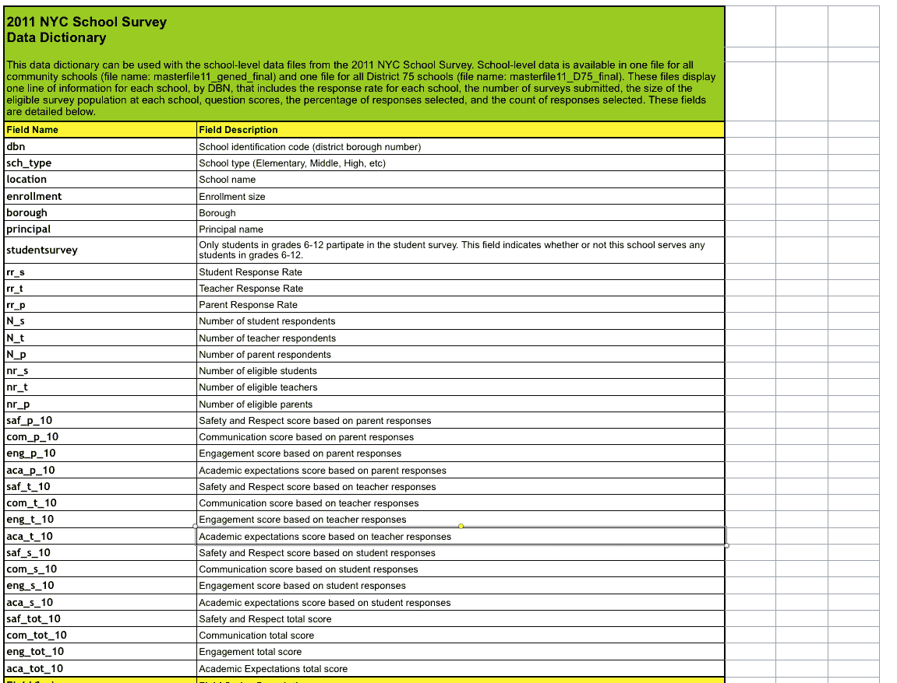
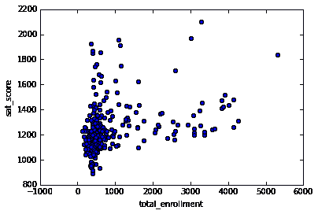
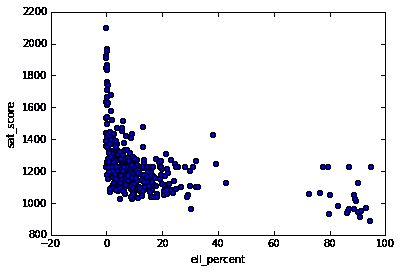
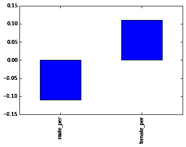
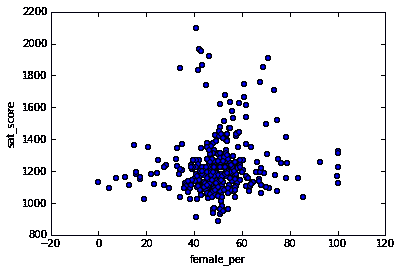

# 构建数据科学组合:用数据讲故事

> 原文：<https://www.dataquest.io/blog/data-science-portfolio-project/>

June 2, 2016

这是关于如何构建数据科学组合的系列文章中的第一篇。你可以在文章的底部找到本系列其他文章的链接。

数据科学公司在做出招聘决定时，越来越多地考虑投资组合。其中一个原因是投资组合是判断一个人真实技能的最佳方式。对你来说，好消息是投资组合完全在你的掌控之中。如果你投入一些工作，你可以做出一个让公司印象深刻的优秀投资组合。

制作高质量作品集的第一步是要知道要展示什么技能。公司希望数据科学家具备的主要技能，也就是他们希望投资组合展示的主要技能是:

*   通讯能力
*   与他人合作的能力
*   技术能力
*   对数据进行推理的能力
*   主动的动机和能力

任何好的投资组合都将由多个项目组成，每个项目都可能展示上述 1-2 点。这是一个系列的第一篇文章，将介绍如何制作一个全面的数据科学投资组合。在本帖中，我们将介绍如何为数据科学作品集制作第一个项目，以及如何使用数据讲述一个有效的故事。最后，你会有一个项目来展示你的沟通能力，以及你对数据进行推理的能力。

## 用数据讲故事

数据科学从根本上讲是关于沟通的。你会在数据中发现一些见解，然后想出一种有效的方式将这种见解传达给其他人，然后向他们推销你提出的行动方案。数据科学中最关键的技能之一是能够使用数据讲述一个有效的故事。一个有效的故事可以让你的见解更有说服力，并帮助他人理解你的想法。

数据科学环境中的故事是围绕您发现了什么、如何发现以及它的意义的叙述。一个例子可能是发现你公司的收入在去年下降了 20%。仅仅陈述这一事实是不够的——你还必须传达收入下降的原因，以及如何潜在地解决这个问题。

用数据讲述故事的主要组成部分是:

*   理解和设置上下文
*   探索多个角度
*   使用引人注目的可视化
*   使用不同的数据源
*   有一致的叙述

有效用数据讲故事的最好工具是 [Jupyter 笔记本](https://www.jupyter.org)。如果你不熟悉，[这里有一个很好的教程。Jupyter notebook 允许您交互式地探索数据，然后在各种站点上共享您的结果，包括 Github。分享你的结果有助于合作，因此其他人可以扩展你的分析。](https://www.dataquest.io/blog/python-data-science/)

在本文中，我们将使用 Jupyter notebook，以及 Pandas 和 matplotlib 等 Python 库。

## 为您的数据科学项目选择主题

创建项目的第一步是确定你的主题。你希望话题是你感兴趣的，并且有动力去探索。很明显，当人们只是为了做项目而做项目，当人们做项目是因为他们真的对探索数据感兴趣。在这一步花费额外的时间是值得的，所以确保你找到了你真正感兴趣的东西。

找到主题的一个好方法是浏览不同的数据集，看看哪些看起来有趣。以下是一些不错的网站:

*   Data.gov 包含政府数据。
*   [/r/datasets](https://reddit.com/r/datasets) —拥有数百个有趣数据集的子编辑。
*   [Awesome datasets](https://github.com/caesar0301/awesome-public-datasets)—Github 上托管的数据集列表。
*   [寻找数据集的 17 个地方](https://www.dataquest.io/blog/free-datasets-for-projects/) —一篇包含 17 个数据源的博客文章，以及来自每个数据源的数据集示例。

在现实世界的数据科学中，您通常不会找到一个可以浏览的好的单一数据集。您可能必须聚合不同的数据源，或者进行大量的数据清理。如果一个话题是你非常感兴趣的，那么在这里做同样的事情是值得的，这样你可以更好地展示你的技能。

出于本文的目的，我们将使用纽约市公立学校的数据，这些数据可以在[这里](https://data.cityofnewyork.us/browse?category=Education)找到。

## 选择一个主题

能够将项目从头到尾进行下去是很重要的。为了做到这一点，限制项目的范围，让它成为我们知道自己能完成的事情，会很有帮助。在一个已经完成的项目中添加东西比完成一个你似乎永远没有足够动力去完成的项目更容易。

在这种情况下，我们将关注高中生的 SAT 分数，以及他们的各种人口统计和其他信息。SAT，即学术能力测试，是美国高中生在申请大学之前参加的一项考试。大学在做录取决定时会考虑考试成绩，所以在这方面做得好是相当重要的。考试分为 3 个部分，每个部分满分为 800 分。总分满分 2400(虽然这个来回换了几次，但是这个数据集中的分数都是满分 2400)。高中通常以平均 SAT 成绩排名，高 SAT 成绩被认为是一个学区有多好的标志。

有人指控 SAT 对美国的某些种族群体不公平，所以对纽约市的数据进行分析将有助于揭示 SAT 的公平性。

我们有一个 SAT 成绩数据集[在这里](https://data.cityofnewyork.us/Education/SAT-Results/f9bf-2cp4)，还有一个数据集包含每个高中的信息[在这里](https://data.cityofnewyork.us/Education/DOE-High-School-Directory-2014-2015/n3p6-zve2)。这些将构成我们项目的基础，但我们需要添加更多信息来创建令人信服的分析。

## 补充数据

一旦你有了一个好的主题，最好去寻找其他可以增强主题或者给你更多深度去探索的数据集。提前做这些是有好处的，这样在构建项目时，您就有尽可能多的数据可以探索。数据太少可能意味着你过早放弃你的项目。

在这种情况下，在同一网站上有几个相关的数据集，涵盖了人口统计信息和考试分数。

以下是我们将使用的所有数据集的链接:

*   [学校 SAT 成绩](https://data.cityofnewyork.us/Education/SAT-Results/f9bf-2cp4) —纽约市每所高中的 SAT 成绩。
*   [学校出勤](https://data.cityofnewyork.us/Education/School-Attendance-and-Enrollment-Statistics-by-Dis/7z8d-msnt) —纽约市每所学校的出勤信息。
*   [数学测试结果](https://data.cityofnewyork.us/Education/NYS-Math-Test-Results-By-Grade-2006-2011-School-Le/jufi-gzgp) —纽约市每所学校的数学测试结果。
*   [班级人数](https://data.cityofnewyork.us/Education/2010-2011-Class-Size-School-level-detail/urz7-pzb3) —纽约市每所学校的班级人数信息。
*   [AP 考试成绩](https://data.cityofnewyork.us/Education/AP-College-Board-2010-School-Level-Results/itfs-ms3e) —各高中跳级考试成绩。在美国，通过 AP 考试可以获得大学学分。
*   [毕业结果](https://data.cityofnewyork.us/Education/Graduation-Outcomes-Classes-Of-2005-2010-School-Le/vh2h-md7a) —毕业学生的百分比，以及其他结果信息。
*   [人口统计](https://data.cityofnewyork.us/Education/School-Demographics-and-Accountability-Snapshot-20/ihfw-zy9j) —每个学校的人口统计信息。
*   [学校调查](https://data.cityofnewyork.us/Education/NYC-School-Survey-2011/mnz3-dyi8) —对每个学校的家长、老师和学生的调查。
*   [学区地图](https://data.cityofnewyork.us/Education/School-Districts/r8nu-ymqj) —包含学区的布局信息，以便我们绘制出它们的地图。

所有这些数据集都是相互关联的，我们可以在进行任何分析之前将它们结合起来。

## 获取背景信息

在开始分析数据之前，研究一些背景信息是有用的。在这种情况下，我们知道一些有用的事实:

*   纽约市被分成几个区，这些区本质上是不同的区域。
*   纽约市的学校分为几个学区，每个学区可以包含几十所学校。
*   并非所有数据集中的所有学校都是高中，因此我们需要进行一些数据清理。
*   纽约市的每所学校都有一个独特的代码，称为`DBN`，或者区编号。
*   通过按地区汇总数据，我们可以使用地区绘图数据来绘制各区之间的差异。

## 理解数据

为了真正理解数据的上下文，您需要花时间探索和阅读数据。在这种情况下，上面的每个链接都有数据描述，以及相关的列。看起来我们有高中生 SAT 分数的数据，以及其他包含人口统计和其他信息的数据集。

我们可以运行一些代码来读入数据。我们将使用 [Jupyter 笔记本](https://jupyter.org/)来探索数据。以下代码将:

*   遍历我们下载的每个数据文件。
*   将文件读入[熊猫数据帧](https://pandas.pydata.org/pandas-docs/stable/generated/pandas.DataFrame.html)。
*   将每个数据帧放入 Python 字典中。

```py
import pandas
import numpy as np
files = ["ap_2010.csv", "class_size.csv", "demographics.csv", "graduation.csv", "hs_directory.csv", "math_test_results.csv", "sat_results.csv"]
data = {}
for f in files:
d = pandas.read_csv("schools/{0}".format(f))
data[f.replace(".csv", "")] = d
```

一旦我们读入数据，我们就可以在数据帧上使用  方法来打印每个数据帧的前`5`行:

```py
for k,v in data.items():
print("\n" + k + "\n")
print(v.head())
```

```py
math_test_results
DBN Grade Year Category Number Tested Mean Scale Score Level 1 # \
0 01M015 3 2006 All Students 39 667 21 01M015 3 2007 All Students 31 672 22 01M015 3 2008 All Students 37 668 03 01M015 3 2009 All Students 33 668 04 01M015 3 2010 All Students 26 677 6 Level 1 % Level 2 # Level 2 % Level 3 # Level 3 % Level 4 # Level 4 % \0 5.1% 11 28.2% 20 51.3% 6 15.4%1 6.5% 3 9.7% 22 71% 4 12.9%2 0% 6 16.2% 29 78.4% 2 5.4%3 0% 4 12.1% 28 84.8% 1 3%4 23.1% 12 46.2% 6 23.1% 2 7.7% Level 3+4 # Level 3+4 %0 26 66.7%1 26 83.9%2 31 83.8%3 29 87.9%4 8 30.8%ap_2010 DBN SchoolName AP Test Takers \0 01M448  UNIVERSITY NEIGHBORHOOD H.S. 391 01M450 EAST SIDE COMMUNITY HS 192 01M515 LOWER EASTSIDE PREP 243 01M539 NEW EXPLORATIONS SCI,TECH,MATH 2554 02M296 High School of Hospitality Management s Total Exams Taken Number of Exams with scores 3 4 or 50 49 101 21 s2 26 243 377 1914 s ssat_results DBN SCHOOL NAME \0 01M292 HENRY STREET SCHOOL FOR INTERNATIONAL STUDIES1 01M448 UNIVERSITY NEIGHBORHOOD HIGH SCHOOL2 01M450 EAST SIDE COMMUNITY SCHOOL3 01M458 FORSYTH SATELLITE ACADEMY4 01M509 MARTA VALLE HIGH SCHOOL Num of SAT Test Takers SAT Critical Reading Avg. Score SAT Math Avg. Score \0 29 355 4041 91 383 4232 70 377 4023 7 414 4014 44 390 433 SAT Writing Avg. Score0 3631 3662 3703 3594 384class_size CSD BOROUGH SCHOOL CODE SCHOOL NAME GRADE PROGRAM TYPE \0 1 M M015 P.S. 015 Roberto Clemente 0K GEN ED1 1 M M015 P.S. 015 Roberto Clemente 0K CTT2 1 M M015 P.S. 015 Roberto Clemente 01 GEN ED3 1 M M015 P.S. 015 Roberto Clemente 01 CTT4 1 M M015 P.S. 015 Roberto Clemente 02 GEN ED CORE SUBJECT (MS CORE and 9-12 ONLY) CORE COURSE (MS CORE and 9-12 ONLY) \0 - -1 - -2 - -3 - -4 - - SERVICE CATEGORY(K-9* ONLY) NUMBER OF STUDENTS / SEATS FILLED \0 - 19.01 - 21.02 - 17.03 - 17.04 - 15.0 NUMBER OF SECTIONS AVERAGE CLASS SIZE SIZE OF SMALLEST CLASS \0 1.0 19.0 19.01 1.0 21.0 21.02 1.0 17.0 17.03 1.0 17.0 17.04 1.0 15.0 15.0 SIZE OF LARGEST CLASS DATA SOURCE SCHOOLWIDE PUPIL-TEACHER RATIO0 19.0 ATS NaN1 21.0 ATS NaN2 17.0 ATS NaN3 17.0 ATS NaN4 15.0 ATS NaNdemographics DBN Name schoolyear fl_percent frl_percent \0 01M015 P.S. 015 ROBERTO CLEMENTE 20052006 89.4 NaN1 01M015 P.S. 015 ROBERTO CLEMENTE 20062007 89.4 NaN2 01M015 P.S. 015 ROBERTO CLEMENTE 20072008 89.4 NaN3 01M015 P.S. 015 ROBERTO CLEMENTE 20082009 89.4 NaN4 01M015 P.S. 015 ROBERTO CLEMENTE 20092010 96.5 total_enrollment prek k grade1 grade2 ... black_num black_per \0 281 15 36 40 33 ... 74 26.31 243 15 29 39 38 ... 68 28.02 261 18 43 39 36 ... 77 29.53 252 17 37 44 32 ... 75 29.84 208 16 40 28 32 ... 67 32.2 hispanic_num hispanic_per white_num white_per male_num male_per female_num \0 189 67.3 5 1.8 158.0 56.2 123.01 153 63.0 4 1.6 140.0 57.6 103.02 157 60.2 7 2.7 143.0 54.8 118.03 149 59.1 7 2.8 149.0 59.1 103.04 118 56.7 6 2.9 124.0 59.6 84.0 female_per0 43.81 42.42 45.23 40.94 40.4[5 rows x 38 columns]graduation Demographic DBN School Name Cohort \0 Total Cohort 01M292 HENRY STREET SCHOOL FOR INTERNATIONAL 20031 Total Cohort 01M292 HENRY STREET SCHOOL FOR INTERNATIONAL 20042 Total Cohort 01M292 HENRY STREET SCHOOL FOR INTERNATIONAL 20053 Total Cohort 01M292 HENRY STREET SCHOOL FOR INTERNATIONAL 20064 Total Cohort 01M292 HENRY STREET SCHOOL FOR INTERNATIONAL 2006 Aug Total Cohort Total Grads - n Total Grads - % of cohort Total Regents - n \0 5 s s s1 55 37 67.3% 172 64 43 67.2% 273 78 43 55.1% 364 78 44 56.4% 37 Total Regents - % of cohort Total Regents - % of grads \0 s s1 30.9% 45.9%2 42.2% 62.8%3 46.2% 83.7%4 47.4% 84.1% ... Regents w/o Advanced - n \0 ... s1 ... 172 ... 273 ... 364 ... 37 Regents w/o Advanced - % of cohort Regents w/o Advanced - % of grads \0 s s1 30.9% 45.9%2 42.2% 62.8%3 46.2% 83.7%4 47.4% 84.1% Local - n Local - % of cohort Local - % of grads Still Enrolled - n \0 s s s s1 20 36.4% 54.1% 152 16 25% 37.200000000000003% 93 7 9% 16.3% 164 7 9% 15.9% 15 Still Enrolled - % of cohort Dropped Out - n Dropped Out - % of cohort0 s s s1 27.3% 3 5.5%2 14.1% 9 14.1%3 20.5% 11 14.1%4 19.2% 11 14.1%[5 rows x 23 columns]hs_directory dbn school_name boro \0 17K548 Brooklyn School for Music & Theatre Brooklyn1 09X543 High School for Violin and Dance Bronx2 09X327 Comprehensive Model School Project M.S. 327 Bronx3 02M280 Manhattan Early College School for Advertising Manhattan4 28Q680 Queens Gateway to Health Sciences Secondary Sc... Queens building_code phone_number fax_number grade_span_min grade_span_max \0 K440 718-230-6250 718-230-6262 9 121 X400 718-842-0687 718-589-9849 9 122 X240 718-294-8111 718-294-8109 6 123 M520 718-935-3477 NaN 9 104 Q695 718-969-3155 718-969-3552 6 12 expgrade_span_min expgrade_span_max \0 NaN NaN1 NaN NaN2 NaN NaN3 9 14.04 NaN NaN ... \0 ...1 ...2 ...3 ...4 ... priority02 \0 Then to New York City residents1 Then to New York City residents who attend an ...2 Then to Bronx students or residents who attend...3 Then to New York City residents who attend an ...4 Then to Districts 28 and 29 students or residents priority03 \0 NaN1 Then to Bronx students or residents2 Then to New York City residents who attend an ...3 Then to Manhattan students or residents4 Then to Queens students or residents priority04 priority05 \0 NaN NaN1 Then to New York City residents NaN2 Then to Bronx students or residents Then to New York City residents3 Then to New York City residents NaN4 Then to New York City residents NaN priority06 priority07 priority08 priority09 priority10 \0 NaN NaN NaN NaN NaN1 NaN NaN NaN NaN NaN2 NaN NaN NaN NaN NaN3 NaN NaN NaN NaN NaN4 NaN NaN NaN NaN NaN Location 10 883 Classon Avenue\nBrooklyn, NY 11225\n(40.67...1 1110 Boston Road\nBronx, NY 10456\n(40.8276026...2 1501 Jerome Avenue\nBronx, NY 10452\n(40.84241...3 411 Pearl Street\nNew York, NY 10038\n(40.7106...4 160-20 Goethals Avenue\nJamaica, NY 11432\n(40...[5 rows x 58 columns]
```

我们可以开始在数据集中看到一些有用的模式:

*   大多数数据集包含一个`DBN`列
*   一些字段看起来很适合映射，特别是`Location 1`，它包含了一个更大的字符串中的坐标。
*   一些数据集似乎包含每个学校的多行(重复的 DBN 值)，这意味着我们必须做一些预处理。

## 统一数据

为了更容易地处理数据，我们需要将所有单独的数据集统一成一个数据集。这将使我们能够快速比较数据集之间的列。为了做到这一点，我们首先需要找到一个公共列来统一它们。查看上面的输出，似乎`DBN`可能是那个公共列，因为它出现在多个数据集中。

如果我们用谷歌搜索`DBN New York City Schools`，我们会在这里找到，这解释了`DBN`是每个学校的唯一代码。当浏览数据集，尤其是政府数据集时，通常需要做一些检测工作来弄清楚每一列的含义，甚至每个数据集是什么。

现在的问题是，两个数据集`class_size`和`hs_directory`没有`DBN`字段。在`hs_directory`数据中，它只是被命名为`dbn`，所以我们可以重命名该列，或者将其复制到一个名为`DBN`的新列中。在`class_size`数据中，我们需要尝试不同的方法。

`DBN`列如下所示:

```py
data["demographics"]["DBN"].head()
```

```py
0 01M015
1 01M015
2 01M015
3 01M015
4 01M015
Name: DBN, dtype: object
```

如果我们查看`class_size`数据，下面是我们在第一个`5`行中看到的内容:

```py
data["class_size"].head()
```

|  | civil service department 文官部 | 自治的市镇 | 学校代码 | 学校名称 | 等级 | 程序类型 | 核心科目(仅限 MS CORE 和 9-12) | 核心课程(仅限 MS CORE 和 9-12) | 服务类别(仅限 K-9* | 学生人数/座位数 | 部分数量 | 平均班级人数 | 最小班级的规模 | 最大班级的规模 | 数据源 | 全校师生比率 |
| --- | --- | --- | --- | --- | --- | --- | --- | --- | --- | --- | --- | --- | --- | --- | --- | --- |
| Zero | one | M | M015 | 附言 015 罗伯托·克莱门特 | 0K | GEN ED | – | – | – | Nineteen | One | Nineteen | Nineteen | Nineteen | 声音传输系统(Acoustic Transmission System) | 圆盘烤饼 |
| one | one | M | M015 | 附言 015 罗伯托·克莱门特 | 0K | 同ＣAPITAL TRANSFER TAX | – | – | – | Twenty-one | One | Twenty-one | Twenty-one | Twenty-one | 声音传输系统(Acoustic Transmission System) | 圆盘烤饼 |
| Two | one | M | M015 | 附言 015 罗伯托·克莱门特 | 01 | GEN ED | – | – | – | Seventeen | One | Seventeen | Seventeen | Seventeen | 声音传输系统(Acoustic Transmission System) | 圆盘烤饼 |
| three | one | M | M015 | 附言 015 罗伯托·克莱门特 | 01 | 同ＣAPITAL TRANSFER TAX | – | – | – | Seventeen | One | Seventeen | Seventeen | Seventeen | 声音传输系统(Acoustic Transmission System) | 圆盘烤饼 |
| four | one | M | M015 | 附言 015 罗伯托·克莱门特 | 02 | GEN ED | – | – | – | Fifteen | One | Fifteen | Fifteen | Fifteen | 声音传输系统(Acoustic Transmission System) | 圆盘烤饼 |

正如你在上面看到的，看起来`DBN`实际上是`CSD`、`BOROUGH`和`SCHOOL CODE`的组合。对于那些不熟悉纽约市的人来说，纽约市是由`5`区组成的。每个行政区都是一个组织单位，大小相当于一个相当大的美国城市。`DBN`代表`District Borough Number`。看起来`CSD`是行政区，`BOROUGH`是行政区，当与`SCHOOL CODE`组合在一起时，就形成了`DBN`。没有系统化的方法在数据中找到这样的见解，这需要一些探索和尝试才能弄清楚。

现在我们知道如何构建`DBN`，我们可以将它添加到`class_size`和`hs_directory`数据集中:

```py
data["class_size"]["DBN"] = data["class_size"].apply(lambda x: "{0:02d}{1}".format(x["CSD"], x["SCHOOL CODE"]), axis=1)
data["hs_directory"]["DBN"] = data["hs_directory"]["dbn"]
```

### 在调查中添加

最值得关注的潜在数据集之一是关于学校质量的学生、家长和教师调查数据集。这些调查包括每个学校的感知安全、学术标准等信息。在我们合并数据集之前，让我们添加调查数据。在现实世界的数据科学项目中，当您在分析中途时，您经常会遇到有趣的数据，并且会想要合并它。使用像 Jupyter notebook 这样的灵活工具，您可以快速添加一些额外的代码，并重新运行您的分析。

在这种情况下，我们将把调查数据添加到我们的`data`字典中，然后合并所有数据集。调查数据由`2`个文件组成，一个针对所有学校，一个针对学区`75`。我们需要编写一些代码来组合它们。在下面的代码中，我们将:

*   使用`windows-1252`文件编码读取所有学校的调查。
*   使用`windows-1252`文件编码阅读第 75 区学校的调查。
*   添加一个标志来指示每个数据集属于哪个学区。
*   在数据帧上使用 [concat](https://pandas.pydata.org/pandas-docs/stable/generated/pandas.concat.html) 方法将数据集合并成一个数据集。

```py
survey1 = pandas.read_csv("schools/survey_all.txt", delimiter="\t", encoding='windows-1252')
survey2 = pandas.read_csv("schools/survey_d75.txt", delimiter="\t", encoding='windows-1252')
survey1["d75"] = False
survey2["d75"] = True
survey = pandas.concat([survey1, survey2], axis=0)
```

一旦我们把调查结合起来，还有一个额外的复杂因素。我们希望最大限度地减少组合数据集中的列数，这样我们就可以轻松地比较列并找出相关性。不幸的是，调查数据中有许多列对我们来说不是很有用:

```py
survey.head()
```

|  | 名词短语 | 南加大 | N_t | aca_p_11 | 阿卡 _s_11 | aca_t_11 | aca_tot_11 | 十亿 | com_p_11 | com_s_11 | … | t_q8c_1 | t_q8c_2 | t_q8c_3 | t_q8c_4 | t_q9 | t_q9_1 | t_q9_2 | t_q9_3 | t_q9_4 | t_q9_5 |
| --- | --- | --- | --- | --- | --- | --- | --- | --- | --- | --- | --- | --- | --- | --- | --- | --- | --- | --- | --- | --- | --- |
| Zero | Ninety | 圆盘烤饼 | Twenty-two | Seven point eight | 圆盘烤饼 | Seven point nine | Seven point nine | M015 | Seven point six | 圆盘烤饼 | … | Twenty-nine | Sixty-seven | Five | Zero | 圆盘烤饼 | Five | Fourteen | Fifty-two | Twenty-four | Five |
| one | One hundred and sixty-one | 圆盘烤饼 | Thirty-four | Seven point eight | 圆盘烤饼 | Nine point one | Eight point four | M019 | Seven point six | 圆盘烤饼 | … | Seventy-four | Twenty-one | Six | Zero | 圆盘烤饼 | Three | Six | Three | Seventy-eight | Nine |
| Two | Three hundred and sixty-seven | 圆盘烤饼 | Forty-two | Eight point six | 圆盘烤饼 | Seven point five | Eight | M020 | Eight point three | 圆盘烤饼 | … | Thirty-three | Thirty-five | Twenty | Thirteen | 圆盘烤饼 | Three | Five | Sixteen | Seventy | Five |
| three | One hundred and fifty-one | One hundred and forty-five | Twenty-nine | Eight point five | Seven point four | Seven point eight | Seven point nine | M034 | Eight point two | Five point nine | … | Twenty-one | Forty-five | Twenty-eight | Seven | 圆盘烤饼 | Zero | Eighteen | Thirty-two | Thirty-nine | Eleven |
| four | Ninety | 圆盘烤饼 | Twenty-three | Seven point nine | 圆盘烤饼 | Eight point one | Eight | M063 | Seven point nine | 圆盘烤饼 | … | Fifty-nine | Thirty-six | Five | Zero | 圆盘烤饼 | Ten | Five | Ten | Sixty | Fifteen |

5 行× 2773 列

我们可以通过查看随调查数据一起下载的数据字典文件来解决这个问题。该文件告诉我们数据中的重要字段:



然后我们可以删除`survey`中任何无关的列:

```py
survey["DBN"] = survey["dbn"]
survey_fields = ["DBN", "rr_s", "rr_t", "rr_p", "N_s", "N_t", "N_p", "saf_p_11", "com_p_11", "eng_p_11", "aca_p_11", "saf_t_11", "com_t_11", "eng_t_10", "aca_t_11", "saf_s_11", "com_s_11", "eng_s_11", "aca_s_11", "saf_tot_11", "com_tot_11", "eng_tot_11", "aca_tot_11",]
survey = survey.loc[:,survey_fields]
data["survey"] = survey
survey.shape
```

```py
(1702, 23)
```

确保您了解每个数据集包含的内容，以及相关的列是什么，可以节省您以后的大量时间和精力。

## 压缩数据集

如果我们看一下一些数据集，包括`class_size`，我们会立即发现一个问题:

```py
data["class_size"].head()
```

|  | civil service department 文官部 | 自治的市镇 | 学校代码 | 学校名称 | 等级 | 程序类型 | 核心科目(仅限 MS CORE 和 9-12) | 核心课程(仅限 MS CORE 和 9-12) | 服务类别(仅限 K-9* | 学生人数/座位数 | 部分数量 | 平均班级人数 | 最小班级的规模 | 最大班级的规模 | 数据源 | 全校师生比率 | DBN |
| --- | --- | --- | --- | --- | --- | --- | --- | --- | --- | --- | --- | --- | --- | --- | --- | --- | --- |
| Zero | one | M | M015 | 附言 015 罗伯托·克莱门特 | 0K | GEN ED | – | – | – | Nineteen | One | Nineteen | Nineteen | Nineteen | 声音传输系统(Acoustic Transmission System) | 圆盘烤饼 | 01M015 |
| one | one | M | M015 | 附言 015 罗伯托·克莱门特 | 0K | 同ＣAPITAL TRANSFER TAX | – | – | – | Twenty-one | One | Twenty-one | Twenty-one | Twenty-one | 声音传输系统(Acoustic Transmission System) | 圆盘烤饼 | 01M015 |
| Two | one | M | M015 | 附言 015 罗伯托·克莱门特 | 01 | GEN ED | – | – | – | Seventeen | One | Seventeen | Seventeen | Seventeen | 声音传输系统(Acoustic Transmission System) | 圆盘烤饼 | 01M015 |
| three | one | M | M015 | 附言 015 罗伯托·克莱门特 | 01 | 同ＣAPITAL TRANSFER TAX | – | – | – | Seventeen | One | Seventeen | Seventeen | Seventeen | 声音传输系统(Acoustic Transmission System) | 圆盘烤饼 | 01M015 |
| four | one | M | M015 | 附言 015 罗伯托·克莱门特 | 02 | GEN ED | – | – | – | Fifteen | One | Fifteen | Fifteen | Fifteen | 声音传输系统(Acoustic Transmission System) | 圆盘烤饼 | 01M015 |

每个高中都有几行(通过重复的`DBN`和`SCHOOL NAME`字段可以看到)。然而，如果我们看一下`sat_results`数据集，它只有每个高中一行:

```py
data["sat_results"].head()
```

|  | DBN | 学校名称 | SAT 考生人数 | SAT 临界阅读平均值。得分 | SAT 数学平均成绩。得分 | SAT 写作平均成绩。得分 |
| --- | --- | --- | --- | --- | --- | --- |
| Zero | 01M292 | 亨利街国际研究学院 | Twenty-nine | Three hundred and fifty-five | Four hundred and four | Three hundred and sixty-three |
| one | 01M448 | 大学社区高中 | Ninety-one | Three hundred and eighty-three | Four hundred and twenty-three | Three hundred and sixty-six |
| Two | 01M450 | 东区社区学校 | Seventy | Three hundred and seventy-seven | Four hundred and two | Three hundred and seventy |
| three | 01M458 | 福塞斯卫星学院 | seven | Four hundred and fourteen | Four hundred and one | Three hundred and fifty-nine |
| four | 01M509 | 玛尔塔·瓦莱高中 | forty-four | Three hundred and ninety | Four hundred and thirty-three | Three hundred and eighty-four |

为了组合这些数据集，我们需要找到一种方法将像`class_size`这样的数据集压缩到每个高中只有一行。如果没有，就没有办法比较 SAT 成绩和班级规模。我们可以通过首先更好地理解数据，然后进行一些汇总来实现这一点。对于`class_size`数据集，看起来`GRADE`和`PROGRAM TYPE`对于每个学校都有多个值。通过将每个字段限制为单个值，我们可以过滤大多数重复的行。在下面的代码中，我们:

*   仅选择来自`class_size`的值，其中`GRADE`字段为`09-12`。
*   仅选择来自`class_size`的值，其中`PROGRAM TYPE`字段为`GEN ED`。
*   将`class_size`数据集按`DBN`分组，取每列的平均值。本质上，我们会找到每个学校的平均`class_size`值。
*   重置索引，因此将`DBN`作为一列添加回去。

```py
class_size = data["class_size"]
class_size = class_size[class_size["GRADE "] == "09-12"]
class_size = class_size[class_size["PROGRAM TYPE"] == "GEN ED"]
class_size = class_size.groupby("DBN").agg(np.mean)
class_size.reset_index(inplace=True)
data["class_size"] = class_size
```

### 浓缩其他数据集

接下来，我们需要压缩`demographics`数据集。这些数据是为同一所学校收集了多年的，因此每所学校都有重复的行。我们将只选择`schoolyear`字段最近可用的行:

```py
demographics = data["demographics"]
demographics = demographics[demographics["schoolyear"] == 20112012]
data["demographics"] = demographics
```

我们需要压缩`math_test_results`数据集。该数据集由`Grade`和`Year`分割。我们只能从一年中选择一个级别:

```py
data["math_test_results"] = data["math_test_results"][data["math_test_results"]["Year"] == 2011]
data["math_test_results"] = data["math_test_results"][data["math_test_results"]["Grade"] == '8']
```

最后，`graduation`需要浓缩:

```py
data["graduation"] = data["graduation"][data["graduation"]["Cohort"] == "2006"]
data["graduation"] = data["graduation"][data["graduation"]["Demographic"] == "Total Cohort"]
```

在进行项目的实质性工作之前，数据清理和探索是至关重要的。拥有良好、一致的数据集将有助于您更快地进行分析。

## 计算变量

计算变量有助于加快我们的分析速度，使我们能够更快地进行比较，并使我们能够进行我们否则无法进行的比较。我们可以做的第一件事是从各个列`SAT Math Avg. Score`、`SAT Critical Reading Avg. Score`和`SAT Writing Avg. Score`中计算出 SAT 总分。在下面的代码中，我们:

*   将每个 SAT 分数列从字符串转换为数字。
*   将所有列相加得到`sat_score`列，这是 SAT 总分。

```py
cols = ['SAT Math Avg. Score', 'SAT Critical Reading Avg. Score', 'SAT Writing Avg. Score']
for c in cols:
data["sat_results"][c] = data["sat_results"][c].convert_objects(convert_numeric=True)
data['sat_results']['sat_score'] = data['sat_results'][cols[0]] + data['sat_results'][cols[1]] + data['sat_results'][cols[2]]
```

接下来，我们需要解析出每所学校的坐标位置，这样我们就可以制作地图了。这将使我们能够画出每所学校的位置。在下面的代码中，我们:

*   解析来自`Location 1`列的纬度和经度列。
*   将`lat`和`lon`转换为数字。

```py
data["hs_directory"]['lat'] = data["hs_directory"]['Location 1'].apply(lambda x: x.split("\n")[-1].replace("(", "").replace(")", "").split(", ")[0])
data["hs_directory"]['lon'] = data["hs_directory"]['Location 1'].apply(lambda x: x.split("\n")[-1].replace("(", "").replace(")", "").split(", ")[1])
for c in ['lat', 'lon']:
data["hs_directory"][c] = data["hs_directory"][c].convert_objects(convert_numeric=True)
```

现在，我们可以打印出每个数据集，看看我们有什么:

```py
for k,v in data.items():
print(k)
print(v.head())
```

```py
math_test_results DBN Grade Year Category Number Tested Mean Scale Score \111 01M034 8 2011 All Students 48 646280 01M140 8 2011 All Students 61 665346 01M184 8 2011 All Students 49 727388 01M188 8 2011 All Students 49 658411 01M292 8 2011 All Students 49 650 Level 1 # Level 1 % Level 2 # Level 2 % Level 3 # Level 3 % Level 4 # \111 15 31.3% 22 45.8% 11 22.9% 0280 1 1.6% 43 70.5% 17 27.9% 0346 0 0% 0 0% 5 10.2% 44388 10 20.4% 26 53.1% 10 20.4% 3411 15 30.6% 25 51% 7 14.3% 2 Level 4 % Level 3+4 # Level 3+4 %111 0% 11 22.9%280 0% 17 27.9%346 89.8% 49 100%388 6.1% 13 26.5%411 4.1% 9 18.4%survey DBN rr_s rr_t rr_p N_s N_t N_p saf_p_11 com_p_11 eng_p_11 \0 01M015 NaN 88 60 NaN 22.0 90.0 8.5 7.6 7.51 01M019 NaN 100 60 NaN 34.0 161.0 8.4 7.6 7.62 01M020 NaN 88 73 NaN 42.0 367.0 8.9 8.3 8.33 01M034 89.0 73 50 145.0 29.0 151.0 8.8 8.2 8.04 01M063 NaN 100 60 NaN 23.0 90.0 8.7 7.9 8.1 ... eng_t_10 aca_t_11 saf_s_11 com_s_11 eng_s_11 aca_s_11 \0 ... NaN 7.9 NaN NaN NaN NaN1 ... NaN 9.1 NaN NaN NaN NaN2 ... NaN 7.5 NaN NaN NaN NaN3 ... NaN 7.8 6.2 5.9 6.5 7.44 ... NaN 8.1 NaN NaN NaN NaN saf_tot_11 com_tot_11 eng_tot_11 aca_tot_110 8.0 7.7 7.5 7.91 8.5 8.1 8.2 8.42 8.2 7.3 7.5 8.03 7.3 6.7 7.1 7.94 8.5 7.6 7.9 8.0[5 rows x 23 columns]ap_2010 DBN SchoolName AP Test Takers \0 01M448 UNIVERSITY NEIGHBORHOOD H.S. 391 01M450 EAST SIDE COMMUNITY HS 192 01M515 LOWER EASTSIDE PREP 243 01M539 NEW EXPLORATIONS SCI,TECH,MATH 2554 02M296 High School of Hospitality Management s Total Exams Taken Number of Exams with scores 3 4 or 50 49 101 21 s2 26 243 377 1914 s ssat_results DBN SCHOOL NAME \0 01M292 HENRY STREET SCHOOL FOR INTERNATIONAL STUDIES1 01M448 UNIVERSITY NEIGHBORHOOD HIGH SCHOOL2 01M450 EAST SIDE COMMUNITY SCHOOL3 01M458 FORSYTH SATELLITE ACADEMY4 01M509 MARTA VALLE HIGH SCHOOL Num of SAT Test Takers SAT Critical Reading Avg. Score \0 29 355.01 91 383.02 70 377.03 7 414.04 44 390.0 SAT Math Avg. Score SAT Writing Avg. Score sat_score0 404.0 363.0 1122.01 423.0 366.0 1172.02 402.0 370.0 1149.03 401.0 359.0 1174.04 433.0 384.0 1207.0class_size DBN CSD NUMBER OF STUDENTS / SEATS FILLED NUMBER OF SECTIONS \0 01M292 1 88.0000 4.0000001 01M332 1 46.0000 2.0000002 01M378 1 33.0000 1.0000003 01M448 1 105.6875 4.7500004 01M450 1 57.6000 2.733333 AVERAGE CLASS SIZE SIZE OF SMALLEST CLASS SIZE OF LARGEST CLASS \0 22.564286 18.50 26.5714291 22.000000 21.00 23.5000002 33.000000 33.00 33.0000003 22.231250 18.25 27.0625004 21.200000 19.40 22.866667 SCHOOLWIDE PUPIL-TEACHER RATIO0 NaN1 NaN2 NaN3 NaN4 NaNdemographics DBN Name schoolyear \6 01M015 P.S. 015 ROBERTO CLEMENTE 2011201213 01M019 P.S. 019 ASHER LEVY 2011201220 01M020 PS 020 ANNA SILVER 2011201227 01M034 PS 034 FRANKLIN D ROOSEVELT 2011201235 01M063 PS 063 WILLIAM MCKINLEY 20112012 fl_percent frl_percent total_enrollment prek k grade1 grade2 \6 NaN 89.4 189 13 31 35 2813 NaN 61.5 328 32 46 52 5420 NaN 92.5 626 52 102 121 8727 NaN 99.7 401 14 34 38 3635 NaN 78.9 176 18 20 30 21 ... black_num black_per hispanic_num hispanic_per white_num \6 ... 63 33.3 109 57.7 413 ... 81 24.7 158 48.2 2820 ... 55 8.8 357 57.0 1627 ... 90 22.4 275 68.6 835 ... 41 23.3 110 62.5  15 white_per male_num male_per female_num female_per6 2.1 97.0 51.3 92.0 48.713 8.5 147.0 44.8 181.0 55.220 2.6 330.0 52.7 296.0 47.327 2.0 204.0 50.9 197.0 49.135 8.5 97.0 55.1 79.0 44.9[5 rows x 38 columns]graduation Demographic DBN School Name Cohort \3 Total Cohort 01M292 HENRY STREET SCHOOL FOR INTERNATIONAL 200610 Total Cohort 01M448 UNIVERSITY NEIGHBORHOOD HIGH SCHOOL 200617 Total Cohort 01M450 EAST SIDE COMMUNITY SCHOOL 200624 Total Cohort 01M509 MARTA VALLE HIGH SCHOOL 200631 Total Cohort 01M515 LOWER EAST SIDE PREPARATORY HIGH SCHO 2006 Total Cohort Total Grads - n Total Grads - % of cohort Total Regents - n \3 78 43 55.1% 3610 124 53 42.7% 4217 90 70 77.8% 6724 84 47 56% 4031 193 105 54.4% 91 Total Regents - % of cohort Total Regents - % of grads \3 46.2% 83.7%10 33.9% 79.2%17 74.400000000000006% 95.7%24 47.6% 85.1%31 47.2% 86.7% ... Regents w/o Advanced - n \3 ... 3610 ... 3417 ... 6724 ... 2331 ... 22 Regents w/o Advanced - % of cohort Regents w/o Advanced - % of grads \3 46.2% 83.7%10 27.4% 64.2%17 74.400000000000006% 95.7%24 27.4% 48.9%31 11.4% 21% Local - n Local - % of cohort Local - % of grads Still Enrolled - n \3 7 9% 16.3% 1610 11 8.9% 20.8% 4617 3 3.3% 4.3% 1524 7 8.300000000000001% 14.9% 2531 14 7.3% 13.3% 53 Still Enrolled - % of cohort Dropped Out - n Dropped Out - % of cohort3 20.5% 11 14.1%10 37.1% 20 16.100000000000001%17 16.7% 5 5.6%24 29.8% 5 6%31 27.5% 35 18.100000000000001%[5 rows x 23 columns]hs_directory dbn school_name boro \0 17K548 Brooklyn School for Music & Theatre Brooklyn1 09X543 High School for Violin and Dance Bronx2 09X327 Comprehensive Model School Project M.S. 327 Bronx3 02M280 Manhattan Early College School for Advertising Manhattan4 28Q680 Queens Gateway to Health Sciences Secondary Sc... Queens building_code phone_number fax_number grade_span_min grade_span_max \0 K440 718-230-6250 718-230-6262 9 121 X400 718-842-0687 718-589-9849 9 122 X240 718-294-8111 718-294-8109 6 123 M520 718-935-3477 NaN 9 104 Q695 718-969-3155 718-969-3552  6 12 expgrade_span_min expgrade_span_max ... \0 NaN NaN ...1 NaN NaN ...2 NaN NaN ...3 9 14.0 ...4 NaN NaN ... priority05 priority06 priority07 priority08 \0 NaN NaN NaN NaN1 NaN NaN NaN NaN2 Then to New York City residents NaN NaN NaN3 NaN NaN NaN NaN4 NaN NaN NaN NaN priority09 priority10 Location 1 \0 NaN NaN 883 Classon Avenue\nBrooklyn, NY 11225\n(40.67...1 NaN NaN 1110 Boston Road\nBronx, NY 10456\n(40.8276026...2 NaN NaN 1501 Jerome Avenue\nBronx, NY 10452\n(40.84241...3 NaN NaN 411 Pearl Street\nNew York, NY 10038\n(40.7106...4 NaN NaN 160-20 Goethals Avenue\nJamaica, NY 11432\n(40... DBN lat lon0 17K548 40.670299 -73.9616481 09X543 40.827603 -73.9044752 09X327 40.842414 -73.9161623 02M280 40.710679 -74.0008074 28Q680 40.718810 -73.806500[5 rows x 61 columns]
```

## 组合数据集

现在我们已经完成了所有的准备工作，我们可以使用`DBN`列将数据集组合在一起。最后，我们将得到一个包含数百列的数据集，这些列来自每个原始数据集。当我们加入它们时，需要注意的是一些数据集缺少存在于`sat_results`数据集中的高中。为了解决这个问题，我们需要使用`outer`连接策略合并丢失行的数据集，这样我们就不会丢失数据。在现实世界的数据分析中，数据丢失是很常见的。能够证明推理和处理缺失数据的能力是构建投资组合的重要部分。

你可以在这里阅读不同类型的连接[。](https://pandas.pydata.org/pandas-docs/stable/merging.html)

在下面的代码中，我们将:

*   遍历`data`字典中的每个条目。
*   打印物料中非唯一 dbn 的数量。
*   决定加入策略— `inner`或`outer`。
*   使用列`DBN`将项目连接到数据框`full`。

```py
flat_data_names = [k for k,v in data.items()]
flat_data = [data[k] for k in flat_data_names]
full = flat_data[0]
for i, f in enumerate(flat_data[1:]):
name = flat_data_names[i+1]
print(name)
print(len(f["DBN"]) - len(f["DBN"].unique()))
join_type = "inner"
if name in ["sat_results", "ap_2010", "graduation"]:
join_type = "outer"
if name not in ["math_test_results"]:
full = full.merge(f, on="DBN", how=join_type)full.shape
```

```py
survey
0
ap_2010
1
sat_results
0
class_size
0
demographics
0
graduation
0
hs_directory
0
```

```py
(374, 174)
```

## 添加值

现在我们有了数据框架，我们几乎拥有了进行分析所需的所有信息。不过，还是有一些缺失的部分。我们可能希望将[跳级](https://apstudent.collegeboard.org/home)考试成绩与 SAT 成绩相关联，但是我们需要首先将这些列转换成数字，然后填入任何缺失的值:

```py
cols = ['AP Test Takers ', 'Total Exams Taken', 'Number of Exams with scores 3 4 or 5']
for col in cols:
full[col] = full[col].convert_objects(convert_numeric=True)
full[cols] = full[cols].fillna(value=0)
```

然后，我们需要计算一个`school_dist`列来表示学校的学区。这将使我们能够匹配学区，并使用我们之前下载的地区地图绘制地区级统计数据:

```py
full["school_dist"] = full["DBN"].apply(lambda x: x[:2])
```

最后，我们需要用列的平均值填充`full`中任何缺失的值，这样我们就可以计算相关性:

```py
full = full.fillna(full.mean())
```

## 计算相关性

浏览数据集并查看哪些列与您关心的列相关的一个好方法是计算相关性。这将告诉您哪些列与您感兴趣的列密切相关。我们可以通过熊猫数据帧上的 [corr](https://pandas.pydata.org/pandas-docs/stable/generated/pandas.DataFrame.corr.html) 方法来做到这一点。相关性越接近`0`，联系越弱。越靠近`1`，正相关越强，越靠近`-1`，负相关越强:

```py
full.corr()['sat_score']
```

```py
Year NaN
Number Tested 8.127817e-02
rr_s 8.484298e-02
rr_t -6.604290e-02
rr_p 3.432778e-02
N_s 1.399443e-01
N_t 9.654314e-03
N_p 1.397405e-01
saf_p_11 1.050653e-01
com_p_11 2.107343e-02
eng_p_11 5.094925e-02
aca_p_11 5.822715e-02
saf_t_11 1.206710e-01
com_t_11 3.875666e-02
eng_t_10 NaN
aca_t_11 5.250357e-02
saf_s_11 1.054050e-01
com_s_11 4.576521e-02
eng_s_11 6.303699e-02
aca_s_11 8.015700e-02
saf_tot_11 1.266955e-01
com_tot_11 4.340710e-02
eng_tot_11 5.028588e-02
aca_tot_11 7.229584e-02
AP Test Takers 5.687940e-01
Total Exams Taken 5.585421e-01
Number of Exams with scores 3 4 or 5 5.619043e-01
SAT Critical Reading Avg. Score 9.868201e-01
SAT Math Avg. Score 9.726430e-01
SAT Writing Avg. Score 9.877708e-01
...
SIZE OF SMALLEST CLASS 2.440690e-01
SIZE OF LARGEST CLASS 3.052551e-01
SCHOOLWIDE PUPIL-TEACHER RATIO NaN
schoolyear  NaN
frl_percent -7.018217e-01
total_enrollment 3.668201e-01
ell_num -1.535745e-01
ell_percent -3.981643e-01
sped_num 3.486852e-02
sped_percent -4.413665e-01
asian_num 4.748801e-01
asian_per 5.686267e-01
black_num 2.788331e-02
black_per -2.827907e-01
hispanic_num 2.568811e-02
hispanic_per -3.926373e-01
white_num 4.490835e-01
white_per 6.100860e-01
male_num 3.245320e-01
male_per -1.101484e-01
female_num 3.876979e-01
female_per 1.101928e-01
Total Cohort 3.244785e-01
grade_span_max -2.495359e-17
expgrade_span_max NaN
zip -6.312962e-02
total_students 4.066081e-01
number_programs 1.166234e-01
lat -1.198662e-01
lon -1.315241e-01
Name: sat_score, dtype: float64
```

这给了我们一些需要探索的见解:

*   总入学人数与`sat_score`密切相关，这令人惊讶，因为你会认为更关注学生的小学校会有更高的分数。
*   学校中女性的比例(`female_per`)与 s at 成绩正相关，而男性的比例(`male_per`)与 SAT 成绩负相关。
*   没有一个调查回答与 SAT 成绩高度相关。
*   SAT 成绩存在显著的种族不平等(`white_per`、`asian_per`、`black_per`、`hispanic_per`)。
*   与 SAT 成绩显著负相关。

这些项目中的每一个都是探索和讲述使用数据的故事的潜在角度。

## 设置背景

在我们深入研究数据之前，我们需要为自己和阅读我们分析的其他人设置背景。一个很好的方法是使用探索性的图表或地图。在这种情况下，我们将标出学校的位置，这将有助于读者理解我们正在探索的问题。

在下面的代码中，我们:

*   设置以纽约市为中心的地图。
*   为城市中的每所高中在地图上添加标记。
*   显示地图。

```py
import folium
from folium import plugins
schools_map = folium.Map(location=[full['lat'].mean(), full['lon'].mean()], zoom_start=10)
marker_cluster = folium.MarkerCluster().add_to(schools_map)
for name, row in full.iterrows():
folium.Marker([row["lat"], row["lon"]], popup="{0}: {1}".format(row["DBN"], row["school_name"])).add_to(marker_cluster)
schools_map.create_map('schools.html')
schools_map
```

这张地图很有帮助，但是很难看出纽约市大多数学校在哪里。相反，我们将制作一个热图:

```py
schools_heatmap = folium.Map(location=[full['lat'].mean(), full['lon'].mean()], zoom_start=10)
schools_heatmap.add_children(plugins.HeatMap([[row["lat"], row["lon"]] for name, row in full.iterrows()]))
schools_heatmap.save("heatmap.html")
schools_heatmap
```

## 区级制图

热图有利于绘制梯度图，但我们需要更有结构的东西来绘制整个城市 SAT 分数的差异。学区是可视化这些信息的好方法，因为每个学区都有自己的管理机构。纽约市有几十个学区，每个学区是一个小的地理区域。

我们可以按学区计算 SAT 分数，然后在地图上画出来。在下面的代码中，我们将:

*   按学区分组。
*   计算每个学区每列的平均值。
*   转换`school_dist`字段以删除前导的`0`，这样我们就可以匹配我们的地理区域数据。

```py
district_data = full.groupby("school_dist").agg(np.mean)
district_data.reset_index(inplace=True)
district_data["school_dist"] = district_data["school_dist"].apply(lambda x: str(int(x)))
```

我们现在可以绘制出每个学区的平均 SAT 分数。为此，我们将以 [GeoJSON](https://geojson.org/) 格式读入数据，以获得每个地区的形状，然后使用`school_dist`列将每个地区的形状与 SAT 分数进行匹配，最后创建绘图:

```py
def show_district_map(col):
geo_path = 'schools/districts.geojson'
districts = folium.Map(location=[full['lat'].mean(), full['lon'].mean()], zoom_start=10)
districts.geo_json(
geo_path=geo_path,
data=district_data,
columns=['school_dist', col],
key_on='feature.properties.school_dist',
fill_color='YlGn',
fill_opacity=0.7,
line_opacity=0.2,
)
districts.save("districts.html")
return districts
show_district_map("sat_score")
```

## 探索注册和 SAT 分数

现在，我们已经通过绘制学校的位置设置了背景，并按地区设置了 SAT 分数，查看我们分析的人对数据集背后的背景有了更好的了解。现在我们已经搭建好了舞台，我们可以开始探索我们之前发现的角度，那时我们正在寻找相关性。第一个探讨的角度是一所学校的招生人数和 SAT 成绩之间的关系。

我们可以用散点图来探究这个问题，散点图比较了所有学校的总入学人数和所有学校的 SAT 分数。

```py
full.plot.scatter(x='total_enrollment', y='sat_score')
```

```py
<matplotlib.axes._subplots.AxesSubplot at 0x10fe79978>
```



如你所见，在左下方有一个低总入学率和低 SAT 分数的聚类。除此之外，SAT 成绩和总入学人数之间似乎只有轻微的正相关。绘制相关性图可以揭示意想不到的模式。

我们可以通过获取低入学率和低 SAT 分数的学校名称来进一步探究这个问题:

```py
34 INTERNATIONAL SCHOOL FOR LIBERAL ARTS
143 NaN
148 KINGSBRIDGE INTERNATIONAL HIGH SCHOOL
203 MULTICULTURAL HIGH SCHOOL
294 INTERNATIONAL COMMUNITY HIGH SCHOOL
304 BRONX INTERNATIONAL HIGH SCHOOL
314 NaN
317 HIGH SCHOOL OF WORLD CULTURES
320 BROOKLYN INTERNATIONAL HIGH SCHOOL
329 INTERNATIONAL HIGH SCHOOL AT PROSPECT
331 IT TAKES A VILLAGE ACADEMY
351 PAN AMERICAN INTERNATIONAL HIGH SCHOO
Name: School Name, dtype: object
```

谷歌上的一些搜索显示，这些学校大多数是为学习英语的学生开设的，因此入学率很低。这项研究向我们表明，与 SAT 分数相关的不是总入学人数，而是学校的学生是否将英语作为第二语言学习。

## 探索英语语言学习者和 SAT 成绩

既然我们知道学校里英语语言学习者的比例与较低的 SAT 分数相关，我们可以探究这种关系。第`ell_percent`栏是每个学校学习英语的学生的百分比。我们可以对这种关系做一个散点图:

```py
full.plot.scatter(x='ell_percent', y='sat_score')
```

```py
<matplotlib.axes._subplots.AxesSubplot at 0x10fe824e0>
```



看起来有一群 SAT 分数高的学校也有低的平均分数。我们可以在地区一级对此进行调查，计算出每个地区英语学习者的百分比，并查看它是否与我们按地区划分的 s at 分数图相匹配:

```py
show_district_map("ell_percent")
```

从两张地区地图中我们可以看出，英语学习者比例低的地区往往 SAT 分数高，反之亦然。

## 关联调查分数和 SAT 分数

假设学生、家长和老师的调查结果与 SAT 成绩有很大的相关性是公平的。例如，学术期望高的学校往往会有更高的 SAT 分数，这是有道理的。为了测试这一理论，让我们绘制出 SAT 分数和各种调查指标:

```py
full.corr()["sat_score"][["rr_s", "rr_t", "rr_p", "N_s", "N_t", "N_p", "saf_tot_11", "com_tot_11", "aca_tot_11", "eng_tot_11"]].plot.bar()
```

```py
<matplotlib.axes._subplots.AxesSubplot at 0x114652400>
```


令人惊讶的是，最相关的两个因素是`N_p`和`N_s`，这是对调查做出回应的家长和学生的数量。两者都与总入学人数密切相关，因此很可能会被`ell_learners`所误导。另一个最相关的指标是`saf_t_11`。这就是学生、家长和老师对学校的看法。学校越安全，学生在环境中学习就越舒服，这是有道理的。然而，其他因素，如参与度、沟通和学术期望，都与 SAT 成绩无关。这可能表明 NYC 在调查中提出了错误的问题，或者考虑了错误的因素(如果他们的目标是提高 SAT 成绩，可能不是)。

## 探索种族和 SAT 分数

调查的另一个角度包括种族和 SAT 分数。有一个很大的相关差异，画出来将有助于我们理解发生了什么:

```py
full.corr()["sat_score"][["white_per", "asian_per", "black_per", "hispanic_per"]].plot.bar()
```

```py
<matplotlib.axes._subplots.AxesSubplot at 0x108166ba8>
```


看起来白人和亚裔学生比例较高与 SAT 分数较高相关，但黑人和西班牙裔学生比例较高与 SAT 分数较低相关。对于西班牙裔学生，这可能是因为有更多的新移民是英语学习者。我们可以按地区绘制西班牙裔的比例图来观察这种相关性:

```py
show_district_map("hispanic_per")
```

看起来与 ELL 百分比有一些关联，但是有必要对 SAT 分数中的这种和其他种族差异做更多的挖掘。

## SAT 成绩的性别差异

最后要探讨的角度是性别和 SAT 成绩的关系。我们注意到，学校中女性比例较高往往与 SAT 分数较高相关。我们可以用一个条形图来形象地描述这一点:

```py
full.corr()["sat_score"][["male_per", "female_per"]].plot.bar()
```

```py
<matplotlib.axes._subplots.AxesSubplot at 0x10774d0f0>
```



为了深入了解这种相关性，我们可以制作一个`female_per`和`sat_score`的散点图:

```py
full.plot.scatter(x='female_per', y='sat_score')
```

```py
<matplotlib.axes._subplots.AxesSubplot at 0x104715160>
```



看起来有一群学校的女生比例很高，SAT 分数也很高(在右上方)。我们可以得到这个集群中学校的名称:

```py
full[(full["female_per"] > 65) & (full["sat_score"] > 1400)]["School Name"]
```

```py
3 PROFESSIONAL PERFORMING ARTS HIGH SCH
92 ELEANOR ROOSEVELT HIGH SCHOOL
100 TALENT UNLIMITED HIGH SCHOOL
111 FIORELLO H. LAGUARDIA HIGH SCHOOL OF
229 TOWNSEND HARRIS HIGH SCHOOL
250 FRANK SINATRA SCHOOL OF THE ARTS HIGH SCHOOL
265 BARD HIGH SCHOOL EARLY COLLEGE
Name: School Name, dtype: object
```

搜索谷歌发现，这些都是专注于表演艺术的精英学校。这些学校的女生比例更高，SAT 分数也更高。这可能解释了较高的女性百分比和 SAT 分数之间的相关性，以及较高的男性百分比和较低的 SAT 分数之间的反向相关性。

## AP 分数

到目前为止，我们已经从人口统计学的角度看了。我们有数据可以看的一个角度是更多的学生参加跳级考试和更高的 SAT 分数之间的关系。它们之间存在关联是有道理的，因为学业成绩优异的学生往往在 SAT 考试中表现更好。

```py
full["ap_avg"] = full["AP Test Takers "] / full["total_enrollment"]
full.plot.scatter(x='ap_avg', y='sat_score')
```

```py
<matplotlib.axes._subplots.AxesSubplot at 0x11463a908>
```


看起来这两者之间确实有很强的相关性。右上角的学校很有意思，它的 SAT 分数很高，参加 AP 考试的学生比例也很高:

```py
full[(full["ap_avg"] > .3) & (full["sat_score"] > 1700)]["School Name"]
```

```py
92 ELEANOR ROOSEVELT HIGH SCHOOL
98 STUYVESANT HIGH SCHOOL
157 BRONX HIGH SCHOOL OF SCIENCE
161 HIGH SCHOOL OF AMERICAN STUDIES AT LE
176 BROOKLYN TECHNICAL HIGH SCHOOL
229 TOWNSEND HARRIS HIGH SCHOOL
243 QUEENS HIGH SCHOOL FOR THE SCIENCES A
260 STATEN ISLAND TECHNICAL HIGH SCHOOL
Name: School Name, dtype: object
```

一些谷歌搜索显示，这些大多是高选择性的学校，你需要参加考试才能进入。这些学校有很高比例的 AP 考生是有道理的。

## 结束这个故事

对于数据科学，故事永远不会真正结束。通过向其他人发布分析，您可以让他们向他们感兴趣的任何方向扩展和塑造您的分析。例如，在这篇文章中，有相当多的角度，我们完全探索了，并可以深入更多。

开始使用数据讲述故事的最好方法之一是尝试扩展或复制别人已经完成的分析。如果你决定走这条路，欢迎你在这篇文章中扩展分析，看看你能找到什么。如果你这样做，请确保[让我知道](https://twitter.com/dataquestio)，这样我就可以看看了。

## 后续步骤

如果你已经做到这一步，希望你已经很好地理解了如何用数据讲述一个故事，以及如何构建你的第一个数据科学作品集。

在 [Dataquest](https://www.dataquest.io) ，我们的互动指导项目旨在帮助您开始构建数据科学组合，向雇主展示您的技能，并获得一份数据方面的工作。如果你感兴趣，你可以[注册并免费学习我们的第一个模块](https://www.dataquest.io)。

* * *

*如果你喜欢这篇文章，你可能会喜欢阅读我们“构建数据科学组合”系列中的其他文章:*

*   *[如何建立数据科学博客](https://www.dataquest.io/blog/how-to-setup-a-data-science-blog/)。*
*   *[打造机器学习项目](https://www.dataquest.io/blog/data-science-portfolio-machine-learning/)。*
*   *[建立数据科学投资组合的关键是让你找到工作](https://www.dataquest.io/blog/build-a-data-science-portfolio/)。*
*   *[寻找数据科学项目数据集的 17 个地方](https://www.dataquest.io/blog/free-datasets-for-projects)*
*   *[如何在 Github](https://www.dataquest.io/blog/how-to-share-data-science-portfolio/)* 上展示您的数据科学作品集

## 获取免费的数据科学资源

免费注册获取我们的每周时事通讯，包括数据科学、 **Python** 、 **R** 和 **SQL** 资源链接。此外，您还可以访问我们免费的交互式[在线课程内容](/data-science-courses)！

[SIGN UP](https://app.dataquest.io/signup)