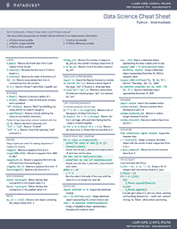

# 数据科学 Python 备忘单:中级

> 原文：<https://www.dataquest.io/blog/data-science-python-cheat-sheet/>

August 29, 2017

[](https://s3.amazonaws.com/dq-blog-files/python-cheat-sheet-intermediate.pdf)

本备忘单的可打印版本

学习数据的困难之处在于记住所有的语法。虽然在 Dataquest，我们提倡习惯于查阅 [Python 文档](https://docs.python.org/3/)，但有时有一份方便的参考资料是很好的，所以我们整理了这份备忘单来帮助你！

该备忘单是我们的 [Python 基础数据科学备忘单](https://s3.amazonaws.com/dq-blog-files/python-cheat-sheet-basic.pdf)的配套

如果你想[学习 Python](https://www.dataquest.io/blog/learn-python-the-right-way/) ，我们有一个 [Python 编程:初学者](https://www.dataquest.io/course/python-for-data-science-fundamentals/)课程，可以开始你的数据科学之旅。

[下载此备忘单的可打印 PDF 文件](https://s3.amazonaws.com/dq-blog-files/python-cheat-sheet-intermediate.pdf)

## 关键基础知识，打印和获取帮助

本备忘单假设您熟悉我们的 [Python 基础备忘单](https://www.dataquest.io/blog/python-cheat-sheet/)的内容。

`s` |一个 Python 字符串变量
`i` |一个 Python 整数变量
`f` |一个 Python 浮点变量
`l` |一个 Python 列表变量
`d` |一个 Python 字典变量

## 列表

`l.pop(3)` |从`l`返回第四个项目并将其从列表
`l.remove(x)`中删除】|删除`l`中等于`x`
`l.reverse()`的第一个项目|颠倒`l`
`l[1::2]`中项目的顺序|从`l`返回第二个项目，从第一个项目
`l[-5:]`开始。|从`l`返回最后一个`5`项目

## 用线串

`s.lower()` |返回小写版本的`s`
`s.title()` |返回每个单词的第一个字母都大写的`s`
`"23".zfill(4)`|返回`"0023"`用`0`的左填充字符串使其长度为`4`。
`s.splitlines()` |通过在任何换行符上拆分字符串返回一个列表。
*Python 字符串与列表* |
`s[:5]` |返回`s`
`"fri" + "end"`的第一个`5`字符|返回`"friend"`
`"end" in s` |如果在`s`中找到子串`"end"`则返回`True`

## 范围

Range 对象对于创建循环整数序列很有用。

`range(5)` |返回从`0`到`4`
`range(2000,2018)`的序列。|返回从`2000`到`2017`
`range(0,11,2)`的序列。|返回从`0`到`10`的序列，每项递增`2`
`range(0,-10,-1)` |返回从`0`到`-9`
`list(range(5))`的序列。|返回从`0`到`4`的列表

## 字典

`max(d, key=d.get)` |返回`d`
`min(d, key=d.get)`中最大值对应的键`d`中最小值对应的键

## 设置

`my_set = set(l)` |从`l`
`len(my_set)`返回包含*唯一*值的集合对象|返回`my_set`中对象的个数(或者，`l`
`a in my_set`中*唯一*值的个数)
|如果`my_set`中存在`a`值，则返回`True`

## 正则表达式

`import re` |导入正则表达式模块
`re.search("abc",s)` |如果在`s`中找到正则表达式`"abc"`，则返回一个`match`对象，否则`None`
`re.sub("abc","xyz",s)` |返回一个字符串，其中所有匹配正则表达式`"abc"`的实例都被替换为`"xyz"`

## 列表理解

*for 循环的单行表达式*

`[i ** 2 for i in range(10)]` |返回从`0`到`9`
`[s.lower() for s in l_strings]`的值的平方列表。|返回列表`l_strings`，其中每一项都应用了`.lower()`方法
`[i for i in l_floats if i < 0.5]` |返回小于`0.5`的`l_floats`项

## 循环功能

```py
for i, value in enumerate(l):
    print("The value of item {} is {}".format(i,value))
```

遍历列表 l，打印每一项的索引位置及其值

```py
for one, two in zip(l_one,l_two):
    print("one: {}, two: {}".format(one,two))
```

遍历两个列表`l_one`和`l_two`，并打印每个值

```py
while x < 10:
    x += 1
```

运行循环体中的代码，直到`x`的值不再小于`10`

## 日期时间

`import datetime as dt` |导入`datetime`模块
`now = dt.datetime.now()` |将代表当前时间的`datetime`对象赋给`now`
`wks4 = dt.datetime.timedelta(weeks=4)` |将代表 4 周时间跨度的`timedelta`对象赋给`wks4`
`now - wks4` |返回一个代表`now`
`newyear_2020 = dt.datetime(year=2020, month=12, day=31)`前 4 周时间的`datetime`对象|将代表 2020 年 12 月 25 日的`datetime`对象赋给`newyear_2020`
`newyear_2020.strftime("%A, %b %d, %Y")` |返回`"Thursday, Dec 31, 2020"`
`dt.datetime.strptime('Dec 31, 2020',"%b %d, %Y")` |返回一个

## 随意

`import random` |导入`random`模块
`random.random()` |返回一个介于`0.0`和`1.0`
`random.randint(0,10)`之间的随机浮点数|返回一个介于`0`和`10`
`random.choice(l)`之间的随机整数|从列表中返回一个随机项`l`

## 计数器

`from collections import Counter` |导入`Counter`类
`c = Counter(l)` |分配一个`Counter`(类似字典的)对象，该对象具有来自`l`的每个唯一项目的计数，to `c`
`c.most_common(3)` |返回来自`l`的 3 个最常见的项目

## 尝试/例外

*捕捉并处理错误*

```py
l_ints = [1, 2, 3, "", 5]
```

将一组缺少一个值的整数赋给`l_ints`

```py
l_floats = []
for i in l_ints:
    try:
        l_floats.append(float(i))
    except:
        l_floats.append(i)
```

将`l_ints`的每个值转换成一个浮点数，捕捉并处理`ValueError: could not convert string to float`:其中缺少值。

## 下载此备忘单的可打印版本

如果你想下载这个备忘单的打印版本，你可以在下面做。

[下载此备忘单的可打印 PDF 文件](https://s3.amazonaws.com/dq-blog-files/python-cheat-sheet-intermediate.pdf)